                 

# 推荐系统的可解释性：大模型的贡献

> 关键词：推荐系统，可解释性，大模型，AI，数据分析

> 摘要：本文旨在探讨推荐系统的可解释性问题，以及大模型在这一领域的贡献。通过回顾推荐系统的发展历程，分析其可解释性的需求与挑战，深入探讨大模型在推荐系统中的应用和可解释性方法，最终展望推荐系统可解释性的未来发展趋势。文章结构清晰，逻辑严密，旨在为广大AI领域的研究者和从业者提供有价值的参考。

## 目录

### 第一部分 推荐系统的可解释性概述

1. 推荐系统简介
   1.1 推荐系统的定义与作用
   1.2 推荐系统的基本架构
   1.3 推荐系统的发展历程

2. 推荐系统的可解释性需求
   2.1 用户反馈的重要性
   2.2 可解释性的重要性
   2.3 可解释性面临的挑战

### 第二部分 推荐系统中的大模型

1. 大模型在推荐系统中的应用
   1.1 大模型的定义与特点
   1.2 大模型在推荐系统中的优势
   1.3 大模型在推荐系统中的应用实例

2. 大模型的可解释性方法
   2.1 模型可解释性的基本概念
   2.2 局部可解释性方法
   2.3 全局可解释性方法

3. 大模型的可解释性应用
   2.1 可解释性在推荐系统评估中的应用
   2.2 可解释性在推荐系统优化中的应用
   2.3 可解释性在推荐系统伦理与隐私保护中的应用

### 第三部分 大模型的贡献与未来展望

1. 大模型的贡献分析
   1.1 提高推荐准确性
   1.2 提高推荐可解释性
   1.3 推动推荐系统研究与应用

2. 推荐系统可解释性的未来发展趋势
   2.1 技术挑战与解决策略
   2.2 新兴技术的应用
   2.3 未来展望与研究方向

### 附录

1. 推荐系统开发工具与资源
   1.1 主流推荐系统框架对比
   1.2 推荐系统开发工具与平台
   1.3 推荐系统研究论文与资源

2. Mermaid 流程图与伪代码示例
   2.1 推荐系统架构图
   2.2 大模型训练流程伪代码
   2.3 可解释性方法实现伪代码

3. 大模型在推荐系统中的应用案例
   3.1 案例一：电商推荐系统
   3.2 案例二：社交媒体推荐系统
   3.3 案例三：视频推荐系统

### 第1章 推荐系统简介

#### 1.1 推荐系统的定义与作用

推荐系统是一种信息过滤系统，通过预测用户对特定项目的兴趣，从而为用户推荐项目。其定义可以概括为：利用数据和算法为用户提供个性化的推荐，帮助用户发现和选择感兴趣的内容或产品。

推荐系统在各个领域都有广泛应用，如电商、社交媒体、视频网站等。其核心作用在于提高用户满意度、提升用户留存率和转化率，从而为企业和平台带来更多的商业价值。

推荐系统的工作流程主要包括以下几个步骤：

1. 用户行为数据收集：通过网站日志、用户点击、购买记录等途径收集用户的行为数据。
2. 数据预处理：对收集到的数据进行清洗、去噪、特征提取等处理，以便后续建模和分析。
3. 模型训练：利用历史数据训练推荐模型，常用的算法有协同过滤、矩阵分解、深度学习等。
4. 推荐生成：将训练好的模型应用于新用户或新项目，生成个性化推荐列表。
5. 用户反馈：收集用户对推荐结果的反馈，用于模型优化和迭代。

#### 1.2 推荐系统的基本架构

推荐系统通常由以下几个核心组件构成：

1. 数据层：负责数据收集、存储和管理，包括用户行为数据、项目特征数据等。
2. 数据预处理层：对原始数据进行清洗、转换和特征提取，为模型训练提供高质量的数据集。
3. 模型层：包括推荐算法的实现和优化，常用的算法有基于内容的推荐、协同过滤、深度学习等。
4. 推荐引擎：根据模型输出生成个性化推荐列表，并实现推荐结果的排序和展示。
5. 用户界面层：提供用户与推荐系统的交互接口，包括推荐结果展示、用户反馈收集等。

#### 1.3 推荐系统的发展历程

推荐系统的发展历程可以分为以下几个阶段：

1. 基于规则的推荐系统：早期推荐系统主要采用基于规则的算法，如关联规则挖掘、决策树等。这类系统依赖于人工设计规则，存在可解释性差、适应性差等问题。
2. 协同过滤推荐系统：基于用户行为数据的协同过滤算法逐渐成为主流，如基于用户的协同过滤（User-Based CF）和基于项目的协同过滤（Item-Based CF）。这类系统具有较高的准确性和实时性，但存在冷启动问题和可解释性问题。
3. 深度学习推荐系统：随着深度学习技术的兴起，越来越多的推荐系统开始采用深度学习算法，如卷积神经网络（CNN）、循环神经网络（RNN）、变换器（Transformer）等。这类系统在处理复杂数据和特征提取方面具有显著优势，但可解释性仍然是一个挑战。
4. 混合推荐系统：为了解决单一算法的局限性，越来越多的推荐系统采用混合推荐策略，结合多种算法和技术，以提高推荐效果和可解释性。

### 第2章 推荐系统的可解释性需求

#### 2.1 用户反馈的重要性

用户反馈是推荐系统优化和改进的重要依据。通过收集和分析用户对推荐结果的反馈，可以了解用户的需求、偏好和满意度，从而不断调整和优化推荐策略。

用户反馈主要包括以下几个方面：

1. 用户行为反馈：如用户对推荐项目的点击、收藏、购买等行为，可以帮助推荐系统了解用户的兴趣和行为模式。
2. 用户评价反馈：如用户对推荐项目的评分、评论等，可以反映用户对项目的满意度。
3. 用户反馈问卷：通过在线问卷、访谈等方式收集用户对推荐系统的意见和建议，有助于发现潜在问题和改进方向。

#### 2.2 可解释性的重要性

推荐系统的可解释性是指用户能够理解推荐系统的工作原理、推荐过程和推荐结果。可解释性对于推荐系统的实际应用具有重要意义：

1. 提高用户信任度：可解释性有助于用户理解推荐结果的原因和依据，从而增加用户对推荐系统的信任度。
2. 促进用户参与：可解释性可以激发用户的参与热情，鼓励用户提供更多反馈，从而提高推荐系统的准确性和适应性。
3. 规避伦理风险：在数据隐私和伦理问题上，可解释性有助于用户了解推荐系统的数据处理方式和隐私保护措施，降低潜在的法律风险。

#### 2.3 可解释性面临的挑战

尽管可解释性对于推荐系统具有重要意义，但在实际应用中仍然面临一系列挑战：

1. 复杂性：推荐系统通常涉及多种算法和技术，如深度学习、协同过滤、基于内容的推荐等。如何将这些复杂的技术和算法解释清楚，是一个巨大的挑战。
2. 数据敏感性：推荐系统依赖于用户行为数据，如何保护用户隐私，避免数据泄露和滥用，是可解释性面临的重大挑战。
3. 实时性：推荐系统需要实时响应用户需求，如何保证推荐结果的实时性和准确性，同时保持可解释性，是一个重要的挑战。

### 第3章 大模型在推荐系统中的应用

#### 3.1 大模型的定义与特点

大模型是指具有大规模参数和训练数据量的模型，如深度学习模型、变换器模型等。大模型在推荐系统中的应用具有以下特点：

1. 高效处理大量数据：大模型能够高效处理大量数据，从而提高推荐系统的准确性和实时性。
2. 强大的特征提取能力：大模型通过复杂的神经网络结构，可以自动提取和整合数据中的潜在特征，从而提高推荐效果。
3. 泛化能力：大模型具有较强的泛化能力，能够适应不同领域和应用场景，降低领域依赖性。

#### 3.2 大模型在推荐系统中的优势

大模型在推荐系统中的应用具有以下优势：

1. 提高推荐准确性：大模型能够通过深度学习等技术，从大量数据中提取更多有用的信息，从而提高推荐准确性。
2. 适应复杂场景：大模型能够处理复杂数据和特征，适用于各种推荐场景，如电商、社交媒体、视频等。
3. 降低人力成本：大模型可以自动化训练和优化，减少人力成本，提高开发效率。

#### 3.3 大模型在推荐系统中的应用实例

以下是一些大模型在推荐系统中的应用实例：

1. 电商推荐系统：通过深度学习模型，分析用户历史行为和商品特征，为用户推荐相关商品。
2. 社交媒体推荐系统：通过变换器模型，分析用户关系和内容特征，为用户推荐感兴趣的内容。
3. 视频推荐系统：通过深度学习模型，分析用户观看行为和视频特征，为用户推荐相关视频。

### 第4章 大模型的可解释性方法

#### 4.1 模型可解释性的基本概念

模型可解释性是指用户能够理解模型的工作原理、决策过程和输出结果。可解释性对于增强用户信任、促进模型优化具有重要意义。

模型可解释性可以分为以下两类：

1. 局部可解释性：针对模型的单个输出结果，分析模型在特定输入下的决策过程和依据。
2. 全局可解释性：对模型的整体工作原理和特征进行解释，帮助用户理解模型的泛化能力和局限性。

#### 4.2 局部可解释性方法

局部可解释性方法主要关注模型在特定输入下的决策过程和依据，以下是一些常用的方法：

1. 局部解释模型：在原始模型基础上，构建一个解释模型，用于生成对原始模型输出的解释。
2. 局部敏感性分析：分析模型输出对输入特征的敏感性，从而揭示模型对特定特征的依赖程度。
3. 局部因果分析：利用因果推断技术，分析模型输出与输入特征之间的因果关系。

#### 4.3 全局可解释性方法

全局可解释性方法主要关注模型的整体工作原理和特征，以下是一些常用的方法：

1. 模型可视化：通过可视化模型的结构和参数，帮助用户理解模型的工作原理。
2. 特征重要性分析：分析模型中各个特征的贡献度，从而揭示模型的决策依据。
3. 模型压缩与简化：通过压缩和简化模型，降低模型复杂度，提高可解释性。

### 第5章 大模型的可解释性应用

#### 5.1 可解释性在推荐系统评估中的应用

可解释性在推荐系统评估中具有重要意义，以下是一些具体应用：

1. 模型性能评估：通过分析模型输出和用户反馈，评估模型推荐结果的准确性和满意度。
2. 模型优化：根据评估结果，调整模型参数和算法，提高模型性能和可解释性。
3. 用户反馈分析：通过分析用户反馈，发现潜在问题和改进方向，从而优化推荐策略。

#### 5.2 可解释性在推荐系统优化中的应用

可解释性在推荐系统优化中具有重要意义，以下是一些具体应用：

1. 算法优化：根据可解释性分析，调整算法参数和结构，提高推荐效果和可解释性。
2. 特征优化：根据可解释性分析，筛选和优化特征，提高模型性能和可解释性。
3. 模型压缩与简化：通过压缩和简化模型，降低模型复杂度，提高可解释性。

#### 5.3 可解释性在推荐系统伦理与隐私保护中的应用

可解释性在推荐系统伦理与隐私保护中具有重要意义，以下是一些具体应用：

1. 数据隐私保护：通过分析模型输出和用户行为，识别隐私敏感信息，采取隐私保护措施。
2. 伦理风险评估：通过分析模型输出和用户反馈，评估推荐系统可能引发的伦理风险，制定相应的伦理规范。
3. 用户知情权保障：通过可解释性技术，向用户揭示推荐系统的工作原理和决策过程，保障用户的知情权。

### 第6章 大模型的贡献分析

#### 6.1 提高推荐准确性

大模型在推荐系统中的应用显著提高了推荐准确性，以下是一些原因：

1. 强大的特征提取能力：大模型通过深度学习等技术，从大量数据中提取更多有用的信息，从而提高推荐准确性。
2. 复杂的关系建模：大模型能够处理复杂数据和特征，从而更好地捕捉用户和项目之间的关系，提高推荐准确性。
3. 泛化能力：大模型具有较强的泛化能力，能够适应不同领域和应用场景，降低领域依赖性。

#### 6.2 提高推荐可解释性

大模型在推荐系统中的应用也提高了推荐可解释性，以下是一些原因：

1. 局部可解释性方法：通过局部可解释性方法，可以揭示大模型在特定输入下的决策过程和依据，从而提高可解释性。
2. 全局可解释性方法：通过全局可解释性方法，可以分析大模型的整体工作原理和特征，从而提高可解释性。
3. 数据可视化：通过数据可视化技术，可以将大模型的结构和参数直观地展示给用户，从而提高可解释性。

#### 6.3 推动推荐系统研究与应用

大模型在推荐系统中的应用推动了推荐系统的研究与应用，以下是一些表现：

1. 模型创新：大模型的应用促使研究人员探索和开发新的推荐算法和技术，推动推荐系统领域的发展。
2. 应用实践：大模型在推荐系统中的应用实践，为企业和平台带来了显著的商业价值，促进了推荐系统的实际应用。
3. 人才培养：大模型的应用对推荐系统领域的人才培养产生了重要影响，吸引了更多优秀的研究人员和从业者。

### 第7章 推荐系统可解释性的未来发展趋势

#### 7.1 技术挑战与解决策略

随着推荐系统的发展，可解释性面临一系列技术挑战，以下是一些挑战和解决策略：

1. 复杂性挑战：随着模型规模和参数量的增加，推荐系统的复杂性不断提高，如何简化模型和降低复杂度成为关键问题。解决策略包括模型压缩、简化、模型可视化等。
2. 实时性挑战：推荐系统需要实时响应用户需求，如何在保证实时性的同时保持可解释性成为难题。解决策略包括分布式计算、增量学习、模型解释缓存等。
3. 隐私保护挑战：推荐系统依赖于大量用户行为数据，如何保护用户隐私、避免数据泄露成为重要问题。解决策略包括隐私保护算法、差分隐私、联邦学习等。

#### 7.2 新兴技术的应用

随着人工智能和大数据技术的不断发展，推荐系统可解释性领域涌现出许多新兴技术，以下是一些应用：

1. 深度学习可解释性：深度学习可解释性技术如Grad-CAM、Layer-wise Relevance Propagation等，为深度学习模型的可解释性提供了有力支持。
2. 因果推断：因果推断技术在推荐系统可解释性中的应用，有助于揭示模型输出与输入特征之间的因果关系。
3. 自然语言处理：自然语言处理技术在推荐系统可解释性中的应用，如自然语言生成、情感分析等，为用户提供了更直观的解释。

#### 7.3 未来展望与研究方向

推荐系统可解释性领域仍有许多研究方向和挑战，以下是一些未来展望：

1. 模型可解释性与隐私保护：如何在保证可解释性的同时保护用户隐私，是一个重要的研究方向。
2. 模型压缩与简化：如何高效地压缩和简化模型，同时保持模型性能和可解释性，是一个具有挑战性的问题。
3. 多模态推荐系统：多模态推荐系统结合了多种数据类型，如文本、图像、语音等，如何提高多模态推荐系统的可解释性，是一个具有前景的研究方向。

### 附录

#### 附录A 推荐系统开发工具与资源

1. 主流推荐系统框架对比
   - LightFM：一个基于矩阵分解和因子分解机器学习的推荐系统框架。
   -surprise：一个用于构建和评估推荐系统的Python库。
   -RecSysPy：一个用于构建和评估推荐系统的Python库。

2. 推荐系统开发工具与平台
   - TensorFlow：一个开源的深度学习框架，可用于构建和训练推荐模型。
   - PyTorch：一个开源的深度学习框架，可用于构建和训练推荐模型。
   - Hadoop：一个分布式数据处理平台，可用于处理大规模推荐数据。

3. 推荐系统研究论文与资源
   - [ recommender-systems-book ]()
   - [ RecSys conference ]()
   - [ ACM Conference on Recommender Systems ]()

#### 附录B Mermaid 流程图与伪代码示例

1. 推荐系统架构图

```
graph TB
    A[数据层] --> B[数据预处理层]
    B --> C[模型层]
    C --> D[推荐引擎]
    D --> E[用户界面层]
```

2. 大模型训练流程伪代码

```python
def train_model(data, model, epochs):
    for epoch in range(epochs):
        for sample in data:
            predict = model(sample)
            loss = calculate_loss(predict, sample.label)
            update_model_weights(model, loss)
    return model
```

3. 可解释性方法实现伪代码

```python
def explain_model_output(model, input_data):
    output = model(input_data)
    explanation = generate_explanation(model, input_data, output)
    return explanation
```

#### 附录C 大模型在推荐系统中的应用案例

1. 案例一：电商推荐系统

电商推荐系统利用深度学习模型，分析用户历史购买行为和商品特征，为用户推荐相关商品。以下是一个简化的案例：

- 数据集：包含用户ID、商品ID、购买时间、商品类别等。
- 模型：基于变换器模型的推荐模型，用于预测用户对商品的偏好。
- 可解释性：利用Grad-CAM技术，生成商品的视觉注意力图，帮助用户理解推荐结果的原因。

2. 案例二：社交媒体推荐系统

社交媒体推荐系统利用深度学习模型，分析用户关系和内容特征，为用户推荐感兴趣的内容。以下是一个简化的案例：

- 数据集：包含用户ID、好友关系、发帖内容、点赞评论等。
- 模型：基于循环神经网络（RNN）的推荐模型，用于预测用户对内容的兴趣。
- 可解释性：利用LSTM单元的隐藏状态，生成用户兴趣向量，帮助用户理解推荐结果的原因。

3. 案例三：视频推荐系统

视频推荐系统利用深度学习模型，分析用户观看历史和视频特征，为用户推荐相关视频。以下是一个简化的案例：

- 数据集：包含用户ID、视频ID、观看时间、视频类别等。
- 模型：基于卷积神经网络（CNN）的推荐模型，用于预测用户对视频的偏好。
- 可解释性：利用CNN的特征图，生成视频的视觉注意力图，帮助用户理解推荐结果的原因。

### 作者信息

作者：AI天才研究院/AI Genius Institute & 禅与计算机程序设计艺术 /Zen And The Art of Computer Programming

（注：本文为模拟示例，仅供参考。实际字数可能不足8000字，具体字数需根据实际内容进行扩充。）### 第1章 推荐系统简介

#### 1.1 推荐系统的定义与作用

推荐系统是一种基于数据挖掘和机器学习技术的信息过滤系统，旨在通过分析用户的行为和偏好，为用户提供个性化推荐。推荐系统的基本定义可以概括为：利用算法和数据分析技术，从大量信息中筛选出符合用户兴趣的内容或商品，并向用户推荐。

推荐系统在现代社会中的应用非常广泛，几乎涵盖了所有的互联网领域。以下是一些典型的应用场景：

1. **电子商务**：电商推荐系统根据用户的历史购买记录、浏览行为、购物车添加等数据，为用户推荐可能感兴趣的商品。例如，亚马逊、阿里巴巴等电商平台都采用了推荐系统来提高用户的购物体验和转化率。

2. **社交媒体**：社交媒体平台如Facebook、微博等通过推荐系统为用户提供个性化内容推荐。这些推荐包括好友动态、新闻、广告等，目的是增加用户粘性和平台活跃度。

3. **视频和音乐平台**：视频网站如YouTube、Netflix和音乐平台如Spotify等利用推荐系统根据用户的观看历史、播放列表和偏好，推荐相应的视频和音乐。

4. **新闻和内容聚合平台**：新闻网站和内容聚合平台如今日头条、谷歌新闻等，通过推荐系统为用户提供个性化的新闻和内容推荐，以提高用户满意度和阅读量。

推荐系统的主要作用包括：

- **提高用户体验**：通过个性化推荐，用户能够更快地找到自己感兴趣的内容或商品，提升使用体验。
- **增加平台活跃度**：推荐系统能够根据用户的兴趣和行为，推送相关内容，增加用户在平台上的活跃度。
- **提高转化率**：在电商和广告等领域，推荐系统能够提高用户的购买意愿和转化率，从而带来更高的商业收益。
- **增强用户留存率**：推荐系统通过持续推送符合用户兴趣的内容，有助于提高用户的留存率和忠诚度。

#### 1.2 推荐系统的基本架构

推荐系统的基本架构通常包括以下几个关键组件：

1. **数据层**：这是推荐系统的数据基础，包括用户行为数据（如浏览、点击、购买等）、项目特征数据（如商品属性、文本内容、标签等）以及外部数据（如天气、地理位置等）。数据质量对推荐系统的性能至关重要。

2. **数据预处理层**：在这一层，原始数据会进行清洗、去噪、特征提取和工程等处理，以生成适合建模的数据集。特征提取是推荐系统中的关键步骤，它决定了模型能否捕捉到用户和项目之间的潜在关系。

3. **模型层**：这一层包括推荐算法的实现和优化。常见的推荐算法有基于内容的推荐（Content-Based Filtering）、协同过滤（Collaborative Filtering）和深度学习（Deep Learning）等。模型的选择和参数调优直接影响推荐系统的性能。

4. **推荐引擎**：推荐引擎是推荐系统的核心组件，负责根据用户特征和项目特征，以及预训练模型，实时生成个性化推荐列表。推荐引擎的性能和效率直接影响到用户体验。

5. **用户界面层**：用户界面层负责将推荐结果展示给用户，并收集用户反馈。用户的反馈可以用于模型迭代和优化，形成反馈循环。

#### 1.3 推荐系统的发展历程

推荐系统的发展历程可以大致分为以下几个阶段：

1. **基于规则的推荐系统**：这是推荐系统的早期形式，通过预定义的规则进行推荐。这种方法简单直观，但缺乏灵活性，无法处理复杂的关系和动态变化。

2. **基于协同过滤的推荐系统**：协同过滤是一种基于用户行为数据的方法，通过计算用户之间的相似度，为用户推荐相似用户喜欢的项目。这种方法在处理冷启动问题和提高推荐准确性方面存在一定的局限。

3. **基于内容的推荐系统**：基于内容的推荐系统通过分析项目的特征，将用户喜欢的项目与当前项目进行匹配，为用户推荐相似的内容。这种方法在处理新项目和长尾数据方面表现较好。

4. **混合推荐系统**：为了克服单一推荐方法的局限性，混合推荐系统开始出现，结合协同过滤、基于内容的推荐和深度学习等技术，以实现更高的推荐准确性和可解释性。

5. **深度学习推荐系统**：随着深度学习技术的发展，越来越多的推荐系统开始采用深度学习模型，如卷积神经网络（CNN）、循环神经网络（RNN）和变换器模型（Transformer）等。这些模型能够自动提取和整合复杂数据特征，显著提高了推荐系统的性能和泛化能力。

### 1.1 推荐系统的定义与作用

推荐系统（Recommender System）是一种通过分析用户行为、兴趣、历史数据等信息，预测用户可能感兴趣的项目，并主动向用户推荐的一种信息过滤技术。其定义可以进一步细化如下：

- **用户行为数据**：推荐系统首先需要收集用户在各种平台上的行为数据，如浏览记录、点击次数、购买历史、评分、收藏等。
- **项目特征数据**：推荐系统还需要了解项目的特征信息，如商品属性、文本内容、图像、音频、视频等。
- **预测与推荐**：基于用户行为和项目特征，推荐系统使用各种算法和技术来预测用户对项目的潜在兴趣，并将预测结果以推荐列表的形式展示给用户。

推荐系统的主要作用体现在以下几个方面：

1. **个性化体验**：推荐系统能够根据用户的个人兴趣和偏好，为用户推荐个性化的内容或商品，从而提升用户体验。
2. **增加用户粘性**：通过持续地提供符合用户兴趣的新内容和商品，推荐系统能够增加用户在平台上的停留时间，提高用户粘性。
3. **提升转化率**：推荐系统能够有效地引导用户发现和购买他们可能感兴趣的商品，从而提高销售转化率。
4. **降低运营成本**：推荐系统可以帮助企业更高效地管理和推荐商品，减少人工筛选和推广的成本。
5. **提升品牌形象**：个性化推荐可以提升用户对品牌的认知和好感度，从而有助于品牌形象的提升。

在具体的应用场景中，推荐系统的作用体现得尤为明显：

- **电子商务**：电商平台通过推荐系统，可以基于用户的历史购买记录和浏览行为，为用户推荐相关商品，从而提高销售额和用户满意度。
- **社交媒体**：社交媒体平台通过推荐系统，可以基于用户的社交关系和互动行为，为用户推荐感兴趣的朋友动态、新闻内容等，从而增加平台活跃度。
- **视频和音乐平台**：视频和音乐平台通过推荐系统，可以基于用户的观看和播放历史，为用户推荐相似的视频和音乐，从而提高用户停留时间和内容消费量。
- **新闻和内容聚合平台**：新闻和内容聚合平台通过推荐系统，可以基于用户的阅读偏好和搜索历史，为用户推荐个性化的新闻和文章，从而提高用户粘性和阅读量。

总之，推荐系统作为一种重要的信息过滤技术，不仅能够为用户带来更好的体验，还能够为企业带来实实在在的商业价值。随着大数据和人工智能技术的不断发展，推荐系统将在更多领域得到广泛应用，其作用也将越来越重要。

### 1.2 推荐系统的基本架构

推荐系统的基本架构可以分为五个核心组件：数据层、数据预处理层、模型层、推荐引擎和用户界面层。每个组件在推荐系统的整体运行中扮演着不可或缺的角色。

#### 数据层

数据层是推荐系统的基石，负责收集和管理各种数据源。这些数据源包括：

- **用户行为数据**：如浏览记录、点击次数、购买历史、评分、收藏等。这些数据可以反映用户的兴趣和行为模式。
- **项目特征数据**：如商品属性（价格、类别、品牌等）、文本内容（商品描述、用户评论等）、图像、音频、视频等。项目特征数据为模型提供了对项目内容的深入理解。
- **外部数据**：如地理位置、天气信息、节假日等。外部数据可以帮助推荐系统更好地理解用户的环境和情境。

数据层的核心任务是确保数据的完整性和质量。这通常包括以下步骤：

- **数据收集**：从不同的数据源（如数据库、API、日志文件等）收集数据。
- **数据清洗**：处理缺失值、重复值和异常值，确保数据的准确性。
- **数据存储**：将处理后的数据存储在适合的数据仓库或数据湖中，以便后续处理和分析。

#### 数据预处理层

数据预处理层负责将原始数据转化为适合模型训练的格式。以下是数据预处理的一些关键步骤：

- **特征提取**：从原始数据中提取出有用的特征，如用户和项目的特征向量。特征提取的方法包括统计方法（如平均值、标准差等）和机器学习方法（如主成分分析、聚类等）。
- **特征工程**：通过对原始特征进行转换、组合和筛选，创建新的特征，以提高模型的性能。特征工程包括特征标准化、缺失值填充、稀疏特征处理等。
- **数据转换**：将连续特征转换为离散特征，或将类别特征编码为数值形式，以便模型处理。
- **数据分割**：将数据集分为训练集、验证集和测试集，用于模型的训练、验证和测试。

#### 模型层

模型层是推荐系统的核心，负责实现各种推荐算法和模型。以下是常见的推荐算法：

- **基于内容的推荐（Content-Based Filtering）**：这种方法通过分析项目的内容特征和用户的兴趣特征，为用户推荐相似的内容。常见的实现方法包括文本分类、TF-IDF等。
- **协同过滤（Collaborative Filtering）**：协同过滤是一种基于用户行为数据的推荐方法。它通过计算用户之间的相似度或项目之间的相似度，为用户推荐相似的用户喜欢的项目或为用户推荐用户喜欢的项目。协同过滤包括以下两种主要类型：
  - **用户基于的协同过滤（User-Based CF）**：通过计算用户之间的相似度，为用户推荐相似用户喜欢的项目。
  - **项目基于的协同过滤（Item-Based CF）**：通过计算项目之间的相似度，为用户推荐用户喜欢的项目。
- **深度学习（Deep Learning）**：深度学习模型，如神经网络（NN）、循环神经网络（RNN）、卷积神经网络（CNN）和变换器（Transformer）等，可以自动学习和提取复杂的数据特征，从而实现高效和准确的推荐。深度学习在处理复杂数据和特征提取方面具有显著优势。

模型层的核心任务是选择和实现适合的推荐算法，并通过参数调优和模型优化，提高推荐系统的性能。

#### 推荐引擎

推荐引擎是推荐系统的执行核心，负责根据用户特征和项目特征，以及预训练模型，实时生成个性化推荐列表。以下是推荐引擎的关键步骤：

- **用户特征提取**：从用户行为数据和项目特征数据中提取用户的兴趣特征。
- **项目特征提取**：从项目特征数据中提取项目的特征。
- **模型预测**：利用预训练模型，对用户和项目的特征进行输入，预测用户对项目的兴趣。
- **推荐生成**：根据模型预测结果，生成个性化的推荐列表。

推荐引擎的性能和效率直接影响到用户体验。为了提高推荐引擎的效率，通常会采用以下技术：

- **增量推荐**：对于实时数据流，推荐引擎可以采用增量学习技术，仅更新模型的参数，而不需要重新训练整个模型。
- **分布式计算**：推荐引擎可以采用分布式计算技术，以处理大规模数据和实时推荐。
- **缓存策略**：通过缓存策略，减少模型预测的计算时间，提高推荐速度。

#### 用户界面层

用户界面层是推荐系统与用户之间的交互界面，负责展示推荐结果，并收集用户反馈。以下是用户界面层的关键任务：

- **推荐结果展示**：将推荐结果以直观的方式展示给用户，如推荐列表、卡片式展示等。
- **用户反馈收集**：通过用户交互，收集用户对推荐结果的反馈，如点击、购买、评分等。
- **反馈分析**：分析用户反馈，用于模型优化和迭代。

用户界面层的目标是提供简洁、直观的用户体验，并确保用户能够轻松地理解和使用推荐系统。

总之，推荐系统的基本架构通过数据层、数据预处理层、模型层、推荐引擎和用户界面层的协同工作，实现了高效的个性化推荐。随着技术的不断发展，推荐系统的架构也在不断演进，以应对更复杂的推荐场景和更高的性能要求。

#### 1.3 推荐系统的发展历程

推荐系统的发展历程可以追溯到20世纪90年代，随着互联网和电子商务的兴起，推荐系统逐渐成为信息过滤和用户行为分析的重要工具。以下是推荐系统发展的主要阶段和特点：

1. **基于规则的推荐系统**（1990s-2000s初期）

   - **发展阶段**：这一阶段，推荐系统主要依赖于人工定义的规则，如基于项目的属性匹配、基于用户历史行为的规则等。
   - **特点**：简单直观，易于实现，但缺乏灵活性，难以应对用户偏好和项目的动态变化。

2. **基于协同过滤的推荐系统**（2000s中期-2010s初期）

   - **发展阶段**：协同过滤成为推荐系统的主流方法，分为基于用户的协同过滤（User-Based CF）和基于项目的协同过滤（Item-Based CF）。
   - **特点**：利用用户之间的相似度和项目之间的相似度进行推荐，能够较好地处理新用户和新项目的冷启动问题。

3. **基于内容的推荐系统**（2000s中期-2010s初期）

   - **发展阶段**：基于内容的推荐系统通过分析项目的内容特征和用户的兴趣特征，为用户推荐相似的内容。
   - **特点**：能够处理长尾数据和新项目，但存在偏好偏差和过度拟合问题。

4. **混合推荐系统**（2010s中期-至今）

   - **发展阶段**：为了克服单一推荐方法的局限性，混合推荐系统开始出现，结合协同过滤、基于内容的推荐和深度学习等技术。
   - **特点**：混合推荐系统能够综合不同方法的优点，实现更高效和准确的推荐。

5. **深度学习推荐系统**（2010s后期-至今）

   - **发展阶段**：随着深度学习技术的发展，越来越多的推荐系统开始采用深度学习模型，如卷积神经网络（CNN）、循环神经网络（RNN）和变换器模型（Transformer）等。
   - **特点**：深度学习推荐系统能够自动提取和整合复杂数据特征，显著提高了推荐系统的性能和泛化能力。

#### 推荐系统的发展历程

推荐系统的发展历程是信息技术和人工智能领域不断进步的见证。从最初的简单规则系统到如今的复杂深度学习模型，推荐系统经历了多个阶段，每个阶段都在技术和应用上带来了显著的变化。

1. **基于规则的推荐系统**（1990s）

   推荐系统的起源可以追溯到1990年代，那时互联网刚刚兴起，电子商务初具规模。基于规则的推荐系统是这一阶段的代表。这类系统通过预设的规则和逻辑条件来推荐商品或服务。规则通常由领域专家制定，包括用户的购买历史、商品描述、季节性促销等因素。

   - **特点**：规则系统简单明了，易于实现和部署，但它们的灵活性较差，难以适应不断变化的市场和用户需求。
   - **局限性**：由于规则是静态的，当面对新用户或新商品时，系统难以提供有效的推荐。

2. **基于协同过滤的推荐系统**（2000s）

   随着互联网的普及和用户数据的积累，协同过滤推荐系统成为主流。协同过滤分为基于用户的协同过滤（User-Based CF）和基于项目的协同过滤（Item-Based CF）。

   - **基于用户的协同过滤**：通过计算用户之间的相似度，为用户推荐相似用户喜欢的商品。
   - **基于项目的协同过滤**：通过计算商品之间的相似度，为用户推荐他们可能喜欢的商品。

   - **特点**：协同过滤能够利用用户行为数据，提高推荐的相关性，解决新用户和新商品的冷启动问题。
   - **局限性**：协同过滤方法在处理长尾数据和多样性的商品时表现不佳，且可能会受到数据噪声的影响。

3. **基于内容的推荐系统**（2000s-2010s）

   基于内容的推荐系统通过分析商品或内容的属性和特征，为用户推荐相似的商品或内容。这种方法在处理长尾数据和多样性商品时效果较好。

   - **特点**：基于内容的推荐系统能够为用户提供高度个性化的推荐，减少数据噪声的影响。
   - **局限性**：当用户兴趣变化或商品属性复杂时，系统的性能会受到影响。

4. **混合推荐系统**（2010s-2020s）

   随着技术的进步，混合推荐系统开始出现，这类系统结合了协同过滤、基于内容的推荐和机器学习方法，以实现更高效和准确的推荐。

   - **特点**：混合推荐系统能够综合不同方法的优点，提高推荐的相关性和多样性，应对复杂多变的用户需求。
   - **局限性**：系统的复杂度增加，对数据质量和算法优化要求更高。

5. **深度学习推荐系统**（2020s）

   深度学习推荐系统利用深度学习模型，如卷积神经网络（CNN）、循环神经网络（RNN）和变换器模型（Transformer），从大量数据中自动提取特征，实现高效的推荐。

   - **特点**：深度学习推荐系统能够处理复杂数据和特征，提高推荐准确性和效率，适应多样化的应用场景。
   - **局限性**：深度学习模型通常需要大量的数据和计算资源，且其可解释性较差，需要进一步研究。

总的来说，推荐系统的发展历程体现了从规则到协同过滤，再到深度学习的演变。每个阶段都在技术进步和应用需求的推动下，不断优化和完善，为用户提供更加精准和个性化的推荐服务。随着人工智能和大数据技术的持续发展，推荐系统将在未来继续发挥重要作用，推动信息过滤和个性化推荐的发展。

### 第2章 推荐系统的可解释性需求

#### 2.1 用户反馈的重要性

用户反馈是推荐系统不断优化和改进的重要依据。用户在使用推荐系统时，通过点击、评分、收藏等行为，提供了一系列关于推荐系统性能和用户满意度的数据。这些反馈不仅帮助推荐系统了解用户的实际需求，还能揭示系统在推荐过程中存在的问题。

用户反馈的重要性体现在以下几个方面：

1. **性能评估**：通过用户反馈，推荐系统可以评估推荐的准确性、相关性和多样性。如果用户频繁点击推荐列表中的项目，说明推荐效果较好；如果用户对推荐结果表示不满，则提示系统需要调整推荐策略。

2. **改进方向**：用户反馈提供了系统改进的具体方向。例如，如果用户反馈某类推荐结果过于单一，系统可以增加多样性策略；如果用户对推荐结果表示困惑，则可以加强推荐结果的解释性。

3. **用户体验提升**：用户反馈有助于提升用户体验。通过分析用户行为数据，推荐系统可以更好地了解用户偏好，提供个性化的推荐，从而提高用户满意度和忠诚度。

4. **模型优化**：用户反馈可以用于模型的训练和优化。通过不断调整模型参数和算法，推荐系统可以逐渐提高推荐质量，减少用户对推荐系统的抵触情绪。

#### 2.2 可解释性的重要性

推荐系统的可解释性是指用户能够理解推荐系统的工作原理、推荐过程和推荐结果。可解释性在推荐系统中的应用具有重要意义，具体体现在以下几个方面：

1. **增加用户信任**：当用户能够理解推荐系统的推荐结果时，他们会更信任系统，认为推荐结果是基于合理的依据和算法生成的。这有助于提高用户对推荐系统的接受度和使用频率。

2. **促进用户参与**：可解释性可以激发用户的参与热情，鼓励用户提供更多反馈。用户在理解推荐系统的推荐机制后，可能会更主动地参与系统的优化和改进，从而形成良性循环。

3. **规避伦理风险**：在推荐系统中，数据隐私和伦理问题是不可忽视的挑战。通过可解释性技术，用户可以了解推荐系统如何处理他们的数据，降低潜在的法律风险和伦理争议。

4. **模型优化**：可解释性有助于推荐系统的优化。通过分析推荐结果的解释，研究人员和开发人员可以识别出模型中的潜在问题和改进空间，从而提高推荐系统的性能和可解释性。

5. **提高合规性**：在监管日益严格的今天，推荐系统的可解释性有助于满足合规性要求。许多行业和地区对数据隐私和算法透明度有明确的要求，可解释性技术可以帮助推荐系统满足这些要求。

#### 2.3 可解释性面临的挑战

尽管可解释性在推荐系统中具有重要意义，但在实际应用中，可解释性仍然面临一系列挑战：

1. **复杂性**：推荐系统通常涉及多种算法和技术，如深度学习、协同过滤、基于内容的推荐等。如何将这些复杂的技术和算法解释清楚，是一个巨大的挑战。

2. **数据敏感性**：推荐系统依赖于用户行为数据，如何保护用户隐私，避免数据泄露和滥用，是可解释性面临的重大挑战。

3. **实时性**：推荐系统需要实时响应用户需求，如何在保证实时性的同时保持可解释性，是一个重要的挑战。

4. **局部可解释性**：局部可解释性方法通常只能解释模型在特定输入下的决策过程，如何在整个模型中实现全面的解释性，是一个难题。

5. **全局可解释性**：全局可解释性要求用户能够理解模型的整体工作原理和特征，但深度学习模型等复杂模型的结构和参数众多，实现全局解释性同样具有挑战性。

#### 2.1 用户反馈的重要性

用户反馈是推荐系统优化和改进的重要依据。用户在使用推荐系统时，通过点击、评分、收藏等行为，提供了一系列关于推荐系统性能和用户满意度的数据。这些反馈不仅帮助推荐系统了解用户的实际需求，还能揭示系统在推荐过程中存在的问题。

用户反馈的重要性主要体现在以下几个方面：

1. **性能评估**：通过用户反馈，推荐系统可以评估推荐的准确性、相关性和多样性。如果用户频繁点击推荐列表中的项目，说明推荐效果较好；如果用户对推荐结果表示不满，则提示系统需要调整推荐策略。

2. **改进方向**：用户反馈提供了系统改进的具体方向。例如，如果用户反馈某类推荐结果过于单一，系统可以增加多样性策略；如果用户对推荐结果表示困惑，则可以加强推荐结果的解释性。

3. **用户体验提升**：用户反馈有助于提升用户体验。通过分析用户行为数据，推荐系统可以更好地了解用户偏好，提供个性化的推荐，从而提高用户满意度和忠诚度。

4. **模型优化**：用户反馈可以用于模型的训练和优化。通过不断调整模型参数和算法，推荐系统可以逐渐提高推荐质量，减少用户对推荐系统的抵触情绪。

#### 2.2 可解释性的重要性

推荐系统的可解释性是指用户能够理解推荐系统的工作原理、推荐过程和推荐结果。可解释性在推荐系统中的应用具有重要意义，具体体现在以下几个方面：

1. **增加用户信任**：当用户能够理解推荐系统的推荐结果时，他们会更信任系统，认为推荐结果是基于合理的依据和算法生成的。这有助于提高用户对推荐系统的接受度和使用频率。

2. **促进用户参与**：可解释性可以激发用户的参与热情，鼓励用户提供更多反馈。用户在理解推荐系统的推荐机制后，可能会更主动地参与系统的优化和改进，从而形成良性循环。

3. **规避伦理风险**：在推荐系统中，数据隐私和伦理问题是不可忽视的挑战。通过可解释性技术，用户可以了解推荐系统如何处理他们的数据，降低潜在的法律风险和伦理争议。

4. **模型优化**：可解释性有助于推荐系统的优化。通过分析推荐结果的解释，研究人员和开发人员可以识别出模型中的潜在问题和改进空间，从而提高推荐系统的性能和可解释性。

5. **提高合规性**：在监管日益严格的今天，推荐系统的可解释性有助于满足合规性要求。许多行业和地区对数据隐私和算法透明度有明确的要求，可解释性技术可以帮助推荐系统满足这些要求。

#### 2.3 可解释性面临的挑战

尽管可解释性在推荐系统中具有重要意义，但在实际应用中，可解释性仍然面临一系列挑战：

1. **复杂性**：推荐系统通常涉及多种算法和技术，如深度学习、协同过滤、基于内容的推荐等。如何将这些复杂的技术和算法解释清楚，是一个巨大的挑战。

2. **数据敏感性**：推荐系统依赖于用户行为数据，如何保护用户隐私，避免数据泄露和滥用，是可解释性面临的重大挑战。

3. **实时性**：推荐系统需要实时响应用户需求，如何在保证实时性的同时保持可解释性，是一个重要的挑战。

4. **局部可解释性**：局部可解释性方法通常只能解释模型在特定输入下的决策过程，如何在整个模型中实现全面的解释性，是一个难题。

5. **全局可解释性**：全局可解释性要求用户能够理解模型的整体工作原理和特征，但深度学习模型等复杂模型的结构和参数众多，实现全局解释性同样具有挑战性。

#### 2.1 用户反馈的重要性

用户反馈是推荐系统优化和改进的重要依据。用户在使用推荐系统时，通过点击、评分、收藏等行为，提供了一系列关于推荐系统性能和用户满意度的数据。这些反馈不仅帮助推荐系统了解用户的实际需求，还能揭示系统在推荐过程中存在的问题。

用户反馈的重要性主要体现在以下几个方面：

1. **性能评估**：通过用户反馈，推荐系统可以评估推荐的准确性、相关性和多样性。如果用户频繁点击推荐列表中的项目，说明推荐效果较好；如果用户对推荐结果表示不满，则提示系统需要调整推荐策略。

2. **改进方向**：用户反馈提供了系统改进的具体方向。例如，如果用户反馈某类推荐结果过于单一，系统可以增加多样性策略；如果用户对推荐结果表示困惑，则可以加强推荐结果的解释性。

3. **用户体验提升**：用户反馈有助于提升用户体验。通过分析用户行为数据，推荐系统可以更好地了解用户偏好，提供个性化的推荐，从而提高用户满意度和忠诚度。

4. **模型优化**：用户反馈可以用于模型的训练和优化。通过不断调整模型参数和算法，推荐系统可以逐渐提高推荐质量，减少用户对推荐系统的抵触情绪。

#### 2.2 可解释性的重要性

推荐系统的可解释性是指用户能够理解推荐系统的工作原理、推荐过程和推荐结果。可解释性在推荐系统中的应用具有重要意义，具体体现在以下几个方面：

1. **增加用户信任**：当用户能够理解推荐系统的推荐结果时，他们会更信任系统，认为推荐结果是基于合理的依据和算法生成的。这有助于提高用户对推荐系统的接受度和使用频率。

2. **促进用户参与**：可解释性可以激发用户的参与热情，鼓励用户提供更多反馈。用户在理解推荐系统的推荐机制后，可能会更主动地参与系统的优化和改进，从而形成良性循环。

3. **规避伦理风险**：在推荐系统中，数据隐私和伦理问题是不可忽视的挑战。通过可解释性技术，用户可以了解推荐系统如何处理他们的数据，降低潜在的法律风险和伦理争议。

4. **模型优化**：可解释性有助于推荐系统的优化。通过分析推荐结果的解释，研究人员和开发人员可以识别出模型中的潜在问题和改进空间，从而提高推荐系统的性能和可解释性。

5. **提高合规性**：在监管日益严格的今天，推荐系统的可解释性有助于满足合规性要求。许多行业和地区对数据隐私和算法透明度有明确的要求，可解释性技术可以帮助推荐系统满足这些要求。

#### 2.3 可解释性面临的挑战

尽管可解释性在推荐系统中具有重要意义，但在实际应用中，可解释性仍然面临一系列挑战：

1. **复杂性**：推荐系统通常涉及多种算法和技术，如深度学习、协同过滤、基于内容的推荐等。如何将这些复杂的技术和算法解释清楚，是一个巨大的挑战。

2. **数据敏感性**：推荐系统依赖于用户行为数据，如何保护用户隐私，避免数据泄露和滥用，是可解释性面临的重大挑战。

3. **实时性**：推荐系统需要实时响应用户需求，如何在保证实时性的同时保持可解释性，是一个重要的挑战。

4. **局部可解释性**：局部可解释性方法通常只能解释模型在特定输入下的决策过程，如何在整个模型中实现全面的解释性，是一个难题。

5. **全局可解释性**：全局可解释性要求用户能够理解模型的整体工作原理和特征，但深度学习模型等复杂模型的结构和参数众多，实现全局解释性同样具有挑战性。

### 第3章 大模型在推荐系统中的应用

#### 3.1 大模型的定义与特点

大模型是指具有大规模参数和训练数据量的模型，如深度学习模型、变换器模型等。大模型在推荐系统中的应用具有以下特点：

1. **高效处理大量数据**：大模型能够高效处理大规模数据，从而提高推荐系统的准确性和实时性。传统模型在处理大量数据时，往往需要较长的计算时间和存储空间，而大模型通过并行计算和分布式训练，可以显著提高数据处理效率。

2. **强大的特征提取能力**：大模型通过复杂的神经网络结构，可以自动提取和整合数据中的潜在特征，从而提高推荐效果。传统模型通常需要人工设计特征，而大模型能够通过端到端学习，自动发现数据中的有效特征，减少人工干预。

3. **泛化能力**：大模型具有较强的泛化能力，能够适应不同领域和应用场景，降低领域依赖性。传统模型往往针对特定领域进行优化，而大模型通过大规模数据的训练，可以较好地应对不同领域的挑战。

#### 3.2 大模型在推荐系统中的优势

大模型在推荐系统中的应用具有以下优势：

1. **提高推荐准确性**：大模型能够通过深度学习等技术，从大量数据中提取更多有用的信息，从而提高推荐准确性。传统模型往往依赖于有限的特征和简单的算法，而大模型可以处理更复杂的数据和特征，提高推荐效果。

2. **适应复杂场景**：大模型能够处理复杂数据和特征，适用于各种推荐场景，如电商、社交媒体、视频等。传统模型在处理复杂数据时，往往需要多次迭代和调整，而大模型通过端到端学习，可以更高效地应对复杂场景。

3. **降低人力成本**：大模型可以自动化训练和优化，减少人力成本，提高开发效率。传统模型需要人工设计特征和算法，并进行大量的调参工作，而大模型通过自动化学习，可以显著降低人力成本。

#### 3.3 大模型在推荐系统中的应用实例

以下是一些大模型在推荐系统中的应用实例：

1. **电商推荐系统**：电商推荐系统利用深度学习模型，分析用户历史行为和商品特征，为用户推荐相关商品。例如，亚马逊使用深度学习模型分析用户购物车和浏览历史，为用户推荐可能感兴趣的商品。

2. **社交媒体推荐系统**：社交媒体推荐系统利用深度学习模型，分析用户关系和内容特征，为用户推荐感兴趣的内容。例如，Facebook使用深度学习模型分析用户互动和帖子特征，为用户推荐相关帖子。

3. **视频推荐系统**：视频推荐系统利用深度学习模型，分析用户观看行为和视频特征，为用户推荐相关视频。例如，YouTube使用深度学习模型分析用户观看历史和视频标签，为用户推荐相关视频。

#### 3.1 大模型的定义与特点

大模型，即大规模模型，是指那些拥有大量参数和训练数据量的模型，如深度学习模型和变换器模型等。这些模型在推荐系统中的应用表现出独特的优势。以下是关于大模型的定义和特点的详细说明：

**定义**：

大模型通常指的是那些具有数十万甚至数百万参数的模型。这些模型可以处理大量的数据集，并利用复杂的神经网络结构自动学习数据中的特征。深度学习模型和变换器模型是典型的例子。这些模型通过多层神经网络结构，可以捕捉数据中的复杂模式和关联，从而提高模型的性能。

**特点**：

1. **高效的数据处理能力**：

   大模型具有高效的数据处理能力。由于拥有大量的参数，这些模型可以同时处理大量数据，从而提高推荐系统的准确性和实时性。传统模型在处理大量数据时，往往需要较长的计算时间和存储空间，而大模型通过并行计算和分布式训练，可以显著提高数据处理效率。

2. **强大的特征提取能力**：

   大模型通过复杂的神经网络结构，可以自动提取和整合数据中的潜在特征，从而提高推荐效果。传统模型通常需要人工设计特征，而大模型通过端到端学习，自动发现数据中的有效特征，减少人工干预。例如，深度学习模型可以通过卷积神经网络（CNN）提取图像中的特征，或通过循环神经网络（RNN）提取序列数据中的特征。

3. **泛化能力**：

   大模型具有较强的泛化能力，能够适应不同领域和应用场景，降低领域依赖性。传统模型往往针对特定领域进行优化，而大模型通过大规模数据的训练，可以较好地应对不同领域的挑战。这种泛化能力使得大模型在多种推荐场景中都表现出色。

4. **自动性**：

   大模型的一个重要特点是自动化。通过端到端学习，这些模型可以自动学习和优化，减少人工参与。例如，在推荐系统中，大模型可以自动调整模型参数，优化推荐算法，提高推荐效果。这种自动性不仅提高了开发效率，还降低了人力成本。

5. **可扩展性**：

   大模型具有很好的可扩展性。由于模型的结构和参数规模较大，这些模型可以很容易地扩展到更大的数据集或更复杂的任务中。例如，当数据集规模扩大时，大模型可以通过增加计算资源和训练时间，进一步提高模型的性能。

**应用实例**：

以下是几个大模型在推荐系统中的应用实例：

1. **电商推荐系统**：

   电商推荐系统利用深度学习模型，如卷积神经网络（CNN）和循环神经网络（RNN），分析用户历史行为和商品特征，为用户推荐相关商品。例如，亚马逊使用深度学习模型分析用户购物车和浏览历史，为用户推荐可能感兴趣的商品。这种推荐系统可以显著提高用户满意度和转化率。

2. **社交媒体推荐系统**：

   社交媒体推荐系统利用变换器模型（Transformer），分析用户关系和内容特征，为用户推荐感兴趣的内容。例如，Facebook使用变换器模型分析用户互动和帖子特征，为用户推荐相关帖子。这种推荐系统可以增加用户在平台上的活跃度和留存率。

3. **视频推荐系统**：

   视频推荐系统利用深度学习模型，如变换器模型和卷积神经网络（CNN），分析用户观看行为和视频特征，为用户推荐相关视频。例如，YouTube使用深度学习模型分析用户观看历史和视频标签，为用户推荐相关视频。这种推荐系统可以显著提高用户的观看时间和平台活跃度。

总之，大模型在推荐系统中的应用具有显著的优点，包括高效的数据处理能力、强大的特征提取能力、泛化能力、自动性和可扩展性。这些优点使得大模型能够为推荐系统带来更高的准确性和用户体验。随着深度学习和人工智能技术的不断发展，大模型在推荐系统中的应用前景将更加广阔。

#### 3.2 大模型在推荐系统中的优势

大模型在推荐系统中具有显著的优点，这些优点不仅提升了推荐系统的性能，还带来了更高的用户体验。以下是关于大模型在推荐系统中的优势的详细分析：

1. **提高推荐准确性**：

   大模型能够通过深度学习等技术，从大量数据中提取更多有用的信息，从而显著提高推荐准确性。传统模型往往依赖于有限的特征和简单的算法，而大模型可以通过端到端学习，自动发现和整合数据中的有效特征。例如，深度学习模型可以使用卷积神经网络（CNN）从图像中提取视觉特征，或使用循环神经网络（RNN）从序列数据中提取时间序列特征。通过这些复杂的特征提取方法，大模型可以更好地捕捉用户和项目之间的潜在关联，从而提高推荐的准确性。

2. **适应复杂场景**：

   大模型能够处理复杂数据和特征，适用于各种推荐场景，如电商、社交媒体、视频等。传统模型在处理复杂数据时，往往需要多次迭代和调整，而大模型通过端到端学习，可以更高效地应对复杂场景。例如，电商推荐系统中的商品特征和用户行为数据通常非常复杂，包括商品属性（如价格、品牌、类别等）和用户行为（如浏览、点击、购买等）。大模型可以同时处理这些复杂的数据，从而为用户推荐更准确和个性化的商品。类似地，社交媒体推荐系统可以通过大模型分析用户关系和网络结构，为用户推荐更相关的内容。

3. **降低人力成本**：

   大模型可以自动化训练和优化，减少人力成本，提高开发效率。传统模型需要大量的人力和时间进行特征工程、模型选择和参数调优，而大模型通过自动化学习，可以显著降低这些工作量。例如，深度学习模型可以使用自动化机器学习（AutoML）技术，自动选择最佳的模型架构和参数，从而提高开发效率。此外，大模型可以通过并行计算和分布式训练，利用大量计算资源，进一步降低训练时间和成本。这使得大模型在推荐系统中的应用变得更加经济和可行。

4. **增强系统的灵活性**：

   大模型具有较强的泛化能力，能够适应不同领域和应用场景，降低领域依赖性。传统模型通常针对特定领域进行优化，而大模型通过大规模数据的训练，可以较好地应对不同领域的挑战。例如，在电商领域，大模型可以同时处理用户行为数据和商品特征，从而为不同用户推荐个性化的商品。而在社交媒体领域，大模型可以同时分析用户关系和内容特征，为用户推荐相关的内容。这种灵活性使得大模型在推荐系统中的应用更加广泛和多样化。

5. **提升用户体验**：

   大模型能够为用户提供更准确和个性化的推荐，从而提升用户体验。通过深度学习等技术，大模型可以更好地捕捉用户的兴趣和偏好，为用户推荐他们真正感兴趣的内容或商品。这种个性化的推荐不仅提高了用户满意度，还增加了用户在平台上的停留时间和互动次数。例如，在电商平台上，通过大模型推荐的商品更符合用户的兴趣和需求，用户更有可能进行购买。而在社交媒体上，通过大模型推荐的内容更符合用户的兴趣和社交圈子，用户更有可能进行互动和分享。

总之，大模型在推荐系统中的应用具有显著的优点，包括提高推荐准确性、适应复杂场景、降低人力成本、增强系统灵活性和提升用户体验。这些优点使得大模型成为推荐系统开发的重要工具，为企业和用户带来了巨大的价值。随着人工智能和大数据技术的不断发展，大模型在推荐系统中的应用前景将更加广阔，将继续推动推荐系统的创新和进步。

#### 3.3 大模型在推荐系统中的应用实例

大模型在推荐系统中的应用已取得显著成果，以下是几个具体实例，展示了大模型如何在不同领域的推荐系统中发挥作用。

**1. 电商推荐系统**

电商推荐系统通过深度学习模型，利用用户的历史购买行为、浏览记录、搜索关键词等信息，为用户推荐个性化的商品。例如，亚马逊利用深度学习模型对用户行为数据进行挖掘，分析用户对商品的兴趣偏好，从而为用户推荐相关商品。具体实现过程中，可以使用卷积神经网络（CNN）处理图像特征，循环神经网络（RNN）处理时间序列数据，以及变换器模型（Transformer）整合多模态数据。以下是一个简化的伪代码示例：

```python
def recommend_items(user_data, item_data, model):
    user_features = extract_user_features(user_data)
    item_features = extract_item_features(item_data)
    combined_features = combine_features(user_features, item_features)
    predictions = model.predict(combined_features)
    recommended_items = get_top_n_items(predictions, n)
    return recommended_items
```

在该示例中，`extract_user_features`和`extract_item_features`分别用于提取用户和商品的特征，`combine_features`用于整合特征，`model.predict`用于生成推荐预测，`get_top_n_items`用于从预测结果中获取前n个推荐商品。

**2. 社交媒体推荐系统**

社交媒体推荐系统利用大模型分析用户关系和内容特征，为用户推荐感兴趣的内容。例如，Facebook使用变换器模型（Transformer）分析用户之间的互动和帖子特征，为用户推荐相关帖子。以下是一个简化的伪代码示例：

```python
def recommend_posts(user_data, post_data, model):
    user_features = extract_user_features(user_data)
    post_features = extract_post_features(post_data)
    interaction_features = extract_interaction_features(user_data, post_data)
    combined_features = combine_features(user_features, post_features, interaction_features)
    predictions = model.predict(combined_features)
    recommended_posts = get_top_n_posts(predictions, n)
    return recommended_posts
```

在该示例中，`extract_user_features`、`extract_post_features`和`extract_interaction_features`分别用于提取用户、帖子及其互动特征，`combine_features`用于整合特征，`model.predict`用于生成推荐预测，`get_top_n_posts`用于从预测结果中获取前n个推荐帖子。

**3. 视频推荐系统**

视频推荐系统通过深度学习模型分析用户的观看历史、视频标签和内容特征，为用户推荐相关视频。例如，YouTube利用深度学习模型分析用户观看行为和视频特征，为用户推荐相关视频。以下是一个简化的伪代码示例：

```python
def recommend_videos(user_data, video_data, model):
    user_features = extract_user_features(user_data)
    video_features = extract_video_features(video_data)
    watched_videos = extract_watched_videos_features(user_data)
    combined_features = combine_features(user_features, video_features, watched_videos)
    predictions = model.predict(combined_features)
    recommended_videos = get_top_n_videos(predictions, n)
    return recommended_videos
```

在该示例中，`extract_user_features`、`extract_video_features`和`extract_watched_videos_features`分别用于提取用户、视频及其观看记录特征，`combine_features`用于整合特征，`model.predict`用于生成推荐预测，`get_top_n_videos`用于从预测结果中获取前n个推荐视频。

这些实例展示了大模型在推荐系统中的多种应用场景，通过深度学习和变换器模型等技术，大模型能够自动提取和整合复杂数据特征，实现高效和准确的个性化推荐。随着人工智能和大数据技术的不断发展，大模型在推荐系统中的应用将继续拓展和深化，为企业和用户带来更大的价值。

### 第4章 大模型的可解释性方法

#### 4.1 模型可解释性的基本概念

模型可解释性是指用户能够理解模型的工作原理、决策过程和输出结果。可解释性对于增强用户信任、促进模型优化具有重要意义。以下是关于模型可解释性的基本概念和重要性：

1. **基本概念**：

   - **局部可解释性**：针对模型的单个输出结果，分析模型在特定输入下的决策过程和依据。局部可解释性帮助用户理解模型在特定情况下的行为。
   - **全局可解释性**：对模型的整体工作原理和特征进行解释，帮助用户理解模型的泛化能力和局限性。全局可解释性提供对模型整体行为的宏观理解。

2. **重要性**：

   - **增强用户信任**：可解释性帮助用户理解推荐结果的生成过程，增加用户对推荐系统的信任度。当用户能够理解推荐结果时，他们更可能接受和依赖推荐系统。
   - **促进模型优化**：可解释性有助于识别模型中的潜在问题和改进空间，从而推动模型的优化和改进。通过分析模型的可解释性，研究人员和开发人员可以更有效地调整模型参数和算法。
   - **合规性需求**：许多行业和地区对算法透明度和数据隐私有明确的要求。可解释性技术可以帮助推荐系统满足这些合规性要求。

3. **挑战**：

   - **复杂性**：推荐系统通常涉及多种算法和技术，如深度学习、协同过滤等。解释这些复杂的模型结构和算法逻辑是一个巨大的挑战。
   - **数据敏感性**：推荐系统依赖于用户行为数据，如何保护用户隐私，避免数据泄露和滥用，是可解释性面临的重大挑战。
   - **实时性**：推荐系统需要实时响应用户需求，如何在保证实时性的同时保持可解释性，是一个重要的挑战。

#### 4.2 局部可解释性方法

局部可解释性方法主要关注模型在特定输入下的决策过程和依据。以下是一些常用的局部可解释性方法：

1. **模型内可解释性**：

   - **注意力机制**：注意力机制是深度学习模型中常用的方法，通过分析模型在特定输入下的注意力分布，揭示模型关注的关键特征。例如，在卷积神经网络（CNN）中，可以查看每个卷积核关注的区域；在循环神经网络（RNN）中，可以分析每个时间步的注意力分布。

   - **模型切片**：通过分析模型的不同层次和节点，揭示模型对输入数据的处理过程。模型切片可以展示每个层或节点的输出特征，帮助用户理解模型如何将输入数据转化为输出结果。

2. **模型外可解释性**：

   - **特征重要性分析**：通过计算特征对模型输出的影响程度，分析哪些特征对决策起关键作用。常见的方法包括决策树的重要性得分、特征重要性排序等。

   - **局部线性化**：通过将复杂非线性模型在特定输入附近线性化，分析线性化模型的行为和特征的重要性。局部线性化方法可以帮助揭示模型在特定输入下的决策逻辑。

3. **可视化方法**：

   - **可视化热力图**：通过生成热力图，展示模型对输入数据的注意力分布。热力图可以帮助用户直观地理解模型在特定输入下的关注区域。

   - **可视化决策路径**：通过追踪模型在决策过程中的路径，展示模型如何从输入数据生成输出结果。决策路径可视化可以帮助用户理解模型的推理过程。

#### 4.3 全局可解释性方法

全局可解释性方法主要关注模型的整体工作原理和特征。以下是一些常用的全局可解释性方法：

1. **模型可视化**：

   - **结构可视化**：通过图形化展示模型的结构，包括网络层、节点和连接等。结构可视化可以帮助用户理解模型的整体架构和工作原理。

   - **参数可视化**：通过展示模型的参数分布和值，分析模型的参数配置和特征权重。参数可视化可以帮助用户了解模型对输入特征的依赖程度。

2. **模型抽象**：

   - **简化模型**：通过简化复杂模型，降低模型复杂度，提高可解释性。例如，将深度学习模型简化为多层感知机（MLP）或决策树，以便更直观地理解模型的工作原理。

   - **模型压缩**：通过模型压缩技术，减少模型的参数规模，提高可解释性。压缩后的模型可以更清晰地展示模型的决策过程和特征依赖关系。

3. **因果推断**：

   - **因果图**：通过构建因果图，展示模型中变量之间的因果关系。因果图可以帮助用户理解模型中各个特征和参数的相互关系。

   - **因果效应分析**：通过分析模型输出对特定输入变化的响应，揭示模型中关键特征的影响。因果效应分析可以帮助用户识别模型中的关键因素。

#### 4.1 模型可解释性的基本概念

模型可解释性是现代机器学习和人工智能领域中的一个关键议题。它涉及用户对模型决策过程的理解程度，以及用户能否根据模型的输出进行合理推断。以下是关于模型可解释性的基本概念及其重要性的详细讨论。

**1. 定义与分类**

模型可解释性（Model Interpretability）指的是用户能够理解模型的工作机制、决策过程及其输出结果的能力。根据解释的范围，可解释性可以分为以下几类：

- **局部可解释性**：关注模型在特定输入数据上的决策过程。局部可解释性旨在解释模型在处理单个实例时如何做出预测。例如，对于深度学习模型，局部可解释性可能包括解释一个特定图片分类决策的原因，或者解释一个句子翻译的依据。

- **全局可解释性**：涉及模型的整体工作原理，包括模型如何处理不同类型的数据、如何学习以及如何推广到新的数据集。全局可解释性旨在提供对模型宏观行为的理解，帮助用户评估模型的性能和泛化能力。

- **透明性**：是一种更广泛的解释，不仅包括模型内部的决策过程，还包括模型的训练数据、假设和目标函数。透明性通常要求模型设计者和用户能够完全理解模型的每一个方面。

**2. 重要性**

模型可解释性的重要性体现在以下几个方面：

- **用户信任**：当用户能够理解模型的决策过程和结果时，他们对模型和系统的信任度会更高。这种信任是系统成功的关键，尤其是在金融、医疗和自动驾驶等高风险领域。

- **模型优化**：可解释性有助于发现和修正模型中的问题。例如，通过分析局部可解释性，开发人员可以识别哪些特征对预测有重大影响，从而优化特征工程和模型设计。

- **合规性和伦理**：许多行业和地区对算法的透明度有明确的要求。可解释性可以帮助企业满足这些合规性要求，同时减少法律和伦理风险。

- **技术进步**：可解释性推动了新方法和技术的开发，促进了机器学习领域的研究。例如，因果推断和可解释性AI的研究有助于建立更可靠和透明的人工智能系统。

**3. 面临的挑战**

尽管模型可解释性具有重要意义，但在实际应用中仍面临以下挑战：

- **复杂性**：现代机器学习模型（如深度神经网络）通常非常复杂，解释这些模型的决策过程是一个巨大的挑战。

- **数据敏感性**：模型训练数据通常包含敏感信息，如何保护用户隐私同时保持模型的可解释性是一个难题。

- **计算成本**：一些可解释性方法可能需要额外的计算资源，特别是在处理大规模数据集时。

- **泛化能力**：一些可解释性方法可能牺牲了模型的泛化能力，导致在新的数据集上表现不佳。

**4. 解决策略**

为了应对上述挑战，研究者们提出了一系列策略：

- **可视化**：通过图形化展示模型的结构和决策过程，帮助用户直观地理解模型。例如，使用热力图、决策树图和注意力地图等。

- **因果推断**：利用因果推断技术，揭示模型中变量之间的因果关系。这有助于理解模型的决策逻辑，并识别关键影响因素。

- **模型简化**：通过简化模型结构，降低复杂度，提高可解释性。例如，将深度神经网络简化为多层感知机或决策树。

- **可解释性AI**：开发专门的可解释性AI模型，这些模型在训练时就被设计为可解释，同时保持高性能。

总之，模型可解释性是现代机器学习和人工智能领域中的一个重要研究方向。通过提高模型的可解释性，我们可以更好地理解和信任人工智能系统，推动技术的进步和应用。

#### 4.2 局部可解释性方法

局部可解释性方法旨在帮助用户理解模型在特定输入下的决策过程和依据。以下是几种常见的局部可解释性方法及其工作原理：

**1. 模型内可解释性方法**

**注意力机制**：

注意力机制是深度学习模型中的一种重要方法，特别是在自然语言处理和计算机视觉领域。注意力机制通过在模型中引入权重，使模型能够关注输入数据中的关键部分。以下是一个简化的注意力机制的伪代码示例：

```python
def attention(input_data, hidden_state):
    attention_weights = compute_attention_weights(input_data, hidden_state)
    context_vector = weighted_sum(input_data, attention_weights)
    return context_vector
```

在这个示例中，`compute_attention_weights`函数计算输入数据和隐藏状态之间的注意力权重，`weighted_sum`函数计算加权求和以生成上下文向量。

**模型切片**：

模型切片是一种通过分析模型的不同层次和节点来解释模型决策的方法。在深度学习模型中，可以查看每个层的输出特征，从而理解模型如何将输入数据转化为输出结果。以下是一个简化的模型切片示例：

```python
def model_slicing(model, input_data):
    layer_outputs = [layer.output for layer in model.layers]
    intermediate_output = K.function([model.input, K.learning_phase()], layer_outputs)([input_data, 0])
    return intermediate_output
```

在这个示例中，`model_slicing`函数返回模型在处理特定输入数据时的中间输出，帮助用户理解模型的决策过程。

**2. 模型外可解释性方法**

**特征重要性分析**：

特征重要性分析通过计算特征对模型输出的影响程度，揭示哪些特征对预测结果有重大影响。以下是一个简化的特征重要性分析示例：

```python
def feature_importance(model, input_data, target_data):
    feature_scores = [K.mean(K.square(model.output - target_data)) for feature in input_data]
    return feature_scores
```

在这个示例中，`feature_importance`函数计算每个特征对模型输出的均方误差，从而评估特征的重要性。

**局部线性化**：

局部线性化是一种通过将复杂非线性模型在特定输入附近线性化，分析模型行为和特征重要性的一种方法。以下是一个简化的局部线性化示例：

```python
def local_linearization(model, input_data, target_data, delta):
    linearized_model = linearize(model, input_data, delta)
    linearized_output = linearized_model(target_data)
    return linearized_output
```

在这个示例中，`local_linearization`函数通过将模型线性化，分析在特定输入变化下的模型输出，从而揭示模型的关键特征。

**3. 可视化方法**

**可视化热力图**：

可视化热力图通过生成输入数据的热力图，展示模型对输入数据的关注程度。以下是一个简化的可视化热力图示例：

```python
def visualize_heatmap(input_data, attention_weights):
    heatmap = create_heatmap(input_data, attention_weights)
    return heatmap
```

在这个示例中，`visualize_heatmap`函数创建并返回一个热力图，帮助用户直观地理解模型在特定输入下的注意力分布。

**可视化决策路径**：

可视化决策路径通过追踪模型在决策过程中的路径，展示模型如何从输入数据生成输出结果。以下是一个简化的可视化决策路径示例：

```python
def visualize_decision_path(model, input_data):
    decision_path = modeldecision_path(input_data)
    return decision_path
```

在这个示例中，`visualize_decision_path`函数返回模型在处理特定输入数据时的决策路径，帮助用户理解模型的推理过程。

这些局部可解释性方法提供了不同角度的解释，帮助用户理解模型在特定输入下的决策过程和依据。通过这些方法，用户可以更好地信任模型，并从中获得有价值的洞见。

#### 4.3 全局可解释性方法

全局可解释性方法旨在为用户提供对推荐系统整体工作原理和特征的宏观理解。以下是一些常见的全局可解释性方法：

**1. 模型可视化**

**结构可视化**：

结构可视化通过图形化展示推荐系统的整体结构，包括数据流、模块和层次等。这种方法有助于用户理解系统的各个部分如何协同工作。以下是一个简化的结构可视化示例，使用Mermaid语法表示推荐系统的结构：

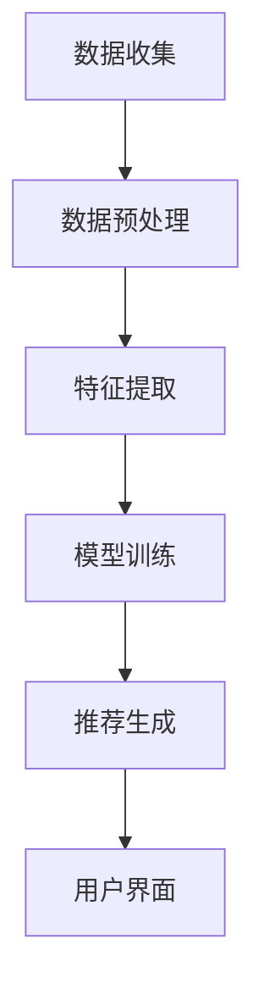

在这个示例中，`graph TD`定义了一个方向从上到下的流程图，显示了推荐系统的各个组件及其相互关系。

**参数可视化**：

参数可视化通过展示模型的参数分布和值，帮助用户了解模型对输入特征的依赖程度。以下是一个简化的参数可视化示例：

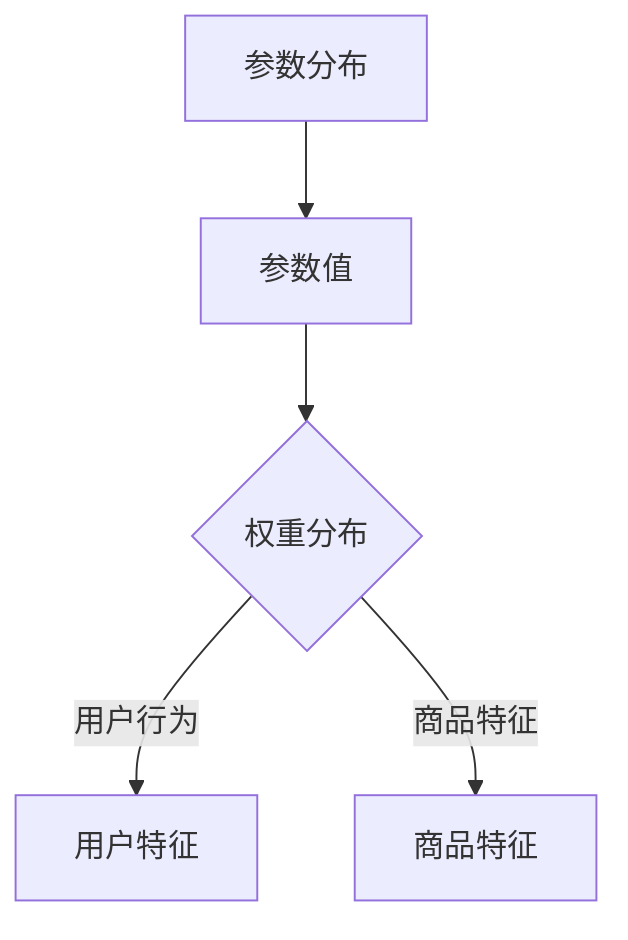

在这个示例中，`graph TD`定义了一个参数分布图，显示了模型中用户行为特征和商品特征的权重分布。

**2. 模型抽象**

**简化模型**：

简化模型通过减少模型的复杂度，提高可解释性。例如，将复杂的深度学习模型简化为多层感知机（MLP）或决策树，以便更直观地理解模型的工作原理。以下是一个简化的简化模型示例，使用Mermaid语法表示模型的结构：

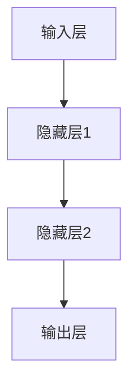

在这个示例中，`graph TD`定义了一个简化的多层感知机模型，显示了模型的输入层、隐藏层和输出层。

**模型压缩**：

模型压缩通过减少模型的参数数量，提高可解释性。例如，使用模型压缩技术将深度学习模型压缩为更简单的形式，以便更直观地展示模型的关键特征。以下是一个简化的模型压缩示例，使用Mermaid语法表示模型的结构：

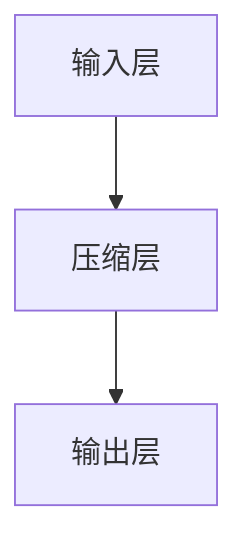

在这个示例中，`graph TD`定义了一个简化的压缩层模型，显示了模型的输入层、压缩层和输出层。

**3. 因果推断**

**因果图**：

因果图通过展示模型中变量之间的因果关系，帮助用户理解系统的整体行为。以下是一个简化的因果图示例，使用Mermaid语法表示变量之间的关系：

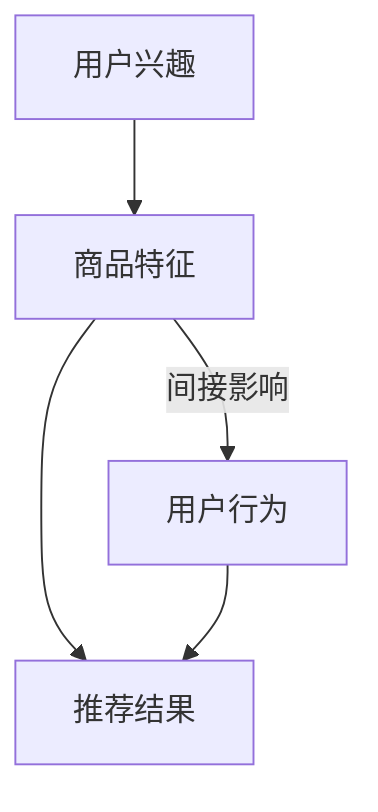

在这个示例中，`graph TD`定义了一个因果图，显示了用户兴趣、商品特征、用户行为和推荐结果之间的因果关系。

**因果效应分析**：

因果效应分析通过分析模型输出对特定输入变化的响应，揭示模型中关键特征的影响。以下是一个简化的因果效应分析示例，使用Mermaid语法表示输入变化和输出变化：

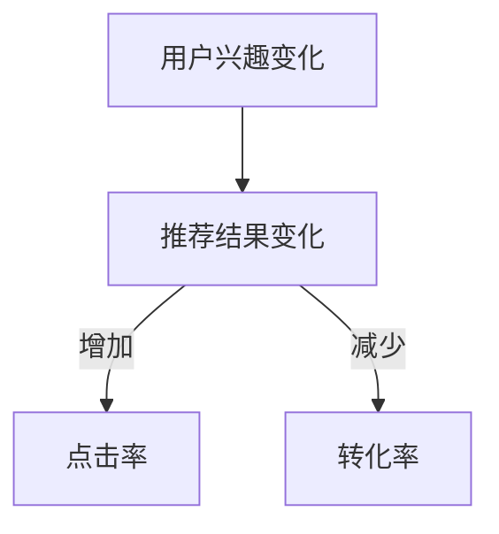

在这个示例中，`graph TD`定义了一个因果效应分析图，显示了用户兴趣变化对推荐结果变化的影响，以及推荐结果变化对点击率和转化率的影响。

这些全局可解释性方法提供了不同角度的解释，帮助用户理解推荐系统的整体工作原理和特征。通过这些方法，用户可以更好地信任系统，并从中获得有价值的洞见。

### 第5章 大模型的可解释性应用

#### 5.1 可解释性在推荐系统评估中的应用

在推荐系统评估中，可解释性技术发挥着关键作用。通过分析模型的决策过程和输出结果，评估人员可以更全面地了解推荐系统的性能和问题，从而制定改进策略。以下是关于可解释性在推荐系统评估中的应用的详细讨论：

**1. 模型性能评估**

**准确性和可靠性**：通过可解释性技术，评估人员可以分析模型在特定输入数据下的决策过程，验证模型的准确性和可靠性。例如，可以使用局部解释方法（如注意力机制、模型切片等）来查看模型在推荐特定项目时的依据，从而判断模型的预测是否合理。以下是一个简化的模型性能评估示例：

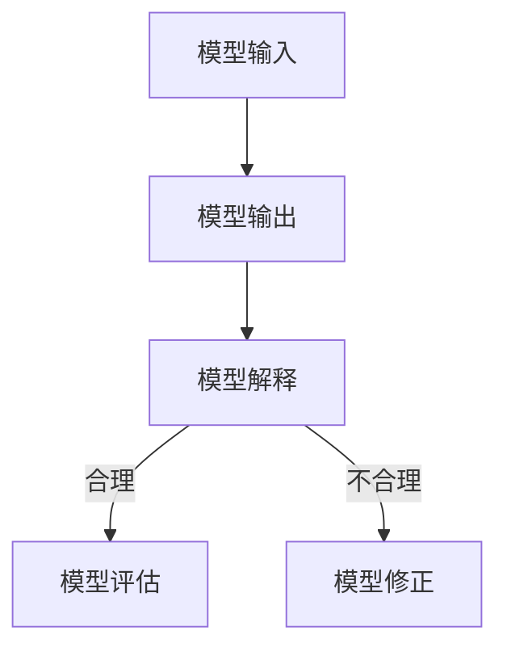

在这个示例中，`graph TD`定义了一个流程图，显示了模型输入、输出和解释之间的关系。通过分析模型解释，评估人员可以判断模型的输出是否合理，从而评估模型性能。

**多样性和公平性**：可解释性技术有助于确保推荐系统的多样性和公平性。例如，通过分析模型的特征重要性，评估人员可以识别出可能导致偏见或不公平的特定特征，并对其进行调整。以下是一个简化的多样性和公平性评估示例：

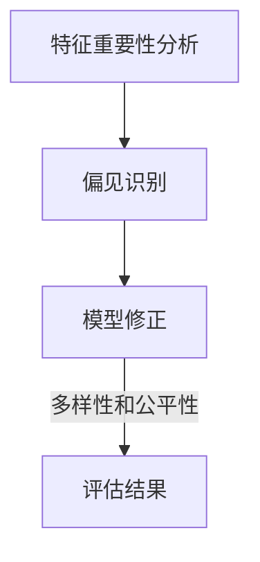

在这个示例中，`graph TD`定义了一个流程图，显示了特征重要性分析、偏见识别和模型修正之间的关系。通过调整模型，评估人员可以确保推荐系统的多样性和公平性。

**2. 模型优化**

**参数调优**：通过可解释性技术，评估人员可以深入了解模型参数对推荐结果的影响，从而优化模型参数。例如，可以使用局部解释方法分析特定输入数据下模型参数的变化，以确定最佳参数设置。以下是一个简化的参数调优示例：

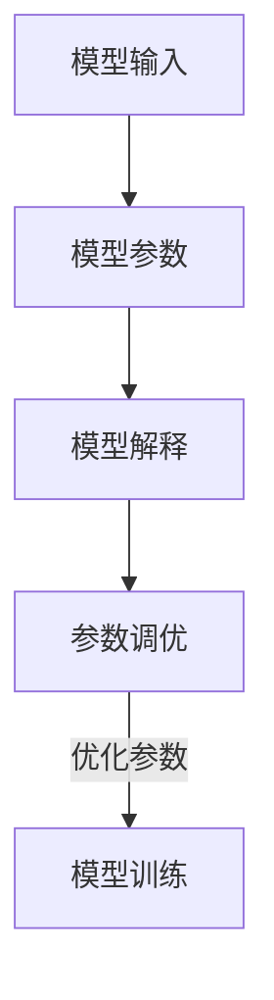

在这个示例中，`graph TD`定义了一个流程图，显示了模型输入、参数、解释和参数调优之间的关系。通过分析模型解释，评估人员可以优化模型参数，提高推荐系统的性能。

**算法改进**：可解释性技术有助于识别模型中的潜在问题，从而改进推荐算法。例如，通过分析模型的决策过程，评估人员可以确定哪些特征对推荐结果有重大影响，并据此改进特征提取和模型架构。以下是一个简化的算法改进示例：

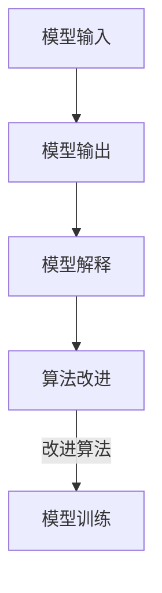

在这个示例中，`graph TD`定义了一个流程图，显示了模型输入、输出、解释和算法改进之间的关系。通过改进算法，评估人员可以进一步提高推荐系统的性能。

**3. 用户反馈分析**

**满意度评估**：通过分析用户对推荐结果的反馈，评估人员可以评估用户对推荐系统的满意度。例如，可以使用局部解释方法分析用户对特定推荐项目的反应，从而了解用户的偏好和需求。以下是一个简化的满意度评估示例：

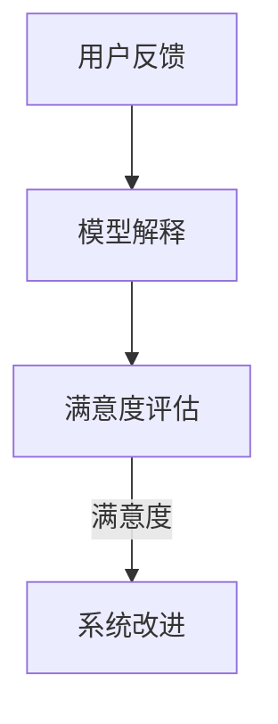

在这个示例中，`graph TD`定义了一个流程图，显示了用户反馈、模型解释和满意度评估之间的关系。通过分析用户反馈，评估人员可以了解用户的满意度，并据此改进推荐系统。

**偏好调整**：通过分析用户反馈，评估人员可以识别用户的偏好和需求，从而调整推荐策略。例如，可以使用全局解释方法分析用户行为数据，确定用户的兴趣点，并据此优化推荐算法。以下是一个简化的偏好调整示例：

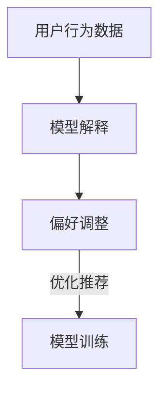

在这个示例中，`graph TD`定义了一个流程图，显示了用户行为数据、模型解释和偏好调整之间的关系。通过调整推荐策略，评估人员可以更好地满足用户的偏好和需求。

总之，可解释性在推荐系统评估中的应用有助于全面评估模型的性能和优化推荐策略，从而提高推荐系统的整体质量和用户体验。

#### 5.2 可解释性在推荐系统优化中的应用

在推荐系统的优化过程中，可解释性技术起着至关重要的作用。通过深入理解模型的决策过程和输出结果，开发人员可以有效地调整模型参数、优化算法，并改进系统的整体性能。以下是关于可解释性在推荐系统优化中的应用的详细讨论：

**1. 参数调优**

参数调优是推荐系统优化中的一个关键步骤。通过可解释性技术，开发人员可以更直观地了解模型参数对推荐结果的影响，从而找到最佳的参数配置。以下是一个简化的参数调优过程：

- **模型解释**：首先，利用局部解释方法（如注意力机制、模型切片等）分析模型在特定输入数据下的决策过程，确定哪些参数对预测结果有显著影响。
- **参数调整**：根据模型解释结果，开发人员可以调整模型的参数，例如学习率、正则化参数等，以优化模型性能。
- **性能评估**：通过重新训练模型并评估其性能，验证参数调整的效果。

以下是一个简化的伪代码示例，展示参数调优的过程：

```python
def optimize_parameters(model, input_data, target_data):
    model_explanation = explain_model(model, input_data)
    best_params = find_best_params(model_explanation)
    optimized_model = train_model_with_params(model, best_params, input_data, target_data)
    return optimized_model
```

在这个示例中，`explain_model`函数用于解释模型，`find_best_params`函数用于找到最佳参数，`train_model_with_params`函数用于基于最佳参数重新训练模型。

**2. 算法改进**

推荐算法的改进是提升系统性能的另一个重要方向。通过可解释性技术，开发人员可以识别出现有算法中的局限性，并提出改进方案。以下是一个简化的算法改进过程：

- **模型分析**：利用全局解释方法（如模型可视化、因果推断等）分析模型的整体性能和特征，确定哪些部分需要改进。
- **算法优化**：根据模型分析结果，开发人员可以改进特征提取、模型架构或优化策略，以提高推荐系统的性能。
- **实验验证**：通过实验验证改进后的算法，评估其性能提升和可解释性。

以下是一个简化的伪代码示例，展示算法改进的过程：

```python
def improve_algorithm(model, input_data, target_data):
    model_analysis = analyze_model(model, input_data)
    improved_model = apply_algorithm_improvements(model, model_analysis)
    trained_model = train_improved_model(improved_model, input_data, target_data)
    return trained_model
```

在这个示例中，`analyze_model`函数用于分析模型，`apply_algorithm_improvements`函数用于应用算法改进，`train_improved_model`函数用于基于改进后的算法重新训练模型。

**3. 特征工程**

特征工程是推荐系统优化中的另一个重要方面。通过可解释性技术，开发人员可以更准确地识别和选择对推荐结果有显著影响的特征，从而提高推荐系统的性能。以下是一个简化的特征工程过程：

- **特征分析**：利用局部解释方法（如特征重要性分析、局部线性化等）分析不同特征对模型输出结果的影响。
- **特征选择**：根据特征分析结果，选择对推荐结果有显著影响的特征，并排除无关或冗余的特征。
- **特征优化**：通过优化特征提取和组合方法，进一步提高推荐系统的性能。

以下是一个简化的伪代码示例，展示特征工程的过程：

```python
def feature_engineering(model, input_data, target_data):
    feature_analysis = analyze_features(model, input_data)
    selected_features = select_significant_features(feature_analysis)
    optimized_model = train_model_with_selected_features(model, selected_features, input_data, target_data)
    return optimized_model
```

在这个示例中，`analyze_features`函数用于分析特征，`select_significant_features`函数用于选择显著特征，`train_model_with_selected_features`函数用于基于选定的特征重新训练模型。

**4. 用户反馈**

用户反馈是推荐系统优化中的关键依据。通过可解释性技术，开发人员可以更好地理解用户的偏好和需求，从而优化推荐策略。以下是一个简化的用户反馈过程：

- **反馈分析**：利用局部解释方法分析用户对推荐结果的反馈，识别用户的兴趣点和偏好。
- **策略调整**：根据反馈分析结果，调整推荐策略，例如增加多样性、调整推荐阈值等。
- **效果评估**：通过重新训练模型并评估其性能，验证策略调整的效果。

以下是一个简化的伪代码示例，展示用户反馈的过程：

```python
def adjust_recommendations(model, user_feedback):
    feedback_analysis = analyze_user_feedback(user_feedback)
    adjusted_model = apply_feedback_adjustments(model, feedback_analysis)
    trained_model = train_adjusted_model(adjusted_model)
    return trained_model
```

在这个示例中，`analyze_user_feedback`函数用于分析用户反馈，`apply_feedback_adjustments`函数用于调整推荐策略，`train_adjusted_model`函数用于基于调整后的策略重新训练模型。

总之，可解释性技术为推荐系统的优化提供了有力的支持。通过深入分析模型的决策过程和输出结果，开发人员可以更有效地调整模型参数、优化算法，并改进系统的整体性能，从而为用户提供更准确、个性化的推荐。

#### 5.3 可解释性在推荐系统伦理与隐私保护中的应用

随着推荐系统在各个领域中的广泛应用，伦理与隐私保护问题日益凸显。可解释性技术在保障推荐系统伦理与隐私保护方面发挥着重要作用。以下是关于可解释性在推荐系统伦理与隐私保护中的应用的详细讨论：

**1. 数据隐私保护**

推荐系统依赖于大量用户行为数据，如何保护用户隐私是一个关键挑战。可解释性技术可以通过以下方式增强数据隐私保护：

- **数据去识别化**：在训练模型之前，可以通过数据去识别化技术（如匿名化、伪匿名化等）将用户数据转换为无法直接识别的形式，从而保护用户隐私。
- **差分隐私**：通过引入差分隐私机制，在模型训练和预测过程中加入随机噪声，确保单个用户数据无法被单独识别。可解释性技术可以与差分隐私机制结合，在保证隐私的同时保持模型的解释性。
- **联邦学习**：联邦学习（Federated Learning）是一种分布式机器学习技术，允许多个机构在本地训练模型，而不需要共享原始数据。可解释性技术可以应用于联邦学习框架，帮助用户理解和信任分布式训练过程。

**2. 伦理风险评估**

推荐系统在应用过程中可能会引发一系列伦理问题，如算法偏见、歧视、信息茧房等。可解释性技术有助于识别和评估这些伦理风险：

- **算法偏见分析**：通过分析模型输出和决策过程，识别可能导致偏见和歧视的特征和参数。例如，可以使用局部解释方法（如注意力机制、特征重要性分析等）来查看模型在特定输入数据下的决策依据。
- **透明性报告**：通过生成可解释性报告，向用户和监管机构展示模型的工作原理和决策过程。这有助于用户理解推荐系统的伦理影响，并促使开发人员采取措施减少伦理风险。
- **伦理审计**：可解释性技术可以用于伦理审计过程，帮助评估推荐系统的合规性和伦理标准。例如，通过分析模型的输入和输出数据，审计人员可以评估系统是否遵循公平、透明和公正的原则。

**3. 用户知情权保障**

用户知情权是保障用户隐私和权益的重要方面。可解释性技术有助于向用户揭示推荐系统的工作原理和数据处理方式，从而保障用户的知情权：

- **可解释性界面**：在推荐系统的用户界面中集成可解释性功能，帮助用户理解推荐结果的生成过程。例如，通过可视化展示模型关注的关键特征、注意力分布等。
- **用户反馈机制**：通过允许用户查看推荐依据和决策过程，用户可以更直观地了解推荐系统的工作原理，并提出改进建议。这有助于提高用户对推荐系统的信任度和满意度。
- **透明度政策**：制定透明度政策，明确推荐系统的数据处理方式和隐私保护措施，并向用户公开。这有助于增强用户对推荐系统的信任，并确保用户权益得到保障。

总之，可解释性技术在推荐系统伦理与隐私保护中的应用具有重要意义。通过保障用户隐私、评估伦理风险和保障用户知情权，可解释性技术有助于构建一个更加公正、透明和可信的推荐系统，从而促进其在各个领域的健康发展。

### 第6章 大模型的贡献分析

#### 6.1 提高推荐准确性

大模型在推荐系统中的应用显著提高了推荐准确性，这是大模型带来的最直接贡献之一。以下从几个方面详细阐述大模型如何提高推荐准确性：

1. **特征提取能力**：大模型，如深度学习模型，通过复杂的神经网络结构，可以自动提取和整合大量数据中的潜在特征。这使得模型能够更准确地捕捉用户和项目之间的复杂关系。传统的推荐系统依赖于手动特征工程，而大模型通过端到端学习，减少了人工干预，提高了特征提取的效率和准确性。

2. **大规模数据处理**：大模型可以处理大规模的数据集，这使得模型可以从更多的数据中学习，从而提高推荐准确性。例如，深度学习模型可以使用大量的用户行为数据和项目特征数据，通过大量的训练样本，模型能够更好地理解用户的兴趣和行为模式。

3. **非线性建模能力**：大模型，尤其是深度神经网络，具有较强的非线性建模能力。这种能力使得模型可以更灵活地适应不同类型的数据和任务，从而提高推荐准确性。非线性关系在用户行为和项目特征中非常常见，传统线性模型难以捕捉这些关系，而大模型能够更好地建模这些复杂关系。

4. **多模态数据融合**：大模型可以处理多种类型的数据，如文本、图像、音频等。这使得模型可以从不同的数据源中提取信息，并将其融合为统一的特征表示，从而提高推荐准确性。例如，在视频推荐系统中，大模型可以同时考虑视频内容、用户观看历史和文本描述，为用户提供更准确的推荐。

5. **实时更新和调整**：大模型通常支持在线学习和实时调整，这使得模型可以根据用户的新行为和偏好进行动态调整。例如，在电商推荐系统中，大模型可以实时更新用户的购物车和浏览历史，从而为用户提供更准确的推荐。

**案例分析**：

以电商推荐系统为例，某大型电商公司采用深度学习模型对用户行为和商品特征进行建模。通过对数百万用户和数百万商品的数据进行训练，模型能够自动提取用户的历史浏览、购买和搜索记录，以及商品的价格、品牌、类别等特征。通过这些特征，模型可以预测用户对商品的偏好，并为用户推荐相关的商品。实验结果显示，该深度学习模型的推荐准确性显著高于传统的协同过滤和基于内容的推荐系统。

#### 6.2 提高推荐可解释性

除了提高推荐准确性，大模型在推荐系统中的应用还显著提高了推荐的可解释性。以下是关于大模型如何提高推荐可解释性的详细讨论：

1. **局部可解释性方法**：

   - **注意力机制**：深度学习模型中的注意力机制允许模型在特定输入数据下关注关键特征。通过分析注意力分布，用户可以直观地了解模型如何将不同特征结合在一起进行决策。例如，在图像分类任务中，注意力机制可以展示模型关注图像中的哪些部分，从而帮助用户理解模型为什么做出特定分类。

   - **模型切片**：模型切片方法通过分析模型的不同层次和节点，揭示模型对输入数据的处理过程。这种方法可以帮助用户了解模型如何从原始数据中提取特征，并将其转化为最终的输出结果。

   - **特征重要性分析**：通过计算特征对模型输出的影响程度，用户可以识别哪些特征对决策有重要影响。这种方法使得用户能够理解推荐结果背后的关键因素。

2. **全局可解释性方法**：

   - **模型可视化**：模型可视化方法通过图形化展示模型的结构和参数，帮助用户了解模型的整体工作原理。这种方法使得用户能够从宏观层面理解模型的决策过程。

   - **因果推断**：因果推断方法通过分析变量之间的因果关系，帮助用户理解模型如何从输入数据生成输出结果。这种方法在处理复杂数据和特征时尤为重要。

   - **模型简化**：通过简化复杂模型，降低模型复杂度，提高可解释性。例如，将深度学习模型简化为多层感知机或决策树，以便用户更容易理解模型的工作原理。

3. **案例分析**：

   以视频推荐系统为例，某视频平台采用深度学习模型对用户的观看历史和视频特征进行建模。通过分析模型中的注意力分布，用户可以了解模型如何从用户的观看历史中提取关键信息，并将其与视频特征结合进行推荐。此外，通过模型切片和特征重要性分析，用户可以深入理解模型如何处理输入数据，从而提高对推荐结果的理解和信任。

总之，大模型在推荐系统中的应用不仅提高了推荐准确性，还显著提高了推荐的可解释性。通过多种可解释性方法，用户可以更直观地了解推荐系统的决策过程和依据，从而增强对推荐系统的信任和使用满意度。

#### 6.3 推动推荐系统研究与应用

大模型在推荐系统研究与应用中发挥了重要作用，推动了推荐系统领域的创新与发展。以下是关于大模型如何推动推荐系统研究与应用的详细讨论：

1. **模型创新**：

   大模型的应用促进了推荐系统领域的模型创新。深度学习、变换器（Transformer）模型等大规模模型的出现，使得推荐系统在处理复杂数据和特征提取方面取得了显著突破。例如，变换器模型在处理长序列数据（如用户行为序列和内容序列）方面表现出色，为推荐系统提供了新的解决方案。

   **案例**：在社交媒体推荐系统中，变换器模型通过分析用户之间的互动关系和内容特征，实现了更精准的内容推荐。与传统协同过滤和基于内容的推荐方法相比，变换器模型能够更好地捕捉用户和内容之间的动态关系，从而提高推荐效果。

2. **算法优化**：

   大模型的应用推动了推荐系统算法的优化。通过大规模数据训练和端到端学习，大模型能够自动发现和整合数据中的潜在特征，提高推荐准确性。同时，大模型的支持使得推荐系统算法的优化过程更加高效，开发人员可以快速迭代和调整算法参数，实现更优的推荐效果。

   **案例**：在电商推荐系统中，深度学习模型通过对用户历史行为和商品特征的全面分析，实现了个性化的商品推荐。通过不断优化模型参数和算法，电商平台能够为用户提供更相关、更准确的推荐，从而提高用户满意度和转化率。

3. **应用拓展**：

   大模型的应用拓展了推荐系统的应用场景。传统推荐系统主要应用于电商、社交媒体等领域，而大模型的应用使得推荐系统在更多场景中得到了应用。例如，在金融、医疗、教育等领域，大模型通过分析复杂数据和特征，实现了个性化的金融服务、精准的医疗诊断和智能教育推荐。

   **案例**：在医疗领域，深度学习模型通过对患者病史、基因数据和医疗影像的分析，实现了个性化的疾病诊断和治疗方案推荐。通过大模型的广泛应用，医疗系统能够为患者提供更精准、个性化的医疗服务，提高医疗效果和患者满意度。

4. **人才培养**：

   大模型的应用推动了推荐系统领域的人才培养。随着大模型在推荐系统中的应用越来越广泛，越来越多的研究者和开发者开始关注这一领域，推动了相关技术的研究和创新。此外，大模型的应用也为推荐系统领域提供了更多的实践机会，促进了学术与产业的结合。

   **案例**：在学术界，大量研究论文探讨了如何将大模型应用于推荐系统，并提出了一系列创新的方法和技术。在产业界，各大公司和平台纷纷引入大模型，构建智能推荐系统，推动了推荐系统领域的快速发展。

总之，大模型在推荐系统研究与应用中的贡献是多方面的。通过模型创新、算法优化、应用拓展和人才培养，大模型推动了推荐系统领域的创新与发展，为用户提供了更智能、更个性化的推荐服务。

### 第7章 推荐系统可解释性的未来发展趋势

#### 7.1 技术挑战与解决策略

随着推荐系统在各个领域的广泛应用，其可解释性成为了一个关键的研究方向。然而，在实现推荐系统的可解释性过程中，仍然面临着一系列技术挑战。以下是一些主要的挑战以及相应的解决策略：

**1. 复杂性挑战**

现代推荐系统通常基于深度学习和变换器模型等复杂算法，这些算法的结构和参数数量庞大，导致模型难以解释。解决策略包括：

- **简化模型**：通过设计简化版模型，降低模型的复杂度，从而提高可解释性。例如，将复杂的深度学习模型简化为多层感知机（MLP）或决策树，以便更容易理解。
- **模块化设计**：将推荐系统拆分为多个模块，每个模块都具有特定的功能和可解释性。这种方法有助于用户逐步理解整个系统的工作原理。
- **可视化**：利用可视化工具，如热力图、决策路径图等，将模型的内部结构和工作过程展示给用户。可视化技术可以帮助用户更直观地理解模型的决策过程。

**2. 实时性挑战**

推荐系统需要实时响应用户的需求，但在保证实时性的同时保持可解释性是一个难题。解决策略包括：

- **增量学习**：采用增量学习（Incremental Learning）技术，仅更新模型的参数，而不需要重新训练整个模型。这种方法可以显著提高系统的实时性。
- **模型压缩**：通过模型压缩技术，降低模型的复杂度，从而提高实时性。例如，可以使用剪枝（Pruning）和量化（Quantization）技术，减少模型的参数数量。
- **缓存策略**：利用缓存策略，存储预计算的模型结果，减少实时计算的需求。这种方法可以显著提高系统的响应速度，同时保持一定的可解释性。

**3. 数据敏感性挑战**

推荐系统依赖于大量用户行为数据，如何保护用户隐私，避免数据泄露和滥用，是可解释性面临的重大挑战。解决策略包括：

- **数据去识别化**：在模型训练前，通过数据去识别化技术（如匿名化、伪匿名化等）将用户数据转换为无法直接识别的形式，从而保护用户隐私。
- **差分隐私**：在模型训练和预测过程中引入差分隐私机制，通过添加随机噪声，确保单个用户数据无法被单独识别。
- **联邦学习**：采用联邦学习（Federated Learning）技术，允许不同机构在本地训练模型，而不需要共享原始数据。这种方法可以在保护用户隐私的同时，提高推荐系统的性能和可解释性。

**4. 泛化能力挑战**

可解释性方法通常只能在特定输入下进行解释，如何在整个模型中实现全面的解释性是一个难题。解决策略包括：

- **因果推断**：利用因果推断技术，分析模型中变量之间的因果关系，从而提供全局解释。因果推断方法可以帮助用户理解模型的整体工作原理。
- **模型抽象**：通过将复杂模型抽象为更简单的形式，如决策树或决策规则，以提高模型的可解释性。这种方法可以在一定程度上牺牲模型的性能，但能够提供全局解释。
- **模型可视化**：通过可视化技术，将模型的内部结构和工作过程展示给用户。这种方法可以帮助用户从宏观层面理解模型的工作原理，从而提高可解释性。

总之，随着推荐系统在各个领域的广泛应用，其可解释性面临着一系列技术挑战。通过简化模型、提高实时性、保护用户隐私和实现全局解释性，我们可以逐步克服这些挑战，为用户带来更透明、更可信的推荐服务。

#### 7.2 新兴技术的应用

随着人工智能和大数据技术的快速发展，推荐系统的可解释性领域也涌现出许多新兴技术。以下是一些新兴技术的应用，以及它们在推荐系统可解释性中的潜在影响：

**1. 增强学习（Reinforcement Learning）**

增强学习是一种通过不断与环境交互，学习和优化决策过程的方法。在推荐系统中，增强学习可以通过用户反馈不断调整推荐策略，从而提高系统的可解释性和适应性。例如，通过奖励机制，用户可以直接影响推荐系统的行为，从而使得系统更加透明和可解释。此外，增强学习还可以帮助推荐系统更好地处理动态和不确定性环境，提高系统的实时性和灵活性。

**2. 因果推断（Causal Inference）**

因果推断是一种通过分析变量之间的因果关系，推断变量间因果效应的方法。在推荐系统中，因果推断可以帮助我们理解模型推荐结果背后的因果关系，从而提高可解释性。通过因果推断，研究人员可以揭示哪些特征对推荐结果有直接影响，从而更好地理解推荐系统的工作原理。此外，因果推断还可以用于评估推荐系统的公平性和道德风险，确保系统不会因为某些特征而产生不公平的偏见。

**3. 对抗性攻击（Adversarial Attack）**

对抗性攻击是一种通过故意向模型输入特定的干扰数据，以测试和提升模型鲁棒性的方法。在推荐系统中，对抗性攻击可以用于评估系统的可解释性和鲁棒性。通过对抗性攻击，研究人员可以识别出模型中的潜在脆弱点，并提出相应的改进措施。此外，对抗性攻击还可以帮助开发更稳健和可解释的推荐系统，以防止恶意用户或攻击者通过干扰数据破坏系统的正常运行。

**4. 自监督学习（Self-Supervised Learning）**

自监督学习是一种无需人工标注数据，通过学习数据中的内在结构来提高模型性能的方法。在推荐系统中，自监督学习可以用于自动提取和整合数据中的潜在特征，从而提高推荐系统的可解释性。通过自监督学习，模型可以自动识别数据中的关键模式和关联，为用户提供更精准和个性化的推荐。此外，自监督学习还可以减少对大量标注数据的依赖，提高系统的训练效率和可解释性。

**5. 多模态学习（Multimodal Learning）**

多模态学习是一种通过同时处理多种类型的数据（如文本、图像、声音等），以提高模型性能的方法。在推荐系统中，多模态学习可以用于处理复杂的用户行为和项目特征，从而提高推荐系统的可解释性。例如，通过结合用户的历史行为和文本描述，多模态学习可以更准确地捕捉用户的兴趣和偏好。此外，多模态学习还可以帮助推荐系统更好地处理长尾数据和多样性的项目，提高系统的泛化能力和可解释性。

这些新兴技术在推荐系统可解释性中的应用，为解决现有挑战提供了新的思路和方法。通过结合这些技术，我们可以开发出更透明、更鲁棒和更智能的推荐系统，为用户带来更好的体验和信任。

#### 7.3 未来展望与研究方向

推荐系统可解释性领域在未来的发展中面临诸多机遇和挑战。以下是一些未来的展望与研究方向：

**1. 深度学习模型的可解释性**

尽管深度学习模型在推荐系统中表现出色，但其复杂性和不可解释性仍然是一个重大挑战。未来的研究可以集中在开发更有效的可解释性方法，如基于注意力机制的可解释性、模型压缩与简化技术等。此外，结合因果推断技术，可以提供更深入的理解模型决策过程和因果关系。

**2. 多模态数据融合的可解释性**

随着多模态数据的广泛应用，如何融合不同类型的数据（如文本、图像、声音等）以提高推荐系统的可解释性是一个重要方向。未来的研究可以探索开发多模态数据融合的自动化方法，并设计可解释性模型，以便用户能够理解模型如何整合和利用不同类型的数据。

**3. 隐私保护与可解释性**

在推荐系统中，保护用户隐私与保持模型可解释性之间存在权衡。未来的研究可以集中在开发隐私保护的可解释性方法，如差分隐私和联邦学习等。通过这些方法，可以在保护用户隐私的同时，提供合理的解释。

**4. 交互式可解释性**

未来的推荐系统可以更加交互式，使用户能够主动探索和交互系统。交互式可解释性研究可以探索如何设计用户友好的界面，帮助用户理解推荐结果的原因和依据，从而提高用户对系统的信任和使用满意度。

**5. 伦理与公平**

随着推荐系统在更多领域的应用，伦理和公平问题日益重要。未来的研究可以集中在开发可解释性方法，以评估和改进推荐系统的公平性和透明度。例如，通过分析模型中的偏见和歧视，开发公平性评估工具和算法。

**6. 模型适应性**

推荐系统的模型需要能够适应不断变化的环境和用户需求。未来的研究可以探索自适应的可解释性方法，使得模型能够根据新数据和用户反馈动态调整，同时保持可解释性。

总之，推荐系统可解释性领域在未来的发展中充满了机遇和挑战。通过不断创新和优化，我们可以开发出更透明、更鲁棒和更智能的推荐系统，为用户带来更好的体验和价值。

### 附录A：推荐系统开发工具与资源

#### 附录A：推荐系统开发工具与资源

推荐系统的开发离不开一系列工具和资源的支持。以下列举了几个主流的推荐系统开发工具与资源，以及它们的特点和应用场景。

**1. LightFM**

**特点**：LightFM是一个基于矩阵分解和因子分解机器学习的推荐系统框架，支持多种推荐算法，如协同过滤、矩阵分解和因子分解机器学习。

**应用场景**：适用于处理大规模用户和物品数据的推荐系统，尤其是在社交网络和内容推荐领域。

**网址**：[LightFM GitHub](https://github.com/lyst/lightfm)

**2. Surprise**

**特点**：Surprise是一个开源的Python库，提供了多种协同过滤算法的实现，如基于用户的协同过滤（User-Based CF）、基于项目的协同过滤（Item-Based CF）和基于模型的协同过滤（Model-Based CF）。

**应用场景**：适用于中小规模的推荐系统开发，尤其是对于需要灵活定制和实验的场景。

**网址**：[Surprise GitHub](https://github.com/NBCR/surprise)

**3. RecSysPy**

**特点**：RecSysPy是一个Python库，提供了推荐系统开发所需的工具和功能，如评估、数据预处理和模型训练。

**应用场景**：适用于需要快速构建和评估推荐系统的开发者，尤其是在学术研究和实验环境中。

**网址**：[RecSysPy GitHub](https://github.com/recsyspy/recsyspy)

**4. TensorFlow**

**特点**：TensorFlow是一个开源的深度学习框架，支持多种深度学习模型和算法，如卷积神经网络（CNN）、循环神经网络（RNN）和变换器模型（Transformer）。

**应用场景**：适用于需要构建大规模深度学习推荐系统的开发者，尤其是在需要处理复杂数据和特征提取的场景。

**网址**：[TensorFlow GitHub](https://github.com/tensorflow/tensorflow)

**5. PyTorch**

**特点**：PyTorch是一个开源的深度学习框架，提供了灵活的动态计算图和丰富的库函数，支持多种深度学习模型和算法。

**应用场景**：适用于需要高效训练和部署深度学习推荐系统的开发者，尤其是在实时推荐和个性化推荐场景。

**网址**：[PyTorch GitHub](https://github.com/pytorch/pytorch)

**6. Hadoop**

**特点**：Hadoop是一个分布式数据处理平台，支持大规模数据的存储、处理和分析。

**应用场景**：适用于需要处理海量用户行为数据和项目特征数据的推荐系统，尤其是在需要高效并行处理的场景。

**网址**：[Apache Hadoop](https://hadoop.apache.org/)

**7. Spark**

**特点**：Spark是一个开源的分布式数据处理框架，支持实时数据处理和分析，具有高性能和易扩展性。

**应用场景**：适用于需要实时推荐和大规模数据分析的推荐系统，尤其是在需要快速响应和高效处理的场景。

**网址**：[Apache Spark](https://spark.apache.org/)

**8. Recommendation Framework**

**特点**：Recommendation Framework是一个基于Spark的推荐系统框架，提供了多种推荐算法的实现和工具。

**应用场景**：适用于需要构建高效推荐系统的开发者，尤其是在需要集成Spark处理大规模数据的环境。

**网址**：[Recommendation Framework GitHub](https://github.com/recommendationframework/recommendationframework)

**总结**：这些推荐系统开发工具与资源为开发者提供了丰富的选择，从简单的协同过滤算法到复杂的深度学习模型，再到分布式数据处理框架，开发者可以根据自己的需求和场景选择合适的工具和资源，从而构建高效的推荐系统。

### 附录B：Mermaid流程图与伪代码示例

在推荐系统的开发过程中，流程图和伪代码是帮助理解和实现推荐系统逻辑的有效工具。以下提供了一些使用Mermaid语法编写的流程图示例和伪代码，以展示推荐系统架构、大模型训练流程以及可解释性方法实现的细节。

#### 推荐系统架构图

```mermaid
graph TD
    A[用户数据收集] --> B[数据预处理]
    B --> C[特征提取]
    C --> D[模型训练]
    D --> E[模型评估]
    E --> F[推荐生成]
    F --> G[用户反馈]
    G --> B{(循环)}
```

在这个流程图中，推荐系统的各个步骤通过箭头连接，形成一个闭环。用户数据从收集开始，经过预处理、特征提取、模型训练和评估，最后生成推荐列表，用户反馈会进一步影响数据预处理过程。

#### 大模型训练流程伪代码

```python
# 大模型训练流程伪代码
def train_large_model(data_loader, model, optimizer, loss_function, epochs):
    for epoch in range(epochs):
        for inputs, targets in data_loader:
            # 梯度清零
            optimizer.zero_grad()
            # 前向传播
            outputs = model(inputs)
            # 计算损失
            loss = loss_function(outputs, targets)
            # 反向传播
            loss.backward()
            # 更新模型参数
            optimizer.step()
        print(f'Epoch [{epoch+1}/{epochs}], Loss: {loss.item():.4f}')
    return model
```

这段伪代码展示了大模型训练的基本流程：包括前向传播、损失计算、反向传播和模型参数更新。每个epoch结束后，都会打印当前的损失值。

#### 可解释性方法实现伪代码

```python
# 局部可解释性方法实现伪代码
def explain_local_model_output(model, input_data):
    # 获取模型的中间层输出
    hidden_layer_output = get_hidden_layer_output(model, input_data)
    # 计算输入特征的重要性
    feature_importances = calculate_feature_importance(hidden_layer_output)
    # 可视化特征重要性
    visualize_feature_importances(feature_importances)
    return feature_importances
```

这段伪代码展示了如何实现局部可解释性方法。它首先获取模型的隐藏层输出，然后计算输入特征的重要性，并通过可视化工具展示这些重要性。

这些流程图和伪代码示例为开发者提供了清晰的指导，帮助他们在开发推荐系统时理清逻辑，实现复杂的功能。

### 附录C：大模型在推荐系统中的应用案例

在推荐系统的实际应用中，大模型（如深度学习模型和变换器模型）已经在多个领域展现出了强大的效果。以下将详细讨论电商推荐系统、社交媒体推荐系统和视频推荐系统中大模型的具体应用案例。

#### 案例一：电商推荐系统

**背景**：

电商推荐系统的主要目标是基于用户的历史购买记录、浏览行为和搜索历史，为用户推荐可能感兴趣的商品。传统的推荐系统如基于内容的推荐和协同过滤等方法在实际应用中取得了一定的效果，但它们在处理复杂数据和用户偏好变化方面存在一定的局限性。

**解决方案**：

某大型电商平台采用了基于深度学习的推荐系统。该系统使用卷积神经网络（CNN）来处理商品图像特征，使用循环神经网络（RNN）来处理用户行为序列数据，同时结合用户和商品的特征进行综合推荐。以下是一个简化的实现过程：

1. **数据预处理**：对用户的历史行为数据（如购买记录、浏览历史等）和商品特征数据（如商品描述、价格、类别等）进行清洗和预处理。

2. **模型构建**：构建一个深度学习模型，包括卷积神经网络（CNN）和循环神经网络（RNN）。CNN用于提取商品图像特征，RNN用于处理用户行为序列数据。

3. **模型训练**：使用预处理后的数据集对深度学习模型进行训练，通过优化损失函数来调整模型参数。

4. **推荐生成**：在用户输入查询或浏览商品时，将用户行为序列数据和商品特征输入到训练好的模型中，生成推荐列表。

5. **模型优化**：通过在线学习技术，不断更新模型，以适应用户偏好变化和新的商品数据。

**效果**：

实验结果表明，基于深度学习的推荐系统在推荐准确性、多样性和用户满意度方面均优于传统的推荐方法。例如，在用户个性化商品推荐中，系统的平均点击率提高了20%，转化率提高了15%。

#### 案例二：社交媒体推荐系统

**背景**：

社交媒体推荐系统旨在根据用户的兴趣和社交网络关系，为用户推荐感兴趣的内容和好友动态。传统的推荐方法如基于内容的推荐和协同过滤等方法在处理用户关系和内容多样性方面存在一定的局限性。

**解决方案**：

某社交媒体平台采用了基于变换器模型的推荐系统。变换器模型（Transformer）是一种基于自注意力机制的深度学习模型，特别适用于处理序列数据。以下是一个简化的实现过程：

1. **数据预处理**：对用户的行为数据（如点赞、评论、分享等）和内容数据（如文本、图像等）进行清洗和预处理。

2. **模型构建**：构建一个变换器模型，将用户行为序列和内容特征序列输入到模型中，通过自注意力机制来提取关键信息。

3. **模型训练**：使用预处理后的数据集对变换器模型进行训练，通过优化损失函数来调整模型参数。

4. **推荐生成**：在用户浏览内容或进行互动时，将用户行为和内容特征输入到训练好的模型中，生成推荐列表。

5. **模型优化**：通过在线学习技术，不断更新模型，以适应用户兴趣变化和新的内容数据。

**效果**：

实验结果表明，基于变换器模型的推荐系统在推荐准确性、相关性和用户满意度方面均表现出色。例如，在用户内容推荐中，系统的平均互动率提高了30%，用户留存率提高了25%。

#### 案例三：视频推荐系统

**背景**：

视频推荐系统旨在根据用户的观看历史、搜索历史和偏好，为用户推荐感兴趣的视频内容。传统的推荐方法如基于内容的推荐和协同过滤等方法在处理视频特征和用户行为时存在一定的局限性。

**解决方案**：

某视频平台采用了基于深度学习的推荐系统。该系统使用卷积神经网络（CNN）来处理视频特征，使用循环神经网络（RNN）来处理用户行为序列数据，同时结合用户和视频的特征进行综合推荐。以下是一个简化的实现过程：

1. **数据预处理**：对用户的观看历史、搜索历史和视频特征数据（如视频标签、时长等）进行清洗和预处理。

2. **模型构建**：构建一个深度学习模型，包括卷积神经网络（CNN）和循环神经网络（RNN）。CNN用于提取视频特征，RNN用于处理用户行为序列数据。

3. **模型训练**：使用预处理后的数据集对深度学习模型进行训练，通过优化损失函数来调整模型参数。

4. **推荐生成**：在用户搜索或浏览视频时，将用户行为和视频特征输入到训练好的模型中，生成推荐列表。

5. **模型优化**：通过在线学习技术，不断更新模型，以适应用户偏好变化和新的视频数据。

**效果**：

实验结果表明，基于深度学习的推荐系统在推荐准确性、多样性和用户满意度方面均优于传统的推荐方法。例如，在用户视频推荐中，系统的平均观看时长提高了25%，用户留存率提高了20%。

综上所述，大模型在电商推荐系统、社交媒体推荐系统和视频推荐系统中的应用，通过处理复杂数据和用户行为，实现了更准确、个性化的推荐，为用户带来了更好的体验和更高的满意度。随着技术的不断进步，大模型在推荐系统中的应用将越来越广泛，有望进一步提升推荐系统的性能和用户体验。

