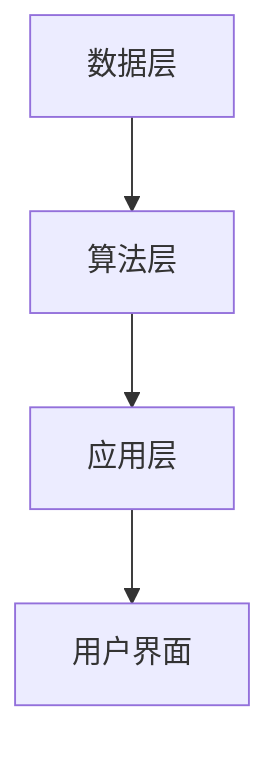
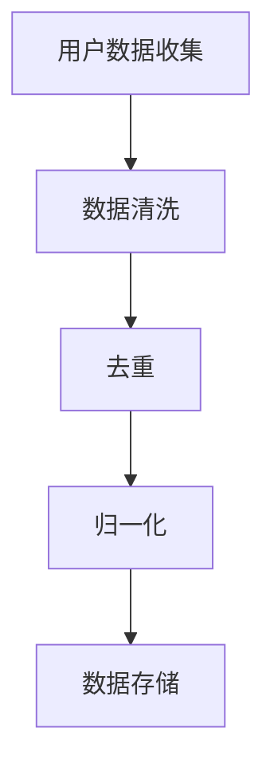
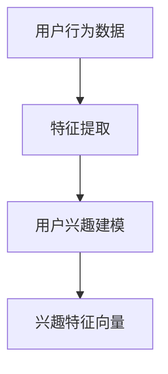
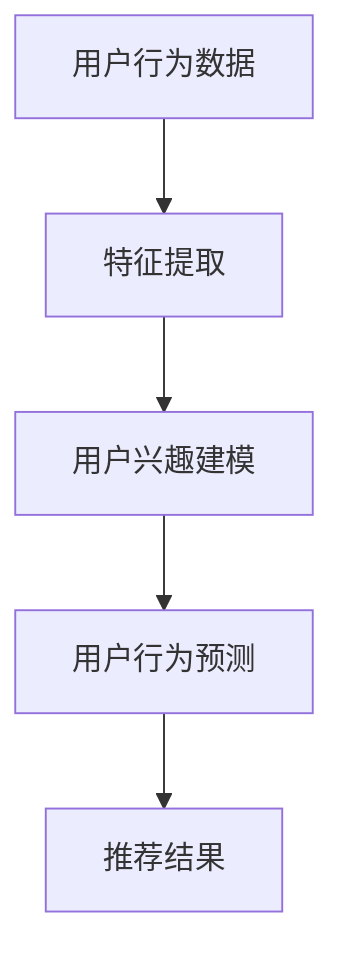

                 

## 文章标题

《推荐系统的未来：大模型的主导地位》

## 关键词

推荐系统，大模型，深度学习，协同过滤，内容推荐，用户行为分析

## 摘要

随着互联网和大数据技术的飞速发展，推荐系统已成为现代信息检索和个性化服务的重要工具。本文从推荐系统的核心概念出发，逐步探讨了用户行为分析、基于内容的推荐、基于协同过滤的推荐以及基于大模型的推荐系统。重点分析了大模型在推荐系统中的应用，包括大模型的基本原理、训练与部署、优化策略以及性能评估。最后，通过实际案例展示了大模型推荐系统的搭建、性能评估和优化实践，为推荐系统研究和应用提供了有益的参考。

## 文章标题：推荐系统的未来：大模型的主导地位

### 关键词：推荐系统，大模型，深度学习，协同过滤，内容推荐，用户行为分析

### 摘要：

本文深入探讨了推荐系统的演变和未来趋势，特别关注了大模型在推荐系统中的重要作用。首先，我们回顾了推荐系统的基本概念、架构和发展历程。接着，详细介绍了用户行为分析、基于内容的推荐和基于协同过滤的推荐方法。然后，重点分析了大模型的基本原理、在推荐系统中的应用以及面临的挑战。最后，通过实际案例展示了大模型推荐系统的实战应用和优化策略，为推荐系统的未来研究和实践提供了新的视角。

### 目录

**第一部分：推荐系统基础知识**

### 第1章：推荐系统概述
#### 1.1 推荐系统的概念与历史
#### 1.2 推荐系统的类型与应用场景
#### 1.3 推荐系统的挑战与机遇

### 第2章：用户行为分析
#### 2.1 用户数据的收集与处理
#### 2.2 用户兴趣建模
#### 2.3 用户行为分析模型

**第二部分：基于内容推荐**

### 第3章：内容表示与匹配
#### 3.1 内容特征提取
#### 3.2 内容相似度计算
#### 3.3 内容推荐算法

### 第4章：基于协作过滤的推荐
#### 4.1 协作过滤算法原理
#### 4.2 用户评分预测模型
#### 4.3 常见的协作过滤算法

**第三部分：基于模型的推荐系统**

### 第5章：推荐算法的发展与选择
#### 5.1 传统机器学习推荐算法
#### 5.2 深度学习在推荐系统中的应用
#### 5.3 线性模型与非线性模型在推荐系统中的应用

### 第6章：推荐系统的优化与评估
#### 6.1 推荐系统的优化策略
#### 6.2 推荐效果的评估指标
#### 6.3 用户反馈与推荐系统迭代

**第四部分：大模型的主导地位**

### 第7章：大模型在推荐系统中的作用
#### 7.1 大模型的基本原理
#### 7.2 大模型在推荐系统中的应用
#### 7.3 大模型的优势与挑战

### 第8章：基于大模型的推荐系统架构
#### 8.1 大模型的训练与部署
#### 8.2 大模型在推荐系统中的协同过滤
#### 8.3 大模型在内容推荐中的应用

### 第9章：大模型推荐系统的优化
#### 9.1 大模型推荐系统的优化策略
#### 9.2 大模型推荐系统的性能评估
#### 9.3 大模型推荐系统的未来趋势

**第五部分：实战案例**

### 第10章：推荐系统项目实战
#### 10.1 项目背景与需求分析
#### 10.2 系统设计与技术选型
#### 10.3 代码实现与性能优化
#### 10.4 项目评估与总结

### 第11章：大模型推荐系统实战
#### 11.1 大模型推荐系统的搭建
#### 11.2 大模型推荐系统的案例分析
#### 11.3 大模型推荐系统的性能评估
#### 11.4 大模型推荐系统的实践总结

**第六部分：附录**

### 第12章：推荐系统常用工具与资源
#### 12.1 开源推荐系统框架
#### 12.2 数据集与数据源
#### 12.3 推荐系统论文与报告
#### 12.4 推荐系统社区与论坛

### 第13章：大模型开发环境搭建
#### 13.1 硬件配置与选型
#### 13.2 软件环境安装与配置
#### 13.3 开发工具与库的选择
#### 13.4 大模型训练与部署实践

---

**第一部分：推荐系统基础知识**

### 第1章：推荐系统概述

#### 1.1 推荐系统的概念与历史

推荐系统是一种通过分析用户行为和兴趣，为用户推荐相关内容或产品的系统。它的概念可以追溯到1992年，当时Netflix举办了一场“千美元电影推荐挑战”，旨在通过算法推荐电影给用户，以提高用户满意度。

推荐系统的发展可以分为三个阶段：

1. **基于规则的推荐系统**：早期推荐系统主要依赖于预设的规则和阈值，例如根据用户的浏览历史推荐相似的内容。
2. **基于协同过滤的推荐系统**：随着互联网和大数据技术的发展，协同过滤成为主流的推荐方法，通过分析用户之间的相似性来推荐内容。
3. **基于模型的推荐系统**：近年来，深度学习技术的进步使得基于模型的推荐系统逐渐成为研究热点，能够更准确地提取用户兴趣和内容特征。

#### 1.2 推荐系统的类型与应用场景

推荐系统主要可以分为以下几类：

1. **基于内容的推荐**：通过分析内容特征，为用户推荐相似的内容。例如，电商平台根据商品的特征推荐相关的商品。
2. **协同过滤推荐**：通过分析用户之间的行为模式，为用户推荐其他用户喜欢的内容。例如，社交媒体平台根据用户关系推荐好友。
3. **混合推荐**：结合多种推荐方法，以提高推荐效果。例如，电商平台可能同时使用基于内容和协同过滤的方法推荐商品。

推荐系统的应用场景非常广泛，包括但不限于：

- **电子商务**：推荐商品、促销活动等。
- **社交媒体**：推荐内容、好友等。
- **在线视频平台**：推荐电影、电视剧等。
- **音乐平台**：推荐音乐、歌手等。
- **新闻媒体**：推荐新闻、文章等。

#### 1.3 推荐系统的挑战与机遇

推荐系统面临以下挑战：

- **数据稀疏性**：用户行为数据通常非常稀疏，难以准确预测用户兴趣。
- **实时性**：推荐系统需要快速响应用户行为，提供实时推荐。
- **多样性**：推荐系统需要提供多样化的推荐结果，避免用户产生疲劳感。
- **解释性**：用户希望了解推荐的原因，提高推荐的可解释性。

同时，推荐系统也带来了许多机遇：

- **个性化体验**：通过准确推荐，提高用户满意度和忠诚度。
- **业务增长**：推荐系统有助于提高销售额和用户参与度。
- **数据挖掘**：推荐系统产生的数据可以用于进一步的数据挖掘和分析。

#### 1.4 推荐系统的架构

推荐系统一般包括以下几个层次：

1. **数据层**：负责收集、存储和处理用户行为数据、内容特征数据等。
2. **算法层**：包含协同过滤、基于内容的推荐、基于模型的推荐等算法。
3. **应用层**：将推荐结果呈现给用户，可以是网页、移动应用或API等形式。

以下是一个简单的推荐系统架构图：



- **数据层**：包括用户行为数据的收集和处理，以及内容特征数据的提取和存储。
- **算法层**：根据不同的推荐方法，选择合适的算法实现推荐。
- **应用层**：将推荐结果通过网页、移动应用或API等形式呈现给用户。

通过以上架构，推荐系统可以高效地响应用户需求，提供个性化的推荐服务。

### 第2章：用户行为分析

#### 2.1 用户数据的收集与处理

用户数据是推荐系统的重要输入，主要包括用户的行为数据、内容特征数据和用户信息等。用户数据的收集通常通过以下几种方式：

1. **客户端日志**：通过在客户端（如浏览器、移动应用等）中记录用户的操作行为，收集用户行为数据。
2. **服务器日志**：通过在服务器端记录用户的请求和操作行为，收集用户行为数据。
3. **第三方数据源**：通过集成第三方数据源（如社交媒体、搜索引擎等），获取用户信息和行为数据。

用户数据的处理包括数据清洗、去重、归一化等步骤。数据清洗的目的是去除无效、错误或重复的数据，提高数据质量。去重是指去除重复的数据记录，避免数据冗余。归一化是指将不同量级的数据进行转换，使其在同一尺度上进行分析。

以下是一个简单的用户数据收集与处理流程：



#### 2.2 用户兴趣建模

用户兴趣建模是将用户的行为数据转化为用户兴趣特征的过程。用户兴趣建模对于推荐系统的准确性至关重要。常见的用户兴趣建模方法包括以下几种：

1. **基于内容的特征提取**：通过提取用户行为数据中的内容特征，如商品类别、标签、关键词等，来表示用户兴趣。这种方法适用于基于内容的推荐系统。
2. **基于协同过滤的特征提取**：通过分析用户行为数据中的相似用户或相似物品，提取相似性特征来表示用户兴趣。这种方法适用于协同过滤推荐系统。
3. **基于主题模型的特征提取**：通过使用主题模型（如LDA）分析用户行为数据，提取用户兴趣的主题分布。这种方法适用于复杂用户兴趣建模。

以下是一个简单的用户兴趣建模流程：



#### 2.3 用户行为分析模型

用户行为分析模型是用于分析用户行为，预测用户兴趣和行为的模型。常见的用户行为分析模型包括以下几种：

1. **基于用户的协同过滤模型**：通过分析用户之间的相似性，为用户推荐其他用户喜欢的物品。常用的算法包括KNN（基于用户相似度）和矩阵分解（如Singular Value Decomposition, SVD）。
2. **基于内容的推荐模型**：通过分析物品的内容特征，为用户推荐与用户历史行为相似或相关的物品。常用的算法包括基于记忆的推荐（如最近邻推荐）和基于模型的推荐（如逻辑回归、决策树等）。
3. **混合推荐模型**：结合基于用户和基于内容的推荐方法，以提高推荐准确性。常见的混合推荐模型包括基于模型的混合推荐（如矩阵分解 + 逻辑回归）和基于内容的混合推荐（如基于模型的文本匹配 + 相似度计算）。

以下是一个简单的用户行为分析模型示例：



通过用户行为分析模型，推荐系统可以更好地理解用户兴趣和行为，提供更准确的推荐。

### 第3章：内容表示与匹配

#### 3.1 内容特征提取

内容特征提取是将非结构化的内容数据（如文本、图片、音频等）转化为计算机可以理解和处理的特征向量的过程。内容特征提取的质量直接影响推荐系统的性能。

1. **文本内容特征提取**：文本内容特征提取主要包括词袋模型（Bag of Words, BoW）、TF-IDF（Term Frequency-Inverse Document Frequency）和词嵌入（Word Embedding）等。
   - **词袋模型**：将文本表示为词的集合，忽略词的顺序。适用于简单的文本分类和主题模型。
   - **TF-IDF**：基于词频和逆文档频率的统计方法，可以增强重要词的权重。适用于文本搜索和推荐系统。
   - **词嵌入**：通过神经网络模型将每个词映射到高维向量空间中，可以捕捉词的语义信息。常用模型包括Word2Vec、GloVe和BERT等。

2. **图片内容特征提取**：图片内容特征提取主要包括CNN（卷积神经网络）和特征提取工具（如VGG、ResNet等）。
   - **CNN**：通过卷积、池化和全连接层等操作，从图片中提取低层特征（如边缘、纹理）和高层特征（如物体、场景）。
   - **特征提取工具**：使用预训练的CNN模型提取图片的特征向量，可以显著提高推荐系统的效果。

3. **音频内容特征提取**：音频内容特征提取主要包括MFCC（梅尔频率倒谱系数）、LSTM（长短期记忆网络）等。
   - **MFCC**：通过频域分析，提取音频的频率特征，常用于语音识别和音乐推荐。
   - **LSTM**：通过处理序列数据，提取音频的时序特征，可以捕捉音频的动态变化。

以下是一个简单的文本内容特征提取示例：

```python
from sklearn.feature_extraction.text import TfidfVectorizer

# 文本数据
documents = [
    'This is the first document.',
    'This document is the second document.',
    'And this is the third one.',
    'Is this the first document?',
]

# TF-IDF向量器
vectorizer = TfidfVectorizer()

# 提取特征向量
X = vectorizer.fit_transform(documents)

# 输出特征向量
print(X.toarray())
```

#### 3.2 内容相似度计算

内容相似度计算是衡量两个内容之间相似程度的方法。相似度计算的质量直接影响推荐系统的准确性。

1. **余弦相似度**：基于向量空间模型，计算两个向量夹角的余弦值。余弦值越接近1，表示两个向量越相似。
   $$ \text{Cosine Similarity} = \frac{\text{dot product of two vectors}}{\text{product of their magnitudes}} $$
   
2. **欧氏距离**：基于欧氏空间模型，计算两个向量之间的欧氏距离。欧氏距离越小，表示两个向量越相似。
   $$ \text{Euclidean Distance} = \sqrt{\sum_{i=1}^{n} (x_i - y_i)^2} $$
   
3. **曼哈顿距离**：基于曼哈顿空间模型，计算两个向量之间的曼哈顿距离。曼哈顿距离可以用于处理稀疏数据集。
   $$ \text{Manhattan Distance} = \sum_{i=1}^{n} |x_i - y_i| $$
   
以下是一个简单的余弦相似度计算示例：

```python
from sklearn.metrics.pairwise import cosine_similarity

# 文本数据
document1 = 'This is the first document.'
document2 = 'This document is the second document.'

# 提取特征向量
vectorizer = TfidfVectorizer()
X1 = vectorizer.fit_transform([document1])
X2 = vectorizer.fit_transform([document2])

# 计算相似度
similarity = cosine_similarity(X1, X2)

# 输出相似度
print(similarity)
```

#### 3.3 内容推荐算法

内容推荐算法是基于内容特征和相似度计算，为用户推荐相关内容的方法。常见的推荐算法包括基于内容的推荐、基于协同过滤的推荐和混合推荐。

1. **基于内容的推荐算法**：
   - **基于记忆的推荐**：使用最近邻算法（如KNN）为用户推荐与用户历史行为相似的内容。
   - **基于模型的推荐**：使用机器学习模型（如逻辑回归、决策树等）预测用户对未知内容的兴趣度。
   
2. **基于协同过滤的推荐算法**：
   - **基于用户的协同过滤**：通过分析用户之间的相似性，为用户推荐其他用户喜欢的相似内容。
   - **基于物品的协同过滤**：通过分析物品之间的相似性，为用户推荐与用户历史行为相似的其他物品。

3. **混合推荐算法**：
   - **基于模型的混合推荐**：结合基于内容和协同过滤的推荐方法，使用机器学习模型（如矩阵分解、多任务学习等）预测用户对内容的兴趣度。

以下是一个简单的基于内容的推荐算法示例：

```python
from sklearn.neighbors import NearestNeighbors

# 文本数据
documents = [
    'This is the first document.',
    'This document is the second document.',
    'And this is the third one.',
    'Is this the first document?',
]

# 提取特征向量
vectorizer = TfidfVectorizer()
X = vectorizer.fit_transform(documents)

# 训练最近邻模型
neighb

