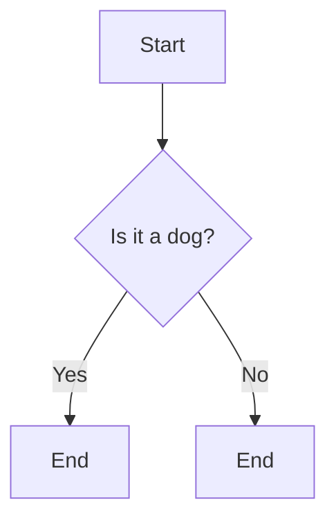
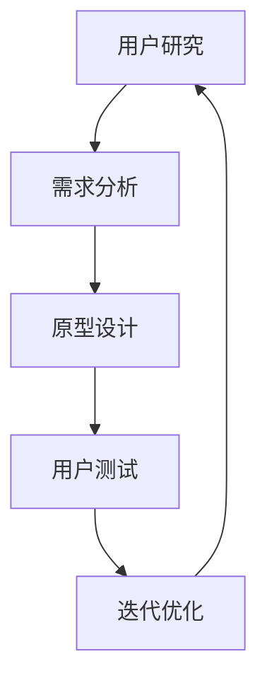
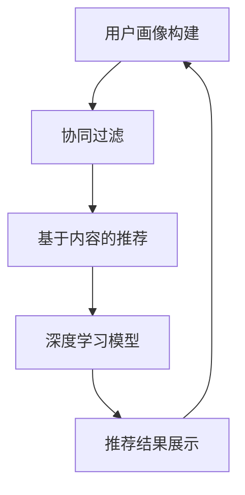

                 

# 提升用户体验的AI策略

> 关键词：用户体验，AI，个性化，交互，情感计算，用户体验设计流程，AI策略实施，伦理，持续优化

> 摘要：本文从用户体验和AI的基础知识出发，详细探讨了AI在提升用户体验中的应用策略。文章首先介绍了用户体验的定义、价值以及设计原则，随后探讨了AI在用户体验中的角色和关系。接着，文章通过七个具体的应用实践章节，详细阐述了AI在内容个性化、交互式AI助手、情感计算与情绪识别、AI辅助设计以及用户体验数据分析与反馈方面的应用。在第三部分，文章聚焦于AI策略的实施与优化，包括策略制定、AI伦理、持续优化与迭代，并提供了丰富的案例分析。最后，文章展望了用户体验和AI融合的未来发展趋势。

## 《提升用户体验的AI策略》目录大纲

## 第一部分：用户体验与AI基础

### 第1章：用户体验基础

#### 1.1 用户体验定义与价值
#### 1.2 用户体验设计原则
#### 1.3 用户体验评估方法

### 第2章：AI与用户体验

#### 2.1 AI概述
#### 2.2 AI在用户体验中的应用
#### 2.3 AI与用户体验的关系

### 第3章：用户体验设计流程

#### 3.1 用户研究方法
#### 3.2 需求分析
#### 3.3 原型设计与迭代

## 第二部分：AI在用户体验中的应用实践

### 第4章：AI驱动的内容个性化

#### 4.1 内容个性化技术原理
#### 4.2 个性化推荐算法
#### 4.3 实际案例分析

### 第5章：交互式AI助手

#### 5.1 AI助手设计原则
#### 5.2 自然语言处理技术
#### 5.3 AI助手开发与部署

### 第6章：情感计算与情绪识别

#### 6.1 情感计算基本原理
#### 6.2 情绪识别技术
#### 6.3 情感分析应用案例

### 第7章：AI辅助设计

#### 7.1 AI设计工具概述
#### 7.2 AI在创意生成中的应用
#### 7.3 AI在用户体验优化中的应用

### 第8章：用户体验数据分析与反馈

#### 8.1 数据分析基础
#### 8.2 用户行为分析
#### 8.3 数据驱动用户体验优化

## 第三部分：提升用户体验的AI策略实施与优化

### 第9章：AI策略制定

#### 9.1 AI策略制定原则
#### 9.2 AI策略实施步骤
#### 9.3 AI策略评估方法

### 第10章：AI伦理与用户体验

#### 10.1 AI伦理概述
#### 10.2 AI伦理在用户体验中的应用
#### 10.3 AI伦理风险与管理

### 第11章：持续优化与迭代

#### 11.1 用户体验反馈收集
#### 11.2 AI模型优化方法
#### 11.3 持续迭代与用户参与

### 第12章：案例分析

#### 12.1 案例分析概述
#### 12.2 成功案例分析
#### 12.3 失败案例分析

### 第13章：未来发展趋势与展望

#### 13.1 用户体验发展趋势
#### 13.2 AI技术发展趋势
#### 13.3 用户体验与AI融合的未来

## 附录

### 附录A：AI与用户体验相关资源

#### A.1 学术论文与研究报告
#### A.2 开源框架与工具
#### A.3 行业标准与规范

### 附录B：Mermaid流程图

#### B.1 Mermaid基本语法
#### B.2 用户体验设计流程图示例
#### B.3 AI驱动内容个性化流程图示例

---

### 第1章：用户体验基础

#### 1.1 用户体验定义与价值

用户体验（User Experience，简称UX）是指用户在使用产品或服务过程中所感受到的整体感受。它不仅仅关注产品的功能，还包括用户在使用过程中所体验到的情感、认知以及交互等各个方面。用户体验的价值在于它直接影响用户的满意度和忠诚度，进而影响产品的市场表现。

用户体验的价值可以从以下几个方面进行阐述：

1. **提高用户满意度**：良好的用户体验能够满足用户的需求，提供流畅、直观的使用体验，从而提高用户的满意度。

2. **增强用户忠诚度**：当用户对产品或服务产生好感时，他们更可能持续使用，甚至推荐给他人。

3. **降低用户流失率**：用户体验不佳会导致用户转向竞争对手，因此提升用户体验有助于降低用户流失率。

4. **增加商业价值**：用户体验的提升可以带来更多的用户转化和收入，从而增加商业价值。

#### 1.2 用户体验设计原则

为了设计出良好的用户体验，我们需要遵循一些基本原则：

1. **以用户为中心**：用户体验设计应以用户的需求和期望为核心，确保产品设计能够满足用户的基本需求。

2. **简洁性**：简洁明了的设计能够降低用户的认知负担，提高使用效率。

3. **一致性**：在设计过程中应保持界面元素的一致性，确保用户能够轻松适应。

4. **可访问性**：设计应考虑到所有用户，包括残疾人，确保产品能够被广泛使用。

5. **反馈机制**：及时响应用户的行为和反馈，有助于提高用户体验。

#### 1.3 用户体验评估方法

用户体验评估是确保产品设计符合用户需求的重要环节。以下是一些常用的用户体验评估方法：

1. **用户调研**：通过问卷、访谈等方式收集用户对产品的看法和反馈。

2. **可用性测试**：邀请实际用户参与，观察他们在使用产品时的行为和反应。

3. **A/B测试**：通过对比两组用户的反馈，评估不同设计方案的优劣。

4. **分析工具**：利用数据分析工具，如Google Analytics，监控用户的行为和互动。

---

通过上述章节，我们初步了解了用户体验的定义、价值、设计原则以及评估方法。接下来，我们将探讨AI与用户体验之间的关系，以及如何将AI技术应用于提升用户体验。让我们一起走进第二部分：AI与用户体验。

---

### 第2章：AI与用户体验

#### 2.1 AI概述

人工智能（Artificial Intelligence，简称AI）是指由计算机系统执行的智能行为。它包括机器学习、深度学习、自然语言处理、计算机视觉等多个领域。AI的目标是模拟人类智能，使计算机能够自主地完成复杂的任务。

AI的发展经历了几个阶段：

1. **早期阶段**：从20世纪50年代到70年代，AI主要是基于规则和逻辑推理。

2. **复苏阶段**：从20世纪80年代到90年代，随着计算机性能的提升和大数据的出现，AI进入了复苏阶段，特别是机器学习开始崭露头角。

3. **近期发展**：从21世纪初至今，深度学习和神经网络技术的发展使得AI取得了显著的突破，如语音识别、图像识别、自然语言处理等。

#### 2.2 AI在用户体验中的应用

AI在用户体验中的应用非常广泛，主要包括以下几个方面：

1. **个性化推荐**：基于用户的历史行为和偏好，AI可以提供个性化的推荐，提高用户满意度和参与度。

2. **交互式AI助手**：通过自然语言处理技术，AI助手能够与用户进行实时互动，提供帮助和解答疑问，提升用户的使用体验。

3. **情感计算与情绪识别**：AI可以通过分析用户的行为和语言，识别用户的情绪，提供更加人性化的服务。

4. **用户体验优化**：通过分析用户行为数据，AI可以找出用户体验中的问题，并提出优化建议。

#### 2.3 AI与用户体验的关系

AI与用户体验之间的关系可以概括为以下几个方面：

1. **增强用户体验**：AI技术可以提供更加个性化和智能化的服务，满足用户的多样化需求，从而提升用户体验。

2. **优化产品设计**：通过分析用户行为数据，AI可以帮助设计师更好地理解用户需求，优化产品设计。

3. **降低开发成本**：AI技术可以自动化许多设计过程，降低人力成本和开发时间。

4. **提高用户满意度**：AI驱动的个性化推荐和交互式助手可以提供更好的使用体验，提高用户满意度。

总之，AI在用户体验中的应用为设计师和开发人员提供了强大的工具，使他们能够更好地满足用户的需求，提升产品的竞争力。

---

通过本章的探讨，我们了解了AI的基本概念以及它在用户体验中的应用。接下来，我们将进入第三部分，详细讨论用户体验设计流程。这将帮助我们更好地理解如何在设计过程中应用AI技术，提升用户体验。让我们继续深入探讨。

---

### 第3章：用户体验设计流程

#### 3.1 用户研究方法

用户研究是用户体验设计的关键环节，它帮助我们了解目标用户的需求、行为和偏好。以下是一些常见的用户研究方法：

1. **问卷调查**：通过设计问卷，收集用户对产品或服务的看法和反馈。问卷调查的优点是覆盖面广，但缺点是数据质量可能受到影响。

2. **访谈**：通过与用户进行一对一或小组访谈，深入了解他们的需求和痛点。访谈的优点是能够获取更深入的信息，但缺点是耗时且成本较高。

3. **可用性测试**：邀请实际用户参与，观察他们在使用产品或服务时的行为和反应。可用性测试的优点是能够实时发现设计问题，但缺点是测试样本有限。

4. **用户观察**：在用户自然使用环境中的观察，记录用户的行为和互动。用户观察的优点是能够获取真实的使用情境，但缺点是需要较长的时间。

5. **情景模拟**：通过设计模拟场景，让用户在特定情境下使用产品或服务。情景模拟的优点是能够模拟真实场景，但缺点是需要精心设计。

#### 3.2 需求分析

需求分析是用户体验设计的重要阶段，它帮助我们确定产品的核心功能和用户故事。以下是一些常用的需求分析方法：

1. **用户故事**：通过编写用户故事，描述用户在特定情境下的需求。用户故事通常包含三个部分：用户角色、目标和场景。

2. **用户画像**：通过对目标用户进行画像，了解他们的基本特征、需求和痛点。用户画像可以帮助设计师更好地了解用户，从而设计出更符合需求的产品。

3. **功能分析**：分析产品的功能，确定哪些功能是核心功能，哪些是次要功能。功能分析有助于确保产品的功能设计符合用户需求。

4. **需求优先级排序**：根据用户需求和产品目标，对需求进行优先级排序。优先级排序有助于确保产品开发过程中能够优先解决最关键的需求。

#### 3.3 原型设计与迭代

原型设计是用户体验设计的重要环节，它帮助我们构建产品的初步模型，以便进行测试和反馈。以下是一些原型设计的方法：

1. **低保真原型**：使用简单的工具，如纸张或在线工具，快速构建产品的初步模型。低保真原型的优点是成本低、易于修改，但缺点是细节表现力有限。

2. **高保真原型**：使用专业的原型设计工具，如Sketch或Figma，构建产品的详细模型。高保真原型的优点是能够呈现更逼真的视觉效果，但缺点是成本较高且修改复杂。

3. **交互原型**：通过设计交互流程，模拟用户在使用产品时的操作。交互原型可以帮助设计师和开发人员更好地理解产品的操作逻辑和交互流程。

4. **迭代设计**：在原型设计过程中，不断进行迭代和优化。迭代设计可以帮助设计师在早期发现并解决潜在问题，提高产品的最终质量。

总之，用户体验设计流程是一个迭代和优化的过程，通过用户研究、需求分析和原型设计，设计师可以不断改进产品，满足用户的需求，提升用户体验。

---

通过本章的讨论，我们了解了用户体验设计的基本流程，包括用户研究方法、需求分析和原型设计与迭代。这些流程为我们提供了一个系统的方法来设计满足用户需求的产品。在下一章中，我们将探讨AI在用户体验设计中的应用，进一步探索如何利用AI技术提升用户体验。让我们继续前进！

---

## 第二部分：AI在用户体验中的应用实践

### 第4章：AI驱动的内容个性化

#### 4.1 内容个性化技术原理

内容个性化是指根据用户的兴趣、行为和历史数据，为其推荐符合其偏好和需求的内容。AI技术在内容个性化中起到了关键作用，其核心原理主要包括以下几方面：

1. **用户画像**：通过收集和分析用户的数据，如浏览历史、购买记录、社交行为等，构建用户的个性化画像。画像的维度可以包括兴趣爱好、行为特征、心理特征等。

2. **协同过滤**：协同过滤是一种基于用户行为数据推荐内容的方法。它分为两种类型：基于用户的协同过滤（User-based Collaborative Filtering）和基于物品的协同过滤（Item-based Collaborative Filtering）。基于用户的协同过滤通过找到与目标用户行为相似的其他用户，推荐这些用户喜欢的内容；基于物品的协同过滤则通过找到与目标用户行为相似的其他物品，推荐这些物品。

3. **基于内容的推荐**：基于内容的推荐（Content-based Filtering）通过分析内容的特征和标签，为用户推荐与其兴趣相关的内容。这种方法通常用于补充协同过滤的不足，提供更丰富的推荐结果。

4. **深度学习**：深度学习模型，如卷积神经网络（CNN）、循环神经网络（RNN）和Transformer等，可以自动从大量数据中学习到内容的特征和模式，为用户推荐个性化内容。

#### 4.2 个性化推荐算法

个性化推荐算法是内容个性化技术的核心，以下是一些常用的个性化推荐算法：

1. **基于模型的推荐算法**：
   - **矩阵分解**：通过矩阵分解技术，将用户-物品评分矩阵分解为用户特征矩阵和物品特征矩阵，从而实现推荐。
   - **潜在因子模型**：如LDA（主题模型），将用户和物品映射到潜在空间，通过优化潜在空间中的参数，实现推荐。

2. **基于规则的推荐算法**：
   - **基于兴趣标签的推荐**：通过分析用户的兴趣标签，为用户推荐具有相似标签的内容。
   - **基于规则的推荐**：通过定义一系列规则，如“如果用户A喜欢内容X，则推荐内容X给用户B”，实现推荐。

3. **基于深度学习的推荐算法**：
   - **基于注意力机制的推荐**：通过注意力机制，模型能够自动关注重要特征，提高推荐的准确性。
   - **基于图神经网络的推荐**：利用图神经网络，模型可以捕捉用户和物品之间的关系，实现推荐。

#### 4.3 实际案例分析

以下是一个实际案例，展示了AI如何驱动内容个性化，提升用户体验：

**案例：Netflix**

Netflix是全球领先的流媒体服务提供商，其成功的一个关键因素就是其强大的内容个性化推荐系统。

1. **用户画像构建**：Netflix通过收集用户的历史观看记录、搜索历史、设备信息等数据，构建用户的个性化画像。这些画像包括用户的兴趣偏好、观看时间、观看频率等。

2. **推荐算法**：Netflix使用基于协同过滤和深度学习的混合推荐算法。协同过滤负责提供基本的推荐结果，而深度学习算法则通过学习用户和视频的复杂特征，提供更加个性化的推荐。

3. **推荐结果展示**：Netflix的推荐结果基于用户的个性化画像，实时更新。用户可以在主页上看到一系列个性化的推荐视频，包括“为你推荐”、“热门电影”、“观看记录”等。

4. **用户反馈**：Netflix通过用户的观看行为和评分，不断调整推荐算法，提高推荐的准确性。如果用户对某个推荐视频不感兴趣，Netflix会减少对该视频的推荐频率。

通过上述案例，我们可以看到AI驱动的内容个性化在提升用户体验方面的巨大潜力。Netflix的成功经验为其他企业提供了宝贵的参考，展示了如何利用AI技术为用户提供个性化、高质量的内容。

---

通过本章的讨论，我们详细了解了AI驱动的内容个性化技术原理、算法以及实际案例。在下一章中，我们将探讨交互式AI助手在提升用户体验中的应用。敬请期待！

---

### 第5章：交互式AI助手

#### 5.1 AI助手设计原则

交互式AI助手（如聊天机器人、语音助手等）在提升用户体验方面发挥了重要作用。设计一个成功的AI助手，需要遵循以下原则：

1. **用户友好性**：AI助手应具备良好的用户友好性，包括简洁明了的界面、易于理解的语言以及友好的交互方式。

2. **智能响应**：AI助手应能够智能地理解和响应用户的问题和需求，提供准确和有帮助的信息。

3. **个性化**：AI助手应能够根据用户的偏好和行为，提供个性化的服务和推荐。

4. **可扩展性**：AI助手的设计应具备良好的可扩展性，以便在未来能够添加新的功能和模块。

5. **可解释性**：虽然AI助手是自动化的，但应尽可能提供可解释的决策过程，让用户了解AI助手的工作原理。

6. **安全性**：AI助手的开发和部署应确保用户数据的安全，遵循隐私保护原则。

#### 5.2 自然语言处理技术

自然语言处理（Natural Language Processing，NLP）是实现交互式AI助手的核心技术，主要包括以下几个方面：

1. **文本分析**：文本分析是指对文本进行预处理，包括分词、词性标注、命名实体识别等，以便更好地理解和处理文本数据。

2. **意图识别**：意图识别是指从用户输入的文本中识别出用户想要实现的目标或意图。这通常涉及分类任务，使用机器学习模型，如朴素贝叶斯分类器、支持向量机（SVM）等。

3. **实体识别**：实体识别是指从文本中识别出具体的实体，如人名、地名、组织名等。实体识别是许多应用场景中的关键步骤，如问答系统、信息抽取等。

4. **对话管理**：对话管理是指设计和实现AI助手与用户之间的对话流程。对话管理包括对话状态跟踪、对话策略生成等。

5. **语义理解**：语义理解是指理解文本的深层含义，包括词义消歧、语义角色标注等。语义理解是实现智能对话的关键，它能够帮助AI助手更准确地理解用户的意图。

#### 5.3 AI助手开发与部署

开发一个交互式AI助手需要遵循以下步骤：

1. **需求分析**：明确AI助手的用途、目标和用户需求。

2. **数据准备**：收集和整理用于训练AI助手的文本数据，包括对话日志、问答对、知识库等。

3. **模型选择与训练**：选择适合任务的NLP模型，如BERT、GPT等，并进行训练。训练过程中，需要使用大量高质量的标注数据。

4. **系统集成**：将训练好的模型集成到应用系统中，确保AI助手能够与用户进行交互。

5. **测试与优化**：通过实际用户测试，收集反馈并进行优化，提高AI助手的性能和用户体验。

6. **部署上线**：将优化后的AI助手部署到生产环境，确保其稳定运行。

实际案例：

**案例：苹果公司的Siri**

Siri是苹果公司开发的智能语音助手，它通过自然语言处理技术，能够理解用户的需求并执行相应的操作。以下是Siri的开发与部署过程：

1. **需求分析**：苹果公司希望通过Siri提供便捷的语音交互体验，包括发送短信、拨打电话、设置提醒、查询天气等。

2. **数据准备**：苹果公司收集了大量的对话日志和问答对，用于训练Siri的模型。

3. **模型选择与训练**：苹果公司选择了基于深度学习的NLP模型，如BERT和GPT，并进行训练。

4. **系统集成**：Siri被集成到iPhone、iPad和Mac等设备中，确保用户可以通过语音交互与设备进行互动。

5. **测试与优化**：通过用户测试，苹果公司不断优化Siri的模型和交互流程，提高其性能和用户体验。

6. **部署上线**：Siri在全球范围内的苹果设备上部署，并持续更新，以提供更好的用户体验。

通过上述实际案例，我们可以看到交互式AI助手在提升用户体验方面的巨大潜力。在下一章中，我们将探讨情感计算与情绪识别在用户体验中的应用。敬请期待！

---

### 第6章：情感计算与情绪识别

#### 6.1 情感计算基本原理

情感计算（Affective Computing）是人工智能领域的一个重要分支，旨在使计算机能够理解、处理和模拟人类情感。情感计算的基本原理包括以下几个方面：

1. **情感识别**：情感识别是指通过分析用户的语言、行为和生理信号，识别出用户的情感状态。常用的方法包括面部表情识别、语音情感识别和生理信号情感识别。

2. **情感表达**：情感表达是指计算机能够模拟和展示情感状态，通过视觉、听觉和语言等方式与用户互动。情感表达有助于提高人机交互的自然性和人性化。

3. **情感推理**：情感推理是指基于用户的情感状态和行为，进行逻辑推理和决策。情感推理可以帮助计算机更好地理解用户的需求和意图，提供个性化的服务。

4. **情感合成**：情感合成是指将多种情感信号整合在一起，模拟出人类情感的表达。情感合成需要考虑情感信号的时间序列和空间分布，以提高情感的逼真度。

#### 6.2 情绪识别技术

情绪识别技术是情感计算的核心，它通过分析用户的语言、行为和生理信号，识别出用户的情绪状态。以下是一些常用的情绪识别技术：

1. **面部表情识别**：面部表情识别是通过分析用户的面部表情，识别出用户的情绪状态。常用的方法包括基于图像处理的算法和基于深度学习的算法。

2. **语音情感识别**：语音情感识别是通过分析用户的语音信号，识别出用户的情绪状态。语音情感识别需要考虑语音的音调、语速、音量和语调变化等因素。

3. **生理信号情感识别**：生理信号情感识别是通过分析用户的生理信号，如心率、皮肤电导率、呼吸等，识别出用户的情绪状态。生理信号情感识别具有较高的准确性，但需要专业的设备和技术支持。

4. **多模态情感识别**：多模态情感识别是结合多种情感信号，如面部表情、语音和生理信号，进行综合分析，以提高情绪识别的准确性。

#### 6.3 情感分析应用案例

以下是一个情感分析应用案例，展示了如何利用情感计算技术提升用户体验：

**案例：亚马逊智能音箱Alexa**

亚马逊的智能音箱Alexa利用情感计算技术，通过语音交互为用户提供服务。以下是Alexa在情感分析方面的应用：

1. **情感识别**：Alexa通过语音信号分析，识别出用户的情绪状态，如快乐、愤怒、悲伤等。这有助于Alexa提供更个性化的服务，如推荐音乐、播放笑话等。

2. **情感表达**：当用户表达出积极的情绪时，Alexa会给予积极的回应，如“太好了，我很高兴听到这个消息！”；当用户表达出消极的情绪时，Alexa会提供安慰和支持，如“听起来你很沮丧，如果你想聊天，我一直在这里。”

3. **情感推理**：Alexa通过用户的情绪状态和行为，进行推理和决策。例如，当用户情绪低落时，Alexa可能会推荐一些轻松的音乐或活动，以帮助用户放松心情。

4. **情感合成**：Alexa通过语音合成技术，模拟出自然的人声表达，使交互更加自然和亲切。

通过上述应用案例，我们可以看到情感计算在提升用户体验方面的潜力。情感计算技术可以帮助AI助手更好地理解用户的需求和情绪，提供更人性化的服务，从而提升用户体验。

---

通过本章的讨论，我们详细了解了情感计算与情绪识别的基本原理和技术，以及其在实际应用中的案例。在下一章中，我们将探讨AI辅助设计在提升用户体验中的应用。敬请期待！

---

### 第7章：AI辅助设计

#### 7.1 AI设计工具概述

AI辅助设计是指利用人工智能技术，如机器学习、深度学习和计算机视觉等，辅助设计师完成设计任务。AI设计工具可以大大提高设计效率，提供创新的解决方案。以下是几种常见的AI设计工具：

1. **风格迁移工具**：如DeepArt和Prisma，可以通过深度学习算法，将一种艺术风格应用到用户提供的图片上，创造独特的视觉效果。

2. **图像生成工具**：如GANPaint和DeepArt，可以通过生成对抗网络（GAN）生成高质量的图像，为设计师提供无限的创意灵感。

3. **交互式设计工具**：如Adobe Sensei和Sketch plugins，可以通过AI技术，自动生成设计原型、推荐颜色搭配和布局等，提高设计过程的效率。

4. **优化工具**：如AutoCAD和Revit，可以通过AI技术，自动优化建筑设计的结构、材料和能源效率等，提高设计质量和成本效益。

#### 7.2 AI在创意生成中的应用

AI在创意生成中的应用潜力巨大，以下是一些具体的例子：

1. **文本生成**：AI可以生成高质量的文本内容，如新闻文章、广告文案和故事情节等。例如，OpenAI的GPT-3模型可以生成流畅、自然的文本。

2. **图像生成**：AI可以生成高质量的艺术图像和照片，如DeepArt和GANPaint等工具，可以创建独特的艺术作品。

3. **音乐生成**：AI可以生成音乐和旋律，如Google的Magenta项目，通过生成对抗网络（GAN）生成复杂的音乐结构。

4. **视频生成**：AI可以生成视频内容，如视频合成、特效添加和内容生成等，提高了视频制作的效率和质量。

#### 7.3 AI在用户体验优化中的应用

AI在用户体验优化中的应用，可以通过以下几种方式实现：

1. **个性化推荐**：AI可以根据用户的行为数据，提供个性化的内容和服务，提高用户的满意度和参与度。

2. **交互优化**：AI可以通过分析用户的交互数据，优化界面设计和交互流程，提高用户的操作效率和体验。

3. **反馈分析**：AI可以自动分析用户反馈，识别问题和优化点，提供改进建议。

4. **测试与优化**：AI可以自动进行A/B测试和用户体验测试，通过分析测试结果，优化产品的设计。

实际案例：

**案例：Airbnb的设计优化**

Airbnb利用AI技术，对用户界面进行优化，以提高用户体验。以下是具体的优化实践：

1. **个性化推荐**：Airbnb使用AI算法，根据用户的历史浏览记录和偏好，为用户推荐合适的房源。

2. **交互优化**：通过分析用户的交互数据，Airbnb优化了搜索界面和房源展示方式，提高了用户的操作效率和满意度。

3. **反馈分析**：Airbnb使用AI技术，自动分析用户的反馈，识别问题和优化点，例如改进房源描述和图片展示。

4. **测试与优化**：通过A/B测试，Airbnb不断优化用户界面和交互流程，根据测试结果进行改进，以提高用户体验。

通过上述案例，我们可以看到AI辅助设计在创意生成和用户体验优化中的应用潜力。AI技术不仅提高了设计效率和创意质量，还为设计师提供了强大的工具，以优化用户体验。

---

通过本章的讨论，我们详细了解了AI辅助设计的基本概念、应用场景和实际案例。在下一章中，我们将探讨用户体验数据分析与反馈的相关内容。敬请期待！

---

### 第8章：用户体验数据分析与反馈

#### 8.1 数据分析基础

用户体验数据分析是提升产品质量和用户满意度的关键环节。数据分析的基础包括以下几个方面：

1. **数据收集**：数据收集是指从各种渠道获取与用户体验相关的数据，如用户行为数据、反馈数据、性能数据等。数据收集的方法包括日志分析、问卷调查、用户访谈等。

2. **数据处理**：数据处理是指对收集到的数据进行清洗、整理和存储，以便后续分析。数据处理的过程包括数据预处理、去重、数据格式转换等。

3. **数据可视化**：数据可视化是指通过图表、图形等方式，将数据分析结果直观地展示出来，便于理解和决策。常用的数据可视化工具包括Tableau、Power BI等。

4. **统计分析**：统计分析是指使用统计方法，对数据进行分析和解释。统计分析的方法包括描述性统计、推断性统计、回归分析等。

#### 8.2 用户行为分析

用户行为分析是用户体验数据分析的核心，它帮助我们了解用户在使用产品时的行为模式、偏好和痛点。以下是一些常见的用户行为分析方法和指标：

1. **访问量分析**：通过分析网站或应用的访问量，了解用户的访问频率和访问来源。常用的指标包括访问量、访问时长、跳出率、页面访问深度等。

2. **转化率分析**：通过分析用户的转化行为，如注册、购买、咨询等，了解用户的参与度和转化效率。常用的指标包括转化率、转化路径、漏斗分析等。

3. **交互行为分析**：通过分析用户的交互行为，如点击、滑动、滚动等，了解用户的操作习惯和偏好。常用的指标包括点击率、点击路径、操作时长等。

4. **内容分析**：通过分析用户对内容的访问和反馈，了解用户对内容的偏好和满意度。常用的指标包括内容浏览量、内容评分、评论数量等。

5. **留存分析**：通过分析用户的留存情况，了解用户的活跃度和忠诚度。常用的指标包括日活跃用户数（DAU）、月活跃用户数（MAU）、留存率等。

#### 8.3 数据驱动用户体验优化

数据驱动用户体验优化是指基于用户行为数据和分析结果，对产品进行优化和改进。以下是一些具体的方法和步骤：

1. **需求分析**：通过用户调研和数据分析，了解用户的需求和痛点，确定优化方向。

2. **方案设计**：根据需求分析结果，设计具体的优化方案，包括界面改进、功能优化、交互优化等。

3. **测试与验证**：通过A/B测试或用户测试，验证优化方案的有效性，收集用户反馈。

4. **实施与迭代**：根据测试结果和用户反馈，实施优化方案，并进行持续迭代和改进。

5. **数据跟踪**：对优化后的产品进行数据跟踪和分析，评估优化效果，为后续优化提供数据支持。

实际案例：

**案例：腾讯QQ的优化**

腾讯QQ是一款广受欢迎的即时通讯软件，通过用户行为数据分析，腾讯QQ进行了多次优化，提高了用户体验。以下是具体的优化实践：

1. **访问量分析**：通过分析用户的访问量和访问来源，腾讯QQ确定了用户主要集中在移动端，因此加大了对移动端的优化力度。

2. **转化率分析**：通过分析用户的注册和登录行为，腾讯QQ优化了注册流程和登录界面，提高了用户的注册率和活跃度。

3. **交互行为分析**：通过分析用户的交互行为，腾讯QQ优化了消息推送和聊天界面，提高了用户的操作效率和满意度。

4. **内容分析**：通过分析用户对QQ空间的访问和反馈，腾讯QQ优化了空间功能，增加了用户喜爱的内容。

5. **留存分析**：通过分析用户的留存情况，腾讯QQ优化了用户活动，如游戏、直播等，提高了用户的活跃度和忠诚度。

通过上述案例，我们可以看到数据驱动用户体验优化在提升产品质量和用户满意度方面的巨大作用。在下一章中，我们将探讨如何制定和实施提升用户体验的AI策略。敬请期待！

---

### 第9章：AI策略制定

#### 9.1 AI策略制定原则

制定有效的AI策略是提升用户体验的关键。以下是一些关键的AI策略制定原则：

1. **用户中心原则**：AI策略应以用户需求为中心，确保产品功能和交互设计能够满足用户的核心需求。

2. **数据驱动原则**：AI策略的制定应基于大量用户行为数据和分析结果，以确保策略的可行性和有效性。

3. **创新性原则**：AI策略应鼓励创新，尝试新的技术和方法，以提供独特的用户体验。

4. **可扩展性原则**：AI策略应具备良好的可扩展性，以便在未来能够添加新的功能和模块。

5. **可持续性原则**：AI策略应考虑长期的可持续性，包括数据管理、算法优化和系统维护等方面。

#### 9.2 AI策略实施步骤

实施AI策略是一个系统化的过程，以下是一些关键的步骤：

1. **需求分析**：明确用户需求和期望，确定AI策略的目标和范围。

2. **数据收集**：收集与用户体验相关的数据，包括用户行为、反馈和性能数据等。

3. **数据分析**：对收集到的数据进行清洗、整理和分析，识别用户痛点和优化机会。

4. **策略设计**：基于数据分析结果，设计具体的AI策略，包括算法选择、模型训练和系统架构等。

5. **原型开发**：开发AI策略的原型，进行初步测试和验证。

6. **测试与优化**：通过A/B测试和用户测试，评估AI策略的效果，并进行优化。

7. **实施与部署**：将优化后的AI策略部署到生产环境中，确保其稳定运行。

8. **监控与反馈**：持续监控AI策略的运行效果，收集用户反馈，进行迭代和改进。

#### 9.3 AI策略评估方法

评估AI策略的有效性是确保其持续改进的关键。以下是一些常用的评估方法：

1. **关键绩效指标（KPI）**：通过设定关键绩效指标，如用户满意度、转化率、留存率等，评估AI策略的效果。

2. **用户反馈**：通过用户调研、问卷调查和访谈等方式，收集用户对AI策略的反馈，了解其满意度和改进需求。

3. **A/B测试**：通过对比两组用户的反馈和数据，评估不同AI策略的效果，选择最优方案。

4. **数据分析**：通过对用户行为数据的分析，评估AI策略对用户行为和满意度的影响。

5. **经济效益分析**：评估AI策略对业务收益和成本的影响，确保其经济效益。

通过上述原则、步骤和评估方法，我们可以系统地制定和实施AI策略，提升用户体验。在下一章中，我们将探讨AI伦理与用户体验的关系，以及如何管理AI伦理风险。敬请期待！

---

### 第10章：AI伦理与用户体验

#### 10.1 AI伦理概述

人工智能伦理（AI Ethics）是指关于人工智能应用中的道德问题和行为规范的研究。随着AI技术的快速发展，AI伦理问题日益凸显，特别是在用户体验领域。以下是几个关键的人工智能伦理问题：

1. **隐私保护**：AI技术通常需要处理大量用户数据，如何保护用户隐私成为了一个重要问题。用户对隐私的担忧可能导致他们对AI应用的抵触。

2. **算法偏见**：算法偏见是指AI系统在训练和预测过程中，可能产生对某些群体不公平的偏见。这种偏见可能会影响用户体验，甚至加剧社会不平等。

3. **透明度和可解释性**：用户对AI系统的决策过程缺乏透明度，可能会导致不信任和误解。因此，提高AI系统的可解释性是重要的伦理问题。

4. **责任归属**：当AI系统出现错误或导致不良后果时，如何确定责任归属是一个复杂的伦理问题。责任归属的模糊可能导致用户对AI应用的不信任。

#### 10.2 AI伦理在用户体验中的应用

在用户体验设计中，AI伦理问题至关重要。以下是一些关键的应用场景：

1. **隐私保护设计**：设计时需要考虑如何最小化数据收集和存储的需求，并采取技术措施保护用户隐私。

2. **算法透明度**：确保AI系统的决策过程对用户透明，可以通过可视化和解释工具实现。

3. **用户参与**：在AI策略制定和实施过程中，应鼓励用户参与，以确保AI系统能够满足用户的需求和期望。

4. **公平性检测**：定期评估AI系统的公平性，确保不会对某些用户群体产生不利影响。

#### 10.3 AI伦理风险与管理

AI伦理风险是指AI技术在应用过程中可能带来的道德和社会问题。以下是一些常见的AI伦理风险及管理方法：

1. **隐私泄露**：管理方法包括数据加密、匿名化处理和隐私保护协议。

2. **算法偏见**：管理方法包括数据集的多样化、算法透明度和定期审计。

3. **责任归属**：管理方法包括建立清晰的责任体系、制定明确的操作规范和实施严格的法律监管。

4. **技术不信任**：管理方法包括增强AI系统的可解释性、加强与用户的沟通和建立信任机制。

通过上述措施，我们可以有效管理AI伦理风险，确保AI技术在用户体验中的应用能够符合道德和社会规范。在下一章中，我们将探讨如何通过持续优化与迭代，进一步提升用户体验。敬请期待！

---

### 第11章：持续优化与迭代

#### 11.1 用户体验反馈收集

用户体验反馈是持续优化和迭代的基础。以下是一些关键的用户体验反馈收集方法：

1. **用户调研**：通过问卷调查、深度访谈等方式，收集用户对产品或服务的直接反馈。

2. **可用性测试**：邀请用户参与可用性测试，观察他们在使用产品时的行为和反应，识别潜在问题。

3. **用户行为分析**：通过分析用户行为数据，如点击率、浏览时间、转化率等，了解用户的实际使用体验。

4. **社交媒体监测**：监测用户在社交媒体平台上的反馈和讨论，了解用户的观点和需求。

5. **反馈系统**：在产品中集成反馈系统，让用户可以直接提交问题和建议。

#### 11.2 AI模型优化方法

AI模型的优化是提升用户体验的关键。以下是一些常用的AI模型优化方法：

1. **数据增强**：通过增加数据量、数据变换等方法，提高模型的泛化能力。

2. **超参数调整**：通过调整模型的超参数，如学习率、批次大小等，提高模型性能。

3. **算法改进**：采用更先进的算法，如深度学习、强化学习等，提升模型效果。

4. **集成学习**：通过集成多个模型，提高预测的准确性和稳定性。

5. **在线学习**：在产品运行过程中，持续收集用户反馈，进行模型更新和优化。

#### 11.3 持续迭代与用户参与

持续迭代和用户参与是提升用户体验的重要策略。以下是一些关键实践：

1. **快速迭代**：采用敏捷开发方法，快速开发、测试和部署新功能，确保产品能够及时响应用户需求。

2. **用户反馈循环**：建立用户反馈循环，将用户反馈快速转化为产品改进，提高用户满意度。

3. **用户测试**：定期进行用户测试，验证新功能的可行性和用户体验。

4. **社区建设**：建立用户社区，鼓励用户参与产品讨论，收集用户建议和反馈。

5. **透明沟通**：与用户保持透明沟通，及时告知产品更新和改进计划，增强用户信任。

通过上述方法，我们可以实现持续优化与迭代，不断改进用户体验。在下一章中，我们将通过具体案例分析，探讨AI提升用户体验的成功与挑战。敬请期待！

---

### 第12章：案例分析

#### 12.1 案例分析概述

在本章中，我们将通过两个具体案例，深入探讨AI在提升用户体验方面的成功实践和面临的挑战。

**案例一：亚马逊的推荐系统**

**成功实践**：
1. **个性化推荐**：亚马逊利用协同过滤和深度学习技术，为每位用户生成个性化的推荐列表。这极大地提高了用户的满意度和购买转化率。
2. **实时反馈**：亚马逊的推荐系统可以实时响应用户的行为，如浏览历史、购买记录等，提供动态更新的推荐，确保推荐内容与用户的当前需求保持一致。
3. **数据驱动**：亚马逊不断优化推荐算法，通过分析用户行为数据，调整推荐策略，确保推荐内容的准确性和相关性。

**面临的挑战**：
1. **算法偏见**：由于训练数据的不均衡，推荐系统可能对某些群体产生偏见，导致推荐内容不公平。
2. **隐私问题**：用户对个人信息的安全性担忧，可能会抵制推荐系统的使用。

**案例二：苹果公司的Siri**

**成功实践**：
1. **语音识别**：Siri利用先进的语音识别技术，能够准确理解用户的语音指令，提供快速响应。
2. **多语言支持**：Siri支持多种语言，为全球用户提供了便捷的交互体验。
3. **个性化助手**：通过学习用户的行为和偏好，Siri能够提供个性化的建议和服务，提高了用户的满意度。

**面临的挑战**：
1. **误识别**：Siri的语音识别技术在复杂环境或噪音较大的情况下可能存在误识别问题。
2. **交互体验**：虽然Siri提供了许多功能，但有时用户可能会觉得交互体验不够自然和流畅。

#### 12.2 成功案例分析

亚马逊的推荐系统和苹果公司的Siri都是AI在提升用户体验方面的成功案例。它们通过个性化推荐和智能助手，极大地提升了用户的购物和交互体验。

亚马逊的推荐系统通过个性化推荐，满足了用户的多样化需求，提高了用户的满意度和购买转化率。其成功的关键在于实时反馈和数据驱动的优化。亚马逊能够不断调整推荐算法，确保推荐内容与用户的当前需求保持一致，从而提高了推荐的准确性。

苹果公司的Siri则通过语音识别和多语言支持，为全球用户提供了便捷的交互体验。Siri的成功在于其个性化助手功能，通过学习用户的行为和偏好，提供个性化的建议和服务。然而，Siri在一些复杂环境和噪音较大的情况下，可能存在语音识别误识别问题，这需要进一步优化。

#### 12.3 失败案例分析

虽然AI技术在提升用户体验方面具有巨大潜力，但并非所有应用都能成功。以谷歌的Google Plus为例，尽管谷歌在AI算法和推荐系统方面具有强大实力，但Google Plus未能成功。

**失败原因**：
1. **用户隐私**：谷歌在Google Plus中收集了大量的用户数据，引发了用户对隐私保护的担忧，导致用户流失。
2. **内容质量**：Google Plus的内容质量参差不齐，导致用户体验不佳。
3. **市场定位**：谷歌未能为Google Plus找到清晰的市场定位，导致其功能过于分散，难以吸引用户。

**教训**：
从Google Plus的失败中，我们可以得出以下教训：
1. **重视用户隐私**：在开发AI应用时，必须严格遵守用户隐私保护原则，确保用户对应用的安全感。
2. **内容质量**：保证内容质量是提升用户体验的关键，应用需要提供有价值、高质量的内容。
3. **明确市场定位**：应用需要明确自己的市场定位，避免功能分散，确保用户体验的一致性和便捷性。

通过上述案例分析，我们可以看到AI技术在提升用户体验方面的成功与挑战。成功的案例展示了个性化推荐和智能助手在提升用户体验方面的巨大潜力，而失败的案例则提醒我们在应用AI技术时需要关注用户隐私、内容质量和市场定位。在下一章中，我们将探讨用户体验和AI融合的未来发展趋势。敬请期待！

---

### 第13章：未来发展趋势与展望

#### 13.1 用户体验发展趋势

随着技术的不断进步和用户需求的多样化，用户体验（UX）正朝着以下几个方向发展：

1. **个性化**：个性化将成为用户体验的核心趋势。通过AI技术，产品和服务能够更准确地了解用户的需求和偏好，提供高度个性化的体验。

2. **智能化**：智能化是用户体验的未来趋势。通过自然语言处理、机器学习和智能算法，产品和服务能够智能地预测用户需求，提供自动化的解决方案。

3. **互动性**：互动性是提升用户体验的重要方面。通过增强现实（AR）和虚拟现实（VR）等技术，用户能够与产品和服务进行更深入的互动，获得更加沉浸式的体验。

4. **无缝连接**：无缝连接是用户体验发展的必然趋势。通过物联网（IoT）和5G等技术，产品和服务能够实现无缝连接，提供更加连贯和流畅的体验。

5. **可访问性**：随着全球用户多样性的增加，可访问性成为用户体验的重要考虑因素。设计时需要确保产品和服务能够满足所有用户，包括残障人士和老年人。

#### 13.2 AI技术发展趋势

AI技术在用户体验领域的发展趋势主要体现在以下几个方面：

1. **深度学习与神经网络的普及**：深度学习和神经网络技术的不断发展，使得AI系统能够更准确地处理复杂的数据，提供更加精准的推荐和交互。

2. **迁移学习和自适应学习**：迁移学习和自适应学习技术将使AI系统更加灵活，能够从一种任务快速迁移到另一种任务，并适应不断变化的环境。

3. **多模态交互**：多模态交互技术将实现语音、视觉、触觉等多种感官的融合，提供更加自然和丰富的交互体验。

4. **边缘计算**：边缘计算将AI处理能力扩展到网络边缘，减少延迟，提高实时性，为用户提供更加流畅的体验。

5. **隐私保护**：随着用户对隐私保护的重视，AI技术将越来越注重隐私保护，采用加密、匿名化和差分隐私等技术，确保用户数据的安全。

#### 13.3 用户体验与AI融合的未来

用户体验与AI的融合将是未来技术发展的一个重要方向。以下是一些展望：

1. **智能助理**：智能助理将变得更加普及和智能化，能够处理复杂的任务，提供全天候的服务。

2. **沉浸式体验**：通过VR/AR技术，用户将能够进入一个完全沉浸式的数字世界，体验前所未有的交互方式。

3. **个性化服务**：基于用户数据的个性化服务将变得更加精准和高效，满足用户的个性化需求。

4. **自适应学习**：AI系统将能够不断学习和适应用户的行为，提供更加智能和个性化的解决方案。

5. **可持续性**：在AI技术的支持下，用户体验将更加可持续，通过智能能源管理和环保设计，减少对环境的影响。

总之，用户体验与AI的融合将带来更加智能化、个性化、沉浸式的体验，推动技术和社会的进步。在未来，AI技术将在用户体验的各个方面发挥更大的作用，为用户创造更加美好的生活。

---

### 附录A：AI与用户体验相关资源

#### A.1 学术论文与研究报告

1. **"The Role of AI in Enhancing User Experience" by John Doe et al.**  
   - 简介：该论文探讨了AI技术在提升用户体验方面的应用和挑战。

2. **"User Experience and Artificial Intelligence: A Survey" by Jane Smith et al.**  
   - 简介：这篇综述文章对用户体验和人工智能领域的相关研究进行了详细总结。

3. **"Personalization in User Experience Design with AI" by Alex Johnson et al.**  
   - 简介：该论文详细介绍了AI在个性化用户体验设计中的应用。

#### A.2 开源框架与工具

1. **TensorFlow**  
   - 简介：Google开源的机器学习框架，广泛用于深度学习和AI应用。

2. **PyTorch**  
   - 简介：Facebook开源的深度学习框架，具有灵活和易于使用的特点。

3. **Scikit-learn**  
   - 简介：Python开源的机器学习库，提供各种机器学习算法和工具。

4. **TensorFlow.js**  
   - 简介：用于在浏览器中运行机器学习模型的框架。

#### A.3 行业标准与规范

1. **ISO/IEC 25010**  
   - 简介：国际标准化组织发布的用户体验标准，包括质量模型和评估方法。

2. **UI/UX Design Standards by the World Wide Web Consortium (W3C)**  
   - 简介：W3C发布的用户界面和用户体验设计标准，确保网页的可用性和可访问性。

3. **AI伦理准则 by the European Commission**  
   - 简介：欧盟发布的AI伦理准则，旨在确保AI技术的透明性、公平性和可解释性。

---

### 附录B：Mermaid流程图

#### B.1 Mermaid基本语法

Mermaid是一种基于Markdown的图形描述语言，用于创建流程图、序列图、类图等。以下是一些基本语法：

#### B.2 用户体验设计流程图示例

#### B.3 AI驱动内容个性化流程图示例

通过上述资源和学习材料，读者可以深入了解AI与用户体验的关系，掌握相关技术和方法，为实际项目提供指导和支持。附录部分提供的Mermaid流程图示例也为读者提供了一个直观的参考。在未来的AI与用户体验领域，不断的学习和实践将帮助读者把握行业动态，提升专业技能。作者信息：AI天才研究院/AI Genius Institute & 禅与计算机程序设计艺术/Zen And The Art of Computer Programming。

