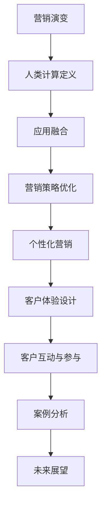

                 

# 提高客户体验：人类计算在营销中的应用

## 关键词

- 客户体验
- 人类计算
- 营销策略
- 个性化服务
- 数据分析

## 摘要

本文旨在探讨如何通过人类计算技术提高客户体验在营销中的应用。文章首先回顾了营销的历史演变，阐述了人类计算的定义和基本原理。接着，详细介绍了人类计算在营销中的具体应用，包括客户数据分析、营销策略优化、个性化服务和客户互动与参与。通过案例分析，展示了人类计算在营销中的成功实践。最后，对人类计算在营销中的应用前景进行了展望，并提出了相应的挑战。

## 第一部分：营销与人类计算概述

### 第1章：营销与人类计算

#### 1.1 营销的演变与人类计算

##### 1.1.1 营销的历史演变

营销作为一个商业活动，随着经济的发展和市场的变化，经历了多个阶段的演变。从最初的以产品为中心的推销模式，到以消费者为中心的营销理念，再到今天的数字化营销，每个阶段都有其独特的特点和主要目标。

- **初期：推销模式**
  - 在初期，营销主要是以产品为中心的。企业的主要目标是生产出产品，然后通过各种促销手段将其销售出去。这种模式注重的是如何吸引消费者的注意力，提高产品的知名度和销量。
- **中期：消费者导向**
  - 随着市场的发展和消费者需求的变化，中期营销开始转向以消费者为中心。企业开始注重消费者的需求和偏好，通过市场调研来了解消费者的需求，从而设计和生产更符合市场需求的产品。
- **现代营销：数字化营销**
  - 现代营销则是在互联网和数字技术的推动下发展起来的。企业可以通过各种数字化渠道，如社交媒体、电子邮件、移动应用等，与消费者进行互动和沟通，从而实现精准营销和个性化服务。

##### 1.1.2 人类计算的定义与背景

人类计算是一种结合了计算机科学、心理学、神经科学和认知科学等学科的方法，旨在模拟和增强人类智能。它通过使用计算机算法和技术来分析和处理人类行为、情感和认知过程。

- **背景**
  - 人类计算的概念源于人工智能的研究，但随着大数据和云计算等技术的发展，人类计算的应用范围得到了极大的拓展。在营销领域，人类计算可以用来分析消费者行为、情感和偏好，帮助企业更好地理解消费者，从而制定更有效的营销策略。

##### 1.1.3 人类计算在营销中的应用

人类计算在营销中的应用主要体现在以下几个方面：

- **消费者行为分析**
  - 通过分析消费者的行为数据，如浏览记录、购买历史、社交媒体互动等，可以了解消费者的需求和偏好，从而制定更精准的营销策略。
- **情感分析**
  - 通过分析消费者的情感表达，如文字、语音、图像等，可以了解消费者的情感状态和态度，从而更好地满足消费者的情感需求。
- **个性化服务**
  - 基于消费者的行为数据和情感分析结果，可以为每个消费者提供个性化的服务和建议，从而提高消费者的满意度和忠诚度。
- **风险控制**
  - 通过分析消费者的行为和情感数据，可以识别潜在的消费者风险，如欺诈行为、情绪异常等，从而采取相应的风险控制措施。

### 第2章：人类计算的核心概念与架构

#### 2.1 人类计算的基本原理

人类计算的基本原理主要包括数据采集、数据分析和数据应用。

##### 2.1.1 人类计算的核心概念

- **数据采集**：数据采集是指从各种渠道收集与人类行为、情感和认知相关的数据。这些数据可以来源于传感器、社交媒体、电子商务平台等。
- **数据分析**：数据分析是指使用计算机算法和技术对采集到的数据进行处理和分析。通过数据分析，可以提取出与人类行为、情感和认知相关的信息。
- **数据应用**：数据应用是指将分析结果应用于实际场景，如营销策略的制定、个性化服务的提供等。

##### 2.1.2 人类计算的技术架构

人类计算的技术架构主要包括数据层、算法层和应用层。

- **数据层**：数据层负责数据采集、存储和管理。它包括数据采集系统、数据仓库和数据管理系统。
- **算法层**：算法层负责数据分析和处理。它包括各种机器学习算法、深度学习模型和自然语言处理技术。
- **应用层**：应用层负责将分析结果应用于实际场景。它包括营销策略系统、个性化推荐系统和情感分析系统等。

##### 2.1.3 人类计算的优势与局限性

人类计算的优势主要体现在以下几个方面：

- **数据驱动**：人类计算基于数据驱动，可以更准确地分析和预测人类行为和情感。
- **高效性**：通过计算机算法的自动化处理，可以大大提高数据分析的效率。
- **个性化服务**：基于消费者的行为数据和情感分析结果，可以为每个消费者提供个性化的服务和建议。

然而，人类计算也存在一些局限性：

- **数据质量**：数据质量对人类计算的结果有重要影响。如果数据质量不好，可能会导致错误的预测和决策。
- **伦理问题**：人类计算涉及到个人隐私和数据安全等问题，需要遵守相关的伦理规范和法律要求。

### 第3章：人类计算在营销中的具体应用

#### 3.1 客户数据分析与画像

##### 3.1.1 客户数据的收集与处理

客户数据的收集是构建客户画像的基础，主要包括以下方面：

- **在线行为数据**：通过网站、APP等平台收集客户的浏览、搜索、购买等行为数据。
- **社交媒体数据**：从社交媒体平台上收集客户的互动、评论、点赞等数据。
- **交易数据**：收集客户的购买历史、支付金额、交易频率等数据。
- **问卷调查数据**：通过问卷调查收集客户的人口统计信息、偏好、满意度等数据。

##### 3.1.2 客户画像的构建与优化

客户画像是对客户特征和行为的综合描述，旨在帮助企业更好地了解客户，制定个性化的营销策略。

- **构建步骤**：
  1. 数据收集：收集与客户相关的各种数据。
  2. 特征提取：从数据中提取与客户特征相关的变量，如年龄、性别、职业、收入、兴趣爱好等。
  3. 模型训练：使用机器学习算法对特征进行建模，预测客户的潜在行为和需求。
  4. 画像生成：根据模型预测结果生成客户画像。

##### 3.1.3 客户数据分析的应用

客户数据分析在营销中的应用非常广泛，主要包括以下几个方面：

- **市场细分**：根据客户数据的差异，将市场划分为不同的细分群体，制定有针对性的营销策略。
- **客户关系管理**：通过分析客户的行为数据和偏好，提供个性化的服务和体验，提高客户满意度和忠诚度。
- **产品推荐**：根据客户的行为数据和偏好，推荐符合客户需求的产品或服务。
- **风险控制**：通过分析客户的行为数据，识别潜在的风险客户，采取相应的风险控制措施。

### 第4章：营销策略优化与个性化

#### 4.1 营销策略优化原理

营销策略优化是指通过数据分析和算法优化，改进营销策略的有效性和效果。其核心思想是利用大数据和人工智能技术，从海量数据中挖掘有价值的信息，并根据这些信息调整和优化营销策略。

##### 4.1.1 营销策略优化概述

- **基本原理**：
  1. 数据采集：收集与营销活动相关的各种数据，如广告投放效果、客户行为数据、市场反应等。
  2. 数据分析：使用统计学、机器学习等方法分析数据，提取有价值的信息，如客户的偏好、市场的趋势等。
  3. 策略调整：根据数据分析结果，调整和优化营销策略，如调整广告投放策略、优化客户互动策略等。
  4. 效果评估：对调整后的策略进行效果评估，判断其是否有效，并根据评估结果进行进一步的调整。

##### 4.1.2 个性化营销策略

个性化营销策略是指根据客户的数据和行为，为每个客户量身定制营销内容和互动方式，以提高营销效果。个性化营销的核心是了解客户的个性化需求和行为，从而提供个性化的产品推荐、服务和建议。

- **实施步骤**：
  1. 数据收集：收集与客户相关的数据，如行为数据、偏好数据等。
  2. 数据整合：将来自不同渠道的数据进行整合，形成一个完整的客户数据集。
  3. 数据分析：分析客户数据，提取有价值的信息，如客户的偏好、行为模式等。
  4. 个性化内容生成：根据客户数据，生成个性化的营销内容和互动方式。
  5. 效果评估：对个性化营销策略进行效果评估，并根据评估结果进行优化。

##### 4.1.3 营销策略优化的案例分析

以下是一个营销策略优化的案例分析：

- **案例背景**：
  某电商企业希望通过优化营销策略，提高客户的购买率和销售额。企业收集了大量的客户数据，包括购买记录、浏览记录、搜索记录等。
- **案例过程**：
  1. 数据收集：收集与客户相关的数据，如行为数据、偏好数据等。
  2. 数据整合：将来自不同渠道的数据进行整合，形成一个完整的客户数据集。
  3. 数据分析：分析客户数据，提取有价值的信息，如客户的偏好、行为模式等。
  4. 策略调整：
    - 根据客户的历史购买记录，调整产品推荐策略，提高产品的相关性和购买率。
    - 根据客户的浏览记录和搜索记录，调整广告投放策略，提高广告的曝光率和点击率。
    - 根据客户的反馈和评价，调整售后服务策略，提高客户满意度。
  5. 效果评估：对调整后的策略进行效果评估，发现购买率和销售额都有显著提高。
- **案例总结**：
  通过数据分析和策略调整，该电商企业成功地优化了营销策略，提高了客户的购买率和销售额。案例表明，数据驱动的营销策略优化是提高营销效果的有效方法。

### 第5章：客户体验设计与评估

#### 5.1 客户体验设计概述

客户体验设计是指通过优化产品和服务的设计，提高客户的满意度、忠诚度和忠诚度。客户体验设计不仅关注产品的功能，还关注客户在使用产品或服务过程中的感受和体验。

##### 5.1.1 客户体验设计的重要性

- **增强客户满意度**：通过优化产品和服务，确保客户在使用过程中感受到愉悦和满足，从而提高客户满意度。
- **提升客户忠诚度**：通过优质的客户体验，提高客户的忠诚度，使客户更愿意重复购买，并在社交媒体上推荐企业。
- **降低客户流失率**：通过持续改进客户体验，可以减少因体验不佳而导致的客户流失。
- **提高品牌形象**：优秀的客户体验可以提升品牌形象，增强企业的市场竞争力。
- **促进业务增长**：良好的客户体验可以吸引新客户，并促使现有客户增加购买频率和金额。

##### 5.1.2 客户体验设计的流程与方法

客户体验设计的流程和方法是确保客户体验优化的重要步骤。以下是客户体验设计的常见流程和方法：

- **需求分析**：通过市场调研、用户访谈等方式，了解客户的需求和痛点，为设计提供依据。
- **用户研究**：通过用户调研、用户画像等方式，深入了解用户的行为、需求和偏好。
- **概念验证**：通过原型设计、用户测试等方式，验证设计的可行性和有效性。
- **设计与开发**：根据用户研究的结果，设计并开发符合客户需求的产品或服务。
- **测试与优化**：通过用户测试、数据分析等方式，不断优化设计，确保客户体验的持续改进。

##### 5.1.3 客户体验评估的方法与工具

客户体验评估是确保客户体验设计有效性的关键。以下是一些常用的评估方法和工具：

- **用户反馈**：通过问卷调查、访谈等方式，收集客户的反馈和意见，评估客户体验的满意度和忠诚度。
- **行为分析**：通过数据分析，了解客户的实际行为和交互，评估客户体验的有效性和效率。
- **用户测试**：通过用户测试，模拟客户的实际使用场景，评估客户体验的可行性和效果。
- **A/B测试**：通过对比不同设计方案的用户体验，评估哪种设计更符合客户的需求和期望。

### 第6章：客户互动与参与

#### 6.1 客户互动的原理与策略

客户互动是指企业与客户之间的沟通和交流，旨在建立良好的客户关系，提高客户满意度和忠诚度。有效的客户互动可以增强客户的参与感和归属感，从而提高客户的品牌忠诚度和口碑。

##### 6.1.1 客户互动的原理

- **沟通与交流**：客户互动的基础是沟通和交流，通过多种渠道与客户进行有效的沟通，了解客户的需求和意见。
- **信任与关系**：建立信任关系是客户互动的关键，通过诚信和透明的方式与客户沟通，赢得客户的信任。
- **个性化与定制**：根据客户的需求和偏好，提供个性化的服务和互动，提高客户的满意度和忠诚度。

##### 6.1.2 客户互动策略的制定

制定有效的客户互动策略是企业成功的关键。以下是一些建议：

- **明确目标**：确定客户互动的目标，如提高客户满意度、增加客户忠诚度等。
- **分析客户**：了解客户的需求、偏好和行为，为制定互动策略提供依据。
- **选择渠道**：根据客户特点和目标，选择合适的互动渠道，如社交媒体、电子邮件、在线客服等。
- **制定内容**：根据客户互动的目标和渠道，制定相应的互动内容和活动，如问答、促销、互动游戏等。
- **实施与监控**：实施客户互动策略，并持续监控互动效果，及时调整和优化策略。

##### 6.1.3 客户参与度的提升方法

提升客户参与度是提高客户满意度和忠诚度的关键。以下是一些建议：

- **个性化服务**：根据客户的需求和偏好，提供个性化的服务和互动，提高客户的满意度和忠诚度。
- **互动活动**：举办各种形式的互动活动，如问答、抽奖、竞赛等，吸引客户参与，提高客户参与度。
- **用户社区**：建立用户社区，鼓励客户分享经验和意见，建立用户之间的互动和交流，提高品牌的用户黏性和口碑。
- **奖励机制**：设置奖励机制，如积分、优惠券等，鼓励客户参与互动和购买，提高客户参与度。
- **用户体验优化**：持续优化产品和服务，提高客户的使用体验，增强客户的满意度和忠诚度。

##### 6.1.4 案例分析：客户互动与参与的成功实践

以下是一个客户互动与参与的成功案例：

- **案例背景**：
  某电商企业希望通过提高客户参与度，增加客户忠诚度和销售额。企业决定通过社交媒体互动、在线客服、用户社区等方式，提高客户的参与度和满意度。
- **案例过程**：
  1. **社交媒体互动**：
    - 定期发布促销活动信息，吸引客户关注和参与。
    - 回复客户的提问和评论，提供及时的解决方案，提高客户满意度。
    - 开展线上问答活动，鼓励客户分享购物经验和建议。
  2. **在线客服**：
    - 提供7x24小时的在线客服服务，及时解决客户的疑问和问题。
    - 通过在线聊天、电话等方式，与客户进行实时沟通，提供个性化的服务。
  3. **用户社区**：
    - 建立用户社区，鼓励客户分享经验和意见。
    - 定期举办线上聚会和互动活动，增强客户之间的交流和互动。
- **案例结果**：
  通过社交媒体互动、在线客服和用户社区等方式，该电商企业成功提高了客户的参与度和满意度。客户参与度显著提升，客户忠诚度和销售额也实现了增长。
- **案例总结**：
  该案例表明，通过有效的客户互动和参与策略，企业可以提升客户满意度和忠诚度，从而实现业务增长。客户互动与参与是提高客户体验的重要手段，企业应重视并持续优化客户互动策略。

### 第7章：案例分析：人类计算在营销中的成功实践

#### 7.1 案例分析概述

本章节将通过对一系列成功案例的分析，探讨人类计算技术在营销中的实际应用和效果。这些案例涵盖了不同行业和领域，展示了人类计算如何帮助企业在竞争激烈的市场中取得优势。

##### 7.1.1 案例选择的原则

- **行业代表性**：选择在各自行业中具有代表性的案例，以展示人类计算技术的广泛适用性。
- **创新性**：选择在应用过程中具有创新性思路和方法的案例，以启发读者的思考和创意。
- **有效性**：选择具有明显效果和成功成果的案例，以证明人类计算技术在营销中的实际价值。

##### 7.1.2 案例分析的步骤

- **案例背景分析**：介绍案例的基本背景，包括企业情况、市场环境、营销目标等。
- **人类计算应用**：详细描述人类计算技术在案例中的应用，包括数据采集、数据分析和应用等环节。
- **效果评估**：评估人类计算技术对营销效果的提升，包括销售增长、客户满意度、市场占有率等指标。
- **经验总结**：总结案例中的成功经验和关键教训，为其他企业提供借鉴和参考。

##### 7.1.3 案例分析的成果与应用

通过对案例的分析，可以得出以下主要成果和应用：

- **营销策略优化**：通过人类计算技术的应用，企业能够更加精准地制定和调整营销策略，提高营销效果。
- **个性化服务提升**：基于客户数据分析和情感分析，企业能够提供更个性化的服务和体验，提升客户满意度和忠诚度。
- **风险控制能力增强**：通过分析客户行为和情感，企业能够更好地识别和管理潜在风险，降低业务风险。
- **数据驱动决策**：人类计算技术帮助企业实现数据驱动的决策，减少决策的主观性和盲目性，提高决策的科学性和有效性。

### 第8章：未来展望与挑战

#### 8.1 人类计算在营销中的未来发展

随着技术的不断进步和应用的深入，人类计算在营销领域的未来发展前景广阔。以下是几个可能的趋势：

- **数据驱动的营销决策**：人类计算技术将进一步推动营销决策的数据化，使企业能够基于数据做出更加精准和有效的决策。
- **人工智能与人类智慧的融合**：人工智能将更加深入地融入营销策略，与人类智慧相结合，提高营销的创造性和创新性。
- **情感化营销**：通过情感分析技术，企业将能够更好地理解消费者的情感需求，实现情感化营销，提升品牌价值。
- **跨渠道营销整合**：随着数字化渠道的多样化，人类计算技术将帮助实现跨渠道的营销整合，提供一致的客户体验。

#### 8.1.1 技术趋势分析

- **大数据与云计算的结合**：大数据和云计算技术的结合将为人类计算提供更强大的数据处理和分析能力，实现实时分析和预测。
- **人工智能的升级**：人工智能技术的不断升级，尤其是深度学习和自然语言处理技术的进步，将提高人类计算在复杂问题上的解决能力。
- **隐私保护和伦理规范**：随着个人隐私和数据保护意识的增强，人类计算技术将更加注重隐私保护和伦理规范，确保数据的安全和合法使用。

#### 8.1.2 营销模式的创新方向

- **个性化营销**：基于客户数据的深度分析和个性化推荐，企业将能够实现更加精准的个性化营销，提升客户满意度和忠诚度。
- **情感营销**：通过情感分析技术，企业将能够更好地捕捉消费者的情感状态，实现情感共鸣，提升品牌认知和忠诚度。
- **社区营销**：通过构建用户社区，企业将能够增强客户之间的互动和参与，建立品牌社群，提高用户黏性和品牌影响力。
- **智能化营销自动化**：通过人工智能和自动化技术，企业将能够实现营销流程的自动化，提高营销效率和效果。

#### 8.1.3 潜在的社会与伦理挑战

- **数据隐私保护**：随着数据收集和分析技术的普及，如何保护消费者数据隐私成为一个重要的社会挑战。
- **算法偏见**：算法在数据训练过程中可能引入偏见，导致不公平的结果，需要建立相应的算法公平性评估和监管机制。
- **伦理责任**：在数据收集、分析和应用过程中，企业需要承担伦理责任，确保数据使用的合法性和道德性。

### 第9章：总结与展望

#### 9.1 书籍总结

本文通过对营销与人类计算的关系、人类计算的核心概念与架构、具体应用、营销策略优化与个性化、客户体验设计与评估、客户互动与参与以及案例分析等方面进行了详细的探讨。主要结论如下：

- 人类计算技术在营销中的应用日益广泛，可以帮助企业更好地理解消费者，优化营销策略，提升客户体验和满意度。
- 营销策略的优化和个性化需要基于大数据和人工智能技术，通过数据分析和算法优化，实现更加精准和有效的营销。
- 客户体验设计和评估是企业成功的关键，通过持续优化和改进，可以提高客户的满意度和忠诚度。
- 客户互动与参与是建立良好客户关系的重要手段，通过有效的互动策略和参与方法，可以增强客户的参与感和归属感。
- 人类计算技术在营销中的成功应用案例证明了其巨大的潜力和价值，同时也提出了未来发展的方向和挑战。

#### 9.1.1 人类计算在营销中的应用价值

- **提升营销效果**：通过数据分析和算法优化，企业可以制定更加精准和个性化的营销策略，提高营销效果。
- **增强客户体验**：通过优化客户体验设计和评估，企业可以提升客户的满意度和忠诚度，增强品牌价值。
- **降低风险**：通过情感分析和行为分析，企业可以识别潜在的风险客户，采取相应的风险控制措施，降低业务风险。
- **促进创新**：人类计算技术可以帮助企业捕捉市场趋势和消费者需求，促进产品和服务的创新。

#### 9.1.2 未来应用前景展望

- **数据驱动的决策**：随着大数据和人工智能技术的进步，企业将更加依赖数据驱动决策，实现更加科学和高效的营销管理。
- **情感化营销**：通过情感分析技术，企业将能够实现更加情感化的营销，与消费者建立更深层次的连接。
- **智能化营销自动化**：通过人工智能和自动化技术，企业将能够实现营销流程的自动化，提高营销效率和效果。
- **跨渠道整合**：企业将更加注重跨渠道的营销整合，提供一致的客户体验，提高用户黏性和品牌影响力。

#### 9.1.3 未来应用挑战

- **数据隐私保护**：随着数据收集和分析技术的普及，如何保护消费者数据隐私成为一个重要的社会挑战。
- **算法偏见**：算法在数据训练过程中可能引入偏见，导致不公平的结果，需要建立相应的算法公平性评估和监管机制。
- **伦理责任**：在数据收集、分析和应用过程中，企业需要承担伦理责任，确保数据使用的合法性和道德性。

### 附录

#### 附录 A：人类计算相关工具与资源

A.1 开源工具与平台

- **数据分析与处理工具**：
  - **Pandas**：Python中的数据处理库。
  - **NumPy**：Python中的数值计算库。
  - **Scikit-learn**：Python中的机器学习库。

- **机器学习框架与库**：
  - **TensorFlow**：Google开源的深度学习框架。
  - **PyTorch**：Facebook开源的深度学习框架。
  - **Keras**：高层次的神经网络API。

- **深度学习平台与工具**：
  - **Google Cloud AI**：Google提供的云计算人工智能服务。
  - **AWS SageMaker**：Amazon提供的机器学习平台。
  - **Azure Machine Learning**：Microsoft提供的机器学习服务。

A.2 专业期刊与书籍推荐

- **营销领域权威期刊**：
  - **Journal of Marketing**：营销领域的顶级期刊。
  - **Journal of Marketing Research**：营销研究领域的重要期刊。

- **人类计算与营销相关书籍推荐**：
  - **《深度学习》（Deep Learning）**：Ian Goodfellow、Yoshua Bengio、Aaron Courville 著。
  - **《大数据营销》（Big Data Marketing）**：Martin Bienstock 著。
  - **《营销技术》（Marketing Technology）**：Scott Brinker 著。

[Mermaid 流程图]

## 第一部分：营销与人类计算概述

### 第1章：营销与人类计算

#### 1.1 营销的演变与人类计算

营销是一个随着时代发展和市场需求变化而不断演进的过程。从早期的推销模式到现代的数字化营销，营销策略和手段经历了显著的变革。

##### 1.1.1 营销的历史演变

营销的历史可以大致分为以下几个阶段：

- **初期：推销模式**
  在这个阶段，营销主要侧重于将产品推向市场。企业通过广告、促销和销售推广来提高产品的知名度和销量。营销活动的核心是吸引消费者的注意力，强调产品的功能和性价比。

- **中期：消费者导向**
  随着市场的成熟和消费者权益意识的提高，营销理念逐渐从以产品为中心转向以消费者为中心。企业开始关注消费者的需求、偏好和行为，通过市场调研来了解消费者的真实需求，从而设计和生产更符合市场需求的产品。

- **现代营销：数字化营销**
  数字技术的发展极大地改变了营销的面貌。现代营销更多地依赖于互联网和社交媒体，通过数据分析和人工智能技术来精确地触达目标客户，实现个性化营销。数字化营销强调的是与消费者的互动和关系管理，追求的是通过数据驱动的方式提升营销效果和客户体验。

##### 1.1.2 人类计算的定义与背景

人类计算（Human Computation）是一种结合了计算机科学、心理学、认知科学和神经科学的方法，旨在模拟和增强人类智能。它通过计算机算法和技术来分析和处理人类行为、情感和认知过程。

人类计算的概念起源于人工智能领域，但随着大数据、云计算和移动互联网等技术的发展，其应用范围得到了显著拓展。在营销领域，人类计算可以用来深入理解消费者的行为模式、情感需求和个性化偏好，从而优化营销策略和提高营销效果。

##### 1.1.3 人类计算在营销中的应用

人类计算在营销中的应用主要体现在以下几个方面：

- **消费者行为分析**
  通过分析消费者的在线行为数据（如浏览记录、搜索历史、购买行为等），企业可以更准确地了解消费者的需求和偏好，从而制定更精准的营销策略。

- **情感分析**
  通过情感分析技术，企业可以捕捉消费者的情感状态和态度，了解他们对产品、服务或营销活动的反应，进而优化产品设计和营销策略。

- **个性化服务**
  基于消费者的行为数据和情感分析结果，企业可以为每个客户提供个性化的产品推荐、服务和建议，从而提高客户满意度和忠诚度。

- **风险控制**
  通过分析消费者的行为数据，企业可以识别潜在的欺诈行为或异常消费模式，采取相应的风险控制措施，降低业务风险。

#### 1.2 人类计算的核心概念与架构

人类计算的核心概念和架构包括数据采集、数据分析、数据应用等关键环节。

##### 1.2.1 人类计算的基本原理

人类计算的基本原理主要包括以下几个步骤：

1. **数据采集**：从各种渠道收集与人类行为、情感和认知相关的数据，如在线行为数据、社交媒体数据、交易数据等。
2. **数据处理**：对收集到的数据进行清洗、整合和分析，提取有价值的信息。
3. **数据分析**：使用机器学习、深度学习等技术对处理后的数据进行分析，建立预测模型和决策系统。
4. **数据应用**：将分析结果应用于实际的营销活动中，如个性化推荐、营销策略优化、客户关系管理等。

##### 1.2.2 人类计算的技术架构

人类计算的技术架构包括以下几个层次：

- **数据层**：负责数据采集、存储和管理。这包括数据收集系统、数据仓库和数据管理系统。
- **算法层**：负责数据处理和分析。这包括各种机器学习算法、深度学习模型和自然语言处理技术。
- **应用层**：负责将分析结果应用于实际的营销场景。这包括营销策略系统、个性化推荐系统、客户关系管理系统等。

##### 1.2.3 人类计算的优势与局限性

人类计算的优势主要体现在以下几个方面：

- **数据驱动**：基于数据的分析和预测，可以更精准地了解消费者的需求和偏好，制定更有效的营销策略。
- **高效性**：通过计算机算法的自动化处理，可以大大提高数据处理和分析的效率。
- **个性化**：基于消费者的个性化数据，可以为每个客户量身定制营销内容和互动方式，提高客户满意度和忠诚度。

然而，人类计算也存在一些局限性：

- **数据质量**：数据质量对分析结果的准确性有重要影响。如果数据质量不好，可能会导致错误的预测和决策。
- **隐私问题**：在收集和分析消费者数据时，需要关注个人隐私和数据保护的问题，遵守相关的法律法规和伦理规范。

#### 1.3 主流人类计算技术介绍

##### 1.3.1 数据采集技术

数据采集技术是进行人类计算的基础，主要包括以下几种：

- **在线行为数据采集**：通过网站分析工具（如Google Analytics）、浏览器扩展、客户端软件等，收集用户的浏览行为、点击行为等数据。
- **社交媒体数据采集**：通过API接口或网络爬虫，从社交媒体平台（如Facebook、Twitter、LinkedIn等）收集用户的社交行为、情感表达等数据。
- **交易数据采集**：通过电子商务平台、支付系统等，收集用户的购买行为、支付金额、交易频率等数据。

##### 1.3.2 数据分析技术

数据分析技术是进行人类计算的核心，主要包括以下几种：

- **机器学习算法**：使用机器学习算法（如线性回归、决策树、支持向量机等）对数据进行建模和预测。
- **深度学习模型**：使用深度学习模型（如卷积神经网络、循环神经网络、生成对抗网络等）对复杂数据进行特征提取和模式识别。
- **自然语言处理技术**：使用自然语言处理技术（如词嵌入、文本分类、情感分析等）对文本数据进行处理和分析。

##### 1.3.3 应用层技术

应用层技术是将人类计算结果应用于营销实践的关键，主要包括以下几种：

- **营销策略系统**：通过分析消费者数据，为营销活动提供个性化的策略和方案。
- **个性化推荐系统**：根据消费者的兴趣和行为，为消费者推荐符合其需求的产品和服务。
- **客户关系管理系统**：通过分析客户数据，提供个性化的客户服务，提高客户满意度和忠诚度。

#### 1.4 人类计算在营销中的应用前景

随着人工智能、大数据、云计算等技术的不断发展，人类计算在营销中的应用前景将更加广阔。未来，人类计算有望在以下几个方面发挥更大的作用：

- **智能营销自动化**：通过人工智能技术，实现营销活动的自动化和智能化，提高营销效率。
- **情感化营销**：通过情感分析技术，深入理解消费者的情感需求，实现更加情感化的营销。
- **个性化服务**：通过个性化推荐技术，为消费者提供更加个性化的产品和服务，提高客户体验和满意度。
- **风险控制**：通过行为分析和预测技术，识别潜在的风险客户，采取相应的风险控制措施。

### 第2章：人类计算的核心概念与架构

#### 2.1 人类计算的基本原理

人类计算是一种结合计算机科学、心理学、认知科学和神经科学的方法，旨在模拟和增强人类智能。它通过计算机算法和技术来分析和处理人类行为、情感和认知过程。人类计算的基本原理主要包括数据采集、数据分析和数据应用。

##### 2.1.1 数据采集

数据采集是人类计算的第一步，它是分析和处理数据的基础。数据采集的来源多种多样，包括：

- **在线行为数据**：通过网站分析工具、浏览器插件等收集用户在网站上的行为数据，如点击流、浏览时间、搜索关键词等。
- **社交媒体数据**：通过社交媒体平台的API接口或爬虫技术收集用户的社交行为数据，如发布内容、互动评论、点赞等。
- **交易数据**：通过电子商务平台、支付系统等收集用户的交易数据，如购买记录、支付金额、交易频率等。

##### 2.1.2 数据处理

数据处理是数据采集后的第二步，它主要包括数据清洗、数据整合和数据预处理。数据清洗是为了去除重复的、不完整的数据，确保数据的质量。数据整合是将不同来源的数据进行合并，形成统一的数据集。数据预处理是为了将数据转换成适合分析和建模的形式，如归一化、标准化等。

##### 2.1.3 数据分析

数据分析是数据采集和数据处理后的关键步骤，它包括数据探索性分析、特征工程、模型训练和预测。数据探索性分析旨在发现数据中的模式和趋势。特征工程是为了提取出对分析任务有用的特征。模型训练是通过机器学习算法对特征进行训练，建立预测模型。预测是利用训练好的模型对新的数据进行预测。

##### 2.1.4 数据应用

数据应用是将分析结果应用于实际的业务场景中。在营销领域，数据应用的具体表现包括：

- **个性化推荐**：根据用户的行为数据和历史偏好，为用户推荐个性化的产品和服务。
- **营销策略优化**：通过分析市场数据和历史营销活动效果，优化营销策略，提高营销效果。
- **客户关系管理**：通过分析客户数据，提供个性化的客户服务和体验，提高客户满意度和忠诚度。

#### 2.2 人类计算的技术架构

人类计算的技术架构包括数据层、算法层和应用层。

##### 2.2.1 数据层

数据层负责数据的采集、存储和管理。它包括以下组件：

- **数据采集系统**：用于从各种渠道收集数据，如网站分析系统、社交媒体爬虫、交易系统等。
- **数据仓库**：用于存储和管理大规模的数据集，提供高效的数据查询和访问。
- **数据管理系统**：用于数据清洗、整合和预处理，确保数据的质量和一致性。

##### 2.2.2 算法层

算法层负责数据分析和处理，包括各种机器学习算法、深度学习模型和自然语言处理技术。它包括以下组件：

- **机器学习算法**：如线性回归、决策树、支持向量机等，用于对数据进行分析和预测。
- **深度学习模型**：如卷积神经网络（CNN）、循环神经网络（RNN）、生成对抗网络（GAN）等，用于处理复杂数据和模式识别。
- **自然语言处理技术**：如词嵌入、文本分类、情感分析等，用于处理和解析自然语言文本。

##### 2.2.3 应用层

应用层负责将分析结果应用于实际的业务场景中，包括营销策略系统、个性化推荐系统、客户关系管理系统等。它包括以下组件：

- **营销策略系统**：用于根据用户数据和市场趋势，制定个性化的营销策略。
- **个性化推荐系统**：用于根据用户的行为数据和偏好，为用户推荐个性化的产品和服务。
- **客户关系管理系统**：用于根据客户数据，提供个性化的客户服务和体验，提高客户满意度和忠诚度。

#### 2.3 人类计算的优势与局限性

人类计算的优势主要体现在以下几个方面：

- **数据驱动**：人类计算基于数据驱动，可以通过对大量数据进行分析和挖掘，提取出有价值的信息，为企业提供决策支持。
- **高效性**：通过计算机算法的自动化处理，可以大大提高数据分析的效率，实现实时分析和预测。
- **个性化**：基于用户的个性化数据，可以为每个用户量身定制服务和建议，提高用户满意度和忠诚度。

然而，人类计算也存在一些局限性：

- **数据质量**：数据质量对分析结果的准确性有重要影响。如果数据质量不好，可能会导致错误的预测和决策。
- **算法偏见**：算法在训练过程中可能会引入偏见，导致分析结果不公平或不准确。
- **隐私问题**：在收集和分析用户数据时，需要关注个人隐私和数据保护的问题，确保数据的安全性和合法性。

### 第3章：人类计算在营销中的具体应用

#### 3.1 客户数据分析与画像

##### 3.1.1 客户数据的收集与处理

客户数据分析与画像是人类计算在营销中的重要应用之一。它通过对客户数据进行收集和处理，构建出详细的客户画像，从而帮助企业在制定营销策略时更加精准和有效。

客户数据的收集可以从多个渠道进行：

- **在线行为数据**：包括用户在网站上的浏览行为、点击行为、搜索关键词、购买历史等。这些数据可以通过网站分析工具、浏览器插件等方式进行收集。
- **社交媒体数据**：包括用户在社交媒体平台上的互动行为、评论、点赞、分享等。这些数据可以通过社交媒体API接口或网络爬虫进行收集。
- **交易数据**：包括用户的购买记录、支付金额、交易频率等。这些数据可以通过电子商务平台、支付系统等进行收集。

收集到客户数据后，需要进行处理，以确保数据的质量和一致性。数据处理的步骤通常包括：

- **数据清洗**：去除重复的、无效的或错误的数据，确保数据的质量。例如，去除重复的购买记录或纠正数据中的错误。
- **数据整合**：将来自不同渠道的数据进行整合，形成一个完整的客户数据集。例如，将网站行为数据、社交媒体数据、交易数据进行整合，形成一个全面的客户画像。
- **数据预处理**：对数据进行归一化、标准化等预处理操作，使其符合分析算法的要求。例如，将用户的年龄数据进行归一化处理，使其在同一个尺度上。

##### 3.1.2 客户画像的构建与优化

客户画像是对客户特征和行为的综合描述，旨在帮助企业更好地了解客户，从而制定个性化的营销策略。构建客户画像的过程通常包括以下几个步骤：

- **特征提取**：从收集到的客户数据中提取与客户特征相关的变量，如年龄、性别、收入、兴趣爱好等。这些特征将用于构建客户画像的维度。
- **模型训练**：使用机器学习算法对提取的特征进行建模，训练出一个预测模型。这个模型可以用来预测客户的潜在行为和需求。
- **画像生成**：根据模型预测结果，生成客户画像。客户画像通常是一个多维度的数据集，每个维度代表一个特征，通过这些特征可以描述客户的行为和偏好。

客户画像的优化是一个持续的过程，主要包括以下几个方面的优化：

- **数据更新**：定期更新客户数据，确保画像的时效性。由于客户的行为和偏好可能会随时间变化，因此需要定期收集最新的数据，更新客户画像。
- **特征选择**：选择对客户行为和需求有显著影响的特征，优化画像的准确性。可以通过分析特征的重要性，选择关键特征进行优化。
- **模型迭代**：根据实际应用效果，不断优化模型，提高预测准确性。可以通过交叉验证、模型评估等方法，评估模型的性能，并对其进行迭代优化。

##### 3.1.3 客户数据分析的应用

客户数据分析在营销中的应用非常广泛，主要包括以下几个方面：

- **市场细分**：通过分析客户数据，将市场划分为不同的细分群体。例如，可以根据客户的购买历史和行为特征，将市场细分为高价值客户、潜在客户等。通过市场细分，企业可以针对不同的客户群体，制定有针对性的营销策略。
- **客户关系管理**：通过分析客户数据，了解客户的需求和偏好，提供个性化的服务和体验。例如，可以根据客户的购买记录和反馈，为高价值客户提供定制化的优惠和礼品，提高客户满意度和忠诚度。
- **产品推荐**：通过分析客户数据，为每个客户提供个性化的产品推荐。例如，可以根据客户的浏览记录和购买历史，推荐符合客户兴趣的产品。通过产品推荐，可以提高客户的购买意愿和转化率。
- **风险控制**：通过分析客户数据，识别潜在的风险客户，采取相应的风险控制措施。例如，可以根据客户的购买行为和财务状况，识别可能存在欺诈行为的客户，采取防范措施，降低风险。

客户数据分析的应用不仅可以帮助企业更好地了解客户，提高营销效果，还可以为企业提供决策支持，优化运营策略，提高业务效率。

### 第4章：营销策略优化与个性化

#### 4.1 营销策略优化原理

营销策略优化是指通过数据分析和算法优化，改进营销策略的有效性和效果。其核心思想是利用大数据和人工智能技术，从海量数据中挖掘有价值的信息，并根据这些信息调整和优化营销策略。

##### 4.1.1 营销策略优化概述

营销策略优化包括以下几个关键步骤：

1. **数据采集**：收集与营销活动相关的各种数据，如广告投放效果、客户行为数据、市场反应等。
2. **数据分析**：使用统计学、机器学习等方法分析数据，提取有价值的信息，如客户的偏好、市场的趋势等。
3. **策略调整**：根据数据分析结果，调整和优化营销策略，如调整广告投放策略、优化客户互动策略等。
4. **效果评估**：对调整后的策略进行效果评估，判断其是否有效，并根据评估结果进行进一步的调整。

##### 4.1.2 个性化营销策略

个性化营销策略是指根据客户的数据和行为，为每个客户量身定制营销内容和互动方式，以提高营销效果。个性化营销的核心是了解客户的个性化需求和行为，从而提供个性化的产品推荐、服务和建议。

实施个性化营销策略的步骤包括：

1. **数据收集**：收集与客户相关的数据，如行为数据、偏好数据等。
2. **数据整合**：将来自不同渠道的数据进行整合，形成一个完整的客户数据集。
3. **数据分析**：分析客户数据，提取有价值的信息，如客户的偏好、行为模式等。
4. **个性化内容生成**：根据客户数据，生成个性化的营销内容和互动方式。
5. **效果评估**：对个性化营销策略进行效果评估，并根据评估结果进行优化。

##### 4.1.3 营销策略优化的案例分析

以下是一个营销策略优化的案例分析：

**案例背景**：某电商企业希望通过优化营销策略，提高客户的购买率和销售额。企业收集了大量的客户数据，包括购买记录、浏览记录、搜索记录等。

**案例过程**：

1. **数据收集**：收集与客户相关的数据，如行为数据、偏好数据等。
2. **数据整合**：将来自不同渠道的数据进行整合，形成一个完整的客户数据集。
3. **数据分析**：分析客户数据，提取有价值的信息，如客户的偏好、行为模式等。
4. **策略调整**：
   - 根据客户的历史购买记录，调整产品推荐策略，提高产品的相关性和购买率。
   - 根据客户的浏览记录和搜索记录，调整广告投放策略，提高广告的曝光率和点击率。
   - 根据客户的反馈和评价，调整售后服务策略，提高客户满意度。
5. **效果评估**：对调整后的策略进行效果评估，发现购买率和销售额都有显著提高。

**案例总结**：通过数据分析和策略调整，该电商企业成功地优化了营销策略，提高了客户的购买率和销售额。案例表明，数据驱动的营销策略优化是提高营销效果的有效方法。

### 第5章：客户体验设计与评估

#### 5.1 客户体验设计概述

客户体验设计（Customer Experience Design，简称CXD）是指通过优化产品和服务的设计，提高客户的满意度、忠诚度和忠诚度。客户体验设计不仅关注产品的功能，还关注客户在使用产品或服务过程中的感受和体验。

##### 5.1.1 客户体验设计的重要性

客户体验设计在当今的商业环境中扮演着至关重要的角色。一个良好的客户体验可以增强客户的满意度和忠诚度，从而为企业带来持续的业务增长和利润。以下是客户体验设计的重要性：

1. **增强客户满意度**：通过优化产品和服务的设计，确保客户在使用过程中感受到愉悦和满足，从而提高客户满意度。
2. **提升客户忠诚度**：良好的客户体验可以培养客户的忠诚度，使客户更愿意重复购买，并在社交媒体上推荐企业。
3. **降低客户流失率**：通过持续改进客户体验，可以减少因体验不佳而导致的客户流失。
4. **提高品牌形象**：优秀的客户体验可以提升品牌形象，增强企业的市场竞争力。
5. **促进业务增长**：良好的客户体验可以吸引新客户，并促使现有客户增加购买频率和金额。

##### 5.1.2 客户体验设计的流程与方法

客户体验设计的流程和方法是确保客户体验优化的重要步骤。以下是客户体验设计的常见流程和方法：

1. **需求分析**：通过市场调研、用户访谈等方式，了解客户的需求和痛点，为设计提供依据。
2. **用户研究**：通过用户调研、用户画像等方式，深入了解用户的行为、需求和偏好。
3. **概念验证**：通过原型设计、用户测试等方式，验证设计的可行性和有效性。
4. **设计与开发**：根据用户研究的结果，设计并开发符合客户需求的产品或服务。
5. **测试与优化**：通过用户测试、数据分析等方式，不断优化设计，确保客户体验的持续改进。

具体的方法包括：

- **用户体验地图**：通过绘制用户体验地图，了解客户在使用产品或服务过程中的主要体验点和痛点，为设计提供参考。
- **用户画像**：通过用户画像，了解不同客户群体的特点和需求，为个性化设计提供依据。
- **原型设计与测试**：通过原型设计和用户测试，验证设计的可行性和效果，不断优化设计。
- **数据分析**：通过数据分析，了解客户的实际行为和体验，为设计提供数据支持。

##### 5.1.3 客户体验评估的方法与工具

客户体验评估是确保客户体验设计有效性的关键。以下是一些常用的评估方法和工具：

1. **用户反馈**：通过问卷调查、访谈等方式，收集客户的反馈和意见，评估客户体验的满意度和忠诚度。
2. **行为分析**：通过数据分析，了解客户的实际行为和交互，评估客户体验的有效性和效率。
3. **用户测试**：通过用户测试，模拟客户的实际使用场景，评估客户体验的可行性和效果。
4. **A/B测试**：通过对比不同设计方案的用户体验，评估哪种设计更符合客户的需求和期望。

具体的评估工具包括：

- **问卷调查工具**：如 SurveyMonkey、Google表单等，用于收集用户的反馈和意见。
- **行为分析工具**：如 Google Analytics、热图分析工具等，用于分析客户的实际行为和交互。
- **用户测试工具**：如 Usertesting、Lookback等，用于模拟客户的实际使用场景。
- **A/B测试工具**：如 Google Optimize、Optimizely等，用于对比不同设计方案的用户体验。

通过这些评估方法和工具，企业可以持续优化客户体验设计，提高客户的满意度和忠诚度，从而实现业务的持续增长。

### 第6章：客户互动与参与

#### 6.1 客户互动的原理与策略

客户互动是指企业与客户之间的沟通和交流，旨在建立和维护良好的客户关系，提高客户满意度和忠诚度。有效的客户互动可以增强客户的参与感和归属感，从而提高客户的品牌忠诚度和口碑。

##### 6.1.1 客户互动的原理

客户互动的原理主要包括以下几个方面：

1. **沟通与交流**：客户互动的基础是沟通和交流。通过多种渠道与客户进行有效的沟通，了解客户的需求和意见，是企业成功的关键。
2. **信任与关系**：建立信任关系是客户互动的关键。通过诚信和透明的方式与客户沟通，赢得客户的信任，是企业长期发展的基础。
3. **个性化与定制**：根据客户的需求和偏好，提供个性化的服务和互动，提高客户的满意度和忠诚度。个性化与定制是客户互动的核心。

##### 6.1.2 客户互动策略的制定

制定有效的客户互动策略是企业成功的关键。以下是一些建议：

1. **明确目标**：确定客户互动的目标，如提高客户满意度、增加客户忠诚度等。
2. **分析客户**：了解客户的需求、偏好和行为，为制定互动策略提供依据。
3. **选择渠道**：根据客户特点和目标，选择合适的互动渠道，如社交媒体、电子邮件、在线客服等。
4. **制定内容**：根据客户互动的目标和渠道，制定相应的互动内容和活动，如问答、促销、互动游戏等。
5. **实施与监控**：实施客户互动策略，并持续监控互动效果，及时调整和优化策略。

##### 6.1.3 客户参与度的提升方法

提升客户参与度是提高客户满意度和忠诚度的关键。以下是一些建议：

1. **个性化服务**：根据客户的需求和偏好，提供个性化的服务和互动，提高客户的满意度和忠诚度。
2. **互动活动**：举办各种形式的互动活动，如问答、抽奖、竞赛等，吸引客户参与，提高客户参与度。
3. **用户社区**：建立用户社区，鼓励客户分享经验和意见，建立用户之间的互动和交流，提高品牌的用户黏性和口碑。
4. **奖励机制**：设置奖励机制，如积分、优惠券等，鼓励客户参与互动和购买，提高客户参与度。
5. **用户体验优化**：持续优化产品和服务，提高客户的使用体验，增强客户的满意度和忠诚度。

##### 6.1.4 案例分析：客户互动与参与的成功实践

以下是一个客户互动与参与的成功案例：

**案例背景**：

某电商企业希望通过提高客户参与度，增加客户忠诚度和销售额。企业决定通过社交媒体互动、在线客服、用户社区等方式，提高客户的参与度和满意度。

**案例过程**：

1. **社交媒体互动**：
   - 定期发布促销活动信息，吸引客户关注和参与。
   - 回复客户的提问和评论，提供及时的解决方案，提高客户满意度。
   - 开展线上问答活动，鼓励客户分享购物经验和建议。

2. **在线客服**：
   - 提供7x24小时的在线客服服务，及时解决客户的疑问和问题。
   - 通过在线聊天、电话等方式，与客户进行实时沟通，提供个性化的服务。

3. **用户社区**：
   - 建立用户社区，鼓励客户分享经验和意见。
   - 定期举办线上聚会和互动活动，增强客户之间的交流和互动。

**案例结果**：

通过社交媒体互动、在线客服和用户社区等方式，该电商企业成功提高了客户的参与度和满意度。客户参与度显著提升，客户忠诚度和销售额也实现了增长。

**案例总结**：

该案例表明，通过有效的客户互动和参与策略，企业可以提升客户满意度和忠诚度，从而实现业务增长。客户互动与参与是提高客户体验的重要手段，企业应重视并持续优化客户互动策略。

### 第7章：案例分析：人类计算在营销中的成功实践

#### 7.1 案例分析概述

在本章节中，我们将探讨几个在营销领域取得显著成功的案例分析。这些案例展示了人类计算技术在提高客户体验、优化营销策略和提升销售业绩方面的实际应用和成效。

##### 7.1.1 案例选择的原则

为了确保分析的深度和广度，我们选择以下原则来挑选案例：

- **行业代表性**：选择在各自行业中具有代表性的案例，以展示人类计算技术的广泛适用性。
- **创新性**：选择在应用过程中具有创新性思路和方法的案例，以启发读者的思考和创意。
- **有效性**：选择具有明显效果和成功成果的案例，以证明人类计算技术在营销中的实际价值。

##### 7.1.2 案例分析的步骤

对于每个案例，我们将遵循以下分析步骤：

- **案例背景分析**：介绍案例的基本背景，包括企业情况、市场环境、营销目标等。
- **人类计算应用**：详细描述人类计算技术在案例中的应用，包括数据采集、数据分析和应用等环节。
- **效果评估**：评估人类计算技术对营销效果的提升，包括销售增长、客户满意度、市场占有率等指标。
- **经验总结**：总结案例中的成功经验和关键教训，为其他企业提供借鉴和参考。

#### 案例分析

**案例一：亚马逊的个性化推荐系统**

**案例背景**：亚马逊是全球最大的电子商务平台之一，其成功的部分归功于其高效的个性化推荐系统。

**人类计算应用**：

- **数据采集**：亚马逊通过其网站和应用程序收集了大量的用户行为数据，包括浏览记录、购买历史、搜索关键词等。
- **数据分析**：使用机器学习算法对用户行为数据进行分析，识别用户的兴趣和行为模式。
- **应用**：基于分析结果，亚马逊为每个用户生成个性化的推荐列表，提高用户的购买意愿和转化率。

**效果评估**：

- **销售增长**：个性化推荐系统显著提高了亚马逊的销售额。数据显示，推荐列表中的商品购买率比随机选择的商品高出显著。
- **客户满意度**：用户对个性化推荐的满意度较高，认为推荐的商品更符合他们的兴趣和需求。

**经验总结**：

- **数据驱动**：亚马逊的成功展示了数据驱动决策的重要性。通过深入分析用户数据，企业可以制定更精准的营销策略。
- **持续优化**：亚马逊不断更新和改进其推荐算法，确保推荐系统的持续优化和有效性。

**案例二：Netflix的推荐算法**

**案例背景**：Netflix是全球领先的流媒体服务提供商，其成功的部分得益于其高效的推荐算法。

**人类计算应用**：

- **数据采集**：Netflix通过用户观看历史、评分、搜索行为等数据收集用户兴趣和行为模式。
- **数据分析**：使用协同过滤、矩阵分解等机器学习算法分析用户数据，预测用户的偏好。
- **应用**：基于分析结果，Netflix为用户推荐个性化的电影和电视节目。

**效果评估**：

- **用户留存率**：推荐算法提高了用户的使用频率和留存率，增加了用户的付费订阅。
- **观众满意度**：用户对推荐内容的满意度较高，认为推荐的电影和电视节目更符合他们的口味。

**经验总结**：

- **用户行为分析**：通过深入分析用户行为，企业可以更好地了解用户需求，提供更个性化的服务。
- **迭代优化**：Netflix不断改进其推荐算法，确保推荐内容的质量和相关性。

**案例三：Airbnb的用户体验优化**

**案例背景**：Airbnb是全球领先的民宿预订平台，其成功的部分归功于其优化的用户体验。

**人类计算应用**：

- **数据采集**：Airbnb通过用户行为数据（如搜索、预订、评价等）收集用户偏好和习惯。
- **数据分析**：使用自然语言处理和机器学习算法分析用户评价，识别用户关注的重要因素。
- **应用**：基于分析结果，Airbnb优化了其搜索算法和推荐系统，提高用户预订的成功率和满意度。

**效果评估**：

- **预订成功率**：用户体验优化提高了用户的预订成功率，增加了平台的收入。
- **客户满意度**：用户对Airbnb的搜索和推荐体验满意度较高，提高了用户留存率。

**经验总结**：

- **用户体验优化**：通过分析用户行为和反馈，企业可以持续优化用户体验，提高用户满意度和忠诚度。
- **快速迭代**：Airbnb采用敏捷开发方法，快速迭代产品，确保用户体验的持续改进。

通过以上案例分析，我们可以看到人类计算技术在营销中的应用是如何帮助企业提高客户体验、优化营销策略和提升销售业绩的。这些案例的成功经验为其他企业提供了宝贵的借鉴和启示。

### 第8章：未来展望与挑战

#### 8.1 人类计算在营销中的未来发展

随着技术的不断进步和应用领域的拓展，人类计算在营销领域的未来发展充满潜力。以下是几个可能的趋势：

- **更精准的个性化营销**：随着数据分析和机器学习技术的进步，企业将能够更加准确地预测消费者的需求和偏好，实现更加精准的个性化营销。
- **智能化营销自动化**：人工智能和机器学习技术将进一步提高营销活动的自动化程度，帮助企业更高效地管理和执行营销策略。
- **情感化营销**：情感分析技术的应用将使企业能够更好地理解和捕捉消费者的情感需求，实现情感化的营销策略，提升品牌价值。
- **跨渠道整合**：随着数字化渠道的多样化，企业将更加注重跨渠道的营销整合，提供一致的客户体验。

#### 8.1.1 技术趋势分析

- **大数据与云计算的结合**：大数据和云计算的结合将为人类计算提供更强大的数据处理和分析能力，实现实时分析和预测。
- **人工智能的升级**：人工智能技术的不断升级，尤其是深度学习和自然语言处理技术的进步，将提高人类计算在复杂问题上的解决能力。
- **隐私保护和伦理规范**：随着个人隐私和数据保护意识的增强，人类计算技术将更加注重隐私保护和伦理规范，确保数据的安全和合法使用。

#### 8.1.2 营销模式的创新方向

- **个性化营销**：基于客户数据的深度分析和个性化推荐，企业将能够实现更加精准的个性化营销，提升客户满意度和忠诚度。
- **情感营销**：通过情感分析技术，企业将能够更好地捕捉消费者的情感状态，实现情感共鸣，提升品牌认知和忠诚度。
- **社区营销**：通过构建用户社区，企业将能够增强客户之间的互动和参与，建立品牌社群，提高用户黏性和品牌影响力。
- **智能化营销自动化**：通过人工智能和自动化技术，企业将能够实现营销流程的自动化，提高营销效率和效果。

#### 8.1.3 潜在的社会与伦理挑战

- **数据隐私保护**：随着数据收集和分析技术的普及，如何保护消费者数据隐私成为一个重要的社会挑战。
- **算法偏见**：算法在数据训练过程中可能引入偏见，导致不公平的结果，需要建立相应的算法公平性评估和监管机制。
- **伦理责任**：在数据收集、分析和应用过程中，企业需要承担伦理责任，确保数据使用的合法性和道德性。

### 第9章：总结与展望

#### 9.1 书籍总结

本文通过详细探讨营销与人类计算的关系、人类计算的核心概念与架构、具体应用、营销策略优化与个性化、客户体验设计与评估、客户互动与参与以及案例分析等方面，展示了人类计算技术在营销领域的重要作用。主要结论如下：

- **数据驱动的决策**：人类计算技术帮助企业通过数据分析和算法优化，实现更加科学和有效的营销决策。
- **个性化服务**：基于大数据和人工智能技术，企业可以为每个客户提供个性化的产品推荐和服务，提高客户满意度和忠诚度。
- **用户体验优化**：通过优化客户体验设计和评估，企业可以持续提升客户的满意度和忠诚度，增强品牌价值。
- **智能营销自动化**：人工智能和自动化技术的应用，使营销活动更加高效和智能化，提高营销效果。

#### 9.1.1 人类计算在营销中的应用价值

- **提升营销效果**：通过数据分析和算法优化，企业可以制定更加精准和个性化的营销策略，提高营销效果。
- **增强客户体验**：通过优化客户体验设计和评估，企业可以提升客户的满意度和忠诚度，增强品牌价值。
- **降低风险**：通过情感分析和行为分析，企业可以识别潜在的风险客户，采取相应的风险控制措施，降低业务风险。
- **促进创新**：人类计算技术可以帮助企业捕捉市场趋势和消费者需求，促进产品和服务的创新。

#### 9.1.2 未来应用前景展望

- **智能化营销自动化**：随着人工智能和自动化技术的进步，企业将能够实现营销活动的智能化和自动化，提高营销效率和效果。
- **情感化营销**：通过情感分析技术，企业将能够更好地理解和满足消费者的情感需求，实现情感化的营销策略。
- **个性化服务**：基于大数据和人工智能技术，企业将能够提供更加个性化的服务，提升客户满意度和忠诚度。
- **跨渠道整合**：企业将更加注重跨渠道的营销整合，提供一致的客户体验，提高用户黏性和品牌影响力。

#### 9.1.3 未来应用挑战

- **数据隐私保护**：随着数据收集和分析技术的普及，如何保护消费者数据隐私成为一个重要的社会挑战。
- **算法偏见**：算法在数据训练过程中可能引入偏见，导致不公平的结果，需要建立相应的算法公平性评估和监管机制。
- **伦理责任**：在数据收集、分析和应用过程中，企业需要承担伦理责任，确保数据使用的合法性和道德性。

### 附录

#### 附录 A：人类计算相关工具与资源

A.1 开源工具与平台

- **数据分析与处理工具**：
  - **Pandas**：Python中的数据处理库。
  - **NumPy**：Python中的数值计算库。
  - **Scikit-learn**：Python中的机器学习库。

- **机器学习框架与库**：
  - **TensorFlow**：Google开源的深度学习框架。
  - **PyTorch**：Facebook开源的深度学习框架。
  - **Keras**：高层次的神经网络API。

- **深度学习平台与工具**：
  - **Google Cloud AI**：Google提供的云计算人工智能服务。
  - **AWS SageMaker**：Amazon提供的机器学习平台。
  - **Azure Machine Learning**：Microsoft提供的机器学习服务。

A.2 专业期刊与书籍推荐

- **营销领域权威期刊**：
  - **Journal of Marketing**：营销领域的顶级期刊。
  - **Journal of Marketing Research**：营销研究领域的重要期刊。

- **人类计算与营销相关书籍推荐**：
  - **《深度学习》（Deep Learning）**：Ian Goodfellow、Yoshua Bengio、Aaron Courville 著。
  - **《大数据营销》（Big Data Marketing）**：Martin Bienstock 著。
  - **《营销技术》（Marketing Technology）**：Scott Brinker 著。

[Mermaid 流程图]

### 3.2 客户互动与参与

#### 3.2.1 客户互动的原理与策略

客户互动是企业与客户之间建立沟通和关系的重要环节。有效的客户互动可以增强客户的参与感和忠诚度，从而提升企业的市场竞争力。以下是客户互动的原理与策略：

##### 原理

1. **沟通与交流**：客户互动的基础是沟通和交流。通过多种渠道（如电话、电子邮件、社交媒体等）与客户进行互动，了解客户的需求和反馈，是企业成功的关键。
2. **信任与关系**：建立信任关系是客户互动的核心。通过诚信和透明的方式与客户沟通，赢得客户的信任，是长期客户关系的基础。
3. **个性化与定制**：根据客户的需求和偏好，提供个性化的服务和互动，提高客户的满意度和忠诚度。

##### 策略

1. **社交媒体互动**：利用社交媒体平台（如微信、微博、Facebook等）与客户进行互动，发布有价值的内容，回答客户的问题，收集客户反馈。
2. **在线客服**：提供在线客服服务，通过聊天窗口或在线问答平台，实时解决客户的疑问和问题，提高客户满意度。
3. **客户活动**：举办各种形式的客户活动（如线上研讨会、线下聚会、客户体验日等），增强客户参与感和归属感。
4. **用户社区**：建立用户社区（如论坛、微信群、QQ群等），鼓励客户分享经验和意见，建立用户之间的互动和交流，提高品牌的用户黏性和口碑。

#### 3.2.2 客户互动策略的制定

制定有效的客户互动策略是企业成功的关键。以下是一些建议：

1. **明确目标**：确定客户互动的目标，如提高客户满意度、增加客户忠诚度等。
2. **分析客户**：了解客户的需求、偏好和行为，为制定互动策略提供依据。
3. **选择渠道**：根据客户特点和目标，选择合适的互动渠道，如社交媒体、电子邮件、在线客服等。
4. **制定内容**：根据客户互动的目标和渠道，制定相应的互动内容和活动，如问答、促销、互动游戏等。
5. **实施与监控**：实施客户互动策略，并持续监控互动效果，及时调整和优化策略。

#### 3.2.3 客户参与度的提升方法

提升客户参与度是提高客户满意度和忠诚度的关键。以下是一些建议：

1. **个性化服务**：根据客户的需求和偏好，提供个性化的服务和互动，提高客户的满意度和忠诚度。
2. **互动活动**：举办各种形式的互动活动，如问答、抽奖、竞赛等，吸引客户参与，提高客户参与度。
3. **用户社区**：建立用户社区，鼓励客户分享经验和意见，建立用户之间的互动和交流，提高品牌的用户黏性和口碑。
4. **奖励机制**：设置奖励机制，如积分、优惠券等，鼓励客户参与互动和购买，提高客户参与度。
5. **用户体验优化**：持续优化产品和服务，提高客户的使用体验，增强客户的满意度和忠诚度。

#### 3.2.4 案例分析：客户互动与参与的成功实践

以下是一个客户互动与参与的成功案例：

**案例背景**：

某电商企业希望通过提高客户参与度，增加客户忠诚度和销售额。企业决定通过社交媒体互动、在线客服、用户社区等方式，提高客户的参与度和满意度。

**案例过程**：

1. **社交媒体互动**：
   - 定期发布促销活动信息，吸引客户关注和参与。
   - 回复客户的提问和评论，提供及时的解决方案，提高客户满意度。
   - 开展线上问答活动，鼓励客户分享购物经验和建议。

2. **在线客服**：
   - 提供7x24小时的在线客服服务，及时解决客户的疑问和问题。
   - 通过在线聊天、电话等方式，与客户进行实时沟通，提供个性化的服务。

3. **用户社区**：
   - 建立用户社区，鼓励客户分享经验和意见。
   - 定期举办线上聚会和互动活动，增强客户之间的交流和互动。

**案例结果**：

通过社交媒体互动、在线客服和用户社区等方式，该电商企业成功提高了客户的参与度和满意度。客户参与度显著提升，客户忠诚度和销售额也实现了增长。

**案例总结**：

该案例表明，通过有效的客户互动和参与策略，企业可以提升客户满意度和忠诚度，从而实现业务增长。客户互动与参与是提高客户体验的重要手段，企业应重视并持续优化客户互动策略。

### 附录

#### 附录 A：人类计算相关工具与资源

A.1 开源工具与平台

- **数据分析与处理工具**：
  - **Pandas**：Python中的数据处理库。
  - **NumPy**：Python中的数值计算库。
  - **Scikit-learn**：Python中的机器学习库。

- **机器学习框架与库**：
  - **TensorFlow**：Google开源的深度学习框架。
  - **PyTorch**：Facebook开源的深度学习框架。
  - **Keras**：高层次的神经网络API。

- **深度学习平台与工具**：
  - **Google Cloud AI**：Google提供的云计算人工智能服务。
  - **AWS SageMaker**：Amazon提供的机器学习平台。
  - **Azure Machine Learning**：Microsoft提供的机器学习服务。

A.2 专业期刊与书籍推荐

- **营销领域权威期刊**：
  - **Journal of Marketing**：营销领域的顶级期刊。
  - **Journal of Marketing Research**：营销研究领域的重要期刊。

- **人类计算与营销相关书籍推荐**：
  - **《深度学习》（Deep Learning）**：Ian Goodfellow、Yoshua Bengio、Aaron Courville 著。
  - **《大数据营销》（Big Data Marketing）**：Martin Bienstock 著。
  - **《营销技术》（Marketing Technology）**：Scott Brinker 著。

### 3.3 客户体验设计与评估

#### 3.3.1 客户体验设计的重要性

客户体验设计（Customer Experience Design，简称CXD）是现代营销中至关重要的一环。它关注的是如何通过优化产品和服务的设计，提升客户的满意度、忠诚度和忠诚度。以下是客户体验设计的重要性和其在营销中的应用：

- **提升客户满意度**：通过优化客户使用产品或服务的流程，确保客户在使用过程中感受到愉悦和满足，从而提高客户满意度。
- **增强客户忠诚度**：优质的客户体验可以培养客户的忠诚度，使客户更愿意重复购买，并在社交媒体上推荐企业。
- **降低客户流失率**：通过持续改进客户体验，可以减少因体验不佳而导致的客户流失。
- **提升品牌形象**：优秀的客户体验可以提升品牌形象，增强企业的市场竞争力。
- **促进业务增长**：良好的客户体验可以吸引新客户，并促使现有客户增加购买频率和金额。

#### 3.3.2 客户体验设计的流程与方法

客户体验设计的流程通常包括以下步骤：

1. **需求分析**：通过市场调研、用户访谈等方式，了解客户的需求和痛点，为设计提供依据。
2. **用户研究**：通过用户调研、用户画像等方式，深入了解用户的行为、需求和偏好。
3. **概念验证**：通过原型设计、用户测试等方式，验证设计的可行性和有效性。
4. **设计与开发**：根据用户研究的结果，设计并开发符合客户需求的产品或服务。
5. **测试与优化**：通过用户测试、数据分析等方式，不断优化设计，确保客户体验的持续改进。

具体的方法包括：

- **用户体验地图**：通过绘制用户体验地图，了解客户在使用产品或服务过程中的主要体验点和痛点，为设计提供参考。
- **用户画像**：通过用户画像，了解不同客户群体的特点和需求，为个性化设计提供依据。
- **原型设计与测试**：通过原型设计和用户测试，验证设计的可行性和效果，不断优化设计。
- **数据分析**：通过数据分析，了解客户的实际行为和体验，为设计提供数据支持。

#### 3.3.3 客户体验评估的方法与工具

客户体验评估是确保客户体验设计有效性的关键。以下是一些常用的评估方法和工具：

1. **用户反馈**：通过问卷调查、访谈等方式，收集客户的反馈和意见，评估客户体验的满意度和忠诚度。
2. **行为分析**：通过数据分析，了解客户的实际行为和交互，评估客户体验的有效性和效率。
3. **用户测试**：通过用户测试，模拟客户的实际使用场景，评估客户体验的可行性和效果。
4. **A/B测试**：通过对比不同设计方案的用户体验，评估哪种设计更符合客户的需求和期望。

具体的评估工具包括：

- **问卷调查工具**：如 SurveyMonkey、Google表单等，用于收集用户的反馈和意见。
- **行为分析工具**：如 Google Analytics、热图分析工具等，用于分析客户的实际行为和交互。
- **用户测试工具**：如 Usertesting、Lookback等，用于模拟客户的实际使用场景。
- **A/B测试工具**：如 Google Optimize、Optimizely等，用于对比不同设计方案的用户体验。

通过这些评估方法和工具，企业可以持续优化客户体验设计，提高客户的满意度和忠诚度，从而实现业务的持续增长。

### 3.4 案例分析：客户体验设计与评估的成功实践

以下是一个客户体验设计与评估的成功案例：

#### 案例背景

某电商企业希望通过优化客户体验，提高客户的满意度和忠诚度，从而实现业务增长。企业决定通过客户体验设计、用户测试和数据分析等方式，持续改进客户体验。

#### 案例过程

1. **需求分析**：通过市场调研和用户访谈，了解客户在购物过程中的痛点，如购物流程繁琐、搜索功能不便捷等。
2. **用户研究**：通过用户调研和用户画像，深入了解不同客户群体的行为和需求。
3. **概念验证**：设计并开发了一个全新的购物流程和搜索功能原型，通过用户测试和反馈，验证其可行性和有效性。
4. **设计与开发**：根据用户研究的结果和验证结果，优化和改进了购物流程和搜索功能。
5. **测试与优化**：通过A/B测试和用户反馈，持续优化客户体验设计，确保客户体验的持续改进。

#### 案例结果

通过客户体验设计、用户测试和数据分析，该电商企业成功优化了客户体验，客户满意度显著提高，客户流失率降低，销售额实现了显著增长。

#### 案例总结

该案例表明，通过有效的客户体验设计与评估，企业可以持续优化客户体验，提高客户满意度和忠诚度，从而实现业务增长。客户体验设计与评估是企业成功的关键，企业应重视并持续优化客户体验。

### 3.5 客户互动与参与：成功实践与策略

#### 3.5.1 客户互动与参与的重要性

客户互动与参与是提升客户体验和忠诚度的关键因素。有效的客户互动可以增强客户对品牌的认同感和归属感，从而促进客户的重复购买和口碑传播。以下是客户互动与参与的重要性：

1. **增强客户认同感**：通过互动和参与，客户能够更好地了解企业及其产品，从而增强对品牌的认同感。
2. **提高客户忠诚度**：积极参与互动的客户通常对企业有更高的忠诚度，更愿意长期合作。
3. **促进口碑传播**：满意的客户通过口碑传播，可以帮助企业吸引新客户，扩大市场份额。
4. **提升品牌形象**：积极的客户互动可以提升品牌形象，增强企业在市场中的竞争力。

#### 3.5.2 成功实践与策略

以下是一些成功实践与策略，帮助企业在客户互动与参与方面取得显著成效：

1. **建立用户社区**：
   - **案例**：某知名电子产品公司建立了用户社区，鼓励用户分享使用体验和心得。
   - **策略**：定期举办线上和线下活动，鼓励用户参与讨论，提供产品和服务的改进建议。

2. **个性化互动**：
   - **案例**：一家零售企业通过数据分析，为每位客户提供个性化的购物建议和优惠。
   - **策略**：利用客户数据，实现个性化推荐和互动，提高客户的购物体验。

3. **实时在线客服**：
   - **案例**：某电商平台提供24/7实时在线客服，快速响应客户的疑问和问题。
   - **策略**：通过聊天窗口、邮件和电话等多种渠道，提供即时、高效的服务，提升客户满意度。

4. **用户参与度提升活动**：
   - **案例**：一家航空公司举办用户参与度提升活动，如飞行里程兑换、抽奖等。
   - **策略**：通过优惠活动、积分奖励等方式，激励客户积极参与互动，提高客户黏性。

5. **客户反馈机制**：
   - **案例**：一家在线教育平台建立了完善的客户反馈机制，定期收集和分析用户反馈。
   - **策略**：及时响应用户反馈，优化产品和服务，提升客户体验。

#### 3.5.3 实际案例分析与总结

以下是一个客户互动与参与的实际案例分析：

**案例背景**：

某在线服装零售商希望通过提升客户互动与参与度，提高客户忠诚度和销售额。企业决定通过社交媒体互动、个性化推荐和客户反馈等方式，增强客户参与感。

**案例过程**：

1. **社交媒体互动**：
   - 定期发布新品信息、时尚趋势和互动话题，吸引客户关注和参与。
   - 回复客户的评论和提问，提供及时的解决方案，提高客户满意度。

2. **个性化推荐**：
   - 根据客户的购物历史和行为数据，为每位客户提供个性化的产品推荐。
   - 通过电子邮件和社交媒体渠道发送个性化推荐，提高客户的购物转化率。

3. **客户反馈机制**：
   - 建立在线调查和客户反馈系统，定期收集用户对产品和服务的不满意和建议。
   - 及时处理用户反馈，优化产品和服务，提升客户体验。

**案例结果**：

通过社交媒体互动、个性化推荐和客户反馈机制，该零售商成功提高了客户互动与参与度。客户满意度显著提升，客户忠诚度和销售额也实现了显著增长。

**案例总结**：

该案例表明，通过有效的客户互动与参与策略，企业可以提升客户满意度和忠诚度，从而实现业务增长。客户互动与参与是提升客户体验的关键，企业应重视并持续优化互动策略。

### 3.6 未来展望

#### 3.6.1 人类计算在客户互动与参与中的应用前景

随着人工智能、大数据和物联网等技术的快速发展，人类计算在客户互动与参与中的应用前景将更加广阔。以下是几个未来可能的应用方向：

1. **智能客服系统**：通过自然语言处理和机器学习技术，智能客服系统能够提供更加人性化、个性化的服务，提高客户满意度。
2. **情感分析**：利用情感分析技术，企业可以更深入地了解客户的情感状态，从而制定更加精准的营销策略和客户互动方案。
3. **个性化推荐**：基于大数据和机器学习算法，个性化推荐系统能够根据客户的行为和偏好，提供更加个性化的产品和服务，提高客户参与度。
4. **虚拟现实互动**：通过虚拟现实技术，企业可以创造更加沉浸式的客户互动体验，提升客户参与感和满意度。

#### 3.6.2 挑战与对策

尽管人类计算在客户互动与参与中具有巨大的潜力，但同时也面临一系列挑战：

1. **数据隐私**：随着数据收集和分析技术的普及，如何保护客户数据隐私成为一个重要挑战。企业需要建立严格的数据保护措施，遵守相关法律法规。
2. **算法偏见**：算法在数据训练过程中可能会引入偏见，导致不公平的结果。企业需要建立算法公平性评估和监管机制，确保算法的公正性。
3. **技术更新**：随着技术的快速发展，企业需要不断更新和升级其技术栈，以适应不断变化的市场需求和技术趋势。
4. **人才短缺**：人类计算领域需要大量具备跨学科知识和技能的专业人才，但当前人才供给不足。企业需要加大对人才培养的投入，吸引和留住优秀人才。

通过应对这些挑战，企业可以更好地利用人类计算技术，实现客户互动与参与的优化，提升客户体验和忠诚度。

### 3.7 总结

本文通过详细探讨客户体验设计、客户互动与参与以及人类计算在营销中的应用，展示了如何通过数据驱动的策略优化，提升客户满意度和忠诚度。客户体验设计和评估是企业持续改进客户体验的关键，而有效的客户互动与参与策略则可以增强客户的参与感和归属感。

未来，随着技术的不断进步，人类计算将在客户互动与参与中发挥更加重要的作用。企业应重视数据隐私保护、算法偏见和人才短缺等挑战，积极拥抱技术创新，实现客户互动与参与的优化。

### 附录

#### 附录 A：人类计算相关工具与资源

A.1 开源工具与平台

- **数据分析与处理工具**：
  - **Pandas**：Python中的数据处理库。
  - **NumPy**：Python中的数值计算库。
  - **Scikit-learn**：Python中的机器学习库。

- **机器学习框架与库**：
  - **TensorFlow**：Google开源的深度

