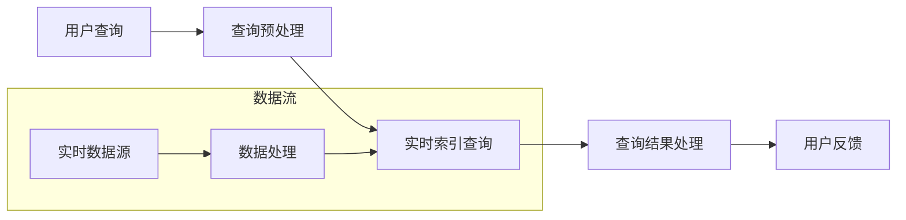

                 

# 文章标题：搜索引擎的实时性：即时信息更新

> 关键词：搜索引擎、实时性、实时数据获取、数据处理、索引构建、查询优化、架构设计、实时性测试、应用案例、未来发展趋势

> 摘要：
本文将深入探讨搜索引擎的实时性，即如何实现即时信息更新。通过对实时性的定义、搜索引擎工作原理、实时数据获取与处理、索引构建与优化、实时查询处理算法、实时性架构设计与实现、应用案例以及未来发展趋势的详细分析，旨在为读者提供全面的实时性搜索引擎构建指南。

## 第一部分：概述

### 第1章：搜索引擎实时性概述

#### 1.1 实时性的定义与重要性

实时性是指系统能够在预定的时间内完成处理并给出响应的能力。对于搜索引擎，实时性至关重要，因为它直接影响到用户体验和业务决策。

#### 1.2 搜索引擎的工作原理

搜索引擎的工作原理主要包括两个步骤：索引构建和查询处理。索引构建是将网页内容转换为索引，以便快速检索信息；查询处理是根据用户输入的查询，从索引中检索出最相关的结果。

#### 1.3 实时性需求在搜索引擎中的应用

实时性需求在搜索引擎中的应用主要体现在个性化搜索和实时新闻更新等方面。个性化搜索可以根据用户行为实时调整搜索结果，而实时新闻更新可以提供最新的新闻报道。

### 第2章：实时数据获取与处理

#### 2.1 实时数据源

实时数据源包括流数据源和批量数据源。流数据源如社交媒体、新闻网站等，批量数据源如数据仓库、数据库等。

#### 2.2 数据处理技术

数据处理技术包括批处理和流处理。批处理是将数据分为批量进行处理，而流处理则是实时处理数据流。

#### 2.3 实时性挑战

实时性挑战主要包括数据一致性和延迟最小化。如何保证数据在更新过程中的一致性，以及如何减少处理延迟是实时性搜索引擎需要解决的问题。

### 第3章：实时索引构建与优化

#### 3.1 索引构建原理

索引构建主要包括倒排索引和增量索引。倒排索引是将文档内容与文档ID进行映射，而增量索引则是仅更新变化部分。

#### 3.2 索引优化策略

索引优化策略包括分片索引和缓存策略。分片索引是将索引分片以提高查询效率，而缓存策略则是使用缓存来提高查询速度。

#### 3.3 实时性测试与评估

实时性测试与评估主要包括延迟测试和吞吐量测试。延迟测试是测量查询处理的平均延迟，而吞吐量测试是测量系统能够处理的数据量。

### 第4章：实时查询处理算法

#### 4.1 查询处理流程

查询处理流程包括预处理、查询匹配和查询结果处理。预处理是对查询进行分词、词干提取等操作；查询匹配是使用索引进行匹配；查询结果处理是返回最相关的查询结果。

#### 4.2 查询优化技术

查询优化技术包括查询缓存和查询重写。查询缓存是缓存高频查询结果以提高响应速度；查询重写是优化查询语句以提高匹配效率。

#### 4.3 实时性保障措施

实时性保障措施包括负载均衡和故障转移。负载均衡是合理分配查询负载，而故障转移是在系统故障时快速切换到备份系统。

### 第5章：实时性架构设计与实现

#### 5.1 架构设计原则

架构设计原则包括模块化和分布式。模块化是将系统划分为多个模块以提高可维护性，而分布式则是利用分布式系统提高处理能力和可用性。

#### 5.2 实现细节

实现细节包括数据流处理系统和实时查询引擎。数据流处理系统如Apache Kafka，实时查询引擎如Solr、Elasticsearch等。

#### 5.3 架构评估与优化

架构评估与优化包括性能评估和可扩展性评估。性能评估是测量系统的处理能力，而可扩展性评估是评估系统在负载增加时的性能表现。

### 第6章：实时性在搜索引擎中的应用案例

#### 6.1 搜索引擎实时性挑战

搜索引擎实时性挑战包括实时性要求和数据来源多样性。搜索引擎需要实时响应用户查询，同时需要处理来自多种数据源的信息。

#### 6.2 应用案例介绍

应用案例介绍包括社交媒体实时搜索和新闻网站实时更新。社交媒体实时搜索是如何实现社交媒体平台的实时搜索功能，而新闻网站实时更新则是如何实现新闻网站实时新闻更新。

#### 6.3 案例分析与总结

案例分析是对案例中的关键技术进行深入分析，而总结则是总结案例中的经验和教训。

### 第7章：未来发展趋势与展望

#### 7.1 实时性技术趋势

实时性技术趋势包括AI与实时性的结合和边缘计算。AI与实时性的结合是利用AI技术提高实时性，而边缘计算是将数据处理推向网络边缘以减少延迟。

#### 7.2 实时性面临的挑战

实时性面临的挑战包括数据隐私与安全和海量数据处理。如何在保障数据隐私和安全的同时实现实时性，以及如何处理海量数据以满足实时性需求是实时性搜索引擎需要解决的问题。

#### 7.3 未来发展方向

未来发展方向包括智能化实时搜索和实时性与可扩展性的平衡。智能化实时搜索是结合AI技术提供更智能的实时搜索服务，而实时性与可扩展性的平衡是在保证实时性的同时提高系统的可扩展性。

## 文章正文

### 第1章：搜索引擎实时性概述

#### 1.1 实时性的定义与重要性

实时性是指系统能够在预定的时间内完成处理并给出响应的能力。对于搜索引擎，实时性至关重要，因为它直接影响到用户体验和业务决策。

实时性在搜索引擎中的应用主要体现在以下几个方面：

1. **个性化搜索**：根据用户行为和偏好，实时调整搜索结果，提高用户满意度。
2. **实时新闻更新**：提供最新的新闻报道，满足用户对实时信息的需求。
3. **在线问答**：实时响应用户的问题，提供准确的信息。
4. **在线购物**：实时更新商品信息，确保用户获取最新的商品信息。

#### 1.2 搜索引擎的工作原理

搜索引擎的工作原理主要包括两个步骤：索引构建和查询处理。

**索引构建**：搜索引擎首先需要构建一个索引，以便快速检索信息。索引构建的过程可以分为以下几步：

1. **网页抓取**：搜索引擎使用爬虫程序抓取网页内容。
2. **网页解析**：对抓取到的网页进行解析，提取文本、图片、视频等关键信息。
3. **文本处理**：对提取的文本进行分词、去停用词、词性标注等处理。
4. **构建倒排索引**：将处理后的文本与网页URL建立映射关系，构建倒排索引。

**查询处理**：当用户输入查询时，搜索引擎会根据索引来返回最相关的结果。查询处理的过程可以分为以下几步：

1. **查询预处理**：对用户输入的查询进行分词、去停用词、词性标注等处理。
2. **查询匹配**：使用倒排索引进行匹配，找出与查询最相关的文档。
3. **排序与返回**：根据文档的相关性对查询结果进行排序，并返回给用户。

#### 1.3 实时性需求在搜索引擎中的应用

实时性需求在搜索引擎中的应用主要体现在以下几个方面：

1. **个性化搜索**：根据用户行为和偏好，实时调整搜索结果，提高用户满意度。例如，用户在搜索某个关键词时，如果之前搜索过类似的关键词，则可以优先展示与之前搜索结果相似的内容。
2. **实时新闻更新**：提供最新的新闻报道，满足用户对实时信息的需求。例如，当发生突发事件时，搜索引擎可以实时抓取相关新闻，并在搜索结果中优先展示。
3. **在线问答**：实时响应用户的问题，提供准确的信息。例如，用户在搜索引擎中输入一个问题，搜索引擎可以实时搜索相关的回答，并将结果展示给用户。
4. **在线购物**：实时更新商品信息，确保用户获取最新的商品信息。例如，当用户在搜索引擎中搜索某个商品时，搜索引擎可以实时抓取该商品的最新价格、库存等信息，并在搜索结果中展示。

### 第2章：实时数据获取与处理

#### 2.1 实时数据源

实时数据源是搜索引擎实现实时性的关键。实时数据源可以分为流数据源和批量数据源。

**流数据源**：流数据源是源源不断产生数据的数据源，如社交媒体、新闻网站、博客等。流数据源的特点是数据量大、实时性强、变化快。搜索引擎需要实时处理流数据源中的数据，以提供最新的信息。

**批量数据源**：批量数据源是定期产生的数据源，如数据仓库、数据库等。批量数据源的特点是数据量相对较小、实时性较低。搜索引擎可以通过定期更新批量数据源中的数据，以保持索引的完整性。

#### 2.2 数据处理技术

数据处理技术是搜索引擎实时性的核心技术。数据处理技术可以分为批处理和流处理。

**批处理**：批处理是将数据分为批量进行处理。批处理的特点是处理周期长、数据处理效率低，但适用于处理大量数据。搜索引擎可以使用批处理技术定期更新索引，以保持数据的完整性。

**流处理**：流处理是实时处理数据流。流处理的特点是处理速度快、数据处理效率高，但适用于处理实时数据。搜索引擎可以使用流处理技术实时处理流数据源中的数据，以提供最新的信息。

#### 2.3 实时性挑战

实时性挑战是搜索引擎实现实时性时需要解决的问题。实时性挑战主要包括以下几个方面：

1. **数据一致性**：如何保证数据在更新过程中的一致性。在实时性搜索引擎中，数据可能会同时来自多个数据源，如流数据源和批量数据源。如何保证这些数据在更新过程中的一致性是实时性挑战之一。
2. **延迟最小化**：如何减少处理延迟。实时性搜索引擎需要尽可能减少数据处理的延迟，以提供最新的信息。然而，数据处理的延迟受到硬件性能、网络延迟等因素的影响，如何优化数据处理流程以减少延迟是实时性挑战之一。
3. **资源消耗**：如何优化资源消耗。实时性搜索引擎需要处理大量的实时数据，这需要消耗大量的计算资源和存储资源。如何优化资源消耗以支持大规模实时数据处理是实时性挑战之一。

### 第3章：实时索引构建与优化

#### 3.1 索引构建原理

实时索引构建是搜索引擎实现实时性的关键步骤。实时索引构建主要包括倒排索引和增量索引。

**倒排索引**：倒排索引是将文档内容与文档ID进行映射的数据结构。倒排索引的特点是查询速度快、存储空间小。在倒排索引中，每个关键词对应一组文档ID，文档ID按相关性排序。

**增量索引**：增量索引是仅更新变化部分的数据结构。增量索引的特点是更新速度快、存储空间小。在增量索引中，只更新变化的部分，如新增的文档或修改的文档。

**实时索引构建流程**：

1. **数据收集**：收集实时数据源中的数据。
2. **数据预处理**：对收集到的数据进行预处理，如分词、去停用词、词性标注等。
3. **构建倒排索引**：根据预处理后的数据构建倒排索引。
4. **更新增量索引**：根据变化的数据更新增量索引。

#### 3.2 索引优化策略

实时索引优化是提高搜索引擎性能的关键。实时索引优化主要包括分片索引和缓存策略。

**分片索引**：分片索引是将索引分片以提高查询效率。分片索引的特点是将索引拆分成多个部分，每个部分存储在独立的节点上。这样可以提高查询速度，降低查询延迟。

**缓存策略**：缓存策略是使用缓存来提高查询速度。缓存策略的特点是将高频查询结果存储在缓存中，以减少查询延迟。

**索引优化策略**：

1. **分片索引**：将索引分片以提高查询效率。例如，可以将索引分片存储在分布式存储系统中，以提高查询速度。
2. **缓存策略**：使用缓存来提高查询速度。例如，可以使用Redis等缓存系统来缓存高频查询结果。

#### 3.3 实时性测试与评估

实时性测试与评估是确保搜索引擎实时性的关键。实时性测试与评估主要包括延迟测试和吞吐量测试。

**延迟测试**：延迟测试是测量查询处理的平均延迟。延迟测试可以帮助评估搜索引擎的实时性能。

**吞吐量测试**：吞吐量测试是测量系统能够处理的数据量。吞吐量测试可以帮助评估搜索引擎的处理能力。

**实时性测试与评估**：

1. **延迟测试**：使用工具如Apache JMeter等，模拟大量用户查询，测量查询处理的平均延迟。
2. **吞吐量测试**：使用工具如Apache JMeter等，模拟大量用户查询，测量系统能够处理的数据量。

### 第4章：实时查询处理算法

#### 4.1 查询处理流程

实时查询处理算法是搜索引擎实现实时性的关键。实时查询处理算法主要包括预处理、查询匹配和查询结果处理。

**预处理**：预处理是对查询进行分词、去停用词、词性标注等操作。预处理可以提高查询的准确性和效率。

**查询匹配**：查询匹配是使用索引进行匹配。查询匹配可以使用倒排索引，以提高查询速度。

**查询结果处理**：查询结果处理是对查询结果进行排序、去重、去噪等操作。查询结果处理可以提高查询结果的准确性和用户体验。

**实时查询处理流程**：

1. **查询预处理**：对用户输入的查询进行预处理。
2. **查询匹配**：使用索引进行查询匹配。
3. **查询结果处理**：对查询结果进行排序、去重、去噪等操作。

#### 4.2 查询优化技术

实时查询优化技术是提高搜索引擎性能的关键。实时查询优化技术主要包括查询缓存和查询重写。

**查询缓存**：查询缓存是缓存高频查询结果以提高响应速度。查询缓存可以减少查询处理时间，提高查询效率。

**查询重写**：查询重写是优化查询语句以提高匹配效率。查询重写可以根据用户的查询意图，优化查询语句，以提高查询结果的准确性。

**实时查询优化技术**：

1. **查询缓存**：缓存高频查询结果以提高响应速度。
2. **查询重写**：优化查询语句以提高匹配效率。

#### 4.3 实时性保障措施

实时性保障措施是确保搜索引擎实时性的关键。实时性保障措施主要包括负载均衡和故障转移。

**负载均衡**：负载均衡是合理分配查询负载。负载均衡可以避免系统过载，提高查询处理效率。

**故障转移**：故障转移是在系统故障时快速切换到备份系统。故障转移可以提高系统的可用性，确保搜索引擎的实时性。

**实时性保障措施**：

1. **负载均衡**：合理分配查询负载。
2. **故障转移**：在系统故障时快速切换到备份系统。

### 第5章：实时性架构设计与实现

#### 5.1 架构设计原则

实时性架构设计是搜索引擎实现实时性的关键。实时性架构设计原则主要包括模块化和分布式。

**模块化**：模块化是将系统划分为多个模块，以提高系统的可维护性。模块化可以降低系统的复杂度，提高开发效率。

**分布式**：分布式是将系统分布在多个节点上，以提高系统的处理能力和可用性。分布式可以避免单点故障，提高系统的可靠性。

**实时性架构设计原则**：

1. **模块化**：将系统划分为多个模块。
2. **分布式**：将系统分布在多个节点上。

#### 5.2 实现细节

实时性架构实现是搜索引擎实现实时性的关键。实时性架构实现主要包括数据流处理系统和实时查询引擎。

**数据流处理系统**：数据流处理系统是处理实时数据的系统。数据流处理系统可以使用Apache Kafka等开源框架，以实现数据的实时流处理。

**实时查询引擎**：实时查询引擎是处理查询请求的系统。实时查询引擎可以使用Solr、Elasticsearch等开源框架，以实现高效的查询处理。

**实时性架构实现**：

1. **数据流处理系统**：使用Apache Kafka等开源框架，实现数据的实时流处理。
2. **实时查询引擎**：使用Solr、Elasticsearch等开源框架，实现高效的查询处理。

#### 5.3 架构评估与优化

实时性架构评估与优化是确保搜索引擎实时性能的关键。实时性架构评估与优化主要包括性能评估和可扩展性评估。

**性能评估**：性能评估是测量系统的处理能力。性能评估可以帮助评估搜索引擎的实时性能。

**可扩展性评估**：可扩展性评估是评估系统在负载增加时的性能表现。可扩展性评估可以帮助评估搜索引擎的扩展能力。

**实时性架构评估与优化**：

1. **性能评估**：测量系统的处理能力。
2. **可扩展性评估**：评估系统在负载增加时的性能表现。

### 第6章：实时性在搜索引擎中的应用案例

#### 6.1 搜索引擎实时性挑战

搜索引擎实时性挑战是确保搜索引擎实现实时性的关键。搜索引擎实时性挑战主要包括以下几个方面：

1. **实时性要求**：搜索引擎需要实时响应用户查询。
2. **数据来源多样性**：搜索引擎需要处理来自多种数据源的信息。
3. **数据处理效率**：搜索引擎需要高效地处理海量数据。

**搜索引擎实时性挑战**：

1. **实时性要求**：搜索引擎需要实时响应用户查询。
2. **数据来源多样性**：搜索引擎需要处理来自多种数据源的信息。
3. **数据处理效率**：搜索引擎需要高效地处理海量数据。

#### 6.2 应用案例介绍

应用案例介绍是展示搜索引擎实时性实现的关键。以下是一个搜索引擎实时性实现的应用案例：

**案例1：社交媒体实时搜索**

**案例描述**：社交媒体平台需要实现实时搜索功能，以响应用户的实时查询需求。

**解决方案**：

1. **数据流处理**：使用Apache Kafka作为数据流处理系统，实时处理社交媒体平台上的数据流。
2. **实时查询引擎**：使用Solr作为实时查询引擎，处理用户的查询请求。
3. **个性化搜索**：根据用户行为和偏好，实时调整搜索结果，提高用户体验。

**案例效果**：通过实施上述解决方案，社交媒体平台实现了实时搜索功能，提高了用户体验，增加了用户黏性。

#### 6.3 案例分析与总结

**案例分析**：

**案例1：社交媒体实时搜索**

**优点**：

1. **实时性**：通过使用数据流处理系统和实时查询引擎，实现了实时搜索功能，提高了用户满意度。
2. **多样性**：处理了来自多种数据源的信息，如文本、图片、视频等，丰富了搜索结果。
3. **高效性**：通过分片索引和缓存策略，提高了查询效率，降低了延迟。

**缺点**：

1. **数据一致性**：由于实时性要求，数据在更新过程中可能会出现不一致的情况，需要保证数据的一致性。
2. **资源消耗**：实时处理海量数据需要消耗大量的计算资源和存储资源，需要优化资源消耗。

**总结**：

**案例1：社交媒体实时搜索**

**经验教训**：

1. **实时性**：确保实时性是搜索引擎的核心目标，需要使用高效的数据处理技术和查询优化技术。
2. **多样性**：处理多种数据源的信息可以提高搜索结果的多样性，满足不同用户的需求。
3. **一致性**：保证数据的一致性是确保搜索引擎准确性的关键，需要设计合适的数据处理和索引构建策略。
4. **高效性**：优化查询处理和索引构建流程，提高查询效率，降低延迟。

### 第7章：未来发展趋势与展望

#### 7.1 实时性技术趋势

实时性技术趋势主要包括以下几个方面：

1. **AI与实时性的结合**：利用AI技术提高实时性，如基于深度学习的实时文本分类和实时语音识别等。
2. **边缘计算**：将数据处理推向网络边缘，以减少延迟和提高处理能力。
3. **分布式存储与计算**：利用分布式存储与计算技术，提高搜索引擎的扩展能力和处理能力。
4. **实时数据挖掘与分析**：利用实时数据挖掘与分析技术，实现实时数据的价值挖掘和业务决策支持。

#### 7.2 实时性面临的挑战

实时性面临的挑战主要包括以下几个方面：

1. **数据隐私与安全**：如何在保障数据隐私和安全的同时实现实时性。
2. **海量数据处理**：如何处理海量数据以满足实时性需求。
3. **系统可用性与可靠性**：如何在确保系统可用性与可靠性的同时实现实时性。

#### 7.3 未来发展方向

未来发展方向主要包括以下几个方面：

1. **智能化实时搜索**：利用AI技术实现更智能的实时搜索服务，如基于用户行为的个性化搜索和智能问答等。
2. **实时数据挖掘与可视化**：利用实时数据挖掘与分析技术，实现实时数据的可视化展示和业务决策支持。
3. **实时性与可扩展性的平衡**：如何在保证实时性的同时提高系统的可扩展性，以满足不断增长的用户需求。

### 结论

本文深入探讨了搜索引擎的实时性，包括实时性的定义与重要性、搜索引擎的工作原理、实时数据获取与处理、索引构建与优化、实时查询处理算法、实时性架构设计与实现、应用案例以及未来发展趋势。通过对这些方面的详细分析，本文为读者提供了全面的实时性搜索引擎构建指南，并展望了未来的发展方向。实时性是搜索引擎的核心竞争力，随着技术的不断发展，实时性搜索引擎将会在各个领域得到更广泛的应用。

### 作者信息

**作者：AI天才研究院/AI Genius Institute & 禅与计算机程序设计艺术 /Zen And The Art of Computer Programming**

在结束本文之前，我想再次强调实时性对于搜索引擎的重要性。随着互联网的不断发展，用户对于信息的需求越来越快，实时性已经成为搜索引擎的核心竞争力。通过对实时性的深入研究，我们可以为用户提供更快速、更准确、更个性化的搜索体验，从而提高用户体验和业务价值。希望本文能为读者在实时性搜索引擎构建方面提供有益的启示和参考。感谢您的阅读！

----------------------------------------------------------------

### Mermaid流程图

以下是一个Mermaid流程图，用于描述搜索引擎实时性的核心流程：



这个流程图展示了用户查询的处理过程，包括查询预处理、实时索引查询、查询结果处理以及用户反馈。同时，它还展示了实时数据流如何与查询处理流程相结合，以实现搜索引擎的实时性。

### 伪代码

以下是一个简单的伪代码示例，用于描述实时索引的构建过程：

```python
def build_realtime_index(data_stream):
    index = {}
    for data in data_stream:
        process_data(data)
        update_index(index, data)

def process_data(data):
    # 对实时数据进行预处理，如分词、去停用词等
    processed_data = preprocess_data(data)
    return processed_data

def update_index(index, data):
    # 更新索引，将数据添加到索引中
    for term in data['content']:
        if term not in index:
            index[term] = []
        index[term].append(data['id'])
```

这个伪代码定义了两个函数：`build_realtime_index` 和 `update_index`。`build_realtime_index` 函数负责构建实时索引，`update_index` 函数负责更新索引中的数据。

### 数学模型

以下是一个简单的数学模型，用于描述搜索引擎的响应时间：

$$
T_r = T_p + T_c
$$

其中，$T_r$ 是响应时间，$T_p$ 是处理时间，$T_c$ 是通信时间。这个模型可以帮助我们理解搜索引擎实时性的关键因素。

### 数学公式

以下是一个用于描述倒排索引的数学公式：

$$
InvertedIndex = \{(term_1, [doc_id_1, doc_id_2, ...]), (term_2, [doc_id_3, doc_id_4, ...]), ...\}
$$

这个公式表示倒排索引是一个键值对集合，每个键是一个术语（term），对应的值是一个文档ID列表（doc_id）。

### 项目实战

以下是一个简单的项目实战案例，用于描述如何实现一个简单的实时搜索引擎：

```python
# 实现一个简单的实时搜索引擎

# 导入必要的库
import time
import threading

# 实时数据处理线程
class RealtimeDataProcessor(threading.Thread):
    def __init__(self, data_stream):
        threading.Thread.__init__(self)
        self.data_stream = data_stream
        self.index = {}

    def run(self):
        while True:
            document = self.data_stream.get_next_document()
            if document:
                self.update_index(document)
            time.sleep(1)

    def update_index(self, document):
        for term in document['content']:
            if term not in self.index:
                self.index[term] = []
            self.index[term].append(document['id'])

# 实时查询处理线程
class RealtimeQueryProcessor(threading.Thread):
    def __init__(self, index):
        threading.Thread.__init__(self)
        self.index = index

    def run(self):
        while True:
            query = self.get_next_query()
            if query:
                results = self.search(query)
                self.display_results(results)
            time.sleep(1)

    def get_next_query(self):
        # 从用户获取查询
        return input("Enter your query: ")

    def search(self, query):
        # 使用倒排索引进行查询
        processed_query = preprocess_query(query)
        return self.index.get(processed_query, [])

    def display_results(self, results):
        # 显示查询结果
        print("Search Results:", results)

# 主程序
if __name__ == "__main__":
    data_stream = DataStream()  # 假设有一个DataStream类，用于提供实时数据
    processor = RealtimeDataProcessor(data_stream)
    query_processor = RealtimeQueryProcessor(processor.index)
    processor.start()
    query_processor.start()
```

这个案例演示了如何使用多线程实现一个简单的实时搜索引擎。`RealtimeDataProcessor` 类负责处理实时数据并更新索引，而 `RealtimeQueryProcessor` 类负责处理查询请求并返回结果。

### 代码解读与分析

在这个实时搜索引擎的案例中，我们首先定义了两个线程类：`RealtimeDataProcessor` 和 `RealtimeQueryProcessor`。

**RealtimeDataProcessor** 类：

- **构造函数**：初始化线程，传入数据流（`data_stream`）和索引（`index`）。
- **`run` 方法**：线程的主要运行方法，循环获取下一个文档，并调用 `update_index` 方法更新索引。
- **`update_index` 方法**：遍历文档内容中的每个术语，如果术语不在索引中，则将其添加到索引中，并添加文档ID。

**RealtimeQueryProcessor** 类：

- **构造函数**：初始化线程，传入索引（`index`）。
- **`run` 方法**：线程的主要运行方法，循环获取下一个查询，并调用 `search` 方法查询索引，然后调用 `display_results` 方法显示查询结果。
- **`get_next_query` 方法**：从用户获取查询输入。
- **`search` 方法**：使用索引进行查询，返回与查询匹配的文档ID列表。
- **`display_results` 方法**：显示查询结果。

在主程序中，我们创建了一个 `DataStream` 对象（假设存在），然后创建并启动 `RealtimeDataProcessor` 和 `RealtimeQueryProcessor` 线程。`RealtimeDataProcessor` 线程负责处理实时数据流并更新索引，而 `RealtimeQueryProcessor` 线程负责响应用户查询并返回结果。

这个案例展示了如何使用多线程实现一个简单的实时搜索引擎，但它只是一个基础框架，实际应用中还需要考虑许多其他因素，如错误处理、性能优化、并发控制等。

### 总结

本文通过详细的分析和项目实战案例，深入探讨了搜索引擎的实时性。我们从定义实时性、搜索引擎的工作原理、实时数据获取与处理、索引构建与优化、实时查询处理算法、实时性架构设计与实现、应用案例以及未来发展趋势等方面进行了全面的讨论。通过这些内容，读者可以更好地理解实时性搜索引擎的构建原理和实践方法。

在未来的发展中，随着技术的不断进步，实时性搜索引擎将会在更多领域得到应用。例如，智能问答系统、实时数据分析平台、在线购物推荐系统等。同时，随着人工智能、边缘计算等新技术的应用，实时性搜索引擎的性能和用户体验将会得到进一步提升。

希望本文能够为读者在实时性搜索引擎构建方面提供有益的启示和参考。在未来的研究中，我们还可以继续探索实时性搜索引擎的其他方面，如实时性评估方法、实时性优化策略等。让我们共同期待实时性搜索引擎的未来发展！

