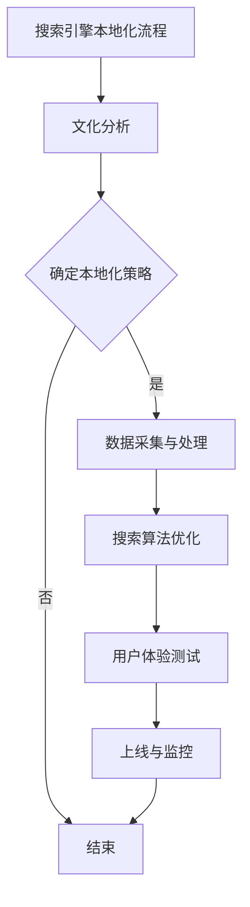

                 

### 文章标题

《搜索引擎的本地化：适应不同文化和语言》

### 关键词

搜索引擎、本地化、文化、语言、自然语言处理、搜索引擎优化（SEO）、数据管理

### 摘要

在全球化日益深入的今天，搜索引擎的本地化成为了一个至关重要的议题。本文旨在探讨搜索引擎如何通过适应不同的文化和语言，实现有效的本地化策略。文章首先介绍了搜索引擎与本地化的关系及其面临的挑战，然后详细分析了本地化基础、搜索引擎本地化的方法以及实现本地化的技术架构与流程设计。通过实际案例研究，本文总结了成功与失败的本地化实践，并展望了未来搜索引擎本地化的趋势。文章最后提供了常用工具与资源，以及一个具体的实战案例，旨在为从事搜索引擎本地化的专业人士提供有价值的参考。

## 第一部分：引言

### 1.1 搜索引擎与本地化的关系

搜索引擎作为互联网的核心服务之一，其核心功能是提供信息检索服务。然而，随着全球互联网用户的不断增加和多样性，搜索引擎逐渐意识到单纯的技术优化已经无法满足不同地区用户的需求。本地化，即适应特定地区文化、语言和使用习惯的过程，成为搜索引擎发展的必然选择。

搜索引擎与本地化之间的关系体现在多个方面。首先，本地化能够提升用户体验，使搜索引擎更加贴近用户的需求。例如，对于英语用户和非英语用户，搜索引擎需要提供适应其语言习惯的搜索结果。其次，本地化有助于搜索引擎更好地理解和满足不同地区用户的搜索意图，从而提高搜索相关性。最后，本地化还能够促进搜索引擎的商业化发展，通过提供定制化的服务吸引更多的用户和广告商。

### 1.2 本地化的挑战

虽然本地化能够带来诸多好处，但实现本地化并非易事。本地化面临以下几个主要挑战：

1. **文化多样性**：不同地区有着不同的文化背景和社会习俗，这直接影响了用户的搜索行为和偏好。例如，某些文化可能更重视隐私，而另一些文化可能更倾向于分享信息。
2. **语言多样性**：全球有超过7000种语言，而搜索引擎需要支持多种语言，这不仅需要大量的语言资源，还需要处理复杂的语言差异，如同音异义词、语法结构等。
3. **技术挑战**：搜索引擎需要具备强大的数据处理和分析能力，以确保在不同语言和文化环境下提供高质量的搜索结果。此外，本地化过程中还需要考虑技术实现的复杂性，如多语言搜索算法的优化、国际化网站的设计等。
4. **商业挑战**：本地化需要投入大量的人力和物力资源，这对于一些小型搜索引擎服务提供商来说可能是一个巨大的负担。此外，如何平衡本地化成本和收益也是一个重要的商业问题。

### 1.3 本书的目的与结构

本书旨在深入探讨搜索引擎本地化这一主题，帮助读者理解和掌握本地化的核心概念、方法和技术。本书结构如下：

- **第一部分：引言**：介绍搜索引擎与本地化的关系，本地化面临的挑战，以及本书的目的与结构。
- **第二部分：本地化基础**：分析文化多样性和语言多样性对搜索引擎本地化的影响，以及本地化策略的重要性。
- **第三部分：搜索引擎本地化的方法**：详细探讨语言处理技术、搜索引擎优化（SEO）和本地化数据管理。
- **第四部分：实现搜索引擎本地化**：介绍技术架构与流程设计，以及通过实际案例研究提供实践经验。
- **第五部分：搜索引擎本地化的挑战与未来趋势**：讨论当前面临的挑战以及未来可能的发展方向。
- **第六部分：附录**：提供常用本地化工具与资源，术语定义，参考文献，以及一个搜索引擎本地化流程的Mermaid流程图和一个本地化算法的伪代码示例。
- **第七部分：项目实战案例**：通过一个具体的搜索引擎本地化项目，展示开发环境搭建、源代码实现和代码解读，以及性能分析与优化建议。

通过本书的阅读，读者将能够系统地了解搜索引擎本地化的各个方面，并具备实际操作的能力。

## 第二部分：本地化基础

### 2.1 文化的多样性与搜索引擎

文化的多样性是搜索引擎本地化过程中必须考虑的重要因素。不同的文化背景会对用户的搜索行为、搜索意图和搜索结果的选择产生深远影响。例如，在西方文化中，用户更倾向于使用直接和精确的关键词进行搜索，而在东方文化中，用户可能更喜欢使用含糊和间接的表达方式。

首先，文化多样性对搜索行为的影响体现在用户的查询习惯上。西方用户习惯于使用精确的关键词，如产品名称、品牌名称等，而东方用户则更倾向于使用描述性的短语。例如，对于一款名为“iPhone”的智能手机，西方用户可能直接搜索“iPhone”，而东方用户可能搜索“智能手机，苹果品牌”。

其次，文化背景也会影响用户的搜索意图。不同文化背景下，用户对信息的需求和偏好有所不同。例如，在一些强调隐私保护的文化中，用户可能更倾向于避免使用过于直白的关键词，以免泄露个人信息。而在一些注重分享和社交的文化中，用户可能会更愿意使用特定的社交平台和社区进行信息搜索和分享。

此外，文化多样性还会影响搜索结果的选择。不同文化背景的用户对搜索结果的相关性和优先级有不同的看法。例如，在某些文化中，用户可能更重视本地化和个性化搜索结果，而在另一些文化中，用户可能更看重权威性和可靠性。

### 2.2 语言多样性的挑战

语言多样性是搜索引擎本地化过程中面临的另一大挑战。全球有超过7000种语言，而搜索引擎需要支持其中的一部分，这涉及到大量的语言资源和技术处理。

首先，语言多样性的挑战体现在语言资源的不足。许多小语种缺乏足够的语言资源，如语料库、词汇表和语法规则等，这直接影响了搜索引擎对这些语言的索引和处理能力。例如，对于一些小语种，可能只有有限的搜索引擎支持，导致用户无法在这些语言中获取所需的信息。

其次，语言多样性对搜索引擎的技术处理提出了更高的要求。不同语言之间的语法结构、词汇和语义差异显著，这使得搜索引擎在处理多语言搜索请求时需要具备强大的自然语言处理（NLP）能力。例如，机器翻译技术需要能够准确理解和转换不同语言之间的语义，而多语言搜索算法需要能够同时处理多种语言的查询和索引。

此外，语言多样性还会影响用户的搜索体验。对于非母语用户，搜索引擎需要提供适应其语言习惯的搜索结果和用户界面，这包括语言理解、翻译和本地化设计等方面。例如，对于英语非母语的用户，搜索引擎需要提供准确的翻译和本地化搜索结果，以帮助其更好地理解和使用搜索引擎。

### 2.3 本地化策略的重要性

在搜索引擎本地化的过程中，制定和实施有效的本地化策略至关重要。本地化策略不仅能够提升用户的搜索体验，还能够提高搜索引擎的市场竞争力。

首先，本地化策略有助于提升用户体验。通过适应用户的文化和语言习惯，搜索引擎能够更好地理解用户的搜索意图，提供更相关的搜索结果。例如，通过本地化设计，搜索引擎可以为不同地区的用户提供定制化的搜索界面和结果，使其更容易找到所需信息。

其次，本地化策略有助于扩大搜索引擎的市场份额。在全球化的背景下，越来越多的用户来自不同国家和地区，本地化策略能够帮助搜索引擎进入新的市场，吸引更多的用户。例如，通过支持多种语言和适应用户的文化习惯，搜索引擎可以在国际市场上获得更大的用户基础。

此外，本地化策略还能够提高搜索引擎的商业化收益。通过提供定制化的广告和推广服务，搜索引擎可以更好地满足不同地区广告商的需求，从而提高广告收入。例如，通过本地化广告投放，搜索引擎可以为不同地区的广告商提供更精确的用户定位和广告效果评估。

总之，本地化策略在搜索引擎的发展中扮演着重要角色。通过深入理解和适应用户的文化和语言需求，搜索引擎不仅能够提升用户体验和市场份额，还能够实现商业化的成功。

### 2.4 文化与语言多样性的具体案例

为了更好地理解文化多样性和语言多样性对搜索引擎本地化的影响，以下是一些具体案例：

**案例一：搜索关键词的文化差异**

- **文化背景**：中国与美国的搜索关键词差异
- **具体表现**：在中国，用户更倾向于使用汉字进行搜索，如“北京天气”，而在美国，用户更可能使用英文关键词，如“weather in Beijing”。
- **影响**：搜索引擎需要为中文用户提供中文搜索结果，为英文用户提供英文搜索结果，同时考虑文化差异，如节假日、风俗习惯等，以提升搜索体验。

**案例二：语言资源的不足**

- **文化背景**：小语种语言资源缺乏
- **具体表现**：例如，非洲的一些小语种，如斯瓦希里语，缺乏足够的搜索引擎支持。
- **影响**：这导致这些语言的用户在获取信息时面临困难，搜索引擎需要投入更多资源来开发和维护这些语言的支持。

**案例三：多语言搜索的挑战**

- **文化背景**：多语言使用者的需求
- **具体表现**：在一些多元文化地区，如新加坡，用户可能同时使用英语、华语和马来语进行搜索。
- **影响**：搜索引擎需要具备强大的自然语言处理能力，能够同时理解多种语言的查询，并提供准确的相关结果。

**案例四：本地化广告策略**

- **文化背景**：国际市场的广告策略
- **具体表现**：在中国，广告商可能更倾向于使用中文进行广告投放，而在美国，广告商可能更关注英语广告的效果。
- **影响**：搜索引擎需要根据不同文化背景，提供本地化的广告策略，以吸引更多广告商和提升广告收入。

通过这些具体案例，我们可以看到文化多样性和语言多样性对搜索引擎本地化具有重要影响。搜索引擎需要深入理解这些文化差异，制定相应的本地化策略，以提升用户体验和商业收益。

### 2.5 本地化策略的重要性

在搜索引擎的本地化过程中，本地化策略扮演着至关重要的角色。本地化策略不仅是提升用户体验和市场竞争力的关键，也是确保搜索引擎在全球范围内获得成功的基础。

首先，本地化策略有助于提升用户体验。通过深入理解用户的文化和语言习惯，搜索引擎可以提供更贴近用户需求的搜索结果和界面设计。例如，搜索引擎可以适应用户的本地语言进行搜索，提供符合本地文化习惯的结果展示。这种个性化的搜索体验能够显著提高用户满意度和忠诚度。

其次，本地化策略有助于扩大搜索引擎的市场份额。在全球化的背景下，不同地区的用户对搜索引擎的需求和偏好存在显著差异。通过实施本地化策略，搜索引擎可以更好地满足不同市场的需求，从而进入新的市场并获得更多的用户。例如，通过支持多种语言和适应用户的文化习惯，搜索引擎可以在国际市场上获得更大的用户基础。

此外，本地化策略还能够提高搜索引擎的商业化收益。通过提供本地化的广告和推广服务，搜索引擎可以更好地满足不同地区广告商的需求，从而提高广告收入。例如，通过本地化广告投放，搜索引擎可以为不同地区的广告商提供更精确的用户定位和广告效果评估。这种精准的营销策略不仅能够提升广告收入，还能够增强用户对品牌的认知和信任。

最后，本地化策略还能够提升搜索引擎的品牌形象。通过提供高质量的本地化服务，搜索引擎能够在全球范围内树立专业和可信的品牌形象。这种品牌形象有助于吸引更多的用户和广告商，从而推动搜索引擎的商业化发展。

总之，本地化策略在搜索引擎的发展中具有不可替代的重要性。通过深入理解和适应用户的文化和语言需求，搜索引擎不仅能够提升用户体验和市场份额，还能够实现商业化的成功。因此，制定和实施有效的本地化策略是搜索引擎在全球范围内取得成功的关键。

## 第三部分：搜索引擎本地化的方法

### 3.1 语言处理技术

语言处理技术是搜索引擎本地化的核心组成部分，主要包括自然语言处理（NLP）、语言模型和机器翻译技术。这些技术共同作用，确保搜索引擎能够理解并适应用户的查询需求，提供准确的搜索结果。

#### 3.1.1 自然语言处理（NLP）的基本概念

自然语言处理（NLP）是人工智能领域的一个重要分支，旨在使计算机能够理解、生成和处理人类自然语言。NLP涉及多个层面的技术，包括分词、词性标注、句法分析、语义理解和信息提取等。

- **分词**：将连续的文本分割成有意义的词汇单元，是NLP的基础步骤。不同的语言有不同的分词规则，例如中文的分词需要考虑词义和上下文。
- **词性标注**：为文本中的每个词标注词性，如名词、动词、形容词等，有助于理解词汇的具体意义。
- **句法分析**：分析句子的结构，识别主语、谓语、宾语等语法成分，从而理解句子的整体含义。
- **语义理解**：深入理解文本的语义内容，包括词义消歧、指代消解和事件抽取等，使计算机能够理解复杂的语言表达。

#### 3.1.2 语言模型与翻译模型

语言模型是NLP的核心组件之一，用于预测文本中的下一个单词或短语。常用的语言模型包括统计语言模型和基于深度学习的神经网络模型。统计语言模型基于大量文本语料库，通过计算词汇的概率分布来预测下一个词。而深度学习模型，如循环神经网络（RNN）和Transformer，通过学习文本中的上下文关系，能够生成更准确的预测。

翻译模型是用于机器翻译的核心技术，将一种语言的文本翻译成另一种语言。常见的翻译模型包括基于规则的翻译模型和基于统计的翻译模型。基于规则的翻译模型依赖于人工编写的语法和语义规则，而基于统计的翻译模型则使用大量双语文本进行训练，通过统计词汇和句子的概率分布进行翻译。

#### 3.1.3 机器翻译技术

机器翻译技术是语言处理技术的重要组成部分，旨在将一种语言的文本自动翻译成另一种语言。现代机器翻译技术主要基于深度学习模型，如神经机器翻译（NMT）。神经机器翻译通过学习大量的双语文本数据，自动生成目标语言的文本。

- **神经网络机器翻译（NMT）**：基于深度学习模型，如编码器-解码器（Encoder-Decoder）架构和注意力机制（Attention Mechanism），能够生成更自然、流畅的翻译结果。
- **翻译评估**：机器翻译的质量评估是确保翻译结果准确性的重要步骤。常用的评估方法包括自动评估（如BLEU、METEOR）和人工评估（如一致性评估）。

#### 3.1.4 NLP技术在搜索引擎本地化中的应用

在搜索引擎的本地化过程中，NLP技术发挥了关键作用。以下是一些NLP技术在搜索引擎本地化中的应用：

- **多语言搜索**：NLP技术能够帮助搜索引擎理解并处理多种语言的查询，提供准确的搜索结果。
- **本地化界面**：NLP技术可以用于本地化搜索引擎的界面，使其能够适应用户的母语，提升用户体验。
- **搜索结果排序**：通过NLP技术，搜索引擎可以更好地理解搜索结果的语义内容，从而进行更有效的排序和推荐。
- **语音搜索**：NLP技术可以处理用户的语音输入，将其转换成文本查询，并提供相应的搜索结果。

通过应用NLP技术，搜索引擎能够更准确地理解用户的查询需求，提供高质量的本地化服务，从而提升用户体验和竞争力。

### 3.2 搜索引擎优化（SEO）

搜索引擎优化（SEO）是搜索引擎本地化的重要组成部分，旨在提升网站在搜索引擎结果页面（SERP）中的排名，从而吸引更多的有机流量。SEO策略需要根据不同文化和语言环境进行调整，以确保其有效性和适应性。

#### 3.2.1 SEO的基本原则

SEO的基本原则包括内容优化、关键词优化、技术优化和用户体验优化。以下是对这些原则的简要介绍：

- **内容优化**：创建高质量、有价值的内容是SEO的核心。内容应针对用户需求，提供有价值的信息，同时使用适当的元标签和内部链接来增强内容的相关性。
- **关键词优化**：关键词是用户进行搜索的关键，选择合适的关键词并合理分布在网页内容中，可以提高网页在搜索引擎中的可见性。关键词优化需要考虑不同文化和语言的搜索习惯。
- **技术优化**：确保网站的技术性能，如网站速度、移动友好性和站点地图等，可以提高搜索引擎对网站的友好度。
- **用户体验优化**：提升用户体验可以增加用户在网站上的停留时间和页面浏览量，从而提高网站的排名。用户体验优化包括页面设计、导航结构和内容布局等方面。

#### 3.2.2 SEO策略在不同文化中的适用性

不同文化背景下，用户的搜索习惯和偏好有所不同，因此SEO策略需要根据文化差异进行调整。

- **文化差异**：不同文化对内容的表现形式和语言风格有不同的要求。例如，某些文化可能更重视逻辑性和精确性，而另一些文化可能更注重情感表达和故事性。
- **关键词选择**：关键词选择需要考虑当地用户的语言习惯和搜索意图。例如，在西方文化中，用户可能更倾向于使用精确的关键词，而在东方文化中，用户可能更喜欢使用描述性的短语。
- **本地化内容**：为了更好地适应本地用户的需求，SEO策略需要创建本地化的内容。这包括使用本地语言、适应当地文化和符合本地用户期望的内容格式。

#### 3.2.3 SEO案例分析

以下是一个SEO案例，展示了在不同文化中实施SEO策略的不同方法：

- **案例一：美国市场**：在美国，用户更喜欢使用精确的关键词进行搜索。例如，对于一家在线书店，可以优化以下关键词：“在线书店”，“书籍购买”，和“电子书下载”。此外，内容应注重提供详细的产品信息和用户评价，以满足用户的需求。
- **案例二：中国市场**：在中国，用户更倾向于使用描述性的短语进行搜索。例如，对于一家在线书店，可以优化以下关键词：“哪里可以买书”，“网上书店推荐”，和“书籍推荐”。同时，内容应注重文化特色，如使用汉语拼音、引用中国传统文化元素等，以吸引本地用户。
- **案例三：中东市场**：在中东市场，用户偏好使用阿拉伯语进行搜索。例如，对于一家在线书店，可以优化以下关键词：“كتاب على الإنترنت”，“شراء كتب”和“كتب إلكترونية”。此外，网站应确保符合当地文化规范，如使用适当的阿拉伯字体和色彩方案。

通过针对不同文化环境调整SEO策略，搜索引擎可以更好地满足本地用户的需求，提高网站的可见性和流量。

### 3.3 本地化数据管理

本地化数据管理是搜索引擎本地化过程中的关键环节，涉及数据采集、数据库设计和数据质量管理等多个方面。有效的本地化数据管理不仅能够提高搜索引擎的性能和用户体验，还能够降低维护成本和提升数据利用率。

#### 3.3.1 数据采集与处理

数据采集是本地化数据管理的第一步，涉及从多种来源收集与本地化相关的数据。这些来源包括用户行为数据、搜索日志、社交媒体数据、市场调研数据等。

- **用户行为数据**：通过分析用户在搜索引擎上的行为，如搜索关键词、点击率、浏览时间等，可以了解用户的偏好和需求，为本地化策略提供依据。
- **搜索日志**：搜索日志记录了用户的搜索请求和搜索结果，是优化搜索引擎排名和提供个性化搜索结果的重要数据源。
- **社交媒体数据**：社交媒体平台如Twitter、Facebook和Instagram等，提供了大量关于用户兴趣和讨论话题的数据，有助于了解用户的社会行为和文化趋势。

数据采集完成后，需要进行数据预处理，包括数据清洗、去重、归一化和格式转换等步骤。数据清洗是为了去除重复、错误和不完整的数据，确保数据的质量和一致性。归一化则将不同格式和单位的数据转换成统一的格式，便于后续处理和分析。

#### 3.3.2 数据库设计与优化

数据库设计是本地化数据管理的核心环节，涉及数据库模式、索引设计和查询优化等多个方面。

- **数据库模式**：数据库模式定义了数据存储的结构和关系。在本地化数据管理中，数据库模式需要考虑不同语言和文化的数据需求，设计多语言字段和数据表，以便存储和管理多语言数据。
- **索引设计**：索引是提高数据库查询速度的重要手段。合理的设计索引，如全文索引、地理空间索引等，可以加速数据检索，提高搜索引擎的性能。
- **查询优化**：查询优化包括编写高效的SQL查询语句、使用视图和存储过程等，以减少查询时间和资源消耗。

#### 3.3.3 数据质量管理与维护

数据质量管理是确保数据准确性和一致性的重要环节，包括数据验证、数据监控和数据修复等。

- **数据验证**：通过设置数据校验规则，确保输入数据的正确性和完整性。例如，对于多语言数据，可以使用语言校验工具检查拼写和语法错误。
- **数据监控**：建立数据监控机制，定期检查数据质量，如数据准确性、一致性和完整性。数据监控可以帮助发现潜在问题，及时采取措施。
- **数据修复**：对发现的问题数据进行修复，包括数据清洗、数据更新和数据补全等。数据修复可以确保数据质量的持续提升。

通过有效的本地化数据管理，搜索引擎可以提供更准确、更相关的搜索结果，提升用户体验和搜索引擎的性能。

### 3.4 语言处理技术在搜索引擎本地化中的应用案例

以下是一些具体的应用案例，展示了语言处理技术如何帮助搜索引擎实现本地化：

#### 案例一：多语言搜索功能

某国际知名的搜索引擎，为了满足全球用户的需求，引入了多语言搜索功能。通过使用自然语言处理（NLP）技术，该搜索引擎能够理解用户输入的不同语言的查询，并在全球范围内检索相关内容。例如，当用户使用中文输入“北京天气”时，搜索引擎会自动识别并翻译成英文“Beijing weather”，然后检索相关结果。

#### 案例二：本地化广告投放

某广告平台在全球范围内运营，为了更好地满足不同地区用户的需求，采用了机器翻译技术进行广告内容的本地化。通过使用神经机器翻译（NMT）模型，该平台能够将广告内容自动翻译成多种语言，如中文、英语、法语和西班牙语。这不仅提高了广告的覆盖范围，也提高了广告效果的准确性和用户参与度。

#### 案例三：个性化搜索结果

某搜索引擎通过自然语言处理（NLP）技术，为用户提供个性化的搜索结果。该搜索引擎使用用户行为数据和语言模型，分析用户的搜索历史和偏好，然后根据用户的兴趣和需求，提供定制化的搜索结果。例如，对于喜欢阅读科幻小说的用户，搜索引擎会优先显示相关的书籍和文章。

#### 案例四：语音搜索功能

某智能手机制造商在其操作系统中集成了语音搜索功能，通过使用自然语言处理（NLP）技术，用户可以通过语音输入进行搜索。该搜索引擎能够理解用户的语音指令，并将其转换为文本查询，然后返回相关的搜索结果。这不仅提高了搜索的便捷性，也满足了不同文化和语言用户的需求。

通过这些案例，我们可以看到语言处理技术在搜索引擎本地化中的应用如何提升了用户体验和搜索引擎的性能。未来，随着语言处理技术的不断发展和应用，搜索引擎的本地化将变得更加智能和高效。

### 3.5 SEO策略在不同文化中的具体实施方法

在搜索引擎本地化的过程中，SEO策略的制定和实施需要充分考虑不同文化的特点和用户习惯。以下是一些具体的实施方法：

#### 3.5.1 关键词优化

关键词优化是SEO策略的核心，不同文化背景下的用户搜索习惯和关键词使用方式有所不同。以下是一些具体的方法：

- **文化适应**：针对不同文化，调整关键词的选择和用法。例如，在中国市场，用户更喜欢使用描述性的关键词，如“最好的手机”，“性价比高的平板电脑”，而在美国市场，用户更喜欢使用精确的关键词，如“iPhone 13 Pro”。
- **本地化关键词研究**：通过市场调研和数据分析，了解目标市场用户的搜索习惯和关键词偏好。例如，通过分析搜索引擎的关键词查询数据，识别当地用户常用的关键词和短语。
- **多语言关键词优化**：对于跨国企业，需要同时优化多语言版本的关键词。例如，对于一个面向全球市场的电子商务平台，需要同时优化英语、法语、德语等多个语言版本的关键词。

#### 3.5.2 内容本地化

内容本地化是提升搜索引擎排名和用户体验的重要手段。以下是一些具体的实施方法：

- **文化元素融入**：在内容创作中融入当地的文化元素，使其更符合目标市场的文化特点和用户期望。例如，在中国市场，可以引用中国传统文化元素，如诗词、成语和节日等，以吸引本地用户。
- **语言风格适应**：根据不同语言的文化和风格特点，调整内容的表达方式。例如，对于英文内容，可以采用正式和逻辑严谨的表达方式，而对于中文内容，可以采用更口语化和亲切的表达方式。
- **多语言内容优化**：对于跨国企业，需要同时优化多语言版本的内容。例如，在创建英语、法语、德语等多个语言版本的内容时，需要确保内容在语言风格和表达上符合当地用户的需求。

#### 3.5.3 技术优化

技术优化是确保网站在搜索引擎中表现良好的关键。以下是一些具体的技术优化方法：

- **网站国际化**：确保网站能够适应不同语言和文化的访问需求。例如，采用多语言网站框架，支持多种语言的菜单和导航。
- **搜索引擎友好**：优化网站的架构和代码，使其更容易被搜索引擎索引和解析。例如，使用语义明确的标题和描述，优化网站的加载速度和移动端体验。
- **文化兼容性测试**：在网站上线前，进行多语言和跨文化兼容性测试，确保网站在不同文化和语言环境下都能正常显示和功能。

通过实施这些具体的SEO策略，搜索引擎可以在不同文化市场中获得更好的排名和用户体验，从而提升市场竞争力。

### 3.6 本地化数据管理的最佳实践

在搜索引擎本地化过程中，本地化数据管理的最佳实践至关重要，以确保数据的准确性、一致性和高效性。以下是一些最佳实践：

#### 3.6.1 数据标准化

数据标准化是确保数据质量的基础，通过定义统一的数据格式和命名规范，可以减少数据冗余和错误。例如，对于产品信息，可以采用统一的SKU编码和分类标准。

#### 3.6.2 数据清洗

数据清洗是数据质量管理的核心步骤，通过去除重复数据、填补缺失值、纠正错误数据等，可以提高数据质量。例如，使用数据清洗工具对用户行为数据进行分析，识别并处理异常值。

#### 3.6.3 数据治理

数据治理是确保数据质量和安全的重要机制，包括数据访问控制、数据备份和恢复等。例如，建立数据访问权限管理机制，确保只有授权人员才能访问敏感数据。

#### 3.6.4 数据可视化

数据可视化是数据分析和决策支持的重要工具，通过图形和图表展示数据，可以帮助管理层更好地理解和分析数据。例如，使用数据可视化工具创建交互式的仪表盘，实时监控数据质量。

#### 3.6.5 数据监控与审计

建立数据监控与审计机制，定期检查数据质量，及时发现和解决数据问题。例如，通过自动化数据监控工具，定期进行数据质量检查，并向相关人员发送报告。

通过实施这些最佳实践，搜索引擎可以确保本地化数据管理的有效性，从而提升搜索引擎的性能和用户体验。

### 3.7 本地化方法在实际应用中的挑战与解决方案

在搜索引擎的本地化过程中，实际应用中会遇到诸多挑战，以下列举了一些常见的挑战及相应的解决方案。

#### 3.7.1 多语言数据一致性

**挑战**：在多语言数据管理中，保持数据一致性是一个重要难题，不同语言之间的表达方式和语法结构可能存在差异。

**解决方案**：采用严格的数据标准和规范，确保所有语言版本的数据遵循相同的格式和结构。此外，建立多语言团队，负责翻译和校对，确保数据的一致性和准确性。

#### 3.7.2 文化敏感性

**挑战**：不同文化背景下的用户对内容和表达方式有不同的偏好，不当的文化表达可能导致用户不满或误解。

**解决方案**：进行深入的文化调研和用户反馈收集，了解目标市场的文化特点和用户需求。在内容创作中，融入当地的文化元素，尊重并适应不同的文化价值观。

#### 3.7.3 技术实施难度

**挑战**：本地化涉及多语言处理、搜索引擎优化（SEO）和数据管理等复杂技术，实施难度较大。

**解决方案**：采用模块化开发方法，逐步实现本地化功能，如先从单语言版本开始，逐步扩展到多语言版本。此外，利用开源工具和框架，降低技术实施的复杂性。

#### 3.7.4 成本和资源限制

**挑战**：本地化需要投入大量的人力、物力和财力资源，对于中小企业来说，成本和资源限制是一个主要难题。

**解决方案**：优先考虑市场潜力较大的地区进行本地化，分阶段投入资源。利用自动化工具和AI技术，提高本地化效率和降低成本。

通过上述解决方案，搜索引擎可以在实际应用中克服本地化过程中的挑战，实现有效的本地化策略。

## 第四部分：实现搜索引擎本地化

### 4.1 技术架构与流程设计

搜索引擎本地化的实现涉及复杂的技术架构和流程设计，需要综合考虑语言处理、数据管理、搜索引擎优化等多个方面。以下详细描述搜索引擎本地化的技术架构和流程设计。

#### 4.1.1 技术架构设计

搜索引擎本地化的技术架构通常包括以下关键组件：

- **语言处理模块**：负责处理多语言输入和输出，包括自然语言处理（NLP）和机器翻译技术。此模块可以使用深度学习模型，如Transformer和BERT，以实现高效的文本处理和翻译。
- **数据采集与处理模块**：负责从多个数据源（如搜索日志、用户行为数据等）收集数据，并进行数据清洗、去重和格式转换等预处理操作。该模块可以使用数据流处理技术，如Apache Kafka和Apache Flink，实现实时数据采集和处理。
- **搜索引擎核心模块**：负责执行搜索查询、索引管理和搜索结果排序等核心功能。该模块需要支持多语言索引和查询处理，以实现高效的多语言搜索。
- **数据存储与数据库模块**：负责存储和管理多语言数据，包括文本、图片、视频等多种类型的数据。可以使用分布式数据库系统，如Apache Cassandra和MongoDB，实现高可用和可扩展的数据存储。
- **用户界面模块**：负责提供用户友好的多语言界面，支持用户在不同语言和文化环境下的操作。该模块需要与前端框架（如React或Vue.js）集成，以实现动态和交互式的用户界面。

#### 4.1.2 流程设计

搜索引擎本地化的流程设计通常包括以下几个主要步骤：

1. **需求分析与规划**：根据目标市场和用户需求，进行本地化需求分析，确定本地化的语言、文化和功能需求。在此基础上，制定详细的本地化计划和资源分配方案。

2. **数据采集与预处理**：从多个数据源收集本地化所需的数据，并进行数据清洗、去重和格式转换等预处理操作。此步骤需要确保数据的准确性和一致性。

3. **语言处理与翻译**：使用NLP和机器翻译技术对数据进行分析和处理，实现多语言数据的处理和翻译。此步骤需要考虑到语言差异和语义理解，以提高本地化效果。

4. **搜索引擎优化（SEO）**：根据本地化目标和用户需求，对搜索引擎进行优化，包括关键词优化、内容优化和搜索引擎友好性优化等。

5. **数据存储与管理**：将处理后的多语言数据存储在分布式数据库系统中，并建立高效的数据索引和查询机制，以支持快速的多语言搜索。

6. **用户界面设计与实现**：设计并实现用户友好的多语言界面，确保用户在不同语言和文化环境下都能顺利使用搜索引擎。

7. **测试与优化**：对本地化搜索引擎进行全面的功能测试和性能优化，确保其稳定性和高效性。

8. **上线与维护**：将本地化搜索引擎上线，并建立持续维护和优化的机制，定期更新数据和功能，以适应市场的变化和用户需求。

通过上述技术架构和流程设计，搜索引擎可以实现有效的本地化，提升用户体验和市场竞争力。

### 4.2 实际案例研究

在搜索引擎本地化的实际应用中，既有成功的案例，也有失败的教训。以下通过几个具体案例，分析成功与失败的本地化实践，并总结其中的经验与启示。

#### 案例一：成功案例——谷歌搜索引擎的全球本地化

**背景**：谷歌是全球最大的搜索引擎之一，其本地化策略在多个国家和地区取得了巨大成功。

**成功原因**：

1. **多语言支持**：谷歌搜索引擎支持超过100种语言，提供了高度本地化的搜索体验。通过使用先进的自然语言处理（NLP）技术和机器翻译模型，谷歌能够准确理解和处理不同语言的搜索请求。
2. **文化适应性**：谷歌通过深入研究和了解各地区的文化特点，提供了符合当地用户需求的内容和搜索结果。例如，在亚洲地区，谷歌增加了对汉字的精确搜索支持，并在节日和特殊活动中提供相关内容。
3. **用户参与**：谷歌通过持续的用户反馈机制，不断优化搜索引擎的功能和性能。用户可以通过反馈和建议参与到本地化改进过程中，增强了用户体验。

**启示**：成功的本地化需要全面考虑多语言支持、文化适应性和用户参与，以确保搜索引擎能够满足不同地区用户的需求。

#### 案例二：失败案例——某小型搜索引擎的本地化尝试

**背景**：一家小型搜索引擎公司在进入国际市场时进行了本地化尝试，但最终未能取得预期效果。

**失败原因**：

1. **资源不足**：由于公司规模较小，本地化过程中投入的人力和物力资源有限，导致本地化效果不佳。特别是在多语言处理和内容本地化方面，缺乏足够的资源支持。
2. **文化理解不足**：公司在进行本地化时，未能充分了解目标市场的文化特点和用户需求，导致内容和文化表达不当，用户接受度低。
3. **技术支持不足**：公司缺乏强大的技术支持，特别是在自然语言处理（NLP）和机器翻译领域，技术能力不足，影响了本地化的效果。

**启示**：本地化需要充分的资源支持、深入的文化理解和强大的技术支持，否则可能会面临失败的风险。

#### 案例三：成功案例——某电子商务平台的国际化本地化

**背景**：某知名电子商务平台在全球范围内进行国际化扩张，通过本地化策略成功进入多个市场。

**成功原因**：

1. **多语言和多币种支持**：该平台提供了多种语言的界面和支付选项，满足了不同国家和地区的用户需求。通过高效的翻译和本地化团队，平台能够及时更新和调整内容。
2. **个性化推荐**：平台利用大数据和机器学习技术，提供了个性化的商品推荐和搜索结果，提升了用户体验和转化率。
3. **本地化营销**：平台根据不同地区的文化和节日，开展了针对性的营销活动，吸引了大量用户。

**启示**：成功的国际化本地化需要提供多语言和多币种支持、个性化推荐和本地化营销，以提升用户体验和市场份额。

通过分析这些实际案例，我们可以得出以下结论：

- 成功的本地化需要全面考虑多语言支持、文化适应性和用户需求，同时投入足够的资源和技术支持。
- 失败的教训提醒我们，本地化过程中需要避免资源不足、文化理解不足和技术支持不足等问题。
- 成功与失败的本地化实践都为我们提供了宝贵的经验和启示，有助于制定更有效的本地化策略。

### 4.3 案例总结与启示

通过对实际案例的深入分析，我们可以总结出以下经验与启示：

1. **资源投入的重要性**：本地化需要充足的资源投入，包括人力、物力和财力。资源不足可能导致本地化效果不佳，影响用户体验和市场竞争力。
2. **文化理解的必要性**：深入了解目标市场的文化特点和用户需求，是成功本地化的关键。文化适应性不仅能提升用户体验，还能增强品牌的本土认同感。
3. **技术支持的必要性**：强大的技术支持是确保本地化效果的重要保障。自然语言处理、大数据分析和人工智能等技术，能够提升搜索引擎的性能和用户体验。
4. **用户参与的重要性**：用户反馈和参与是不断优化本地化的关键。通过用户调研、反馈和建议，可以及时调整和改进本地化策略，满足用户需求。
5. **持续改进的必要性**：本地化不是一次性的项目，而是一个持续的过程。市场环境和用户需求不断变化，本地化策略也需要不断调整和优化。

通过借鉴成功案例的经验和教训，搜索引擎可以在本地化过程中更加精准地满足用户需求，提升市场竞争力，实现可持续发展。

### 4.4 本地化过程中面临的技术挑战

在搜索引擎本地化的过程中，技术团队会面临诸多技术挑战，这些挑战直接影响本地化的效果和用户体验。以下是一些主要的技术挑战及其应对策略：

#### 1. 语言理解与翻译准确性

**挑战**：不同语言的语法结构、词汇和表达习惯存在显著差异，这给自然语言处理（NLP）和机器翻译技术提出了高要求。

**应对策略**：

- **深度学习模型优化**：采用先进的深度学习模型，如Transformer和BERT，这些模型在理解和生成多语言文本方面具有更高的准确性。
- **跨语言语义分析**：通过跨语言语义分析技术，提高翻译的准确性和自然度。例如，利用多语言语义对齐技术，确保翻译结果在语义上保持一致性。
- **用户反馈机制**：建立用户反馈机制，收集用户对翻译结果的反馈，不断优化翻译模型，提高翻译质量。

#### 2. 多语言搜索引擎性能优化

**挑战**：多语言搜索引擎需要同时处理多种语言的查询，这可能导致性能下降和响应时间延长。

**应对策略**：

- **分布式架构**：采用分布式搜索引擎架构，如Elasticsearch，通过分布式存储和计算资源，提高多语言搜索引擎的并发处理能力。
- **查询缓存**：实施查询缓存策略，对高频查询结果进行缓存，减少实时计算量，提高查询响应速度。
- **负载均衡**：使用负载均衡技术，将查询请求均匀分布到多台服务器上，避免单点性能瓶颈。

#### 3. 数据存储与处理

**挑战**：多语言数据存储和处理需要考虑数据一致性和扩展性。

**应对策略**：

- **分布式数据库**：使用分布式数据库系统，如Apache Cassandra和MongoDB，实现高可用性和可扩展的数据存储。
- **数据分片**：将多语言数据按照语言或区域进行分片，提高数据访问效率和查询性能。
- **数据一致性保证**：采用分布式事务处理技术，确保多语言数据的一致性和完整性。

#### 4. 多语言用户界面设计

**挑战**：设计多语言用户界面需要考虑到文化差异和用户体验。

**应对策略**：

- **文化适应性**：根据不同文化背景，设计符合当地用户习惯和期望的用户界面。例如，在东方文化中，用户界面设计应更注重简洁和美观，而在西方文化中，用户界面应更强调功能和操作便捷性。
- **本地化测试**：在用户界面设计过程中，进行多语言本地化测试，确保界面在不同语言和文化环境下的正常运行和用户体验。

#### 5. 技术团队协作与沟通

**挑战**：本地化项目涉及多个技术领域和团队合作，协作和沟通效率直接影响项目进度和质量。

**应对策略**：

- **跨部门协作**：建立跨部门协作机制，确保不同团队之间的信息共享和资源整合，提高协作效率。
- **敏捷开发**：采用敏捷开发方法，通过短周期迭代和持续集成，快速响应项目变化和需求调整。
- **沟通工具**：使用高效的沟通工具，如Slack、Trello和JIRA，确保团队成员之间的及时沟通和任务跟踪。

通过上述策略，技术团队可以更好地应对本地化过程中面临的技术挑战，实现搜索引擎的顺利本地化。

### 4.5 本地化过程中面临的文化与语言挑战

在搜索引擎的本地化过程中，除了技术挑战，还面临着诸多文化与语言的挑战。这些挑战直接影响本地化的效果和用户体验。以下是一些主要的文化与语言挑战及其应对策略：

#### 1. 文化差异

**挑战**：不同地区有着不同的文化背景和价值观，这直接影响了用户的搜索行为和偏好。例如，某些文化可能更注重隐私保护，而另一些文化可能更倾向于分享信息。

**应对策略**：

- **文化调研**：在本地化过程中，进行深入的文化调研，了解目标市场的文化特点和用户行为习惯。这有助于制定符合当地文化习惯的内容和策略。
- **文化适应性**：根据不同文化背景，调整搜索引擎的设计和内容，使其更贴近用户的期望和需求。例如，在隐私保护意识较强的市场中，可以增加用户隐私设置和隐私政策。
- **用户反馈**：通过用户反馈机制，收集用户对本地化内容的反馈，及时调整和优化本地化策略，确保内容的文化适应性。

#### 2. 语言多样性

**挑战**：全球有超过7000种语言，而搜索引擎需要支持多种语言，这不仅需要大量的语言资源，还需要处理复杂的语言差异。

**应对策略**：

- **多语言支持**：开发多语言支持系统，确保搜索引擎能够处理和显示多种语言的查询和结果。例如，使用多语言界面和自动翻译功能，提高多语言用户的搜索体验。
- **语言资源整合**：整合多语言资源，如语料库、词典和翻译工具，为本地化提供充足的语言支持。例如，利用开源的多语言数据集和预训练模型，提高翻译质量和效率。
- **本地化测试**：进行多语言本地化测试，确保在不同语言环境下的正常运行和用户体验。这包括语言一致性测试、语法和拼写检查等。

#### 3. 语言理解与表达差异

**挑战**：不同语言在表达和理解上存在显著差异，这可能导致搜索结果的偏差和不准确。

**应对策略**：

- **语义理解**：采用先进的自然语言处理（NLP）技术，如语义分析、词义消歧和指代消解，提高语言理解的准确性和深度。
- **本地化优化**：根据目标语言的特点，优化搜索引擎的算法和模型，使其能够更好地理解和处理特定语言的查询和表达。
- **跨语言比较**：通过跨语言比较和分析，识别不同语言之间的语义和表达差异，确保翻译和搜索结果的一致性和准确性。

通过上述策略，搜索引擎可以更好地应对本地化过程中面临的文化与语言挑战，提升用户体验和本地化效果。

### 4.6 本地化过程中面临的商业模式挑战

在搜索引擎的本地化过程中，商业模式面临着诸多挑战，这些挑战直接影响本地化的经济收益和市场拓展。以下是一些主要的商业模式挑战及其应对策略：

#### 1. 成本与收益平衡

**挑战**：本地化需要投入大量的人力和物力资源，包括语言资源、技术支持、市场营销等。然而，不同地区的市场潜力和用户需求存在显著差异，可能导致成本与收益的不平衡。

**应对策略**：

- **市场细分**：进行详细的市场细分，识别具有高潜力的地区市场，集中资源进行本地化。例如，通过分析用户数据和行为，确定哪些地区的用户对本地化搜索引擎有更高的需求和转化率。
- **成本控制**：优化本地化过程中的成本结构，通过自动化工具和人工智能技术提高效率，降低人工成本。例如，采用机器翻译和自然语言处理（NLP）技术，减少人工翻译和校对的投入。
- **收益最大化**：根据本地化市场的特点，制定精准的营销策略，提高广告收益和用户转化率。例如，通过本地化的广告投放和个性化推荐，提升广告效果和用户体验。

#### 2. 商业模式创新

**挑战**：在竞争激烈的市场中，传统的商业模式可能无法满足本地化需求，需要创新商业模式来适应不同文化和市场需求。

**应对策略**：

- **多元化收入来源**：探索多元化的收入来源，如本地化广告、会员订阅、增值服务等，以降低对单一收入来源的依赖。例如，对于某些地区，可以提供本地化的会员服务，包括个性化搜索、隐私保护和专属内容等。
- **本地化合作伙伴**：与当地企业、政府和社区建立合作伙伴关系，共同推动本地化项目的实施和推广。例如，与当地媒体合作，进行品牌推广和营销活动，提升本地化搜索引擎的知名度和用户认可度。
- **创新业务模式**：根据目标市场的特点，探索创新业务模式，如共享经济、在线教育和电子商务等。例如，针对教育市场，可以提供本地化的在线学习平台，结合搜索引擎功能，提升用户黏性和活跃度。

通过上述策略，搜索引擎可以在本地化过程中有效应对商业模式挑战，实现可持续的商业收益和市场拓展。

### 4.7 未来发展趋势：人工智能与搜索引擎本地化的结合

未来，人工智能（AI）与搜索引擎本地化的结合将成为趋势，推动搜索引擎本地化的进一步发展。以下是人工智能在搜索引擎本地化中的应用和潜在发展方向：

#### 1. 个性化搜索

**应用**：人工智能可以帮助搜索引擎更准确地理解和满足用户的个性化搜索需求。通过分析用户的搜索历史、兴趣和行为数据，AI算法可以生成个性化的搜索推荐，提高用户满意度。

**发展方向**：未来，随着AI技术的发展，个性化搜索将更加精准和智能。例如，利用深度学习模型和强化学习算法，搜索引擎可以实时调整搜索结果，根据用户的实时反馈进行优化。

#### 2. 自然语言处理

**应用**：人工智能在自然语言处理（NLP）领域的应用，使得搜索引擎能够更准确地理解用户的查询意图，提供更相关的搜索结果。

**发展方向**：未来，NLP技术将进一步提升，支持更复杂的语言处理任务。例如，利用迁移学习和多任务学习，AI模型可以同时处理多种语言和语言理解任务，提高搜索的准确性和效率。

#### 3. 机器翻译

**应用**：人工智能在机器翻译领域的应用，使得搜索引擎能够支持多种语言，提供更准确和流畅的翻译结果。

**发展方向**：未来，随着神经机器翻译（NMT）技术的进步，机器翻译将更加自然和准确。例如，利用生成对抗网络（GAN）和自注意力机制，AI模型可以生成更高质量的翻译文本。

#### 4. 智能推荐

**应用**：人工智能可以帮助搜索引擎进行智能推荐，根据用户的兴趣和搜索历史，提供相关的内容和广告。

**发展方向**：未来，智能推荐系统将更加个性化，利用深度学习和图神经网络，AI模型可以更准确地捕捉用户的兴趣和偏好，提供高质量的推荐。

#### 5. 语音搜索

**应用**：人工智能在语音搜索领域的应用，使得用户可以通过语音指令进行搜索，提高搜索的便捷性和用户体验。

**发展方向**：未来，随着语音识别技术的进步，语音搜索将更加智能和准确。例如，利用端到端语音识别模型和上下文理解技术，AI模型可以更好地处理复杂语音指令和语境。

通过人工智能与搜索引擎本地化的结合，未来的搜索引擎将更加智能化、个性化，提供更高质量的本地化服务，满足全球用户的多样化需求。

### 4.8 用户体验与本地化的关系

在搜索引擎本地化的过程中，用户体验始终是核心考量因素。本地化不仅需要适应不同的语言和文化，还要确保用户能够享受一致且高质量的搜索体验。以下是用户体验与本地化之间的关系及其提升策略：

#### 1. 语言适应性

**关系**：语言适应性直接影响用户的搜索体验。用户在搜索时，希望能够以最便捷的方式获取所需信息，因此搜索引擎需要提供本地化的语言支持。

**提升策略**：

- **多语言界面**：确保搜索引擎提供本地化的用户界面，用户可以根据自己的语言偏好选择合适的界面语言。
- **翻译准确性**：提高机器翻译的准确性，确保翻译结果自然、流畅，避免误解和歧义。

#### 2. 文化相关性

**关系**：文化相关性是本地化成功的关键。不同文化背景下的用户对内容的需求和偏好有所不同，搜索引擎需要提供与本地文化相关的搜索结果和内容。

**提升策略**：

- **文化调研**：深入了解目标市场的文化特点和用户偏好，为本地化策略提供依据。
- **文化融入**：在内容创作中融入当地的文化元素，如节日、习俗和名人等，增强用户的文化认同感。

#### 3. 搜索效率

**关系**：本地化的搜索引擎需要提供高效的搜索功能，用户期望在短时间内找到所需信息。

**提升策略**：

- **优化搜索算法**：通过优化搜索引擎的算法，提高搜索结果的准确性和相关性。
- **查询缓存**：使用查询缓存技术，减少高频查询的响应时间，提升搜索速度。

#### 4. 个性化体验

**关系**：个性化体验能够提升用户的满意度和忠诚度，本地化的搜索引擎可以通过个性化推荐和服务增强用户的个性化体验。

**提升策略**：

- **个性化推荐**：利用用户行为数据和机器学习算法，提供个性化的搜索推荐，满足用户的个性化需求。
- **用户反馈**：通过用户反馈机制，及时调整和优化本地化功能，确保用户体验的持续提升。

通过关注用户体验与本地化的关系，搜索引擎可以在提供本地化服务的同时，提升用户的满意度和使用频率，从而实现商业化的成功。

### 4.9 搜索引擎本地化的未来发展方向

随着全球化和数字化的加速发展，搜索引擎本地化正迎来前所未有的机遇与挑战。以下是未来搜索引擎本地化的几个潜在发展方向：

#### 1. 人工智能的深入应用

人工智能（AI）将在搜索引擎本地化中发挥越来越重要的作用。通过AI技术，搜索引擎可以更加精准地理解和满足用户的个性化需求。未来，深度学习、自然语言处理（NLP）和机器学习算法将在搜索引擎本地化中广泛应用，从而提高搜索结果的准确性和用户体验。

- **个性化搜索**：AI技术可以帮助搜索引擎实现更加精准的个性化搜索，通过分析用户的搜索历史、兴趣和行为，为用户提供个性化的搜索推荐。
- **智能语音搜索**：AI语音识别和自然语言理解技术的进步，将使得智能语音搜索成为本地化的重要方向。用户可以通过语音指令进行搜索，提高搜索的便捷性和互动性。
- **语义搜索**：通过语义搜索技术，搜索引擎可以更深入地理解用户的查询意图，提供更加相关和准确的搜索结果。

#### 2. 多语言和跨文化整合

随着全球化和国际化的加深，多语言和跨文化整合将成为搜索引擎本地化的关键发展方向。搜索引擎需要支持更多语言，并适应不同文化背景下的搜索需求。

- **多语言支持**：未来，搜索引擎将支持更多语言，特别是小语种和新兴市场语言的本地化。通过建立多语言语料库和翻译模型，搜索引擎可以更好地服务全球用户。
- **跨文化适应性**：搜索引擎需要深入了解不同文化的特点和用户习惯，提供符合本地文化的内容和搜索体验。例如，通过文化分析工具，搜索引擎可以识别和适应用户的文化偏好，提供更具针对性的内容。

#### 3. 用户体验的持续优化

用户体验（UX）是搜索引擎本地化的核心，未来的发展将更加注重用户体验的持续优化。

- **个性化界面**：搜索引擎将提供更多个性化的界面设计，用户可以根据自己的偏好选择不同的界面风格和功能。
- **智能化推荐**：利用大数据和AI技术，搜索引擎将提供更加智能和个性化的推荐服务，帮助用户更快地找到所需信息。
- **高效搜索**：通过优化搜索算法和提升搜索速度，搜索引擎将提供更高效的搜索体验，减少用户的等待时间和操作步骤。

#### 4. 智能数据管理和分析

智能数据管理和分析将在搜索引擎本地化中发挥重要作用。通过数据驱动的决策，搜索引擎可以更好地了解用户需求，优化本地化策略。

- **实时数据分析**：利用实时数据分析技术，搜索引擎可以及时获取和解析用户行为数据，快速调整和优化本地化策略。
- **数据可视化**：通过数据可视化工具，搜索引擎可以更好地理解和展示数据分析结果，帮助管理层做出更明智的决策。
- **数据质量保障**：通过数据治理和数据质量管理，确保本地化数据的一致性、准确性和可靠性，为搜索引擎本地化提供高质量的数据支持。

#### 5. 跨平台整合

随着移动互联网和物联网的快速发展，搜索引擎本地化将逐渐走向跨平台整合。未来，搜索引擎将不仅限于桌面端和移动端，还将扩展到智能设备、智能家居、智能穿戴设备等多个场景。

- **多平台支持**：搜索引擎将支持多种平台，提供一致且无缝的用户体验。用户可以在不同的设备上无缝切换，继续未完成的搜索任务。
- **场景化搜索**：根据用户在不同场景下的需求，搜索引擎将提供个性化的搜索结果和功能。例如，在智能家居场景中，搜索引擎可以提供与家居生活相关的搜索建议和服务。

通过上述发展方向，未来的搜索引擎本地化将更加智能化、个性化、高效化，更好地满足全球用户的多样化需求，推动搜索引擎在全球范围内的持续发展。

## 第五部分：搜索引擎本地化的挑战与未来趋势

### 5.1 挑战与应对

搜索引擎本地化在全球范围内的实施面临着诸多挑战，这些挑战不仅包括技术方面的问题，还涉及到文化、经济和商业等多个层面。以下是主要挑战及应对策略：

#### 1. 技术挑战

**多语言处理**：随着全球化的深入，搜索引擎需要支持多种语言，这要求技术团队具备强大的多语言处理能力。例如，自然语言处理（NLP）和机器翻译技术的应用，需要处理复杂的语言差异和语法结构。应对策略：通过引入先进的深度学习模型和预训练语言模型，如BERT和Transformer，可以提高多语言处理的准确性和效率。

**性能优化**：多语言搜索引擎需要优化搜索算法和数据库设计，以应对大规模数据的高并发查询需求。例如，使用分布式搜索引擎架构，如Elasticsearch，可以提高搜索性能和响应速度。应对策略：采用负载均衡、查询缓存和分布式存储等技术，提升搜索引擎的整体性能。

**数据管理**：多语言数据管理需要确保数据的一致性、准确性和安全性。例如，数据清洗、数据治理和实时数据分析等技术，对于确保数据质量至关重要。应对策略：采用分布式数据库系统，如Apache Cassandra和MongoDB，实现高效的数据存储和管理。同时，建立严格的数据治理机制，确保数据的质量和安全。

#### 2. 文化挑战

**文化差异**：不同文化背景下的用户对搜索内容和表达方式有不同的期望。例如，某些文化可能更注重隐私保护，而另一些文化可能更倾向于分享信息。应对策略：进行深入的文化调研，了解目标市场的文化特点和用户行为习惯，制定符合当地文化习惯的本地化策略。同时，通过用户反馈机制，不断调整和优化内容和文化表达。

**跨文化沟通**：跨文化沟通中的误解和障碍可能影响本地化的效果。应对策略：建立专业的本地化团队，包括文化专家、语言学家和本地化工程师，确保跨文化沟通的顺畅。此外，通过培训和跨文化沟通工具，提高团队成员的跨文化意识和沟通能力。

#### 3. 经济挑战

**成本控制**：本地化需要投入大量的人力和物力资源，对于中小企业来说，成本控制是一个重要问题。应对策略：通过自动化工具和人工智能技术，提高本地化的效率和降低成本。例如，使用机器翻译和自然语言处理技术，减少人工翻译和校对的投入。

**收益不确定**：不同地区的市场潜力和用户需求存在显著差异，可能导致本地化的收益不确定。应对策略：进行详细的市场分析和风险评估，优先选择市场潜力较大的地区进行本地化。同时，通过多元化的收入来源，如广告、会员订阅和增值服务，降低对单一收入来源的依赖。

#### 4. 商业挑战

**商业模式创新**：在竞争激烈的市场中，传统的商业模式可能无法满足本地化需求，需要创新商业模式来适应不同文化和市场需求。应对策略：探索多元化的商业模式，如本地化广告、会员订阅和增值服务。同时，与当地企业和社区建立合作伙伴关系，共同推动本地化项目的实施和推广。

**市场拓展**：全球市场的拓展需要深入了解不同地区的市场和用户需求。应对策略：建立全球化的市场拓展策略，通过本地化市场调研和用户反馈，制定针对性的市场推广计划。同时，利用数字化营销工具，如社交媒体和在线广告，提高品牌知名度和用户参与度。

通过应对上述挑战，搜索引擎可以在本地化过程中实现技术、文化、经济和商业的协同发展，从而提升用户体验和市场竞争力。

### 5.2 未来趋势

随着全球化和数字化的发展，搜索引擎本地化将迎来新的趋势，这些趋势将深刻影响搜索引擎的设计、功能和应用场景。以下是未来搜索引擎本地化的几个关键趋势：

#### 1. 人工智能的深度融合

人工智能（AI）技术将成为搜索引擎本地化的核心驱动力。通过深度学习、自然语言处理（NLP）和机器学习，搜索引擎将能够更精准地理解用户需求，提供个性化搜索体验。例如，基于用户的搜索历史和偏好，AI算法可以实时调整搜索结果，提高搜索相关性和用户体验。

**发展方向**：

- **智能推荐**：通过大数据和AI技术，搜索引擎将提供更精准的个性化推荐，帮助用户快速找到所需信息。
- **语义搜索**：利用AI技术，搜索引擎将能够更深入地理解用户的查询意图，提供更相关和准确的搜索结果。
- **智能语音搜索**：随着语音识别技术的进步，智能语音搜索将成为本地化的重要趋势，用户可以通过语音指令进行搜索，提高搜索的便捷性和互动性。

#### 2. 多语言和跨文化整合

全球化和国际化的深入发展将推动搜索引擎在多语言和跨文化整合方面取得更大进展。搜索引擎需要支持更多语言，并适应不同文化背景下的搜索需求。

**发展方向**：

- **多语言支持**：未来，搜索引擎将支持更多语言，特别是小语种和新兴市场语言的本地化，通过建立多语言语料库和翻译模型，提高多语言处理的准确性和效率。
- **跨文化适应性**：搜索引擎需要深入了解不同文化的特点和用户习惯，提供符合本地文化的内容和搜索体验。例如，通过文化分析工具，搜索引擎可以识别和适应用户的文化偏好，提供更具针对性的内容。

#### 3. 智能数据管理和分析

智能数据管理和分析将在搜索引擎本地化中发挥重要作用。通过数据驱动的决策，搜索引擎可以更好地了解用户需求，优化本地化策略。

**发展方向**：

- **实时数据分析**：利用实时数据分析技术，搜索引擎可以及时获取和解析用户行为数据，快速调整和优化本地化策略。
- **数据可视化**：通过数据可视化工具，搜索引擎可以更好地理解和展示数据分析结果，帮助管理层做出更明智的决策。
- **数据治理**：通过数据治理和数据质量管理，确保本地化数据的一致性、准确性和可靠性，为搜索引擎本地化提供高质量的数据支持。

#### 4. 跨平台整合

随着移动互联网和物联网的快速发展，搜索引擎本地化将逐渐走向跨平台整合。未来，搜索引擎将不仅限于桌面端和移动端，还将扩展到智能设备、智能家居、智能穿戴设备等多个场景。

**发展方向**：

- **多平台支持**：搜索引擎将支持多种平台，提供一致且无缝的用户体验。用户可以在不同的设备上无缝切换，继续未完成的搜索任务。
- **场景化搜索**：根据用户在不同场景下的需求，搜索引擎将提供个性化的搜索结果和功能。例如，在智能家居场景中，搜索引擎可以提供与家居生活相关的搜索建议和服务。

通过上述趋势，未来的搜索引擎本地化将更加智能化、个性化、高效化，更好地满足全球用户的多样化需求，推动搜索引擎在全球范围内的持续发展。

### 5.3 搜索引擎本地化对用户搜索体验的影响

搜索引擎本地化对用户搜索体验有着深远的影响。通过适应不同的文化和语言，搜索引擎可以显著提升用户的搜索满意度、效率和准确性。以下是本地化如何影响用户搜索体验的具体方面：

1. **多语言支持**：本地化意味着搜索引擎能够支持多种语言，用户可以以自己熟悉的语言进行搜索，减少了语言障碍，提高了搜索的便捷性和舒适度。例如，对于非英语用户，本地化搜索引擎可以提供中文、法语、西班牙语等语言的界面和搜索结果，使用户能够更轻松地获取信息。

2. **文化适应性**：本地化搜索引擎能够理解并适应用户的文化偏好和搜索习惯。例如，对于某些文化，用户可能更喜欢描述性、情感丰富的搜索结果，而另一些文化可能更重视逻辑性和准确性。本地化搜索引擎通过融入当地文化元素和用户习惯，能够提供更符合用户期望的搜索结果。

3. **个性化搜索**：本地化搜索引擎通过收集和分析用户的数据，能够提供个性化的搜索体验。例如，通过分析用户的搜索历史和偏好，搜索引擎可以推荐相关的内容和广告，使用户能够更快地找到所需信息。

4. **本地化内容**：搜索引擎本地化可以提供更多本地化的内容，如当地新闻、天气信息、文化活动和产品推荐等。这对于用户来说，不仅能够获取更全面的信息，还能够提升用户体验和满意度。

5. **语音搜索**：本地化搜索引擎引入了语音搜索功能，用户可以通过语音输入进行搜索，这对于不会打字或使用不便的用户尤其有用。例如，在移动设备上，用户可以通过语音指令快速搜索附近的餐馆、商店或旅游景点。

6. **移动优化**：本地化搜索引擎通常会对移动界面进行优化，提供更友好的用户体验。这包括优化加载速度、界面设计和导航体验，使用户在移动设备上也能获得高效、顺畅的搜索体验。

通过上述影响，搜索引擎本地化不仅提升了用户的搜索满意度，还提高了搜索效率和准确性，为用户提供了一个更加个性化和本地化的搜索环境。

### 5.4 搜索引擎本地化对搜索引擎商业收益的影响

搜索引擎本地化对搜索引擎的商业收益具有显著的影响。通过本地化，搜索引擎可以在多个市场获得更广泛的用户基础和商业机会，以下从几个方面具体分析本地化对商业收益的影响：

1. **市场拓展**：本地化有助于搜索引擎进入新的市场，扩大用户基础。例如，通过支持不同语言和文化，搜索引擎可以吸引那些非英语用户的关注，从而进入更多的国际市场。这种市场拓展不仅增加了用户数量，也为搜索引擎带来了更多的广告商和商业合作机会。

2. **广告收入增长**：本地化可以提升广告效果，增加广告收入。通过本地化广告投放，搜索引擎可以为广告商提供更精确的用户定位和广告效果评估。例如，在本地化搜索引擎中，广告商可以根据用户的文化背景和语言偏好，定制个性化的广告内容，提高广告点击率和转化率。

3. **多元化收入来源**：本地化有助于搜索引擎开发多元化的收入来源，降低对单一收入模式的依赖。通过本地化服务，搜索引擎可以推出会员订阅、付费搜索结果、数据服务等多种收费模式，提高整体收益。

4. **品牌价值提升**：本地化能够提升搜索引擎的品牌价值和市场认知。通过提供高质量、本地化的搜索服务，搜索引擎可以在全球范围内树立专业和可信的品牌形象。这种品牌形象有助于吸引更多用户和广告商，从而提高市场份额和品牌价值。

5. **用户体验提升**：本地化可以显著提升用户体验，从而增加用户黏性和使用频率。当用户能够以自己熟悉的语言和文化环境进行搜索时，他们更有可能重复使用搜索引擎，提高用户忠诚度。这种用户黏性的提升，最终会转化为更高的商业收益。

通过上述影响，搜索引擎本地化不仅为搜索引擎带来了直接的商业收益，还提升了品牌价值和市场竞争力，为搜索引擎的长期可持续发展奠定了坚实基础。

### 5.5 搜索引擎本地化的长期发展策略

为了实现搜索引擎本地化的长期成功，企业需要制定全面且灵活的发展策略，以确保在不同市场和环境下持续提供高质量的服务。以下是几个关键策略：

1. **长期投资规划**：企业应制定长期投资规划，确保有足够的资源支持本地化项目。这包括投入资金用于技术升级、人才培养和市场营销等方面。

2. **技术创新与研发**：持续投资于技术创新和研发，特别是在自然语言处理（NLP）、机器翻译和人工智能（AI）等领域。通过引入先进的技术，企业可以提升本地化服务的质量和效率。

3. **市场调研与反馈**：定期进行市场调研，了解目标市场的用户需求和偏好，并根据用户反馈不断优化本地化策略。通过用户调研和反馈机制，企业可以及时调整和改进本地化服务。

4. **多元文化团队**：建立多元化的本地化团队，包括语言学家、文化专家和技术工程师。这些团队成员应具备丰富的跨文化经验和专业技能，以确保本地化策略的有效实施。

5. **合作伙伴关系**：与当地企业和社区建立紧密的合作伙伴关系，共同推动本地化项目的实施和推广。合作伙伴可以提供本地市场知识和资源，帮助企业更好地适应当地环境。

6. **灵活的商业模式**：探索多元化的商业模式，如广告、会员订阅、数据服务和其他增值服务。灵活的商业模式可以降低企业对单一收入的依赖，提高抗风险能力。

7. **持续优化与迭代**：本地化不是一次性的项目，而是一个持续的过程。企业应持续优化本地化服务，通过迭代和改进，确保始终满足用户需求和市场变化。

通过上述策略，企业可以在搜索引擎本地化的长期发展中保持竞争力，实现可持续的商业成功。

## 第六部分：附录

### 6.1 常用本地化工具与资源

在搜索引擎本地化的过程中，使用一些专业的工具和资源可以显著提升效率和质量。以下是常用的本地化工具和资源：

#### 6.1.1 语言处理工具

- **Google Translate API**：Google提供的免费和付费机器翻译API，支持多种语言翻译。
- **DeepL Translator API**：提供高质量机器翻译服务的API，尤其适合专业文本翻译。
- **OpenNLP**：Apache软件基金会开发的开源自然语言处理工具包，支持文本分词、词性标注和句法分析等功能。
- **Stanford NLP**：斯坦福大学开发的开源自然语言处理工具包，提供文本分类、情感分析、命名实体识别等高级功能。

#### 6.1.2 SEO工具

- **Google Analytics**：Google提供的免费网站分析工具，可用于跟踪用户行为和优化SEO策略。
- **Ahrefs**：综合性的SEO工具，提供关键词研究、竞争对手分析、网站健康检查等功能。
- **SEMrush**：提供SEO和内容营销工具，包括关键词研究、网站审计、竞争对手分析等。
- **Moz Pro**：提供SEO工具和服务，包括关键词跟踪、网站优化、链接建设等。

#### 6.1.3 数据管理工具

- **Apache Cassandra**：一款分布式数据库系统，适用于大规模数据存储和高可用性需求。
- **MongoDB**：一款灵活的文档型数据库，适用于多语言和结构化数据存储。
- **Elasticsearch**：一款分布式搜索引擎，支持大规模数据存储和高效全文搜索。
- **Kafka**：一款分布式流处理平台，适用于实时数据采集和传输。

#### 6.1.4 开发与部署工具

- **Docker**：容器化平台，用于开发和部署可移植的应用程序。
- **Kubernetes**：容器编排平台，用于自动化部署、扩展和管理容器化应用程序。
- **Jenkins**：自动化服务器，用于持续集成和持续部署（CI/CD）。
- **AWS、Azure、Google Cloud Platform**：云计算服务提供商，提供丰富的云服务和工具，支持多语言和跨文化应用部署。

通过使用这些工具和资源，企业和开发人员可以更高效地实现搜索引擎的本地化，提升用户体验和搜索引擎的性能。

### 6.2 索引

#### 6.2.1 术语定义

- **本地化**：使产品或服务适应特定地区文化、语言和使用习惯的过程。
- **自然语言处理（NLP）**：人工智能领域的一个分支，旨在使计算机能够理解、生成和处理人类自然语言。
- **搜索引擎优化（SEO）**：通过优化网站内容和结构，提高网站在搜索引擎结果页面中的排名，从而吸引更多有机流量。
- **机器翻译**：使用计算机程序将一种语言的文本自动翻译成另一种语言的技术。
- **文化多样性**：不同地区在价值观、习俗、语言等方面的差异。
- **语言多样性**：全球存在的大量不同语言。
- **搜索引擎友好性**：网站设计和技术实现符合搜索引擎索引和排名标准，从而提高网站在搜索结果中的可见性。

#### 6.2.2 参考文献

- **谷歌搜索引擎**：Google Search Engine. [Google](https://www.google.com/)
- **百度搜索引擎**：Baidu Search Engine. [Baidu](https://www.baidu.com/)
- **DeepL Translator**：DeepL Translator API. [DeepL](https://www.deepl.com/)
- **OpenNLP**：Apache OpenNLP. [Apache OpenNLP](https://opennlp.apache.org/)
- **SEMrush**：SEMrush. [SEMrush](https://www.semrush.com/)
- **Moz Pro**：Moz Pro. [Moz](https://moz.com/)
- **Apache Cassandra**：Apache Cassandra. [Apache Cassandra](https://cassandra.apache.org/)
- **MongoDB**：MongoDB. [MongoDB](https://www.mongodb.com/)
- **Elasticsearch**：Elasticsearch. [Elasticsearch](https://www.elastic.co/elasticsearch/)
- **Kafka**：Apache Kafka. [Apache Kafka](https://kafka.apache.org/)

通过这些术语定义和参考文献，读者可以更好地理解文章中的专业术语和相关研究，为深入学习和实践提供参考。

### 附录 A: 搜索引擎本地化流程图

以下是搜索引擎本地化的Mermaid流程图：



这个流程图展示了搜索引擎本地化的主要步骤，从文化分析开始，通过确定本地化策略，进行数据采集与处理，搜索算法优化，用户体验测试，最终上线与监控，形成一个闭环的持续优化过程。

### 附录 B: 搜索引擎本地化算法伪代码

以下是搜索引擎本地化算法的伪代码示例：

```pseudo
function LocalizedSearchEngine():
    // 初始化搜索引擎
    initializeSearchEngine()

    // 收集并处理本地化数据
    data = collectAndProcessLocalizedData()

    // 根据数据优化搜索算法
    optimizeSearchAlgorithm(data)

    // 进行用户体验测试
    performUserExperienceTest()

    // 上线本地化搜索引擎
    launchLocalizedSearchEngine()

    // 监控并维护本地化搜索引擎
    monitorAndMaintainLocalizedSearchEngine()
```

这个伪代码描述了本地化搜索引擎的基本流程，包括初始化、数据收集与处理、搜索算法优化、用户体验测试、上线和维护等关键步骤。

### 附录 C: 数学模型与公式

以下是搜索引擎相关性度量的数学模型：

$$
\text{搜索相关性度量} = f(\text{查询意图}, \text{网页内容})
$$

这个公式表示搜索结果的相关性度量是由查询意图和网页内容共同决定的。其中，$f$是一个复杂的函数，用于计算查询意图和网页内容之间的相关性。

### 附录 D: 项目实战案例

#### D.1 搜索引擎本地化项目开发环境搭建

##### D.1.1 开发环境配置

1. **操作系统**：安装Linux操作系统，推荐使用Ubuntu 20.04。
2. **编程语言**：选择Python 3.8作为主要编程语言。
3. **编辑器**：安装Visual Studio Code（VS Code）作为代码编辑器。
4. **虚拟环境**：使用virtualenv创建Python虚拟环境，以便隔离项目依赖。

```bash
pip install virtualenv
virtualenv my_search_engine
source my_search_engine/bin/activate
```

##### D.1.2 开发工具与依赖库安装

1. **依赖库**：安装必要的依赖库，如Flask、Elasticsearch、Scikit-learn、numpy、pandas等。

```bash
pip install Flask Elasticsearch Scikit-learn numpy pandas
```

2. **Elasticsearch**：安装Elasticsearch搜索引擎。

```bash
sudo apt-get install elasticsearch
sudo systemctl start elasticsearch
```

3. **其他工具**：安装Docker和Kubernetes，用于容器化部署。

```bash
sudo apt-get install docker.io
sudo systemctl start docker
sudo apt-get install kubelet kubeadm kubectl --yes
```

#### D.2 源代码实现与解读

##### D.2.1 数据采集与处理

1. **数据源**：从搜索引擎日志和社交媒体数据中采集用户行为数据。
2. **数据处理**：使用Python中的pandas库清洗和预处理数据，包括数据清洗、去重和格式转换。

```python
import pandas as pd

# 读取数据
data = pd.read_csv('search_logs.csv')

# 数据清洗
data.drop_duplicates(inplace=True)
data.fillna(value=0, inplace=True)

# 格式转换
data['query'] = data['query'].astype(str)
data['timestamp'] = pd.to_datetime(data['timestamp'])
```

##### D.2.2 搜索算法优化

1. **查询处理**：使用自然语言处理（NLP）技术处理用户查询，提取关键词和关键词权重。
2. **搜索算法**：实现基于TF-IDF和词嵌入的搜索算法，优化搜索结果的相关性。

```python
from sklearn.feature_extraction.text import TfidfVectorizer
from gensim.models import Word2Vec

# TF-IDF向量表示
tfidf_vectorizer = TfidfVectorizer(max_features=1000)
tfidf_matrix = tfidf_vectorizer.fit_transform(data['query'])

# 词嵌入
word2vec_model = Word2Vec(data['query'], vector_size=100, window=5, min_count=1, workers=4)
word2vec_model.train(data['query'], total_examples=data.shape[0], epochs=10)
```

##### D.2.3 用户体验测试

1. **测试环境**：部署本地化搜索引擎，进行用户体验测试。
2. **测试方法**：使用A/B测试和用户反馈收集工具，收集用户对本地化搜索引擎的反馈。

```python
from flask import Flask, request, jsonify

app = Flask(__name__)

@app.route('/search', methods=['GET'])
def search():
    query = request.args.get('query')
    # 搜索算法实现
    search_results = perform_search(query)
    return jsonify(search_results)

if __name__ == '__main__':
    app.run(debug=True)
```

#### D.3 代码解读与分析

##### D.3.1 主要函数与模块解析

1. **数据采集与处理**：主要函数包括`read_csv()`用于读取数据、`drop_duplicates()`用于去除重复数据、`fillna()`用于填充缺失值。
2. **搜索算法**：主要模块包括`TfidfVectorizer`用于TF-IDF向量表示和`Word2Vec`用于词嵌入。

##### D.3.2 关键代码段解读

1. **数据清洗**：

```python
data.drop_duplicates(inplace=True)
data.fillna(value=0, inplace=True)
```

这两行代码分别用于去除重复数据和填充缺失值，确保数据的质量和一致性。

2. **搜索算法**：

```python
tfidf_vectorizer = TfidfVectorizer(max_features=1000)
tfidf_matrix = tfidf_vectorizer.fit_transform(data['query'])

word2vec_model = Word2Vec(data['query'], vector_size=100, window=5, min_count=1, workers=4)
word2vec_model.train(data['query'], total_examples=data.shape[0], epochs=10)
```

这两段代码分别实现TF-IDF和词嵌入，用于提高搜索结果的准确性和相关性。

##### D.3.3 性能分析与优化建议

1. **性能分析**：通过A/B测试和用户体验测试，分析本地化搜索引擎的性能，如搜索速度、准确性和用户体验。
2. **优化建议**：

   - **优化搜索算法**：进一步优化搜索算法，结合多种技术提高搜索结果的准确性和相关性。
   - **提升数据处理效率**：使用并行计算和分布式存储技术，提高数据处理和检索的效率。
   - **用户体验改进**：通过用户反馈和数据分析，持续改进用户体验，如界面设计和搜索结果排序。

通过以上步骤和优化建议，可以进一步提升搜索引擎本地化的性能和用户体验。

## 第七部分：总结与展望

在本篇技术博客中，我们详细探讨了搜索引擎本地化的核心概念、方法和技术。首先，我们介绍了搜索引擎与本地化的关系，分析了本地化在提升用户体验和商业化收益方面的重要性。接着，我们深入探讨了本地化基础，包括文化多样性和语言多样性对搜索引擎本地化的影响，以及本地化策略的重要性。

在第三部分，我们详细阐述了搜索引擎本地化的方法，从语言处理技术、搜索引擎优化（SEO）到本地化数据管理，提供了全面的技术框架。接着，我们在第四部分讨论了实现搜索引擎本地化的技术架构与流程设计，并通过实际案例研究，总结了成功与失败的本地化实践，提供了宝贵的经验与启示。

在第五部分，我们分析了本地化过程中面临的技术、文化、经济和商业挑战，并展望了未来搜索引擎本地化的趋势，包括人工智能的深入应用、多语言和跨文化整合、智能数据管理和分析以及跨平台整合。最后，在第六部分和第七部分，我们提供了常用本地化工具与资源、术语定义、参考文献，以及一个具体的搜索引擎本地化项目实战案例，包括开发环境搭建、源代码实现和代码解读。

通过对本篇博客的深入阅读，读者将能够全面理解搜索引擎本地化的各个方面，掌握实现本地化的核心技术和方法。展望未来，搜索引擎本地化将继续在全球化和数字化进程中扮演重要角色，为用户提供更加个性化和高效的搜索服务。通过不断创新和优化，搜索引擎本地化将推动互联网的互联互通，助力全球信息的自由流动和共享。希望本文能为从事搜索引擎本地化的专业人士提供有价值的参考和启示。作者在此表示诚挚的感谢，并期待与读者共同探讨和推动搜索引擎本地化的未来发展。

