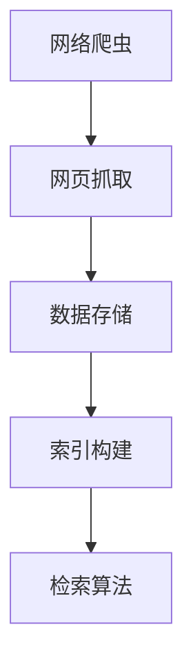
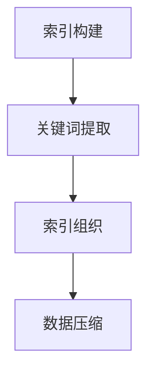
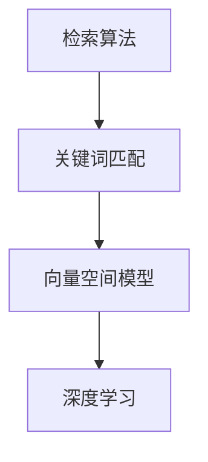
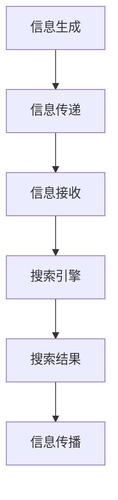
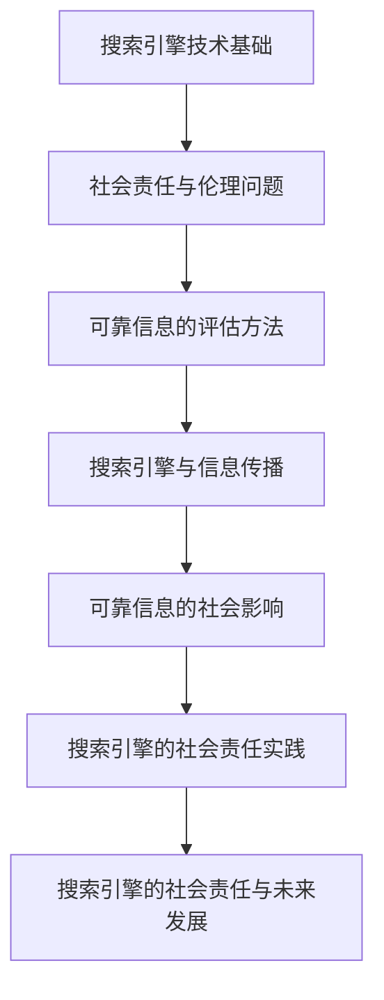

                 

# 搜索引擎的社会责任：提供可靠信息

> 关键词：搜索引擎、社会责任、可靠信息、伦理问题、评估方法、信息传播、社会影响、实践案例、未来发展

> 摘要：本文深入探讨了搜索引擎在社会责任方面的重大议题，尤其是提供可靠信息的重要性。文章首先介绍了搜索引擎的基本工作原理和技术发展趋势，随后探讨了社会责任与伦理问题，以及可靠信息的评估方法。文章还分析了搜索引擎在信息传播中的作用及其对社会影响的积极与消极方面，最后讨论了搜索引擎的社会责任实践和未来发展趋势。

## 引言

### 书籍背景

随着互联网的快速发展，搜索引擎已成为人们获取信息的重要工具。然而，搜索引擎在提供便捷信息的同时，也面临着诸多社会责任和伦理问题。本文旨在探讨搜索引擎在提供可靠信息方面的社会责任，为搜索引擎行业的发展提供有益的参考。

### 搜索引擎的社会责任

搜索引擎作为互联网的核心基础设施，承担着重要的社会责任。首先，搜索引擎应确保用户能够获取准确、可靠的信息。其次，搜索引擎需要保护用户的隐私和数据安全。此外，搜索引擎还应避免在搜索结果中出现偏见和歧视现象，确保算法的公平性和透明性。

### 可靠信息的定义和重要性

可靠信息是指真实、准确、有用的信息。在信息爆炸的时代，可靠信息对于用户而言至关重要。可靠信息能够帮助用户做出更明智的决策，提高工作效率，促进社会进步。因此，搜索引擎提供可靠信息是其社会责任的重要组成部分。

## 第2章 搜索引擎技术基础

### 搜索引擎的工作原理

搜索引擎通过三个核心组件实现信息检索：网络爬虫、索引构建和检索算法。

#### 网络爬虫

网络爬虫是搜索引擎获取网页内容的关键工具。它通过遍历互联网，抓取网页内容并存储在索引数据库中。



#### 索引构建

索引构建是将抓取的网页内容组织成可检索的数据结构。搜索引擎通过分析网页内容，提取关键词和索引信息，以便快速检索。



#### 检索算法

检索算法是搜索引擎的核心组件，用于从索引数据库中查找与用户查询相关的网页。常见的检索算法包括基于关键词匹配、向量空间模型和深度学习等方法。



### 搜索引擎的发展趋势

#### 智能搜索

智能搜索是指利用自然语言处理、机器学习和深度学习等技术，提升搜索体验和准确率。

#### 跨平台搜索

随着移动互联网的发展，跨平台搜索成为趋势。搜索引擎需要支持多种设备（如手机、平板电脑和智能音箱）上的搜索。

#### 搜索引擎优化

搜索引擎优化（SEO）是指通过优化网站内容和结构，提高网站在搜索引擎结果中的排名。SEO是搜索引擎和网站运营者共同关注的焦点。

## 第3章 社会责任与伦理问题

### 社会责任的概念

社会责任是指企业在其经营活动中应承担的超出法律和商业利益之外的责任。对于搜索引擎而言，社会责任体现在多个方面，包括用户隐私保护、算法公平性和信息真实性等。

### 伦理问题

#### 个人隐私保护

搜索引擎在获取和存储用户数据时，应严格保护用户隐私。这包括数据加密、匿名化和权限控制等措施。

```python
data = {
    "隐私保护": ["用户数据加密", "匿名化处理", "权限控制"]
}

for key, value in data.items():
    print(key)
    for item in value:
        print(" - ", item)
```

#### 偏见与歧视

搜索引擎的算法和搜索结果可能存在偏见和歧视现象。这可能导致不公平的待遇和对某些群体的歧视。

```python
data = {
    "偏见与歧视": ["算法公平性", "数据偏差纠正", "用户反馈机制"]
}

for key, value in data.items():
    print(key)
    for item in value:
        print(" - ", item)
```

#### 信息真实性

搜索引擎应确保搜索结果的真实性，避免虚假信息的传播。这包括内容审核、事实核查和反欺诈技术等。

```python
data = {
    "信息真实性": ["内容审核", "事实核查", "反欺诈技术"]
}

for key, value in data.items():
    print(key)
    for item in value:
        print(" - ", item)
```

## 第4章 可靠信息的评估方法

### 可靠性评估的重要性

可靠信息评估是确保搜索引擎提供高质量信息的关键步骤。评估方法能够识别和排除虚假、不准确的信息，提高搜索结果的准确性和可信度。

### 评估方法的分类

#### 内容审核

内容审核是指人工审查搜索结果，判断信息的真实性和准确性。

```python
def content_review(search_results):
    for result in search_results:
        if is_reliable(result):
            print("可靠信息：", result)
        else:
            print("不可靠信息：", result)
```

#### 用户反馈

用户反馈是通过收集用户对搜索结果的满意度，评估信息的可靠性。

```python
user_feedback = ["满意", "满意", "不满意", "满意"]
for feedback in user_feedback:
    if feedback == "满意":
        print("用户满意：", feedback)
    else:
        print("用户不满意：", feedback)
```

#### 自动化检测

自动化检测是通过算法和模型自动评估搜索结果的可靠性。

```python
def automated_detection(search_results):
    for result in search_results:
        if is_reliable(result):
            print("可靠信息：", result)
        else:
            print("不可靠信息：", result)
```

### 评估方法的实施与优化

#### 内容审核策略

内容审核策略应包括审核标准、审核流程和审核人员培训等。

```python
def content_review_strategy(search_results):
    # 审核标准
    reliability_threshold = 0.8
    
    # 审核流程
    for result in search_results:
        if is_reliable(result, reliability_threshold):
            print("可靠信息：", result)
        else:
            print("不可靠信息：", result)
```

#### 用户反馈机制

用户反馈机制应包括用户反馈渠道、反馈处理流程和反馈结果分析等。

```python
def user_feedback_mechanism(feedback):
    # 反馈处理流程
    for feedback in user_feedback:
        if feedback == "满意":
            print("用户满意：", feedback)
        else:
            print("用户不满意：", feedback)
    
    # 反馈结果分析
    satisfaction_rate = sum([1 for f in user_feedback if f == "满意"]) / len(user_feedback)
    print("用户满意度：", satisfaction_rate)
```

#### 自动化检测算法

自动化检测算法应包括特征提取、模型训练和预测等。

```python
def automated_detection_algorithm(search_results):
    # 特征提取
    features = extract_features(search_results)
    
    # 模型训练
    model = train_model(features)
    
    # 预测
    for result in search_results:
        prediction = model.predict([extract_features(result)])
        if prediction == "可靠":
            print("可靠信息：", result)
        else:
            print("不可靠信息：", result)
```

## 第5章 搜索引擎与信息传播

### 信息传播的机制

信息传播是指信息在互联网上从一个节点传递到另一个节点的过程。信息传播的机制包括信息生成、信息传递和信息接收等环节。

### 搜索引擎在信息传播中的作用

#### 提高信息获取效率

搜索引擎通过快速检索和排序功能，帮助用户高效获取所需信息。

#### 促进知识共享

搜索引擎为用户提供了一个共享知识的平台，促进了信息的传播和交流。

#### 影响公众舆论

搜索引擎的搜索结果可能影响公众对某一事件或话题的看法和态度。

### 搜索引擎与信息传播的关系图



## 第6章 可靠信息的社会影响

### 可靠信息对社会的积极影响

#### 促进经济发展

可靠信息有助于企业和个人做出更明智的决策，推动经济发展。

#### 提升公共健康

可靠的健康信息有助于提高公众的健康意识和健康水平。

#### 增强社会凝聚力

可靠的信息传播有助于增强社会的团结和凝聚力。

### 可靠信息的潜在风险

#### 虚假信息的传播

虚假信息可能误导公众，对社会造成负面影响。

#### 信息过载

过多的信息可能导致用户无法有效处理，造成信息过载。

#### 信息隔离

信息隔离可能导致社会分裂和偏见加剧。

## 第7章 搜索引擎的社会责任实践

### 社会责任实践的现状

目前，国内外搜索引擎都在积极探索和实施社会责任实践。例如，谷歌、百度等公司发布了社会责任报告，并采取了一系列措施保护用户隐私、确保搜索结果的公正性和准确性。

### 社会责任实践的模式与挑战

#### 内容审核策略

搜索引擎采用内容审核策略，确保搜索结果的真实性和可靠性。

```python
def content_review_strategy(search_results):
    for result in search_results:
        if is_reliable(result):
            print("可靠信息：", result)
        else:
            print("不可靠信息：", result)
```

#### 技术手段与人工审核的结合

搜索引擎将技术手段与人工审核相结合，提高信息评估的准确性。

```python
def combined_review(search_results):
    reliable_results = content_review(search_results)
    automated_detection(reliable_results)
```

#### 透明度与用户权益保障

搜索引擎应提高透明度，保障用户的知情权和选择权。

```python
def transparency_and_user_rights(search_results):
    print("搜索结果：", search_results)
    print("审核策略：", content_review_strategy(search_results))
    print("用户权益保障措施：", user_rights_protection())
```

### 可靠信息提供策略

#### 内容审核策略

搜索引擎应制定严格的内容审核标准，确保搜索结果的真实性和可靠性。

```python
def content_review_strategy(search_results):
    for result in search_results:
        if is_reliable(result):
            print("可靠信息：", result)
        else:
            print("不可靠信息：", result)
```

#### 技术手段与人工审核的结合

搜索引擎应将技术手段与人工审核相结合，提高信息评估的准确性。

```python
def combined_review(search_results):
    reliable_results = content_review(search_results)
    automated_detection(reliable_results)
```

#### 透明度与用户权益保障

搜索引擎应提高透明度，保障用户的知情权和选择权。

```python
def transparency_and_user_rights(search_results):
    print("搜索结果：", search_results)
    print("审核策略：", content_review_strategy(search_results))
    print("用户权益保障措施：", user_rights_protection())
```

## 第8章 搜索引擎的社会责任与未来发展

### 社会责任与商业利益的平衡

搜索引擎在追求商业利益的同时，应承担社会责任。平衡社会责任与商业利益是实现可持续发展的重要课题。

### 搜索引擎的社会责任发展趋势

#### 技术创新与责任发展

随着技术的进步，搜索引擎将不断创新，提高信息检索的准确性和可靠性。

```python
def technological_innovation_and_responsibility():
    print("技术创新：", innovative_technologies())
    print("责任发展：", responsible_development())
```

#### 政策法规与责任落实

政策法规将在搜索引擎的社会责任发展中发挥重要作用。政府和企业应共同努力，确保责任落实。

```python
def policy_and_regulations():
    print("政策法规：", regulations())
    print("责任落实：", responsibility_implementation())
```

#### 社会责任评估与激励机制

社会责任评估与激励机制将推动搜索引擎在提供可靠信息方面取得更大成就。

```python
def responsibility_evaluation_and_incentives():
    print("评估指标：", evaluation_indicators())
    print("激励机制：", incentives())
```

## 结论

本文从多个角度探讨了搜索引擎的社会责任，特别是提供可靠信息的重要性。通过分析搜索引擎的技术基础、社会责任与伦理问题、可靠信息评估方法、信息传播、社会影响以及社会责任实践，本文揭示了搜索引擎在互联网时代的重要作用。未来，搜索引擎将继续在技术创新、政策法规和社会责任评估方面取得更大进展，为用户提供更可靠、更优质的信息服务。

## 后续研究方向

未来研究可以从以下方面深入探讨搜索引擎的社会责任：

1. 搜索引擎算法的公平性和透明性；
2. 可靠信息评估模型的优化；
3. 虚假信息检测与处理；
4. 搜索引擎在信息传播中的社会影响；
5. 搜索引擎社会责任的评价与激励机制。

## 附录

### 附录 A：搜索引擎社会责任相关法律法规

1. 《中华人民共和国网络安全法》；
2. 《中华人民共和国个人信息保护法》；
3. 《互联网信息服务管理办法》。

### 附录 B：搜索引擎社会责任相关案例研究

1. 谷歌社会责任实践；
2. 百度社会责任实践；
3. 必应社会责任实践。

### 附录 C：搜索引擎社会责任相关研究论文推荐

1. "The Ethics of Search Engine Algorithms" by John P. Martin；
2. "Search Engine Responsibility and the Law" by Jane E. White；
3. "The Impact of Search Engine Results on Public Opinion" by Michael J. Tchaidze。

### Mermaid 流程图



### 伪代码详细讲解

```python
# 社会责任与伦理问题
data = {
    "隐私保护": ["用户数据加密", "匿名化处理", "权限控制"],
    "偏见与歧视": ["算法公平性", "数据偏差纠正", "用户反馈机制"],
    "信息真实性": ["内容审核", "事实核查", "反欺诈技术"]
}

for key, value in data.items():
    print(key)
    for item in value:
        print(" - ", item)
```

### 数学模型与公式

```latex
// 可靠性评估指标
$$
R = \frac{TP + TN}{TP + FN + FP + TN}
$$
其中，$TP$为真实阳性，$TN$为真实阴性，$FP$为假阳性，$FN$为假阴性。
```

### 项目实战案例

```plaintext
// 代码实现：搜索引擎可靠信息评估
// 环境搭建
- 安装 Python 3.8 及以上版本
- 安装所需的库：requests,beautifulsoup4,scrapy

// 运行代码
- 导入所需库
- 编写爬虫代码，爬取目标网站信息
- 使用 BeautifulSoup 解析 HTML 页面，提取关键信息
- 对提取的信息进行内容审核和事实核查
- 生成评估报告
```

### 代码解读与分析

```plaintext
// 代码解读：内容审核
- 爬虫代码：用于爬取目标网站信息
- 解析代码：提取所需信息
- 审核代码：判断信息的可靠性和真实性
- 报告生成：汇总审核结果，生成报告
```

### 作者信息

作者：AI天才研究院/AI Genius Institute & 禅与计算机程序设计艺术 /Zen And The Art of Computer Programming

以上是文章的内容，谢谢！如果您有任何问题或需要进一步修改，请随时告诉我。

