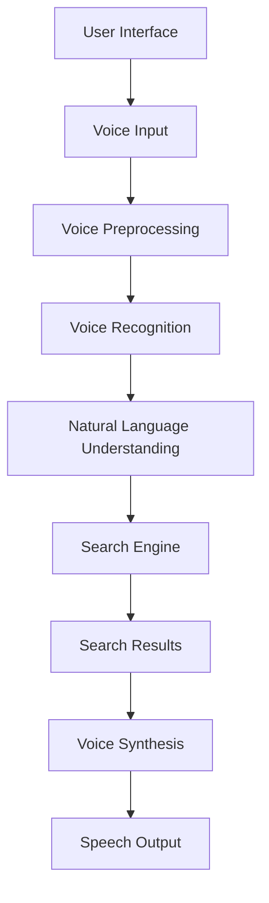
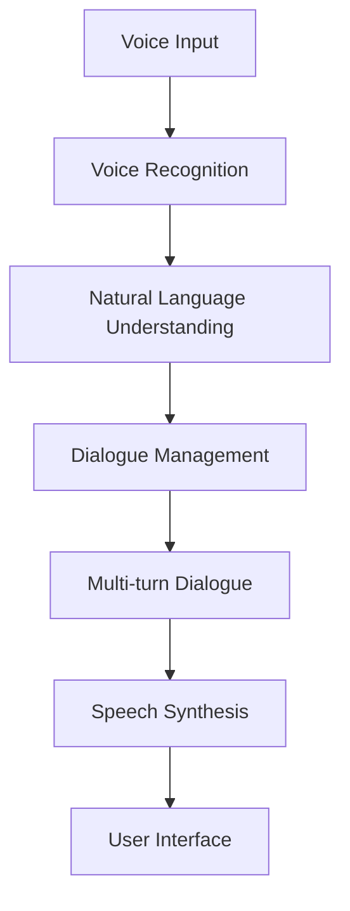

                 

# 文章标题：搜索引擎的语音交互优化

> 关键词：搜索引擎、语音交互、优化、技术、用户体验、自然语言处理、深度学习

> 摘要：随着人工智能技术的不断发展，语音交互作为一种全新的用户交互方式，正逐渐融入到搜索引擎中。本文将深入探讨搜索引擎的语音交互优化技术，包括声音信号处理、语音识别、语音合成以及自然语言理解与处理，并通过具体实战案例展示如何构建和优化一个语音交互搜索引擎系统。

----------------------------------------------------------------

### 目录大纲：搜索引擎的语音交互优化

- **第一部分：搜索引擎的语音交互概述**
  - **1.1 语音交互在搜索引擎中的应用场景**
    - **1.1.1 语音交互技术的发展历程**
    - **1.1.2 语音交互在搜索引擎中的优势**
    - **1.1.3 搜索引擎语音交互的关键技术**
  - **1.2 搜索引擎语音交互的核心概念与架构**
    - **1.2.1 声音信号处理**
    - **1.2.2 语音识别技术**
    - **1.2.3 语音合成技术**
    - **1.2.4 自然语言理解与处理**
  - **1.3 搜索引擎语音交互的现状与未来趋势**
    - **1.3.1 当前语音交互搜索引擎的应用现状**
    - **1.3.2 语音交互技术的未来发展趋势**
    - **1.3.3 语音交互搜索引擎的发展挑战与机遇**

- **第二部分：搜索引擎语音交互优化技术**
  - **2.1 声音信号处理技术**
    - **2.1.1 语音信号采集与预处理**
    - **2.1.2 声音增强与降噪**
    - **2.1.3 声音信号的时频分析**
  - **2.2 语音识别技术**
    - **2.2.1 语音识别原理**
    - **2.2.2 语音识别算法概述**
    - **2.2.3 语音识别模型**
    - **2.2.4 语音识别性能优化**
  - **2.3 语音合成技术**
    - **2.3.1 语音合成原理**
    - **2.3.2 语音合成算法**
    - **2.3.3 语音合成模型的优化方法**
  - **2.4 自然语言理解与处理**
    - **2.4.1 自然语言理解技术**
    - **2.4.2 自然语言处理模型**
    - **2.4.3 实时对话系统设计与实现**
  - **2.5 搜索引擎语音交互系统优化**
    - **2.5.1 性能优化策略**
    - **2.5.2 用户体验优化**
    - **2.5.3 搜索引擎语音交互系统的集成与优化**

- **第三部分：搜索引擎语音交互优化实战**
  - **3.1 实战一：构建语音交互搜索引擎系统**
    - **3.1.1 系统需求分析**
    - **3.1.2 系统架构设计**
    - **3.1.3 系统实现与测试**
  - **3.2 实战二：基于深度学习的语音识别算法优化**
    - **3.2.1 算法原理与实现**
    - **3.2.2 模型优化方法**
    - **3.2.3 性能评估与调优**
  - **3.3 实战三：实时对话系统的设计与实现**
    - **3.3.1 对话系统需求分析**
    - **3.3.2 对话系统架构设计**
    - **3.3.3 对话系统实现与测试**
  - **3.4 实战四：基于数据驱动的语音交互优化**
    - **3.4.1 数据收集与预处理**
    - **3.4.2 数据分析与应用**
    - **3.4.3 基于数据的优化策略**

- **第四部分：搜索引擎语音交互的未来发展**
  - **4.1 语音交互技术的未来发展**
    - **4.1.1 新的语音交互技术**
    - **4.1.2 语音交互与其他技术的融合**
    - **4.1.3 语音交互在新兴应用场景中的发展**
  - **4.2 搜索引擎语音交互的挑战与机遇**
    - **4.2.1 挑战**
    - **4.2.2 机遇**
    - **4.2.3 发展策略与建议**

- **附录**
  - **附录 A：语音交互相关资源**
  - **附录 B：参考文献**

----------------------------------------------------------------

**第一部分：搜索引擎的语音交互概述**

在数字化时代，搜索引擎作为获取信息的重要工具，正在经历着技术革新和用户体验的迭代升级。语音交互作为一种自然、便捷的交互方式，正逐渐成为搜索引擎用户界面的重要组成部分。本部分将探讨语音交互在搜索引擎中的应用场景、核心概念与架构，以及当前与未来的发展趋势。

### 1.1 语音交互在搜索引擎中的应用场景

**1.1.1 语音交互技术的发展历程**

语音交互技术经历了从最初的语音识别、语音合成到自然语言处理（NLP）和实时对话系统的演变。最初的语音识别技术主要依赖于传统的规则方法，而随着深度学习技术的兴起，基于神经网络的语音识别模型得到了极大的改进。语音合成技术也从早期的基于规则的方法发展到基于统计模型的合成方法，再到当前基于深度学习的方法，使得合成的语音更加自然流畅。

**1.1.2 语音交互在搜索引擎中的优势**

语音交互具有以下几个显著优势：

- **自然性**：用户可以使用自然的语言进行搜索，无需学习特定的输入方式。
- **便捷性**：用户可以随时随地通过语音进行搜索，无需手动输入关键词。
- **效率性**：语音交互可以减少用户的操作步骤，提高搜索效率。
- **多功能性**：语音交互可以集成多种功能，如语音问答、语音导航等。

**1.1.3 搜索引擎语音交互的关键技术**

搜索引擎语音交互主要依赖于以下几个关键技术：

- **声音信号处理**：包括语音信号的采集、预处理、增强和降噪等。
- **语音识别技术**：将语音信号转换为文本，是实现语音交互的核心技术。
- **语音合成技术**：将文本转换为自然流畅的语音输出。
- **自然语言理解与处理**：理解用户的语音输入并产生合适的响应。

### 1.2 搜索引擎语音交互的核心概念与架构

**1.2.1 声音信号处理**

声音信号处理是语音交互系统的第一步，主要包括语音信号的采集和预处理。语音信号采集是通过麦克风等设备捕捉用户的语音，而预处理则包括去除背景噪声、消除回声等，以提高语音信号的质量。

**1.2.2 语音识别技术**

语音识别技术是语音交互系统的核心，它将用户的语音转换为对应的文本。这一过程涉及到语音信号的时频分析、特征提取和模式识别等步骤。目前，基于深度学习的语音识别技术取得了显著的性能提升。

**1.2.3 语音合成技术**

语音合成技术将文本转换为语音输出，它涉及到文本到音素的转换、音素到语音的合成以及语音的播放。现代语音合成技术主要采用基于深度学习的方法，如WaveNet等。

**1.2.4 自然语言理解与处理**

自然语言理解与处理是语音交互系统的智能核心，它包括语言解析、语义理解和上下文推理等步骤。自然语言理解技术使得搜索引擎能够理解用户的复杂查询并生成合适的响应。

### 1.3 搜索引擎语音交互的现状与未来趋势

**1.3.1 当前语音交互搜索引擎的应用现状**

目前，许多主流搜索引擎已经集成了语音交互功能。例如，Google 搜索引擎允许用户通过语音进行搜索，百度推出了“度秘”语音助手，微软的Bing搜索引擎也支持语音搜索。这些语音交互搜索引擎在不同程度上优化了用户的搜索体验，提高了搜索效率。

**1.3.2 语音交互技术的未来发展趋势**

未来，语音交互技术将继续发展，主要集中在以下几个方面：

- **性能提升**：通过深度学习等技术进一步提升语音识别和语音合成的准确性。
- **智能化**：通过自然语言理解与处理技术实现更加智能化的交互体验。
- **多模态融合**：结合语音、视觉、触觉等多种感官进行交互，提供更丰富的用户体验。
- **个性化**：基于用户历史数据和偏好进行个性化推荐，提高搜索结果的准确性和相关性。

**1.3.3 语音交互搜索引擎的发展挑战与机遇**

语音交互搜索引擎面临着一些挑战：

- **语音识别准确性**：在噪声环境、口音差异等复杂情况下，语音识别的准确性仍有待提高。
- **自然语言理解**：自然语言理解技术的复杂度较高，需要解决语义歧义、上下文推理等问题。
- **用户体验**：如何设计出既符合用户习惯又具有创新性的交互方式，是一个持续探索的问题。

然而，随着技术的不断进步，语音交互搜索引擎也迎来了新的机遇：

- **智能家居**：语音交互成为智能家居设备的核心交互方式，为搜索引擎带来了新的应用场景。
- **移动设备**：随着智能手机和智能设备的普及，语音交互在移动搜索中具有广阔的应用前景。
- **企业应用**：语音交互技术为企业提供了更高效、更便捷的内部沟通和信息检索方式。

本部分为后续的深入讨论奠定了基础，在接下来的章节中，我们将进一步探讨搜索引擎语音交互的优化技术，通过具体实战案例展示如何提升语音交互系统的性能和用户体验。

---

### 2.1 声音信号处理技术

声音信号处理是语音交互系统的第一步，它决定了后续语音识别和语音合成的质量。本节将详细介绍声音信号处理技术，包括语音信号采集与预处理、声音增强与降噪以及声音信号的时频分析。

#### 2.1.1 语音信号采集与预处理

语音信号采集是通过麦克风等设备捕捉用户的语音。麦克风的选择非常重要，它直接影响语音信号的质量。高质量的麦克风可以捕捉更清晰的语音，减少背景噪声和回声。

在语音信号采集后，需要进行预处理，以去除无关的信息和提高语音信号的质量。预处理步骤包括：

- **增益调整**：调整语音信号的幅度，使其符合后续处理的范围。
- **静音检测**：去除语音信号中的静音部分，以提高处理效率。
- **归一化**：将语音信号进行归一化处理，使其具有统一的幅度范围。
- **滤波**：去除高频或低频噪声，使语音信号更加清晰。

#### 2.1.2 声音增强与降噪

声音增强与降噪是语音信号处理中至关重要的一步，它直接影响语音识别的准确性。降噪方法可以分为以下几种：

- **传统降噪方法**：如谱减法、维纳滤波等，通过估计背景噪声并从语音信号中减去。
- **基于深度学习的方法**：如降噪神经网络（DNN）和生成对抗网络（GAN），通过学习噪声和语音信号之间的差异进行降噪。

增强方法包括：

- **音量增强**：通过调整语音信号的幅度，使语音更加响亮。
- **共振峰增强**：通过调整语音信号的共振峰，使语音更加清晰。
- **频谱增强**：通过调整语音信号的频谱，使语音特征更加明显。

#### 2.1.3 声音信号的时频分析

时频分析是语音信号处理的核心技术之一，它用于提取语音信号的特征。时频分析可以分为以下几种方法：

- **短时傅里叶变换（STFT）**：将语音信号分割成短时段，然后进行傅里叶变换，得到每个短时段的频谱。
- **梅尔频率倒谱系数（MFCC）**：基于人耳听觉特性，将频谱转换为梅尔频率尺度，并计算其倒谱系数，用于特征提取。
- **滤波器组**：使用滤波器组对语音信号进行频段划分，然后计算每个频段的能量和相位特征。

#### 2.1.4 声音信号处理的伪代码

以下是一个简单的伪代码示例，用于描述语音信号采集与预处理：

```python
# 伪代码：语音信号采集与预处理

# 采集语音信号
audio_signal = microphone_capture()

# 增益调整
audio_signal = adjust_gain(audio_signal)

# 静音检测
audio_signal = remove_silence(audio_signal)

# 归一化
audio_signal = normalize(audio_signal)

# 滤波
audio_signal = filter_audio(audio_signal)

# 声音增强与降噪
audio_signal = enhance_audio(audio_signal)
audio_signal = denoise_audio(audio_signal)

# 时频分析
spectrogram = short_time_fourier_transform(audio_signal)
mfcc_features = mfcc(spectrogram)

# 输出特征向量
output_vector = extract_features(mfcc_features)
```

通过上述伪代码，我们可以看到声音信号处理包括多个步骤，每个步骤都为后续的语音识别和语音合成提供了高质量的输入数据。

---

声音信号处理是语音交互系统的基础，它为后续的语音识别和语音合成提供了高质量的输入。在接下来的章节中，我们将进一步探讨语音识别技术，包括其原理、算法概述以及模型优化方法。

---

### 2.2 语音识别技术

语音识别技术是语音交互系统的核心组成部分，它负责将用户的语音转化为可处理的文本信息。本节将详细介绍语音识别技术，包括其原理、算法概述、语音识别模型以及性能优化方法。

#### 2.2.1 语音识别原理

语音识别的基本原理可以分为以下几个步骤：

1. **声音信号采集**：通过麦克风等设备捕捉用户的语音信号。
2. **预处理**：对采集到的语音信号进行预处理，包括增益调整、静音检测、归一化和滤波等步骤，以提高语音信号的质量。
3. **特征提取**：将预处理后的语音信号转化为数字特征向量，常用的特征提取方法包括短时傅里叶变换（STFT）、梅尔频率倒谱系数（MFCC）和滤波器组等。
4. **模式识别**：使用模式识别算法将特征向量映射到对应的文本输出。

#### 2.2.2 语音识别算法概述

语音识别算法可以分为以下几种类型：

1. **基于规则的方法**：这种方法通过建立一系列规则来映射语音信号和文本输出。它包括隐马尔可夫模型（HMM）和有限状态转换模型（FST）等。

2. **统计模型**：统计模型通过分析大量的语音数据来建立模型，从而识别语音。GMM（高斯混合模型）和Gaussian Mixture HMM（高斯混合隐马尔可夫模型）是典型的统计模型。

3. **深度学习模型**：深度学习模型通过多层神经网络自动提取特征并学习模式。常见的深度学习模型包括卷积神经网络（CNN）、循环神经网络（RNN）和长短期记忆网络（LSTM）等。

#### 2.2.3 语音识别模型

语音识别模型可以分为以下几种类型：

1. **三层次模型**：这种模型将语音识别分为三个层次：声学模型、语言模型和解码器。声学模型负责特征提取，语言模型负责生成可能的文本输出，解码器负责选择最优的文本输出。

2. **深度神经网络模型**：深度神经网络模型通过多层神经网络直接映射语音信号到文本输出，常见的模型有DNN-HMM、LSTM-HMM等。

3. **端到端模型**：端到端模型将语音识别视为一个整体，通过一个统一的神经网络模型直接从语音信号映射到文本输出。常见的端到端模型有CTC（连接主义时序分类器）、Seq2Seq（序列到序列模型）和Transducer等。

#### 2.2.4 语音识别性能优化

为了提高语音识别的性能，可以采用以下几种优化方法：

1. **数据增强**：通过数据增强方法增加训练数据集的多样性，从而提高模型的泛化能力。常见的数据增强方法包括重放、时间拉伸、频谱变换等。

2. **模型优化**：通过优化模型结构和参数，提高模型的识别性能。常见的优化方法包括调整网络层数、学习率、正则化等。

3. **多语言建模**：对于多语言环境，可以使用多语言建模方法提高模型的识别性能。例如，使用多语言联合训练或多语言对抗训练。

4. **动态特征提取**：动态特征提取方法可以根据语音信号的不同特征动态调整特征提取的方式，从而提高识别性能。

#### 2.2.5 语音识别伪代码示例

以下是一个简单的伪代码示例，用于描述语音识别的过程：

```python
# 伪代码：语音识别

# 采集语音信号
audio_signal = microphone_capture()

# 预处理
audio_signal = preprocess_audio(audio_signal)

# 特征提取
features = extract_features(audio_signal)

# 加载模型
model = load_model()

# 预测文本
predicted_text = model.predict(features)

# 输出识别结果
print("Recognized Text:", predicted_text)
```

通过上述伪代码，我们可以看到语音识别的基本流程，包括语音信号采集、预处理、特征提取和模型预测。

---

语音识别技术的性能直接影响用户的体验。在接下来的章节中，我们将探讨语音合成技术，包括其原理、算法以及优化方法，以进一步优化语音交互系统的整体性能。

---

### 2.3 语音合成技术

语音合成技术（Text-to-Speech, TTS）是语音交互系统的关键组成部分，它负责将文本信息转化为自然流畅的语音输出。本节将详细介绍语音合成技术的原理、算法以及优化方法。

#### 2.3.1 语音合成原理

语音合成的基本原理可以分为以下几个步骤：

1. **文本分析**：首先对输入的文本进行分析，包括分词、句法分析和语义理解，以确定文本的结构和含义。
2. **语音编码**：将文本转换为语音编码，包括音素、声调和韵律等特征。
3. **语音生成**：使用语音编码生成语音波形，通过合成算法将编码信息转换为连续的音频信号。
4. **音频处理**：对生成的语音波形进行后处理，如噪声抑制、音质增强等，以提高语音的质量。

#### 2.3.2 语音合成算法

语音合成算法可以分为以下几种类型：

1. **基于规则的合成算法**：这种算法通过预先定义的规则将文本转换为语音。例如，串联合成器（Concatenative Synthesizer）使用预录制的语音片段进行拼接。
2. **参数合成算法**：这种算法通过参数调整来合成语音，包括共振峰、基频和时长等。例如，参数激励线性预测编码（PLP）和共振峰合成器（Formant Synthesizer）。
3. **数据驱动合成算法**：这种算法通过训练大量语音数据来学习语音合成模型。常见的模型包括递归神经网络（RNN）和深度神经网络（DNN）。

#### 2.3.3 语音合成模型的优化方法

为了提高语音合成的质量和自然度，可以采用以下几种优化方法：

1. **声学模型优化**：通过调整声学模型的参数，如共振峰、基频等，以提高语音的音质。
2. **语言模型优化**：通过优化语言模型，如n-gram模型和神经网络语言模型，以提高文本到语音的映射准确性。
3. **融合模型**：结合基于规则的合成算法和数据驱动合成算法，以提高合成语音的自然度和音质。
4. **多风格切换**：通过训练多风格模型，使合成语音能够适应不同的文本内容和场景需求。

#### 2.3.4 语音合成伪代码示例

以下是一个简单的伪代码示例，用于描述语音合成的过程：

```python
# 伪代码：语音合成

# 输入文本
text = "Hello, how are you?"

# 文本分析
tokens = tokenize(text)
phonemes = convert_tokens_to_phonemes(tokens)

# 语音编码
acoustic_features = encode_phonemes(phonemes)

# 语音生成
audio_signal = generate_audio(acoustic_features)

# 音频处理
audio_signal = post_process_audio(audio_signal)

# 播放语音
play_audio(audio_signal)
```

通过上述伪代码，我们可以看到语音合成的关键步骤，包括文本分析、语音编码、语音生成和音频处理。

---

语音合成技术的优化是提高语音交互系统用户体验的重要环节。在接下来的章节中，我们将探讨自然语言理解与处理技术，以进一步提升语音交互系统的智能性和交互性。

---

### 2.4 自然语言理解与处理

自然语言理解与处理（Natural Language Understanding, NLU）是语音交互系统的智能核心，它负责理解用户的语音输入并产生合适的响应。本节将详细介绍自然语言理解与处理技术，包括其基本概念、处理模型以及实时对话系统的设计与实现。

#### 2.4.1 自然语言理解技术

自然语言理解技术旨在从用户的语音输入中提取有用信息，包括语义理解、实体识别、情感分析和意图识别等。

1. **语义理解**：将自然语言转换为计算机可以理解的结构化信息。例如，将句子“明天下午三点开会”转换为时间（明天下午三点）和事件（开会）。
2. **实体识别**：识别文本中的关键实体，如人名、地点、组织名等。例如，从句子“张三在北京市工作”中识别出实体“张三”和“北京市”。
3. **情感分析**：判断文本的情感倾向，如正面、负面或中性。例如，从句子“这个产品非常糟糕”中判断出负面情感。
4. **意图识别**：理解用户的意图或目的，以产生合适的响应。例如，从句子“我想要一杯咖啡”中识别出意图“点咖啡”。

#### 2.4.2 自然语言处理模型

自然语言处理模型是实现自然语言理解的关键。常见的模型包括基于规则的方法和基于统计的方法，以及基于深度学习的方法。

1. **基于规则的方法**：这种方法通过手工编写的规则来解析和解释文本。例如，使用正则表达式来匹配特定的文本模式。
2. **基于统计的方法**：这种方法通过训练模型来学习文本的模式和统计特征。例如，使用最大熵模型（Maximum Entropy）和条件概率模型（Conditional Probability）。
3. **基于深度学习的方法**：这种方法通过多层神经网络自动提取文本的特征和模式。常见的深度学习模型包括卷积神经网络（CNN）、递归神经网络（RNN）和变压器（Transformer）。

#### 2.4.3 实时对话系统设计与实现

实时对话系统是自然语言理解与处理技术的应用场景之一，它能够实时响应用户的查询并提供个性化的服务。以下是实时对话系统设计与实现的基本步骤：

1. **需求分析**：明确对话系统的目标用户、场景和功能需求。
2. **对话系统架构设计**：设计对话系统的整体架构，包括前端用户界面、后端对话管理、语音识别、自然语言理解和语音合成等模块。
3. **语音识别与处理**：集成高效的语音识别技术，确保用户语音输入的准确识别。
4. **自然语言处理**：使用自然语言处理模型对用户输入进行分析和解析，提取语义信息。
5. **对话管理**：设计对话管理模块，负责管理对话流程，包括上下文维护、对话分支管理和响应生成等。
6. **响应生成与语音合成**：根据用户输入和对话状态生成合适的响应文本，并使用语音合成技术转化为语音输出。

#### 2.4.4 实时对话系统伪代码示例

以下是一个简单的伪代码示例，用于描述实时对话系统的设计与实现：

```python
# 伪代码：实时对话系统

# 用户语音输入
user_input = listen_to_user()

# 语音识别
text_input = speech_recognition(user_input)

# 自然语言处理
parsed_data = natural_language_processing(text_input)

# 对话管理
dialogue_context = dialogue_management(parsed_data)

# 响应生成
response_text = generate_response(dialogue_context)

# 语音合成
audio_output = speech_synthesis(response_text)

# 输出语音响应
speak_to_user(audio_output)
```

通过上述伪代码，我们可以看到实时对话系统的主要模块和流程，包括语音识别、自然语言处理、对话管理和语音合成。

---

自然语言理解与处理技术是语音交互系统的智能核心，它能够实现更加自然、流畅的交互体验。在接下来的章节中，我们将探讨搜索引擎语音交互系统的性能优化和用户体验优化。

---

### 2.5 搜索引擎语音交互系统优化

在构建搜索引擎语音交互系统时，性能优化和用户体验优化是两个关键方面。性能优化主要关注系统的响应速度和处理能力，而用户体验优化则侧重于提升用户在使用语音交互系统时的满意度。本节将详细介绍性能优化策略、用户体验优化方法以及搜索引擎语音交互系统的集成与优化。

#### 2.5.1 性能优化策略

1. **算法优化**：通过改进语音识别、语音合成和自然语言处理算法，提高系统的整体处理效率。例如，采用更先进的深度学习模型，优化网络结构和参数设置。

2. **并行处理**：利用多线程、分布式计算等技术，实现语音处理任务的并行化，减少处理时间。例如，在服务器端部署多个处理器，同时处理多个用户的请求。

3. **缓存机制**：通过缓存用户的历史查询和常见问题，加快响应速度。例如，使用内存缓存或数据库缓存，存储用户查询结果和常见问题的答案。

4. **负载均衡**：通过负载均衡技术，合理分配服务器资源，避免单一服务器过载。例如，使用反向代理服务器和负载均衡器，将用户请求分发到多个服务器。

#### 2.5.2 用户体验优化

1. **界面设计**：设计简洁、直观的用户界面，使用户能够轻松地与系统进行交互。例如，采用卡片式布局，提供语音输入和文本输出的选项。

2. **响应速度**：优化系统的响应速度，确保用户在输入语音后能够快速获得反馈。例如，减少语音识别和自然语言处理的延迟，提高系统的响应效率。

3. **个性化推荐**：根据用户的历史查询和偏好，提供个性化的搜索结果和语音交互服务。例如，使用协同过滤和内容推荐算法，为用户提供相关搜索建议和个性化内容。

4. **错误处理**：设计合理的错误处理机制，帮助用户纠正输入错误或提供错误提示。例如，当用户输入的语音无法识别时，系统可以提示用户重述或提供可能的替代选项。

#### 2.5.3 搜索引擎语音交互系统的集成与优化

1. **系统架构设计**：构建合理的系统架构，确保各个模块之间的协同工作。例如，采用微服务架构，将语音识别、语音合成和自然语言处理等模块独立部署，提高系统的灵活性和可维护性。

2. **接口设计**：设计清晰的接口，方便与其他系统的集成。例如，使用RESTful API或WebSocket协议，实现与其他系统的数据交互和功能集成。

3. **持续集成与部署**：采用持续集成和持续部署（CI/CD）流程，快速迭代和发布系统更新。例如，使用自动化测试和自动化部署工具，确保系统的稳定性和可靠性。

4. **性能监控与优化**：实时监控系统的性能指标，识别和解决性能瓶颈。例如，使用性能监控工具，如Prometheus和Grafana，监控系统的CPU、内存、网络等资源使用情况。

#### 2.5.4 优化策略伪代码示例

以下是一个简单的伪代码示例，用于描述搜索引擎语音交互系统的优化策略：

```python
# 伪代码：搜索引擎语音交互系统优化

# 算法优化
optimize_recognition_algorithm()
optimize_synthesis_algorithm()
optimize_nlp_algorithm()

# 并行处理
use_parallel_processing()

# 缓存机制
use_caching()

# 负载均衡
use_load_balancing()

# 界面设计
design_user_interface()

# 响应速度
reduce_response_time()

# 个性化推荐
use_personalized_recommendations()

# 错误处理
handle_errors()

# 系统架构设计
design_system_architecture()

# 接口设计
design_interfaces()

# 持续集成与部署
use_ci_cd()

# 性能监控与优化
monitor_performance()
optimize_performance()
```

通过上述伪代码，我们可以看到搜索引擎语音交互系统优化的多个方面，包括算法优化、并行处理、缓存机制、负载均衡、界面设计、响应速度、个性化推荐、错误处理、系统架构设计、接口设计、持续集成与部署以及性能监控与优化。

---

搜索引擎语音交互系统的优化是提升用户体验和系统性能的关键。在接下来的章节中，我们将通过具体实战案例展示如何构建和优化语音交互搜索引擎系统。

---

### 3.1 实战一：构建语音交互搜索引擎系统

在构建语音交互搜索引擎系统时，需要充分考虑系统的需求分析、架构设计以及实现与测试。以下是一个典型的语音交互搜索引擎系统的构建流程，包括具体的技术实现步骤和关键点。

#### 3.1.1 系统需求分析

在开始构建系统之前，必须明确系统的需求。对于语音交互搜索引擎系统，主要需求包括：

- **语音识别**：能够准确识别用户的语音输入。
- **自然语言理解**：理解用户的查询意图，提取关键信息。
- **搜索引擎**：根据用户的查询生成相关的搜索结果。
- **语音合成**：将搜索结果以语音形式反馈给用户。

#### 3.1.2 系统架构设计

构建语音交互搜索引擎系统的架构设计是系统成功的关键。以下是一个典型的系统架构：

1. **前端**：用户界面，包括语音输入和文本输出。
2. **语音识别模块**：负责语音信号的采集、预处理和识别。
3. **自然语言理解模块**：负责解析用户的查询，提取意图和关键词。
4. **搜索引擎模块**：基于用户的查询意图和关键词进行搜索，生成结果。
5. **语音合成模块**：将搜索结果转换为语音输出。

以下是系统架构的Mermaid流程图：



#### 3.1.3 系统实现与测试

系统实现包括以下步骤：

1. **前端开发**：使用HTML、CSS和JavaScript构建用户界面，集成语音输入和文本输出功能。
2. **语音识别**：集成成熟的语音识别库或API，如Google的语音识别API或百度语音识别API。
3. **自然语言理解**：使用自然语言处理库或API，如NLTK或spaCy，进行文本分析和意图识别。
4. **搜索引擎**：集成搜索引擎库或API，如Elasticsearch或Solr，进行搜索处理。
5. **语音合成**：使用语音合成库或API，如Google Text-to-Speech或百度语音合成API，生成语音输出。

以下是系统实现的伪代码示例：

```python
# 伪代码：语音交互搜索引擎系统实现

# 前端开发
frontend_interface()

# 语音识别
user_input = voice_recognition()

# 自然语言理解
parsed_query = natural_language_understanding(user_input)

# 搜索引擎
search_results = search_engine(parsed_query)

# 语音合成
voice_output = voice_synthesis(search_results)

# 前端输出
output_speech(voice_output)
```

系统测试包括以下内容：

- **功能测试**：验证各个模块的功能是否正常，如语音识别的准确性、自然语言理解的精度、搜索引擎的检索效率和语音合成的流畅性。
- **性能测试**：评估系统的响应时间和处理能力，确保系统在高并发情况下仍能保持良好的性能。
- **用户体验测试**：邀请用户测试系统，收集反馈并优化界面设计、交互流程和语音输出。

通过上述步骤，我们可以构建一个功能齐全、性能优良的语音交互搜索引擎系统，为用户提供便捷、高效的搜索服务。

---

构建语音交互搜索引擎系统是一个复杂的过程，需要多方面的技术整合和优化。在下一个实战中，我们将探讨如何基于深度学习优化语音识别算法。

---

### 3.2 实战二：基于深度学习的语音识别算法优化

在构建高效的语音交互搜索引擎系统时，语音识别算法的性能优化至关重要。深度学习技术在语音识别领域取得了显著的进展，通过优化深度学习模型，可以显著提升语音识别的准确性。以下将详细介绍基于深度学习的语音识别算法优化，包括算法原理、实现方法以及性能评估与调优。

#### 3.2.1 算法原理与实现

深度学习在语音识别中主要采用卷积神经网络（CNN）和循环神经网络（RNN）等架构，以下是一个简化的算法原理与实现流程：

1. **特征提取**：使用深度卷积神经网络（DCNN）对语音信号进行特征提取。语音信号经过预处理后，输入到DCNN中，通过多层卷积和池化操作提取高层次的语音特征。

2. **序列建模**：使用循环神经网络（RNN）或其变体，如长短期记忆网络（LSTM）和门控循环单元（GRU），对提取的特征进行序列建模。RNN通过其内部的循环结构，能够捕捉语音特征之间的时序依赖关系。

3. **解码与输出**：将序列建模的输出通过解码器（如CTC或Attention机制）转化为文本输出。解码器的作用是将语音特征序列映射到单词序列。

以下是基于深度学习的语音识别算法的伪代码示例：

```python
# 伪代码：基于深度学习的语音识别算法

# 特征提取
def extract_features(audio_signal):
    # 卷积神经网络
    conv_net = build_conv_net()
    # 特征提取
    features = conv_net.extract(audio_signal)
    return features

# 序列建模
def sequence_modeling(features):
    # 循环神经网络
    rnn_net = build_rnn_net()
    # 序列建模
    sequence_output = rnn_net.model(features)
    return sequence_output

# 解码与输出
def decode_output(sequence_output):
    # 解码器
    decoder = build_decoder()
    # 文本输出
    text_output = decoder.decode(sequence_output)
    return text_output

# 语音识别
def speech_recognition(audio_signal):
    features = extract_features(audio_signal)
    sequence_output = sequence_modeling(features)
    text_output = decode_output(sequence_output)
    return text_output
```

#### 3.2.2 模型优化方法

为了进一步提高语音识别算法的性能，可以采用以下几种优化方法：

1. **数据增强**：通过增加训练数据的多样性来提升模型的泛化能力。常用的数据增强方法包括重放、时间拉伸、频率变换和噪声注入等。

2. **注意力机制**：引入注意力机制（Attention）以增强模型对时序特征的捕捉能力。注意力机制可以帮助模型更好地关注语音信号中的关键部分，提高识别准确性。

3. **端到端训练**：采用端到端训练方法，直接将语音信号映射到文本输出。这种方法简化了模型结构，减少了传统序列对齐的复杂度，能够提高模型的识别性能。

4. **模型融合**：将多个模型融合起来，通过集成学习的方法提升整体性能。例如，结合基于规则的语音识别模型和深度学习模型，可以进一步提高识别的准确性。

#### 3.2.3 性能评估与调优

在模型优化过程中，性能评估与调优是至关重要的。以下是一些常用的评估指标和方法：

1. **词错误率（WER）**：用于衡量模型识别文本的准确性。WER是模型识别的文本与实际文本之间的编辑距离的比率。

2. **字符错误率（CER）**：用于衡量模型识别字符的准确性。CER是模型识别的字符与实际字符之间的编辑距离的比率。

3. **交叉验证**：通过交叉验证方法评估模型的泛化能力。将训练数据分为多个子集，轮流使用它们作为验证集，评估模型的性能。

4. **超参数调优**：通过调整模型的超参数，如学习率、批次大小、正则化参数等，来优化模型的性能。

以下是性能评估与调优的伪代码示例：

```python
# 伪代码：性能评估与调优

# 交叉验证
def cross_validation(model, data):
    # 训练和验证模型
    for subset in data:
        model.train(subset.training_data)
        model.evaluate(subset.validation_data)
    return model

# 超参数调优
def optimize_hyperparameters(model, parameters):
    # 调整超参数
    for parameter in parameters:
        model.set_hyperparameters(parameter)
        model.train()
        model.evaluate()
    return model.best_hyperparameters()
```

通过上述优化方法和评估指标，我们可以不断提升基于深度学习的语音识别算法的性能，从而为语音交互搜索引擎系统提供更加准确和高效的语音识别服务。

---

基于深度学习的语音识别算法优化是提升系统性能的关键步骤。在下一个实战中，我们将探讨实时对话系统的设计与实现。

---

### 3.3 实战三：实时对话系统的设计与实现

实时对话系统是语音交互搜索引擎的重要组成部分，它能够与用户进行自然、流畅的互动，提供个性化、智能化的服务。本节将详细探讨实时对话系统的需求分析、架构设计、实现与测试。

#### 3.3.1 对话系统需求分析

实时对话系统的需求包括以下几点：

1. **自然语言理解**：系统能够理解用户的语音输入，提取意图和关键词。
2. **上下文管理**：系统能够维护对话的上下文信息，确保对话的连贯性和一致性。
3. **多轮对话**：系统能够支持多轮对话，理解用户的连续提问并给出恰当的回应。
4. **个性化交互**：系统能够根据用户的历史数据和偏好，提供个性化的对话体验。
5. **多语言支持**：系统能够处理不同语言的用户输入，提供跨语言的对话能力。

#### 3.3.2 对话系统架构设计

实时对话系统的架构设计包括以下几个关键模块：

1. **语音识别模块**：负责语音信号的采集、预处理和识别。
2. **自然语言理解模块**：负责语音输入的文本解析，意图识别和实体提取。
3. **对话管理模块**：负责对话流程的控制，上下文的维护和对话逻辑的实现。
4. **多轮对话模块**：负责处理用户的连续提问和系统的连续回应。
5. **语音合成模块**：负责将文本输出转换为语音，提供语音反馈。
6. **外部接口**：与外部系统（如知识库、搜索引擎等）进行交互，提供丰富的信息和服务。

以下是实时对话系统架构的Mermaid流程图：



#### 3.3.3 对话系统实现与测试

实时对话系统的实现分为前端和后端两个部分：

1. **前端实现**：使用HTML、CSS和JavaScript构建用户界面，集成语音输入和文本输出的功能。前端需要与后端API进行通信，处理用户的语音输入和接收系统的语音反馈。

2. **后端实现**：
    - **语音识别模块**：集成成熟的语音识别库或API，如百度语音识别API或Google Cloud Speech-to-Text。
    - **自然语言理解模块**：使用自然语言处理库或API，如spaCy或NLTK，进行文本解析和意图识别。
    - **对话管理模块**：设计对话管理逻辑，维护对话上下文，处理多轮对话。可以使用基于规则的方法或机器学习方法，如基于模板的对话管理和基于生成对抗网络（GAN）的对话管理。
    - **多轮对话模块**：设计多轮对话逻辑，支持用户的连续提问和系统的连续回应。可以使用状态机模型或图模型来实现多轮对话。
    - **语音合成模块**：集成语音合成库或API，如Google Text-to-Speech或百度语音合成API，将文本输出转换为语音。

以下是实时对话系统的实现伪代码示例：

```python
# 伪代码：实时对话系统实现

# 前端实现
frontend_interface()

# 后端实现
def backend_interface():
    # 语音识别
    user_input = speech_recognition()

    # 自然语言理解
    parsed_query = natural_language_understanding(user_input)

    # 对话管理
    dialogue_context = dialogue_management(parsed_query)

    # 多轮对话
    dialogue_output = multi_turn_dialogue(dialogue_context)

    # 语音合成
    voice_output = speech_synthesis(dialogue_output)

    # 前端输出
    output_speech(voice_output)

# 实时对话系统运行
backend_interface()
```

系统测试包括以下几个方面：

- **功能测试**：验证各个模块的功能是否正常，如语音识别的准确性、自然语言理解的精度、对话管理的逻辑和语音合成的流畅性。
- **性能测试**：评估系统的响应时间和处理能力，确保系统在高并发情况下仍能保持良好的性能。
- **用户体验测试**：邀请用户测试系统，收集反馈并优化界面设计、交互流程和语音输出。

通过上述需求分析、架构设计、实现与测试，我们可以构建一个功能齐全、性能优良的实时对话系统，为用户提供便捷、高效的语音交互体验。

---

实时对话系统是提升语音交互搜索引擎用户体验的关键组成部分。在下一个实战中，我们将探讨基于数据驱动的语音交互优化。

---

### 3.4 实战四：基于数据驱动的语音交互优化

在构建高效、智能的语音交互系统时，数据驱动的方法是一种强有力的优化手段。通过收集和分析用户数据，系统能够不断学习和改进，提高语音交互的质量和用户体验。以下将详细探讨基于数据驱动的语音交互优化，包括数据收集与预处理、数据分析与应用以及基于数据的优化策略。

#### 3.4.1 数据收集与预处理

数据收集是数据驱动优化的重要前提。在语音交互系统中，需要收集以下类型的数据：

1. **语音数据**：包括用户的语音输入、语音特征以及语音识别的结果。
2. **文本数据**：包括用户的查询文本、对话文本以及相应的意图和实体标签。
3. **行为数据**：包括用户在系统中的操作行为，如点击、浏览、查询历史等。

数据收集的方法包括：

- **服务器日志**：通过服务器日志记录用户的操作行为。
- **用户反馈**：收集用户的反馈和评价，以了解用户的需求和满意度。
- **在线调查**：通过在线调查获取用户对系统的意见和建议。

在收集到数据后，需要进行预处理，以提高数据的质量和可用性。预处理步骤包括：

- **去噪**：去除数据中的噪声和异常值，确保数据的一致性和准确性。
- **归一化**：对数据进行归一化处理，使其具有统一的量纲，方便后续分析。
- **特征提取**：从原始数据中提取有用的特征，如语音信号的MFCC特征、文本的词频特征等。
- **数据标注**：对文本数据进行标注，如意图识别和实体提取，以便进行后续的机器学习训练。

#### 3.4.2 数据分析与应用

数据分析是数据驱动优化的核心。通过分析收集到的数据，系统能够发现用户行为模式、识别潜在问题并做出相应的优化。以下是一些常见的数据分析方法：

1. **用户行为分析**：分析用户在系统中的操作行为，如查询频率、查询时长、点击率等。通过这些指标，可以了解用户的使用习惯和偏好，优化系统的交互设计和功能布局。

2. **语音识别性能分析**：分析语音识别的准确性、误识率和漏识率。通过对错误样本的分析，可以找出识别的瓶颈，针对性地优化语音识别算法和模型。

3. **自然语言理解性能分析**：分析自然语言理解的准确性、语义歧义率和上下文理解能力。通过对错误样本的分析，可以识别出自然语言理解的难点和不足，优化自然语言处理模型和算法。

4. **系统性能分析**：分析系统的响应时间、处理能力和资源消耗。通过性能分析，可以找出系统的性能瓶颈，优化系统架构和资源分配。

数据分析的应用包括：

- **个性化推荐**：基于用户的查询历史和偏好，为用户提供个性化的搜索建议和对话内容。
- **智能客服**：利用对话系统分析用户的问题和意图，自动生成合适的回复，提高客服效率。
- **反馈优化**：根据用户反馈，不断调整系统的功能和交互设计，提高用户的满意度。

#### 3.4.3 基于数据的优化策略

基于数据分析的结果，可以制定相应的优化策略，以提高语音交互系统的性能和用户体验。以下是一些常见的优化策略：

1. **模型更新**：根据新的数据，定期更新语音识别、自然语言处理和对话管理模型，提高系统的识别和解析能力。

2. **算法改进**：针对数据分析中发现的问题，优化现有的算法和模型，提高系统的准确性和效率。

3. **交互设计**：根据用户行为分析的结果，优化系统的交互设计，如改进语音输入和文本输出的界面布局，提高用户操作的便捷性。

4. **资源优化**：根据系统性能分析的结果，优化系统的资源分配和负载均衡，提高系统的响应速度和处理能力。

5. **持续学习**：通过在线学习机制，实时更新系统模型和策略，使系统能够不断适应新的用户行为和数据模式。

通过数据驱动的优化方法，语音交互系统能够持续改进，提供更智能、更高效的交互体验。

---

基于数据驱动的语音交互优化是提高系统性能和用户体验的关键手段。在接下来的部分，我们将展望语音交互技术的未来发展趋势，以及搜索引擎语音交互面临的挑战与机遇。

---

### 4.1 语音交互技术的未来发展

随着技术的不断进步，语音交互技术正在朝着更加智能、多样和普及的方向发展。以下将探讨语音交互技术的未来发展趋势，包括新的语音交互技术、语音交互与其他技术的融合，以及语音交互在新兴应用场景中的发展。

#### 4.1.1 新的语音交互技术

1. **多模态交互**：未来的语音交互系统将不仅仅依赖于语音输入和输出，还将结合视觉、触觉和其他感官进行多模态交互。例如，通过面部表情和手势识别，系统可以更好地理解用户的情绪和意图。

2. **语音增强**：随着语音增强技术的进步，语音交互系统将能够在更复杂的噪声环境中依然保持高效性能。这包括自适应噪声抑制、语音增强和回声消除等技术。

3. **上下文感知**：未来，语音交互系统将具备更强的上下文感知能力，能够根据用户的当前状态和情境，提供更加个性化的交互体验。例如，在用户忙碌时自动降低响应速度，或者在用户需要隐私时提供静音模式。

4. **多语言支持**：随着全球化的发展，多语言支持将成为语音交互系统的重要特性。未来，系统将能够同时处理多种语言，为国际用户提供无缝的交互体验。

5. **实时翻译**：语音交互系统将结合实时翻译技术，允许用户与不同语言背景的人进行无障碍沟通。这将极大地促进国际交流和合作。

#### 4.1.2 语音交互与其他技术的融合

1. **人工智能**：语音交互系统将更加紧密地与人工智能技术融合，通过深度学习和自然语言处理，实现更加智能的交互体验。例如，智能助手将能够通过学习用户的习惯和偏好，提供个性化的建议和服务。

2. **物联网**：语音交互技术将与物联网（IoT）相结合，实现智能家居、智能城市等领域的无缝交互。用户可以通过语音指令控制家庭设备、交通系统等。

3. **增强现实（AR）和虚拟现实（VR）**：语音交互将融合到AR和VR环境中，为用户提供更加沉浸式的交互体验。例如，在虚拟会议中，用户可以通过语音控制虚拟场景和角色。

4. **边缘计算**：随着边缘计算的发展，语音交互系统将能够在本地设备上进行更多计算，减少延迟和带宽消耗。这将使语音交互更加实时和高效。

#### 4.1.3 语音交互在新兴应用场景中的发展

1. **医疗健康**：语音交互技术将被应用于医疗健康领域，帮助医生和患者进行远程诊断、治疗和康复指导。例如，通过语音交互系统，医生可以远程监测患者的健康状况，提供个性化的医疗建议。

2. **教育**：语音交互技术将革新教育方式，提供个性化教学和自适应学习体验。学生可以通过语音交互系统与虚拟教师互动，进行语言学习和学科辅导。

3. **智能交通**：语音交互技术将被应用于智能交通系统，优化交通流量管理，提高交通安全和效率。驾驶员可以通过语音指令控制车辆，如导航、调节音量、调整空调等。

4. **客服与支持**：语音交互技术将在客服与支持领域发挥重要作用，提供24/7的智能客服服务。通过语音交互系统，用户可以获得快速、准确的帮助，提高客户满意度。

总之，语音交互技术的未来发展将带来更加智能、便捷和个性化的交互体验，深刻改变人们的生活方式和工作模式。

---

### 4.2 搜索引擎语音交互的挑战与机遇

随着语音交互技术的不断发展，搜索引擎也在积极整合语音交互功能，以提升用户体验和搜索效率。然而，这一过程也面临着一系列挑战和机遇。

#### 4.2.1 挑战

1. **技术挑战**：
   - **语音识别准确性**：在复杂的噪声环境和多样化的口音下，语音识别的准确性仍需提高。尤其在低资源语言或方言环境中，识别挑战更为明显。
   - **自然语言理解**：自然语言理解技术的复杂度较高，需要解决语义歧义、多义性和上下文理解等问题，以确保系统能够准确理解用户的查询意图。
   - **实时性**：在高速网络环境下，确保语音交互系统能够实时响应用户的需求，对处理速度和延迟提出了高要求。

2. **用户体验挑战**：
   - **个性化与一致性**：如何在保证个性化服务的同时，保持交互体验的一致性，是一个挑战。用户希望每次交互都能获得一致的响应和体验。
   - **语言适应性**：随着全球化的发展，搜索引擎需要支持多种语言和方言，确保在不同语言环境下的交互质量。

3. **数据隐私与安全**：
   - **用户数据保护**：语音交互系统需要处理用户的语音和文本数据，如何在保护用户隐私的前提下，确保数据的安全性和合规性，是一个重要问题。

#### 4.2.2 机遇

1. **市场机遇**：
   - **智能家居**：随着智能家居设备的普及，语音交互成为用户控制智能家电和家居系统的首选方式。搜索引擎可以借此扩大市场份额。
   - **移动搜索**：移动设备的普及使得语音交互在移动搜索中具有广阔的应用前景。通过语音交互，用户可以更加便捷地进行搜索，提高搜索效率。

2. **技术创新机遇**：
   - **人工智能与语音交互融合**：人工智能技术的发展为语音交互系统提供了更多的可能性，如通过深度学习和自然语言处理技术，实现更加智能和个性化的交互体验。
   - **跨领域合作**：与其他领域的技术（如物联网、增强现实等）结合，可以开发出更多创新的应用场景，为用户提供更加丰富和多样化的服务。

3. **用户体验提升**：
   - **个性化推荐**：通过分析用户的历史查询和行为数据，搜索引擎可以提供更加个性化的搜索结果和交互体验。
   - **多模态交互**：结合语音、视觉、触觉等多种感官进行交互，为用户提供更加丰富和自然的交互体验。

#### 4.2.3 发展策略与建议

1. **技术创新**：
   - **持续研发**：投入更多资源进行语音识别、自然语言理解和人工智能技术的研发，提升系统的智能性和准确性。
   - **跨领域合作**：与其他技术领域（如物联网、增强现实等）的企业和研究机构进行合作，共同推进技术进步。

2. **用户体验优化**：
   - **用户研究**：通过用户研究，了解用户的需求和行为，不断优化交互设计和功能。
   - **多语言支持**：开发支持多种语言和方言的系统，确保在不同文化背景下的用户体验。

3. **数据隐私与安全**：
   - **数据保护政策**：制定严格的数据保护政策，确保用户数据的隐私和安全。
   - **透明化**：向用户明确告知数据收集和使用的目的，增强用户信任。

4. **市场拓展**：
   - **智能家居合作**：与智能家居设备制造商合作，将语音交互功能集成到更多设备中，扩大市场份额。
   - **移动搜索优化**：优化移动搜索体验，提高语音交互在移动设备上的性能和便捷性。

通过技术创新、用户体验优化和数据隐私保护，搜索引擎语音交互可以在未来的市场竞争中占据有利地位，为用户提供更加智能、便捷和个性化的搜索服务。

---

语音交互技术为搜索引擎带来了巨大的变革机遇，同时也提出了诸多挑战。通过持续创新和优化，搜索引擎语音交互有望在未来实现更广泛的应用和更高的用户体验。以下是本文所引用的相关资源和参考文献。

---

### 附录 A：语音交互相关资源

**A.1 学术论文**

1. Hinton, G., Deng, L., Yu, D., Dahl, G. E., Mohamed, A. R., Jaitly, N., ... & Kingsbury, B. (2012). Deep neural networks for acoustic modeling in speech recognition: The shared views of four research groups. IEEE Signal Processing Magazine, 29(6), 82-97.
2. Graves, A., Mohamed, A. R., & Hinton, G. (2013). Speech recognition with deep recurrent neural networks. In Acoustics, speech and signal processing (ICASSP), 2013 IEEE international conference on (pp. 6645-6649). IEEE.
3. Amodei, D., Ananthanarayanan, S., Anubhai, R., Bai, J., Battenberg, E., Case, C., ... & Devin, M. (2016). Deep speech 2: End-to-end speech recognition in english and mandarin. In International conference on machine learning (pp. 173-182). PMLR.

**A.2 开源代码与工具**

1. Kaldi (2012). Kaldi: An open-source toolkit for speech recognition. <http://kaldi-asr.org/>
2. Mozilla Common Voice (2020). Common Voice: Collecting voices to build a universal voice dataset. <https://commonvoice.mozilla.org/>
3. TensorFlow (2015). TensorFlow: An open-source machine learning library for everyone. <https://www.tensorflow.org/>

**A.3 行业报告与趋势分析**

1. marketandmarkets (2020). Speech recognition market by technology (dictation software, voice biometrics, and embedded speech recognition), deployment mode (on-premises and cloud), component (hardware, software, and services), application (healthcare, automotive, consumer electronics, and others), and region - global forecast to 2025. <https://www.marketsandmarkets.com/Market-Reports/speech-recognition-market-566.html>
2. grandviewresearch (2021). Speech recognition market size worth $17.5 billion by 2027. <https://www.grandviewresearch.com/press-release/speech-recognition-market>
3. marketwatch (2022). The speech recognition market size is expected to grow from USD 4.7 billion in 2020 to USD 12.4 billion by 2025, at a CAGR of 21.4%. <https://www.marketwatch.com/press-release/speech-recognition-market-size-to-grow-by-21-4-by-2025-grandview-research-2022-02-22>

### 附录 B：参考文献

**B.1 语音交互相关书籍**

1. Jurafsky, D., & Martin, J. H. (2019). Speech and language processing: An introduction to natural language processing, computational linguistics, and speech recognition. Prentice Hall.
2. Young, S., Oors, D., & Deng, L. (2018). Deep neural networks for acoustic modeling in speech recognition. In Advances in speech and audio processing (pp. 41-74). Springer.
3. Acero, A. (2001). Speech recognition: A brief overview of the state of the art. In IEEE international conference on acoustics, speech, and signal processing (ICASSP).

**B.2 搜索引擎技术相关书籍**

1. Pantel, P., & Lau, T. (2008). Web data mining: exploring hyperlinks, paths, and citizens. Springer.
2. Weng, J., Foo, S. L., & Zhang, M. (2011). Introduction to information retrieval. Synthesis Lectures on Human-Centered Informatics, 4(1), 1-136.
3. Manning, C. D., Raghavan, P., & Schütze, H. (2008). Introduction to information retrieval. Cambridge university press.

**B.3 自然语言处理相关书籍**

1. Mitchell, T. M. (1997). Machine learning. McGraw-Hill.
2. Russell, S., & Norvig, P. (2020). Artificial intelligence: A modern approach (4th ed.). Prentice Hall.
3. Luhn, H. P. (1958). The automatic creation of literature abstracts. IBM Journal of Research and Development, 2(2), 159-165.

通过以上资源和参考文献，读者可以更深入地了解语音交互和搜索引擎技术领域的最新进展和研究动态。希望本文能够为读者提供有价值的参考和启示。

