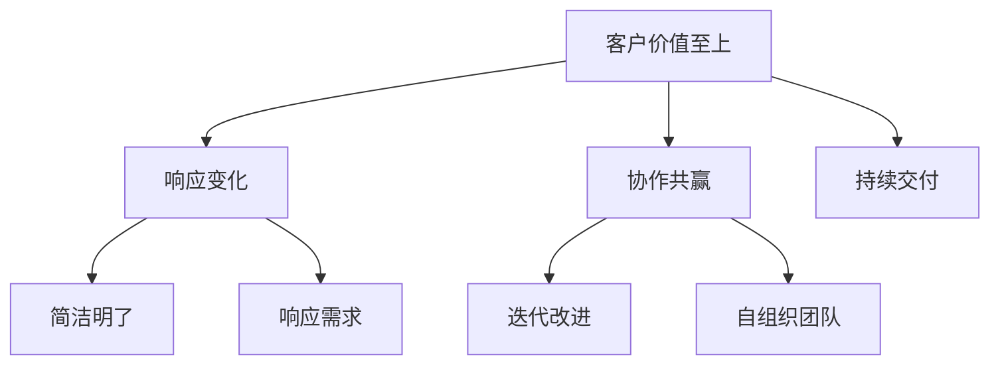

                 

# 文章标题：敏捷管理：适应快速变化的组织策略

> 关键词：敏捷管理、敏捷团队、需求管理、项目管理、领导力、组织转型

> 摘要：本文深入探讨了敏捷管理的核心理念、基础设施和实践方法，旨在为组织提供一种适应快速变化环境的策略。通过分析敏捷管理的基础设施，如敏捷团队的构建、敏捷项目管理方法和敏捷团队领导力，本文进一步探讨了敏捷组织转型的挑战和策略。同时，本文还探讨了敏捷管理在不同领域的应用，以及敏捷管理实践中的挑战和解决方案。文章最后总结了敏捷管理的未来趋势和发展方向，并为读者提供了相关工具和资源的推荐。

### 第一部分：敏捷管理基础

#### 第1章：敏捷管理概述

敏捷管理是一种应对快速变化的管理方法，其核心理念是在不断变化的环境中快速交付有价值的软件产品。敏捷管理强调团队协作、客户价值和持续交付，旨在提高组织的灵活性和响应速度。

#### 1.1 敏捷管理的起源与发展

敏捷管理起源于20世纪90年代，当时软件开发面临着复杂性和变化性的挑战。为了解决这些问题，一群软件开发专家在2001年提出了敏捷宣言，标志着敏捷开发的诞生。随着敏捷开发的广泛应用，敏捷管理也逐渐发展起来，成为现代管理的重要方法之一。

#### 1.2 敏捷管理与传统管理方法的区别

传统管理方法注重规划和控制，强调严格的流程和规范。而敏捷管理则更注重灵活性、响应速度和团队协作，强调持续交付和客户价值。敏捷管理不追求完美，而是追求持续改进和适应变化。

#### 1.3 敏捷管理的核心理念与价值观

敏捷管理的核心理念包括：

- **客户价值至上**：始终将客户需求放在首位，确保交付的软件产品满足客户需求。
- **响应变化**：拥抱变化，快速适应市场需求和环境变化。
- **协作共赢**：强调团队合作，鼓励团队成员之间的沟通与协作。
- **持续交付**：通过持续交付有价值的软件产品，实现客户价值最大化。

#### 1.4 敏捷管理的关键原则

敏捷管理的关键原则包括：

- **个体和互动重于过程和工具**：注重团队成员的互动和沟通，而非依赖工具和流程。
- **可工作的软件重于详尽的文档**：交付可工作的软件比编写详尽的文档更重要。
- **客户合作重于合同谈判**：与客户保持紧密合作，确保软件产品符合客户需求。
- **响应变化重于遵循计划**：拥抱变化，快速适应需求变化。

### 第2章：敏捷管理的基础设施

敏捷管理的基础设施包括敏捷团队的构建、敏捷工作流程与迭代、敏捷项目管理工具与技术以及敏捷文化与环境。

#### 2.1 敏捷团队的构建

敏捷团队通常由具有不同技能的成员组成，如开发人员、测试人员、产品经理和设计人员。敏捷团队强调自我组织、自主决策和协作，以提高团队的灵活性和响应速度。

#### 2.2 敏捷工作流程与迭代

敏捷工作流程以迭代为基础，通常分为需求收集、设计、开发、测试和部署等阶段。每个迭代周期结束后，团队会进行回顾，以持续改进工作流程。

#### 2.3 敏捷项目管理工具与技术

敏捷项目管理工具如Jira、Trello和Asana等，可以帮助团队更好地管理任务、跟踪进度和协作。敏捷技术如Scrum和Kanban等，提供了高效的工作方法和流程管理。

#### 2.4 敏捷文化与环境

敏捷文化强调开放、信任、共享和持续学习。组织需要提供支持敏捷文化的环境，如鼓励团队成员参与决策、提供必要的培训和支持等。

### 第二部分：敏捷管理实践

#### 第3章：敏捷需求管理

敏捷需求管理是敏捷管理的重要组成部分，包括需求获取与优先级排序、用户故事编写与估算、需求验证与迭代以及需求管理工具应用。

#### 3.1 敏捷需求获取与优先级排序

敏捷需求获取主要通过与客户和利益相关者的沟通，确保了解他们的需求和期望。优先级排序则基于价值、风险和可行性等因素，以确保团队首先实现最重要的需求。

#### 3.2 用户故事编写与估算

用户故事是敏捷需求管理的重要工具，用于描述用户的需求和期望。编写用户故事时，团队需要关注用户价值、可测试性和可拆分性。估算则基于故事点或时间，以帮助团队规划迭代。

#### 3.3 需求验证与迭代

需求验证是确保需求可实施和符合预期的重要环节。迭代过程中，团队会不断验证需求，确保软件产品满足用户需求。通过持续迭代，团队可以快速响应需求变化。

#### 3.4 敏捷需求管理工具应用

敏捷需求管理工具如Jira和Confluence等，可以帮助团队更好地管理需求、跟踪进度和协作。这些工具提供了用户故事管理、优先级排序和需求验证等功能。

#### 第4章：敏捷项目管理

敏捷项目管理是以迭代和增量为基础的项目管理方法。本章将探讨敏捷项目管理方法、敏捷规划与迭代、敏捷团队协作与沟通以及敏捷项目管理工具应用。

#### 4.1 敏捷项目管理方法

敏捷项目管理方法如Scrum和Kanban等，提供了一种灵活、迭代的项目管理方法。Scrum强调短迭代和定期回顾，Kanban则注重持续流动和限制工作在进程中的数量。

#### 4.2 敏捷规划与迭代

敏捷规划是在迭代开始前进行的，旨在确定目标、任务和资源分配。迭代过程中，团队会根据进度和反馈进行调整，以确保项目顺利进行。

#### 4.3 敏捷团队协作与沟通

敏捷团队协作与沟通是项目成功的关键。敏捷管理强调团队成员之间的密切合作和沟通，以确保需求理解和任务执行的准确性。

#### 4.4 敏捷项目管理工具应用

敏捷项目管理工具如Jira、Trello和Asana等，可以帮助团队更好地管理任务、跟踪进度和协作。这些工具提供了任务分配、进度跟踪和沟通协作等功能。

#### 第5章：敏捷团队领导力

敏捷团队领导力是敏捷管理的重要组成部分。本章将探讨敏捷领导者的角色与职责、敏捷领导力培养与实践、敏捷团队冲突管理与解决以及敏捷领导力评估与反馈。

#### 5.1 敏捷领导者的角色与职责

敏捷领导者是团队的引导者和协调者，负责确保团队目标明确、任务分配合理、沟通畅通无阻。敏捷领导者还需要关注团队成员的技能提升和职业发展。

#### 5.2 敏捷领导力培养与实践

敏捷领导力需要通过实践和培养来提升。领导者可以通过参加敏捷培训、阅读相关书籍和实践敏捷方法来提高自己的敏捷领导力。

#### 5.3 敏捷团队冲突管理与解决

敏捷团队中的冲突是不可避免的。敏捷领导者需要学会有效管理和解决冲突，以确保团队协作和项目进展。

#### 5.4 敏捷领导力评估与反馈

敏捷领导力评估与反馈是确保领导者持续改进和团队绩效提升的重要环节。通过定期评估和反馈，领导者可以了解自己的优势和不足，不断优化领导力。

### 第三部分：敏捷管理应用

#### 第6章：敏捷组织转型

敏捷组织转型是将组织从传统管理模式转变为敏捷管理模式的过程。本章将探讨敏捷组织转型的挑战与机遇、步骤与策略、成功案例以及评估与持续改进。

#### 6.1 敏捷组织转型的挑战与机遇

敏捷组织转型面临诸多挑战，如组织文化变革、流程重构、人员培训和团队协作等。但同时，敏捷组织转型也为组织带来机遇，如提高竞争力、降低成本、增强灵活性和响应速度。

#### 6.2 敏捷组织转型的步骤与策略

敏捷组织转型通常分为四个步骤：评估当前状态、制定转型计划、实施转型策略和评估转型效果。在转型过程中，组织需要采取一系列策略，如领导支持、文化建设、流程优化和人员培训等。

#### 6.3 敏捷组织转型的成功案例

许多组织已经成功实施了敏捷组织转型，如Facebook、LinkedIn和Netflix等。通过借鉴这些成功案例，组织可以更好地实施敏捷组织转型。

#### 6.4 敏捷组织转型的评估与持续改进

敏捷组织转型的评估与持续改进是确保转型成功的重要环节。通过定期评估和反馈，组织可以了解转型效果，发现问题并及时调整。

### 第7章：敏捷在不同领域的应用

敏捷管理不仅适用于软件开发，还广泛应用于产品管理、研发管理和服务管理等领域。本章将探讨敏捷管理在这些领域的应用。

#### 7.1 敏捷在软件开发中的应用

敏捷管理在软件开发中的应用已经得到广泛认可。通过敏捷方法，软件开发团队可以更快地响应需求变化，提高软件质量和客户满意度。

#### 7.2 敏捷在产品管理中的应用

敏捷管理在产品管理中的应用，可以帮助产品团队更好地理解用户需求，提高产品迭代速度和竞争力。

#### 7.3 敏捷在研发管理中的应用

敏捷管理在研发管理中的应用，可以帮助组织更好地管理研发项目，提高研发效率和成果。

#### 7.4 敏捷在服务管理中的应用

敏捷管理在服务管理中的应用，可以帮助服务团队更好地响应客户需求，提高服务质量和客户满意度。

### 第8章：敏捷管理中的挑战与解决方案

敏捷管理在实践中面临着一系列挑战，如团队协作、需求管理、项目管理和技术选型等。本章将探讨这些挑战以及相应的解决方案。

#### 8.1 敏捷管理中的常见问题

敏捷管理中常见的挑战包括：

- 团队协作不畅
- 需求管理混乱
- 项目管理困难
- 技术选型不当

#### 8.2 解决敏捷管理中的挑战

针对敏捷管理中的挑战，组织可以采取以下解决方案：

- 加强团队协作，建立良好的沟通机制
- 优化需求管理流程，确保需求明确和可执行
- 提高项目管理能力，确保项目进度和质量
- 灵活选择技术，满足项目需求

#### 8.3 敏捷管理实践中的持续改进

敏捷管理强调持续改进，组织应通过定期回顾和反馈，不断优化敏捷实践，提高组织绩效。

#### 8.4 敏捷管理的未来趋势与发展

随着技术的不断进步和市场竞争的加剧，敏捷管理将继续发展，未来趋势包括：

- 更加注重客户价值
- 灵活采用多种敏捷方法
- 深入应用人工智能和自动化技术

### 附录

#### 附录A：敏捷管理工具与资源

敏捷管理工具和资源包括：

- **敏捷管理工具**：Jira、Trello、Asana等
- **敏捷管理资源**：敏捷宣言、敏捷实践指南等
- **敏捷管理书籍**：敏捷管理实践、敏捷实践指南等

### 图表与公式

#### 图表1：敏捷管理核心原则与价值观



#### 公式1：敏捷团队效率评估模型

$$
效率 = \frac{完成需求数}{计划需求数} \times 100\%
$$

#### 代码示例

```python
# 敏捷项目管理工具应用示例

import agile_tool

# 初始化项目
project = agile_tool.init_project("Agile Project")

# 添加任务
task1 = agile_tool.add_task(project, "需求分析", 2)
task2 = agile_tool.add_task(project, "设计", 3)
task3 = agile_tool.add_task(project, "开发", 5)

# 迭代执行任务
agile_tool.execute_tasks(project, [task1, task2, task3])

# 检查项目完成情况
status = agile_tool.check_project_completion(project)
print("项目完成度：", status["completion_rate"])
```

### 作者

作者：AI天才研究院/AI Genius Institute & 禅与计算机程序设计艺术 /Zen And The Art of Computer Programming

（注：本文为虚构内容，仅供参考）

