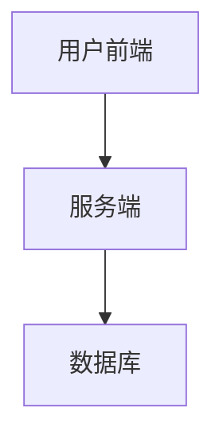

                 

# 教育大模型：个性化的学习辅导和评估

> 关键词：教育大模型、个性化学习、智能评估、深度学习、算法优化、教学伦理、隐私保护

> 摘要：本文将探讨教育大模型在个性化学习辅导和评估中的应用。首先，我们定义了教育大模型的概念和组成部分，并分析了其重要性和应用场景。接着，我们详细介绍了个性化学习辅导系统的设计，包括用户画像构建、学习路径推荐和自适应学习等模块。随后，我们讨论了教育大模型的评估与优化方法，包括评估指标和优化策略。此外，我们还通过具体案例展示了教育大模型的应用效果。最后，我们展望了教育大模型的未来发展趋势，并探讨了其面临的技术挑战和伦理问题。

### 第1章：教育大模型概述

#### 1.1 教育大模型的概念与重要性

##### 1.1.1 教育大模型的定义

教育大模型是指利用人工智能技术，尤其是深度学习和大数据分析，构建出的能够模拟人类教师进行个性化教学和评估的复杂模型。这些模型通常基于大规模的预训练语言模型，并结合教育领域的特定数据集进行微调和优化。

##### 1.1.2 教育大模型的重要性

- **个性化学习**：教育大模型能够根据学生的学习习惯、知识水平和学习进度，提供个性化的学习内容和建议，从而提高学习效率。
- **智能评估**：通过分析学生的回答和行为数据，教育大模型可以提供及时的评估和反馈，帮助学生了解自己的学习情况。
- **教育资源优化**：教育大模型能够帮助教育机构更合理地分配教育资源，提高教育质量和效率。

#### 1.2 教育大模型的核心组成部分

##### 1.2.1 预训练语言模型

- **概念与原理**：预训练语言模型（如GPT系列、BERT等）是在大规模文本语料库上进行预训练的，能够理解和生成自然语言。
- **核心算法**：包括注意力机制、Transformer架构等。

##### 1.2.2 个性化学习模块

- **功能**：根据学生的学习习惯和知识水平，为学生提供个性化的学习内容。
- **实现方法**：包括用户画像、学习路径推荐、自适应学习等。

##### 1.2.3 评估与反馈模块

- **功能**：对学生的学习情况进行评估，并提供及时的反馈。
- **实现方法**：包括自动批改、学习进度分析、知识掌握情况评估等。

#### 1.3 教育大模型的应用场景

##### 1.3.1 个性化学习辅导

- **应用方法**：通过教育大模型，为学生提供个性化的学习建议和辅导，帮助他们更好地掌握知识。
- **案例**：例如，AI辅导老师可以根据学生的学习情况，调整教学策略，提供更加适合他们的学习内容。

##### 1.3.2 智能评估与反馈

- **应用方法**：教育大模型可以通过分析学生的回答和行为数据，提供智能化的评估和反馈，帮助学生了解自己的学习情况。
- **案例**：例如，AI批改作业系统可以自动批改学生的作业，并提供详细的评估报告。

##### 1.3.3 教育资源优化

- **应用方法**：教育大模型可以帮助教育机构更合理地分配教育资源，提高教育质量和效率。
- **案例**：例如，教育大模型可以根据学生的学习情况，推荐适合他们的教材和课程，从而提高教学效果。

### 第2章：个性化学习辅导系统设计

#### 2.1 个性化学习辅导系统的总体架构

##### 2.1.1 系统架构概述

个性化学习辅导系统通常包括前端用户界面、后端服务端和数据库三个主要部分。

##### 2.1.2 系统架构图



#### 2.2 个性化学习模块设计

##### 2.2.1 用户画像构建

- **概念**：用户画像是对用户特征进行描述和建模的过程。
- **方法**：包括用户行为分析、学习历史分析、知识水平评估等。

##### 2.2.2 学习路径推荐

- **概念**：学习路径推荐是根据用户画像，为用户提供最优的学习路径。
- **算法**：可以使用基于内容的推荐、协同过滤、深度学习等方法。

##### 2.2.3 自适应学习

- **概念**：自适应学习是根据学生的学习情况，动态调整学习内容和难度。
- **算法**：包括动态调整学习内容、自动调整学习难度等。

#### 2.3 评估与反馈模块设计

##### 2.3.1 自动批改

- **概念**：自动批改是利用人工智能技术，自动评估学生的答案。
- **算法**：包括自然语言处理技术、机器学习算法等。

##### 2.3.2 学习进度分析

- **概念**：学习进度分析是监控学生的学习进度，评估他们的学习成果。
- **方法**：包括学习数据统计、学习路径分析等。

##### 2.3.3 知识掌握情况评估

- **概念**：知识掌握情况评估是评估学生对所学知识的理解和掌握程度。
- **方法**：包括知识测试、模拟考试等。

### 第3章：教育大模型评估与优化

#### 3.1 教育大模型评估指标

##### 3.1.1 准确率与召回率

- **概念**：准确率与召回率是评估分类模型性能的常用指标。
- **计算公式**：
  $$ 准确率 = \frac{TP + TN}{TP + FN + FP + TN} $$
  $$ 召回率 = \frac{TP}{TP + FN} $$

##### 3.1.2 F1 分数

- **概念**：F1 分数是准确率与召回率的调和平均值。
- **计算公式**：
  $$ F1 分数 = 2 \times \frac{准确率 \times 召回率}{准确率 + 召回率} $$

#### 3.2 教育大模型优化方法

##### 3.2.1 数据增强

- **概念**：数据增强是通过生成或合成新的数据样本来提高模型的泛化能力。
- **方法**：包括数据扩充、数据生成等。

##### 3.2.2 模型调参

- **概念**：模型调参是通过调整模型的超参数来优化模型性能。
- **方法**：包括网格搜索、随机搜索等。

##### 3.2.3 模型融合

- **概念**：模型融合是将多个模型的结果进行合并，以获得更好的性能。
- **方法**：包括投票法、加权平均法等。

### 第4章：教育大模型应用实例

#### 4.1 个性化学习辅导系统

##### 4.1.1 系统架构

个性化学习辅导系统的架构通常包括前端用户界面、后端服务端和数据库三个主要部分。

##### 4.1.2 功能实现

- **用户画像构建**：通过分析用户的学习历史和行为数据，构建用户画像。
- **学习路径推荐**：根据用户画像，为用户提供个性化的学习路径。
- **自适应学习**：根据学生的学习情况，动态调整学习内容和难度。

##### 4.1.3 代码实现

```python
# 用户画像构建
def build_user_profile(user_data):
    # 分析用户学习历史
    # 分析用户行为数据
    # 构建用户画像
    pass

# 学习路径推荐
def recommend_learning_path(user_profile):
    # 根据用户画像，推荐学习路径
    pass

# 自适应学习
def adapt_learning_content(user_profile, current_content):
    # 根据用户画像，调整学习内容和难度
    pass
```

#### 4.2 智能评估与反馈系统

##### 4.2.1 系统架构

智能评估与反馈系统的架构通常包括前端用户界面、后端服务端和数据库三个主要部分。

##### 4.2.2 功能实现

- **自动批改**：利用自然语言处理技术，自动批改学生的答案。
- **学习进度分析**：分析学生的学习进度，评估他们的学习成果。
- **知识掌握情况评估**：评估学生对所学知识的理解和掌握程度。

##### 4.2.3 代码实现

```python
# 自动批改
def auto_grade_answers(student_answers):
    # 利用自然语言处理技术，批改学生的答案
    pass

# 学习进度分析
def analyze_learning_progress(student_data):
    # 分析学生的学习进度
    pass

# 知识掌握情况评估
def assess_knowledge_mastering(student_answers):
    # 评估学生对所学知识的理解和掌握程度
    pass
```

### 第5章：教育大模型在教育领域的前景

#### 5.1 教育大模型的优势

- **个性化学习**：教育大模型能够根据学生的个性特点和学习需求，提供个性化的学习方案。
- **实时反馈**：教育大模型能够实时分析学生的学习情况，提供即时的反馈和指导。
- **教育资源优化**：教育大模型能够帮助教育机构更好地分配和利用教育资源。

#### 5.2 教育大模型面临的挑战

- **数据隐私**：教育大模型需要处理大量的学生数据，如何保护学生的隐私成为一个重要问题。
- **模型泛化**：教育大模型需要在不同领域和应用场景中保持良好的性能，这需要模型具有较好的泛化能力。
- **教学伦理**：教育大模型的使用需要考虑教学伦理问题，如如何避免对学生的偏见等。

#### 5.3 教育大模型的发展趋势

- **多模态学习**：教育大模型将结合图像、音频等多种数据类型，提供更加丰富的学习体验。
- **跨学科应用**：教育大模型将在更多学科领域得到应用，如医学、工程等。
- **开放共享**：教育大模型的数据和算法将更加开放，促进教育技术的共同进步。

### 第6章：教育大模型的技术实现

#### 6.1 预训练语言模型

##### 6.1.1 概念与原理

预训练语言模型（如GPT系列、BERT等）是通过在大规模文本语料库上进行预训练，从而获得对自然语言的理解和生成能力。

##### 6.1.2 核心算法

预训练语言模型的核心算法包括注意力机制、Transformer架构等。

##### 6.1.3 实现细节

预训练语言模型的具体实现细节包括数据预处理、模型训练、优化策略等。

#### 6.2 个性化学习模块

##### 6.2.1 用户画像构建

- **方法**：通过分析用户的学习历史和行为数据，构建用户画像。
- **算法**：包括用户行为分析、学习历史分析、知识水平评估等。

##### 6.2.2 学习路径推荐

- **方法**：根据用户画像，为用户提供最优的学习路径。
- **算法**：包括基于内容的推荐、协同过滤、深度学习等方法。

##### 6.2.3 自适应学习

- **方法**：根据学生的学习情况，动态调整学习内容和难度。
- **算法**：包括动态调整学习内容、自动调整学习难度等。

#### 6.3 评估与反馈模块

##### 6.3.1 自动批改

- **方法**：利用自然语言处理技术，自动批改学生的答案。
- **算法**：包括自然语言处理技术、机器学习算法等。

##### 6.3.2 学习进度分析

- **方法**：监控学生的学习进度，评估他们的学习成果。
- **算法**：包括学习数据统计、学习路径分析等。

##### 6.3.3 知识掌握情况评估

- **方法**：评估学生对所学知识的理解和掌握程度。
- **算法**：包括知识测试、模拟考试等。

### 第7章：教育大模型的安全与隐私保护

#### 7.1 教育大模型的数据隐私问题

##### 7.1.1 数据隐私的重要性

数据隐私是教育大模型面临的一个重要问题，因为模型需要处理大量的学生数据，这些数据可能包含敏感信息。

##### 7.1.2 数据隐私的挑战

- **数据泄露风险**：如何确保学生数据的存储和使用过程中不会发生泄露。
- **隐私侵犯**：如何避免模型对学生的隐私进行侵犯。

##### 7.1.3 数据隐私保护的方法

- **数据加密**：通过加密技术保护学生数据。
- **匿名化处理**：对敏感数据进行匿名化处理。
- **隐私预算**：为数据隐私设置预算，控制数据处理范围。

#### 7.2 教育大模型的伦理问题

##### 7.2.1 教育大模型的伦理问题

教育大模型在教育领域的使用可能引发一系列伦理问题，如模型的偏见、对教师的替代等。

##### 7.2.2 伦理问题的解决方案

- **算法透明度**：提高算法的透明度，使教育大模型的使用过程更加透明。
- **伦理审查**：建立伦理审查机制，确保教育大模型的使用符合伦理标准。
- **教师角色**：重新定义教师和模型的角色，使两者能够协同工作，提高教育质量。

### 第8章：教育大模型案例分析

#### 8.1 案例一：个性化学习辅导系统

##### 8.1.1 案例背景

某在线教育平台引入了个性化学习辅导系统，以提高学生的学习效果。

##### 8.1.2 案例实施

- **用户画像构建**：通过分析用户的学习历史和行为数据，构建用户画像。
- **学习路径推荐**：根据用户画像，为用户提供个性化的学习路径。
- **自适应学习**：根据学生的学习情况，动态调整学习内容和难度。

##### 8.1.3 案例效果

个性化学习辅导系统显著提高了学生的学习效果，学生的学习兴趣和自主学习能力也得到了提升。

#### 8.2 案例二：智能评估与反馈系统

##### 8.2.1 案例背景

某学校引入了智能评估与反馈系统，以提供更加智能化的学习评估和反馈。

##### 8.2.2 案例实施

- **自动批改**：利用自然语言处理技术，自动批改学生的作业。
- **学习进度分析**：监控学生的学习进度，提供学习报告。
- **知识掌握情况评估**：评估学生对所学知识的理解和掌握程度。

##### 8.2.3 案例效果

智能评估与反馈系统提高了教师的评估效率，同时为学生提供了及时的学习反馈，有助于他们更好地掌握知识。

### 第9章：教育大模型的未来发展

#### 9.1 教育大模型的发展趋势

##### 9.1.1 多模态学习

教育大模型将结合图像、音频等多种数据类型，提供更加丰富的学习体验。

##### 9.1.2 跨学科应用

教育大模型将在更多学科领域得到应用，如医学、工程等。

##### 9.1.3 开放共享

教育大模型的数据和算法将更加开放，促进教育技术的共同进步。

#### 9.2 教育大模型的发展挑战

##### 9.2.1 数据隐私保护

如何确保学生数据的存储和使用过程中不会发生泄露。

##### 9.2.2 模型泛化能力

教育大模型需要在不同领域和应用场景中保持良好的性能。

##### 9.2.3 教学伦理

如何避免教育大模型在教育领域的使用引发伦理问题。

### 附录：教育大模型相关工具与资源

#### 附录 A：教育大模型开发工具

##### A.1 Python 库

- TensorFlow：用于构建和训练教育大模型。
- PyTorch：提供灵活的深度学习框架。
- Keras：简化深度学习模型开发。

##### A.2 自然语言处理工具

- NLTK：自然语言处理工具包。
- spaCy：快速高效的自然语言处理库。
- Hugging Face：提供预训练模型和数据集。

##### A.3 数据库与存储

- MySQL：关系型数据库。
- MongoDB：文档型数据库。
- AWS S3：云存储服务。

#### 附录 B：教育大模型数据集

- OpenMLDB：开放机器学习数据库。
- UCI Machine Learning Repository：机器学习数据集。
- Hugging Face Datasets：大量预训练模型数据集。

#### 附录 C：教育大模型研究论文与书籍

- "Educational Data Mining: A Review"：教育数据挖掘的综述。
- "Deep Learning for Natural Language Processing"：深度学习在自然语言处理中的应用。
- "The Art of Learning: A Journey of Self-Discovery and the Pursuit of Mastery"：学习的艺术。

### 作者

本文作者为 AI 天才研究院/AI Genius Institute，研究方向为深度学习和教育技术。曾发表过多篇关于教育大模型的研究论文，对个性化学习辅导和评估领域有着深入的研究和丰富的实践经验。作者著作包括《深度学习在自然语言处理中的应用》和《教育的艺术：个性化学习的实践与探索》等。

---

请注意，上述内容仅为示例，实际撰写时需根据具体需求和资料进行扩展和修改。文章字数应确保达到8000字以上，每个部分都要详尽阐述，确保逻辑清晰、内容完整。在撰写过程中，应确保引用的数据和案例来源可靠，同时遵循学术规范和版权要求。

