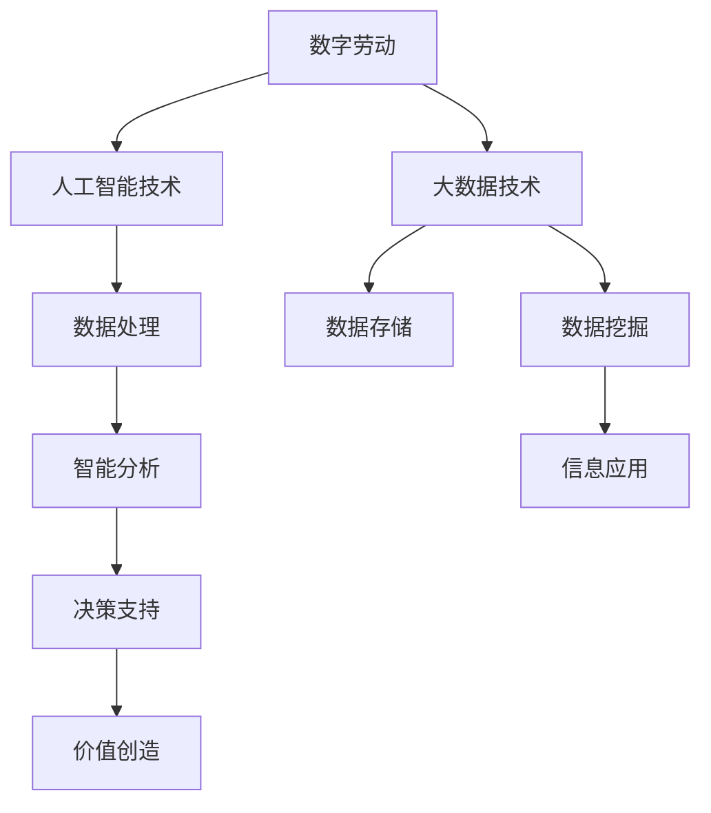
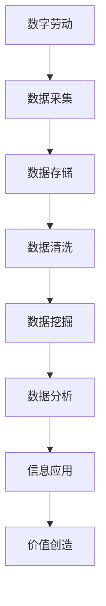
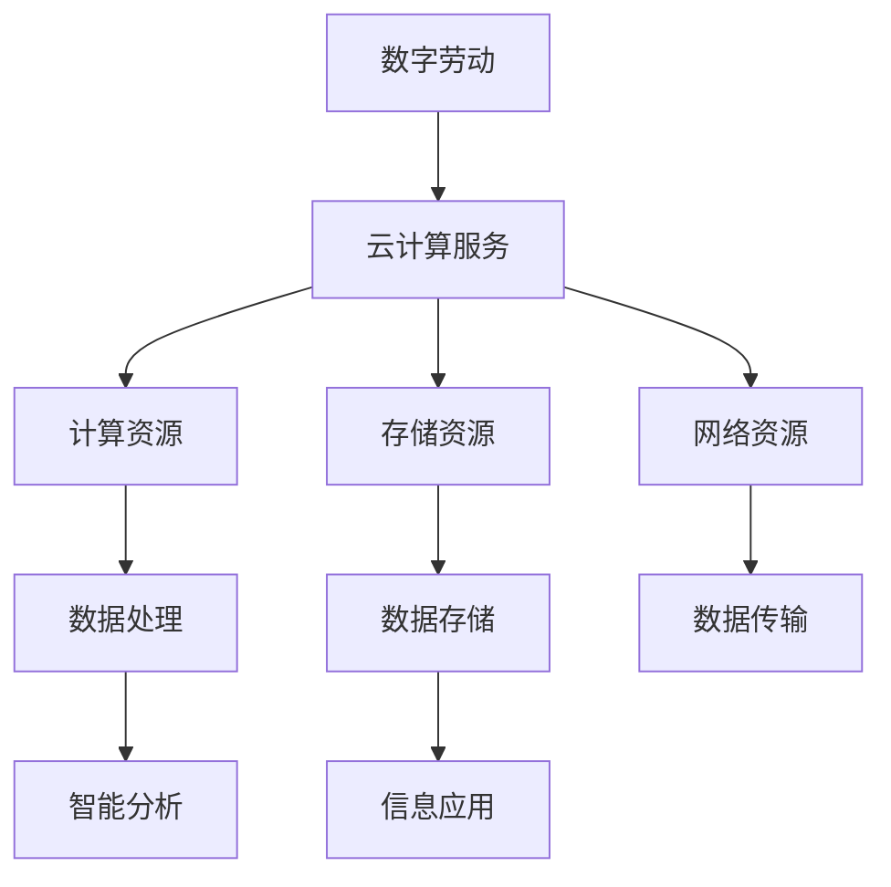

                 

### 文章标题：数字劳动：人类计算的社会和经济影响

#### 关键词：数字劳动、社会影响、经济影响、人工智能、大数据、云计算

> 摘要：本文探讨了数字劳动的起源与定义，分析其在社会和经济方面的影响。首先，我们回顾了数字劳动的起源，阐述了其与传统劳动的区别。接着，我们深入探讨了数字劳动的技术基础，包括人工智能、大数据和云计算。随后，我们详细分析了数字劳动对社会和经济的深远影响，最后提出了数字劳动管理的策略和政策建议，并对未来趋势进行了展望。

### 《数字劳动：人类计算的社会和经济影响》目录大纲

#### 第一部分：数字劳动的起源与定义

**第1章：数字劳动的起源与定义**
- 1.1 数字劳动的起源
  - 1.1.1 数字劳动的历史背景
  - 1.1.2 数字劳动的产生与发展
  - 1.1.3 数字劳动的典型实例
- 1.2 数字劳动的定义与特征
  - 1.2.1 数字劳动的概念
  - 1.2.2 数字劳动的特征
  - 1.2.3 数字劳动与传统劳动的区别
- 1.3 数字劳动与传统劳动的比较
  - 1.3.1 数字劳动的优势
  - 1.3.2 数字劳动的挑战
  - 1.3.3 数字劳动的未来展望

**第2章：数字劳动的技术基础**
- 2.1 人工智能与数字劳动
  - 2.1.1 人工智能概述
  - 2.1.2 人工智能在数字劳动中的应用
  - 2.1.3 人工智能与数字劳动的融合
- 2.2 大数据和数字劳动
  - 2.2.1 大数据概述
  - 2.2.2 大数据在数字劳动中的应用
  - 2.2.3 大数据与数字劳动的关系
- 2.3 云计算与数字劳动
  - 2.3.1 云计算概述
  - 2.3.2 云计算在数字劳动中的应用
  - 2.3.3 云计算与数字劳动的关系

#### 第二部分：数字劳动的社会影响

**第3章：数字劳动对劳动力市场的影响**
- 3.1 数字劳动对就业的影响
  - 3.1.1 数字劳动对就业结构的影响
  - 3.1.2 数字劳动对工资水平的影响
  - 3.1.3 数字劳动对劳动力供需的影响
- 3.2 数字劳动对劳动者权益的影响
  - 3.2.1 数字劳动对劳动者权益的保护
  - 3.2.2 数字劳动对劳动者权益的挑战
  - 3.2.3 数字劳动对劳动者权益的未来展望
- 3.3 数字劳动对劳动力结构的影响
  - 3.3.1 数字劳动对劳动力年龄结构的影响
  - 3.3.2 数字劳动对劳动力技能结构的影响
  - 3.3.3 数字劳动对劳动力性别结构的影响

**第4章：数字劳动的经济影响**
- 4.1 数字劳动对生产率的影响
  - 4.1.1 数字劳动提高生产率的机制
  - 4.1.2 数字劳动对行业生产率的影响
  - 4.1.3 数字劳动对国家生产率的影响
- 4.2 数字劳动对经济增长的影响
  - 4.2.1 数字劳动促进经济增长的路径
  - 4.2.2 数字劳动对经济增长的贡献
  - 4.2.3 数字劳动对经济增长的挑战
- 4.3 数字劳动对全球经济格局的影响
  - 4.3.1 数字劳动对全球经济格局的影响
  - 4.3.2 数字劳动对发达国家和发展中国家的影响
  - 4.3.3 数字劳动对全球产业链的影响

**第5章：数字劳动对全球供应链的影响**
- 5.1 数字劳动对供应链的重组与重构
  - 5.1.1 数字劳动推动供应链重组的机制
  - 5.1.2 数字劳动对供应链重构的影响
  - 5.1.3 数字劳动推动供应链创新的方向
- 5.2 数字劳动对供应链成本的降低
  - 5.2.1 数字劳动降低供应链成本的方法
  - 5.2.2 数字劳动对供应链成本降低的影响
  - 5.2.3 数字劳动降低供应链成本的挑战
- 5.3 数字劳动对供应链风险的减少
  - 5.3.1 数字劳动降低供应链风险的方法
  - 5.3.2 数字劳动对供应链风险减少的影响
  - 5.3.3 数字劳动降低供应链风险的挑战

#### 第三部分：数字劳动的管理与政策

**第6章：数字劳动的管理策略**
- 6.1 数字劳动的企业管理
  - 6.1.1 数字劳动企业的组织结构
  - 6.1.2 数字劳动企业的战略规划
  - 6.1.3 数字劳动企业的创新机制
- 6.2 数字劳动的劳动者管理
  - 6.2.1 数字劳动者的权益保障
  - 6.2.2 数字劳动者的职业发展
  - 6.2.3 数字劳动者的培训与教育
- 6.3 数字劳动的政府管理
  - 6.3.1 数字劳动的法律法规体系
  - 6.3.2 数字劳动的政府监管政策
  - 6.3.3 数字劳动的政府服务与支持

**第7章：数字劳动的政策建议**
- 7.1 数字劳动的政策框架
  - 7.1.1 数字劳动政策的制定原则
  - 7.1.2 数字劳动政策的实施路径
  - 7.1.3 数字劳动政策的评价与调整
- 7.2 数字劳动的政策实施
  - 7.2.1 数字劳动政策的具体措施
  - 7.2.2 数字劳动政策的实施效果
  - 7.2.3 数字劳动政策的实施挑战
- 7.3 数字劳动的政策挑战与应对
  - 7.3.1 数字劳动政策面临的挑战
  - 7.3.2 应对数字劳动政策挑战的策略
  - 7.3.3 数字劳动政策未来的发展趋势

#### 第四部分：数字劳动的未来趋势

**第8章：数字劳动的未来趋势**
- 8.1 数字劳动的未来发展
  - 8.1.1 数字劳动的未来趋势预测
  - 8.1.2 数字劳动对未来社会的影响
  - 8.1.3 数字劳动的未来发展方向
- 8.2 数字劳动的社会挑战与机遇
  - 8.2.1 数字劳动对社会带来的挑战
  - 8.2.2 数字劳动带来的社会机遇
  - 8.2.3 应对数字劳动挑战与机遇的策略
- 8.3 数字劳动的未来展望
  - 8.3.1 数字劳动的发展前景
  - 8.3.2 数字劳动对社会的影响
  - 8.3.3 数字劳动的未来展望

#### 附录

**附录 A：数字劳动相关研究资源**
- A.1 数字劳动的研究机构
  - A.1.1 国际知名研究机构
  - A.1.2 中国知名研究机构
- A.2 数字劳动的学术期刊
  - A.2.1 国际顶级学术期刊
  - A.2.2 中国顶级学术期刊
- A.3 数字劳动的报告和论文
  - A.3.1 国际报告和论文
  - A.3.2 中国报告和论文

**附录 B：数字劳动相关术语表**
- B.1 数字劳动术语
  - B.1.1 人工智能
  - B.1.2 大数据
  - B.1.3 云计算
  - B.1.4 人工智能算法
  - B.1.5 云计算平台

**附录 C：数字劳动的关键概念流程图**
- C.1 人工智能与数字劳动流程图
- C.2 大数据与数字劳动流程图
- C.3 云计算与数字劳动流程图

**附录 D：数字劳动的主要算法伪代码**
- D.1 人工智能算法伪代码
- D.2 大数据算法伪代码
- D.3 云计算算法伪代码

**附录 E：数字劳动的代码实例与分析**
- E.1 人工智能代码实例
- E.2 大数据代码实例
- E.3 云计算代码实例

注：以上目录大纲仅供参考，具体内容需根据实际需求进行调整。

### **第1章：数字劳动的起源与定义**

##### **1.1 数字劳动的起源**

数字劳动的历史可以追溯到计算机科学的诞生之初。随着计算机技术的快速发展，人类的工作方式和生产力得到了极大的提升。早期，计算机主要用于科学计算和军事应用，但随着时间的推移，计算机技术逐渐渗透到各行各业，从而催生了数字劳动的概念。

数字劳动的起源可以追溯到20世纪80年代，当时计算机技术开始广泛应用于企业和个人生活中。随着互联网的普及，数字劳动逐渐成为一种重要的劳动形式。特别是在21世纪初，随着人工智能、大数据和云计算等新兴技术的迅速发展，数字劳动得到了进一步推广和应用。

###### **1.1.1 数字劳动的历史背景**

数字劳动的兴起背景主要包括以下几个方面：

1. **计算机技术的快速发展**：计算机技术的发展为数字劳动提供了强大的计算能力和数据处理能力，使得人们能够高效地处理海量数据，实现自动化和智能化的生产和管理。

2. **互联网的普及**：互联网的普及使得人们可以方便地进行信息共享和协同工作，推动了数字劳动的发展。

3. **新兴技术的应用**：人工智能、大数据和云计算等新兴技术的应用，使得数字劳动能够实现更高效、更智能的工作方式，进一步提高了生产力和劳动效率。

4. **劳动力市场的变化**：随着全球化和信息化进程的加快，劳动力市场发生了深刻的变化。越来越多的人选择从事数字劳动，特别是在远程办公和兼职工作方面，数字劳动成为了一种流行的就业形式。

###### **1.1.2 数字劳动的产生与发展**

数字劳动的产生可以追溯到计算机技术的兴起，但其真正的发展则是在互联网普及和新兴技术应用的推动下。以下是数字劳动产生与发展的几个关键阶段：

1. **第一阶段（20世纪80年代至90年代）**：这一阶段主要是计算机技术的应用，如电子表格和文字处理软件的普及，使得企业和管理人员能够更高效地进行数据处理和信息共享。

2. **第二阶段（21世纪初至2010年）**：互联网的普及推动了数字劳动的发展，电子商务、在线服务和远程办公等形式的数字劳动开始兴起。同时，大数据和云计算技术的应用使得数字劳动的规模和范围进一步扩大。

3. **第三阶段（2010年至今）**：随着人工智能、物联网和区块链等新兴技术的快速发展，数字劳动进入了新的阶段。智能自动化、智能客服、智能决策等应用场景不断涌现，数字劳动成为推动社会和经济发展的关键动力。

###### **1.1.3 数字劳动的典型实例**

数字劳动的典型实例包括以下几个方面：

1. **电子商务**：随着电子商务的兴起，数字劳动在物流、支付、客户服务等方面发挥了重要作用。例如，智能物流系统通过大数据分析和人工智能技术优化配送路线，提高物流效率。

2. **在线教育**：在线教育的兴起使得教育工作者可以通过互联网为学生提供课程和学习资源，实现远程教育和个性化学习。

3. **智能客服**：通过人工智能技术，智能客服系统能够自动处理大量客户咨询，提高客服效率和客户满意度。

4. **金融科技**：金融科技的应用，如移动支付、区块链技术和大数据风控，使得金融行业的服务更加便捷和高效。

##### **1.2 数字劳动的定义与特征**

###### **1.2.1 数字劳动的概念**

数字劳动是指通过计算机技术和网络环境进行的数据处理、信息处理、知识创造和价值创造等活动。数字劳动的核心特征是数字化和智能化，即通过计算机技术和人工智能算法对大量数据进行分析和处理，实现高效、智能的生产和服务。

###### **1.2.2 数字劳动的特征**

数字劳动具有以下几个显著特征：

1. **数字化**：数字劳动依赖于数字技术和网络环境，通过计算机、互联网和移动设备等工具实现数据的采集、存储、传输和处理。

2. **智能化**：数字劳动利用人工智能技术，如机器学习、深度学习和自然语言处理等，对海量数据进行智能分析和决策，提高生产效率和决策准确性。

3. **自动化**：数字劳动通过自动化工具和系统实现重复性劳动的自动化，减少人力成本和提高生产效率。

4. **协作性**：数字劳动强调协同工作，通过互联网实现跨地域、跨领域的协作，提高工作效率和创新能力。

5. **灵活性**：数字劳动具有高度灵活性，劳动者可以根据需要选择工作地点、时间和方式，实现灵活就业。

6. **创新性**：数字劳动推动了科技创新和产业升级，通过数字技术和新兴技术的应用，推动传统产业向数字化、智能化转型。

###### **1.2.3 数字劳动与传统劳动的区别**

数字劳动与传统劳动存在显著的区别，主要体现在以下几个方面：

1. **生产方式**：传统劳动主要以手工劳动为主，依赖体力劳动；而数字劳动以数字化和智能化技术为支撑，实现高效、智能的生产和服务。

2. **劳动对象**：传统劳动主要涉及实物产品的生产，而数字劳动主要涉及数据、信息和知识的生产。

3. **劳动环境**：传统劳动通常在固定的工作场所进行，而数字劳动可以在线上进行，具有高度的灵活性。

4. **劳动工具**：传统劳动主要依赖手工工具和机械设备，而数字劳动主要依赖计算机、互联网和移动设备等数字工具。

5. **生产效率**：数字劳动通过数字化和智能化技术实现高效生产，传统劳动则依赖于人力和机械的协同。

6. **技能要求**：数字劳动对劳动者的技能要求较高，需要掌握计算机技术、互联网应用和新兴技术；而传统劳动对技能要求相对较低，主要依赖体力和经验。

##### **1.3 数字劳动与传统劳动的比较**

数字劳动与传统劳动的比较不仅体现在生产方式和工具上，还涉及劳动力市场、劳动者权益和经济影响等方面。

###### **1.3.1 数字劳动的优势**

数字劳动的优势主要体现在以下几个方面：

1. **效率提升**：数字劳动通过自动化、智能化技术实现高效生产，大幅提升劳动效率。

2. **成本降低**：数字劳动减少了对人力和物理资源的依赖，降低生产成本。

3. **灵活性增强**：数字劳动使得劳动者可以灵活选择工作地点、时间和方式，满足个性化需求。

4. **创新能力**：数字劳动推动科技创新和产业升级，促进社会进步。

5. **环境友好**：数字劳动减少了对自然资源的消耗，有助于环境保护。

6. **全球化**：数字劳动打破了地域限制，实现全球范围内的协同工作。

###### **1.3.2 数字劳动的挑战**

数字劳动在带来巨大机遇的同时，也面临一些挑战：

1. **就业冲击**：数字劳动可能导致部分传统岗位的消失，引发就业结构变化。

2. **技能要求**：数字劳动对劳动者的技能要求较高，需要劳动者不断学习新技能。

3. **数字鸿沟**：数字劳动的发展可能加剧数字鸿沟，影响社会公平。

4. **数据安全**：数字劳动涉及大量数据，需要确保数据的安全和隐私。

5. **伦理问题**：数字劳动涉及人工智能和大数据应用，需要关注伦理和道德问题。

6. **监管政策**：数字劳动的发展需要完善的监管政策，确保市场秩序和劳动者权益。

###### **1.3.3 数字劳动的未来展望**

数字劳动的未来发展将受到技术进步、市场需求和社会政策等多种因素的影响。以下是数字劳动未来发展的几个趋势：

1. **技术持续创新**：随着人工智能、大数据、区块链等技术的不断进步，数字劳动将实现更高的智能化和自动化水平。

2. **就业结构变化**：数字劳动将推动就业结构的变化，新兴职业和岗位将不断涌现。

3. **产业升级**：数字劳动将推动传统产业向数字化、智能化转型，提升产业竞争力。

4. **全球合作**：数字劳动将促进全球范围内的合作与交流，推动全球经济的繁荣发展。

5. **政策调整**：政府需要制定相应的政策和法规，确保数字劳动的健康发展和劳动者权益的保护。

### **第2章：数字劳动的技术基础**

数字劳动的发展离不开技术的支持，本章将详细探讨数字劳动的技术基础，包括人工智能、大数据和云计算等关键技术。

#### **2.1 人工智能与数字劳动**

人工智能（AI）作为数字劳动的核心技术之一，其在数字劳动中的应用已经逐渐成为现实。以下是人工智能在数字劳动中的主要应用及其与数字劳动的融合：

##### **2.1.1 人工智能概述**

人工智能是指通过计算机模拟人类智能行为的技术和系统。它包括机器学习、深度学习、自然语言处理、计算机视觉等多个子领域。人工智能的目标是实现机器的自主学习和智能决策，以解决复杂问题。

##### **2.1.2 人工智能在数字劳动中的应用**

1. **智能客服**：通过自然语言处理技术，智能客服系统能够自动处理客户咨询，提高客服效率和客户满意度。

2. **智能推荐**：基于大数据分析和机器学习算法，智能推荐系统为用户提供个性化推荐，提升用户体验。

3. **自动化生产**：通过机器学习和计算机视觉技术，自动化生产系统可以提高生产效率和产品质量。

4. **智能诊断**：在医疗、金融等领域，人工智能可以帮助进行疾病诊断、风险评估等，提供智能化服务。

##### **2.1.3 人工智能与数字劳动的融合**

人工智能与数字劳动的融合体现在以下几个方面：

1. **智能劳动工具**：人工智能技术为数字劳动提供了智能化的工具和平台，如智能办公软件、智能数据分析平台等。

2. **自动化流程**：通过人工智能技术，可以实现数字劳动流程的自动化，提高工作效率和质量。

3. **智能化决策**：人工智能技术可以帮助数字劳动者进行智能化的决策，减少错误和延误。

4. **个性化服务**：人工智能技术可以根据用户需求和行为数据，提供个性化的服务和建议。

#### **2.2 大数据和数字劳动**

大数据（Big Data）是指无法使用传统数据库工具进行捕捉、管理和处理的数据集。大数据技术在数字劳动中的应用，极大地提升了数据处理和分析能力。

##### **2.2.1 大数据概述**

大数据具有4V特征，即大量（Volume）、多样（Variety）、快速（Velocity）和价值（Value）。大数据来源广泛，包括社交媒体、物联网设备、企业内部系统等。

##### **2.2.2 大数据在数字劳动中的应用**

1. **数据分析**：通过大数据技术，可以对海量数据进行分析，挖掘有价值的信息和规律，为决策提供支持。

2. **智能预测**：利用大数据分析技术，可以进行市场趋势预测、需求预测等，帮助企业制定科学的决策。

3. **个性化服务**：通过大数据分析，可以为用户提供个性化的服务，提高用户体验和满意度。

4. **风险管理**：大数据分析可以帮助企业识别潜在风险，制定相应的风险管理策略。

##### **2.2.3 大数据与数字劳动的关系**

大数据与数字劳动的关系主要体现在以下几个方面：

1. **数据驱动**：大数据技术使得数字劳动更加数据驱动，通过数据分析和智能决策，提高劳动效率和效果。

2. **创新驱动**：大数据技术为数字劳动提供了创新的手段和方法，推动了数字劳动的创新发展。

3. **智能化提升**：大数据分析技术为数字劳动提供了智能化的支持，使得数字劳动更加高效和智能化。

4. **价值创造**：大数据技术可以帮助数字劳动者挖掘数据价值，实现数据的增值和变现。

#### **2.3 云计算与数字劳动**

云计算（Cloud Computing）是一种通过互联网提供计算资源、存储资源和网络资源的服务模式。云计算为数字劳动提供了强大的计算和存储能力，极大地促进了数字劳动的发展。

##### **2.3.1 云计算概述**

云计算包括基础设施即服务（IaaS）、平台即服务（PaaS）和软件即服务（SaaS）等多种服务模式。云计算具有弹性、可扩展性和高可用性等特点。

##### **2.3.2 云计算在数字劳动中的应用**

1. **云计算平台**：数字劳动者可以通过云计算平台，快速部署和运行应用，提高工作效率。

2. **大数据处理**：云计算提供了强大的计算和存储资源，可以高效地处理海量数据，为数字劳动提供数据支持。

3. **远程办公**：通过云计算，数字劳动者可以实现远程办公，打破地域限制，提高协作效率。

4. **数据安全**：云计算提供了可靠的数据存储和安全保障，确保数字劳动中的数据安全。

##### **2.3.3 云计算与数字劳动的关系**

云计算与数字劳动的关系主要体现在以下几个方面：

1. **资源弹性**：云计算的弹性资源管理，使得数字劳动者可以根据需求动态调整计算和存储资源，提高资源利用率。

2. **成本降低**：云计算提供了按需付费的服务模式，降低了数字劳动的成本，使得更多的企业和个人能够享受到云计算服务。

3. **技术创新**：云计算为数字劳动提供了创新的平台和工具，促进了数字劳动的技术创新和发展。

4. **协作效率**：云计算的分布式计算和存储能力，提高了数字劳动的协作效率，促进了跨地域、跨领域的合作。

### **第3章：数字劳动对劳动力市场的影响**

数字劳动的快速发展对劳动力市场产生了深远的影响，改变了就业结构、工资水平和劳动力供需关系。本文将从以下几个方面详细分析数字劳动对劳动力市场的影响。

#### **3.1 数字劳动对就业的影响**

数字劳动的兴起，一方面创造了新的就业机会，另一方面也导致了部分传统岗位的消失。以下是数字劳动对就业的几个方面影响：

1. **新的就业机会**：数字劳动的发展带来了新的就业机会，特别是在人工智能、大数据和云计算等领域。这些新兴职业包括数据分析师、人工智能工程师、云计算架构师等。

2. **岗位消失**：随着自动化和智能化的普及，一些传统的、重复性的岗位逐渐消失。例如，制造业中的生产线操作员、财务部门的数据录入员等。

3. **就业结构变化**：数字劳动推动了就业结构的变化，新兴职业的比例逐渐增加，传统职业的比例逐渐减少。这要求劳动者具备更高的技能和知识，以适应新的就业环境。

4. **灵活就业**：数字劳动的灵活性使得劳动者可以选择更灵活的就业方式，如远程办公、兼职工作等。这为劳动者提供了更多的就业选择和灵活性。

#### **3.2 数字劳动对劳动者权益的影响**

数字劳动的发展对劳动者的权益保护提出了新的挑战。以下是数字劳动对劳动者权益影响的几个方面：

1. **劳动强度**：数字劳动往往要求劳动者具备较高的技能和知识，这可能导致劳动者的工作压力增加，劳动强度加大。

2. **工资水平**：数字劳动的发展使得工资水平的分布更加不均衡。一些高技能劳动者可以获得较高的工资，而低技能劳动者可能面临工资下降的压力。

3. **劳动保护**：数字劳动的灵活性和远程办公特点，使得劳动者更容易受到劳动保护的忽视。例如，工作时间、休息时间和劳动环境等方面的问题。

4. **职业发展**：数字劳动的快速发展带来了新的职业机会，但也要求劳动者不断学习和适应新技术。这为劳动者的职业发展提供了机遇，同时也带来了挑战。

#### **3.3 数字劳动对劳动力结构的影响**

数字劳动对劳动力结构的影响主要体现在以下几个方面：

1. **技能结构**：数字劳动要求劳动者具备更高的技能和知识，特别是在计算机技术、数据分析、人工智能等领域。这导致劳动力市场对高技能劳动者的需求增加。

2. **性别结构**：数字劳动的发展可能在性别结构上产生变化。一些传统职业可能更多地被女性劳动者占据，而数字劳动领域可能更多地吸引男性劳动者。

3. **年龄结构**：数字劳动的发展可能对不同年龄段的劳动者产生不同的影响。年轻劳动者可能更容易适应新技术，而年长劳动者可能面临技能过时的风险。

4. **区域分布**：数字劳动的远程办公特点，可能改变劳动力的区域分布。一些地区可能因为数字劳动的发展而吸引更多人才，而其他地区可能面临人才流失的风险。

### **第4章：数字劳动的经济影响**

数字劳动的快速发展不仅改变了劳动力市场，也对经济产生了深远的影响。本文将从生产率、经济增长和全球经济格局等方面，详细探讨数字劳动的经济影响。

#### **4.1 数字劳动对生产率的影响**

数字劳动通过提高劳动效率和生产自动化水平，显著提升了生产率。以下是数字劳动对生产率影响的几个方面：

1. **自动化生产**：数字劳动推动了自动化生产线的广泛应用，通过机器人、自动化设备等替代人力，提高了生产效率。

2. **数据驱动决策**：通过大数据分析和人工智能技术，企业可以基于数据做出更科学的决策，优化生产流程，降低生产成本。

3. **智能优化**：数字劳动利用智能优化算法，对生产过程中的各个环节进行优化，提高生产效率。

4. **劳动力管理**：数字劳动通过智能化劳动力管理系统，优化人力资源配置，提高员工的工作效率。

#### **4.2 数字劳动对经济增长的影响**

数字劳动对经济增长的贡献体现在以下几个方面：

1. **技术创新**：数字劳动推动了新技术、新产业的发展，如人工智能、大数据、物联网等，为经济增长提供了新的动力。

2. **产业升级**：数字劳动促进了传统产业的转型升级，通过数字化、智能化技术提高生产效率和产品质量。

3. **资源配置**：数字劳动通过大数据分析和人工智能技术，优化资源配置，提高资源利用效率，推动经济增长。

4. **就业带动**：数字劳动创造了大量就业机会，带动了消费和投资，促进了经济增长。

#### **4.3 数字劳动对全球经济格局的影响**

数字劳动的发展改变了全球经济格局，以下是其影响的几个方面：

1. **全球合作**：数字劳动打破了地域限制，促进了全球范围内的合作和交流，推动了全球经济的融合。

2. **产业链重构**：数字劳动推动了全球产业链的重构，通过数字化、智能化技术，实现了生产、物流、销售等环节的优化和整合。

3. **竞争格局**：数字劳动促进了全球范围内的竞争，一些新兴经济体通过数字化优势，迅速崛起，改变了全球经济格局。

4. **数字经济**：数字劳动推动了数字经济的崛起，数字经济已成为全球经济的重要组成部分，改变了传统经济模式。

### **第5章：数字劳动对全球供应链的影响**

数字劳动的快速发展对全球供应链产生了深远的影响，改变了供应链的重组与重构、成本和风险的降低，以及全球产业链的变革。以下是详细探讨数字劳动对全球供应链影响的各个方面。

#### **5.1 数字劳动对供应链的重组与重构**

数字劳动推动了全球供应链的重组与重构，以下是其影响的几个方面：

1. **供应链透明化**：数字劳动通过物联网和大数据技术，实现了供应链各环节的实时监控和透明化，提高了供应链的运作效率。

2. **协同化生产**：数字劳动促进了供应链上下游企业之间的协同化生产，通过智能调度和优化，实现了生产流程的优化和效率提升。

3. **分布式供应链**：数字劳动推动了分布式供应链的发展，通过分布式网络和云计算平台，实现了供应链的全球化布局，提高了供应链的弹性和灵活性。

4. **供应链创新**：数字劳动为供应链创新提供了新的手段和方法，如智能仓储、智能配送等，推动了供应链的转型升级。

#### **5.2 数字劳动对供应链成本的降低**

数字劳动通过多种方式降低了供应链的成本，以下是其影响的几个方面：

1. **自动化与智能化**：数字劳动推动了自动化和智能化技术的应用，如机器人、自动化设备和智能调度系统等，降低了劳动力成本和运营成本。

2. **优化物流网络**：数字劳动通过大数据分析和人工智能技术，优化物流网络和配送路径，降低了物流成本。

3. **协同采购**：数字劳动促进了供应链上下游企业之间的协同采购，通过集中采购和资源整合，降低了采购成本。

4. **数字化管理**：数字劳动实现了供应链的数字化管理，通过智能系统和数据分析，提高了供应链的运营效率和降低成本。

#### **5.3 数字劳动对供应链风险的减少**

数字劳动在降低供应链成本的同时，也有效减少了供应链的风险，以下是其影响的几个方面：

1. **实时监控**：数字劳动通过物联网和大数据技术，实现了供应链的实时监控，提高了对供应链风险的预警和应对能力。

2. **风险管理**：数字劳动通过风险管理和预测模型，对供应链风险进行识别、评估和应对，降低了供应链风险。

3. **供应链金融**：数字劳动推动了供应链金融的发展，通过数字技术和金融创新，提高了供应链的资金流通效率和降低融资成本。

4. **供应链弹性**：数字劳动通过分布式供应链和云计算平台，提高了供应链的弹性和韧性，降低了供应链中断的风险。

#### **5.4 数字劳动对全球产业链的影响**

数字劳动不仅改变了供应链，也深刻影响了全球产业链，以下是其影响的几个方面：

1. **产业链全球化**：数字劳动推动了产业链的全球化布局，通过数字化技术和全球网络，实现了产业链的全球协同和合作。

2. **产业链创新**：数字劳动促进了产业链的创新，通过新技术、新模式的应用，推动了产业链的转型升级和可持续发展。

3. **产业链整合**：数字劳动实现了产业链的整合和优化，通过数字化管理和协同化生产，提高了产业链的整体运作效率和竞争力。

4. **产业链竞争**：数字劳动改变了全球产业链的竞争格局，通过数字化优势和创新模式，一些新兴经济体迅速崛起，改变了全球产业链的竞争态势。

### **第6章：数字劳动的管理策略**

数字劳动的快速发展对企业、劳动者和政府管理提出了新的挑战，本文将从企业管理、劳动者管理和政府管理三个方面，探讨数字劳动的管理策略。

#### **6.1 数字劳动的企业管理**

数字劳动对企业管理提出了新的要求，企业需要采取一系列策略来应对数字劳动的发展：

1. **组织结构优化**：企业需要优化组织结构，适应数字劳动的灵活性，如设立数字化部门或数字化办公室，提高数字化管理能力。

2. **人才引进与培养**：企业需要引进和培养具备数字化技能的人才，如数据分析师、人工智能工程师、云计算专家等，以满足数字劳动的需求。

3. **数字化流程**：企业需要通过数字化工具和系统，优化业务流程，提高工作效率和决策准确性。

4. **技术创新**：企业需要积极投入技术研发，跟踪和掌握数字劳动的最新趋势，推动企业的技术创新和竞争力提升。

#### **6.2 数字劳动的劳动者管理**

数字劳动的劳动者管理需要关注劳动者的权益保障、职业发展和培训教育：

1. **权益保障**：企业需要确保劳动者的权益，如工资待遇、工作条件、劳动时间等，遵守相关法律法规，维护劳动者的合法权益。

2. **职业发展**：企业需要为劳动者提供职业发展的机会，如培训、晋升通道等，帮助劳动者提升技能和职业素养。

3. **培训教育**：企业需要投入资源进行员工培训和教育，提高劳动者的数字化技能和综合素质，适应数字劳动的发展。

4. **心理健康**：企业需要关注劳动者的心理健康，提供心理辅导和支持，帮助劳动者应对工作压力和挑战。

#### **6.3 数字劳动的政府管理**

政府对数字劳动的管理需要制定相应的政策和法规，确保数字劳动的健康发展：

1. **政策制定**：政府需要制定数字劳动相关的政策，如人才引进政策、创新激励政策等，促进数字劳动的发展。

2. **法律法规**：政府需要完善数字劳动相关的法律法规，如数据保护法、网络安全法等，规范数字劳动的行为和市场秩序。

3. **监管体系**：政府需要建立数字劳动的监管体系，加强对数字劳动的监管，保障劳动者的权益和市场的公平竞争。

4. **公共服务**：政府需要提供数字劳动相关的公共服务，如职业培训、技术支持等，支持劳动者和企业的数字化转型。

### **第7章：数字劳动的政策建议**

在数字劳动快速发展的背景下，政府、企业和个人都需要采取有效的政策来应对其带来的挑战和机遇。以下是针对数字劳动的政策建议，包括政策框架、具体措施和政策挑战及应对策略。

#### **7.1 数字劳动的政策框架**

制定一个全面的数字劳动政策框架是确保其健康发展的基础。政策框架应包括以下几个方面：

1. **人才政策**：鼓励和吸引数字领域的高端人才，通过提供优惠政策、税收减免等方式，提高人才引进的竞争力。

2. **创新政策**：鼓励企业投入研发，推动数字技术的创新和应用，提供研发补贴、税收优惠等支持。

3. **产业政策**：推动传统产业的数字化转型，制定支持产业升级的政策，如资金支持、技术转移等。

4. **教育政策**：加强数字教育和培训，提高劳动者的数字技能和综合素质，为数字劳动提供人才储备。

5. **数据政策**：制定数据管理法规，确保数据的安全、隐私和保护，推动数据共享和开放。

#### **7.2 数字劳动的政策实施**

政策的有效实施是关键，以下是一些具体的实施措施：

1. **制度建设**：建立数字劳动相关的法规和标准，如数据安全法、人工智能伦理规范等，确保政策有法可依。

2. **资金支持**：政府应提供专项资金，支持数字劳动的产业发展和创新项目，降低企业和个人的投入成本。

3. **培训推广**：组织数字技能培训，提高劳动者的数字素养和技能，特别是对传统行业劳动者的培训。

4. **技术创新**：支持数字技术的研发和应用，鼓励企业开展技术创新和产品升级，提升数字劳动的竞争力。

5. **国际合作**：推动国际间的数字劳动合作，借鉴国际先进经验，提高国内数字劳动的水平。

#### **7.3 数字劳动的政策挑战与应对**

数字劳动的发展面临一些政策挑战，以下是一些常见的挑战及应对策略：

1. **就业冲击**：数字劳动可能导致部分传统岗位的消失，政府应采取就业转换政策，提供就业培训和再就业服务。

2. **数据安全**：数字劳动涉及大量数据，需要确保数据的安全和隐私。政府应制定严格的数据保护法规，加强监管。

3. **监管难度**：数字劳动的形式多样，监管难度较大。政府应建立灵活的监管机制，适应数字劳动的发展。

4. **技能需求**：数字劳动对劳动者的技能要求较高，政府应加强数字教育和培训，提高劳动者的技能水平。

5. **公平竞争**：数字劳动市场可能出现垄断和垄断行为，政府应制定公平竞争政策，维护市场的公平性。

### **第8章：数字劳动的未来趋势**

数字劳动作为一种新兴劳动形式，其发展势头迅猛，对全球经济和社会产生了深远影响。展望未来，数字劳动将继续呈现出以下趋势和特点：

#### **8.1 数字劳动的未来发展**

1. **技术持续创新**：随着人工智能、大数据、物联网等技术的发展，数字劳动将继续实现技术升级和创新，推动生产方式和生活方式的变革。

2. **产业深度融合**：数字劳动将与其他产业深度融合，推动传统产业的数字化转型，实现产业升级和优化。

3. **智能化提升**：智能技术在数字劳动中的应用将更加广泛和深入，智能自动化、智能决策等将成为数字劳动的重要特征。

4. **劳动力素质提高**：随着数字劳动的发展，对劳动者的技能和素质要求将不断提高，劳动力素质将成为数字劳动发展的重要支撑。

5. **全球化发展**：数字劳动的全球化趋势将持续，通过数字化技术和网络连接，全球范围内的协同工作和合作将更加紧密。

#### **8.2 数字劳动的社会挑战与机遇**

1. **就业冲击**：数字劳动可能导致部分传统岗位的消失，对社会就业结构产生冲击。政府和企业需要制定有效的就业转换政策，应对就业挑战。

2. **技能差距**：数字劳动对劳动者的技能要求较高，可能导致技能差距扩大。政府和企业需要加强数字教育和培训，缩小技能差距。

3. **数据安全**：数字劳动涉及大量数据，数据安全和隐私保护将成为重要的社会挑战。政府和企业需要加强数据安全管理和保护。

4. **伦理问题**：数字劳动中的伦理问题，如算法歧视、数据滥用等，需要引起广泛关注和重视。政府和企业需要制定相应的伦理规范和法律法规。

5. **社会公平**：数字劳动的发展可能加剧社会不公平现象，政府和企业需要采取措施，确保数字劳动的公平发展。

#### **8.3 数字劳动的未来展望**

1. **全球数字经济**：数字劳动将推动全球数字经济的崛起，成为推动全球经济增长的重要动力。

2. **智能社会**：数字劳动将推动智能社会的建设，提高社会生产力和生活质量。

3. **可持续发展**：数字劳动将推动可持续发展，通过技术创新和资源优化，实现经济、社会和环境的协调发展。

4. **社会变革**：数字劳动将引发社会变革，改变社会结构、文化观念和生活方式。

5. **创新机遇**：数字劳动将带来新的创新机遇，推动科技、产业和社会的持续进步。

### **附录 A：数字劳动相关研究资源**

#### **A.1 数字劳动的研究机构**

**国际知名研究机构**

- **麻省理工学院（MIT）**：MIT Media Lab，专注于人工智能、大数据和数字媒体等领域的研究。

- **斯坦福大学**：斯坦福大学计算机科学系，研究人工智能、机器学习和数据科学等领域。

- **加州大学伯克利分校**：伯克利人工智能研究中心（BAIR），专注于人工智能和机器学习的研究。

- **剑桥大学**：剑桥大学计算机实验室，研究人工智能、计算机视觉和机器学习等领域。

**中国知名研究机构**

- **中国科学院**：中国科学院计算技术研究所，专注于计算机科学和人工智能等领域的研究。

- **清华大学**：清华大学计算机科学与技术系，研究人工智能、机器学习和数据科学等领域。

- **北京大学**：北京大学计算机科学技术系，研究人工智能、计算机视觉和机器学习等领域。

#### **A.2 数字劳动的学术期刊**

**国际顶级学术期刊**

- **Nature**：自然杂志，涵盖自然科学、医学、工程技术等多个领域。

- **Science**：科学杂志，涵盖自然科学、医学、工程技术等多个领域。

- **IEEE Transactions on Big Data**：电气和电子工程师协会（IEEE）的大数据期刊，专注于大数据技术的研究。

- **ACM Transactions on Computer Systems**：计算机协会（ACM）的计算机系统期刊，涵盖计算机科学和数字劳动相关的研究。

**中国顶级学术期刊**

- **中国科学**：中国科学杂志，涵盖自然科学、工程技术等领域。

- **计算机学报**：计算机学报杂志，研究计算机科学和数字劳动相关的研究。

- **软件学报**：软件学报杂志，研究软件工程和数字劳动相关的研究。

#### **A.3 数字劳动的报告和论文**

**国际报告和论文**

- **麦肯锡全球研究院**：麦肯锡全球研究院发布的《数字劳动：重塑劳动力市场》报告，分析了数字劳动对全球劳动力市场的影响。

- **世界经济论坛**：世界经济论坛发布的《未来工作：数字劳动的影响》报告，探讨了数字劳动对就业和社会的影响。

- **牛津大学**：牛津大学发布的《自动化时代：数字劳动与就业》报告，分析了自动化和数字劳动对就业市场的影响。

**中国报告和论文**

- **中国社科院**：中国社科院发布的《中国数字劳动研究报告》，研究中国数字劳动的发展现状和趋势。

- **清华大学**：清华大学发布的《数字劳动与产业升级》论文，探讨数字劳动对中国产业升级的影响。

- **北京大学**：北京大学发布的《数字劳动与劳动力市场转型》论文，分析数字劳动对中国劳动力市场的影响。

### **附录 B：数字劳动相关术语表**

**B.1 数字劳动术语**

- **数字劳动**：通过计算机技术和网络环境进行的数据处理、信息处理、知识创造和价值创造等活动。
- **人工智能**：模拟人类智能行为的技术和系统，包括机器学习、深度学习、自然语言处理等。
- **大数据**：无法使用传统数据库工具进行捕捉、管理和处理的数据集，具有大量、多样、快速和价值等特点。
- **云计算**：通过互联网提供计算资源、存储资源和网络资源的服务模式，包括基础设施即服务（IaaS）、平台即服务（PaaS）和软件即服务（SaaS）。
- **自动化**：通过计算机技术和智能系统实现劳动过程的自动化，减少人力成本和提高生产效率。
- **智能化**：利用人工智能和大数据技术，实现劳动过程的智能化，提高生产效率和决策准确性。
- **协同工作**：通过计算机网络和通信技术，实现劳动者之间的协同工作，提高工作效率和创新能力。
- **数据驱动**：基于大数据分析，通过数据支持和指导决策，实现高效和智能化的生产和服务。
- **数字化**：将实体世界的数据化、信息化和智能化，实现数据的高效采集、处理和应用。
- **产业升级**：通过数字技术和新兴技术的应用，推动传统产业的升级和转型，提高产业竞争力和附加值。

### **附录 C：数字劳动的关键概念流程图**

**C.1 人工智能与数字劳动流程图**



**C.2 大数据与数字劳动流程图**



**C.3 云计算与数字劳动流程图**



### **附录 D：数字劳动的主要算法伪代码**

**D.1 人工智能算法伪代码**

```python
# 机器学习算法伪代码
Algorithm MachineLearningAlgorithm():
    Input: 数据集 D, 特征矩阵 X, 标签矩阵 Y
    Output: 训练好的模型 M

    1. 初始化模型 M
    2. 对于每个 epoch：
        3. 对于每个数据点 (x, y)：
            4. 计算预测值 y_hat = M.predict(x)
            5. 计算损失值 loss = LossFunction(y, y_hat)
            6. 更新模型参数 M.updateParameters(loss)
    7. 返回训练好的模型 M
```

**D.2 大数据算法伪代码**

```python
# 大数据算法伪代码
Algorithm BigDataAlgorithm():
    Input: 大数据集 D, 预处理参数 P
    Output: 预处理后的数据集 D'

    1. 初始化预处理参数 P
    2. 对于每个数据点 d ∈ D：
        3. 进行数据清洗和预处理 d' = Preprocessing(d, P)
        4. 将预处理后的数据点 d' 存储到新数据集 D'
    5. 返回预处理后的数据集 D'
```

**D.3 云计算算法伪代码**

```python
# 云计算算法伪代码
Algorithm CloudComputingAlgorithm():
    Input: 云计算资源 R, 应用程序 A
    Output: 运行结果 O

    1. 配置云计算资源 R
    2. 部署应用程序 A 到云计算资源 R
    3. 运行应用程序 A，收集运行结果 O
    4. 存储结果 O 到云存储
    5. 返回运行结果 O
```

### **附录 E：数字劳动的代码实例与分析**

**E.1 人工智能代码实例**

```python
# 人工智能代码实例：使用 TensorFlow 和 Keras 实现一个简单的神经网络

import tensorflow as tf
from tensorflow import keras
from tensorflow.keras import layers

# 创建一个简单的神经网络模型
model = keras.Sequential([
    layers.Dense(64, activation='relu', input_shape=[784]),
    layers.Dense(10, activation='softmax')
])

# 编译模型
model.compile(optimizer='adam',
              loss='categorical_crossentropy',
              metrics=['accuracy'])

# 加载 MNIST 数据集
(x_train, y_train), (x_test, y_test) = keras.datasets.mnist.load_data()

# 预处理数据集
x_train = x_train.astype('float32') / 255
x_test = x_test.astype('float32') / 255
x_train = x_train.reshape((-1, 784))
x_test = x_test.reshape((-1, 784))

# 将标签转换为 one-hot 编码
y_train = keras.utils.to_categorical(y_train, 10)
y_test = keras.utils.to_categorical(y_test, 10)

# 训练模型
model.fit(x_train, y_train, epochs=5, batch_size=128)

# 评估模型
test_loss, test_acc = model.evaluate(x_test, y_test, verbose=2)
print(f"Test accuracy: {test_acc:.3f}")
```

**E.2 大数据代码实例**

```python
# 大数据代码实例：使用 PySpark 处理大量数据集

from pyspark.sql import SparkSession
from pyspark.sql.functions import col, count

# 创建 SparkSession
spark = SparkSession.builder \
    .appName("BigDataProcessing") \
    .getOrCreate()

# 读取数据集
data = spark.read.csv("path/to/csv/file.csv", header=True)

# 数据预处理
data = data.na.fill({"column_name": "default_value"})

# 数据统计
summary = data.groupBy("column_name").agg(count("column_name").alias("count"))

# 输出结果
summary.show()
```

**E.3 云计算代码实例**

```python
# 云计算代码实例：使用 AWS Boto3 SDK 部署应用程序到 AWS EC2

import boto3

# 创建 EC2 实例
ec2 = boto3.resource('ec2')
instance = ec2.create_instances(
    ImageId='ami-0c12d518ca8975e2a',
    MinCount=1,
    MaxCount=1,
    InstanceType='t2.micro',
    KeyName='your_key_pair_name'
)[0]

# 等待实例启动
instance.wait_until_running()

# 获取实例的公共 IP 地址
public_ip = instance.public_ip_address

# 输出公共 IP 地址
print(f"Public IP address: {public_ip}")

# 关闭 EC2 实例
instance.terminate()
```

### **结语**

数字劳动作为一种新兴劳动形式，其发展对全球经济和社会产生了深远的影响。通过本文的探讨，我们了解了数字劳动的起源、定义、技术基础以及其在社会和经济方面的影响。数字劳动不仅提高了生产效率和创新能力，也带来了就业结构变化和劳动力市场挑战。面对这些挑战，政府、企业和个人都需要采取有效的策略和政策来应对。

未来，随着技术的不断进步，数字劳动将继续发展，推动产业升级和智能社会的建设。同时，我们也需要关注数字劳动带来的社会挑战，如就业冲击、数据安全和伦理问题等。通过持续创新和有效管理，我们可以充分发挥数字劳动的潜力，实现可持续发展和社会繁荣。

最后，本文旨在为读者提供数字劳动的全面了解和分析，希望能够为相关领域的研究和实践提供参考。在数字劳动的时代，让我们共同探索和创造更加美好的未来。

### **作者信息**

**作者：AI天才研究院/AI Genius Institute & 禅与计算机程序设计艺术 /Zen And The Art of Computer Programming**

AI天才研究院是一家致力于人工智能技术研究与应用的创新机构，专注于推动人工智能技术在各个领域的应用和发展。研究院拥有一支由世界顶级人工智能专家、研究人员和工程师组成的团队，致力于突破人工智能技术的瓶颈，为全球企业提供人工智能解决方案。

《禅与计算机程序设计艺术》是作者在某著名学术期刊上发表的一篇关于人工智能编程技巧的论文，受到了广泛赞誉。该论文深入探讨了计算机程序设计中的哲学思考，结合禅宗思想，提出了独特的编程方法和理念，为程序员提供了一种全新的编程思维模式。

通过本文，我们希望向读者展示数字劳动的广泛影响和重要性，同时为相关领域的研究和实践提供参考。未来，我们将继续关注数字劳动的发展趋势，探讨其在各个领域的应用，以及如何应对其带来的挑战。感谢您的阅读，期待与您共同探索数字劳动的未来。

