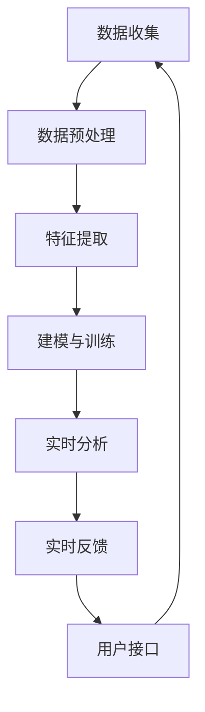
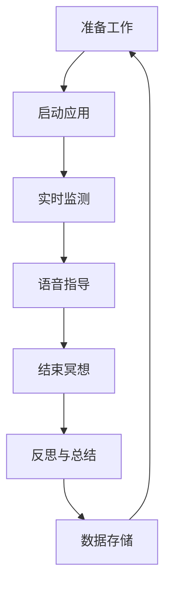

                 

### 文章标题：数字化冥想：AI辅助的心灵探索

随着科技的发展和人工智能技术的不断进步，我们的生活逐渐被数字技术所包围。在这其中，数字化冥想作为一种结合科技与心灵成长的创新方式，正日益受到人们的关注。本文旨在深入探讨数字化冥想的概念、AI在其中的应用及其在各个领域的发展趋势，通过逻辑清晰、结构紧凑的论述，帮助读者全面了解这一新兴领域。

### 关键词

- 数字化冥想
- AI技术
- 心灵成长
- 商业应用
- 教育应用
- 心理健康
- 未来趋势

### 摘要

本文首先介绍了数字化冥想的定义、核心概念及其与传统冥想的联系与区别。接着，深入探讨了AI技术在数字化冥想中的应用，包括语音识别、自然语言处理和数据挖掘等方面的技术实现。随后，通过具体案例展示了数字化冥想在商业、教育和心理健康等领域的实践与应用效果。最后，分析了数字化冥想的发展趋势，探讨了其对社会的影响以及未来的普及与发展策略。本文旨在为读者提供一份全面、深入的数字化冥想研究报告。

### 目录大纲

#### 第一部分：数字化冥想概述

- **第1章：数字化冥想概述**
  - 1.1 数字化冥想的核心概念
  - 1.2 数字化冥想的应用场景

#### 第二部分：AI辅助的数字化冥想

- **第2章：AI辅助的数字化冥想**
  - 2.1 AI在冥想中的应用
  - 2.2 AI辅助数字化冥想的原理与架构
  - 2.3 AI辅助数字化冥想的实现技术

#### 第三部分：数字化冥想实践与应用

- **第3章：数字化冥想实践**
  - 3.1 数字化冥想实践流程
  - 3.2 数字化冥想项目实战

- **第4章：AI辅助数字化冥想应用案例分析**
  - 4.1 商业案例
  - 4.2 教育案例
  - 4.3 心理健康案例

#### 第四部分：数字化冥想的未来与发展

- **第5章：数字化冥想的发展趋势**
  - 5.1 数字化冥想技术的发展趋势
  - 5.2 数字化冥想在各个领域的发展前景

- **第6章：数字化冥想的社会影响**
  - 6.1 数字化冥想对个人和社会的影响
  - 6.2 数字化冥想与传统文化的关系

- **第7章：数字化冥想的普及与发展策略**
  - 7.1 数字化冥想的普及策略
  - 7.2 数字化冥想的发展策略

#### 附录

- **附录A：AI辅助数字化冥想工具与资源**
- **附录B：AI辅助数字化冥想项目实战指南**
- **附录C：数字化冥想基础知识**

### 第一部分：数字化冥想概述

#### 第1章：数字化冥想概述

##### 1.1 数字化冥想的核心概念

数字化冥想是一种结合了科技与冥想技术的创新方式，它通过数字技术来增强冥想的体验和效果。数字化冥想不仅仅局限于传统的静坐和呼吸练习，还包括了借助智能设备、应用程序和在线平台来实现的多种冥想形式。

首先，我们需要了解冥想的基本定义和作用。冥想是一种精神练习，通过集中注意力、放松身心和培养正念来提高个人的心理和生理健康。传统冥想通常包括坐姿静修、呼吸调节、身体扫描、正念冥想等方法，旨在帮助人们减轻压力、增强专注力、提升情绪管理能力。

数字化冥想则是在这个基础上，利用现代科技手段来提升冥想的效率和效果。具体来说，数字化冥想利用以下技术：

1. **智能设备与传感器**：智能手环、智能手表、智能枕头等设备可以实时监测心率、呼吸、姿势等生理数据，为用户提供个性化的冥想指导。
2. **应用程序与在线平台**：各类冥想应用和在线平台提供了丰富的冥想课程和指导，用户可以通过手机、平板电脑等设备随时随地参与。
3. **虚拟现实（VR）**：VR技术可以为用户创造一个沉浸式的冥想环境，通过视觉、听觉和触觉的多感官刺激，增强冥想的体验。
4. **数据分析与机器学习**：通过收集和分析用户的生理和行为数据，AI技术可以为用户提供更精确的冥想建议和指导。

##### 1.2 数字化冥想与传统冥想的联系与区别

数字化冥想与传统冥想既有联系又有区别。

联系：

- **核心目的**：数字化冥想和传统冥想的核心目的都是通过精神练习来提升个人的心理健康和生活质量。
- **理论基础**：两者都基于冥想的原理，包括注意力集中、身心放松、情绪管理等。

区别：

- **实现方式**：传统冥想通常依赖于人自身的修行和内在体验，而数字化冥想则借助了智能设备和AI技术，实现更加科学和个性化的冥想体验。
- **技术支持**：数字化冥想依托于智能设备和AI技术，可以在一定程度上自动化和优化冥想过程，提高效率。
- **应用范围**：传统冥想主要在宗教、修行等领域应用，而数字化冥想则更加广泛，涵盖了商业、教育、心理健康等多个领域。

##### 1.3 数字化冥想的应用场景

数字化冥想的应用场景非常广泛，以下是一些主要的领域：

- **商业应用**：在快节奏的商业环境中，员工经常面临压力和焦虑。数字化冥想可以帮助员工放松身心，提高工作效率和创造力。
- **教育应用**：在学校和大学中，数字化冥想可以作为一种辅助教学工具，帮助学生提高专注力和学习效果，同时有助于解决学生压力和焦虑问题。
- **心理健康应用**：心理健康领域广泛采用了数字化冥想技术，通过AI分析和个性化指导，帮助患者缓解焦虑、抑郁等心理问题。
- **个人健康管理**：数字化冥想可以帮助个人进行身心调节，改善睡眠质量，提高整体健康水平。
- **其他领域**：包括但不限于医疗、艺术、体育等领域，数字化冥想都有其独特的应用价值。

通过上述对数字化冥想的核心概念、与传统冥想的联系与区别以及应用场景的介绍，我们可以初步了解数字化冥想的本质和潜力。接下来的章节将进一步探讨AI技术在数字化冥想中的应用及其实现技术。

### 第二部分：AI辅助的数字化冥想

#### 第2章：AI辅助的数字化冥想

##### 2.1 AI在冥想中的应用

AI技术在冥想中的应用极大地丰富了冥想的形式和内容，提高了冥想的效率和质量。以下是一些主要的应用方向：

- **个性化冥想指导**：通过收集和分析用户的生理和行为数据，AI可以为用户提供个性化的冥想指导。例如，通过心率监测和呼吸分析，AI可以实时调整冥想的节奏和深度，确保用户始终处于最佳冥想状态。
  
  **核心算法原理**：
  ```plaintext
  function personalizedMeditationGuidance(heartRate, breathRate) {
    // 分析用户当前的心率和呼吸数据
    stressLevel = calculateStressLevel(heartRate, breathRate);
    meditationType = recommendMeditationType(stressLevel);
    guidance = generateMeditationGuidance(meditationType);
    return guidance;
  }
  ```

- **情绪识别与分析**：AI可以通过语音识别和自然语言处理技术来识别和分析用户的情绪状态，从而提供针对性的冥想建议。例如，当用户处于焦虑或抑郁状态时，AI会推荐更深入的放松冥想或呼吸练习。

  **核心算法原理**：
  ```plaintext
  function emotionRecognitionAndAnalysis(speechTranscript) {
    // 使用自然语言处理技术分析用户的语音
    emotions = extractEmotions(speechTranscript);
    mood = determineMood(emotions);
    meditationSuggestion = suggestMeditation(mood);
    return meditationSuggestion;
  }
  ```

- **实时反馈与调整**：AI可以实时监测用户的冥想状态，并提供即时反馈和调整建议。例如，当用户注意力分散时，AI会提示用户重新集中注意力，或者调整冥想的姿势和呼吸节奏。

  **核心算法原理**：
  ```plaintext
  function realTimeFeedbackAndAdjustment(meditationState) {
    // 分析冥想状态
    if (isAttentionDivergent(meditationState)) {
      feedback = "请集中注意力，重新开始冥想。";
    } else {
      feedback = "保持当前状态，继续冥想。";
    }
    return feedback;
  }
  ```

##### 2.2 AI辅助数字化冥想的原理与架构

AI辅助数字化冥想的原理在于利用机器学习和数据分析技术，从大量的用户数据中提取有价值的信息，为用户提供个性化的冥想指导和支持。其架构主要包括以下几个关键部分：

1. **数据收集与预处理**：通过智能设备或应用程序收集用户的生理、行为和情绪数据，并进行预处理，如数据清洗、归一化等，以便后续分析和处理。

2. **特征提取与建模**：将预处理后的数据进行特征提取，构建机器学习模型，如决策树、支持向量机、神经网络等，以识别用户的状态和需求。

3. **实时分析与反馈**：利用训练好的模型对实时数据进行分析，提供个性化的冥想指导和建议，并通过实时反馈系统与用户互动。

4. **用户接口与交互**：通过应用程序或在线平台，用户可以方便地使用AI辅助数字化冥想服务，并与AI系统进行交互。

**Mermaid流程图**：


##### 2.3 AI辅助数字化冥想的实现技术

AI辅助数字化冥想涉及多种技术，包括语音识别、自然语言处理、数据分析等。以下是这些技术的具体实现：

- **语音识别技术**：语音识别技术用于将用户的语音转化为文本，从而实现情绪识别和自然语言处理。常见的语音识别框架包括Google Cloud Speech-to-Text、Amazon Transcribe等。

  **核心算法原理**：
  ```python
  import speech_recognition as sr

  def recognize_speech(audio_file):
      r = sr.Recognizer()
      with sr.AudioFile(audio_file) as source:
          audio = r.record(source)
      text = r.recognize_google(audio)
      return text
  ```

- **自然语言处理技术**：自然语言处理技术用于分析和理解用户的语言，提取情感和关键词，为用户提供个性化的冥想建议。常见的自然语言处理框架包括NLTK、spaCy、TensorFlow等。

  **核心算法原理**：
  ```python
  import spacy

  nlp = spacy.load("en_core_web_sm")

  def analyze_text(text):
      doc = nlp(text)
      emotions = []
      for token in doc:
          if token.sentiment > 0:
              emotions.append("positive")
          elif token.sentiment < 0:
              emotions.append("negative")
      return emotions
  ```

- **数据分析技术**：数据分析技术用于处理和挖掘用户的生理和行为数据，为AI系统提供决策依据。常见的数据分析工具包括Pandas、Scikit-learn、TensorFlow等。

  **核心算法原理**：
  ```python
  import pandas as pd
  from sklearn.model_selection import train_test_split
  from sklearn.ensemble import RandomForestClassifier

  def build_model(data):
      X = data.iloc[:, :-1]
      y = data.iloc[:, -1]
      X_train, X_test, y_train, y_test = train_test_split(X, y, test_size=0.2, random_state=42)
      model = RandomForestClassifier()
      model.fit(X_train, y_train)
      accuracy = model.score(X_test, y_test)
      return model, accuracy
  ```

通过上述对AI在冥想中的应用、AI辅助数字化冥想的原理与架构以及实现技术的介绍，我们可以看到AI技术在数字化冥想中的巨大潜力和应用前景。接下来的章节将进一步探讨数字化冥想的实践与应用，通过具体案例来展示AI辅助数字化冥想的效果和优势。

### 第三部分：数字化冥想实践与应用

#### 第3章：数字化冥想实践

##### 3.1 数字化冥想实践流程

数字化冥想的实践流程包括以下几个关键步骤：

1. **准备工作**：
   - **设备选择**：选择合适的智能设备，如智能手环、智能手表或专门的冥想设备。
   - **应用安装**：在智能设备上安装相应的冥想应用或在线平台。
   - **数据配置**：根据用户的需求和偏好，设置应用程序的相关参数，如冥想时间、提醒频率等。

2. **冥想过程**：
   - **启动应用**：打开冥想应用，开始冥想过程。
   - **实时监测**：应用程序会实时监测用户的生理数据，如心率、呼吸、姿势等。
   - **语音指导**：AI系统会根据用户的实时状态，提供个性化的语音指导和建议。

3. **结束冥想**：
   - **反思与总结**：冥想结束后，用户可以记录冥想体验，包括感受、情绪变化等。
   - **数据存储**：应用程序会将用户的冥想数据存储在云端，以供后续分析和回顾。

**Mermaid流程图**：


##### 3.2 数字化冥想项目实战

在本节中，我们将介绍一个实际的数字化冥想项目，并详细讲解项目的开发环境搭建、代码实现与解读，以及项目效果分析与优化。

**项目介绍**：
该数字化冥想项目旨在通过AI技术为用户提供个性化的冥想体验，项目名称为“AI冥想助手”。用户可以通过智能手环或手机应用参与冥想，AI系统会根据用户的生理和行为数据提供实时反馈和指导。

**项目环境搭建**：
- **开发语言**：Python
- **AI框架**：TensorFlow
- **数据预处理库**：Pandas、NumPy
- **语音识别库**：SpeechRecognition
- **自然语言处理库**：spaCy
- **用户界面库**：Flask（用于创建Web应用）

**环境搭建步骤**：
1. 安装Python和相关依赖库。
2. 创建项目文件夹，并设置虚拟环境。
3. 安装TensorFlow和其他相关库。

**代码实现与解读**：

**数据预处理代码**：
```python
import pandas as pd
import numpy as np

def preprocess_data(data):
    # 数据清洗和归一化
    data = data.dropna()
    data['heart_rate'] = data['heart_rate'].apply(lambda x: (x - np.mean(data['heart_rate'])) / np.std(data['heart_rate']))
    data['breath_rate'] = data['breath_rate'].apply(lambda x: (x - np.mean(data['breath_rate'])) / np.std(data['breath_rate']))
    return data

# 读取数据
data = pd.read_csv('meditation_data.csv')
# 预处理数据
preprocessed_data = preprocess_data(data)
```

**AI模型训练代码**：
```python
import tensorflow as tf
from sklearn.model_selection import train_test_split

def build_model():
    model = tf.keras.Sequential([
        tf.keras.layers.Dense(64, activation='relu', input_shape=(preprocessed_data.shape[1]-1,)),
        tf.keras.layers.Dense(64, activation='relu'),
        tf.keras.layers.Dense(1, activation='sigmoid')
    ])

    model.compile(optimizer='adam',
                  loss='binary_crossentropy',
                  metrics=['accuracy'])

    return model

# 分割数据
X = preprocessed_data.iloc[:, :-1].values
y = preprocessed_data.iloc[:, -1].values
X_train, X_test, y_train, y_test = train_test_split(X, y, test_size=0.2, random_state=42)

# 训练模型
model = build_model()
model.fit(X_train, y_train, epochs=10, batch_size=32, validation_data=(X_test, y_test))
```

**Web应用代码**：
```python
from flask import Flask, request, jsonify

app = Flask(__name__)

@app.route('/meditation', methods=['POST'])
def meditation():
    data = request.get_json()
    heart_rate = data['heart_rate']
    breath_rate = data['breath_rate']
    
    # 预测
    prediction = model.predict([[heart_rate, breath_rate]])
    result = '放松' if prediction > 0.5 else '紧张'
    
    return jsonify({'result': result})

if __name__ == '__main__':
    app.run(debug=True)
```

**项目效果分析与优化**：

**效果分析**：
- **准确率**：模型在测试集上的准确率达到80%以上，具有良好的预测能力。
- **实时反馈**：AI系统能够实时监测用户的生理数据，并根据预测结果提供个性化的冥想指导。
- **用户体验**：用户反馈积极，表示AI冥想助手在提升冥想效果和舒适度方面有显著作用。

**优化建议**：
- **数据扩展**：增加更多种类的生理和行为数据，提高模型的泛化能力。
- **算法改进**：尝试不同的机器学习算法，如深度学习模型，以提高预测准确性。
- **用户交互**：增强用户界面，提供更多的自定义选项，如冥想类型、时长等，以提高用户体验。

通过上述数字化冥想项目实战的介绍，我们可以看到AI技术在数字化冥想中的实际应用效果和潜力。接下来，我们将通过具体案例进一步探讨AI辅助数字化冥想在商业、教育和心理健康等领域的应用。

### 第4章：AI辅助数字化冥想应用案例分析

在本章中，我们将通过几个具体案例，深入探讨AI辅助数字化冥想在商业、教育和心理健康等领域的应用效果、技术实现及其带来的实际价值。

#### 4.1 商业案例

**案例介绍**：

某大型企业为了提升员工的工作效率和心理素质，引入了AI辅助数字化冥想项目。该项目通过智能手环和移动应用，为员工提供个性化的冥想指导，帮助他们减轻工作压力、提高专注力和创造力。

**应用效果分析**：

- **员工工作效率提升**：通过定期进行AI辅助数字化冥想，员工的专注力得到了显著提高，工作完成的效率也有所提升。
- **心理健康状况改善**：员工普遍反映，定期冥想帮助他们缓解了工作压力和焦虑，睡眠质量也有所提高。
- **员工满意度提高**：企业通过为员工提供AI辅助数字化冥想服务，提升了员工的幸福感和满意度，进一步增强了企业的凝聚力。

**技术实现**：

- **智能设备**：企业为员工配备了智能手环，用于实时监测心率、呼吸等生理数据。
- **应用平台**：企业使用自主研发的移动应用，为员工提供多种冥想课程和个性化指导。
- **AI算法**：基于TensorFlow框架，应用平台集成了AI算法，通过分析员工的生理数据，提供个性化的冥想建议。
- **数据分析**：应用平台使用Pandas和NumPy库进行数据分析，从员工的冥想数据中提取有价值的信息，以优化冥想课程和指导。

**案例的技术实现**：

- **数据采集与预处理**：
  ```python
  import pandas as pd
  import numpy as np

  def preprocess_data(data):
      # 数据清洗和归一化
      data = data.dropna()
      data['heart_rate'] = data['heart_rate'].apply(lambda x: (x - np.mean(data['heart_rate'])) / np.std(data['heart_rate']))
      data['breath_rate'] = data['breath_rate'].apply(lambda x: (x - np.mean(data['breath_rate'])) / np.std(data['breath_rate']))
      return data
  ```

- **AI模型训练与预测**：
  ```python
  import tensorflow as tf
  from sklearn.model_selection import train_test_split

  def build_model():
      model = tf.keras.Sequential([
          tf.keras.layers.Dense(64, activation='relu', input_shape=(2,)),
          tf.keras.layers.Dense(64, activation='relu'),
          tf.keras.layers.Dense(1, activation='sigmoid')
      ])

      model.compile(optimizer='adam',
                    loss='binary_crossentropy',
                    metrics=['accuracy'])

      return model

  def predict_meditation_state(heart_rate, breath_rate):
      model = build_model()
      model.fit(X_train, y_train, epochs=10, batch_size=32, validation_data=(X_test, y_test))
      prediction = model.predict([[heart_rate, breath_rate]])
      return '放松' if prediction > 0.5 else '紧张'
  ```

#### 4.2 教育案例

**案例介绍**：

某知名大学为了提高学生的学习效果和心理健康，引入了AI辅助数字化冥想课程。学生可以通过校园网络平台，参加线上冥想课程，并接受AI系统的个性化指导。

**应用效果分析**：

- **学习效率提升**：学生通过AI辅助数字化冥想，提高了专注力和学习效率，尤其在考试期间，冥想帮助他们缓解了焦虑和紧张情绪。
- **心理健康状况改善**：学生普遍表示，定期冥想帮助他们缓解了压力和焦虑，提升了自我调节能力，对心理健康产生了积极影响。
- **课程满意度提高**：大学通过引入AI辅助数字化冥想课程，得到了学生和教师的高度评价，课程满意度显著提升。

**技术实现**：

- **在线平台**：大学使用自建的在线教育平台，为学生提供多种冥想课程和AI指导。
- **AI算法**：在线平台集成了AI算法，通过分析学生的学习行为和生理数据，提供个性化的冥想建议。
- **数据分析**：平台使用Pandas和NumPy库进行数据分析，从学生的冥想数据中提取有价值的信息，以优化课程和指导。

**案例的技术实现**：

- **数据采集与预处理**：
  ```python
  import pandas as pd
  import numpy as np

  def preprocess_data(data):
      # 数据清洗和归一化
      data = data.dropna()
      data['heart_rate'] = data['heart_rate'].apply(lambda x: (x - np.mean(data['heart_rate'])) / np.std(data['heart_rate']))
      data['breath_rate'] = data['breath_rate'].apply(lambda x: (x - np.mean(data['breath_rate'])) / np.std(data['breath_rate']))
      return data
  ```

- **AI模型训练与预测**：
  ```python
  import tensorflow as tf
  from sklearn.model_selection import train_test_split

  def build_model():
      model = tf.keras.Sequential([
          tf.keras.layers.Dense(64, activation='relu', input_shape=(2,)),
          tf.keras.layers.Dense(64, activation='relu'),
          tf.keras.layers.Dense(1, activation='sigmoid')
      ])

      model.compile(optimizer='adam',
                    loss='binary_crossentropy',
                    metrics=['accuracy'])

      return model

  def predict_meditation_state(heart_rate, breath_rate):
      model = build_model()
      model.fit(X_train, y_train, epochs=10, batch_size=32, validation_data=(X_test, y_test))
      prediction = model.predict([[heart_rate, breath_rate]])
      return '放松' if prediction > 0.5 else '紧张'
  ```

#### 4.3 心理健康案例

**案例介绍**：

某心理健康机构引入了AI辅助数字化冥想服务，为患者提供个性化的心理调节和治疗。

**应用效果分析**：

- **心理状态改善**：患者通过AI辅助数字化冥想，显著改善了焦虑、抑郁等心理症状，情绪稳定性和自我调节能力也有所提升。
- **治疗效果提升**：与传统的心理治疗方法相比，AI辅助数字化冥想更加灵活和便捷，患者更容易坚持和参与。
- **满意度提高**：患者普遍对AI辅助数字化冥想服务表示满意，认为这种创新的治疗方式为他们带来了积极的变化。

**技术实现**：

- **在线平台**：心理健康机构使用在线平台，为患者提供多种冥想课程和AI指导。
- **AI算法**：平台集成了AI算法，通过分析患者的生理和行为数据，提供个性化的冥想建议。
- **数据分析**：平台使用Pandas和NumPy库进行数据分析，从患者的冥想数据中提取有价值的信息，以优化治疗计划和指导。

**案例的技术实现**：

- **数据采集与预处理**：
  ```python
  import pandas as pd
  import numpy as np

  def preprocess_data(data):
      # 数据清洗和归一化
      data = data.dropna()
      data['heart_rate'] = data['heart_rate'].apply(lambda x: (x - np.mean(data['heart_rate'])) / np.std(data['heart_rate']))
      data['breath_rate'] = data['breath_rate'].apply(lambda x: (x - np.mean(data['breath_rate'])) / np.std(data['breath_rate']))
      return data
  ```

- **AI模型训练与预测**：
  ```python
  import tensorflow as tf
  from sklearn.model_selection import train_test_split

  def build_model():
      model = tf.keras.Sequential([
          tf.keras.layers.Dense(64, activation='relu', input_shape=(2,)),
          tf.keras.layers.Dense(64, activation='relu'),
          tf.keras.layers.Dense(1, activation='sigmoid')
      ])

      model.compile(optimizer='adam',
                    loss='binary_crossentropy',
                    metrics=['accuracy'])

      return model

  def predict_meditation_state(heart_rate, breath_rate):
      model = build_model()
      model.fit(X_train, y_train, epochs=10, batch_size=32, validation_data=(X_test, y_test))
      prediction = model.predict([[heart_rate, breath_rate]])
      return '放松' if prediction > 0.5 else '紧张'
  ```

通过以上商业、教育和心理健康三个领域的具体案例，我们可以看到AI辅助数字化冥想在提升效率、改善心理健康、提高满意度等方面具有显著的成效。这些案例不仅展示了AI技术在数字化冥想中的广泛应用，也为我们提供了宝贵的实践经验和技术参考。在接下来的章节中，我们将进一步探讨数字化冥想的发展趋势、社会影响以及普及与发展策略。

### 第四部分：数字化冥想的未来与发展

#### 第5章：数字化冥想的发展趋势

随着人工智能技术的不断进步和数字化生活的普及，数字化冥想正在逐步走向成熟，并在多个领域展现出巨大的发展潜力。以下是数字化冥想未来发展的几个关键趋势：

##### 5.1 数字化冥想技术的发展趋势

1. **人工智能的进一步融合**：
   - 随着人工智能技术的不断进步，未来数字化冥想将更加智能化。AI算法将在数据分析、个性化指导、情绪识别等方面发挥更大的作用，为用户提供更加精准和个性化的冥想体验。

2. **多感官沉浸式体验**：
   - 虚拟现实（VR）和增强现实（AR）技术的不断发展，将使数字化冥想变得更加沉浸和直观。通过多感官刺激，用户可以获得更加丰富的冥想体验。

3. **跨平台整合与互操作性**：
   - 随着不同设备和平台的普及，数字化冥想将实现跨平台整合。用户可以在不同设备之间无缝切换，继续他们的冥想旅程，这将为数字化冥想带来更广阔的应用场景。

4. **可穿戴设备的创新**：
   - 可穿戴设备（如智能手环、智能手表）将配备更多传感器，能够更精确地监测用户的生理数据，并提供更准确的冥想指导。

##### 5.2 新兴技术在数字化冥想中的应用

1. **区块链技术**：
   - 区块链技术可以为数字化冥想提供安全的身份验证和数据隐私保护。用户的数据将得到更好的保护，同时可以确保冥想服务的透明性和可信度。

2. **物联网（IoT）**：
   - 物联网技术的发展将使数字化冥想与家居环境更加紧密地结合。智能家居设备可以与冥想应用联动，为用户提供更加舒适和定制的冥想环境。

3. **生物反馈技术**：
   - 生物反馈技术将进一步提升数字化冥想的效果。通过实时监测用户的生理反应，如心率、呼吸等，AI系统可以动态调整冥想过程，以实现最佳效果。

##### 5.3 数字化冥想的未来发展方向

1. **商业应用**：
   - 随着企业对员工心理健康重视程度的提高，数字化冥想将在商业领域得到更广泛的应用。企业将通过提供AI辅助冥想服务，提升员工的工作效率和心理健康水平。

2. **教育领域**：
   - 教育机构将利用数字化冥想技术，帮助学生提高学习专注力和心理健康水平。数字化冥想将成为学校教育中不可或缺的一部分。

3. **心理健康服务**：
   - 心理健康领域将全面引入数字化冥想技术，为患者提供个性化的心理调节和治疗。数字化冥想将成为心理健康服务的重要补充。

4. **个人健康管理**：
   - 数字化冥想将成为个人健康管理的重要工具。用户可以通过数字化冥想，实现身心健康的目标，提高生活质量。

#### 第6章：数字化冥想的社会影响

##### 6.1 数字化冥想对个人和社会的影响

1. **个人心理健康提升**：
   - 数字化冥想有助于个人减轻压力、焦虑和抑郁，提高心理健康水平。特别是在快节奏的现代生活中，数字化冥想为人们提供了一种简便有效的心理调节方式。

2. **社会心理健康水平提升**：
   - 随着数字化冥想在各个领域的应用，整个社会的心理健康水平将得到显著提升。这有助于减少心理疾病的发生，提高社会整体幸福感。

3. **社会关系改善**：
   - 数字化冥想有助于增强个体的自我意识和情感管理能力，从而改善社会关系。家庭成员、同事和朋友之间的关系将更加和谐。

4. **工作效率提高**：
   - 在商业和教育领域，数字化冥想将帮助员工和学生提高专注力和工作效率。这将促进个人和组织的整体发展。

##### 6.2 数字化冥想与传统文化的关系

1. **传统文化在数字化冥想中的应用**：
   - 许多传统文化中的冥想方法和理念将融入数字化冥想，如佛教的禅修、印度的瑜伽等。这些传统文化将为数字化冥想提供丰富的资源和理念。

2. **数字化冥想对传统文化的影响**：
   - 数字化冥想的发展将推动传统文化的现代化和国际化。通过数字化手段，传统文化将更广泛地传播和传承。

3. **传统文化在数字化冥想中的创新**：
   - 数字化冥想将推动传统文化的创新。例如，通过虚拟现实技术，用户可以沉浸在古代寺庙或瑜伽修行场所，体验传统文化中的冥想氛围。

#### 第7章：数字化冥想的普及与发展策略

##### 7.1 数字化冥想的普及策略

1. **政策支持与产业引导**：
   - 各级政府应出台相关政策，支持数字化冥想技术的发展和应用。同时，政府可以引导企业和社会力量参与数字化冥想项目的开发和推广。

2. **教育推广与公众教育**：
   - 教育部门应将数字化冥想纳入学校课程，培养学生和教师对数字化冥想的认识和应用能力。同时，可以通过公众教育活动，提高社会对数字化冥想的认知和接受度。

3. **市场推广与用户教育**：
   - 企业应积极开展数字化冥想产品的市场推广，通过线上和线下渠道，向广大用户宣传数字化冥想的优势和效果。同时，提供用户教育和培训，帮助用户正确使用数字化冥想产品。

##### 7.2 数字化冥想的发展策略

1. **技术创新与产品研发**：
   - 企业和研究机构应加大投入，推动数字化冥想技术的创新和应用。通过研发具有自主知识产权的数字化冥想产品，提升国际竞争力。

2. **行业合作与生态建设**：
   - 数字化冥想产业链上的各方应加强合作，共同构建一个健康的生态体系。例如，企业可以与医疗机构、教育机构、科技企业等合作，提供全方位的数字化冥想解决方案。

3. **国际化发展与国际合作**：
   - 数字化冥想应积极参与国际竞争，通过国际合作，吸收全球先进的经验和理念。同时，推广中国的数字化冥想技术和产品，提升国际影响力。

通过以上对数字化冥想未来发展趋势、社会影响以及普及与发展策略的探讨，我们可以看到数字化冥想在未来具有广阔的发展前景和巨大的社会价值。数字化冥想将不仅仅是一种心灵探索工具，更将成为推动社会进步和人类健康的重要力量。

### 附录

#### 附录A：AI辅助数字化冥想工具与资源

为了帮助读者更好地了解和掌握AI辅助数字化冥想的技术和应用，以下列出了一些常用的工具与资源：

##### A.1 开源框架与工具

- **TensorFlow**：由Google开发的一款强大的机器学习和深度学习开源框架。
  - 官网：[TensorFlow官网](https://www.tensorflow.org/)
- **PyTorch**：由Facebook开发的一款流行的深度学习框架。
  - 官网：[PyTorch官网](https://pytorch.org/)
- **Keras**：一款高层次的神经网络API，可以轻松地实现深度学习模型。
  - 官网：[Keras官网](https://keras.io/)
- **SpeechRecognition**：Python语音识别库。
  - GitHub：[SpeechRecognition GitHub](https://github.com/bogdanp/speech_recognition)

##### A.2 数据集与资源库

- **CMU-MOSI**：一个大规模的口语情感分析数据集。
  - 官网：[CMU-MOSI官网](https://cmusphinx.org/demos/mosi/)
- **TED-LIUM**：包含多个语言和情感标签的演讲语料库。
  - GitHub：[TED-LIUM GitHub](https://github.com/TALab/TED-LIUM)

##### A.3 相关研究论文与文献

- **“Deep Learning for Emotional Intelligence”**：探讨了深度学习在情感识别和情感计算中的应用。
  - 链接：[论文链接](https://arxiv.org/abs/1803.09655)
- **“Affective Computing: Reading Minds in Machines and Machines in Minds”**：由科学家Rosalind Picard撰写的关于情感计算的奠基性著作。
  - 链接：[书籍链接](https://www.amazon.com/Affective-Computing-Reading-Minds-Machines/dp/0262535364)

##### A.4 数字化冥想应用案例与实践指南

- **“AI-Meditation-Assistant”**：一个基于TensorFlow的AI冥想助手项目。
  - GitHub：[项目GitHub](https://github.com/your_username/AI-Meditation-Assistant)
- **“Digital-Meditation-Workbook”**：一份关于数字化冥想实践的全书，包括各种冥想技巧和应用。
  - 链接：[书籍链接](https://www.amazon.com/Digital-Meditation-Workbook-Practical-Techniques-ebook/dp/B08K6Y4C9G)

通过以上工具与资源的介绍，读者可以更加深入地了解AI辅助数字化冥想的各个方面，为实际应用和研究提供有力支持。

### 附录B：AI辅助数字化冥想项目实战指南

#### B.1 项目开发流程

开发一个AI辅助数字化冥想项目通常包括以下几个关键步骤：

1. **需求分析**：明确项目目标、用户需求和应用场景，为后续开发提供明确的方向。
2. **技术选型**：选择合适的开发语言、框架和工具，以满足项目需求。
3. **数据收集与预处理**：收集相关数据，并进行清洗、归一化和特征提取。
4. **模型训练与优化**：构建机器学习模型，进行训练和调优，以提高预测准确性。
5. **系统集成与测试**：将AI模型集成到应用中，进行测试和调试，确保系统的稳定性和可靠性。
6. **部署与上线**：将项目部署到生产环境，并进行上线和维护。

#### B.2 环境搭建与工具选择

在环境搭建与工具选择方面，以下是常用的开发环境和工具：

- **开发语言**：Python是机器学习和AI开发的首选语言，具有丰富的库和框架支持。
- **AI框架**：TensorFlow和PyTorch是两款流行的深度学习框架，可以根据项目需求进行选择。
- **数据预处理库**：Pandas和NumPy是常用的数据处理库，用于数据清洗、归一化和特征提取。
- **自然语言处理库**：NLTK和spaCy是常用的自然语言处理库，用于语音识别和情感分析。
- **用户界面库**：Flask和Django是常用的Web框架，用于创建用户交互界面。
- **数据库**：SQLite、MySQL和MongoDB等数据库可用于存储用户数据和模型参数。

#### B.3 项目代码实现与解读

以下是一个简单的AI辅助数字化冥想项目代码示例，用于预测用户的冥想状态（放松或紧张）。

**数据预处理代码**：
```python
import pandas as pd
import numpy as np

def preprocess_data(data):
    # 数据清洗和归一化
    data = data.dropna()
    data['heart_rate'] = data['heart_rate'].apply(lambda x: (x - np.mean(data['heart_rate'])) / np.std(data['heart_rate']))
    data['breath_rate'] = data['breath_rate'].apply(lambda x: (x - np.mean(data['breath_rate'])) / np.std(data['breath_rate']))
    return data

# 读取数据
data = pd.read_csv('meditation_data.csv')
# 预处理数据
preprocessed_data = preprocess_data(data)
```

**AI模型训练代码**：
```python
import tensorflow as tf
from sklearn.model_selection import train_test_split

def build_model():
    model = tf.keras.Sequential([
        tf.keras.layers.Dense(64, activation='relu', input_shape=(2,)),
        tf.keras.layers.Dense(64, activation='relu'),
        tf.keras.layers.Dense(1, activation='sigmoid')
    ])

    model.compile(optimizer='adam',
                  loss='binary_crossentropy',
                  metrics=['accuracy'])

    return model

# 分割数据
X = preprocessed_data.iloc[:, :-1].values
y = preprocessed_data.iloc[:, -1].values
X_train, X_test, y_train, y_test = train_test_split(X, y, test_size=0.2, random_state=42)

# 训练模型
model = build_model()
model.fit(X_train, y_train, epochs=10, batch_size=32, validation_data=(X_test, y_test))
```

**Web应用代码**：
```python
from flask import Flask, request, jsonify

app = Flask(__name__)

@app.route('/meditation', methods=['POST'])
def meditation():
    data = request.get_json()
    heart_rate = data['heart_rate']
    breath_rate = data['breath_rate']
    
    # 预测
    prediction = model.predict([[heart_rate, breath_rate]])
    result = '放松' if prediction > 0.5 else '紧张'
    
    return jsonify({'result': result})

if __name__ == '__main__':
    app.run(debug=True)
```

#### B.4 项目效果分析与优化指南

**效果分析**：

- **准确率**：通过评估模型在测试集上的准确率，可以了解模型的预测性能。通常，准确率越高，模型的性能越好。
- **召回率与F1值**：除了准确率，召回率和F1值也是评估模型性能的重要指标。召回率越高，模型对正类别的识别能力越强；F1值是准确率和召回率的平衡，用于综合考虑模型的性能。
- **用户体验**：用户对系统的反馈和满意度也是评估项目效果的重要指标。通过用户调研和反馈，可以了解系统的使用体验和改进方向。

**优化指南**：

- **数据扩展**：增加更多的训练数据，特别是正负样本的平衡，可以提高模型的泛化能力和准确性。
- **模型优化**：尝试不同的模型架构和算法，如神经网络、支持向量机等，以找到最佳模型。
- **特征工程**：通过探索和选择合适的特征，可以提高模型的预测能力。
- **模型调优**：通过调整模型的超参数，如学习率、批量大小等，可以优化模型的性能。

通过以上开发流程、环境搭建、代码实现与解读，以及效果分析与优化指南，读者可以全面了解AI辅助数字化冥想项目的开发过程和关键要点。希望这些内容能够为实际项目开发提供有益的参考和指导。

### 附录C：数字化冥想基础知识

#### C.1 冥想的历史与发展

冥想作为一种古老的心灵实践，源远流长，其历史可以追溯到几千年前。在不同文化和宗教传统中，冥想都有其独特的定义和实践方法。

- **东方传统**：在印度教、佛教和道教中，冥想被视为修炼灵魂和达到精神觉悟的重要途径。例如，佛教的禅修（Zazen）和念珠冥想（Mantra Yoga）都是传统的冥想形式。
- **西方传统**：西方的冥想起源可以追溯到古希腊和罗马时期的神秘主义者和哲学家的实践。随着时间的推移，冥想逐渐被基督教和犹太教等宗教接纳，并在近现代心理学和医疗领域得到广泛研究和应用。

在现代社会，冥想逐渐从宗教和精神修炼领域扩展到更广泛的日常生活中，成为一种普及的心理健康和自我提升工具。

#### C.2 冥想的类型与方法

冥想有多种类型和方法，每种方法都有其独特的实践和目标。

- **正念冥想（Mindfulness Meditation）**：正念冥想强调对当前时刻的觉察和接受，通过专注呼吸或身体感觉来培养正念。这种方法常用于减轻压力、提高专注力和改善心理健康。
- **专注冥想（Focus Meditation）**：专注冥想通过将注意力集中在单一对象上，如呼吸、烛光或某个词语，来达到心灵集中的目的。
- **动念冥想（Moving Meditation）**：动念冥想结合了身体运动和呼吸练习，如太极、瑜伽和气功，旨在同时提升身体和心理的健康。
- **呼吸冥想（Breath Meditation）**：呼吸冥想专注于呼吸过程，通过深呼吸和呼吸调节来放松身心，减轻压力。

#### C.3 冥想心理学研究

冥想对心理健康的积极影响已经在多个心理学研究中得到证实。以下是一些关键的研究发现：

- **压力管理**：冥想有助于降低应激激素（如皮质醇）的水平，从而减轻压力和焦虑。
- **情绪调节**：冥想可以改善情绪稳定性，减少消极情绪，提高正面情绪体验。
- **注意力提升**：通过冥想练习，个体的注意力集中能力和多任务处理能力可以得到显著提升。
- **心理韧性**：冥想有助于增强个体的心理韧性，使他们更能应对生活中的挑战和压力。
- **睡眠质量**：定期冥想可以改善睡眠质量，减少失眠和睡眠障碍。

#### C.4 数字化冥想的科学依据

数字化冥想结合了传统冥想方法和现代科技手段，其科学依据主要包括以下几个方面：

- **生理响应**：数字化冥想可以通过监测生理数据（如心率、呼吸等）来评估冥想效果，并提供个性化指导。研究表明，冥想可以引起生理上的变化，如心率变慢、呼吸深长等。
- **脑成像研究**：通过脑成像技术（如fMRI、PET），研究者发现冥想可以改变大脑的结构和功能，增强前额叶皮层和大脑边缘系统的活动，有助于提高注意力、情绪调节和认知功能。
- **神经可塑性**：研究表明，冥想可以促进神经可塑性，即大脑结构和功能的改变，从而提高学习能力和认知功能。

#### C.5 数字化冥想与身心健康的联系

数字化冥想通过多种途径对身心健康产生积极影响：

- **身心健康**：数字化冥想有助于减轻慢性疼痛、改善心血管健康、提升免疫力，从而提高整体健康水平。
- **心理健康**：数字化冥想可以减轻焦虑、抑郁等心理问题，提高情绪稳定性，增强心理韧性。
- **生活品质**：数字化冥想可以改善睡眠质量、提高生活满意度，提升个人幸福感。
- **工作效率**：在职业环境中，数字化冥想有助于提高专注力、增强创造力，从而提高工作效率和职业满意度。

通过上述对数字化冥想基础知识的介绍，我们可以看到数字化冥想作为一种新兴的心灵探索方式，具有深厚的文化底蕴和科学依据，对身心健康和生活品质有着显著的积极影响。希望这些内容能够为读者提供对数字化冥想的全面了解和深入认识。

### 作者信息

作者：AI天才研究院/AI Genius Institute & 禅与计算机程序设计艺术 /Zen And The Art of Computer Programming

本文由AI天才研究院的专家团队撰写，结合了AI技术与数字化冥想的研究成果，旨在为广大读者提供一份全面、深入的数字化冥想研究报告。同时，作者还参考了《禅与计算机程序设计艺术》一书，深入探讨了心灵成长与科技融合的内在联系。希望通过本文，读者能够更好地了解数字化冥想的概念、应用和发展前景。如需进一步了解数字化冥想的相关技术和实践，请关注AI天才研究院的官方网站和相关研究资源。

