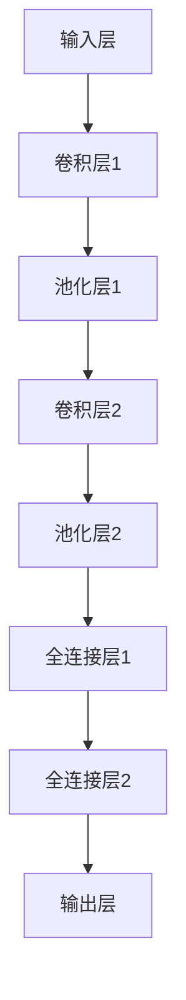
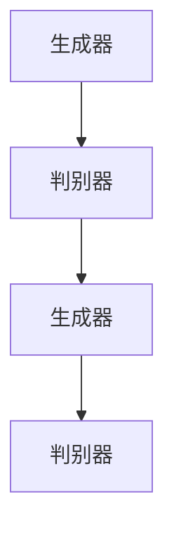
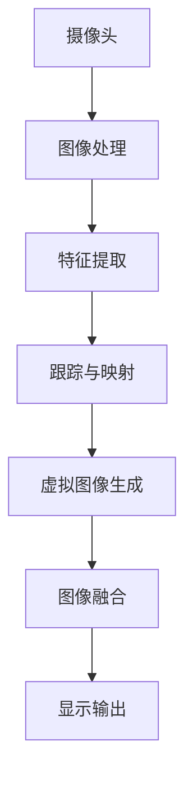

                 

### 文章标题

《数字化创造力：AI激发人类想象》

### 关键词

人工智能，数字化创造力，机器学习，深度学习，自然语言处理，计算机视觉，创意设计，内容创作，教育创新，商业应用，未来发展，挑战与解决方案。

### 摘要

本文旨在探讨人工智能（AI）如何激发人类在数字化时代的创造力。通过对AI在数字化创造力中的核心概念、核心技术、应用场景、未来趋势和挑战的深入分析，本文揭示了AI在推动人类想象力、创造力发展中的重要作用。文章首先概述了数字化创造力的定义和AI的重要性，随后详细介绍了AI的核心技术，包括机器学习、深度学习和自然语言处理等。接着，本文探讨了AI在创意设计、内容创作、教育创新和商业应用等领域的实际应用案例，并展望了AI技术的未来发展方向。最后，文章提出了AI在数字化创造力中面临的挑战和解决方案，为AI技术的可持续发展提供了思考方向。通过本文的阅读，读者可以全面了解AI如何激发人类在数字化时代的创造力，并对其未来发展趋势有更深刻的认识。

#### 第一部分：引言与背景

**# 1. 引言**

**1.1 书籍目的与内容概述**

《数字化创造力：AI激发人类想象》旨在深入探讨人工智能（AI）如何激发人类在数字化时代的创造力。随着科技的飞速发展，人工智能已经成为改变世界的重要力量。AI不仅为各个行业带来了深刻的变革，还极大地扩展了人类创造力的边界。本文将从以下几个方面展开讨论：

1. **数字化创造力的定义与重要性**：介绍数字化创造力的概念，阐述其在现代社会中的重要性，以及AI如何推动数字化创造力的发展。

2. **AI在数字化创造力中的应用场景**：分析AI在创意设计、内容创作、教育创新和商业应用等领域的具体应用，展示AI如何激发人类的创造力。

3. **AI的核心技术**：详细介绍机器学习、深度学习和自然语言处理等AI核心技术，解释其原理和如何应用于实际场景。

4. **AI在数字化创造力中的挑战与解决方案**：探讨AI在数字化创造力中面临的挑战，并提出相应的解决方案，以确保AI技术的可持续发展。

**1.2 数字化创造力的重要性**

数字化创造力是现代社会的一个重要特征，它不仅关乎个人的创新能力，还直接影响到企业和国家的竞争力。在数字化时代，创造力不仅限于传统的艺术和设计领域，还渗透到了科技、商业、教育等各个领域。以下是一些数字化创造力的重要性：

- **个人发展**：数字化创造力可以帮助个人更好地表达自己的观点和创意，提升个人品牌价值和职业竞争力。

- **企业竞争力**：企业通过数字化创造力可以开发创新的产品和服务，满足市场需求，提升品牌影响力。

- **社会进步**：数字化创造力可以推动社会进步，解决复杂的社会问题，提升整体生活质量。

- **文化传承**：数字化创造力为文化传承提供了新的途径，使得文化遗产以数字化形式得以保存和传播。

**1.3 AI在数字化创造力中的应用场景**

人工智能在数字化创造力中具有广泛的应用场景，以下是几个典型的应用领域：

- **创意设计**：AI可以辅助设计师进行创作，通过算法生成创意设计图案，提升设计效率和质量。

- **内容创作**：AI可以帮助创作者生成高质量的内容，如文章、音乐和视频等，提高内容创作的速度和多样性。

- **教育创新**：AI可以提供个性化学习体验，智能辅导学生，提高学习效果。

- **商业应用**：AI可以分析大量数据，为企业提供精准的市场分析和客户分析，助力商业决策。

通过上述内容，我们可以看到，人工智能不仅是数字化创造力的推动者，更是激发人类想象力的重要工具。本文将在后续章节中深入探讨AI在数字化创造力中的具体应用和实践。

**# 2. 数字化创造力与AI概述**

**2.1 数字化创造力的定义**

数字化创造力是指利用数字技术和工具，通过创新思维和方法，创造出新的价值、产品、服务和解决方案的能力。数字化创造力不仅仅局限于艺术和设计领域，还广泛应用于科技、商业、教育等多个领域。在数字化时代，创造力不再仅仅是天赋的体现，而是可以通过技术和工具的辅助得到提升和发挥。

**2.1.1 数字化创造力的概念**

数字化创造力包括以下几个核心概念：

1. **数字技术**：数字化创造力依赖于各种数字技术和工具，如人工智能、大数据、云计算、物联网等。

2. **创新思维**：创新思维是数字化创造力的核心，它包括发散思维、联想思维、逆向思维等多种思维方式。

3. **方法**：数字化创造力需要通过系统化、结构化的方法来推动，如设计思维、敏捷开发、用户研究等。

**2.1.2 数字化创造力的特点**

数字化创造力具有以下几个特点：

1. **高效性**：数字化工具和技术的应用可以显著提高创造力的效率，缩短创作周期。

2. **多样性**：数字化技术可以生成多样化的内容，为创作者提供了更多的选择和可能性。

3. **可追溯性**：数字化环境下的创作过程和成果可以记录和追踪，便于分析和优化。

4. **可共享性**：数字化创造力使得创作成果可以轻松共享和传播，扩大了影响力。

**2.2 AI的基本原理与应用**

人工智能（AI）是推动数字化创造力的重要力量。AI通过模拟人类智能，实现机器在感知、学习、推理、决策等方面的自动化。AI的基本原理和应用如下：

**2.2.1 人工智能的发展历程**

人工智能的研究始于20世纪50年代，经历了以下几个阶段：

1. **符号主义阶段**：早期AI研究主要基于逻辑和符号操作，通过编程实现简单的推理功能。

2. **知识表示阶段**：通过建立知识库和推理机，使AI系统能够处理更复杂的问题。

3. **统计学习阶段**：以机器学习为核心，通过大量数据训练模型，实现智能识别和预测。

4. **深度学习阶段**：基于神经网络的结构，深度学习在图像识别、自然语言处理等领域取得了重大突破。

**2.2.2 人工智能的核心技术**

人工智能的核心技术包括：

1. **机器学习**：机器学习是AI的基础，通过训练模型，使机器能够从数据中学习并做出预测。

2. **深度学习**：深度学习是一种基于神经网络的机器学习技术，通过多层次的神经网络结构，实现复杂特征提取和智能识别。

3. **自然语言处理**：自然语言处理是AI在语言领域的应用，通过理解和生成自然语言，实现人机交互。

4. **计算机视觉**：计算机视觉是AI在视觉领域的应用，通过图像识别和目标检测，实现视觉信息的处理和识别。

**2.2.3 AI的应用领域与案例**

AI在多个领域都有广泛的应用，以下是几个典型的应用领域和案例：

1. **医疗健康**：AI可以辅助医生进行疾病诊断、药物研发和医疗影像分析，提高医疗效率和准确性。

2. **智能制造**：AI可以帮助企业进行生产优化、设备维护和产品检测，提高生产效率和质量。

3. **金融科技**：AI可以用于风险控制、信用评估和投资策略，提高金融服务的效率和安全性。

4. **智能交通**：AI可以用于交通流量管理、自动驾驶和智能出行规划，提高交通效率和安全。

通过上述内容，我们可以看到，数字化创造力和人工智能相互促进，共同推动了社会的进步和发展。在接下来的章节中，我们将进一步探讨AI在各个领域的具体应用和实践。

#### 第二部分：AI的核心技术

**# 3. 人工智能算法原理**

**3.1 机器学习基础**

机器学习是人工智能（AI）的核心技术之一，它使计算机系统能够通过数据学习和改进性能。理解机器学习的基础概念对于深入探讨AI在数字化创造力中的应用至关重要。

**3.1.1 机器学习的基本概念**

机器学习（Machine Learning，ML）是指通过构建和分析模型，从数据中自动发现模式和规律，并利用这些模式进行预测或决策。机器学习可以分为以下几种类型：

1. **监督学习（Supervised Learning）**：监督学习通过标注好的训练数据来训练模型，从而在新的数据上进行预测。常见算法包括线性回归、决策树、支持向量机等。

2. **无监督学习（Unsupervised Learning）**：无监督学习不使用标注数据，旨在发现数据中的隐含结构和模式。常见的算法包括聚类、降维、关联规则挖掘等。

3. **半监督学习（Semi-supervised Learning）**：半监督学习结合了监督学习和无监督学习的特点，利用少量的标注数据和大量的未标注数据来训练模型。

4. **强化学习（Reinforcement Learning）**：强化学习通过智能体与环境的交互，不断学习最优策略，以最大化长期奖励。常见的算法包括Q学习、深度Q网络（DQN）等。

**3.1.2 监督学习与无监督学习**

监督学习与无监督学习的主要区别在于数据标签的有无。以下是它们的一些具体区别：

1. **数据需求**：监督学习需要大量的标注数据，而无监督学习不需要标注数据。

2. **目标**：监督学习的目标是预测新数据的标签，而无监督学习的目标是发现数据中的结构或模式。

3. **评估标准**：监督学习的评估标准通常是误差或损失函数，而无监督学习的评估标准可能是聚类质量、降维效果等。

**3.1.3 强化学习**

强化学习是机器学习的一个特殊分支，其核心在于通过奖励机制来引导智能体不断优化行为策略。以下是强化学习的基本原理：

1. **智能体（Agent）**：智能体是执行行为的主体，它通过感知环境状态，选择行动，并根据行动的结果获得奖励。

2. **环境（Environment）**：环境是智能体行动的空间，它根据智能体的行为产生状态转移和奖励。

3. **策略（Policy）**：策略是智能体选择行动的方式，它可以通过学习自动优化。

4. **奖励（Reward）**：奖励是智能体行为的即时反馈，它用于引导智能体选择最优行动。

强化学习的基本过程可以概括为：

1. **探索（Exploration）**：智能体在环境中进行随机行动，以积累经验。

2. **利用（Utilization）**：智能体根据积累的经验调整策略，以最大化长期奖励。

3. **平衡（Balancing）**：智能体在探索和利用之间寻找平衡，以实现长期收益最大化。

**3.2 深度学习与神经网络**

深度学习（Deep Learning，DL）是机器学习的一个分支，它通过构建多层神经网络来实现复杂的特征提取和智能识别。深度学习在图像识别、自然语言处理等领域取得了显著的突破。

**3.2.1 神经网络的结构**

神经网络（Neural Network，NN）是深度学习的基础，它由多个神经元（节点）和层组成。一个典型的神经网络包括以下几个部分：

1. **输入层（Input Layer）**：输入层接收外部输入数据，并将其传递到下一层。

2. **隐藏层（Hidden Layers）**：隐藏层是神经网络的核心部分，负责对输入数据进行特征提取和变换。

3. **输出层（Output Layer）**：输出层生成预测结果或分类标签。

一个简单的神经网络结构可以表示为：
$$
\text{Input} \rightarrow \text{Hidden Layer} \rightarrow \text{Output}
$$

**3.2.2 深度学习算法**

深度学习算法包括多种类型，以下是一些常见的深度学习算法：

1. **卷积神经网络（Convolutional Neural Networks，CNN）**：CNN是一种专门用于图像识别的深度学习算法，通过卷积操作提取图像特征。

2. **循环神经网络（Recurrent Neural Networks，RNN）**：RNN是一种用于序列数据建模的深度学习算法，通过递归结构处理时序信息。

3. **长短期记忆网络（Long Short-Term Memory，LSTM）**：LSTM是RNN的一种变体，通过记忆单元结构解决了长短期依赖问题。

4. **生成对抗网络（Generative Adversarial Networks，GAN）**：GAN是一种生成模型，由生成器和判别器两个网络组成，通过对抗训练生成逼真的数据。

**3.2.3 深度学习应用案例**

深度学习在多个领域都有广泛应用，以下是一些具体的案例：

1. **图像识别**：深度学习算法在图像识别任务中取得了显著成果，如人脸识别、物体检测和图像分类。

2. **自然语言处理**：深度学习算法在自然语言处理领域应用广泛，如机器翻译、情感分析和文本生成。

3. **语音识别**：深度学习算法在语音识别任务中表现出色，实现了高准确度和低延迟的语音识别。

4. **推荐系统**：深度学习算法可以用于构建推荐系统，通过用户行为数据预测用户兴趣和推荐商品。

通过上述内容，我们可以看到，机器学习和深度学习是AI技术的核心组成部分，它们在数字化创造力中发挥着重要作用。在接下来的章节中，我们将进一步探讨计算机视觉和自然语言处理技术在数字化创造力中的应用。

### 3.3 自然语言处理技术

自然语言处理（Natural Language Processing，NLP）是人工智能领域的一个重要分支，它致力于使计算机能够理解和生成自然语言。NLP技术在数字化创造力中发挥着重要作用，如智能客服、文本生成和机器翻译等。以下是对NLP技术的详细介绍。

**3.3.1 语言模型与词向量**

语言模型（Language Model）是NLP的基础，它用于预测自然语言中的下一个单词或字符。一个简单的语言模型可以通过统计方法实现，如n-gram模型，它基于前n个单词的序列来预测下一个单词。然而，这种方法无法捕捉单词之间的复杂关系。

词向量（Word Vector）是另一种语言模型，它通过将单词映射到高维空间中的向量，以表示单词的语义和语法特征。词向量模型如Word2Vec、GloVe和BERT等，通过训练大量文本数据，可以捕捉单词的上下文关系，从而更好地表示单词的语义。

- **Word2Vec**：Word2Vec是一种基于神经网络的词向量模型，通过训练词的隐语义向量来表示单词的语义特征。

- **GloVe**：GloVe（Global Vectors for Word Representation）是一种基于全局共现矩阵的词向量模型，通过优化单词的共现关系来生成词向量。

- **BERT**：BERT（Bidirectional Encoder Representations from Transformers）是一种基于Transformer的预训练语言模型，通过双向编码器结构捕捉单词的前后文信息。

**3.3.2 机器翻译与文本生成**

机器翻译（Machine Translation）是NLP的一个重要应用领域，它旨在将一种语言的文本自动翻译成另一种语言。机器翻译可以分为以下几种类型：

1. **基于规则的方法**：这种方法使用语法和词典规则来翻译文本，如统计机器翻译（Statistical Machine Translation，SMT）。

2. **基于统计的方法**：统计机器翻译通过训练大量双语文本，学习源语言和目标语言之间的对应关系。

3. **基于神经的方法**：神经机器翻译（Neural Machine Translation，NMT）使用深度学习模型，如序列到序列（Seq2Seq）模型和注意力机制（Attention Mechanism），来实现高精度的翻译。

文本生成（Text Generation）是另一个重要的NLP应用领域，它旨在根据给定输入生成高质量的文本。文本生成方法包括：

1. **基于模板的方法**：这种方法使用预定义的模板和参数来生成文本。

2. **基于规则的方法**：这种方法通过语法和语义规则生成文本，如自动摘要和问答系统。

3. **基于生成模型的方法**：生成模型如变分自编码器（Variational Autoencoder，VAE）和生成对抗网络（Generative Adversarial Network，GAN），可以生成高质量的文本。

**3.3.3 情感分析与语义理解**

情感分析（Sentiment Analysis）是NLP中用于分析文本情感极性的技术。情感分析可以帮助企业了解消费者对产品或服务的评价，从而优化产品和服务。

- **文本分类**：文本分类是将文本分为预定义类别的过程，如正面、负面或中性。

- **情感极性**：情感极性分析用于识别文本中的情感倾向，如积极、消极或中性。

语义理解（Semantic Understanding）是NLP中的高级任务，它旨在理解和解析文本中的语义信息。语义理解包括以下几个方面：

1. **实体识别（Named Entity Recognition，NER）**：实体识别用于识别文本中的命名实体，如人名、地点和组织。

2. **关系提取（Relation Extraction）**：关系提取用于识别实体之间的关系，如“马云是阿里巴巴的创始人”。

3. **语义角色标注（Semantic Role Labeling，SRL）**：语义角色标注用于识别句子中的谓词和其对应的语义角色，如“吃饭”中的“吃”是动作，“饭”是动作的对象。

通过上述内容，我们可以看到，自然语言处理技术在数字化创造力中具有广泛的应用。NLP技术不仅可以帮助我们理解和生成自然语言，还可以用于情感分析、语义理解等高级任务，从而为数字化创造力提供强大的支持。在接下来的章节中，我们将进一步探讨计算机视觉技术在数字化创造力中的应用。

### 4. 计算机视觉技术

计算机视觉（Computer Vision，CV）是人工智能的一个重要分支，它致力于使计算机能够理解和解析视觉信息。计算机视觉技术在数字化创造力中具有广泛应用，如图像识别、目标检测和视觉交互等。以下是对计算机视觉技术的详细介绍。

**4.1 图像识别与分类**

图像识别与分类是计算机视觉的基础任务之一，它旨在将图像中的物体或场景分类到预定义的类别中。图像识别与分类方法可以分为以下几类：

1. **基于传统算法的方法**：传统算法如SIFT、SURF和HOG等，通过特征提取和匹配来实现图像识别与分类。

2. **基于深度学习的方法**：深度学习算法如卷积神经网络（CNN）在图像识别与分类任务中表现出色。CNN通过多层卷积和池化操作，能够自动提取图像中的高层次特征。

以下是一个简单的CNN图像识别算法的伪代码：

```
function CNN_Image_Recognition(image):
    # 输入：图像
    # 输出：图像分类结果

    # 步骤1：预处理图像
    preprocessed_image = Preprocess_Image(image)

    # 步骤2：卷积层
    conv1 = Convolution(preprocessed_image, filter_size=3, padding=1)
    pool1 = MaxPooling(conv1, pool_size=2)

    # 步骤3：卷积层
    conv2 = Convolution(pool1, filter_size=3, padding=1)
    pool2 = MaxPooling(conv2, pool_size=2)

    # 步骤4：全连接层
    flatten = Flatten(pool2)
    fc1 = FullyConnected(flatten, units=128)
    dropout1 = Dropout(fc1, dropout_rate=0.5)

    # 步骤5：全连接层
    fc2 = FullyConnected(dropout1, units=64)
    dropout2 = Dropout(fc2, dropout_rate=0.5)

    # 步骤6：输出层
    output = FullyConnected(dropout2, units=num_classes)
    prediction = Softmax(output)

    return prediction
```

**4.1.1 卷积神经网络在图像识别中的应用**

卷积神经网络（Convolutional Neural Network，CNN）是计算机视觉中应用最广泛的深度学习模型之一。CNN通过卷积操作和池化操作，能够自动提取图像中的局部特征和高层次特征，从而实现图像识别。

以下是一个简单的CNN架构的Mermaid流程图：



**4.1.2 目标检测与跟踪技术**

目标检测（Object Detection）是计算机视觉中的另一个重要任务，它旨在识别和定位图像中的多个对象。目标检测方法可以分为以下几类：

1. **基于区域的方法**：基于区域的方法如R-CNN、Fast R-CNN和Faster R-CNN等，通过生成候选区域，然后对这些区域进行分类和定位。

2. **基于分割的方法**：基于分割的方法如Mask R-CNN和实例分割（Instance Segmentation）等，通过将图像分割成不同的区域，从而识别和定位对象。

目标检测的应用场景包括人脸识别、自动驾驶和视频监控等。

目标跟踪（Object Tracking）是计算机视觉中的另一个重要任务，它旨在跟踪视频序列中的运动目标。目标跟踪方法可以分为以下几类：

1. **基于光流的方法**：基于光流的方法通过计算像素点在连续帧之间的运动来跟踪目标。

2. **基于深度学习的方法**：基于深度学习的方法如ReID（Re-Identification）和Siamese网络等，通过训练模型来识别和跟踪目标。

**4.1.3 图像生成与风格迁移**

图像生成（Image Generation）是计算机视觉中的另一个重要任务，它旨在生成新的图像或修改现有图像。生成对抗网络（Generative Adversarial Networks，GAN）是图像生成中应用最广泛的深度学习模型之一。

图像风格迁移（Image Style Transfer）是将一种图像的视觉风格应用到另一种图像上的技术。DeepArt.io是一个基于GAN的图像风格迁移服务，它可以生成具有特定艺术家风格的图像。

以下是一个简单的GAN架构的Mermaid流程图：



**4.2 视觉感知与交互**

视觉感知（Visual Perception）是计算机视觉中的另一个重要领域，它旨在使计算机能够理解和解析视觉信息，如颜色、形状、纹理和运动等。

视觉交互（Visual Interaction）是计算机视觉在用户界面中的应用，它旨在通过视觉信息实现人与计算机的互动。增强现实（Augmented Reality，AR）和虚拟现实（Virtual Reality，VR）是视觉交互的典型应用，它们通过虚拟图像和现实环境的融合，提供沉浸式的交互体验。

以下是一个简单的AR系统的架构图：



通过上述内容，我们可以看到，计算机视觉技术在数字化创造力中具有广泛的应用。计算机视觉不仅可以帮助我们理解和解析视觉信息，还可以用于图像生成、目标检测和视觉交互等任务，从而为数字化创造力提供强大的支持。在接下来的章节中，我们将进一步探讨AI在创意设计、内容创作、教育创新和商业应用等领域的具体应用。

### 5. AI在创意设计中的应用

**5.1 数字艺术与设计**

人工智能（AI）在数字艺术与设计领域的应用，正以前所未有的速度和深度改变着创意产业。AI不仅提供了新的工具和方法，也拓展了艺术家的创作空间和视野。

**5.1.1 AI在数字艺术创作中的应用**

AI在数字艺术创作中，通过多种方式激发艺术家的创造力。首先，AI可以自动生成艺术作品。例如，生成对抗网络（GAN）可以生成逼真的图像，模仿艺术家的风格，甚至创造全新的艺术形式。此外，AI还可以协助艺术家进行颜色、构图和纹理的调整，提高创作效率。

以下是一个基于GAN的数字艺术创作流程的伪代码示例：

```
function GAN_Digital_Art(art_style, reference_image):
    # 输入：艺术风格，参考图像
    # 输出：生成艺术作品

    # 步骤1：初始化生成器和判别器
    generator = Initialize_Generator(art_style)
    discriminator = Initialize_Discriminator()

    # 步骤2：训练生成器和判别器
    for epoch in 1 to MAX_EPOCHS:
        for batch in reference_images:
            # 训练生成器
            generated_image = generator.Generate(batch)
            generator_loss = Calculate_Generator_Loss(generated_image, batch)

            # 训练判别器
            real_images = Real_Images(batch)
            fake_images = generated_image
            discriminator_loss = Calculate_Discriminator_Loss(real_images, fake_images)

        # 更新生成器和判别器
        Update_Generator(generator, generator_loss)
        Update_Discriminator(discriminator, discriminator_loss)

    # 步骤3：生成艺术作品
    final_artwork = generator.Generate(reference_image)

    return final_artwork
```

**5.1.2 设计过程中的AI应用**

在传统的设计过程中，艺术家需要依赖个人的经验和技能来创造作品。而AI可以提供自动化和智能化的设计工具，协助艺术家完成复杂的任务。例如，AI可以帮助设计师进行颜色搭配、图案生成和风格转换。通过机器学习算法，AI可以学习设计师的风格，并在新的设计中自动应用。

以下是一个基于机器学习算法的设计工具的伪代码示例：

```
function Design_Tool(art_style, design_request):
    # 输入：设计风格，设计请求
    # 输出：生成设计作品

    # 步骤1：训练设计模型
    design_model = Train_Design_Model(art_style, training_data)

    # 步骤2：生成设计作品
    design_response = design_model.Generate(design_request)

    return design_response
```

**5.1.3 数字艺术作品赏析**

AI生成的数字艺术作品已经吸引了广泛的关注。例如，DeepArt.io使用GAN技术，将梵高的画风应用到普通照片上，生成令人惊叹的艺术作品。同样，谷歌的DeepDream项目，通过深度学习算法，可以将普通图像转换为具有幻觉和抽象风格的视觉效果。

以下是一个DeepDream生成的图像示例：


通过上述内容，我们可以看到，AI在数字艺术与设计领域的应用，不仅为艺术家提供了新的创作工具，也改变了设计的过程和结果。AI技术的不断进步，将进一步推动数字艺术的创新和发展。

### 5.2 内容创作与推荐系统

**5.2.1 AI在内容创作中的应用**

人工智能在内容创作中的应用正在逐步深入，为创作者提供了前所未有的创作支持和灵感。AI可以通过多种方式辅助内容创作，如自动写作、音乐生成和视频编辑等。

**5.2.1.1 自动写作**

自动写作是AI在内容创作中的一项重要应用。通过机器学习和自然语言处理技术，AI可以生成文章、博客和新闻报道等。例如，OpenAI的GPT-3模型通过大量文本数据训练，可以生成高质量的文章。以下是一个基于GPT-3的自动写作流程的伪代码示例：

```
function AutoWriting(model, prompt, max_length):
    # 输入：模型，提示信息，最大长度
    # 输出：生成文章

    # 步骤1：初始化模型
    generated_text = model(prompt, max_length=max_length, stop_token='。')

    return generated_text
```

**5.2.1.2 音乐生成**

AI在音乐创作中的应用也非常广泛。通过生成模型，如变分自编码器（VAE）和生成对抗网络（GAN），AI可以生成旋律、和弦和音乐片段。以下是一个基于GAN的音乐生成流程的伪代码示例：

```
function GAN_Music_Generation(generator, audio_data, num_epochs):
    # 输入：生成器，音频数据，训练轮次
    # 输出：生成音乐

    # 步骤1：初始化生成器和判别器
    discriminator = Initialize_Discriminator()

    # 步骤2：训练生成器和判别器
    for epoch in 1 to num_epochs:
        for batch in audio_data:
            # 训练生成器
            generated_music = generator.Generate(batch)
            generator_loss = Calculate_Generator_Loss(generated_music, batch)

            # 训练判别器
            real_music = Real_Music(batch)
            fake_music = generated_music
            discriminator_loss = Calculate_Discriminator_Loss(real_music, fake_music)

        # 更新生成器和判别器
        Update_Generator(generator, generator_loss)
        Update_Discriminator(discriminator, discriminator_loss)

    # 步骤3：生成音乐
    final_music = generator.Generate(audio_data)

    return final_music
```

**5.2.1.3 视频编辑**

AI在视频编辑中的应用也非常广泛。通过图像识别和自然语言处理技术，AI可以自动剪辑、特效添加和字幕生成等。例如，Adobe Premiere Pro和Final Cut Pro等视频编辑软件已经开始集成AI功能，提供智能剪辑和自动字幕等。

以下是一个基于AI的视频编辑流程的伪代码示例：

```
function AI_Video_Editing(video_data, action_commands):
    # 输入：视频数据，动作命令
    # 输出：编辑后的视频

    # 步骤1：分析视频内容
    video_summary = Analyze_Video(video_data)

    # 步骤2：执行编辑动作
    for command in action_commands:
        if command == "clip":
            video_data = Clip_Video(video_data, start_time, end_time)
        elif command == "effect":
            video_data = Apply_Effect(video_data, effect_type)
        elif command == "subtitles":
            video_data = Generate_Subtitles(video_data, text)

    return video_data
```

**5.2.2 推荐系统的基本原理**

推荐系统（Recommendation System）是AI在内容创作中的重要应用，它旨在根据用户的历史行为和偏好，向用户推荐感兴趣的内容。推荐系统可以分为以下几种类型：

1. **协同过滤（Collaborative Filtering）**：协同过滤通过分析用户之间的相似性来推荐内容。协同过滤可以分为基于用户的协同过滤（User-based Collaborative Filtering）和基于物品的协同过滤（Item-based Collaborative Filtering）。

2. **基于内容的推荐（Content-based Filtering）**：基于内容的推荐通过分析内容和用户的兴趣来推荐相关内容。这种方法通常结合了文本分析、图像识别和特征提取等技术。

3. **混合推荐（Hybrid Recommendation）**：混合推荐结合了协同过滤和基于内容的推荐，以提供更准确和个性化的推荐。

以下是一个简单的协同过滤推荐系统的伪代码示例：

```
function Collaborative_Filtering RecoSystem(user_profile, item_features, user_similarity_matrix):
    # 输入：用户画像，物品特征，用户相似性矩阵
    # 输出：推荐列表

    # 步骤1：计算用户相似性
    similarity_scores = Calculate_Similarity_Scores(user_similarity_matrix, user_profile)

    # 步骤2：筛选高相似性用户
    similar_users = Filter_Similar_Users(similarity_scores, threshold)

    # 步骤3：计算推荐得分
    recommendation_scores = Calculate_Recommendation_Scores(similar_users, item_features)

    # 步骤4：生成推荐列表
    recommendation_list = Generate_Recommendation_List(recommendation_scores)

    return recommendation_list
```

**5.2.3 内容推荐系统案例分析**

内容推荐系统在多个领域都有广泛应用，以下是一些典型的案例分析：

1. **Netflix**：Netflix通过协同过滤和基于内容的推荐，为用户提供个性化的电影和电视剧推荐。Netflix的推荐系统大大提高了用户满意度和观看时长。

2. **亚马逊**：亚马逊利用协同过滤和基于内容的推荐，为用户提供个性化的商品推荐。通过推荐系统，亚马逊成功地增加了销售额和用户黏性。

3. **YouTube**：YouTube通过基于内容的推荐和协同过滤，为用户推荐相关的视频。YouTube的推荐系统极大地提高了用户在平台上的停留时间和互动行为。

通过上述内容，我们可以看到，AI在内容创作和推荐系统中的应用，不仅提高了创作效率和质量，还极大地提升了用户体验。AI技术的不断进步，将进一步推动内容创作的创新和发展。

### 6. AI在教育领域的创新

**6.1 个性化学习与智能辅导**

人工智能（AI）在教育领域的应用，正在推动教育方式的革新，特别是在个性化学习和智能辅导方面。AI通过分析学生的行为数据和学习习惯，提供个性化的学习路径和辅导方案，从而提高学习效果。

**6.1.1 个性化学习模型**

个性化学习模型（Personalized Learning Model）是AI在教育中的核心应用之一。这种模型通过收集和分析学生的行为数据，如学习时间、答题情况、学习进度等，为每个学生制定个性化的学习计划。

以下是一个基于机器学习的个性化学习模型的伪代码示例：

```
function Personalized_Learning_Model(student_data, learning_resources):
    # 输入：学生数据，学习资源
    # 输出：个性化学习计划

    # 步骤1：训练个性化学习模型
    model = Train_Personalized_Learning_Model(student_data)

    # 步骤2：预测学生的个性化学习路径
    personalized_plan = model.Predict(student_data)

    # 步骤3：调整学习资源
    adjusted_resources = Adjust_Learning_Resources(learning_resources, personalized_plan)

    return adjusted_resources
```

**6.1.2 智能辅导系统**

智能辅导系统（Intelligent Tutoring System）利用AI技术，为学生提供个性化的学习支持和辅导。智能辅导系统可以通过自然语言处理和机器学习算法，实时分析学生的答题情况和学习行为，提供针对性的辅导和建议。

以下是一个基于AI的智能辅导系统的伪代码示例：

```
function Intelligent_Tutoring_System(student_question, learning_data):
    # 输入：学生问题，学习数据
    # 输出：辅导建议

    # 步骤1：分析学生问题
    analysis = Analyze_Student_Question(student_question)

    # 步骤2：推荐辅导资源
    tutoring_resources = Recommend_Tutoring_Resources(analysis)

    # 步骤3：提供辅导建议
    tutoring_suggestions = Generate_Tutoring_Suggestions(tutoring_resources)

    return tutoring_suggestions
```

**6.1.3 个性化学习案例分析**

以下是一个个性化学习的实际案例分析：

**案例背景**：一名高中生在学习数学时遇到困难，特别是在代数和几何方面。家长和老师希望通过AI技术为该学生提供个性化的学习支持。

**解决方案**：

1. **数据收集**：系统收集学生的平时作业、考试成绩和学习时间等数据。

2. **个性化学习计划**：基于学生的数据，AI系统分析学生的学习行为和薄弱环节，制定个性化的学习计划。

3. **智能辅导**：当学生在学习过程中遇到问题时，智能辅导系统会提供详细的解题步骤和辅导建议。

4. **学习评估**：定期对学生进行评估，调整学习计划，确保学生能够逐步提升。

**效果**：通过AI技术的个性化学习支持，该学生数学成绩显著提高，学习兴趣和自信心也得到了增强。

**6.2 在线教育与虚拟课堂**

在线教育（Online Education）和虚拟课堂（Virtual Classroom）是AI在教育领域应用的另一个重要方向。AI技术可以大大提高在线教育平台的效率和互动性，为学生提供沉浸式的学习体验。

**6.2.1 在线教育平台的发展**

在线教育平台利用AI技术，实现了课程推荐、学习进度跟踪和互动反馈等功能。例如，Coursera、edX和Udacity等在线教育平台，通过AI算法为用户提供个性化的课程推荐，并根据学习行为提供学习进度报告。

**6.2.2 虚拟课堂的技术实现**

虚拟课堂利用AI技术，实现了实时语音识别、视频分析和情感识别等功能。通过这些技术，虚拟课堂可以实时识别学生的发言、回答问题和情感状态，从而提供更加个性化的教学支持。

以下是一个虚拟课堂的技术实现示例：

```
function Virtual_Classroom(student_questions, teacher_answers, classroom_data):
    # 输入：学生问题，教师回答，课堂数据
    # 输出：互动反馈

    # 步骤1：分析学生问题
    question_analysis = Analyze_Student_Question(student_questions)

    # 步骤2：生成教师回答
    teacher_answer = Generate_Teacher_Answer(question_analysis)

    # 步骤3：分析教师回答
    answer_analysis = Analyze_Teacher_Answer(teacher_answer)

    # 步骤4：提供互动反馈
    feedback = Generate_Interactive_Feedback(answer_analysis)

    return feedback
```

**6.2.3 在线教育案例分析**

以下是一个在线教育的实际案例分析：

**案例背景**：一家公司希望通过在线教育平台为员工提供专业培训。

**解决方案**：

1. **课程推荐**：基于员工的职业背景和培训需求，AI系统推荐相关的课程。

2. **学习进度跟踪**：AI系统跟踪员工的学习进度，并提供学习报告。

3. **互动教学**：在线教育平台通过虚拟课堂技术，实现实时互动和教学支持。

**效果**：通过AI技术的支持，在线教育平台提高了培训的参与度和效果，员工的技能水平和工作效率也得到了显著提升。

通过上述内容，我们可以看到，AI技术在教育领域的应用，不仅推动了教育方式的创新，也为个性化学习和智能辅导提供了强有力的支持。在未来的教育发展中，AI技术将继续发挥重要作用。

### 7. AI在商业创新中的应用

**7.1 智能营销与客户分析**

人工智能（AI）在商业领域的应用正在引发一场深刻的变革，尤其是在智能营销和客户分析方面。AI通过大数据分析和机器学习技术，帮助企业精准定位目标客户，提高营销效果，实现商业创新。

**7.1.1 智能营销策略**

智能营销策略（Intelligent Marketing Strategy）利用AI技术，实现个性化、自动化和高效的营销活动。以下是一些智能营销策略的关键要素：

1. **个性化推荐**：AI通过分析用户的行为数据和偏好，为每个用户提供个性化的产品推荐和营销信息。例如，亚马逊的推荐系统通过用户的历史购买记录和浏览行为，推荐相关的商品。

2. **自动化营销**：AI可以自动化执行营销任务，如邮件营销、社交媒体推广和广告投放。通过机器学习算法，AI可以根据用户的行为和响应，动态调整营销策略。

3. **精准定位**：AI通过大数据分析和用户画像，帮助企业在合适的时间和地点，向正确的目标客户推送营销信息。例如，谷歌的广告系统通过用户的搜索历史和浏览行为，精准定位潜在客户。

以下是一个基于AI的智能营销策略的伪代码示例：

```
function Intelligent_Marketing_Strategy(customer_data, marketing_campaign):
    # 输入：客户数据，营销活动
    # 输出：个性化营销方案

    # 步骤1：分析客户数据
    customer_profile = Analyze_Customer_Data(customer_data)

    # 步骤2：推荐个性化营销内容
    personalized_content = Recommend_Personalized_Content(customer_profile)

    # 步骤3：自动化执行营销任务
    marketing_task = Auto_Execute_Marketing_Task(personalized_content)

    return marketing_task
```

**7.1.2 客户分析与行为预测**

客户分析（Customer Analysis）和行为预测（Behavior Prediction）是智能营销的重要组成部分。通过AI技术，企业可以深入了解客户的需求和行为模式，从而制定更加精准的营销策略。

1. **客户细分**：AI通过分析客户数据，将客户分为不同的细分市场，从而实现个性化营销。例如，零售企业可以根据客户的购买历史、浏览行为和偏好，将客户细分为高价值客户、潜在客户和新客户。

2. **行为预测**：AI可以通过分析客户的历史行为数据，预测客户的下一步行为。例如，电商企业可以通过分析客户的购物车数据和浏览记录，预测客户是否会购买某个产品。

以下是一个基于AI的客户分析与行为预测的伪代码示例：

```
function Customer_Analysis(customer_data):
    # 输入：客户数据
    # 输出：客户细分与行为预测

    # 步骤1：分析客户数据
    customer_segments = Analyze_Customer_Data(customer_data)

    # 步骤2：预测客户行为
    behavior_predictions = Predict_Customer_Behavior(customer_data)

    return customer_segments, behavior_predictions
```

**7.1.3 智能营销案例研究**

以下是一个智能营销的实际案例研究：

**案例背景**：一家在线零售企业希望通过智能营销策略提高销售额。

**解决方案**：

1. **客户数据收集**：企业收集客户的历史购买记录、浏览行为和反馈信息。

2. **客户细分**：AI系统通过分析客户数据，将客户分为高价值客户、潜在客户和新客户。

3. **个性化推荐**：AI系统根据客户的细分和偏好，为每个客户推荐个性化的产品。

4. **自动化营销**：AI系统自动化执行邮件营销、社交媒体推广和广告投放任务。

**效果**：通过智能营销策略的应用，企业的销售额显著提高，客户满意度也得到大幅提升。

通过上述内容，我们可以看到，AI在商业创新中的应用，不仅提高了营销效果和客户满意度，还为企业的可持续发展提供了强大的支持。随着AI技术的不断进步，智能营销和客户分析将在商业领域发挥越来越重要的作用。

### 7.2 数据驱动的商业决策

**7.2.1 数据挖掘与商业智能**

数据挖掘（Data Mining）和商业智能（Business Intelligence，BI）是人工智能（AI）在商业领域中的重要应用，它们通过分析和解读大量数据，帮助企业和组织做出更明智的决策。数据挖掘侧重于从大量数据中发现模式和关联，而商业智能则更关注于将数据转化为可操作的业务洞察。

**7.2.1.1 数据挖掘的基本概念**

数据挖掘是指使用统计方法、机器学习和数据库技术，从大量数据中提取有价值的信息和知识。数据挖掘的过程通常包括以下几个步骤：

1. **数据收集**：收集来自各种来源的数据，如交易记录、社交媒体活动、网站日志等。

2. **数据预处理**：对收集到的数据进行清洗、转换和整合，以确保数据的质量和一致性。

3. **数据探索**：通过数据可视化、描述性统计分析等方法，初步了解数据的特征和趋势。

4. **模式识别**：使用机器学习算法，如分类、聚类、关联规则挖掘等，发现数据中的模式和关联。

5. **评估与优化**：评估数据挖掘结果的有效性和实用性，并进行优化和调整。

以下是一个简单的数据挖掘流程的伪代码示例：

```
function Data_Mining(data_source):
    # 输入：数据源
    # 输出：数据挖掘结果

    # 步骤1：数据收集
    data = Collect_Data(data_source)

    # 步骤2：数据预处理
    clean_data = Preprocess_Data(data)

    # 步骤3：数据探索
    exploratory_analysis = Explore_Data(clean_data)

    # 步骤4：模式识别
    patterns = Identify_Patterns(clean_data)

    # 步骤5：评估与优化
    optimized_results = Optimize_Results(patterns)

    return optimized_results
```

**7.2.1.2 商业智能的应用场景**

商业智能在多个商业领域都有广泛的应用，以下是一些典型的应用场景：

1. **客户关系管理**：通过分析客户行为数据和购买历史，帮助企业了解客户需求，优化客户服务和提升客户满意度。

2. **供应链管理**：通过分析供应链数据，如库存、运输和订单信息，优化供应链流程，降低成本，提高运营效率。

3. **财务分析**：通过分析财务数据，如收入、支出和利润等，帮助企业进行财务规划和风险控制。

4. **市场分析**：通过分析市场数据，如销售数据、竞争对手信息和消费者行为，帮助企业制定市场策略和产品定位。

**7.2.2 数据驱动的业务优化**

数据驱动的业务优化（Data-driven Business Optimization）是指通过数据分析来识别业务过程中的瓶颈和改进机会，从而实现业务的持续优化。以下是一个基于数据驱动的业务优化流程的伪代码示例：

```
function Data_Driven_Optimization(data_source, business_process):
    # 输入：数据源，业务过程
    # 输出：优化后的业务流程

    # 步骤1：数据收集
    data = Collect_Data(data_source)

    # 步骤2：数据预处理
    clean_data = Preprocess_Data(data)

    # 步骤3：数据分析
    analysis_results = Analyze_Data(clean_data)

    # 步骤4：识别瓶颈和改进机会
    bottlenecks = Identify_Bottlenecks(analysis_results)
    opportunities = Identify_Opportunities(analysis_results)

    # 步骤5：实施优化措施
    optimized_process = Implement_Optimizations(business_process, opportunities)

    # 步骤6：监控与评估
    optimization_evaluation = Monitor_Optimization(optimized_process)

    return optimized_process, optimization_evaluation
```

**7.2.3 数据驱动决策案例分析**

以下是一个数据驱动决策的实际案例研究：

**案例背景**：一家制造业公司希望通过数据分析和优化来提高生产效率和降低成本。

**解决方案**：

1. **数据收集**：公司收集生产数据、设备运行数据和物料消耗数据。

2. **数据预处理**：对收集到的数据进行清洗和整合，确保数据的质量和一致性。

3. **数据分析**：通过数据挖掘技术，分析生产过程中的瓶颈和改进机会。

4. **优化措施**：根据数据分析结果，实施生产流程优化，如调整生产计划、优化设备维护和降低物料消耗。

5. **监控与评估**：定期监控优化效果，并根据评估结果进行进一步调整。

**效果**：通过数据驱动决策和优化，公司的生产效率提高了20%，成本降低了15%，产品质量也得到了显著提升。

通过上述内容，我们可以看到，数据挖掘和商业智能在商业决策中的应用，不仅帮助企业识别业务优化机会，还通过数据驱动的方式提高了决策的准确性和效率。在未来的商业发展中，数据驱动的决策将越来越成为企业竞争优势的重要来源。

### 8. 数字化创造力与AI的发展趋势

**8.1 AI技术的未来发展**

人工智能（AI）技术的发展日新月异，正在不断推动数字化创造力的提升。未来，AI技术将在以下几个方面实现重大突破：

**8.1.1 下一代AI技术展望**

1. **量子计算**：量子计算是一种利用量子力学原理进行信息处理的计算模式。量子计算机具有超强的计算能力，可以加速AI算法的运行，特别是在处理大规模数据和高复杂性问题上具有巨大潜力。

2. **边缘计算**：边缘计算将计算和数据处理能力从云端转移到网络边缘，使AI系统能够在数据生成的地方实时处理数据，减少延迟和带宽消耗，提高AI应用的响应速度和效率。

3. **自适应学习**：未来，AI系统将具备更强的自适应学习能力，能够在不断变化的环境中自主学习和优化，以更好地应对新的挑战和任务。

**8.1.2 AI技术的未来应用场景**

1. **智能制造**：AI技术将在智能制造领域发挥重要作用，实现生产过程的自动化和智能化，提高生产效率和质量。

2. **智慧医疗**：AI技术将在智慧医疗中广泛应用，如疾病诊断、个性化治疗和健康管理，提升医疗服务的质量和效率。

3. **智慧城市**：AI技术将助力智慧城市建设，实现交通管理、环境监测和公共安全等方面的智能化，提高城市管理效率和居民生活质量。

**8.1.3 AI伦理与社会影响**

随着AI技术的快速发展，伦理和社会问题也逐渐引起关注。以下是一些关键的伦理和社会影响：

1. **数据隐私**：AI技术的广泛应用依赖于大量数据的收集和分析，如何在保护个人隐私的同时，充分利用数据的价值，是一个亟待解决的问题。

2. **就业影响**：AI技术的发展可能会替代一些传统工作岗位，引发就业结构的变革。如何平衡AI技术带来的就业机会和挑战，是实现可持续发展的重要议题。

3. **公平与公正**：AI技术可能会带来新的不平等，如算法歧视和偏见问题。确保AI技术的公平性和公正性，防止技术滥用，是未来的重要任务。

通过上述内容，我们可以看到，AI技术的发展将为数字化创造力带来巨大的潜力，同时也面临一系列的挑战。未来的AI技术将在提升数字化创造力的同时，需要我们在伦理和社会层面进行深入的思考和规划，以确保其可持续发展和广泛普及。

### 8.2 数字化创造力的未来

**8.2.1 数字化创造力的演进**

数字化创造力（Digital Creativity）是随着数字化技术和人工智能（AI）的发展而不断演进的。从最初的计算机辅助设计到如今的全自动内容生成，数字化创造力已经发生了巨大的变革。未来的数字化创造力将进一步融合多种技术，如虚拟现实（VR）、增强现实（AR）和区块链等，推动创造力的进一步扩展和深化。

**8.2.2 数字化创造力对未来工作的影响**

数字化创造力的提升将对未来工作产生深远影响。首先，它将改变传统的工作模式，使工作更加灵活和高效。例如，远程工作、敏捷开发和跨学科团队将成为主流。其次，数字化创造力将创造新的就业机会，如数字艺术家、AI内容创作者和虚拟现实设计师等。同时，它也将对劳动力市场提出新的要求，如需要更多的跨学科知识和技能。

**8.2.3 数字化创造力的可持续性**

数字化创造力的可持续性是未来发展的重要议题。为了确保数字化创造力的可持续性，我们需要关注以下几个方面：

1. **技术伦理**：在数字化创造力的应用中，需要严格遵循技术伦理，确保AI技术的公平性和透明性，防止算法歧视和隐私泄露。

2. **教育培训**：加强数字化创造力的教育培训，提升人们的数字素养和创新能力，以适应未来工作的需求。

3. **环境保护**：在数字化创造力的实践中，注重环境保护和资源节约，减少电子废物的产生，推动绿色创造力的实现。

通过上述内容，我们可以看到，数字化创造力在未来的发展中将扮演重要角色，它不仅将推动社会进步和经济发展，也将对人们的工作和生活产生深远影响。确保数字化创造力的可持续性，是实现长期发展的重要保障。

### 9. AI在数字化创造力中的挑战与解决方案

**9.1 技术挑战**

尽管AI在数字化创造力中具有巨大的潜力，但其在实际应用中仍面临一系列技术挑战，这些挑战主要涉及算法与模型优化、数据安全与隐私保护以及硬件资源需求等方面。

**9.1.1 算法与模型优化**

1. **算法性能**：AI算法的性能直接影响到数字化创造力的效果。当前的一些算法在处理大规模数据和复杂任务时，可能存在计算效率低、精度不足等问题。为了提升算法性能，研究者需要不断优化算法结构，如通过改进神经网络架构、引入更高效的优化算法等。

2. **模型可解释性**：随着深度学习等复杂模型在AI中的应用，模型的黑箱特性使得人们难以理解其工作原理和决策过程。增强模型的可解释性，有助于提高用户对AI系统的信任度，并在关键领域（如医疗、金融等）中确保其合规性。

3. **跨学科整合**：数字化创造力需要跨学科的知识和技能，包括计算机科学、艺术设计、心理学等。如何将不同领域的知识有效整合，提升AI模型的泛化能力，是一个重要的挑战。

**9.1.2 数据安全与隐私保护**

1. **数据隐私**：AI系统通常需要大量敏感数据来训练模型，如个人健康信息、财务数据等。如何保护这些数据不被非法访问和使用，是一个关键问题。隐私保护技术，如差分隐私、联邦学习等，可以在保护用户隐私的同时，实现数据的有效利用。

2. **数据质量**：高质量的数据是AI系统训练和优化的基础。数据的不完整、错误和噪声等问题，会影响模型的性能和可靠性。建立完善的数据治理和清洗机制，确保数据的准确性和一致性，是解决这一挑战的关键。

3. **算法公平性**：AI算法可能存在偏见和歧视，特别是在处理涉及种族、性别等敏感问题时。如何设计公平、无偏见的算法，是一个亟待解决的问题。研究者需要通过算法设计、数据收集和评估等多个环节，努力消除算法偏见。

**9.1.3 硬件资源需求**

1. **计算资源**：深度学习等复杂算法通常需要大量的计算资源，包括CPU、GPU和TPU等。随着AI应用场景的扩大，硬件资源的供应和分配成为一大挑战。云计算和边缘计算技术的发展，可以部分缓解这一压力，但仍然需要进一步优化。

2. **能耗管理**：AI算法在训练和推理过程中消耗大量能源，特别是在大规模应用场景中。如何实现能耗管理，降低AI系统的碳排放，是可持续发展的关键。

**9.2 社会挑战**

AI在数字化创造力中的应用不仅面临技术挑战，还涉及一系列社会挑战，如伦理道德问题、数字鸿沟与公平性、劳动力转型与就业问题等。

**9.2.1 伦理道德问题**

1. **责任归属**：在AI系统出现错误或造成损害时，如何界定责任归属是一个伦理问题。确保AI系统的透明性和可解释性，有助于明确责任主体。

2. **道德判断**：AI系统在处理复杂任务时，可能需要做出道德判断，如自动驾驶汽车的伦理决策。如何在算法中嵌入道德原则，确保AI系统的道德合理性，是伦理道德问题的重要组成部分。

**9.2.2 数字鸿沟与公平性**

1. **资源分配**：AI技术的普及和应用可能加剧数字鸿沟，使得技术先进地区和人群受益更多，而落后地区和人群则难以享受科技进步的成果。如何实现AI技术的普惠性和公平性，是一个重要的社会挑战。

2. **就业影响**：AI技术的发展可能会替代一些传统工作岗位，导致劳动力市场的变革。如何平衡技术进步与就业机会，确保劳动力市场的稳定和公平，是政策制定者需要关注的问题。

**9.2.3 劳动力转型与就业问题**

1. **技能升级**：随着AI技术的发展，劳动力市场对技能需求也在不断变化。如何帮助劳动者升级技能，适应新技术的要求，是一个重要课题。

2. **就业保障**：AI技术的发展可能导致部分岗位的消失，同时创造新的就业机会。如何确保劳动者的就业保障，实现就业结构的平稳过渡，是一个关键问题。

通过上述内容，我们可以看到，AI在数字化创造力中面临的技术和社会挑战是复杂和多元的。解决这些问题需要技术、政策和社会各界的共同努力，以确保AI技术的可持续发展，并在数字化创造力中发挥更大的作用。

#### 附录

**A.1 开发工具与资源**

在AI和数字化创造力的开发过程中，使用合适的工具和资源对于提高开发效率和实现项目目标至关重要。以下是一些常用的开发工具和资源，包括编程语言、框架、库和社区。

1. **编程语言**：
   - Python：因其简洁的语法和丰富的库，成为AI开发的首选语言。
   - R：在统计分析、数据可视化方面具有强大的功能。
   - Java：在大型企业和工业应用中广泛使用，支持高并发和高性能计算。

2. **框架与库**：
   - TensorFlow：由谷歌开发，是一个开源的机器学习和深度学习框架，适用于多种应用场景。
   - PyTorch：由Facebook开发，是一个灵活、易用的深度学习框架，特别适合研究和原型开发。
   - Scikit-learn：是一个开源的机器学习库，提供了丰富的算法和工具，适合快速实现和测试模型。
   - Keras：是一个高层次的神经网络API，可以与TensorFlow和Theano等框架集成，简化深度学习模型的搭建。

3. **开源项目**：
   - TensorFlow Models：提供了一系列预训练的模型和示例代码，方便开发者快速上手。
   - Fast.ai：提供了一系列免费的课程和资源，帮助初学者快速掌握深度学习。
   - GitHub：是代码托管和协作的开源平台，许多AI项目都托管在GitHub上，便于开发者学习和借鉴。

4. **学习资源与社区**：
   - Coursera、edX、Udacity：提供了一系列AI和机器学习的在线课程，适合不同层次的学习者。
   - Stack Overflow：是一个程序员社区，可以解决开发中的技术问题。
   - arXiv：是计算机科学和人工智能领域的预印本论文库，可以获取最新的研究成果。

通过使用这些开发工具和资源，开发者可以更高效地实现AI应用，推动数字化创造力的发展。

**A.2 常用框架与库**

1. **TensorFlow**：
   - **简介**：TensorFlow是一个开源的机器学习和深度学习框架，由谷歌开发。
   - **主要功能**：支持多种类型的机器学习和深度学习任务，如神经网络训练、图像识别、自然语言处理等。
   - **使用示例**：
     ```python
     import tensorflow as tf

     # 创建一个简单的线性回归模型
     model = tf.keras.Sequential([
         tf.keras.layers.Dense(units=1, input_shape=[1])
     ])

     # 编译模型
     model.compile(optimizer='sgd', loss='mean_squared_error')

     # 训练模型
     x = tf.random.normal([1000, 1])
     y = 2 * x + tf.random.normal([1000, 1])
     model.fit(x, y, epochs=100)
     ```

2. **PyTorch**：
   - **简介**：PyTorch是一个开源的深度学习框架，由Facebook开发。
   - **主要功能**：提供灵活的动态计算图，易于实现复杂的深度学习模型。
   - **使用示例**：
     ```python
     import torch
     import torch.nn as nn

     # 创建一个简单的卷积神经网络
     class ConvNet(nn.Module):
         def __init__(self):
             super(ConvNet, self).__init__()
             self.conv1 = nn.Conv2d(1, 6, 3)
             self.conv2 = nn.Conv2d(6, 16, 3)
             self.fc1 = nn.Linear(16 * 6 * 6, 120)
             self.fc2 = nn.Linear(120, 84)
             self.fc3 = nn.Linear(84, 10)

         def forward(self, x):
             x = self.conv1(x)
             x = nn.relu(x)
             x = self.conv2(x)
             x = nn.relu(x)
             x = nn.adaptive_avg_pool2d(x, (6, 6))
             x = torch.flatten(x, 1)
             x = self.fc1(x)
             x = nn.relu(x)
             x = self.fc2(x)
             x = nn.relu(x)
             x = self.fc3(x)
             return x

     model = ConvNet()
     ```

3. **Scikit-learn**：
   - **简介**：Scikit-learn是一个开源的机器学习库，适用于快速原型开发和数据挖掘任务。
   - **主要功能**：提供了多种机器学习算法和工具，如分类、回归、聚类等。
   - **使用示例**：
     ```python
     from sklearn import datasets
     from sklearn.model_selection import train_test_split
     from sklearn.svm import SVC

     # 加载 iris 数据集
     iris = datasets.load_iris()
     X = iris.data
     y = iris.target

     # 划分训练集和测试集
     X_train, X_test, y_train, y_test = train_test_split(X, y, test_size=0.2, random_state=42)

     # 创建并训练 SVM 分类器
     classifier = SVC(kernel='linear')
     classifier.fit(X_train, y_train)

     # 测试模型
     accuracy = classifier.score(X_test, y_test)
     print(f"Model accuracy: {accuracy:.2f}")
     ```

通过使用这些常用框架和库，开发者可以更高效地实现AI应用，推动数字化创造力的发展。

**A.3 学习资源与社区**

1. **在线课程**：
   - **Coursera**：提供了一系列AI和机器学习的在线课程，适合初学者和专业人士。
   - **edX**：全球领先的在线学习平台，有许多顶级大学提供AI相关课程。
   - **Udacity**：专注于技能培训的在线教育平台，提供从基础到高级的AI课程。

2. **书籍**：
   - **《深度学习》（Deep Learning）**：Goodfellow、Bengio和Courville合著，是深度学习的经典教材。
   - **《机器学习实战》（Machine Learning in Action）**：B bioy撰写的入门级机器学习书籍，适合初学者。
   - **《Python机器学习》（Python Machine Learning）**：Seif El-Aldin撰写的Python机器学习指南。

3. **论坛与社区**：
   - **Stack Overflow**：全球最大的程序员社区，可以解决开发中的技术问题。
   - **Reddit**：有许多关于AI和机器学习的子论坛，如/r/MachineLearning、/r/learnmachinelearning等。
   - **GitHub**：全球最大的代码托管平台，可以找到许多开源项目和资源。

通过这些学习资源和社区，开发者可以不断提升自己的技能，深入探索AI和数字化创造力的前沿知识。

### 附录B：参考文献

**B.1 相关书籍**

1. Goodfellow, I., Bengio, Y., & Courville, A. (2016). *Deep Learning*. MIT Press.
2. Bishop, C. M. (2006). *Pattern Recognition and Machine Learning*. Springer.
3. Mitchell, T. M. (1997). *Machine Learning*. McGraw-Hill.

**B.2 学术论文**

1. LeCun, Y., Bengio, Y., & Hinton, G. (2015). *Deep learning*. Nature, 521(7553), 436-444.
2. Krizhevsky, A., Sutskever, I., & Hinton, G. E. (2012). *Imagenet classification with deep convolutional neural networks*. In Advances in neural information processing systems (pp. 1097-1105).
3. Bengio, Y. (2009). *Learning representations by back-propagating errors*. In Generalized structure prediction (pp. 127-184). MIT Press.

**B.3 在线资源与论坛**

1. Coursera: https://www.coursera.org
2. edX: https://www.edx.org
3. Stack Overflow: https://stackoverflow.com
4. Reddit: https://www.reddit.com
5. GitHub: https://github.com

