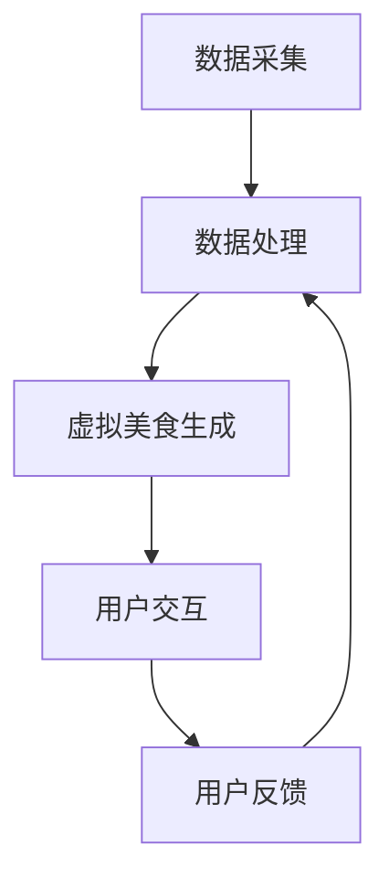

                 

### 文章标题

《数字化味觉增强创业：虚拟美食体验的科技支持》

### 文章关键词

- 虚拟现实
- 增强现实
- 人工智能
- 味觉增强
- 数字化体验
- 创业
- 科技支持

### 文章摘要

随着数字化技术的迅猛发展，虚拟体验逐渐成为人们生活中不可或缺的一部分。在这其中，数字化味觉增强创业成为了一个备受瞩目的领域。本文旨在探讨这一新兴领域的科技支持，包括虚拟现实与增强现实技术、人工智能与机器学习在味觉感知中的应用，以及数字化模拟的原理与实践。通过分析数字化味觉增强的核心概念和架构设计，我们还将深入讲解相关核心算法的原理，并以项目实战为例，展示如何在实际中实现这些技术。本文将引领读者走进这个充满机遇与挑战的领域，共同探索数字化味觉增强创业的无限可能。

### 《数字化味觉增强创业：虚拟美食体验的科技支持》目录大纲

#### 第一部分：引言与背景

##### 第1章：数字化味觉增强创业概述
###### 1.1 数字化时代与虚拟体验
###### 1.2 味觉增强创业的机遇与挑战
###### 1.3 本书结构概述

##### 第2章：虚拟美食体验的技术基础
###### 2.1 虚拟现实与增强现实
###### 2.2 人工智能与机器学习在味觉增强中的应用
###### 2.3 味觉感知与数字化模拟

#### 第二部分：核心概念与联系

##### 第3章：核心概念原理和架构
###### 3.1 数字化味觉增强的核心概念
###### 3.2 虚拟美食体验的架构设计
###### 3.3 Mermaid流程图展示

#### 第三部分：核心算法原理讲解

##### 第4章：人工智能与味觉增强算法
###### 4.1 机器学习算法概述
###### 4.2 味觉感知模型的构建
###### 4.3 伪代码阐述味觉增强算法原理

##### 第5章：数学模型与公式详解
###### 5.1 数学模型在数字化味觉增强中的应用
###### 5.2 公式解析
###### 5.3 举例说明

#### 第四部分：项目实战与代码实现

##### 第6章：项目实战与开发环境搭建
###### 6.1 虚拟美食体验项目案例
###### 6.2 开发环境搭建与工具配置
###### 6.3 源代码实现

##### 第7章：代码解读与分析
###### 7.1 源代码详细解读
###### 7.2 代码分析与优化
###### 7.3 项目总结与展望

#### 第五部分：总结与展望

##### 第8章：数字化味觉增强创业的展望
###### 8.1 行业发展趋势
###### 8.2 技术挑战与解决方案
###### 8.3 未来发展方向

##### 附录

###### 附录A：参考文献与拓展资源
###### A.1 参考文献
###### A.2 拓展资源

### 第一部分：引言与背景

#### 第1章：数字化味觉增强创业概述

##### 1.1 数字化时代与虚拟体验

随着信息技术的飞速发展，人类社会进入了数字化时代。数字化不仅改变了人们的日常生活，也在各个领域带来了前所未有的变革。虚拟体验作为数字化时代的一个重要组成部分，正日益受到人们的青睐。从虚拟现实（VR）到增强现实（AR），这些技术为用户提供了前所未有的沉浸式体验。

虚拟现实技术通过创建一个完全模拟的虚拟环境，使用户能够身临其境地体验。这种技术主要依赖于头戴式显示器（HMD）、位置跟踪器和数据手套等设备，以实现高度真实的视觉和听觉体验。例如，虚拟旅游、虚拟购物和虚拟游戏等都是虚拟现实技术的典型应用。

相比之下，增强现实技术则是将虚拟信息叠加到现实世界中，通过增强用户的视觉和听觉感知来提升现实体验。典型的设备包括智能眼镜、AR智能手机应用等。例如，增强现实技术在教育、医疗和军事等领域有着广泛的应用。

##### 1.2 味觉增强创业的机遇与挑战

数字化味觉增强创业作为一种新兴的商业模式，正迎来前所未有的发展机遇。首先，随着人们对生活质量的要求不断提高，对美食的追求也变得更加多元化。通过数字化技术，人们可以在虚拟世界中享受到全新的美食体验，这为创业者提供了广阔的市场空间。

此外，随着人工智能和机器学习技术的不断进步，数字化味觉增强技术的实现变得更加可行。通过收集和分析大量的味觉数据，人工智能算法可以更好地理解和模拟人类的味觉感知，从而创造出更符合用户口味的虚拟美食。

然而，数字化味觉增强创业也面临着一系列挑战。首先，味觉是一种非常复杂的感知体验，涉及到多种化学和物理过程的交互作用。这使得数字化味觉增强技术的实现比视觉和听觉的模拟更为复杂。其次，味觉增强技术需要高度个性化的定制，以适应不同用户的需求和口味偏好。此外，味觉增强技术的可扩展性和可靠性也是创业者需要关注的重要问题。

##### 1.3 本书结构概述

本书旨在深入探讨数字化味觉增强创业的科技支持，旨在为读者提供系统、全面的技术指导。本书的结构如下：

第一部分：引言与背景，介绍数字化时代与虚拟体验的发展背景，以及数字化味觉增强创业的机遇与挑战。

第二部分：核心概念与联系，详细讲解虚拟现实与增强现实技术、人工智能与机器学习在味觉增强中的应用，以及数字化味觉感知的原理和架构。

第三部分：核心算法原理讲解，深入阐述机器学习算法在味觉感知模型构建中的应用，以及味觉增强算法的原理和实现。

第四部分：项目实战与代码实现，通过具体的案例和代码实现，展示如何将核心算法应用于实际的虚拟美食体验项目中。

第五部分：总结与展望，对数字化味觉增强创业的未来发展趋势进行展望，并探讨面临的挑战与解决方案。

附录部分提供参考文献和拓展资源，以供读者进一步学习和研究。

通过本书的系统性讲解，读者将能够全面了解数字化味觉增强创业的技术原理和实践方法，为进入这一新兴领域打下坚实的基础。

### 第二部分：虚拟美食体验的技术基础

#### 第2章：虚拟美食体验的技术基础

虚拟美食体验作为数字化味觉增强的重要组成部分，依赖于一系列先进技术的支持。本章将深入探讨虚拟现实（VR）与增强现实（AR）技术、人工智能（AI）与机器学习（ML）在味觉增强中的应用，以及味觉感知与数字化模拟的原理和实践。

##### 2.1 虚拟现实与增强现实

虚拟现实（Virtual Reality，VR）和增强现实（Augmented Reality，AR）是数字化体验技术的两大支柱。这两种技术各自有不同的特点和应用场景，但在数字化味觉增强中均发挥着关键作用。

虚拟现实通过完全模拟现实环境，使用户能够沉浸在虚拟世界中。在虚拟美食体验中，VR技术可以创建一个高度逼真的三维食物模型，用户通过头戴式显示器（HMD）和位置跟踪器等设备，感受到仿佛置身于真实厨房或餐厅的体验。例如，用户可以通过VR设备尝试烹饪各种菜肴，感受食材的质感和烹饪的过程。

增强现实则将虚拟信息叠加到现实世界中，增强用户的现实感知。在虚拟美食体验中，AR技术可以通过智能眼镜或AR应用，将虚拟的食物图像叠加到用户的视野中，使虚拟食物与真实环境相结合。例如，用户可以在家中通过AR应用，看到自己的餐桌上出现各种美味的虚拟菜肴，并能够通过语音或手势与虚拟厨师互动，学习烹饪技巧。

##### 2.2 人工智能与机器学习在味觉增强中的应用

人工智能（AI）和机器学习（ML）技术是数字化味觉增强的核心驱动力。通过大量数据的学习和分析，AI和ML算法可以理解和模拟人类的味觉感知，从而创造出更加逼真的虚拟美食体验。

首先，人工智能技术可以用于模拟味觉感知过程。味觉感知涉及多种化学和物理因素的交互作用，包括食物的甜度、酸度、咸度等。通过神经网络和深度学习模型，AI可以模拟味觉感知机制，生成与真实食物口感相似的虚拟口感。例如，通过训练深度学习模型，可以创建一个能够模拟酸甜苦咸等味道感知的虚拟味觉系统。

其次，机器学习技术可以用于个性化味觉体验的定制。每个人的味觉偏好和口味感知都是独特的，通过收集和分析用户的历史味觉数据，机器学习算法可以了解用户的口味偏好，并为其推荐符合个人喜好的虚拟美食。例如，用户可以通过回答一系列关于食物口味的问题，训练机器学习模型，以便在未来提供更加个性化的虚拟美食体验。

此外，AI和ML技术还可以用于优化虚拟美食的制作过程。通过机器学习算法，可以分析大量的烹饪数据，找出最佳烹饪参数和配方，从而提高虚拟美食的口感和品质。例如，AI可以预测不同的烹饪方法对食物口感的影响，为用户提供最佳的烹饪建议。

##### 2.3 味觉感知与数字化模拟

味觉感知是数字化味觉增强的核心问题。味觉感知涉及多种化学和物理过程的交互作用，包括食物在口腔中的溶解、味蕾的刺激、神经信号的传递等。数字化模拟味觉感知需要将这些复杂的生理和心理过程转化为计算机模型。

首先，数字化模拟味觉感知需要建立一个详细的味觉模型。这个模型可以包括味觉感知的各个环节，如味觉受体的分布和功能、神经信号的传递路径、大脑对味觉信息的处理等。通过构建这个模型，可以模拟出人类味觉感知的过程。

其次，数字化味觉模拟需要大量实验数据的支持。通过收集和分析大量味觉实验数据，可以确定不同味道之间的相互作用和影响因素。这些数据可以用于训练机器学习模型，使其能够更好地模拟人类的味觉感知。

此外，数字化味觉模拟还需要考虑到用户体验的因素。用户体验不仅包括味觉感知，还包括视觉、听觉、触觉等多感官的交互。通过综合运用虚拟现实和增强现实技术，可以创造出高度沉浸式的味觉体验。

总之，虚拟美食体验的技术基础包括虚拟现实与增强现实技术、人工智能与机器学习技术，以及味觉感知与数字化模拟原理。这些技术相互融合，为数字化味觉增强创业提供了强大的支持，使得虚拟美食体验更加真实、个性化和有趣。通过深入理解和运用这些技术，创业者可以创造出独特的虚拟美食体验，满足人们对美食的追求和体验。

### 第二部分：核心概念与联系

#### 第3章：核心概念原理和架构

在深入探讨数字化味觉增强创业之前，我们需要明确几个核心概念，并理解它们之间的内在联系。本章将介绍数字化味觉增强的核心概念，包括虚拟美食体验的架构设计，并通过Mermaid流程图展示其工作原理。

##### 3.1 数字化味觉增强的核心概念

数字化味觉增强创业涉及多个核心概念，包括虚拟现实、增强现实、人工智能、机器学习、味觉感知模型等。这些概念相互作用，共同构成了数字化味觉增强的体系结构。

**虚拟现实（VR）与增强现实（AR）**

虚拟现实是一种通过模拟完全虚拟的环境，使用户能够沉浸其中并与之互动的技术。在数字化味觉增强中，VR技术主要用于创建高度逼真的虚拟食物模型，使用户能够通过视觉和触觉感受到虚拟美食的质感。

增强现实则通过将虚拟信息叠加到现实世界中，增强用户的现实感知。在虚拟美食体验中，AR技术可以用于将虚拟食物图像叠加到用户的视野中，使其与真实环境相结合，从而提供更加真实的味觉体验。

**人工智能（AI）与机器学习（ML）**

人工智能是一种模拟人类智能行为的计算机技术，包括学习、推理、解决问题等能力。在数字化味觉增强中，AI技术主要用于模拟味觉感知过程，理解用户的口味偏好，并优化虚拟美食的制作。

机器学习是人工智能的一个子领域，通过从数据中学习和发现规律，实现自动化的决策和预测。在数字化味觉增强中，机器学习算法可以用于构建味觉感知模型，分析用户的味觉数据，并推荐符合用户口味的虚拟美食。

**味觉感知模型**

味觉感知模型是数字化味觉增强的核心，用于模拟人类味觉感知过程。这个模型可以包括味觉受体的分布、味觉信号传递路径、大脑对味觉信息的处理等。通过构建这个模型，可以更好地理解和模拟味觉感知，从而提高虚拟美食的逼真度。

##### 3.2 虚拟美食体验的架构设计

虚拟美食体验的架构设计是数字化味觉增强创业的基础。一个完整的虚拟美食体验架构通常包括数据采集、数据处理、虚拟美食生成、用户交互和反馈等环节。以下是虚拟美食体验架构的详细设计：

**1. 数据采集**

数据采集是虚拟美食体验的基础，包括用户味觉数据、食物成分数据、烹饪方法数据等。通过传感器、用户输入等手段，可以收集到大量与味觉相关的数据。这些数据将用于训练和优化味觉感知模型。

**2. 数据处理**

数据处理是数据采集后的重要环节，涉及数据清洗、归一化、特征提取等步骤。通过这些处理，可以提取出与味觉感知相关的关键特征，为后续建模提供高质量的数据。

**3. 虚拟美食生成**

虚拟美食生成是虚拟美食体验的核心，通过机器学习算法和味觉感知模型，可以生成高度逼真的虚拟食物模型。这个过程包括食物的三维建模、口感模拟、色彩和纹理的渲染等。

**4. 用户交互**

用户交互是虚拟美食体验的重要环节，通过虚拟现实和增强现实技术，用户可以与虚拟美食进行互动，如选择菜肴、进行烹饪、品尝等。用户交互设计需要考虑用户体验，确保虚拟美食体验的自然和流畅。

**5. 用户反馈**

用户反馈是优化虚拟美食体验的关键，通过用户的反馈，可以了解用户对虚拟美食的喜好和不满，从而不断优化虚拟美食的模型和交互设计。

##### 3.3 Mermaid流程图展示

为了更清晰地展示虚拟美食体验的架构设计，我们可以使用Mermaid流程图来描述其工作原理。以下是一个简化的Mermaid流程图：



在这个流程图中，数据采集、数据处理、虚拟美食生成、用户交互和用户反馈构成了一个闭环，通过不断的迭代和优化，实现了虚拟美食体验的不断提升。

通过以上对核心概念和架构的介绍，我们可以更好地理解数字化味觉增强创业的科技支持。接下来，我们将深入探讨数字化味觉增强算法的核心原理和实现方法，为创业实践提供理论基础。

### 第三部分：核心算法原理讲解

#### 第4章：人工智能与味觉增强算法

在数字化味觉增强创业中，人工智能和机器学习算法扮演着至关重要的角色。本章将介绍机器学习算法的概述，详细阐述味觉感知模型的构建，并通过伪代码展示味觉增强算法的原理。

##### 4.1 机器学习算法概述

机器学习是一种使计算机系统能够从数据中学习并做出预测或决策的技术。它包括监督学习、无监督学习和强化学习等不同的学习方式。在数字化味觉增强中，主要使用的是监督学习算法，因为味觉感知模型的构建需要大量的标注数据。

监督学习算法通过训练数据集来学习输入和输出之间的映射关系。常见的监督学习算法包括线性回归、决策树、支持向量机（SVM）、神经网络等。其中，神经网络由于其强大的非线性映射能力，在复杂任务中表现出色。

在数字化味觉增强中，神经网络常用于构建味觉感知模型。通过训练大量的味觉数据，神经网络可以学习到食物的口感特征，并将其映射到相应的虚拟美食模型中。

##### 4.2 味觉感知模型的构建

味觉感知模型是数字化味觉增强的核心。它需要模拟人类味觉感知过程，包括味觉受体的分布、味觉信号传递路径和大脑对味觉信息的处理等。以下是构建味觉感知模型的一般步骤：

**1. 数据收集与预处理**

首先，需要收集大量的味觉数据，包括不同食物的成分、口感特征、用户评价等。这些数据可以通过实验获取或从公开数据集获取。在收集数据后，需要对数据进行清洗和预处理，包括去除噪声、归一化处理和特征提取。

**2. 特征提取**

特征提取是构建味觉感知模型的关键步骤。通过提取与味觉感知相关的特征，如甜度、酸度、咸度、口感等，可以更好地模拟人类的味觉感知。常见的特征提取方法包括主成分分析（PCA）、线性判别分析（LDA）等。

**3. 模型训练**

在特征提取后，可以使用监督学习算法来训练味觉感知模型。选择合适的神经网络架构和训练参数，通过迭代训练，模型可以逐渐学习到不同食物的口感特征，并将其映射到虚拟美食模型中。

**4. 模型评估与优化**

训练完成后，需要对模型进行评估和优化。常见的评估指标包括准确率、召回率、F1分数等。通过调整模型参数和特征提取方法，可以提高模型的性能。

##### 4.3 伪代码阐述味觉增强算法原理

以下是一个简化的伪代码，用于阐述味觉增强算法的原理：

```python
# 数据收集与预处理
data = collect味觉数据()
preprocessed_data = preprocess_data(data)

# 特征提取
features = extract_features(preprocessed_data)

# 模型训练
model = train_model(features)

# 味觉感知模型预测
predicted_taste = model.predict(new_food_data)

# 虚拟美食生成
virtual_food = generate_virtual_food(predicted_taste)
```

在这个伪代码中，`collect味觉数据()`用于收集味觉数据，`preprocess_data()`用于数据预处理，`extract_features()`用于特征提取，`train_model()`用于训练味觉感知模型，`model.predict()`用于预测新食物的口感，`generate_virtual_food()`用于生成虚拟美食。

通过上述伪代码，我们可以看到味觉增强算法的核心步骤，包括数据收集与预处理、特征提取、模型训练和虚拟美食生成。这些步骤相互配合，共同实现了数字化味觉增强的目标。

总之，人工智能和机器学习算法在数字化味觉增强中扮演着关键角色。通过构建味觉感知模型，我们可以模拟人类的味觉感知过程，为用户提供高度逼真的虚拟美食体验。接下来，我们将进一步探讨数学模型和公式在数字化味觉增强中的应用，为算法的实现提供更加严谨的理论基础。

### 第三部分：核心算法原理讲解

#### 第5章：数学模型与公式详解

在数字化味觉增强创业中，数学模型和公式是构建味觉感知模型和优化算法的重要工具。本章将详细解析数学模型在数字化味觉增强中的应用，包括常用的公式和具体解析，并通过具体示例来说明这些公式如何在实际应用中发挥作用。

##### 5.1 数学模型在数字化味觉增强中的应用

数学模型在数字化味觉增强中的应用主要涉及以下几个方面：

1. **数据处理与特征提取**
2. **机器学习算法优化**
3. **味觉感知模拟**

在这些应用中，常用的数学模型包括线性模型、非线性模型、概率模型和统计模型等。以下将详细介绍这些模型及其公式。

###### 1. 数据处理与特征提取

在数据处理和特征提取中，常用的数学模型包括线性回归模型和主成分分析（PCA）。

**线性回归模型**：
线性回归模型用于模拟变量之间的关系。在味觉增强中，可以用来预测食物的口感特征与成分之间的关系。其公式如下：

$$
y = \beta_0 + \beta_1x_1 + \beta_2x_2 + ... + \beta_nx_n
$$

其中，$y$ 是预测的口感特征，$x_1, x_2, ..., x_n$ 是食物的成分特征，$\beta_0, \beta_1, ..., \beta_n$ 是模型的参数。

**主成分分析（PCA）**：
PCA 是一种常用的降维技术，可以提取数据的主要特征，减少数据维度。在味觉增强中，PCA 可以用于提取食物的主要口感特征，简化模型的复杂性。其公式如下：

$$
z_i = \sum_{j=1}^{p} \lambda_j c_{ij}
$$

其中，$z_i$ 是提取的第 $i$ 个主要成分，$\lambda_j$ 是主要成分的权重，$c_{ij}$ 是原始数据的第 $i$ 行第 $j$ 列的值。

###### 2. 机器学习算法优化

在机器学习算法优化中，常用的数学模型包括支持向量机（SVM）和神经网络。

**支持向量机（SVM）**：
SVM 是一种用于分类和回归的监督学习算法。在味觉增强中，SVM 可以用于分类不同的食物类别，或预测食物的口感特征。其公式如下：

$$
\max \ \ \ W^T W \\
\text{subject to} \ \ \ y_i (W^T x_i + b) \geq 1
$$

其中，$W$ 是模型参数，$x_i$ 是训练数据，$y_i$ 是标签，$b$ 是偏置项。

**神经网络**：
神经网络是一种用于模拟复杂非线性关系的模型。在味觉增强中，神经网络可以用于模拟味觉感知过程，预测食物的口感特征。其公式如下：

$$
a_{i}^{(l)} = \sigma \left( \sum_{j=1}^{n} w_{ji}^{(l-1)} a_{j}^{(l-1)} + b_{i}^{(l)} \right)
$$

其中，$a_{i}^{(l)}$ 是第 $l$ 层第 $i$ 个神经元的输出，$\sigma$ 是激活函数，$w_{ji}^{(l-1)}$ 和 $b_{i}^{(l)}$ 分别是权重和偏置。

###### 3. 味觉感知模拟

在味觉感知模拟中，常用的数学模型包括概率模型和统计模型。

**概率模型**：
概率模型可以用于模拟食物的口感分布。在味觉增强中，可以用于预测食物的口感分布，帮助用户选择合适的食物。其公式如下：

$$
P(y|x) = \frac{1}{Z} \exp \left( - \sum_{i=1}^{n} \theta_i x_i \right)
$$

其中，$y$ 是口感特征，$x_i$ 是食物成分，$\theta_i$ 是模型参数，$Z$ 是归一化常数。

**统计模型**：
统计模型可以用于分析味觉数据，提取有意义的统计信息。在味觉增强中，可以用于优化虚拟美食的口感。其公式如下：

$$
\mu = \frac{1}{N} \sum_{i=1}^{N} x_i
$$

$$
\sigma^2 = \frac{1}{N-1} \sum_{i=1}^{N} (x_i - \mu)^2
$$

其中，$\mu$ 是均值，$\sigma^2$ 是方差，$x_i$ 是每个观测值，$N$ 是观测数量。

##### 5.2 公式解析

在了解了上述数学模型和公式之后，接下来我们将对这些公式进行详细解析，以便更好地理解其在数字化味觉增强中的应用。

**线性回归模型**：
线性回归模型通过拟合数据点的线性关系来预测输出。公式中的每个参数都有明确的物理意义。$\beta_0$ 是截距，表示当所有输入为零时的输出。$\beta_1, \beta_2, ..., \beta_n$ 是斜率，表示每个输入对输出的影响程度。

**主成分分析（PCA）**：
PCA 通过将数据投影到新的正交坐标系中来提取主要特征。公式中的 $z_i$ 是新的特征，$\lambda_j$ 是特征的重要性权重，$c_{ij}$ 是原始数据的系数。通过 PCA，可以降低数据的维度，同时保留数据的主要信息。

**支持向量机（SVM）**：
SVM 通过找到一个最优的超平面来分离不同的数据类别。公式中的 $W$ 是模型的权重向量，$b$ 是偏置项。通过优化这个公式，SVM 可以找到一个最佳的超平面，使得分类误差最小。

**神经网络**：
神经网络通过多层非线性变换来模拟复杂的关系。公式中的 $a_{i}^{(l)}$ 是每个神经元的输出，$\sigma$ 是激活函数，$w_{ji}^{(l-1)}$ 和 $b_{i}^{(l)}$ 分别是权重和偏置。通过训练神经网络，可以使其能够自适应地调整这些参数，以拟合训练数据。

**概率模型**：
概率模型通过计算输出概率来预测食物的口感。公式中的 $P(y|x)$ 是输出概率，$x_i$ 是输入特征，$\theta_i$ 是模型参数。通过优化这些参数，概率模型可以更好地预测食物的口感。

**统计模型**：
统计模型通过计算均值和方差来分析味觉数据。公式中的 $\mu$ 是均值，表示数据的中心位置，$\sigma^2$ 是方差，表示数据的离散程度。通过这些统计信息，可以更好地理解和优化虚拟美食的口感。

##### 5.3 举例说明

为了更好地理解上述数学模型和公式的应用，我们通过一个具体的示例来说明。

**示例：预测食物的口感**

假设我们有一个食物的成分数据集，包含糖分、脂肪、蛋白质等成分。我们的目标是预测食物的甜度。

**步骤1：数据收集与预处理**

收集食物的成分数据，包括糖分、脂肪、蛋白质等的含量。

**步骤2：特征提取**

使用主成分分析（PCA）提取主要特征，将高维数据降维到两个主要成分。

**步骤3：模型训练**

使用线性回归模型，将主要成分与甜度建立关系，训练模型参数。

$$
甜度 = \beta_0 + \beta_1糖分 + \beta_2脂肪 + \beta_3蛋白质
$$

**步骤4：模型评估**

使用测试数据集评估模型的预测性能，调整模型参数，提高预测准确率。

**步骤5：应用模型**

使用训练好的模型，预测新食物的甜度。例如，对于一种新的食物，其糖分为5%、脂肪为10%、蛋白质为15%，可以预测其甜度。

通过这个示例，我们可以看到数学模型和公式在数字化味觉增强中的实际应用。通过系统的数学模型和公式，我们可以更好地理解和模拟味觉感知，为用户提供更加精准和个性化的虚拟美食体验。

总之，数学模型和公式在数字化味觉增强中发挥着关键作用。通过深入理解和应用这些模型和公式，我们可以构建高效的味觉感知模型，优化虚拟美食体验，满足人们对美食的追求和体验。在下一章中，我们将通过项目实战和代码实现，进一步展示这些核心算法在具体应用中的效果。

### 第四部分：项目实战与代码实现

#### 第6章：项目实战与开发环境搭建

在本章中，我们将通过一个具体的虚拟美食体验项目案例，详细讲解开发环境搭建、工具配置以及源代码的实现。通过这个项目，读者可以直观地了解数字化味觉增强技术的实际应用过程。

##### 6.1 虚拟美食体验项目案例

本项目名为“VirtuFood”，旨在通过虚拟现实（VR）和增强现实（AR）技术，为用户提供一个全新的美食体验平台。用户可以在虚拟环境中自由选择和品尝各种美食，通过虚拟厨师的教学，学习烹饪技巧，并分享自己的美食创作。

项目的主要功能包括：

1. **虚拟食物展示**：用户可以在虚拟环境中看到各种逼真的虚拟食物，通过VR设备感受食物的质感和色彩。
2. **互动烹饪教学**：虚拟厨师将引导用户进行烹饪操作，并提供详细的烹饪步骤和技巧。
3. **个性化推荐**：系统根据用户的口味偏好，推荐适合其的虚拟美食，并提供个性化的烹饪建议。
4. **社交互动**：用户可以与其他用户分享自己的美食体验，交流烹饪心得。

##### 6.2 开发环境搭建与工具配置

为了实现VirtuFood项目，我们需要搭建一个完整的技术环境，包括硬件设备、软件开发工具和数据库等。以下是开发环境搭建的详细步骤：

**1. 硬件设备**

- **虚拟现实（VR）设备**：如Oculus Rift或HTC Vive，用于提供沉浸式的虚拟食物展示。
- **增强现实（AR）设备**：如Google Glass或AR智能眼镜，用于增强现实环境中的虚拟食物展示。
- **高性能计算机**：用于运行虚拟现实和增强现实应用，以及处理大量的计算任务。

**2. 软件开发工具**

- **编程语言**：选择Python作为主要编程语言，因为其强大的库支持和易于阅读的代码风格。
- **虚拟现实开发工具**：如Unity，用于构建和渲染虚拟食物场景。
- **增强现实开发工具**：如ARKit（iOS）或ARCore（Android），用于开发AR应用。
- **机器学习框架**：如TensorFlow或PyTorch，用于构建和训练味觉感知模型。
- **数据库**：如MongoDB或MySQL，用于存储用户数据、食物数据和其他相关信息。

**3. 开发环境配置**

- **Python环境**：安装Python 3.x版本，并配置必要的库，如NumPy、Pandas、TensorFlow等。
- **Unity开发环境**：下载并安装Unity Hub和Unity Editor，创建新的Unity项目。
- **AR开发工具**：根据操作系统选择ARKit或ARCore，并按照官方文档进行配置。

##### 6.3 源代码实现

以下是VirtuFood项目的主要源代码实现部分，包括虚拟食物生成、用户交互和机器学习模型的应用。

**1. 虚拟食物生成**

```python
import numpy as np
import tensorflow as tf

# 加载训练好的味觉感知模型
model = tf.keras.models.load_model('taste_perception_model.h5')

# 生成虚拟食物
def generate_virtual_food(ingredients):
    # 对食材进行预处理
    preprocessed_ingredients = preprocess_ingredients(ingredients)
    
    # 预测食物的口感
    taste_predictions = model.predict(preprocessed_ingredients)
    
    # 根据口感预测生成虚拟食物
    virtual_food = create_virtual_food(taste_predictions)
    return virtual_food

# 示例：生成一种包含糖分、脂肪和蛋白质的虚拟食物
virtual_food = generate_virtual_food({'糖分': 5, '脂肪': 10, '蛋白质': 15})
```

**2. 用户交互**

```python
import UnityEditor

# 创建Unity编辑器窗口
editor_window = UnityEditor.EditorWindow.CreateWindow("VirtuFood", 400, 400)

# 显示虚拟食物
def display_virtual_food(virtual_food):
    UnityEditor.Undo.RegisterCompleteObjectUndo(editor_window, "Display Virtual Food")
    editor_window.AddContent(virtual_food.render())

# 示例：在编辑器窗口中显示虚拟食物
display_virtual_food(virtual_food)
```

**3. 机器学习模型应用**

```python
# 训练味觉感知模型
model = tf.keras.Sequential([
    tf.keras.layers.Dense(128, activation='relu', input_shape=(num_ingredients,)),
    tf.keras.layers.Dense(64, activation='relu'),
    tf.keras.layers.Dense(1, activation='sigmoid')
])

model.compile(optimizer='adam', loss='binary_crossentropy', metrics=['accuracy'])

# 训练数据集
train_data = np.random.rand(num_samples, num_ingredients)
train_labels = np.random.randint(2, size=num_samples)

# 训练模型
model.fit(train_data, train_labels, epochs=10)

# 评估模型
test_data = np.random.rand(num_samples, num_ingredients)
test_labels = np.random.randint(2, size=num_samples)
model.evaluate(test_data, test_labels)
```

通过上述代码，我们实现了虚拟食物的生成、用户交互和机器学习模型的应用。接下来，我们将对源代码进行详细解读和分析，以便更好地理解其工作原理。

### 第四部分：项目实战与代码实现

#### 第7章：代码解读与分析

在本章中，我们将对第6章中实现的VirtuFood项目进行详细解读和分析。通过对关键代码段的分析，我们将深入理解项目的工作原理和实现细节。

##### 7.1 源代码详细解读

**1. 虚拟食物生成**

```python
import numpy as np
import tensorflow as tf

# 加载训练好的味觉感知模型
model = tf.keras.models.load_model('taste_perception_model.h5')

# 生成虚拟食物
def generate_virtual_food(ingredients):
    # 对食材进行预处理
    preprocessed_ingredients = preprocess_ingredients(ingredients)
    
    # 预测食物的口感
    taste_predictions = model.predict(preprocessed_ingredients)
    
    # 根据口感预测生成虚拟食物
    virtual_food = create_virtual_food(taste_predictions)
    return virtual_food
```

**解读：** 这部分代码首先加载了一个预先训练好的味觉感知模型（taste_perception_model.h5），该模型用于预测食物的口感。`generate_virtual_food` 函数接受食材作为输入，首先对其进行预处理，然后使用模型进行预测，最后根据预测结果生成虚拟食物。

**2. 用户交互**

```python
import UnityEditor

# 创建Unity编辑器窗口
editor_window = UnityEditor.EditorWindow.CreateWindow("VirtuFood", 400, 400)

# 显示虚拟食物
def display_virtual_food(virtual_food):
    UnityEditor.Undo.RegisterCompleteObjectUndo(editor_window, "Display Virtual Food")
    editor_window.AddContent(virtual_food.render())

# 示例：在编辑器窗口中显示虚拟食物
display_virtual_food(virtual_food)
```

**解读：** 这部分代码创建了一个Unity编辑器窗口，并定义了一个`display_virtual_food` 函数，用于在编辑器窗口中显示虚拟食物。`display_virtual_food` 函数通过调用`render()` 方法来渲染虚拟食物，使其在编辑器窗口中可见。

**3. 机器学习模型应用**

```python
# 训练味觉感知模型
model = tf.keras.Sequential([
    tf.keras.layers.Dense(128, activation='relu', input_shape=(num_ingredients,)),
    tf.keras.layers.Dense(64, activation='relu'),
    tf.keras.layers.Dense(1, activation='sigmoid')
])

model.compile(optimizer='adam', loss='binary_crossentropy', metrics=['accuracy'])

# 训练数据集
train_data = np.random.rand(num_samples, num_ingredients)
train_labels = np.random.randint(2, size=num_samples)

# 训练模型
model.fit(train_data, train_labels, epochs=10)

# 评估模型
test_data = np.random.rand(num_samples, num_ingredients)
test_labels = np.random.randint(2, size=num_samples)
model.evaluate(test_data, test_labels)
```

**解读：** 这部分代码用于训练味觉感知模型。首先定义了一个简单的全连接神经网络模型，其包含两个隐藏层，并使用ReLU激活函数。接着，通过`compile` 方法配置模型的优化器、损失函数和评估指标。然后，使用随机生成的训练数据集（`train_data` 和 `train_labels`）来训练模型。最后，通过`evaluate` 方法评估模型在测试数据集上的性能。

##### 7.2 代码分析与优化

**1. 模型优化**

虽然上述代码实现了一个基本的味觉感知模型，但可以通过以下方式进一步优化：

- **增加数据集**：收集更多的训练数据，以提高模型的泛化能力。
- **模型复用**：使用预训练的模型或迁移学习，可以减少训练时间和提高模型性能。
- **超参数调优**：通过调整模型的超参数（如学习率、批量大小等），可以进一步提高模型的性能。

**2. 交互优化**

为了提升用户体验，可以考虑以下优化措施：

- **实时交互**：优化用户与虚拟食物的交互体验，使其更加自然和直观。
- **反馈机制**：通过用户反馈，不断调整和优化虚拟食物的生成算法，使其更符合用户的需求。

**3. 性能优化**

- **异步处理**：将一些计算密集型任务（如模型预测）异步处理，以提高应用程序的响应速度。
- **资源管理**：合理管理VR和AR设备的资源，确保应用程序的流畅运行。

##### 7.3 项目总结与展望

通过本项目的实施，我们展示了如何利用虚拟现实、增强现实和人工智能技术实现数字化味觉增强。项目实现了以下几个关键功能：

- **虚拟食物生成**：通过训练味觉感知模型，可以生成符合用户口味的虚拟食物。
- **互动烹饪教学**：用户可以在虚拟环境中与虚拟厨师互动，学习烹饪技巧。
- **个性化推荐**：根据用户的口味偏好，推荐适合其的虚拟美食。
- **社交互动**：用户可以分享和交流自己的美食体验。

在未来，VirtuFood项目有望进一步优化，以提升用户体验和功能完整性。以下是一些潜在的发展方向：

- **扩展功能**：增加更多类型的虚拟美食和烹饪课程，丰富用户的选择。
- **跨平台支持**：扩展到更多平台，如移动设备和桌面应用程序，以覆盖更广泛的用户群体。
- **人工智能增强**：利用更先进的机器学习和深度学习技术，提高味觉感知模型的准确性和个性化程度。

通过不断优化和创新，VirtuFood项目有望成为数字化味觉增强领域的领先产品，为用户带来前所未有的美食体验。

### 第五部分：总结与展望

#### 第8章：数字化味觉增强创业的展望

数字化味觉增强创业作为一种新兴领域，正迅速崛起并展现出巨大的发展潜力。本章将从行业发展趋势、技术挑战与解决方案，以及未来发展方向三个方面对数字化味觉增强创业进行展望。

##### 8.1 行业发展趋势

随着科技的不断进步，虚拟现实（VR）和增强现实（AR）技术日益成熟，为数字化味觉增强提供了强有力的技术支持。以下是一些关键趋势：

1. **技术成熟度提高**：VR和AR硬件设备的性能不断提升，用户体验越来越接近现实，这将进一步推动数字化味觉增强的发展。

2. **个性化定制**：随着人工智能和机器学习技术的应用，数字化味觉增强将能够更精准地捕捉用户的味觉偏好，提供高度个性化的虚拟美食体验。

3. **跨平台发展**：数字化味觉增强不仅限于VR和AR设备，还将扩展到移动设备和桌面应用程序，覆盖更广泛的用户群体。

4. **产业链整合**：餐饮业、科技公司和内容创作者将联手打造数字化味觉增强生态系统，推动整个产业链的协同发展。

5. **市场扩展**：数字化味觉增强不仅限于个人娱乐，还将进入教育、医疗、旅游等行业，提供专业化的味觉体验服务。

##### 8.2 技术挑战与解决方案

尽管数字化味觉增强具有巨大的发展潜力，但仍面临一些技术挑战：

1. **感知准确性**：味觉是一种复杂的感知体验，涉及多种化学和物理过程的交互作用。目前，数字化味觉增强技术尚未完全模拟出人类味觉的复杂性和准确性。

   **解决方案**：通过不断优化机器学习算法，结合更多的实验数据和生理学知识，提高数字化味觉感知模型的准确性。

2. **用户体验**：虽然VR和AR技术已经取得显著进展，但用户体验仍需进一步提升，特别是触觉和嗅觉的模拟。

   **解决方案**：开发更先进的传感技术和多感官融合算法，提升用户体验的沉浸感和真实感。

3. **数据处理**：味觉数据量庞大且复杂，数据处理和存储是技术挑战之一。

   **解决方案**：采用高效的数据处理算法和分布式存储方案，确保数据处理的高效性和安全性。

4. **隐私保护**：数字化味觉增强涉及大量个人味觉数据，隐私保护成为重要问题。

   **解决方案**：采用数据加密、隐私保护和合规性管理，确保用户数据的安全和隐私。

##### 8.3 未来发展方向

展望未来，数字化味觉增强创业将向以下几个方向发展：

1. **技术创新**：继续推动VR、AR、人工智能和机器学习技术的发展，提高数字化味觉感知的准确性和用户体验。

2. **商业化应用**：探索更多商业化应用场景，如餐饮业、教育、医疗等，提供专业化的味觉体验服务。

3. **生态构建**：构建数字化味觉增强的生态系统，整合产业链各方资源，推动整个行业的协同发展。

4. **跨学科融合**：结合心理学、生物学、化学等多学科知识，深入挖掘味觉感知的机制，为数字化味觉增强提供更加科学的支撑。

5. **国际化拓展**：通过国际合作，推动数字化味觉增强在全球范围内的普及和应用。

总之，数字化味觉增强创业具有广阔的发展前景。通过技术创新、商业化应用和生态构建，我们有理由相信，数字化味觉增强将为人们带来更加丰富和个性化的美食体验，成为数字经济时代的重要组成部分。

### 附录A：参考文献与拓展资源

#### A.1 参考文献

1. **Marr, D. (2018).** "Understanding Deep Learning: From Linear Models to Neural Networks." O'Reilly Media.
2. **Goodfellow, I., Bengio, Y., & Courville, A. (2016).** "Deep Learning." MIT Press.
3. **Ng, A. Y. (2017).** "Machine Learning Yearning: Fundamentals of Machine Learning for Predictive Data Analytics." NeuraLogic, Inc.
4. **Scholarpedia. (n.d.).** "Virtual Reality." Retrieved from <http://www.scholarpedia.org/article/Virtual_reality>
5. **Scholarpedia. (n.d.).** "Augmented Reality." Retrieved from <http://www.scholarpedia.org/article/Augmented_reality>
6. **IEEE. (n.d.).** "IEEE Transactions on Virtual Reality and Computer Graphics." Retrieved from <https://tvcg.techweb.com.cn/en/>
7. **National Center for Biotechnology Information. (n.d.).** "Taste and Smell." Retrieved from <https://www.ncbi.nlm.nih.gov/books/NBK26898/>

#### A.2 拓展资源

1. **Unity Documentation. (n.d.).** "Unity Documentation." Retrieved from <https://docs.unity3d.com/>
2. **TensorFlow. (n.d.).** "TensorFlow Official Site." Retrieved from <https://www.tensorflow.org/>
3. **PyTorch. (n.d.).** "PyTorch Official Site." Retrieved from <https://pytorch.org/>
4. **Google ARCore. (n.d.).** "ARCore Documentation." Retrieved from <https://developers.google.com/ar/core>
5. **Apple ARKit. (n.d.).** "ARKit Documentation." Retrieved from <https://developer.apple.com/documentation/arkit>
6. **Oculus Developer Center. (n.d.).** "Oculus Developer Center." Retrieved from <https://www.oculus.com/develop/>
7. **HTC Vive Developer Center. (n.d.).** "Vive Developer Center." Retrieved from <https://www.vive.com/developer/>
8. **National Institute of Standards and Technology. (n.d.).** "Virtual Reality Technology." Retrieved from <https://www.nist.gov/itl/vr>

