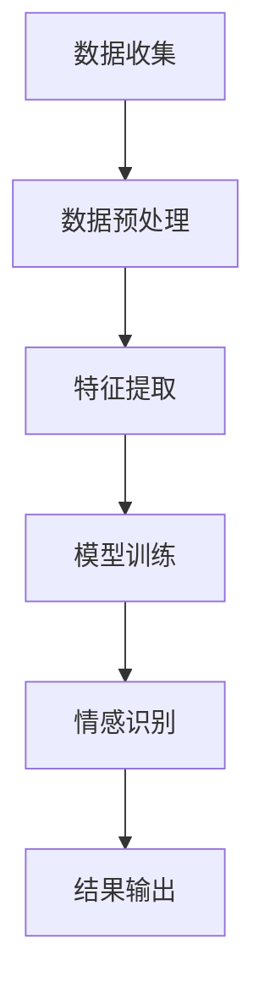

                 

# 文章标题：数字化情感修复创业：AI辅助的关系治愈

> 关键词：数字化情感修复，人工智能，情感计算，关系治愈，AI辅助技术

> 摘要：本文探讨了数字化情感修复的背景和意义，分析了AI在情感修复中的应用，深入介绍了情感计算与情感识别的原理和算法，并通过项目实战展示了AI辅助情感修复的实际应用。同时，文章还探讨了数字化情感修复的发展趋势、伦理问题以及社会责任，为创业者提供了有价值的参考。

## 目录

## 第一部分：数字化情感修复概述

### 第1章：数字化情感修复的背景与意义

#### 1.1 数字化时代与情感健康

#### 1.2 情感健康的重要性

#### 1.3 数字化情感修复的需求

### 第2章：AI与情感修复的关系

#### 2.1 AI技术简介

#### 2.2 AI在情感修复中的应用场景

#### 2.3 AI与情感健康的联系

## 第二部分：AI辅助情感修复技术原理

### 第3章：情感计算与情感识别

#### 3.1 情感计算的定义与原理

#### 3.2 情感识别的方法与算法

#### 3.3 伪代码示例：情感识别算法实现

### 第4章：情感分析模型与算法

#### 4.1 情感分析模型概述

#### 4.2 情感分析算法原理

#### 4.3 情感分析算法的优化策略

### 第5章：情感预测与情绪调节

#### 5.1 情感预测的基本概念

#### 5.2 情绪调节的方法与策略

#### 5.3 伪代码示例：情感预测与情绪调节实现

## 第三部分：AI辅助情感修复项目实践

### 第6章：数字化情感修复项目规划

#### 6.1 项目目标与需求分析

#### 6.2 项目实施步骤与计划

#### 6.3 项目风险管理

### 第7章：AI辅助情感修复平台搭建

#### 7.1 系统架构设计

#### 7.2 技术选型与开发环境

#### 7.3 平台功能模块划分

### 第8章：情感修复算法开发与优化

#### 8.1 情感修复算法的设计

#### 8.2 算法实现与调试

#### 8.3 算法优化策略与效果评估

### 第9章：情感修复项目的应用与效果评估

#### 9.1 情感修复项目的应用案例

#### 9.2 项目效果评估方法

#### 9.3 项目效果分析与总结

## 第四部分：未来展望与挑战

### 第10章：数字化情感修复的发展趋势

#### 10.1 技术发展趋势

#### 10.2 行业发展前景

#### 10.3 未来研究方向

### 第11章：数字化情感修复的伦理与社会责任

#### 11.1 情感修复技术的伦理问题

#### 11.2 情感修复技术的社会责任

#### 11.3 情感修复技术的可持续发展

## 附录

### 附录A：常用情感分析工具与库

#### A.1 自然语言处理工具

#### A.2 情感分析库

#### A.3 情感分析数据集

### 附录B：情感修复算法伪代码示例

#### B.1 情感识别算法

#### B.2 情感分析算法

#### B.3 情感预测与情绪调节算法

## 第一部分：数字化情感修复概述

### 第1章：数字化情感修复的背景与意义

#### 1.1 数字化时代与情感健康

随着数字化时代的到来，人们的社交方式、工作方式以及生活方式都发生了巨大的变化。人们在享受数字化带来的便捷的同时，也面临着新的挑战，其中之一就是情感健康问题。数字化时代的特点主要表现为：

1. **信息过载**：数字化使得人们接触到的信息量急剧增加，可能导致人们无法有效地处理和应对这些信息，产生焦虑和压力。
2. **社交距离**：虽然数字化工具让人们可以随时随地与朋友、家人沟通，但实际的情感交流却在减少，导致孤独感和疏离感的增加。
3. **虚拟与现实混淆**：数字化环境中的虚拟世界与现实世界之间的界限变得模糊，人们可能难以区分虚拟体验和真实体验，导致情感混乱。

情感健康是指个体在情感方面保持良好的状态，包括情感的识别、表达、调节和适应。情感健康的重要性体现在以下几个方面：

1. **心理健康**：情感健康与心理健康密切相关。良好的情感状态有助于缓解压力、提高生活质量，预防抑郁症、焦虑症等心理疾病。
2. **社会关系**：情感健康有助于建立和维护良好的人际关系。通过有效表达情感，个体能够与他人建立更深层次的联系，增强社会支持网络。
3. **工作效率**：情感健康有助于提高工作效率。情绪稳定的个体能够更好地应对工作挑战，减少错误和失误。

#### 1.2 情感健康的重要性

情感健康的重要性不仅体现在个体层面，也对社会产生了深远的影响。以下是情感健康对个体和社会的重要性：

1. **个体层面**：
   - **情感表达**：情感健康使个体能够自由地表达情感，无论是积极的还是消极的情感，这有助于情感的自然流动和平衡。
   - **情感调节**：情感健康使个体能够有效地调节情绪，适应不同情境的需求，避免情绪的极端波动。
   - **自我认知**：情感健康有助于个体更好地了解自己，包括自己的情感需求、情感反应模式等，从而促进个人成长。

2. **社会层面**：
   - **社会和谐**：情感健康有助于社会成员之间建立和谐的关系，减少冲突和误解，增强社会凝聚力。
   - **经济发展**：情感健康有助于提高劳动生产率，减少员工流失率和工作压力，从而促进经济发展。
   - **教育质量**：情感健康的个体更容易适应学校环境，积极参与教育活动，提高教育质量。

#### 1.3 数字化情感修复的需求

数字化情感修复的需求源于数字化时代带来的情感健康挑战。以下是数字化情感修复需求的主要方面：

1. **个性化和精准化**：由于每个人的情感需求不同，数字化情感修复需要提供个性化的服务和解决方案，以满足个体的独特需求。
2. **实时性和高效性**：数字化环境要求情感修复服务能够实时响应，提供高效的情感分析和支持。
3. **隐私保护**：数字化情感修复需要严格保护用户的隐私，确保用户数据的安全和保密。
4. **跨领域应用**：数字化情感修复技术需要应用于多个领域，如心理健康、客户服务、教育等，以解决不同场景中的情感健康问题。

### 第2章：AI与情感修复的关系

#### 2.1 AI技术简介

人工智能（AI）是计算机科学的一个分支，旨在创建能够执行通常需要人类智能才能完成的任务的系统。AI技术主要包括以下几个方面：

1. **机器学习**：机器学习是一种通过数据学习模式的技术，使计算机能够从经验中学习并改进其性能。
2. **深度学习**：深度学习是机器学习的一个子领域，它使用多层神经网络来模拟人类大脑的学习过程。
3. **自然语言处理**：自然语言处理是一种使计算机能够理解、生成和处理人类语言的技术。
4. **计算机视觉**：计算机视觉是一种使计算机能够“看”和“理解”图像和视频的技术。

AI技术的发展历史可以追溯到20世纪50年代，随着计算能力和算法的进步，AI技术逐渐应用于各个领域，包括医疗、金融、交通等。在情感计算领域，AI技术已经成为研究和应用的重要工具。

#### 2.2 AI在情感修复中的应用场景

AI技术在情感修复领域有着广泛的应用，以下是一些主要的应用场景：

1. **情感识别**：AI可以分析语音、文本和面部表情，识别用户的情感状态，为情感修复提供数据支持。
2. **情感分析**：AI可以分析大量的文本数据，了解用户的情感倾向，帮助用户更好地理解自己的情感。
3. **情感预测**：AI可以基于历史数据和当前状态，预测用户的未来情感变化，为情感修复提供预警。
4. **情绪调节**：AI可以通过提供个性化的建议和干预，帮助用户调节情绪，缓解情感困扰。
5. **心理健康诊断**：AI可以辅助医生进行心理健康诊断，通过分析患者的情感数据，提供诊断建议。

#### 2.3 AI与情感健康的联系

AI与情感健康之间存在紧密的联系。首先，AI技术可以提供情感健康评估和监测的工具，帮助用户了解自己的情感状态。其次，AI可以通过情感分析和情感预测，提供个性化的情感修复建议，提高情感健康水平。此外，AI还可以在心理健康治疗中发挥作用，辅助医生进行诊断和治疗。

AI在情感健康中的应用具有以下优势：

1. **个性化**：AI可以根据用户的个性化数据，提供定制化的情感修复方案。
2. **实时性**：AI可以实时分析情感数据，提供及时的情感支持。
3. **高效性**：AI可以处理大量数据，提高情感修复的效率。
4. **可扩展性**：AI技术可以应用于不同的领域和场景，具有广泛的应用前景。

总之，AI技术在情感修复领域具有巨大的潜力，通过不断的研究和应用，有望为人们的情感健康带来更多的好处。## 第二部分：AI辅助情感修复技术原理

### 第3章：情感计算与情感识别

#### 3.1 情感计算的定义与原理

情感计算（Affective Computing）是人工智能领域的一个分支，旨在使计算机能够识别、理解、处理和模拟人类情感。情感计算的核心思想是使计算机具备情感智能，能够更好地与人类互动，提高人机交互的自然性和有效性。

情感计算的定义可以从以下几个方面来理解：

1. **情感的识别**：情感计算系统可以通过分析用户的行为、语音、面部表情、生理信号等，识别用户的情感状态。
2. **情感的理解**：情感计算系统不仅能够识别情感，还能理解情感的产生原因和背景，从而提供更加精确的交互。
3. **情感的处理**：情感计算系统可以根据识别和理解的情感，采取相应的处理措施，如调整交互方式、提供情感支持等。
4. **情感的模拟**：情感计算系统可以通过生成情感响应，模拟人类的情感表现，提高人机交互的亲和力。

情感计算的基本原理包括以下几个方面：

1. **多模态数据处理**：情感计算系统通常需要处理多种类型的数据，如文本、语音、图像和生理信号等。通过多模态数据的整合，系统能够更全面地了解用户的情感状态。
2. **情感模型**：情感计算系统依赖于情感模型，这些模型可以基于机器学习、深度学习等技术，对输入数据进行情感分析和分类。
3. **情感交互**：情感计算系统不仅能够识别和理解情感，还能与人类进行情感交互，通过反馈机制调整自己的行为。

#### 3.2 情感识别的方法与算法

情感识别是情感计算中的重要任务，它旨在从多种类型的数据源中识别出情感状态。以下是几种常见的情感识别方法：

1. **基于文本的情感识别**：这种方法通过分析文本内容中的词汇、语法和语义信息，来判断文本表达的情感。常见的算法包括情感词典、情感极性分类和情感强度分析。

2. **基于语音的情感识别**：这种方法通过分析语音信号中的声学特征，如音调、音量、节奏等，来判断语音表达的情感。常见的算法包括声学特征提取、频谱分析和情感分类。

3. **基于图像的情感识别**：这种方法通过分析图像中的面部表情、姿态、身体语言等，来判断图像表达的情感。常见的算法包括面部识别、姿态估计和情感分类。

4. **基于生理信号的情感识别**：这种方法通过分析生理信号，如心率、皮肤电活动、呼吸等，来判断生理状态与情感的关系。常见的算法包括生理信号预处理、特征提取和情感分类。

情感识别算法通常包括以下几个步骤：

1. **数据预处理**：对原始数据进行清洗、归一化等处理，以提高算法的性能。对于文本数据，可能包括分词、去停用词、词性标注等；对于语音和图像数据，可能包括归一化、裁剪、增强等。

2. **特征提取**：从预处理后的数据中提取有意义的特征，如文本中的关键词、语音信号的频谱特征、图像中的面部特征等。特征提取的质量直接影响到后续算法的性能。

3. **模型训练**：使用机器学习或深度学习算法，对特征进行训练，以建立一个情感分类模型。常见的模型包括朴素贝叶斯、支持向量机、决策树、神经网络等。

4. **情感识别**：使用训练好的模型对新的数据进行情感分类，判断其情感状态。这一步骤通常包括模型评估、参数调整和实时预测等。

#### 3.3 伪代码示例：情感识别算法实现

以下是一个简单的情感识别算法的伪代码示例，该示例使用文本数据，通过机器学习算法对情感进行分类。

```python
# 数据预处理
def preprocess_data(data):
    # 清洗文本数据
    data = clean_text(data)
    # 分词
    tokens = tokenize(data)
    # 去停用词
    tokens = remove_stopwords(tokens)
    return tokens

# 特征提取
def extract_features(tokens):
    # 创建词汇表
    vocabulary = create_vocabulary(tokens)
    # 将文本转换为向量
    vectorized_text = vectorize_text(tokens, vocabulary)
    return vectorized_text

# 模型训练
def train_model(features, labels):
    # 选择机器学习算法
    model = choose_model()
    # 训练模型
    model.fit(features, labels)
    return model

# 情感识别
def predict_emotion(model, text):
    # 预处理文本
    tokens = preprocess_data(text)
    # 提取特征
    features = extract_features(tokens)
    # 预测情感
    emotion = model.predict(features)
    return emotion
```

在这个伪代码中，首先对文本数据进行预处理，包括清洗、分词和去停用词。然后，通过特征提取将文本转换为向量。接着，使用机器学习算法（如朴素贝叶斯）训练模型。最后，使用训练好的模型对新的文本数据进行情感预测。

### 3.4 情感计算的Mermaid流程图

以下是一个情感计算的Mermaid流程图，展示了从数据收集、预处理、特征提取、模型训练到情感识别的全过程。



在这个流程图中，数据收集阶段获取用户产生的文本、语音、图像等数据。数据预处理阶段对原始数据进行清洗、归一化和分词等处理。特征提取阶段从预处理后的数据中提取特征。模型训练阶段使用机器学习算法训练情感分类模型。情感识别阶段使用训练好的模型对新的数据进行情感预测，最终输出结果。

### 3.5 情感计算的核心概念与联系

情感计算涉及多个核心概念，这些概念相互关联，共同构成了情感计算的理论基础。以下是情感计算的一些核心概念及其相互联系：

1. **情感**：情感是人类和动物对环境刺激的复杂心理反应，包括情绪、感觉、情感状态等。情感是情感计算的研究对象，也是情感计算系统的输入和输出。

2. **情感状态**：情感状态是指个体在某一时刻的情感体验，可以是快乐、悲伤、愤怒等。情感状态可以通过生理信号、行为、语言等方式表达。

3. **情感识别**：情感识别是情感计算的核心任务之一，旨在从多种数据源中识别出情感状态。情感识别需要通过数据预处理、特征提取、模型训练等步骤实现。

4. **情感分析**：情感分析是对文本、

