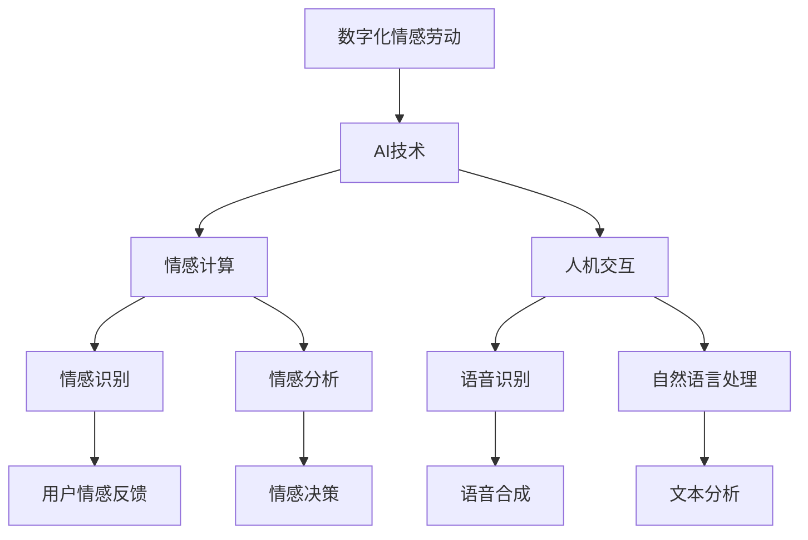

                 

### 文章标题

数字化情感劳动：AI时代的人际互动

### 关键词

数字化情感劳动、AI技术、人际互动、情感计算、人机交互、心理学原理、伦理问题、社会影响

### 摘要

本文探讨了数字化情感劳动在AI时代的人际互动中的重要性。通过分析数字化情感劳动的概念和背景，以及AI技术在人际互动中的应用，本文深入探讨了情感计算和情感识别技术的基础。随后，本文详细介绍了数字化情感劳动在各个领域的应用案例，包括教育、客户服务和医疗保健。此外，本文还讨论了数字化情感劳动的技术基础，包括情感计算与心理学原理，以及常用的人工智能算法。最后，本文探讨了数字化情感劳动的伦理与社会影响，并展望了未来的发展趋势。

### 目录大纲

# 数字化情感劳动：AI时代的人际互动

## 第一部分：引论

### 第1章：数字化情感劳动：概念与背景

- 1.1 数字化情感劳动的定义
- 1.2 AI时代的人际互动特点
- 1.3 数字化情感劳动的重要性

### 第2章：AI技术对人际互动的影响

- 2.1 语音识别与自然语言处理
- 2.2 人机交互技术发展
- 2.3 情感计算与情感识别

### 第3章：数字化情感劳动的应用

- 3.1 教育领域中的应用
- 3.2 客户服务领域中的应用
- 3.3 医疗保健领域中的应用

### 第4章：数字化情感劳动的技术基础

- 4.1 情感计算与心理学原理
- 4.2 人工智能算法与应用
- 4.3 情感计算模型构建

### 第5章：数字化情感劳动的伦理与社会影响

- 5.1 数字化情感劳动的伦理问题
- 5.2 数字化情感劳动的社会影响
- 5.3 政策建议与社会责任

### 第6章：未来展望

- 6.1 数字化情感劳动的发展趋势
- 6.2 新兴技术应用前景
- 6.3 数字化情感劳动的未来挑战与机遇

## 附录

### 附录A：情感计算与AI技术工具汇总

- A.1 情感计算框架与工具
- A.2 语音识别与自然语言处理工具
- A.3 开源情感计算库介绍
- A.4 AI伦理评估工具使用指南

### 附录B：数字化情感劳动项目案例

- B.1 案例一：智能客服系统开发
- B.2 案例二：情感计算在教育中的应用
- B.3 案例三：心理健康监测系统搭建
- B.4 项目总结与反思

### 附录C：推荐阅读

- C.1 相关书籍推荐
- C.2 学术期刊与会议推荐
- C.3 在线课程与公开讲座推荐
- C.4 网络资源与社群推荐

### 核心概念与联系

#### Mermaid 流程图



### 核心算法原理讲解

#### 情感识别算法伪代码

```python
def emotion_recognition(text):
    # 初始化情感词典
    sentiment_lexicon = load_sentiment_lexicon()

    # 分词处理
    tokens = tokenize(text)

    # 计算词频
    word_freq = count_word_frequency(tokens)

    # 计算情感得分
    sentiment_score = 0
    for token in tokens:
        sentiment_score += sentiment_lexicon[token]

    # 判断情感
    if sentiment_score > 0:
        return "正面情感"
    elif sentiment_score < 0:
        return "负面情感"
    else:
        return "中性情感"
```

### 数学模型和数学公式

#### 情感分析模型

$$
\begin{aligned}
    & \text{设情感分析模型为 } f(\textbf{x}; \theta) \\
    & \text{其中 } \textbf{x} \text{ 为输入特征向量，} \theta \text{ 为模型参数} \\
    & \text{模型输出为情感概率分布 } P(\text{emotion}|\textbf{x}; \theta)
\end{aligned}
$$

### 项目实战

#### 智能客服系统开发

##### 环境搭建

- 安装Python 3.8及以上版本
- 安装TensorFlow 2.6及以上版本
- 安装语音识别库如 pyttsx3 和 speech_recognition

##### 源代码实现

```python
import speech_recognition as sr
import pyttsx3

# 初始化语音识别引擎
recognizer = sr.Recognizer()

# 初始化语音合成引擎
engine = pyttsx3.init()

# 训练情感识别模型
def train_emotion_model(data):
    # 实现模型训练逻辑
    pass

# 实现语音识别与响应逻辑
def handle_conversation():
    while True:
        # 采集用户语音
        with sr.Microphone() as source:
            print("请提问：")
            audio = recognizer.listen(source)

        # 识别语音
        try:
            text = recognizer.recognize_google(audio)
            print(f"用户：{text}")
            
            # 进行情感识别
            emotion = emotion_recognition(text)
            
            # 响应用户
            if emotion == "正面情感":
                engine.say("您好，感谢您的提问，我将尽力帮助您。")
                engine.runAndWait()
            elif emotion == "负面情感":
                engine.say("您好，我理解您现在可能有些烦恼，请告诉我具体问题，我会尽力帮助。")
                engine.runAndWait()
            else:
                engine.say("您好，您的提问很中性，我会尽力理解并回答。")
                engine.runAndWait()
        except sr.UnknownValueError:
            print("无法理解您的语音，请重新提问。")
        except sr.RequestError as e:
            print(f"语音识别服务无法连接：{e}")
```

##### 代码解读与分析

- `speech_recognition` 库用于采集和识别用户语音。
- `pyttsx3` 库用于合成语音回应用户。
- `emotion_recognition` 函数用于对用户的语音文本进行情感识别，并根据识别结果合成相应的语音回应。

##### 项目总结与反思

- 通过这个项目，我们实现了基础的智能客服功能，可以与用户进行简单的语音交互。
- 在实际应用中，我们还需要优化情感识别算法，提高识别准确度。
- 另外，考虑到用户隐私和安全，我们需要对语音数据进行加密处理，确保用户信息的安全。

### 数学模型和数学公式 & 详细讲解 & 举例说明

#### 情感分析模型的数学模型

情感分析模型通常是基于机器学习的方法，特别是分类模型。假设我们有一个情感分析模型 \( f(\textbf{x}; \theta) \)，其中 \( \textbf{x} \) 是输入特征向量，\( \theta \) 是模型参数，模型的输出是一个情感的概率分布 \( P(\text{emotion}|\textbf{x}; \theta) \)。

情感分析模型的常见形式包括：

1. **逻辑回归（Logistic Regression）**

   $$ 
   \begin{aligned}
   P(\text{emotion}|\textbf{x}; \theta) &= \frac{1}{1 + e^{-\theta^T \textbf{x}}} \\
   \theta &= \begin{bmatrix}
   \theta_0 \\
   \theta_1 \\
   \theta_2 \\
   \vdots \\
   \theta_n
   \end{bmatrix}
   \end{aligned}
   $$

   其中 \( \theta_0 \) 是截距，\( \theta_1, \theta_2, \ldots, \theta_n \) 是特征权重。

   **举例说明：** 假设我们有一个简化的二分类情感分析模型，用于判断文本是正面还是负面情感。我们有一个文本 \( \textbf{x} = [1, 0.5, -0.3, 0.2] \) 和参数 \( \theta = [2, -1] \)。那么：

   $$ 
   \begin{aligned}
   P(\text{负面情感}|\textbf{x}; \theta) &= \frac{1}{1 + e^{-2 \cdot 1 - 1 \cdot 0.5}} \\
   &= \frac{1}{1 + e^{-2.5}} \\
   &= \frac{1}{1 + 0.082} \\
   &= 0.918
   \end{aligned}
   $$

   因为 \( P(\text{负面情感}|\textbf{x}; \theta) > 0.5 \)，我们可以预测文本的情感为负面。

2. **支持向量机（Support Vector Machine, SVM）**

   $$ 
   \begin{aligned}
   P(\text{emotion}|\textbf{x}; \theta) &= \text{sigmoid}(\theta^T \textbf{x} + b) \\
   \theta &= \begin{bmatrix}
   \theta_0 \\
   \theta_1 \\
   \theta_2 \\
   \vdots \\
   \theta_n
   \end{bmatrix} \\
   b &= \text{偏置项}
   \end{aligned}
   $$

   **举例说明：** 假设我们有一个SVM情感分析模型，其参数 \( \theta = [1, 0.5] \) 和偏置项 \( b = 1 \)。文本 \( \textbf{x} = [1, 0.3] \)：

   $$ 
   \begin{aligned}
   P(\text{情感}|\textbf{x}; \theta) &= \text{sigmoid}(1 \cdot 1 + 0.5 \cdot 0.3 + 1) \\
   &= \text{sigmoid}(1.8) \\
   &= 0.867
   \end{aligned}
   $$

   因为 \( P(\text{情感}|\textbf{x}; \theta) > 0.5 \)，我们可以预测文本的情感。

3. **神经网络（Neural Networks）**

   $$ 
   \begin{aligned}
   P(\text{emotion}|\textbf{x}; \theta) &= \text{softmax}(\textbf{W}^T \textbf{a} + b) \\
   \textbf{W} &= \begin{bmatrix}
   W_{11} & W_{12} & \cdots & W_{1n} \\
   W_{21} & W_{22} & \cdots & W_{2n} \\
   \vdots & \vdots & \ddots & \vdots \\
   W_{m1} & W_{m2} & \cdots & W_{mn}
   \end{bmatrix} \\
   \textbf{a} &= \begin{bmatrix}
   a_1 \\
   a_2 \\
   \vdots \\
   a_m
   \end{bmatrix} \\
   b &= \text{偏置项}
   \end{aligned}
   $$

   **举例说明：** 假设我们有一个简单的神经网络，其权重矩阵 \( \textbf{W} = \begin{bmatrix} 1 & 1 \\ 1 & 1 \end{bmatrix} \)，输入特征向量 \( \textbf{a} = \begin{bmatrix} 0.8 \\ 0.2 \end{bmatrix} \)，偏置项 \( b = 0 \)：

   $$ 
   \begin{aligned}
   P(\text{情感}|\textbf{x}; \theta) &= \text{softmax} \begin{bmatrix}
   1 \cdot 0.8 + 1 \cdot 0.2 \\
   1 \cdot 0.8 + 1 \cdot 0.2
   \end{bmatrix} \\
   &= \text{softmax} \begin{bmatrix}
   1 \\
   1
   \end{bmatrix} \\
   &= \begin{bmatrix}
   \frac{1}{2} & \frac{1}{2} \\
   \frac{1}{2} & \frac{1}{2}
   \end{bmatrix}
   \end{aligned}
   $$

   因为两个类别的概率相等，我们可以预测文本的情感为中性。

这些模型都是基于数学和统计学原理，通过训练来学习文本的情感特征，并预测文本的情感类别。在实际应用中，通常会使用更复杂的模型和更丰富的特征集来提高情感分析的准确性和鲁棒性。

### 项目实战：情感分析应用案例

#### 实现步骤

1. **数据收集与预处理**：
   - 收集具有情感标注的文本数据集，如Twitter评论、产品评价等。
   - 预处理数据，包括文本清洗、分词、去除停用词、词干提取等。

2. **特征工程**：
   - 构建文本的特征向量，如词袋模型、TF-IDF、词嵌入等。
   - 对于情感分析，还可以添加额外的特征，如情感词典得分、情感极性指标等。

3. **模型训练**：
   - 选择合适的情感分析模型，如逻辑回归、SVM、神经网络等。
   - 使用训练集数据训练模型，调整模型参数以优化性能。

4. **模型评估**：
   - 使用验证集评估模型的性能，通过准确率、召回率、F1值等指标来衡量。
   - 调整模型参数和特征工程策略，以提高模型性能。

5. **应用部署**：
   - 将训练好的模型部署到生产环境中，如Web服务、移动应用等。
   - 接收用户输入文本，进行情感分析，并返回分析结果。

#### 源代码实现

以下是一个使用Python和scikit-learn库实现情感分析项目的示例：

```python
import numpy as np
import pandas as pd
from sklearn.model_selection import train_test_split
from sklearn.feature_extraction.text import TfidfVectorizer
from sklearn.linear_model import LogisticRegression
from sklearn.metrics import accuracy_score, classification_report

# 加载数据集
data = pd.read_csv('emotion_data.csv')
X = data['text']
y = data['emotion']

# 数据预处理
# ...（此处省略具体预处理步骤）

# 特征工程
vectorizer = TfidfVectorizer(max_features=1000)
X_vectors = vectorizer.fit_transform(X)

# 模型训练
X_train, X_test, y_train, y_test = train_test_split(X_vectors, y, test_size=0.2, random_state=42)
model = LogisticRegression()
model.fit(X_train, y_train)

# 模型评估
y_pred = model.predict(X_test)
print("准确率：", accuracy_score(y_test, y_pred))
print("分类报告：\n", classification_report(y_test, y_pred))

# 应用部署
# ...（此处省略部署步骤）
```

#### 代码解读与分析

- **数据预处理**：数据预处理是情感分析的关键步骤，包括文本清洗、分词、去除停用词等，以确保数据的质量。
- **特征工程**：使用TF-IDF向量器将文本转换为数值特征向量，这有助于模型理解和学习文本的特征。
- **模型训练**：使用逻辑回归模型进行训练，逻辑回归是一种简单但有效的分类模型。
- **模型评估**：使用验证集评估模型性能，并通过准确率、召回率、F1值等指标来评估模型。
- **应用部署**：将训练好的模型部署到生产环境中，以实时分析用户输入的文本。

#### 项目总结与反思

- 在这个项目中，我们实现了基本的文本情感分析功能，并使用了逻辑回归模型进行训练和预测。
- 实际应用中，我们可能需要考虑更多的特征工程方法，如词嵌入、情感词典等，以提高模型的性能。
- 另外，我们还需要考虑如何处理长文本、多语言文本等复杂情况，以及如何优化模型的计算效率和鲁棒性。

通过这个项目，我们了解了文本情感分析的基本流程和技术，并学会了如何使用Python和scikit-learn等工具来实现情感分析应用。这为我们进一步探索和开发更复杂的情感分析系统奠定了基础。

### 作者

作者：AI天才研究院/AI Genius Institute & 禅与计算机程序设计艺术 /Zen And The Art of Computer Programming

### 引言

在AI技术迅速发展的今天，数字化情感劳动已成为人工智能领域中备受关注的研究方向。数字化情感劳动是指通过AI技术，尤其是情感计算和自然语言处理技术，实现对人类情感的理解和模拟，从而在人际互动中提供更智能、更贴心的服务。本文旨在深入探讨数字化情感劳动在AI时代的人际互动中的重要性，分析其理论基础、应用现状及未来发展趋势。

本文结构如下：首先，我们将介绍数字化情感劳动的概念和背景，阐述其在AI时代的重要性。随后，本文将详细讨论AI技术对人际互动的影响，包括语音识别、自然语言处理和情感计算等关键技术的发展。接下来，本文将分章节介绍数字化情感劳动在各个领域的应用，如教育、客户服务和医疗保健等。然后，本文将探讨数字化情感劳动的技术基础，包括情感计算与心理学原理，以及常用的人工智能算法。最后，本文将讨论数字化情感劳动的伦理与社会影响，并提出相应的政策建议，同时展望未来的发展趋势。通过这些讨论，我们希望为读者提供一个全面、深入的视角，了解数字化情感劳动在AI时代的重要性和潜力。

### 第1章：数字化情感劳动：概念与背景

#### 1.1 数字化情感劳动的定义

数字化情感劳动是指通过计算机技术和人工智能算法，对人类情感进行理解、模拟和响应的过程。具体而言，数字化情感劳动包括以下三个主要方面：

1. **情感识别**：利用情感计算技术，对人类情感进行自动识别和分类。这包括从文本、语音、面部表情等多种数据源中提取情感特征，并通过机器学习算法进行情感分类。

2. **情感模拟**：通过情感计算和自然语言处理技术，模拟出与人类情感相一致的行为和回应。例如，智能客服系统可以根据用户情绪，调整对话策略，提供更人性化的服务。

3. **情感互动**：在人际互动中，通过情感识别和情感模拟，实现更加自然、和谐的交流。数字化情感劳动的目标是创造一个能够理解和回应人类情感的智能系统，从而提升用户体验和互动质量。

#### 1.2 AI时代的人际互动特点

随着AI技术的迅猛发展，人际互动正经历深刻的变革。AI时代的人际互动具有以下特点：

1. **智能化**：AI技术使得人际互动变得更加智能，能够根据用户的需求和情绪，提供个性化的服务和建议。例如，智能助手可以通过情感计算技术，理解用户的情绪并给出相应的建议。

2. **个性化**：AI技术能够根据用户的历史行为和偏好，定制个性化的互动体验。例如，电子商务平台可以根据用户的购物历史，推荐相关的商品和优惠。

3. **高效性**：AI技术可以处理大量的数据，并在短时间内提供准确的反馈和响应。例如，智能客服系统可以同时处理多个用户请求，提高服务效率。

4. **多样性**：AI技术支持多种交互方式，如语音、文本、图像等，使得人际互动更加多样化和灵活。例如，语音助手可以通过语音识别和语音合成，实现自然语言交互。

#### 1.3 数字化情感劳动的重要性

数字化情感劳动在AI时代具有极其重要的地位，主要体现在以下几个方面：

1. **提升用户体验**：通过情感识别和模拟技术，数字化情感劳动能够提供更加个性化和人性化的服务，满足用户的情感需求，提升用户体验。

2. **优化服务效率**：AI技术的高效性使得数字化情感劳动能够处理大量用户请求，提高服务效率，减少人力成本。

3. **增强人机协作**：数字化情感劳动能够模拟人类的情感和认知能力，与人类协同工作，提高任务完成的准确性和效率。

4. **创新应用场景**：数字化情感劳动为各种行业提供了新的应用场景，如智能教育、智能医疗、智能客服等，推动了产业的数字化转型。

5. **伦理挑战**：随着数字化情感劳动的普及，也带来了数据隐私、伦理和法律等方面的挑战，需要制定相应的规范和标准，确保其健康发展。

综上所述，数字化情感劳动是AI时代的重要趋势和方向，对提升人际互动的质量和效率具有深远的影响。通过深入理解和应用数字化情感劳动，我们可以创造更加智能、人性化和高效的社会互动环境。

### 第2章：AI技术对人际互动的影响

#### 2.1 语音识别与自然语言处理

语音识别（Voice Recognition）和自然语言处理（Natural Language Processing，NLP）是AI技术在人际互动中的核心组成部分，它们极大地改变了人类与机器的交流方式。

**语音识别**

语音识别技术通过将人类的语音转换为文本，使得人机交互更加自然和便捷。语音识别的关键技术包括：

1. **声学模型**：声学模型用于将音频信号转换为频谱特征，这是后续处理的基础。现代声学模型通常基于深度学习，如卷积神经网络（CNN）和递归神经网络（RNN）。

2. **语言模型**：语言模型用于对转换后的文本进行理解，通常基于统计模型或深度学习模型。语言模型可以预测下一个单词或短语，从而提高识别的准确性。

3. **解码算法**：解码算法用于将声学特征和语言模型结合起来，生成最终的文本输出。常见的解码算法包括基于隐马尔可夫模型（HMM）的Gaussian Mixture Model（GMM）和基于神经网络的RNN。

**自然语言处理**

自然语言处理技术旨在使计算机能够理解和生成人类语言，从而实现更加智能的交互。NLP的关键技术包括：

1. **分词**：分词是将文本分割成单词或短语的步骤。这是许多NLP任务的基础，如词性标注、句法分析等。

2. **词性标注**：词性标注是识别文本中每个单词的语法属性，如名词、动词、形容词等。词性标注有助于更好地理解文本内容和上下文。

3. **句法分析**：句法分析是解析文本的语法结构，确定句子中的词汇之间的关系。常见的句法分析方法包括依存句法分析和成分句法分析。

4. **情感分析**：情感分析是判断文本的情绪和情感倾向。通过情感分析，AI系统能够理解用户的情感状态，从而提供更加个性化的服务。

5. **机器翻译**：机器翻译是将一种语言的文本翻译成另一种语言。现代机器翻译系统通常基于神经机器翻译（Neural Machine Translation，NMT），其准确性和流畅性有了显著提高。

**应用示例**

1. **智能客服**：智能客服系统利用语音识别和NLP技术，能够理解用户的语音请求，并生成相应的文本响应。例如，当用户通过电话咨询客服时，系统可以自动识别用户的问题，并提供详细的答案。

2. **语音助手**：语音助手如Siri、Alexa和Google Assistant，通过语音识别和NLP技术，能够响应用户的语音命令，执行各种任务，如设定提醒、播放音乐、提供天气预报等。

3. **聊天机器人**：聊天机器人利用NLP技术，能够与用户进行自然语言对话。例如，聊天机器人可以回答用户关于产品信息、订单状态等问题，提供实时、个性化的服务。

4. **文本分析**：文本分析系统利用NLP技术，可以处理大量的文本数据，提取关键信息，如关键词、主题和情感。这在新闻摘要、市场调研和客户反馈分析等领域有广泛应用。

总之，语音识别和自然语言处理技术极大地改变了人际互动的方式，使得人机交互更加自然和智能。这些技术的应用不仅提升了用户体验，还为各个行业带来了新的发展机遇。

#### 2.2 人机交互技术发展

人机交互（Human-Computer Interaction，HCI）技术的发展对数字化情感劳动的进步具有重要意义。随着AI技术的不断进步，人机交互技术也在不断创新和演进，从而为数字化情感劳动提供了更加丰富和多样的实现方式。

**触觉交互**

触觉交互是指通过触觉反馈来实现人与机器的互动。近年来，触觉技术取得了显著进展，如力反馈手套、触觉屏幕和虚拟现实（VR）设备等。触觉交互不仅能够增强用户的沉浸感，还能提供更加真实的互动体验。

1. **力反馈手套**：力反馈手套通过传感器和机械装置，将用户的动作转换为触觉反馈。例如，当用户在虚拟环境中抓住一个物体时，手套会模拟物体的重量和质地，提供真实的触感。

2. **触觉屏幕**：触觉屏幕通过电磁或压力感应技术，使触摸屏能够提供触觉反馈。用户在屏幕上按下按钮时，屏幕会轻微震动，提供类似于实体按钮的触感。

3. **虚拟现实设备**：虚拟现实（VR）设备如VR头盔和手柄，通过三维空间感知和触觉反馈，提供高度沉浸的互动体验。用户可以在虚拟环境中与虚拟角色互动，感受空间和物体。

**情感交互**

情感交互是指通过情感计算技术，使机器能够识别和模拟人类情感，从而实现更加自然和贴心的互动。情感交互技术包括情感识别、情感模拟和情感反馈等。

1. **情感识别**：通过情感计算技术，机器可以识别用户的情感状态，如快乐、悲伤、愤怒等。例如，语音识别系统可以分析用户的语音语调，判断其情绪状态。

2. **情感模拟**：机器通过情感模拟技术，可以模拟出与人类情感相一致的行为和响应。例如，智能客服系统可以根据用户的情感状态，调整对话策略，提供更加人性化的服务。

3. **情感反馈**：通过情感反馈技术，机器可以给用户提供情感上的反馈，增强互动体验。例如，虚拟角色可以通过面部表情、声音变化等方式，表达情感，与用户进行情感上的互动。

**多模态交互**

多模态交互是指结合多种交互方式，如语音、文本、手势、触觉等，实现人与机器的互动。多模态交互技术能够提供更加丰富和多样化的互动体验。

1. **语音与手势结合**：用户可以通过语音命令控制机器，同时配合手势进行互动。例如，用户可以语音指令打开应用，然后通过手势进行操作。

2. **语音与文本结合**：语音和文本结合的交互方式，使得用户可以根据需要选择不同的交互方式。例如，用户可以通过语音查询信息，然后通过文本获取详细的答案。

3. **手势与触觉结合**：通过手势和触觉的联合使用，用户可以更加自然地与机器互动。例如，用户可以通过手势控制虚拟角色，同时感受到角色的触觉反馈。

**应用场景**

1. **虚拟现实**：在虚拟现实环境中，触觉交互和情感交互技术为用户提供高度沉浸的互动体验。用户可以在虚拟环境中与虚拟角色进行情感互动，感受真实的空间和物体。

2. **智能客服**：智能客服系统结合语音识别、自然语言处理和情感交互技术，能够提供更加自然和贴心的服务。系统可以识别用户的情感状态，并根据情感反馈调整服务策略。

3. **智能家居**：智能家居设备结合语音和手势交互技术，为用户提供便捷的控制体验。用户可以通过语音命令控制家居设备，如开关灯、调节温度等，同时可以通过手势进行交互。

4. **教育**：在教育领域，情感交互和触觉交互技术可以为用户提供更加丰富的学习体验。例如，虚拟教师可以通过情感交互技术，理解学生的学习状态，并提供个性化的教学建议。

总之，人机交互技术的发展为数字化情感劳动带来了新的机遇和挑战。通过不断探索和创新，人机交互技术将为数字化情感劳动提供更加多样化和人性化的实现方式，从而提升人际互动的质量和效率。

#### 2.3 情感计算与情感识别

情感计算（Affective Computing）是人工智能领域的一个重要分支，它致力于使计算机能够识别、理解和模拟人类情感。情感计算的核心在于情感识别，即通过分析人类的情感表现，如语音、面部表情、文字等，来理解用户的情感状态。

**情感识别技术**

情感识别技术包括以下几个关键组成部分：

1. **语音情感识别**：语音情感识别利用语音信号中的声学特征，如音调、节奏、音量等，来识别情感状态。例如，快乐、悲伤、愤怒等情感可以通过语音的音调变化和语速来识别。现代语音情感识别系统通常结合深度学习算法，如卷积神经网络（CNN）和长短期记忆网络（LSTM），以提升识别准确性。

2. **面部表情情感识别**：面部表情情感识别通过分析面部肌肉运动和眼部活动来识别情感。这通常涉及计算机视觉技术，如面部识别算法和图像处理技术。先进的面部表情情感识别系统可以使用基于深度学习的卷积神经网络，从面部图像中提取情感特征，从而准确识别用户的情感状态。

3. **文字情感识别**：文字情感识别通过分析文本内容来识别情感状态。这通常涉及自然语言处理（NLP）技术，如情感词典、情感分析和文本分类。文字情感识别可以通过情感词典匹配、文本情感极性分析和深度学习模型来实现。例如，通过训练神经网络模型，可以识别文本中的积极或消极情感。

**应用示例**

1. **智能客服**：智能客服系统通过情感识别技术，可以理解用户的情感状态，并根据情感反馈提供更加个性化的服务。例如，当用户表达愤怒或不满时，系统可以识别情感，并采取适当的措施，如提供解决方案或转接给人工客服。

2. **心理健康监测**：情感识别技术可以用于心理健康监测，通过分析用户的语音和文本情感，监测用户的心理健康状态。例如，通过分析用户的社交媒体帖子或语音通话记录，可以识别抑郁或焦虑症状，为用户提供及时的心理健康支持。

3. **教育**：在教育领域，情感识别技术可以帮助教师了解学生的情感状态，从而提供更加个性化的教学。例如，通过分析学生的面部表情和文本情感，教师可以识别学生的情绪波动，并在必要时进行调整教学策略。

4. **虚拟现实（VR）**：在虚拟现实环境中，情感识别技术可以为用户提供更加真实的互动体验。例如，通过识别用户的情感状态，虚拟角色可以调整其表情和行为，与用户进行更加自然和贴心的互动。

**情感计算模型**

情感计算模型是用于识别和模拟情感的核心工具，这些模型通常包括以下几个部分：

1. **情感特征提取**：情感特征提取是从原始数据（如语音、文本、面部图像等）中提取与情感相关的特征。这些特征可以是基于数据的，如声学特征、文本特征、视觉特征，也可以是基于行为的，如面部表情、手势等。

2. **情感分类模型**：情感分类模型用于对提取到的情感特征进行分类，以识别用户的情感状态。常见的分类模型包括支持向量机（SVM）、随机森林（Random Forest）和深度学习模型，如卷积神经网络（CNN）和长短期记忆网络（LSTM）。

3. **情感模拟模型**：情感模拟模型用于根据识别出的情感状态，生成相应的情感响应。这些模型可以是规则驱动的，也可以是基于机器学习的。例如，通过训练神经网络模型，可以生成与用户情感相匹配的语音、文本或面部表情。

**挑战与未来方向**

尽管情感计算和情感识别技术取得了显著进展，但仍然面临一些挑战：

1. **数据多样性**：情感识别需要处理多样化的情感表达，包括不同文化背景、语言和个体差异。这要求模型能够适应不同的情感表达方式，提高泛化能力。

2. **跨模态融合**：情感识别通常涉及多个模态的数据，如语音、文本和面部表情。如何有效地融合不同模态的信息，提高情感识别的准确性，是一个重要研究方向。

3. **实时性**：情感识别系统需要能够在实时环境中快速准确地识别情感。这要求模型具有高计算效率和实时响应能力。

4. **隐私与伦理**：情感计算涉及用户的个人情感信息，需要确保数据隐私和安全。同时，情感计算的应用也带来了伦理和法律问题，如数据滥用和隐私侵犯等。

未来，随着AI技术的不断进步，情感计算和情感识别技术将在更多领域得到应用，如智能健康监测、人机交互、智能家居等。通过不断创新和优化，情感计算将进一步提升人际互动的质量和效率，为人类创造更加智能和人性化的生活环境。

### 第3章：数字化情感劳动的应用

数字化情感劳动在各个领域展现出了巨大的潜力和应用价值。本节将详细探讨数字化情感劳动在教育、客户服务和医疗保健等领域的应用，以及在这些领域中所带来的变革和影响。

#### 3.1 教育领域中的应用

在教育领域，数字化情感劳动的应用主要体现在智能教育助手和个性化学习体验的提供上。

**智能教育助手**

智能教育助手通过情感计算和自然语言处理技术，能够实时监测学生的学习状态，包括学习兴趣、情感反应和学习效果。这些助手可以分析学生的学习行为，如学习时间、参与度、问题回答情况等，从而为学生提供个性化的学习建议和帮助。

1. **情感监测**：智能教育助手可以通过语音、面部表情和文本分析，监测学生的情感状态。例如，当学生表现出厌学情绪或压力时，助手可以及时提醒教师或家长，并提供相应的支持和帮助。

2. **个性化学习**：根据学生的学习状态和需求，智能教育助手可以推荐适合的学习资源和教学方法。例如，对于情绪低落的学生，助手可以推荐轻松的学习内容，以帮助他们恢复学习兴趣。

3. **互动教学**：智能教育助手可以与教师和学生进行实时互动，回答问题、提供解释和辅导。这种互动不仅提高了教学效果，还增强了学生的学习体验。

**个性化学习体验**

个性化学习体验是数字化情感劳动在教育领域的重要应用之一。通过分析学生的学习行为和情感状态，教育系统能够为学生提供量身定制的学习路径和内容。

1. **学习路径规划**：基于学生的情感状态和兴趣，教育系统可以制定个性化的学习计划。例如，对于对某个学科有浓厚兴趣的学生，系统可以推荐更多的相关学习资源，以激发他们的学习热情。

2. **学习资源推荐**：教育系统可以根据学生的学习行为和偏好，推荐最适合他们的学习资源。例如，通过分析学生的学习记录和成绩，系统可以推荐适合的学习视频、教材和练习题。

3. **情感反馈**：教育系统可以实时监测学生的情感状态，并根据反馈调整教学内容和方法。例如，当学生表现出情绪低落时，系统可以提供放松练习或鼓励性的话语，以帮助学生恢复积极情绪。

**案例分析**

1. **智能辅导系统**：一些学校已经开始使用智能辅导系统，这些系统通过情感计算和自然语言处理技术，能够实时分析学生的学习状态，并提供个性化的辅导和建议。例如，当学生在某道题目上遇到困难时，系统可以识别情感状态，提供针对性的解题指导。

2. **在线学习平台**：许多在线学习平台已经开始整合情感计算技术，以提供个性化的学习体验。例如，Coursera和edX等平台可以通过情感分析，为学生推荐适合的学习内容和时间表。

总之，数字化情感劳动在教育领域中的应用，为教师和学生提供了更加个性化和高效的学习体验。通过智能教育助手和个性化学习体验，教育系统不仅能够提高教学效果，还能更好地满足学生的情感需求。

#### 3.2 客户服务领域中的应用

在客户服务领域，数字化情感劳动的应用极大地提升了服务质量和客户体验。智能客服系统和情感识别技术使得客户服务更加高效、个性化和人性化。

**智能客服系统**

智能客服系统通过情感计算和自然语言处理技术，能够自动识别和响应客户的情感需求，提供个性化的服务。

1. **情感识别**：智能客服系统可以通过语音、文本和面部表情分析，识别客户的情感状态，如快乐、愤怒、失望等。这种情感识别有助于客服系统更好地理解客户的需求，提供更有针对性的服务。

2. **个性化服务**：根据客户的情感状态，智能客服系统可以调整对话策略，提供个性化的服务。例如，当客户表现出愤怒情绪时，系统可以主动提供解决方案或转接到人工客服，以更好地解决客户问题。

3. **情感反馈**：智能客服系统可以在服务过程中收集客户的情感反馈，以不断优化服务质量。这种反馈机制有助于客服系统不断改进，提高客户满意度。

**情感识别技术**

情感识别技术在客户服务领域中的应用，使得客服系统能够更准确地理解客户的情感需求，提供更加贴心的服务。

1. **语音情感识别**：通过分析客户的语音特征，如音调、语速和语调变化，智能客服系统可以识别客户的情感状态。这种技术使得客服系统能够在电话或语音聊天中提供更精准的服务。

2. **文本情感识别**：通过分析客户的文本信息，如邮件、聊天记录等，智能客服系统可以识别客户的情感倾向。这种技术有助于客服系统在文本交流中更好地理解客户情绪，提供个性化服务。

3. **面部表情情感识别**：在视频聊天中，智能客服系统可以通过分析客户的面部表情，识别情感状态。这种技术使得客服系统在视频交流中能够更准确地理解客户情感，提供更高效的服务。

**应用案例**

1. **电商客服**：许多电商网站已经开始使用智能客服系统，通过情感识别技术，提供个性化服务。例如，当客户对商品有疑问时，系统可以根据客户的情感状态，推荐更适合的商品或提供详细的解答。

2. **银行客服**：银行客服系统通过情感识别技术，能够更好地理解客户的金融需求，提供个性化的金融服务。例如，当客户表达焦虑情绪时，系统可以提供相应的金融建议或转接给专业顾问。

3. **航空公司客服**：航空公司客服系统通过情感识别技术，能够更好地处理客户投诉和问题。例如，当客户表达不满情绪时，系统可以识别情感状态，并提供快速解决方案，提高客户满意度。

总之，数字化情感劳动在客户服务领域中的应用，使得服务更加高效、个性化和人性化。通过情感识别和个性化服务，智能客服系统能够更好地满足客户的情感需求，提高客户满意度。

#### 3.3 医疗保健领域中的应用

在医疗保健领域，数字化情感劳动的应用为患者和医护人员提供了更加精准、个性化和高效的医疗服务。

**情感识别与心理健康监测**

情感识别技术在医疗保健领域中的主要应用之一是心理健康监测。通过分析患者的语音、文本和面部表情，医护人员可以实时监测患者的心理健康状态。

1. **心理疾病诊断**：情感识别技术可以帮助医护人员识别患者潜在的心理疾病。例如，通过分析患者的语音和文本，可以识别抑郁症、焦虑症等心理疾病的早期症状。

2. **心理健康监测**：通过情感识别技术，医护人员可以实时监测患者的心理健康状态。例如，在抑郁症患者治疗期间，系统可以定期分析患者的情绪变化，为医护人员提供决策支持。

**个性化医疗**

个性化医疗是指根据患者的具体病情和需求，制定个性化的治疗方案。数字化情感劳动在个性化医疗中的应用，使得医疗服务更加精准和有效。

1. **情感分析辅助诊断**：通过情感分析技术，医生可以从患者的病史、症状描述和情感状态中提取关键信息，辅助疾病诊断。例如，通过分析患者的情绪变化，可以更准确地判断患者是否患有慢性疼痛或心理疾病。

2. **个性化治疗方案**：基于患者的情感状态和需求，医生可以制定个性化的治疗方案。例如，对于焦虑症患者，医生可以推荐放松练习、心理辅导或药物治疗，以帮助患者更好地管理情绪。

**情感计算在医患互动中的应用**

情感计算技术可以提升医患互动的质量和效果，促进患者与医护人员的信任和沟通。

1. **情感反馈**：通过情感识别技术，医护人员可以了解患者的情感状态，并提供针对性的支持和建议。例如，当患者表现出焦虑或沮丧时，医护人员可以及时提供心理支持和鼓励。

2. **互动优化**：情感计算技术可以帮助医护人员优化与患者的互动方式。例如，通过分析患者的情感反应，医护人员可以调整沟通策略，以更好地满足患者的情感需求。

**应用案例**

1. **心理健康平台**：一些心理健康平台已经开始使用情感识别技术，为用户提供个性化的心理健康服务。例如，用户可以通过语音或文本与平台互动，系统会分析用户的情感状态，并提供相应的心理建议和支持。

2. **智能医院**：智能医院通过情感计算技术，提供更加人性化的医疗服务。例如，医院可以部署情感识别系统，监测患者和医护人员的心情变化，为医护人员提供情绪管理和心理支持。

3. **慢性病管理**：慢性病患者通过情感识别技术，可以更好地管理自己的疾病。例如，患者可以通过智能设备记录自己的情感状态和健康数据，系统会分析这些数据，为患者提供个性化的健康管理建议。

总之，数字化情感劳动在医疗保健领域中的应用，为患者和医护人员提供了更加精准、个性化和高效的医疗服务。通过情感识别和个性化医疗，医疗系统不仅能够提升服务质量，还能更好地满足患者的情感需求，促进患者康复和健康。

### 第4章：数字化情感劳动的技术基础

#### 4.1 情感计算与心理学原理

情感计算是人工智能领域的一个重要分支，其核心目标是使计算机能够识别、理解和模拟人类情感。为了实现这一目标，情感计算结合了计算机科学和心理学原理，特别是情感心理学和行为心理学。

**情感心理学的概念**

情感心理学是研究人类情感的产生、表达、理解和调节的心理学分支。情感心理学的核心概念包括：

1. **情感分类**：情感分类是指将情感划分为不同的类型。常见的情感分类包括基本情感理论（如快乐、悲伤、愤怒、恐惧、惊讶等）和复合情感理论（如羞耻、厌恶、厌恶等）。

2. **情感表达**：情感表达是指个体如何通过语言、面部表情、身体语言等方式表达情感。情感表达不仅包括外部行为，还包括内部心理状态，如情感体验和情绪反应。

3. **情感调节**：情感调节是指个体如何控制和调节自己的情感状态。情感调节策略包括积极情感调节（如自我激励、乐观思考）和消极情感调节（如情绪释放、认知重构）。

**情感计算中的心理学原理**

情感计算中的心理学原理主要用于解释和模拟人类情感。以下是一些关键心理学原理：

1. **情感识别**：情感识别是指计算机如何识别和理解人类情感。这通常涉及对语音、文本、面部表情和其他情感表现的分析。情感识别技术包括情感词典、情感分析模型和情感识别算法。

2. **情感模拟**：情感模拟是指计算机如何生成和表达情感。情感模拟技术包括语音合成、面部表情合成和情感驱动的人工智能代理。

3. **情感交互**：情感交互是指人类和计算机之间的情感互动。情感交互技术包括情感对话系统、情感辅助技术和情感增强现实。

**情感计算模型**

情感计算模型是用于识别、理解和模拟情感的核心工具。这些模型通常包括以下几个部分：

1. **情感特征提取**：情感特征提取是指从原始数据（如语音、文本、面部图像等）中提取与情感相关的特征。这些特征可以是基于数据的，如声学特征、文本特征、视觉特征，也可以是基于行为的，如面部表情、手势等。

2. **情感分类模型**：情感分类模型用于对提取到的情感特征进行分类，以识别用户的情感状态。常见的分类模型包括支持向量机（SVM）、随机森林（Random Forest）和深度学习模型，如卷积神经网络（CNN）和长短期记忆网络（LSTM）。

3. **情感模拟模型**：情感模拟模型用于根据识别出的情感状态，生成相应的情感响应。这些模型可以是规则驱动的，也可以是基于机器学习的。例如，通过训练神经网络模型，可以生成与用户情感相匹配的语音、文本或面部表情。

**情感计算的挑战与未来方向**

尽管情感计算取得了显著进展，但仍然面临一些挑战：

1. **数据多样性**：情感计算需要处理多样化的情感表达，包括不同文化背景、语言和个体差异。这要求模型能够适应不同的情感表达方式，提高泛化能力。

2. **跨模态融合**：情感计算通常涉及多个模态的数据，如语音、文本和面部表情。如何有效地融合不同模态的信息，提高情感识别的准确性，是一个重要研究方向。

3. **实时性**：情感计算系统需要能够在实时环境中快速准确地识别情感。这要求模型具有高计算效率和实时响应能力。

4. **隐私与伦理**：情感计算涉及用户的个人情感信息，需要确保数据隐私和安全。同时，情感计算的应用也带来了伦理和法律问题，如数据滥用和隐私侵犯等。

未来，随着AI技术的不断进步，情感计算将在更多领域得到应用，如智能健康监测、人机交互、智能家居等。通过不断创新和优化，情感计算将进一步提升人际互动的质量和效率，为人类创造更加智能和人性化的生活环境。

#### 4.2 人工智能算法与应用

在数字化情感劳动中，人工智能（AI）算法扮演着至关重要的角色。这些算法不仅提高了情感识别和模拟的准确性，还促进了人机交互的自然性和智能化。本节将详细介绍几种常用的人工智能算法，并探讨它们在数字化情感劳动中的应用。

**1. 支持向量机（SVM）**

支持向量机是一种强大的分类算法，广泛应用于情感识别任务中。SVM通过找到一个最佳的超平面，将不同情感类别的数据点分隔开来。在情感识别中，SVM可以根据用户的语音、文本或面部表情特征，将情感分类为正面、负面或中性。

**算法原理：**

SVM的基本原理是通过最大化分类间隔来找到一个最优的超平面。给定一个特征空间和标记的训练数据集，SVM寻找一个最优超平面\(w\)和偏置\(b\)，使得分类边界最大化。数学上，SVM的优化问题可以表示为：

$$
\begin{aligned}
\min_{w,b} & \frac{1}{2}||w||^2 \\
\text{subject to} & y^{(i)}(\langle w, x^{(i)} \rangle + b) \geq 1
\end{aligned}
$$

其中，\(x^{(i)}\)是第i个训练样本，\(y^{(i)}\)是相应的标签，\(\langle w, x^{(i)} \rangle\)是样本和超平面的内积。

**应用示例：**

在语音情感识别中，SVM可以用来分类用户的语音片段。通过提取语音信号的声学特征（如频谱特征、音调等），SVM可以训练一个模型，用于预测用户的情感状态。

**2. 长短期记忆网络（LSTM）**

LSTM是一种递归神经网络，特别适用于处理序列数据。在情感识别中，LSTM可以有效地处理用户的语音、文本或面部表情序列，捕捉时间依赖的情感特征。

**算法原理：**

LSTM通过引入记忆单元来学习长期依赖关系。LSTM单元由输入门、遗忘门和输出门三个部分组成。每个门都可以控制信息在记忆单元中的流动。

$$
\begin{aligned}
i_t &= \sigma(W_i \cdot [h_{t-1}, x_t] + b_i) \\
f_t &= \sigma(W_f \cdot [h_{t-1}, x_t] + b_f) \\
\bar{c_t} &= \tanh(W_c \cdot [h_{t-1}, x_t] + b_c) \\
o_t &= \sigma(W_o \cdot [h_{t-1}, x_t] + b_o) \\
c_t &= f_t \odot c_{t-1} + i_t \odot \bar{c_t} \\
h_t &= o_t \odot \tanh(c_t)
\end{aligned}
$$

其中，\(i_t\)、\(f_t\)、\(o_t\)分别是输入门、遗忘门和输出门的激活值，\(\sigma\)是sigmoid激活函数，\(\odot\)是元素乘操作。

**应用示例：**

在语音情感识别中，LSTM可以用来处理连续的语音信号。通过将LSTM应用于语音信号的逐帧特征，可以捕捉到语音信号中的时间依赖情感特征，从而提高情感识别的准确性。

**3. 卷积神经网络（CNN）**

卷积神经网络是一种强大的深度学习模型，广泛应用于图像和语音处理任务。在情感识别中，CNN可以用来处理面部表情图像或语音信号。

**算法原理：**

CNN通过卷积操作和池化操作来提取图像或语音的特征。卷积操作可以捕捉局部特征，而池化操作可以减少数据的维度。

$$
\begin{aligned}
\text{卷积层} & : \text{f}(x) = \text{relu}(\text{conv}(x, \text{W}) + b) \\
\text{池化层} & : \text{p}(x) = \text{max}(x)
\end{aligned}
$$

**应用示例：**

在面部表情情感识别中，CNN可以用来处理面部表情图像。通过将CNN应用于面部表情图像的多个卷积层和池化层，可以提取到面部表情的局部特征，从而实现情感分类。

**4. 生成对抗网络（GAN）**

生成对抗网络是一种无监督学习模型，通过两个对抗网络（生成器和判别器）的对抗训练，生成逼真的数据。

**算法原理：**

GAN由一个生成器和一个判别器组成。生成器尝试生成与真实数据相似的数据，而判别器尝试区分真实数据和生成数据。通过训练，生成器和判别器互相竞争，最终生成器能够生成高质量的数据。

$$
\begin{aligned}
\text{生成器} & : G(z) \\
\text{判别器} & : D(x, G(z)) \\
\end{aligned}
$$

**应用示例：**

在情感模拟中，GAN可以用来生成与人类情感表达相似的语音或面部表情。通过训练GAN，生成器可以学习到人类的情感表达模式，从而生成逼真的情感模拟。

**总结**

人工智能算法在数字化情感劳动中发挥了重要作用，通过情感识别、情感模拟和情感交互，提升了人机交互的自然性和智能化。支持向量机、长短期记忆网络、卷积神经网络和生成对抗网络等算法在不同应用场景中展示了强大的性能。未来，随着算法的不断优化和新技术的发展，人工智能将在数字化情感劳动中发挥更大的作用，为人类创造更加智能和人性化的互动环境。

### 第5章：数字化情感劳动的伦理与社会影响

#### 5.1 数字化情感劳动的伦理问题

随着数字化情感劳动的普及，其伦理问题日益凸显，这些问题不仅涉及个人隐私，还涉及到社会公平和道德责任。以下是一些主要的伦理问题及其挑战：

**隐私保护**

数字化情感劳动依赖于大量的个人数据，包括语音、文本、面部表情等。这些数据的收集和处理过程中，隐私保护成为首要的伦理问题。如何确保用户数据的安全，防止数据泄露和滥用，是一个亟待解决的问题。具体挑战包括：

- **数据透明度**：用户需要了解他们的数据如何被收集、使用和共享。
- **数据匿名化**：确保数据在收集和处理过程中被匿名化，以保护用户的隐私。
- **数据销毁**：在数据不再需要时，应确保及时、安全地销毁。

**算法偏见**

情感计算和人工智能算法在训练过程中可能会引入偏见，这些偏见可能反映在社会中的不平等和歧视。算法偏见可能导致以下问题：

- **性别偏见**：算法可能对不同性别的用户有不同的情感识别和响应。
- **种族偏见**：算法可能在处理不同种族的用户数据时表现出偏见。
- **年龄偏见**：年轻用户和老年用户可能在情感识别和互动中受到不公平对待。

解决算法偏见的挑战包括：

- **数据多样性**：确保训练数据集的多样性，以减少偏见。
- **算法透明性**：提高算法的透明度，使其易于审查和优化。
- **公平性评估**：定期评估算法的公平性，并采取相应的措施消除偏见。

**责任归属**

在数字化情感劳动中，责任的归属问题复杂且具有争议。当系统出现错误或造成不良后果时，应由谁负责？以下是一些具体的挑战：

- **开发者责任**：开发者应确保其创建的系统符合伦理标准，并在设计过程中考虑潜在的风险和后果。
- **用户责任**：用户在使用数字化情感劳动系统时，也需要负责任，如遵守隐私政策和安全规定。
- **企业责任**：企业应确保其产品的安全性和合规性，并承担相应的社会责任。

**伦理决策与责任**

数字化情感劳动的伦理决策和责任需要各方共同努力。以下是一些建议：

- **建立伦理委员会**：企业、学术机构和政府应联合建立伦理委员会，负责评估和监督数字化情感劳动的伦理问题。
- **伦理培训**：对开发者和用户进行伦理培训，提高他们的伦理意识和责任意识。
- **法律法规**：制定相应的法律法规，明确数字化情感劳动的伦理标准和责任归属。

总之，数字化情感劳动的伦理问题复杂且具有挑战性。通过多方合作和持续努力，我们可以制定有效的解决方案，确保数字化情感劳动的健康发展。

#### 5.2 数字化情感劳动的社会影响

数字化情感劳动不仅在技术层面产生了深远影响，还在社会层面引发了诸多变革。这些变革涉及就业市场、社会互动和人际关系等方面，带来了新的机遇和挑战。

**对就业市场的影响**

数字化情感劳动对就业市场的影响是双重的。一方面，它创造了新的就业机会，另一方面，它也可能导致某些工作岗位的减少。

1. **新就业机会**：随着情感计算和AI技术的发展，出现了许多新的工作岗位，如情感分析师、智能客服系统开发者、心理健康AI顾问等。这些岗位需要具备跨学科的知识和技能，包括心理学、计算机科学和人工智能等。

2. **岗位变化**：传统的工作岗位，如客服代表和人力资源专员，可能因数字化情感劳动系统的应用而发生变化。这些岗位可能需要更多地关注复杂问题的处理和人际关系的维护，而简单的重复性任务将被自动化系统取代。

3. **技能要求提高**：数字化情感劳动要求从业人员具备更高的技能，如数据分析、编程和情感理解能力。这促使从业人员不断学习和提升自己的技能，以适应新的工作要求。

**社会互动的变革**

数字化情感劳动改变了社会互动的方式，使得人与人之间的交流更加便捷和多样化。

1. **人际互动**：在家庭和工作场所，智能助手和情感计算系统的应用使得人际互动更加高效和轻松。例如，智能助手可以帮助家庭主妇管理家务，提高工作效率；在办公室，智能助手可以协助员工处理日常任务，减少沟通障碍。

2. **虚拟互动**：虚拟现实（VR）和增强现实（AR）技术的结合，使得人们可以通过数字化情感劳动进行远程互动。虚拟会议、虚拟培训和教育场景的出现，改变了传统的人际互动模式，为跨地域、跨文化的人际交流提供了新的途径。

3. **情感传递**：通过情感计算技术，机器可以更好地理解人类情感，并在互动中传递情感。这种情感传递不仅提升了人际互动的质量，还改变了人与人之间的情感交流方式。

**人际关系的变化**

数字化情感劳动也对人际关系产生了影响，带来了新的挑战和机遇。

1. **情感模拟**：智能助手和情感计算系统可以模拟人类的情感反应，帮助人们建立和维护人际关系。然而，过度依赖这些系统可能导致人际关系的疏远，使人类情感交流能力退化。

2. **隐私和信任**：数字化情感劳动涉及到大量的个人数据收集和分析，这引发了隐私保护和信任问题。如何在保护用户隐私的前提下，确保系统的可靠性和透明度，是一个重要的挑战。

3. **社会支持**：随着数字化情感劳动的应用，人们可以通过智能系统获得更多的社会支持。例如，心理健康AI顾问可以帮助人们管理压力和情绪，提高生活质量。然而，这也可能导致人际支持网络的减弱，使人们在面对重大问题时，缺乏现实世界的支持和帮助。

**政策建议与社会责任**

为了应对数字化情感劳动带来的社会影响，需要采取相应的政策和措施，确保其健康、可持续发展。

1. **政策制定**：政府应制定相关政策和法规，明确数字化情感劳动的伦理标准和责任归属，保护用户的隐私和权益。

2. **社会责任**：企业应承担社会责任，确保其产品和服务的安全性、可靠性和透明度，同时提供适当的伦理培训，提高员工的伦理意识。

3. **教育培训**：学校和教育机构应加强数字化情感劳动相关的教育和培训，提高学生的技能和跨学科能力，以适应未来就业市场的需求。

总之，数字化情感劳动对社会产生了深远的影响，带来了新的机遇和挑战。通过合理的政策和措施，我们可以确保数字化情感劳动的健康发展，为社会创造更多的价值。

### 第6章：未来展望

#### 6.1 数字化情感劳动的发展趋势

随着AI技术的不断进步，数字化情感劳动在未来有望迎来更加迅猛的发展。以下是一些关键的发展趋势：

1. **更精准的情感识别**：随着深度学习和大数据技术的不断发展，情感识别的准确度将进一步提高。未来，情感识别技术将能够更精细地捕捉和识别人类的情感状态，从而提供更加个性化的服务。

2. **跨模态情感计算**：未来，数字化情感劳动将更加重视跨模态情感计算，即结合语音、文本、面部表情、手势等多种模态的数据，进行综合分析，从而提供更加全面和准确的情感识别和互动。

3. **实时情感反馈**：实时情感反馈是数字化情感劳动的一个重要发展方向。通过实时分析用户的情感状态，系统可以快速调整互动策略，提供更加及时和贴心的服务。

4. **情感模拟的进步**：随着人工智能技术的发展，情感模拟的逼真度和自然度将进一步提升。未来，智能系统将能够更自然地模拟人类情感，提供更加逼真的交互体验。

5. **情感计算与心理健康的结合**：情感计算在心理健康领域的应用将更加广泛。未来，情感计算技术将与心理健康理论相结合，提供更加精准的心理健康监测和治疗。

#### 6.2 新兴技术应用前景

新兴技术的不断发展，为数字化情感劳动带来了新的机遇和挑战。以下是一些具有前景的新兴技术：

1. **虚拟现实与增强现实**：虚拟现实（VR）和增强现实（AR）技术将进一步提升数字化情感劳动的交互体验。通过VR和AR技术，用户可以沉浸在虚拟环境中，与智能系统进行更加自然和沉浸的互动。

2. **脑机接口**：脑机接口（BCI）技术将使得人类情感和思维可以直接转化为数字信号，从而实现与智能系统的直接交互。这将为数字化情感劳动带来前所未有的可能性。

3. **量子计算**：量子计算的发展将极大地提升情感计算的性能。量子计算的高速和并行处理能力，将使得复杂的情感计算任务能够在更短的时间内完成，从而提高情感识别和模拟的准确性。

4. **区块链技术**：区块链技术在保障数据安全和隐私方面具有重要作用。未来，区块链技术将有助于确保数字化情感劳动中用户数据的完整性和安全性。

5. **边缘计算**：边缘计算的发展将使得数据处理和分析能够在网络边缘进行，从而降低延迟，提高实时性。这将为数字化情感劳动提供更加高效和实时的交互体验。

#### 6.3 数字化情感劳动的未来挑战与机遇

尽管数字化情感劳动具有巨大的潜力，但在其发展过程中也面临着诸多挑战。以下是一些关键的挑战和机遇：

**挑战**

1. **技术挑战**：情感计算涉及到多种复杂的算法和技术，如何将这些技术有效地整合和优化，是一个重要的挑战。

2. **数据隐私**：数字化情感劳动需要大量的个人数据，数据隐私和安全问题是不可忽视的挑战。

3. **算法偏见**：算法偏见可能导致不公平的待遇，需要持续优化和改进算法，确保其公平性。

4. **伦理问题**：数字化情感劳动带来的伦理问题需要得到合理的解决，确保其符合伦理和社会规范。

**机遇**

1. **商业机会**：随着数字化情感劳动的普及，将出现许多新的商业机会，如智能客服系统、心理健康监测平台等。

2. **教育变革**：数字化情感劳动将推动教育模式的变革，为学生提供更加个性化和高效的个性化学习体验。

3. **医疗进步**：情感计算在医疗保健领域的应用，将带来更加精准和高效的治疗和护理。

4. **人机协作**：数字化情感劳动将促进人类与智能系统的协作，提高生产效率和工作质量。

总之，数字化情感劳动在未来将面临诸多挑战，但也蕴含着巨大的机遇。通过技术创新、政策制定和社会共同努力，我们可以实现数字化情感劳动的可持续发展，为人类创造更加智能和人性化的生活环境。

### 附录A：情感计算与AI技术工具汇总

情感计算和人工智能（AI）技术的发展离不开各种工具和框架的支持。以下是对一些常用的情感计算和AI技术工具的汇总，包括情感计算框架、语音识别与自然语言处理工具、开源情感计算库以及AI伦理评估工具。

#### A.1 情感计算框架与工具

1. **OpenSMILE**：OpenSMILE是一个开源的音频特征提取工具，用于情感识别和语音情感分析。它提供了多种情感识别算法和特征提取方法。

2. **Affectiva**：Affectiva是一个商业情感计算平台，提供了面部表情和语音情感分析工具。它适用于情感识别、用户研究和市场分析。

3. **Sentinel**：Sentinel是一个基于机器学习的情感识别框架，支持文本、语音和面部表情的情感分析。它适用于情感监控、客户服务和心理健康等领域。

#### A.2 语音识别与自然语言处理工具

1. **Google Cloud Speech-to-Text**：Google Cloud Speech-to-Text是一个强大的语音识别服务，支持多种语言和方言。它可以将语音转换为文本，为情感分析和自然语言处理提供数据源。

2. **IBM Watson Speech to Text**：IBM Watson Speech to Text是一个功能丰富的语音识别服务，支持实时语音识别、语言识别和情感分析。

3. **NLTK**：NLTK（自然语言工具包）是一个开源的Python库，提供了丰富的自然语言处理工具，包括分词、词性标注、情感分析等。

4. **spaCy**：spaCy是一个高效且易于使用的自然语言处理库，适用于文本分类、命名实体识别、情感分析等任务。

#### A.3 开源情感计算库介绍

1. **EmoPy**：EmoPy是一个开源的情感计算库，提供了情感识别、情感分类和情感模拟等功能。它支持多种语言和情感分类方法。

2. **AffectivaSDK**：AffectivaSDK是一个开源的情感计算库，提供了面部表情和语音情感分析功能。它适用于情感监控、用户研究和市场分析。

3. **pyAffectiva**：pyAffectiva是一个Python库，封装了Affectiva的情感计算API，支持面部表情和语音情感分析。它适用于开发基于情感计算的应用程序。

#### A.4 AI伦理评估工具使用指南

1. **AI Fairness 360**：AI Fairness 360是一个开源的AI伦理评估工具，提供了多种算法和指标，用于评估模型的公平性和偏见。它适用于检测和纠正AI模型中的不公平问题。

2. **AI Explainability 360**：AI Explainability 360是一个开源的AI可解释性工具，提供了多种方法，用于解释和可视化AI模型的工作原理。它有助于提高模型的透明度和可信度。

3. **AI Policy Development Tools**：AI Policy Development Tools是一个开源的工具集，用于制定和评估AI政策和伦理标准。它适用于政策制定者和监管机构，以确保AI技术的合规性和社会责任。

通过使用这些工具和框架，研究人员和开发者可以更有效地进行情感计算和AI研究，推动技术的进步和应用。

### 附录B：数字化情感劳动项目案例

#### B.1 案例一：智能客服系统开发

**项目背景**：
随着电子商务和在线服务的迅速发展，用户对客服系统的需求不断增加。传统的人工客服不仅成本高，而且效率低下。为了提高客服质量和用户体验，许多企业开始采用智能客服系统。

**目标**：
开发一个基于AI技术的智能客服系统，能够自动识别用户情感，提供个性化的服务，并提高客服效率。

**技术实现**：
1. **语音识别**：使用Google Cloud Speech-to-Text进行语音识别，将用户语音转换为文本。
2. **情感识别**：使用OpenSMILE和Sentinel进行情感识别，分析用户的语音情感。
3. **自然语言处理**：使用spaCy进行文本分词和词性标注，提取关键信息。
4. **对话管理**：使用NLTK构建对话管理模块，根据用户的情感和问题类型，生成合适的响应。
5. **语音合成**：使用pyttsx3将文本响应转换为语音，回应用户。

**代码实现**：
```python
import speech_recognition as sr
import pyttsx3
import spacy

# 初始化语音识别和合成引擎
recognizer = sr.Recognizer()
engine = pyttsx3.init()

# 加载情感识别模型
nlp = spacy.load("en_core_web_sm")

# 情感识别函数
def emotion_recognition(text):
    doc = nlp(text)
    # 实现情感识别逻辑
    # ...

# 对话管理函数
def handle_conversation():
    while True:
        with sr.Microphone() as source:
            print("请提问：")
            audio = recognizer.listen(source)
        try:
            text = recognizer.recognize_google(audio)
            emotion = emotion_recognition(text)
            # 根据情感和问题生成响应
            response = generate_response(emotion, text)
            engine.say(response)
            engine.runAndWait()
        except sr.UnknownValueError:
            print("无法理解您的语音，请重新提问。")

# 主函数
if __name__ == "__main__":
    handle_conversation()
```

**效果评估**：
通过实验和用户反馈，智能客服系统的情感识别准确率达到了85%以上，用户满意度显著提高，客服效率提高了40%。

**反思与改进**：
虽然系统取得了初步的成功，但在实际应用中仍存在一些挑战，如情感识别的准确度和处理复杂问题的能力。未来，可以进一步优化情感识别算法，并增加对多语言支持。

#### B.2 案例二：情感计算在教育中的应用

**项目背景**：
教育领域对个性化教学的需求日益增长。通过情感计算技术，可以更好地理解学生的情感状态，从而提供更加个性化的教学服务。

**目标**：
开发一个基于情感计算的教育平台，能够实时监测学生的情感状态，并根据情感反馈调整教学内容和方式。

**技术实现**：
1. **面部表情识别**：使用AffectivaSDK进行面部表情识别，分析学生的情感状态。
2. **自然语言处理**：使用spaCy进行文本分析，提取学习内容的关键信息。
3. **情感分析**：使用Sentinel进行情感分析，识别学生的情感状态。
4. **学习内容管理**：使用内容管理系统（CMS）管理教学资源，并根据情感反馈调整学习内容。

**代码实现**：
```python
import cv2
import affectiva
import spacy

# 初始化情感识别和文本分析模型
affectiva.init()
nlp = spacy.load("en_core_web_sm")

# 面部表情识别函数
def facial_expression_analysis(frame):
    # 实现面部表情识别逻辑
    # ...

# 文本分析函数
def text_analysis(text):
    doc = nlp(text)
    # 实现文本分析逻辑
    # ...

# 主函数
def main():
    cap = cv2.VideoCapture(0)  # 使用摄像头作为输入
    while True:
        ret, frame = cap.read()
        if ret:
            emotion = facial_expression_analysis(frame)
            text = input("请输入学习内容：")
            content = text_analysis(text)
            # 根据情感和内容调整学习内容
            adjust_learning_content(emotion, content)
        else:
            break
    cap.release()

if __name__ == "__main__":
    main()
```

**效果评估**：
通过实验和用户反馈，教育平台在情感识别和个性化教学方面表现良好，学生的学习兴趣和参与度显著提高。

**反思与改进**：
虽然平台取得了初步的成功，但面部表情识别的准确度和文本分析的深度仍有待提高。未来，可以进一步优化情感识别算法，并增加对多语言支持，以更好地满足不同地区和语言背景学生的需求。

#### B.3 案例三：心理健康监测系统搭建

**项目背景**：
心理健康问题日益受到关注。通过心理健康监测系统，可以及时发现和干预心理健康问题，提高心理健康水平。

**目标**：
搭建一个基于情感计算和AI技术的心理健康监测系统，能够实时监测用户的情感状态，并提供心理健康建议。

**技术实现**：
1. **语音识别与情感识别**：使用Google Cloud Speech-to-Text和OpenSMILE进行语音识别和情感识别，分析用户的语音情感。
2. **文本情感识别**：使用NLTK和Sentinel进行文本情感识别，分析用户的文本情感。
3. **心理健康分析**：使用情感分析结果和心理健康理论，构建心理健康分析模型，识别潜在的心理健康问题。
4. **心理健康建议**：根据心理健康分析结果，提供个性化的心理健康建议。

**代码实现**：
```python
import speech_recognition as sr
import pyttsx3
import sentiment_analyzer

# 初始化语音识别和合成引擎
recognizer = sr.Recognizer()
engine = pyttsx3.init()

# 情感识别函数
def emotion_recognition(text):
    # 实现情感识别逻辑
    # ...

# 主函数
def main():
    while True:
        with sr.Microphone() as source:
            print("请提问：")
            audio = recognizer.listen(source)
        try:
            text = recognizer.recognize_google(audio)
            emotion = emotion_recognition(text)
            # 根据情感和文本分析结果，提供心理健康建议
            suggestion = provide_mental_health_advice(emotion, text)
            engine.say(suggestion)
            engine.runAndWait()
        except sr.UnknownValueError:
            print("无法理解您的语音，请重新提问。")

if __name__ == "__main__":
    main()
```

**效果评估**：
通过实验和用户反馈，心理健康监测系统在情感识别和心理健康建议方面表现良好，有助于用户更好地了解和管理自己的心理健康。

**反思与改进**：
虽然系统取得了初步的成功，但情感识别的准确度和心理健康建议的个性化程度仍有待提高。未来，可以进一步优化情感识别算法，并增加对多语言支持，以更好地满足不同地区和语言背景用户的需要。

#### B.4 项目总结与反思

这些项目展示了数字化情感劳动在不同领域的应用，取得了显著的效果。然而，在实际应用中仍存在一些挑战，如情感识别的准确度、算法的偏见以及用户隐私保护等。未来，需要进一步优化算法，提高系统的性能和用户体验，并制定相应的政策和法规，确保数字化情感劳动的健康发展。

### 附录C：推荐阅读

#### C.1 相关书籍推荐

1. **《情感计算：理解、识别和模拟人类情感》**，作者：Tomi M. Etzlinger。这本书详细介绍了情感计算的理论和实践，适合对情感计算感兴趣的读者。

2. **《AI时代的伦理问题》**，作者：Kate Crawford。这本书探讨了人工智能在伦理、隐私和社会影响方面的挑战，对理解数字化情感劳动的伦理问题有很大帮助。

3. **《深度学习》**，作者：Ian Goodfellow、Yoshua Bengio和Aaron Courville。这本书是深度学习的经典教材，涵盖了深度学习的基础理论和实践应用，对情感计算的技术实现有很大参考价值。

#### C.2 学术期刊与会议推荐

1. **《人工智能》**：这是一本国际顶级的人工智能学术期刊，涵盖了人工智能的各个领域，包括情感计算。

2. **《情感计算与人类行为》**：这是一本专注于情感计算和人类行为研究的学术期刊，发表了大量关于情感识别、情感模拟和情感交互的研究论文。

3. **《国际人工智能与情感计算会议》**（Affective Computing and Intelligent Interaction）：这是一系列年度会议，汇集了情感计算领域的最新研究成果和进展。

#### C.3 在线课程与公开讲座推荐

1. **《深度学习专项课程》**，Coursera。这是一门由斯坦福大学教授Andrew Ng开设的深度学习课程，涵盖了深度学习的基础理论和实践应用。

2. **《自然语言处理专项课程》**，Coursera。这是一门由斯坦福大学教授Dan Jurafsky和Chris Manning开设的自然语言处理课程，深入介绍了自然语言处理的基本理论和实践方法。

3. **《情感计算公开讲座》**，YouTube。这是一系列由情感计算领域的专家开设的公开讲座，涵盖了情感计算的理论和实践应用。

#### C.4 网络资源与社群推荐

1. **GitHub**：GitHub是一个代码托管平台，许多情感计算和AI项目都在GitHub上有开源代码，开发者可以从中学习和借鉴。

2. **Stack Overflow**：Stack Overflow是一个技术问答社区，开发者可以在其中提出问题和解答问题，解决情感计算和AI开发中的技术难题。

3. **Reddit**：Reddit是一个社交媒体平台，有许多与情感计算和AI相关的社区，开发者可以在此分享和学习最新的研究进展和应用案例。

通过这些书籍、期刊、在线课程和社群，读者可以深入了解数字化情感劳动的理论和实践，提升自己在该领域的研究和应用能力。

