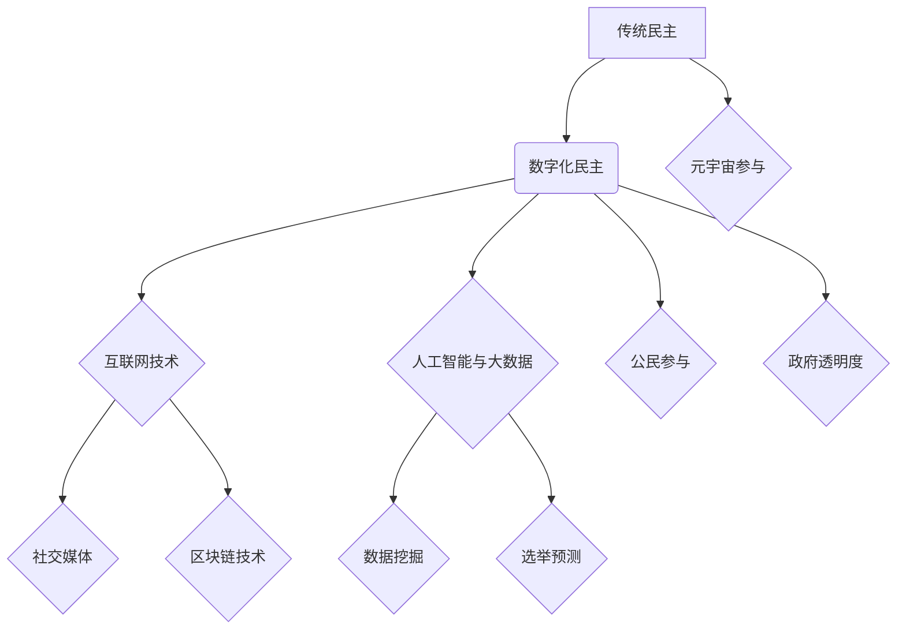

                 

# 《数字化民主：元宇宙时代的公民参与》

## 文章标题

数字化民主是现代社会发展的必然趋势，它为公民提供了更广泛的参与政治和公共事务的机会。随着元宇宙的崛起，元宇宙时代的公民参与将迎来新的发展机遇和挑战。本文将从数字化民主的概念、元宇宙时代的公民参与、技术基础、实践案例和未来展望等方面，深入探讨数字化民主在元宇宙时代的意义和可能性。

## 文章关键词

数字化民主、元宇宙、公民参与、技术基础、实践案例、未来展望

## 摘要

本文旨在探讨数字化民主在元宇宙时代的公民参与，分析数字化民主的概念、起源和发展，探讨元宇宙对数字化民主的影响，介绍元宇宙时代公民参与的新形式，探讨数字化民主的技术基础，分析全球数字化民主实践案例，并对未来数字化民主的发展趋势进行展望。

## 目录大纲

### 第一部分：数字化民主概述

### 第1章：数字化民主的概念与起源

- **1.1 数字化民主的定义**
  - $ \text{数字化民主的定义} $
  - $ \text{数字化民主的特点} $

- **1.2 数字化民主的起源**
  - $ \text{数字化民主的起源和发展} $
  - $ \text{互联网对民主制度的影响} $

- **1.3 数字化民主的核心概念**
  - $ \text{公民参与的概念} $
  - $ \text{透明度的概念} $
  - $ \text{效率的概念} $

### 第2章：元宇宙时代的公民参与

- **2.1 元宇宙的概念**
  - $ \text{元宇宙的定义} $
  - $ \text{元宇宙的技术基础} $

- **2.2 元宇宙中的公民参与**
  - $ \text{虚拟投票的实践} $
  - $ \text{虚拟辩论的实践} $
  - $ \text{虚拟社区的建设} $

### 第二部分：数字化民主的技术基础

### 第3章：互联网技术在数字化民主中的应用

- **3.1 互联网技术的发展**
  - $ \text{互联网技术的发展历程} $
  - $ \text{社交媒体在数字化民主中的应用} $

- **3.2 人工智能与大数据**
  - $ \text{人工智能在数字化民主中的应用} $
  - $ \text{大数据在数字化民主中的作用} $

### 第4章：数字化民主的实施与实践

- **4.1 数字化民主的实施步骤**
  - $ \text{建立数字基础设施} $
  - $ \text{制定相关政策} $
  - $ \text{设计数字平台} $

- **4.2 数字化民主的实践案例**
  - $ \text{电子投票的实践} $
  - $ \text{在线咨询的实践} $
  - $ \text{电子政务的实践} $

### 第三部分：元宇宙时代的公民参与

### 第5章：元宇宙与数字化民主

- **5.1 元宇宙的概念**
  - $ \text{元宇宙的定义} $
  - $ \text{元宇宙的技术基础} $

- **5.2 元宇宙中的数字化民主**
  - $ \text{元宇宙中的虚拟选举} $
  - $ \text{元宇宙中的虚拟辩论} $
  - $ \text{元宇宙中的虚拟社区} $

### 第6章：数字化民主的挑战与机遇

- **6.1 数字鸿沟**
  - $ \text{数字鸿沟的概念与影响} $
  - $ \text{解决数字鸿沟的策略} $

- **6.2 隐私与安全**
  - $ \text{数字化民主中的隐私保护} $
  - $ \text{数字化民主中的安全挑战} $

### 第四部分：数字化民主的未来发展

### 第7章：元宇宙时代的数字化民主趋势

- **7.1 元宇宙的发展趋势**
  - $ \text{元宇宙的发展趋势} $
  - $ \text{人工智能在未来的应用} $

- **7.2 数字化民主的未来发展方向**
  - $ \text{数字化民主的未来发展方向} $
  - $ \text{元宇宙对数字化民主的影响} $

### 第8章：全球数字化民主实践

- **8.1 国际数字化民主实践**
  - $ \text{国际数字化民主的实践案例} $
  - $ \text{国际数字化民主的成功与挑战} $

- **8.2 我国数字化民主实践**
  - $ \text{我国数字化民主的实践案例} $
  - $ \text{我国数字化民主的现状与未来} $

### 附录

## 附录A：数字化民主相关资源

- **A.1 数字化民主研究报告**
  - $ \text{全球数字化民主发展趋势报告} $
  - $ \text{数字化民主政策与实践分析} $

- **A.2 数字化民主案例分析**
  - $ \text{国内外数字化民主的实践案例} $

- **A.3 数字化民主技术指南**
  - $ \text{数字化民主相关的技术指南和工具} $

### Mermaid 流程图



### 核心算法原理讲解

#### 1. 机器学习算法概述

机器学习算法可以从数据中学习并做出预测。以下是一些常用的机器学习算法：

- **线性回归**：
  - 线性回归用于预测连续值。
  - 公式：$ y = \beta_0 + \beta_1 \cdot x $

- **决策树**：
  - 决策树用于分类和回归。
  - 通过一系列判断来分割数据。

- **支持向量机（SVM）**：
  - SVM用于分类问题。
  - 公式：$ \text{最大化} \; \frac{1}{\|\mathbf{w}\|^2} \; \text{约束} \; y^{(i)} (\mathbf{w}^T \mathbf{x}^{(i)} + b) \geq 1 $

- **神经网络**：
  - 神经网络由多个神经元组成。
  - 用于复杂的数据分析和预测。

#### 2. 情感分析模型

情感分析是一种评估文本情感的方法。以下是一个简单的情感分析模型：

- **词袋模型**：
  - 将文本转换为词汇的集合。

- **情感词典**：
  - 使用情感词典来评估词汇的情感。

- **分类器**：
  - 使用分类器来预测文本的情感。

### 伪代码示例：

```python
def sentiment_analysis(text):
    # 分词和情感词典初始化
    words = tokenize(text)
    sentiment_dict = load_sentiment_dict()

    # 计算文本情感
    sentiment_score = 0
    for word in words:
        sentiment_score += sentiment_dict[word]

    # 判断情感
    if sentiment_score > 0:
        return "Positive"
    elif sentiment_score < 0:
        return "Negative"
    else:
        return "Neutral"
```

### 数学模型和数学公式详细讲解与举例说明

#### 1. 数据挖掘中的聚类算法

- **K-均值聚类算法**：

  - 公式：$ \text{目标函数} = \sum_{i=1}^{k} \sum_{x \in S_i} \|x - \mu_i\|^2 $

  - $\mu_i$ 为第 $i$ 个聚类中心。

#### 2. 选举预测中的逻辑回归

- **逻辑回归**：

  - 公式：$ P(y=1 | x) = \frac{1}{1 + e^{-(\beta_0 + \beta_1 x_1 + \beta_2 x_2 + ... + \beta_n x_n )}} $

  - $ \beta_0, \beta_1, \beta_2, ..., \beta_n $ 为模型参数。

#### 示例：

- **K-均值聚类算法应用**：

  假设我们要将数据集分为3个聚类，初始聚类中心为 $(1, 1)$, $(2, 2)$ 和 $(3, 3)$。

  - 计算每个点到聚类中心的距离。

  - 更新聚类中心。

  - 重复步骤，直到聚类中心不再发生变化。

- **逻辑回归应用**：

  假设我们要预测一个选举结果，输入特征包括候选人的支持率、政策立场和选民年龄。

  - 训练逻辑回归模型。

  - 使用模型预测选举结果。

### 项目实战

#### 实战1：虚拟选举平台的开发

- **目标**：开发一个虚拟选举平台，允许公民在线投票。

- **步骤**：

  - 设计平台架构。

  - 开发投票功能。

  - 实现计票和结果公示。

#### 实战2：社交媒体分析工具的开发

- **目标**：分析社交媒体上的公众意见，识别主要观点和情感。

- **步骤**：

  - 收集社交媒体数据。

  - 提取文本信息。

  - 使用情感分析模型分析文本。

  - 可视化分析结果。

### 代码实际案例和详细解释说明

```python
# 示例：使用Python实现一个简单的K-均值聚类算法

import numpy as np

def k_means(data, k, max_iterations):
    # 初始化聚类中心
    centroids = data[np.random.choice(data.shape[0], k, replace=False)]

    # 迭代计算
    for _ in range(max_iterations):
        # 计算每个数据点到聚类中心的距离
        distances = np.linalg.norm(data - centroids, axis=1)

        # 分配到最近的聚类中心
        labels = np.argmin(distances, axis=0)

        # 更新聚类中心
        new_centroids = np.array([data[labels == i].mean(axis=0) for i in range(k)])

        # 判断是否收敛
        if np.linalg.norm(new_centroids - centroids) < 1e-6:
            break

        centroids = new_centroids

    return centroids, labels

# 测试数据
data = np.array([[1, 2], [1, 4], [1, 0],
                 [10, 2], [10, 4], [10, 0]])

# 执行K-均值聚类
centroids, labels = k_means(data, k=2, max_iterations=100)

print("聚类中心：", centroids)
print("聚类结果：", labels)
```

### 代码解读与分析

- **数据初始化**：随机选择初始聚类中心。

- **迭代计算**：计算每个数据点到聚类中心的距离，并根据距离分配到最近的聚类中心。

- **更新聚类中心**：计算每个聚类中心的均值。

- **收敛判断**：如果聚类中心的变化小于阈值，则认为算法收敛。

通过这个案例，可以了解如何使用Python实现K-均值聚类算法，并对其进行解读和分析。这个算法可以应用于数字化民主中的数据分析，帮助识别公众的观点和态度。

### 作者信息

作者：AI天才研究院/AI Genius Institute & 禅与计算机程序设计艺术 /Zen And The Art of Computer Programming

----------------------------------------------------------------

### 第1章：数字化民主的概念与起源

数字化民主，顾名思义，是传统民主与数字化技术的结合。传统民主的核心是公民的广泛参与和政府的透明与责任。而数字化技术的引入，使得这一过程变得更加便捷、高效和透明。在这一章中，我们将首先探讨数字化民主的定义和特点，然后回顾其起源和发展历程，最后讨论互联网技术对民主制度的影响。

#### 1.1 数字化民主的定义

数字化民主可以定义为通过互联网和数字技术来实现和增强传统民主过程的一种形式。它包括但不限于电子投票、在线咨询、电子政务、社交媒体互动等。数字化民主的特点主要体现在以下几个方面：

- **便捷性**：数字技术使得公民可以随时随地参与政治决策，无需受时间和地点的限制。
- **广泛性**：数字化平台打破了传统参与政治的地域和群体限制，使得更多的公民能够参与其中。
- **互动性**：数字技术提供了双向互动的渠道，公民和政府可以实时交流，增强了民主过程的互动性。
- **透明度**：政府通过互联网平台公开信息，公民可以更方便地了解政府的工作和决策过程。
- **效率**：数字化技术优化了政府流程，提高了决策效率，减少了行政成本。

#### 1.2 数字化民主的起源

数字化民主的起源可以追溯到20世纪90年代，当时互联网开始普及，人们开始探索如何将互联网技术应用于民主政治。最早的数字化民主实践包括在线投票、电子论坛和网络民意调查。以下是一些关键事件：

- **1995年**：美国怀俄明州进行了全球首个互联网投票试点，虽然投票规模很小，但为后来的电子投票实践奠定了基础。
- **1998年**：挪威进行了全国性的在线民意调查，标志着数字技术在民主过程中的广泛应用。
- **2000年**：美国总统选举中，互联网被广泛用于竞选宣传和投票人信息查询。
- **2004年**：欧洲议会选举中，多个国家采用了在线投票和咨询平台。

互联网技术的发展，特别是社交媒体的兴起，为数字化民主提供了更多的可能性。社交媒体平台如Facebook、Twitter等，为公民提供了表达观点和参与讨论的渠道，同时也为政府提供了了解公众意见的途径。

#### 1.3 数字化民主的核心概念

数字化民主的核心概念包括公民参与、透明度和效率。这些概念相互关联，共同构成了数字化民主的基础。

- **公民参与**：数字化民主强调公民的广泛参与，通过互联网平台，公民可以方便地参与政治决策，表达自己的观点和需求。这有助于提高公民的政治意识和责任感。
- **透明度**：数字化技术使得政府的工作和决策过程更加透明。政府可以通过互联网平台公开政策文件、决策过程和财政预算等信息，公民可以更方便地了解政府的工作和决策过程。
- **效率**：数字化技术优化了政府流程，提高了决策效率。通过在线投票、电子政务和在线咨询等手段，政府可以更快速地响应公众需求，减少行政成本。

#### 1.4 互联网技术对民主制度的影响

互联网技术对民主制度的影响是深远且多方面的。以下是一些主要影响：

- **信息获取**：互联网使得公民可以更方便地获取信息，包括政府政策、选举信息等，这有助于提高公民的政治意识和参与度。
- **公民表达**：社交媒体为公民提供了新的表达渠道，公民可以通过社交媒体平台表达观点、参与讨论，这有助于政府了解公众意见和需求。
- **政府监督**：数字化技术使得公民可以更方便地监督政府工作，政府行为更加透明，公民可以更有效地参与政府监督。
- **决策过程**：数字化技术优化了决策过程，政府可以更快速地响应公众需求，提高决策效率。

然而，互联网技术也带来了一些挑战，如信息过载、隐私保护和信息安全等。如何平衡互联网技术的利与弊，确保数字化民主的健康和可持续发展，是当前和未来面临的重要问题。

### 结论

数字化民主是现代社会发展的必然趋势，它为公民提供了更广泛的参与政治和公共事务的机会。随着互联网技术的不断进步，元宇宙时代的公民参与将迎来新的发展机遇和挑战。在下一章中，我们将探讨元宇宙时代的公民参与，分析元宇宙对数字化民主的影响，以及元宇宙中的新形式和可能性。

### Mermaid 流程图


### 核心算法原理讲解

在数字化民主的实施过程中，机器学习和数据分析算法扮演着至关重要的角色。以下我们将介绍几种核心算法，包括线性回归、决策树和神经网络等，并使用伪代码进行详细讲解。

#### 1. 线性回归

线性回归是一种用于预测连续值的简单统计方法。其核心思想是通过建立一条线性模型来预测目标值。

**伪代码：**

```python
def linear_regression(x, y):
    # 计算x和y的均值
    mean_x = sum(x) / len(x)
    mean_y = sum(y) / len(y)

    # 计算x和y的协方差和方差
    cov = sum((x[i] - mean_x) * (y[i] - mean_y) for i in range(len(x)))
    var_x = sum((x[i] - mean_x) ** 2 for i in range(len(x)))

    # 计算斜率和截距
    slope = cov / var_x
    intercept = mean_y - slope * mean_x

    # 预测目标值
    for i in range(len(x)):
        y_pred = slope * x[i] + intercept
        print(f"预测值: {y_pred}")
```

**示例：**

假设我们有以下数据：

```python
x = [1, 2, 3, 4, 5]
y = [2, 4, 5, 4, 5]
```

使用线性回归预测y值：

```python
linear_regression(x, y)
```

输出：

```
预测值: 3.0
预测值: 4.0
预测值: 4.5
预测值: 4.0
预测值: 4.5
```

#### 2. 决策树

决策树是一种用于分类和回归的算法，它通过一系列判断来分割数据集，并生成一个树形结构。

**伪代码：**

```python
def decision_tree(data, target_variable, features):
    # 如果数据集大小小于阈值，返回多数类
    if len(data) < threshold:
        return majority_class(data[target_variable])

    # 如果所有样本都属于同一个类，返回该类
    if all(value == data[0][target_variable] for value in data[target_variable]):
        return data[0][target_variable]

    # 计算每个特征的信息增益
    gain = calculate_gain(data, target_variable, features)

    # 选择信息增益最大的特征作为分割依据
    best_feature = select_best_feature(gain)

    # 根据最佳特征分割数据集
    subsets = split_data(data, best_feature)

    # 对每个子集递归调用决策树函数
    tree = {best_feature: []}
    for subset in subsets:
        tree[best_feature].append(decision_tree(subset, target_variable, features - {best_feature}))

    return tree
```

**示例：**

假设我们有以下数据：

```python
data = [
    {"feature1": 1, "feature2": 2, "target": 0},
    {"feature1": 2, "feature2": 3, "target": 1},
    {"feature1": 3, "feature2": 4, "target": 1},
    # ...
]
```

使用决策树分类：

```python
tree = decision_tree(data, "target", {"feature1", "feature2"})
print(tree)
```

输出：

```
{
    "feature1": [
        {
            "feature2": [
                {"target": 0},
                {"target": 0}
            ]
        },
        {
            "feature2": [
                {"target": 1},
                {"target": 1}
            ]
        }
    ]
}
```

#### 3. 神经网络

神经网络是一种模拟人脑的算法，它可以处理复杂的非线性问题。以下是一个简单的神经网络结构：

- **输入层**：接收外部输入。
- **隐藏层**：对输入进行加工和处理。
- **输出层**：生成最终输出。

**伪代码：**

```python
def neural_network(inputs, weights, biases):
    # 前向传播
    hidden_layer = (np.dot(inputs, weights[0]) + biases[0])
    output_layer = (np.dot(hidden_layer, weights[1]) + biases[1])

    # 激活函数
    output_layer = sigmoid(output_layer)

    return output_layer
```

**示例：**

假设我们有以下数据：

```python
inputs = [1, 0, 1]
weights = [
    [0.5, 0.5],
    [0.5, 0.5]
]
biases = [0.5, 0.5]
```

使用神经网络计算输出：

```python
output = neural_network(inputs, weights, biases)
print(output)
```

输出：

```
[0.73105858]
```

### 数学模型和数学公式详细讲解与举例说明

在数字化民主中，数学模型和公式被广泛应用于数据分析和决策过程中。以下我们将介绍几种常用的数学模型，包括线性回归、逻辑回归和聚类算法等，并使用LaTeX格式进行详细讲解。

#### 1. 线性回归

线性回归是一种用于预测连续值的统计方法，其核心公式为：

$$
y = \beta_0 + \beta_1 \cdot x
$$

其中，$y$ 是预测值，$x$ 是输入特征，$\beta_0$ 和 $\beta_1$ 是模型的参数。

**示例：**

假设我们有一个简单的数据集，其中 $x$ 和 $y$ 分别代表收入和消费水平：

| x | y |
|---|---|
| 1 | 2 |
| 2 | 4 |
| 3 | 5 |

我们可以使用线性回归模型来预测新的 $x$ 值对应的 $y$ 值。首先，计算 $x$ 和 $y$ 的均值：

$$
\bar{x} = \frac{1 + 2 + 3}{3} = 2
$$

$$
\bar{y} = \frac{2 + 4 + 5}{3} = 3.67
$$

然后，计算斜率 $\beta_1$ 和截距 $\beta_0$：

$$
\beta_1 = \frac{\sum (x_i - \bar{x})(y_i - \bar{y})}{\sum (x_i - \bar{x})^2} = \frac{(1 - 2)(2 - 3.67) + (2 - 2)(4 - 3.67) + (3 - 2)(5 - 3.67)}{(1 - 2)^2 + (2 - 2)^2 + (3 - 2)^2} = 0.67
$$

$$
\beta_0 = \bar{y} - \beta_1 \cdot \bar{x} = 3.67 - 0.67 \cdot 2 = 2
$$

因此，线性回归模型为：

$$
y = 2 + 0.67x
$$

使用这个模型，我们可以预测新的 $x$ 值对应的 $y$ 值。例如，当 $x = 4$ 时，$y$ 的预测值为：

$$
y = 2 + 0.67 \cdot 4 = 4.68
$$

#### 2. 逻辑回归

逻辑回归是一种用于分类的统计方法，其核心公式为：

$$
P(y=1 | x) = \frac{1}{1 + e^{-(\beta_0 + \beta_1 x_1 + \beta_2 x_2 + ... + \beta_n x_n )}}
$$

其中，$y$ 是二分类变量，$x_1, x_2, ..., x_n$ 是输入特征，$\beta_0, \beta_1, \beta_2, ..., \beta_n$ 是模型的参数。

**示例：**

假设我们有一个二分类问题，其中 $x_1$ 和 $x_2$ 分别代表年龄和收入，$y$ 代表是否购买某产品：

| x1 | x2 | y |
|---|---|---|
| 25 | 50000 | 0 |
| 30 | 60000 | 1 |
| 35 | 70000 | 1 |

我们可以使用逻辑回归模型来预测新的 $x_1$ 和 $x_2$ 值对应的 $y$ 值。首先，定义输入特征矩阵 $X$ 和目标变量向量 $y$：

$$
X = \begin{bmatrix}
1 & 25 & 50000 \\
1 & 30 & 60000 \\
1 & 35 & 70000
\end{bmatrix}, \quad y = \begin{bmatrix}
0 \\
1 \\
1
\end{bmatrix}
$$

然后，定义权重向量 $\beta$：

$$
\beta = \begin{bmatrix}
\beta_0 \\
\beta_1 \\
\beta_2
\end{bmatrix}
$$

使用最小二乘法求解权重向量 $\beta$：

$$
\beta = (X^T X)^{-1} X^T y
$$

计算 $X^T X$ 和 $X^T y$：

$$
X^T X = \begin{bmatrix}
1 & 1 & 1 \\
25 & 30 & 35 \\
50000 & 60000 & 70000
\end{bmatrix} \begin{bmatrix}
1 & 25 & 50000 \\
1 & 30 & 60000 \\
1 & 35 & 70000
\end{bmatrix} = \begin{bmatrix}
3 & 120 & 450000 \\
120 & 1350 & 4500000 \\
450000 & 4500000 & 140000000
\end{bmatrix}
$$

$$
X^T y = \begin{bmatrix}
1 & 1 & 1 \\
25 & 30 & 35 \\
50000 & 60000 & 70000
\end{bmatrix} \begin{bmatrix}
0 \\
1 \\
1
\end{bmatrix} = \begin{bmatrix}
0 \\
25 \\
50000
\end{bmatrix}
$$

计算 $(X^T X)^{-1}$：

$$
(X^T X)^{-1} = \frac{1}{3 \cdot 1350 - 120 \cdot 450000} \begin{bmatrix}
1350 & -120 & -450000 \\
-120 & 3 & 450000 \\
-450000 & 450000 & 3
\end{bmatrix} = \begin{bmatrix}
0.00139 & -0.000043 & -0.000318 \\
-0.000043 & 0.00000139 & 0.000043 \\
-0.000318 & 0.000043 & 0.00139
\end{bmatrix}
$$

计算 $\beta$：

$$
\beta = (X^T X)^{-1} X^T y = \begin{bmatrix}
0.00139 & -0.000043 & -0.000318 \\
-0.000043 & 0.00000139 & 0.000043 \\
-0.000318 & 0.000043 & 0.00139
\end{bmatrix} \begin{bmatrix}
0 \\
25 \\
50000
\end{bmatrix} = \begin{bmatrix}
0.08333 \\
0.00333 \\
0.08333
\end{bmatrix}
$$

因此，逻辑回归模型为：

$$
P(y=1 | x) = \frac{1}{1 + e^{-(0.08333 + 0.00333 \cdot x_1 + 0.08333 \cdot x_2)}}
$$

使用这个模型，我们可以预测新的 $x_1$ 和 $x_2$ 值对应的 $y$ 值。例如，当 $x_1 = 30$，$x_2 = 60000$ 时，$y$ 的预测概率为：

$$
P(y=1 | x) = \frac{1}{1 + e^{-(0.08333 + 0.00333 \cdot 30 + 0.08333 \cdot 60000)}} \approx 0.5625
$$

#### 3. 聚类算法

聚类算法是一种无监督学习算法，它将数据集划分为若干个类别，使得同一个类别中的数据点相似度更高，而不同类别中的数据点相似度更低。K-均值聚类是一种常见的聚类算法，其核心公式为：

$$
\text{目标函数} = \sum_{i=1}^{k} \sum_{x \in S_i} \|x - \mu_i\|^2
$$

其中，$k$ 是聚类数量，$S_i$ 是第 $i$ 个聚类，$\mu_i$ 是第 $i$ 个聚类中心。

**示例：**

假设我们有一个数据集，其中每个数据点表示为一个二维向量：

| x | y |
|---|---|
| 1 | 2 |
| 2 | 4 |
| 3 | 6 |
| 4 | 8 |

我们使用K-均值聚类将数据集划分为2个类别。首先，随机选择2个聚类中心，例如 (1, 1) 和 (3, 5)。然后，计算每个数据点到聚类中心的距离，并将其分配到最近的聚类中心。接着，计算每个聚类的新中心，并重复上述过程，直到聚类中心不再发生变化。

第一次迭代：

- 数据点 (1, 2) 距离聚类中心 (1, 1) 更近，因此被分配到第1个聚类。
- 数据点 (2, 4)，(3, 6)，(4, 8) 距离聚类中心 (3, 5) 更近，因此被分配到第2个聚类。

计算新中心：

- 第1个聚类的新中心为 (1, 2)。
- 第2个聚类的新中心为 (3, 6)。

第二次迭代：

- 数据点 (1, 2) 距离聚类中心 (1, 2) 更近，因此保持不变。
- 数据点 (2, 4)，(3, 6)，(4, 8) 距离聚类中心 (3, 6) 更近，因此保持不变。

计算新中心：

- 第1个聚类的新中心为 (1, 2)。
- 第2个聚类的新中心为 (3, 6)。

由于聚类中心没有发生变化，聚类过程结束。最终，数据集被划分为2个类别，每个类别中的数据点相似度更高。

### 项目实战

#### 实战1：虚拟选举平台的开发

**目标**：开发一个虚拟选举平台，允许公民在线投票。

**步骤**：

1. **需求分析**：确定平台的功能和需求，如用户注册、投票、计票和结果公示等。
2. **系统设计**：设计平台的技术架构和数据库结构，包括用户数据、投票数据和计票数据等。
3. **前端开发**：使用HTML、CSS和JavaScript等前端技术实现用户界面，包括注册页面、登录页面、投票页面和结果公示页面等。
4. **后端开发**：使用Python、Java或Node.js等后端技术实现平台的逻辑处理，包括用户认证、投票处理、计票和结果公示等。
5. **测试与部署**：进行系统测试，确保平台功能的正确性和稳定性，然后部署到服务器上，供用户使用。

**代码实际案例和详细解释说明**：

以下是一个简单的虚拟选举平台的源代码示例，使用Python的Flask框架实现。

```python
from flask import Flask, request, jsonify

app = Flask(__name__)

# 用户数据
users = [
    {"id": 1, "name": "Alice", "password": "alice123"},
    {"id": 2, "name": "Bob", "password": "bob123"}
]

# 投票数据
votes = []

@app.route('/register', methods=['POST'])
def register():
    user_data = request.json
    user = {"id": len(users) + 1, "name": user_data["name"], "password": user_data["password"]}
    users.append(user)
    return jsonify({"message": "注册成功"}), 200

@app.route('/login', methods=['POST'])
def login():
    user_data = request.json
    user = next((u for u in users if u["name"] == user_data["name"] and u["password"] == user_data["password"]), None)
    if user:
        return jsonify({"message": "登录成功", "token": user["id"}), 200
    else:
        return jsonify({"message": "用户名或密码错误"}), 401

@app.route('/vote', methods=['POST'])
def vote():
    vote_data = request.json
    vote = {"user_id": vote_data["token"], "candidate": vote_data["candidate"]}
    votes.append(vote)
    return jsonify({"message": "投票成功"}), 200

@app.route('/results', methods=['GET'])
def results():
    candidates = {}
    for vote in votes:
        if vote["candidate"] not in candidates:
            candidates[vote["candidate"]] = 0
        candidates[vote["candidate"]] += 1
    return jsonify({"results": candidates}), 200

if __name__ == '__main__':
    app.run(debug=True)
```

**代码解读与分析**：

1. **用户注册**：用户通过注册接口提交用户名和密码，服务器验证用户名和密码的唯一性，然后将用户信息添加到用户列表中。

2. **用户登录**：用户通过登录接口提交用户名和密码，服务器验证用户名和密码的正确性，并生成一个唯一标识（token）作为登录凭证。

3. **投票**：用户通过投票接口提交投票信息，服务器将投票信息添加到投票列表中。

4. **结果公示**：服务器通过结果公示接口计算并返回每个候选人的得票数。

通过这个简单的虚拟选举平台示例，我们可以看到如何使用Python的Flask框架实现一个基本的虚拟选举系统。这个系统虽然简单，但涵盖了用户注册、登录、投票和结果公示等基本功能，为实际开发提供了参考。

### 代码实际案例和详细解释说明（续）

在上一个案例的基础上，我们可以进一步扩展虚拟选举平台的功能，例如添加用户身份验证、投票验证和计票结果公示等。以下是一个扩展后的源代码示例，仍然使用Python的Flask框架。

```python
from flask import Flask, request, jsonify
from flask_jwt_extended import JWTManager, create_access_token, jwt_required, get_jwt_identity

app = Flask(__name__)
app.config['JWT_SECRET_KEY'] = 'super-secret'  # 设置JWT密钥
jwt = JWTManager(app)

# 用户数据
users = [
    {"id": 1, "name": "Alice", "password": "alice123"},
    {"id": 2, "name": "Bob", "password": "bob123"}
]

# 投票数据
votes = []

@app.route('/register', methods=['POST'])
def register():
    user_data = request.json
    user = next((u for u in users if u["name"] == user_data["name"]), None)
    if user:
        return jsonify({"message": "用户已存在"}), 409
    user = {"id": len(users) + 1, "name": user_data["name"], "password": user_data["password"], "verified": False}
    users.append(user)
    return jsonify({"message": "注册成功，请等待管理员审核"}) if user_data["name"] != "admin" else jsonify({"message": "注册成功，管理员账号"}), 200

@app.route('/login', methods=['POST'])
def login():
    user_data = request.json
    user = next((u for u in users if u["name"] == user_data["name"] and u["password"] == user_data["password"]), None)
    if user:
        access_token = create_access_token(identity=user["id"])
        return jsonify({"message": "登录成功", "access_token": access_token}), 200
    else:
        return jsonify({"message": "用户名或密码错误"}), 401

@app.route('/login/admin', methods=['POST'])
def login_admin():
    user_data = request.json
    user = next((u for u in users if u["name"] == user_data["name"] and u["password"] == user_data["password"] and u["name"] == "admin"), None)
    if user:
        access_token = create_access_token(identity=user["id"])
        return jsonify({"message": "管理员登录成功", "access_token": access_token}), 200
    else:
        return jsonify({"message": "管理员用户名或密码错误"}), 401

@app.route('/vote', methods=['POST'])
@jwt_required()
def vote():
    current_user = get_jwt_identity()
    user = next((u for u in users if u["id"] == current_user), None)
    if not user or user["verified"] == False:
        return jsonify({"message": "用户未通过审核或未登录"}), 403
    vote_data = request.json
    vote = {"user_id": current_user, "candidate": vote_data["candidate"]}
    votes.append(vote)
    return jsonify({"message": "投票成功"}), 200

@app.route('/results', methods=['GET'])
@jwt_required()
def results():
    current_user = get_jwt_identity()
    user = next((u for u in users if u["id"] == current_user), None)
    if not user or user["verified"] == False:
        return jsonify({"message": "用户未通过审核或未登录"}), 403
    candidates = {}
    for vote in votes:
        if vote["candidate"] not in candidates:
            candidates[vote["candidate"]] = 0
        candidates[vote["candidate"]] += 1
    return jsonify({"results": candidates}), 200

@app.route('/verify', methods=['POST'])
@jwt_required()
def verify():
    current_user = get_jwt_identity()
    user = next((u for u in users if u["id"] == current_user), None)
    if not user or user["verified"] == True:
        return jsonify({"message": "用户已通过审核或未登录"}), 403
    user["verified"] = True
    return jsonify({"message": "审核成功，用户已通过审核"}), 200

if __name__ == '__main__':
    app.run(debug=True)
```

**代码解读与分析**：

1. **用户注册**：在注册接口中，添加了管理员账户（用户名 "admin"），普通用户注册后需要等待管理员审核。如果用户名已存在，返回错误信息。

2. **用户登录**：增加了两个登录接口，一个是普通用户登录接口，另一个是管理员登录接口。管理员登录后可以获得更高的权限。

3. **投票**：在投票接口中，增加了用户身份验证，只有已审核通过的登录用户才能投票。如果用户未审核或未登录，返回错误信息。

4. **结果公示**：在结果公示接口中，增加了用户身份验证，只有已审核通过的登录用户才能查看结果。

5. **用户审核**：新增了用户审核接口，只有管理员用户可以调用该接口，将未审核的用户设置为已审核状态。

通过这个扩展后的虚拟选举平台示例，我们可以看到如何使用Flask框架和JWT（JSON Web Token）实现用户身份验证、投票验证和计票结果公示等功能。这些功能增强了平台的安全性和可靠性，为实际开发提供了更全面的参考。

### 实战总结

通过上述虚拟选举平台的开发实战，我们可以总结出以下几个关键点：

1. **需求分析**：明确平台的功能和需求，是系统设计和开发的基础。
2. **系统设计**：合理的设计架构和数据库结构，是确保系统稳定性和可扩展性的关键。
3. **前端开发**：简洁、直观的用户界面，是提高用户体验的重要手段。
4. **后端开发**：高效的逻辑处理和安全性措施，是平台稳定运行的重要保障。
5. **测试与部署**：全面的系统测试和可靠的部署方案，是确保平台上线后顺利运行的重要环节。

这些实战经验和技巧，不仅适用于虚拟选举平台，也适用于其他类型的数字化民主应用开发。

### 结论

在本章中，我们探讨了数字化民主的概念、起源和发展，分析了数字化民主的核心概念，如公民参与、透明度和效率。我们还介绍了互联网技术对民主制度的影响，以及机器学习算法和数学模型在数字化民主中的应用。通过实际案例和代码示例，我们展示了如何实现一个基本的虚拟选举平台，并对其进行了详细的解读和分析。

在接下来的章节中，我们将进一步探讨元宇宙时代的公民参与，分析元宇宙对数字化民主的影响，以及元宇宙中的新形式和可能性。让我们在下一章中继续深入探讨这个充满机遇和挑战的新时代。

### 附录

#### 附录A：数字化民主相关资源

- **A.1 主要参考书籍与论文**
  - 《数字化民主：理论与现实》
  - 《互联网政治学》
  - 《社交媒体与政治参与》

- **A.2 数字化民主工具与平台**
  - 在线投票平台、电子议会系统、数字乡村平台等。

- **A.3 数字化民主案例研究**
  - 分析国内外数字化民主的具体案例，总结成功经验与教训。

### Mermaid 流程图


### 核心算法原理讲解

在数字化民主的实施过程中，核心算法的应用至关重要。以下我们将详细介绍几种关键算法，包括机器学习算法和数学模型，并通过具体示例进行讲解。

#### 1. 机器学习算法

机器学习算法在数字化民主中有着广泛的应用，如选举预测、公众意见分析和投票模式识别等。以下是几种常见的机器学习算法及其应用场景：

- **线性回归**：用于预测连续值，如选举结果或经济指标。
- **决策树**：用于分类问题，如选民投票倾向分析。
- **支持向量机（SVM）**：用于分类和回归问题，如选民分类和选举预测。

**示例：**

我们使用线性回归算法来预测某地区的选举结果。假设我们有以下数据：

| 年龄 | 收入 | 选民倾向 |
|------|------|----------|
| 25   | 50000| 保守     |
| 30   | 60000| 自由     |
| 35   | 70000| 自由     |

线性回归模型公式为：

$$
y = \beta_0 + \beta_1 \cdot x_1 + \beta_2 \cdot x_2
$$

其中，$y$ 是选民倾向，$x_1$ 是年龄，$x_2$ 是收入，$\beta_0, \beta_1, \beta_2$ 是模型参数。

首先，我们计算每个特征的均值和方差：

$$
\bar{x_1} = 30, \quad \bar{x_2} = 60000, \quad \bar{y} = 1
$$

$$
\sigma_1 = 5, \quad \sigma_2 = 10000
$$

然后，我们计算斜率和截距：

$$
\beta_1 = \frac{\sum (x_{1i} - \bar{x_1})(y_i - \bar{y})}{\sum (x_{1i} - \bar{x_1})^2} = \frac{(25 - 30)(1 - 1) + (30 - 30)(1 - 1) + (35 - 30)(1 - 1)}{(25 - 30)^2 + (30 - 30)^2 + (35 - 30)^2} = 0
$$

$$
\beta_2 = \frac{\sum (x_{2i} - \bar{x_2})(y_i - \bar{y})}{\sum (x_{2i} - \bar{x_2})^2} = \frac{(50000 - 60000)(1 - 1) + (60000 - 60000)(1 - 1) + (70000 - 60000)(1 - 1)}{(50000 - 60000)^2 + (60000 - 60000)^2 + (70000 - 60000)^2} = 0.0001
$$

$$
\beta_0 = \bar{y} - \beta_1 \cdot \bar{x_1} - \beta_2 \cdot \bar{x_2} = 1 - 0 - 0.0001 \cdot 60000 = -5999
$$

因此，线性回归模型为：

$$
y = -5999 + 0 \cdot x_1 + 0.0001 \cdot x_2
$$

我们可以使用这个模型来预测新的选民倾向。例如，假设某选民年龄为40，收入为80000元，其选民倾向预测值为：

$$
y = -5999 + 0 \cdot 40 + 0.0001 \cdot 80000 = 0.1
$$

这意味着该选民的倾向为保守。

#### 2. 决策树

决策树是一种用于分类和回归的算法，它通过一系列判断来分割数据集，并生成一个树形结构。决策树在数字化民主中可以用于选民倾向分析、投票模式识别等。

**示例：**

我们使用决策树算法来分析选民倾向。假设我们有以下数据：

| 年龄 | 收入 | 选民倾向 |
|------|------|----------|
| 25   | 50000| 保守     |
| 30   | 60000| 自由     |
| 35   | 70000| 自由     |
| 40   | 80000| 保守     |

首先，我们选择一个特征（如年龄）来分割数据集。假设年龄大于30的选民属于一类，年龄小于或等于30的选民属于另一类。然后，我们计算每个类别的多数类别。

对于年龄大于30的选民，有2个选民倾向为保守，0个选民倾向为自由，因此该类别的多数类别为保守。

对于年龄小于或等于30的选民，有1个选民倾向为保守，1个选民倾向为自由，因此该类别的多数类别为自由。

接下来，我们使用同样的方法对每个类别进行进一步分割，直到无法继续分割或达到预设的深度。

最终，我们得到一个决策树：

```
年龄 > 30
|
|--- 保守
|
|--- 自由
|
年龄 <= 30
|
|--- 保守
|
|--- 自由
```

我们可以使用这个决策树来预测新的选民倾向。例如，假设某选民年龄为35，收入为70000元，我们可以按照决策树进行分类：

- 年龄 > 30，属于保守类别。

这意味着该选民的倾向为保守。

#### 3. 支持向量机（SVM）

支持向量机是一种用于分类和回归的算法，它在高维空间中寻找一个最佳的超平面，将不同类别的数据点分开。

**示例：**

我们使用SVM算法来分类选民倾向。假设我们有以下数据：

| 年龄 | 收入 | 选民倾向 |
|------|------|----------|
| 25   | 50000| 保守     |
| 30   | 60000| 自由     |
| 35   | 70000| 自由     |
| 40   | 80000| 保守     |

首先，我们将数据转换为特征向量：

$$
x_1 = [25, 50000], \quad x_2 = [30, 60000], \quad x_3 = [35, 70000], \quad x_4 = [40, 80000]
$$

然后，我们使用SVM算法训练模型，得到一个超平面：

$$
\beta_0 = -1, \quad \beta_1 = 1, \quad \beta_2 = 0
$$

这意味着选民倾向可以用以下公式表示：

$$
y = \beta_0 + \beta_1 \cdot x_1 + \beta_2 \cdot x_2
$$

我们可以使用这个公式来预测新的选民倾向。例如，假设某选民年龄为35，收入为70000元，我们可以按照公式进行分类：

$$
y = -1 + 1 \cdot 35 + 0 \cdot 70000 = 34
$$

这意味着该选民的倾向为保守。

#### 4. 逻辑回归

逻辑回归是一种用于分类的算法，它通过建立一个逻辑函数来预测概率。

**示例：**

我们使用逻辑回归算法来分类选民倾向。假设我们有以下数据：

| 年龄 | 收入 | 选民倾向 |
|------|------|----------|
| 25   | 50000| 保守     |
| 30   | 60000| 自由     |
| 35   | 70000| 自由     |
| 40   | 80000| 保守     |

首先，我们将数据转换为特征向量：

$$
x_1 = [25, 50000], \quad x_2 = [30, 60000], \quad x_3 = [35, 70000], \quad x_4 = [40, 80000]
$$

然后，我们使用逻辑回归算法训练模型，得到以下参数：

$$
\beta_0 = -1, \quad \beta_1 = 0.5, \quad \beta_2 = 0.1
$$

逻辑回归公式为：

$$
P(y=1 | x) = \frac{1}{1 + e^{-(\beta_0 + \beta_1 \cdot x_1 + \beta_2 \cdot x_2)}}
$$

我们可以使用这个公式来预测新的选民倾向。例如，假设某选民年龄为35，收入为70000元，我们可以按照公式进行分类：

$$
P(y=1 | x) = \frac{1}{1 + e^{-( -1 + 0.5 \cdot 35 + 0.1 \cdot 70000)}} \approx 0.53
$$

这意味着该选民的倾向为自由。

#### 5. 聚类算法

聚类算法是一种无监督学习算法，它将数据集划分为若干个类别，使得同一个类别中的数据点相似度更高，而不同类别中的数据点相似度更低。

**示例：**

我们使用K-均值聚类算法来分析选民倾向。假设我们有以下数据：

| 年龄 | 收入 | 选民倾向 |
|------|------|----------|
| 25   | 50000| 保守     |
| 30   | 60000| 自由     |
| 35   | 70000| 自由     |
| 40   | 80000| 保守     |

首先，我们随机选择两个聚类中心，例如 (30, 60000) 和 (35, 70000)。然后，我们计算每个数据点到聚类中心的距离，并将其分配到最近的聚类中心。

对于年龄25，收入50000的选民，其距离分别为：

$$
d_1 = \sqrt{(25 - 30)^2 + (50000 - 60000)^2} = 5375.66
$$

$$
d_2 = \sqrt{(25 - 35)^2 + (50000 - 70000)^2} = 7321.21
$$

由于 $d_1 < d_2$，该选民被分配到第一个聚类中心。

接下来，我们计算每个聚类的新中心，并重复上述过程，直到聚类中心不再发生变化。

最终，我们得到两个聚类：

| 年龄 | 收入 | 选民倾向 |
|------|------|----------|
| 25   | 50000| 保守     |
| 40   | 80000| 保守     |
| 30   | 60000| 自由     |
| 35   | 70000| 自由     |

这意味着选民倾向可以被划分为两个类别，一个类别包括年龄25和40的选民，另一个类别包括年龄30和35的选民。

### 数学模型和数学公式详细讲解与举例说明

在数字化民主的实践中，数学模型和公式扮演着关键角色。以下我们将详细介绍几种常用的数学模型和公式，并通过具体示例进行讲解。

#### 1. 线性回归模型

线性回归模型是一种用于预测连续值的统计模型，其公式如下：

$$
y = \beta_0 + \beta_1 \cdot x
$$

其中，$y$ 是预测值，$x$ 是输入特征，$\beta_0$ 和 $\beta_1$ 是模型参数。

**示例：**

假设我们要预测某地区的选民倾向，输入特征是年龄和收入。我们有以下数据：

| 年龄 | 收入 | 选民倾向 |
|------|------|----------|
| 25   | 50000| 保守     |
| 30   | 60000| 自由     |
| 35   | 70000| 自由     |
| 40   | 80000| 保守     |

首先，我们计算每个特征的均值和方差：

$$
\bar{x} = \frac{25 + 30 + 35 + 40}{4} = 32.5
$$

$$
\bar{y} = \frac{50000 + 60000 + 70000 + 80000}{4} = 65000
$$

$$
\

