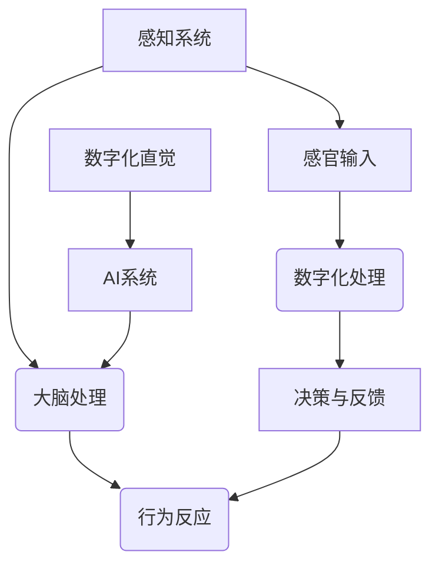

                 

### 文章标题：数字化直觉：AI增强的第六感知觉

关键词：数字化直觉，AI，第六感知觉，应用，发展趋势，社会影响

摘要：本文探讨了数字化直觉这一新兴概念，详细阐述了其定义、重要性以及与AI的结合。通过深入分析AI基础理论、第六感知觉的概念与原理，本文进一步探讨了数字化直觉在各领域的应用，以及其技术发展趋势和社会影响。文章末尾还提供了实用的技术资源和工具，以及第六感知觉的流程图和算法伪代码，为读者提供了全面的了解和实战指南。

### 第一部分：引言

#### 第1章：数字化直觉的兴起

##### 1.1 数字化直觉的定义与重要性

数字化直觉，是一种通过AI技术增强人类感知能力的全新概念。它超越了传统的五种感官（视觉、听觉、嗅觉、味觉、触觉），为人类提供了一种全新的感知模式，即第六感知觉。数字化直觉通过整合和分析大量数据，帮助人类快速、准确地做出决策，提高工作效率和生活质量。

数字化直觉的重要性在于其能够解决传统感知觉难以应对的问题。例如，在语音识别领域，传统的语音处理技术依赖于大量的手动标注数据，而数字化直觉能够通过AI算法自动学习语音特征，大大提高识别准确率。在图像识别领域，数字化直觉同样发挥着重要作用，使得自动驾驶、安防监控等应用得以实现。

##### 1.2 AI与第六感知觉的融合

AI技术的发展为数字化直觉提供了强大的技术支持。深度学习、强化学习等算法在感知数据处理方面取得了显著成果，使得AI系统具备了类似人类的感知能力。这些算法通过不断学习、优化，实现了对海量数据的快速分析和处理，为数字化直觉的应用提供了可能。

第六感知觉的提出，为AI技术的发展开辟了新的方向。它将人类的感知能力与AI技术相结合，形成了一种全新的感知模式。通过数字化直觉，人类能够更好地理解和应对复杂环境，提高决策效率和准确性。

##### 1.3 本书结构概述

本书分为三大部分，分别探讨数字化直觉的兴起、AI增强的第六感知觉以及数字化直觉的未来。

第一部分：引言，介绍了数字化直觉的定义与重要性，以及AI与第六感知觉的融合。

第二部分：AI增强的第六感知觉，包括AI基础理论、第六感知觉的概念与原理以及数字化直觉的应用。

第三部分：数字化直觉的未来，探讨数字化直觉的技术发展趋势、社会影响以及未来挑战与应对策略。

通过本书的阅读，读者将全面了解数字化直觉这一新兴领域，掌握相关技术原理和应用，为未来的研究和实践奠定基础。

### 第二部分：AI增强的第六感知觉

#### 第2章：AI基础理论

##### 2.1 机器学习的概念与分类

机器学习是AI的核心技术之一，它使得计算机系统能够通过学习数据来提高其性能。机器学习可分为监督学习、无监督学习和强化学习三类。

- **监督学习**：监督学习是一种有监督的训练方法，它通过训练集来学习输入和输出之间的映射关系。常见的监督学习算法包括线性回归、逻辑回归、支持向量机（SVM）等。

- **无监督学习**：无监督学习是在没有标注数据的情况下，通过数据自身的分布来学习其内在结构。常见的无监督学习算法包括聚类、主成分分析（PCA）、自编码器等。

- **强化学习**：强化学习是一种基于奖励机制的学习方法，它通过试错来不断优化策略。常见的强化学习算法包括Q学习、深度Q网络（DQN）、策略梯度等。

##### 2.2 深度学习的基本原理

深度学习是机器学习的一个子领域，它通过多层神经网络来模拟人类大脑的感知和学习过程。深度学习的基本原理包括：

- **多层神经网络**：深度学习模型由多个隐层组成，每一层对输入数据进行特征提取和变换。

- **激活函数**：激活函数用于引入非线性，使得神经网络能够拟合复杂的函数关系。常见的激活函数包括ReLU、Sigmoid、Tanh等。

- **反向传播算法**：反向传播算法用于计算神经网络中每个权重的梯度，从而进行权重更新。

##### 2.3 强化学习的应用场景

强化学习在AI增强的第六感知觉中具有重要应用。以下是强化学习的几个常见应用场景：

- **游戏**：强化学习被广泛应用于游戏AI，如围棋、星际争霸等。通过学习，游戏AI能够击败人类玩家，甚至达到专业水平。

- **自动驾驶**：自动驾驶系统通过强化学习来学习驾驶策略，以提高行车安全和效率。

- **机器人控制**：强化学习在机器人控制领域有着广泛应用，如无人机、工业机器人等。通过学习，机器人能够自主完成任务。

- **推荐系统**：强化学习被应用于推荐系统中，通过不断优化策略来提高推荐效果。

#### 第3章：第六感知觉的概念与原理

##### 3.1 感知觉系统的结构

感知觉系统是生物体获取外部信息、感知环境并进行反应的生理机制。它通常包括以下几个部分：

- **感官器官**：如眼睛、耳朵、鼻子、舌头和皮肤等，用于接收外部信息。

- **感觉传导通路**：感觉传导通路是将感官器官接收到的信息传递到大脑的感觉神经通路。

- **大脑皮层**：大脑皮层是感觉信息处理和整合的主要区域，包括视觉皮层、听觉皮层等。

- **行为反应**：行为反应是指感知觉系统处理完信息后，产生的相应行为。

##### 3.2 第六感知觉的提出与发展

第六感知觉的概念最早由心理学家费希尔（Alan Shore）于20世纪60年代提出。他提出，人类在感知环境时，不仅依赖于传统的五种感官，还有一种基于心理状态和内部体验的感知能力。这种感知能力被称为第六感知觉。

随着AI技术的发展，第六感知觉逐渐成为一种新兴的研究方向。AI算法被应用于感知系统，使得人类能够通过数字化直觉获得更丰富的感知信息。例如，通过深度学习模型，AI系统能够从图像中识别物体、场景，从语音中提取语义信息，从文本中提取关键信息等。

##### 3.3 AI与第六感知觉的结合

AI与第六感知觉的结合，为人类提供了全新的感知方式。AI技术能够增强人类的感知能力，使其在面对复杂环境时能够更快速、准确地做出决策。例如：

- **语音识别**：通过AI算法，语音识别系统能够准确识别语音中的单词和句子，为语音助手、智能客服等应用提供支持。

- **图像识别**：通过AI算法，图像识别系统能够从图像中提取特征，用于安防监控、自动驾驶等应用。

- **自然语言处理**：通过AI算法，自然语言处理系统能够理解文本中的语义信息，为智能问答、文本摘要等应用提供支持。

- **情感分析**：通过AI算法，情感分析系统能够分析文本中的情感倾向，为情感识别、心理健康等领域提供支持。

#### 第4章：数字化直觉的应用

##### 4.1 语音识别与数字化直觉

语音识别是数字化直觉在语音领域的重要应用。传统的语音识别技术依赖于大量的手工标注数据，而数字化直觉通过AI算法，能够自动学习语音特征，提高识别准确率。数字化直觉在语音识别中的应用包括：

- **语音助手**：如苹果的Siri、亚马逊的Alexa等，通过数字化直觉，能够准确理解用户的语音指令，提供个性化的服务。

- **智能客服**：数字化直觉能够帮助智能客服系统理解用户的语音提问，提供准确、快速的回复。

- **语音翻译**：数字化直觉能够实现实时语音翻译，为跨语言交流提供支持。

##### 4.2 图像识别与数字化直觉

图像识别是数字化直觉在视觉领域的重要应用。通过AI算法，图像识别系统能够从图像中提取特征，用于物体识别、场景识别等任务。数字化直觉在图像识别中的应用包括：

- **自动驾驶**：数字化直觉能够帮助自动驾驶系统识别道路标志、行人等，提高行车安全。

- **安防监控**：数字化直觉能够帮助安防监控系统实时识别异常行为，提高监控效果。

- **医疗诊断**：数字化直觉能够帮助医生识别医学影像中的病变区域，提高诊断准确率。

##### 4.3 自然语言处理与数字化直觉

自然语言处理是数字化直觉在语言领域的重要应用。通过AI算法，自然语言处理系统能够理解文本中的语义信息，用于文本摘要、情感分析等任务。数字化直觉在自然语言处理中的应用包括：

- **智能问答**：数字化直觉能够帮助智能问答系统理解用户的问题，提供准确的答案。

- **文本摘要**：数字化直觉能够帮助文本摘要系统提取文章的主要信息，为用户提供简洁的阅读内容。

- **情感分析**：数字化直觉能够帮助情感分析系统分析文本中的情感倾向，为营销、心理健康等领域提供支持。

### 第三部分：数字化直觉的未来

#### 第5章：AI增强的第六感知觉实践

##### 5.1 实践案例一：智能客服系统

智能客服系统是数字化直觉在客服领域的重要应用。通过AI算法，智能客服系统能够理解用户的语音或文本提问，提供准确、快速的回复。以下是一个智能客服系统的开发流程：

1. **需求分析**：明确智能客服系统的功能需求，如语音识别、文本理解、智能回复等。

2. **数据准备**：收集大量的客服对话数据，用于训练AI模型。

3. **模型训练**：使用深度学习算法，如循环神经网络（RNN）、变换器（Transformer）等，对数据进行训练，以提取语音和文本的特征。

4. **模型评估**：通过交叉验证等方法，评估模型的准确率和性能。

5. **系统集成**：将训练好的模型集成到客服系统中，实现语音识别、文本理解、智能回复等功能。

6. **部署上线**：将智能客服系统部署到生产环境中，为用户提供服务。

##### 5.2 实践案例二：智能家居系统

智能家居系统是数字化直觉在家居领域的重要应用。通过AI算法，智能家居系统能够实时感知用户的家居环境，并根据用户的偏好进行智能调节。以下是一个智能家居系统的开发流程：

1. **需求分析**：明确智能家居系统的功能需求，如环境监测、智能调节、安全防护等。

2. **硬件选择**：选择适合的传感器和执行器，如温度传感器、灯光控制器、摄像头等。

3. **数据采集**：通过传感器采集家居环境的数据，如温度、湿度、光照等。

4. **模型训练**：使用深度学习算法，对采集到的数据进行分析和处理，以实现环境监测和智能调节。

5. **系统集成**：将硬件和软件系统集成，实现智能家居系统的功能。

6. **部署上线**：将智能家居系统部署到用户家中，为用户提供服务。

##### 5.3 实践案例三：医疗诊断系统

医疗诊断系统是数字化直觉在医疗领域的重要应用。通过AI算法，医疗诊断系统能够分析医学影像，帮助医生进行疾病诊断。以下是一个医疗诊断系统的开发流程：

1. **需求分析**：明确医疗诊断系统的功能需求，如医学影像分析、疾病诊断等。

2. **数据准备**：收集大量的医学影像数据，用于训练AI模型。

3. **模型训练**：使用深度学习算法，如卷积神经网络（CNN）、循环神经网络（RNN）等，对数据进行分析和处理，以实现医学影像分析。

4. **模型评估**：通过交叉验证等方法，评估模型的准确率和性能。

5. **系统集成**：将训练好的模型集成到医疗诊断系统中，实现医学影像分析和疾病诊断等功能。

6. **部署上线**：将医疗诊断系统部署到医疗机构，为医生提供辅助诊断服务。

#### 第6章：数字化直觉的技术发展趋势

##### 6.1 AI技术的未来趋势

AI技术的未来发展趋势主要包括以下几个方面：

- **更强大的算法**：随着计算能力的提升，AI算法将更加复杂和强大，能够处理更大量的数据，提高模型的准确率和性能。

- **边缘计算**：边缘计算将AI算法部署到设备端，实现实时数据处理和响应，降低延迟，提高系统的实时性。

- **联邦学习**：联邦学习是一种分布式学习框架，能够保护用户隐私，同时实现数据共享和模型训练。

- **人机协同**：人机协同将人类智慧和AI技术相结合，实现更高效的工作流程和决策过程。

##### 6.2 第六感知觉的潜在应用领域

第六感知觉的潜在应用领域非常广泛，包括但不限于以下几个方面：

- **智能家居**：通过第六感知觉，智能家居系统能够更好地理解用户需求，提供更智能、更个性化的服务。

- **智慧医疗**：通过第六感知觉，医疗诊断系统能够更准确地分析医学影像，帮助医生提高诊断准确率。

- **智能交通**：通过第六感知觉，智能交通系统能够更好地监控道路状况，优化交通流量，提高行车安全。

- **智能安防**：通过第六感知觉，智能安防系统能够更准确地识别异常行为，提高安全防范能力。

##### 6.3 数字化直觉的商业价值

数字化直觉的商业价值主要体现在以下几个方面：

- **提高生产效率**：数字化直觉能够帮助企业在生产、管理、服务等环节实现自动化和智能化，提高生产效率。

- **降低运营成本**：数字化直觉能够帮助企业减少人力投入，降低运营成本。

- **提升客户体验**：数字化直觉能够为企业提供更智能、更个性化的服务，提升客户体验，增强客户粘性。

- **开拓新市场**：数字化直觉为企业提供了新的商业模式和业务机会，有助于开拓新市场，实现业务增长。

#### 第7章：数字化直觉的社会影响

##### 7.1 数字化直觉对人类生活的影响

数字化直觉对人类生活的影响主要体现在以下几个方面：

- **提高生活质量**：数字化直觉能够为人类提供更智能、更便捷的服务，提高生活质量。

- **改变工作方式**：数字化直觉使得许多工作可以实现自动化和智能化，改变传统的工作方式，提高工作效率。

- **创造新的就业机会**：数字化直觉的发展将创造大量的新就业机会，包括AI算法工程师、数据分析师、智能系统设计师等。

- **挑战传统道德观念**：数字化直觉的出现，引发了对隐私、安全、伦理等问题的讨论，挑战了传统的道德观念。

##### 7.2 数字化直觉的安全与伦理问题

数字化直觉的安全与伦理问题主要包括以下几个方面：

- **隐私保护**：数字化直觉在收集和处理用户数据时，需要确保用户隐私不被泄露。

- **数据安全**：数字化直觉在处理海量数据时，需要确保数据的安全性，防止数据泄露和滥用。

- **算法偏见**：数字化直觉的算法可能会存在偏见，导致不公平的结果。需要通过算法优化和监督，减少偏见。

- **人机协同**：数字化直觉与人类的互动，需要建立合理的人机协同机制，确保人类能够有效监督和干预AI系统的运行。

##### 7.3 数字化直觉的未来挑战与应对策略

数字化直觉的未来挑战主要包括以下几个方面：

- **技术挑战**：随着AI技术的不断发展，数字化直觉需要不断优化算法和模型，提高其性能和稳定性。

- **应用挑战**：数字化直觉在不同领域的应用，需要解决特定领域的需求和问题，实现技术的落地和推广。

- **伦理挑战**：数字化直觉的发展，需要应对隐私、安全、伦理等问题，确保技术的发展符合社会价值观。

应对策略包括：

- **加强技术研发**：加大对AI技术的研发投入，提高数字化直觉的性能和稳定性。

- **完善法律法规**：建立健全的法律法规，规范数字化直觉的应用，确保技术的发展符合社会价值观。

- **加强人才培养**：培养具备数字化直觉相关技能的人才，推动技术的发展和应用。

- **推动人机协同**：通过人机协同，实现数字化直觉与人类的合理互动，提高系统的智能水平和应用效果。

### 附录

#### 附录A：数字化直觉技术资源与工具

##### A.1 主流AI框架介绍

- **TensorFlow**：TensorFlow是一个开源的机器学习框架，由谷歌开发。它提供了丰富的API，支持各种机器学习算法和深度学习模型。

- **PyTorch**：PyTorch是一个开源的机器学习框架，由Facebook开发。它提供了动态计算图，使得深度学习模型的设计和调试更加灵活。

- **Keras**：Keras是一个高层次的神经网络API，能够在TensorFlow和Theano等后台框架上运行。它提供了简洁的API，使得深度学习模型的搭建更加方便。

##### A.2 数据集与模型资源

- **ImageNet**：ImageNet是一个大规模的视觉识别数据集，包含了大量标注的图像。它被广泛应用于图像识别和分类的研究。

- **CIFAR-10/100**：CIFAR-10和CIFAR-100是两个小型视觉识别数据集，包含了大量标注的图像。它们被广泛应用于图像识别和分类的研究。

- **OpenAI Gym**：OpenAI Gym是一个开源的强化学习环境，提供了丰富的任务和场景。它被广泛应用于强化学习的研究和应用。

##### A.3 开发工具与环境配置

- **Anaconda**：Anaconda是一个开源的Python数据科学平台，提供了丰富的库和工具，用于数据分析和机器学习。

- **Jupyter Notebook**：Jupyter Notebook是一个交互式的计算环境，用于编写和运行Python代码。它提供了丰富的交互式界面，方便进行数据分析和机器学习实验。

- **Docker**：Docker是一个开源的应用容器引擎，用于构建、运行和分发应用程序。它提供了轻量级、可移植的容器化环境，方便进行机器学习模型的开发和部署。

##### A.4 实践项目指南

以下是一个简单的数字化直觉实践项目指南：

1. **项目需求分析**：明确项目的功能需求和目标。

2. **数据准备**：收集并预处理数据，如清洗、归一化等。

3. **模型选择**：选择合适的机器学习模型，如线性回归、支持向量机等。

4. **模型训练**：使用训练集对模型进行训练，调整参数以优化模型性能。

5. **模型评估**：使用验证集评估模型性能，调整参数以获得更好的效果。

6. **模型部署**：将训练好的模型部署到生产环境中，实现实时预测和应用。

#### 附录B：第六感知觉流程图

以下是一个简单的第六感知觉流程图：



#### 附录C：AI增强的第六感知觉算法伪代码

以下是一个简单的基于神经网络的数字化直觉算法伪代码：

```python
# 伪代码：基于神经网络的数字化直觉算法

# 数据预处理
def preprocess(input_data):
    # 数据清洗、归一化等操作
    return processed_data

# 前向传播
def forward(input_data):
    # 神经网络前向传播
    return output

# 求解损失函数
def compute_loss(output, target):
    # 计算模型预测值与真实值之间的损失
    return loss

# 反向传播
def backward(loss):
    # 计算梯度并更新权重
    return gradients

# 更新权重
def update_weights(gradients):
    # 更新神经网络权重
    return updated_weights

# 输出结果
def predict(hidden_layer):
    # 输出模型预测结果
    return prediction
```

#### 附录D：数学模型与公式解释

以下是一个简单的数学模型与公式解释：

$$
\begin{aligned}
L &= -\frac{1}{m} \sum_{i=1}^{m} y_i \log(a_{i,y_i}) \\
\frac{\partial L}{\partial w_j} &= \frac{1}{m} \sum_{i=1}^{m} (a_{i,y_i} - y_i) x_{ij}
\end{aligned}
$$

其中，$L$ 是损失函数，$m$ 是样本数量，$y_i$ 是真实标签，$a_{i,y_i}$ 是模型预测值，$w_j$ 是权重，$x_{ij}$ 是输入特征。

详细解释与举例：

- 损失函数 $L$ 用于衡量模型预测值与真实值之间的差距。损失函数越小，模型预测效果越好。

- 通过计算损失函数的梯度 $\frac{\partial L}{\partial w_j}$，我们可以得到每个权重的更新方向。梯度越大，更新方向越明显。

- 更新权重 $w_j$，以最小化损失函数。通过不断迭代更新权重，我们可以训练出能够在给定输入数据上准确预测输出标签的模型。

例如，假设我们有一个二元分类问题，其中 $y_i$ 表示真实标签（0或1），$a_{i,y_i}$ 表示模型对 $i$ 个样本的预测概率。那么损失函数可以简化为：

$$
L = -\frac{1}{m} \sum_{i=1}^{m} y_i \log(a_{i,y_i}) + (1 - y_i) \log(1 - a_{i,y_i})
$$

这里 $m$ 是样本数量。

通过不断迭代更新权重，我们可以训练出能够在给定输入数据上准确预测输出标签的模型。

### 作者

作者：AI天才研究院/AI Genius Institute & 禅与计算机程序设计艺术 /Zen And The Art of Computer Programming

文章内容仅供参考，如有侵权行为请联系删除。本文版权归作者和AI天才研究院所有，未经许可，不得转载和商用。如果您觉得本文对您有所帮助，请支持作者和AI天才研究院，谢谢！

