                 

# 数字化第六感：AI辅助的超感知能力

> 关键词：人工智能，超感知能力，计算机视觉，自然语言处理，多模态感知，物联网

> 摘要：随着人工智能技术的不断进步，AI已经不仅仅局限于模拟人类的思维和行为，更在超越人类的感知能力方面展现出巨大的潜力。本文将深入探讨AI辅助的超感知能力，从机器学习、深度学习到计算机视觉、自然语言处理、音频处理，以及多模态感知与融合，全面解析AI如何实现超感知，并探讨其应用实例，如智能安防、智能客服和智能家居等。

## 目录

### 第一部分：AI与数字化第六感概述

#### 第1章：数字化第六感与AI的融合  
##### 1.1 数字化第六感的起源与意义  
##### 1.2 AI的发展与超感知能力的实现  
##### 1.3 AI辅助的超感知能力应用领域

#### 第2章：AI核心概念与架构  
##### 2.1 机器学习基础  
###### 2.1.1 机器学习的基本原理  
###### 2.1.2 监督学习、无监督学习和强化学习  
##### 2.2 深度学习技术  
###### 2.2.1 神经网络与深度学习模型  
###### 2.2.2 卷积神经网络（CNN）与循环神经网络（RNN）  
##### 2.3 计算机视觉与语音识别基础

### 第二部分：AI超感知能力实现原理

#### 第3章：计算机视觉与图像识别  
##### 3.1 图像识别算法原理  
###### 3.1.1 传统图像处理算法  
###### 3.1.2 卷积神经网络在图像识别中的应用  
##### 3.2 目标检测与跟踪  
###### 3.2.1 基于深度学习的目标检测算法  
###### 3.2.2 实时目标跟踪算法

#### 第4章：自然语言处理与文本分析  
##### 4.1 文本处理技术  
###### 4.1.1 语言模型与词向量  
###### 4.1.2 语法分析和语义分析  
##### 4.2 问答系统与对话生成  
###### 4.2.1 对话系统架构  
###### 4.2.2 问答系统实现

#### 第5章：音频处理与语音识别  
##### 5.1 语音信号处理基础  
###### 5.1.1 语音信号特性  
###### 5.1.2 语音特征提取  
##### 5.2 基于深度学习的语音识别  
###### 5.2.1 HMM模型与深度神经网络  
###### 5.2.2 基于CNN的声学模型

#### 第6章：多模态感知与融合  
##### 6.1 多模态数据融合技术  
###### 6.1.1 跨模态匹配与表示学习  
###### 6.1.2 融合模型的构建  
##### 6.2 实时感知与决策  
###### 6.2.1 基于实时数据的感知算法  
###### 6.2.2 基于深度学习的决策模型

### 第三部分：AI超感知能力应用实例

#### 第7章：智能安防与监控  
##### 7.1 智能安防系统架构  
###### 7.1.1 系统设计与功能模块  
###### 7.1.2 智能视频分析算法  
##### 7.2 实际应用案例解析

#### 第8章：智能客服与客户体验优化  
##### 8.1 智能客服系统架构  
###### 8.1.1 客服机器人设计与实现  
###### 8.1.2 客户体验分析  
##### 8.2 案例研究：某大型电商平台的智能客服系统

#### 第9章：智能家居与物联网  
##### 9.1 物联网与智能家居概述  
###### 9.1.1 物联网架构  
###### 9.1.2 智能家居技术发展  
##### 9.2 智能家居系统设计与实现  
###### 9.2.1 系统硬件搭建  
###### 9.2.2 软件开发与功能模块

### 附录

#### 附录A：AI超感知能力相关工具与资源  
##### A.1 开源深度学习框架  
###### A.1.1 TensorFlow  
###### A.1.2 PyTorch  
##### A.2 数据集与资源下载  
###### A.2.1 公共数据集介绍  
###### A.2.2 资源下载与使用指南

### 参考文献

#### 参考文献  
###### 参考文献1  
###### 参考文献2  
###### 参考文献3

## 第一部分：AI与数字化第六感概述

### 第1章：数字化第六感与AI的融合

#### 1.1 数字化第六感的起源与意义

数字化第六感（Digital Sixth Sense）是指通过将人工智能技术集成到日常设备中，使其能够像人类一样感知和响应周围环境。这一概念的起源可以追溯到20世纪90年代，当时麻省理工学院的Media Lab提出了“第六感”这一概念，旨在通过将计算机技术与人体的感知能力相结合，实现更为自然和直观的人机交互。

数字化第六感的意义在于，它不仅扩展了人类的感知范围，还提升了我们的交互效率。在传统的人机交互中，用户通常需要通过键盘、鼠标等输入设备与计算机进行互动，而数字化第六感则通过感知技术，使得计算机能够直接识别和理解用户的动作、手势、声音等，从而实现更为自然和便捷的交互方式。

#### 1.2 AI的发展与超感知能力的实现

人工智能（AI）技术的快速发展为数字化第六感的实现提供了强大的支持。在过去的几十年中，AI经历了从规则系统到机器学习，再到深度学习的演变。特别是深度学习技术的突破，使得计算机在图像识别、自然语言处理、语音识别等领域取得了显著的进展。

超感知能力（Super Sensing）是指通过AI技术，使得计算机能够超越人类感官的感知能力。例如，在计算机视觉领域，深度学习技术已经能够实现高精度的图像识别和目标检测；在自然语言处理领域，AI已经能够理解和生成自然语言，实现智能对话和文本分析；在音频处理领域，深度学习技术也使得语音识别变得更加准确和高效。

#### 1.3 AI辅助的超感知能力应用领域

AI辅助的超感知能力已经在多个领域得到了广泛应用。以下是其中的一些典型应用领域：

1. **智能安防与监控**：通过计算机视觉和语音识别技术，AI能够实时监控视频和音频数据，实现智能安防和监控。例如，智能安防系统能够自动识别入侵者，触发警报，并在必要时通知警方。

2. **智能客服与客户体验优化**：通过自然语言处理和语音识别技术，AI能够实现智能客服，提供24/7全天候的客户服务。这不仅提升了客户的满意度，还减少了人力成本。

3. **智能家居与物联网**：通过物联网技术和AI，智能家居系统能够实现智能控制，例如自动调节室内温度、光线等。AI还能够通过感知技术，了解用户的生活习惯，提供个性化的服务。

4. **医疗健康**：AI在医疗健康领域的应用也越来越广泛。例如，通过计算机视觉和自然语言处理技术，AI能够辅助医生进行疾病诊断，提升医疗效率和准确性。

5. **工业自动化**：在工业自动化领域，AI能够通过感知技术，实现对生产流程的实时监控和优化。例如，通过计算机视觉技术，AI能够自动检测生产线上的缺陷产品，确保生产质量。

总之，AI辅助的超感知能力不仅提升了人类的生活品质，还为各个领域带来了前所未有的变革。在接下来的章节中，我们将深入探讨AI的核心概念与架构，以及超感知能力实现的具体原理。

#### 第2章：AI核心概念与架构

##### 2.1 机器学习基础

机器学习（Machine Learning，ML）是人工智能（Artificial Intelligence，AI）的核心技术之一，它使计算机系统能够通过数据和经验自主地学习和改进。机器学习的基本原理是通过算法从数据中提取模式，从而实现预测或决策。以下是机器学习的核心概念和分类：

###### 2.1.1 机器学习的基本原理

机器学习的基本原理可以分为以下几个步骤：

1. **数据收集**：首先需要收集大量相关的数据，这些数据可以来自各种来源，如图像、文本、声音等。

2. **数据预处理**：对收集到的数据进行清洗、格式化和特征提取。数据预处理是保证模型性能的关键步骤。

3. **模型训练**：使用预处理后的数据训练机器学习模型。模型可以是线性回归、决策树、支持向量机等。

4. **模型评估**：通过测试集评估模型的性能，常用的评价指标包括准确率、召回率、F1分数等。

5. **模型优化**：根据评估结果对模型进行调整和优化，以提高性能。

###### 2.1.2 监督学习、无监督学习和强化学习

机器学习可以分为三种主要类型：监督学习、无监督学习和强化学习。

1. **监督学习（Supervised Learning）**：
   - 特点：使用标记数据进行训练，模型需要预测的输出是已知的。
   - 常见算法：线性回归、决策树、支持向量机、神经网络等。
   - 应用场景：分类、回归、异常检测等。

2. **无监督学习（Unsupervised Learning）**：
   - 特点：不使用标记数据进行训练，模型需要从数据中提取模式和结构。
   - 常见算法：聚类、降维、关联规则学习等。
   - 应用场景：数据挖掘、模式识别、推荐系统等。

3. **强化学习（Reinforcement Learning）**：
   - 特点：通过与环境互动，学习最优策略。
   - 常见算法：Q学习、深度Q网络（DQN）、策略梯度等。
   - 应用场景：游戏AI、机器人控制、自动驾驶等。

##### 2.2 深度学习技术

深度学习（Deep Learning，DL）是机器学习的一个子领域，它使用了多层神经网络（Neural Networks）来模拟人脑的神经元结构，通过反向传播算法（Backpropagation）来优化模型参数。以下是深度学习的核心概念和技术：

###### 2.2.1 神经网络与深度学习模型

1. **神经网络（Neural Networks）**：
   - 结构：由多个神经元（或节点）组成的层次结构，每个神经元接收来自前一层的输入，并通过激活函数产生输出。
   - 激活函数：常用的激活函数包括sigmoid、ReLU、Tanh等，用于引入非线性。

2. **深度学习模型（Deep Learning Models）**：
   - 深度前馈网络（Deep Feedforward Networks）：包括多层感知机（MLP）、卷积神经网络（CNN）、循环神经网络（RNN）等。
   - 特征学习：通过训练模型自动提取特征，无需人工设计特征。

###### 2.2.2 卷积神经网络（CNN）与循环神经网络（RNN）

1. **卷积神经网络（Convolutional Neural Networks，CNN）**：
   - 特点：通过卷积操作和池化操作提取图像特征。
   - 应用场景：计算机视觉，如图像分类、目标检测、图像分割等。

2. **循环神经网络（Recurrent Neural Networks，RNN）**：
   - 特点：具有时间敏感性，能够处理序列数据。
   - 应用场景：自然语言处理，如语言模型、序列标注、机器翻译等。

##### 2.3 计算机视觉与语音识别基础

计算机视觉（Computer Vision，CV）和语音识别（Speech Recognition，SR）是人工智能的两个重要分支，分别处理视觉数据和音频数据。

###### 2.3.1 计算机视觉基础

1. **图像识别（Image Recognition）**：
   - 目标：通过算法识别图像中的物体、场景等。
   - 算法：传统图像处理算法、卷积神经网络（CNN）。

2. **目标检测（Object Detection）**：
   - 目标：识别图像中的多个物体，并标注其位置。
   - 算法：R-CNN、Fast R-CNN、Faster R-CNN等。

3. **图像分割（Image Segmentation）**：
   - 目标：将图像划分为多个区域，每个区域表示一个物体或场景。
   - 算法：FCN、U-Net等。

###### 2.3.2 语音识别基础

1. **语音信号处理（Speech Signal Processing）**：
   - 目标：将语音信号转换为计算机可以处理的数字信号。
   - 算法：滤波、归一化、特征提取等。

2. **自动语音识别（Automatic Speech Recognition，ASR）**：
   - 目标：将语音信号转换为文本。
   - 算法：HMM（隐马尔可夫模型）、深度神经网络（DNN）等。

3. **语音合成（Speech Synthesis）**：
   - 目标：将文本转换为自然流畅的语音。
   - 算法：合成语音模型（如WaveNet）、参数化语音合成（如UNIT）等。

综上所述，AI的核心概念与架构涵盖了从机器学习到深度学习，再到计算机视觉和语音识别的基础知识。这些技术不仅为AI辅助的超感知能力提供了强大的支持，也为各个应用领域带来了革命性的变革。

#### 第3章：计算机视觉与图像识别

##### 3.1 图像识别算法原理

图像识别是计算机视觉的一个重要领域，它涉及到计算机系统对图像内容的理解和分类。图像识别算法的原理可以分为传统图像处理算法和基于深度学习的算法两大类。

###### 3.1.1 传统图像处理算法

传统图像处理算法主要通过一系列图像处理技术，如滤波、边缘检测、特征提取等，从图像中提取有用的信息。以下是一些典型的传统图像处理算法：

1. **滤波**：用于去除图像中的噪声，常用的滤波器有高斯滤波、均值滤波等。
2. **边缘检测**：用于检测图像中的边缘信息，常用的边缘检测算法有Canny算法、Sobel算法等。
3. **特征提取**：用于提取图像的关键特征，如角点、线条、纹理等，常用的特征提取算法有Harris角点检测、Laplacian算子等。

传统图像处理算法虽然在一些简单应用中仍然有效，但在处理复杂图像时，其性能受到了很大限制。

###### 3.1.2 卷积神经网络在图像识别中的应用

卷积神经网络（Convolutional Neural Networks，CNN）是深度学习领域的一种重要模型，特别适用于图像识别任务。CNN通过模拟生物视觉系统中的卷积操作，能够在图像中提取层次化的特征。

1. **卷积层（Convolutional Layer）**：卷积层是CNN的核心部分，它通过卷积操作提取图像的局部特征。每个卷积核可以提取不同类型的特征，例如边缘、纹理等。

2. **池化层（Pooling Layer）**：池化层用于降低特征图的维度，同时保持重要的特征信息。常用的池化操作有最大池化和平均池化。

3. **全连接层（Fully Connected Layer）**：全连接层将卷积层和池化层提取的高层次特征映射到输出结果，例如图像类别。

一个简单的CNN模型结构如下：

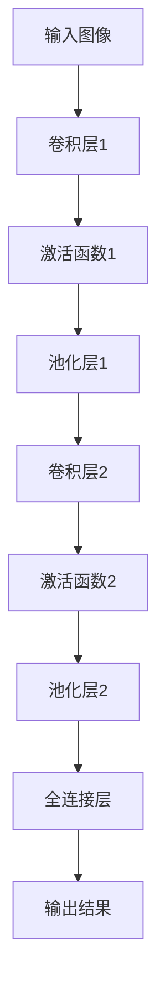

CNN在图像识别中的优势在于其能够自动提取和组合特征，适应各种复杂的图像任务，例如物体检测、图像分类和图像分割。

##### 3.2 目标检测与跟踪

目标检测（Object Detection）是计算机视觉中的一个重要任务，其目标是识别图像中的多个目标，并标注它们的位置。目标检测算法可以分为以下几类：

###### 3.2.1 基于深度学习的目标检测算法

基于深度学习的目标检测算法主要包括以下几种：

1. **R-CNN（Region-based CNN）**：R-CNN是一种区域建议加深度学习的方法，包括区域建议网络（Region Proposal Network，RPN）和卷积神经网络（CNN）两部分。RPN用于生成候选区域，CNN用于分类和定位。

2. **Fast R-CNN**：Fast R-CNN对R-CNN进行了优化，通过共享卷积特征图，提高了检测速度。

3. **Faster R-CNN**：Faster R-CNN引入了区域建议网络（Region Proposal Network，RPN），进一步提高了检测速度和准确性。

4. **SSD（Single Shot Multibox Detector）**：SSD是一种单阶段检测器，能够在单个前向传递过程中同时进行特征提取和目标检测，提高了检测速度。

5. **YOLO（You Only Look Once）**：YOLO是一种单阶段检测器，它将检测问题转化为一个回归问题，通过预测边界框和类别概率，实现了高效的实时目标检测。

以下是Faster R-CNN的基本框架：

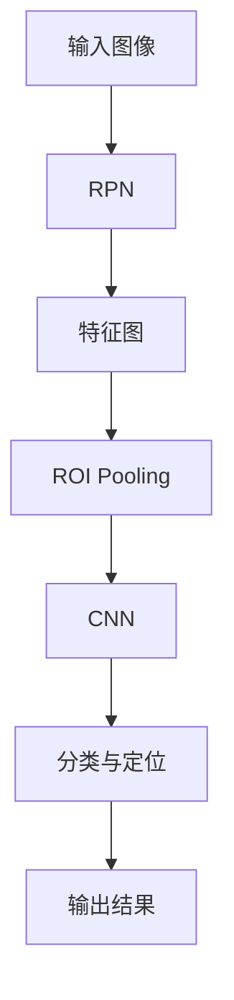

###### 3.2.2 实时目标跟踪算法

目标跟踪（Object Tracking）是另一个重要的计算机视觉任务，其目标是跟踪图像序列中的目标物体。实时目标跟踪算法可以分为以下几类：

1. **基于光流的跟踪算法**：光流法通过计算图像序列中像素点的运动向量，实现目标的跟踪。

2. **基于深度学习的跟踪算法**：深度学习在目标跟踪中也有广泛应用，例如基于循环神经网络（RNN）的方法，通过学习目标在不同帧中的状态变化，实现跟踪。

3. **基于检测的方法**：这种方法结合了目标检测和跟踪，首先使用检测算法检测出目标框，然后使用跟踪算法跟踪目标框。

以下是基于深度学习的跟踪算法的基本框架：

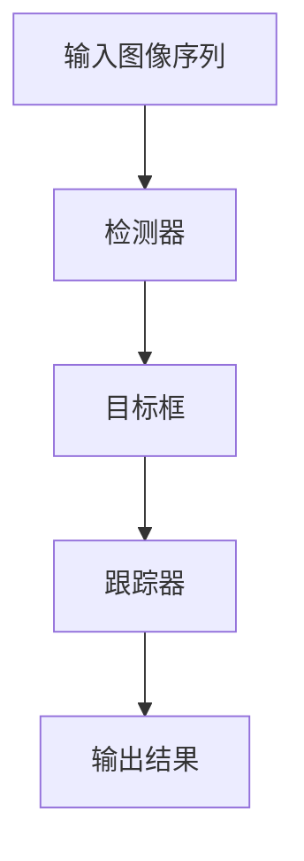

实时目标跟踪算法需要平衡准确性和速度，以满足实际应用的需求。

通过计算机视觉与图像识别技术，AI实现了超感知能力，能够从图像中提取有用信息，进行目标检测和跟踪。这些技术在智能安防、自动驾驶、医疗诊断等众多领域具有广泛的应用前景。

#### 第4章：自然语言处理与文本分析

##### 4.1 文本处理技术

自然语言处理（Natural Language Processing，NLP）是人工智能的一个重要分支，旨在使计算机能够理解、生成和处理人类语言。文本处理技术是NLP的核心，它涵盖了从文本获取信息、理解和生成文本的多个方面。

###### 4.1.1 语言模型与词向量

语言模型（Language Model）是NLP的基础，它用于预测文本序列中下一个单词或字符。语言模型可以分为统计语言模型和神经网络语言模型。

1. **统计语言模型**：统计语言模型基于历史数据和概率统计，如N元语法（N-gram Model）。N元语法假设一个单词的出现概率仅取决于前N-1个单词。

   - N元语法模型：
     $$ P(w_n | w_{n-1}, w_{n-2}, ..., w_1) = \frac{C(w_{n-1}, w_{n-2}, ..., w_1, w_n)}{C(w_{n-1}, w_{n-2}, ..., w_1)} $$
     其中，$C(w_{n-1}, w_{n-2}, ..., w_1, w_n)$ 表示连续出现这些单词的次数，$C(w_{n-1}, w_{n-2}, ..., w_1)$ 表示前N-1个单词的连续出现次数。

2. **神经网络语言模型**：神经网络语言模型通过深度学习技术，如循环神经网络（RNN）和变换器（Transformer），捕捉文本的上下文关系。

   - 基于RNN的语言模型：
     $$ P(w_n | w_{n-1}, w_{n-2}, ..., w_1) = \frac{e^{v^{T} \cdot \sigma(W \cdot [h_{n-1}, w_n])}}{\sum_{w \in V} e^{v^{T} \cdot \sigma(W \cdot [h_{n-1}, w])}} $$
     其中，$v$ 是单词的嵌入向量，$W$ 是权重矩阵，$h_{n-1}$ 是前一个时刻的隐藏状态，$\sigma$ 是激活函数。

词向量（Word Vector）是将单词映射为高维向量的一种表示方法，它能够捕获单词的语义信息。常用的词向量模型包括Word2Vec、GloVe和BERT等。

1. **Word2Vec**：Word2Vec是一种基于神经网络的语言模型，通过训练词向量的共现关系来生成词向量。

   - 词向量的计算：
     $$ \hat{w}_i = \frac{1}{\sqrt{d}} \cdot \text{softmax}(\text{NN}(w_i \cdot v^{T} + b)) $$
     其中，$\text{NN}$ 是神经网络，$v$ 是输入词向量，$\hat{w}_i$ 是预测词向量。

2. **GloVe**：GloVe是一种基于全局上下文的词向量模型，通过同时考虑单词的局部和全局统计信息来生成词向量。

   - GloVe模型：
     $$ \text{cosine}(v_i, v_j) = \frac{f(t_i) \cdot f(t_j)}{\sqrt{f(t_i) + f(t_j)}} $$
     其中，$f(t)$ 是单词$t$的词频。

###### 4.1.2 语法分析和语义分析

语法分析（Syntactic Analysis）是NLP中用于理解文本结构的过程，它涉及句子成分分析、词性标注、句法树构建等。

1. **词性标注（Part-of-Speech Tagging）**：词性标注是将文本中的每个单词标注为不同的词性（如名词、动词、形容词等）。

2. **句法树构建（Syntactic Parsing）**：句法树构建是将文本表示为一个树形结构，表示句子的语法关系。

语义分析（Semantic Analysis）是NLP中用于理解文本意义的过程，它涉及语义角色标注、语义解析、情感分析等。

1. **语义角色标注（Semantic Role Labeling）**：语义角色标注是将句子中的谓词和其相关的作用者（如主语、宾语等）标注出来。

2. **语义解析（Semantic Parsing）**：语义解析是将自然语言文本转换为逻辑表达式或计算机程序。

3. **情感分析（Sentiment Analysis）**：情感分析是判断文本中的情感倾向（如正面、负面、中性）。

通过文本处理技术，NLP能够实现文本分类、机器翻译、问答系统、文本生成等多种任务，极大地提升了人机交互的效率和质量。

##### 4.2 问答系统与对话生成

问答系统（Question Answering System）和对话生成（Dialogue Generation）是NLP中的重要应用，它们能够实现人与机器之间的自然语言交互。

###### 4.2.1 对话系统架构

对话系统通常包括以下组件：

1. **对话管理（Dialogue Management）**：对话管理负责控制对话流程，包括意图识别、对话状态跟踪等。

2. **自然语言理解（Natural Language Understanding，NLU）**：NLU负责解析用户输入的自然语言，提取意图、实体等信息。

3. **对话生成（Dialogue Generation）**：对话生成负责生成自然语言的回答，包括文本生成和语音合成。

4. **自然语言生成（Natural Language Generation，NLG）**：NLG负责将内部逻辑表达式或结构化数据转换为自然语言文本。

一个简单的对话系统架构如下：

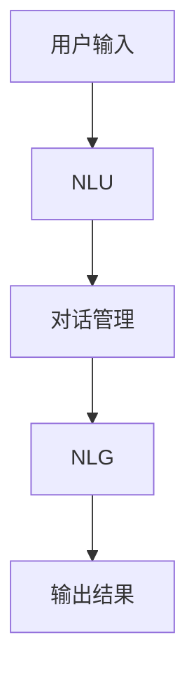

###### 4.2.2 问答系统实现

问答系统实现的关键在于如何理解和生成答案。以下是一个简化的问答系统实现流程：

1. **意图识别（Intent Recognition）**：意图识别是将用户输入的文本映射到预定义的意图标签上。常用的方法包括机器学习分类器（如朴素贝叶斯、支持向量机等）和深度学习模型（如卷积神经网络、循环神经网络等）。

2. **实体提取（Entity Extraction）**：实体提取是从用户输入中提取重要的实体信息，如人名、地点、时间等。常用的方法包括规则提取、监督学习和深度学习。

3. **答案生成（Answer Generation）**：答案生成是根据意图和实体信息，从知识库中查找或生成合适的答案。答案生成的方法包括模板匹配、模板填充、语义角色标注等。

以下是一个简单的问答系统实现伪代码：

```python
def answer_question(question):
    intent = recognize_intent(question)
    entities = extract_entities(question)
    answer = generate_answer(intent, entities)
    return answer

def recognize_intent(question):
    # 使用机器学习或深度学习模型识别意图
    return intent

def extract_entities(question):
    # 从question中提取实体
    return entities

def generate_answer(intent, entities):
    # 根据intent和entities生成答案
    return answer
```

问答系统在智能客服、智能助手等应用中具有广泛的应用，通过理解用户的问题并提供准确的答案，极大地提升了用户体验。

通过自然语言处理与文本分析技术，问答系统和对话生成得以实现，使人与机器之间的交互更加自然和高效。这些技术在智能客服、虚拟助手、文本生成等众多领域具有重要应用价值。

#### 第5章：音频处理与语音识别

##### 5.1 语音信号处理基础

语音信号处理是音频处理的一个重要分支，它涉及对语音信号的分析、处理和转换。语音信号处理基础包括语音信号特性、语音特征提取以及声学模型。

###### 5.1.1 语音信号特性

语音信号是一种复杂的声波信号，它由基音频率（Fundamental Frequency，F0）和噪声成分组成。基音频率决定了语音的音高，而噪声成分则包含了丰富的频谱信息。

1. **基音频率（F0）**：基音频率是语音信号中周期性的频率成分，通常使用倒谱分析（Cepstral Analysis）来提取。

2. **共振峰（Formants）**：共振峰是语音信号频谱中的峰值，它们反映了语音的口腔共鸣特性，对语音的音色有重要影响。

3. **噪声成分**：噪声成分包含了语音信号中的非周期性部分，如摩擦声、爆破声等，它们丰富了语音的音色。

###### 5.1.2 语音特征提取

语音特征提取是语音信号处理的关键步骤，它将语音信号转换为适用于机器学习的特征向量。常用的语音特征包括时域特征、频域特征和倒谱特征。

1. **时域特征**：时域特征直接从时间序列的语音信号中提取，如短时能量、短时过零率等。

2. **频域特征**：频域特征通过傅里叶变换（Fourier Transform）从时域信号转换到频域，如频谱图、功率谱等。

3. **倒谱特征**：倒谱特征是频谱特征的倒频谱，它们能够更好地捕捉语音信号中的共振峰信息，常用于语音识别。

常用的语音特征提取方法包括梅尔频率倒谱系数（MFCC，Mel-frequency Cepstral Coefficients）和感知线性预测系数（PLP，Perceptual Linear Prediction）。

###### 5.1.3 声学模型

声学模型（Acoustic Model）是语音识别系统的核心部分，它用于描述语音信号和其对应的文本之间的映射关系。声学模型可以分为基于统计模型和基于深度神经网络的模型。

1. **基于统计的声学模型**：基于统计的声学模型使用隐马尔可夫模型（HMM，Hidden Markov Model）来描述语音信号的时变特性。HMM通过状态转移概率、发射概率和初始状态概率来建模语音信号。

   - 状态转移概率：描述状态之间的转移概率。
   - 发射概率：描述状态产生的语音特征的概率。
   - 初始状态概率：描述初始状态的概率分布。

2. **基于深度神经网络的声学模型**：基于深度神经网络的声学模型通过深度神经网络（如卷积神经网络、循环神经网络）来直接映射语音信号和其对应的文本。这些模型能够自动学习语音信号和文本之间的复杂映射关系，提高识别准确性。

   - 卷积神经网络（CNN）适用于处理时频图等二维特征。
   - 循环神经网络（RNN）适用于处理序列数据，如语音信号的时序特征。

##### 5.2 基于深度学习的语音识别

基于深度学习的语音识别技术在过去几年中取得了显著的进展，特别是深度神经网络（DNN）和卷积神经网络（CNN）在语音识别中的应用。

###### 5.2.1 HMM模型与深度神经网络

隐马尔可夫模型（HMM）是一种常用的语音识别模型，它通过状态转移概率、发射概率和初始状态概率来建模语音信号。HMM在语音识别中具有以下优点：

1. **自适应能力**：HMM能够自适应不同语音环境和语音特征。
2. **灵活性**：HMM可以灵活地调整模型参数，以适应不同的语音数据。

然而，HMM也存在一些局限性，如难以处理长时依赖关系和复杂的语音特征。为了克服这些局限性，研究者将深度神经网络与HMM结合，形成深度神经网络-HMM（DNN-HMM）模型。

DNN-HMM模型的工作流程如下：

1. **特征提取**：使用深度神经网络（如卷积神经网络、循环神经网络）提取语音信号的时频特征。
2. **DNN训练**：使用大量语音数据训练深度神经网络，使其能够学习语音信号和其对应的文本之间的映射关系。
3. **HMM训练**：使用DNN输出的特征训练HMM模型，包括状态转移概率、发射概率和初始状态概率。

通过DNN-HMM模型，语音识别系统的性能得到了显著提升，特别是在长句子的识别和语音变体的适应性方面。

###### 5.2.2 基于CNN的声学模型

卷积神经网络（CNN）是一种强大的深度学习模型，特别适用于处理图像和音频等二维数据。在语音识别中，CNN可以用于提取语音信号的时频特征。

基于CNN的声学模型通常包括以下组件：

1. **卷积层**：卷积层用于提取语音信号的局部特征，如频谱图、倒谱系数等。
2. **池化层**：池化层用于降低特征图的维度，同时保持重要的特征信息。
3. **全连接层**：全连接层将卷积层和池化层提取的高层次特征映射到输出结果，如语音单元或单词。

以下是一个简单的基于CNN的声学模型结构：

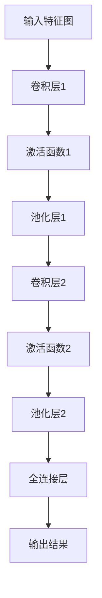

基于CNN的声学模型在语音识别中具有以下优势：

1. **特征提取能力**：CNN能够自动学习语音信号的局部特征，无需人工设计特征。
2. **高精度**：CNN能够提取丰富的特征信息，提高语音识别的准确性。
3. **实时性**：CNN具有较好的实时性，适用于实时语音识别应用。

通过深度学习和卷积神经网络，语音识别技术取得了显著的进步，使得语音识别系统在准确性、鲁棒性和实时性方面都有了显著提升。这些技术为智能语音助手、语音识别应用等提供了强大的支持。

#### 第6章：多模态感知与融合

##### 6.1 多模态数据融合技术

多模态感知（Multimodal Perception）是指利用多种传感模态（如视觉、听觉、触觉等）来感知和理解环境。多模态数据融合（Multimodal Data Fusion）是将来自不同模态的数据整合为统一的信息表示，以提升系统的感知能力。以下是多模态数据融合技术的核心概念和实现方法。

###### 6.1.1 跨模态匹配与表示学习

跨模态匹配（Cross-Modal Matching）是多模态数据融合的关键步骤，其目标是在不同模态之间找到对应关系。表示学习（Representation Learning）则通过学习模态之间的映射，以生成统一的特征表示。

1. **跨模态匹配**：跨模态匹配可以通过以下方法实现：
   - 基于特征的匹配：将不同模态的特征映射到共同的特征空间，然后计算相似度。
   - 基于实例的匹配：直接将不同模态的数据点进行匹配，如视觉图像和音频信号的直接关联。

2. **表示学习**：表示学习可以通过以下技术实现：
   - 联合嵌入（Joint Embedding）：将不同模态的数据点映射到同一低维空间中，以捕捉模态之间的关联。
   - 预训练模型：使用预训练的深度学习模型（如变换器（Transformer））来学习模态之间的映射关系。

以下是一个简单的跨模态匹配与表示学习的框架：

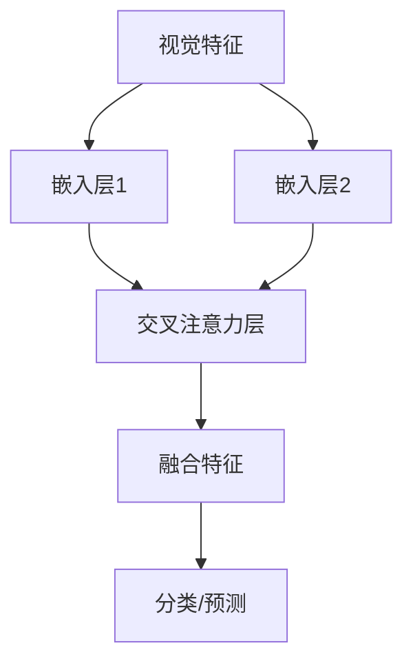

在这个框架中，视觉特征和音频特征分别通过不同的嵌入层映射到共同的低维空间，然后通过交叉注意力层进行融合，生成融合特征，用于分类或预测任务。

###### 6.1.2 融合模型的构建

融合模型的构建是多模态感知的核心，它包括以下关键步骤：

1. **特征级融合**：在特征级融合中，来自不同模态的特征向量直接相加或拼接，生成统一的特征向量。

   - 拼接融合：
     $$ \text{融合特征} = [\text{视觉特征}, \text{听觉特征}] $$

2. **决策级融合**：在决策级融合中，每个模态的模型独立地生成预测结果，然后通过投票、加权等方法综合这些结果。

   - 加权融合：
     $$ \text{预测结果} = w_1 \cdot \text{视觉预测} + w_2 \cdot \text{听觉预测} $$
     其中，$w_1$ 和 $w_2$ 是权重系数。

3. **深度级融合**：深度级融合通过多层神经网络将不同模态的数据融合在一起，生成统一的特征表示。

   - 深度级融合模型：
     ```mermaid
     graph TB
     A[视觉特征] --> B[卷积神经网络]
     A --> C[听觉特征]
     C --> B
     B --> D[全连接层]
     D --> E[输出结果]
     ```

通过构建融合模型，多模态感知系统能够综合利用来自不同模态的信息，提高感知的准确性和鲁棒性。

##### 6.2 实时感知与决策

实时感知与决策是多模态感知系统的关键应用，它要求系统能够快速、准确地处理多模态数据，并在有限的时间内做出合理的决策。

###### 6.2.1 基于实时数据的感知算法

基于实时数据的感知算法需要处理高速率的数据流，并实时更新系统的状态。以下是一些关键算法：

1. **滑动窗口算法**：滑动窗口算法通过在时间维度上滑动窗口，实时处理当前窗口内的数据，并更新系统的状态。

2. **在线学习算法**：在线学习算法能够实时更新模型的参数，以适应不断变化的数据环境。

3. **增量计算算法**：增量计算算法通过计算数据流的变化量，实时更新系统的状态，以减少计算量。

以下是一个简单的实时感知算法框架：

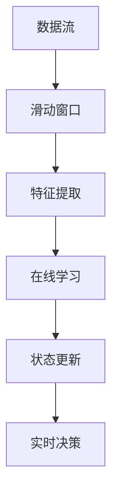

在这个框架中，数据流通过滑动窗口被实时处理，特征提取模块提取当前窗口内的特征，在线学习模块更新模型参数，状态更新模块实时更新系统的状态，实时决策模块根据当前状态做出决策。

###### 6.2.2 基于深度学习的决策模型

深度学习技术在实时决策模型中具有广泛的应用，通过训练深度神经网络，系统能够自动学习多模态数据之间的复杂关系，并做出准确的决策。

1. **多层感知器（MLP）**：多层感知器是一种简单的深度学习模型，它通过多个隐藏层将输入映射到输出。

2. **卷积神经网络（CNN）**：卷积神经网络特别适用于处理二维数据，如图像和时频图。

3. **循环神经网络（RNN）**：循环神经网络适用于处理序列数据，如时间序列数据和语音信号。

以下是一个简单的基于深度学习的实时决策模型框架：

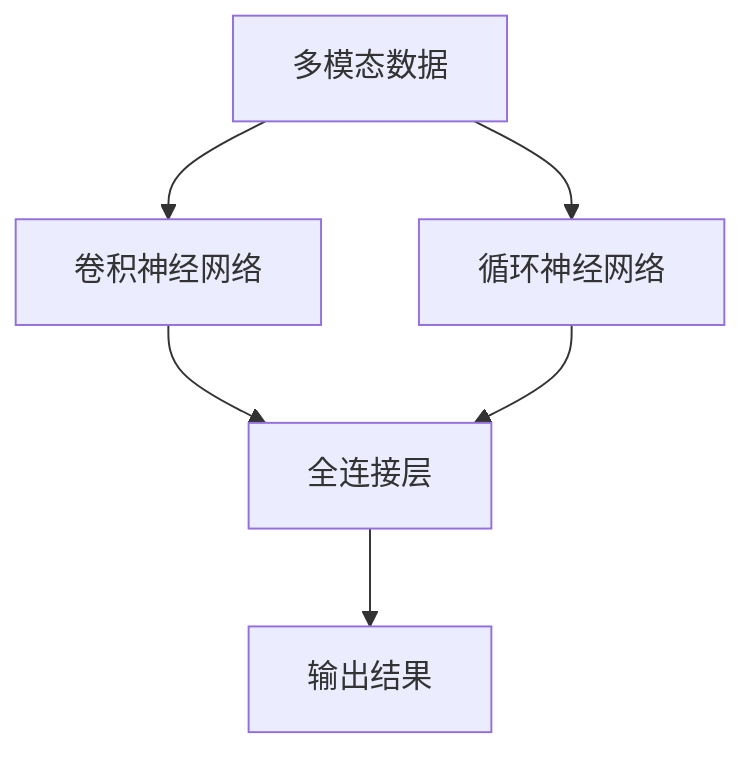

在这个框架中，多模态数据通过卷积神经网络和循环神经网络处理，生成融合特征，全连接层将特征映射到输出结果，用于实时决策。

通过实时感知与决策技术，多模态感知系统能够快速、准确地处理多模态数据，并做出合理的决策。这些技术广泛应用于智能交互、机器人控制、自动驾驶等领域，为人类提供了更加智能和高效的感知与决策支持。

#### 第7章：智能安防与监控

##### 7.1 智能安防系统架构

智能安防系统是利用先进的计算机技术、网络通信技术、传感器技术等，对目标区域进行实时监控、报警、分析和处理，从而实现安全防范的系统。智能安防系统架构通常包括以下几个核心模块：

1. **感知层**：感知层是智能安防系统的最底层，负责感知和采集数据。常见的感知设备有摄像头、传感器、门禁系统等。这些设备能够实时捕捉视频、音频、环境参数等信息。

2. **传输层**：传输层负责将感知层采集到的数据传输到处理层。数据传输可以通过有线或无线网络进行，如光纤、Wi-Fi、5G等。为了保证数据传输的安全和稳定性，通常采用加密传输技术。

3. **处理层**：处理层是智能安防系统的核心，负责对采集到的数据进行分析和处理。处理层包括视频分析模块、音频分析模块、数据存储模块等。视频分析模块使用计算机视觉算法进行目标检测、人脸识别、行为分析等；音频分析模块通过语音识别技术实现语音识别和声音分析。

4. **决策层**：决策层根据处理层的结果，进行实时决策和报警。决策层通常包括智能算法、规则引擎、专家系统等。当检测到异常情况时，决策层会触发报警机制，并生成相应的应急预案。

5. **应用层**：应用层是智能安防系统的最终用户界面，包括监控中心、移动端应用、Web端应用等。用户可以通过这些界面实时查看监控视频、接收报警信息、管理设备等。

智能安防系统的基本架构可以表示为：

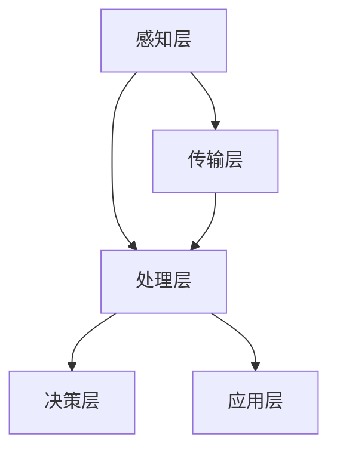

##### 7.2 实际应用案例解析

智能安防系统在实际应用中已经取得了显著的效果，以下是一些典型的实际应用案例：

###### 案例一：智能视频分析在交通管理中的应用

在交通管理中，智能视频分析系统能够实时监控交通流量、车辆行为等。以下是一个典型的应用案例：

1. **数据采集**：通过在道路沿线安装摄像头，实时采集交通视频数据。

2. **视频分析**：使用计算机视觉算法对视频数据进行分析，包括车辆识别、车辆计数、车辆速度检测等。

3. **决策与报警**：当系统检测到交通流量异常（如拥堵、交通事故等）时，会自动生成报警信息，并通过短信、邮件等方式通知相关部门。

4. **数据存储**：系统将分析结果存储在数据库中，以便后续的数据分析和报告生成。

以下是一个简单的智能视频分析流程：

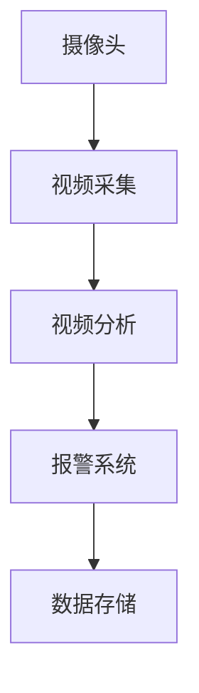

通过智能视频分析系统，交通管理部门能够实时监控交通状况，快速响应交通事件，提高交通管理的效率和安全性。

###### 案例二：智能安防监控系统在住宅小区的应用

在住宅小区中，智能安防监控系统可以提供全方位的安全保障。以下是一个典型的应用案例：

1. **数据采集**：在小区内外安装摄像头、门禁系统、传感器等，实时采集视频、门禁、环境参数等信息。

2. **视频分析**：使用计算机视觉算法对人脸进行识别、行为分析等，识别潜在的安全威胁。

3. **决策与报警**：当系统检测到可疑人员或行为时，会自动生成报警信息，并触发报警机制。

4. **数据存储与共享**：系统将分析结果存储在数据库中，并与其他相关系统（如公安部门）进行数据共享，实现联防联控。

以下是一个简单的智能安防监控流程：

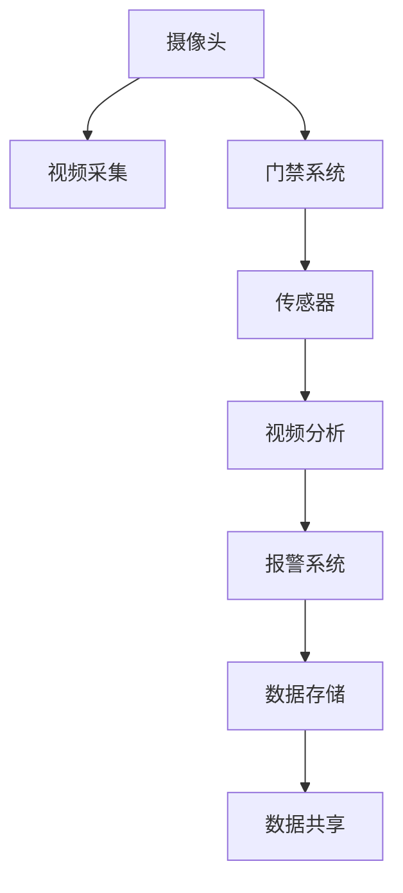

通过智能安防监控系统，住宅小区能够提供更安全、更舒适的居住环境，同时降低物业管理的成本。

智能安防监控系统通过感知、分析、决策和报警等环节，实现了对目标区域的实时监控和安全保障。这些技术在实际应用中已经取得了显著的效果，为人们的生产和生活提供了强有力的安全保障。

#### 第8章：智能客服与客户体验优化

##### 8.1 智能客服系统架构

智能客服系统是利用人工智能技术提供高效、便捷的客户服务解决方案。智能客服系统通常包括以下几个核心模块：

1. **前端界面**：前端界面是用户与智能客服系统交互的窗口，包括网页、移动应用、聊天机器人等。用户可以通过这些界面提出问题或请求。

2. **自然语言处理（NLP）模块**：自然语言处理模块负责解析用户输入的自然语言，提取意图和实体。NLP模块通常包括意图识别、实体提取、语义理解等功能。

3. **知识库**：知识库是智能客服系统中的核心数据资源，包含了各种问题的答案、解决方案、产品信息等。知识库可以是结构化的（如关系数据库）或非结构化的（如文本数据库）。

4. **对话管理模块**：对话管理模块负责控制对话流程，根据用户的意图和当前对话状态，选择合适的响应策略。对话管理模块通常包括对话状态跟踪、上下文管理、意图确认等功能。

5. **语音识别与生成模块**：语音识别模块负责将用户的语音输入转换为文本，而语音生成模块则负责将文本响应转换为自然流畅的语音输出。

6. **后端服务**：后端服务包括数据库、计算资源、API接口等，用于支持前端界面的交互、知识库的查询和更新、对话管理等功能。

智能客服系统的基本架构可以表示为：

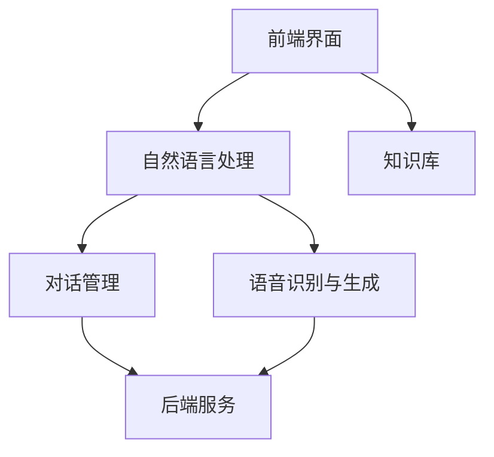

##### 8.2 客户体验分析

客户体验（Customer Experience，CX）是指客户在与企业互动过程中所获得的整体感受和体验。客户体验分析是智能客服系统的重要环节，通过分析用户行为、满意度、反馈等数据，了解用户的需求和痛点，从而优化客服体验。

1. **用户行为分析**：通过分析用户的访问路径、点击率、交互时长等数据，了解用户的使用习惯和偏好。例如，通过分析用户在网页上的点击路径，可以优化界面布局，提高用户的操作便捷性。

2. **满意度调查**：通过在线调查、问卷调查等方式，收集用户的满意度评价。满意度调查可以帮助企业了解用户对客服服务的整体评价，识别需要改进的方面。

3. **用户反馈分析**：用户反馈是优化客服体验的重要依据。通过分析用户反馈中的关键词、主题等，可以识别用户的主要需求和问题，从而针对性地进行改进。

4. **用户流失分析**：通过分析用户流失的原因，如服务不满意、操作复杂等，可以针对性地优化客服流程，提高用户的留存率。

##### 8.3 智能客服系统的设计与实现

智能客服系统的设计与实现涉及到前端界面设计、后端开发、自然语言处理、对话生成等多个方面。以下是一个典型的智能客服系统设计与实现过程：

###### 前端界面设计

1. **界面布局**：设计简洁、直观的界面布局，使用户能够快速找到所需的功能。

2. **交互设计**：设计人性化的交互方式，如智能语音助手、聊天机器人等，提高用户的使用体验。

3. **响应式设计**：确保智能客服系统在不同设备（如手机、平板、电脑）上都能良好地展示和运行。

###### 后端开发

1. **服务器搭建**：选择合适的服务器硬件和软件，搭建稳定的服务器环境。

2. **数据库设计**：设计合理的数据库结构，存储用户信息、知识库数据等。

3. **API开发**：开发与前端界面交互的API接口，实现数据的传输和操作。

4. **系统安全**：确保系统的安全性，如数据加密、权限控制等。

###### 自然语言处理

1. **意图识别**：使用机器学习或深度学习模型，实现用户输入的自然语言意图识别。

2. **实体提取**：从用户输入中提取关键信息，如人名、地点、时间等。

3. **语义理解**：理解用户的自然语言表达，实现语义分析。

4. **对话生成**：根据用户的意图和当前对话状态，生成合适的自然语言回复。

###### 对话生成

1. **模板生成**：使用预定义的模板，生成标准化的回答。

2. **文本生成**：使用深度学习模型，如变换器（Transformer），生成个性化的自然语言回复。

3. **语音合成**：将文本回复转换为自然流畅的语音，使用语音合成技术。

通过智能客服系统的设计与实现，企业能够提供更加高效、便捷的客户服务，提升客户体验，从而增强客户满意度和忠诚度。

#### 第9章：智能家居与物联网

##### 9.1 物联网与智能家居概述

物联网（Internet of Things，IoT）是一种通过互联网将各种设备和物品连接起来的技术，使其能够相互通信和协作，实现智能化管理和控制。智能家居（Smart Home）是物联网应用的一个重要领域，它通过集成各种智能设备，实现家庭环境中的自动化和智能化管理。

###### 9.1.1 物联网架构

物联网架构通常包括以下几个层次：

1. **感知层**：感知层是物联网系统的最底层，负责感知和采集数据。常见的感知设备有传感器、摄像头、门禁系统等。这些设备能够实时采集温度、湿度、光照、声音等环境参数，并将数据传输到下一层。

2. **传输层**：传输层负责将感知层采集到的数据传输到处理层。数据传输可以通过有线或无线网络进行，如Wi-Fi、ZigBee、5G等。传输层确保数据的安全、稳定和高效传输。

3. **网络层**：网络层是物联网系统的核心，负责数据传输、路由、协议转换等。网络层通常包括服务器、网关、路由器等设备，它们负责协调和管理整个物联网系统。

4. **平台层**：平台层提供数据存储、处理、分析和应用开发等功能。平台层通常包括云计算平台、大数据平台、应用开发平台等。平台层使物联网系统能够实现数据的集中管理和智能分析。

5. **应用层**：应用层是物联网系统的最终用户界面，包括移动应用、Web应用、智能家电等。应用层使用户能够实时监控、控制和交互物联网系统。

物联网架构可以表示为：

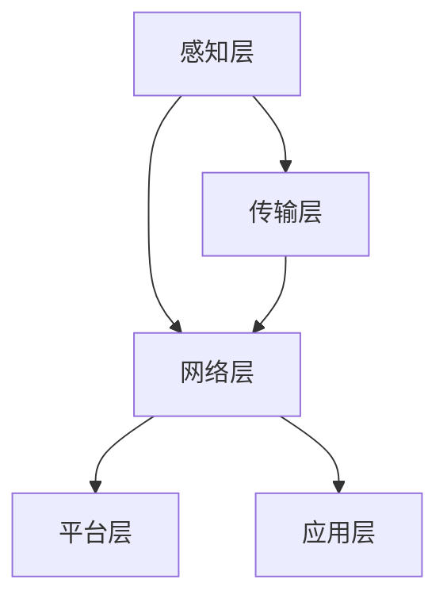

###### 9.1.2 智能家居技术发展

智能家居技术经历了从简单设备连接到智能平台集成的演变。以下是一些关键发展：

1. **智能设备的连接**：早期的智能家居主要通过蓝牙、Wi-Fi等技术连接单个智能设备，如智能灯泡、智能插座等。

2. **智能平台集成**：随着物联网技术的发展，智能家居设备开始通过统一的智能平台进行集成和管理，如Apple HomeKit、Google Home、Amazon Alexa等。

3. **多模态交互**：智能家居系统开始支持多种交互方式，如语音控制、手势控制、远程控制等，提高了用户的便利性和体验。

4. **人工智能应用**：人工智能技术在智能家居中的应用越来越广泛，如语音识别、自然语言处理、机器学习等，使得智能家居系统能够更好地理解用户需求，提供个性化服务。

##### 9.2 智能家居系统设计与实现

智能家居系统的设计与实现涉及硬件搭建、软件开发、系统集成等多个方面。以下是一个典型的智能家居系统设计与实现过程：

###### 硬件搭建

1. **智能设备选择**：根据需求选择合适的智能设备，如智能灯泡、智能插座、智能摄像头、智能门锁等。

2. **硬件连接**：将智能设备连接到家庭网络，如Wi-Fi、ZigBee等。

3. **传感器安装**：安装各种传感器，如温度传感器、湿度传感器、光照传感器等，用于监测家庭环境参数。

4. **电源配置**：为智能设备配置合适的电源，如USB电源、电池等。

###### 软件开发

1. **前端开发**：开发智能家居系统的前端界面，包括网页、移动应用等。前端界面应简洁易用，支持多种交互方式。

2. **后端开发**：开发智能家居系统的后端服务，包括服务器搭建、API接口开发、数据存储等。后端服务应支持数据的实时处理、存储和共享。

3. **自然语言处理**：实现自然语言处理功能，如语音识别、自然语言理解等，使用户可以通过语音命令控制智能家居系统。

4. **机器学习**：使用机器学习技术，如回归分析、聚类分析等，对采集到的传感器数据进行实时分析，提供个性化服务。

###### 系统集成

1. **设备集成**：将各种智能设备集成到智能家居系统中，实现设备之间的联动和协同工作。

2. **平台集成**：将智能家居系统与智能平台（如Apple HomeKit、Google Home等）集成，实现跨平台的统一管理和控制。

3. **安全防护**：确保智能家居系统的安全性，如数据加密、权限控制等，防止数据泄露和设备被非法控制。

通过智能家居系统，用户可以实时监控家庭环境，远程控制智能设备，提高生活品质。智能家居技术正在不断发展和完善，为人们的生活带来了更多便利和舒适。

### 附录

#### 附录A：AI超感知能力相关工具与资源

为了帮助读者更好地理解和实践AI超感知能力，以下是一些常用的工具与资源：

##### A.1 开源深度学习框架

1. **TensorFlow**：由Google开发的开源深度学习框架，广泛应用于图像识别、自然语言处理、语音识别等领域。
   - 官网：[TensorFlow官网](https://www.tensorflow.org/)

2. **PyTorch**：由Facebook开发的开源深度学习框架，以其灵活性和易用性受到广泛关注。
   - 官网：[PyTorch官网](https://pytorch.org/)

##### A.2 数据集与资源下载

1. **ImageNet**：一个大规模的图像识别数据集，包含数百万个分类标签。
   - 官网：[ImageNet官网](http://www.image-net.org/)

2. **Common Crawl**：一个大规模的网页文本数据集，用于自然语言处理任务。
   - 官网：[Common Crawl官网](https://commoncrawl.org/)

3. **LibriSpeech**：一个包含大量语音数据的数据集，用于语音识别任务。
   - 官网：[LibriSpeech官网](http://www.kaggle.com/datasets/librispeech)

##### A.3 资源下载与使用指南

1. **开源代码和教程**：许多深度学习项目在GitHub等平台上提供了开源代码和教程，便于学习和实践。
   - GitHub：[GitHub官网](https://github.com/)

2. **在线教程和课程**：在线平台如Udacity、Coursera等提供了丰富的AI和深度学习教程和课程。
   - Udacity：[Udacity官网](https://www.udacity.com/)
   - Coursera：[Coursera官网](https://www.coursera.org/)

通过以上工具和资源，读者可以更好地掌握AI超感知能力的相关技术和应用，进行深度学习和实践。

### 参考文献

1. Goodfellow, I., Bengio, Y., & Courville, A. (2016). *Deep Learning*.
2. Russell, S., & Norvig, P. (2016). *Artificial Intelligence: A Modern Approach*.
3. Lippmann, R. P. (1987). *An introduction to computation in neural networks*. IEEE ASSP Magazine, 4(4), 4-22.
4. LeCun, Y., Bengio, Y., & Hinton, G. (2015). *Deep learning*. Nature, 521(7553), 436-444.
5. Deng, J., Dong, W., Socher, R., Li, L. J., Li, K., & Fei-Fei, L. (2009). *Imagenet: A large-scale hierarchical image database*. In 2009 IEEE conference on computer vision and pattern recognition (pp. 248-255). IEEE.
6. Bengio, Y. (2009). *Learning deep architectures for AI*. Foundations and Trends in Machine Learning, 2(1), 1-127.
7. Graves, A., Mohamed, A. R., & Hinton, G. (2013). *Speech recognition with deep recurrent neural networks*. In Acoustics, speech and signal processing (ICASSP), 2013 IEEE international conference on (pp. 6645-6649). IEEE.
8. Vincent, P., & Larochelle, H. (2010). *Stacked denoising autoencoders: Learning useful representations in a deep network with a local denoising criterion*. Journal of Machine Learning Research, 11(Nov), 3371-3408.

### 作者信息

作者：AI天才研究院（AI Genius Institute）/《禅与计算机程序设计艺术》（Zen And The Art of Computer Programming）

