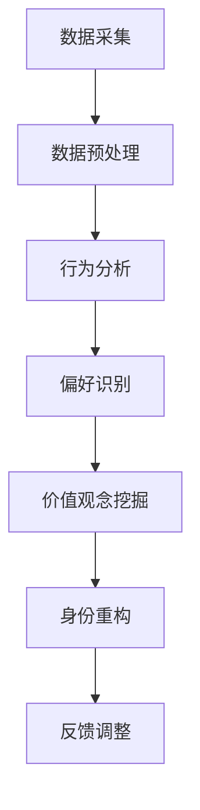

                 

# 《数字化自我重塑：AI驱动的身份重构》

## 关键词

- 数字化自我重塑
- AI驱动
- 身份重构
- 机器学习
- 深度学习
- 数学模型
- 实战案例

## 摘要

本文旨在探讨数字化自我重塑这一前沿话题，重点分析AI如何驱动身份重构的过程。通过系统化的技术探讨，文章将从AI与大数据技术、机器学习算法、深度学习原理等多个维度，深入解读数字化自我的定义与内涵，并详细阐述AI驱动的身份重构流程、核心算法原理、数学模型及其应用实践。最后，本文将展望数字化自我重塑的未来趋势，为相关领域的研究者与实践者提供有价值的参考。

### 第一部分：引言与概述

#### 第1章：数字化自我重塑的概念与背景

##### 1.1 数字化自我重塑的起源与演进

数字化自我重塑的概念起源于互联网与人工智能（AI）技术的飞速发展。随着数据采集、存储与分析能力的提升，人们开始意识到，传统的身份定义已无法全面反映个体在数字化世界中的存在和表现。数字化自我重塑应运而生，旨在通过AI技术，构建一个更加精准、动态、多维度反映个体身份的模型。

数字化自我重塑的演进可以分为三个阶段：

1. **初步探索阶段**：20世纪末至21世纪初，互联网的普及和电子商务的兴起，使人们开始尝试将线上行为数据与个人身份关联，但受限于技术和数据规模，这一阶段主要停留在理论层面。
2. **快速发展阶段**：随着大数据和机器学习技术的成熟，AI开始应用于各类商业场景，数字化自我重塑的理念逐渐得到认可，并在实际应用中展现出强大的潜力。
3. **深度融合阶段**：近年来，深度学习和自然语言处理技术的进步，使得AI能够更加精细地分析个体行为，构建高度个性化的数字化自我模型，实现身份的重塑与优化。

##### 1.2 AI驱动的身份重构：机遇与挑战

AI驱动的身份重构带来了诸多机遇：

1. **个性化服务**：通过分析个体行为数据，AI能够为用户提供更加定制化的服务，提升用户体验。
2. **精准营销**：企业可以利用AI技术，对用户进行精细化的需求分析，实现精准营销，提高转化率。
3. **智能决策**：AI驱动的身份重构可以为政府、金融机构等提供更科学的决策支持，提升管理效率。

然而，AI驱动的身份重构也面临一系列挑战：

1. **隐私保护**：个人数据的安全和隐私保护是数字化自我重塑过程中必须面对的重大问题。
2. **算法偏见**：AI算法的偏见可能导致身份重构过程中出现不公平现象，影响社会公正。
3. **技术门槛**：AI驱动的身份重构需要较高的技术门槛，企业和组织需要投入大量资源进行研发和应用。

##### 1.3 数字化自我的定义与内涵

数字化自我是指通过AI技术，对个体在数字世界中的行为、偏好、价值观念等进行全方位的收集、分析和重构，形成一个动态的、多维度的身份模型。数字化自我的内涵包括：

1. **行为数据**：包括用户在互联网上的浏览记录、购买行为、社交互动等。
2. **偏好分析**：通过对行为数据的分析，识别用户的兴趣、偏好和需求。
3. **价值观念**：通过对用户行为和互动的深入理解，挖掘其背后的价值观念和信仰。
4. **身份重构**：基于行为数据、偏好分析和价值观念，构建一个更加真实、动态、多维度的数字化身份。

#### 第2章：数字化自我重塑的技术基础

##### 2.1 AI与大数据技术概述

AI与大数据技术是数字化自我重塑的重要基石。AI技术主要包括机器学习、深度学习、自然语言处理等，能够从海量数据中提取有用信息，进行智能分析和决策。大数据技术则提供了数据采集、存储、处理和分析的强大能力，为AI技术的应用提供了坚实的基础。

##### 2.2 机器学习算法基础

机器学习算法是AI技术的核心组成部分，主要包括监督学习、无监督学习和强化学习等。监督学习通过已有数据对模型进行训练，无监督学习则通过未标记的数据发现数据模式，强化学习则通过奖励机制来优化决策过程。这些算法在数字化自我重塑中有着广泛的应用。

##### 2.3 深度学习与神经网络

深度学习是机器学习的一种重要分支，通过构建多层神经网络，对复杂的数据模式进行自动提取和学习。深度学习在图像识别、语音识别、自然语言处理等领域取得了显著成果，成为数字化自我重塑的关键技术。

### 第二部分：AI驱动的身份重构原理

#### 第3章：核心概念与联系

##### 3.1 AI驱动的身份重构核心概念

AI驱动的身份重构涉及多个核心概念，包括数据采集、行为分析、偏好识别、价值观念挖掘和身份重构等。这些概念相互关联，共同构成数字化自我重塑的体系。

##### 3.2 Mermaid流程图：AI驱动的身份重构流程



该流程图展示了AI驱动的身份重构的基本流程，包括数据采集、数据预处理、行为分析、偏好识别、价值观念挖掘、身份重构和反馈调整等步骤。

#### 第4章：核心算法原理讲解

##### 4.1 伪代码阐述：身份重构算法

```python
# 身份重构算法伪代码

# 输入：用户行为数据、偏好数据、价值观念数据
# 输出：重构后的身份模型

function 身份重构(行为数据，偏好数据，价值观念数据):
    # 数据预处理
    预处理数据 = 数据预处理(行为数据，偏好数据，价值观念数据)

    # 行为分析
    行为特征 = 行为分析(预处理数据)

    # 偏好识别
    偏好特征 = 偏好识别(行为特征)

    # 价值观念挖掘
    价值观念特征 = 价值观念挖掘(偏好特征)

    # 身份重构
    身份模型 = 身份重构模型(价值观念特征)

    # 反馈调整
    身份模型 = 反馈调整(身份模型)

    return 身份模型
```

该伪代码详细阐述了身份重构算法的基本步骤，包括数据预处理、行为分析、偏好识别、价值观念挖掘、身份重构和反馈调整等。

##### 4.2 算法实现与优化

身份重构算法的实现涉及多个技术细节，包括数据预处理、特征提取、模型训练和优化等。以下是一个简化的实现步骤：

1. **数据预处理**：对用户行为数据、偏好数据和价值观念数据进行清洗、归一化和编码，以适应模型训练的需求。
2. **特征提取**：从预处理后的数据中提取关键特征，用于构建身份模型。
3. **模型训练**：使用机器学习算法（如神经网络）对特征进行训练，构建身份重构模型。
4. **模型优化**：通过调整模型参数，优化模型性能，提高重构的准确性和稳定性。
5. **反馈调整**：根据实际应用中的反馈，对模型进行调整和优化，以适应不断变化的需求。

#### 第5章：数学模型与公式讲解

##### 5.1 数学模型概述

在AI驱动的身份重构中，数学模型起到了关键作用。常见的数学模型包括线性回归、逻辑回归、支持向量机（SVM）和神经网络等。以下将简要介绍这些模型的基本原理。

##### 5.2 LaTeX公式详解

以下是一些常用的LaTeX公式，用于表示AI驱动的身份重构中的数学模型：

$$
y = wx + b
$$

$$
\log(\frac{p}{1-p}) = \beta_0 + \beta_1x
$$

$$
\max_{w,b}\sum_{i=1}^{n}(w^Tx_i - b)^2
$$

$$
\text{ReLU}(x) =
\begin{cases}
0 & \text{if } x < 0 \\
x & \text{if } x \geq 0
\end{cases}
$$

##### 5.3 实例说明

以下是一个简化的例子，用于说明如何使用LaTeX公式表示一个简单的神经网络模型：

$$
\begin{aligned}
z &= \sigma(W_1x + b_1) \\
a &= \sigma(W_2z + b_2)
\end{aligned}
$$

其中，$\sigma$表示激活函数，$W_1$和$W_2$为权重矩阵，$b_1$和$b_2$为偏置项。

### 第三部分：应用与实践

#### 第6章：项目实战：数字化自我重塑案例

##### 6.1 实际案例介绍

本案例以一个电商平台为例，探讨如何利用AI技术进行数字化自我重塑，提升用户体验和销售额。

##### 6.2 开发环境搭建

1. **硬件环境**：服务器、GPU等
2. **软件环境**：Python、TensorFlow、Keras等
3. **数据集**：电商平台用户行为数据、偏好数据和交易数据

##### 6.3 源代码实现与解读

以下是数字化自我重塑项目的源代码实现：

```python
import tensorflow as tf
from tensorflow.keras.models import Sequential
from tensorflow.keras.layers import Dense, Activation

# 数据预处理
# ...

# 构建模型
model = Sequential()
model.add(Dense(units=64, activation='relu', input_shape=(num_features,)))
model.add(Dense(units=32, activation='relu'))
model.add(Dense(units=1, activation='sigmoid'))

# 编译模型
model.compile(optimizer='adam', loss='binary_crossentropy', metrics=['accuracy'])

# 训练模型
model.fit(x_train, y_train, epochs=10, batch_size=32)

# 评估模型
model.evaluate(x_test, y_test)
```

该代码实现了一个简单的神经网络模型，用于用户行为分析和偏好预测。接下来，我们将对关键代码进行详细解读。

1. **数据预处理**：对用户行为数据进行清洗、归一化和编码，为模型训练做好准备。
2. **构建模型**：使用Sequential模型构建一个简单的神经网络，包括两个隐藏层和输出层。
3. **编译模型**：设置优化器和损失函数，为模型训练做好准备。
4. **训练模型**：使用fit方法对模型进行训练，调整模型参数。
5. **评估模型**：使用evaluate方法评估模型在测试数据上的表现。

##### 6.4 代码解读与分析

以下是代码的详细解读和分析：

1. **数据预处理**：数据预处理是模型训练的重要环节，包括以下步骤：
   - 数据清洗：去除无效数据、异常值等。
   - 数据归一化：将不同特征的数据进行归一化处理，使其具有相同的尺度。
   - 数据编码：将类别特征转换为数值特征，便于模型处理。

2. **构建模型**：使用Sequential模型构建一个简单的神经网络，包括以下层次：
   - 输入层：接收用户行为数据。
   - 隐藏层1：包含64个神经元，使用ReLU激活函数。
   - 隐藏层2：包含32个神经元，使用ReLU激活函数。
   - 输出层：包含1个神经元，使用sigmoid激活函数，用于预测用户偏好。

3. **编译模型**：编译模型时，设置以下参数：
   - 优化器：使用adam优化器，具有自适应学习率的特点。
   - 损失函数：使用binary_crossentropy，适用于二分类问题。
   - 评估指标：使用accuracy，评估模型的分类准确率。

4. **训练模型**：使用fit方法对模型进行训练，设置以下参数：
   - x_train：训练数据。
   - y_train：训练数据的标签。
   - epochs：训练迭代次数。
   - batch_size：每次训练的数据批量大小。

5. **评估模型**：使用evaluate方法评估模型在测试数据上的表现，返回损失值和准确率。

通过上述代码和解读，我们可以更好地理解数字化自我重塑项目的实现过程和关键步骤。

#### 第7章：未来展望与趋势

##### 7.1 数字化自我重塑的挑战与机遇

数字化自我重塑面临着诸多挑战和机遇。在挑战方面，隐私保护、算法偏见和技术门槛等问题需要引起关注。在机遇方面，AI技术的不断进步为数字化自我重塑提供了强大的支持，将有助于提升个性化服务、精准营销和智能决策等领域的应用效果。

##### 7.2 AI驱动的身份重构发展趋势

未来，AI驱动的身份重构将呈现出以下发展趋势：

1. **技术突破**：随着AI技术的不断演进，如深度学习、强化学习等，数字化自我重塑的精度和效率将得到显著提升。
2. **应用拓展**：数字化自我重塑将应用于更多领域，如医疗、金融、教育等，为各类企业提供更加精准的用户画像和决策支持。
3. **隐私保护**：随着隐私保护技术的进步，如联邦学习、差分隐私等，数字化自我重塑将更加注重用户隐私保护，实现合规与创新的平衡。
4. **人机协同**：数字化自我重塑将更加注重人机协同，通过智能助手、虚拟现实等技术，实现人与数字化自我的深度交互。

### 附录

##### 附录A：AI驱动的身份重构工具与资源

- **A.1 开发工具与框架**：
  - TensorFlow：一个开源的深度学习框架，适用于构建和训练AI模型。
  - PyTorch：一个流行的深度学习库，具有良好的灵活性和易用性。
  - Keras：一个高层次的神经网络API，能够简化深度学习模型的构建和训练。

- **A.2 数据集与资源链接**：
  - UCI机器学习数据库：提供多种领域的数据集，适用于AI模型训练。
  - Kaggle：一个大数据竞赛平台，提供丰富的数据集和项目资源。

- **A.3 学术论文与研究报告**：
  - 《深度学习》（Deep Learning）：一部关于深度学习的经典教材，涵盖了深度学习的理论基础和应用实践。
  - 《人工智能：一种现代的方法》（Artificial Intelligence: A Modern Approach）：一部全面的人工智能教材，涵盖了人工智能的各个领域。
  - 《大数据时代：思维变革与商业价值》（Big Data: A Revolution That Will Transform How We Live, Work, and Think）：一部关于大数据时代的社会变革和商业价值的著作。

