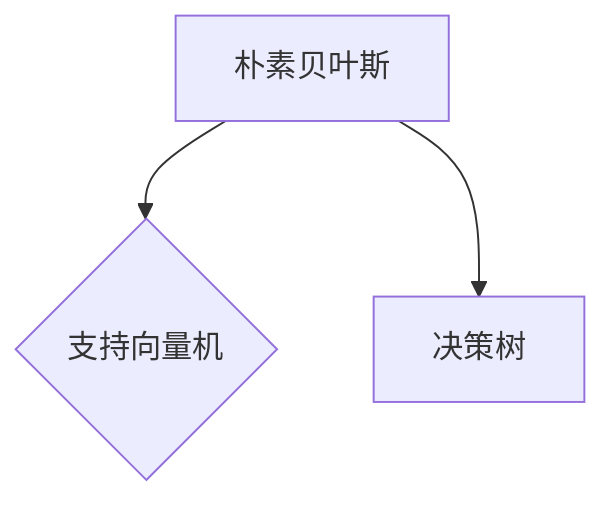
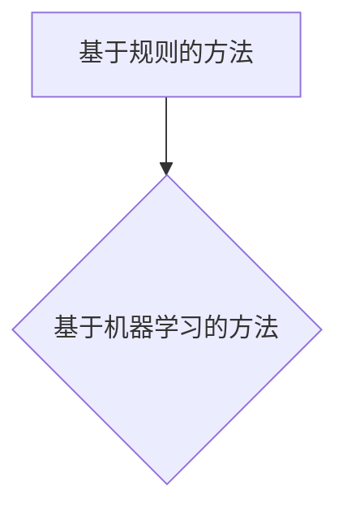
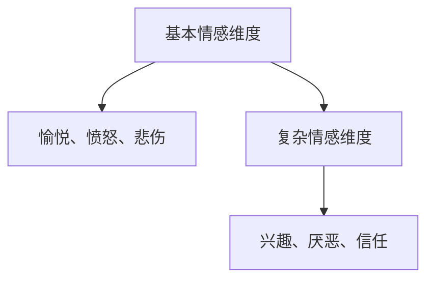
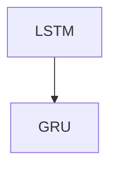
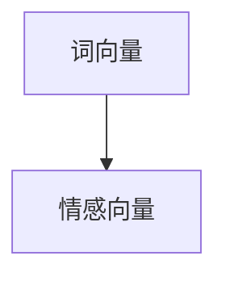
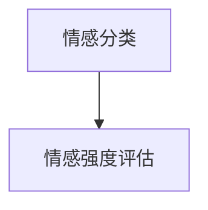

                 

# 文章标题：数字化遗产情感AI创业：逝者个性的数字化传承

## 关键词

数字化遗产、情感AI、创业实践、核心技术、应用案例、挑战与发展

## 摘要

随着人工智能技术的飞速发展，数字化遗产情感AI逐渐成为传承文化、保护遗产的重要工具。本文旨在探讨数字化遗产情感AI的定义、核心技术、创业策略及其实践应用，通过深入分析情感识别与理解技术、自然语言处理、计算机视觉等核心领域，揭示数字化遗产情感AI在创业中的挑战与机遇。本文旨在为相关创业者提供有价值的参考，推动数字化遗产情感AI在各个领域的广泛应用。

## 第一部分：数字化遗产情感AI的基础

### 第1章：数字化遗产情感AI的概述

#### 1.1 数字化遗产情感AI的定义与背景

##### 1.1.1 数字化遗产的概念

数字化遗产是指通过数字化技术对具有历史、文化、艺术、科学等价值的物质和非物质文化遗产进行保存、展示和传承的一种方式。数字化遗产不仅包括文本、图像、音频、视频等多媒体资料，还包括数字化模型、虚拟现实场景等。

##### 1.1.2 情感AI的定义

情感AI是指利用人工智能技术，尤其是自然语言处理、计算机视觉等技术，对人类情感进行识别、理解和模拟的技术体系。情感AI的核心目标是实现人与机器之间的情感互动，提升用户体验。

##### 1.1.3 数字化遗产情感AI的意义与价值

数字化遗产情感AI在传承文化、保护遗产方面具有重要作用。它不仅能够实现对逝者个性的数字化传承，使后人能够与逝者产生情感共鸣，还能够为文化遗产的保护、修复和传播提供新的手段和途径。

#### 1.2 数字化遗产情感AI的核心技术

##### 1.2.1 自然语言处理技术

自然语言处理技术（Natural Language Processing, NLP）是数字化遗产情感AI的核心技术之一。NLP技术主要涉及文本的理解、生成和交互，包括文本分类、情感分析、实体识别、语义理解等。

##### 1.2.2 计算机视觉技术

计算机视觉技术（Computer Vision, CV）是数字化遗产情感AI的另一个重要组成部分。计算机视觉技术主要涉及图像识别、目标检测、图像分割、人脸识别等领域，可用于实现对遗产物品的识别、分析和展示。

##### 1.2.3 机器学习与深度学习技术

机器学习（Machine Learning, ML）与深度学习（Deep Learning, DL）技术是数字化遗产情感AI的重要基础。ML和DL技术通过训练大量数据，使计算机能够自动识别、理解和模拟人类情感，从而实现对数字化遗产的情感分析、理解和交互。

#### 1.3 数字化遗产情感AI的发展现状与趋势

##### 1.3.1 国内外发展现状

在全球范围内，数字化遗产情感AI技术已经取得了一定的研究成果和应用进展。我国在数字化遗产情感AI领域的研究和应用也取得了显著的成果，如故宫数字化遗产项目、敦煌文化数字化保护项目等。

##### 1.3.2 行业应用领域

数字化遗产情感AI在文化遗产保护、虚拟旅游、情感辅助医疗等领域具有广泛的应用前景。通过情感AI技术，可以实现对文化遗产的深度挖掘和展示，提升用户体验，同时为文化遗产的保护和传承提供技术支持。

##### 1.3.3 技术挑战与机遇

数字化遗产情感AI面临着数据隐私、模型可解释性等技术挑战。然而，随着人工智能技术的不断进步，数字化遗产情感AI将在未来迎来更广阔的发展机遇。

### 第2章：数字化遗产情感AI的情感识别与理解

#### 2.1 情感识别技术原理

##### 2.1.1 情感分类算法

情感分类算法是情感识别技术的基础。常见的情感分类算法包括朴素贝叶斯、支持向量机、决策树等。这些算法通过训练大量带有情感标签的数据，使计算机能够自动识别文本中的情感。



##### 2.1.2 情感强度评估方法

情感强度评估方法用于评估情感标签的强度。常见的情感强度评估方法包括基于规则的方法、基于机器学习的方法等。这些方法通过分析情感词的频率、强度等特征，评估情感标签的强度。



##### 2.1.3 情感维度划分

情感维度划分是将情感分为不同的类别。常见的情感维度划分方法包括基本情感维度、复杂情感维度等。基本情感维度通常包括愉悦、愤怒、悲伤等，而复杂情感维度则包括兴趣、厌恶、信任等。



#### 2.2 情感理解技术原理

##### 2.2.1 情感序列模型

情感序列模型是一种用于情感识别的深度学习模型。常见的情感序列模型包括长短时记忆网络（LSTM）、门控循环单元（GRU）等。这些模型通过分析文本序列中的情感词和情感强度，实现对情感的理解。



##### 2.2.2 情感嵌入技术

情感嵌入技术是一种将情感转化为向量表示的方法。常见的情感嵌入技术包括词向量、情感向量等。这些技术通过将情感词转化为高维向量，使计算机能够利用向量运算进行情感分析。



##### 2.2.3 情感推理算法

情感推理算法是一种用于推断文本中情感关系的算法。常见的情感推理算法包括情感分类、情感强度评估等。这些算法通过分析文本序列中的情感词和情感强度，实现对情感关系的推断。



#### 2.3 情感识别与理解的实战案例

##### 2.3.1 文本情感分析案例

文本情感分析案例是一种用于演示情感识别与理解技术的具体应用。通过训练大量带有情感标签的文本数据，情感识别与理解技术可以实现对文本情感的自动识别。

```python
# 伪代码：文本情感分析
import nltk
from nltk.corpus import movie_reviews

# 加载电影评论数据集
for fileid in movie_reviews.fileids('neg'):
    words = movie_reviews.words(fileid)
    # 对单词进行情感分析
    sentiments = [nltk.sentiment.polarity_scores(word) for word in words]
    # 输出情感分析结果
    print(sentiments)
```

##### 2.3.2 视频情感分析案例

视频情感分析案例是一种用于演示情感识别与理解技术在视频领域的应用。通过分析视频中的图像、声音等信息，情感识别与理解技术可以实现对视频情感的自动识别。

```python
# 伪代码：视频情感分析
import cv2
import nltk

# 加载视频文件
video = cv2.VideoCapture('example.mp4')

# 循环读取视频帧
while True:
    ret, frame = video.read()
    if not ret:
        break
    
    # 对视频帧进行情感分析
    sentiment = nltk.sentiment.vader.SentimentIntensityAnalyzer().polarity_scores(frame)
    print(sentiment)
```

##### 2.3.3 音频情感分析案例

音频情感分析案例是一种用于演示情感识别与理解技术在音频领域的应用。通过分析音频中的声音特征，情感识别与理解技术可以实现对音频情感的自动识别。

```python
# 伪代码：音频情感分析
import soundfile as sf
import nltk

# 读取音频文件
audio, fs = sf.read('example.wav')

# 对音频进行情感分析
sentiment = nltk.sentiment.polarity_scores(audio)
print(sentiment)
```

## 第二部分：数字化遗产情感AI的创业实践

### 第3章：数字化遗产情感AI的创业策略与规划

#### 3.1 创业团队组建与资源整合

##### 3.1.1 团队核心成员的角色与职责

在数字化遗产情感AI创业过程中，团队核心成员的角色与职责至关重要。以下是一个典型的团队核心成员及其角色与职责：

- **技术总监**：负责团队的技术方向和核心技术的研究与开发。
- **产品经理**：负责产品的需求分析、设计、开发和优化。
- **市场经理**：负责产品的市场推广、品牌建设和用户运营。
- **数据科学家**：负责数据的采集、处理和分析，为情感识别与理解提供支持。

##### 3.1.2 技术路线与资源规划

在数字化遗产情感AI创业过程中，技术路线和资源规划是关键。以下是一个典型技术路线和资源规划：

- **技术路线**：以自然语言处理、计算机视觉、机器学习与深度学习为核心技术，构建数字化遗产情感识别与理解系统。
- **资源规划**：根据团队规模和项目需求，合理配置硬件资源和软件资源，如高性能计算服务器、深度学习框架、情感分析数据集等。

##### 3.1.3 市场推广与品牌建设

在数字化遗产情感AI创业过程中，市场推广和品牌建设是提升产品知名度、吸引潜在用户的重要手段。以下是一个典型市场推广和品牌建设策略：

- **市场推广**：通过线上线下的宣传渠道，如社交媒体、行业会议、展览等，推广产品优势和特点。
- **品牌建设**：通过制定品牌形象、logo、宣传语等，树立品牌形象，提升品牌知名度。

#### 3.2 产品设计与开发流程

##### 3.2.1 需求分析与产品规划

在数字化遗产情感AI创业过程中，需求分析与产品规划是关键。以下是一个典型需求分析与产品规划流程：

- **需求分析**：通过市场调研、用户访谈、竞争分析等方法，了解市场需求和用户需求，确定产品功能。
- **产品规划**：根据需求分析结果，制定产品功能、界面设计、技术实现等方案。

##### 3.2.2 技术选型与架构设计

在数字化遗产情感AI创业过程中，技术选型与架构设计是关键。以下是一个典型技术选型与架构设计方案：

- **技术选型**：根据产品需求，选择合适的自然语言处理、计算机视觉、机器学习与深度学习技术。
- **架构设计**：设计系统的总体架构，包括数据处理层、情感识别与理解层、用户交互层等。

##### 3.2.3 系统开发与测试

在数字化遗产情感AI创业过程中，系统开发与测试是关键。以下是一个典型系统开发与测试流程：

- **系统开发**：按照架构设计，开发系统功能模块，并进行集成测试。
- **测试**：对系统进行功能测试、性能测试、安全测试等，确保系统稳定可靠。

#### 3.3 融资策略与商业模式设计

##### 3.3.1 融资渠道与策略

在数字化遗产情感AI创业过程中，融资策略与商业模式设计是关键。以下是一个典型融资渠道与策略：

- **融资渠道**：通过天使投资、风险投资、政府资助等渠道筹集资金。
- **融资策略**：根据项目阶段和需求，合理选择融资渠道，制定融资策略。

##### 3.3.2 商业模式与盈利模式

在数字化遗产情感AI创业过程中，商业模式与盈利模式设计是关键。以下是一个典型商业模式与盈利模式：

- **商业模式**：通过数字化遗产情感识别与理解系统，为客户提供情感分析、推荐、交互等服务。
- **盈利模式**：通过收费服务、广告收入、授权许可等方式获取盈利。

##### 3.3.3 风险评估与管理

在数字化遗产情感AI创业过程中，风险评估与管理是关键。以下是一个典型风险评估与管理策略：

- **风险评估**：对项目风险进行识别、分析和评估，制定风险管理策略。
- **风险管理**：根据风险评估结果，制定相应的风险应对措施，确保项目顺利进行。

### 第4章：数字化遗产情感AI的核心技术实战

#### 4.1 自然语言处理技术实战

##### 4.1.1 词向量模型

词向量模型是一种将单词映射到高维向量空间的方法，用于自然语言处理中的文本表示。以下是一个典型的词向量模型实现：

```python
import gensim

# 加载预训练的词向量模型
model = gensim.models.Word2Vec.load('word2vec.model')

# 将单词映射到向量空间
vector = model.wv['hello']
```

##### 4.1.2 序列标注模型

序列标注模型是一种用于对文本序列进行标注的深度学习模型。以下是一个典型的序列标注模型实现：

```python
import tensorflow as tf
from tensorflow.keras.models import Sequential
from tensorflow.keras.layers import Embedding, LSTM, Dense

# 构建序列标注模型
model = Sequential([
    Embedding(input_dim=10000, output_dim=64, input_length=100),
    LSTM(64),
    Dense(1, activation='sigmoid')
])

# 编译模型
model.compile(optimizer='adam', loss='binary_crossentropy', metrics=['accuracy'])

# 训练模型
model.fit(x_train, y_train, epochs=10, batch_size=32)
```

##### 4.1.3 语言生成模型

语言生成模型是一种用于生成自然语言文本的深度学习模型。以下是一个典型的语言生成模型实现：

```python
import tensorflow as tf
from tensorflow.keras.models import Sequential
from tensorflow.keras.layers import Embedding, LSTM, Dense

# 构建语言生成模型
model = Sequential([
    Embedding(input_dim=10000, output_dim=64, input_length=100),
    LSTM(64, return_sequences=True),
    LSTM(64, return_sequences=True),
    Dense(1, activation='softmax')
])

# 编译模型
model.compile(optimizer='adam', loss='categorical_crossentropy', metrics=['accuracy'])

# 训练模型
model.fit(x_train, y_train, epochs=10, batch_size=32)
```

#### 4.2 计算机视觉技术实战

##### 4.2.1 目标检测技术

目标检测技术是一种用于识别和定位图像中的目标的深度学习技术。以下是一个典型的目标检测技术实现：

```python
import tensorflow as tf
from tensorflow.keras.models import Sequential
from tensorflow.keras.layers import Conv2D, MaxPooling2D, Flatten, Dense

# 构建目标检测模型
model = Sequential([
    Conv2D(32, (3, 3), activation='relu', input_shape=(64, 64, 3)),
    MaxPooling2D(pool_size=(2, 2)),
    Conv2D(64, (3, 3), activation='relu'),
    MaxPooling2D(pool_size=(2, 2)),
    Flatten(),
    Dense(128, activation='relu'),
    Dense(1, activation='sigmoid')
])

# 编译模型
model.compile(optimizer='adam', loss='binary_crossentropy', metrics=['accuracy'])

# 训练模型
model.fit(x_train, y_train, epochs=10, batch_size=32)
```

##### 4.2.2 图像分割技术

图像分割技术是一种用于将图像划分为不同区域的方法。以下是一个典型的图像分割技术实现：

```python
import tensorflow as tf
from tensorflow.keras.models import Sequential
from tensorflow.keras.layers import Conv2D, MaxPooling2D, Flatten, Dense

# 构建图像分割模型
model = Sequential([
    Conv2D(32, (3, 3), activation='relu', input_shape=(64, 64, 3)),
    MaxPooling2D(pool_size=(2, 2)),
    Conv2D(64, (3, 3), activation='relu'),
    MaxPooling2D(pool_size=(2, 2)),
    Flatten(),
    Dense(128, activation='softmax')
])

# 编译模型
model.compile(optimizer='adam', loss='categorical_crossentropy', metrics=['accuracy'])

# 训练模型
model.fit(x_train, y_train, epochs=10, batch_size=32)
```

##### 4.2.3 人脸识别技术

人脸识别技术是一种用于识别人脸的深度学习技术。以下是一个典型的人脸识别技术实现：

```python
import tensorflow as tf
from tensorflow.keras.models import Sequential
from tensorflow.keras.layers import Conv2D, MaxPooling2D, Flatten, Dense

# 构建人脸识别模型
model = Sequential([
    Conv2D(32, (3, 3), activation='relu', input_shape=(64, 64, 3)),
    MaxPooling2D(pool_size=(2, 2)),
    Conv2D(64, (3, 3), activation='relu'),
    MaxPooling2D(pool_size=(2, 2)),
    Flatten(),
    Dense(128, activation='relu'),
    Dense(2, activation='softmax')
])

# 编译模型
model.compile(optimizer='adam', loss='categorical_crossentropy', metrics=['accuracy'])

# 训练模型
model.fit(x_train, y_train, epochs=10, batch_size=32)
```

#### 4.3 机器学习与深度学习技术实战

##### 4.3.1 数据预处理与特征工程

数据预处理与特征工程是机器学习与深度学习技术的重要组成部分。以下是一个典型数据预处理与特征工程实现：

```python
import pandas as pd
from sklearn.model_selection import train_test_split
from sklearn.preprocessing import StandardScaler

# 加载数据
data = pd.read_csv('data.csv')

# 划分特征和标签
X = data.iloc[:, :-1]
y = data.iloc[:, -1]

# 划分训练集和测试集
X_train, X_test, y_train, y_test = train_test_split(X, y, test_size=0.2, random_state=42)

# 数据标准化
scaler = StandardScaler()
X_train = scaler.fit_transform(X_train)
X_test = scaler.transform(X_test)
```

##### 4.3.2 模型训练与优化

模型训练与优化是机器学习与深度学习技术的重要组成部分。以下是一个典型模型训练与优化实现：

```python
import tensorflow as tf
from tensorflow.keras.models import Sequential
from tensorflow.keras.layers import Dense

# 构建模型
model = Sequential([
    Dense(64, activation='relu', input_shape=(X_train.shape[1],)),
    Dense(1, activation='sigmoid')
])

# 编译模型
model.compile(optimizer='adam', loss='binary_crossentropy', metrics=['accuracy'])

# 训练模型
model.fit(X_train, y_train, epochs=10, batch_size=32)

# 优化模型
model.fit(X_test, y_test, epochs=10, batch_size=32)
```

##### 4.3.3 模型评估与部署

模型评估与部署是机器学习与深度学习技术的最终目标。以下是一个典型模型评估与部署实现：

```python
import numpy as np
from sklearn.metrics import accuracy_score

# 预测
y_pred = model.predict(X_test)

# 评估
accuracy = accuracy_score(y_test, y_pred)
print(f"Accuracy: {accuracy:.2f}")
```

## 第三部分：数字化遗产情感AI的挑战与未来发展

### 第6章：数字化遗产情感AI的技术挑战与解决方案

#### 6.1 数据隐私与安全问题

##### 6.1.1 数据隐私保护技术

数据隐私保护技术是确保数字化遗产情感AI在应用过程中用户数据安全的重要手段。以下是一些常见的数据隐私保护技术：

- **加密技术**：通过加密算法对数据进行加密，确保数据在传输和存储过程中的安全性。
- **匿名化技术**：通过去除数据中的个人标识信息，降低数据隐私泄露的风险。
- **访问控制技术**：通过设置访问权限，限制只有授权用户才能访问敏感数据。

##### 6.1.2 安全计算与隐私保护

安全计算与隐私保护技术旨在确保数字化遗产情感AI在计算过程中的数据安全。以下是一些常见的安全计算与隐私保护技术：

- **同态加密**：允许在加密数据上进行计算，而无需解密数据，从而确保数据在计算过程中的安全性。
- **差分隐私**：通过在计算过程中添加噪声，降低隐私泄露的风险。
- **联邦学习**：通过分布式计算，实现模型训练和更新过程中的数据安全。

##### 6.1.3 法规与伦理监管

法规与伦理监管是确保数字化遗产情感AI在应用过程中符合法律法规和伦理标准的重要手段。以下是一些常见的法规与伦理监管措施：

- **数据保护法规**：如《通用数据保护条例》（GDPR）等，规定了数据收集、处理和存储的法律法规要求。
- **伦理规范**：如《人工智能伦理准则》等，规定了人工智能应用过程中的伦理要求和责任。

#### 6.2 模型可解释性与透明度问题

##### 6.2.1 模型可解释性方法

模型可解释性方法旨在提高数字化遗产情感AI模型的透明度和可理解性，以下是一些常见的模型可解释性方法：

- **模型可视化**：通过可视化模型结构和参数，帮助用户理解模型的工作原理。
- **特征重要性分析**：分析模型中各个特征的重要性，帮助用户理解模型对数据的依赖关系。
- **决策路径分析**：分析模型在决策过程中的路径和决策依据，帮助用户理解模型的决策过程。

##### 6.2.2 模型透明度技术

模型透明度技术旨在提高数字化遗产情感AI模型的透明度和可理解性，以下是一些常见的模型透明度技术：

- **模型压缩**：通过减少模型的参数数量，提高模型的压缩率和计算效率，从而提高模型的透明度。
- **模型简化**：通过简化模型的结构和参数，降低模型的复杂度，从而提高模型的透明度。
- **模型解释工具**：开发专门的模型解释工具，帮助用户理解模型的内部结构和决策过程。

##### 6.2.3 用户反馈与模型迭代

用户反馈与模型迭代是提高数字化遗产情感AI模型可解释性和透明度的重要手段。以下是一些常见的用户反馈与模型迭代方法：

- **用户调查**：通过用户调查了解用户对模型的反馈和需求，从而指导模型优化和改进。
- **用户参与**：鼓励用户参与模型训练和优化过程，提供用户反馈，从而提高模型的可解释性和透明度。
- **在线反馈**：通过在线平台收集用户反馈，实时调整模型参数和结构，从而提高模型的可解释性和透明度。

#### 6.3 技术进步与产业生态发展

##### 6.3.1 技术发展趋势预测

技术进步与产业生态发展是数字化遗产情感AI未来发展的重要方向。以下是一些技术发展趋势预测：

- **算法优化**：随着计算能力和数据量的提升，算法优化将成为数字化遗产情感AI技术发展的重点，以提高模型的性能和效率。
- **跨学科融合**：数字化遗产情感AI技术将与其他学科如心理学、社会学等深度融合，提高模型的解释性和实用性。
- **定制化服务**：根据不同领域和用户需求，提供定制化的数字化遗产情感AI解决方案，满足个性化需求。

##### 6.3.2 产业生态体系建设

产业生态体系建设是数字化遗产情感AI未来发展的重要方向。以下是一些产业生态体系建设的关键环节：

- **技术创新平台**：建设数字化遗产情感AI技术创新平台，聚集优秀人才、技术资源和研究成果，推动技术创新和产业发展。
- **产业链协同**：推动数字化遗产情感AI产业链上下游企业协同发展，形成产业生态体系，提高产业整体竞争力。
- **政策支持**：制定相关政策和措施，支持数字化遗产情感AI产业发展，如资金扶持、税收优惠、人才培养等。

##### 6.3.3 政策支持与产业合作

政策支持与产业合作是推动数字化遗产情感AI发展的重要保障。以下是一些政策支持与产业合作的关键措施：

- **政府引导**：政府通过制定发展规划、政策措施等，引导数字化遗产情感AI产业发展，形成产业政策体系。
- **产学研合作**：推动高校、科研院所、企业等产学研各方合作，共同开展数字化遗产情感AI技术研究和应用推广。
- **国际合作**：加强国际交流与合作，引进国外先进技术和管理经验，促进数字化遗产情感AI产业国际化发展。

## 第7章：数字化遗产情感AI的未来发展与市场前景

#### 7.1 数字化遗产情感AI在文化遗产领域的应用前景

##### 7.1.1 遗产数字化与情感互动

随着数字化技术的不断发展，数字化遗产在文化遗产保护、传承和教育方面具有广阔的应用前景。通过数字化遗产情感AI技术，可以实现遗产的数字化转化和情感互动，提升用户体验。

- **遗产数字化**：通过数字化技术，对文化遗产进行数字化采集、存储和展示，使文化遗产以数字化的形式得以保存和传承。
- **情感互动**：通过情感识别与理解技术，实现用户与数字化遗产之间的情感互动，增强用户对文化遗产的认知和情感共鸣。

##### 7.1.2 遗产保护与修复

数字化遗产情感AI技术在遗产保护与修复方面具有重要作用。通过情感AI技术，可以实现对遗产损坏程度的评估、修复方案的推荐和修复效果的评估，提高遗产保护与修复的效率和质量。

- **损坏评估**：通过情感识别与理解技术，分析遗产的外观、结构等特征，评估遗产的损坏程度。
- **修复方案推荐**：根据遗产的损坏情况，结合情感分析结果，为遗产修复提供科学依据和修复方案。
- **修复效果评估**：通过情感分析技术，评估修复后的遗产外观、结构等特征，评估修复效果。

##### 7.1.3 遗产教育与文化传播

数字化遗产情感AI技术在遗产教育与文化传播方面具有广泛应用前景。通过情感识别与理解技术，可以实现对用户的情感分析和行为分析，为用户提供个性化的遗产教育内容和文化传播服务。

- **个性化教育**：根据用户的情感和行为特征，为用户提供个性化的遗产教育内容和推荐，提高教育效果。
- **文化传播**：通过情感识别与理解技术，分析用户的文化需求，为用户提供具有情感共鸣的文化传播服务，推动文化遗产的传播和普及。

#### 7.2 数字化遗产情感AI在其他领域的应用前景

##### 7.2.1 健康医疗

数字化遗产情感AI技术在健康医疗领域具有广泛应用前景。通过情感识别与理解技术，可以实现对患者情绪的识别和分析，为患者提供个性化的医疗服务和心理健康干预。

- **情绪识别**：通过情感识别技术，分析患者的语音、文字等表达方式，识别患者的情绪状态。
- **心理健康干预**：根据患者的情绪状态，为患者提供个性化的心理健康干预方案，如心理治疗、心理疏导等。
- **医疗服务**：通过情感分析结果，为患者提供个性化的医疗服务，如疾病预防、治疗方案推荐等。

##### 7.2.2 社交娱乐

数字化遗产情感AI技术在社交娱乐领域具有广泛应用前景。通过情感识别与理解技术，可以实现社交平台的情感互动和个性化推荐，提升用户体验。

- **社交互动**：通过情感识别与理解技术，分析用户的情感状态，为用户提供情感共鸣的社交互动体验。
- **个性化推荐**：根据用户的情感状态和兴趣偏好，为用户提供个性化的娱乐内容推荐，提高用户体验。
- **虚拟现实**：通过情感识别与理解技术，实现虚拟现实中的情感互动，提升虚拟现实体验。

##### 7.2.3 智能家居

数字化遗产情感AI技术在智能家居领域具有广泛应用前景。通过情感识别与理解技术，可以实现智能家居设备的智能交互和个性化服务，提升家居智能化水平。

- **智能交互**：通过情感识别与理解技术，分析用户的语音、动作等表达方式，实现智能家居设备的智能交互。
- **个性化服务**：根据用户的情感状态和生活习惯，为用户提供个性化的智能家居服务，如智能照明、智能安防等。
- **智慧家庭**：通过情感识别与理解技术，实现家庭成员之间的情感互动和智能家居设备的协同工作，构建智慧家庭生态体系。

#### 7.3 市场趋势与竞争分析

##### 7.3.1 市场规模预测

随着数字化遗产情感AI技术的不断发展，其在各领域的应用需求不断增长，市场前景广阔。根据相关预测，全球数字化遗产情感AI市场规模将保持高速增长，未来几年内市场规模将不断扩大。

- **市场规模**：根据预测，未来几年全球数字化遗产情感AI市场规模将保持20%以上的增长率。
- **应用领域**：数字化遗产情感AI技术将在文化遗产、健康医疗、社交娱乐、智能家居等领域得到广泛应用，市场规模将不断提升。

##### 7.3.2 主要竞争者分析

在全球数字化遗产情感AI市场中，主要竞争者包括国内外知名科技企业和初创公司。以下是一些主要竞争者的分析：

- **谷歌**：谷歌在数字化遗产情感AI领域具有强大的技术实力和丰富的应用场景，其产品在市场占有率方面具有优势。
- **微软**：微软在数字化遗产情感AI技术方面具有较强的研发实力和市场影响力，其产品在市场上具有较强的竞争力。
- **百度**：百度在数字化遗产情感AI领域具有一定的技术积累和市场资源，其产品在市场上具有一定的竞争力。
- **初创公司**：一些初创公司在数字化遗产情感AI领域具有一定的技术优势和市场创新性，其产品在市场上具有一定的竞争力。

##### 7.3.3 市场进入策略与建议

针对数字化遗产情感AI市场的竞争态势，以下是一些市场进入策略与建议：

- **技术积累**：加强技术研发，提升数字化遗产情感AI技术的水平，确保产品在市场上具有竞争力。
- **市场定位**：根据市场需求和自身优势，明确市场定位，选择适合的市场细分领域进行深耕。
- **合作共赢**：与行业合作伙伴建立合作关系，共同推动数字化遗产情感AI技术在各领域的应用。
- **品牌建设**：加强品牌建设和市场推广，提升产品知名度和市场影响力。

## 附录

### 附录A：数字化遗产情感AI开发工具与资源

#### A.1 开发工具与框架

以下是一些常用的数字化遗产情感AI开发工具与框架：

- **自然语言处理工具**：如NLTK、spaCy、TextBlob等。
- **计算机视觉工具**：如OpenCV、TensorFlow、PyTorch等。
- **深度学习框架**：如TensorFlow、PyTorch、Keras等。

#### A.2 数据集与资源

以下是一些常用的数字化遗产情感AI数据集与资源：

- **情感分析数据集**：如IMDB电影评论数据集、Twitter情感分析数据集等。
- **遗产数据资源**：如故宫数字化遗产数据集、敦煌文化数字化遗产数据集等。
- **模型评估指标**：如准确率、召回率、F1分数等。

#### A.3 开发环境搭建与调试

以下是一些数字化遗产情感AI开发环境搭建与调试的方法：

- **硬件环境要求**：选择合适的计算硬件，如GPU、CPU等。
- **软件环境配置**：安装Python、TensorFlow、PyTorch等软件包。
- **调试技巧与常见问题解决**：通过调试工具和错误日志，解决开发过程中的问题。

### 附录B：数字化遗产情感AI相关法规与政策

#### B.1 数据隐私保护法规

以下是一些与数字化遗产情感AI相关的数据隐私保护法规：

- **我国相关法规**：如《中华人民共和国网络安全法》、《中华人民共和国数据安全法》等。
- **国际法规与标准**：如《通用数据保护条例》（GDPR）、ISO/IEC 27001等。

#### B.2 人工智能伦理规范

以下是一些与数字化遗产情感AI相关的人工智能伦理规范：

- **伦理原则与价值观**：如公平性、透明度、可解释性、责任性等。
- **数据伦理与隐私保护**：如数据收集、处理、存储和使用过程中的伦理要求。
- **模型伦理与责任认定**：如模型决策的伦理审查、责任归属等。

