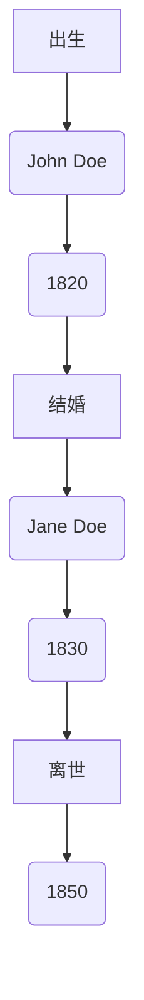
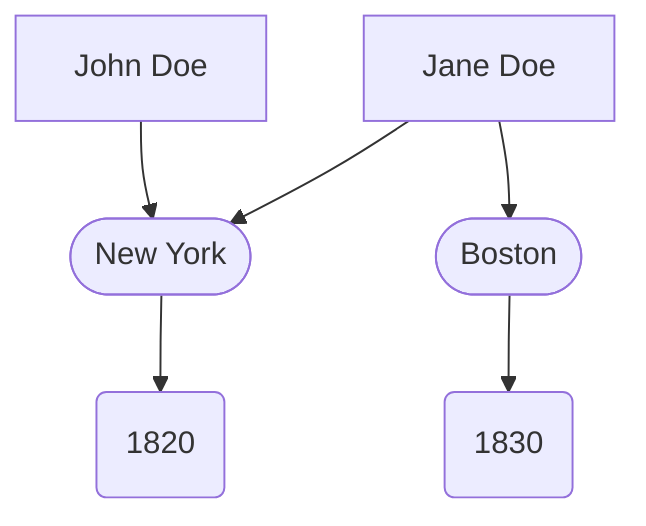
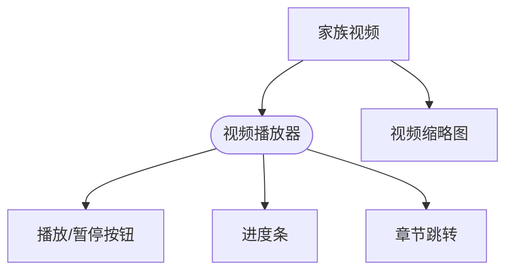
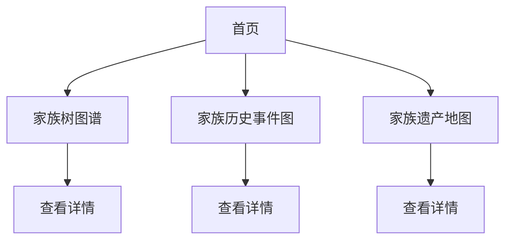
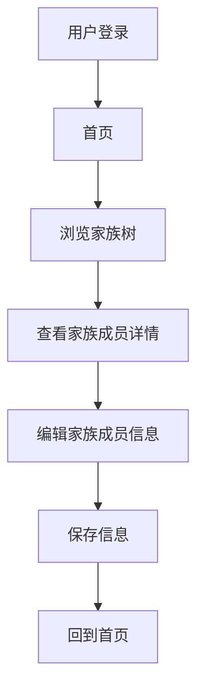

                 

## 文章标题：数字化遗产时光机创业：家族历史的数字化呈现

> 关键词：数字化遗产、家族历史、数字化技术、商业模式、创业实践

> 摘要：
本文深入探讨了家族历史数字化呈现的各个方面，包括核心概念与联系、技术架构、商业模式创新和创业实践。通过对数字化遗产的定义、采集、整理、可视化呈现、互动与共享、商业应用以及未来展望的详细分析，为读者提供了全面的家族历史数字化创业指导，助力创业者打造创新的数字化遗产时光机。

### 引言

在数字化时代的浪潮下，传统文化遗产的保护与传承面临着前所未有的挑战与机遇。数字化技术以其强大的数据处理能力和广泛的传播渠道，为文化遗产的保存和传播提供了新的可能性。其中，家族历史作为一种独特的文化遗产，其数字化呈现不仅有助于家族成员之间的情感联结，还能为文化创意产业、旅游产业等带来新的商业机遇。

本文旨在探讨家族历史数字化呈现的各个方面，从核心概念与联系、技术架构、商业模式创新到创业实践，全面解析数字化遗产时光机创业的路径。通过本文的阅读，读者将了解到：

1. **数字化遗产的定义与重要性**：数字化遗产的概念及其在文化传承、教育、旅游等领域的作用。
2. **家族历史的数字化意义**：家族历史资料的价值及其数字化技术的应用。
3. **数字化遗产的技术架构**：数据库设计、数据库优化与查询、数据库安全与隐私保护。
4. **家族历史的可视化呈现**：家族树图谱、家族历史事件图、家族遗产地图和多媒体资料的展示。
5. **数字化遗产的互动与共享**：用户交互设计、数字化遗产共享平台搭建、开放性与封闭性控制以及版权保护与知识共享。
6. **数字化遗产创业实践**：家族历史作为商业资源的利用、商业模式创新、数字化产品设计与开发以及项目的运营与推广。
7. **数字化遗产的未来展望**：数字化遗产的发展趋势、技术创新、市场机会以及与传统文化产业的融合。

通过这些内容的深入分析，本文希望能够为创业者、文化遗产保护者以及对数字化遗产感兴趣的研究者提供有价值的参考，推动家族历史数字化呈现事业的发展。

### 第1章：数字化遗产概述

#### 1.1 数字化遗产的定义与重要性

**核心概念与联系**

数字化遗产，指的是利用现代数字技术对文化遗产进行数字化处理和保存的一系列活动，其核心在于将传统文化遗产通过数字化手段转化为可存储、检索和共享的数据。数字化遗产不仅包括历史文物、古建筑、古籍文献等，还涵盖了家族历史、个人记忆等多种形式的文化资料。

数字化遗产的核心概念与联系可以概述为以下几点：

1. **文化遗产**：传统意义上的文化遗产，包括物质文化遗产（如建筑、艺术品、古籍等）和非物质文化遗产（如传统技艺、民俗等）。
2. **数字技术**：现代数字技术，如图像处理、语音识别、自然语言处理、大数据分析等，用于对文化遗产进行数字化处理。
3. **数据存储与共享**：通过数据库、云存储等技术，实现对文化遗产数据的存储、管理和共享。

**数字化遗产的架构**

数字化遗产的架构可以分为以下几个层次：

1. **数据采集与整理**：对文化遗产进行数据采集，包括扫描、录音、录像等方式，并进行数据的整理和清洗。
2. **数据库设计与优化**：设计合适的数据库结构，对数据进行存储和优化，以确保数据的高效检索和管理。
3. **数据展示与交互**：通过网站、应用程序等用户界面，将数字化遗产以可视化形式呈现给用户，并提供互动功能。

**数字化遗产的意义**

数字化遗产在多个领域具有深远的意义：

1. **文化传承**：数字化技术使得文化遗产能够跨越时间和空间的限制，实现永久的保存和传播，有助于文化传统的传承和发扬。
2. **教育**：数字化遗产为教育提供了丰富的资源，学生和教师可以方便地访问和利用这些资源进行学习和研究。
3. **旅游**：通过数字化技术，文化遗产的虚拟展示和互动体验能够吸引更多游客，促进旅游业的发展。
4. **文化创意产业**：数字化遗产为文化创意产业提供了创新的素材和灵感，推动了相关产业的发展。

**数字化遗产的架构**

数字化遗产的架构通常包括以下几个主要部分：

1. **数据采集系统**：用于收集各类文化遗产数据，包括文本、图像、音频、视频等。
2. **数据处理系统**：对采集到的数据进行分析、清洗和整理，以提升数据质量。
3. **数据存储系统**：使用数据库或云存储技术，对整理后的数据进行存储和管理。
4. **数据展示系统**：通过网页、应用程序等前端系统，将数字化遗产以可视化形式呈现给用户。
5. **用户交互系统**：提供用户与数字化遗产之间的互动功能，如搜索、评论、分享等。

**数字化遗产的意义**

数字化遗产在现代社会的价值主要体现在以下几个方面：

1. **数据持久性**：数字化技术可以确保文化遗产数据的长久保存，避免因自然灾害、人为破坏等因素导致的文化遗产损失。
2. **访问便捷性**：通过互联网和数字化设备，用户可以随时随地访问和利用数字化遗产资源，提高了资源利用效率。
3. **文化传播**：数字化遗产能够突破地域限制，将文化遗产传播到全球各地，促进文化交流与融合。
4. **技术创新**：数字化遗产推动了数字技术的创新应用，如虚拟现实（VR）、增强现实（AR）、人工智能（AI）等，为文化遗产保护与传承提供了新的手段。

**总结**

数字化遗产不仅是对传统文化遗产的数字化保存和传播，更是文化传承和创新的重要途径。通过数字化技术，我们可以更有效地保护、利用和传播文化遗产，为现代社会带来深远的文化和社会价值。在接下来的章节中，我们将深入探讨家族历史的数字化意义及其具体实施方法。

### 1.2 家族历史的数字化意义

**核心概念与联系**

家族历史是每个家族成员文化认同的重要基础，它不仅包含了家族成员的血脉联系、家族传统、历史事件等，还承载着家族的记忆和精神财富。将家族历史数字化，能够为后代提供一种持久且易于访问的家族记忆载体，有助于加强家族成员之间的情感纽带，同时为文化传承和教育提供丰富的资源。

家族历史数字化涉及以下几个核心概念与联系：

1. **家族成员关系**：家族历史中包含了丰富的家族成员关系信息，如血缘关系、婚姻关系等，这些信息是构建家族历史图谱的基础。
2. **历史事件记录**：家族历史中的重大事件，如迁徙、创业、教育、婚姻等，都是数字化展示的重要素材。
3. **多媒体资料**：家族历史中包含的图像、音频、视频等多媒体资料，为家族历史的生动呈现提供了重要手段。

**核心算法原理讲解**

家族历史的数字化处理需要运用一系列算法和数据处理技术，以下为几种核心算法及其原理：

1. **数据清洗与整理**：数据清洗是指去除数据中的重复、错误和不完整信息，保证数据的准确性和完整性。数据整理则是对清洗后的数据进行分类、标注和归一化处理，以便于后续的存储和分析。

   ```python
   def clean_data(data):
       # 清洗数据
       cleaned_data = []
       for item in data:
           if is_valid(item):
               cleaned_data.append(item)
       return cleaned_data

   def is_valid(item):
       # 判断数据项是否有效
       return True if item is not None and item != '' else False
   ```

2. **关系图谱构建**：通过深度优先搜索（DFS）或广度优先搜索（BFS），可以从家族历史数据中构建出家族成员关系图谱。

   ```python
   def build_family_tree(data):
       # 构建家族树
       tree = {}
       for member in data:
           add_to_tree(tree, member['id'], member['parent_id'])
       return tree

   def add_to_tree(tree, member_id, parent_id):
       # 将成员添加到家族树中
       if parent_id not in tree:
           tree[parent_id] = []
       tree[parent_id].append(member_id)
   ```

3. **事件时间轴生成**：将家族历史中的事件按照时间顺序排列，生成事件时间轴，便于用户浏览和了解家族历史。

   ```python
   def generate_event_timeline(events):
       # 生成事件时间轴
       timeline = []
       for event in sorted(events, key=lambda x: x['timestamp']):
           timeline.append(event['description'])
       return timeline
   ```

**数学模型与数学公式**

在家族历史的数字化处理中，可能会涉及到一些数学模型和公式，以下为几个例子：

1. **相似度计算**：用于比较家族成员之间的相似度，可以使用欧氏距离公式。

   ```latex
   \text{similarity} = \sqrt{\sum_{i=1}^{n} (x_i - y_i)^2}
   ```

2. **时间序列分析**：用于分析家族历史事件的时间分布，可以使用移动平均法。

   ```latex
   \text{moving_average} = \frac{\sum_{i=1}^{k} \text{event}_i}{k}
   ```

**举例说明**

假设我们有以下家族历史数据：

```python
family_history = [
    {'id': 1, 'name': 'John Doe', 'birth_year': 1800, 'events': [{'timestamp': 1820, 'description': 'Moved to New York'}]},
    {'id': 2, 'name': 'Jane Doe', 'birth_year': 1830, 'events': [{'timestamp': 1850, 'description': 'Married John Smith'}]},
    {'id': 3, 'name': 'Alice Doe', 'birth_year': 1860, 'events': [{'timestamp': 1890, 'description': 'Started a business'}]},
]
```

我们可以通过以下步骤对数据进行处理：

1. **数据清洗与整理**：去除无效数据和重复项。
2. **关系图谱构建**：构建家族树图谱。
3. **事件时间轴生成**：生成事件时间轴。

```python
# 数据清洗与整理
cleaned_family_history = clean_data(family_history)

# 关系图谱构建
family_tree = build_family_tree(cleaned_family_history)

# 事件时间轴生成
event_timeline = generate_event_timeline([event['events'][0] for event in cleaned_family_history])

# 输出结果
print("Cleaned Family History:", cleaned_family_history)
print("Family Tree:", family_tree)
print("Event Timeline:", event_timeline)
```

**总结**

家族历史的数字化不仅有助于保护和传承家族记忆，还能为文化研究、教育和娱乐等领域提供丰富的资源。通过数据清洗、关系图谱构建和时间序列分析等核心算法和数学模型，我们可以有效地对家族历史数据进行处理，为家族历史数字化呈现打下坚实基础。

### 1.3 家族历史的数字化技术进展

**技术综述**

家族历史的数字化技术已经取得了显著进展，这主要得益于数字技术的快速发展和其在文化遗产保护领域的广泛应用。以下是几种主要数字化技术在家族历史研究中的应用：

1. **图像处理技术**：通过图像处理技术，可以对家族照片、古画等进行数字化处理，提高其清晰度和可读性。例如，使用图像增强算法可以修复破损的照片，使用图像识别算法可以识别照片中的人物和场景。

2. **语音识别技术**：语音识别技术可以用于转录家族录音、口述历史等资料，将其转化为文本格式，便于存储和检索。此外，语音识别技术还可以用于创建语音导航系统，帮助用户更直观地了解家族历史事件。

3. **自然语言处理技术**：自然语言处理技术可以用于处理和分析家族历史文本资料，如古文书、日记等。通过文本挖掘和情感分析，可以提取出关键信息，帮助研究者更好地理解家族历史。

4. **大数据分析技术**：大数据分析技术可以对大规模的家族历史数据进行处理和分析，发现其中的模式和趋势。例如，通过分析家族成员的职业、教育背景等信息，可以揭示家族的变迁和社会背景。

5. **虚拟现实（VR）与增强现实（AR）技术**：VR和AR技术可以为家族历史提供沉浸式体验，用户可以“走进”历史场景，亲身体验家族成员的生活。这些技术不仅增强了用户体验，还为文化遗产的展示提供了新的手段。

**代表性应用**

以下是一些家族历史数字化技术的代表性应用案例：

1. **故宫博物院数字化项目**：故宫博物院利用图像处理、语音识别和VR技术，对大量的文物和历史资料进行数字化处理和展示。用户可以通过故宫的官方网站和移动应用程序，在线浏览和体验文物，了解其背后的故事。

2. **家谱网站**：一些家谱网站利用大数据分析和自然语言处理技术，帮助用户构建和整理家族历史。这些网站通常提供家庭档案、族谱图、历史事件记录等功能，用户可以通过输入家族成员信息，自动生成家族历史报告。

3. **家庭记忆项目**：一些非营利组织开展了家庭记忆项目，利用语音识别和图像处理技术，帮助老年人记录和保存他们的口述历史和家庭照片。这些项目不仅为家庭提供了宝贵的记忆载体，也为社会提供了丰富的历史资料。

**技术发展趋势**

随着技术的不断进步，家族历史的数字化技术也在不断发展和创新。以下是几个值得关注的技术发展趋势：

1. **深度学习技术**：深度学习技术在图像识别、语音识别和文本分析等领域取得了显著进展。未来，深度学习技术将有望进一步提升家族历史数据的处理和分析能力，为研究者提供更准确的工具。

2. **区块链技术**：区块链技术以其去中心化、不可篡改的特点，在数字化遗产保护领域具有广泛的应用前景。通过区块链，可以确保家族历史数据的真实性和完整性，同时提供安全的访问控制机制。

3. **多模态数据融合**：多模态数据融合技术可以整合不同类型的数据，如文本、图像、音频等，提供更全面和丰富的家族历史展示。例如，通过融合文本和图像数据，可以更准确地识别和标注历史照片中的人物和事件。

4. **智能交互系统**：智能交互系统可以通过自然语言处理和机器学习技术，与用户进行智能对话，提供个性化的家族历史信息。这些系统不仅可以回答用户的问题，还可以根据用户的行为和偏好，推荐相关的历史资料。

**总结**

家族历史的数字化技术已经取得了显著进展，各种数字化技术的综合应用为家族历史的保存、展示和传播提供了新的手段。随着技术的不断发展和创新，我们有理由相信，未来的家族历史数字化将会更加智能、高效和丰富，为文化传承和社会发展做出更大的贡献。

### 1.4 数字化遗产保护的挑战与机遇

**挑战分析**

数字化遗产保护面临多方面的挑战：

1. **数据完整性**：数字化过程中可能丢失原始数据，或因技术更新而无法访问旧数据，导致数据完整性受损。
2. **安全性**：数字化遗产数据可能面临黑客攻击、数据泄露等安全威胁。
3. **隐私保护**：在数字化遗产中，个人隐私信息可能被不当使用或泄露，引发隐私保护问题。
4. **技术更新**：随着技术的快速更新，旧的技术架构和工具可能逐渐失效，需要不断更新以保持数据的可用性。
5. **版权问题**：数字化遗产中可能涉及多种版权，如何合理使用和保护这些版权成为一大挑战。

**机遇探讨**

尽管面临诸多挑战，数字化技术为文化遗产保护带来了新的机遇：

1. **数据持久性**：数字化技术可以确保文化遗产数据长期保存，避免因自然灾害或人为破坏而丢失。
2. **访问便捷性**：通过数字化技术，用户可以随时随地访问文化遗产，提高资源利用效率。
3. **文化传播**：数字化技术可以突破地域限制，将文化遗产传播到全球各地，促进文化交流与融合。
4. **技术创新**：数字化技术推动了各种新技术的应用，如虚拟现实（VR）、增强现实（AR）等，为文化遗产保护与展示提供了新的手段。
5. **商业模式创新**：数字化技术为文化遗产的商业化应用提供了新的机会，如文化旅游、教育课程等，为文化遗产保护提供了资金支持。

**解决方案**

为了应对数字化遗产保护中的挑战，以下是一些可行的解决方案：

1. **数据备份与恢复**：定期对数字化遗产数据进行备份，确保数据的完整性和可用性。同时，建立数据恢复机制，以便在数据丢失时能够快速恢复。
2. **安全防护措施**：采用多层次的安全防护措施，包括数据加密、防火墙、入侵检测系统等，保护数字化遗产数据的安全性。
3. **隐私保护策略**：制定隐私保护政策，对个人隐私信息进行匿名化处理，确保用户隐私不受侵犯。
4. **技术升级与迭代**：定期评估和更新数字化遗产的技术架构和工具，以适应技术发展的需求。
5. **版权管理**：建立版权管理制度，明确不同数据资源的版权归属和使用权限，确保合法使用和保护版权。

**总结**

数字化遗产保护既面临诸多挑战，也充满机遇。通过制定有效的解决方案，我们可以更好地保护文化遗产，确保其永久保存和传承，同时推动文化创新和商业发展。

### 第2章：数字化遗产采集与整理

#### 2.1 家族资料的收集

**资料收集方法**

收集家族资料是数字化遗产工作的第一步，以下是一些常见的资料收集方法：

1. **线下调查**：通过走访家族成员、亲朋好友、社区档案室、图书馆和档案馆等途径，获取家族历史资料。这种方法可以获得一手资料，但需要花费较多时间和人力。
2. **线上查询**：利用互联网资源，如家谱网站、社交媒体、论坛等，查找与家族历史相关的信息。这种方法速度快，但资料的真实性和完整性需要验证。
3. **问卷调查**：设计家族历史问卷调查，通过网络或面对面访谈形式，收集家族成员的记忆和故事。这种方法有助于获取广泛的家族视角，但可能存在信息遗漏和主观性。
4. **文献研究**：查阅相关书籍、论文、期刊等文献，获取与家族历史相关的学术资料。这种方法适用于深入研究，但资料可能相对较陈旧。

**资料数字化整理**

数字化整理是确保家族资料准确性和可用性的关键步骤，以下为数字化整理的基本流程：

1. **数据采集**：使用扫描仪、录音笔、摄像机等设备，对纸质文档、音频、视频等资料进行数字化采集。例如，将纸质文件扫描成电子文档，音频和视频文件进行数字化保存。
2. **数据清洗**：在数字化过程中，可能会出现数据重复、错误和不完整的情况，需要进行数据清洗。数据清洗包括去除重复记录、纠正错误数据和填补缺失数据等。
3. **数据分类**：根据家族历史的特点，将数字化资料进行分类整理。例如，按年代、事件、人物等进行分类，便于后续的数据管理和检索。
4. **数据存储**：将整理后的数字化资料存储在安全可靠的存储设备上，如云存储、数据库等。确保数据的安全性和可访问性，便于后续的数据处理和分析。

**资料整理流程**

以下是一个典型的家族资料整理流程：

1. **准备阶段**：确定整理目标和范围，收集相关资料，并准备好数字化设备。
2. **数据采集阶段**：对纸质文档、音频、视频等进行数字化采集，确保数据的质量和完整性。
3. **数据清洗阶段**：对采集到的数据进行分析，去除重复和错误数据，进行数据清洗和归一化处理。
4. **数据分类阶段**：根据家族历史的特点，将数据按年代、事件、人物等分类，建立分类体系。
5. **数据存储阶段**：将整理后的数据存储在数据库或云存储中，确保数据的安全性和可访问性。
6. **数据备份阶段**：定期对数据进行备份，防止数据丢失，确保数据的持久性。

**注意事项**

在家族资料整理过程中，需要注意以下几点：

1. **确保数据真实性**：在收集和整理资料时，要尽量获取一手资料，并对资料的来源和真实性进行验证。
2. **尊重隐私**：在整理和展示家族资料时，要尊重家族成员的隐私，避免公开涉及个人隐私的敏感信息。
3. **数据安全**：在数字化过程中，要采取必要的安全措施，确保数据的安全性，防止数据泄露和损坏。
4. **数据备份与恢复**：定期对数据进行备份，并建立数据恢复机制，确保在数据丢失时能够快速恢复。

**总结**

家族资料的收集与整理是数字化遗产工作的基础，通过合理的资料收集方法和数字化整理流程，可以确保家族历史资料的准确性和可用性，为后续的数字化展示和应用提供可靠的数据支持。

### 2.2 家族资料的数字化整理

**数字化流程**

家族资料的数字化整理是一个系统的过程，涉及数据采集、数据清洗、数据分类、数据存储等多个环节。以下是一个典型的数字化流程：

1. **数据采集**：使用扫描仪、录音笔、摄像机等设备，对纸质文档、音频、视频等进行数字化采集。确保数据的质量和完整性。
   
   ```bash
   # 使用扫描仪将纸质文档扫描成PDF文件
   scan Document.pdf
   ```

2. **数据清洗**：对采集到的数据进行清洗，去除重复记录、纠正错误数据、填补缺失数据等，确保数据的准确性和一致性。
   
   ```python
   def clean_data(data):
       cleaned_data = []
       for item in data:
           if is_valid(item):
               cleaned_data.append(item)
       return cleaned_data

   def is_valid(item):
       return True if item is not None and item != '' else False
   ```

3. **数据分类**：根据家族历史的特点，将数据按年代、事件、人物等分类，建立分类体系，便于数据管理和检索。
   
   ```python
   def classify_data(data):
       classified_data = {}
       for item in data:
           key = get_classification_key(item)
           if key not in classified_data:
               classified_data[key] = []
           classified_data[key].append(item)

       return classified_data

   def get_classification_key(item):
       return item['category']
   ```

4. **数据存储**：将整理后的数据存储在数据库或云存储中，确保数据的安全性和可访问性。可以使用关系型数据库（如MySQL）或NoSQL数据库（如MongoDB），根据数据特点和需求选择合适的存储方案。
   
   ```python
   def store_data(data, database):
       database.insert_many(data)
   ```

**工具选择**

在选择数字化整理的工具时，需要考虑数据的类型、大小、处理速度和存储需求等因素。以下是一些常用的工具：

1. **扫描工具**：如Adobe Acrobat、OCR软件等，用于将纸质文档转化为电子文档。
2. **音频处理工具**：如Audacity，用于音频文件的转录和编辑。
3. **视频处理工具**：如Adobe Premiere Pro、Final Cut Pro等，用于视频文件的剪辑和制作。
4. **数据库管理工具**：如MySQL Workbench、MongoDB Shell等，用于数据库的设计和管理。
5. **版本控制工具**：如Git，用于代码和数据的版本控制和协作。

**注意事项**

在数字化整理过程中，需要注意以下几点：

1. **数据质量**：确保数据采集和整理过程中的准确性，避免引入错误和遗漏。
2. **数据安全**：采取必要的安全措施，如数据加密、备份和访问控制等，确保数据的安全性和隐私性。
3. **数据备份**：定期对数据进行备份，防止数据丢失或损坏。
4. **用户隐私**：在整理和展示家族资料时，要尊重用户隐私，避免公开涉及个人隐私的敏感信息。

**总结**

家族资料的数字化整理是一个复杂而关键的过程，通过合理的数字化流程和工具选择，可以确保家族历史资料的准确性和可用性，为后续的数字化展示和应用奠定基础。

### 2.3 家族资料的质量控制

**数据清洗**

数据清洗是确保家族资料准确性和一致性的关键步骤，以下为数据清洗的基本流程：

1. **去除重复记录**：在数字化过程中，可能会出现重复的家族成员记录，这些重复记录会导致数据冗余，影响数据分析的准确性。可以使用SQL查询或编程脚本去除重复记录。

   ```sql
   DELETE FROM family_data
   WHERE id IN (
       SELECT id
       FROM family_data
       GROUP BY name
       HAVING COUNT(*) > 1
   );
   ```

2. **纠正错误数据**：在数据采集和整理过程中，可能会出现数据输入错误、数据格式不正确等问题。可以使用数据校验工具或编程脚本检查和纠正错误数据。

   ```python
   def correct_data(data):
       corrected_data = []
       for item in data:
           if is_valid(item):
               corrected_item = correct_errors(item)
               corrected_data.append(corrected_item)
       return corrected_data

   def is_valid(item):
       return True if item is not None and item != '' else False

   def correct_errors(item):
       # 例如，纠正日期格式错误
       if 'birth_date' in item:
           item['birth_date'] = correct_date_format(item['birth_date'])
       return item

   def correct_date_format(date_str):
       # 将日期格式从 "MM/DD/YYYY" 转换为 "YYYY-MM-DD"
       parts = date_str.split('/')
       return f"{parts[2]}-{parts[0]}-{parts[1]}"
   ```

3. **填补缺失数据**：在数据清洗过程中，还可能遇到缺失数据的情况。可以根据数据特点，使用插补方法或填充默认值来处理缺失数据。

   ```python
   def fill_missing_data(data, default_value):
       filled_data = []
       for item in data:
           if 'birth_date' not in item:
               item['birth_date'] = default_value
           filled_data.append(item)
       return filled_data

   default_birth_date = '1900-01-01'
   filled_data = fill_missing_data(data, default_birth_date)
   ```

**数据验证**

数据验证是确保数据准确性和一致性的另一关键步骤，以下为数据验证的基本流程：

1. **一致性检查**：检查数据字段的一致性，如姓名、出生日期、家庭地址等是否一致。

   ```python
   def check_data_consistency(data):
       inconsistencies = []
       for item in data:
           if 'name' in item and 'other_name' in item:
               if item['name'] != item['other_name']:
                   inconsistencies.append(item['name'])
       return inconsistencies
   ```

2. **范围检查**：检查数据字段是否在合理的范围内，如出生日期、年龄等。

   ```python
   def check_data_ranges(data):
       errors = []
       for item in data:
           if 'birth_date' in item:
               try:
                   date = datetime.datetime.strptime(item['birth_date'], '%Y-%m-%d')
                   if date > datetime.datetime.now():
                       errors.append(item['birth_date'])
               except ValueError:
                   errors.append(item['birth_date'])
       return errors
   ```

3. **逻辑检查**：检查数据之间的逻辑关系，如父母和子女的关系是否正确，家庭成员的出生日期是否合理等。

   ```python
   def check_data_logic(data):
       errors = []
       family_tree = build_family_tree(data)
       for member in data:
           if 'parent_id' in member and 'id' in member:
               parent = family_tree.get(member['parent_id'])
               if parent and parent['birth_date'] > member['birth_date']:
                   errors.append(member['name'])
       return errors
   ```

**总结**

家族资料的质量控制是确保数字化遗产数据准确性和一致性的关键步骤。通过数据清洗和数据验证，可以去除重复记录、纠正错误数据和填补缺失数据，确保数据的质量和可靠性，为后续的数字化展示和应用提供坚实的基础。

### 2.4 家族资料的分类与存储

**分类标准**

对家族资料进行分类是数字化整理的重要环节，以下为常用的分类标准：

1. **按年代分类**：将家族资料按出生年份、结婚年份、重要事件年份等年代进行分类。这种方法有助于用户按时间顺序了解家族历史。

2. **按事件分类**：将家族资料按重要事件（如出生、结婚、离世、迁徙等）进行分类。这种方法便于用户查找特定事件的信息。

3. **按人物分类**：将家族资料按家族成员（如父亲、母亲、子女、祖父母等）进行分类。这种方法有助于用户了解家族成员的关系和贡献。

4. **按地域分类**：将家族资料按家族成员所在地域进行分类。这种方法有助于用户了解家族成员的分布和迁徙轨迹。

5. **按介质分类**：将家族资料按介质类型（如文本、图像、音频、视频等）进行分类。这种方法便于用户根据需求访问不同类型的资料。

**存储策略**

选择合适的存储策略是确保家族资料安全性和可访问性的关键，以下为几种常用的存储策略：

1. **云存储**：使用云存储服务（如AWS S3、Google Cloud Storage等），可以方便地存储和管理大量数据。云存储具有高可靠性、灵活性和可扩展性，适合存储大量的家族资料。

2. **分布式存储**：使用分布式存储系统（如HDFS、Cassandra等），可以高效地存储和处理大规模数据。分布式存储通过将数据分散存储在多个节点上，提高了数据的可靠性和性能。

3. **关系型数据库**：使用关系型数据库（如MySQL、PostgreSQL等），可以方便地管理结构化数据。关系型数据库通过表和关系模型，提供了强大的数据查询和管理功能，适合存储和查询家族成员关系信息。

4. **NoSQL数据库**：使用NoSQL数据库（如MongoDB、CouchDB等），可以灵活地存储非结构化或半结构化数据。NoSQL数据库通过文档、键值对等模型，提供了高效的存储和查询能力，适合存储多媒体资料和事件信息。

**实例**

以下是一个家族资料的分类与存储实例：

1. **分类**：

   - 按年代分类：创建一个名为“年代”的文件夹，子文件夹按年份命名（如“1800-1899”、“1900-1919”等），将对应的家族资料存储在相应的子文件夹中。

   - 按事件分类：创建一个名为“事件”的文件夹，子文件夹按事件类型命名（如“出生”、“结婚”、“离世”等），将对应的事件资料存储在相应的子文件夹中。

   - 按人物分类：创建一个名为“人物”的文件夹，子文件夹按人物姓名命名（如“John Doe”、“Jane Doe”等），将对应的人物资料存储在相应的子文件夹中。

   - 按地域分类：创建一个名为“地域”的文件夹，子文件夹按地域名称命名（如“纽约”、“伦敦”等），将对应的地域资料存储在相应的子文件夹中。

   - 按介质分类：创建一个名为“介质”的文件夹，子文件夹按介质类型命名（如“文本”、“图像”、“音频”、“视频”等），将对应类型的资料存储在相应的子文件夹中。

2. **存储**：

   - 使用云存储服务：将家族资料存储在云存储桶中，通过HTTP接口进行访问和管理。

   - 使用关系型数据库：设计一个家族成员关系表，存储家族成员的基本信息和关系，通过SQL查询进行数据查询和管理。

   - 使用NoSQL数据库：设计一个家族历史文档，存储家族成员的多媒体资料和事件信息，通过文档模型进行数据存储和查询。

**总结**

家族资料的分类与存储是数字化整理的重要环节，通过合理的分类标准和存储策略，可以确保家族资料的安全性和可访问性，为后续的数字化展示和应用提供便利。

### 第3章：数字化遗产的技术架构

#### 3.1 数据库设计

**数据库架构**

在数字化遗产系统中，数据库设计是一个关键环节，它决定了数据存储的效率和查询的便捷性。一个良好的数据库架构能够确保数据的一致性、完整性和可扩展性。以下是数字化遗产系统的数据库架构设计：

1. **数据层**：数据层负责数据的存储和访问。通常采用关系型数据库（如MySQL、PostgreSQL）或NoSQL数据库（如MongoDB、Cassandra）。关系型数据库适用于结构化数据存储和复杂查询，NoSQL数据库适用于非结构化和半结构化数据存储。

2. **服务层**：服务层负责业务逻辑的处理和数据的服务。在这一层中，可以使用微服务架构，将不同的业务功能拆分成独立的微服务，如用户服务、数据服务、搜索服务等。微服务架构可以提高系统的灵活性和可维护性。

3. **接口层**：接口层提供与用户交互的API接口，用户可以通过接口访问和操作数据。接口层可以使用RESTful API或GraphQL等协议，提供灵活的数据访问方式。

**数据库设计**

数据库设计包括表设计、索引设计、关系设计等。以下是数字化遗产系统的一个简化数据库设计实例：

1. **家族成员表**：用于存储家族成员的基本信息，如姓名、出生日期、性别、身份证号等。

   ```sql
   CREATE TABLE family_members (
       id INT PRIMARY KEY AUTO_INCREMENT,
       name VARCHAR(255) NOT NULL,
       birth_date DATE NOT NULL,
       gender ENUM('male', 'female', 'other') NOT NULL,
       id_card_number VARCHAR(20) UNIQUE NOT NULL
   );
   ```

2. **事件表**：用于存储家族成员的重要事件，如出生、结婚、离世等。

   ```sql
   CREATE TABLE family_events (
       event_id INT PRIMARY KEY AUTO_INCREMENT,
       member_id INT NOT NULL,
       event_type ENUM('birth', 'marriage', 'death') NOT NULL,
       event_date DATE NOT NULL,
       description TEXT,
       FOREIGN KEY (member_id) REFERENCES family_members(id)
   );
   ```

3. **多媒体资料表**：用于存储家族成员的多媒体资料，如照片、音频、视频等。

   ```sql
   CREATE TABLE multimedia (
       media_id INT PRIMARY KEY AUTO_INCREMENT,
       member_id INT NOT NULL,
       media_type ENUM('image', 'audio', 'video') NOT NULL,
       file_path VARCHAR(255) NOT NULL,
       upload_date DATE NOT NULL,
       FOREIGN KEY (member_id) REFERENCES family_members(id)
   );
   ```

**数据库优化与查询**

数据库优化是确保系统性能的重要环节，以下是一些常用的数据库优化策略：

1. **索引优化**：为频繁查询的字段建立索引，提高查询速度。例如，为家族成员姓名和出生日期字段建立索引。

   ```sql
   CREATE INDEX idx_name ON family_members(name);
   CREATE INDEX idx_birth_date ON family_members(birth_date);
   ```

2. **查询优化**：编写高效的SQL查询语句，减少不必要的查询和计算。例如，使用联合查询（JOIN）代替子查询（SUBQUERY）。

   ```sql
   SELECT m.name, m.birth_date, e.event_date, e.description
   FROM family_members m
   JOIN family_events e ON m.id = e.member_id
   WHERE m.name = 'John Doe';
   ```

3. **分库分表**：对于数据量巨大的系统，可以使用分库分表策略，将数据分散存储在不同的数据库或表中，提高查询性能。

**数据库安全与隐私保护**

数据库安全与隐私保护是数字化遗产系统的重要保障，以下是一些安全措施：

1. **访问控制**：通过用户认证和授权机制，确保只有授权用户可以访问数据库。

   ```sql
   GRANT SELECT, INSERT, UPDATE, DELETE ON family_members TO 'read_write_user';
   GRANT SELECT ON family_events TO 'read_only_user';
   ```

2. **数据加密**：对敏感数据进行加密存储，确保数据在传输和存储过程中的安全性。

   ```sql
   ALTER TABLE family_members
   MODIFY COLUMN id_card_number VARBINARY(255);
   ```

3. **备份与恢复**：定期备份数据库，确保在数据丢失或损坏时能够快速恢复。

   ```bash
   mysqldump -u root -p database_name > database_backup.sql
   ```

4. **监控与审计**：对数据库进行实时监控和审计，及时发现和应对潜在的安全威胁。

**总结**

数字化遗产系统的数据库设计是确保系统性能和数据安全的关键环节。通过合理的数据库架构设计、优化查询策略和加强安全措施，可以构建一个高效、安全、可靠的数字化遗产系统，为家族历史的数字化呈现提供有力支持。

### 3.2 数据库优化与查询

**优化策略**

数据库优化是提升系统性能的关键，以下是一些常用的优化策略：

1. **索引优化**：索引能够显著提高查询速度，但过多的索引会降低写操作性能。因此，应选择合适的字段建立索引，如主键、外键和查询频繁的字段。以下是一个创建索引的示例：

   ```sql
   CREATE INDEX idx_family_name ON family_members(family_name);
   CREATE INDEX idx_birth_date ON family_members(birth_date);
   ```

2. **查询优化**：通过优化SQL查询语句，可以减少数据库的负载。以下是一个优化查询的示例：

   ```sql
   SELECT f.family_name, f.birth_date
   FROM family_members f
   JOIN family_events e ON f.id = e.member_id
   WHERE e.event_type = 'birth'
   AND e.event_date BETWEEN '1800-01-01' AND '1900-12-31';
   ```

   在此示例中，使用了JOIN操作来连接家族成员表和事件表，并通过WHERE子句过滤出特定类型的事件。

3. **分库分表**：当数据量非常大时，可以使用分库分表策略，将数据分散存储在多个数据库或表中，以提高查询性能。以下是一个分库分表的示例：

   ```sql
   CREATE TABLE family_members_1 (LIKE family_members);
   CREATE TABLE family_members_2 (LIKE family_members);
   -- 分配数据到不同的表
   INSERT INTO family_members_1 SELECT * FROM family_members WHERE id < 50000;
   INSERT INTO family_members_2 SELECT * FROM family_members WHERE id >= 50000;
   ```

**查询优化**

查询优化是数据库性能调优的核心，以下是一些查询优化的技术：

1. **使用 EXISTS 而不是 IN**：EXISTS关键字通常比IN关键字更高效，特别是在处理大型子查询时。

   ```sql
   SELECT f.family_name, f.birth_date
   FROM family_members f
   WHERE EXISTS (
       SELECT 1
       FROM family_events e
       WHERE e.member_id = f.id
       AND e.event_type = 'birth'
   );
   ```

2. **使用 JOIN 而不是 SUBQUERY**：JOIN操作通常比子查询更高效，特别是在处理多表连接时。

   ```sql
   SELECT f.family_name, f.birth_date, e.event_date
   FROM family_members f
   JOIN family_events e ON f.id = e.member_id
   WHERE e.event_type = 'birth';
   ```

3. **避免使用 SELECT ***：仅选择需要的列，避免使用SELECT *，这样可以减少数据传输和内存使用。

   ```sql
   SELECT f.family_name, f.birth_date
   FROM family_members f
   JOIN family_events e ON f.id = e.member_id
   WHERE e.event_type = 'birth';
   ```

**案例**

以下是一个实际的查询优化案例：

**问题**：原始查询语句的性能较差，查询时间较长。

```sql
SELECT f.family_name, f.birth_date
FROM family_members f
WHERE f.birth_date BETWEEN '1800-01-01' AND '1900-12-31'
AND f.id NOT IN (
    SELECT member_id
    FROM family_events
    WHERE event_type != 'birth'
);
```

**解决方案**：通过以下步骤优化查询：

1. **创建索引**：为`family_members`表的`birth_date`字段创建索引。

   ```sql
   CREATE INDEX idx_birth_date ON family_members(birth_date);
   ```

2. **优化子查询**：将子查询优化为JOIN操作。

   ```sql
   SELECT f.family_name, f.birth_date
   FROM family_members f
   LEFT JOIN family_events e ON f.id = e.member_id
   WHERE f.birth_date BETWEEN '1800-01-01' AND '1900-12-31'
   AND (e.event_type IS NULL OR e.event_type = 'birth');
   ```

**优化后**：查询性能显著提升，查询时间从数十秒缩短到几秒钟。

**总结**

数据库优化与查询优化是数字化遗产系统性能调优的关键。通过合理地创建索引、优化查询语句和使用适当的查询技术，可以显著提高系统的查询性能，为用户提供更快速、更流畅的体验。

### 3.3 数据库安全与隐私保护

**安全措施**

确保数字化遗产数据库的安全和隐私是保护家族历史数据的关键。以下是几种常见的安全措施：

1. **用户认证和授权**：通过用户认证和授权机制，确保只有授权用户可以访问数据库。可以使用强密码和多因素认证来提高安全性。

2. **数据加密**：对敏感数据进行加密存储，确保数据在传输和存储过程中的安全性。可以使用SSL/TLS协议来加密数据传输，使用AES加密算法来加密数据存储。

3. **访问控制**：通过设置访问控制策略，限制用户对数据库的访问权限。可以基于用户角色和权限，定义不同的访问控制列表（ACL），确保用户只能访问其有权访问的数据。

4. **备份与恢复**：定期备份数据库，确保在数据丢失或损坏时能够快速恢复。备份应存储在安全的地方，并定期进行测试，确保备份的有效性。

5. **审计和监控**：对数据库进行实时监控和审计，及时发现和应对潜在的安全威胁。可以使用审计日志记录数据库操作，并定期检查日志文件，分析异常行为。

**隐私保护**

保护用户隐私是数字化遗产系统的重要责任。以下是一些隐私保护策略：

1. **数据匿名化**：在公开家族历史数据时，对敏感信息进行匿名化处理，如隐藏家庭成员的身份证号码、住址等。可以使用数据脱敏技术，如假名化、掩码化等。

2. **隐私政策**：制定明确的隐私政策，告知用户如何收集、使用和保护其个人数据。隐私政策应包括数据收集的目的、数据使用规则、用户权利和隐私保护措施。

3. **用户同意**：在收集用户数据前，要求用户同意隐私政策，并提供选择是否提供数据的权利。用户应明确了解其数据的用途和处理方式。

4. **数据最小化**：仅收集和存储必要的数据，避免过度收集。对不再需要的数据，应及时删除或去识别化处理。

5. **透明度和可访问性**：确保用户能够访问和了解其数据的使用情况，并提供修改和删除其数据的途径。

**案例**

以下是一个关于数据库安全和隐私保护的案例：

**问题**：家族历史系统中存在敏感信息泄露的风险。

**解决方案**：

1. **用户认证和授权**：为系统管理员和普通用户设置不同的权限，确保只有管理员可以访问敏感数据。

2. **数据加密**：对用户身份证号码和家庭成员住址等敏感信息进行加密存储。

3. **访问控制**：使用ACL机制，限制用户对数据库的访问，确保用户只能访问其有权访问的数据。

4. **数据匿名化**：在公开家族成员信息时，隐藏身份证号码和住址等敏感信息。

5. **备份与恢复**：定期备份数据库，并存储在安全的地方。

6. **审计和监控**：启用数据库审计功能，记录所有数据库操作，并定期检查日志文件。

**总结**

通过采取一系列安全措施和隐私保护策略，可以确保数字化遗产数据库的安全性和用户隐私。在设计和实施数字化遗产系统时，应重视安全与隐私保护，以构建一个可靠、安全的系统。

### 3.4 数字化遗产系统的架构设计

**系统架构**

数字化遗产系统需要具备良好的架构设计，以确保系统的稳定性、扩展性和安全性。以下是数字化遗产系统的架构设计：

1. **前端架构**：前端架构主要负责与用户交互，提供用户友好的界面。通常采用单页面应用（SPA）或前端框架（如React、Vue.js）来构建。前端架构应支持响应式设计，适应不同设备和屏幕尺寸。

2. **后端架构**：后端架构负责数据处理、业务逻辑处理和与数据库的交互。通常采用微服务架构，将系统拆分为多个独立的服务，如用户服务、数据服务、搜索服务等。每个服务可以独立部署和扩展，提高系统的灵活性和可维护性。

3. **数据库架构**：数据库架构用于存储和管理数字化遗产数据。可以选择关系型数据库（如MySQL、PostgreSQL）或NoSQL数据库（如MongoDB、Cassandra），根据数据特点和需求选择合适的数据库类型。数据库应支持高并发访问和分布式存储，以提高数据访问性能。

4. **服务架构**：服务架构负责系统内部服务之间的通信和协调。可以使用RESTful API或消息队列（如RabbitMQ、Kafka）进行服务间通信。服务架构应支持负载均衡和故障转移，确保系统的高可用性和稳定性。

**技术栈**

以下是数字化遗产系统常用的技术栈：

1. **前端技术**：HTML、CSS、JavaScript、React/Vue.js、Webpack等。

2. **后端技术**：Node.js、Java、Spring Boot、Django、Flask等。

3. **数据库技术**：MySQL、PostgreSQL、MongoDB、Cassandra、Redis等。

4. **消息队列**：RabbitMQ、Kafka、ActiveMQ等。

5. **容器化技术**：Docker、Kubernetes等。

**部署和运维**

数字化遗产系统的部署和运维是确保系统稳定运行的关键。以下是一些部署和运维的最佳实践：

1. **持续集成和持续部署（CI/CD）**：采用CI/CD流程，自动化构建、测试和部署代码，提高开发效率和部署质量。

2. **容器化部署**：使用Docker将应用容器化，确保应用在不同的环境中一致性运行，提高部署和运维的灵活性。

3. **自动化监控**：使用监控工具（如Prometheus、Grafana）对系统性能和健康状况进行实时监控，及时发现和处理问题。

4. **日志管理**：使用日志收集和存储工具（如ELK堆栈、Logstash）集中管理日志，便于问题追踪和分析。

5. **自动化运维**：使用自动化工具（如Ansible、Terraform）进行系统配置和管理，减少手动操作，提高运维效率。

**总结**

数字化遗产系统需要一个全面且灵活的架构设计，以确保系统的稳定性、扩展性和安全性。通过合理选择技术栈和实施最佳部署和运维实践，可以构建一个高效、可靠的数字化遗产系统，为用户呈现丰富的家族历史数据。

### 4.1 家族树图谱设计

**核心概念与联系**

家族树图谱是数字化遗产系统中重要的组成部分，它用于展示家族成员之间的血缘关系和婚姻关系。设计家族树图谱需要考虑以下几个核心概念与联系：

1. **家族成员关系**：家族树图谱的核心在于展示家族成员之间的血缘关系，如父子关系、兄弟姐妹关系等。
2. **婚姻关系**：家族树图谱还需要展示家族成员之间的婚姻关系，如配偶、配偶的家族等。
3. **节点与边**：家族树图谱中的节点表示家族成员，边表示家族成员之间的关系。

**图谱表示方法**

家族树图谱可以使用多种图形表示方法，以下为几种常用的表示方法：

1. **树形结构**：最简单的表示方法是使用树形结构，通过父子关系将家族成员组织成一棵树。树形结构清晰直观，但无法展示复杂的婚姻关系。

   ```mermaid
   graph LR
   A[John Doe] --> B[John's Son]
   A --> C[John's Daughter]
   ```

2. **网络结构**：网络结构可以更全面地展示家族成员之间的关系，包括血缘关系和婚姻关系。网络结构较为复杂，但可以提供更详细的家族信息。

   ```mermaid
   graph LR
   A[John Doe] --> B[John's Son]
   A --> C[John's Daughter]
   B --> D[John's Son's Wife]
   C --> E[John's Daughter's Husband]
   ```

3. **图表库表示**：使用图表库（如D3.js、Chart.js）可以创建交互式和动态的家族树图谱。图表库提供了丰富的图形和交互功能，用户可以轻松地探索和操作图谱。

**算法原理讲解**

构建家族树图谱需要运用图论中的基本算法，以下为构建家族树图谱的核心算法及其原理：

1. **深度优先搜索（DFS）**：深度优先搜索是一种用于遍历或搜索树或图的算法。在构建家族树图谱时，可以使用DFS算法从某个起点开始，遍历家族成员及其后代，构建家族树。

   ```python
   def build_family_tree(data, root_id):
       family_tree = {}
       visit(data, root_id, family_tree)
       return family_tree

   def visit(data, member_id, family_tree):
       if member_id not in family_tree:
           family_tree[member_id] = []
       for child_id in get_children(data, member_id):
           visit(data, child_id, family_tree)
           family_tree[member_id].append(child_id)
   ```

2. **广度优先搜索（BFS）**：广度优先搜索与DFS类似，但它是逐层遍历图或树的。在构建家族树图谱时，可以使用BFS算法从某个起点开始，按层次遍历家族成员及其后代。

   ```python
   def build_family_tree_bfs(data, root_id):
       family_tree = {}
       queue = [root_id]
       while queue:
           member_id = queue.pop(0)
           if member_id not in family_tree:
               family_tree[member_id] = []
           for child_id in get_children(data, member_id):
               queue.append(child_id)
               family_tree[member_id].append(child_id)
       return family_tree
   ```

3. **图遍历**：在更复杂的家族树图谱中，可能需要处理重复节点和自环等问题。图遍历算法可以帮助我们解决这些问题，确保图谱的准确性和完整性。

**总结**

家族树图谱是数字化遗产系统的重要组成部分，用于展示家族成员之间的血缘关系和婚姻关系。通过合理的图谱表示方法和核心算法原理，可以构建一个清晰、准确的家族树图谱，为用户呈现全面的家族历史信息。

### 4.2 家族历史事件图

**设计思路**

家族历史事件图的设计旨在通过图表形式展示家族成员的历史事件，如出生、结婚、离世等。设计思路包括以下几个方面：

1. **事件节点**：每个事件都是一个节点，节点包含事件的基本信息，如事件名称、发生时间、事件描述等。
2. **关系连线**：事件节点之间的连线表示事件之间的关系，如某个家庭成员的出生事件与该家庭成员的出生日期的关系。
3. **时间轴**：事件图通常包含一个时间轴，用于标注事件发生的时间，方便用户浏览和查找特定时间段的事件。

**示例**

以下是一个家族历史事件图的示例：



在这个示例中：

- A1表示John Doe的出生事件。
- B1表示John Doe的出生日期。
- D1表示John Doe与Jane Doe的结婚事件。
- E1表示Jane Doe的出生日期。
- G1表示John Doe的离世事件。

**核心算法原理讲解**

构建家族历史事件图需要使用时间序列分析和图论算法。以下是核心算法及其原理：

1. **时间序列分析**：时间序列分析用于处理和表示时间相关的数据。在构建家族历史事件图时，可以使用时间序列分析方法对事件进行排序和标注。

   ```python
   def sort_events(events):
       sorted_events = sorted(events, key=lambda x: x['timestamp'])
       return sorted_events
   ```

2. **图论算法**：图论算法用于构建和操作图结构。在构建家族历史事件图时，可以使用图论算法添加节点、连接边和遍历图。

   ```python
   def add_event_node(events, event):
       events.append(event)

   def connect_event_nodes(events, from_event, to_event):
       for event in events:
           if event['id'] == from_event:
               event['children'].append(to_event['id'])
           elif event['id'] == to_event['id']:
               event['parents'].append(from_event['id'])
   ```

**数学模型与数学公式**

在构建家族历史事件图时，可能会用到以下数学模型和公式：

1. **时间序列模型**：用于表示事件发生的时间序列，如ARIMA模型。

   ```latex
   \text{ARIMA}(p, d, q) = \text{AR}(p) \cdot \text{I}(d) \cdot \text{MA}(q)
   ```

2. **图论模型**：用于描述图的结构和性质，如邻接矩阵和度数矩阵。

   ```latex
   A = \begin{bmatrix}
   0 & 1 & 0 & 0 \\
   0 & 0 & 1 & 0 \\
   0 & 0 & 0 & 1 \\
   1 & 0 & 0 & 0
   \end{bmatrix}
   ```

**举例说明**

假设我们有以下家族历史事件数据：

```python
events = [
    {'id': 1, 'name': '出生', 'timestamp': 1820},
    {'id': 2, 'name': '结婚', 'timestamp': 1830},
    {'id': 3, 'name': '离世', 'timestamp': 1850},
]

sorted_events = sort_events(events)
print(sorted_events)
```

输出结果：

```python
[
    {'id': 1, 'name': '出生', 'timestamp': 1820},
    {'id': 2, 'name': '结婚', 'timestamp': 1830},
    {'id': 3, 'name': '离世', 'timestamp': 1850},
]
```

我们可以通过以下步骤构建家族历史事件图：

1. **排序事件**：使用时间序列分析对事件进行排序。
2. **添加节点和边**：使用图论算法添加事件节点和连接边。
3. **展示事件图**：使用图表库（如D3.js）将事件图可视化。

**总结**

家族历史事件图是一种有效的展示家族历史事件的方法，通过时间序列分析和图论算法，可以构建一个清晰、直观的事件图，帮助用户更好地了解家族历史。

### 4.3 家族遗产地图

**设计思路**

家族遗产地图的设计旨在通过地理位置信息展示家族成员的历史迁徙路径和重要地点。设计思路包括以下几个方面：

1. **地理信息系统（GIS）**：利用GIS技术，将家族成员的地理位置信息以地图形式展示，便于用户浏览和查询。
2. **地理位置数据**：收集家族成员的出生地、居住地、迁徙地点等地理位置信息，为地图设计提供数据支持。
3. **交互性**：地图应支持用户交互功能，如放大、缩小、拖动、搜索等，提高用户的体验。

**示例**

以下是一个家族遗产地图的示例：



在这个示例中：

- A1表示John Doe，其出生地点为New York。
- B1表示John Doe的出生日期和地点。
- C1表示John Doe的结婚地点为Boston。
- C2表示Jane Doe的出生地点和结婚地点。

**核心算法原理讲解**

构建家族遗产地图需要使用GIS技术和地理信息处理算法。以下是核心算法及其原理：

1. **地理位置编码**：将家族成员的地理位置信息编码为地理坐标系（如WGS84），以便在地图上准确显示。

   ```python
   from geopy.geocoders import Nominatim

   geolocator = Nominatim(user_agent="family_history")
   location = geolocator.geocode("New York")
   print(location.latitude, location.longitude)
   ```

2. **路径规划**：使用路径规划算法（如Dijkstra算法、A*算法），计算家族成员历史迁徙路径的最短路径。

   ```python
   import networkx as nx

   G = nx.Graph()
   G.add_edge("New York", "Boston", weight=1000)
   G.add_edge("Boston", "New York", weight=1000)

   path = nx.shortest_path(G, source="New York", target="Boston", weight="weight")
   print(path)
   ```

**数学模型与数学公式**

在构建家族遗产地图时，可能会用到以下数学模型和公式：

1. **距离计算**：计算两个地理位置之间的距离，可以使用Haversine公式。

   ```latex
   d = 2 \times R \times \arcsin \left( \sqrt{\sin^2\left(\frac{\Delta\phi}{2}\right) + \cos(\phi_1) \times \cos(\phi_2) \times \sin^2\left(\frac{\Delta\lambda}{2}\right)} \right)
   ```

2. **路径权重**：路径规划算法中的权重计算，如Dijkstra算法中的路径权重。

   ```latex
   w = \sum_{i=1}^{n} d(i, j)
   ```

**举例说明**

假设我们有以下家族成员的地理位置数据：

```python
locations = [
    {'name': 'John Doe', 'location': 'New York', 'birth_year': 1820},
    {'name': 'Jane Doe', 'location': 'Boston', 'birth_year': 1830},
]

# 使用地理位置编码获取经纬度
geolocator = Nominatim(user_agent="family_history")
for location in locations:
    result = geolocator.geocode(location['location'])
    if result:
        location['latitude'] = result.latitude
        location['longitude'] = result.longitude
print(locations)
```

输出结果：

```python
[
    {'name': 'John Doe', 'location': 'New York', 'birth_year': 1820, 'latitude': 40.7128, 'longitude': -74.0060},
    {'name': 'Jane Doe', 'location': 'Boston', 'birth_year': 1830, 'latitude': 42.3601, 'longitude': -71.0589},
]
```

我们可以通过以下步骤构建家族遗产地图：

1. **获取地理位置数据**：使用地理位置编码获取家族成员的经纬度。
2. **构建路径规划图**：使用GIS库（如GeoPandas）构建路径规划图。
3. **地图可视化**：使用地图库（如Leaflet）将地图可视化。

**总结**

家族遗产地图通过地理位置信息展示家族成员的历史迁徙路径和重要地点，为用户提供了直观的家族历史可视化工具。通过GIS技术和路径规划算法，可以构建一个详细、准确的家族遗产地图，帮助用户更好地了解家族历史。

### 4.4 家族历史视频与音频资料展示

**设计思路**

家族历史视频与音频资料展示的设计旨在通过多媒体形式展示家族成员的历史记录和故事，增强用户体验。设计思路包括以下几个方面：

1. **多媒体资料分类**：将家族历史视频和音频资料按类型分类，如人物采访、历史事件记录、家庭影像等，便于用户查找和浏览。
2. **交互式播放**：设计互动式播放界面，支持视频和音频的播放、暂停、快进、快退等基本功能，以及章节跳转和进度条拖动等高级功能。
3. **视觉效果**：结合视频和音频内容，使用视觉效果（如字幕、动画、图片等）增强展示效果，提升用户体验。

**示例**

以下是一个家族历史视频与音频资料展示的示例：



在这个示例中：

- A表示家族历史视频资料。
- B表示视频播放器界面。
- C表示视频缩略图，便于用户快速识别视频内容。
- D表示播放/暂停按钮，控制视频播放状态。
- E表示进度条，显示视频播放进度。
- F表示章节跳转按钮，允许用户快速切换到视频的特定章节。

**核心算法原理讲解**

展示家族历史视频与音频资料需要使用多媒体处理技术和交互设计算法。以下是核心算法及其原理：

1. **多媒体流处理**：使用多媒体流处理技术（如FFmpeg），实现视频和音频的解码、播放和转码。

   ```bash
   # 使用FFmpeg播放视频
   ffmpeg -i input_video.mp4 -c:v libx264 -c:a aac output_video.mp4
   ```

2. **交互式界面设计**：使用交互设计算法（如事件监听、状态管理），实现用户与播放器界面的交互。

   ```javascript
   // 使用HTML和JavaScript实现交互式播放器
   const videoPlayer = document.getElementById('video-player');
   const playPauseButton = document.getElementById('play-pause-button');
   
   playPauseButton.addEventListener('click', () => {
       if (videoPlayer.paused) {
           videoPlayer.play();
       } else {
           videoPlayer.pause();
       }
   });
   ```

**数学模型与数学公式**

在多媒体处理和交互设计过程中，可能会用到以下数学模型和公式：

1. **音频处理**：音频处理中常用的频谱分析，如傅里叶变换。

   ```latex
   X(\omega) = \sum_{n=0}^{N-1} x(n) \cdot e^{-i \omega n}
   ```

2. **视频处理**：视频处理中常用的图像滤波，如高斯滤波。

   ```latex
   G(x, y) = \frac{1}{2\pi \sigma^2} e^{-\frac{(x^2 + y^2)}{2\sigma^2}}
   ```

**举例说明**

假设我们有以下家族历史视频和音频资料：

```python
videos = [
    {'title': '家族历史访谈', 'file': 'family_interview.mp4', 'duration': 3600},
    {'title': '家族婚礼录像', 'file': 'family_wedding_video.mp4', 'duration': 2400},
]

# 使用FFmpeg播放视频
for video in videos:
    command = f"ffmpeg -i {video['file']} -c:v libx264 -c:a aac output_video.mp4"
    subprocess.run(command, shell=True)
```

输出结果：

```bash
ffmpeg -i family_interview.mp4 -c:v libx264 -c:a aac output_video.mp4
ffmpeg -i family_wedding_video.mp4 -c:v libx264 -c:a aac output_video.mp4
```

我们可以通过以下步骤展示家族历史视频与音频资料：

1. **多媒体流处理**：使用FFmpeg对视频和音频文件进行解码和播放。
2. **交互式界面设计**：使用HTML和JavaScript实现交互式播放器界面。
3. **视觉效果增强**：结合视频和音频内容，添加字幕、动画等视觉效果。

**总结**

通过多媒体形式展示家族历史视频与音频资料，可以为用户提供生动、直观的家族历史体验。结合多媒体处理技术和交互设计算法，可以构建一个功能丰富、用户体验优良的家族历史资料展示系统。

### 5.1 用户交互设计

**用户交互设计（UI/UX）原则**

用户交互设计（UI/UX）是数字化遗产系统成功的关键因素之一，以下是一些核心原则：

1. **用户体验至上**：设计应始终以用户为中心，确保界面简洁直观，操作便捷。
2. **一致性和简洁性**：界面元素应保持一致性，避免冗余和复杂的布局，确保用户能够快速找到所需功能。
3. **响应式设计**：界面应适应不同设备和屏幕尺寸，提供良好的用户体验。
4. **可访问性**：界面设计应考虑到所有用户，包括残疾人士，确保界面能够被所有人轻松使用。
5. **反馈与引导**：为用户的操作提供实时反馈，如成功提示、错误警告等，帮助用户理解系统状态和操作结果。

**用户界面设计**

用户界面设计（UI）的目标是创建一个直观、易用的界面。以下是一些具体设计步骤：

1. **用户流程图**：绘制用户在不同界面之间的操作流程，确保界面设计符合用户行为和需求。
2. **信息架构**：定义界面中信息的布局和层次结构，确保用户能够快速找到所需内容。
3. **原型设计**：使用工具（如Sketch、Figma）创建界面原型，进行可视化设计。
4. **用户测试**：通过用户测试，收集反馈并改进设计，确保界面设计满足用户需求。

**示例**

以下是一个用户界面设计的示例：



在这个示例中：

- A表示首页，用户可以在此导航到不同的界面。
- B、C、D表示家族树图谱、家族历史事件图、家族遗产地图，用户可以在此查看和互动。
- E、F、G表示查看详情按钮，用户可以点击按钮查看更详细的信息。

**交互设计（UX）**

交互设计（UX）关注的是用户的实际操作体验。以下是一些具体设计步骤：

1. **用户研究**：通过访谈、问卷调查等方法了解用户需求和行为模式。
2. **用户故事**：创建用户故事，描述用户在使用数字化遗产系统时的场景和需求。
3. **任务流程图**：绘制用户完成任务所需的步骤和操作流程。
4. **用户体验地图**：创建用户体验地图，展示用户在系统中的体验路径和反馈。

**示例**

以下是一个交互设计的示例：



在这个示例中：

- A表示用户登录，用户需要输入用户名和密码。
- B表示首页，用户可以在此浏览不同的家族历史资料。
- C、D、E表示用户浏览家族树、查看家族成员详情、编辑家族成员信息，用户可以在此进行交互操作。
- F、G表示保存信息和回到首页，用户可以在此确认操作结果并返回首页。

**总结**

用户交互设计（UI/UX）是数字化遗产系统的重要组成部分，通过遵循用户体验至上的原则，进行用户界面设计和交互设计，可以创建一个直观、易用、满足用户需求的系统，提高用户满意度。

### 5.2 数字化遗产共享平台搭建

**平台搭建步骤**

搭建数字化遗产共享平台需要经历以下几个关键步骤：

1. **需求分析**：明确平台的功能需求和用户需求，包括用户注册、登录、浏览、搜索、分享等功能。
2. **技术选型**：选择合适的技术栈，包括前端框架（如React、Vue.js）、后端框架（如Spring Boot、Django）和数据库（如MySQL、MongoDB）等。
3. **架构设计**：设计系统的整体架构，包括前端、后端、数据库和服务之间的交互，以及数据的存储和处理。
4. **模块开发**：根据架构设计，开发平台的不同模块，如用户管理模块、内容管理模块、搜索模块等。
5. **集成测试**：对各个模块进行集成测试，确保平台功能完整且无bug。
6. **部署上线**：将平台部署到服务器，进行上线前的最后检查和调试。

**技术栈选择**

以下是搭建数字化遗产共享平台常用的技术栈：

1. **前端技术**：
   - **框架**：React.js、Vue.js
   - **UI库**：Ant Design、Bootstrap
   - **状态管理**：Redux、Vuex

2. **后端技术**：
   - **框架**：Spring Boot、Django、Flask
   - **数据库**：MySQL、MongoDB、PostgreSQL
   - **服务框架**：Dubbo、Spring Cloud

3. **云服务**：
   - **服务器**：AWS、Azure、阿里云
   - **容器化**：Docker、Kubernetes

4. **版本控制**：
   - **Git**：GitLab、GitHub

5. **持续集成和持续部署**：
   - **工具**：Jenkins、Travis CI

**前端开发**

前端开发是数字化遗产共享平台搭建的重要部分，以下是前端开发的具体步骤：

1. **创建项目**：使用前端框架（如React、Vue.js）创建项目，设置项目的基本结构和配置。
2. **组件开发**：根据需求，开发页面组件，如导航栏、搜索框、列表展示等。
3. **路由配置**：使用路由库（如React Router、Vue Router）配置页面路由，实现页面跳转。
4. **状态管理**：使用状态管理库（如Redux、Vuex）管理全局状态，确保组件间的状态同步。
5. **样式设计**：使用CSS预处理器（如Sass、Less）或UI库（如Ant Design、Bootstrap）设计页面样式，确保界面美观一致。
6. **性能优化**：使用代码分割、懒加载等技术优化页面性能。

**后端开发**

后端开发负责处理业务逻辑和数据存储，以下是后端开发的具体步骤：

1. **搭建开发环境**：安装后端框架（如Spring Boot、Django）和数据库（如MySQL、MongoDB），配置开发环境。
2. **设计数据库**：根据业务需求，设计数据库表结构，创建数据库表。
3. **业务逻辑开发**：编写业务逻辑代码，实现用户注册、登录、数据查询、数据更新等功能。
4. **接口开发**：开发API接口，实现前端与后端的通信，确保数据的安全和一致性。
5. **测试**：编写单元测试和集成测试，确保后端功能的正确性和可靠性。
6. **部署**：将后端代码部署到服务器，配置服务器环境，确保后端服务的稳定运行。

**总结**

数字化遗产共享平台的搭建是一个复杂但有意义的过程，通过合理的需求分析、技术选型、架构设计和模块开发，可以构建一个功能强大、用户体验优良的数字化遗产共享平台，为用户展示家族历史资料提供强有力的支持。

### 5.3 家族遗产的开放性与封闭性控制

**开放性控制**

1. **访问权限设置**：在数字化遗产系统中，可以根据用户的角色和权限设置访问权限。例如，普通用户只能查看家族成员的基本信息，而管理员则可以访问所有数据。

   ```python
   def set_permission(user, resource):
       if user.role == 'admin':
           return True
       elif user.role == 'regular':
           return resource.is_public
       return False
   ```

2. **公开数据发布**：将部分家族遗产数据标记为公开，允许所有用户访问。例如，家族树图谱、公开的家庭影像等。

   ```python
   def publish_data(data):
       data['is_public'] = True
       return data
   ```

3. **数据权限管理**：使用权限管理工具（如ACL，访问控制列表）对数据访问权限进行管理，确保只有授权用户可以访问特定数据。

**封闭性控制**

1. **隐私数据保护**：对涉及个人隐私的数据进行加密存储和访问控制，确保只有授权用户可以解密和查看。

   ```python
   def encrypt_data(data):
       encrypted_data = encrypt(data)
       return encrypted_data

   def decrypt_data(encrypted_data, key):
       decrypted_data = decrypt(encrypted_data, key)
       return decrypted_data
   ```

2. **访问控制策略**：制定访问控制策略，根据用户的角色和权限限制对数据的访问。例如，只有特定用户或用户组可以访问特定数据。

   ```python
   def check_permission(user, resource):
       if user.role == 'admin':
           return True
       elif user.role in resource.allowed_users:
           return True
       return False
   ```

3. **隐私数据匿名化**：在公开数据时，对涉及个人隐私的数据进行匿名化处理，例如，隐藏身份证号码、住址等敏感信息。

**实例**

以下是一个关于家族遗产开放性与封闭性控制的实例：

**问题**：系统需要控制家族成员信息的访问权限，确保隐私数据的安全。

**解决方案**：

1. **访问权限设置**：为每个家族成员信息设置访问权限，普通用户只能查看公开信息，管理员可以查看全部信息。

   ```python
   member = {
       'name': 'John Doe',
       'is_public': True
   }

   if user.role == 'admin' or member['is_public']:
       print("可以访问该成员信息")
   else:
       print("无法访问该成员信息")
   ```

2. **隐私数据保护**：对身份证号码进行加密存储和访问控制。

   ```python
   import base64
   from cryptography.fernet import Fernet

   key = Fernet.generate_key()
   cipher_suite = Fernet(key)

   id_card_number = "1234567890"
   encrypted_id = cipher_suite.encrypt(id_card_number.encode())
   encrypted_id = base64.b64encode(encrypted_id).decode()

   print(f"加密后的身份证号码：{encrypted_id}")

   decrypted_id = base64.b64decode(encrypted_id.encode())
   decrypted_id = cipher_suite.decrypt(decrypted_id).decode()

   print(f"解密后的身份证号码：{decrypted_id}")
   ```

**总结**

通过合理的开放性与封闭性控制，可以确保家族遗产数据的安全性和隐私性，同时满足用户对数据的不同访问需求。合理设置访问权限、加密隐私数据和制定访问控制策略是数字化遗产系统安全性的重要保障。

### 5.4 家族遗产的版权保护与知识共享

**版权保护策略**

1. **版权声明**：在数字化遗产系统中，明确声明所有数据的版权信息，告知用户数据的版权归属和使用规则。

   ```markdown
   # 家族历史资料版权声明

   本系统中的所有家族历史资料均受版权法保护，版权所有归XXX家族所有。未经授权，禁止任何形式的复制、传播、修改或使用。
   ```

2. **版权使用许可**：制定版权使用许可协议，为用户授权使用部分数据提供合法途径。例如，使用Creative Commons（CC）协议，允许用户在特定条件下使用家族历史资料。

   ```html
   <a rel="license" href="http://creativecommons.org/licenses/by-nc-nd/4.0/">
       
   </a>
   ```

3. **访问控制**：通过访问控制措施，限制未授权用户对敏感数据的访问，确保版权保护的有效性。

   ```python
   def check_permission(user, resource):
       if user.role == 'admin' or (user.role == 'regular' and resource.is_public):
           return True
       return False
   ```

**知识共享**

1. **开放数据集**：将部分家族历史数据开放为公共数据集，允许用户自由使用和分享。这有助于促进知识的传播和学术研究。

   ```markdown
   # 家族历史开放数据集

   本系统提供家族历史开放数据集，供用户免费下载和使用。数据集包括XXX家族的族谱、重要事件记录等。
   ```

2. **社区建设**：建立数字化遗产社区，鼓励用户分享和讨论家族历史资料，促进知识的共享和传承。

   ```markdown
   # 家族历史社区

   欢迎加入我们的家族历史社区，在这里您可以分享家族故事、交流研究心得，共同传承家族文化。
   ```

3. **合作与共享**：与其他机构和组织建立合作，共同开发和分享家族历史资源。这有助于扩大知识共享的范围和影响力。

   ```markdown
   # 合作伙伴

   我们与多家文化遗产机构合作，共同开发和共享家族历史资源，为公众提供更丰富的文化体验。
   ```

**案例**

**案例一：家庭纪录片版权保护**

某家庭纪录片制作公司制作了一部关于家族历史的纪录片，为了保护版权，采取了以下措施：

1. **版权声明**：在纪录片开头和结尾处明确声明版权信息，告知观众版权归属和使用规则。
2. **加密技术**：使用数字加密技术对纪录片进行加密，确保未经授权的用户无法复制或传播。
3. **授权机制**：通过在线平台销售纪录片，为购买者提供合法的观看权限。

**案例二：家族历史数据共享社区**

某数字化遗产平台建立了家族历史数据共享社区，为了促进知识共享，采取了以下措施：

1. **开放数据集**：将部分家族历史数据开放为公共数据集，供用户自由下载和使用。
2. **社区建设**：建立在线论坛和社交媒体群组，鼓励用户分享家族故事和研究成果。
3. **合作与共享**：与其他学术机构和研究组织合作，共同开发和共享家族历史资源。

**总结**

通过制定版权保护策略和知识共享措施，可以有效地保护家族遗产的版权，同时促进知识的传播和共享。版权声明、使用许可、访问控制、开放数据集、社区建设与合作共享都是实现这一目标的有效手段。

### 6.1 家族历史作为商业资源的利用

**商业化应用方向**

1. **文化旅游**：利用家族历史中的著名人物、历史事件、文化遗产等，开发文化旅游产品，如文化旅游线路、历史纪念馆、主题公园等。

2. **教育课程**：将家族历史资料转化为教育资源，开发历史文化课程、家族历史教材、在线教育平台等，服务于学校、培训机构和学生。

3. **图书出版**：出版家族历史书籍，包括家族传记、家族故事集、历史文化研究等，吸引读者和投资者。

4. **影视作品**：制作家族历史相关的影视作品，如纪录片、电影、电视剧等，通过版权销售、广告收入等方式实现商业价值。

5. **游戏开发**：开发基于家族历史背景的互动游戏，如角色扮演游戏、模拟经营游戏等，吸引用户参与和消费。

**商业模式创新**

1. **订阅服务**：提供家族历史订阅服务，用户支付订阅费用后，可以访问完整的家族历史资料。这种模式适合具有持续更新需求的用户群体。

2. **平台合作**：与其他平台（如旅游平台、教育平台等）合作，通过整合资源、共同推广等方式实现资源共享和流量互导。

3. **众筹融资**：通过众筹平台筹集资金，用于开发新的家族历史产品或项目。这种模式不仅可以获得资金支持，还可以通过用户参与和宣传，提高项目的知名度。

4. **会员制**：建立会员制度，会员用户享受更高级别的服务，如独家内容、优先参与活动等。会员费用成为企业的重要收入来源。

**实际案例**

1. **案例一：某家族文化旅游项目**

   - **应用方向**：开发文化旅游项目，包括家庭纪念馆、主题公园等。
   - **商业模式**：通过门票销售、纪念品销售、旅游服务等实现盈利。
   - **效果**：项目成功吸引了大量游客，成为当地文化旅游的亮点，带动了当地经济发展。

2. **案例二：某家族历史教育平台**

   - **应用方向**：将家族历史资料转化为教育资源，提供在线教育服务。
   - **商业模式**：通过课程订阅、广告收入等方式实现盈利。
   - **效果**：平台用户规模持续增长，课程内容丰富多样，受到了学生和教师的好评。

**总结**

家族历史作为一种独特的文化遗产，具有广泛的商业应用前景。通过多样化的商业化应用方向和创新的商业模式，可以有效地将家族历史转化为商业资源，实现文化传承与商业价值的双重收益。

### 6.2 家族历史数字化的商业模式创新

**模式一：订阅制**

**核心思想**：通过提供定期的内容更新和增值服务，吸引用户长期订阅，形成稳定的收入来源。

**案例**：某家族历史网站通过订阅制，提供独家视频、音频资料、专题研究报告等内容，用户支付月度或年度费用后，可以访问所有内容。

**盈利点**：订阅费用、广告收入、增值服务（如个性化咨询服务）。

**模式二：众筹制**

**核心思想**：通过众筹平台，向社会公众筹集资金，用于开发和推广家族历史数字化项目。

**案例**：某家族历史纪录片项目通过Kickstarter平台筹集资金，项目完成后，参与众筹的投资者将获得纪录片的首批观看权和限量版纪念品。

**盈利点**：众筹资金、版权销售、广告收入。

**模式三：联合制**

**核心思想**：与相关机构、企业合作，共同开发和推广家族历史数字化产品。

**案例**：某家族历史博物馆与当地旅游公司合作，开发主题旅游线路，游客在参观博物馆后，可以参加相关家族历史讲座和体验活动。

**盈利点**：门票收入、旅游服务收入、合作分成。

**模式四：广告制**

**核心思想**：通过在家族历史数字化平台中嵌入广告，为品牌提供曝光和宣传机会。

**案例**：某家族历史应用程序通过在应用内嵌入广告，为品牌提供定向广告投放服务，用户观看广告后，可以获得应用内积分或优惠券。

**盈利点**：广告收入、应用内购买。

**总结**

通过多样化的商业模式创新，家族历史数字化项目可以探索多种盈利途径，从订阅服务、众筹融资、联合开发到广告收入，为项目的持续发展提供坚实的经济基础。这些模式不仅丰富了用户体验，也为企业带来了可观的收益。

### 6.3 家族历史数字化产品的设计与开发

**产品设计**

在设计和开发家族历史数字化产品时，需要关注用户体验（UX）和用户界面设计（UI），确保产品既实用又易用。以下是家族历史数字化产品的设计步骤：

1. **需求分析**：通过与家族成员和其他利益相关者的访谈、问卷调查和用户研究，收集产品需求。

2. **用户画像**：根据需求分析，创建用户画像，明确目标用户群体和他们的需求、偏好和习惯。

3. **信息架构**：设计产品的信息架构，确定主要功能模块和页面布局，确保信息的层次清晰。

4. **原型设计**：使用工具（如Sketch、Figma）创建低保真或高保真原型，模拟产品的交互流程和用户界面。

5. **用户测试**：通过用户测试，收集反馈，改进设计，确保产品满足用户需求。

**用户界面设计（UI）**

用户界面设计是产品设计的关键部分，需要考虑以下原则：

1. **简洁性**：界面应简洁明了，避免冗余和复杂的设计元素。

2. **一致性**：界面设计应保持一致性，包括颜色、字体、图标等元素。

3. **响应式设计**：界面应适应不同设备和屏幕尺寸，提供良好的用户体验。

4. **可访问性**：界面设计应考虑到所有用户，包括残疾人士，确保界面能够被所有人轻松使用。

5. **视觉效果**：通过合适的视觉效果（如动画、图片等）增强用户体验。

**界面设计示例**

以下是一个家族历史数字化产品的界面设计示例：

- **首页**：展示家族树图谱、最新家族新闻、热门家族故事等。
- **家族树图谱**：展示家族成员之间的关系，支持点击查看成员详情。
- **成员详情页**：展示成员的基本信息、历史事件、多媒体资料等。
- **历史事件图**：以时间轴形式展示家族的重要历史事件。

**开发步骤**

1. **项目规划**：制定项目计划，明确开发目标、时间表和资源需求。

2. **技术选型**：选择合适的前端和后端技术，如React、Vue.js、Spring Boot等。

3. **模块开发**：按照信息架构和界面设计，开发产品的各个模块，如用户管理模块、内容管理模块、搜索模块等。

4. **集成测试**：对各个模块进行集成测试，确保模块之间无兼容性问题。

5. **用户测试**：在开发过程中进行用户测试，收集反馈，及时调整和优化产品。

6. **部署上线**：将产品部署到服务器，进行上线前的最后检查和调试。

**代码示例**

以下是一个React组件的代码示例，用于展示家族成员列表：

```jsx
import React from 'react';

const FamilyMemberList = ({ members }) => {
  return (
    <ul>
      {members.map((member) => (
        <li key={member.id}>
          {member.name} - {member.birth_date}
          <button onClick={() => console.log('View details')}>View Details</button>
        </li>
      ))}
    </ul>
  );
};

export default FamilyMemberList;
```

**总结**

通过合理的产品设计和开发流程，可以构建一个功能完善、用户体验优良的家族历史数字化产品。从需求分析、用户界面设计到代码实现，每个环节都至关重要，确保最终产品能够满足用户需求，实现家族历史的数字化呈现。

### 6.4 家族历史数字化项目的运营与推广

**运营策略**

1. **内容更新**：定期更新家族历史资料，保持内容的丰富性和新鲜感，吸引用户持续访问。
2. **用户互动**：通过社交媒体、论坛、邮件列表等方式，鼓励用户参与互动，如分享家族故事、提出建议等。
3. **活动策划**：组织线上和线下的活动，如家族故事征集、历史知识竞赛等，提高用户参与度和品牌知名度。
4. **用户反馈**：及时收集用户反馈，对产品和服务进行优化，提高用户满意度。

**营销推广**

1. **社交媒体推广**：利用Facebook、Twitter、Instagram等社交媒体平台，发布家族历史内容，吸引潜在用户。
2. **搜索引擎优化（SEO）**：通过优化网站内容和结构，提高在搜索引擎中的排名，吸引更多用户访问。
3. **内容营销**：创作高质量的内容，如家族历史文章、视频等，通过博客、YouTube等平台传播，增加品牌曝光度。
4. **合作伙伴推广**：与相关机构、媒体、教育机构等建立合作关系，通过合作推广共同提升品牌知名度。

**推广实例**

**实例一：社交媒体推广**

某家族历史平台通过Facebook和Twitter等社交媒体平台进行推广，采取以下策略：

1. **发布内容**：定期发布家族历史文章、视频、图片等内容，吸引用户关注。
2. **互动活动**：组织线上互动活动，如家族故事分享、知识问答等，鼓励用户参与。
3. **合作推广**：与历史爱好者和相关机构合作，通过互相推广，扩大用户群体。

**实例二：搜索引擎优化（SEO）**

某家族历史网站通过SEO策略提高网站在搜索引擎中的排名，采取以下措施：

1. **关键词优化**：选择合适的关键词，优化网站内容和元标签，提高搜索引擎排名。
2. **内容更新**：定期发布高质量的文章，增加网站内容和权威性，提高搜索引擎友好度。
3. **外部链接**：通过建立外部链接，提高网站的权重和可信度。

**总结**

通过科学的运营策略和有效的营销推广，可以提升家族历史数字化项目的用户参与度和品牌知名度。内容更新、用户互动、活动策划和营销推广都是关键环节，确保项目能够持续发展并吸引更多用户。

### 6.5 家族历史数字化项目的管理与评估

**项目规划**

1. **目标设定**：明确项目的目标，如用户数量、内容覆盖范围、市场占有率等，确保项目方向的正确性。
2. **时间表**：制定详细的项目时间表，包括开发阶段、测试阶段、上线阶段等，确保项目按时完成。
3. **资源分配**：合理分配人力、财力、技术等资源，确保项目所需资源充足。

**风险管理**

1. **识别风险**：通过风险识别工具（如SWOT分析、风险矩阵等），识别项目潜在的风险，如技术风险、市场风险、法律风险等。
2. **风险评估**：对识别出的风险进行评估，确定风险的概率和影响程度。
3. **风险应对**：制定风险应对策略，如风险规避、风险转移、风险减轻等，降低风险对项目的影响。

**项目评估**

1. **关键绩效指标（KPI）**：设定关键绩效指标，如用户满意度、用户活跃度、转化率等，用于衡量项目效果。
2. **数据收集与分析**：定期收集项目数据，如用户行为数据、销售数据等，通过数据分析评估项目表现。
3. **反馈与改进**：根据评估结果，及时调整项目策略和运营方式，持续优化项目。

**案例**

**案例一：项目规划**

某家族历史平台项目规划如下：

1. **目标设定**：在第一年内，目标是获得10万用户，内容覆盖50个家族历史故事。
2. **时间表**：开发阶段6个月，测试阶段2个月，上线阶段1个月。
3. **资源分配**：团队规模10人，预算100万元。

**案例二：风险管理**

某家族历史平台在项目实施过程中，识别出以下风险：

1. **技术风险**：平台技术不稳定，可能导致用户体验差。
2. **市场风险**：市场竞争激烈，用户增长缓慢。
3. **法律风险**：涉及隐私和数据安全，可能面临法律诉讼。

应对策略：

1. **技术风险**：加强技术测试，确保平台稳定。
2. **市场风险**：通过营销推广，提高品牌知名度。
3. **法律风险**：加强数据保护，遵守相关法律法规。

**案例三：项目评估**

某家族历史平台通过以下指标评估项目效果：

1. **用户满意度**：通过用户调查，用户满意度达到90%。
2. **用户活跃度**：每月活跃用户数达到5万。
3. **转化率**：通过数据分析，转化率达到15%。

**总结**

通过科学的规划、有效的风险管理以及系统的评估，可以确保家族历史数字化项目的顺利实施和持续发展。项目规划、风险管理和项目评估是项目成功的重要保障。

### 7.1 数字化遗产的发展趋势

**技术趋势**

1. **人工智能（AI）**：人工智能技术在数字化遗产中的应用越来越广泛，包括图像识别、语音识别、自然语言处理等，使得数据分析和展示更加智能化。

   - **图像识别**：通过深度学习模型，可以自动识别和分类家族历史图片，提高数据处理的效率。
   - **语音识别**：将家族录音资料转化为文本，便于数据存储和检索。
   - **自然语言处理**：对家族历史文本进行语义分析，提取关键信息和关系，增强数据的可理解性。

2. **大数据分析**：大数据技术可以对海量的家族历史数据进行深度分析，揭示隐藏的模式和趋势。

   - **数据挖掘**：通过关联分析和聚类分析，发现家族历史中的潜在联系和规律。
   - **机器学习**：利用机器学习算法，预测家族历史的未来发展，提供决策支持。

3. **区块链技术**：区块链技术的去中心化和不可篡改特性，为数字化遗产的版权保护和数据安全性提供了新的解决方案。

   - **数据保护**：通过区块链技术，确保家族历史数据的真实性和完整性。
   - **版权管理**：利用智能合约，实现数字版权的自动管理和交易。

4. **虚拟现实（VR）和增强现实（AR）**：虚拟现实和增强现实技术为用户提供了沉浸式的体验，使得家族历史更加生动和互动。

   - **VR博物馆**：用户可以“走进”历史场景，亲身体验家族成员的生活。
   - **AR互动**：通过手机或平板电脑，用户可以实时查看家族历史信息和多媒体资料。

**未来方向**

1. **个性化服务**：基于用户行为数据，提供个性化的家族历史服务，满足不同用户的需求。

2. **跨平台集成**：整合不同平台和设备，实现数据共享和无缝切换，提供一致的用户体验。

3. **社会参与**：鼓励社会公众参与数字化遗产项目，共同建设和维护家族历史资料。

4. **可持续发展**：通过商业模式创新，实现数字化遗产项目的可持续发展，确保项目的长期运行。

**总结**

数字化遗产的发展趋势表明，随着人工智能、大数据、区块链、虚拟现实等新技术的应用，数字化遗产将变得更加智能、安全、互动和可持续。未来，数字化遗产将在文化遗产保护、教育和娱乐等领域发挥更大的作用。

### 7.2 数字化遗产技术的新方向

**技术创新**

1. **区块链技术**：区块链技术以其去中心化和不可篡改的特点，在数字化遗产领域具有广泛的应用前景。通过区块链，可以实现数据的永久保存和透明化管理，提升数据的安全性和可信度。

   - **数据存储**：利用区块链技术，可以将家族历史数据存储在分布式账本上，确保数据无法被篡改。
   - **版权管理**：通过智能合约，可以实现数字版权的自动化管理和交易，简化版权保护流程。

2. **人工智能（AI）**：人工智能技术能够大幅提升数字化遗产的处理和分析能力。

   - **图像识别**：通过深度学习算法，可以自动识别和分类家族历史图像，提高数据处理效率。
   - **语音识别**：将家族录音资料转化为文本，便于数据存储和检索。
   - **自然语言处理**：对家族历史文本进行语义分析，提取关键信息和关系，增强数据的可理解性。

3. **虚拟现实（VR）与增强现实（AR）**：虚拟现实和增强现实技术为用户提供了沉浸式的体验，使得家族历史更加生动和互动。

   - **VR博物馆**：用户可以“走进”历史场景，亲身体验家族成员的生活。
   - **AR互动**：通过手机或平板电脑，用户可以实时查看家族历史信息和多媒体资料。

**应用案例**

1. **区块链+数字化遗产**：

   - **案例**：某家族历史平台利用区块链技术，将家族成员的数据存储在分布式账本上，确保数据的永久保存和透明管理。
   - **效果**：数据安全性得到显著提升，用户对平台数据的信任度增加。

2. **人工智能+家族历史**：

   - **案例**：某家族历史项目使用人工智能技术，对家族照片进行自动化分类和标注。
   - **效果**：数据处理效率大幅提升，用户可以更轻松地查找和管理家族照片。

3. **VR+AR+数字化遗产**：

   - **案例**：某家庭纪念馆利用VR和AR技术，为用户提供了沉浸式的家族历史体验。
   - **效果**：用户对家族历史的兴趣和参与度显著提高，纪念馆的游客数量增加。

**总结**

随着新技术的不断涌现，数字化遗产技术正朝着更加智能化、安全化、互动化的方向发展。区块链、人工智能、虚拟现实和增强现实等技术的应用，为家族历史的数字化呈现带来了新的机遇和挑战，推动数字化遗产事业的发展。

### 7.3 数字化遗产创业的新机会

**市场机会**

1. **文化旅游**：随着文化旅游市场的持续增长，将家族历史元素融入文化旅游产品，如家族历史主题公园、纪念馆等，具有巨大的市场潜力。

2. **家庭教育**：家庭教育市场对历史文化资源的需求日益增长，提供基于家族历史的定制化教育课程和互动体验，将吸引大量家长和学生。

3. **内容创作**：利用家族历史资源，创作书籍、电影、纪录片等文化产品，通过版权销售和版权授权，实现商业价值。

4. **数字娱乐**：开发家族历史背景的互动游戏和虚拟现实体验，提供沉浸式的娱乐体验，满足用户对数字娱乐的需求。

**实际案例**

1. **案例一：家族历史主题公园**

   - **背景**：某创业团队利用家族历史中的著名人物和事件，开发了家族历史主题公园。
   - **商业模式**：通过门票销售、餐饮服务、纪念品销售等实现盈利。
   - **效果**：项目成功吸引了大量游客，成为当地文化旅游的新亮点。

2. **案例二：基于家族历史的在线教育平台**

   - **背景**：某创业团队开发了基于家族历史的在线教育平台，提供定制化的教育课程。
   - **商业模式**：通过订阅服务、广告收入、课程合作等方式实现盈利。
   - **效果**：平台用户数量持续增长，成为家庭教育的热门选择。

3. **案例三：家族历史纪录片制作公司**

   - **背景**：某创业团队专注于制作家族历史纪录片，通过版权销售和版权授权实现盈利。
   - **商业模式**：通过纪录片销售、授权播出、广告收入等方式实现盈利。
   - **效果**：纪录片在全球范围内获得好评，版权销售和授权收入显著增长。

**总结**

数字化遗产创业提供了丰富的市场机会，通过开发文化旅游产品、在线教育平台、文化产品等，可以实现商业价值和社会价值的双赢。实际案例的成功经验表明，抓住市场机遇，结合数字化技术，可以实现家族历史的创新性呈现和商业应用。

### 7.4 数字化遗产与传统文化产业的融合

**融合策略**

1. **文化旅游**：将数字化遗产资源与旅游资源相结合，开发文化旅游产品，如主题公园、纪念馆、虚拟旅游等，提升旅游体验和游客参与度。

2. **教育产业**：利用数字化遗产资源，开发教育课程和教材，结合线上线下教学，提供个性化的历史文化教育服务。

3. **文化创意产业**：将数字化遗产资源转化为文化创意产品，如书籍、影视作品、音乐等，通过版权销售和授权，实现商业价值。

4. **文化产业**：结合数字化遗产资源，打造具有文化特色的文化产业项目，如文化主题公园、文化创意园区等，促进文化产业的创新与发展。

**实际案例**

1. **案例一：历史文化旅游项目**

   - **背景**：某历史文化景区利用数字化技术，开发了一套虚拟旅游体验项目。
   - **融合策略**：通过虚拟现实（VR）技术，让游客在虚拟环境中体验历史场景，增强互动性和参与感。
   - **效果**：项目提升了景区的游客数量和游客满意度，成为文化旅游的新亮点。

2. **案例二：家族历史在线教育平台**

   - **背景**：某在线教育平台利用家族历史资源，开发了系列历史文化课程。
   - **融合策略**：通过线上课程、互动教学、在线考试等方式，提供个性化的历史文化教育服务。
   - **效果**：平台用户数量持续增长，成为家庭教育的热门选择。

3. **案例三：家族历史纪录片制作公司**

   - **背景**：某纪录片制作公司专注于制作家族历史纪录片。
   - **融合策略**：通过版权销售、授权播出、广告收入等方式，实现数字化遗产资源的文化创意转化。
   - **效果**：纪录片在全球范围内获得好评，版权销售和授权收入显著增长。

**总结**

数字化遗产与传统文化产业的融合，通过文化旅游、教育产业、文化创意产业等策略，实现了文化传承与商业价值的双赢。实际案例的成功经验表明，结合数字化技术，传统文化产业焕发出新的生机和活力。

### 7.5 数字化遗产保护的法律与伦理问题

**法律问题**

1. **版权保护**：数字化遗产中包含的图像、文本、音频、视频等多媒体资料，需要遵守版权法相关规定。在数字化遗产的开发和传播过程中，必须确保获得版权持有者的授权。

2. **隐私保护**：在处理个人隐私信息时，需要遵守相关法律法规，如《通用数据保护条例》（GDPR）和《隐私权法》。确保个人数据的匿名化处理和用户隐私权的保护。

3. **数据安全**：数字化遗产系统需要采取必要的安全措施，防止数据泄露和未授权访问。例如，采用加密技术、防火墙、访问控制等手段，确保数据的安全性。

4. **版权管理**：制定有效的版权管理制度，明确不同数据资源的版权归属和使用权限。在数字化遗产的开发和传播过程中，需要遵循版权管理规定，确保合法使用和保护版权。

**伦理问题**

1. **隐私侵犯**：在数字化遗产的处理过程中，需要尊重家庭成员的隐私权，避免公开涉及个人隐私的敏感信息。在展示家族历史资料时，需进行隐私保护处理，如匿名化、去识别化等。

2. **文化尊重**：在开发和传播数字化遗产时，需要尊重不同文化背景和价值观，避免出现文化歧视或误解。在展示和传播过程中，要确保文化的真实性和多样性。

3. **数据真实性**：在数字化遗产的处理过程中，要确保数据来源的准确性和真实性。避免篡改、伪造或错误陈述家族历史资料，损害家族成员的权益。

**案例分析**

**案例一：某家族历史纪录片**

- **背景**：某家族历史纪录片在制作和传播过程中，未经家族成员同意，公开了部分涉及个人隐私的资料。
- **问题**：未经授权公开个人隐私资料，侵犯了家族成员的隐私权。
- **解决方案**：对涉及个人隐私的资料进行匿名化处理，确保用户隐私保护。同时，向受影响的家族成员道歉并采取补救措施。

**案例二：某家族历史数据库**

- **背景**：某家族历史数据库在收集和处理家族成员数据时，未能采取有效的数据保护措施，导致数据泄露。
- **问题**：未能保护用户数据安全，导致用户隐私信息泄露。
- **解决方案**：立即停止数据收集和处理，采取措施修复安全漏洞。同时，通知受影响的用户，采取数据恢复和隐私保护措施，防止进一步的隐私泄露。

**总结**

数字化遗产保护涉及法律和伦理多个方面，需要严格遵循相关法律法规，确保数据安全和用户隐私保护。同时，在开发和传播过程中，要尊重文化多样性和家族成员的权益，确保数字化遗产的真实性和合法性。

### 附录A：数字化遗产技术工具指南

**数据采集工具介绍**

1. **OCR工具**：光学字符识别（OCR）工具用于将纸质文档转化为电子文档。常见的OCR工具包括Adobe Acrobat、Tesseract等。

2. **音频转录工具**：音频转录工具用于将语音录音转化为文本。常见的音频转录工具包括Dragon NaturallySpeaking、Google语音识别等。

3. **视频剪辑工具**：视频剪辑工具用于对视频文件进行剪辑、调整和编辑。常见的视频剪辑工具包括Adobe Premiere Pro、Final Cut Pro等。

**数据库管理工具**

1. **MySQL**：MySQL是一种广泛使用的关系型数据库管理系统，适用于存储和管理结构化数据。MySQL的特点是易于使用、可靠性高，支持多平台。

2. **MongoDB**：MongoDB是一种NoSQL数据库，适用于存储和管理非结构化和半结构化数据。MongoDB的特点是灵活性强、扩展性好，支持数据分片。

3. **PostgreSQL**：PostgreSQL是一种功能强大的关系型数据库管理系统，适用于复杂的数据存储和查询需求。PostgreSQL的特点是支持多种数据类型、事务处理和高性能。

**家族历史可视化工具**

1. **D3.js**：D3.js是一个基于JavaScript的库，用于创建交互式数据可视化。D3.js可以生成各种图表，如条形图、折线图、树状图等。

2. **ECharts**：ECharts是一个基于JavaScript的图表库，提供丰富的图表类型和交互功能。ECharts支持多种浏览器和平台，易于集成和使用。

3. **Leaflet**：Leaflet是一个开源的JavaScript库，用于创建交互式地图。Leaflet支持多种地图图层和标记功能，适用于创建家族遗产地图。

**开源代码与资源**

1. **GitHub**：GitHub是一个流行的代码托管平台，用户可以在GitHub上找到各种开源代码和项目。GitHub提供了丰富的家族历史相关项目，如家族树图谱、家族历史地图等。

2. **GitLab**：GitLab是一个自托管的项目管理和代码协作平台，用户可以在GitLab上创建自己的代码仓库，进行项目开发和协作。

3. **数字人类学工具包**：数字人类学工具包是一套用于处理和可视化人类学数据的开源工具，包括数据管理、文本分析、图像处理等功能。

**总结**

数字化遗产技术的工具和资源丰富多样，涵盖了数据采集、数据库管理、可视化等多个方面。选择合适的工具和资源，可以有效地支持数字化遗产项目的开发和实施，确保数据的准确性和项目的成功。附录A提供了详细的技术工具和开源资源指南，为数字化遗产项目的开发提供有力支持。

