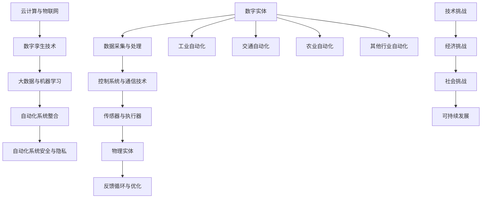

                 

# 数字实体与物理实体的自动化前景

> 关键词：数字实体，物理实体，自动化，物联网，人工智能，工业4.0

> 摘要：本文探讨了数字实体与物理实体自动化的背景、理论基础、关键技术、应用领域以及未来发展。通过对数字实体与物理实体的定义，以及自动化技术的核心概念和原理的详细阐述，本文揭示了自动化在现代工业、交通、农业等领域的广泛应用和深远影响。同时，本文还分析了自动化系统面临的挑战，并提出了相应的解决策略。通过实际项目案例，本文展示了自动化系统的具体实现和应用，为推动自动化技术的发展提供了有益的参考。

## 目录大纲

### 第一部分：背景与理论基础

#### 第1章：数字实体与物理实体的自动化概述

##### 1.1 自动化的历史与发展

##### 1.2 数字实体与物理实体的定义

##### 1.3 自动化的关键概念与术语

##### 1.4 自动化在现代工业中的重要性

#### 第2章：数字化与自动化技术基础

##### 2.1 数据采集与处理

##### 2.2 传感器与执行器技术

##### 2.3 控制系统与通信技术

##### 2.4 人工智能在自动化中的应用

#### 第3章：数字实体与物理实体的互操作性与整合

##### 3.1 数字孪生技术

##### 3.2 云计算与物联网在自动化中的应用

##### 3.3 大数据和机器学习在自动化系统中的角色

##### 3.4 自动化系统的安全与隐私问题

### 第二部分：自动化技术应用

#### 第4章：工业自动化

##### 4.1 工业自动化概述

##### 4.2 机器人技术与应用

##### 4.3 自动化生产线的设计与实施

##### 4.4 智能工厂的概念与实现

#### 第5章：交通自动化

##### 5.1 自动驾驶技术

##### 5.2 智能交通系统

##### 5.3 航空自动化

##### 5.4 铁路自动化

#### 第6章：农业自动化

##### 6.1 智能农业系统

##### 6.2 自动化灌溉系统

##### 6.3 农业机器人

##### 6.4 数据驱动的农业生产管理

### 第三部分：自动化系统的挑战与未来发展

#### 第7章：自动化系统中的挑战与解决方案

##### 7.1 技术挑战

##### 7.2 经济挑战

##### 7.3 社会挑战

##### 7.4 自动化系统的可持续发展

#### 第8章：自动化技术的未来发展趋势

##### 8.1 新兴技术的展望

##### 8.2 自动化在各个行业的未来应用

##### 8.3 自动化与人类的互动

##### 8.4 自动化的伦理与社会影响

#### 第9章：案例研究与最佳实践

##### 9.1 自动化案例研究

##### 9.2 自动化最佳实践

##### 9.3 自动化行业报告与预测

### 附录

#### 附录A：自动化工具与资源

##### A.1 自动化软件与平台

##### A.2 自动化硬件与传感器

##### A.3 开源自动化框架与库

##### A.4 自动化研究论文与书籍推荐

### 流程图：数字实体与物理实体的自动化架构



### 核心算法原理：深度学习在自动化系统中的应用

#### 2.1.1 神经网络基础

神经网络是一种模拟人脑结构和功能的计算模型，由大量简单的计算单元（神经元）互联组成。每个神经元接收多个输入信号，通过加权求和后，加上偏置项，然后经过激活函数进行非线性变换。

伪代码如下：

```python
def neuron(input_data, weights, bias, activation_function):
    z = np.dot(input_data, weights) + bias
    output = activation_function(z)
    return output
```

其中，`input_data` 是输入数据，`weights` 是权重，`bias` 是偏置项，`activation_function` 是激活函数，常见的激活函数有 Sigmoid、ReLU 等。

#### 2.1.2 卷积神经网络（CNN）

卷积神经网络是一种专门用于处理图像数据的神经网络。它通过卷积操作提取图像的特征。

伪代码如下：

```python
def convolution(input_data, filter, stride, padding):
    output = np.zeros((input_data.shape[0] - filter.shape[0] + 2 * padding, input_data.shape[1] - filter.shape[1] + 2 * padding))
    for i in range(output.shape[0]):
        for j in range(output.shape[1]):
            window = input_data[i:i+filter.shape[0], j:j+filter.shape[1]]
            output[i, j] = np.dot(window, filter)
    return output
```

其中，`input_data` 是输入图像，`filter` 是卷积核，`stride` 是步长，`padding` 是填充。

#### 2.1.3 循环神经网络（RNN）

循环神经网络是一种能够处理序列数据的神经网络，它能够记住前面的信息，从而处理变长序列。

伪代码如下：

```python
def rnn(input_sequence, weights, bias, activation_function):
    outputs = []
    hidden_state = np.zeros(weights.shape[0])
    for t in range(len(input_sequence)):
        input = input_sequence[t]
        z = np.dot(input, weights) + bias
        output = activation_function(z)
        outputs.append(output)
        hidden_state = np.dot(hidden_state, weights) + bias
    return outputs, hidden_state
```

其中，`input_sequence` 是输入序列，`weights` 是权重，`bias` 是偏置项，`activation_function` 是激活函数。

### 数学模型和数学公式

#### 1. 数据预处理

数据预处理是自动化系统中的重要步骤，包括数据的归一化、去噪、缺失值处理等。

$$
\hat{x} = \frac{x - \mu}{\sigma}
$$

其中，$\hat{x}$ 是归一化后的数据，$x$ 是原始数据，$\mu$ 是数据的均值，$\sigma$ 是数据的标准差。

#### 2. 传感器模型

传感器模型用于描述传感器采集到的数据与实际物理量之间的关系。

$$
y = f(x) + \epsilon
$$

其中，$y$ 是传感器采集到的数据，$x$ 是实际物理量，$f(x)$ 是传感器模型，$\epsilon$ 是噪声。

#### 3. 控制系统模型

控制系统模型用于描述控制系统的输入输出关系。

$$
y(t) = C(x(t) - r(t)) + D\dot{x}(t) + E\dot{r}(t)
$$

其中，$y(t)$ 是系统输出，$x(t)$ 是系统状态，$r(t)$ 是参考输入，$C$、$D$、$E$ 是控制系统的参数。

#### 4. 机器学习模型

机器学习模型用于描述数据与预测结果之间的关系。

$$
\hat{y} = \sigma(\mathbf{W}^T \mathbf{X} + b)
$$

其中，$\hat{y}$ 是预测结果，$\mathbf{X}$ 是输入特征矩阵，$\mathbf{W}$ 是权重矩阵，$\sigma$ 是激活函数，$b$ 是偏置项。

### 项目实战

#### 1. 实际案例

在本章中，我们将通过一个实际案例来展示自动化系统在工业生产中的应用。假设我们有一个生产线，需要通过自动化系统来控制机器人的运动，从而实现对产品的精确加工。

#### 开发环境搭建

1. 安装Python环境（版本3.8及以上）
2. 安装TensorFlow库（版本2.6及以上）
3. 安装ROS（Robot Operating System）库

```bash
pip install tensorflow==2.6
sudo apt-get install ros-melodic-desktop
```

#### 源代码实现

以下是一个简单的Python代码，用于控制机器人的运动。

```python
import rospy
from geometry_msgs.msg import Twist

def move_robot(linear_speed, angular_speed):
    # 初始化节点
    rospy.init_node('robot_control', anonymous=True)
    # 创建一个Publisher，发布到机器人控制话题
    pub = rospy.Publisher('/robot/command', Twist, queue_size=10)
    # 创建一个消息对象
    move_cmd = Twist()

    while not rospy.is_shutdown():
        # 设置机器人的线速度和角速度
        move_cmd.linear.x = linear_speed
        move_cmd.angular.z = angular_speed
        # 发布消息
        pub.publish(move_cmd)
        # 控制消息发布的频率
        rospy.sleep(0.1)

if __name__ == '__main__':
    try:
        move_robot(0.5, 1.0)
    except rospy.ROSInterruptException:
        pass
```

#### 代码解读与分析

1. 导入ROS的几何消息库，用于控制机器人的运动。

```python
import rospy
from geometry_msgs.msg import Twist
```

2. 初始化ROS节点，并创建一个Publisher对象，用于发布机器人控制命令。

```python
rospy.init_node('robot_control', anonymous=True)
pub = rospy.Publisher('/robot/command', Twist, queue_size=10)
```

3. 创建一个 Twist 消息对象，用于存储机器人的控制命令。

```python
move_cmd = Twist()
```

4. 在while循环中，设置机器人的运动速度，并发布消息。

```python
while not rospy.is_shutdown():
    move_cmd.linear.x = linear_speed
    move_cmd.angular.z = angular_speed
    pub.publish(move_cmd)
    rospy.sleep(0.1)
```

- `move_cmd.linear.x = linear_speed`：设置机器人的线速度，`linear_speed` 是输入的线速度参数。
- `move_cmd.angular.z = angular_speed`：设置机器人的角速度，`angular_speed` 是输入的角速度参数。
- `pub.publish(move_cmd)`：发布控制命令。
- `rospy.sleep(0.1)`：控制循环的执行频率。

5. 异常处理。

```python
if __name__ == '__main__':
    try:
        move_robot(0.5, 1.0)
    except rospy.ROSInterruptException:
        pass
```

通过上述代码，我们可以实现对机器人的远程控制，从而完成自动化生产线的任务。在实际应用中，可以根据具体的任务需求，对代码进行相应的调整和优化。

### 详细解释说明

在自动化系统中，机器人控制是一个关键的部分。本案例通过Python脚本实现了对机器人的运动控制，主要分为以下几个步骤：

1. **初始化节点**

```python
rospy.init_node('robot_control', anonymous=True)
```

这句话的作用是初始化ROS节点，并指定节点的名称为`robot_control`。`anonymous=True` 表示如果节点名称已经存在，则自动添加一个随机字符串作为后缀，避免名称冲突。

2. **创建Publisher对象**

```python
pub = rospy.Publisher('/robot/command', Twist, queue_size=10)
```

这里创建了一个Publisher对象，用于发布机器人控制命令。参数`/robot/command` 是发布消息的话题名称，`Twist` 是消息类型，表示机器人的线速度和角速度。`queue_size=10` 表示消息队列的大小，即可以缓存10条消息。

3. **创建消息对象**

```python
move_cmd = Twist()
```

创建了一个`Twist`消息对象，用于存储机器人的控制命令。`Twist`消息类型包含三个部分：线速度（linear）、角速度（angular），分别用于控制机器人的前进、后退和旋转。

4. **循环控制机器人运动**

```python
while not rospy.is_shutdown():
    move_cmd.linear.x = linear_speed
    move_cmd.angular.z = angular_speed
    pub.publish(move_cmd)
    rospy.sleep(0.1)
```

这部分代码实现了一个无限循环，用于持续发送控制命令。在每次循环中，设置机器人的线速度和角速度，然后发布消息。`rospy.sleep(0.1)` 用于控制循环的执行频率，保证消息能够及时发布。

- `move_cmd.linear.x = linear_speed`：设置机器人的线速度，`linear_speed` 是输入的线速度参数。
- `move_cmd.angular.z = angular_speed`：设置机器人的角速度，`angular_speed` 是输入的角速度参数。
- `pub.publish(move_cmd)`：发布控制命令。
- `rospy.sleep(0.1)`：控制循环的执行频率。

5. **异常处理**

```python
if __name__ == '__main__':
    try:
        move_robot(0.5, 1.0)
    except rospy.ROSInterruptException:
        pass
```

这段代码用于处理程序异常。`if __name__ == '__main__':` 表示如果该脚本作为主程序运行，则执行以下代码。`try...except` 结构用于捕获异常，如果程序出现异常，则执行`except`后面的代码块，这里简单地处理了`ROSInterruptException`异常。

### 实际应用

在实际应用中，上述脚本可以作为机器人控制器的一部分，集成到更大的自动化系统中。例如，在生产线上，机器人可能需要根据不同的工序执行不同的运动轨迹，这时可以通过修改脚本中的控制命令来实现。

同时，为了提高机器人的响应速度和精确度，还可以引入更多的传感器和反馈机制，实现对机器人运动的实时监控和调整。

### 注意事项

1. **ROS环境的配置**：在运行脚本前，需要确保ROS环境已经正确配置，包括话题名称、消息类型等。
2. **机器人硬件**：机器人控制器需要与实际硬件设备（如机器人臂）连接，并确保硬件能够接收并执行控制命令。
3. **安全性**：在实际应用中，需要考虑机器人的安全运行，避免因误操作导致的安全事故。例如，可以设置机器人的最大速度限制，防止意外伤害。

通过以上详细解释，我们可以更好地理解如何使用Python脚本控制机器人运动，并在实际自动化系统中应用。这也为后续的项目实战奠定了基础。## 文章标题

### 数字实体与物理实体的自动化前景

## 文章关键词

- 数字实体
- 物理实体
- 自动化
- 物联网
- 人工智能
- 工业自动化
- 交通自动化
- 农业自动化
- 云计算
- 机器学习
- 数字孪生
- 智能工厂

## 文章摘要

本文全面探讨了数字实体与物理实体自动化的概念、发展历程、关键技术以及在不同领域的应用前景。首先，文章介绍了数字实体与物理实体的定义及其相互关系，分析了自动化技术的基础理论和关键概念。随后，文章深入探讨了数据采集与处理、传感器与执行器技术、控制系统与通信技术等自动化技术的基础，并重点介绍了人工智能在自动化系统中的应用。接着，文章分析了数字实体与物理实体的互操作性与整合，包括数字孪生技术、云计算与物联网在自动化中的应用以及大数据和机器学习在自动化系统中的角色。在应用部分，文章详细介绍了自动化技术在工业、交通、农业等领域的实际应用案例。最后，文章探讨了自动化系统面临的挑战与未来发展趋势，包括技术挑战、经济挑战、社会挑战以及自动化系统的可持续发展。通过本文，读者将全面了解数字实体与物理实体自动化的现状与未来，为相关领域的研究和应用提供参考。

## 第一部分：背景与理论基础

### 第1章：数字实体与物理实体的自动化概述

#### 1.1 自动化的历史与发展

自动化技术的概念可以追溯到人类历史上最早的机械化生产。早在公元前3000年左右，古埃及人就开始使用杠杆和滑轮等简单机械进行农业生产。然而，真正意义上的自动化概念是在20世纪初期随着工业革命的兴起而逐渐形成的。

第一次工业革命发生在18世纪末至19世纪初，以蒸汽动力的广泛应用为标志，使机械化生产成为可能。然而，这一时期的自动化主要是机械化和半自动化的过程，即通过机械化设备来减少人工劳动。这一阶段的代表性技术包括蒸汽机、纺织机械等。

第二次工业革命发生在19世纪末至20世纪初，电力和内燃机的发明和应用推动了工业生产的大规模自动化。在这一阶段，自动化技术开始涉及到生产线上的机器人和自动化装配线。例如，福特公司于1913年引入的流水线生产方式极大地提高了生产效率。

第三次工业革命发生在20世纪后半叶，以计算机技术和信息技术的发展为特征。计算机的出现使得自动化控制变得更加精确和高效。这一时期，自动化技术开始广泛应用于各行各业，包括制造业、交通运输、医疗保健等。

进入21世纪，随着物联网（IoT）、人工智能（AI）和大数据技术的快速发展，自动化技术迎来了新的发展阶段。物联网使得各种设备和系统能够通过网络进行连接和数据交换，实现了信息的实时共享和智能决策。人工智能和机器学习技术的进步则为自动化系统提供了更加智能化的控制能力和预测能力。

#### 1.2 数字实体与物理实体的定义

数字实体是指存在于数字世界中的信息、数据和模型等抽象实体。这些实体可以是数字文档、数据库记录、算法模型等。数字实体具有易存储、易处理、易传输的特点，为自动化系统提供了丰富的数据资源和计算能力。

物理实体则是指现实世界中的具体物体和系统，如机器、设备、建筑物、交通设施等。物理实体是自动化系统的执行对象，通过传感器、执行器和控制系统的交互来实现自动化功能。

数字实体与物理实体之间的关系是相互依存和相互作用的。数字实体通过模拟、建模和分析物理实体的状态和行为，为自动化系统提供决策支持和控制指令。而物理实体通过传感器收集数据，反馈给数字实体，实现闭环控制和优化。

#### 1.3 自动化的关键概念与术语

自动化技术的核心概念和术语包括：

- **自动化系统**：由计算机、传感器、执行器和控制软件等组成的系统，用于实现自主控制、监测和优化物理实体。
- **传感器**：用于检测物理实体状态并将其转换为电信号的设备，如温度传感器、湿度传感器、加速度传感器等。
- **执行器**：用于执行物理动作的设备，如电机、气缸、阀门等，根据自动化系统的指令进行工作。
- **控制系统**：用于接收传感器输入、处理数据和发出执行器指令的软件和硬件系统，如PLC（可编程逻辑控制器）、SCADA（监控与数据采集系统）等。
- **闭环控制**：一种控制方式，通过将执行器的输出反馈给传感器，实现系统的自我调整和优化，以提高系统的响应速度和稳定性。
- **物联网（IoT）**：一种将物理设备连接到互联网的技术，实现设备之间的通信和数据交换，为自动化系统提供了广泛的数据来源和远程控制能力。
- **数字孪生**：一种基于虚拟模型的技术，通过模拟物理实体的状态和行为，实现对物理实体的实时监控、分析和优化。

#### 1.4 自动化在现代工业中的重要性

自动化技术在现代工业中具有重要地位，其作用主要体现在以下几个方面：

1. **提高生产效率**：自动化系统能够实现高速、稳定和精确的生产，大大提高了生产效率。例如，在汽车制造行业，自动化生产线可以确保生产节拍，减少停机时间，提高生产率。

2. **降低成本**：自动化技术通过减少人工操作和优化生产流程，降低了生产成本。例如，在电子制造行业，自动化设备可以高效地完成焊接、装配等工序，降低人工成本和废品率。

3. **提高产品质量**：自动化系统具有高度精确和稳定的控制能力，可以确保生产的产品质量一致。例如，在医药行业，自动化生产线可以确保药品的生产符合严格的质量标准。

4. **改善工作环境**：自动化技术减少了人工操作和体力劳动，改善了工作环境。例如，在危险或繁重的工作环境中，自动化设备可以代替人类进行操作，减少工伤事故。

5. **促进创新**：自动化技术的应用为工业创新提供了新的机遇。通过数字化、网络化和智能化，自动化技术可以推动工业生产方式的变革，实现制造业的数字化转型。

总之，自动化技术在现代工业中发挥着重要作用，不仅提高了生产效率和产品质量，还促进了工业创新和可持续发展。随着物联网、人工智能等新技术的不断发展，自动化技术将在未来继续推动工业革命，为人类创造更多的价值。

### 第2章：数字化与自动化技术基础

#### 2.1 数据采集与处理

数据采集与处理是自动化系统的核心环节，其目的是通过传感器收集物理实体的状态信息，并将其转化为可用于分析和决策的数据。以下是数据采集与处理的主要步骤和关键技术：

1. **传感器选择与安装**

   传感器是数据采集的核心组件，根据应用场景选择合适的传感器至关重要。常见的传感器包括温度传感器、湿度传感器、压力传感器、加速度传感器、光敏传感器等。传感器通常需要安装在适当的物理位置，以确保数据的准确性和可靠性。

2. **信号调理**

   传感器采集到的信号通常是微弱的、噪声较多的，需要通过信号调理电路进行放大、滤波、去除噪声等处理，以提高信号的质量和稳定性。信号调理电路的设计和选择对于数据采集至关重要。

3. **数据传输**

   采集到的数据需要通过数据传输技术传输到控制系统或数据处理平台。常用的数据传输技术包括有线传输（如RS-485、以太网等）和无线传输（如Wi-Fi、蓝牙、Zigbee等）。选择合适的数据传输技术需要考虑传输距离、传输速率、数据安全等因素。

4. **数据存储**

   为了方便数据的后续处理和分析，需要将采集到的数据存储在数据库或文件系统中。常用的数据存储技术包括关系型数据库（如MySQL、PostgreSQL等）和非关系型数据库（如MongoDB、Cassandra等）。数据存储需要考虑数据的存储容量、访问速度、数据安全等因素。

5. **数据处理与分析**

   数据处理与分析是自动化系统的核心环节，其目的是从大量数据中提取有用信息，为系统优化和控制提供依据。数据处理与分析的关键技术包括：

   - 数据清洗：去除数据中的噪声、异常值和重复数据，确保数据的质量。
   - 数据转换：将不同格式、单位或来源的数据进行统一转换，以便于后续处理。
   - 数据挖掘：使用统计学、机器学习等方法，从数据中发现隐藏的模式、趋势和关联关系。
   - 数据可视化：通过图表、图形等方式，将数据分析结果直观地展示出来，便于理解和决策。

#### 2.2 传感器与执行器技术

传感器和执行器是自动化系统中最重要的两个组件，它们分别用于感知物理实体状态和执行物理动作。

1. **传感器技术**

   传感器技术主要包括以下几个方面：

   - **传感器类型**：根据感知物理量的不同，传感器可分为温度传感器、湿度传感器、压力传感器、位移传感器、速度传感器等。每种传感器都有其特定的应用场景和特性。

   - **传感器原理**：传感器的原理主要包括电阻式、电容式、电感式、光电式、热敏式等。例如，热敏电阻的电阻值随温度变化，而光电传感器的输出信号随光照强度变化。

   - **传感器性能**：传感器的性能主要包括灵敏度、精度、响应时间、稳定性等。选择合适的传感器需要综合考虑应用场景和性能要求。

2. **执行器技术**

   执行器技术主要包括以下几个方面：

   - **执行器类型**：根据执行物理动作的方式不同，执行器可分为电机、液压缸、气动缸、步进电机等。每种执行器都有其特定的应用场景和特性。

   - **执行器原理**：执行器的原理主要包括电磁原理、液压原理、气动原理等。例如，电机通过电流产生磁场，驱动转子旋转；液压缸通过液压油的压力驱动活塞运动。

   - **执行器性能**：执行器的性能主要包括力矩、速度、负载能力、响应时间等。选择合适的执行器需要综合考虑应用场景和性能要求。

#### 2.3 控制系统与通信技术

控制系统是自动化系统的核心，用于接收传感器数据、处理控制指令并驱动执行器。控制系统与通信技术是确保自动化系统稳定、高效运行的关键。

1. **控制系统架构**

   控制系统通常由硬件和软件两部分组成：

   - **硬件**：包括控制器（如PLC、单片机等）、输入输出模块（如传感器接口、执行器接口等）、通信模块（如以太网接口、无线接口等）等。硬件的选择需要考虑控制系统的性能、规模和应用场景。
   - **软件**：包括控制算法、监控软件、数据管理软件等。控制算法用于处理传感器数据、生成控制指令；监控软件用于实时监控系统状态；数据管理软件用于数据存储、分析和报表生成。

2. **通信技术**

   自动化系统中的通信技术主要用于实现传感器、控制器和执行器之间的数据交换和协同工作。常见的通信技术包括：

   - **有线通信**：如RS-232、RS-485、以太网等，适用于距离较近、可靠性要求较高的场景。
   - **无线通信**：如Wi-Fi、蓝牙、Zigbee、LoRa等，适用于距离较远、灵活性要求较高的场景。无线通信技术需要考虑信号覆盖范围、传输速率、功耗、安全性等因素。

#### 2.4 人工智能在自动化中的应用

人工智能（AI）技术的发展为自动化系统带来了新的机遇。通过引入AI技术，自动化系统可以实现更加智能化、自适应的控制和优化。以下是人工智能在自动化系统中的应用：

1. **机器学习**

   机器学习是一种通过数据训练模型、实现预测和决策的技术。在自动化系统中，机器学习可以用于：

   - **故障预测**：通过对传感器数据的分析，预测设备故障，提前进行维护，减少停机时间和维修成本。
   - **优化控制**：根据历史数据和学习到的模式，优化控制系统参数，提高控制精度和稳定性。
   - **异常检测**：通过监测实时数据，检测异常情况，及时发出警报，确保系统安全运行。

2. **计算机视觉**

   计算机视觉是一种通过图像处理和模式识别技术实现目标检测、识别和跟踪的技术。在自动化系统中，计算机视觉可以用于：

   - **质量检测**：对生产过程中的产品进行实时质量检测，识别缺陷和异常。
   - **自动化装配**：通过视觉系统识别和定位零件，实现自动化装配。
   - **路径规划**：在移动机器人中，使用计算机视觉技术实现路径规划和避障。

3. **自然语言处理**

   自然语言处理是一种通过理解和生成自然语言的技术。在自动化系统中，自然语言处理可以用于：

   - **语音控制**：通过语音识别技术实现自动化设备的远程控制。
   - **文本分析**：对设备日志、操作指令等进行文本分析，实现智能监控和决策。
   - **人机交互**：通过自然语言交互，实现人与自动化系统的智能对话和协同工作。

总之，人工智能技术的引入使得自动化系统具有更高的智能性和自适应能力，为工业、交通、农业等领域的自动化应用提供了新的思路和解决方案。随着AI技术的不断发展，自动化系统将在未来发挥更加重要的作用。

### 第3章：数字实体与物理实体的互操作性与整合

#### 3.1 数字孪生技术

数字孪生（Digital Twin）技术是一种通过构建物理实体的数字模型，实现对物理实体的实时监控、分析和优化的技术。数字孪生技术包括以下几个关键组成部分：

1. **数据采集**：通过传感器和其他数据采集设备，实时收集物理实体的状态信息，如温度、湿度、压力、位置等。

2. **数字模型构建**：根据物理实体的结构和特性，构建一个与物理实体相对应的数字模型。数字模型可以是几何模型、物理模型、行为模型等。

3. **数据同步**：将物理实体和数字模型之间的数据进行实时同步，确保数字模型反映物理实体的实际状态。

4. **数据分析与优化**：通过分析数字模型中的数据，实现对物理实体的优化和调整。例如，通过分析设备的运行数据，预测设备的故障并进行预防性维护。

数字孪生技术在工业、医疗、交通等领域具有广泛的应用。在工业领域，数字孪生技术可以用于生产线优化、设备维护、生产过程控制等；在医疗领域，数字孪生技术可以用于患者健康监测、疾病预测和治疗优化；在交通领域，数字孪生技术可以用于车辆监控、交通流量分析、路况预测等。

#### 3.2 云计算与物联网在自动化中的应用

云计算和物联网（IoT）技术的发展极大地推动了自动化系统的互操作性和整合能力。

1. **云计算**

   云计算为自动化系统提供了强大的计算和存储资源，使得自动化系统能够处理大量数据，并实现高效的协同工作。云计算的关键作用包括：

   - **数据存储与管理**：通过云平台，自动化系统可以存储和管理大量数据，实现数据的持久化、备份和共享。
   - **数据处理与分析**：云计算提供了丰富的数据处理和分析工具，如大数据分析平台、机器学习平台等，自动化系统可以通过云平台进行数据处理和分析。
   - **应用部署与扩展**：云计算使得自动化系统可以快速部署和扩展，满足不断变化的应用需求。

2. **物联网（IoT）**

   物联网技术通过连接各种设备和系统，实现了物理世界和数字世界的无缝连接。物联网的关键作用包括：

   - **设备互联**：物联网技术使得各种设备能够通过网络进行连接和数据交换，实现了设备之间的协同工作和信息共享。
   - **数据采集与传输**：物联网技术通过传感器和执行器，实时采集物理实体的状态信息，并将其传输到控制系统或数据处理平台。
   - **远程监控与控制**：物联网技术使得自动化系统可以远程监控和操作物理实体，提高了系统的灵活性和可维护性。

云计算和物联网在自动化系统中的应用案例包括：

- **智能工厂**：通过云计算和物联网技术，实现生产设备的联网和协同工作，提高生产效率和质量。
- **智能交通**：通过物联网技术，实现车辆的实时监控和交通流量的智能调控，提高交通系统的效率和安全性。
- **智能医疗**：通过云计算和物联网技术，实现患者健康数据的实时采集和分析，提供个性化的医疗服务。

#### 3.3 大数据和机器学习在自动化系统中的角色

大数据和机器学习技术在自动化系统中发挥着越来越重要的作用，它们为自动化系统提供了更加智能化的监控、预测和优化能力。

1. **大数据**

   大数据技术在自动化系统中的应用主要包括：

   - **数据采集与存储**：自动化系统通过传感器和其他设备，采集大量物理实体的数据，并将其存储在分布式数据库中。
   - **数据处理与分析**：大数据技术提供了高效的数据处理和分析方法，如数据清洗、数据挖掘、数据可视化等，自动化系统可以通过大数据技术从海量数据中提取有价值的信息。
   - **预测与优化**：通过分析历史数据，大数据技术可以预测物理实体的未来状态，并为其提供优化建议。

2. **机器学习**

   机器学习技术在自动化系统中的应用主要包括：

   - **故障预测**：通过分析设备的历史运行数据，机器学习模型可以预测设备的故障时间，提前进行维护，减少停机时间和维修成本。
   - **优化控制**：通过学习设备的运行模式和性能数据，机器学习模型可以优化控制参数，提高系统的稳定性和效率。
   - **异常检测**：机器学习模型可以通过分析实时数据，检测异常情况，并及时发出警报，确保系统的安全和稳定运行。

大数据和机器学习技术在自动化系统中的应用案例包括：

- **智能工厂**：通过大数据和机器学习技术，实现生产过程的实时监控、故障预测和优化控制，提高生产效率和质量。
- **智能交通**：通过大数据和机器学习技术，实现交通流量的实时监控、预测和优化，提高交通系统的效率和安全性。
- **智能医疗**：通过大数据和机器学习技术，实现患者健康数据的实时采集、分析和预测，提供个性化的医疗服务。

总之，大数据和机器学习技术的应用为自动化系统带来了更加智能化的监控、预测和优化能力，推动了自动化系统的技术进步和应用发展。

#### 3.4 自动化系统的安全与隐私问题

随着自动化系统的广泛应用，安全问题日益凸显。自动化系统涉及大量的数据交换和控制系统，一旦发生安全漏洞，可能导致严重的经济损失和安全隐患。以下是自动化系统面临的主要安全挑战和隐私问题：

1. **网络攻击**：自动化系统通过互联网连接，容易成为黑客攻击的目标。黑客可能通过恶意软件、病毒等手段入侵系统，窃取敏感数据或篡改系统控制指令。

2. **数据泄露**：自动化系统涉及大量敏感数据，如设备运行数据、用户数据、控制指令等。如果数据泄露，可能导致商业机密泄露、用户隐私泄露等问题。

3. **设备故障**：自动化系统中的设备可能由于故障、老化等原因导致无法正常工作，从而影响系统的稳定性和安全性。

4. **人为错误**：自动化系统的操作和管理需要专业知识和技能，如果操作人员缺乏培训或操作不当，可能导致系统故障或安全事故。

为了解决这些问题，需要采取以下措施：

1. **安全架构设计**：在系统设计阶段，应充分考虑安全需求，采用安全的架构和设计模式，确保系统的安全性和可靠性。

2. **安全防护措施**：部署防火墙、入侵检测系统、安全审计等安全防护措施，防止网络攻击和数据泄露。

3. **数据加密**：对敏感数据进行加密处理，确保数据在传输和存储过程中的安全性。

4. **权限管理**：严格权限管理，确保只有授权人员才能访问系统和数据。

5. **定期培训**：对操作人员进行定期培训，提高其安全意识和操作技能，减少人为错误。

6. **应急响应**：制定应急响应计划，一旦发生安全事件，能够迅速响应和处理。

总之，自动化系统的安全和隐私问题需要引起高度重视，通过采取有效的安全措施，可以确保自动化系统的稳定运行和数据安全。

### 第二部分：自动化技术应用

#### 第4章：工业自动化

工业自动化是自动化技术的重要应用领域之一，它通过引入传感器、执行器和控制系统，实现生产线的自动化控制，从而提高生产效率、降低成本、提升产品质量。以下是工业自动化在各个方面的应用。

#### 4.1 工业自动化概述

工业自动化是指在工业生产过程中，利用自动化技术和设备对生产过程进行控制、监测和优化，以实现生产过程的高度自动化和智能化。工业自动化包括以下几个关键环节：

1. **传感器技术**：在工业自动化中，传感器用于实时监测生产过程中的各种参数，如温度、湿度、压力、速度等。传感器的数据为控制系统提供了重要的输入，用于实时调整和控制生产过程。

2. **执行器技术**：执行器是工业自动化系统中的关键组件，用于根据控制系统的指令执行具体的物理动作。常见的执行器包括电机、液压缸、气动缸等。

3. **控制系统**：控制系统是工业自动化的核心，它负责接收传感器数据、处理数据并生成控制指令，以驱动执行器进行相应的物理动作。控制系统通常采用PLC（可编程逻辑控制器）、DCS（分布式控制系统）等。

4. **通信技术**：工业自动化系统中的各个组件通过通信技术进行数据交换和协同工作。常见的通信技术包括有线通信（如RS-232、RS-485、以太网等）和无线通信（如Wi-Fi、蓝牙、Zigbee等）。

#### 4.2 机器人技术与应用

机器人技术在工业自动化中发挥着重要作用，特别是在精密制造、装配、焊接、喷涂等工序中。工业机器人通常包括臂部、手腕和末端执行器等部分，可以执行复杂的运动和操作。

1. **机器人分类**

   工业机器人可以根据不同的分类标准进行分类，如按照运动轴数、自由度、工作环境等。

   - **按运动轴数分类**：工业机器人可分为单轴机器人、双轴机器人、多轴机器人等。
   - **按自由度分类**：工业机器人可分为3自由度、4自由度、6自由度、7自由度等。
   - **按工作环境分类**：工业机器人可分为固定式机器人、移动式机器人、水下机器人等。

2. **机器人应用**

   工业机器人在多个领域的应用取得了显著的成效：

   - **装配与组装**：工业机器人可以高效、精确地完成装配和组装任务，如汽车制造业中的零部件装配。
   - **焊接与切割**：工业机器人可以执行焊接、切割等高强度、高精度的操作，如金属加工、船舶制造等。
   - **喷涂与涂装**：工业机器人可以自动化完成喷涂和涂装任务，如汽车涂装、电子元器件涂装等。
   - **搬运与物流**：工业机器人可以用于搬运重物、运输原材料和产品，如仓储物流、集装箱装卸等。

3. **机器人技术发展趋势**

   随着人工智能、物联网和机器人技术的不断发展，工业机器人技术呈现出以下发展趋势：

   - **智能化**：工业机器人将逐渐具备自主决策、自适应和自学习的能力，通过人工智能算法实现更加智能化的操作。
   - **人机协作**：工业机器人和人类操作者将更加紧密地协作，通过增强现实（AR）和虚拟现实（VR）技术实现人机交互。
   - **个性化定制**：工业机器人将能够根据不同的生产需求，快速调整和优化其工作流程，实现个性化定制生产。
   - **系统集成**：工业机器人将与其他自动化系统（如MES、ERP等）进行集成，实现生产过程的全面自动化和智能化。

#### 4.3 自动化生产线的设计与实施

自动化生产线的设计与实施是工业自动化的关键环节，其目的是实现生产过程的高效、稳定和可靠。以下是自动化生产线设计与实施的主要步骤：

1. **需求分析**：首先，需要对生产过程进行详细的调查和分析，明确生产目标、产品特点、工艺要求等，为后续设计提供基础。

2. **工艺规划**：根据需求分析，制定生产线的工艺流程和工艺参数，包括各工序的顺序、时间、工艺参数等。

3. **设备选型**：根据工艺要求，选择适合的自动化设备，如机器人、传感器、执行器、控制系统等。

4. **系统设计**：设计自动化生产线的整体架构，包括设备布局、控制系统、数据传输和通信系统等。

5. **系统集成**：将选型的设备进行集成，搭建自动化生产线，并进行系统调试和优化。

6. **培训与维护**：对操作人员进行培训，确保他们能够熟练操作和维护自动化生产线。同时，建立完善的维护和保养体系，确保生产线的长期稳定运行。

#### 4.4 智能工厂的概念与实现

智能工厂是工业自动化的高级形态，它通过引入物联网、大数据、人工智能等新技术，实现生产过程的全面自动化和智能化。以下是智能工厂的概念与实现：

1. **智能工厂的概念**

   智能工厂是一种高度自动化的生产模式，通过物联网、大数据、人工智能等技术的融合，实现生产过程的自动化、智能化和高效化。智能工厂的主要特征包括：

   - **设备联网**：通过物联网技术，实现生产设备之间的互联互通，实现设备数据的实时传输和共享。
   - **数据驱动**：通过大数据技术，对生产过程进行实时监控和分析，为生产决策提供数据支持。
   - **智能决策**：通过人工智能技术，实现生产过程的智能优化和决策，提高生产效率和产品质量。
   - **人机协作**：通过人机交互技术，实现人与机器的协同工作，提高生产效率和安全性。

2. **智能工厂的实现步骤**

   实现智能工厂需要经历以下几个步骤：

   - **数字化改造**：对现有工厂进行数字化改造，实现设备联网和数据采集。
   - **系统集成**：将物联网、大数据、人工智能等技术集成到生产系统中，实现生产过程的智能化。
   - **数据分析和优化**：通过对生产数据进行分析和优化，实现生产过程的实时监控、预测和决策。
   - **人机协作**：通过人机交互技术，实现人与机器的协同工作，提高生产效率和安全性。
   - **持续优化**：通过持续优化和改进，不断提高生产线的自动化水平和智能化程度。

智能工厂的实现将大大提升生产效率、降低成本、提高产品质量，为制造业的数字化转型和智能化升级提供重要支撑。随着新技术的不断发展，智能工厂将不断演进和优化，为工业4.0和智能制造的实现奠定基础。

### 第5章：交通自动化

#### 5.1 自动驾驶技术

自动驾驶技术是交通自动化领域的重要研究方向，其目标是实现车辆在无人干预的情况下自主行驶。以下是自动驾驶技术的关键组成部分和实现方法：

1. **传感器技术**

   自动驾驶车辆依赖于多种传感器来感知周围环境，包括摄像头、激光雷达（LiDAR）、雷达、超声波传感器等。这些传感器用于检测道路标志、车道线、行人、其他车辆等目标，获取环境信息。

2. **感知与识别**

   自动驾驶系统通过感知传感器获取的图像和点云数据，利用计算机视觉和深度学习算法进行目标检测和识别。常用的算法包括卷积神经网络（CNN）、循环神经网络（RNN）和注意力机制等。

3. **路径规划**

   自动驾驶系统需要根据当前车辆的位置、速度和周围环境信息，规划出最优行驶路径。常用的路径规划算法包括基于采样的RRT（快速随机树）算法、基于图的A*算法和基于物理的模型预测控制（MPC）算法等。

4. **控制策略**

   自动驾驶系统通过控制策略实现车辆的加速、制动和转向等动作。常见的控制策略包括模型预测控制（MPC）、自适应控制（AC）和深度强化学习（DRL）等。

5. **集成与测试**

   自动驾驶系统需要将感知、识别、路径规划和控制策略等多个模块集成在一起，并进行全面的测试和验证，确保系统的稳定性和安全性。

自动驾驶技术在汽车、物流、公共交通等领域具有广泛的应用前景。在个人出行方面，自动驾驶汽车可以提供更加安全、舒适和便捷的服务；在物流领域，自动驾驶卡车和无人配送车可以降低运输成本和提高运输效率；在公共交通领域，自动驾驶巴士和无人出租车可以提升交通系统的效率和用户体验。

#### 5.2 智能交通系统

智能交通系统（Intelligent Transportation System，ITS）是通过集成传感器、通信、控制和管理等技术，实现交通系统的自动化、智能化和高效化的系统。以下是智能交通系统的主要组成部分和应用：

1. **传感器技术**

   智能交通系统依赖于各种传感器来收集交通数据，包括流量传感器、速度传感器、摄像头、雷达等。这些传感器用于监测道路状况、车辆流量、交通事故等。

2. **通信技术**

   智能交通系统通过通信技术实现车辆、道路和中心之间的信息交换。常用的通信技术包括无线通信、5G网络和车联网（V2X）等。

3. **信息处理与决策**

   智能交通系统通过数据处理和分析技术，对收集到的交通数据进行处理，生成交通状态信息和优化建议。常用的算法包括数据挖掘、机器学习和优化算法等。

4. **交通信号控制**

   智能交通系统通过自适应信号控制技术，根据实时交通状况调整交通信号灯的周期和相位，提高交通流量和通行效率。

5. **路径规划与诱导**

   智能交通系统提供实时的路径规划服务，帮助驾驶员避开拥堵路段，减少行驶时间和燃油消耗。路径规划算法可以根据实时交通状况、道路状况和车辆特性进行优化。

6. **应急响应与管理**

   智能交通系统通过实时监控和数据分析，实现交通事故的快速响应和应急处理，提高交通系统的安全性和可靠性。

智能交通系统的应用包括：

- **城市交通管理**：通过智能交通系统，实现城市交通的自动化管理和优化，提高道路通行效率，减少拥堵。
- **高速公路管理**：通过智能交通系统，实现高速公路的实时监控、路径规划和应急响应，提高高速公路的通行能力和安全性。
- **公共交通调度**：通过智能交通系统，实现公共交通车辆的实时调度和路径优化，提高公共交通的运营效率和用户体验。

#### 5.3 航空自动化

航空自动化技术在航空运输领域发挥着重要作用，通过引入自动化设备和系统，提高飞行安全和效率。以下是航空自动化技术的主要应用：

1. **飞行控制自动化**

   飞行控制自动化是航空自动化的核心，通过自动驾驶仪、飞行管理计算机等设备，实现飞行状态的自动控制和调整。飞行控制自动化可以提高飞行的稳定性和安全性，减少飞行员的工作负担。

2. **导航与通信自动化**

   航空自动化技术通过GPS、惯性导航系统等设备，实现飞机的精确导航和定位。同时，通过航空通信系统，实现飞机与地面控制中心的实时通信和数据交换。

3. **安全监控自动化**

   航空自动化技术通过传感器、监控系统和数据分析技术，实现对飞机状态、飞行环境和安全情况的实时监控。安全监控自动化可以及时发现潜在的安全隐患，采取相应的应对措施。

4. **地面支持自动化**

   航空自动化技术通过自动化设备和系统，实现飞机地面操作的自动化，包括加油、加油、清洁、维护等。地面支持自动化可以提高地面操作的效率，减少人力成本。

航空自动化技术的应用包括：

- **航班调度**：通过自动化系统，实现航班调度的实时监控和优化，提高航班运营效率和准点率。
- **飞机维护**：通过自动化系统和数据分析，实现飞机维护的自动化和智能化，提高维护质量和效率。
- **地面支持**：通过自动化设备和系统，实现地面支持操作的自动化，提高地面操作的效率和安全性。

#### 5.4 铁路自动化

铁路自动化技术在铁路运输领域发挥着重要作用，通过引入自动化设备和系统，提高列车运行的安全性和效率。以下是铁路自动化技术的主要应用：

1. **列车控制自动化**

   列车控制自动化是铁路自动化的核心，通过列车自动驾驶系统、列车运行控制软件等设备，实现列车的自动控制和调度。列车控制自动化可以提高列车的运行安全性，减少人为操作错误。

2. **信号系统自动化**

   铁路自动化技术通过信号系统自动化，实现列车运行的实时监控和调度。信号系统自动化可以通过地面信号设备、列车车载设备等，实现列车的自动检测、识别和调度。

3. **通信系统自动化**

   铁路自动化技术通过通信系统自动化，实现列车与地面控制中心、其他列车之间的实时通信和数据交换。通信系统自动化可以提高列车的通信质量和可靠性，确保列车运行的安全和顺畅。

4. **安全监控自动化**

   铁路自动化技术通过安全监控自动化，实现对列车运行状态、列车外部环境等的实时监控。安全监控自动化可以及时发现潜在的安全隐患，采取相应的应对措施。

5. **地面支持自动化**

   铁路自动化技术通过自动化设备和系统，实现地面支持操作的自动化，包括列车维护、检修、清洗等。地面支持自动化可以提高地面操作的效率和安全性。

铁路自动化技术的应用包括：

- **列车调度**：通过自动化系统，实现列车调度的实时监控和优化，提高列车运营效率和准点率。
- **列车维护**：通过自动化系统和数据分析，实现列车维护的自动化和智能化，提高维护质量和效率。
- **地面支持**：通过自动化设备和系统，实现地面支持操作的自动化，提高地面操作的效率和安全性。

### 第6章：农业自动化

#### 6.1 智能农业系统

智能农业系统是农业自动化的高级形态，通过引入传感器、物联网、大数据和人工智能等技术，实现对农业生产过程的全面监控、优化和自动化管理。以下是智能农业系统的主要组成部分和应用：

1. **传感器技术**

   智能农业系统依赖于各种传感器来监测土壤、气候、水分等环境参数，以及作物生长状态。常见的传感器包括土壤湿度传感器、温度传感器、光照传感器、CO2传感器等。

2. **数据采集与传输**

   传感器采集到的数据通过物联网技术传输到中央控制平台，实现数据的实时采集和传输。数据采集与传输是智能农业系统的关键环节，确保数据能够及时、准确地反映农田的实际情况。

3. **中央控制平台**

   中央控制平台是智能农业系统的核心，用于接收、存储、处理和分析传感器数据，并根据分析结果生成控制指令。中央控制平台通常采用云计算和大数据技术，具备强大的数据处理能力和智能分析功能。

4. **自动化设备与系统**

   智能农业系统通过自动化设备与系统，实现农业生产的自动化和智能化管理。常见的自动化设备与系统包括自动灌溉系统、自动化施肥系统、自动化喷洒系统、自动化收割系统等。

5. **机器学习与人工智能**

   智能农业系统采用机器学习和人工智能技术，对传感器数据进行深度学习和分析，实现作物生长状态的预测、病虫害预警、产量预测等功能。机器学习与人工智能技术的应用，使得智能农业系统能够更加精准地管理和优化农业生产过程。

6. **远程监控与管理**

   智能农业系统支持远程监控与管理，操作人员可以通过智能手机、平板电脑等设备，实时查看农田的传感器数据和系统运行状态，远程控制农田设备的启停和操作。

智能农业系统的应用包括：

- **精准农业**：通过智能农业系统，实现农田土壤、水分、养分等参数的实时监测和精准管理，提高农作物产量和品质。
- **智能灌溉**：通过智能农业系统，实现灌溉系统的自动化控制，根据土壤湿度和作物需水量，精准控制灌溉时间和水量，提高灌溉效率。
- **自动化施肥**：通过智能农业系统，实现施肥过程的自动化控制，根据作物生长阶段和土壤养分状况，精准施肥，减少肥料浪费。
- **病虫害预警**：通过智能农业系统，实时监测作物生长状态和环境参数，结合机器学习算法，预测病虫害的发生，提前采取措施，减少损失。

#### 6.2 自动化灌溉系统

自动化灌溉系统是智能农业系统的重要组成部分，通过传感器、自动化设备和控制系统，实现灌溉过程的自动化和智能化管理。以下是自动化灌溉系统的主要组成部分和应用：

1. **土壤湿度传感器**

   土壤湿度传感器用于监测农田土壤的湿度，将土壤湿度数据传输到控制系统。土壤湿度传感器通常安装在农田的不同位置，确保对整个农田的土壤湿度进行全面监测。

2. **自动化灌溉设备**

   自动化灌溉设备包括水泵、阀门、喷头等，用于按照控制系统的指令进行灌溉操作。自动化灌溉设备可以根据土壤湿度传感器提供的实时数据，自动调整灌溉时间和水量，实现精准灌溉。

3. **控制与管理系统**

   自动化灌溉系统的控制与管理系统是系统的核心，负责接收传感器数据、生成控制指令并驱动灌溉设备。控制与管理系统通常采用物联网技术，实现远程监控和远程控制。

4. **灌溉策略优化**

   自动化灌溉系统通过数据分析和技术，优化灌溉策略。例如，根据土壤湿度传感器数据、作物生长阶段和天气预报等，制定最优的灌溉计划，确保作物得到充足的水分。

自动化灌溉系统的应用包括：

- **精准灌溉**：通过自动化灌溉系统，根据土壤湿度传感器数据，实现精准灌溉，避免水资源浪费，提高灌溉效率。
- **节水灌溉**：通过自动化灌溉系统，根据作物需水量和土壤湿度，自动调整灌溉时间和水量，实现节水灌溉，降低灌溉成本。
- **远程监控**：通过自动化灌溉系统，操作人员可以远程监控农田的灌溉情况，实时调整灌溉计划，确保灌溉过程的顺利进行。

#### 6.3 农业机器人

农业机器人是智能农业系统的重要组成部分，通过传感器、自动化设备和人工智能技术，实现农业生产的自动化和智能化管理。以下是农业机器人技术的主要组成部分和应用：

1. **传感器技术**

   农业机器人配备了多种传感器，包括摄像头、激光雷达、GPS、红外传感器等，用于感知环境、监测作物状态、检测病虫害等。

2. **自动化设备**

   农业机器人配备了各种自动化设备，如机械臂、喷洒装置、割草机、施肥装置等，用于执行具体的农业操作。

3. **人工智能技术**

   农业机器人采用人工智能技术，通过深度学习、计算机视觉等技术，实现智能识别、路径规划和自主决策等功能。例如，农业机器人可以通过计算机视觉技术识别作物和病虫害，自动调整喷洒装置进行农药喷洒。

4. **自主导航**

   农业机器人通常采用自主导航技术，通过激光雷达、GPS等传感器，实现自主定位和路径规划，确保在农田中自主行驶和操作。

农业机器人的应用包括：

- **精准农业**：通过农业机器人，实现农田的精准监测和操作，提高农业生产效率和质量。
- **病虫害检测与防治**：通过农业机器人，实现病虫害的智能检测和防治，减少农药使用量，降低环境污染。
- **自动化种植与收割**：通过农业机器人，实现农作物的自动化种植和收割，提高农业生产效率和降低劳动力成本。

#### 6.4 数据驱动的农业生产管理

数据驱动的农业生产管理是智能农业系统的核心，通过大数据和人工智能技术，实现农业生产过程的全面监控、分析和优化。以下是数据驱动的农业生产管理的主要组成部分和应用：

1. **数据采集与处理**

   数据驱动的农业生产管理通过传感器、无人机等设备，实时采集农田的土壤、气候、水分、作物生长状态等数据。数据采集与处理技术用于清洗、整合和分析这些数据，提取有价值的信息。

2. **大数据分析**

   大数据分析技术用于分析农田数据，识别作物生长的关键影响因素，预测作物生长趋势和产量。大数据分析技术包括数据挖掘、机器学习、深度学习等。

3. **智能决策支持**

   智能决策支持系统根据大数据分析结果，为农业生产提供智能化的决策支持。例如，智能决策支持系统可以根据土壤湿度数据，自动调整灌溉计划；根据作物生长状态，预测病虫害的发生并提前采取防治措施。

4. **优化生产管理**

   数据驱动的农业生产管理通过优化生产管理，实现农业生产过程的精细化、智能化管理。优化生产管理包括优化灌溉计划、施肥计划、病虫害防治计划等，提高农业生产效率和质量。

数据驱动的农业生产管理的应用包括：

- **精准农业**：通过数据驱动的农业生产管理，实现农田的精准监测和优化，提高农作物产量和品质。
- **节水农业**：通过数据驱动的农业生产管理，优化灌溉计划，实现节水灌溉，降低水资源消耗。
- **智能种植**：通过数据驱动的农业生产管理，实现农作物的智能化种植，提高农业生产效率和降低劳动力成本。

### 第三部分：自动化系统的挑战与未来发展

#### 第7章：自动化系统中的挑战与解决方案

自动化系统在现代工业、交通、农业等领域的广泛应用，极大地提高了生产效率、降低了成本、提升了产品质量。然而，自动化系统也面临着一系列的挑战，包括技术挑战、经济挑战和社会挑战。在本章中，我们将探讨这些挑战以及相应的解决方案。

#### 7.1 技术挑战

自动化系统的发展离不开先进技术的支持，然而，技术挑战始终伴随着自动化系统的应用和发展。

1. **传感器技术**

   传感器是自动化系统的核心组成部分，其精度、可靠性和实时性对自动化系统至关重要。目前，传感器技术仍面临以下挑战：

   - **精度与可靠性**：一些传感器在复杂环境下的精度和可靠性有待提高，特别是在高温、高压、强辐射等极端条件下。
   - **实时性**：随着自动化系统对实时性的要求越来越高，传感器数据的实时传输和处理成为一个重要问题。
   - **成本**：高性能传感器通常成本较高，如何降低传感器成本是推动自动化系统广泛应用的关键。

**解决方案**：

   - **研发新技术**：不断研发新型传感器技术，提高传感器的精度、可靠性和实时性。
   - **集成传感器网络**：通过构建传感器网络，实现多传感器数据融合，提高系统整体感知能力。
   - **降低成本**：通过规模化生产和技术创新，降低传感器成本，推动自动化系统的广泛应用。

2. **控制系统**

   控制系统是自动化系统的核心，其稳定性和可靠性直接影响自动化系统的性能。目前，控制系统面临以下挑战：

   - **计算能力**：随着自动化系统复杂性的增加，对控制系统的计算能力提出了更高的要求。
   - **实时性**：自动化系统对实时性的要求越来越高，如何保证控制系统的高实时性是一个关键问题。
   - **容错性**：控制系统需要具备良好的容错性，以应对系统故障和异常情况。

**解决方案**：

   - **提高计算能力**：通过引入高性能处理器和优化算法，提高控制系统的计算能力。
   - **实时操作系统**：采用实时操作系统（RTOS），确保控制系统的高实时性。
   - **容错设计**：通过冗余设计、故障检测和恢复机制，提高控制系统的容错性。

3. **人工智能与机器学习**

   人工智能与机器学习在自动化系统中发挥着越来越重要的作用，然而，仍面临以下挑战：

   - **数据质量**：自动化系统依赖于高质量的数据进行训练和预测，数据质量问题直接影响模型的性能。
   - **算法复杂度**：一些复杂的机器学习算法在实际应用中计算量大、实时性差，如何简化算法是一个重要问题。
   - **解释性**：自动化系统的决策过程需要具备一定的解释性，以提高系统的可信度和透明度。

**解决方案**：

   - **数据清洗与增强**：通过数据清洗和增强技术，提高数据质量。
   - **算法优化**：通过算法优化和模型压缩，降低算法复杂度。
   - **解释性模型**：研究和发展具备解释性的机器学习模型，提高自动化系统的透明度和可信度。

4. **系统集成**

   自动化系统通常涉及多个不同组件和系统的集成，系统集成面临以下挑战：

   - **兼容性**：不同系统之间的兼容性问题，包括硬件、软件、通信协议等。
   - **一致性**：系统集成后，如何确保系统的一致性和稳定性。
   - **扩展性**：系统需要具备良好的扩展性，以适应未来技术发展的需求。

**解决方案**：

   - **标准化**：制定统一的技术标准和规范，提高系统集成的一致性和兼容性。
   - **模块化设计**：采用模块化设计思想，确保系统的灵活性和可扩展性。
   - **系统测试**：通过全面的系统测试，确保系统集成后的稳定性和可靠性。

#### 7.2 经济挑战

自动化系统的广泛应用带来了显著的经济效益，但同时也面临一些经济挑战，包括投资成本、运营成本和人才需求等方面。

1. **投资成本**

   自动化系统通常涉及大量的设备投入和技术研发，初期投资成本较高。这对中小企业尤其是发展中国家来说是一个巨大的挑战。

**解决方案**：

   - **政府支持**：政府可以通过税收优惠、财政补贴等方式，鼓励企业投资自动化系统，降低投资成本。
   - **融资渠道**：通过金融机构和风险投资等融资渠道，为企业提供资金支持。
   - **合作共享**：通过行业合作和共享资源，降低单个企业的投资负担。

2. **运营成本**

   自动化系统在运营过程中也面临一定的成本挑战，包括设备维护、能源消耗、人工成本等。

**解决方案**：

   - **节能技术**：通过引入节能技术和设备，降低能源消耗和运营成本。
   - **远程监控与维护**：通过远程监控和远程维护技术，降低设备维护成本。
   - **自动化管理**：通过自动化管理系统，优化人力和物力资源，降低人工成本。

3. **人才需求**

   自动化系统的发展需要大量的专业人才，然而，人才短缺问题在一些国家和地区仍然存在。

**解决方案**：

   - **教育培训**：加强自动化技术相关教育和培训，培养更多的专业人才。
   - **校企合作**：加强企业与教育机构的合作，开展产学研结合，提高人才培养质量。
   - **人才引进**：通过人才引进政策，吸引国内外自动化领域的优秀人才。

#### 7.3 社会挑战

自动化系统的发展不仅带来了技术和经济上的挑战，也对社会产生了一系列影响，包括就业问题、隐私保护和伦理问题等。

1. **就业问题**

   自动化系统的广泛应用可能导致部分传统岗位的消失，从而引发就业问题，特别是对低收入、低技能劳动者来说影响更大。

**解决方案**：

   - **就业转型**：通过职业培训和教育，帮助劳动者实现就业转型，适应新的就业需求。
   - **创造新岗位**：通过自动化系统的推广，创造新的就业机会，如自动化设备的维护、安装和运营等。
   - **政策支持**：政府可以通过制定相关政策，支持劳动者就业转型，减少自动化系统对就业的负面影响。

2. **隐私保护**

   自动化系统在数据采集、传输和处理过程中，可能涉及个人隐私信息的泄露，如何保护个人隐私成为一个重要问题。

**解决方案**：

   - **数据加密**：通过数据加密技术，确保数据在传输和存储过程中的安全性。
   - **隐私政策**：制定严格的隐私保护政策，明确数据收集、使用和共享的规则，保障个人隐私。
   - **法律法规**：通过法律法规的制定和执行，加强对个人隐私的保护。

3. **伦理问题**

   自动化系统的应用可能引发一系列伦理问题，如自动驾驶车辆的道德决策、人工智能的自主权等。

**解决方案**：

   - **伦理规范**：制定自动化系统的伦理规范，明确系统在决策和行为中的道德标准。
   - **透明度**：提高自动化系统的透明度，使公众能够理解和监督系统的决策过程。
   - **公众参与**：鼓励公众参与自动化系统的伦理讨论，提高社会的伦理意识。

总之，自动化系统的发展面临着一系列技术、经济和社会挑战。通过技术创新、政策支持和社会合作，可以克服这些挑战，实现自动化系统的可持续发展。

#### 第8章：自动化技术的未来发展趋势

随着科技的飞速发展，自动化技术正以前所未有的速度和规模渗透到各行各业。未来，自动化技术将继续沿着智能化、网络化、协同化方向演进，为社会带来前所未有的变革。以下是自动化技术未来发展的几个关键趋势。

#### 8.1 新兴技术的展望

1. **量子计算**

   量子计算是一种基于量子力学原理的新型计算模式，相较于传统计算机，量子计算机具有巨大的计算能力。在自动化领域，量子计算有望大幅提升自动化系统的计算速度和处理能力，特别是在复杂优化、实时控制和大数据分析等方面。

   **应用前景**：量子计算可以应用于智能制造、智能交通、智能医疗等领域，实现更高效、更智能的自动化控制。

2. **边缘计算**

   边缘计算是一种在数据生成源附近进行数据处理和分析的计算模式，相较于传统的云计算，边缘计算具有更低的延迟、更高的实时性和更好的安全性。

   **应用前景**：边缘计算可以应用于智能工厂、智能交通、智能农业等领域，实现实时数据分析和智能决策。

3. **增强现实与虚拟现实**

   增强现实（AR）和虚拟现实（VR）技术通过模拟和扩展现实世界，为自动化系统提供了新的交互和体验方式。

   **应用前景**：AR/VR技术可以应用于工业设计、远程维修、虚拟培训等领域，提高自动化系统的操作效率和用户体验。

#### 8.2 自动化在各个行业的未来应用

1. **工业4.0**

   工业4.0是工业自动化的高级形态，通过集成物联网、大数据、人工智能等技术，实现生产过程的智能化、网络化和协同化。

   **应用前景**：工业4.0将使制造业、物流业、能源行业等实现全面升级，提高生产效率、降低成本、提升产品质量。

2. **智能交通**

   智能交通系统通过引入自动化技术，实现交通的智能管理、优化和自动化控制。

   **应用前景**：智能交通将有效缓解城市交通拥堵，提高交通效率，提升出行体验。

3. **智慧农业**

   智慧农业通过物联网、大数据、人工智能等技术，实现农业生产的智能化、精准化和管理。

   **应用前景**：智慧农业将大幅提高农业生产效率，保障粮食安全，推动农业现代化。

4. **智能医疗**

   智能医疗通过自动化技术，实现医疗服务的智能化、远程化和个性化。

   **应用前景**：智能医疗将提高医疗服务质量，降低医疗成本，实现医疗资源的优化配置。

#### 8.3 自动化与人类的互动

随着自动化技术的普及，人类与自动化系统的互动将越来越密切。未来，自动化技术将朝着更加人性化和智能化的方向发展。

1. **人机协作**

   人机协作是未来自动化与人类互动的重要模式。通过引入增强现实、虚拟现实和人工智能技术，实现人与自动化系统的紧密协作。

   **应用前景**：人机协作将广泛应用于工业生产、医疗护理、智能驾驶等领域，提高工作效率和安全性。

2. **个性化服务**

   自动化技术将通过大数据和人工智能技术，实现个性化服务和体验。

   **应用前景**：个性化服务将应用于智能家居、智能购物、智能医疗等领域，提升用户体验。

3. **伦理与责任**

   随着自动化技术的发展，伦理和责任问题也日益凸显。未来，自动化系统需要具备更高的透明度和解释性，以保障人类利益和社会公平。

   **应用前景**：在自动化技术的应用过程中，需要建立健全的伦理规范和法律法规，确保自动化系统的合理、公平和可持续。

总之，自动化技术的未来发展趋势将朝着智能化、网络化、协同化方向迈进，为各行各业带来深刻的变革。通过技术创新和社会合作，自动化技术将为人类创造更加美好、高效、安全的未来。

#### 第9章：案例研究与最佳实践

在自动化技术的实际应用中，有许多成功的案例和最佳实践值得借鉴。以下我们将通过几个典型的案例，深入探讨自动化技术在各个领域的应用，并总结最佳实践。

#### 9.1 自动化案例研究

1. **智能工厂案例**

   某国际知名汽车制造公司引入了智能工厂解决方案，通过物联网、大数据、人工智能等技术，实现了生产线的全面自动化。在智能工厂中，生产设备通过物联网进行连接，实现了设备状态的实时监控和故障预警。同时，通过大数据分析，优化了生产流程和资源配置，提高了生产效率。此外，智能工厂还引入了机器人进行装配和检测，减少了人工操作，提高了产品质量。

   **成功经验**：

   - **集成物联网技术**：通过物联网技术，实现生产设备、传感器、控制系统等的互联互通，为数据采集和分析提供了基础。
   - **大数据分析**：通过大数据技术，对生产数据进行分析，优化生产流程和资源配置，提高生产效率。
   - **机器人应用**：引入机器人进行装配和检测，减少人工操作，提高生产效率和质量。

2. **智能交通案例**

   某城市交通管理部门引入了智能交通系统，通过传感器、通信技术和大数据分析，实现了交通的实时监控和智能调度。在智能交通系统中，交通信号灯根据实时交通流量自动调整信号周期，提高了道路通行效率。同时，通过大数据分析，预测了交通拥堵和事故风险，并提前采取措施进行预防。此外，智能交通系统还引入了自动驾驶技术，实现了公共交通的智能化调度和运营。

   **成功经验**：

   - **实时监控与数据采集**：通过传感器技术，实现对交通流量、车辆速度等的实时监控和数据采集。
   - **大数据分析**：通过大数据技术，对交通数据进行深入分析，预测交通拥堵和事故风险，并提前采取措施。
   - **智能调度**：通过智能调度系统，优化公共交通的运营和管理，提高交通效率。

3. **智慧农业案例**

   某农业科技企业引入了智慧农业解决方案，通过物联网、大数据、人工智能等技术，实现了农业生产过程的全面自动化和智能化。在智慧农业中，传感器用于实时监测土壤湿度、温度、光照等环境参数，并将数据传输到中央控制平台进行分析和决策。通过智能灌溉系统，根据土壤湿度自动调整灌溉时间和水量，实现精准灌溉。此外，农业机器人用于种植、施肥、收割等环节，提高了农业生产效率。

   **成功经验**：

   - **物联网技术**：通过物联网技术，实现农业设备、传感器、控制系统的互联互通，为数据采集和分析提供了基础。
   - **智能灌溉系统**：通过智能灌溉系统，根据土壤湿度自动调整灌溉时间和水量，实现精准灌溉。
   - **农业机器人**：通过农业机器人，实现种植、施肥、收割等环节的自动化和智能化，提高农业生产效率。

#### 9.2 自动化最佳实践

1. **需求分析**：在自动化项目实施前，进行详细的需求分析，明确项目目标和需求，确保自动化系统能够满足实际需求。

2. **系统集成**：在自动化系统设计阶段，注重系统集成，确保各个模块和组件之间能够无缝衔接，提高系统的整体性能和稳定性。

3. **数据安全**：重视数据安全和隐私保护，采取加密、访问控制等技术措施，确保数据在传输和存储过程中的安全性。

4. **持续优化**：自动化系统上线后，通过持续的数据分析和反馈，不断优化系统性能和功能，提高系统的可靠性和用户体验。

5. **人才培养**：加强自动化技术相关的人才培养，提高员工的专业技能和素质，为自动化系统的稳定运行和持续发展提供人才保障。

通过以上案例研究和最佳实践，我们可以看到，自动化技术在各个领域的应用不仅提高了生产效率、降低了成本，还促进了技术创新和社会进步。未来，随着新技术的不断发展和应用，自动化技术将在更广泛的领域发挥重要作用。

### 附录

#### 附录A：自动化工具与资源

在自动化系统的开发、部署和管理过程中，有许多工具和资源可供使用。以下是一些常用的自动化工具和资源，包括软件、硬件和开源框架等。

#### A.1 自动化软件与平台

1. **MATLAB**：一款强大的数学和数据分析软件，适用于自动化系统的建模、仿真和数据分析。
2. **Python**：一种广泛使用的编程语言，具有丰富的自动化库和框架，如PyQt、PyAutoGUI、Selenium等。
3. **ROS（Robot Operating System）**：一款开源的机器人操作系统，适用于机器人自动化系统的开发。
4. **Node.js**：一种基于Chrome V8引擎的JavaScript运行时环境，适用于构建高效、可扩展的自动化系统。

#### A.2 自动化硬件与传感器

1. **PLC（可编程逻辑控制器）**：一种用于工业自动化的专用计算机，适用于控制生产线、机器人等设备。
2. **传感器**：包括温度传感器、湿度传感器、压力传感器、光传感器等，适用于实时监测环境和设备状态。
3. **执行器**：包括电机、气缸、液压缸等，用于根据控制系统指令执行物理动作。

#### A.3 开源自动化框架与库

1. **Ansible**：一款开源的自动化部署和配置管理工具，适用于大规模服务器集群的管理。
2. **Apache Airflow**：一款开源的调度平台，适用于自动化工作流的调度和管理。
3. **SaltStack**：一款开源的自动化管理工具，适用于配置管理、软件部署和任务调度。
4. **Puppet**：一款开源的配置管理工具，适用于自动化部署和管理IT基础设施。

#### A.4 自动化研究论文与书籍推荐

1. **《自动化技术导论》**：一本全面介绍自动化技术的入门书籍，涵盖了自动化系统的基础知识、核心技术及应用。
2. **《机器学习与深度学习》**：一本深入讲解机器学习和深度学习理论、算法和应用的经典教材。
3. **《机器人学：基础、算法与应用》**：一本全面介绍机器人学基础、算法和应用的专业书籍。
4. **《工业物联网：实践与案例分析》**：一本探讨工业物联网技术原理、应用场景和案例分析的实用指南。

通过使用这些工具和资源，自动化系统的开发、部署和管理将变得更加高效和便捷。同时，这些资源也为进一步学习和研究自动化技术提供了宝贵的资料。

