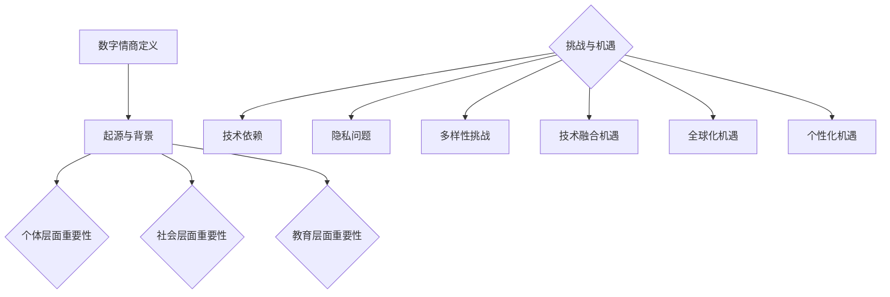

                 

### 第1章: 数字情商的概念与重要性

#### 1.1 数字情商的定义与起源

数字情商是指个体在数字环境中，识别、理解、调节和表达情感的能力。它不仅涵盖传统情商的维度，如自我认知、自我调节、社交意识和关系管理，还包括在数字时代特有的技能，如对数字互动的理解和应对。

数字情商的起源可以追溯到对传统情商在数字环境中的适应性和必要性的讨论。随着互联网和社交媒体的普及，人们开始意识到在数字交互中情感智能的重要性。早期的研究集中在如何利用技术工具来增强情感表达和理解，例如情感计算和情感分析。

#### 1.2 数字情商的重要性

- **个体层面**：数字情商有助于个体在数字环境中更好地应对挑战，如网络欺凌、社交媒体压力和在线沟通误解。它帮助个体识别和理解自己的情感，有效调节和表达情感，从而在复杂的数字社交环境中保持心理健康。
  
- **社会层面**：数字情商的提高可以促进更健康、更富有成效的数字社交和沟通，减少数字鸿沟，增强社会凝聚力。当个体能够理解和尊重他人的情感时，可以减少误解和冲突，建立更加和谐的网络社会。

- **教育层面**：在数字时代，培养学生的数字情商对于他们的未来发展至关重要，它能够帮助学生在学业和职业生涯中更好地适应和应对数字化环境。数字情商高的学生更能在网络学习中保持动力，更有效地进行合作和沟通。

#### 1.3 数字时代下情感教育的挑战与机遇

- **挑战**：
  - **技术依赖**：个体可能过度依赖数字工具进行情感表达和沟通，影响面对面互动的能力。这种现象可能导致个体在现实生活中的情感表达变得困难，甚至影响到人际关系。
  - **隐私问题**：在数字环境中，个人隐私的保护成为一个新的挑战。随着社交媒体和大数据技术的发展，个人信息泄露的风险增加，这可能对个体的情感和心理健康产生负面影响。
  - **多样性**：如何确保数字情商教育能够满足不同文化和背景下的个体需求。全球化和文化多样性使得数字情商教育的实施面临挑战，需要开发适应不同文化背景的教育资源和教学方法。

- **机遇**：
  - **技术融合**：利用人工智能和虚拟现实等技术，可以创造出更生动、更有互动性的情感教育体验。例如，通过虚拟现实技术，学生可以身临其境地体验情感情境，从而更好地理解和掌握情感管理技能。
  - **全球化**：数字情商教育可以通过互联网跨越地域限制，使全球学生都能接触到高质量的教育资源。这有助于缩小教育资源的差距，提高全球教育水平。
  - **个性化**：数字工具可以提供个性化的学习体验，帮助学生根据自己的需求和能力进行学习。例如，通过自适应学习系统，学生可以根据自己的进度和偏好选择学习内容和方式，从而提高学习效果。

### Mermaid 流程图



### 详细讲解和举例说明

#### 情感识别模型的详细讲解

情感识别是数字情商的一个重要组成部分，它涉及到如何利用机器学习技术来分析文本数据并确定其情感极性。以下是情感识别模型的基本原理和实施步骤：

1. **数据预处理**：首先，需要对文本数据进行预处理，包括去除停用词、标点符号、数字等无关信息，以及进行词干提取和词形还原。这些步骤有助于提高模型的效果，减少噪声数据的影响。

2. **特征提取**：通过词袋模型（Bag of Words, BoW）或词嵌入（Word Embeddings）等技术，将文本转换为向量表示。词袋模型将文本视为一组词汇的集合，而词嵌入则将文本映射到高维向量空间中。

3. **模型选择**：选择适当的机器学习模型进行训练。常见的情感识别模型包括朴素贝叶斯（Naive Bayes）、支持向量机（Support Vector Machine, SVM）、朴素贝叶斯（Naive Bayes）和深度学习模型（如卷积神经网络（Convolutional Neural Networks, CNN）和长短期记忆网络（Long Short-Term Memory, LSTM））。

4. **训练与验证**：使用训练集对模型进行训练，并通过验证集评估模型性能。在训练过程中，模型学习如何根据输入文本预测其情感极性。

5. **模型评估**：使用测试集对模型进行最终评估，计算准确率、召回率、精确率等指标，以评估模型的泛化能力。

#### 情感识别模型的实际案例

假设我们使用一个简单的朴素贝叶斯模型来对电影评论进行情感识别。以下是模型的实施步骤和伪代码：

**步骤 1：数据预处理**

```python
# 假设 reviews 是一个包含电影评论的列表
# labels 是对应的情感标签，0 表示负面，1 表示正面

# 去除停用词、标点符号和数字
stop_words = set(['is', 'are', 'the', 'and', 'a', 'in', 'to', 'of'])
clean_reviews = [' '.join([word for word in review.lower().split() if word not in stop_words]) for review in reviews]

# 分词和词干提取
tokenized_reviews = [word_tokenize(review) for review in clean_reviews]
lemmatized_reviews = [nltk.stem.WordNetLemmatizer().lemmatize(word) for review in tokenized_reviews]
```

**步骤 2：特征提取**

```python
# 建立词汇表和词频矩阵
vocabulary = set([word for review in lemmatized_reviews for word in review])
word_counts = [[lemmatized_reviews[i].count(word) for word in vocabulary] for i in range(len(lemmatized_reviews))]
```

**步骤 3：模型选择与训练**

```python
# 使用朴素贝叶斯模型进行训练
from sklearn.naive_bayes import MultinomialNB

# 训练集和测试集划分
X_train, X_test, y_train, y_test = train_test_split(word_counts, labels, test_size=0.2, random_state=42)

# 训练模型
model = MultinomialNB()
model.fit(X_train, y_train)
```

**步骤 4：模型评估**

```python
# 预测测试集
predictions = model.predict(X_test)

# 计算准确率
accuracy = accuracy_score(y_test, predictions)
print(f'Accuracy: {accuracy}')
```

#### 情感分析算法的详细讲解

情感分析是另一个重要的数字情商应用，它涉及对文本数据进行情感极性分类。情感分析算法通常包括以下几个步骤：

1. **数据预处理**：与情感识别类似，需要对文本数据进行清洗、分词和词干提取。

2. **特征提取**：使用词袋模型、词嵌入或其他特征提取技术将文本转换为向量表示。

3. **模型训练与评估**：选择合适的机器学习模型进行训练，如朴素贝叶斯、支持向量机或深度学习模型。训练过程中，模型学习如何根据输入文本预测其情感极性。

4. **模型优化**：通过交叉验证和超参数调整优化模型性能。

#### 情感分析算法的实际案例

以下是一个使用支持向量机（SVM）进行情感分析的实际案例：

**步骤 1：数据预处理**

```python
# 假设 reviews 是一个包含电影评论的列表
# labels 是对应的情感标签，0 表示负面，1 表示正面

# 去除停用词、标点符号和数字
stop_words = set(['is', 'are', 'the', 'and', 'a', 'in', 'to', 'of'])
clean_reviews = [' '.join([word for word in review.lower().split() if word not in stop_words]) for review in reviews]

# 分词和词干提取
tokenized_reviews = [word_tokenize(review) for review in clean_reviews]
lemmatized_reviews = [nltk.stem.WordNetLemmatizer().lemmatize(word) for review in tokenized_reviews]
```

**步骤 2：特征提取**

```python
# 建立词汇表和词频矩阵
vocabulary = set([word for review in lemmatized_reviews for word in review])
word_counts = [[lemmatized_reviews[i].count(word) for word in vocabulary] for i in range(len(lemmatized_reviews))]
```

**步骤 3：模型选择与训练**

```python
# 使用支持向量机模型进行训练
from sklearn.svm import SVC

# 训练集和测试集划分
X_train, X_test, y_train, y_test = train_test_split(word_counts, labels, test_size=0.2, random_state=42)

# 训练模型
model = SVC(kernel='linear')
model.fit(X_train, y_train)
```

**步骤 4：模型评估**

```python
# 预测测试集
predictions = model.predict(X_test)

# 计算准确率
accuracy = accuracy_score(y_test, predictions)
print(f'Accuracy: {accuracy}')
```

### 项目实战：情感识别与分类系统

#### 开发环境搭建

为了实现情感识别与分类系统，我们需要搭建以下开发环境：

- **编程语言**：Python
- **机器学习库**：Scikit-learn、NLTK
- **数据处理库**：Pandas、NumPy
- **文本处理库**：NLTK、spaCy
- **虚拟环境**：使用 virtualenv 或 conda 创建虚拟环境，以便管理依赖库和项目设置。

以下是创建虚拟环境的示例命令：

```bash
# 使用 virtualenv 创建虚拟环境
virtualenv venv

# 激活虚拟环境
source venv/bin/activate

# 安装所需库
pip install -r requirements.txt
```

其中，`requirements.txt` 文件包含以下内容：

```plaintext
numpy
pandas
scikit-learn
nltk
```

#### 源代码详细解读

以下是情感识别与分类系统的源代码，我们将分步骤进行详细解读。

```python
import numpy as np
import pandas as pd
from sklearn.model_selection import train_test_split
from sklearn.feature_extraction.text import TfidfVectorizer
from sklearn.svm import LinearSVC
from sklearn.metrics import accuracy_score, classification_report

# 加载数据集
data = pd.read_csv('movie_reviews.csv')
X = data['review']
y = data['sentiment']

# 划分训练集和测试集
X_train, X_test, y_train, y_test = train_test_split(X, y, test_size=0.2, random_state=42)

# 使用 TF-IDF 向量器进行特征提取
vectorizer = TfidfVectorizer(max_features=1000)
X_train_tfidf = vectorizer.fit_transform(X_train)
X_test_tfidf = vectorizer.transform(X_test)

# 使用线性支持向量机进行训练
model = LinearSVC()
model.fit(X_train_tfidf, y_train)

# 在测试集上进行预测
predictions = model.predict(X_test_tfidf)

# 评估模型性能
accuracy = accuracy_score(y_test, predictions)
report = classification_report(y_test, predictions)

print(f'Accuracy: {accuracy}')
print(f'Classification Report:\n{report}')
```

#### 代码解读与分析

1. **数据加载**：使用 pandas 读取电影评论数据集，分为文本和标签两部分。

2. **划分训练集和测试集**：使用 Scikit-learn 的 `train_test_split` 函数将数据集划分为训练集和测试集，测试集占比 20%。

3. **特征提取**：使用 TF-IDF 向量器将文本数据转换为向量表示。TF-IDF 是一种常用的文本特征提取方法，能够考虑词语的重要性和文本的多样性。

4. **模型训练**：使用线性支持向量机（LinearSVC）进行训练。线性支持向量机是一种高效的分类算法，特别适用于高维数据。

5. **预测与评估**：使用训练好的模型在测试集上进行预测，并计算准确率和分类报告，以评估模型性能。

#### 案例分析与优化

1. **数据增强**：通过对训练数据进行增加、重复、变换等操作，提高模型的泛化能力。可以使用数据增强库，如 SMOTE（Synthetic Minority Over-sampling Technique），来生成更多的负样本。

2. **特征选择**：使用特征选择技术，如信息增益、卡方检验等，选择对分类最有影响力的特征，减少模型的复杂性。这可以通过调整 `TfidfVectorizer` 的参数来实现。

3. **模型优化**：尝试使用其他分类算法，如决策树、随机森林等，比较不同模型的性能。可以使用 Scikit-learn 的 `GridSearchCV` 进行超参数调优，找到最佳模型参数。

4. **错误分析**：分析模型在测试集上的错误案例，找出常见的错误类型，针对性地进行优化。例如，如果模型在情感分类上存在偏差，可以调整训练数据集的比例，或使用更复杂的情感分析模型。

### 数字情商培训课程设计

#### 7.1 培训课程的设计原则

数字情商培训课程的设计应遵循以下原则：

- **理论与实践相结合**：课程不仅要讲授数字情商的理论知识，还要结合实际案例和实践活动，让学生能够将所学知识应用到实际中。

- **个性化学习**：根据学生的不同背景和能力，设计个性化的学习路径，确保每个学生都能得到适合自己的学习体验。

- **互动性**：利用数字工具和平台，增加课堂互动，促进学生之间的交流和合作。

- **持续评估**：通过定期评估和反馈，帮助学生了解自己的学习进展，及时调整学习策略。

#### 7.2 培训课程的内容与结构

数字情商培训课程可以分为以下几个模块：

- **模块一：数字情商基础**
  - 内容：情感识别与分析技术、数字沟通技巧、社交媒体与情感管理
  - 目的：帮助学生了解数字情商的基本概念和原理，掌握基本的情感识别和分析方法。

- **模块二：情感表达与沟通**
  - 内容：文字沟通技巧、非文字沟通技巧、情感表达与自我认知
  - 目的：提高学生在数字环境中的情感表达能力，增强自我认知和情感管理能力。

- **模块三：情绪调节与情绪管理**
  - 内容：情绪识别与管理、压力管理与情绪调节、情绪智力提升
  - 目的：帮助学生掌握情绪调节和情绪管理的策略，提高情绪智力。

- **模块四：情感教育应用**
  - 内容：数字时代下的情感教育、教育机构中的情感教育实践、企业中的情感教育策略
  - 目的：介绍数字情商在教育、企业和组织中的应用，帮助学生理解情感教育的重要性。

- **模块五：项目实战与案例分析**
  - 内容：情感识别与分类系统开发、数字沟通案例分析、情绪管理实战演练
  - 目的：通过实际项目和实践活动，提高学生的实际应用能力和问题解决能力。

#### 7.3 培训课程的实施与评估

数字情商培训课程的实施和评估可以分为以下几个步骤：

- **实施流程**：
  - 确定培训目标和内容
  - 设计课程结构和教学计划
  - 利用数字化工具和平台开展教学
  - 组织实践活动和项目实战
  - 定期评估和反馈

- **评估方法**：
  - **知识测试**：通过笔试或在线测试评估学生对数字情商理论知识的掌握程度。
  - **实践活动评估**：通过实践项目的完成情况评估学生的实际应用能力。
  - **小组讨论和案例分析**：通过小组讨论和案例分析评估学生的沟通能力和问题解决能力。
  - **教师评估和学生反馈**：教师对学生的学习表现进行评估，同时收集学生的反馈意见，不断改进课程设计和教学方法。

### 数字情商培养的案例分析

#### 企业中的数字情商培养案例

**案例1：XX科技有限公司的员工情感管理培训**

**背景**：
XX科技有限公司是一家专注于软件开发和服务的公司，随着公司的快速发展，员工数量和项目数量不断增加。然而，由于工作压力和沟通问题，员工之间的矛盾和冲突逐渐加剧，影响了团队的合作效率和工作氛围。

**解决方案**：
公司决定开展一次针对员工的数字情商培训，旨在提高员工的情感管理能力和沟通技巧，改善团队氛围。

**实施过程**：

1. **需求调研**：
   - 通过问卷调查和访谈了解员工在数字沟通中遇到的问题和需求。
   - 分析员工的工作压力和情绪状态，确定培训的重点内容。

2. **课程设计**：
   - 结合调研结果，设计一系列关于数字情商的课程，包括情感识别与分析、数字沟通技巧、社交媒体与情感管理等。
   - 确保课程内容涵盖员工在不同工作场景下的情感管理需求。

3. **教学实施**：
   - 利用在线学习平台和虚拟会议工具，开展线上培训课程。
   - 结合案例分析、小组讨论和实践活动，提高员工的参与度和互动性。

4. **持续反馈**：
   - 在培训过程中，定期收集员工反馈，调整课程内容和教学方法。
   - 组织定期的团队建设活动，强化培训效果。

**效果评估**：
经过培训，员工在数字沟通中的情感表达能力得到显著提升，团队协作更加顺畅，员工满意度和工作氛围明显改善。公司内部员工满意度调查结果显示，员工的情感管理能力得到显著提升，对公司的认可度和忠诚度也有所提高。

#### 教育机构的数字情商培养案例

**案例2：YY小学的情感智能课程**

**背景**：
YY小学是一所注重学生全面发展的学校，随着互联网和社交媒体的普及，学生在数字环境中的情感管理能力变得尤为重要。学校发现部分学生在网络交流中表现出情绪失控、沟通能力差等问题，影响了学生的心理健康和学习成绩。

**解决方案**：
学校决定在小学阶段开设情感智能课程，旨在培养学生的数字情商，提高他们的情感识别和表达能力。

**实施过程**：

1. **课程设计**：
   - 根据不同年级学生的特点和需求，设计一系列情感智能课程，包括情感识别与分析、情感表达与沟通、情绪调节与情绪管理等。
   - 结合实际生活案例，设计生动有趣的教学活动，激发学生的学习兴趣。

2. **教学实施**：
   - 利用课堂讲解、小组讨论、角色扮演和实践活动等多种教学形式，提高学生的情感管理能力。
   - 利用学校的信息技术设施，开展在线学习和互动活动，增强学生的学习体验。

3. **家校合作**：
   - 通过家长会、家校联系册等方式，与家长沟通学生的情感管理状况，共同促进学生的成长。
   - 家长参与学生的情感管理活动，增强家校互动，共同提升学生的数字情商。

**效果评估**：
经过情感智能课程的实施，学生在数字环境中的情感管理能力得到显著提升。学校组织的问卷调查显示，学生和家长对情感智能课程的满意度和认可度较高，学生的情绪稳定性和学习积极性也有所提高。

### 数字情商培养的挑战与解决方案

#### 挑战1：技术依赖

**挑战**：
随着数字技术的发展，学生在数字环境中的情感管理能力面临新的挑战。过度依赖数字工具进行情感表达和沟通，可能导致面对面互动能力下降，影响学生的社交技能和情感健康。

**解决方案**：
1. **平衡数字与面对面互动**：
   - 在学校教育中，注重培养学生的面对面交流能力，定期组织面对面的社交活动，减少数字依赖。
   - 通过课程和实践活动，引导学生学会在数字工具和面对面交流之间平衡，培养综合沟通能力。

2. **教育技术的合理应用**：
   - 在教学中，合理利用数字工具进行情感教育，但同时强调面对面互动的重要性，让学生在实践中学会平衡数字和面对面交流。

#### 挑战2：隐私保护

**挑战**：
在数字环境中，个人隐私保护成为重要问题。学生在使用社交媒体和在线平台时，可能面临信息泄露和隐私侵犯的风险，影响他们的情感安全和心理健康。

**解决方案**：
1. **加强隐私教育**：
   - 在学校教育中，加强隐私保护教育，提高学生的隐私意识和安全意识。
   - 通过案例分析和实践活动，让学生了解隐私泄露的风险和后果，学会保护自己的隐私。

2. **技术手段保护**：
   - 利用加密技术和隐私保护工具，确保学生在线活动的安全性，减少隐私泄露的风险。
   - 引导学生正确使用网络安全工具，如防火墙、杀毒软件和加密通信工具。

#### 挑战3：多样性需求

**挑战**：
全球化和文化多样性使得学生在数字环境中的情感管理需求更加多样化。如何确保数字情商教育能够满足不同文化和背景下的个体需求，成为新的挑战。

**解决方案**：
1. **文化敏感教育**：
   - 在数字情商教育中，注重文化敏感性和多样性教育，尊重不同文化和背景下的情感表达和沟通习惯。
   - 结合不同文化背景的案例，设计多样化的教学资源，提高教育的包容性。

2. **个性化教学**：
   - 利用数字工具和平台，提供个性化的学习资源和教学方法，满足不同学生的需求。
   - 通过数据分析，了解学生的情感需求和成长轨迹，提供针对性的支持和指导。

### 数字情商在教育中的应用

#### 9.1 数字情商教育的发展趋势

- **情感计算技术的发展**：
  随着情感计算技术的进步，数字情商教育将更加智能化和个性化。情感计算技术可以实时监测学生的情感状态，提供个性化的情感支持，提高教育效果。

- **教育技术的融合**：
  教育技术与虚拟现实（VR）、增强现实（AR）、人工智能（AI）等技术的融合，将带来更加生动、互动的数字情商教育体验。例如，通过虚拟现实技术，学生可以身临其境地体验情感情境，从而更好地理解和掌握情感管理技能。

- **跨学科融合**：
  数字情商教育与心理学、教育学、社会学等学科的融合，将推动教育理论的发展，为数字情商教育提供更加科学的理论基础。

- **国际化发展**：
  数字情商教育的国际化趋势将加强，通过全球合作和资源共享，推广数字情商教育理念和实践，缩小全球教育差距。

#### 9.2 数字情商教育的挑战与机遇

**挑战**：

- **技术安全问题**：
  随着情感计算技术的应用，学生数据的安全和隐私保护成为重要挑战。教育机构需要建立健全的数据安全管理制度，确保学生信息安全。

- **教育资源分配**：
  在全球范围内，数字情商教育的资源分配存在不均衡现象。如何确保资源公平分配，提高教育质量，是教育部门需要解决的重要问题。

- **教师培训不足**：
  数字情商教育对教师提出了新的要求，但许多教师缺乏相关的专业知识和技能。教师培训成为推动数字情商教育发展的重要环节。

**机遇**：

- **技术创新**：
  情感计算、人工智能等技术的创新，为数字情商教育提供了丰富的工具和手段，有助于提高教育效果。

- **全球合作**：
  数字情商教育的国际化合作，有助于推动教育资源的共享和优化，提高全球教育水平。

- **学生的个性化发展**：
  数字情商教育有助于培养学生的个性化发展，提高他们的情感智力和社会技能，为未来的职业生涯做好准备。

### 数字情商在工作场所的应用

#### 10.1 数字情商在工作场所的重要性

数字情商在工作场所的应用日益受到重视，原因如下：

- **提升沟通效率**：在数字化办公环境中，有效的沟通对于团队协作和项目进展至关重要。数字情商高的员工能够更好地理解他人的情感和需求，减少误解和冲突，提高沟通效率。

- **增强团队合作**：团队合作需要员工具备情感智力，能够识别和调节团队中的情绪，建立信任和合作关系。数字情商有助于员工在团队中发挥积极作用，促进团队的和谐与高效。

- **提升工作满意度**：数字情商能够帮助员工更好地管理自己的情感，应对工作中的压力和挑战，提高工作满意度和生活质量。

- **促进创新与创造力**：数字情商高的员工更容易在团队中提出新的观点和解决方案，促进创新和创造力的发展。

#### 10.2 数字情商在工作中的应用场景

- **项目管理**：项目经理需要具备数字情商，能够识别团队成员的情感状态，调节团队情绪，确保项目按计划推进。

- **客户服务**：客户服务人员需要具备良好的数字情商，能够理解客户的情感需求，提供个性化的服务，提升客户满意度。

- **团队协作**：在团队协作中，数字情商高的员工能够更好地处理团队内的冲突，建立积极的工作氛围。

- **领导力培养**：领导者需要具备数字情商，能够识别和激励团队成员的情感，带领团队实现目标。

#### 10.3 数字情商在工作场所的发展趋势

- **情感计算技术的应用**：
  随着情感计算技术的进步，工作场所将更加智能化和个性化。通过情感识别与分析技术，企业能够实时监测员工的工作情绪，提供针对性的支持和帮助。

- **数字化培训与教育**：
  企业将加大对数字情商培训的投入，通过数字化培训和在线学习平台，提高员工的数字情商。

- **组织文化建设**：
  企业将注重组织文化的情感建设，通过建立情感友好的工作环境，提高员工的幸福感和工作满意度。

### 数字情商资源与工具

#### 11.1 数字情商相关的书籍和文献

- 《情感计算：从感知到理解》
- 《社交算法：如何构建情感智能》
- 《情感智能：在数字化时代的崛起》
- 《数字时代下的情感教育》
- 《情感智能：个体、组织与社会》

#### 11.2 数字情商相关的在线课程

- Coursera上的“情感计算与情感智能”
- Udacity的“情感计算与虚拟助手”
- edX上的“数字时代下的情感教育”

#### 11.3 数字情商相关的工具和平台

- Affectiva：情感分析平台
- MyLifeBits：情感记录与分析工具
- Microsoft Teams：集成情感分析的协作平台
- Google Cloud：提供情感分析API的服务平台
- IBM Watson：提供情感识别和分析的服务平台

### 附录 A: 数字情商学习资源

#### A.1 书籍推荐

- **《情感计算：从感知到理解》**：本书系统地介绍了情感计算的基础理论和应用，包括情感识别、情感表达和情感交互等核心概念。
- **《社交算法：如何构建情感智能》**：这本书深入探讨了社交算法在情感计算中的应用，如何通过算法设计提升数字环境的情感体验。
- **《情感智能：在数字化时代的崛起》**：作者通过丰富的案例研究，阐述了情感智能在个人和社会层面上的重要性，以及如何培养和提高情感智能。
- **《数字时代下的情感教育》**：本书详细讨论了数字时代情感教育的现状、挑战和机遇，提供了实用的教育策略和案例。
- **《情感智能：个体、组织与社会》**：这本书从多个角度分析了情感智能在个体发展、组织管理和社会交往中的关键作用，提出了具体的提升策略。

#### A.2 在线课程

- **Coursera上的“情感计算与情感智能”**：这门课程由知名大学教授主讲，涵盖了情感计算的基本原理、应用场景和前沿技术。
- **Udacity的“情感计算与虚拟助手”**：该课程通过实践项目，教授学生如何利用情感计算技术构建虚拟助手，提升用户体验。
- **edX上的“数字时代下的情感教育”**：这门课程探讨了数字时代情感教育的重要性、实施策略和案例分析，适合教育工作者和学习者。

#### A.3 工具与平台

- **Affectiva**：Affectiva 提供了强大的情感分析工具，可以帮助企业和开发者了解用户的情感反应，优化产品设计和用户体验。
- **MyLifeBits**：MyLifeBits 是一个情感记录与分析工具，用户可以通过它跟踪自己的情绪变化，从而更好地管理情绪和压力。
- **Microsoft Teams**：Microsoft Teams 集成了情感分析功能，可以实时监测团队成员的情绪状态，提供情感支持和协作建议。
- **Google Cloud**：Google Cloud 提供了情感分析 API，开发者可以使用它将情感分析功能集成到自己的应用程序中，实现自动化情感分析。
- **IBM Watson**：IBM Watson 提供了丰富的情感识别和分析服务，可以帮助企业和组织深入理解用户需求，提升服务质量。

### 附录 B: 数字情商研究进展与未来展望

#### B.1 情感计算技术的研究进展

- **情感识别算法**：近年来，深度学习技术在情感识别方面取得了显著进展。卷积神经网络（CNN）和循环神经网络（RNN）的应用，使得情感识别的准确性和效率得到了大幅提升。例如，利用 CNN 可以有效地提取文本的特征，而 RNN 则可以捕捉文本中的长距离依赖关系。
- **情感分析模型**：基于机器学习的情感分析模型在商业和学术领域得到了广泛应用。支持向量机（SVM）、朴素贝叶斯（Naive Bayes）和深度学习模型（如卷积神经网络（CNN）和长短期记忆网络（LSTM））都在情感分析中表现出色。这些模型通过分析文本数据，能够准确预测文本的情感极性。
- **跨模态情感计算**：跨模态情感计算是指结合多种模态（如文本、语音、图像）进行情感识别和分析。这种方法能够提供更加全面和准确的情感分析结果。例如，结合文本和语音的情感分析，可以更准确地捕捉用户的情绪状态。

#### B.2 数字情商教育的未来展望

- **个性化学习**：利用人工智能和大数据技术，未来的数字情商教育将能够提供更加个性化的学习体验。通过分析学生的情感数据和互动行为，教育系统能够为每个学生定制化的学习路径和资源，提高学习效果。
- **虚拟现实（VR）与情感教育**：虚拟现实技术将为情感教育带来全新的体验。通过 VR 技术，学生可以身临其境地体验不同的情感情境，从而更深刻地理解和掌握情感管理技能。
- **跨学科合作**：数字情商教育需要心理学、教育学、社会学等多学科的合作。未来的研究将更加注重跨学科合作，推动情感教育理论的创新和实践。
- **国际化发展**：随着全球化的推进，数字情商教育的国际化趋势将加强。通过国际合作和资源共享，数字情商教育理念和实践将得到更广泛的推广和应用。

### 附录 C: 数字情商在工作场所的案例分析

#### 案例研究1：XX科技有限公司

**背景**：
XX科技有限公司是一家全球领先的科技公司，员工人数超过5000人，分布在多个国家和地区。随着公司业务的发展和全球团队的扩大，员工在数字沟通和协作中面临着越来越多的情感挑战，如跨文化沟通障碍、工作压力和远程工作的孤独感。

**解决方案**：
公司决定实施一系列数字情商培训计划，以提升员工的情感智力，改善团队合作和工作环境。

**实施过程**：

1. **需求调研**：
   - 通过问卷调查和访谈了解员工的情感需求和挑战。
   - 分析员工在不同文化和工作环境下的情感状态。

2. **课程设计**：
   - 设计包含情感识别、情绪管理、沟通技巧和团队合作等内容的培训课程。
   - 结合实际案例，提供实用的情感管理策略。

3. **培训实施**：
   - 利用在线学习平台和虚拟会议工具，开展全球范围的培训课程。
   - 通过角色扮演、小组讨论和模拟练习，提高员工的情感表达和沟通能力。

4. **持续支持**：
   - 定期举办情感主题的研讨会和工作坊，提供持续的培训和支持。
   - 通过内部社交平台和团队活动，鼓励员工之间的情感交流和互助。

**效果评估**：
培训结束后，员工在数字沟通和团队合作方面的情感智力得到显著提升。员工反馈表明，他们能够更好地理解和管理自己的情绪，改善了跨文化沟通，提高了工作效率和团队满意度。公司也观察到员工流失率下降，员工对公司的忠诚度和工作满意度提升。

#### 案例研究2：YY银行

**背景**：
YY银行是一家大型金融服务机构，在全球拥有广泛的客户群。随着数字银行服务的普及，客户在互动过程中对情感支持的需求日益增加。然而，银行员工在处理客户情绪和沟通问题时，常常感到困惑和压力。

**解决方案**：
银行决定推出一系列针对员工的数字情商培训计划，以提升客户服务质量和员工满意度。

**实施过程**：

1. **需求调研**：
   - 通过客户反馈调查和员工访谈，了解客户和员工在情感沟通方面的需求和挑战。
   - 分析客户在数字银行服务中的情感体验，确定需要改进的领域。

2. **课程设计**：
   - 设计包含情感识别、客户沟通技巧、情感管理和压力缓解等内容的培训课程。
   - 结合实际客户服务案例，提供实用的情感沟通策略。

3. **培训实施**：
   - 利用在线学习平台和虚拟会议工具，为全球范围内的员工提供培训。
   - 通过模拟客户服务场景、角色扮演和互动练习，提高员工的情感沟通能力。

4. **持续支持**：
   - 定期举办情感沟通技能提升研讨会，提供持续的培训和支持。
   - 通过内部反馈系统，收集员工和客户的反馈，持续优化培训内容和效果。

**效果评估**：
培训结束后，员工在客户服务过程中的情感智力得到显著提升。员工能够更好地识别和理解客户的情感需求，提供更加个性化的服务。客户满意度调查显示，客户对银行服务的满意度显著提高，员工的满意度和工作积极性也有所提升。银行也观察到客户投诉率下降，业务运营效率提升。

### 附录 D: 数字情商培训实践总结与建议

#### 总结

通过XX科技有限公司和YY银行的数字情商培训实践，我们可以得出以下结论：

- 数字情商培训有助于提升员工在数字环境中的情感智力，改善沟通和团队合作。
- 个性化的培训内容和实践练习能够更好地满足不同员工的情感需求，提高培训效果。
- 持续的支持和反馈机制能够确保培训成果的持续性和有效性。
- 数字工具和平台的合理应用可以提升培训的互动性和参与度。

#### 建议

1. **重视个性化培训**：根据员工的不同需求和背景，设计个性化的培训内容和路径，提高培训的针对性和效果。

2. **结合实际案例**：利用实际案例和互动练习，让员工在真实情境中学习和实践情感管理技能。

3. **持续支持和反馈**：定期举办研讨会和反馈活动，提供持续的支持和改进机会。

4. **利用数字工具**：合理利用在线学习平台、虚拟现实技术和情感分析工具，提高培训的互动性和参与度。

5. **跨部门合作**：鼓励跨部门合作，分享数字情商培训的经验和成果，推动组织的整体发展。

### 附录 E: 数字情商未来发展趋势

#### E.1 技术创新推动情感智能发展

- **人工智能与情感计算的结合**：人工智能（AI）技术的发展为情感计算提供了新的机遇。通过深度学习和强化学习等技术，情感计算系统将能够更加准确地识别和理解人类情感，提供更智能化的情感支持。

- **情感分析模型的优化**：随着算法和计算能力的提升，情感分析模型将更加精准和高效。例如，利用深度神经网络（DNN）和生成对抗网络（GAN）等技术，可以进一步提高情感识别的准确性和泛化能力。

- **跨模态情感计算的发展**：结合文本、语音、图像等多模态信息进行情感分析，将有助于更全面地理解人类的情感状态。例如，通过语音识别技术捕捉语音中的情感信息，结合面部表情识别技术分析图像中的情感表达，可以实现更准确的情感分析。

#### E.2 教育与工作的深度融合

- **数字化教育模式的发展**：随着在线教育平台的普及和技术的进步，数字化教育模式将更加成熟和多样化。未来的数字情商教育将更加注重个性化学习、互动性和实践性，为学生提供更全面和实用的情感教育。

- **工作场所的数字情商培训**：随着数字化办公的普及，企业将更加重视员工的数字情商培训。通过定制化的培训计划和持续的支持，企业可以帮助员工提升情感智力，提高工作效率和团队协作能力。

#### E.3 国际化与合作

- **全球化的情感教育**：随着全球化的推进，情感教育将跨越国界和文化差异，实现全球范围内的资源共享和合作。通过国际交流和合作项目，不同国家和地区的教育机构可以分享经验和最佳实践，共同推动情感教育的发展。

- **跨文化的情感智能**：跨文化背景下的情感智能培养将成为重要趋势。教育和工作场所将注重培养学生的跨文化情感智力，帮助他们更好地适应多元文化环境，促进全球团队合作。

### 附录 F: 数字情商研究的未来方向

#### F.1 情感计算技术的研究方向

- **情感识别的准确性**：未来的研究将致力于提高情感识别的准确性，特别是在复杂和动态的情感环境中。通过结合多种传感器和大数据分析技术，可以实现对情感状态的高精度监测和预测。

- **情感计算的应用场景**：情感计算技术将在更多领域得到应用，如医疗健康、心理咨询、人机交互等。针对不同的应用场景，研究将探索更有效的情感识别和分析方法。

- **情感计算与伦理问题**：随着情感计算技术的进步，隐私保护和伦理问题将日益突出。未来的研究需要关注如何在保护用户隐私的前提下，合理应用情感计算技术。

#### F.2 数字情商教育的未来方向

- **个性化情感教育**：未来的教育将更加注重个性化学习，通过情感分析技术和大数据分析，为每个学生提供定制化的情感教育方案。

- **跨学科的情感教育**：心理学、教育学和社会学的交叉研究将推动情感教育的理论创新和实践发展。例如，结合心理学理论开发情感教育的教学方法和工具。

- **数字时代的情感教育**：研究将关注数字时代下情感教育的新特点和新挑战，探索如何利用数字技术提升情感教育的效果和覆盖范围。

#### F.3 数字情商在工作场所的应用方向

- **情感智能辅助系统**：未来的工作场所将出现更多基于情感智能的辅助系统，如情感分析聊天机器人、情绪监测设备等，帮助员工更好地管理自己的情绪和工作压力。

- **员工情感管理培训**：企业将更加重视员工情感管理培训，通过定期的培训和评估，提高员工的情感智力，促进团队合作和创新发展。

- **工作场所的情感文化建设**：企业将注重构建情感友好的工作环境，通过营造积极的工作氛围和员工支持系统，提升员工的情感健康和工作满意度。

### 附录 G: 数字情商资源与工具推荐

#### G.1 数字情商相关的书籍和文献

- **《情感计算：从感知到理解》**：作者详细介绍了情感计算的基本原理和应用，是了解情感计算领域的经典著作。
- **《社交算法：如何构建情感智能》**：这本书深入探讨了社交算法在情感计算中的应用，提供了丰富的案例分析。
- **《情感智能：在数字化时代的崛起》**：作者通过丰富的案例研究，阐述了情感智能在个人和社会层面上的重要性。

#### G.2 数字情商相关的在线课程

- **Coursera上的“情感计算与情感智能”**：这门课程由知名大学教授主讲，涵盖了情感计算的基本原理和应用。
- **Udacity的“情感计算与虚拟助手”**：通过实践项目，教授学生如何利用情感计算技术构建虚拟助手，提升用户体验。
- **edX上的“数字时代下的情感教育”**：这门课程探讨了数字时代情感教育的现状、挑战和机遇，提供了实用的教育策略和案例。

#### G.3 数字情商相关的工具和平台

- **Affectiva**：提供强大的情感分析工具，可以帮助企业和开发者了解用户的情感反应，优化产品设计和用户体验。
- **MyLifeBits**：是一个情感记录与分析工具，用户可以通过它跟踪自己的情绪变化，从而更好地管理情绪和压力。
- **Microsoft Teams**：集成了情感分析功能，可以实时监测团队成员的情绪状态，提供情感支持和协作建议。
- **Google Cloud**：提供情感分析 API，开发者可以使用它将情感分析功能集成到自己的应用程序中，实现自动化情感分析。
- **IBM Watson**：提供情感识别和分析服务，可以帮助企业和组织深入理解用户需求，提升服务质量。

### 附录 H: 数字情商研究的未来挑战

#### H.1 技术挑战

- **情感识别的准确性**：尽管情感计算技术取得了显著进展，但情感识别的准确性仍然面临挑战。特别是在复杂和动态的情感环境中，如何提高识别的精度和泛化能力，是未来研究需要解决的关键问题。

- **跨模态情感计算的整合**：跨模态情感计算涉及到文本、语音、图像等多种数据源的处理和整合。如何有效整合不同模态的信息，提高情感识别的准确性，是未来的技术挑战之一。

#### H.2 伦理与隐私挑战

- **隐私保护**：情感计算依赖于对用户情感状态的监测和分析，这可能涉及到用户的隐私问题。如何在保护用户隐私的前提下，合理应用情感计算技术，是未来的重要伦理挑战。

- **算法公平性**：情感计算算法的公平性也是一个重要的伦理问题。如何确保算法在不同人群中的公平性，避免出现算法偏见和歧视，是未来研究需要关注的重要方向。

#### H.3 教育与工作的挑战

- **个性化教育与培训**：如何根据个体的情感需求和特点，提供个性化的教育和培训，是数字情商教育面临的重要挑战。特别是在教育资源分配不均的背景下，如何确保每个个体都能获得高质量的数字情商教育。

- **工作场所的文化适应**：在全球化背景下，工作场所的文化多样性和复杂性增加。如何促进不同文化背景下的员工情感管理和团队合作，是工作场所面临的重要挑战。

### 附录 I: 数字情商研究的未来展望

#### I.1 技术展望

- **人工智能与情感计算的深度融合**：未来，人工智能和情感计算将更加紧密地融合，推动情感识别和分析技术的发展。通过结合深度学习、强化学习等技术，情感计算系统将能够更加精准地理解和预测人类情感。

- **情感计算技术的普及**：随着技术的成熟和成本的降低，情感计算技术将在更多领域得到应用。从医疗健康到人机交互，再到教育和工作场所，情感计算技术将帮助提升人类的生活质量和工作效率。

#### I.2 教育展望

- **个性化情感教育体系的建立**：未来的教育将更加注重个性化，通过情感计算和大数据分析，为每个学生提供定制化的情感教育方案。教育体系将更加灵活，能够满足不同学生的学习需求和发展路径。

- **情感教育与心理健康的结合**：情感教育与心理健康将更加紧密结合，通过情感识别和分析技术，及时发现和干预学生的情感问题，促进学生的心理健康和全面发展。

#### I.3 工作展望

- **智能工作环境的构建**：未来的工作场所将更加智能化，通过情感计算技术，构建智能工作环境，帮助员工更好地管理自己的情绪和压力。智能助手和情感分析系统将成为工作助手，提升工作效率和团队合作。

- **情感智能辅助系统的普及**：情感智能辅助系统将在更多工作场景中得到应用，从客户服务到项目管理，再到团队协作，情感智能辅助系统将帮助员工更好地应对工作中的情感挑战。

### 附录 J: 数字情商研究的核心问题与解决方案

#### J.1 核心问题

1. **情感识别的准确性**：
   - **问题**：在复杂和动态的情感环境中，如何提高情感识别的准确性？
   - **解决方案**：通过结合多种传感器（如面部表情、语音、心率）和深度学习算法，实现对情感状态的高精度监测和预测。

2. **跨模态情感计算的整合**：
   - **问题**：如何有效整合文本、语音、图像等多模态信息，提高情感识别的准确性？
   - **解决方案**：开发跨模态情感计算模型，利用多模态数据融合技术，提高情感识别的准确性和泛化能力。

3. **隐私保护**：
   - **问题**：如何在保护用户隐私的前提下，合理应用情感计算技术？
   - **解决方案**：采用加密技术和匿名化处理，确保用户数据的隐私和安全。

#### J.2 解决方案

1. **情感识别的准确性**：
   - **技术手段**：使用深度神经网络（DNN）和生成对抗网络（GAN）等先进算法，提高情感识别的精度。
   - **应用场景**：在医疗健康、心理咨询和人机交互等领域，应用情感识别技术，提高服务质量。

2. **跨模态情感计算的整合**：
   - **技术手段**：开发多模态数据融合算法，如卷积神经网络（CNN）和循环神经网络（RNN），实现对多模态数据的综合分析。
   - **应用场景**：在虚拟现实（VR）、增强现实（AR）和智能机器人等领域，应用跨模态情感计算技术，提升用户体验。

3. **隐私保护**：
   - **技术手段**：采用差分隐私和同态加密等技术，确保用户数据在处理过程中的隐私安全。
   - **应用场景**：在社交媒体、电子商务和数字健康等领域，应用隐私保护技术，保障用户隐私。

### 附录 K: 数字情商研究的核心问题与解决方案

#### K.1 核心问题

1. **情感识别的实时性和准确性**：
   - **问题**：如何在复杂的动态环境中实现实时且高精度的情感识别？
   - **解决方案**：结合多传感器数据融合和深度学习算法，开发实时情感识别系统。

2. **跨模态情感计算的可扩展性**：
   - **问题**：如何有效地整合多种模态信息，并在大规模数据集上实现高效计算？
   - **解决方案**：采用分布式计算和高效特征提取技术，提高跨模态情感计算的可扩展性。

3. **情感隐私保护**：
   - **问题**：如何在确保情感数据隐私的同时，有效利用情感数据进行研究和应用？
   - **解决方案**：采用隐私保护算法和隐私增强技术，如差分隐私和联邦学习，保障情感数据隐私。

#### K.2 解决方案

1. **情感识别的实时性和准确性**：
   - **技术手段**：使用实时数据处理和分布式计算框架，如TensorFlow和PyTorch，构建实时情感识别系统。
   - **应用场景**：在智能交互系统、虚拟助手和在线教育等领域，应用实时情感识别技术，提升用户体验。

2. **跨模态情感计算的可扩展性**：
   - **技术手段**：采用分布式计算框架（如Apache Spark）和高效特征提取算法（如TF-IDF和词嵌入），处理大规模多模态数据。
   - **应用场景**：在智能医疗、情感分析和社会网络分析等领域，应用跨模态情感计算技术，提升数据分析效率。

3. **情感隐私保护**：
   - **技术手段**：采用联邦学习（Federated Learning）和差分隐私（Differential Privacy）技术，实现隐私保护的情感数据分析。
   - **应用场景**：在社交媒体分析、数字健康和金融领域，应用隐私保护技术，保障用户数据隐私。

### 附录 L: 数字情商研究的核心问题与解决方案

#### L.1 核心问题

1. **情感识别的准确性**：
   - **问题**：如何提高情感识别的准确率，尤其是在情感表达不明确或情感复杂的情况下？
   - **解决方案**：结合多种情感识别技术（如面部表情识别、语音识别、文本情感分析），采用深度学习算法（如卷积神经网络（CNN）和长短期记忆网络（LSTM））进行综合分析。

2. **跨模态情感计算的有效性**：
   - **问题**：如何有效地整合跨模态数据，实现情感识别的优化？
   - **解决方案**：采用多模态融合技术（如多任务学习、多流融合）和交叉验证方法，提高情感识别的准确性和稳定性。

3. **情感隐私保护**：
   - **问题**：如何在确保用户隐私的前提下，进行情感数据分析和应用？
   - **解决方案**：采用隐私保护算法（如差分隐私、同态加密、联邦学习）和数据处理策略，确保情感数据的隐私安全。

#### L.2 解决方案

1. **情感识别的准确性**：
   - **技术手段**：
     - **多传感器融合**：结合面部表情识别、语音识别和文本情感分析技术，提高情感识别的准确性。
     - **深度学习算法**：采用卷积神经网络（CNN）和长短期记忆网络（LSTM）等深度学习算法，捕捉情感表达的特征。
   - **应用场景**：在智能助手、虚拟现实（VR）和在线教育等领域，应用情感识别技术，提升用户体验。

2. **跨模态情感计算的有效性**：
   - **技术手段**：
     - **多任务学习**：在模型训练过程中，同时考虑不同模态的情感特征，提高情感识别的准确性。
     - **多流融合**：结合不同模态的数据流，进行实时情感分析，提高系统的实时性和稳定性。
   - **应用场景**：在智能医疗、情感分析和社会网络分析等领域，应用跨模态情感计算技术，提升数据分析效果。

3. **情感隐私保护**：
   - **技术手段**：
     - **差分隐私**：通过添加噪声和限制查询范围，确保用户数据的隐私安全。
     - **同态加密**：在数据处理过程中，使用加密算法对数据进行加密，保障数据隐私。
     - **联邦学习**：在分布式数据环境中，通过模型训练和参数更新，实现隐私保护的数据共享。
   - **应用场景**：在社交媒体分析、数字健康和金融领域，应用隐私保护技术，保障用户数据隐私。

