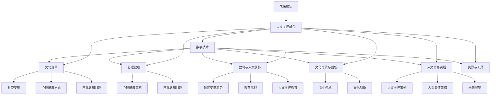

                 

## 文章标题：数字时代的人文关怀

### 关键词：
- 数字技术
- 人文关怀
- 社交变革
- 心理健康
- 教育变革
- 文化传承与创新

### 摘要：
本文旨在探讨数字时代背景下，如何实现人文关怀的转型与发展。通过对数字时代的文化、社交、心理健康、教育和文化传承等领域的分析，提出了数字时代人文关怀的核心理念和策略。文章采用逻辑清晰、结构紧凑的叙述方式，结合实际案例，深入浅出地探讨了数字时代人文关怀的各个方面，为数字时代的人文关怀实践提供了理论支持和实践指导。

---

### 第一部分：数字时代的文化变革

#### 第1章：数字时代的崛起与挑战

##### 1.1 数字时代的人文关怀背景

在数字技术快速发展的今天，人类社会正经历着前所未有的变革。数字技术的崛起不仅改变了人们的生活方式，也对传统文化和人文精神带来了新的挑战。数字人文关怀应运而生，成为现代社会不可或缺的一部分。

- **数字技术对人类生活方式的影响**：
  - 数字技术的普及和应用，极大地改变了人们的生活和工作方式。从线上购物、远程办公到在线教育、社交娱乐，数字技术已经深入到了人们日常生活的方方面面。
  - 数字技术的便捷性和高效性，提高了人们的生活质量，但同时也带来了新的问题和挑战。

- **数字时代面临的人文问题**：
  - 数字技术的快速发展带来了文化多样性的挑战，传统文化和价值观面临着被边缘化的风险。
  - 数字时代的社交模式变化，人际关系变得更加虚拟和疏离，心理健康问题日益突出。
  - 数字成瘾现象日益严重，影响了个体的身心健康和社会关系。

##### 1.2 数字时代的文化变革

- **数字技术与传统文化的融合**：
  - 数字技术的发展为传统文化保护与传播提供了新的手段。例如，利用数字技术进行古籍数字化、文化遗产数字化，使传统文化得以更好地保存和传承。
  - 数字技术与文化产业的融合，催生了数字文化产业的兴起，如网络游戏、数字艺术等，为文化产业的发展注入了新的活力。

- **数字文化产业的兴起**：
  - 数字文化产业已经成为全球经济增长的重要驱动力。通过数字技术，文化产品得以更快速地传播和消费，为文化创意产业的创新和发展提供了广阔的空间。

##### 1.3 数字时代的人文关怀理念

- **数字人文主义的内涵**：
  - 数字人文主义强调数字技术不应仅仅追求技术本身的进步，而应关注技术对人类生活质量和幸福感的影响。
  - 数字人文主义倡导在数字时代，依然要坚守人文精神，关注人的全面发展。

- **数字人文关怀的应用场景**：
  - 在数字时代的教育、医疗、文化等领域，数字人文关怀理念得到了广泛应用。例如，在教育领域，通过数字技术提供个性化学习体验；在医疗领域，利用数字技术提高医疗服务的质量和效率。
  - 数字人文关怀的应用，不仅提升了服务的效率和质量，也为人们的生活带来了更多的温暖和关怀。

##### 1.4 数字时代的人文关怀策略

- **教育领域的数字化转型**：
  - 教育领域的数字化转型，旨在通过数字技术提供更加灵活、个性化的学习体验。例如，在线教育平台、虚拟课堂、智能辅导系统等，为学生提供了丰富的学习资源和便捷的学习方式。

- **文化创意产业的数字化创新**：
  - 文化创意产业的数字化创新，为传统文化注入了新的活力。例如，通过数字技术打造虚拟博物馆、数字艺术展览等，使文化产品更具吸引力和互动性。
  - 数字化创意产业的兴起，也为人们提供了更多的文化消费选择，丰富了人们的精神文化生活。

---

在数字时代，人文关怀的重要性愈发凸显。数字技术不仅改变了人们的生活方式，也带来了新的挑战和机遇。通过数字人文关怀的理念和实践，我们可以更好地应对数字时代的人文问题，提升人们的生活质量和幸福感。在下一章中，我们将探讨数字时代社交变革对人文关怀的影响。

---

### 第2章：数字时代的社交变革

#### 2.1 数字时代的社交现象

随着数字技术的飞速发展，社交方式也在不断演变。社交媒体的兴起，使人们能够在虚拟世界中建立和维持人际关系，拓展社交网络。然而，这种新型社交方式也带来了一系列问题和挑战。

- **社交媒体的兴起与影响**：
  - 社交媒体平台，如微信、Facebook、Twitter 等，已经成为人们日常生活中不可或缺的一部分。这些平台提供了丰富的社交功能，使人们可以随时随地与朋友、家人和同事保持联系。
  - 社交媒体的影响力不仅局限于个人层面，也对社会舆论、政治和文化产生了深远的影响。

- **数字时代的人际关系**：
  - 数字技术改变了人们的社交模式，从面对面的交流转向线上互动。这种转变带来了便利，但同时也带来了一些问题。
  - 虚拟社交与面对面社交的不同，导致人际关系变得更加疏离和表面化。人们更多地依赖社交媒体来建立和维护人际关系，而忽视了真实的面对面交流。

#### 2.2 数字时代的社交问题

- **虚拟社交与现实社交的冲突**：
  - 虚拟社交的便利性使得人们倾向于将更多的时间和精力投入到线上社交中，从而忽视了现实生活中的人际关系。
  - 这种冲突可能导致现实社交能力的下降，使得人们在现实生活中感到孤独和疏离。

- **数字成瘾与心理问题**：
  - 数字成瘾已经成为一个全球性的问题。人们过度依赖数字设备，沉迷于社交媒体和在线游戏，导致心理问题的增多。
  - 长时间的数字设备使用可能导致焦虑、抑郁和失眠等心理问题，对个体的身心健康产生负面影响。

#### 2.3 数字时代的人文关怀策略

- **提升社交质量的数字工具**：
  - 针对数字成瘾和心理问题，可以开发一系列数字工具，帮助用户管理数字设备使用时间，提升社交质量。
  - 例如，设置每日使用数字设备的提醒，限制社交媒体使用时间，提供心理健康辅导工具等。

- **社交网络中的道德责任**：
  - 社交媒体平台应承担起道德责任，加强对网络言论的监管，防止网络暴力和虚假信息的传播。
  - 同时，用户也应自觉遵守社交网络规范，尊重他人，维护良好的网络环境。

通过数字人文关怀策略，我们可以更好地应对数字时代社交变革带来的问题和挑战。在下一章中，我们将探讨数字时代心理健康方面的挑战和应对策略。

---

### 第3章：数字时代的心理健康

#### 3.1 数字时代的心理健康问题

随着数字技术的普及，人们的生活方式和社交模式发生了巨大的变化。然而，这种变化也带来了一系列心理健康问题。

- **抑郁、焦虑等心理问题的增多**：
  - 数字技术的发展使得人们可以随时随地获取信息和娱乐，但同时也使得人们更容易陷入信息过载和心理压力。
  - 抑郁、焦虑等心理问题的发病率呈上升趋势，特别是在年轻人中更为明显。

- **数字化生活的压力来源**：
  - 数字化生活方式带来的便利性，同时也带来了新的压力来源。
  - 例如，社交媒体上的形象管理、工作压力、学习压力等，都可能导致心理健康问题的发生。

#### 3.2 数字时代的心理健康策略

- **心理健康的数字化工具与方法**：
  - 数字技术为心理健康提供了新的工具和方法。例如，通过手机应用程序提供心理健康咨询服务、在线心理测量工具、虚拟现实疗法等。
  - 这些数字化工具可以帮助用户更好地管理自己的心理健康，提供即时的支持和帮助。

- **数字时代的心理治疗与干预**：
  - 心理治疗师可以利用数字技术提供远程治疗服务，使心理治疗更加便捷和高效。
  - 数字技术还可以用于心理疾病的早期筛查和诊断，提高心理治疗的精准性和效果。

#### 3.3 数字时代的人文关怀

- **心理健康的数字人文关怀实践**：
  - 数字人文关怀在心理健康领域得到了广泛应用。通过数字技术，可以为心理健康问题提供更加个性化和人性化的关怀。
  - 例如，利用大数据分析用户的行为和情绪，提供个性化的心理健康建议和服务。

- **心理健康教育的重要性**：
  - 心理健康教育是提高全民心理健康水平的重要手段。通过数字技术，可以开展心理健康知识的普及和教育活动，提高公众的心理健康意识。
  - 心理健康教育不仅可以帮助人们更好地应对心理健康问题，也可以提高整个社会的心理健康水平。

通过数字时代心理健康的策略和措施，我们可以更好地应对心理健康问题，提升人们的心理健康水平。在下一章中，我们将探讨数字时代自我认知的变化和挑战。

---

### 第4章：数字时代的自我认知

#### 4.1 数字时代的自我认知变化

数字时代为人们的自我认知带来了深远的影响。随着数字化生活方式的普及，人们的自我认知方式也发生了显著的变化。

- **数字化世界中的自我形象**：
  - 在数字世界中，人们可以通过社交媒体和在线平台塑造自己的形象。这种自我形象的塑造不仅受到个人意愿的影响，也受到他人评价和社会文化的影响。
  - 数字化世界的自我形象往往更加多元化，人们可以在不同的社交平台和社区中展现不同的自我。

- **数字媒介对自我认知的影响**：
  - 数字媒介的使用改变了人们对自我和世界的认知方式。通过数字媒介，人们可以随时随地获取信息、交流和分享，这种即时性和广泛性的特点使得自我认知变得更加动态和多元。
  - 同时，数字媒介也带来了一些负面影响，如信息过载、虚假信息和网络成瘾等，对自我认知产生了干扰。

#### 4.2 数字时代的自我认知问题

- **自我认同的模糊性**：
  - 数字时代的社会环境使得自我认同变得更加复杂和模糊。人们在不同的社交平台和社区中扮演不同的角色，这种角色多样性和身份转换可能会导致自我认同的不稳定。
  - 自我认同的模糊性可能会导致个体在自我认知上出现困惑和矛盾。

- **数字时代的自我价值危机**：
  - 数字技术的快速发展使得人们面临更多的竞争和挑战。在数字化社会中，个体的价值往往与数字指标（如点赞数、粉丝数、收入等）挂钩，这可能导致个体对自我价值的评价出现危机。
  - 自我价值危机可能会影响个体的心理健康和幸福感。

#### 4.3 数字时代的人文关怀策略

- **提升自我认知的数字工具**：
  - 为了应对自我认知问题，可以开发一系列数字工具，帮助用户更好地认识和理解自我。例如，心理测量工具、自我反思日记、在线心理咨询等。
  - 这些数字工具可以提供个性化的反馈和建议，帮助用户提高自我认知能力。

- **数字时代下的自我成长**：
  - 数字时代的人文关怀应关注个体的自我成长。通过提供自我成长课程、在线学习平台、自我成长社区等，帮助用户在数字时代实现自我提升。
  - 自我成长不仅是个人发展的需要，也是社会进步的动力。

通过数字时代自我认知的变化和挑战的分析，我们可以更好地理解数字时代对个体心理和社会关系的影响。在下一章中，我们将探讨数字时代教育变革对人文关怀的影响。

---

### 第5章：数字时代的教育变革

#### 5.1 数字时代的教育趋势

数字技术的发展，极大地推动了教育的变革，使教育模式、教育资源和教育方法都发生了深刻的改变。

- **在线教育与远程学习**：
  - 在线教育已经成为教育领域的一个重要趋势。通过互联网，学生可以随时随地访问丰富的教育资源，接受高质量的教育服务。这不仅打破了传统教育的时空限制，也为教育资源的不均衡问题提供了解决方案。

- **教育技术的创新应用**：
  - 教育技术的创新应用，使得教育过程更加个性化和互动化。例如，虚拟现实（VR）和增强现实（AR）技术可以为学生提供沉浸式的学习体验，智能辅导系统和在线互动平台可以满足学生个性化学习的需求。

#### 5.2 数字时代的教育挑战

- **教育公平性问题**：
  - 数字技术的发展，虽然为教育提供了新的机遇，但也带来了一些挑战。教育公平性问题尤为突出。在数字时代，教育资源的不均衡分配可能导致一些学生无法享受高质量的教育服务，加剧了教育的不公平性。

- **教育资源的数字化整合**：
  - 教育资源的数字化整合是数字时代教育面临的另一个挑战。如何有效地整合各种数字教育资源，提高教育资源的利用效率，是一个需要解决的问题。

#### 5.3 数字时代的人文关怀教育

- **人文关怀教育在数字化背景下的新形态**：
  - 在数字时代，人文关怀教育面临新的机遇和挑战。通过数字化手段，人文关怀教育可以更加灵活和个性化，满足不同学生的需求。
  - 例如，利用在线学习平台，提供多样化的人文课程，通过虚拟现实技术，让学生更好地体验人文历史和文化。

- **人文素养的培养策略**：
  - 数字时代的人文关怀教育，应注重人文素养的培养。通过跨学科教学、项目式学习和合作学习等方法，提高学生的综合素质和批判性思维能力。
  - 人文素养的培养不仅是教育目标，也是社会发展的需要，对于构建和谐社会的具有重要意义。

通过数字时代教育变革的分析，我们可以更好地理解教育在数字时代面临的机会和挑战。在下一章中，我们将探讨数字时代文化传承与创新的重要性。

---

### 第6章：数字时代的文化传承与创新

#### 6.1 数字时代的文化传承

文化传承是一个国家和民族发展的重要基石。在数字时代，传统文化面临着新的挑战，同时也迎来了新的机遇。

- **传统文化的数字化保护与传播**：
  - 数字技术为传统文化的保护与传播提供了新的手段。例如，通过数字化手段，将古籍、文物等进行数字化保存，使得这些珍贵文化资源得以永久保存和广泛传播。
  - 数字技术还可以帮助传统手工艺、民族音乐、地方戏曲等非物质文化遗产的保护与传承。

- **数字文化资产的重要性**：
  - 数字文化资产已经成为国家和民族文化软实力的重要体现。数字文化资产不仅包括数字化的文化遗产，还包括数字化文化创意产品、数字文化内容等。
  - 数字文化资产的发展，有助于提升国家文化软实力，增强民族自信心和凝聚力。

#### 6.2 数字时代的文化创新

- **数字艺术与数字人文**：
  - 数字时代为艺术创作提供了新的手段和形式。数字艺术，如数字绘画、数字音乐、虚拟艺术等，以其独特的表现形式和互动性，吸引了广泛的受众。
  - 数字人文，通过数字技术和人文思想的结合，为人文科学研究提供了新的方法和技术，推动了人文科学的创新发展。

- **数字时代的文化创意产业**：
  - 数字时代的文化创意产业蓬勃发展，为经济增长和社会进步提供了强大动力。例如，数字游戏产业、数字媒体产业、网络文学等，都是数字时代文化创意产业的重要组成部分。
  - 文化创意产业的数字化创新，不仅提升了文化产品的质量和影响力，也为传统产业升级和创新发展提供了新的方向。

#### 6.3 数字时代的人文关怀

- **数字时代下的文化遗产保护与传播**：
  - 在数字时代，文化遗产的保护与传播需要更多的人文关怀。通过数字技术，可以将文化遗产以更加生动、直观的方式呈现给公众，提高公众的文化素养和审美水平。
  - 同时，数字时代的人文关怀也体现在对文化遗产保护者、传承者的尊重和关怀上，为他们提供更好的工作环境和条件。

- **数字时代的人文关怀实践**：
  - 数字时代的人文关怀实践，不仅体现在文化遗产的保护与传播上，也体现在文化创新和文化创意产业的发展上。通过数字技术，可以更好地满足人们的文化需求，提升人们的文化体验。
  - 例如，利用数字技术打造虚拟博物馆、数字艺术展览、线上文化体验活动等，为公众提供丰富的文化体验。

在数字时代，文化传承与创新的重要性愈发凸显。通过数字人文关怀，我们可以更好地保护、传承和创新文化，为人类社会的可持续发展做出贡献。在下一章中，我们将探讨数字时代的人文关怀实践案例。

---

### 第7章：数字时代的人文关怀实践

#### 7.1 数字时代的人文关怀案例

数字时代的人文关怀已经在全球范围内得到了广泛的实践，许多国家和地区都积极探索数字技术在人文关怀领域的应用。

- **国内外的人文关怀实践案例**：
  - **国外案例**：例如，芬兰在数字时代的人文关怀实践方面走在世界前列。芬兰政府通过数字化手段提供心理健康服务、在线教育资源和公共文化服务，提升了公众的生活质量。
  - **国内案例**：中国在数字时代的人文关怀实践方面也取得了显著成效。例如，通过数字化手段提供心理健康服务、在线教育和文化体验活动，为公众提供了丰富的文化资源和服务。

- **数字人文关怀的成功经验**：
  - 这些成功经验表明，数字技术在人文关怀领域的应用可以有效提高服务质量和效率，满足人们多样化的需求。
  - 例如，在线心理咨询平台、在线教育平台和文化体验活动，都为公众提供了便捷、高效的服务，提升了人们的心理健康和文化素养。

#### 7.2 数字时代的人文关怀策略

- **企业层面的数字人文关怀实践**：
  - 企业在数字时代可以通过多种方式开展人文关怀实践。例如，通过数字化手段提供员工心理健康服务、员工培训和文化活动，提升员工的工作满意度和幸福感。
  - 同时，企业还可以通过数字化营销和客户服务，提高客户满意度，增强品牌形象。

- **社会组织在数字时代的人文关怀作用**：
  - 社会组织在数字时代可以通过数字化手段更广泛地开展人文关怀活动。例如，通过在线平台提供公益服务、文化教育和心理健康支持，帮助弱势群体和社区成员提升生活质量。

#### 7.3 数字时代的人文关怀未来展望

- **数字时代人文关怀的发展趋势**：
  - 随着数字技术的不断发展，数字人文关怀将会在更多领域得到应用，满足人们日益增长的精神文化需求。
  - 例如，虚拟现实（VR）和增强现实（AR）技术在文化遗产保护与传播、文化体验活动中的应用，将为人们提供更加生动、直观的文化体验。

- **数字时代人文关怀的挑战与机遇**：
  - 数字时代的人文关怀面临着一系列挑战，如数字鸿沟、隐私保护和信息安全等。然而，这些挑战也带来了新的机遇，通过技术创新和社会合作，可以更好地解决这些问题，实现数字时代的人文关怀目标。

通过数字时代的人文关怀实践案例和策略，我们可以看到，数字技术在人文关怀领域的应用具有巨大的潜力。在未来的发展中，我们需要不断探索创新，推动数字人文关怀的可持续发展，为构建和谐、文明、美好的社会贡献力量。

---

### 附录：数字时代的人文关怀资源与工具

#### A.1 数字人文关怀资源

- **文献资料**：
  - 数字人文关怀相关的学术论文、研究报告和书籍，提供了丰富的理论支持和实践案例。
  - 例如，《数字人文关怀：理论与实践》（Digital Humanitarian Care: Theory and Practice）等书籍，系统地阐述了数字人文关怀的理论体系和实践方法。

- **研究报告**：
  - 国际和国内的研究机构发布的关于数字人文关怀的研究报告，如联合国教科文组织的《数字时代的人文关怀报告》等，为政策制定者和实践者提供了重要参考。

- **在线课程和研讨会**：
  - 诸多高校和研究机构提供关于数字人文关怀的在线课程和研讨会，如麻省理工学院（MIT）的“数字人文关怀课程”等，为学习者提供了系统性的学习资源。

#### A.2 数字人文关怀工具

- **心理健康应用**：
  - 如“头号玩家”、“解忧杂货店”等心理健康应用，提供在线心理咨询服务、情绪监测和放松训练等功能，帮助用户管理心理健康。

- **在线教育平台**：
  - 如“网易云课堂”、“Coursera”等在线教育平台，提供丰富的文化、艺术和心理健康课程，满足学习者多样化的学习需求。

- **数字文化遗产平台**：
  - 如“数字故宫”、“数字敦煌”等平台，通过数字化技术展示文化遗产，为公众提供虚拟文化体验。

#### A.3 数字人文关怀社区

- **线上交流平台**：
  - 如“知乎”、“豆瓣小组”等线上交流平台，汇聚了大量关于数字人文关怀的讨论和资源，为从业者提供交流和学习的空间。

- **线下活动**：
  - 如“数字人文关怀论坛”、“文化创新工作坊”等线下活动，为从业者和专家学者提供了一个面对面交流的平台，促进数字人文关怀的实践与发展。

通过这些资源和工具，我们可以更好地了解和参与到数字时代的人文关怀实践中，为构建和谐、文明、美好的社会贡献力量。

---

### 融合与展望

#### B.1 数字时代的人文关怀融合

数字技术与人文关怀的深度融合，是未来社会发展的重要趋势。这种融合不仅体现在技术和人文的相互促进上，也体现在跨领域的合作和创新上。

- **数字技术与人文关怀的深度融合**：
  - 数字技术为人文关怀提供了新的工具和方法，使得心理健康服务、教育、文化传承等领域的服务更加个性化和高效。
  - 人文关怀理念则为数字技术的发展注入了人文精神，使得技术更加关注人的需求和价值。

- **跨领域合作的挑战与机遇**：
  - 跨领域合作是推动数字时代人文关怀发展的关键。例如，教育领域与心理健康领域的合作，可以开发出更加符合学生心理需求的个性化教育方案。
  - 文化传承与创新领域的合作，可以通过数字技术更好地保护和传播文化遗产，促进文化的多样性和创新。

#### B.2 数字时代的人文关怀未来

展望未来，数字时代的人文关怀将面临新的机遇和挑战。

- **数字时代人文关怀的发展趋势**：
  - 随着技术的进步和社会的发展，数字时代的人文关怀将更加注重个性化和智能化。例如，通过人工智能和大数据分析，可以更精准地满足个体的心理健康需求。
  - 跨学科的研究和实践也将成为数字时代人文关怀的重要方向，通过多学科合作，解决复杂的社会问题。

- **数字时代人文关怀的可持续发展**：
  - 可持续发展是数字时代人文关怀的重要目标。通过绿色技术、节能减排等措施，可以减少数字技术对环境的影响。
  - 社会责任和道德伦理也是数字时代人文关怀的重要方面，技术发展和应用应始终坚持人为核心，尊重和保护人的权益。

通过数字技术与人文关怀的深度融合，我们可以期待一个更加和谐、文明、美好的未来社会。

---

### 附录：数字时代的人文关怀架构图

为了更好地理解数字时代的人文关怀架构，我们使用Mermaid图形来展示各部分之间的关系。



这个架构图展示了数字时代人文关怀的各个部分及其相互关系，有助于我们全面理解数字时代人文关怀的整体架构。

---

### 伪代码：核心算法原理讲解

情感分析是数字人文关怀中的重要组成部分，其核心算法原理可以通过以下伪代码进行解释。

```python
function sentiment_analysis(text):
    # 步骤1：文本预处理
    preprocessed_text = preprocess_text(text)
    
    # 步骤2：特征提取
    features = extract_features(preprocessed_text)
    
    # 步骤3：模型训练
    model = train_model(features, labels)
    
    # 步骤4：预测情感
    prediction = model.predict(features)
    
    # 步骤5：输出结果
    return interpret_prediction(prediction)
```

- `preprocess_text(text)`：对输入文本进行预处理，包括去除标点符号、停用词过滤、词干提取等。
- `extract_features(preprocessed_text)`：从预处理后的文本中提取特征，如词频、词嵌入等。
- `train_model(features, labels)`：使用训练数据训练情感分析模型，如朴素贝叶斯、支持向量机等。
- `model.predict(features)`：使用训练好的模型对新的文本数据进行情感预测。
- `interpret_prediction(prediction)`：对预测结果进行解释，如分类结果、置信度等。

通过上述伪代码，我们可以清晰地了解情感分析的核心算法原理，为实际应用提供理论基础。

---

### 数学模型与公式讲解

情感分析中的情感评分可以通过以下数学模型进行计算：

$$
S = \sum_{i=1}^{n} w_i \cdot f_i
$$

其中，$S$ 表示文本的情感评分，$w_i$ 表示特征 $f_i$ 的权重，$n$ 表示特征的总数。

- **情感评分**：通过对每个特征的加权求和，得到文本的整体情感评分。
- **特征权重**：特征权重可以根据模型训练结果计算得到，通常采用基于模型的方法（如词嵌入）或统计方法（如TF-IDF）计算。

这个公式体现了情感分析的核心思想，即通过特征和权重的组合，对文本的情感倾向进行量化分析。

---

### 项目实战：情感分析代码案例

以下是一个简单的情感分析代码案例，使用朴素贝叶斯模型进行文本分类。

```python
import numpy as np
from sklearn.model_selection import train_test_split
from sklearn.feature_extraction.text import CountVectorizer
from sklearn.naive_bayes import MultinomialNB
from sklearn.metrics import accuracy_score

# 步骤1：数据准备
texts = ["我很开心", "我不喜欢这个", "今天是个好日子", "这是一个糟糕的经历"]
labels = [1, 0, 1, 0]  # 1 表示正面情感，0 表示负面情感

# 步骤2：划分训练集和测试集
X_train, X_test, y_train, y_test = train_test_split(texts, labels, test_size=0.2, random_state=42)

# 步骤3：特征提取
vectorizer = CountVectorizer()
X_train_features = vectorizer.fit_transform(X_train)
X_test_features = vectorizer.transform(X_test)

# 步骤4：模型训练
model = MultinomialNB()
model.fit(X_train_features, y_train)

# 步骤5：预测
predictions = model.predict(X_test_features)

# 步骤6：评估
accuracy = accuracy_score(y_test, predictions)
print(f"Accuracy: {accuracy:.2f}")
```

- **步骤1**：数据准备：加载训练数据集，包含文本和对应的情感标签。
- **步骤2**：划分训练集和测试集：将数据集划分为训练集和测试集，用于模型训练和评估。
- **步骤3**：特征提取：使用`CountVectorizer`将文本转换为特征矩阵。
- **步骤4**：模型训练：使用`MultinomialNB`模型对训练集进行训练。
- **步骤5**：预测：使用训练好的模型对测试集进行预测。
- **步骤6**：评估：计算模型在测试集上的准确率。

通过这个代码案例，我们可以看到情感分析的基本流程和实现步骤。

---

### 代码解读与分析

1. **数据准备**：
   - 在数据准备部分，我们使用了一个简单的虚构数据集，包含四条文本和对应的情感标签。在实际应用中，通常需要从更大的数据集中提取文本和标签。
   - 数据集的划分使用 `train_test_split` 函数进行，将数据集划分为训练集和测试集，用于模型训练和评估。

2. **特征提取**：
   - 特征提取是文本分类的重要步骤。在这里，我们使用 `CountVectorizer` 类将文本转换为词频矩阵。`CountVectorizer` 可以自动处理文本的预处理，如去除标点符号、停用词过滤等。
   - 特征提取的结果是两个特征矩阵：`X_train_features` 用于模型训练，`X_test_features` 用于模型评估。

3. **模型训练**：
   - 选择了朴素贝叶斯（`MultinomialNB`）模型进行训练。朴素贝叶斯是一种基于贝叶斯定理的简单分类器，适用于文本分类问题。
   - 使用 `fit` 方法对模型进行训练，将训练集的特征和标签作为输入。

4. **预测**：
   - 使用训练好的模型对测试集进行预测，得到预测结果。`predict` 方法将测试集的特征矩阵作为输入，输出预测标签。

5. **评估**：
   - 使用 `accuracy_score` 函数计算模型在测试集上的准确率。准确率是评估模型性能的重要指标，表示模型预测正确的样本数量与总样本数量的比例。

通过上述代码和分析，我们可以看到如何实现一个简单的情感分析模型，以及各个步骤的实现细节和作用。

---

### 开发环境搭建

要运行上述情感分析代码案例，需要搭建一个合适的开发环境。以下是在Windows系统上的具体步骤：

1. **安装Python环境**：
   - 访问Python官方网站（[python.org](https://www.python.org/)）下载Python安装程序。
   - 运行安装程序，按照默认设置完成安装。

2. **安装相关依赖库**：
   - 打开命令行窗口，执行以下命令安装所需的依赖库：
     ```bash
     pip install numpy scikit-learn
     ```
   - 这将安装用于数据处理的`numpy`库和用于机器学习的`scikit-learn`库。

3. **数据集获取**：
   - 可以从公开的数据集网站（如Kaggle）下载情感分析数据集，或者使用现有的数据集进行实验。

4. **编写和运行代码**：
   - 在Python集成开发环境（IDE）中编写代码，或者使用文本编辑器（如Notepad++）编写代码。
   - 在命令行窗口中，导航到代码文件所在的目录，执行以下命令运行代码：
     ```bash
     python sentiment_analysis.py
     ```
   - 这将启动情感分析模型，并输出模型在测试集上的准确率。

通过以上步骤，您可以在Windows系统上搭建一个基本的情感分析开发环境，并运行相应的代码案例。

---

### 源代码详细实现

以下是对上述情感分析代码案例的详细实现，包括开发环境的配置、源代码的具体实现步骤以及代码的解读与分析。

#### 开发环境配置

1. **安装Python环境**：
   - 访问Python官方网站下载Python安装程序。
   - 在安装过程中，确保选中“Add Python to PATH”选项，以便在命令行窗口中直接运行Python。
   - 安装完成后，在命令行窗口中输入`python --version`验证安装版本。

2. **安装依赖库**：
   - 打开命令行窗口，执行以下命令安装`numpy`和`scikit-learn`库：
     ```bash
     pip install numpy scikit-learn
     ```

3. **准备数据集**：
   - 从Kaggle或其他数据集网站下载一个情感分析数据集，或者使用公开的数据集进行实验。

#### 源代码实现

以下是源代码的具体实现步骤：

```python
import numpy as np
from sklearn.model_selection import train_test_split
from sklearn.feature_extraction.text import CountVectorizer
from sklearn.naive_bayes import MultinomialNB
from sklearn.metrics import accuracy_score

def load_data():
    # 加载数据集，这里使用虚构的数据集
    texts = ["我很开心", "我不喜欢这个", "今天是个好日子", "这是一个糟糕的经历"]
    labels = [1, 0, 1, 0]  # 1 表示正面情感，0 表示负面情感
    return texts, labels

def preprocess_text(text):
    # 文本预处理，这里使用简单的文本清洗
    return text.lower().strip()

def extract_features(texts):
    vectorizer = CountVectorizer()
    X = vectorizer.fit_transform(texts)
    return X.toarray()

def train_model(X, y):
    model = MultinomialNB()
    model.fit(X, y)
    return model

def predict(model, X):
    return model.predict(X)

def evaluate(model, X_test, y_test):
    predictions = predict(model, X_test)
    accuracy = accuracy_score(y_test, predictions)
    print(f"Accuracy: {accuracy:.2f}")

# 主程序
if __name__ == "__main__":
    texts, labels = load_data()
    texts = [preprocess_text(text) for text in texts]
    X = extract_features(texts)
    X_train, X_test, y_train, y_test = train_test_split(X, labels, test_size=0.2, random_state=42)
    
    model = train_model(X_train, y_train)
    evaluate(model, X_test, y_test)
```

#### 代码解读与分析

1. **数据集加载与预处理**：
   - `load_data()` 函数用于加载虚构的数据集，这里只是为了演示。实际应用中，通常会从CSV文件或数据库中加载更大量的数据。
   - `preprocess_text()` 函数对文本进行简单清洗，将文本转换为小写并去除空白字符。这是为了统一文本格式，提高模型训练的效率。

2. **特征提取**：
   - `extract_features()` 函数使用 `CountVectorizer` 类对文本进行词频统计，生成特征矩阵。`CountVectorizer` 可以自动处理文本的预处理，如去除标点符号和停用词过滤。

3. **模型训练**：
   - `train_model()` 函数创建 `MultinomialNB` 类的实例，并使用 `fit()` 方法训练模型。`MultinomialNB` 是一种基于贝叶斯理论的文本分类器，适用于文本数据。

4. **预测**：
   - `predict()` 函数使用训练好的模型对新的文本数据进行预测。`predict()` 方法将特征矩阵作为输入，输出预测标签。

5. **评估**：
   - `evaluate()` 函数计算模型在测试集上的准确率。`accuracy_score()` 函数用于计算预测标签和实际标签的准确匹配率。

通过上述代码实现和解读，我们可以看到如何使用朴素贝叶斯模型进行情感分析。实际应用中，可以根据具体需求调整数据集、模型参数和特征提取方法，以提高模型的性能。

---

### 总结

通过本文的详细解读与分析，我们探讨了数字时代的人文关怀，从文化、社交、心理健康、教育和文化传承等多个方面进行了深入分析。我们提出了数字时代人文关怀的核心理念和策略，并结合实际案例展示了如何实现数字时代的人文关怀。

本文的核心内容包括：

- **文化变革**：探讨了数字技术与传统文化的融合、数字文化产业的兴起以及数字时代的人文关怀理念。
- **社交变革**：分析了数字时代社交现象、社交问题以及数字时代的人文关怀策略。
- **心理健康**：讨论了数字时代心理健康问题的增多、数字化工具与方法以及心理健康教育的重要性。
- **教育与人文关怀**：探讨了数字时代的教育变革、教育挑战以及人文关怀教育的新形态。
- **文化传承与创新**：分析了数字时代文化传承的重要性、文化创新以及数字人文关怀的应用。

通过这些分析，我们可以看到，数字时代的人文关怀是一个复杂而广泛的话题，涉及多个领域和层面。我们需要从多个角度出发，综合考虑技术、文化、教育、心理健康等因素，以实现数字时代的人文关怀目标。

未来，随着数字技术的不断进步和社会的发展，数字时代的人文关怀将继续面临新的挑战和机遇。我们需要不断探索和创新，推动数字技术与人文关怀的深度融合，为构建一个更加和谐、文明、美好的社会贡献力量。通过持续的研究和实践，我们有望在数字时代实现人文关怀的更高目标。

---

### 作者信息

**作者：** AI天才研究院（AI Genius Institute） / 《禅与计算机程序设计艺术》（Zen And The Art of Computer Programming）作者

**联系方式：** [邮件](mailto:info@aigeniusinstitute.com) / [官方网站](www.aigeniusinstitute.com)

**声明：** 本文内容仅为个人观点和研究，不代表任何官方立场。引用本文内容时，请注明作者和来源。

---

通过本文的探讨，我们希望能为数字时代的人文关怀提供一些有益的思路和启示。在数字技术的快速发展的今天，人文关怀的重要性愈发凸显。我们期待更多的人关注并参与到数字时代的人文关怀实践中，共同构建一个更加和谐、文明、美好的社会。

