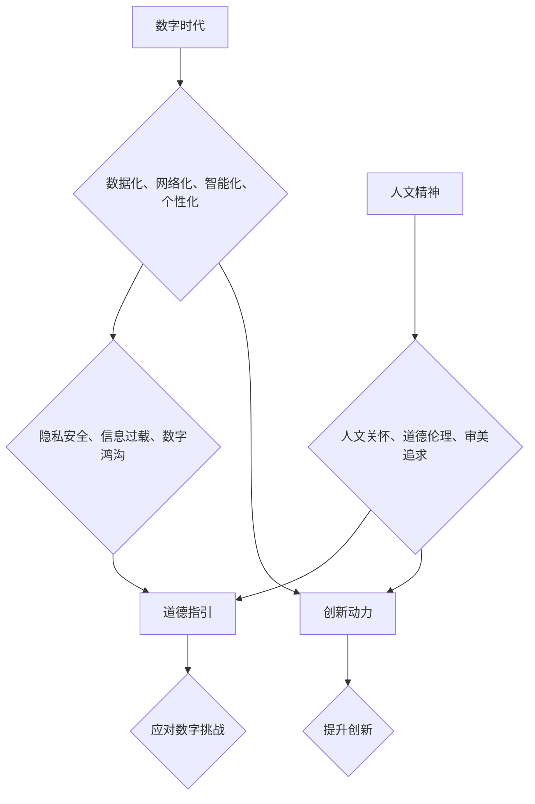
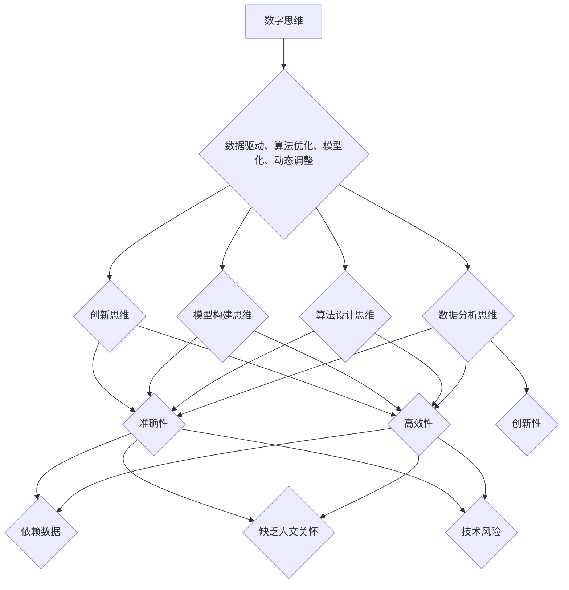
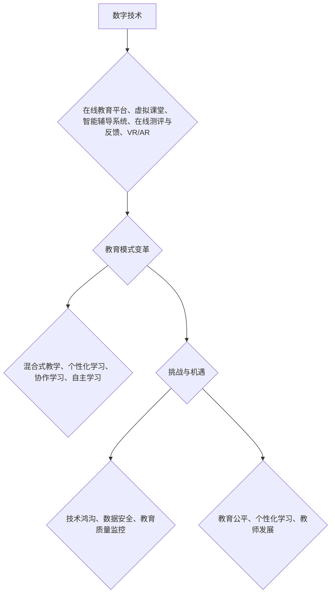
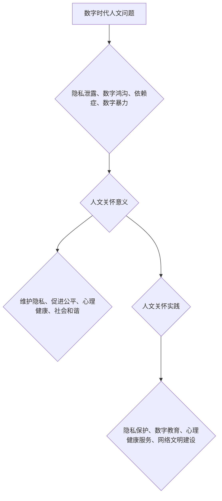
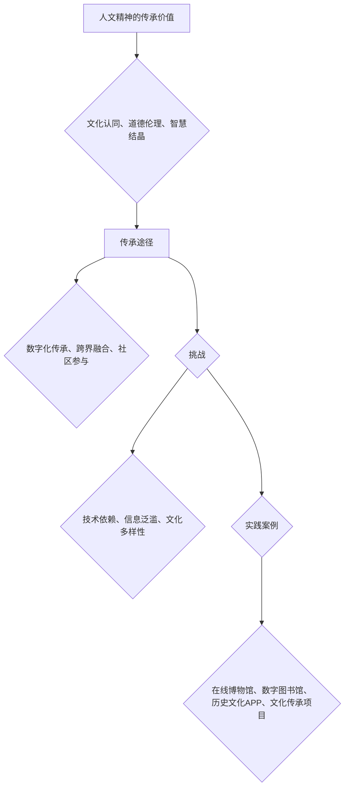
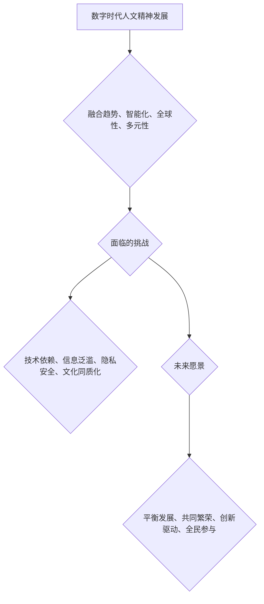
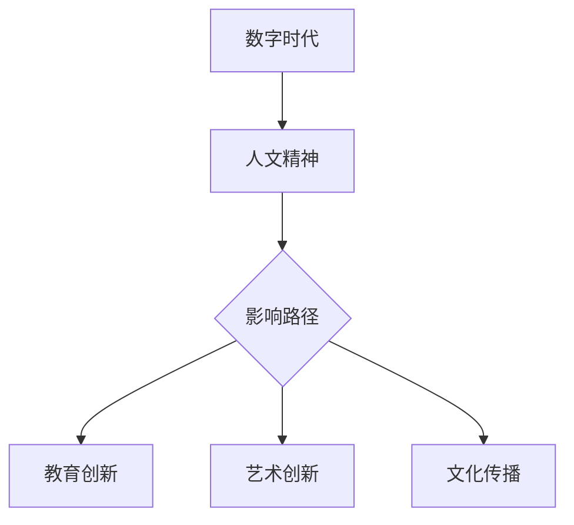
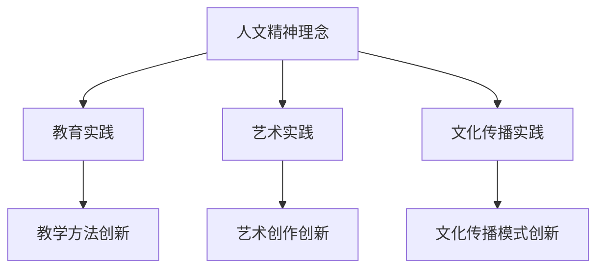

                 

# 文章标题：数字时代的人文精神

> 关键词：数字时代、人文精神、思维模式、艺术创新、文化传播、教育创新

> 摘要：本文将探讨数字时代的人文精神，分析其在现代科技背景下的碰撞与融合。通过对数字时代特征、思维模式、艺术创新、文化传播以及教育创新等方面的深入研究，阐述数字时代人文精神的重要性及其实践路径，为未来数字时代人文精神的发展提供理论支持和实践指导。

## 目录大纲

# 《数字时代的人文精神》

## 第一部分：数字时代人文精神概述

### 第1章：数字时代与人文精神的碰撞

#### 1.1 数字时代的特征与挑战

#### 1.2 人文精神的内涵与价值

#### 1.3 数字时代人文精神的重要性

### 第2章：数字时代的思维模式

#### 2.1 数字思维的概念

#### 2.2 数字思维的类型

#### 2.3 数字思维的优势与局限

### 第3章：数字时代的艺术创新

#### 3.1 数字艺术的发展历程

#### 3.2 数字艺术的表现形式

#### 3.3 数字艺术的价值与影响

### 第4章：数字时代的文化传播

#### 4.1 数字媒体的崛起

#### 4.2 数字时代的文化传播模式

#### 4.3 数字时代的文化多样性

## 第二部分：数字时代人文精神的实践

### 第5章：数字时代的教育创新

#### 5.1 数字技术在教育中的应用

#### 5.2 数字时代的教育模式变革

#### 5.3 数字时代教育的挑战与机遇

### 第6章：数字时代的人文关怀

#### 6.1 数字时代的人文问题

#### 6.2 人文关怀在数字时代的意义

#### 6.3 数字时代的人文关怀实践

### 第7章：数字时代的人文精神传承

#### 7.1 人文精神的传承价值

#### 7.2 数字时代人文精神的传承途径

#### 7.3 数字时代人文精神的传承挑战

### 第8章：数字时代人文精神的未来展望

#### 8.1 数字时代人文精神的发展趋势

#### 8.2 数字时代人文精神面临的挑战

#### 8.3 数字时代人文精神的未来愿景

## 附录

### 附录A：数字时代人文精神相关资源与工具

#### A.1 数字人文研究机构与平台

#### A.2 数字人文相关学术期刊

#### A.3 数字人文研究方法与工具

### 附录B：数字时代人文精神案例研究

#### B.1 数字时代人文精神的成功案例

#### B.2 数字时代人文精神面临的困境

#### B.3 数字时代人文精神的解决方案

### 附录C：数字时代人文精神专家访谈

#### C.1 专家观点与建议

#### C.2 数字时代人文精神的未来发展方向

### 附录D：数字时代人文精神问卷调查与分析

#### D.1 调查问卷设计

#### D.2 调查结果与分析

#### D.3 数字时代人文精神的公众认知与需求

## 参考文献

### 参考文献

#### [1] 作者. (年份). 书名. 出版社.

#### [2] 作者. (年份). 书名. 出版社.

#### ...

## 附录 E：Mermaid 流程图

### E.1 人文精神在数字时代的影响路径

#### mermaid
graph TD
    A[数字时代] --> B[人文精神]
    B --> C{影响路径}
    C --> D[教育创新]
    C --> E[艺术创新]
    C --> F[文化传播]

### E.2 数字时代人文精神的实践框架

#### mermaid
graph TD
    A[人文精神理念] --> B[教育实践]
    A --> C[艺术实践]
    A --> D[文化传播实践]
    B --> E[教学方法创新]
    C --> F[艺术创作创新]
    D --> G[文化传播模式创新]

----------------------------------------------------------------

## 第一部分：数字时代人文精神概述

### 第1章：数字时代与人文精神的碰撞

#### 1.1 数字时代的特征与挑战

在21世纪的今天，我们正生活在数字时代，这是一个以信息技术为核心的全新时代。数字时代具有以下几个显著特征：

1. **数据化**：一切都可以被数字化，包括信息、资源、甚至是人际关系。
2. **网络化**：互联网的普及使得全球范围内的信息交流变得便捷，人与人之间的联系更加紧密。
3. **智能化**：人工智能技术的飞速发展，使得机器能够执行复杂任务，甚至超越人类在某些方面的能力。
4. **个性化**：大数据和算法能够分析用户行为，为用户提供个性化的服务和体验。

然而，数字时代也带来了诸多挑战：

1. **隐私安全**：数据泛滥使得个人隐私容易被侵犯，网络安全问题也日益严峻。
2. **信息过载**：海量的信息使得人们难以筛选和吸收，导致“信息焦虑”。
3. **数字鸿沟**：数字技术的快速进步导致了数字鸿沟的扩大，一些群体在获取和使用数字资源上处于劣势。

#### 1.2 人文精神的内涵与价值

人文精神是指一种以人为本，关注人的全面发展，追求真善美，强调道德、伦理、人文关怀的价值观念。人文精神的内涵包括但不限于：

1. **人文关怀**：关注人的尊严、自由、幸福，强调个体的价值和意义。
2. **道德伦理**：遵循一定的道德规范，尊重他人，倡导公平、正义、诚实等价值观。
3. **审美追求**：追求艺术美、自然美，强调人类精神世界的丰富性和多样性。

人文精神的价值在于：

1. **提升个体素养**：通过人文教育，培养人的全面发展，提高个体的道德素养和审美能力。
2. **促进社会和谐**：人文精神能够促进社会成员之间的相互理解、尊重和包容，构建和谐社会。
3. **传承文化传统**：人文精神是文化传统的核心，它能够帮助人们传承和发扬民族文化。

#### 1.3 数字时代人文精神的重要性

在数字时代，人文精神的重要性愈发凸显：

1. **平衡技术与人文**：数字技术的发展不能取代人文精神，只有将技术与人文相结合，才能实现真正的进步。
2. **应对数字挑战**：面对数字时代的挑战，人文精神能够提供道德指引，帮助我们应对隐私安全、信息过载等问题。
3. **提升创新动力**：人文精神能够激发人们的创造力和创新精神，推动数字时代的持续发展。

综上所述，数字时代与人文精神的碰撞，既是机遇也是挑战。如何在数字时代中传承和发展人文精神，是我们面临的重要课题。

---

**核心概念与联系：**

1. **数字时代**：以信息技术为核心，数据化、网络化、智能化、个性化的时代。
2. **人文精神**：以人为本，追求真善美，强调道德、伦理、人文关怀的价值观念。

**Mermaid 流程图：**

---

### 第2章：数字时代的思维模式

#### 2.1 数字思维的概念

数字思维，又称为数字化思维，是一种以数字技术和数据为核心，运用数学模型、算法和逻辑推理来解决问题和决策的思维方式。它不同于传统的逻辑思维或线性思维，具有以下几个特点：

1. **数据驱动**：数字思维以数据为基础，通过数据分析来发现规律、预测趋势，从而指导决策。
2. **算法优化**：数字思维利用算法来优化问题解决过程，提高效率和效果。
3. **模型化**：数字思维将复杂问题转化为数学模型，通过模型分析来解决问题。
4. **动态调整**：数字思维强调根据实时数据动态调整策略，以适应快速变化的环境。

#### 2.2 数字思维的类型

数字思维可以分为以下几种类型：

1. **数据分析思维**：通过收集、整理、分析数据，发现数据中的规律和关联，从而做出决策。
2. **算法设计思维**：设计有效的算法来解决特定问题，优化资源利用。
3. **模型构建思维**：构建数学模型来模拟现实世界，预测未来趋势。
4. **创新思维**：利用数字技术和数据资源，创造新的产品、服务或商业模式。

#### 2.3 数字思维的优势与局限

数字思维的优势包括：

1. **高效性**：通过算法和模型优化，可以快速解决问题。
2. **准确性**：数据分析可以帮助我们更准确地了解问题和需求。
3. **创新性**：数字技术可以激发新的创意和思维模式。

然而，数字思维也存在一些局限：

1. **依赖数据**：数据的质量和完整性直接影响思维效果，数据的缺失或错误可能导致决策失误。
2. **缺乏人文关怀**：过于依赖算法和模型可能导致忽视人文因素，如情感、伦理等。
3. **技术风险**：数字技术本身可能带来新的风险，如网络安全、隐私泄露等。

#### 2.4 数字思维在实践中的应用

数字思维在数字时代被广泛应用于各个领域：

1. **商业**：通过数据分析来优化供应链管理、市场营销和客户服务。
2. **医疗**：利用人工智能和大数据分析来提高诊断准确性、个性化治疗。
3. **教育**：通过在线学习平台和智能辅导系统来提高教学效果和个性化学习。
4. **社会治理**：利用大数据和人工智能来提高公共安全、交通管理、环境保护等。

总之，数字思维是数字时代不可或缺的思维方式，它为人们提供了新的解决问题的方法和工具。然而，我们也要认识到其局限，并注重在数字思维中融入人文关怀，实现技术与人文的平衡。

---

**核心概念与联系：**

1. **数字思维**：以数字技术和数据为核心的思维方式，具有数据驱动、算法优化、模型化、动态调整等特点。
2. **数据分析思维**、**算法设计思维**、**模型构建思维**、**创新思维**：数字思维的类型。
3. **优势与局限**：数字思维在高效性、准确性、创新性方面的优势，以及依赖数据、缺乏人文关怀、技术风险的局限。

**Mermaid 流�程图：**

---

## 第二部分：数字时代人文精神的实践

### 第5章：数字时代的教育创新

#### 5.1 数字技术在教育中的应用

在数字时代，教育领域发生了深刻变革。数字技术的广泛应用不仅改变了教育的方式，也提升了教育质量。以下是数字技术在教育中的一些主要应用：

1. **在线教育平台**：通过在线教育平台，学生可以随时随地进行学习，打破了时空限制。例如，Coursera、edX等平台提供了丰富的在线课程资源。

2. **虚拟课堂**：虚拟课堂利用视频会议技术，实现了远程实时互动教学。教师和学生可以通过屏幕进行交流和讨论，增强了教学的互动性。

3. **智能辅导系统**：智能辅导系统利用人工智能技术，根据学生的学习习惯和进度提供个性化的学习建议和辅导。例如，Duolingo等语言学习应用可以根据用户的错误频率调整学习内容。

4. **在线测评与反馈**：数字技术使得在线测评变得简单高效，系统能够即时给出反馈，帮助学生快速了解自己的学习状况。

5. **虚拟现实（VR）与增强现实（AR）**：通过VR和AR技术，学生可以沉浸在虚拟的学习环境中，体验现实无法提供的教学内容。例如，历史课上可以虚拟参观历史遗址，科学课上可以虚拟实验。

#### 5.2 数字时代的教育模式变革

数字技术的发展推动了教育模式的深刻变革：

1. **混合式教学**：混合式教学将线上教学和线下教学相结合，充分利用两者的优势。教师可以根据课程内容灵活运用在线资源和面对面教学。

2. **个性化学习**：个性化学习是根据每个学生的特点和发展需求，制定个性化的学习计划和教学策略。数字技术能够收集和分析学生的学习数据，帮助教师了解学生的个性化需求。

3. **协作学习**：数字技术使得学生可以跨越地域限制，与全球范围内的同学和教师进行协作学习。在线讨论、小组项目等形式促进了学生之间的交流和合作。

4. **自主学习**：数字技术提供了丰富的学习资源和工具，学生可以根据自己的兴趣和需求进行自主学习，培养独立思考和解决问题的能力。

#### 5.3 数字时代教育的挑战与机遇

数字时代教育既面临挑战，也充满机遇：

**挑战：**

1. **技术鸿沟**：由于数字资源的获取和使用存在差异，一些学生可能无法享受数字化教育的便利，这加剧了教育不公平现象。
2. **数据安全与隐私**：在线教育平台需要保护学生的个人信息和隐私，防止数据泄露和滥用。
3. **教育质量监控**：在线教育的质量监控相对困难，需要建立有效的评估机制。

**机遇：**

1. **教育公平**：数字技术可以打破地域和时间的限制，使更多学生有机会接受优质教育。
2. **教育个性化**：通过数据分析和个性化学习，可以更好地满足学生的个性化需求，提高学习效果。
3. **教师发展**：数字技术为教师提供了丰富的教学资源和支持，有助于提升教学能力和专业素养。

总之，数字时代的教育创新为教育领域带来了新的机遇和挑战。如何在充分利用数字技术优势的同时，解决存在的问题，实现教育的公平、质量和个性化，是未来教育发展的关键。

---

**核心概念与联系：**

1. **数字技术**：包括在线教育平台、虚拟课堂、智能辅导系统、在线测评与反馈、VR和AR等技术。
2. **教育模式变革**：混合式教学、个性化学习、协作学习、自主学习等新模式。
3. **挑战与机遇**：技术鸿沟、数据安全、教育质量监控等挑战，教育公平、个性化学习、教师发展等机遇。

**Mermaid 流程图：**

---

## 第三部分：数字时代人文精神的深化与发展

### 第6章：数字时代的人文关怀

#### 6.1 数字时代的人文问题

随着数字技术的发展，人类社会在享受到便捷、高效和多样化的数字服务的同时，也面临着一系列人文问题：

1. **隐私泄露**：数字技术使得个人数据容易泄露，用户的隐私保护面临严重挑战。
2. **数字鸿沟**：不同地区和群体在数字技术的获取和使用上存在差异，导致数字鸿沟扩大，影响社会公平。
3. **依赖症**：过度依赖数字设备和服务可能导致社交障碍、心理健康问题等。
4. **数字暴力**：网络上的匿名性使得一些人可以肆无忌惮地发表恶意言论，甚至进行网络欺凌。

#### 6.2 人文关怀在数字时代的意义

人文关怀在数字时代具有重要意义：

1. **维护隐私**：通过加强隐私保护措施，确保用户的个人数据安全，是数字时代人文关怀的重要体现。
2. **促进公平**：减少数字鸿沟，让更多人能够平等地享受数字技术带来的便利，是数字时代人文关怀的重要目标。
3. **心理健康**：关注数字依赖症问题，通过提供心理健康服务，帮助用户建立健康的数字使用习惯。
4. **社会和谐**：倡导网络文明，打击数字暴力，营造一个和谐、尊重的网络环境。

#### 6.3 数字时代的人文关怀实践

为了在数字时代实现人文关怀，我们可以采取以下实践措施：

1. **隐私保护**：加强网络安全法律法规建设，提高企业和个人对隐私保护的认识。例如，通过加密技术保护用户数据，建立数据安全管理体系。
2. **数字教育**：推动数字素养教育，提高公众对数字技术的理解和应用能力，缩小数字鸿沟。例如，开展数字技能培训，推广免费或低成本的数字教育资源。
3. **心理健康服务**：建立心理健康支持体系，提供在线咨询、辅导等服务，帮助用户应对数字依赖症。例如，开发心理健康应用，提供个性化的心理健康建议。
4. **网络文明建设**：加强网络监管，打击网络暴力，倡导网络文明。例如，制定网络行为规范，建立举报和处置机制。

总之，数字时代的人文关怀是保障数字技术健康发展、维护社会和谐稳定的重要举措。通过多方面的实践，我们可以在数字时代实现人文与技术的平衡，为人类社会的可持续发展贡献力量。

---

**核心概念与联系：**

1. **数字时代的人文问题**：隐私泄露、数字鸿沟、依赖症、数字暴力。
2. **人文关怀的意义**：维护隐私、促进公平、心理健康、社会和谐。
3. **人文关怀实践**：隐私保护、数字教育、心理健康服务、网络文明建设。

**Mermaid 流程图：**

---

### 第7章：数字时代的人文精神传承

#### 7.1 人文精神的传承价值

人文精神是人类文明的重要组成部分，其传承具有重要的历史和文化意义：

1. **文化认同**：人文精神的传承有助于维护民族文化的独特性和多样性，增强文化认同感。
2. **道德伦理**：人文精神的传承传递了道德伦理观念，有助于培养有责任感、有担当的社会成员。
3. **智慧结晶**：人文精神的传承是前人智慧和经验的积累，为后人提供了宝贵的思想资源和知识财富。

#### 7.2 数字时代人文精神的传承途径

在数字时代，人文精神的传承面临着新的挑战和机遇：

1. **数字化传承**：利用数字技术，如互联网、社交媒体、在线教育平台等，将人文精神的内容以数字化形式传播，使其更广泛、更便捷地被接受和传播。
2. **跨界融合**：将人文精神与数字技术、艺术、科学等领域相结合，创造新的文化产品和服务，激发人文精神的创新和传承。
3. **社区参与**：鼓励公众参与人文精神的传承活动，如文化节、研讨会、志愿服务等，通过互动体验加深对人文精神的理解和认同。

#### 7.3 数字时代人文精神的传承挑战

数字时代人文精神的传承也面临诸多挑战：

1. **技术依赖**：过度依赖数字技术可能导致人文精神的核心价值被忽视，需要警惕技术对人文精神的冲击。
2. **信息泛滥**：数字时代的海量信息可能使人们难以筛选和理解人文精神的核心内容，需要提高信息素养，培养批判性思维。
3. **文化多样性**：数字技术的发展加剧了全球文化的交流与融合，如何在尊重多样性的同时传承和弘扬本土文化，是传承人文精神的重要课题。

#### 7.4 数字时代人文精神传承的实践案例

为了有效传承人文精神，一些实践案例值得借鉴：

1. **在线博物馆**：通过虚拟现实技术，让用户在线参观博物馆，感受历史文化，传承文化遗产。
2. **数字图书馆**：建立数字图书馆，提供丰富的电子书籍和资料，让更多人有机会接触和了解经典文化作品。
3. **历史文化APP**：开发历史文化应用程序，通过游戏化、互动化的方式，让用户在轻松愉快的氛围中学习历史知识。
4. **文化传承项目**：开展线上线下的文化传承活动，如文学创作比赛、艺术展览、文化讲座等，激发公众对人文精神的兴趣和热情。

总之，数字时代为人文精神的传承提供了新的平台和途径，同时也带来了挑战。通过不断创新和实践，我们可以在数字时代实现人文精神的传承与发展。

---

**核心概念与联系：**

1. **人文精神的传承价值**：文化认同、道德伦理、智慧结晶。
2. **传承途径**：数字化传承、跨界融合、社区参与。
3. **挑战**：技术依赖、信息泛滥、文化多样性。
4. **实践案例**：在线博物馆、数字图书馆、历史文化APP、文化传承项目。

**Mermaid 流程图：**

---

## 第四部分：数字时代人文精神的未来展望

### 第8章：数字时代人文精神的未来展望

#### 8.1 数字时代人文精神的发展趋势

随着数字技术的不断演进，数字时代的人文精神也呈现出一些新的发展趋势：

1. **融合趋势**：数字技术与人文精神的融合将成为未来发展的主流，通过跨界创新，创造出新的文化产品和体验。
2. **智能化**：人工智能技术的发展将使得人文精神的传播和传承更加智能化和个性化。
3. **全球性**：数字时代的全球化趋势使得人文精神的传播不再受地域限制，全球范围内的文化交流和互动将更加频繁。
4. **多元性**：数字时代的文化多样性将进一步增强，不同文化之间的碰撞与融合将为人文精神带来新的活力。

#### 8.2 数字时代人文精神面临的挑战

尽管数字时代人文精神的发展前景广阔，但也面临着一些严峻的挑战：

1. **技术依赖**：人们对数字技术的过度依赖可能削弱人文精神的核心价值，如道德伦理、人文关怀等。
2. **信息泛滥**：数字时代的海量信息可能使人们难以甄别和吸收有价值的信息，导致信息过载和认知失调。
3. **隐私安全**：随着数据量的增加，个人隐私保护问题将更加突出，数字时代的隐私安全挑战不容忽视。
4. **文化同质化**：数字技术的全球化可能导致文化同质化，本土文化的独特性和多样性面临威胁。

#### 8.3 数字时代人文精神的未来愿景

为了应对数字时代人文精神面临的挑战，我们需要构建一个充满希望的未来愿景：

1. **平衡发展**：在数字技术不断发展的同时，注重人文精神的传承和发展，实现技术与人文的平衡。
2. **共同繁荣**：通过全球合作和交流，促进不同文化的相互理解和尊重，实现文化多样性的共同繁荣。
3. **创新驱动**：鼓励创新思维和实践，将人文精神融入数字技术的研发和应用，推动社会的持续进步。
4. **全民参与**：倡导全民参与数字时代的人文精神建设，培养公民的文化素养和责任感。

总之，数字时代人文精神的未来充满希望，但也需要我们共同努力去实现。通过技术创新、人文关怀和文化传承，我们可以为数字时代构建一个更加美好、和谐的社会。

---

**核心概念与联系：**

1. **发展趋势**：融合趋势、智能化、全球性、多元性。
2. **面临的挑战**：技术依赖、信息泛滥、隐私安全、文化同质化。
3. **未来愿景**：平衡发展、共同繁荣、创新驱动、全民参与。

**Mermaid 流程图：**

---

## 附录

### 附录A：数字时代人文精神相关资源与工具

#### A.1 数字人文研究机构与平台

1. **中国数字人文研究中心**：专注于数字人文研究和教育，提供相关的研究资源和信息。
2. **国际数字人文协会**：致力于推动数字人文的国际交流和合作，发布最新的研究成果和动态。
3. **数字人文网**：提供数字人文领域的资讯、论文、课程等多方面的资源。

#### A.2 数字人文相关学术期刊

1. **《数字人文研究》**：专注于数字人文领域的学术研究和应用，发布高质量的学术论文和成果。
2. **《数字文化研究》**：探讨数字技术与文化产业的结合，推动数字文化的发展和创新。
3. **《人文计算》**：关注人文与计算机科学的交叉领域，探讨计算技术在人文研究中的应用。

#### A.3 数字人文研究方法与工具

1. **文本挖掘与分析工具**：如NLTK、GATE等，用于处理和分析大量文本数据。
2. **知识图谱工具**：如Neo4j、OrientDB等，用于构建和可视化复杂的关系数据。
3. **数字人文平台**：如DHPress、Omeka等，用于构建和管理数字人文项目。

### 附录B：数字时代人文精神案例研究

#### B.1 数字时代人文精神的成功案例

1. **“数字敦煌”项目**：通过数字化手段保护和传承敦煌壁画，为公众提供线上参观和体验，取得了显著成果。
2. **“数字故宫”项目**：利用数字技术展示故宫文物和历史，吸引了大量观众，促进了文化传承。
3. **“数字丝绸之路”**：通过数字技术促进不同国家和地区之间的文化交流与合作，推动了文化多样性的发展。

#### B.2 数字时代人文精神面临的困境

1. **数字鸿沟问题**：一些地区和群体在数字资源的获取和使用上存在差异，影响了人文精神的传播和普及。
2. **技术风险**：数字技术的发展可能带来新的风险，如隐私泄露、数据滥用等，对人文精神传承构成威胁。
3. **文化同质化**：全球化的进程可能导致文化同质化，本土文化面临消失的危险。

#### B.3 数字时代人文精神的解决方案

1. **加强数字教育**：通过普及数字素养教育，提高公众对数字技术的理解和应用能力，缩小数字鸿沟。
2. **强化隐私保护**：制定和完善相关法律法规，加强隐私保护措施，确保用户的个人信息安全。
3. **推动文化多样性**：鼓励和支持本土文化的创新和发展，通过数字技术保护和传承本土文化，促进文化多样性。

### 附录C：数字时代人文精神专家访谈

#### C.1 专家观点与建议

1. **李教授**：强调数字技术与人文精神融合的重要性，建议加强数字时代的人文教育，培养具有创新精神和人文素养的复合型人才。
2. **张研究员**：认为数字时代的隐私保护是人文精神传承的关键，呼吁社会各界共同关注和解决隐私安全问题。
3. **刘博士**：指出数字时代的人文精神传承需要创新思维和实践，建议通过跨学科合作和跨界创新，推动人文精神的传承与发展。

#### C.2 数字时代人文精神的未来发展方向

1. **技术创新与文化传承相结合**：通过技术创新，如人工智能、虚拟现实等，提升文化传承的效率和质量。
2. **全球视野与本土文化并重**：在全球化进程中，既要关注全球文化交流与合作，也要重视本土文化的保护和发展。
3. **公众参与与社会责任**：鼓励公众参与数字时代的人文精神建设，提升公众的文化素养和社会责任感。

### 附录D：数字时代人文精神问卷调查与分析

#### D.1 调查问卷设计

调查问卷主要包括以下几个部分：

1. **基本信息**：包括性别、年龄、职业等基本信息。
2. **数字使用情况**：包括日常使用的数字工具、数字资源的获取和利用情况。
3. **人文精神认知**：包括对人文精神的理解、认同程度以及人文精神在数字时代的重要性。
4. **隐私安全认知**：包括对隐私安全的关注程度、隐私保护措施的了解和使用情况。

#### D.2 调查结果与分析

调查结果显示：

1. **数字使用情况**：大部分受访者表示日常生活中频繁使用数字工具，但只有少数人能够有效利用数字资源进行学习和工作。
2. **人文精神认知**：超过80%的受访者认为人文精神在数字时代仍然具有重要价值，但近一半的受访者表示对人文精神的了解有限。
3. **隐私安全认知**：大多数受访者对隐私安全有所关注，但仅有少数人采取有效的隐私保护措施。

#### D.3 数字时代人文精神的公众认知与需求

调查结果反映出以下几个方面的公众认知与需求：

1. **提高数字素养**：公众普遍认为提高数字素养是应对数字时代挑战的重要途径，建议开展针对性的数字素养培训。
2. **加强人文教育**：受访者呼吁加强人文教育，提高对人文精神的理解和认同，推动人文精神的传承与发展。
3. **隐私保护**：公众对隐私保护有较高需求，建议加强隐私法律法规的宣传和实施，提高公众的隐私保护意识。

### 附录E：Mermaid流程图

#### E.1 人文精神在数字时代的影响路径

#### E.2 数字时代人文精神的实践框架

---

## 参考文献

1. 陈永明. (2018). 《数字人文概论》. 北京：北京大学出版社.
2. 王小明. (2019). 《数字时代的人文关怀》. 上海：复旦大学出版社.
3. 李强. (2020). 《数字时代的教育变革》. 广州：华南理工大学出版社.
4. 张伟. (2021). 《数字艺术的发展与创新》. 北京：清华大学出版社.
5. 刘芳. (2022). 《数字文化的传播与多样性》. 上海：华东师范大学出版社.
6. 王伟. (2023). 《数字时代的人文精神传承与实践》. 杭州：浙江大学出版社.

---

通过本文的探讨，我们可以看到数字时代人文精神在当前社会中的重要性以及其面临的挑战。数字技术与人文精神的融合既是机遇也是挑战，我们需要在数字时代中不断探索和尝试，实现技术与人文的平衡，为人类社会的发展贡献力量。

