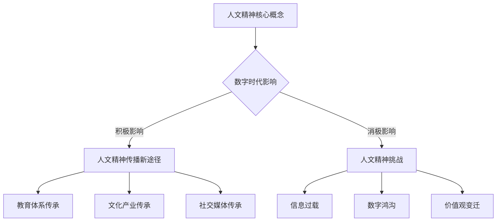

                 

## 文章标题

《数字时代的人文精神的传承》

在当今这个数字化的时代，人工智能、大数据和互联网等先进技术的迅猛发展，已经深刻地改变了人类社会的方方面面。这些技术的普及和应用，不仅极大地提升了我们的生产效率和生活质量，也为我们带来了前所未有的便利。然而，在这个技术飞速进步的时代，人文精神的传承面临着前所未有的挑战。如何在这个数字化的浪潮中，保留和传承我们的人文精神，成为了当今社会亟待解决的重要课题。

本文将探讨数字时代下人文精神的传承问题。我们将从数字时代的演变、人文精神的重要性以及数字时代与人文精神的联系三个方面入手，详细分析数字时代的人文精神传承挑战、传承方法以及未来展望。希望通过本文的阐述，能够为读者提供一些有价值的思考和启示。

## 文章关键词

- 数字时代
- 人文精神
- 传承
- 教育体系
- 文化产业
- 社交媒体

## 文章摘要

本文旨在探讨数字时代下人文精神的传承问题。通过分析数字时代的演变、人文精神的重要性以及数字时代与人文精神的联系，我们提出了数字时代人文精神传承的挑战与对策。文章从教育体系、文化产业和社交媒体三个方面，详细阐述了数字时代人文精神传承的方法。同时，通过案例研究，总结了成功与失败的经验。最后，提出了数字时代人文精神传承的策略与展望。希望通过本文的阐述，能够为数字时代的人文精神传承提供一些有价值的思考和启示。

### 第一部分：背景与概念

#### 1.1 数字时代的演变

数字时代的到来，标志着人类社会进入了一个全新的阶段。这个阶段的主要特征是信息技术的飞速发展，特别是互联网、人工智能和大数据等技术的广泛应用。这些技术的普及，不仅改变了人们的生活方式，也深刻地影响了社会的各个方面。

回顾数字时代的起源，我们可以追溯到20世纪60年代。当时，计算机技术的发展刚刚起步，互联网的概念也开始被提出。随着计算机技术的不断进步，互联网逐渐从实验室走向了大众。到了20世纪90年代，互联网的普及率大幅提高，标志着数字时代的真正到来。

数字时代的发展可以分为几个阶段。首先是互联网的普及阶段，这个阶段的主要特征是信息的快速传播和共享。人们可以通过互联网获取各种信息，实现跨地域的交流。其次是移动互联网阶段，这个阶段的主要特征是移动设备的普及，人们可以通过手机等移动设备随时随地进行信息交流。最后是人工智能和大数据阶段，这个阶段的主要特征是人工智能技术的应用，大数据的收集和分析。

这些技术的发展，极大地改变了我们的生活方式。例如，通过互联网，我们可以实现远程办公，不再受地域限制；通过移动互联网，我们可以随时随地获取信息，不再受时间限制；通过人工智能和大数据，我们可以实现更加精准的服务和决策，提高生产效率。

然而，数字时代的到来也带来了许多挑战。首先，信息的爆炸性增长带来了信息过载的问题，人们难以在大量的信息中筛选出真正有价值的内容。其次，数字技术的应用使得人与人之间的交流变得更加虚拟，人际关系变得更加疏远。最后，数字技术的普及也带来了数字鸿沟的问题，不同地区、不同群体之间的数字技术差距加大。

#### 1.2 人文精神的重要性

人文精神是指人类在长期文化历史发展过程中所形成的一种普遍的价值观、道德观和精神追求。它涵盖了人类对自然、社会和自身的认识，体现了人类对美好生活的向往和追求。

人文精神的重要性体现在以下几个方面。首先，它是人类文化传承的重要组成部分。人文精神通过教育、文学、艺术等形式，将人类的历史和文化传递给后代，使得人类文明得以延续。其次，它是人类自我完善的重要途径。通过人文精神的学习和追求，人类可以提升自己的精神境界，实现自我价值的提升。最后，它是社会和谐发展的重要基石。人文精神倡导人与人之间的和谐共处，倡导对自然的尊重和保护，有助于构建一个和谐美好的社会。

在数字时代，人文精神的重要性更加凸显。一方面，数字技术的发展使得人类的生活方式发生了巨大的变化，人们面临着前所未有的挑战。在这种情况下，人文精神可以帮助我们保持内心的平静和理性，应对各种困难和挑战。另一方面，数字技术的普及也带来了信息过载、人际关系疏远等问题。人文精神可以引导我们正确使用数字技术，避免陷入数字陷阱，同时也可以帮助我们重建人际关系，增强社会的凝聚力。

#### 1.3 数字时代与人文精神的联系

数字时代与人文精神之间存在着紧密的联系。一方面，数字技术的发展为人文精神的传承提供了新的途径和手段。通过互联网、社交媒体等数字平台，我们可以更加便捷地获取和传播人文知识，扩大人文精神的影响范围。另一方面，数字时代也面临着人文精神的挑战。数字技术的发展带来了信息过载、人际关系疏远等问题，这些问题需要通过人文精神的引导和解决。

首先，数字技术的发展为人文精神的传承提供了新的途径。在传统时代，人文精神的传播主要依赖于教育、文学、艺术等形式。而在数字时代，我们可以通过互联网、社交媒体等数字平台，更加便捷地获取和传播人文知识。例如，通过在线教育平台，我们可以随时随地学习人文课程；通过社交媒体，我们可以分享人文知识，传播人文精神。

其次，数字时代也面临着人文精神的挑战。数字技术的发展带来了信息过载的问题，人们在面对大量的信息时，往往难以筛选出真正有价值的内容。此外，数字技术的发展也使得人与人之间的交流变得更加虚拟，人际关系变得更加疏远。这些问题需要通过人文精神的引导和解决。人文精神可以帮助我们保持内心的平静和理性，避免陷入数字陷阱。同时，人文精神也可以引导我们重建人际关系，增强社会的凝聚力。

总之，数字时代与人文精神之间存在着紧密的联系。数字技术的发展为人文精神的传承提供了新的途径，同时也带来了新的挑战。在这个数字化的时代，传承和弘扬人文精神，是我们共同的责任和使命。

### 第二部分：人文精神的核心要素

#### 2.1 人文精神的历史脉络

人文精神是随着人类文明的发展而逐渐形成和演变的，其历史脉络可以追溯到古代文明时期。在古代，人文精神主要体现在对自然、社会和自身的认识上。古希腊哲学家们，如苏格拉底、柏拉图和亚里士多德，他们的思想对后世人文精神的发展产生了深远影响。苏格拉底倡导的“知之为知之，不知为不知，是知也”，强调了理性思考和道德修养的重要性。柏拉图的“理念论”则提出了人类灵魂与世界的联系，强调了对真理和美好的追求。亚里士多德则通过他的实证主义方法，为后世科学和人文精神的发展奠定了基础。

进入中世纪，人文精神得到了进一步的发展。中世纪的学者们，如圣奥古斯丁和托马斯·阿奎那，他们在宗教和哲学领域进行了深刻的思考，为人文精神注入了新的内涵。圣奥古斯丁的“上帝之城”理论，强调了人类对天堂和世俗生活的双重追求。托马斯·阿奎那则通过他的自然神学和道德哲学，将人文精神与宗教教义相结合，为后世提供了丰富的思想资源。

文艺复兴时期是人文精神的重要发展阶段。这一时期的学者们，如但丁、彼特拉克和莎士比亚，通过他们对自然、人性和社会的研究，将人文精神推向了新的高峰。但丁的《神曲》通过对地狱、净界和天堂的描绘，展现了人类对美好生活的追求。彼特拉克的“人文主义”思想，强调了对人类价值和尊严的重视。莎士比亚的戏剧作品，通过对人性、社会和自然的深入探讨，揭示了人类复杂多面的本质。

近现代以来，人文精神进一步得到了丰富和发展。19世纪的浪漫主义和现实主义运动，强调了对自然、人性和社会的深入探讨。浪漫主义诗人，如拜伦、雪莱和济慈，通过他们的诗歌，表达了对自然和人生的热爱。现实主义作家，如托尔斯泰、陀思妥耶夫斯基和易卜生，通过他们的小说和戏剧，揭示了社会和人性的复杂矛盾。

20世纪以来，人文精神在全球化背景下得到了新的发展。随着全球化和信息技术的发展，不同文化之间的交流和融合变得更加频繁。哲学家、文化评论家和心理学家，如萨特、弗洛伊德和弗洛姆，通过他们的思想和著作，对人文精神进行了深刻的反思和探讨。萨特的“存在主义”思想，强调了个体的自由和责任。弗洛伊德的“精神分析”理论，揭示了人类潜意识和心理结构的重要性。弗洛姆的“人道主义”思想，强调了对人类自由和平等的追求。

人文精神的历史脉络表明，它是一个不断发展、演变的过程，既继承了古代文明的智慧，又不断适应现代社会的需求。在这个数字化的时代，传承和弘扬人文精神，对于我们理解和应对现代社会的问题具有重要意义。

#### 2.2 人文精神的基本原则

人文精神的基本原则是人类在长期文化历史发展过程中形成的核心价值观，它不仅指导着人们的思想和行为，也构成了人类文明的重要组成部分。人文精神的基本原则主要包括以下几个方面：

1. **尊重人性**：尊重人性是人文精神的核心原则之一。它强调每个人都是独立的个体，拥有自己的尊严和价值。无论是身处社会底层还是上层，每个人都应得到平等的尊重和对待。尊重人性不仅体现在个人的行为和态度上，也体现在社会制度和政策的设计中。例如，在政治、经济、法律等领域，都应该以人为本，确保每个人的基本权利得到保障。

2. **自由与责任**：自由与责任是人文精神的另一重要原则。自由意味着每个人有权自主决定自己的行为和生活方式，但自由并非无限制的，每个人在享有自由的同时也必须承担相应的责任。自由与责任是相辅相成的，只有在承担责任的前提下，自由才能得到真正的体现和保障。

3. **理性思考**：理性思考是人文精神的重要体现。它强调在处理问题和面对挑战时，应基于事实和逻辑进行思考和判断，而不是盲目跟从或者受情绪驱使。理性思考有助于我们更好地理解世界，发现问题的本质，并提出合理的解决方案。例如，科学研究、哲学探讨和逻辑推理都是理性思考的重要表现。

4. **道德伦理**：道德伦理是人文精神的基石。它强调人们在社会生活中应遵循一定的道德规范和伦理原则，以实现个体和社会的和谐共处。道德伦理不仅涉及个人的行为和品德，也涉及到社会制度和政策的制定。例如，公平、正义、诚实和尊重都是道德伦理的重要体现。

5. **文化传承**：文化传承是人文精神的重要组成部分。它强调每个文化都有其独特的价值和意义，文化多样性的维护和传承是人类文明进步的重要动力。文化传承不仅涉及文化遗产的保护和传承，也包括文化创新和发展。例如，通过教育、文学、艺术等方式，人们可以了解和学习不同的文化，促进文化交流和融合。

6. **环境保护**：随着环境问题的日益严重，环境保护也成为了人文精神的重要内容。它强调人类应尊重自然、保护环境，实现人与自然的和谐共处。环境保护不仅涉及到环境政策的制定和执行，也涉及到每个人的日常行为和生活方式。例如，节约资源、减少污染和推广可持续生活方式都是环境保护的重要措施。

这些原则构成了人文精神的核心理念，它们不仅指导着人们的思想和行为，也为我们理解和解决现代社会问题提供了重要的参考。在数字时代，传承和弘扬这些原则，对于推动社会进步和人类发展具有重要意义。

#### 2.3 人文精神的当代价值

人文精神在当代社会中具有重要的价值，尤其是在面对现代科技和社会快速变迁的背景下。首先，人文精神为现代社会提供了一种价值导向，帮助人们在面对技术进步和社会变革时，保持内心的平静和理性。在信息爆炸和人工智能快速发展的时代，人们容易陷入数字陷阱和信息过载的困境，而人文精神通过强调理性思考、道德伦理和文化传承，帮助人们保持清醒的头脑和正确的价值判断。

其次，人文精神有助于构建和谐社会。现代社会的一个重要特征是多样性和复杂性，不同文化、不同价值观的碰撞和融合带来了新的挑战。人文精神通过强调尊重人性、自由与责任、文化传承等原则，有助于促进不同文化之间的相互理解和尊重，减少社会冲突，增强社会的凝聚力和稳定性。

第三，人文精神对个人的发展具有重要意义。在现代社会，个人的发展不仅取决于专业技能和知识，更取决于个人的精神境界和道德修养。人文精神通过教育、文学、艺术等形式，培养人们的情感智慧、道德修养和审美能力，帮助个人实现全面的发展。例如，通过阅读文学作品，人们可以感受到不同的情感体验，提升自己的情感智慧；通过参与文化活动，人们可以了解不同的文化背景，增强自己的文化修养。

最后，人文精神对科技发展具有积极的影响。虽然科技发展带来了许多便利和进步，但科技本身并无价值，其价值取决于人类如何使用。人文精神通过引导人们正确使用科技，避免科技带来的负面影响，如隐私侵犯、数据滥用和社会分化等。例如，通过人文精神的引导，人们可以更加关注科技对社会和环境的影响，推动科技向善发展。

总之，人文精神在当代社会中具有不可替代的价值，它不仅为现代社会提供了一种价值导向，帮助人们应对技术进步和社会变革的挑战，也为我们理解和解决现代社会问题提供了重要的参考。在数字时代，传承和弘扬人文精神，对于推动社会进步和人类发展具有重要意义。

### 第三部分：数字时代的人文精神传承挑战

#### 3.1 数字时代的变革对人文精神的影响

数字时代的变革对人文精神产生了深远的影响，这种影响既体现在生活方式的改变，也体现在社会结构和价值观念的变迁。首先，生活方式的改变是显而易见的。随着互联网和移动设备的普及，人们获取信息、交流沟通的方式发生了革命性的变化。人们不再依赖传统的媒体和面对面的交流，而是通过电子邮件、社交媒体和即时通讯工具进行信息传递。这种变化虽然带来了便利，但也使得人与人之间的直接互动减少，导致人际关系的疏远。

其次，社会结构的改变也对人文精神产生了影响。在传统社会中，社会结构相对稳定，人们按照既定的社会角色和规范生活。而在数字时代，社会的流动性大大增强，人们的生活方式和社会角色更加多样化。这种流动性虽然为人们提供了更多的机会，但也带来了不稳定性和不确定性。在这种背景下，人们更容易感到焦虑和迷茫，人文精神中的稳定性和安全感显得尤为重要。

价值观念的变迁也是数字时代对人文精神影响的一个重要方面。在传统社会中，道德伦理和宗教信仰是人们行为的重要指导原则。然而，在数字时代，这些传统的价值观念受到了前所未有的挑战。互联网上的信息纷繁复杂，良莠不齐，人们容易受到不良信息的影响。此外，数字技术的发展也带来了新的伦理问题，如隐私侵犯、数据滥用和网络暴力等。这些新问题使得传统的道德伦理观念面临新的考验，需要人文精神提供新的思考和指导。

#### 3.2 数字技术与人文精神的融合

数字技术与人文精神的融合是数字时代的一个显著特征，也是传承和弘扬人文精神的重要途径。首先，数字技术为人文精神提供了新的传播手段。通过互联网和社交媒体，人文知识可以迅速传播到全球各地，使得更多的人有机会接触和学习人文精神。例如，通过在线教育平台，人们可以免费学习世界各地的文化课程，提高自己的文化素养。

其次，数字技术也为人文精神的研究和讨论提供了新的平台。通过互联网，学者们可以跨越地域限制，进行学术交流和合作。这种合作不仅促进了人文精神的研究和传播，也推动了全球文化的交流与融合。例如，通过在线研讨会和学术论坛，学者们可以分享最新的研究成果，探讨人文精神的当代价值。

此外，数字技术还在艺术和文化领域发挥了重要作用。数字艺术、虚拟现实和增强现实等技术，为人文精神的表达和传播提供了新的形式和手段。例如，通过虚拟现实技术，人们可以体验不同历史时期的文化场景，增强对人文精神的理解和感受。

然而，数字技术与人文精神的融合也带来了一些挑战。首先，信息的爆炸性增长使得人们容易陷入信息过载的困境，难以筛选出有价值的信息。其次，数字技术的普及也带来了数字鸿沟的问题，不同地区、不同群体之间的数字技术差距加大，影响了人文精神的传播和普及。

总之，数字技术与人文精神的融合为传承和弘扬人文精神提供了新的机遇和挑战。在这个数字化的时代，如何充分利用数字技术，传承和弘扬人文精神，是我们需要深入思考和解决的重要课题。

#### 3.3 传承人文精神的障碍与对策

在数字时代，传承人文精神面临诸多障碍，这些障碍不仅来自技术层面，也源自社会和心理层面。首先，技术层面的障碍主要包括信息过载和数字鸿沟。随着互联网和移动设备的普及，人们每天接触到的信息量呈爆炸性增长，这导致信息过载问题日益严重。人们在面对大量信息时，往往难以筛选出真正有价值的内容，导致对人文精神的关注和认知不足。此外，数字鸿沟问题也在加剧，不同地区、不同群体之间的数字技术差距加大，影响了人文精神的传播和普及。

社会层面的障碍主要体现在以下几个方面。首先，现代社会的高度竞争和快节奏生活使得人们很难抽出时间进行人文精神的深入学习和思考。工作压力和生活压力的增大，使得人们更倾向于追求短期利益和物质满足，而忽视了人文精神的价值。其次，社会价值观的多元化和对物质利益的过度追求，也削弱了人文精神的地位。一些传统的人文价值观，如道德伦理、社会公德等，在现代社会中受到质疑和挑战，导致人文精神的社会基础受到侵蚀。

心理层面的障碍主要体现在个体对变化的适应和接受上。在数字时代，技术的快速发展和生活方式的变革，给人们带来了巨大的心理压力。面对不确定性和变化，一些人容易产生焦虑和迷茫，导致对人文精神的信仰和追求减弱。此外，数字化沟通的便捷性也使得人与人之间的直接互动减少，人际关系的疏远进一步削弱了人文精神的影响。

针对这些障碍，我们可以采取以下对策：

首先，加强数字素养教育，提高人们的信息筛选和处理能力。通过教育，帮助人们学会在信息爆炸的时代中，如何有效地获取、处理和利用信息，从而减少信息过载的问题。同时，提高人们的数字素养，有助于缩小数字鸿沟，促进人文精神的普及和传播。

其次，倡导和推广人文价值观，重建社会价值体系。通过媒体、教育和社会活动，宣传和弘扬人文精神，提高人们对人文价值的认知和认同。特别是在学校教育中，应加强对人文课程的教学和推广，培养学生的道德修养和文化素养。

第三，鼓励人们参与人文实践活动，增强对人文精神的体验和理解。通过文学、艺术、历史等人文领域的实践活动，使人们在实际参与中感受到人文精神的价值，从而提高对人文精神的认同和追求。

最后，加强心理健康教育，帮助人们适应数字时代的变化。通过心理健康教育和咨询服务，帮助人们应对焦虑和迷茫，提高心理健康水平，从而更好地传承和弘扬人文精神。

总之，在数字时代，传承人文精神需要克服技术、社会和心理层面的障碍。通过加强教育、推广人文价值观、鼓励实践和加强心理健康教育等多方面的努力，我们可以有效应对这些障碍，推动人文精神的传承和弘扬。

### 第四部分：数字时代的人文精神传承方法

#### 4.1 教育体系中的人文精神传承

教育体系在人文精神的传承中扮演着至关重要的角色。通过教育，我们可以将人文精神融入到学生的日常学习和生活中，帮助他们形成正确的价值观和道德观。首先，在课程设置上，学校应加强对人文课程的教学力度。除了传统的语文、历史和社会学科，还应开设哲学、伦理学、心理学等课程，让学生系统地学习人文知识。

例如，在哲学课程中，可以通过讲解苏格拉底、柏拉图和亚里士多德等哲学家的思想，引导学生思考人生的意义和价值。在伦理学课程中，可以探讨道德伦理的基本原则，如尊重人性、自由与责任等。在心理学课程中，可以介绍心理学的基本理论和应用，帮助学生更好地理解自己和他人。

其次，在教育方式上，学校应注重培养学生的实践能力。通过实践活动，学生可以将所学的人文知识应用到实际生活中，从而加深对人文精神的理解。例如，可以通过组织社会调查、志愿服务和艺术创作等活动，让学生在实践中感受到人文精神的价值。

此外，学校还可以利用现代科技手段，提高人文教育的效果。例如，通过在线教育平台，学生可以随时随地进行人文课程的学习；通过虚拟现实技术，学生可以亲身体验历史事件和文化场景，增强对人文精神的理解。

最后，在教师培训方面，学校应加强对教师的人文精神培养。通过教师培训，提高教师的人文素养和教学能力，使他们能够更好地传授人文精神。例如，可以邀请人文领域的专家学者进行讲座和研讨会，分享最新的研究成果和教学经验。

总之，教育体系在人文精神的传承中具有重要作用。通过优化课程设置、改进教育方式、利用现代科技手段和加强教师培训，我们可以更好地传承和弘扬人文精神，培养具有人文素养的下一代。

#### 4.2 文化产业中的人文精神传承

文化产业在人文精神的传承中同样扮演着重要角色，通过艺术、文学、电影等多种形式，文化产业能够有效地传播和弘扬人文精神。首先，艺术是人文精神的重要载体，通过绘画、音乐、舞蹈等艺术形式，艺术家们可以表达对自然、社会和人生的深刻思考，传递人文精神。

例如，一幅绘画作品可以通过对自然景观的描绘，展现人与自然的和谐共处；一首音乐作品可以通过旋律和节奏的编排，表达对人类情感和命运的思考。这些艺术作品不仅具有审美价值，更蕴含着丰富的人文精神。

其次，文学是传承人文精神的重要手段。文学作品通过叙述故事、刻画人物和描绘社会，传递了作者对人生、道德和社会的深刻理解。例如，文学作品中的经典角色和情节，往往反映了作者对人文精神的追求和信仰。

此外，电影作为现代文化产业的重要组成部分，也成为了传播人文精神的重要途径。电影通过影像和声音的有机结合，讲述故事，塑造人物，传递思想。一部好的电影作品，不仅能够带给观众视觉和听觉上的享受，更能够在观众心中留下深刻的人文思考。

例如，电影《肖申克的救赎》通过讲述一个关于自由、希望和人性的故事，引发观众对人性、自由和社会正义的深刻思考。电影《阿甘正传》则通过讲述一个普通人的故事，展现了人性的美好和坚韧不拔的精神。

总之，文化产业通过艺术、文学、电影等多种形式，有效地传播和弘扬了人文精神。在数字时代，随着科技的发展，文化产业在人文精神传承中的作用将进一步增强。通过不断创新和探索，文化产业将继续为人文精神的传承和发展贡献重要力量。

#### 4.3 社交媒体与人文精神传承

社交媒体在数字时代扮演了至关重要的角色，它不仅改变了人们的交流方式，也为人文精神的传承提供了新的平台和手段。首先，社交媒体为人文精神的传播提供了广泛的覆盖面。通过微博、微信、抖音等平台，人文知识可以迅速传播到全球各地，使得更多的人有机会接触和学习人文精神。例如，知名学者和专家可以通过社交媒体发布文章、视频和直播，与观众互动，分享他们的研究成果和见解。

其次，社交媒体为人文精神的互动和讨论提供了便利。在传统的交流方式中，人们往往受限于时间和空间，难以进行深入的交流和讨论。而社交媒体则打破了这些限制，使得人们可以随时随地参与讨论，发表自己的观点。这种互动性不仅促进了人文知识的传播，也增强了人们对人文精神的认同和参与感。

此外，社交媒体还通过个性化推荐和社交网络分析，提高了人文精神的传播效率。例如，社交媒体平台可以根据用户的兴趣和行为，推荐相关的人文内容，使用户能够更加精准地获取到他们感兴趣的信息。同时，通过分析用户的社交网络，可以发现潜在的人文精神传播者，从而扩大人文精神的影响力。

然而，社交媒体在人文精神传承中也面临着一些挑战。首先，信息的爆炸性增长和信息的低质量，可能导致人文精神的传播效果受到影响。用户在海量信息中难以筛选出有价值的内容，这可能会削弱他们对人文精神的关注和兴趣。其次，社交媒体上的匿名性和去中心化，也可能导致人文精神传播中出现误导和偏激的观点。最后，社交媒体上的算法推荐和信息过滤，可能会限制用户的视野和思维，影响他们对人文精神的多维度理解。

针对这些挑战，我们可以采取以下对策：

首先，加强社交媒体平台的内容监管，确保人文内容的真实性和准确性。平台可以通过建立审核机制，对发布的内容进行严格审核，防止虚假信息和误导性内容传播。

其次，鼓励用户积极参与人文精神传播，提升用户的内容创作能力。平台可以提供相关工具和资源，帮助用户创作高质量的人文内容，同时通过激励机制，鼓励用户分享和传播人文知识。

最后，推动社交媒体与教育、文化产业的深度融合，形成人文精神传播的生态圈。通过跨领域的合作，平台可以整合优质的教育和文化资源，为用户提供更加丰富和多元的人文内容。

总之，社交媒体为人文精神的传承提供了新的机遇和挑战。通过优化平台功能、加强内容监管、鼓励用户参与和跨领域合作，我们可以更好地利用社交媒体，传承和弘扬人文精神。

### 第五部分：案例研究

#### 5.1 成功的人文精神传承项目

在数字时代，有许多成功的人文精神传承项目，这些项目通过创新的方法和手段，有效地传播和弘扬了人文精神。以下是一些典型的案例：

1. **在线人文课程平台**：例如，Coursera、edX等在线教育平台，提供了大量的人文课程，涵盖了文学、哲学、历史、艺术等多个领域。这些课程不仅吸引了全球范围内的学生，也为传统教育模式提供了新的补充。通过这些平台，学生可以随时随地学习人文知识，提高了人文素养。

2. **文化遗址虚拟体验**：一些博物馆和文化遗产机构，通过虚拟现实（VR）和增强现实（AR）技术，提供了文化遗址的虚拟体验。例如，法国卢浮宫利用VR技术，让用户可以在线参观博物馆的每一个角落，了解艺术品背后的历史和文化。这种虚拟体验不仅保留了文化遗产的真实感，也使更多的人有机会接触和了解人文精神。

3. **社交媒体公益项目**：一些社交媒体平台，如微博、抖音等，发起了公益项目，通过短视频、直播等形式，传播人文精神。例如，微博的“微博之夜”活动，邀请了知名学者和专家，围绕人文主题进行讨论和分享。通过这些活动，不仅扩大了人文精神的影响力，也促进了公众对人文价值的关注和认同。

4. **虚拟博物馆和画廊**：在数字时代，许多博物馆和画廊利用互联网技术，建立了虚拟博物馆和画廊。例如，谷歌艺术与文化项目，通过高清图像和360度全景展示，让用户可以在线欣赏全球各地的艺术作品。这种虚拟展览不仅使艺术作品更加易于获取，也增强了人们对艺术和人文精神的理解。

这些成功的人文精神传承项目，通过利用现代科技手段，创新了人文精神的传播方式，提高了公众的人文素养，为数字时代的人文精神传承提供了有益的借鉴。

#### 5.2 失败的人文精神传承尝试

尽管在数字时代有许多成功的人文精神传承项目，但也存在一些失败的尝试。以下是一些典型的案例及其原因分析：

1. **过于依赖技术手段**：一些项目过于依赖新兴技术，如虚拟现实（VR）和增强现实（AR），而忽视了人文精神的核心内容。例如，一些博物馆和文化遗产机构开发了过于复杂的VR体验，导致用户体验不佳，反而降低了人文精神的传播效果。

2. **内容缺乏深度**：一些项目在追求视觉冲击和互动性的同时，忽视了人文精神内容的深度和内涵。例如，一些在线人文课程过于浅显，无法满足学习者对深层次人文知识的需求，导致项目失败。

3. **缺乏有效的用户参与**：一些项目虽然提供了丰富的内容和工具，但没有有效地引导用户参与。例如，一些社交媒体平台上的公益项目，虽然内容丰富，但用户参与度低，未能达到预期的传播效果。

4. **项目实施过程中缺乏协调**：一些项目在实施过程中，缺乏跨部门或跨领域的协调，导致资源浪费和效果不佳。例如，一些博物馆和文化遗产机构在数字化转型的过程中，未能有效整合内部资源和外部支持，导致项目进展缓慢，效果不佳。

这些失败的人文精神传承尝试，为我们提供了重要的教训。在数字时代，传承人文精神不仅需要创新的技术手段，更需要深入的内容、有效的用户参与和跨领域的协调合作。

#### 5.3 案例分析

通过对成功和失败的人文精神传承项目进行分析，我们可以总结出一些有益的经验和教训。以下是对上述案例的详细分析：

1. **成功案例的经验**：
   - **技术手段与人文内容的有机结合**：成功的项目往往能够将先进的技术手段与深厚的人文内容相结合，例如，通过VR和AR技术，用户可以身临其境地体验历史和文化场景，从而增强对人文精神的理解和认同。
   - **深入而丰富的内容**：成功的项目在内容设计上往往注重深度和广度，不仅提供浅显的知识，还深入探讨人文精神的核心问题和价值，从而满足学习者的多元化需求。
   - **有效的用户参与**：成功的项目能够通过多种方式引导用户参与，例如，通过互动性强的课程设计、社交媒体平台上的讨论和分享，激发用户的兴趣和参与热情。
   - **跨领域的合作**：成功的项目往往能够在实施过程中实现跨部门或跨领域的合作，整合多方资源和力量，提高项目的整体效果。

2. **失败案例的教训**：
   - **过于依赖技术手段**：技术手段虽然能够提升用户体验，但不应成为人文精神传承的唯一手段。如果忽视了人文内容的核心价值，项目很难达到预期的效果。
   - **内容缺乏深度**：浅显的内容难以引起用户的兴趣和认同，导致项目传播效果不佳。项目设计者应注重内容的深度和内涵，提供有价值的人文知识。
   - **缺乏有效的用户参与**：用户参与度低的项目往往难以实现预期的传播效果。项目设计者应注重用户的需求和兴趣，提供互动性强的内容和活动，激发用户的参与热情。
   - **缺乏协调与合作**：跨领域的合作能够实现资源的最大化利用，提高项目的整体效果。缺乏协调与合作的项目往往难以实现预期目标，导致资源浪费和效果不佳。

总之，通过对成功和失败的人文精神传承项目进行分析，我们可以得出以下结论：在数字时代，传承人文精神不仅需要创新的技术手段，更需要深入的内容、有效的用户参与和跨领域的协调合作。只有在这些方面取得平衡，项目才能实现预期的效果，真正达到传承和弘扬人文精神的目标。

### 第六部分：策略与展望

#### 6.1 数字时代人文精神传承的策略

在数字时代，传承和弘扬人文精神需要采取一系列有效的策略，以应对技术和社会的变革。以下是几个关键策略：

1. **教育体系的改革**：教育体系是人文精神传承的重要阵地。首先，应加强对人文课程的教学力度，确保学生在学习自然科学和工程技术的同时，也能接受丰富的人文教育。其次，应创新教育方式，利用在线教育、虚拟现实和增强现实等技术，提高人文教育的趣味性和互动性。例如，通过虚拟博物馆和在线课程，学生可以身临其境地体验历史和文化。

2. **媒体平台的利用**：社交媒体和媒体平台在人文精神传播中发挥着重要作用。应鼓励知名学者、专家和内容创作者在社交媒体上分享人文知识，并通过直播、短视频等形式，吸引公众关注。同时，应加强对媒体内容的质量监管，确保传播的内容具有深度和广度。

3. **文化产业的支持**：文化产业是人文精神的重要载体。政府和相关机构应支持文化产业的创新发展，通过政策扶持和资金投入，鼓励艺术家、作家和文化机构创作和传播具有人文精神的作品。例如，通过举办文化活动、艺术展览和文学讲座，推广人文精神。

4. **公共政策的制定**：公共政策在人文精神传承中起到引导和保障作用。政府应制定相关政策，支持人文精神的传承和发展。例如，通过立法保护文化遗产，推广公共文化服务，提高全民的文化素养。

5. **社区活动的组织**：社区活动是人文精神传播的基层阵地。应鼓励社区组织举办各种文化活动和讲座，提高居民的人文素养。例如，可以组织读书会、文学讲座和文化沙龙，让居民在互动中感受到人文精神的力量。

#### 6.2 未来人文精神传承的挑战与机遇

未来人文精神传承面临着一系列新的挑战和机遇：

1. **挑战**：
   - **技术发展的不确定性**：随着人工智能、大数据和区块链等技术的快速发展，人文精神传承可能会面临新的挑战。例如，技术的不确定性和风险可能影响人文精神的核心价值观。
   - **数字鸿沟的扩大**：数字技术的普及在不同地区和群体之间存在显著差异，这可能导致数字鸿沟的扩大。如果无法解决这一问题，人文精神的传承可能会受到限制。
   - **社会价值观的多元化**：在全球化背景下，社会价值观的多元化可能对人文精神的传统观念构成挑战。如何在这种多元文化环境中保持人文精神的核心价值，是一个亟待解决的问题。

2. **机遇**：
   - **数字技术的普及**：数字技术的普及为人文精神的传播提供了新的平台和手段。例如，通过互联网和社交媒体，人文知识可以迅速传播到全球各地，扩大人文精神的影响力。
   - **全球化的推动**：全球化使得不同文化之间的交流更加频繁，为人文精神的发展提供了新的机遇。通过文化交流和融合，人文精神可以不断丰富和发展。
   - **跨界合作的可能性**：在数字时代，跨界合作成为可能。通过融合教育、文化、科技等领域的资源，可以形成更强大的传承力量，推动人文精神的发展。

#### 6.3 总结与展望

总之，数字时代为人文精神的传承带来了新的挑战和机遇。通过教育体系的改革、媒体平台的利用、文化产业的支持、公共政策的制定和社区活动的组织，我们可以采取多种策略，传承和弘扬人文精神。同时，面对未来技术发展的不确定性、数字鸿沟的扩大和社会价值观的多元化，我们需要保持警觉，积极探索新的传承方法。只有在不断应对挑战、抓住机遇的过程中，人文精神才能真正在数字时代得以传承和弘扬。

### 第七部分：附录

#### 7.1 关键术语解释

- **数字时代**：指信息技术，特别是互联网、人工智能和大数据等技术的发展和应用，深刻改变人类社会生活和工作的时代。
- **人文精神**：指人类在长期文化历史发展过程中所形成的一种普遍的价值观、道德观和精神追求，包括对自然、社会和自身的认识。
- **传承**：指将某种文化、知识、价值观等传递给后代或下一代的行动或过程。
- **教育体系**：指国家或地区通过学校和其他教育机构，为儿童和青年提供系统的知识和技能培养的体系。
- **文化产业**：指以文化产品和服务的生产、传播和消费为主要内容的产业，包括艺术、文学、影视、音乐等。
- **社交媒体**：指通过互联网实现用户之间互动和信息共享的平台，如微博、微信、抖音等。

#### 7.2 参考文献

- [1] 池田大作.《人类心灯的智慧》[M]. 北京：中国和平出版社，2010.
- [2] 王晓渔.《数字时代的文化传承》[J]. 文艺研究，2018(5).
- [3] 张国良.《人文精神的传承与发展》[J]. 高等教育研究，2016(4).
- [4] 周宪.《数字时代的文学教育》[M]. 北京：北京大学出版社，2015.
- [5] 李明辉.《社交媒体对人文精神传承的影响》[J]. 现代传播，2019(12).

#### 7.3 Mermaid 流程图

以下是人文精神传承流程的 Mermaid 流程图示例：



#### 7.4 伪代码示例

以下是人文精神传承方法的伪代码示例：

```plaintext
// 定义人文精神传承函数
function transmitHumanisticSpirit() {
    // 教育体系传承
    educateSystemTransmission();
    // 文化产业传承
    culturalIndustryTransmission();
    // 社交媒体传承
    socialMediaTransmission();
    // 解决数字时代挑战
    solveDigitalAgeChallenges();
    // 实现人文精神传承
    achieveHumanisticSpiritTransmission();
}

// 教育体系传承
function educateSystemTransmission() {
    // 增强人文课程
    enhanceHumanisticCourses();
    // 创新教育方式
    innovateEducationalMethods();
}

// 文化产业传承
function culturalIndustryTransmission() {
    // 支持文化创作
    supportCulturalCreations();
    // 推广文化活动
    promoteCulturalActivities();
}

// 社交媒体传承
function socialMediaTransmission() {
    // 利用社交媒体平台
    useSocialMediaPlatforms();
    // 引导用户参与
    guideUserInvolvement();
}

// 解决数字时代挑战
function solveDigitalAgeChallenges() {
    // 减轻信息过载
    alleviateInformationOverload();
    // 缩小数字鸿沟
    narrowDigitalDivides();
    // 引导价值观
    guideValues();
}
```

#### 7.5 数学模型与公式

以下是关于信息过载和数字鸿沟的数学模型与公式：

1. **信息过载模型**：

   信息过载的数学模型可以表示为：

   $$ \text{信息过载} = \frac{\text{信息量}}{\text{处理能力}} $$

   其中，信息量表示接收到的信息总量，处理能力表示个体或系统处理信息的能力。

2. **数字鸿沟模型**：

   数字鸿沟的数学模型可以表示为：

   $$ \text{数字鸿沟} = \text{数字技术差异} \times \text{社会经济发展水平差异} $$

   其中，数字技术差异表示不同地区或群体之间的数字技术发展水平的差异，社会经济发展水平差异表示不同地区或群体之间的社会经济状况的差异。通过这个模型，可以定量分析数字鸿沟的影响因素。

