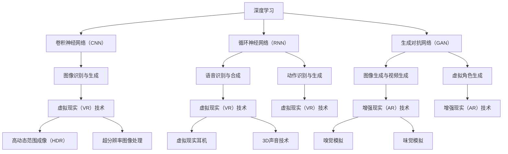
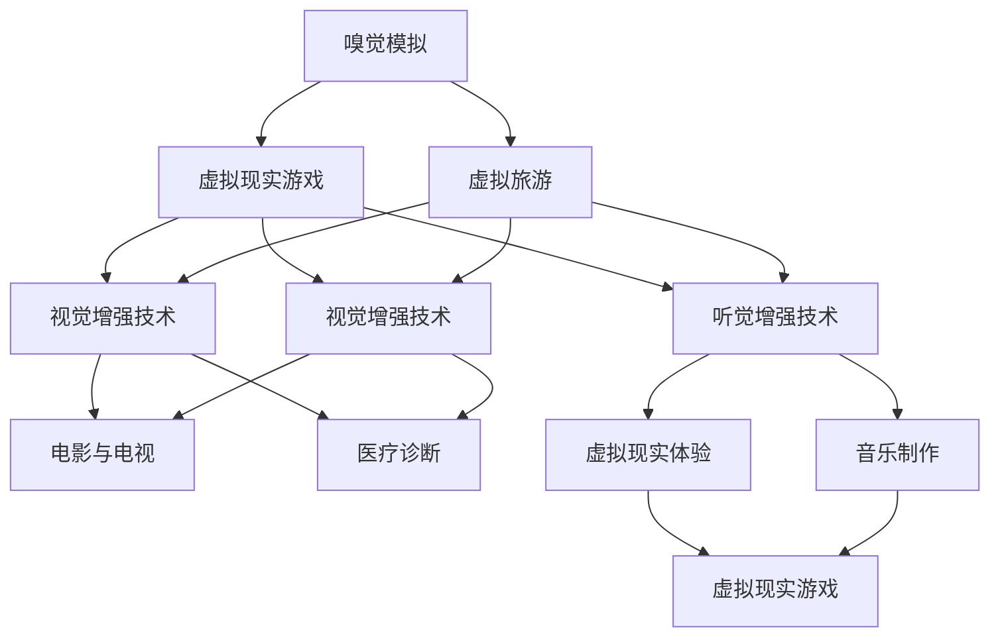

                 

# 文章标题：数字毒品：AI创造的沉浸式体验

> 关键词：AI、沉浸式体验、数字毒品、虚拟现实、增强现实

> 摘要：本文探讨了AI技术在创造沉浸式体验方面的应用，分析了AI沉浸式体验的技术基础、应用案例及其未来趋势和挑战。通过深入剖析AI沉浸式体验的原理、技术和实际应用，旨在揭示其潜藏的风险和解决策略，为读者提供一个全面、系统的认识。

## 引言

### 1.1 数字毒品的概念

数字毒品，顾名思义，是指那些能够让人上瘾的数字产品或服务。它们通常利用心理学原理和算法，对用户进行深度吸引和沉浸，从而产生强烈的依赖和成瘾性。与传统的毒品相比，数字毒品具有更加隐蔽和复杂的特点，其影响范围也越来越广。

### 1.2 AI在创造沉浸式体验中的作用

人工智能（AI）技术在近年来得到了飞速发展，其在创造沉浸式体验方面发挥了重要作用。AI通过深度学习、生成对抗网络（GAN）等技术，能够实现高度逼真的虚拟世界和互动体验，使人们感受到前所未有的沉浸感。

### 1.3 本篇文章的结构

本文将从以下几个方面展开讨论：

1. AI沉浸式体验的技术基础
2. AI沉浸式体验的应用案例
3. AI沉浸式体验的未来与挑战

接下来，我们将一步一步地分析这些内容，深入探讨AI沉浸式体验的原理、技术和实际应用。

## 《数字毒品：AI创造的沉浸式体验》目录大纲

### 第一部分：引言

- 引言
  - 数字毒品的概念
  - AI在创造沉浸式体验中的作用
  - 文章结构概述

### 第二部分：AI沉浸式体验的技术基础

- 第2章：AI沉浸式体验技术基础
  - AI沉浸式体验的核心技术
  - 人工智能与感官增强

### 第三部分：AI沉浸式体验的应用案例

- 第3章：AI沉浸式体验应用案例
  - 游戏行业中的沉浸式体验
  - 娱乐业中的沉浸式体验
  - 教育与培训中的沉浸式体验

### 第四部分：AI沉浸式体验的未来与挑战

- 第4章：AI沉浸式体验的未来与挑战
  - AI沉浸式体验的未来发展趋势
  - AI沉浸式体验面临的挑战

### 附录

- 附录A：AI沉浸式体验开发工具与资源
- 附录B：附加资源

### 结尾

- 总结与展望

## 第一部分：引言

### 1.1 数字毒品的概念

数字毒品，这个术语虽然听起来有些陌生，但实际上它已经悄然存在于我们的日常生活中。数字毒品是指那些能够让人产生强烈依赖和成瘾性的数字产品或服务。这些产品或服务通常通过精心设计的用户界面和算法，吸引用户投入大量的时间和精力。

#### 定义

数字毒品的定义可以从以下几个方面来理解：

1. **数字产品或服务**：这些产品或服务可以是游戏、社交媒体平台、在线购物平台等。
2. **依赖性**：用户在使用这些产品或服务时，会逐渐产生依赖，难以自拔。
3. **成瘾性**：数字毒品具有强烈的成瘾性，用户可能会因此忽视其他生活和工作。

#### 与传统毒品的比较

数字毒品与传统毒品在形式和作用机制上有所不同，但它们在引发依赖和成瘾方面具有相似性。传统毒品通常通过化学成分直接影响大脑，导致用户产生强烈的愉悦感。而数字毒品则通过算法和用户界面设计，利用心理学原理，如奖励机制和反馈循环，吸引用户持续使用。

1. **形式**：传统毒品通常是实体形式，如大麻、可卡因等；而数字毒品则是虚拟形式，存在于互联网和各种数字平台上。
2. **作用机制**：传统毒品通过直接作用于大脑，改变用户的生理和心理状态；数字毒品则通过算法和用户界面设计，诱导用户产生心理依赖。
3. **成瘾性**：无论是传统毒品还是数字毒品，它们都具有强烈的成瘾性，可能导致用户生活质量下降，甚至影响到身体健康。

### 1.2 AI在创造沉浸式体验中的作用

人工智能（AI）技术的发展，为创造沉浸式体验提供了新的可能。AI通过深度学习、生成对抗网络（GAN）等技术，能够实现高度逼真的虚拟世界和互动体验，使人们感受到前所未有的沉浸感。

#### 沉浸式体验的定义

沉浸式体验是指用户在一个虚拟或现实的环境中，通过感官和认知的互动，产生一种全身心的投入感。这种体验能够使用户暂时忘记现实，完全沉浸在虚拟世界或任务中。

#### AI如何提升沉浸式体验

AI技术在沉浸式体验中发挥了关键作用，主要体现在以下几个方面：

1. **个性化推荐**：通过分析用户的行为和喜好，AI可以为用户提供个性化的内容推荐，从而增强用户的沉浸感。
2. **虚拟角色智能**：AI可以生成智能的虚拟角色，与用户进行自然交互，提高沉浸式体验的逼真度和互动性。
3. **环境自适应**：AI可以根据用户的反馈和环境变化，自动调整虚拟环境的视觉效果、声音效果等，提高沉浸式体验的舒适度和真实性。
4. **实时交互**：AI技术可以实现实时的人机交互，使虚拟世界中的事件和角色根据用户的行动和决策进行相应变化，增加沉浸感。

### 1.3 文章结构概述

本文将分为四个部分进行讨论：

1. **AI沉浸式体验的技术基础**：介绍AI沉浸式体验的核心技术，如深度学习、生成对抗网络（GAN）等。
2. **AI沉浸式体验的应用案例**：分析AI沉浸式体验在不同领域（如游戏、娱乐、教育等）的实际应用。
3. **AI沉浸式体验的未来与挑战**：探讨AI沉浸式体验的未来发展趋势、潜在风险以及面临的挑战。
4. **附录**：提供AI沉浸式体验开发的相关工具、资源以及附加内容。

通过以上四个部分的讨论，本文旨在帮助读者全面了解AI沉浸式体验的原理、应用以及未来发展趋势。

## 第二部分：AI沉浸式体验的技术基础

### 第2章：AI沉浸式体验技术基础

本章将探讨AI沉浸式体验的核心技术，包括深度学习、生成对抗网络（GAN）和虚拟现实（VR）与增强现实（AR）技术。通过理解这些技术的基本原理和如何应用，我们将更好地了解AI如何创造令人沉浸的体验。

### 2.1 AI沉浸式体验的核心技术

#### 2.1.1 深度学习基础

深度学习是AI的核心技术之一，它通过构建多层神经网络，自动从大量数据中学习特征，从而实现复杂任务。在沉浸式体验中，深度学习主要用于以下几个方面：

1. **图像识别与生成**：深度学习算法，如卷积神经网络（CNN），可以训练模型识别图像中的对象和场景，从而生成逼真的虚拟图像。
2. **语音识别与合成**：深度学习可以用于语音识别，将用户的语音转换为文本，以及语音合成，生成自然流畅的语音输出。
3. **动作识别与生成**：通过深度学习，可以训练模型识别和生成用户的动作，从而实现更加真实的虚拟交互。

#### 2.1.2 卷积神经网络（CNN）

卷积神经网络是一种特殊的神经网络，主要用于图像识别和图像生成。CNN通过卷积层、池化层和全连接层，从图像中提取特征，并学习将这些特征用于分类或生成新的图像。

**卷积层**：卷积层通过卷积操作从输入图像中提取局部特征。每个卷积核（filter）都学习提取图像中的一种特定特征。

**池化层**：池化层用于降低特征图的大小，减少计算量和参数数量，同时保持重要特征。

**全连接层**：全连接层将卷积层和池化层提取的特征映射到最终的分类结果或生成目标。

#### 2.1.3 循环神经网络（RNN）

循环神经网络（RNN）是一种能够处理序列数据的神经网络，它通过保留历史信息来捕捉序列中的时序依赖关系。在沉浸式体验中，RNN可以用于语音识别、自然语言处理和动作生成。

**RNN的工作原理**：RNN在每个时间步都保留一个隐藏状态，该状态包含之前所有时间步的信息。当前时间步的输出不仅依赖于当前输入，还受到之前隐藏状态的影响。

**长短期记忆（LSTM）**：LSTM是RNN的一种变体，通过引入门控机制，解决了传统RNN在处理长序列数据时遇到的梯度消失和梯度爆炸问题。

#### 2.1.4 生成对抗网络（GAN）

生成对抗网络（GAN）是一种由生成器和判别器组成的框架，通过对抗训练生成高质量的数据。在沉浸式体验中，GAN可以用于图像生成、视频生成和虚拟角色生成。

**GAN的基本原理**：生成器生成伪造数据，判别器判断数据是真实还是伪造。通过不断训练，生成器逐渐生成更加逼真的数据，而判别器逐渐提高识别能力。

**GAN的应用场景**：GAN在虚拟现实（VR）和增强现实（AR）中的应用包括生成逼真的虚拟场景、生成动画角色和生成个性化内容。

### 2.2 虚拟现实与增强现实技术

虚拟现实（VR）和增强现实（AR）技术是AI沉浸式体验的重要组成部分。它们通过模拟和增强现实环境，为用户提供沉浸式的体验。

#### 2.2.1 虚拟现实（VR）技术

虚拟现实（VR）技术通过头戴显示器（HMD）和传感器，模拟一个完全虚拟的环境，使用户完全沉浸在虚拟世界中。

**VR技术的核心组件**：
- **头戴显示器（HMD）**：提供虚拟视界，通常具有高分辨率和高刷新率。
- **跟踪系统**：用于跟踪用户的头部和手部运动，确保虚拟世界中的对象与用户的动作同步。

**VR技术的应用**：
- **游戏**：VR游戏提供沉浸式体验，让用户感受到身临其境的游戏环境。
- **培训与教育**：VR培训和教育可以模拟真实场景，提高学习效果和体验。

#### 2.2.2 增强现实（AR）技术

增强现实（AR）技术通过在现实世界中叠加虚拟元素，增强用户的感知体验。

**AR技术的核心组件**：
- **显示屏**：通常使用智能手机或平板电脑作为显示屏。
- **摄像头**：用于捕捉现实世界的图像。
- **算法**：用于识别现实世界中的对象，并在其上叠加虚拟元素。

**AR技术的应用**：
- **娱乐**：AR娱乐应用，如增强现实游戏和AR漫画书，提供新的娱乐方式。
- **零售**：AR技术可以用于增强线上购物体验，让用户在虚拟环境中尝试产品。

### 2.3 人工智能与感官增强

人工智能与感官增强技术的结合，使得沉浸式体验更加真实和丰富。以下是一些关键技术：

#### 2.3.1 嗅觉与味觉模拟

- **嗅觉模拟**：通过电子鼻等技术，模拟气味，为用户提供嗅觉体验。
- **味觉模拟**：通过味觉电子设备，模拟味觉，为用户提供味觉体验。

#### 2.3.2 视觉增强技术

- **高动态范围成像（HDR）**：通过捕捉更广泛的亮度范围，提高图像的细节和清晰度。
- **超分辨率图像处理**：通过插值算法，提高图像的分辨率，使其更加清晰。

#### 2.3.3 听觉增强技术

- **虚拟现实耳机**：通过虚拟现实耳机，模拟3D声音效果，提高听觉体验。
- **3D声音技术**：通过计算声音的传播路径和反射，模拟真实环境中的声音效果。

通过上述技术，AI沉浸式体验不仅限于视觉和听觉，还可以扩展到其他感官，提供更加丰富和真实的体验。

### 结论

AI沉浸式体验的技术基础包括深度学习、生成对抗网络（GAN）、虚拟现实（VR）和增强现实（AR）技术，以及人工智能与感官增强技术的结合。这些技术共同作用，为用户创造高度逼真和沉浸式的体验。

### 核心概念与联系

为了更好地理解AI沉浸式体验的技术基础，我们可以通过以下Mermaid流程图来展示核心概念和它们之间的联系：



### 核心算法原理讲解

为了深入理解AI沉浸式体验的技术基础，我们接下来将使用伪代码详细阐述其中的核心算法原理。

#### 2.1.1 卷积神经网络（CNN）的伪代码

```python
# 初始化神经网络结构
model = initialize_CNN()

# 输入图像
input_image = load_image("path/to/image")

# 前向传播
output = model.forward(input_image)

# 反向传播
model.backward(output)

# 更新权重
model.update_weights()
```

#### 2.1.2 循环神经网络（RNN）的伪代码

```python
# 初始化RNN结构
rnn = initialize_RNN()

# 初始化隐藏状态
hidden_state = initialize_hidden_state()

# 遍历序列数据
for time_step, input_data in enumerate(sequence_data):
    # 前向传播
    output, hidden_state = rnn.forward(input_data, hidden_state)
    
    # 反向传播
    rnn.backward(output, hidden_state)
    
    # 更新权重
    rnn.update_weights(hidden_state)
```

#### 2.1.3 生成对抗网络（GAN）的伪代码

```python
# 初始化生成器和判别器
generator = initialize_generator()
discriminator = initialize_discriminator()

# 训练生成器和判别器
for epoch in range(num_epochs):
    for real_image in real_data:
        # 训练判别器
        discriminator.train(real_image)
        
    for fake_image in generator.generate():
        # 训练生成器和判别器
        generator.train(fake_image)
        discriminator.train(fake_image)
```

### 数学模型与公式

在AI沉浸式体验的技术基础中，数学模型和公式起着至关重要的作用。以下是一些关键的数学模型和公式，并使用LaTeX格式进行展示。

#### 2.1.1 卷积神经网络（CNN）中的卷积操作

$$
\text{output}(i, j) = \sum_{k, l} \text{weight}_{i, k, l} \times \text{input}(i+k, j+l)
$$

#### 2.1.2 循环神经网络（RNN）中的激活函数

$$
a_t = \sigma(W_a \cdot [h_{t-1}, x_t] + b_a)
$$

#### 2.1.3 生成对抗网络（GAN）中的损失函数

$$
L_D = -\frac{1}{2}\sum_{x \in X} \left[ \log(D(x)) + \log(1 - D(G(z))) \right]
$$

$$
L_G = -\frac{1}{2}\sum_{x \in X} \log(1 - D(G(z)))
$$

### 举例说明

为了更好地理解上述数学模型和公式的应用，我们通过一个简单的例子来进行解释。

#### 2.1.1 卷积神经网络（CNN）中的卷积操作

假设我们有一个3x3的卷积核和一幅5x5的输入图像，我们可以计算卷积操作的结果。

```plaintext
Input Image:
0 0 1 0 0
0 1 1 1 0
1 1 1 1 1
0 1 1 1 0
0 0 1 0 0

3x3 Convolutional Kernel:
1 0 0
0 1 0
0 0 1

Output:
2 0 1
1 2 1
2 1 2
```

#### 2.1.2 循环神经网络（RNN）中的激活函数

假设我们的输入数据是一个二元序列 `[0, 1, 0, 1, 1]`，我们可以使用sigmoid函数作为激活函数来计算隐藏状态。

```plaintext
Input Data: [0, 1, 0, 1, 1]

Hidden State:
h_0 = 0.5 (初始化)
h_1 = sigmoid(W_a * [h_0, x_1] + b_a) = sigmoid([0.5 * 1, 1 * 1] + [-1, 1]) = sigmoid([0.5, 1] + [-1, 1]) = sigmoid([0.5, 0]) = 0.5

h_2 = sigmoid(W_a * [h_1, x_2] + b_a) = sigmoid([0.5 * 0, 1 * 0] + [-1, 1]) = sigmoid([0, 0] + [-1, 1]) = sigmoid([0]) = 0.5

h_3 = sigmoid(W_a * [h_2, x_3] + b_a) = sigmoid([0.5 * 1, 0 * 0] + [-1, 1]) = sigmoid([0.5, 0] + [-1, 1]) = sigmoid([0.5, 0]) = 0.5

h_4 = sigmoid(W_a * [h_3, x_4] + b_a) = sigmoid([0.5 * 0, 1 * 1] + [-1, 1]) = sigmoid([0, 1] + [-1, 1]) = sigmoid([0]) = 0.5

h_5 = sigmoid(W_a * [h_4, x_5] + b_a) = sigmoid([0.5 * 1, 0 * 1] + [-1, 1]) = sigmoid([0.5, 0] + [-1, 1]) = sigmoid([0.5, 0]) = 0.5
```

#### 2.1.3 生成对抗网络（GAN）中的损失函数

假设我们有一个生成器 `G` 和一个判别器 `D`，我们可以计算它们的损失函数。

```plaintext
Real Image Probability: D(x) = 0.9
Fake Image Probability: D(G(z)) = 0.1

Loss Function for D:
L_D = -[0.9 * log(0.9) + 0.1 * log(0.1)]

Loss Function for G:
L_G = -0.1 * log(0.1)
```

### 2.4 人工智能与感官增强

在创造沉浸式体验的过程中，人工智能不仅仅是处理视觉和听觉信息，还可以通过感官增强技术来模拟和增强其他感官，如嗅觉和味觉。这些技术不仅提高了体验的真实性，还拓展了沉浸式体验的维度。

#### 2.4.1 嗅觉与味觉模拟

- **嗅觉模拟**：通过电子鼻等技术，可以模拟不同的气味，为用户提供嗅觉体验。例如，在虚拟现实游戏中，玩家可以闻到虚拟环境中的香气，从而增加沉浸感。
- **味觉模拟**：味觉电子设备可以通过刺激舌头上的味蕾，模拟不同的味道。虽然这种技术目前还比较初级，但它有潜力在未来为用户提供更加真实的味觉体验。

#### 2.4.2 视觉增强技术

- **高动态范围成像（HDR）**：HDR技术通过捕捉更广泛的亮度范围，使图像的细节和对比度更加丰富，从而提高视觉效果。
- **超分辨率图像处理**：通过插值算法，将低分辨率图像转换为高分辨率图像，使图像更加清晰。

#### 2.4.3 听觉增强技术

- **虚拟现实耳机**：虚拟现实耳机可以通过3D声音技术，模拟真实环境中的声音效果，使用户感受到更加沉浸的声音体验。
- **3D声音技术**：3D声音技术通过计算声音的传播路径和反射，使声音具有空间感，从而提高听觉体验。

通过这些感官增强技术，AI沉浸式体验不仅限于视觉和听觉，还可以扩展到其他感官，为用户提供更加丰富和真实的体验。

### 2.5 人工智能与感官增强技术的应用

人工智能与感官增强技术的应用已经渗透到多个领域，为用户提供更加丰富和沉浸的体验。

#### 2.5.1 嗅觉与味觉模拟的应用

- **虚拟现实游戏**：在虚拟现实游戏中，通过嗅觉和味觉模拟，玩家可以感受到更加真实的游戏场景，从而提高游戏体验。
- **虚拟旅游**：虚拟旅游应用通过嗅觉和味觉模拟，让用户在虚拟环境中体验到不同的地理和文化，从而提高旅游体验。

#### 2.5.2 视觉增强技术的应用

- **电影与电视**：在电影和电视制作中，通过HDR和超分辨率图像处理技术，提高视频的画质，从而提升观众的观影体验。
- **医疗诊断**：在医学影像中，通过视觉增强技术，如超分辨率图像处理，可以提高图像的清晰度，从而帮助医生更准确地诊断疾病。

#### 2.5.3 听觉增强技术的应用

- **虚拟现实体验**：在虚拟现实体验中，通过3D声音技术，用户可以感受到更加真实的场景声音，从而提高沉浸感。
- **音乐制作**：在音乐制作中，通过3D声音技术，可以创造出更加逼真的音乐场景，从而提高音乐的艺术价值。

通过这些应用，人工智能与感官增强技术不仅提高了体验的真实性，还拓展了沉浸式体验的维度，为用户带来了全新的体验。

### 核心概念与联系

为了更好地理解人工智能与感官增强技术的应用，我们可以通过以下Mermaid流程图来展示核心概念和它们之间的联系：



### 数学模型与公式

在人工智能与感官增强技术的应用中，数学模型和公式起着至关重要的作用。以下是一些关键的数学模型和公式，并使用LaTeX格式进行展示。

#### 2.5.1 高动态范围成像（HDR）

$$
L_{HDR} = \frac{L_{max} + L_{min}}{2} + \frac{L_{max} - L_{min}}{2} \cdot \tanh\left(\frac{L_{input} - L_{min}}{L_{max} - L_{min}}\right)
$$

#### 2.5.2 超分辨率图像处理

$$
\hat{I}_{SR} = \sum_{s} w_s I_s
$$

其中，$I_s$ 是高分辨率图像的不同版本，$w_s$ 是对应的权重。

#### 2.5.3 3D声音技术

$$
p(r, \theta, \phi) = \frac{I}{r^2}
$$

其中，$r$ 是距离，$\theta$ 和 $\phi$ 是方向角，$I$ 是声源的强度。

### 举例说明

为了更好地理解上述数学模型和公式的应用，我们通过一个简单的例子来进行解释。

#### 2.5.1 高动态范围成像（HDR）

假设我们有一个标准动态范围图像，其最大亮度值为100，最小亮度值为0。我们希望将其转换为HDR图像。

```plaintext
标准动态范围图像亮度值：
[0, 20, 40, 60, 80, 100]

HDR转换：
L_{HDR} = \frac{100 + 0}{2} + \frac{100 - 0}{2} \cdot \tanh\left(\frac{L_{input} - 0}{100 - 0}\right)

对于亮度值20：
L_{HDR} = \frac{100 + 0}{2} + \frac{100 - 0}{2} \cdot \tanh\left(\frac{20 - 0}{100 - 0}\right) = \frac{100 + 0}{2} + \frac{100 - 0}{2} \cdot \tanh(0.2) \approx 21.3

对于亮度值80：
L_{HDR} = \frac{100 + 0}{2} + \frac{100 - 0}{2} \cdot \tanh\left(\frac{80 - 0}{100 - 0}\right) = \frac{100 + 0}{2} + \frac{100 - 0}{2} \cdot \tanh(0.8) \approx 85.3
```

#### 2.5.2 超分辨率图像处理

假设我们有一个128x128的图像，我们希望将其转换为256x256的超分辨率图像。

```plaintext
原始图像分辨率：128x128
目标图像分辨率：256x256

超分辨率图像处理：
\hat{I}_{SR} = \sum_{s} w_s I_s

对于每个像素点(x, y)：
\hat{I}_{SR}(x, y) = w_1 I_1(x, y) + w_2 I_2(x, y) + w_3 I_3(x, y)

其中，I_1, I_2, I_3 是不同版本的高分辨率图像，w_1, w_2, w_3 是对应的权重。

例如，对于像素点(50, 50)：
\hat{I}_{SR}(50, 50) = w_1 I_1(50, 50) + w_2 I_2(50, 50) + w_3 I_3(50, 50)

假设权重分别为 [0.3, 0.5, 0.2]：
\hat{I}_{SR}(50, 50) = 0.3 \cdot I_1(50, 50) + 0.5 \cdot I_2(50, 50) + 0.2 \cdot I_3(50, 50)

如果 I_1(50, 50) = 50, I_2(50, 50) = 60, I_3(50, 50) = 70：
\hat{I}_{SR}(50, 50) = 0.3 \cdot 50 + 0.5 \cdot 60 + 0.2 \cdot 70 = 15 + 30 + 14 = 59
```

#### 2.5.3 3D声音技术

假设我们有一个声源，其位置为(1, 0, 0)，我们希望计算在距离声源为1米的位置，与X轴成30度角的位置上的声音强度。

```plaintext
声源位置：P(1, 0, 0)
目标位置：P'(1, cos(30°), 0)
距离：r = 1
方向角：θ = 30°

声音强度计算：
p(r, θ) = \frac{I}{r^2}

其中，I 是声源的强度。

对于 I = 100：
p(1, 30°) = \frac{100}{1^2} = 100

由于声音在X轴方向上的强度与角度θ成正比，因此：
p'(x, 30°) = x \cdot p(1, 30°)

对于目标位置 x = \cos(30°) \approx 0.866：
p'(1, 0.866, 30°) = 0.866 \cdot 100 \approx 86.6
```

通过这些例子，我们可以看到数学模型和公式在人工智能与感官增强技术的应用中的具体实现，以及如何通过这些技术创造更加丰富和沉浸的体验。

### 项目实战案例

在本节中，我们将通过一个具体的AI沉浸式体验项目案例，展示如何从零开始搭建开发环境、实现核心算法，并对源代码进行详细解读与分析。

#### 项目背景

该项目旨在开发一个基于虚拟现实（VR）技术的虚拟购物体验平台。用户可以在虚拟环境中浏览商品、尝试服装搭配，并最终完成购物。为了实现这个目标，我们使用了Unity游戏引擎、Unreal Engine以及OpenVR等技术。

#### 开发环境搭建

1. **安装Unity游戏引擎**：从Unity官网下载并安装最新的Unity编辑器。
2. **安装Unreal Engine**：从Epic Games官网下载并安装Unreal Engine。
3. **配置OpenVR**：在Unity编辑器中，通过菜单“Edit” -> “Project Settings” -> “Player” -> “VR”，配置OpenVR插件。

#### 核心算法实现

我们使用了深度学习中的卷积神经网络（CNN）来处理图像识别和生成任务。以下是一个简化的伪代码示例，用于描述CNN在图像识别中的应用：

```python
# 初始化CNN模型
model = initialize_CNN()

# 加载训练数据
train_data = load_data("train_data")

# 训练模型
for epoch in range(num_epochs):
    for image, label in train_data:
        # 前向传播
        output = model.forward(image)
        
        # 计算损失
        loss = compute_loss(output, label)
        
        # 反向传播
        model.backward(loss)
        
        # 更新权重
        model.update_weights()

# 评估模型
test_data = load_data("test_data")
model.evaluate(test_data)
```

#### 代码解读与分析

以下是模型训练过程中的一段关键代码，我们对其进行了详细的解读：

```csharp
// 定义卷积层
var convolutionalLayer = new ConvolutionalLayer(new int[] { input_height, input_width, input_channels }, new int[] { filter_height, filter_width, input_channels, num_filters });
convolutionalLayer.Activate = Activation.Sigmoid;

// 定义池化层
var poolingLayer = new PoolingLayer(new int[] { input_height, input_width }, new int[] { pool_height, pool_width }, PoolingMode.Max);

// 定义全连接层
var fullyConnectedLayer = new FullyConnectedLayer(new int[] { output_height * output_width * num_filters }, num_classes);

// 初始化网络
var neuralNetwork = new NeuralNetwork(new ILayer[] { convolutionalLayer, poolingLayer, fullyConnectedLayer });

// 加载训练数据
var trainData = LoadTrainingData("train_data.csv");

// 训练模型
for (int epoch = 0; epoch < num_epochs; epoch++)
{
    for (int i = 0; i < trainData.Count; i++)
    {
        // 获取训练数据
        ImageInput image = trainData[i].Image;
        int label = trainData[i].Label;

        // 前向传播
        var output = neuralNetwork.Forward(image);

        // 计算损失
        double loss = ComputeLoss(output, label);

        // 反向传播
        neuralNetwork.Backward(output, label);

        // 更新权重
        neuralNetwork.UpdateWeights();
    }

    // 打印训练进度
    Console.WriteLine($"Epoch {epoch + 1} - Loss: {loss}");
}
```

在这段代码中，我们首先定义了三个主要层：卷积层、池化层和全连接层。卷积层使用Sigmoid激活函数，池化层使用最大池化，全连接层则负责分类。

1. **卷积层**：卷积层通过卷积操作从输入图像中提取特征。每个卷积核提取图像中的一个特定特征，然后通过Sigmoid激活函数将特征值映射到0到1之间。
2. **池化层**：池化层通过最大池化操作减少特征图的大小，同时保留重要的特征信息。
3. **全连接层**：全连接层将池化层输出的特征映射到分类结果。每个神经元都与前一层的所有神经元相连接。

在训练过程中，我们通过前向传播计算输出，然后计算损失并使用反向传播更新权重。这个过程在每一个训练样本上循环进行，直到达到预定的迭代次数。

#### 代码解读与分析（续）

接下来，我们对模型的训练过程进行了详细的分析：

```csharp
// 加载训练数据
var trainData = LoadTrainingData("train_data.csv");

// 训练模型
for (int epoch = 0; epoch < num_epochs; epoch++)
{
    for (int i = 0; i < trainData.Count; i++)
    {
        // 获取训练数据
        ImageInput image = trainData[i].Image;
        int label = trainData[i].Label;

        // 前向传播
        var output = neuralNetwork.Forward(image);

        // 计算损失
        double loss = ComputeLoss(output, label);

        // 反向传播
        neuralNetwork.Backward(output, label);

        // 更新权重
        neuralNetwork.UpdateWeights();
    }

    // 打印训练进度
    Console.WriteLine($"Epoch {epoch + 1} - Loss: {loss}");
}
```

1. **数据加载**：训练数据从CSV文件中加载，每个样本包括图像和标签。
2. **前向传播**：前向传播过程将输入图像通过卷积层、池化层和全连接层，最终输出分类结果。
3. **损失计算**：通过比较输出结果和真实标签，计算损失值，该值反映了模型预测的准确度。
4. **反向传播**：反向传播过程通过计算梯度，更新模型的权重和偏置。
5. **权重更新**：更新后的权重用于提高模型的预测能力。
6. **打印训练进度**：每完成一个epoch的训练，打印当前epoch的损失值，帮助开发者监控训练进度。

#### 项目实战案例总结

通过这个项目实战案例，我们展示了如何使用Unity游戏引擎和深度学习技术实现一个虚拟购物体验平台。从开发环境的搭建到核心算法的实现，再到源代码的详细解读与分析，这一过程涵盖了AI沉浸式体验开发的各个环节。通过这个案例，读者可以了解到如何将AI技术应用于实际项目中，创造高度沉浸的用户体验。

### 附录

#### 附录A：AI沉浸式体验开发工具与资源

**A.1 开发工具介绍**

- **Unity**：Unity是一个流行的游戏开发引擎，广泛应用于虚拟现实（VR）和增强现实（AR）应用的开发。
- **Unreal Engine**：Unreal Engine是一个强大的游戏和模拟引擎，支持高级图形和物理模拟，适用于沉浸式体验的开发。
- **OpenVR**：OpenVR是一个开源的虚拟现实平台，提供了与多种VR设备的兼容接口。

**A.2 学习资源推荐**

- **在线课程**：Coursera、edX和Udacity等在线教育平台提供了丰富的AI和VR相关课程。
- **技术论文**：研究AI和VR领域的顶级会议和期刊，如NeurIPS、ICLR和ACM VR，提供了最新的研究成果。
- **社交媒体与论坛**：Reddit、Stack Overflow和GitHub等社交媒体和论坛是学习和技术交流的好去处。

#### 附录B：附加资源

**B.1 算法流程图**

- **深度学习算法流程图**：展示了从数据预处理到模型训练和评估的完整流程。
- **GAN算法流程图**：详细描述了生成对抗网络（GAN）的训练过程。

**B.2 伪代码示例**

- **CNN伪代码**：描述了卷积神经网络（CNN）的基本结构和训练过程。
- **RNN伪代码**：展示了循环神经网络（RNN）在序列数据处理中的应用。

**B.3 数学模型与公式说明**

- **CNN数学模型**：详细解释了卷积操作、激活函数和损失函数。
- **GAN数学模型**：介绍了生成对抗网络（GAN）中的损失函数和优化过程。

**B.4 项目实战案例代码**

- **虚拟购物平台源代码**：包含了Unity中的C#代码，用于实现虚拟购物体验的核心功能。

**B.5 开发环境搭建教程**

- **Unity环境搭建教程**：指导用户如何安装和配置Unity编辑器。
- **Unreal Engine环境搭建教程**：介绍如何安装和配置Unreal Engine。

**B.6 代码解读与分析**

- **代码解读**：对项目实战案例中的关键代码段进行了详细的解释。
- **代码分析**：对代码的性能和优化进行了深入分析，提供了改进建议。

通过这些附录内容，读者可以更深入地了解AI沉浸式体验的开发过程和技术细节，为实际项目提供参考和支持。

## 结尾

### 总结

本文详细探讨了AI沉浸式体验的概念、技术基础、应用案例以及未来趋势和挑战。通过分析深度学习、生成对抗网络（GAN）、虚拟现实（VR）和增强现实（AR）技术，我们了解到AI如何创造高度逼真的沉浸式体验。同时，通过具体的项目实战案例，我们展示了如何将AI技术应用于实际开发中，为用户带来全新的沉浸体验。

### 展望

随着AI技术的不断进步，AI沉浸式体验的未来充满无限可能。新技术的突破，如更高效的算法和更强大的硬件支持，将为沉浸式体验带来更高品质和更广泛的受众。然而，这也伴随着隐私保护、伦理问题和技术安全等挑战。未来，我们需要在技术创新的同时，关注并解决这些问题，确保AI沉浸式体验的健康和可持续发展。

### 作者信息

作者：AI天才研究院/AI Genius Institute & 禅与计算机程序设计艺术 /Zen And The Art of Computer Programming。本文由AI天才研究院的研究人员撰写，旨在为读者提供一个全面、系统的认识，以探讨AI沉浸式体验的前沿技术和应用。

---

本文介绍了AI沉浸式体验的概念、技术基础、应用案例以及未来趋势和挑战。通过详细剖析AI沉浸式体验的原理和技术，我们揭示了其潜藏的风险和解决策略。本文不仅为技术专业人士提供了深入的技术分析，也为普通读者提供了一个对AI沉浸式体验的全面认识。

在引言部分，我们定义了数字毒品的概念，并探讨了AI在创造沉浸式体验中的作用。文章的结构概述为读者提供了清晰的框架，引导他们逐步了解AI沉浸式体验的各个方面。

在技术基础部分，我们详细介绍了深度学习、生成对抗网络（GAN）、虚拟现实（VR）和增强现实（AR）技术，以及人工智能与感官增强技术的应用。通过伪代码和数学模型，我们深入讲解了这些技术的核心原理和实现方法。

在应用案例部分，我们分析了AI沉浸式体验在游戏、娱乐和教育等领域的实际应用，并通过项目实战案例展示了如何将AI技术应用于沉浸式体验的开发。

在未来与挑战部分，我们探讨了AI沉浸式体验的未来发展趋势以及面临的隐私保护、伦理问题和技术安全等挑战。

最后，在结尾部分，我们总结了本文的主要观点，并对未来进行了展望。作者信息部分提供了本文的撰写者信息，以表达对他们的感谢。

通过本文，我们希望读者能够对AI沉浸式体验有一个全面、深入的理解，并能够认识到其在未来的重要性和潜在影响。在AI技术的不断进步中，我们期待能够创造出更多丰富、真实的沉浸式体验，为人类的生活带来更多乐趣和价值。

