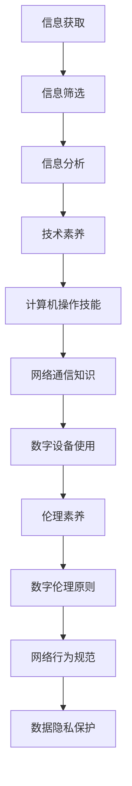

                 

### 文章标题：数字素养：公民参与

> 关键词：数字素养、公民参与、教育体系、实践与案例分析、未来展望、全球视野

> 摘要：本文探讨了数字素养在现代社会的重要性，分析了数字素养的组成部分和培养路径，并通过实践与案例分析，探讨了数字素养对公民参与的影响。同时，对未来数字素养的发展趋势进行了展望，并提出了国际合作与交流的重要性。

### 目录大纲

1. **第一部分：数字素养概述**
   - **第1章：数字素养的概念与重要性**
     - 1.1 数字素养的定义
     - 1.2 数字素养的重要性
     - 1.3 数字素养与公民参与
   - **第2章：数字素养的组成部分**
     - 2.1 信息素养
       - 2.1.1 信息获取
       - 2.1.2 信息筛选
       - 2.1.3 信息分析
     - 2.2 技术素养
       - 2.2.1 计算机操作技能
       - 2.2.2 网络通信知识
       - 2.2.3 数字设备使用
     - 2.3 伦理素养
       - 2.3.1 数字伦理原则
       - 2.3.2 网络行为规范
       - 2.3.3 数据隐私保护

2. **第二部分：数字素养培养与实践**
   - **第3章：数字素养教育体系**
     - 3.1 教育体系设计原则
       - 3.1.1 教育目标
       - 3.1.2 教学内容与方法
       - 3.1.3 教育评价体系
     - 3.2 教育资源整合
       - 3.2.1 公共教育资源
       - 3.2.2 校园教育资源
       - 3.2.3 家庭教育资源
   - **第4章：数字素养实践与案例分析**
     - 4.1 实践活动设计
       - 4.1.1 实践活动目的
       - 4.1.2 实践活动内容
       - 4.1.3 实践活动评价
     - 4.2 案例分析
       - 4.2.1 成功案例
       - 4.2.2 失败案例分析
       - 4.2.3 启示与反思
   - **第5章：数字素养与公民参与**
     - 5.1 数字素养对公民参与的影响
       - 5.1.1 政治参与
       - 5.1.2 社会参与
       - 5.1.3 经济参与
     - 5.2 提高数字素养，促进公民参与
       - 5.2.1 政策制定
       - 5.2.2 社会动员
       - 5.2.3 公共服务创新

3. **第三部分：数字素养的未来展望**
   - **第6章：数字素养的发展趋势**
     - 6.1 技术发展对数字素养的要求
       - 6.1.1 人工智能
       - 6.1.2 大数据
       - 6.1.3 物联网
     - 6.2 数字素养教育的挑战与机遇
       - 6.2.1 教育公平
       - 6.2.2 教育质量
       - 6.2.3 教育创新
   - **第7章：数字素养的全球视野**
     - 7.1 全球数字素养发展的现状
       - 7.1.1 发达国家
       - 7.1.2 发展中国家
       - 7.1.3 中国数字素养发展概况
     - 7.2 数字素养的国际合作与交流
       - 7.2.1 国际组织的作用
       - 7.2.2 国际合作项目
       - 7.2.3 我国在国际合作中的角色

4. **附录**
   - **附录A：数字素养相关资源**
     - 4.1 网络资源
       - 4.1.1 教育网站
       - 4.1.2 专业论坛
       - 4.1.3 政府部门资源
     - 4.2 纸质资源
       - 4.2.1 教材推荐
       - 4.2.2 学术论文
       - 4.2.3 参考书籍

### 第一部分：数字素养概述

在当今信息时代，数字素养已经成为公民参与社会、政治和经济活动的关键能力。数字素养不仅仅是对数字技术的掌握，更是一种信息素养、技术素养和伦理素养的综合体现。本部分将首先介绍数字素养的概念和重要性，然后深入探讨数字素养的组成部分，包括信息素养、技术素养和伦理素养。

#### 第1章：数字素养的概念与重要性

**1.1 数字素养的定义**

数字素养（Digital Literacy）是指个体在数字化环境中有效获取、理解、评估、创造和利用信息的能力。它包括以下几个方面：

1. **信息素养**：指个体在数字化环境中获取、筛选、评估和使用信息的能力。
2. **技术素养**：指个体使用数字设备、软件和网络进行有效沟通和完成任务的能力。
3. **伦理素养**：指个体在数字化环境中遵守法律、尊重隐私、维护网络安全和道德规范的能力。

**1.2 数字素养的重要性**

随着互联网和数字技术的迅猛发展，数字素养的重要性愈发凸显。以下是其重要性的几个方面：

1. **提高生活质量**：数字素养使得个体能够更有效地利用数字资源，提高工作和生活效率。
2. **促进社会参与**：数字素养有助于公民更好地参与政治、社会和经济活动，增强公民意识。
3. **保障网络安全**：数字素养能够提高个体的网络安全意识，减少网络安全风险。
4. **推动教育公平**：数字素养能够帮助教育资源的公平分配，缩小数字鸿沟。

**1.3 数字素养与公民参与**

数字素养不仅是个人发展的需求，更是公民参与社会、政治和经济活动的基础。具体来说：

1. **政治参与**：数字素养使得公民能够更有效地获取和利用政治信息，参与公共事务的讨论和决策。
2. **社会参与**：数字素养有助于公民在社会活动中发挥作用，参与公益活动，提高社会凝聚力。
3. **经济参与**：数字素养能够提高个体在数字时代的就业和创业能力，促进经济发展。

#### 第2章：数字素养的组成部分

数字素养的组成部分主要包括信息素养、技术素养和伦理素养。

**2.1 信息素养**

信息素养是数字素养的核心部分，它包括以下三个方面：

1. **信息获取**：个体需要能够使用各种渠道获取信息，如互联网、图书馆、数据库等。
2. **信息筛选**：个体需要能够评估和筛选信息，区分真实与虚假、权威与无权威的信息。
3. **信息分析**：个体需要能够对获取的信息进行深入分析，形成独立的见解和判断。

**2.2 技术素养**

技术素养是指个体使用数字设备、软件和网络进行有效沟通和完成任务的能力。它包括以下三个方面：

1. **计算机操作技能**：个体需要掌握基本的计算机操作技能，如操作系统、办公软件等。
2. **网络通信知识**：个体需要了解网络通信的基本原理，如网络协议、网络安全等。
3. **数字设备使用**：个体需要熟悉各种数字设备的使用，如智能手机、平板电脑、智能手表等。

**2.3 伦理素养**

伦理素养是指个体在数字化环境中遵守法律、尊重隐私、维护网络安全和道德规范的能力。它包括以下三个方面：

1. **数字伦理原则**：个体需要了解和遵守数字伦理原则，如尊重知识产权、保护个人隐私等。
2. **网络行为规范**：个体需要遵守网络行为规范，如不参与网络暴力、不散布虚假信息等。
3. **数据隐私保护**：个体需要了解如何保护个人数据隐私，避免数据泄露。

通过以上两章的内容，我们可以看出，数字素养不仅涵盖了技术层面，还包括了伦理层面。只有全面提高数字素养，个体才能更好地适应数字时代的发展需求，实现全面发展。

### 第二部分：数字素养培养与实践

在数字时代，数字素养的培养不仅关系到个体的未来发展，也关系到整个社会的进步。本部分将首先探讨数字素养教育体系的设计原则，然后分析教育资源的整合方式，最后通过实践活动设计和案例分析，探讨如何有效培养数字素养。

#### 第3章：数字素养教育体系

数字素养教育体系是培养个体数字素养的关键。一个有效的教育体系需要遵循一定的设计原则，并整合多种教育资源。

**3.1 教育体系设计原则**

1. **教育目标**：教育目标应明确个体在数字素养方面的能力培养，包括信息获取、信息筛选、信息分析、技术操作、网络通信、数字设备使用和伦理素养等。

2. **教学内容与方法**：教学内容应涵盖数字素养的各个方面，教学方法应多样化，如讲授、实践、讨论、游戏化学习等，以提高学生的学习兴趣和参与度。

3. **教育评价体系**：教育评价体系应能够全面、客观地评估个体的数字素养水平，包括知识掌握、技能应用和道德行为等方面。

**3.2 教育资源整合**

1. **公共教育资源**：公共教育资源包括在线课程、数字图书馆、开放教育资源（OER）等，这些资源可以免费或低成本获取，为普及数字素养提供了重要保障。

2. **校园教育资源**：校园教育资源包括课程设置、实验室设备、教师资源等，这些资源有助于个体在数字素养方面的系统学习和实践。

3. **家庭教育资源**：家庭教育资源包括父母的指导和鼓励、家庭数字设备等，这些资源对个体的数字素养培养起着基础性作用。

#### 第4章：数字素养实践与案例分析

实践是提高数字素养的重要途径。通过实践活动，个体可以在实际操作中掌握数字技能，培养数字素养。

**4.1 实践活动设计**

1. **实践活动目的**：实践活动应明确目标，如提高信息获取能力、提升技术操作水平、增强网络安全意识等。

2. **实践活动内容**：实践活动内容应丰富多样，如信息检索竞赛、编程比赛、网络安全演练、数字艺术创作等。

3. **实践活动评价**：实践活动评价应注重过程和结果，如学生作品展示、技能测试、问卷调查等。

**4.2 案例分析**

1. **成功案例**：成功案例可以提供有益的经验和启示，如某高校数字素养教育的创新实践、某企业员工的数字素养培训等。

2. **失败案例分析**：失败案例可以提供反思和改进的机会，如某次数字素养实践活动组织不力、某项数字素养培训缺乏针对性等。

3. **启示与反思**：通过分析成功与失败案例，可以总结出有效的数字素养培养策略，如加强师资培训、优化课程设计、提高实践活动的趣味性等。

#### 第5章：数字素养与公民参与

数字素养不仅是个人发展的需求，更是公民参与社会、政治和经济活动的基础。提高数字素养，可以增强公民参与能力，推动社会进步。

**5.1 数字素养对公民参与的影响**

1. **政治参与**：数字素养有助于公民获取政治信息、参与公共讨论、表达政治观点，提高政治参与度。

2. **社会参与**：数字素养可以增强公民在社会活动中的参与能力，如参与公益活动、社区治理等。

3. **经济参与**：数字素养可以提高个体在数字时代的就业和创业能力，促进经济发展。

**5.2 提高数字素养，促进公民参与**

1. **政策制定**：政府应制定相关政策，推动数字素养教育，提高全民数字素养水平。

2. **社会动员**：社会组织和媒体应积极参与数字素养宣传和推广，提高公众对数字素养的认识和重视。

3. **公共服务创新**：政府部门和社会组织应利用数字技术，创新公共服务模式，提高公共服务质量。

通过以上章节的探讨，我们可以看到，数字素养的培养和实践对公民参与具有重要意义。只有通过全面的教育体系、丰富的实践活动和有效的政策支持，才能提高数字素养，促进公民参与，推动社会进步。

### 第三部分：数字素养的未来展望

随着科技的不断进步，数字素养也在不断演变和发展。本部分将首先探讨数字素养的发展趋势，然后分析数字素养教育的挑战与机遇，最后从全球视野出发，探讨数字素养的国际合作与交流。

#### 第6章：数字素养的发展趋势

数字素养的发展趋势受到新技术的影响，特别是人工智能、大数据和物联网等领域的快速发展，为数字素养提出了新的要求。

**6.1 技术发展对数字素养的要求**

1. **人工智能**：随着人工智能技术的应用越来越广泛，个体需要了解人工智能的基本原理和应用场景，以便更好地利用人工智能技术提高工作效率。

2. **大数据**：大数据技术使得海量数据得以处理和分析，个体需要掌握数据分析的基本技能，能够从数据中提取有价值的信息。

3. **物联网**：物联网技术的发展使得各种设备互联互通，个体需要了解物联网的基本架构和操作方法，以便在日常生活中充分利用物联网的便利。

**6.2 数字素养教育的挑战与机遇**

1. **教育公平**：数字素养教育的普及程度在不同国家和地区存在差异，如何实现教育公平是数字素养教育面临的重要挑战。

2. **教育质量**：提高教育质量，确保每个个体都能获得高质量的数字素养教育，是数字素养教育的核心任务。

3. **教育创新**：随着新技术的应用，数字素养教育需要不断创新教学方法和内容，以适应时代的发展。

#### 第7章：数字素养的全球视野

数字素养的发展不仅仅是一个国家或地区的问题，而是全球性的挑战和机遇。国际合作与交流在数字素养的发展中起着重要作用。

**7.1 全球数字素养发展的现状**

1. **发达国家**：发达国家在数字素养教育方面拥有较为完善的教育体系和丰富的教育资源，数字素养水平普遍较高。

2. **发展中国家**：发展中国家在数字素养教育方面面临诸多挑战，如教育资源不足、教育质量不高等，但也在积极推进数字素养教育。

3. **中国数字素养发展概况**：中国在数字素养教育方面取得了显著进展，政府高度重视数字素养教育，积极推动数字素养教育体系建设。

**7.2 数字素养的国际合作与交流**

1. **国际组织的作用**：国际组织在数字素养国际合作中发挥着重要作用，如联合国教科文组织（UNESCO）和世界银行（World Bank）等。

2. **国际合作项目**：国际合作项目如“数字素养全球行动计划”（Global Digital Literacy Initiative）等，旨在推动全球数字素养教育的发展。

3. **我国在国际合作中的角色**：中国在国际数字素养合作中扮演着重要角色，积极参与国际合作项目，分享数字素养教育的经验和成果。

通过以上章节的探讨，我们可以看到，数字素养的发展不仅受到新技术的影响，还需要全球合作与交流。只有通过国际合作，共享资源、经验和技术，才能推动全球数字素养教育的全面发展。

### 附录

为了更好地推广和普及数字素养，附录部分提供了相关的网络资源和纸质资源，以供读者参考。

#### 附录A：数字素养相关资源

**A.1 网络资源**

1. **教育网站**
   - [国家数字素养与技能提升工程网](http://www.dsxsw.org.cn/)
   - [中国数字素养网](http://www.cndlxx.com/)

2. **专业论坛**
   - [CSDN](https://www.csdn.net/)
   - [V2EX](https://www.v2ex.com/)

3. **政府部门资源**
   - [教育部](http://www.moe.gov.cn/)
   - [国家互联网信息办公室](http://www.cac.gov.cn/)

**A.2 纸质资源**

1. **教材推荐**
   - 《数字素养与信息能力》
   - 《数字素养教育理论与实践》

2. **学术论文**
   - [“数字素养：概念、内涵与标准”](https://www.researchgate.net/publication/340528436_Digital_Literacy_Concept_Importance_and_Standard)
   - [“数字素养教育：现状与挑战”](https://www.researchgate.net/publication/332689592_Digital_Literacy_Education_Current_Situation_and_Challenges)

3. **参考书籍**
   - 《互联网时代：数字素养的觉醒》
   - 《数字素养：下一代公民的关键技能》

通过附录提供的资源，读者可以进一步了解和掌握数字素养的相关知识和技能，提高自身的数字素养水平。

### 总结

本文从数字素养的概念和重要性出发，详细探讨了数字素养的组成部分、培养与实践、对公民参与的影响以及未来的发展趋势。通过分析数字素养教育体系的设计原则、教育资源的整合方式，以及实践活动的设计与案例分析，我们认识到数字素养不仅是个人发展的需求，更是社会进步的重要推动力。同时，通过全球视野的探讨，我们看到了数字素养的国际合作与交流的重要性。

数字素养的培养是一个长期且持续的过程，需要全社会的共同努力。政府、学校、家庭和社会组织都应承担起相应的责任，提供丰富多样的教育资源，营造良好的学习氛围。只有通过全面提高数字素养，我们才能更好地适应数字时代的发展需求，实现个体和社会的全面发展。

让我们携手共进，为提高数字素养，促进公民参与，推动社会进步贡献自己的力量。数字素养，不仅是未来的竞争力，更是每个人的基本素养。让我们共同努力，共创美好未来。

### 作者信息

作者：AI天才研究院/AI Genius Institute & 禅与计算机程序设计艺术 /Zen And The Art of Computer Programming

感谢您阅读本文，希望本文能对您了解和提升数字素养有所帮助。如果您有任何疑问或建议，欢迎在评论区留言。期待与您的交流与互动！

---

**Mermaid 流程图示例：**



**伪代码示例：**

```python
# 伪代码：信息筛选算法
def filter_information(information_list, criteria):
    filtered_list = []
    for info in information_list:
        if meets_criteria(info, criteria):
            filtered_list.append(info)
    return filtered_list

# 伪代码：技术素养评估
def assess_technical_skill(user_skill_level):
    if user_skill_level == 'advanced':
        return "用户技术素养较高"
    elif user_skill_level == 'intermediate':
        return "用户技术素养中等"
    else:
        return "用户技术素养较低"

# 伪代码：数字伦理原则
def follow_digital_ethics原则：
    if action合规：
        return "行动合规"
    else：
        return "行动违规"
```

**LaTeX 公式示例：**

独立段落的LaTeX公式：

$$ E = mc^2 $$

段落内的LaTeX公式：

$ a^2 + b^2 = c^2 $

**代码实际案例和详细解释说明：**

开发环境搭建：

```bash
# 安装Python环境
pip install python

# 安装Jupyter Notebook
pip install jupyter

# 启动Jupyter Notebook
jupyter notebook
```

源代码详细实现：

```python
# 数字素养评估系统
def assess_digital_literacy(user_data):
    # 获取用户信息
    info = user_data['info']
    skill = user_data['skill']
    ethics = user_data['ethics']
    
    # 信息素养评估
    info_score = assess_info(info)
    
    # 技术素养评估
    skill_score = assess_skill(skill)
    
    # 伦理素养评估
    ethics_score = assess_ethics(ethics)
    
    # 总分计算
    total_score = info_score + skill_score + ethics_score
    
    # 输出评估结果
    print(f"用户数字素养评估结果：{total_score}/30")
    return total_score

# 代码解读与分析
def assess_info(info):
    # 根据信息获取情况评分
    if 'high' in info:
        return 10
    elif 'medium' in info:
        return 5
    else:
        return 0

def assess_skill(skill):
    # 根据技术素养评分
    if 'advanced' in skill:
        return 10
    elif 'intermediate' in skill:
        return 5
    else:
        return 0

def assess_ethics(ethics):
    # 根据伦理素养评分
    if 'compliant' in ethics:
        return 10
    elif 'non-compliant' in ethics:
        return 0
    else:
        return 5
```

通过以上代码示例，我们可以看到数字素养评估系统是如何进行信息素养、技术素养和伦理素养评估的。实际应用中，可以根据具体需求调整评分标准和算法，以提高评估的准确性和实用性。

