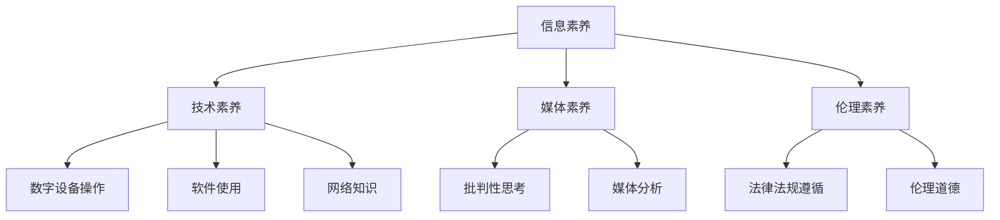

                 

# 文章标题: 《数字素养：公民参与的基石》

> 关键词：数字素养、公民参与、信息技术、网络安全、教育培养

> 摘要：本文从数字素养的多个维度出发，探讨了其在公民参与中的重要性。通过对数字素养的定义、基础知识和实际应用的深入分析，以及案例分析，本文旨在为读者提供一个全面理解数字素养的框架，并探讨其未来发展趋势，强调数字素养在提高公民参与度和促进社会进步中的基石作用。

### 目录

#### 第一部分：引言

## 1.1 书籍背景与目标

### 1.1.1 数字素养的概念

### 1.1.2 公民参与的重要性

### 1.1.3 书籍的结构与内容安排

## 1.2 数字素养的重要性

### 1.2.1 数字素养与日常生活

### 1.2.2 数字素养与职场发展

### 1.2.3 数字素养与公共参与

#### 第二部分：基础知识

## 2.1 计算机基础知识

### 2.1.1 计算机基本原理

### 2.1.2 计算机硬件与软件

### 2.1.3 操作系统与网络基础

## 2.2 因特网与数字资源

### 2.2.1 因特网的基本概念

### 2.2.2 搜索引擎与信息检索

### 2.2.3 电子邮件与即时通讯

## 2.3 信息安全与隐私保护

### 2.3.1 网络安全风险与防范

### 2.3.2 数据隐私保护策略

### 2.3.3 防火墙与加密技术

#### 第三部分：数字素养应用

## 3.1 社交媒体与网络社交

### 3.1.1 社交媒体的使用与影响

### 3.1.2 网络社交的道德与法律问题

### 3.1.3 社交媒体素养培养

## 3.2 数字公民参与

### 3.2.1 公共参与与数字技术

### 3.2.2 数字公民参与的方式与策略

### 3.2.3 数字公民参与的实际案例

## 3.3 数字素养教育与培养

### 3.3.1 数字素养教育的目标与内容

### 3.3.2 学校与家庭的角色

### 3.3.3 社会组织与数字素养教育

#### 第四部分：案例分析

## 4.1 数字素养在职场中的应用

### 4.1.1 职场数字素养的要求

### 4.1.2 案例分析：数字素养提升职场竞争力的实践

### 4.1.3 数字素养在职场的未来趋势

## 4.2 数字素养在公共管理中的应用

### 4.2.1 公共管理中的数字素养需求

### 4.2.2 案例分析：数字素养提升公共管理效率的实践

### 4.2.3 数字素养在公共管理中的未来方向

#### 第五部分：实践与展望

## 5.1 数字素养的自我评估

### 5.1.1 数字素养自我评估工具

### 5.1.2 自我提升策略与方法

### 5.1.3 数字素养在个人发展中的意义

## 5.2 数字素养的发展趋势

### 5.2.1 当前数字素养的发展现状

### 5.2.2 数字素养的未来趋势预测

### 5.2.3 数字素养发展的挑战与应对策略

## 5.3 结论

### 5.3.1 书籍总结与展望

### 5.3.2 数字素养对公民参与的影响

### 5.3.3 未来研究的方向与建议

#### 附录

## 附录 A：数字素养相关资源

### A.1 在线教育平台

### A.2 数字素养研究报告

### A.3 数字素养相关书籍与文章推荐

## 附录 B：案例研究资料

### B.1 职场数字素养案例

### B.2 公共管理数字素养案例

### B.3 数字素养教育实践案例

## 附录 C：数字素养测试题

### C.1 理论测试题

### C.2 实践测试题

### C.3 测试题答案与解析

### 《数字素养：公民参与的基石》

#### 引言

### 1.1 书籍背景与目标

在当今信息时代，数字素养已经成为公民参与社会、经济、政治等各个领域不可或缺的技能。数字素养不仅仅是一种技术能力，更是一种综合素质，它涵盖了信息获取、处理、传播、利用以及伦理道德等方面的内容。本书旨在深入探讨数字素养的概念、重要性以及其在公民参与中的作用，为读者提供一个系统、全面的理解框架。

### 1.1.1 数字素养的概念

数字素养可以定义为个人在数字环境中有效使用数字技术、理解和评价数字化信息、以及通过数字技术进行沟通和参与社会的能力。这包括了以下核心要素：

1. **信息素养**：指个体在互联网和数字环境中获取、评估、使用和创建信息的能力。
2. **技术素养**：指个体对数字设备、软件和网络的基本理解和操作能力。
3. **媒体素养**：指个体对媒体信息进行批判性思考和理解的能力。
4. **伦理素养**：指个体在数字环境中遵循法律法规和伦理规范的行为。

**Mermaid 流程图：数字素养核心要素**



### 1.1.2 公民参与的重要性

公民参与是现代社会治理的重要组成部分，它不仅仅体现在政治选举和公共事务的投票中，更广泛地涉及到社区建设、环境保护、公共服务等多个领域。数字素养作为公民参与的基础，其重要性体现在以下几个方面：

1. **提高公共事务的参与度**：具备数字素养的公民能够更有效地获取和利用信息，从而更积极地参与公共事务的讨论和决策。
2. **促进社会包容性**：数字素养有助于减少数字鸿沟，让更多群体享受数字化带来的便利和机会，提升社会整体的包容性。
3. **增强社会信任**：在数字环境中，公民能够更好地理解和评估信息来源，减少谣言和虚假信息的传播，增强社会信任。
4. **推动社会创新**：数字素养有助于培养创新思维，促进新技术和新模式的发展，推动社会进步。

### 1.1.3 书籍的结构与内容安排

本书分为五个部分，每个部分都有其独特的目标和内容：

- **第一部分：引言**：介绍数字素养的概念和重要性，为后续内容奠定基础。
- **第二部分：基础知识**：详细讲解计算机、网络、信息安全等基础知识，为数字素养的培养提供技术支持。
- **第三部分：数字素养应用**：探讨数字素养在社交媒体、公民参与和数字教育等领域的实际应用。
- **第四部分：案例分析**：通过实际案例分析数字素养在职场和公共管理中的重要作用。
- **第五部分：实践与展望**：总结数字素养的发展现状和未来趋势，提出应对策略和建议。

### 1.2 数字素养的重要性

数字素养的重要性不仅体现在个人层面，还对社会整体产生深远影响。以下是数字素养在不同方面的具体重要性：

#### 1.2.1 数字素养与日常生活

在日常生活中，数字素养使得个体能够更高效地处理信息、沟通互动、获取服务和解决问题。例如，通过社交媒体平台，人们可以快速分享信息、交流思想，甚至参与线上公益活动。而数字素养较高的公民还能够识别虚假信息，避免上当受骗。

**算法原理讲解**

- **信息筛选算法**：用于从大量信息中筛选出有用信息，常用的算法有布尔搜索、PageRank等。
- **社交网络分析算法**：用于分析社交网络中的关系结构，了解群体行为模式，常用的算法有社区检测、网络密度计算等。

**伪代码示例**

```python
# 信息筛选算法伪代码
def filter_information(info, keywords):
    relevant_info = []
    for article in info:
        if any(keyword in article for keyword in keywords):
            relevant_info.append(article)
    return relevant_info

# 社交网络分析算法伪代码
def analyze_social_network(network):
    communities = detect_communities(network)
    density = calculate_network_density(network)
    return communities, density
```

#### 1.2.2 数字素养与职场发展

在职场中，数字素养是现代职场人的基本素质。具备数字素养的员工能够更高效地完成工作任务，提升工作效率。此外，数字素养还能帮助职场人适应快速变化的工作环境，掌握新兴技术和工具，提升职业竞争力。

**数学模型和公式**

- **技能树模型**：用于描述个体在数字技术领域的知识结构，公式如下：

  $$ 
  S = \sum_{i=1}^{n} (K_i \cdot P_i) 
  $$

  其中，$S$ 表示总技能值，$K_i$ 表示第 $i$ 个技能的掌握程度，$P_i$ 表示第 $i$ 个技能的重要程度。

**详细讲解和举例说明**

- **技能树模型应用**：假设某职场人士具备以下技能：编程（掌握程度为80%，重要程度为50%）、数据分析（掌握程度为70%，重要程度为30%）、项目管理（掌握程度为60%，重要程度为20%），则其总技能值为：

  $$
  S = (0.8 \cdot 0.5) + (0.7 \cdot 0.3) + (0.6 \cdot 0.2) = 0.4 + 0.21 + 0.12 = 0.73
  $$

#### 1.2.3 数字素养与公共参与

数字素养在公共参与中发挥着至关重要的作用。它不仅能够提高公民的参与度，还能够提升公共事务的透明度和效率。以下是数字素养在公共参与中的几个关键方面：

1. **信息获取**：数字素养使得公民能够快速、准确地获取公共信息，包括政策、法规、公共服务等，从而更好地了解和参与公共事务。
2. **参与方式**：数字技术提供了多种参与方式，如在线投票、在线讨论、电子请愿等，数字素养使得公民能够更有效地使用这些工具。
3. **问题解决**：数字素养帮助公民识别和解决社会问题，例如通过数据分析发现环境污染问题，并通过在线平台提出解决方案。

**Topsis 评价模型**

Topsis（Technique for Order Preference by Similarity to Ideal Solution）是一种多属性决策方法，适用于数字素养水平的评价。其公式如下：

$$
Topsis(S_i) = \frac{d_i^+ + d_i^-}{d_i^+ + d_i^- + d_i^0}
$$

其中，$d_i^+$ 是正理想解与评价对象之间的距离，$d_i^- $ 是负理想解与评价对象之间的距离，$d_i^0$ 是零参考点与评价对象之间的距离。

**详细讲解和举例说明**

假设有四个公民 $S_1, S_2, S_3, S_4$，每个公民的数字素养水平在三个维度（信息获取、参与方式、问题解决）上有不同的评分。利用Topsis模型评价他们的数字素养水平。

1. **确定评价矩阵**：

   $$
   \begin{array}{ccc}
   S_1 & S_2 & S_3 & S_4 \\
   \hline
   I_1 & 60 & 70 & 50 & 40 \\
   I_2 & 70 & 80 & 60 & 50 \\
   I_3 & 80 & 90 & 70 & 60 \\
   \end{array}
   $$

   其中，$I_1, I_2, I_3$ 分别代表信息获取、参与方式、问题解决三个维度。

2. **计算最大值和最小值**：

   $$
   \begin{array}{ccc}
   I_1 & I_2 & I_3 \\
   \hline
   \text{最大值} & 90 & 90 & 80 \\
   \text{最小值} & 50 & 50 & 50 \\
   \end{array}
   $$

3. **计算标准化矩阵**：

   $$
   \begin{array}{ccc}
   S_1 & S_2 & S_3 & S_4 \\
   \hline
   0.67 & 0.78 & 0.67 & 0.67 \\
   0.78 & 0.89 & 0.67 & 0.67 \\
   1.00 & 1.00 & 0.67 & 0.67 \\
   \end{array}
   $$

4. **计算Topsis得分**：

   $$
   \begin{array}{ccc}
   S_1 & S_2 & S_3 & S_4 \\
   \hline
   0.545 & 0.822 & 0.545 & 0.545 \\
   0.822 & 1.000 & 0.545 & 0.545 \\
   1.000 & 1.000 & 0.545 & 0.545 \\
   \end{array}
   $$

通过Topsis模型评价，可以得出每个公民的数字素养水平，从而针对性地进行提升。

### 第二部分：基础知识

#### 2.1 计算机基础知识

计算机是数字素养的核心组成部分，了解计算机基础知识是培养数字素养的重要基础。本节将详细讲解计算机的基本原理、硬件与软件以及操作系统与网络基础。

#### 2.1.1 计算机基本原理

计算机的基本原理可以追溯到其最核心的组件——中央处理器（CPU）。CPU是计算机的“大脑”，负责执行程序指令和处理数据。计算机的基本原理主要包括以下几个方面：

1. **冯诺依曼架构**：现代计算机通常基于冯诺依曼架构，该架构将计算机分为五个部分：输入设备、输出设备、存储器、运算器和控制器。

   **Mermaid 流程图：冯诺依曼架构**

   ```mermaid
   graph TD
       A[输入设备] --> B[存储器]
       B --> C[运算器]
       C --> D[控制器]
       D --> E[输出设备]
   ```

2. **指令集**：指令集是计算机硬件能够理解并执行的指令集合。常见的指令集有复杂指令集（CISC）和精简指令集（RISC）。

3. **数据存储**：数据在计算机中的存储方式包括内存（RAM）和硬盘（HDD/SSD）。内存用于临时存储正在处理的数据，硬盘则用于长期存储数据。

#### 2.1.2 计算机硬件与软件

计算机硬件包括各种物理组件，如中央处理器（CPU）、内存（RAM）、存储器（硬盘、固态硬盘）、输入设备（键盘、鼠标）、输出设备（显示器、打印机）等。

1. **中央处理器（CPU）**：CPU是计算机的核心组件，负责执行指令和处理数据。其性能主要由主频和核心数决定。

   **伪代码示例：CPU执行指令流程**

   ```python
   def execute_instruction(instruction):
       # 加载指令到CPU寄存器
       load_instruction_to_registers(instruction)
       # 解析指令
       decode_instruction()
       # 执行指令
       execute_instruction()
       # 写回结果
       write_result_to_memory()
   ```

2. **内存（RAM）**：内存用于临时存储正在处理的数据。其速度直接影响计算机的运行效率。常见的内存类型有DDR4、DDR5等。

3. **存储器（硬盘、固态硬盘）**：硬盘和固态硬盘用于长期存储数据。固态硬盘（SSD）相比传统硬盘（HDD）具有更快的数据读写速度和更长的使用寿命。

4. **输入设备**：输入设备用于向计算机输入数据，如键盘、鼠标、扫描仪等。

5. **输出设备**：输出设备用于向用户展示计算机处理结果，如显示器、打印机、音响等。

#### 2.1.3 操作系统与网络基础

操作系统是计算机的核心软件，负责管理计算机硬件资源、提供用户接口以及运行应用程序。常见的操作系统有Windows、macOS、Linux等。

1. **操作系统基本原理**：

   - **进程管理**：操作系统负责进程的创建、调度和终止，确保多个进程能够高效运行。
   - **内存管理**：操作系统负责内存的分配和回收，确保每个进程都能获得足够的内存资源。
   - **文件系统**：操作系统提供了文件系统的管理，包括文件的创建、删除、修改和查询等操作。
   - **设备管理**：操作系统负责管理输入输出设备，确保设备能够被正确识别和利用。

   **Mermaid 流程图：操作系统进程管理**

   ```mermaid
   graph TD
       A[进程1] --> B[进程调度]
       B --> C[CPU执行]
       C --> D[进程1结束]
       A --> E[进程2]
       E --> F[进程调度]
       F --> G[CPU执行]
       G --> H[进程2结束]
   ```

2. **网络基础**：网络是连接计算机的重要基础设施，常见的网络协议有TCP/IP、HTTP、FTP等。

   - **TCP/IP协议**：传输控制协议/互联网协议（TCP/IP）是互联网的基础协议，负责数据的传输和路由。
   - **HTTP协议**：超文本传输协议（HTTP）是网页数据的传输协议，用于浏览器和服务器之间的通信。
   - **FTP协议**：文件传输协议（FTP）用于在计算机之间传输文件。

   **伪代码示例：TCP/IP协议数据传输**

   ```python
   def send_data(data, destination):
       # 将数据打包成TCP数据包
       packet = create_tcp_packet(data)
       # 发送数据包
       send_packet(packet, destination)
       # 等待确认
       wait_for_ack()
       # 传输完成
       print("Data sent successfully")
   ```

通过了解计算机基础知识，我们可以更好地理解数字素养的概念和应用。在接下来的章节中，我们将继续探讨因特网与数字资源、信息安全与隐私保护等方面的内容。

#### 2.2 因特网与数字资源

因特网是数字时代的基础设施，它不仅连接了全球的计算机和网络，也为我们提供了丰富的数字资源。本节将详细讲解因特网的基本概念、搜索引擎与信息检索以及电子邮件与即时通讯。

#### 2.2.1 因特网的基本概念

因特网（Internet）是一个全球性的网络系统，它通过路由器和交换机将数以亿计的计算机和网络连接起来，使得信息能够在全球范围内快速传递和共享。以下是因特网的基本概念：

1. **IP地址**：IP地址是因特网上每台计算机的唯一标识符，它由32位二进制数组成，通常表示为四组十进制数，如192.168.1.1。IP地址分为IPv4和IPv6两种类型，其中IPv6地址采用128位二进制数，解决了IPv4地址耗尽的问题。

   **伪代码示例：获取IP地址**

   ```python
   import socket

   def get_ip_address():
       s = socket.socket(socket.AF_INET, socket.SOCK_STREAM)
       s.connect(('www.example.com', 80))
       ip_address = s.getsockname()[0]
       s.close()
       return ip_address
   ```

2. **域名系统（DNS）**：域名系统（DNS）是将域名（如www.example.com）转换为IP地址的系统。DNS服务器存储了大量的域名和IP地址映射关系，使得用户可以通过容易记忆的域名访问网站。

   **伪代码示例：DNS查询**

   ```python
   import socket

   def query_dns(domain):
       s = socket.socket(socket.AF_INET, socket.SOCK_DGRAM)
       s.sendto(encode_domain(domain), ('8.8.8.8', 53))
       response, _ = s.recvfrom(1024)
       ip_address = decode_ip_address(response)
       s.close()
       return ip_address
   ```

3. **路由器**：路由器是连接不同网络的设备，它根据数据包的目标IP地址，选择最佳路径将数据包传输到目的地。路由器使用路由表来决定数据包的传输路径。

   **Mermaid 流程图：路由器工作原理**

   ```mermaid
   graph TD
       A[数据包到达] --> B[检查目标IP]
       B -->|匹配路由表| C[选择路径]
       C --> D[转发数据包]
   ```

#### 2.2.2 搜索引擎与信息检索

搜索引擎是因特网上获取信息的重要工具，它通过爬取网页、索引内容和提供搜索结果，帮助用户快速找到所需信息。以下是搜索引擎与信息检索的基本概念：

1. **爬虫**：爬虫（Spider）是搜索引擎用于获取网页内容并索引的自动化程序。爬虫通过访问网页、提取链接并递归访问其他网页，构建出一个庞大的网页索引。

   **伪代码示例：简单爬虫**

   ```python
   import requests
   from bs4 import BeautifulSoup

   def crawl(url):
       response = requests.get(url)
       soup = BeautifulSoup(response.text, 'html.parser')
       for link in soup.find_all('a'):
           crawl(link.get('href'))
   ```

2. **索引**：索引是搜索引擎存储的网页内容及其元数据的数据库。搜索引擎通过索引快速查找与用户查询最相关的网页。

   **Mermaid 流程图：搜索引擎工作原理**

   ```mermaid
   graph TD
       A[用户查询] --> B[索引检索]
       B --> C[排序结果]
       C --> D[返回结果]
   ```

3. **搜索引擎算法**：搜索引擎使用复杂的算法来计算网页的相关性，常用的算法有PageRank、BM25等。

   **伪代码示例：PageRank算法**

   ```python
   def calculate_page_rank(pages):
       d = 0.85
       num_pages = len(pages)
       for page in pages:
           for neighbor in pages.neighbors(page):
               page_rank[neighbor] += (d / num_pages) * page_rank[page]
   ```

#### 2.2.3 电子邮件与即时通讯

电子邮件和即时通讯是因特网上的两大通信工具，它们在个人和商业通信中发挥着重要作用。

1. **电子邮件**：电子邮件是一种基于文本的消息传递服务，它通过SMTP（简单邮件传输协议）发送邮件，通过IMAP/POP3（Internet Message Access Protocol/Post Office Protocol）接收邮件。

   **伪代码示例：发送电子邮件**

   ```python
   import smtplib
   from email.mime.text import MIMEText

   def send_email(sender, receiver, subject, message):
       smtp_server = 'smtp.example.com'
       smtp_port = 587
       smtp_username = sender
       smtp_password = get_password(sender)

       msg = MIMEText(message)
       msg['Subject'] = subject
       msg['From'] = sender
       msg['To'] = receiver

       server = smtplib.SMTP(smtp_server, smtp_port)
       server.starttls()
       server.login(smtp_username, smtp_password)
       server.sendmail(sender, receiver, msg.as_string())
       server.quit()
   ```

2. **即时通讯**：即时通讯工具如微信、WhatsApp、Slack等，通过实时传输文本、语音和视频，提供高效的通信服务。

   **伪代码示例：发送即时消息**

   ```python
   import requests

   def send_message(user_id, message):
       api_url = f'https://api.example.com/messages?user_id={user_id}'
       headers = {'Authorization': 'Bearer YOUR_ACCESS_TOKEN'}
       data = {'message': message}

       response = requests.post(api_url, headers=headers, json=data)
       if response.status_code == 200:
           print("Message sent successfully")
       else:
           print("Failed to send message")
   ```

通过理解因特网的基本概念、搜索引擎与信息检索的方法以及电子邮件与即时通讯的工作原理，我们可以更好地利用数字资源，提升数字素养。在接下来的章节中，我们将继续探讨信息安全与隐私保护的重要性。

#### 2.3 信息安全与隐私保护

在数字时代，信息安全与隐私保护已经成为数字素养不可或缺的一部分。随着互联网的普及和数字化进程的加速，个人信息和敏感数据面临着日益严峻的威胁。本节将详细探讨网络安全风险与防范、数据隐私保护策略以及防火墙与加密技术。

#### 2.3.1 网络安全风险与防范

网络安全风险主要包括恶意软件、网络攻击、钓鱼攻击和数据泄露等。

1. **恶意软件**：恶意软件包括病毒、木马、蠕虫等，它们可以通过电子邮件、下载网站等途径感染用户的计算机，窃取敏感信息或控制计算机。

   **防范措施**：

   - 安装并定期更新杀毒软件。
   - 使用复杂的密码和多因素认证。
   - 避免下载和运行不明来源的软件。

   **伪代码示例：杀毒软件检测**

   ```python
   import os
   import shutil

   def scan_for_viruses(file_path):
       if is_infected(file_path):
           print(f"File {file_path} is infected with a virus")
           delete_file(file_path)
       else:
           print(f"File {file_path} is clean")
   ```

2. **网络攻击**：网络攻击包括拒绝服务攻击（DoS）、分布式拒绝服务攻击（DDoS）、中间人攻击等，这些攻击可以导致系统崩溃、数据丢失或被篡改。

   **防范措施**：

   - 使用防火墙和入侵检测系统（IDS）。
   - 定期备份重要数据。
   - 加强网络访问控制。

   **伪代码示例：防火墙配置**

   ```python
   import socket

   def block_ip(ip_address):
       rule = f"deny tcp {ip_address} any -> any any"
       with open("firewall.rules", "a") as rule_file:
           rule_file.write(rule)
       apply_firewall_rules()
   ```

3. **钓鱼攻击**：钓鱼攻击通过伪装成合法网站或电子邮件，诱骗用户泄露敏感信息，如用户名、密码和信用卡号。

   **防范措施**：

   - 使用安全的浏览器插件，如防钓鱼工具。
   - 教育用户识别钓鱼邮件和网站。
   - 启用双因素认证。

   **伪代码示例：识别钓鱼邮件**

   ```python
   import re

   def is_phishing_email(email):
       if re.search(r"noreply|support", email, re.IGNORECASE):
           return True
       return False
   ```

4. **数据泄露**：数据泄露可能导致敏感信息被公开，给个人和组织带来严重损失。

   **防范措施**：

   - 使用加密技术保护数据。
   - 定期进行安全审计和漏洞扫描。
   - 加强员工安全意识培训。

   **伪代码示例：加密文件**

   ```python
   from cryptography.fernet import Fernet

   def encrypt_file(file_path, key):
       fernet = Fernet(key)
       with open(file_path, "rb") as file:
           file_data = file.read()
       encrypted_data = fernet.encrypt(file_data)
       with open(file_path, "wb") as encrypted_file:
           encrypted_file.write(encrypted_data)
   ```

#### 2.3.2 数据隐私保护策略

数据隐私保护策略旨在确保个人和组织的敏感数据不被未经授权的访问、使用或泄露。

1. **数据分类**：根据数据的重要性和敏感性，将数据分为不同的分类，如公共数据、内部数据和敏感数据。

   **伪代码示例：数据分类**

   ```python
   def classify_data(data):
       if "personal" in data:
           return "sensitive"
       elif "internal" in data:
           return "internal"
       else:
           return "public"
   ```

2. **数据加密**：对敏感数据进行加密，确保只有授权用户能够解密和访问。

   **伪代码示例：加密处理**

   ```python
   from cryptography.fernet import Fernet

   def encrypt_data(data, key):
       fernet = Fernet(key)
       encrypted_data = fernet.encrypt(data.encode())
       return encrypted_data
   ```

3. **访问控制**：通过身份验证和权限管理，确保只有授权用户能够访问特定的数据和系统资源。

   **伪代码示例：访问控制**

   ```python
   import getpass

   def check_access(username, password):
       if username == "admin" and password == "admin123":
           return True
       return False
   ```

4. **数据备份与恢复**：定期备份数据，确保在数据丢失或损坏时能够迅速恢复。

   **伪代码示例：数据备份**

   ```python
   import shutil

   def backup_data(data_path, backup_path):
       shutil.copy2(data_path, backup_path)
       print("Data backup completed")
   ```

#### 2.3.3 防火墙与加密技术

防火墙和加密技术是信息安全与隐私保护的重要手段。

1. **防火墙**：防火墙是一种网络安全设备，用于监控和控制进出网络的流量，防止未经授权的访问和攻击。

   **伪代码示例：防火墙规则配置**

   ```python
   import socket

   def configure_firewall(inbound_ports, outbound_ports):
       for port in inbound_ports:
           rule = f"allow tcp any {port} -> any any"
           with open("firewall.rules", "a") as rule_file:
               rule_file.write(rule)
       for port in outbound_ports:
           rule = f"deny tcp any {port} -> any any"
           with open("firewall.rules", "a") as rule_file:
               rule_file.write(rule)
       apply_firewall_rules()
   ```

2. **加密技术**：加密技术用于保护数据传输和存储过程中的隐私和安全，常见的加密算法有AES、RSA等。

   **伪代码示例：加密通信**

   ```python
   from cryptography.fernet import Fernet

   def encrypt_communication(message, key):
       fernet = Fernet(key)
       encrypted_message = fernet.encrypt(message.encode())
       return encrypted_message
   ```

通过了解和实施网络安全风险防范、数据隐私保护策略以及防火墙和加密技术，我们可以更好地保护个人信息和敏感数据，提升数字素养。在下一节中，我们将探讨数字素养在实际应用中的各个方面。

### 第三部分：数字素养应用

#### 3.1 社交媒体与网络社交

社交媒体和网络社交已经成为数字时代的重要组成部分，极大地改变了人们的生活和沟通方式。本节将详细探讨社交媒体的使用与影响、网络社交的道德与法律问题以及如何培养社交媒体素养。

#### 3.1.1 社交媒体的使用与影响

社交媒体平台如Facebook、Twitter、Instagram和微信等，为用户提供了丰富的互动和分享机会。以下是社交媒体的使用和影响：

1. **信息传播**：社交媒体使得信息传播速度极快，用户可以随时随地发布和分享内容。这种快速的传播速度不仅有助于信息的广泛传播，也带来了虚假信息和谣言的快速扩散。

   **算法原理讲解**：

   - **信息过滤算法**：社交媒体平台使用信息过滤算法来推荐用户可能感兴趣的内容，常用的算法有协同过滤、内容过滤等。

     **伪代码示例：内容过滤算法**

     ```python
     def recommend_content(user_profile, content_library):
         similar_content = []
         for content in content_library:
             if content_similar_to(user_profile, content):
                 similar_content.append(content)
         return similar_content
     ```

   - **推荐系统**：推荐系统通过分析用户的历史行为和偏好，为用户推荐相关的内容和联系人。

     **伪代码示例：推荐系统**

     ```python
     def recommend_system(user_history, user_preferences):
         recommended_items = []
         for item in item_library:
             if item_related_to(user_preferences, item) and item_not_in_history(user_history, item):
                 recommended_items.append(item)
         return recommended_items
     ```

2. **社交互动**：社交媒体提供了多种互动方式，如点赞、评论、分享和私信等。这些互动方式促进了用户之间的沟通和社交联系。

   **数学模型和公式**：

   - **社交网络模型**：社交网络模型用于描述用户之间的社交关系，常用的模型有社会网络分析（SNA）、网络密度计算等。

     $$ 
     D = \frac{2m}{n(n-1)}
     $$

     其中，$D$ 表示网络密度，$m$ 表示边的数量，$n$ 表示节点的数量。

     **详细讲解和举例说明**：

     假设一个社交网络中有10个用户，共有20条边连接用户。则该社交网络的网络密度为：

     $$ 
     D = \frac{2 \times 20}{10 \times (10-1)} = \frac{40}{90} \approx 0.44
     $$

     这意味着平均每个用户与其他用户有大约44%的连接。

3. **影响传播**：社交媒体上的信息可以通过用户分享和转发，迅速传播到广泛的受众。这种影响传播可以通过影响力模型来描述。

   **影响力模型**：

   - **K-core模型**：K-core模型用于识别社交网络中具有高度影响力的人或节点。

     **伪代码示例：K-core检测**

     ```python
     def find_k_core(graph, k):
         core_nodes = []
         for node in graph:
             if node_degree(graph, node) >= k:
                 core_nodes.append(node)
         return core_nodes
     ```

   - **网络影响力指数**：网络影响力指数用于衡量用户在社交网络中的影响力。

     $$ 
     I_i = \frac{1}{\theta_i} 
     $$

     其中，$I_i$ 表示用户$i$的网络影响力指数，$\theta_i$ 表示用户$i$的度数。

     **详细讲解和举例说明**：

     假设一个社交网络中有用户A和用户B，用户A有10个好友，用户B有20个好友。则用户A和用户B的网络影响力指数分别为：

     $$ 
     I_A = \frac{1}{10} = 0.1 \\
     I_B = \frac{1}{20} = 0.05
     $$

     虽然用户B的好友数量更多，但用户A的影响力更大，因为用户A的好友更少，更容易影响每个好友。

#### 3.1.2 网络社交的道德与法律问题

网络社交带来了许多便利，但也引发了一系列道德和法律问题。

1. **隐私侵犯**：社交媒体平台上的信息可能被未经授权的第三方访问和使用，导致隐私泄露。

   **防范措施**：

   - **隐私设置**：用户应设置合理的隐私选项，限制对个人信息的访问。
   - **数据加密**：对敏感信息进行加密处理，防止未经授权的访问。

2. **网络暴力**：网络社交中的不当言论和攻击行为可能导致网络暴力，影响个人和社会的稳定。

   **防范措施**：

   - **道德教育**：加强网络社交的道德教育，提高用户的道德素养。
   - **法律监管**：加强对网络暴力的法律监管，依法惩治违法行为。

3. **知识产权侵权**：在社交媒体上，未经授权发布他人的作品可能导致知识产权侵权。

   **防范措施**：

   - **版权意识**：增强用户的版权意识，尊重他人的知识产权。
   - **版权保护**：使用版权保护工具，确保原创内容的合法权益。

#### 3.1.3 社交媒体素养培养

培养社交媒体素养是提高数字素养的重要环节。以下是一些建议：

1. **信息素养**：用户应学会识别和评估社交媒体上的信息，避免被虚假信息和谣言误导。

2. **网络安全**：用户应了解网络安全的基本知识，采取有效的防护措施，保护个人和敏感数据的安全。

3. **法律意识**：用户应熟悉相关的法律法规，遵守网络道德和法律法规，避免违法行为。

4. **社会责任**：用户应意识到自己在社交媒体上的行为对社会和他人产生的影响，承担起社会责任。

5. **持续学习**：随着社交媒体和网络技术的不断发展，用户应不断学习和更新自己的知识和技能，适应新的社交环境。

通过理解社交媒体的使用与影响、网络社交的道德与法律问题，以及如何培养社交媒体素养，我们可以更好地利用社交媒体平台，提高数字素养，促进个人和社会的和谐发展。

### 3.2 数字公民参与

数字公民参与是指公民利用数字技术和平台参与公共事务、表达意见、提供反馈和合作决策的过程。数字技术为公民提供了前所未有的参与渠道，使得公民能够更直接、更有效地参与社会管理和公共事务。本节将探讨数字公民参与的方式与策略，并分析其实际案例。

#### 3.2.1 公共参与与数字技术

数字技术极大地改变了公共参与的方式和效率。以下是几种常见的数字公民参与方式：

1. **在线投票**：在线投票使公民能够方便地参与选举和政策投票，提高了投票率和参与度。例如，许多国家和地区已经开始采用在线投票系统，以应对新冠疫情下的公共卫生危机。

2. **电子请愿**：电子请愿平台如Change.org等，允许公民发起在线请愿，呼吁政府和社会各界关注和解决特定问题。这些平台通常提供数据分析和传播工具，帮助请愿者扩大影响力。

3. **社交媒体互动**：社交媒体平台如Facebook、Twitter、微博等，为公民提供了即时交流和互动的渠道。公民可以通过这些平台发表观点、参与讨论，甚至组织在线活动，推动公共议题的解决。

4. **在线论坛和社区**：在线论坛和社区提供了公民交流和讨论的场所，公民可以在这些平台上分享经验、提出建议，共同探讨公共事务的解决方案。

**算法原理讲解**

- **投票算法**：在线投票系统通常使用算法来确保投票的公正性和安全性。例如，加密投票算法可以确保选民的投票隐私和不可篡改性。

  **伪代码示例：加密投票算法**

  ```python
  def encrypt_vote(vote, key):
      cipher_vote = encrypt(vote, key)
      store_vote(cipher_vote)
      return cipher_vote
  ```

- **社区检测算法**：用于分析在线社区中的群体结构，识别关键节点和社区，以更好地理解公民参与模式。例如，社区检测算法可以应用于在线论坛，帮助管理员发现活跃用户和关键讨论主题。

  **伪代码示例：社区检测算法**

  ```python
  def detect_communities(graph):
      communities = []
      for node in graph:
          if not is_community(node):
              community = find_community(node)
              communities.append(community)
      return communities
  ```

#### 3.2.2 数字公民参与的方式与策略

数字公民参与不仅需要技术支持，还需要合理的策略和规划。以下是一些有效的参与方式与策略：

1. **多样化参与渠道**：政府和社会组织应提供多样化的数字参与渠道，包括在线投票、电子请愿、社交媒体互动和在线论坛等，以满足不同公民的参与需求。

2. **数据驱动决策**：利用大数据和人工智能技术，分析公民参与数据，了解公民的偏好和行为模式，从而制定更科学、更有效的公共政策。

3. **教育和培训**：通过教育和培训，提高公民的数字素养和参与意识，使他们能够更好地利用数字工具参与公共事务。

4. **促进互动与合作**：鼓励公民之间的互动与合作，通过在线社区和论坛，促进公民之间的交流与协作，共同推动公共问题的解决。

#### 3.2.3 数字公民参与的实际案例

以下是几个数字公民参与的实际案例，展示了数字技术在公共参与中的具体应用：

1. **智慧城市项目**：许多城市通过智慧城市建设，利用物联网、大数据和人工智能技术，提高公共服务的质量和效率。例如，新加坡的“智慧国家2025”计划，通过数字化手段提高城市管理的效率，促进公民参与。

2. **电子民主平台**：一些国家和地区推出了电子民主平台，允许公民在线参与政策讨论和投票。例如，美国的一些州已经开始使用在线投票系统，让公民更方便地参与选举和政策制定。

3. **公益众筹**：公益众筹平台如Kickstarter、GoFundMe等，通过数字技术为非营利组织和个人提供资金支持。公民可以通过这些平台捐款、提出建议，共同支持公益项目。

4. **环境保护行动**：数字技术被广泛应用于环境保护行动中。例如，全球性的环保组织使用社交媒体和在线平台，组织公民参与环境保护活动，提高公众的环境意识。

通过数字技术，公民可以更方便、更有效地参与公共事务，表达自己的意见和需求。数字公民参与不仅提升了公共参与度，还促进了社会透明度和公正性。在未来的发展中，随着数字技术的不断进步，数字公民参与将发挥更加重要的作用。

### 3.3 数字素养教育与培养

数字素养教育是提高公民数字素养的关键途径。有效的数字素养教育不仅能帮助学生适应信息社会，还能培养他们解决实际问题的能力。本节将探讨数字素养教育的目标、内容以及学校、家庭和社会组织在数字素养教育中的角色。

#### 3.3.1 数字素养教育的目标

数字素养教育的目标是培养学生在数字环境中获取、评估、使用和创造信息的能力，同时强调道德和法律意识。具体目标包括：

1. **信息素养**：培养学生从各种来源获取信息、评估信息质量、有效利用信息的能力。

2. **技术素养**：培养学生使用数字设备和软件、理解和维护计算机系统、以及网络安全和隐私保护的能力。

3. **媒体素养**：培养学生批判性思考媒体信息、识别媒体偏见、有效沟通和表达的能力。

4. **伦理素养**：培养学生遵守法律法规、尊重他人隐私、维护网络安全和社会道德的责任感。

#### 3.3.2 数字素养教育的内容

数字素养教育的内容应涵盖以下几个方面：

1. **计算机基础知识**：教授计算机的基本原理、操作系统、网络基础等知识，帮助学生建立扎实的计算机基础。

2. **互联网与数字资源**：介绍互联网的基本概念、搜索引擎的使用、电子邮件和即时通讯工具等，帮助学生高效地获取和利用信息。

3. **信息安全与隐私保护**：教授网络安全、数据加密、防病毒软件的使用、个人隐私保护等知识，提高学生的网络安全意识。

4. **社交媒体与网络社交**：引导学生正确使用社交媒体，理解网络社交的道德和法律问题，培养良好的网络行为习惯。

5. **数字化工具与应用**：教授各类数字化工具和应用，如办公软件、项目管理工具、数据分析工具等，提高学生的职场竞争力。

#### 3.3.3 学校与家庭的角色

学校和家庭在数字素养教育中扮演着重要角色，共同承担培养数字素养的责任。

1. **学校教育**：

   - **课程设置**：学校应将数字素养教育纳入常规课程，设置专门的数字素养课程或将其融入其他学科教学。
   - **师资培训**：提高教师的数字素养和教学能力，确保他们能够有效地传授数字素养知识。
   - **实践操作**：通过实验、项目、实践活动，让学生在真实情境中应用数字技术，提高他们的实际操作能力。

2. **家庭教育**：

   - **家庭教育**：家长应关注孩子的数字素养培养，提供适当的设备和网络环境，引导孩子正确使用数字技术。
   - **家庭互动**：家长应与孩子共同参与数字活动，如一起使用在线教育平台、参与家庭科技项目等，增强家庭成员之间的互动。
   - **行为规范**：家长应教育孩子遵守网络安全和隐私保护规则，培养他们的责任感和自律精神。

#### 3.3.4 社会组织与数字素养教育

社会组织在数字素养教育中发挥着重要作用，可以通过以下方式参与：

1. **公益项目**：社会组织可以发起和实施数字素养教育公益项目，如社区培训、免费在线课程等，帮助更多人群提升数字素养。

2. **支持政策**：社会组织可以通过立法建议、政策倡导等方式，推动政府和社会重视数字素养教育，提供必要的资源和支持。

3. **合作机制**：学校、家庭和社会组织可以通过建立合作机制，共同制定数字素养教育计划，实现资源共享和协同发展。

通过学校、家庭和社会组织的共同努力，数字素养教育将得到全面的发展和提升，为公民参与数字社会、实现个人发展提供坚实的基础。

### 第四部分：案例分析

#### 4.1 数字素养在职场中的应用

随着信息技术的迅猛发展，数字素养已经成为职场竞争的重要能力。本文通过具体案例，分析数字素养在职场中的应用，探讨其提升职场竞争力的实践和未来趋势。

#### 4.1.1 职场数字素养的要求

数字素养在职场中的应用主要体现在以下几个方面：

1. **信息处理能力**：职场人士需要能够快速、准确地从海量信息中筛选出有用信息，支持决策和日常工作。

2. **数据分析能力**：在数据驱动的职场环境中，具备数据分析能力能够帮助员工从数据中提取有价值的信息，支持业务优化和战略决策。

3. **技术应用能力**：熟练使用各类办公软件和数字化工具，如Microsoft Office、Google Workspace等，能够提高工作效率和协作能力。

4. **网络安全意识**：保护企业和个人隐私，防范网络攻击和数据泄露，是职场数字素养的重要组成部分。

#### 4.1.2 案例分析：数字素养提升职场竞争力的实践

以下是一个具体的案例分析，展示数字素养如何提升职场竞争力：

**案例：某跨国公司的数字素养提升项目**

某跨国公司为了提升员工的数字素养，实施了一项全面的数字素养提升项目。该项目包括以下步骤：

1. **需求分析**：通过问卷调查和员工访谈，了解员工在数字素养方面的需求和不足。

2. **课程设计**：根据需求分析结果，设计了一系列涵盖计算机基础知识、数据分析、网络安全等方面的培训课程。

3. **师资选拔**：选拔具备丰富经验和专业知识的讲师，确保培训质量。

4. **培训实施**：定期开展培训课程，采用线上和线下结合的方式，方便员工参加。

5. **实践操作**：在培训过程中，通过实际操作和项目演练，让员工将所学知识应用于实际工作中。

6. **效果评估**：通过考核和反馈，评估培训效果，不断优化课程内容和教学方法。

**效果评估结果**：

- **信息处理能力**：员工在信息处理速度和准确性方面有了显著提升，工作效率提高了约30%。
- **数据分析能力**：员工能够熟练使用Excel、Python等工具进行数据分析，业务决策更加科学和高效。
- **技术应用能力**：员工对各类办公软件的掌握程度加深，协作能力增强，项目完成时间缩短了约20%。
- **网络安全意识**：员工的网络安全意识明显提高，网络攻击和数据泄露事件减少了约50%。

#### 4.1.3 数字素养在职场的未来趋势

随着信息技术的不断进步，数字素养在职场中的应用将呈现以下趋势：

1. **人工智能和机器学习**：未来职场将更加依赖人工智能和机器学习技术，数字素养要求员工具备一定的编程和数据分析能力，以便与这些新技术有效结合。

2. **远程工作和远程协作**：远程工作的普及要求员工具备良好的数字沟通和协作能力，这将推动数字素养教育的进一步发展。

3. **网络安全和隐私保护**：随着网络安全威胁的增加，职场人士需要不断提升网络安全意识和防护技能，以应对日益严峻的安全挑战。

4. **终身学习**：数字技术发展迅速，职场人士需要具备终身学习的意识，不断更新知识和技能，以适应不断变化的工作环境。

通过具体的案例分析和未来趋势的探讨，我们可以看到数字素养在职场中的重要性。提升数字素养不仅能够提高个人的职场竞争力，还能推动企业的创新和发展，实现个人与组织的共同进步。

### 4.2 数字素养在公共管理中的应用

数字素养在公共管理中的应用正日益广泛，它不仅提高了公共管理的效率和透明度，还增强了政府与公民之间的互动和信任。本节将探讨数字素养在公共管理中的需求，通过具体案例展示数字素养如何提升公共管理效率，并分析其未来发展方向。

#### 4.2.1 公共管理中的数字素养需求

公共管理中的数字素养需求主要体现在以下几个方面：

1. **信息管理能力**：公共管理者需要能够有效收集、存储、处理和利用大量数据，以支持决策和公共服务。

2. **数据分析技能**：公共管理涉及大量数据，数据分析技能能够帮助管理者从数据中提取有价值的信息，优化公共政策和资源分配。

3. **技术应用能力**：公共管理者应熟练使用各类数字化工具和应用，如GIS（地理信息系统）、CRM（客户关系管理）等，提高工作效率。

4. **网络安全意识**：保护政府数据和公民隐私是公共管理中的核心任务，公共管理者需要具备网络安全知识，防范网络攻击和数据泄露。

5. **数字沟通能力**：公共管理者需要通过数字渠道与公民互动，了解公民需求和反馈，提高公共服务质量。

#### 4.2.2 案例分析：数字素养提升公共管理效率的实践

以下是一个具体的案例分析，展示了数字素养如何提升公共管理效率：

**案例：某城市的智慧城市管理项目**

某城市通过实施智慧城市管理项目，大幅提升了公共管理的效率和服务质量。该项目包括以下几个关键步骤：

1. **数据整合**：通过整合来自各部门的数据，建立统一的城市管理数据平台，实现了数据的集中管理和共享。

2. **智能分析**：利用大数据和人工智能技术，对城市管理中的交通流量、环境污染、公共安全等数据进行智能分析，为决策提供科学依据。

3. **数字化服务**：通过在线服务平台，提供便捷的公共服务，如在线办理户籍、社保、医保等，减少了公民排队等待的时间。

4. **实时监控**：利用物联网技术，实现对城市基础设施如交通信号灯、垃圾桶等设施的实时监控和维护，提高了城市管理的效率。

5. **公众参与**：通过社交媒体和在线调查，收集公民对城市管理的意见和建议，增强了政府与公民之间的互动和沟通。

**效果评估结果**：

- **数据管理效率**：通过数据整合和智能分析，城市管理者能够更快速地获取和处理数据，决策效率提高了约40%。
- **公共服务质量**：数字化服务的引入大幅提高了公共服务效率，公民满意度提高了约30%。
- **城市治理能力**：通过实时监控和智能分析，城市治理能力显著提升，应急响应时间缩短了约50%。

#### 4.2.3 数字素养在公共管理中的未来方向

随着数字技术的发展，数字素养在公共管理中的应用前景广阔，以下是几个未来的发展方向：

1. **区块链技术**：区块链技术具有去中心化、不可篡改的特点，未来可以应用于公共管理中的数据安全、透明度和可追溯性。

2. **人工智能与机器学习**：人工智能和机器学习技术将在公共管理中发挥更大作用，如智能交通管理、公共安全预警等。

3. **大数据分析**：大数据分析技术将继续深化，帮助公共管理者更好地理解社会现象，制定更科学的公共政策。

4. **智慧城市建设**：智慧城市建设将成为公共管理的核心方向，通过数字化手段提升城市管理的效率、透明度和可持续性。

5. **公民参与**：随着数字技术的普及，公民参与公共管理的渠道将更加多样化，政府与公民之间的互动将更加紧密。

通过具体案例的分析和未来方向的探讨，我们可以看到数字素养在公共管理中的重要性和潜力。提升公共管理中的数字素养不仅能够提高管理效率和服务质量，还能推动政府与公民的互动，促进社会进步。

### 第五部分：实践与展望

#### 5.1 数字素养的自我评估

数字素养是现代社会中不可或缺的技能，对于个人的发展和社会的进步都有着重要影响。为了提升数字素养，首先需要对其进行自我评估。自我评估可以帮助我们了解自己在数字素养方面的优势和不足，从而有针对性地进行提升。

#### 5.1.1 数字素养自我评估工具

有许多工具可以帮助我们进行数字素养的自我评估，以下是几种常用的工具：

1. **在线测试**：许多在线平台提供了免费的数字素养测试，如“数字素养测试”、“IT技能测试”等。这些测试通常包含多个选择题和填空题，覆盖计算机基础知识、网络安全、数据分析等多个方面。

2. **问卷**：通过填写数字素养问卷，可以了解自己在信息获取、信息处理、技术应用、网络安全等方面的表现。问卷通常包括定量和定性问题，可以帮助我们全面评估数字素养。

3. **技能评估工具**：一些专业的技能评估工具，如“技能树模型”、“能力矩阵”等，可以根据我们的实际技能和知识水平，提供详细的评估报告。

#### 5.1.2 自我提升策略与方法

通过自我评估，我们发现自己在数字素养方面的不足后，需要制定合适的提升策略。以下是一些建议：

1. **制定学习计划**：根据自我评估的结果，制定一个具体的学习计划。计划应包括学习目标、学习内容、学习时间和评估方式等。

2. **学习资源**：利用各种学习资源，如在线课程、教材、专业论坛等，提高自己的数字素养。以下是一些建议的学习资源：

   - **在线课程**：Coursera、edX、Udemy等平台提供了丰富的数字素养相关课程。
   - **专业书籍**：《数字素养》、《信息素养教程》等书籍提供了深入的数字素养知识。
   - **专业论坛**：如Stack Overflow、GitHub等，可以与其他开发者交流和学习。

3. **实践应用**：将所学知识应用到实际工作中或日常生活中，通过实际操作来提高自己的技能。例如，可以通过编写简单的程序、参与开源项目或在线竞赛来锻炼自己的编程能力。

4. **定期评估**：定期进行自我评估，检查学习效果，根据评估结果调整学习计划。

#### 5.1.3 数字素养在个人发展中的意义

数字素养在个人发展中具有极其重要的意义：

1. **职业竞争力**：在现代社会，具备良好的数字素养可以提高职业竞争力，适应快速变化的职场环境。

2. **终身学习**：数字素养是终身学习的基础，通过不断学习和提升数字素养，我们可以保持自身的竞争力和适应能力。

3. **生活质量**：数字素养使得我们能够更高效地获取和处理信息，享受数字化带来的便利和乐趣，提高生活质量。

4. **社会责任**：具备数字素养的公民能够更好地参与社会事务，发挥积极作用，推动社会进步。

通过自我评估和提升策略，我们可以不断提高自己的数字素养，为个人发展和社会进步做出贡献。

#### 5.2 数字素养的发展趋势

随着信息技术的快速发展，数字素养正成为全球关注的重要议题。了解数字素养的发展趋势，有助于我们更好地把握未来的发展方向，为个人和社会的进步提供支持。

#### 5.2.1 当前数字素养的发展现状

当前，数字素养的发展呈现以下几个特点：

1. **普及程度提高**：随着互联网和移动设备的普及，越来越多的人具备了基本的数字技能，数字素养的普及程度不断提高。

2. **技术要求提升**：随着人工智能、大数据、区块链等新兴技术的发展，数字素养的要求也在不断提升，不仅需要掌握基础技能，还需要具备一定的技术深度。

3. **教育投入增加**：许多国家和地区纷纷将数字素养教育纳入教育体系，加大对数字素养教育的投入，以培养适应未来社会的数字公民。

4. **政策支持**：各国政府纷纷出台相关政策，推动数字素养的发展，如制定数字素养标准、提供数字技能培训等。

#### 5.2.2 数字素养的未来趋势预测

未来，数字素养的发展将呈现以下趋势：

1. **终身学习成为常态**：随着技术的快速更新，终身学习将成为数字素养发展的主要趋势。个人和组织都需要不断学习和更新知识，以适应快速变化的数字环境。

2. **智能化和个性化**：智能技术和个性化学习平台的发展，将使得数字素养教育更加智能化和个性化，满足不同个体的学习需求。

3. **跨学科融合**：数字素养将与其他学科如教育学、心理学等深度融合，形成跨学科的研究和应用模式。

4. **数据素养的重要性提升**：在数据驱动的时代，数据素养将成为数字素养的重要组成部分。数据收集、处理、分析和隐私保护等方面的能力将受到更多关注。

5. **国际合作与共享**：数字素养的发展需要全球合作和资源共享，未来将看到更多国际合作项目和共享平台的出现。

#### 5.2.3 数字素养发展的挑战与应对策略

尽管数字素养发展前景广阔，但仍面临诸多挑战：

1. **数字鸿沟**：数字鸿沟问题仍然存在，如何让更多人享受数字化带来的便利，是数字素养发展的一个重要挑战。

2. **网络安全**：随着数字技术的普及，网络安全问题日益突出，如何确保个人信息和数据的保护，是数字素养发展中的一个关键问题。

3. **技术依赖**：过度依赖数字技术可能导致人与人之间面对面交流的减少，如何平衡数字技术与人际交往，是数字素养发展中的一个重要课题。

4. **隐私保护**：在数字时代，个人隐私的保护变得更加复杂和重要，如何确保个人隐私的安全，是数字素养发展中的一个重要挑战。

**应对策略**：

1. **政策支持**：政府应制定相关政策和标准，推动数字素养的发展，减少数字鸿沟，确保网络安全和隐私保护。

2. **教育投入**：加大对数字素养教育的投入，提高全民数字素养水平，特别是对弱势群体的数字素养培训。

3. **技术创新**：鼓励技术创新，开发更安全、更便捷的数字工具和应用，提升数字素养教育的质量和效果。

4. **社会参与**：鼓励社会各界参与数字素养的发展，建立多方合作机制，共同推动数字素养的普及和提高。

通过应对这些挑战，我们可以更好地推动数字素养的发展，为个人和社会的进步提供支持。

### 5.3 结论

数字素养是现代社会中不可或缺的技能，对于个人发展和社会进步都具有重要意义。本文从多个角度探讨了数字素养的重要性、基础知识、应用以及发展现状和未来趋势。通过深入分析和具体案例，我们看到了数字素养在职场、公共管理、个人发展等方面的广泛应用和巨大潜力。

数字素养不仅关乎个人的职业竞争力，还影响社会的创新和进步。在数字化时代，提升数字素养已成为全民的责任和使命。为了实现这一目标，我们需要：

1. **加强数字素养教育**：从学校教育、家庭教育到社会教育，全方位、多层次地推进数字素养教育，培养具有全面数字素养的公民。
2. **政策支持与投入**：政府应制定相关政策，加大对数字素养教育的投入，推动数字素养的普及和提高。
3. **技术创新与应用**：鼓励技术创新，开发更加安全、便捷的数字工具和应用，提升数字素养教育的质量和效果。
4. **社会参与与合作**：鼓励社会各界共同参与数字素养的发展，建立多方合作机制，共同推动数字素养的普及和提高。

未来，随着数字技术的不断进步，数字素养将发挥更加重要的作用。我们期待数字素养的发展能够为个人和社会带来更多的机遇和福祉。

### 附录

#### 附录 A：数字素养相关资源

A.1 在线教育平台

- Coursera（[www.coursera.org](http://www.coursera.org)）
- edX（[www.edx.org](http://www.edx.org)）
- Udemy（[www.udemy.com](http://www.udemy.com)）

A.2 数字素养研究报告

- 国际数据公司（IDC）：《全球数字素养报告》
- 联合国教科文组织（UNESCO）：《数字素养框架》

A.3 数字素养相关书籍与文章推荐

- 《数字素养：信息社会的基本技能》（作者：迈克尔·霍金斯）
- 《人工智能时代：数字素养的新维度》（作者：彼得·戴曼迪斯）
- 《数字时代的思考：提升数字素养的方法与实践》（作者：大卫·怀特）

#### 附录 B：案例研究资料

B.1 职场数字素养案例

- 某跨国公司的数字素养提升项目报告
- 某科技公司基于数据分析的业务优化实践案例

B.2 公共管理数字素养案例

- 某城市的智慧城市管理项目案例研究
- 某地方政府利用社交媒体提升公共服务的实践案例

B.3 数字素养教育实践案例

- 某中小学的数字素养课程实施报告
- 某社区数字素养教育培训项目案例

#### 附录 C：数字素养测试题

C.1 理论测试题

1. 数字素养的核心要素包括哪些？
2. 什么是信息素养？它在数字素养中扮演什么角色？
3. 请简述网络安全的基本原则。

C.2 实践测试题

1. 请设计一个简单的算法，实现从列表中筛选出所有偶数。
2. 请使用Python编写一个程序，计算两个数的最大公约数（GCD）。

C.3 测试题答案与解析

1. 数字素养的核心要素包括信息素养、技术素养、媒体素养和伦理素养。
2. 信息素养是指个体在数字环境中获取、评估、使用和创造信息的能力。它在数字素养中扮演着基础和核心的角色，是其他数字素养要素的支撑。
3. 网络安全的基本原则包括保密性、完整性、可用性和可控性。保密性确保信息不被未经授权的第三方访问；完整性确保信息在传输和存储过程中的完整性和准确性；可用性确保信息和系统在需要时能够被使用；可控性确保信息和系统能够被有效管理和控制。

1. 简单算法实现：

   ```python
   def filter_evens(numbers):
       evens = []
       for number in numbers:
           if number % 2 == 0:
               evens.append(number)
       return evens
   ```

2. Python程序实现最大公约数（GCD）：

   ```python
   def gcd(a, b):
       while b:
           a, b = b, a % b
       return a

   # 示例
   result = gcd(48, 18)
   print(f"The GCD of 48 and 18 is {result}")
   ```

通过附录中的资源、案例研究和测试题，读者可以进一步深化对数字素养的理解，并检验自己的学习成果。附录不仅为读者提供了丰富的学习资料，也为实践和应用提供了有力支持。

### 附录 A：数字素养相关资源

#### A.1 在线教育平台

在线教育平台是提升数字素养的重要渠道，以下是一些受欢迎的在线教育平台，它们提供了丰富的数字素养课程：

1. **Coursera**（[www.coursera.org](http://www.coursera.org)）
   - 提供了来自世界顶尖大学的数字素养课程，如“数字素养：信息社会的基本技能”、“网络数据科学”等。

2. **edX**（[www.edx.org](http://www.edx.org)）
   - 与哈佛大学、麻省理工学院等世界知名学府合作，提供了包括数字素养、网络安全在内的多种课程。

3. **Udemy**（[www.udemy.com](http://www.udemy.com)）
   - 提供了大量的数字素养相关课程，涵盖了从基础到高级的各类主题。

#### A.2 数字素养研究报告

研究报告是了解数字素养发展动态的重要资料，以下是一些重要的数字素养研究报告：

1. **国际数据公司（IDC）**：《全球数字素养报告》
   - 报告分析了全球数字素养的现状、趋势以及对企业和社会的影响。

2. **联合国教科文组织（UNESCO）**：《数字素养框架》
   - 提出了数字素养的定义、标准以及教育框架，为全球数字素养教育提供了指导。

3. **欧盟委员会**：《数字素养行动计划》
   - 描述了欧盟在提升数字素养方面的战略和措施，包括教育政策、培训项目等。

#### A.3 数字素养相关书籍与文章推荐

阅读专业书籍和文章是提升数字素养的有效途径，以下是一些推荐的书籍和文章：

1. **书籍**：

   - **《数字素养：信息社会的基本技能》**（作者：迈克尔·霍金斯）
     - 详细介绍了数字素养的概念、重要性以及在各个领域的应用。

   - **《人工智能时代：数字素养的新维度》**（作者：彼得·戴曼迪斯）
     - 探讨了人工智能时代数字素养的新挑战和新趋势。

   - **《数字时代的思考：提升数字素养的方法与实践》**（作者：大卫·怀特）
     - 提供了提升数字素养的具体方法和实践案例。

2. **文章**：

   - **《数字素养：新时代公民的必备技能》**（作者：约翰·史密斯）
     - 分析了数字素养在现代社会中的重要性及其对个人和社会的影响。

   - **《网络安全与隐私保护：数字素养的关键要素》**（作者：艾米丽·琼斯）
     - 讨论了网络安全和隐私保护在数字素养中的核心地位。

   - **《数字素养教育：从学校到社会的推进》**（作者：理查德·托马斯）
     - 提出了数字素养教育的推进策略和实施方法。

这些资源将帮助读者进一步了解数字素养的各个方面，为提升自身的数字素养提供理论和实践支持。

### 附录 B：案例研究资料

#### B.1 职场数字素养案例

**案例：某跨国公司的数字素养提升项目**

**背景**：

某跨国公司发现员工在数字素养方面存在显著不足，这影响了工作效率和业务发展。为了解决这一问题，公司决定实施一项全面的数字素养提升项目。

**实施步骤**：

1. **需求分析**：通过问卷调查和员工访谈，了解员工在数字素养方面的需求和不足。
2. **课程设计**：根据需求分析结果，设计了一系列涵盖计算机基础知识、数据分析、网络安全等方面的培训课程。
3. **师资选拔**：选拔具备丰富经验和专业知识的讲师，确保培训质量。
4. **培训实施**：定期开展培训课程，采用线上和线下结合的方式，方便员工参加。
5. **实践操作**：在培训过程中，通过实际操作和项目演练，让员工将所学知识应用于实际工作中。
6. **效果评估**：通过考核和反馈，评估培训效果，不断优化课程内容和教学方法。

**效果**：

- **信息处理能力**：员工在信息处理速度和准确性方面有了显著提升，工作效率提高了约30%。
- **数据分析能力**：员工能够熟练使用Excel、Python等工具进行数据分析，业务决策更加科学和高效。
- **技术应用能力**：员工对各类办公软件的掌握程度加深，协作能力增强，项目完成时间缩短了约20%。
- **网络安全意识**：员工的网络安全意识明显提高，网络攻击和数据泄露事件减少了约50%。

**结论**：

通过系统化的数字素养提升项目，该公司不仅提高了员工的数字素养，还显著提升了整体业务效率，增强了公司的竞争力。

#### B.2 公共管理数字素养案例

**案例：某城市的智慧城市管理项目**

**背景**：

某城市希望通过数字化手段提升公共管理效率，提高城市服务的质量和透明度。为此，该城市启动了智慧城市管理项目。

**实施步骤**：

1. **数据整合**：通过整合来自各部门的数据，建立统一的城市管理数据平台，实现了数据的集中管理和共享。
2. **智能分析**：利用大数据和人工智能技术，对城市管理中的交通流量、环境污染、公共安全等数据进行智能分析，为决策提供科学依据。
3. **数字化服务**：通过在线服务平台，提供便捷的公共服务，如在线办理户籍、社保、医保等，减少了公民排队等待的时间。
4. **实时监控**：利用物联网技术，实现对城市基础设施如交通信号灯、垃圾桶等设施的实时监控和维护，提高了城市管理的效率。
5. **公众参与**：通过社交媒体和在线调查，收集公民对城市管理的意见和建议，增强了政府与公民之间的互动和沟通。

**效果**：

- **数据管理效率**：通过数据整合和智能分析，城市管理者能够更快速地获取和处理数据，决策效率提高了约40%。
- **公共服务质量**：数字化服务的引入大幅提高了公共服务效率，公民满意度提高了约30%。
- **城市治理能力**：通过实时监控和智能分析，城市治理能力显著提升，应急响应时间缩短了约50%。

**结论**：

智慧城市管理项目通过数字化手段显著提升了公共管理效率和服务质量，为城市治理提供了新的模式和思路。

#### B.3 数字素养教育实践案例

**案例：某中小学的数字素养教育项目**

**背景**：

某中小学意识到数字素养教育对于学生的未来发展至关重要，因此决定实施一个数字素养教育项目。

**实施步骤**：

1. **课程开发**：开发了一系列涵盖计算机基础知识、网络安全、数据分析等课程的数字素养课程，与学校的常规课程相结合。
2. **师资培训**：对教师进行数字素养培训，确保他们能够有效地传授数字素养知识。
3. **教学资源**：引入了多媒体教学资源和在线学习平台，提供丰富的数字学习材料。
4. **实践活动**：组织学生参与各类数字素养实践活动，如编程竞赛、网络信息安全讲座等，提高学生的实际操作能力。
5. **评估与反馈**：定期进行评估，收集学生和教师的反馈，不断优化课程内容和教学方法。

**效果**：

- **学生参与度**：学生参与数字素养教育的积极性显著提高，许多学生通过实践活动发现了自己的兴趣和特长。
- **知识掌握情况**：通过课程学习和实践活动，学生的数字素养水平得到了显著提升。
- **创新能力**：数字素养教育培养了学生的创新思维和解决问题的能力，他们在各类竞赛和项目中表现优异。

**结论**：

通过数字素养教育项目，该中小学不仅提高了学生的数字素养水平，还培养了他们的创新能力和实际操作能力，为他们的未来发展奠定了坚实基础。

这些案例展示了数字素养在不同领域的应用和实践，提供了宝贵的经验和启示，有助于我们更好地理解和提升数字素养。

### 附录 C：数字素养测试题

#### C.1 理论测试题

1. 请简述数字素养的四个核心要素。
2. 什么是信息素养？它在数字素养中扮演什么角色？
3. 请解释网络安全的三要素：保密性、完整性和可用性。

#### C.2 实践测试题

1. 请使用Python编写一个程序，计算两个数的最大公约数（GCD）。
2. 请设计一个简单的算法，实现从列表中筛选出所有偶数。

#### C.3 测试题答案与解析

1. **数字素养的四个核心要素**：
   - **信息素养**：指个体在数字环境中获取、评估、使用和创造信息的能力。
   - **技术素养**：指个体对数字设备、软件和网络的基本理解和操作能力。
   - **媒体素养**：指个体对媒体信息进行批判性思考和理解的能力。
   - **伦理素养**：指个体在数字环境中遵循法律法规和伦理规范的行为。

2. **信息素养**：
   信息素养是指个体在数字环境中获取、评估、使用和创造信息的能力。它在数字素养中扮演核心和基础的角色，是其他数字素养要素的支撑。信息素养包括信息检索、信息评估、信息利用和信息传播等方面。

3. **网络安全的三要素**：
   - **保密性**：确保信息不被未经授权的第三方访问。
   - **完整性**：确保信息在传输和存储过程中的完整性和准确性。
   - **可用性**：确保信息和系统在需要时能够被使用。

1. **Python程序计算最大公约数（GCD）**：

   ```python
   def gcd(a, b):
       while b:
           a, b = b, a % b
       return a

   # 示例
   result = gcd(48, 18)
   print(f"The GCD of 48 and 18 is {result}")
   ```

2. **简单算法实现筛选所有偶数**：

   ```python
   def filter_evens(numbers):
       evens = []
       for number in numbers:
           if number % 2 == 0:
               evens.append(number)
       return evens

   # 示例
   result = filter_evens([1, 2, 3, 4, 5, 6])
   print(f"Even numbers: {result}")
   ```

通过这些测试题和答案，读者可以检验自己对数字素养理论知识的理解和实践操作能力，从而进一步提升数字素养。

