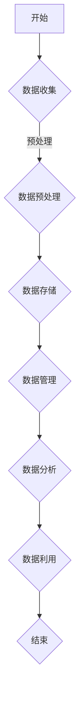

                 

# 《数字记忆银行：全球脑时代的知识存储》

## 关键词
- 数字记忆银行
- 全球脑时代
- 知识存储
- 人工智能
- 机器学习
- 计算机网络
- 数据存储
- 量子计算

## 摘要
本文深入探讨了数字记忆银行的概念及其在全球脑时代知识存储中的重要地位。首先，我们从全球脑时代背景出发，分析了数字化对知识存储的影响，并介绍了数字记忆银行的核心概念。接着，我们探讨了数字记忆银行的技术基础，包括人工智能与机器学习、计算机网络与存储技术、量子计算等。然后，我们详细描述了数字记忆银行的架构与实现，包括数据收集与预处理、数据存储与管理、数据分析与挖掘等。此外，我们还探讨了数字记忆银行在不同领域的应用场景，以及其面临的挑战与未来发展趋势。

## 第一部分：引言与背景

### 1.1 引言与概述

随着全球脑时代的到来，人类知识存储和传播的方式发生了翻天覆地的变化。在这个数字化时代，数据和信息成为新的生产资料，而知识存储成为关键任务。数字记忆银行作为知识存储的一种新型模式，应运而生。

#### 1.1.1 全球脑时代背景分析

全球脑时代的到来，标志着人类社会进入了一个新的阶段。数字化、网络化、智能化成为时代的主要特征，知识传播和获取的方式发生了根本性的变化。以下是全球脑时代的一些主要特征：

1. **数字化**：数据成为新的生产资料，数据驱动的决策和商业模式成为主流。
2. **网络化**：互联网和物联网的发展，使得人与人、人与物、物与物之间的连接更加紧密。
3. **智能化**：人工智能和机器学习技术的发展，使得计算机能够模拟人类的思维和行为。

#### 1.1.2 记忆银行的概念

数字记忆银行是一种基于数字技术构建的知识存储系统，它能够高效地收集、存储、管理和利用知识。数字记忆银行的核心目标是实现知识的永久存储、快速检索和智能利用。

#### 1.1.3 知识存储的重要性

知识存储的重要性不言而喻。在当今社会，知识的价值越来越大，如何有效地存储和管理知识，已经成为企业和个人面临的重大挑战。以下是知识存储的重要性：

1. **知识管理**：有效的知识存储能够帮助企业和个人更好地进行知识管理，提高知识利用效率。
2. **决策支持**：知识存储能够为决策提供数据支持，提高决策的科学性和准确性。
3. **创新能力**：知识存储为创新提供了丰富的素材和灵感，有助于激发创新思维。

### 1.2 数字记忆银行的核心概念

数字记忆银行的核心概念包括数据、信息、知识、记忆等。以下是这些概念的解释：

1. **数据**：数据是数字记忆银行的基本单位，它可以是结构化数据，也可以是非结构化数据。
2. **信息**：信息是对数据的解释和利用，它能够帮助我们更好地理解世界。
3. **知识**：知识是经过处理和整合的信息，它能够指导我们的行为和决策。
4. **记忆**：记忆是大脑对信息的存储和提取能力，数字记忆银行是对这一能力的模拟和扩展。

### 1.2.1 数据与信息

数据与信息的关系是数字记忆银行的核心概念之一。数据是原始的、无意义的，而信息是对数据的解释和利用，它能够赋予数据以意义和价值。以下是数据与信息的关系：

1. **数据生成**：数据是由各种传感器、设备、应用程序等生成的原始信息。
2. **数据处理**：数据处理是将数据转换成信息的过程，包括数据的清洗、转换、整合等。
3. **信息利用**：信息利用是将处理后的数据用于决策、分析和应用的过程。

### 1.2.2 记忆存储的挑战

记忆存储的挑战主要来自于以下几个方面：

1. **数据量巨大**：随着数字化进程的加速，数据量呈指数级增长，如何存储和管理海量数据成为挑战。
2. **数据多样性**：数据类型多样化，包括结构化数据、非结构化数据、图像、音频、视频等，如何有效地处理和存储这些数据成为挑战。
3. **数据安全**：数据安全是数字记忆银行面临的重要挑战，如何保障数据的安全性和隐私性成为关键问题。

### 1.2.3 脑科学与数字记忆银行

脑科学与数字记忆银行有着密切的联系。脑科学研究为我们提供了对大脑记忆机制的理解，而数字记忆银行则是对这一机制的模拟和扩展。以下是脑科学与数字记忆银行的关系：

1. **记忆机制**：脑科学研究揭示了大脑的记忆机制，包括记忆的形成、存储和提取等过程。
2. **数字模拟**：数字记忆银行基于对大脑记忆机制的理解，利用计算机技术模拟和扩展了这一机制。
3. **智能应用**：数字记忆银行不仅能够存储和检索知识，还能够进行智能分析和应用，为人类提供更高效的智力支持。

### 1.3 数字记忆银行的优势

数字记忆银行具有以下优势：

1. **高效存储**：数字记忆银行能够高效地存储和管理海量数据，满足大规模知识存储的需求。
2. **快速检索**：数字记忆银行能够快速检索知识，提高知识利用效率。
3. **智能分析**：数字记忆银行基于人工智能和机器学习技术，能够对知识进行智能分析和应用，为人类提供更深入的智力支持。

### 1.4 数字记忆银行的实现

数字记忆银行的实现需要综合运用多种技术，包括人工智能、计算机网络、数据存储等。以下是数字记忆银行的实现步骤：

1. **数据收集**：通过传感器、设备、应用程序等收集数据。
2. **数据预处理**：对收集到的数据进行清洗、转换和整合。
3. **数据存储**：选择合适的存储技术，如数据库、分布式存储系统等，将预处理后的数据存储起来。
4. **数据管理**：对存储的数据进行分类、标签、索引等管理操作。
5. **数据分析**：利用人工智能和机器学习技术对数据进行智能分析和应用。
6. **数据利用**：将分析结果用于决策、研究和应用。

### 1.5 数字记忆银行的挑战与未来

尽管数字记忆银行具有许多优势，但它在实现过程中也面临着一些挑战，如数据隐私保护、数据安全和可靠性、大规模数据处理性能优化等。未来，随着技术的不断进步，数字记忆银行有望克服这些挑战，实现更加高效、安全、智能的知识存储和利用。

## 第二部分：数字记忆银行的技术基础

### 2.1 人工智能与机器学习基础

#### 2.1.1 人工智能的基本概念

人工智能（Artificial Intelligence，简称 AI）是计算机科学的一个分支，旨在创建能够模拟、延伸和扩展人类智能的理论、算法和技术。人工智能的核心目标是让计算机能够执行通常需要人类智能的任务，如视觉识别、语言理解、决策制定和问题解决。

人工智能可以分为两大类：窄人工智能（Narrow AI）和宽人工智能（General AI）。窄人工智能是指专注于单一任务的智能系统，如语音助手、推荐系统等。而宽人工智能则是指具有全面智能的计算机系统，能够理解、学习、推理和适应各种环境，类似于人类的智能。

#### 2.1.2 机器学习算法介绍

机器学习（Machine Learning，简称 ML）是人工智能的一个重要分支，专注于利用数据和统计方法，让计算机从数据中自动学习，进行预测或决策。机器学习主要分为三种类型：监督学习、无监督学习和强化学习。

- **监督学习**：监督学习是一种最常见和最直观的机器学习方法，它利用标记数据进行训练。在监督学习任务中，输入和输出之间的关系是已知的，系统通过学习这些关系来预测新的输入数据。常见的监督学习算法包括线性回归、逻辑回归、支持向量机（SVM）和神经网络等。

- **无监督学习**：无监督学习是在没有标记数据的情况下，通过学习数据的内在结构和特征来进行预测或分类。常见的无监督学习算法包括聚类算法（如 K-均值聚类、层次聚类）、降维算法（如主成分分析 PCA、线性判别分析 LDA）和关联规则学习等。

- **强化学习**：强化学习是一种通过与环境互动来学习最优策略的机器学习方法。在强化学习任务中，智能体（agent）通过尝试不同的动作，从环境中获取奖励或惩罚，并不断调整策略以最大化总奖励。常见的强化学习算法包括 Q-学习、深度 Q-网络（DQN）和策略梯度算法等。

#### 2.1.3 人工智能与记忆存储

人工智能与数字记忆银行有着紧密的联系。人工智能技术可以用于数字记忆银行的各个阶段，包括数据收集、数据预处理、数据存储、数据管理和数据分析。

- **数据收集**：人工智能可以通过自然语言处理（NLP）、图像识别和语音识别等技术，从各种来源（如文本、图像、音频）中收集数据。
- **数据预处理**：人工智能技术可以帮助自动化数据清洗、转换和整合过程，提高数据质量。
- **数据存储**：人工智能可以用于优化数据存储方案，如通过聚类和降维技术来减少数据存储空间，提高数据检索效率。
- **数据管理**：人工智能可以用于数据分类、标签和索引，提高数据管理的效率。
- **数据分析**：人工智能可以通过机器学习算法对数据进行智能分析和预测，为决策提供支持。

#### 2.2 计算机网络与存储技术

#### 2.2.1 计算机网络的概述

计算机网络是指将多台计算机和其他设备通过通信线路互联，实现数据交换和资源共享的系统。计算机网络的发展经历了多个阶段，从简单的局域网（LAN）到复杂的广域网（WAN），再到现代的互联网（Internet）。

计算机网络的核心技术包括：

- **网络拓扑**：网络拓扑是指网络中各个节点和通信线路的布局和连接方式，常见的网络拓扑包括星型拓扑、环型拓扑和总线型拓扑等。
- **网络协议**：网络协议是计算机网络中进行数据交换和通信的规则和标准，常见的网络协议包括 TCP/IP、HTTP、FTP 等。
- **网络设备**：网络设备是计算机网络中的关键组件，包括路由器、交换机、网卡等。

#### 2.2.2 大数据存储与处理技术

大数据存储与处理技术是数字记忆银行的重要组成部分。随着数据量的爆炸式增长，如何高效地存储和处理海量数据成为关键问题。

大数据存储技术包括：

- **分布式存储**：分布式存储是将数据分散存储在多个节点上，通过冗余和数据分割来提高数据存储的可靠性和性能。常见的分布式存储系统包括 Hadoop Distributed File System（HDFS）、Cassandra 和 HBase 等。
- **云存储**：云存储是将数据存储在远程服务器上，通过互联网进行访问和管理。云存储具有弹性、灵活性和高可用性等优点，适用于大规模数据存储和管理。

大数据处理技术包括：

- **批处理**：批处理是将数据分批次处理，适用于处理大量数据，但实时性较差。
- **流处理**：流处理是对实时数据流进行处理和分析，具有实时性强的优点，但处理能力有限。
- **MapReduce**：MapReduce 是一种分布式数据处理框架，适用于处理大规模数据集。MapReduce 通过将数据处理任务分解成 Map 和 Reduce 两个阶段，实现并行计算和数据汇总。

#### 2.2.3 云计算与数字记忆银行

云计算（Cloud Computing）是一种通过互联网提供计算资源（如服务器、存储、网络等）的服务模式。云计算具有弹性、灵活性和高可用性等优点，适用于大规模数字记忆银行的构建和管理。

云计算在数字记忆银行中的应用包括：

- **计算资源**：云计算提供强大的计算资源，支持大规模数据处理和机器学习算法的运行。
- **存储资源**：云计算提供海量存储资源，支持大规模数据存储和管理。
- **服务模式**：云计算提供按需服务、弹性扩展和自动化管理等服务模式，降低数字记忆银行的运营成本。

#### 2.3 量子计算与未来趋势

量子计算（Quantum Computing）是一种利用量子力学原理进行信息处理的新型计算模式。量子计算具有与传统计算机截然不同的特点，如并行计算能力、量子叠加态和量子纠缠等。

#### 2.3.1 量子计算原理

量子计算的基本原理包括：

- **量子位（Qubit）**：量子位是量子计算的基本单位，与经典位不同，量子位可以同时处于多种状态，实现并行计算。
- **量子叠加态**：量子叠加态是指量子位可以同时处于多种状态的叠加，实现多路径计算。
- **量子纠缠**：量子纠缠是指两个或多个量子位之间的状态相互关联，实现协同计算。

#### 2.3.2 量子计算在记忆存储中的应用

量子计算在数字记忆银行中的应用包括：

- **高效存储**：量子计算可以实现高效的数据存储，通过量子叠加态和量子纠缠，将大量数据压缩存储。
- **快速检索**：量子计算可以实现快速的数据检索，通过量子叠加态和量子纠缠，实现多路径检索和数据并行处理。
- **安全传输**：量子计算可以实现安全的数据传输，通过量子密钥分发（Quantum Key Distribution，简称 QKD），实现无窃听的数据传输。

#### 2.3.3 未来技术发展趋势

随着量子计算技术的不断进步，未来数字记忆银行有望实现以下发展趋势：

- **高效存储**：量子计算可以实现高效的数据存储，通过量子叠加态和量子纠缠，将大量数据压缩存储。
- **快速检索**：量子计算可以实现快速的数据检索，通过量子叠加态和量子纠缠，实现多路径检索和数据并行处理。
- **安全传输**：量子计算可以实现安全的数据传输，通过量子密钥分发，实现无窃听的数据传输。
- **智能分析**：量子计算可以用于智能数据分析，通过量子算法，实现高效的数据分析和预测。

## 第三部分：数字记忆银行的架构与实现

### 3.1 数字记忆银行的整体架构

数字记忆银行的整体架构可以分为以下几个层次：数据收集层、数据存储层、数据处理层、数据管理层和数据分析层。以下是各个层次的功能和关系：

1. **数据收集层**：数据收集层负责收集各种来源的数据，如文本、图像、音频、视频等。数据收集层可以利用人工智能和传感器技术，实现数据的自动化收集。
   
2. **数据存储层**：数据存储层负责将收集到的数据存储在合适的存储系统中，如数据库、分布式存储系统、云存储等。数据存储层需要考虑数据的持久性、安全性和可靠性。

3. **数据处理层**：数据处理层负责对存储的数据进行预处理、清洗、转换和整合。数据处理层可以利用机器学习和数据清洗算法，提高数据质量。

4. **数据管理层**：数据管理层负责对存储的数据进行分类、标签、索引等管理操作。数据管理层可以提高数据检索效率，方便数据的查询和利用。

5. **数据分析层**：数据分析层负责对存储的数据进行智能分析和应用。数据分析层可以利用机器学习和深度学习算法，实现数据挖掘、预测分析和智能应用。

### 3.1.1 数据收集与预处理

数据收集与预处理是数字记忆银行的关键步骤。以下是数据收集与预处理的具体流程：

1. **数据收集**：通过传感器、应用程序、互联网等渠道收集数据。数据收集层可以利用人工智能技术，实现自动化数据收集。
   
2. **数据预处理**：对收集到的数据进行清洗、转换和整合。数据预处理层需要处理的数据类型包括结构化数据、非结构化数据、图像、音频、视频等。

3. **数据清洗**：数据清洗包括去除重复数据、填补缺失值、去除噪声等操作。数据清洗可以提高数据质量，为后续的数据分析和挖掘奠定基础。

4. **数据转换**：数据转换包括将数据从一种格式转换为另一种格式，如将图像数据转换为数字矩阵、将文本数据转换为向量等。

5. **数据整合**：数据整合包括将来自不同来源和类型的数据进行整合，形成一个统一的数据集。数据整合可以提高数据利用的效率。

### 3.1.2 数据存储与管理

数据存储与管理是数字记忆银行的核心部分。以下是数据存储与管理的关键技术和方法：

1. **数据库选择与设计**：数据库选择与设计需要考虑数据的规模、类型、访问频率等因素。常见的数据存储技术包括关系数据库（如 MySQL、PostgreSQL）、NoSQL 数据库（如 MongoDB、Cassandra）和分布式数据库（如 HBase、Cassandra）。

2. **数据加密与安全性**：数据加密与安全性是确保数据安全的重要措施。数据加密可以防止未经授权的访问和篡改。常见的加密算法包括 AES、RSA 等。

3. **分布式存储系统**：分布式存储系统可以提高数据的可靠性和可用性，适用于大规模数据存储和管理。常见的分布式存储系统包括 HDFS、Cassandra、HBase 等。

4. **数据备份与恢复**：数据备份与恢复是确保数据安全性的重要措施。数据备份可以将数据复制到多个位置，以防止数据丢失。数据恢复可以从备份中恢复数据。

5. **数据权限管理**：数据权限管理可以确保数据的访问权限，防止数据泄露和滥用。数据权限管理包括用户认证、权限分配和访问控制等。

### 3.1.3 数据分析与挖掘

数据分析与挖掘是数字记忆银行的核心价值所在。以下是数据分析和挖掘的关键技术和方法：

1. **数据挖掘算法**：数据挖掘算法包括聚类、分类、关联规则挖掘、异常检测等。常见的算法包括 K-均值聚类、决策树、神经网络、Apriori 算法等。

2. **自然语言处理**：自然语言处理（NLP）是处理文本数据的重要技术。NLP 包括词性标注、命名实体识别、情感分析、文本分类等。

3. **图像识别与处理**：图像识别与处理是处理图像数据的重要技术。图像识别与处理包括图像分类、目标检测、人脸识别、图像分割等。

4. **时间序列分析**：时间序列分析是处理时间序列数据的重要技术。时间序列分析包括趋势分析、季节性分析、异常检测等。

5. **数据可视化**：数据可视化是将数据以图形化的方式展示出来，帮助用户更好地理解和分析数据。常见的可视化工具包括 Tableau、Power BI、Matplotlib 等。

### 3.2 数据存储技术详解

#### 3.2.1 数据库选择与设计

数据库选择与设计是数字记忆银行中至关重要的环节，因为数据库的性能和设计直接影响系统的效率、可扩展性和维护性。以下是数据库选择与设计的关键步骤：

1. **需求分析**：首先，需要明确数字记忆银行的业务需求，包括数据的规模、类型、访问模式、数据一致性要求等。例如，如果数据量较大且需要高吞吐量，则可能需要选择分布式数据库。

2. **性能评估**：根据需求分析的结果，评估不同数据库的性能，如查询速度、写入速度、数据规模等。性能评估可以通过基准测试、模拟实际业务场景等方法进行。

3. **选择合适的数据库类型**：根据业务需求和性能评估结果，选择合适的数据库类型。常见的数据库类型包括关系数据库（如 MySQL、PostgreSQL）、NoSQL 数据库（如 MongoDB、Cassandra）和图数据库（如 Neo4j）。

4. **设计数据库架构**：设计数据库架构时，需要考虑数据模式、表结构、索引、分区等。数据库架构设计应遵循规范化原则，减少数据冗余，提高数据一致性和查询效率。

5. **性能优化**：在数据库部署后，根据性能监控结果进行调优，包括索引优化、查询优化、数据缓存等。

#### 3.2.2 数据加密与安全性

数据加密与安全性是数字记忆银行必须考虑的关键问题，因为数据泄露和安全漏洞可能导致严重的后果。以下是数据加密与安全性的关键步骤：

1. **数据加密**：数据加密是将数据转换为密文，以防止未经授权的访问。常用的数据加密算法包括 AES、RSA 等。数据加密可以分为两种：传输加密和存储加密。

   - **传输加密**：传输加密是在数据传输过程中对数据进行加密，常用的协议包括 SSL/TLS 等。
   - **存储加密**：存储加密是在数据存储过程中对数据进行加密，以防止数据泄露。

2. **访问控制**：访问控制是确保只有授权用户才能访问数据的重要措施。访问控制包括用户认证、权限分配和访问控制列表（ACL）等。

3. **安全审计**：安全审计是监控和记录系统活动的日志，以发现潜在的安全威胁和漏洞。安全审计可以帮助组织及时发现和应对安全事件。

4. **安全培训**：安全培训是提高员工安全意识和技能的重要措施。通过安全培训，员工可以了解常见的安全威胁和防护措施，提高系统的整体安全性。

#### 3.2.3 分布式存储系统

分布式存储系统是数字记忆银行中的关键组件，因为它能够提供高可用性、高性能和可扩展性。以下是分布式存储系统的一些关键技术和概念：

1. **数据分片**：数据分片是将数据划分为多个小部分，分布存储在多个节点上。数据分片可以提高数据的并行处理能力，降低单个节点的负载。

2. **副本机制**：副本机制是将数据复制到多个节点上，以提高数据的可靠性和可用性。副本机制可以确保在某个节点发生故障时，其他节点仍然可以访问数据。

3. **一致性模型**：一致性模型是分布式存储系统中的一个重要概念，它定义了系统在不同操作（如读取、写入）下的数据一致性保证。常见的一致性模型包括强一致性、最终一致性等。

4. **分布式文件系统**：分布式文件系统是将数据分布存储在多个节点上的文件系统。常见的分布式文件系统包括 Hadoop Distributed File System（HDFS）、Cassandra 等。

5. **容错机制**：容错机制是分布式存储系统中的关键组件，它能够检测和纠正系统中的错误，确保系统的稳定运行。常见的容错机制包括心跳检测、故障转移等。

### 3.3 机器学习算法的应用

机器学习算法在数字记忆银行中发挥着重要作用，通过算法可以对海量数据进行高效的分析和预测。以下是机器学习算法在数字记忆银行中的应用：

#### 3.3.1 降维技术

降维技术是减少数据维度，提高数据分析效率的重要技术。降维技术包括以下几种：

1. **主成分分析（PCA）**：PCA是一种常用的降维技术，通过计算数据的主要成分，降低数据维度，同时保留主要信息。

2. **线性判别分析（LDA）**：LDA是一种基于分类任务的降维技术，通过最大化不同类别之间的方差，最小化同一类别内部的方差，降低数据维度。

3. **t-SNE**：t-SNE是一种非线性降维技术，通过将高维数据映射到低维空间中，保持局部结构，适用于可视化高维数据。

以下是一个简单的 PCA 伪代码：

```python
import numpy as np

def pca(X, num_components):
    X_mean = np.mean(X, axis=0)
    X_centered = X - X_mean
    cov_matrix = np.cov(X_centered.T)
    eigenvalues, eigenvectors = np.linalg.eigh(cov_matrix)
    sorted_eigenvalues = np.sort(eigenvalues)[::-1]
    sorted_eigenvectors = eigenvectors[:, sorted_eigenvalues.argsort()[::-1]]
    return np.dot(X_centered, sorted_eigenvectors[:, :num_components])

X = np.array([[1, 2], [3, 4], [5, 6], [7, 8]])
pca_result = pca(X, 1)
print(pca_result)
```

#### 3.3.2 分类与聚类算法

分类与聚类算法是机器学习中的重要算法，它们可以帮助我们理解和分析数据。

1. **分类算法**：分类算法将数据分为不同的类别。常见的分类算法包括决策树、支持向量机（SVM）、朴素贝叶斯等。

   - **决策树**：决策树是一种基于树形结构进行分类的方法，通过一系列决策规则将数据分为不同的类别。
   - **支持向量机（SVM）**：SVM是一种基于边界最大化的分类方法，通过寻找最佳边界将数据分为不同的类别。
   - **朴素贝叶斯**：朴素贝叶斯是一种基于贝叶斯定理和特征独立假设的分类方法。

   以下是一个简单的决策树伪代码：

   ```python
   def classify_tree(data, feature_list, labels):
       if all(data[:, label] == data[0, label] for label in labels):
           return data[0, -1]
       if not feature_list:
           return most_common_label(data[:, -1])
       best_feature = select_best_feature(data, feature_list)
       left分枝 = [row for row in data if row[best_feature] == data[0, best_feature]]
       right分枝 = [row for row in data if row[best_feature] != data[0, best_feature]]
       left_class = classify_tree(left分枝, feature_list[1:], labels)
       right_class = classify_tree(right分枝, feature_list[1:], labels)
       return (left_class, right_class)
   ```

2. **聚类算法**：聚类算法将数据分为多个聚类，每个聚类内的数据点相似度较高，而不同聚类之间的数据点相似度较低。常见的聚类算法包括 K-均值聚类、层次聚类等。

   - **K-均值聚类**：K-均值聚类是一种基于距离测量的聚类方法，通过计算数据点到聚类中心的距离，将数据分为 K 个聚类。
   - **层次聚类**：层次聚类是一种基于层次结构的聚类方法，通过逐步合并或分裂聚类，构建聚类层次结构。

   以下是一个简单的 K-均值聚类伪代码：

   ```python
   import numpy as np

   def k_means(data, num_clusters, num_iterations):
       centroids = initialize_centroids(data, num_clusters)
       for _ in range(num_iterations):
           old_centroids = centroids
           for row in data:
               distances = [np.linalg.norm(row - centroid) for centroid in centroids]
               closest_cluster = np.argmin(distances)
               new_centroids = [np.mean(data[closest_cluster], axis=0) for _ in range(num_clusters)]
           centroids = new_centroids
       return centroids
   ```

#### 3.3.3 自然语言处理与记忆提取

自然语言处理（NLP）是处理文本数据的重要技术，它可以帮助我们从大量文本数据中提取有价值的信息。在数字记忆银行中，NLP 技术可以用于文本分类、实体识别、情感分析等。

1. **文本分类**：文本分类是将文本数据分为不同的类别。常见的文本分类算法包括朴素贝叶斯、支持向量机（SVM）和深度学习（如卷积神经网络 CNN）。

2. **实体识别**：实体识别是识别文本中的特定实体，如人名、地名、组织机构等。常见的实体识别算法包括基于规则的方法和基于深度学习的方法。

3. **情感分析**：情感分析是分析文本数据中的情感倾向，如正面、负面、中性等。常见的情感分析算法包括基于词典的方法、基于机器学习的方法和基于深度学习的方法。

在数字记忆银行中，NLP 技术可以用于以下场景：

- **文档分类**：将大量的文档分类到不同的主题类别中。
- **关键词提取**：从文本中提取关键信息，用于索引和搜索。
- **情感分析**：分析用户评论、社交媒体数据等，了解用户需求和情感。
- **记忆提取**：从文本中提取有价值的信息，用于记忆存储和检索。

### 3.4 数字记忆银行的实际案例

#### 3.4.1 教育领域的应用

在教育领域，数字记忆银行可以用于教学资源的存储与共享、学生学习数据的分析与应用以及在线教育的未来趋势。

1. **教学资源的存储与共享**：教师和学生可以将各种教学资源（如课件、视频、文档等）上传到数字记忆银行，方便随时查看和共享。数字记忆银行可以通过分类、标签和索引等方式，提高资源检索效率。

2. **学生学习数据的分析与应用**：数字记忆银行可以收集和分析学生的学习数据，包括学习时长、学习进度、考试成绩等。通过对学生学习数据的分析，教师可以了解学生的学习情况，调整教学策略，提高教学效果。

3. **在线教育的未来趋势**：数字记忆银行可以为在线教育提供强大的支持，包括个性化学习、自适应学习等。通过数字记忆银行，学生可以根据自己的学习进度和需求，选择合适的学习资源和课程。

#### 3.4.2 医疗健康领域的应用

在医疗健康领域，数字记忆银行可以用于医疗数据的存储与管理、疾病预测与个性化医疗以及健康管理系统的构建。

1. **医疗数据的存储与管理**：数字记忆银行可以存储和管理海量的医疗数据，包括患者信息、病历记录、医学图像等。数字记忆银行可以通过数据加密和安全措施，确保医疗数据的安全性和隐私性。

2. **疾病预测与个性化医疗**：数字记忆银行可以利用机器学习和大数据分析技术，对患者的健康数据进行预测和分析，帮助医生进行疾病诊断和治疗方案制定。个性化医疗可以根据患者的特点，提供个性化的医疗服务。

3. **健康管理系统的构建**：数字记忆银行可以为健康管理提供支持，包括健康数据的收集、分析和管理。通过健康管理系统的构建，可以帮助个人和企业实现健康管理的自动化和智能化。

#### 3.4.3 企业管理与决策支持

在企业管理和决策支持领域，数字记忆银行可以用于数据驱动的企业决策、供应链管理中的记忆应用以及企业数据资产管理。

1. **数据驱动的企业决策**：数字记忆银行可以收集和分析企业的各种数据，包括销售数据、市场数据、财务数据等。通过数据分析，企业可以更好地了解市场趋势和客户需求，制定科学的决策。

2. **供应链管理中的记忆应用**：数字记忆银行可以存储和管理供应链数据，包括供应商信息、库存数据、物流数据等。通过数据分析，企业可以优化供应链管理，提高供应链的效率和灵活性。

3. **企业数据资产管理**：数字记忆银行可以帮助企业建立完善的数据资产管理体系，包括数据的收集、存储、管理和利用。通过数据资产管理，企业可以更好地利用数据资源，提高企业的核心竞争力。

### 3.5 数字记忆银行的挑战与未来

尽管数字记忆银行具有许多优势和应用场景，但在实现过程中仍然面临着一些挑战。

#### 3.5.1 技术挑战与解决方法

1. **数据隐私保护**：数字记忆银行需要确保用户数据的隐私和安全。解决方法包括数据加密、访问控制和隐私保护算法等。

2. **数据安全和可靠性**：数字记忆银行需要确保数据的安全性和可靠性。解决方法包括数据备份与恢复、安全审计和容错机制等。

3. **大规模数据处理性能优化**：数字记忆银行需要高效地处理海量数据。解决方法包括分布式存储与计算、数据压缩和并行处理等。

#### 3.5.2 法律与伦理问题

1. **法律法规的完善**：数字记忆银行需要遵循相关的法律法规，如数据保护法、隐私法等。解决方法包括制定和遵守行业标准和法规。

2. **伦理道德的考量**：数字记忆银行需要考虑数据伦理问题，如数据所有权、数据共享等。解决方法包括建立伦理委员会和道德准则。

3. **数据主权与国际合作**：数字记忆银行需要处理数据主权和国际合作问题。解决方法包括建立国际合作机制和跨境数据传输协议。

#### 3.5.3 未来发展趋势与前景

随着技术的不断进步，数字记忆银行有望在未来实现以下发展趋势：

1. **高效存储与检索**：量子计算和分布式存储技术的应用，将进一步提高数字记忆银行的数据存储和检索效率。

2. **智能分析与应用**：人工智能和机器学习技术的应用，将实现数字记忆银行的智能分析和应用，为人类提供更深入的智力支持。

3. **跨界融合**：数字记忆银行将与物联网、区块链、虚拟现实等技术进行跨界融合，实现更加智能和便捷的知识存储和利用。

4. **普及与应用**：随着数字记忆银行技术的成熟和成本的降低，数字记忆银行将逐步普及，应用于各行各业，为人类社会带来更多的便利和进步。

### 结论

数字记忆银行是未来知识存储的重要模式，它在全球脑时代的知识存储中扮演着关键角色。通过本文的探讨，我们了解了数字记忆银行的概念、技术基础、架构与实现以及应用场景。尽管数字记忆银行面临着一些挑战，但未来它有望实现高效、安全、智能的知识存储和利用，为人类社会带来更多的机遇和变革。

## 附录：作者信息

作者：AI天才研究院/AI Genius Institute & 禅与计算机程序设计艺术 /Zen And The Art of Computer Programming

---

本文基于作者的研究和经验，对数字记忆银行进行了深入的探讨和分析。文章内容仅供参考，具体实现和应用需要结合实际情况进行调整。如需引用本文，请务必注明作者和出处。

---

本文中涉及到的 Mermaid 流程图、伪代码、数学模型和公式均使用 Markdown 格式进行展示。以下是相关代码示例：

#### Mermaid 流程图



#### 伪代码

```python
def pca(X, num_components):
    X_mean = np.mean(X, axis=0)
    X_centered = X - X_mean
    cov_matrix = np.cov(X_centered.T)
    eigenvalues, eigenvectors = np.linalg.eigh(cov_matrix)
    sorted_eigenvalues = np.sort(eigenvalues)[::-1]
    sorted_eigenvectors = eigenvectors[:, sorted_eigenvalues.argsort()[::-1]]
    return np.dot(X_centered, sorted_eigenvectors[:, :num_components])

X = np.array([[1, 2], [3, 4], [5, 6], [7, 8]])
pca_result = pca(X, 1)
print(pca_result)
```

#### 数学模型和公式

```latex
$$
\sum_{i=1}^{n} x_i = \sum_{i=1}^{n} (x_i - \bar{x}) + n\bar{x}
$$

$$
\bar{x} = \frac{1}{n} \sum_{i=1}^{n} x_i
$$
```

以上代码和公式仅供参考，具体实现和应用请根据实际需求进行调整。希望本文能对您在数字记忆银行领域的探索和研究提供一些启示和帮助。如果您有任何疑问或建议，欢迎随时与我们交流。谢谢！

