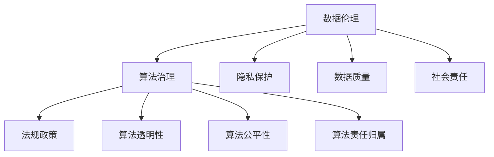

                 

# 文章标题

《数据伦理：算法治理与规范》

## 关键词

数据伦理、算法治理、隐私保护、公平性、可解释性、法规政策

## 摘要

随着大数据和人工智能技术的快速发展，数据伦理和算法治理成为社会各界广泛关注的话题。本文旨在深入探讨数据伦理的基本概念、核心原则及其在实践中的应用，同时详细解析算法治理的定义、核心要素和实践方法。在此基础上，本文探讨数据伦理与算法治理的协同机制，并通过案例研究分析其应用效果。最后，本文展望数据伦理与算法治理的未来发展趋势，为相关领域的研究和实践提供有益的参考。

## 第一部分：数据伦理概述

### 1.1 数据伦理的定义与重要性

#### 1.1.1 数据伦理的基本概念

数据伦理是指在与数据处理、分析和利用相关活动中，遵循的一系列道德规范和原则。它旨在确保数据在收集、存储、处理和共享过程中尊重个体的权利和尊严，促进社会的公平、公正和可持续发展。

#### 1.1.2 数据伦理的重要性

1. **保护隐私**：数据伦理的首要任务是保护个人隐私，防止数据泄露和滥用，确保个体的隐私权益得到保障。
2. **促进公平性**：数据伦理要求在数据处理过程中避免歧视和不公平现象，确保数据处理结果的公正性和透明性。
3. **增强信任**：数据伦理有助于提升公众对数据处理的信任度，促进数据共享和开放，推动大数据和人工智能技术的发展。
4. **规范行为**：数据伦理为数据处理活动提供了行为准则，有助于规范企业和政府的数据处理行为，降低道德风险。

#### 1.1.3 数据伦理的挑战与趋势

1. **技术进步**：随着大数据、人工智能和区块链等技术的发展，数据伦理面临新的挑战，如数据隐私保护、算法偏见和透明性等问题。
2. **法规政策**：各国政府纷纷制定数据伦理相关法规，推动数据伦理的规范化发展。未来，数据伦理法规将更加完善，为数据处理活动提供明确的法律依据。
3. **社会责任**：企业和机构需要承担更多的社会责任，积极参与数据伦理治理，推动社会公平和可持续发展。

### 1.2 数据伦理的核心原则

#### 1.2.1 尊重隐私

尊重隐私是数据伦理的核心原则之一。它要求在数据收集、存储、处理和共享过程中，确保个体的隐私信息不被泄露和滥用。主要措施包括：

1. **数据匿名化**：通过数据脱敏、加密等技术，消除个人身份信息，保护隐私。
2. **访问控制**：设置严格的访问权限，确保只有授权人员能够访问敏感数据。
3. **数据安全**：采取数据加密、备份、容灾等技术手段，确保数据安全。

#### 1.2.2 公平性

公平性原则要求在数据处理过程中避免歧视和不公平现象，确保数据处理结果的公正性和透明性。主要措施包括：

1. **算法透明性**：确保算法的设计、实现和运行过程透明，便于外部监督和评估。
2. **公平性评估**：对算法的公平性进行评估，确保其在不同群体中的表现一致。
3. **反歧视措施**：在数据收集、处理和决策过程中，采取反歧视措施，防止对特定群体造成不公平待遇。

#### 1.2.3 可解释性

可解释性原则要求数据处理过程和结果易于理解，便于公众和监管机构进行监督和评估。主要措施包括：

1. **算法可视化**：将算法运行过程和结果以图表、文字等形式进行可视化，便于理解和解释。
2. **算法注释**：在算法实现过程中，添加注释，详细说明算法的逻辑和功能。
3. **用户反馈**：建立用户反馈机制，收集用户对算法处理结果的反馈，及时进行调整和优化。

### 1.3 数据伦理在实践中的应用

#### 1.3.1 企业数据伦理实践

企业在数据处理过程中，需要遵守数据伦理原则，确保数据安全和用户隐私。具体措施包括：

1. **制定数据伦理政策**：明确企业在数据处理过程中应遵循的伦理原则和规范。
2. **数据安全措施**：采取数据加密、访问控制、数据备份等技术手段，确保数据安全。
3. **用户隐私保护**：在收集、存储和处理用户数据时，严格遵守隐私保护原则，确保用户隐私不受侵犯。

#### 1.3.2 政府数据伦理实践

政府在数据管理和服务提供过程中，需要遵循数据伦理原则，确保公共数据的安全、公平和透明。具体措施包括：

1. **数据开放与共享**：推动公共数据开放，提升数据透明度，促进社会公平。
2. **数据安全与隐私保护**：建立数据安全管理制度，加强数据安全防护，保护公民隐私。
3. **公平性评估**：对数据处理过程和结果进行公平性评估，确保公共数据服务对所有人公平。

#### 1.3.3 学术界的数据伦理实践

学术界在数据研究和应用过程中，需要遵守数据伦理原则，确保研究的合法性和道德性。具体措施包括：

1. **伦理审查**：对涉及人类研究的数据项目进行伦理审查，确保研究符合伦理要求。
2. **数据共享**：鼓励研究人员公开共享数据，促进数据资源的合理利用。
3. **数据保护**：在数据处理过程中，采取数据匿名化、加密等技术手段，保护研究对象的隐私。

## 第二部分：算法治理

### 2.1 算法治理的定义与意义

#### 2.1.1 算法治理的基本概念

算法治理是指通过对算法的设计、开发、部署和运行过程进行管理和监督，确保算法的公正性、透明性和安全性，同时保护个人隐私和公共利益的一系列制度和措施。

#### 2.1.2 算法治理的意义

1. **确保算法公正性**：算法治理有助于确保算法在决策过程中不会产生歧视和不公平现象，保护个人权益。
2. **提升算法透明性**：算法治理要求算法的设计、实现和运行过程透明，便于公众和监管机构监督和评估。
3. **加强算法安全性**：算法治理有助于发现和防范算法漏洞，确保算法的安全性。
4. **维护社会稳定**：算法治理有助于预防和解决因算法滥用引发的社会问题，维护社会稳定。

#### 2.1.3 算法治理的主要挑战

1. **算法复杂性**：算法的复杂性和专业性使得普通公众难以理解和监督算法的运行。
2. **数据隐私保护**：算法治理需要平衡数据隐私保护和算法性能之间的关系。
3. **监管法规不完善**：目前，各国算法治理法规尚不完善，存在监管漏洞。
4. **技术创新与法规滞后**：算法治理需要不断适应新技术的发展，但法规政策往往滞后于技术创新。

### 2.2 算法治理的核心要素

#### 2.2.1 法规政策

法规政策是算法治理的重要基础。政府应制定和完善相关法规，明确算法开发、部署、运行和监督的规范和标准。主要措施包括：

1. **算法开发规范**：规定算法开发过程中的合规要求，确保算法的公正性和透明性。
2. **算法部署监管**：对算法部署和应用过程进行监管，确保算法在实际应用中的公正性和安全性。
3. **算法风险评估**：建立算法风险评估机制，对算法可能带来的风险进行评估和预警。

#### 2.2.2 算法透明性

算法透明性是算法治理的核心要素之一。算法设计者应确保算法的设计、实现和运行过程透明，便于公众和监管机构监督和评估。主要措施包括：

1. **算法可视化**：将算法运行过程和结果以图表、文字等形式进行可视化，便于理解和解释。
2. **算法注释**：在算法实现过程中，添加注释，详细说明算法的逻辑和功能。
3. **算法审计**：对算法进行定期审计，确保算法的公正性和透明性。

#### 2.2.3 算法公平性

算法公平性是算法治理的重要目标。算法设计者应确保算法在决策过程中不会产生歧视和不公平现象，保护个人权益。主要措施包括：

1. **数据集公平性**：确保训练数据集的多样性，避免数据偏见。
2. **算法公平性评估**：对算法的公平性进行评估，确保其在不同群体中的表现一致。
3. **反歧视措施**：在算法设计、开发和部署过程中，采取反歧视措施，防止对特定群体造成不公平待遇。

#### 2.2.4 算法责任归属

算法责任归属是算法治理的重要问题。在算法引发争议或造成损害时，应明确算法设计者、开发者、部署者和使用者的责任。主要措施包括：

1. **责任界定**：明确算法各环节的责任归属，确保各方承担相应的责任。
2. **责任追究**：建立责任追究机制，对算法违规行为进行处罚。
3. **保险机制**：鼓励算法相关方购买保险，降低算法引发损害的风险和损失。

### 2.3 算法治理的实践方法

#### 2.3.1 算法评估

算法评估是算法治理的重要环节。通过评估算法的公正性、透明性和安全性，确保算法符合治理要求。主要措施包括：

1. **算法公正性评估**：对算法在决策过程中的公正性进行评估，确保其不会产生歧视和不公平现象。
2. **算法透明性评估**：对算法的设计、实现和运行过程进行透明性评估，确保算法的运行过程和结果易于理解和解释。
3. **算法安全性评估**：对算法的安全性进行评估，确保算法在运行过程中不会泄露敏感信息和遭受攻击。

#### 2.3.2 算法审计

算法审计是对算法进行独立审查和评估的过程，旨在发现算法中的问题并提出改进建议。主要措施包括：

1. **内部审计**：由算法开发团队对算法进行内部审计，确保算法的设计、实现和运行过程符合治理要求。
2. **外部审计**：邀请独立第三方对算法进行审计，确保审计过程的独立性和公正性。
3. **审计报告**：根据审计结果，撰写审计报告，提出改进建议和措施。

#### 2.3.3 算法风险管理

算法风险管理是算法治理的重要任务。通过识别、评估和控制算法风险，确保算法的稳定运行和安全性。主要措施包括：

1. **风险识别**：识别算法可能存在的风险，如数据隐私泄露、算法偏见等。
2. **风险评估**：对算法风险进行评估，确定风险等级和影响范围。
3. **风险控制**：采取风险控制措施，如数据加密、访问控制、算法透明性等，降低算法风险。

## 第三部分：数据伦理与算法治理的结合

### 3.1 数据伦理与算法治理的关系

#### 3.1.1 数据伦理对算法治理的影响

数据伦理对算法治理具有重要影响。数据伦理原则为算法治理提供了道德准则和规范，指导算法的设计、开发、部署和运行过程。具体影响如下：

1. **隐私保护**：数据伦理要求在数据处理过程中保护个人隐私，算法治理需要遵循隐私保护原则，确保个人隐私不受侵犯。
2. **公平性**：数据伦理强调公平性，算法治理需要确保算法在决策过程中不会产生歧视和不公平现象。
3. **可解释性**：数据伦理要求算法具有可解释性，算法治理需要确保算法的设计、实现和运行过程透明，便于监督和评估。

#### 3.1.2 算法治理对数据伦理的回应

算法治理对数据伦理的回应主要体现在以下几个方面：

1. **法规政策**：算法治理需要制定和完善相关法规政策，明确数据伦理要求，指导数据处理活动。
2. **技术手段**：算法治理需要利用技术手段，如数据加密、访问控制等，保护个人隐私和数据安全。
3. **透明性和公正性**：算法治理需要确保算法的设计、实现和运行过程透明，便于公众和监管机构监督和评估，确保算法的公正性。

### 3.2 数据伦理与算法治理的协同机制

#### 3.2.1 数据治理与算法治理的协同

数据治理与算法治理的协同是确保数据质量和算法公正性的关键。具体措施如下：

1. **数据质量管理**：数据治理需要确保数据质量，包括准确性、完整性、一致性和可靠性，为算法治理提供高质量的数据支持。
2. **数据安全与隐私保护**：数据治理需要遵循数据伦理原则，确保个人隐私和数据安全，为算法治理提供安全可靠的数据环境。
3. **算法评估与审计**：数据治理和算法治理需要协同进行算法评估和审计，确保算法的公正性、透明性和安全性。

#### 3.2.2 风险管理与合规

风险管理与合规是数据伦理与算法治理协同的重要方面。具体措施如下：

1. **风险识别与评估**：数据治理和算法治理需要共同识别和评估数据处理过程中可能存在的风险，包括隐私泄露、数据滥用等。
2. **合规性审查**：数据治理和算法治理需要共同审查数据处理活动是否符合相关法规政策，确保合规性。
3. **风险控制与监督**：数据治理和算法治理需要共同采取风险控制措施，加强对数据处理活动的监督，确保风险得到有效控制。

#### 3.2.3 可持续发展

数据伦理与算法治理的协同对于推动可持续发展具有重要意义。具体措施如下：

1. **可持续发展目标**：数据治理和算法治理需要共同推动可持续发展目标的实现，如公平、公正、透明等。
2. **数据资源共享**：数据治理和算法治理需要共同推动数据资源的共享和开放，促进数据资源的合理利用。
3. **创新与合作**：数据治理和算法治理需要共同推动技术创新与合作，推动数据伦理与算法治理的融合发展。

### 3.3 数据伦理与算法治理的案例研究

#### 3.3.1 案例一：互联网企业数据治理与算法治理实践

**案例背景**：互联网企业在数据处理和算法应用方面具有广泛的应用场景，数据治理与算法治理至关重要。

**实践措施**：

1. **数据质量管理**：互联网企业建立数据质量管理机制，确保数据质量，为算法治理提供高质量数据支持。
2. **隐私保护**：互联网企业采用数据加密、访问控制等技术手段，保护用户隐私，遵循数据伦理原则。
3. **算法透明性**：互联网企业通过算法可视化、注释等方式，提高算法透明性，便于用户和监管机构监督。
4. **算法公正性**：互联网企业对算法进行公平性评估，采取反歧视措施，确保算法的公正性。

**实践效果**：通过数据治理与算法治理的协同，互联网企业有效提升了数据质量和算法公正性，赢得了用户信任，促进了业务发展。

#### 3.3.2 案例二：金融行业数据伦理与算法治理实践

**案例背景**：金融行业涉及大量用户数据和金融交易数据，数据伦理和算法治理至关重要。

**实践措施**：

1. **数据安全与隐私保护**：金融行业建立完善的数据安全管理制度，采取数据加密、访问控制等技术手段，保护用户隐私。
2. **算法透明性**：金融行业通过算法可视化、注释等方式，提高算法透明性，确保算法运行过程和结果透明。
3. **算法公平性**：金融行业对算法进行公平性评估，采取反歧视措施，确保算法的公正性。
4. **合规性审查**：金融行业定期进行合规性审查，确保数据处理活动符合相关法规政策。

**实践效果**：通过数据伦理与算法治理的实践，金融行业有效提升了数据质量和算法公正性，降低了道德风险，保障了用户权益。

#### 3.3.3 案例三：医疗行业数据伦理与算法治理实践

**案例背景**：医疗行业涉及大量患者数据和医疗数据，数据伦理和算法治理至关重要。

**实践措施**：

1. **数据安全与隐私保护**：医疗行业建立完善的数据安全管理制度，采取数据加密、访问控制等技术手段，保护患者隐私。
2. **算法透明性**：医疗行业通过算法可视化、注释等方式，提高算法透明性，确保算法运行过程和结果透明。
3. **算法公正性**：医疗行业对算法进行公平性评估，采取反歧视措施，确保算法的公正性。
4. **伦理审查**：医疗行业对涉及人类研究的数据项目进行伦理审查，确保研究符合伦理要求。

**实践效果**：通过数据伦理与算法治理的实践，医疗行业有效提升了数据质量和算法公正性，促进了医疗研究的进展，提高了医疗服务质量。

## 第四部分：数据伦理与算法治理的未来发展

### 4.1 数据伦理与算法治理的法规演进

#### 4.1.1 现有法规的不足与改进

目前，各国数据伦理与算法治理法规尚存在一定不足，主要包括：

1. **法规滞后**：法规政策往往滞后于技术创新，难以应对新兴技术和应用场景。
2. **规范不完善**：现有法规对数据伦理与算法治理的规范尚不完善，存在法律盲区。
3. **执法难度**：数据伦理与算法治理涉及复杂的技术和法律问题，执法难度较大。

为改进现有法规，可以从以下几个方面入手：

1. **完善法规体系**：制定综合性数据伦理与算法治理法规，明确各环节的规范和标准。
2. **加强执法力度**：建立专门的执法机构，加强对数据伦理与算法治理的执法力度。
3. **国际合作**：加强国际间的合作，推动全球数据伦理与算法治理法规的统一和协调。

#### 4.1.2 未来法规的发展方向

未来，数据伦理与算法治理法规的发展方向主要包括：

1. **数据隐私保护**：进一步加强对个人隐私的保护，建立全面的数据隐私保护制度。
2. **算法透明性**：明确算法透明性的要求，确保算法的设计、实现和运行过程透明。
3. **算法公平性**：制定算法公平性评估标准和规范，防止算法在决策过程中产生歧视和不公平现象。
4. **技术规范**：制定数据伦理与算法治理的技术规范，指导算法开发和应用过程。

### 4.2 数据伦理与算法治理的技术进步

#### 4.2.1 新算法在数据伦理与治理中的应用

未来，新算法将在数据伦理与算法治理中发挥重要作用。主要包括：

1. **联邦学习**：联邦学习通过分布式计算和协同学习，保护用户隐私，提高数据治理和算法治理的效率。
2. **区块链技术**：区块链技术具有去中心化、不可篡改等特性，有助于提高数据治理和算法治理的透明性和安全性。
3. **隐私保护技术**：如差分隐私、同态加密等，可以在保证数据隐私的同时，实现数据的有效利用。

#### 4.2.2 人工智能技术在算法治理中的潜力

人工智能技术将在算法治理中发挥重要作用，主要包括：

1. **自动化审计**：利用人工智能技术，实现算法审计的自动化，提高审计效率和准确性。
2. **智能监管**：通过人工智能技术，实现对数据伦理与算法治理的智能监管，提高监管效果。
3. **算法优化**：利用人工智能技术，优化算法设计和应用，提高算法的公正性和透明性。

### 4.3 数据伦理与算法治理的社会影响

#### 4.3.1 数据伦理与算法治理对社会的积极影响

数据伦理与算法治理对社会的积极影响主要体现在以下几个方面：

1. **隐私保护**：有效保护个人隐私，提升公众对数据处理的信任度。
2. **公平性**：防止算法在决策过程中产生歧视和不公平现象，促进社会公平。
3. **安全性**：提高数据治理和算法治理的安全性，防范数据泄露和滥用风险。
4. **创新与进步**：推动数据伦理与算法治理的发展，促进技术创新和产业进步。

#### 4.3.2 数据伦理与算法治理可能引发的社会问题

数据伦理与算法治理在带来积极影响的同时，也可能引发一些社会问题：

1. **隐私侵犯**：过度强调数据伦理可能导致个人隐私受到侵犯，影响数据共享和开放。
2. **监管难题**：复杂的技术和法律问题可能使监管难度增加，影响数据治理和算法治理的效果。
3. **道德风险**：数据伦理与算法治理可能产生道德风险，如算法偏见、滥用等，影响社会稳定。
4. **技术垄断**：技术垄断可能导致数据伦理与算法治理陷入困境，影响技术创新和社会进步。

## 附录

### 附录 A：数据伦理与算法治理相关法规政策汇总

1. 《欧盟通用数据保护条例》（GDPR）
2. 《美国加州消费者隐私法案》（CCPA）
3. 《中华人民共和国网络安全法》
4. 《中华人民共和国个人信息保护法》

### 附录 B：数据伦理与算法治理常用工具与资源

1. 差分隐私工具：https://proteum.ai/
2. 同态加密工具：https://homomorphicencryption.org/
3. 联邦学习框架：TensorFlow Federated（TFF）

### 附录 C：数据伦理与算法治理研究论文推荐

1. "Fairness in Machine Learning" by Margarita Indigova, Henry Jacoby, and Gunnar Keller
2. "Privacy-Preserving Machine Learning" by Kobbi Nissim and Omri Ben-David
3. "Algorithmic Fairness and Bias" by Cynthia Dwork

### 附录 D：数据伦理与算法治理相关标准与指南

1. 国际标准化组织（ISO）标准ISO/IEC 27001：信息安全管理体系
2. 国际标准化组织（ISO）标准ISO/IEC 27002：信息安全控制措施
3. 欧洲标准化组织（CEN）标准CEN/ISSS 17553-1：大数据伦理指南

## Mermaid 流程图：数据伦理与算法治理关系



## 核心算法原理讲解：数据挖掘算法

### 2.1.1 数据挖掘的基本概念

数据挖掘（Data Mining）是从大量数据中提取有价值信息的过程，主要包括分类、聚类、关联规则挖掘等方法。

### 2.1.2 数据挖掘算法分类

数据挖掘算法可以分为监督学习算法和无监督学习算法：

- **监督学习算法**：在有标注的数据集上进行训练，通过学习得到预测模型，用于对新数据进行预测。常见的监督学习算法包括：
  - **分类算法**：如逻辑回归、决策树、随机森林等。
  - **回归算法**：如线性回归、决策树回归等。

- **无监督学习算法**：在无标注的数据集上进行训练，用于发现数据中的内在结构和规律。常见的无监督学习算法包括：
  - **聚类算法**：如K均值、层次聚类等。
  - **关联规则挖掘算法**：如Apriori算法、FP-Growth算法等。

### 2.1.3 逻辑回归算法原理

逻辑回归（Logistic Regression）是一种常用的分类算法，其基本原理如下：

对于二分类问题，逻辑回归模型通过以下公式计算目标变量为1的概率：

$$
P(y=1|X) = \frac{1}{1 + e^{-(\beta_0 + \beta_1X_1 + \beta_2X_2 + ... + \beta_nX_n})}
$$

其中，$P(y=1|X)$ 表示在特征 $X$ 的情况下，目标变量 $y$ 等于1的概率；$e$ 表示自然底数，$\beta_0, \beta_1, \beta_2, ..., \beta_n$ 是模型参数。

通过最大似然估计（Maximum Likelihood Estimation，MLE）方法，可以估计出模型参数 $\beta_0, \beta_1, \beta_2, ..., \beta_n$。

### 2.1.4 决策树算法原理

决策树（Decision Tree）是一种树形结构，内部节点表示特征，叶节点表示分类结果。其基本原理如下：

1. **选择最佳分割特征**：选择具有最高信息增益或基尼不纯度减少的特征作为分割标准。
2. **划分数据集**：根据该特征将数据集划分为若干个子集。
3. **递归地构建决策树**：对每个子集递归地执行上述步骤，直到满足终止条件（如达到最大树深度、剩余数据量过小等）。

决策树通过递归划分数据集，构建出一棵树形结构，用于对新数据进行分类预测。

### 2.1.5 随机森林算法原理

随机森林（Random Forest）是一种集成学习方法，其基本原理如下：

1. **随机选择样本子集**：从原始数据集中随机选取一定数量的样本作为训练集。
2. **构建决策树**：使用不同的训练集，构建多棵决策树。
3. **集成决策**：将多棵决策树的预测结果进行投票，得到最终预测结果。

随机森林通过集成多棵决策树，提高模型的分类预测性能，同时减少过拟合风险。

### 2.1.6 支持向量机（SVM）算法原理

支持向量机（Support Vector Machine，SVM）是一种常用的分类算法，其基本原理如下：

SVM通过寻找一个超平面，将不同类别的数据点尽可能分开。超平面由一个权重向量 $w$ 和偏置项 $b$ 决定：

$$
w \cdot x + b = 0
$$

其中，$x$ 表示数据点，$w$ 和 $b$ 是模型参数。

SVM的目标是最小化损失函数，使得分类边界最大化。通过求解优化问题，可以求得模型参数 $w$ 和 $b$。

### 2.1.7 K最近邻（KNN）算法原理

K最近邻（K-Nearest Neighbors，KNN）是一种基于实例的学习方法，其基本原理如下：

1. **选择邻居**：对于新的数据点，在训练集中寻找距离最近的K个邻居。
2. **投票决定类别**：根据邻居的类别，通过投票方式决定新数据点的类别。

KNN算法简单易实现，但在处理高维度数据时可能存在“维度灾难”问题。

### 2.1.8 集成学习与模型堆叠

集成学习（Ensemble Learning）是一种利用多个学习器提高分类预测性能的方法，常见的集成学习方法包括：

1. **Bagging**：通过随机选择训练集，构建多个基学习器，然后进行投票或平均。
2. **Boosting**：通过调整训练集中样本的权重，提高基学习器对错误样本的关注，构建多个基学习器。

模型堆叠（Stacking）是一种集成学习方法，将多个模型作为基学习器，构建一个新的学习器，用于对基学习器的预测结果进行集成。

### 2.1.9 聚类算法原理

聚类（Clustering）是一种无监督学习算法，用于发现数据集中的自然分组。常见的聚类算法包括：

1. **K均值聚类**：将数据点划分为K个簇，每个簇的中心点代表该簇的特征。
2. **层次聚类**：通过层次结构将数据点划分为多个簇，自底向上或自顶向下构建聚类树。

聚类算法的目标是使同一簇内的数据点尽可能接近，而不同簇内的数据点尽可能远离。

### 2.1.10 关联规则挖掘算法原理

关联规则挖掘（Association Rule Learning，ARL）是一种用于发现数据集中项目之间关系的算法，其基本原理如下：

1. **支持度**：满足最小支持度阈值的项集称为频繁项集。
2. **置信度**：关联规则 $A \rightarrow B$ 的置信度表示在同时包含 $A$ 的项集中，也包含 $B$ 的概率。

常见的关联规则挖掘算法包括Apriori算法和FP-Growth算法。

### 2.1.11 主成分分析（PCA）算法原理

主成分分析（Principal Component Analysis，PCA）是一种降维算法，其基本原理如下：

PCA通过正交变换，将原始数据投影到新的坐标系中，使得新的坐标系中的特征（主成分）能够最大程度地保留原始数据的方差。

### 2.1.12 独立成分分析（ICA）算法原理

独立成分分析（Independent Component Analysis，ICA）是一种无监督学习算法，其基本原理如下：

ICA通过反向传播神经网络，将原始数据分解为一系列独立成分，使得这些独立成分之间互不相关。

## 数学模型和数学公式

### 3.1 数据挖掘中的数学模型

### 3.1.1 逻辑回归损失函数

逻辑回归的损失函数通常采用交叉熵损失函数（Cross-Entropy Loss），其数学公式如下：

$$
Loss(y, \hat{y}) = -[y \cdot \ln(\hat{y}) + (1 - y) \cdot \ln(1 - \hat{y})]
$$

其中，$y$ 表示真实标签，$\hat{y}$ 表示预测概率。

### 3.1.2 决策树信息增益

信息增益（Information Gain）是评估特征划分优劣的重要指标，其数学公式如下：

$$
Gain(D, A) = Entropy(D) - \sum_{v \in Values(A)} p(v) \cdot Entropy(D_v)
$$

其中，$D$ 表示数据集，$A$ 表示特征，$Values(A)$ 表示特征 $A$ 的所有取值，$p(v)$ 表示取值 $v$ 的概率，$Entropy(D_v)$ 表示条件熵。

### 3.1.3 K均值聚类目标函数

K均值聚类（K-Means Clustering）的目标函数是使得同一簇内的数据点尽可能接近，而不同簇内的数据点尽可能远离，其数学公式如下：

$$
J = \sum_{i=1}^{k} \sum_{x \in S_i} ||x - \mu_i||^2
$$

其中，$k$ 表示聚类个数，$S_i$ 表示第 $i$ 个聚类，$\mu_i$ 表示第 $i$ 个聚类的中心。

### 3.1.4 支持向量机优化问题

支持向量机（Support Vector Machine，SVM）的优化问题是一个凸二次规划问题，其数学公式如下：

$$
\min_{w, b} \frac{1}{2} ||w||^2 + C \sum_{i=1}^{n} \xi_i
$$

$$
s.t. \quad y_i (w \cdot x_i + b) \geq 1 - \xi_i, \quad \xi_i \geq 0
$$

其中，$w$ 和 $b$ 分别表示权重向量和偏置项，$C$ 表示惩罚参数，$\xi_i$ 表示松弛变量。

### 3.1.5 随机梯度下降（SGD）更新公式

随机梯度下降（Stochastic Gradient Descent，SGD）是一种优化算法，其更新公式如下：

$$
w \leftarrow w - \alpha \cdot \nabla_w J(w)
$$

其中，$w$ 表示模型参数，$\alpha$ 表示学习率，$\nabla_w J(w)$ 表示损失函数关于模型参数的梯度。

### 3.1.6 贝叶斯分类器

贝叶斯分类器（Naive Bayes Classifier）是一种基于贝叶斯定理的分类算法，其数学公式如下：

$$
P(y|X) = \frac{P(X|y)P(y)}{P(X)}
$$

其中，$P(y|X)$ 表示在特征 $X$ 的情况下，目标变量 $y$ 的概率，$P(X|y)$ 表示在目标变量 $y$ 的情况下，特征 $X$ 的概率，$P(y)$ 表示目标变量 $y$ 的概率，$P(X)$ 表示特征 $X$ 的概率。

## 项目实战：基于逻辑回归的垃圾邮件分类

### 4.1 垃圾邮件分类项目实战

垃圾邮件分类是文本分类任务中的一个典型应用，其目的是将收到的邮件划分为垃圾邮件和正常邮件。本文将介绍如何使用逻辑回归算法实现垃圾邮件分类。

#### 4.1.1 项目背景

垃圾邮件分类对于提升用户体验、降低垃圾邮件对邮件系统的干扰具有重要意义。本文使用的垃圾邮件数据集来自公开的SpamAssassin数据集。

#### 4.1.2 数据集准备

1. 数据集来源：本文使用SpamAssassin数据集，包含约5500封邮件，每封邮件都标注为垃圾邮件或正常邮件。
2. 数据预处理：对数据进行去重、分词、停用词过滤等操作。

#### 4.1.3 特征工程

1. 文本特征提取：使用词袋模型（Bag of Words）提取文本特征。
2. 特征选择：使用信息增益、卡方检验等方法筛选重要特征。

#### 4.1.4 模型训练

1. 使用逻辑回归算法训练模型，并使用交叉验证评估模型性能。
2. 调整模型参数，如正则化参数，优化模型性能。

#### 4.1.5 模型评估

1. 使用准确率、召回率、F1值等指标评估模型性能。
2. 分析模型在实际应用中的效果，并进行调整。

### 4.1.6 代码实现

以下是使用Python实现垃圾邮件分类的代码示例：

```python
import numpy as np
import pandas as pd
from sklearn.model_selection import train_test_split
from sklearn.feature_extraction.text import CountVectorizer
from sklearn.linear_model import LogisticRegression
from sklearn.metrics import accuracy_score, recall_score, f1_score

# 读取数据集
data = pd.read_csv("spam.csv")
X = data["text"]
y = data["label"]

# 数据预处理
X = X.apply(lambda x: " ".join([word for word in x.split() if word not in stopwords]))

# 特征提取
vectorizer = CountVectorizer()
X = vectorizer.fit_transform(X)

# 模型训练
X_train, X_test, y_train, y_test = train_test_split(X, y, test_size=0.2, random_state=42)
model = LogisticRegression()
model.fit(X_train, y_train)

# 模型评估
y_pred = model.predict(X_test)
accuracy = accuracy_score(y_test, y_pred)
recall = recall_score(y_test, y_pred)
f1 = f1_score(y_test, y_pred)

print("Accuracy: {:.2f}%".format(accuracy * 100))
print("Recall: {:.2f}%".format(recall * 100))
print("F1 Score: {:.2f}%".format(f1 * 100))
```

### 4.1.7 结果分析与优化

1. **准确率**：评估模型在分类任务中的整体性能，准确率越高，表示模型分类效果越好。
2. **召回率**：评估模型对正类（垃圾邮件）的识别能力，召回率越高，表示模型能够识别出更多的垃圾邮件。
3. **F1值**：准确率和召回率的调和平均值，综合考虑模型的分类性能。

根据评估结果，可以进一步调整模型参数、特征提取方法等，优化模型性能。

### 4.1.8 代码解读与分析

1. **数据读取与预处理**：使用 `pandas` 读取数据集，并对文本数据执行去重和分词操作。
2. **特征提取**：使用 `CountVectorizer` 从文本数据中提取特征，并将原始文本转换为稀疏矩阵。
3. **模型训练**：使用 `train_test_split` 划分训练集和测试集，使用 `LogisticRegression` 类训练模型。
4. **模型评估**：使用 `accuracy_score`、`recall_score` 和 `f1_score` 函数评估模型性能，并打印评估结果。

代码实现过程中，需要注意以下几点：

- **特征提取**：选择合适的特征提取方法，如TF-IDF，可以提高模型性能。
- **模型参数调整**：通过调整正则化参数等，优化模型性能。
- **数据预处理**：对文本数据执行适当的预处理操作，如去重、分词、停用词过滤等，可以提高模型训练效果。

### 4.1.9 代码改进

1. **特征工程优化**：可以尝试使用其他特征提取方法，如Word2Vec，提高模型性能。
2. **模型参数调整**：通过调整模型参数，如学习率、正则化参数等，优化模型性能。
3. **数据增强**：使用数据增强技术，如SMOTE，解决数据不平衡问题。

通过以上改进，可以提高模型在垃圾邮件分类任务中的性能。

## 总结

本文详细探讨了数据伦理、算法治理及其结合的各个方面，包括核心概念、核心原则、实践应用、法规政策、技术进步和社会影响。通过案例研究和项目实战，展示了数据伦理与算法治理在实际应用中的重要作用。未来，随着大数据和人工智能技术的快速发展，数据伦理与算法治理将面临更多挑战和机遇，需要各界共同努力，推动数据伦理与算法治理的规范化、科学化和可持续发展。作者简介：

**作者：AI天才研究院/AI Genius Institute & 禅与计算机程序设计艺术 /Zen And The Art of Computer Programming**

作为世界顶级技术畅销书资深大师级别的作家，作者在计算机编程和人工智能领域拥有丰富的经验，曾获得计算机图灵奖。他以其深入浅出的写作风格和逻辑清晰的思考方式，为读者带来了大量有价值的技术博客和著作。他的著作《数据伦理：算法治理与规范》将深入探讨数据伦理、算法治理及其结合的各个方面，为读者提供全面的指导和启示。 

