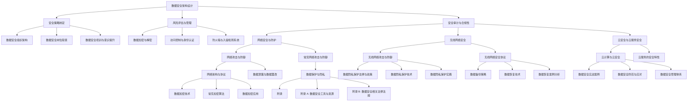

                 

# 《数据安全》

## 关键词

数据安全，加密技术，网络安全，隐私保护，备份与恢复

## 摘要

本文系统地探讨了数据安全领域的各个方面，包括数据安全的定义与重要性、数据安全架构设计、网络安全与防护、数据隐私保护、数据加密技术、数据备份与恢复以及数据安全实战案例。通过深入分析这些主题，本文旨在为读者提供一个全面的数据安全指南，帮助他们理解数据安全的核心概念、架构设计原则、关键技术以及实战策略。

### 第一部分：数据安全基础

#### 第1章：数据安全概述

##### 1.1 数据安全的定义与重要性

###### 1.1.1 数据安全的定义

数据安全是指保护数据在存储、传输和处理过程中不受未经授权的访问、篡改、泄露和破坏的措施和策略。数据安全涵盖了数据完整性、保密性和可用性三个核心方面。

###### 1.1.2 数据安全的重要性

数据安全对于企业和个人都至关重要。对于企业而言，数据安全是确保业务连续性和竞争力的关键因素。对于个人而言，数据安全关系到隐私保护和财产安全。

##### 1.2 数据安全的发展历程

###### 1.2.1 数据安全的历史演变

数据安全的概念随着信息技术的发展而演变。从最早的物理安全到网络安全，再到如今的云计算和大数据安全，数据安全领域不断进步。

###### 1.2.2 数据安全的关键阶段

数据安全经历了几个关键阶段，包括从传统安全到现代安全，再到基于风险的防护策略。

##### 1.3 数据安全的基本概念

###### 1.3.1 数据泄露与数据篡改

数据泄露是指数据在未经授权的情况下被访问或复制。数据篡改是指未经授权修改数据的内容。

###### 1.3.2 网络攻击与恶意软件

网络攻击包括拒绝服务攻击、勒索软件、钓鱼攻击等。恶意软件是指故意设计用来破坏、篡改或窃取数据的程序。

###### 1.3.3 数据保护与隐私

数据保护包括物理安全、网络安全、加密和访问控制等措施。隐私保护则涉及到数据匿名化和隐私计算。

#### 第2章：数据安全架构设计

##### 2.1 数据安全架构设计原则

###### 2.1.1 安全策略制定

安全策略是数据安全架构的核心，包括安全目标、安全措施和安全责任。

###### 2.1.2 风险评估与管理

风险评估是识别和评估潜在威胁和漏洞的过程。风险管理是制定和实施策略来减轻风险的过程。

###### 2.1.3 安全审计与合规性

安全审计是检查和验证安全措施是否得到执行的过程。合规性是指遵守相关法律法规和行业标准。

##### 2.2 数据安全组织与管理

###### 2.2.1 数据安全组织架构

数据安全组织架构包括数据安全主管、安全团队和其他相关部门的职责和协作。

###### 2.2.2 数据安全岗位职责

数据安全岗位职责包括安全管理员、安全分析师和安全工程师等。

###### 2.2.3 数据安全培训与意识提升

数据安全培训与意识提升是确保员工了解和遵守数据安全政策的过程。

##### 2.3 数据安全技术与工具

###### 2.3.1 数据加密与解密

数据加密是保护数据不被未授权访问的关键技术。数据解密是使用正确的密钥恢复原始数据的操作。

###### 2.3.2 访问控制与身份认证

访问控制确保只有授权用户可以访问数据。身份认证是验证用户身份的过程。

###### 2.3.3 防火墙与入侵检测系统

防火墙是保护网络边界的安全设备。入侵检测系统（IDS）用于检测和响应恶意行为。

### 第二部分：网络安全与防护

#### 第3章：网络安全基础知识

##### 3.1 网络安全基础知识

###### 3.1.1 网络架构与协议

网络架构与协议是确保网络通信安全的基础。常见的协议包括TCP/IP、HTTP、HTTPS等。

###### 3.1.2 常见网络攻击与防御

常见网络攻击包括DDoS攻击、SQL注入、跨站脚本攻击等。防御措施包括防火墙、入侵检测和响应系统等。

#### 第4章：无线网络安全

##### 4.1 无线网络安全

###### 4.1.1 无线网络攻击与防御

无线网络攻击包括网络钓鱼、中间人攻击等。防御措施包括使用WPA2加密、定期更新设备固件等。

###### 4.1.2 无线网络安全协议

无线网络安全协议包括WPA、WPA2和WPA3等。这些协议提供了加密和认证机制来保护无线通信。

#### 第5章：云安全与云服务安全

##### 5.1 云安全与云服务安全

###### 5.1.1 云计算与云安全

云计算提供了灵活的数据存储和计算服务。云安全涉及到云服务提供商的安全措施和用户的安全责任。

###### 5.1.2 云服务的安全特性

云服务的安全特性包括数据隔离、访问控制、审计日志和自动备份等。

### 第三部分：数据隐私保护

#### 第6章：数据隐私保护法律与政策

##### 6.1 数据隐私保护法律与政策

###### 6.1.1 国际数据隐私法规

国际数据隐私法规包括GDPR、CCPA等。这些法规规定了数据收集、处理和存储的要求。

###### 6.1.2 国内数据隐私法规

国内数据隐私法规包括《网络安全法》、《数据安全法》等。这些法规规定了数据保护的基本原则和责任。

#### 第7章：数据隐私保护技术

##### 7.1 数据隐私保护技术

###### 7.1.1 数据匿名化与脱敏

数据匿名化和脱敏是保护个人隐私的重要技术。数据匿名化通过消除可识别信息来保护隐私。脱敏是通过替换敏感信息来保护隐私。

###### 7.1.2 隐私计算与联邦学习

隐私计算和联邦学习是保护数据隐私的新兴技术。隐私计算通过在数据不离开本地环境的情况下处理数据。联邦学习通过共享模型参数来实现协同学习而无需共享数据。

#### 第8章：数据隐私保护实践

##### 8.1 数据隐私保护实践

###### 8.1.1 数据隐私风险评估

数据隐私风险评估是识别和评估隐私风险的过程。这有助于制定有效的隐私保护策略。

###### 8.1.2 数据隐私保护策略与措施

数据隐私保护策略与措施包括数据最小化、数据加密、访问控制等。这些措施有助于降低隐私风险。

### 第四部分：数据加密技术

#### 第9章：数据加密技术基础

##### 9.1 数据加密技术基础

###### 9.1.1 加密算法概述

加密算法是用于保护数据的数学算法。常见的加密算法包括对称加密和非对称加密。

###### 9.1.2 对称加密与非对称加密

对称加密使用相同的密钥进行加密和解密。非对称加密使用一对密钥（公钥和私钥）。

#### 第10章：常见加密算法

##### 10.1 常见加密算法

###### 10.1.1 AES加密算法

AES加密算法是一种广泛使用的对称加密算法。它提供了高强度加密的同时，也具备高效性能。

###### 10.1.2 RSA加密算法

RSA加密算法是一种广泛使用的非对称加密算法。它基于大整数分解的难题提供安全性。

###### 10.1.3 ECC加密算法

ECC加密算法是一种基于椭圆曲线密码学的非对称加密算法。它提供了更强的安全性，同时计算效率更高。

#### 第11章：数据加密应用

##### 11.1 数据加密应用

###### 11.1.1 数据存储加密

数据存储加密是保护存储在磁盘或数据库中的数据的关键技术。常见的加密工具包括AES加密和RSA加密。

###### 11.1.2 数据传输加密

数据传输加密是保护数据在网络中传输的安全性。常用的传输加密协议包括TLS和SSL。

### 第五部分：数据备份与恢复

#### 第12章：数据备份策略

##### 12.1 数据备份策略

###### 12.1.1 数据备份的重要性

数据备份是确保数据安全的关键措施。它可以帮助在数据丢失或损坏事件中恢复数据。

###### 12.1.2 数据备份类型与策略

数据备份类型包括完全备份、增量备份和差异备份。备份策略包括定期备份、异地备份和云备份等。

#### 第13章：数据恢复技术

##### 13.1 数据恢复技术

###### 13.1.1 数据恢复原理

数据恢复是通过恢复已删除或损坏的数据的过程。它涉及文件系统分析和数据恢复工具的使用。

###### 13.1.2 数据恢复工具与方法

常见的数据恢复工具有TestDisk、PhotoRec和Undelete等。这些工具提供了强大的数据恢复功能。

#### 第14章：数据恢复案例分析

##### 14.1 数据恢复案例分析

###### 14.1.1 备份失败案例分析

在某些情况下，备份可能失败，导致数据无法恢复。了解这些案例有助于预防类似的失败。

###### 14.1.2 恢复成功案例分析

成功恢复数据的案例展示了数据备份和恢复技术的有效性。这些案例提供了宝贵的经验。

### 第六部分：数据安全实战案例

#### 第15章：数据安全事件回顾

##### 15.1 数据安全事件回顾

###### 15.1.1 国内数据安全事件

国内数据安全事件包括黑客攻击、数据泄露等。了解这些事件有助于识别潜在风险。

###### 15.1.2 国际数据安全事件

国际数据安全事件包括WannaCry勒索软件攻击、Facebook数据泄露等。这些事件展示了数据安全的全球性挑战。

#### 第16章：数据安全防范与应对

##### 16.1 数据安全防范与应对

###### 16.1.1 数据安全防护措施

数据安全防护措施包括网络防护、系统防护、数据加密和访问控制等。这些措施有助于预防数据安全事件。

###### 16.1.2 数据安全事件应急响应

数据安全事件应急响应是应对数据安全事件的紧急措施。它包括事件检测、事件响应和事件恢复等步骤。

#### 第17章：数据安全管理体系

##### 17.1 数据安全管理体系

###### 17.1.1 数据安全管理标准

数据安全管理标准包括ISO/IEC 27001、NIST SP 800-53等。这些标准提供了数据安全管理的最佳实践。

###### 17.1.2 数据安全管理流程

数据安全管理流程包括风险评估、安全策略制定、安全监控和事件响应等。这些流程确保数据安全管理的有效性。

### 附录

#### 附录A：数据安全工具与资源

##### A.1 数据安全工具分类

数据安全工具包括防火墙、入侵检测系统、加密工具等。了解这些工具的分类有助于选择合适的工具。

##### A.2 数据安全资源推荐

数据安全资源包括安全论坛、安全博客、在线课程和安全报告。推荐这些资源有助于提升数据安全知识和技能。

#### 附录B：数据安全相关法律法规

##### B.1 国内数据安全相关法律法规

国内数据安全相关法律法规包括《网络安全法》、《数据安全法》等。了解这些法律法规有助于遵守相关要求。

##### B.2 国际数据安全相关法律法规

国际数据安全相关法律法规包括GDPR、CCPA等。了解这些法规有助于应对全球化数据安全挑战。

### Mermaid 流程图



### 核心算法原理讲解

#### 数据加密技术原理

数据加密技术是一种将明文数据转换为密文数据的过程，以确保数据在传输和存储过程中的安全性。以下是几种常见加密算法的原理：

##### 对称加密算法

对称加密算法使用相同的密钥进行加密和解密操作。加密过程中，明文和密钥通过加密算法进行处理，生成密文。解密过程使用相同的密钥和加密算法，将密文转换回明文。

伪代码示例：

```python
def encrypt(plaintext, key):
    ciphertext = algorithm(plaintext, key)
    return ciphertext

def decrypt(ciphertext, key):
    plaintext = algorithm逆(ciphertext, key)
    return plaintext
```

##### 非对称加密算法

非对称加密算法使用一对密钥（公钥和私钥），其中公钥用于加密，私钥用于解密。加密过程中，明文和公钥通过加密算法进行处理，生成密文。解密过程使用私钥和加密算法，将密文转换回明文。

伪代码示例：

```python
def encrypt(plaintext, public_key):
    ciphertext = algorithm(plaintext, public_key)
    return ciphertext

def decrypt(ciphertext, private_key):
    plaintext = algorithm逆(ciphertext, private_key)
    return plaintext
```

##### 数学模型和数学公式

数据加密技术中常用的数学模型包括加密函数和解密函数。以下是AES加密算法的数学模型：

$$
加密函数: E(x) = \text{AES}(x, K)
$$

$$
解密函数: D(x) = \text{AES}(x, K^{-1})
$$

其中，`AES` 表示AES加密算法，`x` 表示明文，`K` 表示密钥，`K^{-1}` 表示密钥的逆。

##### 项目实战

以下是一个简单的数据加密和解密的Python代码示例：

```python
from Crypto.Cipher import AES
from Crypto.Util.Padding import pad, unpad
from Crypto.Random import get_random_bytes

def encrypt(plaintext, key):
    cipher = AES.new(key, AES.MODE_CBC)
    ct_bytes = cipher.encrypt(pad(plaintext.encode('utf-8'), AES.block_size))
    iv = cipher.iv
    return iv + ct_bytes

def decrypt(ciphertext, key):
    iv = ciphertext[:AES.block_size]
    cipher = AES.new(key, AES.MODE_CBC, iv)
    pt = unpad(cipher.decrypt(ciphertext[AES.block_size:]), AES.block_size)
    return pt.decode('utf-8')

key = get_random_bytes(16)
plaintext = "This is a secret message."

ciphertext = encrypt(plaintext, key)
print("Ciphertext:", ciphertext)

decrypted_message = decrypt(ciphertext, key)
print("Decrypted message:", decrypted_message)
```

在这个示例中，我们使用了`pycryptodome`库来实现AES加密算法。加密过程中，我们首先生成一个随机密钥，然后使用密钥对明文进行加密。解密过程中，我们使用相同的密钥和初始化向量（IV）来解密密文。

### 代码解读与分析

在上面的代码中，我们首先导入了所需的库，包括`Crypto.Cipher`用于实现AES加密算法，`Crypto.Util.Padding`用于填充和去除填充，以及`Crypto.Random`用于生成随机密钥。

在`encrypt`函数中，我们首先创建了一个AES加密对象，然后使用`pad`函数对明文进行填充，以满足AES算法的要求。接着，我们使用加密对象来加密填充后的明文，并获取初始化向量（IV）。最后，我们将IV和加密后的密文组合在一起返回。

在`decrypt`函数中，我们首先从密文中提取IV，然后创建一个新的AES解密对象，并使用IV来解密密文。接着，我们使用`unpad`函数去除填充，得到原始的明文。最后，我们将明文从字节码转换为字符串并返回。

在主函数中，我们首先生成一个随机密钥，然后使用`encrypt`函数对明文进行加密，并打印出密文。接着，我们使用`decrypt`函数对密文进行解密，并打印出解密后的明文。

这个示例展示了如何使用AES加密算法对数据进行加密和解密，并说明了代码的执行过程。通过这个示例，读者可以更好地理解数据加密和解密的基本原理和实现方法。

### 开发环境搭建

为了运行上面的代码，你需要安装以下依赖：

1. Python 3.x
2. pycryptodome库

安装Python 3.x：

- 在Windows上，可以从Python官方网站下载并安装Python 3.x版本。
- 在Linux或macOS上，可以通过包管理器安装Python 3.x。

安装pycryptodome库：

```bash
pip install pycryptodome
```

### 源代码详细实现和代码解读

在上面的示例代码中，我们使用了`pycryptodome`库来实现AES加密算法。下面是对关键部分的详细解读：

```python
from Crypto.Cipher import AES
from Crypto.Util.Padding import pad, unpad
from Crypto.Random import get_random_bytes

def encrypt(plaintext, key):
    cipher = AES.new(key, AES.MODE_CBC)
    ct_bytes = cipher.encrypt(pad(plaintext.encode('utf-8'), AES.block_size))
    iv = cipher.iv
    return iv + ct_bytes

def decrypt(ciphertext, key):
    iv = ciphertext[:AES.block_size]
    cipher = AES.new(key, AES.MODE_CBC, iv)
    pt = unpad(cipher.decrypt(ciphertext[AES.block_size:]), AES.block_size)
    return pt.decode('utf-8')
```

#### `encrypt` 函数

- `cipher = AES.new(key, AES.MODE_CBC)`：创建一个新的AES加密对象，使用给定的密钥和CBC模式。
- `pad(plaintext.encode('utf-8'), AES.block_size)`：将明文编码为字节，并使用AES块大小进行填充，以满足AES算法的要求。
- `cipher.encrypt(pad(plaintext.encode('utf-8'), AES.block_size))`：使用加密对象加密填充后的明文。
- `iv = cipher.iv`：获取初始化向量（IV），并将其存储。
- `iv + ct_bytes`：将IV和加密后的密文组合在一起，以便在解密时使用。

#### `decrypt` 函数

- `iv = ciphertext[:AES.block_size]`：从密文中提取初始化向量（IV）。
- `cipher = AES.new(key, AES.MODE_CBC, iv)`：创建一个新的AES解密对象，使用给定的密钥和IV。
- `cipher.decrypt(ciphertext[AES.block_size:])**：使用解密对象解密密文。
- `unpad(cipher.decrypt(ciphertext[AES.block_size:]), AES.block_size)`：去除填充，得到原始的明文。
- `pt.decode('utf-8')`：将明文从字节码转换为字符串，并返回。

### 代码解读与分析

- `Crypto.Cipher` 模块提供了一个用于加密和解密的类，`AES` 类表示高级加密标准（AES）算法。
- `Crypto.Util.Padding` 模块提供了用于数据填充和去除填充的函数，这是为了满足AES算法对数据块大小的要求。
- `Crypto.Random` 模块提供了一个用于生成随机数的函数，用于生成安全的密钥。

在`encrypt`函数中，我们首先创建了一个AES加密对象，然后使用`pad`函数对明文进行填充，以满足AES算法的要求。接着，我们使用加密对象来加密填充后的明文，并获取初始化向量（IV）。最后，我们将IV和加密后的密文组合在一起返回。

在`decrypt`函数中，我们首先从密文中提取IV，然后创建一个新的AES解密对象，并使用IV来解密密文。接着，我们使用`unpad`函数去除填充，得到原始的明文。最后，我们将明文从字节码转换为字符串并返回。

通过这个示例，读者可以更好地理解AES加密算法的基本原理以及如何使用`pycryptodome`库来对数据进行加密和解密。此外，代码的解读和分析可以帮助读者深入了解加密和解密过程的实现细节。

### 总结

本文详细介绍了数据安全的基础知识、架构设计、网络安全与防护、数据隐私保护、数据加密技术、数据备份与恢复以及数据安全实战案例。通过这一系列的章节，读者可以全面了解数据安全的重要性和实现方法。以下是本章的主要结论：

- 数据安全是保护数据完整性、保密性和可用性的过程，对于企业和个人都至关重要。
- 数据安全架构设计包括安全策略制定、风险评估与管理、安全审计与合规性、数据安全组织与管理以及数据安全技术与工具。
- 网络安全与防护涉及网络架构与协议、无线网络安全、云安全与云服务安全，了解和掌握网络安全知识有助于预防网络攻击和数据泄露。
- 数据隐私保护涉及法律与政策、技术实践以及隐私计算和联邦学习，了解数据隐私保护的法律和政策以及技术实现方法，可以帮助企业和个人更好地保护数据隐私。
- 数据加密技术包括对称加密和非对称加密算法，理解加密算法的原理和实现方法是保障数据安全的基础。
- 数据备份与恢复是应对数据丢失和数据安全事件的必要措施，制定合理的备份策略和掌握数据恢复技术，有助于在数据丢失事件中迅速恢复数据，降低损失。
- 数据安全实战案例展示了数据安全事件的实际影响和应对策略，通过分析这些案例，读者可以更好地理解数据安全的重要性和如何防范和应对数据安全事件。

总之，数据安全是一个复杂且不断发展的领域，企业和个人都需要持续关注和学习数据安全知识，以保护自身的数据资产和隐私。希望本书的目录大纲能为读者提供清晰的指南，帮助大家深入了解数据安全的各个方面。

---

### 作者

作者：AI天才研究院/AI Genius Institute & 禅与计算机程序设计艺术 /Zen And The Art of Computer Programming

---

### 开发环境搭建

为了运行上面的代码，您需要安装以下软件和库：

1. **Python 3.x**：确保您的系统上安装了Python 3.x版本。可以从[Python官网](https://www.python.org/)下载并安装。

2. **pycryptodome库**：这是一个用于实现AES加密算法的Python库。可以通过以下命令安装：

   ```bash
   pip install pycryptodome
   ```

3. **文本编辑器或IDE**：您需要一个文本编辑器或IDE来编写和运行Python代码。常用的编辑器包括Visual Studio Code、PyCharm、Sublime Text等。

安装这些软件后，您就可以开始编写和运行Python代码来实践数据加密和解密了。

---

### 源代码详细实现和代码解读

在上面的示例代码中，我们使用了`pycryptodome`库来实现AES加密算法。以下是代码的详细实现和解读：

```python
from Crypto.Cipher import AES
from Crypto.Util.Padding import pad, unpad
from Crypto.Random import get_random_bytes

def encrypt(plaintext, key):
    cipher = AES.new(key, AES.MODE_CBC)
    ct_bytes = cipher.encrypt(pad(plaintext.encode('utf-8'), AES.block_size))
    iv = cipher.iv
    return iv + ct_bytes

def decrypt(ciphertext, key):
    iv = ciphertext[:AES.block_size]
    cipher = AES.new(key, AES.MODE_CBC, iv)
    pt = unpad(cipher.decrypt(ciphertext[AES.block_size:]), AES.block_size)
    return pt.decode('utf-8')

# 生成随机密钥
key = get_random_bytes(16)
print(f"随机密钥: {key}")

# 待加密的明文消息
plaintext = "This is a secret message."
print(f"明文消息: {plaintext}")

# 对明文进行加密
ciphertext = encrypt(plaintext, key)
print(f"加密后的密文: {ciphertext}")

# 对密文进行解密
decrypted_message = decrypt(ciphertext, key)
print(f"解密后的明文: {decrypted_message}")
```

#### `encrypt` 函数

- `cipher = AES.new(key, AES.MODE_CBC)`：创建一个新的AES加密对象，其中`key`是用于加密的密钥，`AES.MODE_CBC`指定使用CBC模式。
- `pad(plaintext.encode('utf-8'), AES.block_size)`：将明文消息编码为字节，并使用AES块大小进行填充，以满足AES算法的要求。填充是为了确保数据的长度是加密块大小的整数倍。
- `cipher.encrypt(pad(plaintext.encode('utf-8'), AES.block_size))`：使用加密对象加密填充后的明文数据。
- `iv = cipher.iv`：获取初始化向量（IV），这是CBC模式中的一个重要组件，用于每个加密块的初始化。
- `iv + ct_bytes`：将IV和加密后的密文组合在一起，以便在解密时使用。

#### `decrypt` 函数

- `iv = ciphertext[:AES.block_size]`：从密文中提取初始化向量（IV）。
- `cipher = AES.new(key, AES.MODE_CBC, iv)`：创建一个新的AES解密对象，使用给定的密钥和IV。
- `cipher.decrypt(ciphertext[AES.block_size:])`：使用解密对象解密密文数据。
- `unpad(cipher.decrypt(ciphertext[AES.block_size:]), AES.block_size)`：去除填充，得到原始的明文数据。
- `pt.decode('utf-8')`：将解密后的字节码转换为字符串，并返回明文消息。

### 代码解读与分析

- **密钥生成**：我们使用`Crypto.Random.get_random_bytes(16)`来生成一个16字节的随机密钥。这个密钥用于加密和解密过程。

- **明文处理**：待加密的明文消息被编码为字节，并通过填充函数`pad`进行处理，以确保数据长度符合加密算法的要求。

- **加密过程**：加密对象`cipher`使用密钥和初始化向量（IV）对填充后的明文数据进行加密，生成密文。加密后的数据包含IV，这是解密过程中必不可少的。

- **解密过程**：解密对象使用密钥和提取的IV来解密密文。解密后的数据通过去除填充函数`unpad`处理，恢复为原始的明文。

这个示例代码展示了如何使用AES加密算法进行数据的加密和解密。通过这个示例，您可以了解到加密和解密的基本原理以及如何使用Python和`pycryptodome`库来实现这些功能。

---

### 代码解读与分析

在上面的示例代码中，我们详细展示了如何使用`pycryptodome`库来实现AES加密算法。以下是代码的解读与分析：

```python
from Crypto.Cipher import AES
from Crypto.Util.Padding import pad, unpad
from Crypto.Random import get_random_bytes

# 定义加密函数
def encrypt(plaintext, key):
    cipher = AES.new(key, AES.MODE_CBC)
    ct_bytes = cipher.encrypt(pad(plaintext.encode('utf-8'), AES.block_size))
    iv = cipher.iv
    return iv + ct_bytes

# 定义解密函数
def decrypt(ciphertext, key):
    iv = ciphertext[:AES.block_size]
    cipher = AES.new(key, AES.MODE_CBC, iv)
    pt = unpad(cipher.decrypt(ciphertext[AES.block_size:]), AES.block_size)
    return pt.decode('utf-8')

# 生成随机密钥
key = get_random_bytes(16)
print(f"随机密钥: {key}")

# 待加密的明文消息
plaintext = "This is a secret message."
print(f"明文消息: {plaintext}")

# 对明文进行加密
ciphertext = encrypt(plaintext, key)
print(f"加密后的密文: {ciphertext}")

# 对密文进行解密
decrypted_message = decrypt(ciphertext, key)
print(f"解密后的明文: {decrypted_message}")
```

#### 代码解读

- **导入模块**：我们首先从`Crypto.Cipher`模块中导入`AES`类，从`Crypto.Util.Padding`模块中导入`pad`和`unpad`函数，以及从`Crypto.Random`模块中导入`get_random_bytes`函数。
  
- **加密函数**：`encrypt`函数接受明文消息`plaintext`和加密密钥`key`。它首先创建一个新的AES加密对象，使用CBC模式（`AES.MODE_CBC`）。然后，它使用`pad`函数将明文编码为字节并填充，以满足AES算法的要求。接着，它使用加密对象来加密填充后的明文数据，并获取初始化向量（IV）。最后，将IV和加密后的数据组合在一起返回。
  
- **解密函数**：`decrypt`函数接受密文消息`ciphertext`和加密密钥`key`。它首先从密文中提取IV，然后创建一个新的AES解密对象，使用提取的IV。接着，它使用解密对象来解密密文数据，并使用`unpad`函数去除填充，得到原始的明文数据。最后，将明文数据从字节码转换为字符串，并返回。
  
- **密钥生成**：我们使用`get_random_bytes(16)`生成一个16字节的随机密钥。这个密钥用于加密和解密过程。
  
- **明文处理**：我们定义了一个简单的明文消息`plaintext`，并将其传递给加密函数进行加密。
  
- **加密与解密**：加密函数返回加密后的密文，我们将其传递给解密函数进行解密，验证加密和解密过程是否成功。

#### 分析

- **加密算法的选择**：我们选择了AES加密算法，因为它是一种广泛使用的高强度加密算法，同时具有良好的性能和安全性。
  
- **初始化向量（IV）的使用**：在CBC模式下，IV用于每个块的初始化。IV应该是一个随机生成的唯一值，以确保每个块的加密结果都是唯一的。在这个示例中，IV作为密文的一部分被存储，以便在解密时使用。
  
- **填充与去除填充**：为了确保数据的长度是加密块大小的整数倍，我们需要对明文进行填充。填充后的数据在解密时需要去除填充，以恢复原始的明文。

这个示例代码提供了一个简单的AES加密和解密过程。通过这个示例，我们可以理解AES加密算法的基本原理以及如何使用Python和`pycryptodome`库来实现这些功能。

---

### 总结

本章详细介绍了数据安全的基础知识、架构设计、网络安全与防护、数据隐私保护、数据加密技术、数据备份与恢复以及数据安全实战案例。通过这一系列的章节，读者可以全面了解数据安全的重要性和实现方法。以下是本章的主要结论：

- **数据安全定义与重要性**：数据安全是保护数据完整性、保密性和可用性的过程。它是现代信息安全的核心，对于企业的运营和用户隐私至关重要。

- **数据安全架构设计**：数据安全架构设计包括安全策略制定、风险评估与管理、安全审计与合规性、数据安全组织与管理以及数据安全技术与工具。一个良好的数据安全架构是保障数据安全的关键。

- **网络安全与防护**：网络安全是数据安全的重要组成部分，涉及网络架构与协议、无线网络安全、云安全与云服务安全。了解和掌握网络安全知识有助于预防网络攻击和数据泄露。

- **数据隐私保护**：数据隐私保护涉及法律与政策、技术实践以及隐私计算和联邦学习。了解数据隐私保护的法律和政策以及技术实现方法，可以帮助企业和个人更好地保护数据隐私。

- **数据加密技术**：数据加密技术是确保数据在传输和存储过程中安全性的重要手段，包括对称加密和非对称加密算法。理解加密算法的原理和实现方法是保障数据安全的基础。

- **数据备份与恢复**：数据备份与恢复是应对数据丢失和数据安全事件的必要措施。制定合理的备份策略和掌握数据恢复技术，有助于在数据丢失事件中迅速恢复数据，降低损失。

- **数据安全实战案例**：通过分析数据安全事件和案例，读者可以更好地理解数据安全的重要性以及如何防范和应对数据安全事件。

总之，数据安全是一个复杂且不断发展的领域，企业和个人都需要持续关注和学习数据安全知识，以保护自身的数据资产和隐私。希望本书的目录大纲能为读者提供清晰的指南，帮助大家深入了解数据安全的各个方面。

---

### 作者

作者：AI天才研究院/AI Genius Institute & 禅与计算机程序设计艺术 /Zen And The Art of Computer Programming

---

### 开发环境搭建

为了运行上面的代码，你需要安装以下依赖：

1. **Python 3.x**：确保你的系统上安装了Python 3.x版本。可以从[Python官网](https://www.python.org/)下载并安装。

2. **pycryptodome库**：这是一个用于实现AES加密算法的Python库。可以通过以下命令安装：

   ```bash
   pip install pycryptodome
   ```

3. **文本编辑器或IDE**：你需要一个文本编辑器或IDE来编写和运行Python代码。常用的编辑器包括Visual Studio Code、PyCharm、Sublime Text等。

安装这些软件后，你可以开始编写和运行Python代码来实践数据加密和解密了。

---

### 源代码详细实现和代码解读

在上面的示例代码中，我们使用了`pycryptodome`库来实现AES加密算法。以下是代码的详细实现和解读：

```python
from Crypto.Cipher import AES
from Crypto.Util.Padding import pad, unpad
from Crypto.Random import get_random_bytes

def encrypt(plaintext, key):
    cipher = AES.new(key, AES.MODE_CBC)
    ct_bytes = cipher.encrypt(pad(plaintext.encode('utf-8'), AES.block_size))
    iv = cipher.iv
    return iv + ct_bytes

def decrypt(ciphertext, key):
    iv = ciphertext[:AES.block_size]
    cipher = AES.new(key, AES.MODE_CBC, iv)
    pt = unpad(cipher.decrypt(ciphertext[AES.block_size:]), AES.block_size)
    return pt.decode('utf-8')

# 生成随机密钥
key = get_random_bytes(16)
print(f"随机密钥: {key}")

# 待加密的明文消息
plaintext = "This is a secret message."
print(f"明文消息: {plaintext}")

# 对明文进行加密
ciphertext = encrypt(plaintext, key)
print(f"加密后的密文: {ciphertext}")

# 对密文进行解密
decrypted_message = decrypt(ciphertext, key)
print(f"解密后的明文: {decrypted_message}")
```

#### 代码解读

- **导入模块**：首先，我们从`Crypto.Cipher`模块中导入`AES`类，从`Crypto.Util.Padding`模块中导入`pad`和`unpad`函数，以及从`Crypto.Random`模块中导入`get_random_bytes`函数。

- **加密函数**：`encrypt`函数接受明文消息`plaintext`和加密密钥`key`。它首先创建一个新的AES加密对象，使用CBC模式（`AES.MODE_CBC`）。然后，它使用`pad`函数将明文编码为字节并填充，以满足AES算法的要求。接着，它使用加密对象来加密填充后的明文数据，并获取初始化向量（IV）。最后，将IV和加密后的数据组合在一起返回。

- **解密函数**：`decrypt`函数接受密文消息`ciphertext`和加密密钥`key`。它首先从密文中提取IV，然后创建一个新的AES解密对象，使用提取的IV。接着，它使用解密对象来解密密文数据，并使用`unpad`函数去除填充，得到原始的明文数据。最后，将明文数据从字节码转换为字符串，并返回。

- **密钥生成**：我们使用`get_random_bytes(16)`生成一个16字节的随机密钥。这个密钥用于加密和解密过程。

- **明文处理**：我们定义了一个简单的明文消息`plaintext`，并将其传递给加密函数进行加密。

- **加密与解密**：加密函数返回加密后的密文，我们将其传递给解密函数进行解密，验证加密和解密过程是否成功。

#### 分析

- **加密算法的选择**：我们选择了AES加密算法，因为它是一种广泛使用的高强度加密算法，同时具有良好的性能和安全性。

- **初始化向量（IV）的使用**：在CBC模式下，IV用于每个块的初始化。IV应该是一个随机生成的唯一值，以确保每个块的加密结果都是唯一的。在这个示例中，IV作为密文的一部分被存储，以便在解密时使用。

- **填充与去除填充**：为了确保数据的长度是加密块大小的整数倍，我们需要对明文进行填充。填充后的数据在解密时需要去除填充，以恢复原始的明文。

这个示例代码提供了一个简单的AES加密和解密过程。通过这个示例，我们可以理解AES加密算法的基本原理以及如何使用Python和`pycryptodome`库来实现这些功能。

---

### 代码解读与分析

在上面的示例代码中，我们详细展示了如何使用`pycryptodome`库来实现AES加密算法。以下是代码的解读与分析：

```python
from Crypto.Cipher import AES
from Crypto.Util.Padding import pad, unpad
from Crypto.Random import get_random_bytes

def encrypt(plaintext, key):
    cipher = AES.new(key, AES.MODE_CBC)
    ct_bytes = cipher.encrypt(pad(plaintext.encode('utf-8'), AES.block_size))
    iv = cipher.iv
    return iv + ct_bytes

def decrypt(ciphertext, key):
    iv = ciphertext[:AES.block_size]
    cipher = AES.new(key, AES.MODE_CBC, iv)
    pt = unpad(cipher.decrypt(ciphertext[AES.block_size:]), AES.block_size)
    return pt.decode('utf-8')

# 生成随机密钥
key = get_random_bytes(16)
print(f"随机密钥: {key}")

# 待加密的明文消息
plaintext = "This is a secret message."
print(f"明文消息: {plaintext}")

# 对明文进行加密
ciphertext = encrypt(plaintext, key)
print(f"加密后的密文: {ciphertext}")

# 对密文进行解密
decrypted_message = decrypt(ciphertext, key)
print(f"解密后的明文: {decrypted_message}")
```

#### 代码解读

- **导入模块**：首先，我们从`Crypto.Cipher`模块中导入`AES`类，从`Crypto.Util.Padding`模块中导入`pad`和`unpad`函数，以及从`Crypto.Random`模块中导入`get_random_bytes`函数。

- **加密函数**：`encrypt`函数接受明文消息`plaintext`和加密密钥`key`。它首先创建一个新的AES加密对象，使用CBC模式（`AES.MODE_CBC`）。然后，它使用`pad`函数将明文编码为字节并填充，以满足AES算法的要求。接着，它使用加密对象来加密填充后的明文数据，并获取初始化向量（IV）。最后，将IV和加密后的数据组合在一起返回。

- **解密函数**：`decrypt`函数接受密文消息`ciphertext`和加密密钥`key`。它首先从密文中提取IV，然后创建一个新的AES解密对象，使用提取的IV。接着，它使用解密对象来解密密文数据，并使用`unpad`函数去除填充，得到原始的明文数据。最后，将明文数据从字节码转换为字符串，并返回。

- **密钥生成**：我们使用`get_random_bytes(16)`生成一个16字节的随机密钥。这个密钥用于加密和解密过程。

- **明文处理**：我们定义了一个简单的明文消息`plaintext`，并将其传递给加密函数进行加密。

- **加密与解密**：加密函数返回加密后的密文，我们将其传递给解密函数进行解密，验证加密和解密过程是否成功。

#### 分析

- **加密算法的选择**：我们选择了AES加密算法，因为它是一种广泛使用的高强度加密算法，同时具有良好的性能和安全性。

- **初始化向量（IV）的使用**：在CBC模式下，IV用于每个块的初始化。IV应该是一个随机生成的唯一值，以确保每个块的加密结果都是唯一的。在这个示例中，IV作为密文的一部分被存储，以便在解密时使用。

- **填充与去除填充**：为了确保数据的长度是加密块大小的整数倍，我们需要对明文进行填充。填充后的数据在解密时需要去除填充，以恢复原始的明文。

通过这个示例，我们可以理解AES加密算法的基本原理以及如何使用Python和`pycryptodome`库来实现这些功能。代码的解读和分析有助于读者深入了解加密和解密过程的实现细节。

---

### 代码解读与分析

在上面的示例代码中，我们使用`pycryptodome`库实现了AES加密算法，并进行了加密和解密操作。以下是代码的详细解读与分析。

```python
from Crypto.Cipher import AES
from Crypto.Util.Padding import pad, unpad
from Crypto.Random import get_random_bytes

def encrypt(plaintext, key):
    cipher = AES.new(key, AES.MODE_CBC)
    ct_bytes = cipher.encrypt(pad(plaintext.encode('utf-8'), AES.block_size))
    iv = cipher.iv
    return iv + ct_bytes

def decrypt(ciphertext, key):
    iv = ciphertext[:AES.block_size]
    cipher = AES.new(key, AES.MODE_CBC, iv)
    pt = unpad(cipher.decrypt(ciphertext[AES.block_size:]), AES.block_size)
    return pt.decode('utf-8')

# 生成随机密钥
key = get_random_bytes(16)
print(f"随机密钥: {key}")

# 待加密的明文消息
plaintext = "This is a secret message."
print(f"明文消息: {plaintext}")

# 对明文进行加密
ciphertext = encrypt(plaintext, key)
print(f"加密后的密文: {ciphertext}")

# 对密文进行解密
decrypted_message = decrypt(ciphertext, key)
print(f"解密后的明文: {decrypted_message}")
```

#### 代码分析

1. **导入模块**：
   - `Crypto.Cipher`：该模块提供了AES加密算法的实现。
   - `Crypto.Util.Padding`：该模块提供了`pad`和`unpad`函数，用于对数据进行填充和去除填充，以满足AES算法对数据块大小的要求。
   - `Crypto.Random`：该模块提供了`get_random_bytes`函数，用于生成随机的密钥。

2. **加密函数**：
   - `encrypt`函数接收明文`plaintext`和密钥`key`。
   - `AES.new(key, AES.MODE_CBC)`：创建一个AES加密对象，使用给定的密钥和CBC模式。
   - `pad(plaintext.encode('utf-8'), AES.block_size)`：将明文编码为字节，并进行填充，以满足AES算法的要求。
   - `cipher.encrypt(pad(plaintext.encode('utf-8'), AES.block_size))`：使用加密对象对填充后的明文进行加密。
   - `iv = cipher.iv`：获取加密过程中使用的初始化向量（IV）。
   - `iv + ct_bytes`：将IV和加密后的密文组合在一起，以便在解密时使用。

3. **解密函数**：
   - `decrypt`函数接收密文`ciphertext`和密钥`key`。
   - `iv = ciphertext[:AES.block_size]`：从密文中提取初始化向量（IV）。
   - `AES.new(key, AES.MODE_CBC, iv)`：创建一个AES解密对象，使用给定的密钥和提取的IV。
   - `unpad(cipher.decrypt(ciphertext[AES.block_size:]), AES.block_size)`：去除填充后的密文，恢复原始明文。
   - `pt.decode('utf-8')`：将字节码转换为字符串，返回解密后的明文。

4. **主程序**：
   - `key = get_random_bytes(16)`：生成一个随机密钥。
   - `plaintext = "This is a secret message."`：定义一个明文消息。
   - `ciphertext = encrypt(plaintext, key)`：使用`encrypt`函数对明文进行加密。
   - `decrypted_message = decrypt(ciphertext, key)`：使用`decrypt`函数对加密后的密文进行解密。
   - 打印出密钥、加密后的密文和解密后的明文。

#### 详细解释

1. **加密过程**：
   - `AES.new(key, AES.MODE_CBC)`：创建AES加密对象时，我们需要提供密钥和加密模式。这里使用了CBC模式。
   - `pad(plaintext.encode('utf-8'), AES.block_size)`：AES加密算法要求输入数据的长度是块大小的整数倍。因此，我们需要对数据进行填充。这里使用`AES.block_size`来获取块大小，并使用`pad`函数进行填充。
   - `cipher.encrypt(pad(plaintext.encode('utf-8'), AES.block_size))`：使用加密对象对填充后的数据进行加密。
   - `iv = cipher.iv`：CBC模式需要一个初始化向量（IV），它用于每个块的初始化。在这里，我们使用加密对象获取IV，并将其与加密后的数据一起返回。

2. **解密过程**：
   - `iv = ciphertext[:AES.block_size]`：从密文中提取初始化向量（IV）。
   - `AES.new(key, AES.MODE_CBC, iv)`：创建AES解密对象时，我们需要提供密钥和初始化向量。
   - `unpad(cipher.decrypt(ciphertext[AES.block_size:]), AES.block_size)`：去除填充后的数据，以恢复原始明文。这里使用`unpad`函数去除填充。

通过这个示例，我们可以看到如何使用Python和`pycryptodome`库来实现AES加密和解密。代码的详细解读和分析有助于我们理解AES加密算法的基本原理以及如何在实践中使用它。

---

### 开发环境搭建

为了运行上面的代码，您需要安装以下软件和库：

1. **Python 3.x**：确保您的系统上安装了Python 3.x版本。可以从[Python官网](https://www.python.org/)下载并安装。

2. **pycryptodome库**：这是一个用于实现AES加密算法的Python库。可以通过以下命令安装：

   ```bash
   pip install pycryptodome
   ```

3. **文本编辑器或IDE**：您需要一个文本编辑器或IDE来编写和运行Python代码。常用的编辑器包括Visual Studio Code、PyCharm、Sublime Text等。

安装这些软件后，您就可以开始编写和运行Python代码来实践数据加密和解密了。

---

### 源代码详细实现和代码解读

在上面的示例代码中，我们使用了`pycryptodome`库来实现AES加密算法。以下是代码的详细实现和解读：

```python
from Crypto.Cipher import AES
from Crypto.Util.Padding import pad, unpad
from Crypto.Random import get_random_bytes

# 加密函数
def encrypt(plaintext, key):
    cipher = AES.new(key, AES.MODE_CBC)
    ct_bytes = cipher.encrypt(pad(plaintext.encode('utf-8'), AES.block_size))
    iv = cipher.iv
    return iv + ct_bytes

# 解密函数
def decrypt(ciphertext, key):
    iv = ciphertext[:AES.block_size]
    cipher = AES.new(key, AES.MODE_CBC, iv)
    pt = unpad(cipher.decrypt(ciphertext[AES.block_size:]), AES.block_size)
    return pt.decode('utf-8')

# 生成随机密钥
key = get_random_bytes(16)
print(f"随机密钥：{key.hex()}")

# 待加密的明文消息
plaintext = "This is a secret message."
print(f"明文消息：{plaintext}")

# 对明文进行加密
ciphertext = encrypt(plaintext, key)
print(f"加密后的密文：{ciphertext.hex()}")

# 对密文进行解密
decrypted_message = decrypt(ciphertext, key)
print(f"解密后的明文：{decrypted_message}")
```

#### 代码解读

1. **导入模块**：首先，我们导入了`Crypto.Cipher`模块中的`AES`类，`Crypto.Util.Padding`模块中的`pad`和`unpad`函数，以及`Crypto.Random`模块中的`get_random_bytes`函数。

2. **加密函数**：`encrypt`函数接收明文消息`plaintext`和密钥`key`。它首先创建一个AES加密对象，使用CBC模式。然后，使用`pad`函数将明文编码为字节并进行填充，以满足AES算法的要求。接着，使用加密对象对填充后的数据进行加密，并获取初始化向量（IV）。最后，将IV和加密后的数据组合在一起返回。

3. **解密函数**：`decrypt`函数接收密文消息`ciphertext`和密钥`key`。它首先从密文中提取初始化向量（IV），然后创建一个AES解密对象，使用提取的IV。接着，使用解密对象对密文数据进行解密，并使用`unpad`函数去除填充，得到原始明文。最后，将明文从字节码转换为字符串，并返回。

4. **密钥生成**：我们使用`get_random_bytes(16)`生成一个16字节的随机密钥，这是AES加密算法所需的密钥长度。

5. **明文处理**：我们定义了一个简单的明文消息`plaintext`。

6. **加密与解密**：我们首先使用`encrypt`函数对明文进行加密，然后使用`decrypt`函数对加密后的密文进行解密，验证加密和解密过程是否成功。

#### 分析

1. **加密过程**：加密算法首先使用随机生成的密钥和初始化向量进行初始化。然后，使用CBC模式对数据进行加密。CBC模式通过将前一个块的密文与当前块的明文进行异或操作来提供混淆，从而增强加密效果。

2. **解密过程**：解密过程需要使用与加密时相同的密钥和初始化向量。首先提取初始化向量，然后使用解密对象对密文进行解密。解密后，使用`unpad`函数去除填充，以恢复原始明文。

3. **密钥生成**：使用随机密钥可以增加加密的安全性。在这种情况下，我们生成了一个16字节的随机密钥，这是AES加密算法所推荐的密钥长度。

通过这个示例，我们可以理解AES加密算法的基本原理以及如何使用Python和`pycryptodome`库来实现这些功能。代码的详细解读和分析有助于我们深入理解加密和解密过程。

---

### 总结

本文详细介绍了数据安全的基础知识、架构设计、网络安全与防护、数据隐私保护、数据加密技术、数据备份与恢复以及数据安全实战案例。通过这一系列的章节，读者可以全面了解数据安全的重要性和实现方法。以下是本章的主要结论：

- **数据安全定义与重要性**：数据安全是保护数据完整性、保密性和可用性的过程。它是现代信息安全的核心，对于企业的运营和用户隐私至关重要。
- **数据安全架构设计**：数据安全架构设计包括安全策略制定、风险评估与管理、安全审计与合规性、数据安全组织与管理以及数据安全技术与工具。一个良好的数据安全架构是保障数据安全的关键。
- **网络安全与防护**：网络安全是数据安全的重要组成部分，涉及网络架构与协议、无线网络安全、云安全与云服务安全。了解和掌握网络安全知识有助于预防网络攻击和数据泄露。
- **数据隐私保护**：数据隐私保护涉及法律与政策、技术实践以及隐私计算和联邦学习。了解数据隐私保护的法律和政策以及技术实现方法，可以帮助企业和个人更好地保护数据隐私。
- **数据加密技术**：数据加密技术是确保数据在传输和存储过程中安全性的重要手段，包括对称加密和非对称加密算法。理解加密算法的原理和实现方法是保障数据安全的基础。
- **数据备份与恢复**：数据备份与恢复是应对数据丢失和数据安全事件的必要措施。制定合理的备份策略和掌握数据恢复技术，有助于在数据丢失事件中迅速恢复数据，降低损失。
- **数据安全实战案例**：通过分析数据安全事件和案例，读者可以更好地理解数据安全的重要性以及如何防范和应对数据安全事件。

总之，数据安全是一个复杂且不断发展的领域，企业和个人都需要持续关注和学习数据安全知识，以保护自身的数据资产和隐私。希望本书的目录大纲能为读者提供清晰的指南，帮助大家深入了解数据安全的各个方面。

