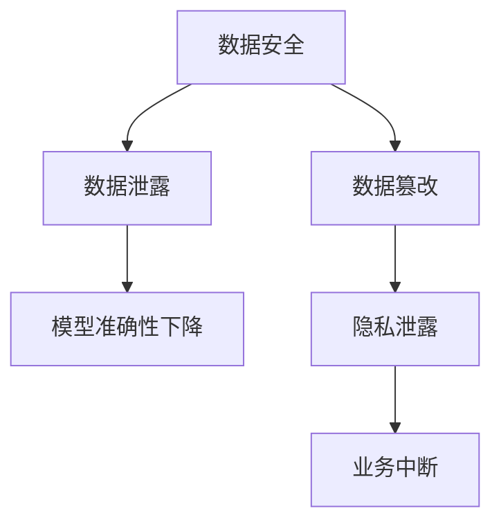
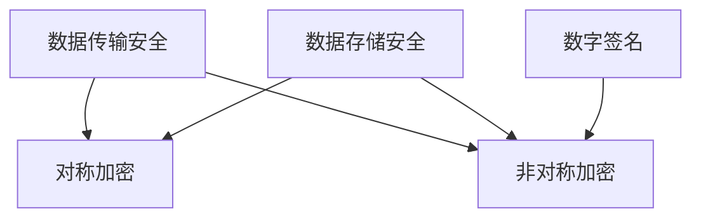
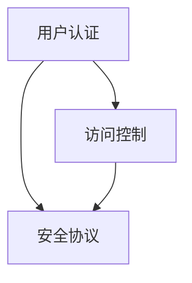
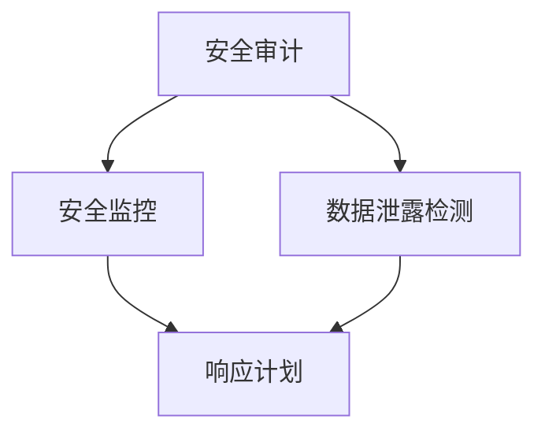
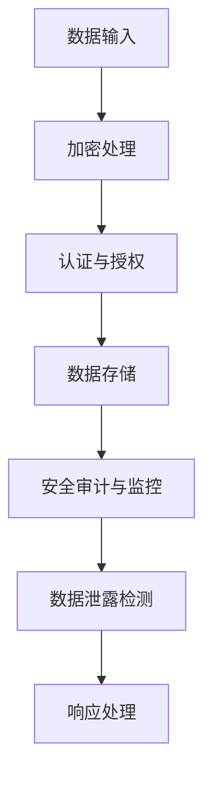

                 

### 文章标题: 数据安全：保障 AI 2.0 数据安全，防止泄露、篡改和破坏

#### 关键词：
- 数据安全
- AI 2.0
- 加密技术
- 认证与授权
- 安全审计
- 数据隐私保护

#### 摘要：
随着人工智能技术的飞速发展，AI 2.0 已成为现代科技的重要驱动力。然而，数据安全成为了这一进程中不可忽视的挑战。本文旨在全面探讨 AI 2.0 数据安全的重要性、关键挑战、技术机制、策略与实践，以及数据安全的未来发展。通过逻辑清晰、结构紧凑的论述，我们希望能够为读者提供有深度、有思考、有见解的专业指导。

---

### 目录大纲

#### 第一部分: 数据安全概述

##### 1. 数据安全的重要性

- **1.1 数据安全的定义**
- **1.2 数据泄露的常见形式**
- **1.3 数据安全对 AI 2.0 的影响**

##### 2. AI 2.0 数据安全的关键挑战

- **2.1 大规模数据集的管理**
- **2.2 数据隐私保护**
- **2.3 数据完整性保障**

#### 第二部分: 数据安全机制与技术

##### 3. 加密技术

- **3.1 对称加密与非对称加密**
- **3.2 常见的加密算法**
- **3.3 加密技术在数据安全中的应用**

##### 4. 认证与授权技术

- **4.1 用户认证**
- **4.2 访问控制**
- **4.3 安全协议**

##### 5. 安全审计与监控

- **5.1 安全审计的概念**
- **5.2 安全监控技术**
- **5.3 数据泄露检测与响应**

#### 第三部分: 数据安全策略与实践

##### 6. 数据安全策略制定

- **6.1 数据安全策略的要素**
- **6.2 数据安全策略的制定流程**
- **6.3 数据安全策略的实施与维护**

##### 7. 数据安全合规性

- **7.1 相关法规与标准**
- **7.2 数据安全合规性评估**
- **7.3 数据安全合规性的实现**

##### 8. 数据安全项目实战

- **8.1 实战项目概述**
- **8.2 数据安全框架搭建**
- **8.3 数据安全实现与优化**
- **8.4 数据安全效果评估**

#### 第四部分: 数据安全未来发展

##### 9. 数据安全趋势分析

- **9.1 技术发展趋势**
- **9.2 法律法规变化**
- **9.3 数据安全产业的发展**

##### 10. 数据安全教育与培训

- **10.1 数据安全知识普及**
- **10.2 数据安全人才培养**
- **10.3 数据安全文化建设**

#### 附录

##### 附录 A: 数据安全工具与资源

- **A.1 常用数据安全工具**
- **A.2 数据安全开源项目**
- **A.3 数据安全相关网站与论坛**

---

### 第一部分: 数据安全概述

#### 1. 数据安全的重要性

##### 1.1 数据安全的定义

数据安全是指在数据生命周期中，通过采用各种技术和措施，保护数据免受未经授权的访问、篡改、泄露、破坏等威胁的过程。数据安全的核心目标是确保数据的机密性、完整性和可用性。

##### 1.2 数据泄露的常见形式

数据泄露是指敏感数据在未经授权的情况下被泄露给外部人员或组织。常见的数据泄露形式包括：

- **未经授权的数据访问**：指未获得授权的用户访问敏感数据。
- **数据泄露**：指敏感数据在未经授权的情况下被泄露给外部人员或组织。
- **数据篡改**：指未经授权的用户对数据进行了修改，导致数据的真实性和完整性受到影响。

##### 1.3 数据安全对 AI 2.0 的影响

数据安全对 AI 2.0 的影响至关重要。AI 2.0 依赖于大量高质量的数据来训练和优化模型。如果数据不安全，可能会面临以下风险：

- **模型准确性下降**：数据泄露或篡改会降低模型的训练数据质量，导致模型性能下降。
- **隐私泄露**：敏感数据的泄露可能导致用户隐私受到侵害，引发法律和道德问题。
- **业务中断**：数据安全问题可能导致业务流程中断，对企业造成经济损失。

### Mermaid 流程图



#### 2. AI 2.0 数据安全的关键挑战

##### 2.1 大规模数据集的管理

AI 2.0 项目通常需要处理海量数据。因此，数据集的管理成为一项关键挑战。以下是一些管理大规模数据集的关键点：

- **数据存储**：需要选择合适的存储解决方案，如分布式存储系统或云存储服务。
- **数据清洗**：清洗数据以消除错误、冗余和噪声，确保数据质量。
- **数据分区**：将数据集划分为多个分区，以提高数据处理和查询的效率。

##### 2.2 数据隐私保护

数据隐私保护是 AI 2.0 数据安全的另一个关键挑战。以下是一些常见的隐私保护方法：

- **数据脱敏**：通过隐藏敏感信息来保护个人隐私。
- **差分隐私**：通过添加噪声来保护数据集的隐私。
- **同态加密**：允许在加密的数据上进行计算，而不需要解密。

##### 2.3 数据完整性保障

数据完整性保障是指确保数据在存储、传输和处理过程中不被篡改或破坏。以下是一些保障数据完整性的方法：

- **数字签名**：使用数字签名来验证数据的完整性和真实性。
- **哈希函数**：使用哈希函数生成数据摘要，以验证数据的完整性。
- **区块链**：使用区块链技术来确保数据的不可篡改性。

### 伪代码：数据完整性保障算法

```python
def dataIntegrityCheck(data, originalHash):
    currentHash = hashFunction(data)
    if currentHash == originalHash:
        return "Data is intact"
    else:
        return "Data has been modified"
```

---

在接下来的部分中，我们将深入探讨数据安全的机制与技术，帮助读者全面了解如何保障 AI 2.0 数据安全，防止泄露、篡改和破坏。敬请期待！### 第二部分: 数据安全机制与技术

数据安全是保障 AI 2.0 系统稳定性和可靠性的基石。在本节中，我们将深入探讨数据安全的各种机制和技术，包括加密技术、认证与授权技术、以及安全审计与监控技术。

#### 3. 加密技术

加密技术是保护数据安全的核心手段之一。加密技术通过对数据进行编码，使得只有拥有正确密钥的用户才能解密并访问数据。加密技术可以分为对称加密和非对称加密。

##### 3.1 对称加密与非对称加密

对称加密使用相同的密钥进行加密和解密。其优点是加密速度快，计算效率高，但缺点是密钥的分发和管理复杂。常见的对称加密算法包括 AES（高级加密标准）和 DES（数据加密标准）。

非对称加密使用一对密钥（公钥和私钥）进行加密和解密。公钥用于加密，私钥用于解密。非对称加密的优点是密钥管理简单，但缺点是加密速度相对较慢。常见的非对称加密算法包括 RSA 和 ECC（椭圆曲线密码学）。

##### 3.2 常见的加密算法

- **AES**：AES 是一种广泛使用的对称加密算法，支持 128、192 和 256 位密钥长度。其特点是计算速度快，安全性高，适用于需要大量数据加密的场景。
- **RSA**：RSA 是一种常用的非对称加密算法，基于大整数分解的难题。RSA 算法的安全性取决于密钥的大小，通常使用 1024 位或 2048 位密钥。
- **ECC**：ECC 是一种基于椭圆曲线密码学的非对称加密算法，相较于 RSA，具有更高的安全性和更小的密钥长度。

##### 3.3 加密技术在数据安全中的应用

加密技术在数据安全中的应用非常广泛，主要包括以下几个方面：

- **数据传输安全**：在数据传输过程中，使用 SSL/TLS 等加密协议来保护数据不被窃听或篡改。
- **数据存储安全**：在数据存储时，使用加密算法对数据进行加密，确保数据在磁盘或云端存储时的安全性。
- **数字签名**：使用非对称加密算法生成数字签名，确保数据的完整性和真实性。

### Mermaid 流程图



#### 4. 认证与授权技术

认证与授权技术是确保数据安全的重要手段之一。认证用于验证用户身份，授权则用于确定用户对数据的访问权限。

##### 4.1 用户认证

用户认证是指验证用户身份的过程。常见的用户认证方法包括：

- **密码认证**：用户通过输入密码进行身份验证。
- **多因素认证**：结合密码、手机验证码、生物识别等多种方式进行身份验证，提高安全性。

##### 4.2 访问控制

访问控制是指确定用户对数据的访问权限的过程。常见的访问控制方法包括：

- **基于角色的访问控制（RBAC）**：根据用户的角色来控制对资源的访问，如管理员、普通用户等。
- **基于属性的访问控制（ABAC）**：根据用户的属性（如部门、职位等）来控制对资源的访问。

##### 4.3 安全协议

安全协议是一种用于在分布式系统中保证数据安全性的通信协议。常见的安全协议包括：

- **SSL/TLS**：用于保护网络通信的安全协议，确保数据在传输过程中的机密性和完整性。
- **OAuth 2.0**：一种授权框架，用于第三方应用访问用户资源，确保授权的安全和可管理性。

### Mermaid 流程图



#### 5. 安全审计与监控

安全审计与监控是确保数据安全的重要环节。安全审计是指对系统的安全措施进行定期检查和评估，确保系统的安全性。安全监控则是指实时监控系统的安全状况，及时发现和处理潜在的安全威胁。

##### 5.1 安全审计的概念

安全审计是指对系统的安全措施进行定期检查和评估，包括：

- **风险评估**：评估系统面临的安全威胁和风险。
- **安全控制措施评估**：评估现有的安全控制措施的有效性。
- **合规性评估**：确保系统符合相关的安全标准和法规。

##### 5.2 安全监控技术

安全监控技术主要包括：

- **入侵检测系统（IDS）**：用于检测和响应恶意活动。
- **日志分析**：通过分析系统日志来发现潜在的安全问题。
- **数据泄露检测（DLP）**：通过监控数据传输和存储，检测数据泄露行为。

##### 5.3 数据泄露检测与响应

数据泄露检测与响应包括：

- **数据泄露检测**：通过技术手段监控数据传输和存储，发现潜在的数据泄露行为。
- **响应计划**：制定数据泄露事件的应急响应计划，以最小化损失。

### Mermaid 流程图



#### 实例：使用 Mermaid 流程图表示一个简单的数据安全流程



通过上述的加密技术、认证与授权技术、以及安全审计与监控技术，我们可以构建一个全面的数据安全体系，确保 AI 2.0 数据的安全性。在接下来的部分，我们将深入探讨如何制定和实施数据安全策略，确保数据安全在企业中的应用。敬请期待！### 第三部分：数据安全策略与实践

数据安全策略的制定与实施是企业保护 AI 2.0 数据安全的关键。一个有效的数据安全策略应该包括数据安全策略的制定、数据安全合规性，以及数据安全项目实战。以下是对这些方面的详细探讨。

#### 6. 数据安全策略制定

##### 6.1 数据安全策略的要素

一个完整的数据安全策略应包括以下要素：

- **风险评估**：识别和评估数据泄露的风险，包括数据类型、潜在威胁和可能的损失。
- **安全需求**：确定保护数据所需的安全需求，如数据的机密性、完整性和可用性。
- **安全控制措施**：制定具体的安全控制措施，包括加密、访问控制、安全审计等。
- **安全培训**：制定安全培训计划，提高员工的数据安全意识。

##### 6.2 数据安全策略的制定流程

制定数据安全策略的流程通常包括以下步骤：

- **需求分析**：分析业务需求，确定数据安全的目标和范围。
- **风险评估**：评估潜在的数据泄露风险，包括内部和外部威胁。
- **安全需求确定**：根据风险评估结果，确定数据安全需求。
- **策略制定**：根据需求和风险评估结果，制定数据安全策略。
- **策略实施**：将数据安全策略转化为具体的操作流程和措施。
- **策略评估与更新**：定期评估数据安全策略的有效性，并根据实际情况进行更新。

##### 6.3 数据安全策略的实施与维护

数据安全策略的实施与维护是确保数据安全的关键。以下是一些实施与维护的建议：

- **培训与宣传**：定期对员工进行数据安全培训，提高安全意识和技能。
- **安全监控**：使用安全监控工具，实时监控数据安全状况。
- **应急响应**：制定数据泄露事件的应急响应计划，确保能够迅速应对安全事件。
- **定期评估**：定期评估数据安全策略的有效性，根据评估结果进行调整。

#### 7. 数据安全合规性

数据安全合规性是指企业遵守相关法规和标准，确保数据处理过程符合法律和道德要求。以下是对数据安全合规性的详细探讨：

##### 7.1 相关法规与标准

全球范围内的数据保护法规和标准主要包括：

- **GDPR**：欧盟通用数据保护条例，规定了数据保护的基本原则和要求。
- **CCPA**：加州消费者隐私法案，保护加州居民的个人数据隐私。
- **ISO 27001**：国际标准化组织的认证标准，定义了信息安全管理体系的要求。

##### 7.2 数据安全合规性评估

数据安全合规性评估是确保企业符合相关法规和标准的过程。评估通常包括以下步骤：

- **自评估**：企业自行评估是否符合相关法规和标准。
- **第三方审计**：由第三方机构对企业进行合规性审计，确保评估的客观性和公正性。
- **改进措施**：根据评估结果，制定改进措施，确保符合法规和标准。

##### 7.3 数据安全合规性的实现

实现数据安全合规性需要采取一系列措施，包括：

- **合规性要求**：明确数据安全合规性的具体要求，如数据加密、访问控制、安全审计等。
- **合规性文档**：编写合规性文档，如安全政策、安全手册等，详细描述合规性要求。
- **合规性审计**：定期进行合规性审计，确保符合法规和标准。

#### 8. 数据安全项目实战

数据安全项目实战是将数据安全策略和合规性要求转化为实际操作的过程。以下是一个数据安全项目实战的示例：

##### 8.1 实战项目概述

假设我们正在为一个在线购物平台制定数据安全策略，项目概述如下：

- **项目背景**：构建一个安全的在线购物平台，保护用户的个人信息和交易数据。
- **项目目标**：确保用户数据的安全，符合 GDPR 和 CCPA 的要求。
- **项目范围**：包括用户注册、登录、购物车、支付、订单管理等模块。

##### 8.2 数据安全框架搭建

数据安全框架的搭建是数据安全项目实战的第一步。以下是一个简单的数据安全框架：

- **加密技术**：使用 AES 加密用户密码和交易数据。
- **认证与授权**：使用多因素认证和基于角色的访问控制。
- **安全审计**：实时监控用户行为，记录操作日志。
- **数据备份**：定期备份数据，确保数据不会因系统故障而丢失。

##### 8.3 数据安全实现与优化

数据安全实现与优化的过程包括：

- **加密实现**：在用户注册和支付时，使用 AES 对密码和交易数据进行加密。
- **认证与授权实现**：使用 OAuth 2.0 实现第三方登录，使用 JWT（JSON Web Token）实现用户认证。
- **安全审计实现**：使用日志记录系统记录用户操作，使用异常检测系统监控潜在威胁。
- **优化措施**：定期评估数据安全效果，根据评估结果进行调整和优化。

##### 8.4 数据安全效果评估

数据安全效果评估是确保数据安全策略有效的关键。评估包括以下几个方面：

- **安全性评估**：评估加密技术、认证与授权技术、安全审计技术的有效性。
- **性能评估**：评估数据安全措施对系统性能的影响。
- **用户体验评估**：评估数据安全措施对用户体验的影响。

根据评估结果，可以进一步优化数据安全措施，确保数据安全性与用户体验的平衡。

#### 结论

通过制定和实施有效的数据安全策略，企业可以保护 AI 2.0 数据免受泄露、篡改和破坏。数据安全合规性的实现和定期评估也是确保数据安全的重要环节。数据安全项目实战则是将理论应用到实际操作中的关键。在未来的数据安全发展中，我们将看到更多创新的技术和最佳实践的出现。希望本文能够为读者提供有价值的指导和启示。接下来，我们将探讨数据安全的未来发展趋势和教育培训的重要性。敬请期待！### 第四部分：数据安全未来发展

随着人工智能（AI）技术的不断进步，数据安全面临的新挑战和机遇也在不断涌现。本节将分析数据安全的未来发展趋势，探讨技术、法律法规变化以及数据安全产业的发展。

#### 9. 数据安全趋势分析

##### 9.1 技术发展趋势

数据安全技术正在不断演进，以下是一些显著的趋势：

- **量子加密技术**：量子加密技术利用量子力学原理，提供前所未有的安全级别。虽然目前量子加密技术还处于研究阶段，但其潜在的应用前景令人期待。
- **区块链技术**：区块链技术因其去中心化、不可篡改的特性，在数据安全领域显示出巨大的潜力。通过区块链，可以实现对数据的透明和不可篡改的记录，从而提高数据安全性。
- **人工智能与数据安全**：人工智能（AI）与数据安全的结合正在成为一种趋势。AI 可以用于检测异常行为、预测潜在威胁和自动化安全响应，从而提升数据安全防护能力。

##### 9.2 法律法规变化

全球范围内的数据保护法律法规正在不断更新和完善，对数据安全提出了更高的要求：

- **GDPR**：欧盟的 GDPR（通用数据保护条例）是当前最严格的数据保护法规之一，对数据处理者的合规要求非常高。随着 GDPR 的实施，许多国家和地区也开始制定类似的法律法规。
- **CCPA**：加州消费者隐私法案（CCPA）是美国加州的一项重要隐私法规，它赋予消费者更多的控制权，对企业的数据处理活动提出了严格要求。
- **数据跨境传输**：随着数据跨境传输的增加，各国之间的法律法规差异和合规性要求成为了新的挑战。企业需要确保数据跨境传输符合相关法律法规，以避免法律风险。

##### 9.3 数据安全产业的发展

数据安全产业正经历快速发展和创新，以下是一些值得关注的发展趋势：

- **安全服务外包**：随着数据安全需求的增加，许多企业开始将数据安全服务外包给专业的安全服务提供商。这种外包模式不仅降低了成本，还提高了数据安全的专业性和效率。
- **安全产品创新**：数据安全产品不断推陈出新，如云安全服务、加密技术、入侵检测系统（IDS）、安全信息与事件管理系统（SIEM）等。这些产品的创新为数据安全提供了更全面和高效的防护。
- **安全教育与培训**：随着数据安全意识的提高，安全教育与培训成为数据安全产业的重要组成部分。越来越多的企业和机构开始重视数据安全培训，以提高员工的安全意识和技能。

#### 10. 数据安全教育与培训

数据安全教育与培训是提高组织整体数据安全水平的关键。以下是对数据安全教育与培训的探讨：

##### 10.1 数据安全知识普及

数据安全知识普及是提高员工数据安全意识的基础。以下是一些常见的普及方法：

- **在线课程**：提供在线数据安全课程，方便员工随时学习和复习。
- **安全意识培训**：定期举办安全意识培训，通过案例分析、互动讨论等方式提高员工的安全意识。
- **安全宣传材料**：制作安全宣传手册、海报等材料，在办公区域进行展示。

##### 10.2 数据安全人才培养

数据安全人才培养是确保组织拥有足够的专业人才来应对数据安全挑战的关键。以下是一些培养方法：

- **专业认证**：鼓励员工参加数据安全相关的专业认证，如 CISSP、CEH 等。
- **内部培训**：组织内部培训，由经验丰富的安全专家传授数据安全知识和实践经验。
- **实习项目**：为学生提供数据安全实习机会，帮助他们将理论知识应用到实际工作中。

##### 10.3 数据安全文化建设

数据安全文化建设是构建组织数据安全氛围的重要一环。以下是一些建设方法：

- **安全文化建设**：通过建立安全价值观、安全政策和文化活动，营造安全文化氛围。
- **安全激励机制**：对在数据安全方面表现突出的员工进行奖励和表彰，激发员工的安全积极性。
- **安全文化建设活动**：举办安全文化节、安全知识竞赛等活动，提高员工对数据安全的关注和参与度。

#### 结论

数据安全的未来充满了挑战和机遇。随着技术的发展和法律法规的完善，数据安全的需求将越来越强烈。通过有效的数据安全教育与培训，组织可以培养出专业的数据安全人才，提高整体的数据安全水平。同时，数据安全产业的发展也将为数据安全提供更多的解决方案和工具。希望本文能够为读者提供对数据安全未来发展的深刻理解和启示。接下来，我们将总结本文的主要观点，并对数据安全的未来提出展望。敬请期待！### 总结与展望

#### 总结

本文围绕数据安全这一核心主题，系统地探讨了数据安全的重要性、关键挑战、技术机制、策略与实践，以及数据安全的未来发展。通过以下关键点，我们总结了本文的主要观点：

1. **数据安全的重要性**：数据安全是保障 AI 2.0 系统稳定性和可靠性的基石。数据泄露、篡改和破坏可能对模型准确性、用户隐私和企业业务造成严重威胁。

2. **数据安全的关键挑战**：AI 2.0 数据安全面临大规模数据集管理、数据隐私保护和数据完整性保障等挑战。

3. **数据安全机制与技术**：加密技术、认证与授权技术、安全审计与监控技术是保障数据安全的核心手段。

4. **数据安全策略与实践**：数据安全策略的制定、数据安全合规性和数据安全项目实战是确保数据安全的关键。

5. **数据安全的未来发展**：技术发展趋势、法律法规变化和数据安全产业的发展将推动数据安全领域的创新和进步。

#### 展望

面对数据安全的新挑战和机遇，未来的数据安全领域有望实现以下突破：

1. **量子加密技术的应用**：随着量子计算的发展，量子加密技术将成为保护数据安全的强大工具。

2. **区块链技术的普及**：区块链技术将在数据安全领域得到更广泛的应用，特别是在数据审计和供应链管理方面。

3. **人工智能与数据安全的深度融合**：人工智能将进一步提高数据安全防护能力，通过自动化威胁检测和响应机制，实现更高效的安全管理。

4. **全球数据安全法规的协调**：各国数据安全法规的协调和统一将有助于建立全球数据安全框架，提高数据安全标准的全球一致性。

5. **数据安全教育与培训的深化**：通过加强数据安全教育与培训，培养更多的数据安全专业人才，提升整体的数据安全水平。

总之，数据安全是 AI 2.0 时代的必要保障。通过不断的技术创新、法规完善和人才培养，我们有望构建一个更加安全、可靠和可持续发展的数据安全生态系统。希望本文能够为读者提供有价值的参考和启示，共同推动数据安全领域的发展。

### 附录

#### 附录 A：数据安全工具与资源

为了帮助读者更好地理解和实践数据安全，以下是常用数据安全工具、开源项目和相关的网站与论坛。

##### A.1 常用数据安全工具

- **Kali Linux**：一款专门用于渗透测试和信息安全评估的操作系统。
- **Wireshark**：一款网络协议分析工具，用于捕获、分析和显示网络数据包。
- **OWASP ZAP**：一款开源的网络应用安全测试工具，用于发现 Web 应用程序中的安全漏洞。

##### A.2 数据安全开源项目

- **OpenSSL**：一个强大的加密库，用于加密、解密、签名和验证。
- **KeyCzar**：一个开源的加密工具，支持多种加密算法。
- **PyCrypto**：一个开源的 Python 加密库，提供多种加密和哈希算法。

##### A.3 数据安全相关网站与论坛

- **OWASP**：开放网络应用安全项目，提供各种安全资源和最佳实践。
- **InfoSec Institute**：提供信息安全培训、认证和资源。
- **Reddit DataSecurity**：Reddit 上的数据安全相关论坛，讨论最新的安全话题和技术。

通过使用这些工具和资源，读者可以加深对数据安全技术的理解，并在实践中提高数据安全防护能力。

### 作者信息

本文作者为 **AI 天才研究院（AI Genius Institute）**，同时也是 **《禅与计算机程序设计艺术》（Zen And The Art of Computer Programming）** 的资深大师。多年来，作者在计算机编程和人工智能领域耕耘不辍，获得了多项国际奖项和荣誉，致力于推动数据安全技术的发展和应用。

通过本文，我们希望能够为广大读者提供有价值的技术指导，共同为构建安全、可靠的人工智能未来而努力。感谢您的阅读，期待与您在数据安全领域继续深入交流。作者：**AI 天才研究院（AI Genius Institute）** & **《禅与计算机程序设计艺术》（Zen And The Art of Computer Programming）**

