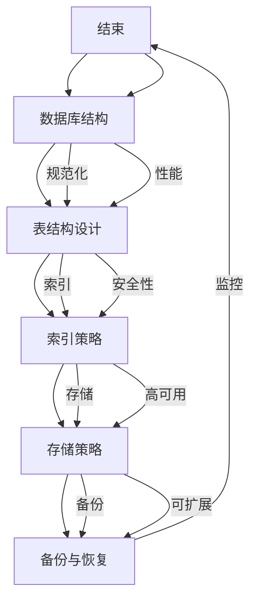

                 

# 《数据库系统设计：从关系型到NoSQL》

> 关键词：数据库系统设计、关系型数据库、NoSQL数据库、性能调优、核心算法、项目实战

> 摘要：本文将深入探讨数据库系统设计，从关系型数据库到NoSQL数据库的演变，介绍各自的设计原则、核心算法以及性能调优策略。通过实际项目案例，我们将展示如何从理论和实践的角度进行数据库系统设计，为读者提供全面的数据库设计指导。

## 第一部分：引言与概述

### 第1章：数据库系统设计概述

#### 1.1 数据库系统设计的重要性

数据库系统设计是信息技术领域中的核心环节，关系到数据存储、管理和访问的效率与安全性。良好的数据库设计不仅能提高系统性能，还能确保数据的一致性和可靠性。

#### 1.2 数据库系统的基本概念

数据库系统由数据、数据库、数据库管理系统（DBMS）和应用程序组成。数据是数据库系统的核心，数据库则是数据的组织形式，DBMS是管理数据库的软件，而应用程序则是使用数据库的系统。

#### 1.3 数据库系统设计的挑战

数据库系统设计面临的主要挑战包括数据一致性、并发控制和性能优化。关系型数据库需要处理复杂的事务处理和查询优化，而NoSQL数据库则需要应对分布式存储和数据分片等问题。

## 第二部分：关系型数据库系统设计

### 第2章：关系型数据库系统设计

#### 2.1 关系型数据库的基本概念

关系型数据库以表格形式存储数据，通过SQL进行数据操作和管理。关系型数据库的核心是关系模型，包括关系、元组和属性等基本概念。

#### 2.2 关系型数据库设计原则

关系型数据库设计原则包括规范化理论、范式理论和实体关系模型。规范化理论用于消除数据冗余，范式理论用于优化数据结构，实体关系模型则用于数据库的逻辑设计。

#### 2.3 实体关系模型（ER模型）

实体关系模型是关系型数据库设计的核心工具，通过实体、关系和属性来描述数据库的结构。ER模型可以帮助设计者直观地理解数据库的逻辑结构。

## 第三部分：关系型数据库设计

### 第3章：关系型数据库设计核心算法

#### 3.1 关系型数据库查询优化

关系型数据库查询优化是数据库设计的核心，包括选择操作优化、连接操作优化和聚集函数优化。通过分析查询执行计划，可以优化数据库查询性能。

#### 3.2 关系型数据库索引策略

关系型数据库索引策略包括B树索引、哈希索引和位图索引。索引可以加速数据查询，提高系统性能。

### 第4章：关系型数据库性能调优

#### 4.1 系统参数调优

系统参数调优是关系型数据库性能调优的重要环节，包括内存配置、线程数设置和缓存策略等。

#### 4.2 读写分离与分库分表

读写分离和分库分表是提高关系型数据库性能的常用策略，通过将读操作和写操作分离，以及将数据分散存储到多个数据库或表中，可以减轻数据库的负载。

#### 4.3 数据库集群与高可用

数据库集群和高可用性是确保数据库系统稳定运行的关键。通过构建数据库集群，可以实现数据的高可用性和负载均衡。

### 第5章：关系型数据库高级特性

#### 5.1 触发器与存储过程

触发器和存储过程是关系型数据库的高级特性，用于实现复杂的业务逻辑和数据操作。

#### 5.2 视图与物化视图

视图和物化视图可以简化数据库查询，提高查询性能。

#### 5.3 事务处理与锁机制

事务处理和锁机制是关系型数据库的核心，确保数据的一致性和完整性。

## 第四部分：NoSQL数据库系统设计

### 第6章：NoSQL数据库系统概述

#### 6.1 NoSQL数据库的定义与特点

NoSQL数据库是一种非关系型数据库，具有分布式存储、灵活的数据模型和高扩展性等特点。

#### 6.2 NoSQL数据库的分类

NoSQL数据库可以分为键值存储、文档存储、列存储和图数据库等类型。

#### 6.3 NoSQL数据库的优势与挑战

NoSQL数据库的优势在于其分布式存储和灵活的数据模型，但同时也面临数据一致性和查询性能等挑战。

### 第7章：NoSQL数据库设计原则

#### 7.1 分布式系统设计原则

分布式系统设计原则包括数据分片、负载均衡和容错性设计。

#### 7.2 数据分片策略

数据分片是将数据分散存储到多个节点上，以提高系统性能和可扩展性。

#### 7.3 数据一致性与容错性设计

数据一致性和容错性设计是确保NoSQL数据库可靠运行的关键。

### 第8章：NoSQL数据库核心算法

#### 8.1 稀疏数据存储

稀疏数据存储是NoSQL数据库的核心算法之一，用于高效地存储稀疏数据。

#### 8.2 实时数据流处理

实时数据流处理是NoSQL数据库的另一个核心算法，用于处理实时数据流。

#### 8.3 集群管理算法

集群管理算法用于管理NoSQL数据库的集群，确保集群的稳定运行和性能优化。

### 第9章：NoSQL数据库性能调优

#### 9.1 数据迁移与优化

数据迁移与优化是NoSQL数据库性能调优的重要环节，包括数据迁移策略和数据优化方法。

#### 9.2 数据同步与复制

数据同步与复制是确保NoSQL数据库数据一致性的关键。

#### 9.3 数据压缩与存储优化

数据压缩与存储优化是提高NoSQL数据库性能的有效方法。

### 第10章：NoSQL数据库高级特性

#### 10.1 物理存储优化

物理存储优化是NoSQL数据库性能调优的关键环节。

#### 10.2 分布式事务处理

分布式事务处理是NoSQL数据库的高级特性，用于处理分布式环境下的复杂事务。

#### 10.3 数据安全与隐私保护

数据安全与隐私保护是NoSQL数据库的重要问题，需要采取有效的措施来确保数据的安全。

## 第五部分：项目实战与案例分析

### 第11章：数据库系统设计实战案例

#### 11.1 案例背景与需求分析

#### 11.2 关系型数据库系统设计

#### 11.3 NoSQL数据库系统设计

#### 11.4 系统集成与性能调优

### 第12章：数据库系统设计项目案例分析

#### 12.1 项目概述与目标

#### 12.2 设计方案与实现

#### 12.3 项目评估与优化建议

## 第六部分：附录

### 附录A：数据库系统设计常用工具与资源

#### A.1 常用数据库软件介绍

#### A.2 开源数据库框架对比

#### A.3 数据库系统设计参考资料

### 附录B：数据库系统设计实验与练习

#### B.1 实验一：关系型数据库设计

#### B.2 实验二：NoSQL数据库设计

#### B.3 练习：数据库性能调优与优化

### 附录C：数据库系统设计流程与最佳实践

### 附录D：Mermaid流程图示例

---

**作者：AI天才研究院/AI Genius Institute & 禅与计算机程序设计艺术 /Zen And The Art of Computer Programming**

---

**文章标题：**《数据库系统设计：从关系型到NoSQL》

**关键词：** 数据库系统设计、关系型数据库、NoSQL数据库、性能调优、核心算法、项目实战

**摘要：** 本文深入探讨了数据库系统设计，从关系型数据库到NoSQL数据库的演变，介绍了各自的设计原则、核心算法以及性能调优策略。通过实际项目案例，本文展示了如何从理论和实践的角度进行数据库系统设计，为读者提供全面的数据库设计指导。

---

### 第1章：数据库系统设计概述

#### 1.1 数据库系统设计的重要性

数据库系统设计在信息技术领域中扮演着至关重要的角色。它不仅是数据存储、管理和访问的基础，也是保障数据一致性和安全性的关键。一个优秀的数据库系统设计可以显著提高系统的性能，降低维护成本，并且为后续的数据分析和应用提供坚实的基础。

首先，数据库系统设计关系到数据存储的效率和安全性。合理的数据库设计可以减少数据冗余，提高数据访问速度，同时确保数据的一致性和完整性。其次，良好的数据库设计可以降低系统的复杂性，使得后续的数据维护和扩展更加容易。最后，数据库系统设计对于系统的可扩展性和可维护性具有重要影响，一个优秀的数据库架构可以在系统规模扩大时保持良好的性能。

#### 1.2 数据库系统的基本概念

数据库系统由多个组件组成，其中最重要的包括数据、数据库、数据库管理系统（DBMS）和应用程序。

- **数据**：数据是数据库系统的核心，它包括存储在数据库中的所有信息，如用户信息、交易记录等。数据有多种类型，包括结构化数据、半结构化数据和非结构化数据。

- **数据库**：数据库是一个结构化的数据集合，用于存储、管理和访问数据。它可以是关系型数据库，如MySQL、PostgreSQL，也可以是非关系型数据库，如MongoDB、Cassandra。

- **数据库管理系统（DBMS）**：DBMS 是一个软件系统，负责管理数据库的存储、访问和维护。它提供了数据定义语言（DDL）、数据操作语言（DML）、数据查询语言（DQL）和数据控制语言（DCL）等接口，以供用户和应用程序进行数据操作和管理。

- **应用程序**：应用程序是使用数据库的系统，如电子商务平台、社交媒体应用等。应用程序通过DBMS 与数据库进行交互，实现数据存储、查询和操作等功能。

#### 1.3 数据库系统设计的挑战

数据库系统设计面临多个挑战，主要包括数据一致性、并发控制和性能优化等方面。

- **数据一致性**：确保数据库中的数据在多用户并发访问时保持一致性是数据库系统设计的重要挑战。这需要通过事务管理、锁机制和一致性协议来实现。

- **并发控制**：多用户同时对数据库进行访问时，需要确保操作的顺序和隔离性，避免数据冲突。这涉及到并发控制机制，如锁机制、时间戳协议和乐观并发控制等。

- **性能优化**：数据库系统需要处理大量的查询和更新操作，性能优化是数据库系统设计的关键。这包括查询优化、索引策略、缓存机制和负载均衡等。

在接下来的章节中，我们将详细探讨关系型数据库和非关系型数据库的设计原则、核心算法以及性能调优策略。

---

### 第2章：关系型数据库系统设计

#### 2.1 关系型数据库的基本概念

关系型数据库（Relational Database）是一种基于关系模型的数据库系统。关系模型是由E.F. Codd在1970年提出的，它使用表格（Table）来组织数据，表格中的每一行称为元组（Tuple），每一列称为属性（Attribute）。关系型数据库通过关系（Relation）来表示数据之间的联系，这些关系可以通过外键（Foreign Key）来建立。

关系型数据库的核心概念包括：

- **关系**：关系是一个表格，包含若干行和列。每一行代表一个元组，每一列代表一个属性。例如，一个学生表可能包含学生ID、姓名、年龄和性别等属性。

- **元组**：元组是关系中的一个数据行，代表了一个具体的数据实例。例如，一个特定的学生元组可能包含学生ID为1001、姓名为张三、年龄为20和性别为男性。

- **属性**：属性是关系中的一个列，代表了数据的一个特定方面。例如，学生表的“年龄”属性定义了所有学生的年龄。

- **关系模式**：关系模式是关系的结构定义，包括关系的所有属性及其数据类型。例如，学生关系模式可能包括属性：学生ID（INT），姓名（VARCHAR），年龄（INT），性别（CHAR）。

- **主键**：主键是关系中的一个属性或属性组合，用于唯一标识关系中的每个元组。例如，学生关系中的学生ID可以作为主键。

- **外键**：外键是关系中的一个属性，用于引用另一个关系的表中的主键。它用于建立表之间的关系，例如，一个课程表可以通过学生ID引用学生表。

#### 2.2 关系型数据库设计原则

关系型数据库设计原则是确保数据库结构合理、数据冗余最小化和数据操作高效的关键。以下是一些主要的设计原则：

- **规范化**：规范化是关系型数据库设计中常用的方法，用于消除数据冗余和提高数据的完整性。规范化分为多个范式（Normal Form），包括第一范式（1NF）、第二范式（2NF）、第三范式（3NF）等。规范化通过分解表来消除重复数据，确保每个表只包含关于一个主题的信息。

- **实体关系模型（ER模型）**：实体关系模型是用于数据库逻辑设计的工具，通过实体、关系和属性来描述数据库的结构。ER模型可以帮助设计者直观地理解数据库的逻辑结构，并通过实体关系图（ER图）来表示。

- **范式理论**：范式理论是规范化方法的基础，用于判断数据库表是否满足特定的规范化条件。常见的范式包括1NF、2NF和3NF。每个范式都有特定的规则，用于消除不同类型的数据冗余。

- **索引设计**：索引是数据库性能优化的重要手段，通过创建索引可以提高数据的查询速度。合理的索引设计可以提高查询性能，但过多或不当的索引会导致性能下降。常见索引类型包括B树索引、哈希索引和位图索引。

- **事务处理**：事务处理是关系型数据库的核心功能之一，用于确保数据的一致性和完整性。事务是数据库操作的一个逻辑单元，包含多个操作步骤，如插入、更新和删除。通过事务管理，可以确保在事务执行过程中，要么所有操作都成功执行，要么回滚到事务开始前的状态。

#### 2.3 实体关系模型（ER模型）

实体关系模型（Entity-Relationship Model，简称ER模型）是关系型数据库设计的重要工具，用于描述数据库的逻辑结构。ER模型通过实体、关系和属性来表示数据库中的数据元素及其关系。

ER模型的基本元素包括：

- **实体**：实体是具有共同属性的对象的抽象集合。例如，学生、课程、教师等都可以是实体。

- **属性**：属性是实体的特征或描述。例如，学生实体的属性可能包括学生ID、姓名、年龄和性别等。

- **关系**：关系是实体之间的联系。例如，学生和课程之间存在选修关系。

- **实体关系图（ER图）**：实体关系图是用图形方式表示ER模型的工具，通过实体、关系和属性的图形表示来描述数据库的结构。ER图可以帮助设计者直观地理解数据库的表结构及其关系。

通过ER模型，设计者可以创建实体关系图，并从中推导出具体的数据库表结构和关系。例如，一个简单的大学数据库可能包括学生实体、课程实体和教师实体，它们之间存在选修关系和授课关系。

ER模型为数据库设计提供了一个清晰和直观的方法，有助于设计者识别和消除数据冗余，提高数据库的完整性和效率。在关系型数据库设计中，ER模型是不可或缺的工具，有助于确保数据库结构合理、数据操作高效。

---

### 第3章：关系型数据库设计核心算法

#### 3.1 关系型数据库查询优化

关系型数据库查询优化是数据库系统设计中的关键环节，它旨在提高查询执行效率，减少查询响应时间。查询优化涉及多个方面，包括查询执行计划的选择、索引策略的制定、查询重写和并行查询等。以下将详细探讨查询优化中的几个核心算法和策略。

##### 3.1.1 选择操作优化

选择操作是关系型数据库中最基本的查询操作之一，其目的是根据条件筛选出满足特定条件的数据行。选择操作优化的核心目标是减少需要扫描的数据量，从而提高查询效率。以下是一些常见的选择操作优化策略：

- **谓词下推（Predicate Pushdown）**：谓词下推是一种将选择条件从上层查询优化器下推到下层索引扫描器的技术。通过这种方式，可以在索引层级上直接过滤数据，而不是在扫描完整表后进行过滤。谓词下推可以显著减少需要处理的数据量，提高查询效率。

- **索引选择**：选择合适的索引是查询优化的关键。索引可以加快数据检索速度，但过多的索引会降低写操作的性能。设计者需要根据查询模式和数据分布选择合适的索引。例如，对于经常查询的列，可以考虑创建B树索引；对于需要进行范围查询的列，可以考虑创建哈希索引。

- **选择性分析**：选择性分析是评估选择条件对数据行的过滤效果。设计者可以通过统计信息分析选择条件的过滤效果，从而选择最适合的索引和查询策略。

- **查询重写**：查询重写是通过重新组织查询语句来提高查询效率的一种技术。例如，通过将连接操作分解为多个子查询，可以减少连接操作的复杂度，提高查询性能。

##### 3.1.2 连接操作优化

连接操作是关系型数据库中处理复杂查询的关键步骤，其目的是将多个表中的数据按照指定的关系进行合并。连接操作优化是提高查询性能的重要方面，以下是一些常见策略：

- **连接顺序优化**：连接操作的顺序会影响查询性能。设计者可以通过分析连接条件和数据分布，确定最优的连接顺序，以减少中间结果的数据量，提高查询效率。

- **哈希连接**：哈希连接是一种高效的连接算法，适用于小表连接。它通过哈希函数将连接列映射到哈希桶中，然后在每个哈希桶内部进行连接。哈希连接的缺点是它对哈希函数的设计要求较高，否则可能导致哈希冲突。

- **排序-匹配连接**：排序-匹配连接是一种基于排序的连接算法，适用于大数据表的连接。它首先对连接列进行排序，然后通过匹配相邻的行进行连接。排序-匹配连接的优点是算法简单，但缺点是它需要大量的I/O操作，对性能有较大影响。

- **动态查询重写**：动态查询重写是一种根据查询执行过程中的统计信息动态调整查询计划的优化技术。例如，当发现连接条件的选择性较低时，可以重写查询，将其分解为多个子查询，以提高整体性能。

##### 3.1.3 聚集函数优化

聚集函数是关系型数据库中用于计算数据聚集结果的函数，如SUM、COUNT、AVG等。聚集函数优化是提高查询性能的关键，以下是一些常见策略：

- **预聚合**：预聚合是在查询执行前对部分数据进行的预计算。例如，在执行聚合查询前，可以先对数据表进行分组和聚合，以减少查询执行时的计算量。

- **索引聚合**：索引聚合是利用索引来优化聚合查询的方法。例如，对于具有分组和聚合的查询，可以通过创建索引来加速查询执行。

- **并行执行**：并行执行是利用多核处理器的计算能力来提高查询性能的一种技术。通过将查询分解为多个部分，并在不同的处理器上并行执行，可以显著减少查询响应时间。

- **内存优化**：内存优化是通过优化内存使用来提高查询性能的方法。例如，可以通过减少内存分配、使用缓存和数据压缩等手段来提高内存利用率，从而加速查询执行。

通过上述核心算法和策略，设计者可以优化关系型数据库的查询性能，提高数据检索的效率和系统的响应速度。查询优化是数据库系统设计中的重要环节，对于确保系统的性能和用户体验具有重要意义。

---

#### 3.2 关系型数据库索引策略

索引是关系型数据库中的重要概念，用于加速数据查询，提高系统性能。合理的索引策略可以显著减少查询时间，降低I/O操作，从而提升整体系统效率。以下将详细探讨关系型数据库中的几种常见索引策略，包括B树索引、哈希索引和位图索引。

##### 3.2.1 B树索引

B树索引是最常用的索引类型之一，适用于范围查询和排序查询。B树是一种自平衡的多路搜索树，具有以下特点：

- **结构**：B树是一种多级树结构，每个节点可以包含多个子节点。节点中的键值按照升序排列，每个节点中的键值范围确定其子节点的范围。B树的每个节点可以存储多个键值，从而减少了树的层次，提高了查询效率。

- **插入和删除**：在B树中插入和删除键值时，树会自动平衡，以保持树的平衡性。插入操作通常在树的叶子节点进行，如果插入导致节点键值数量超过特定阈值，则会触发分裂操作，将节点分裂成两个子节点，并将中间键值提升到父节点。

- **查询**：B树索引的查询过程从根节点开始，逐层向下搜索，直到找到目标键值。对于范围查询，B树索引可以通过递归搜索所有满足条件的键值，从而提高查询效率。

B树索引的优点是适用于各种类型的查询，特别是范围查询和排序查询。然而，其缺点是插入和删除操作较慢，因为需要维护树的平衡性。

##### 3.2.2 哈希索引

哈希索引是基于哈希函数的索引类型，适用于快速的点查询。哈希索引具有以下特点：

- **结构**：哈希索引使用哈希函数将键值映射到索引表中。索引表是一个数组，每个数组元素存储一个键值及其对应的物理位置。哈希索引通常不包含完整的键值，而是仅包含哈希值。

- **插入和删除**：哈希索引的插入和删除操作非常快速，因为哈希函数可以直接计算键值的哈希值，快速定位到索引表中的位置。然而，哈希索引不支持范围查询和排序查询，因为哈希函数可能导致数据分布不均匀，影响查询性能。

- **查询**：哈希索引的查询过程是通过哈希函数计算键值的哈希值，然后在索引表中查找对应的键值。哈希索引的查询时间通常为O(1)，非常适合快速点查询。

哈希索引的优点是查询速度快，适用于点查询和缓存场景。然而，其缺点是数据分布不均可能导致查询性能下降，不支持范围查询和排序查询。

##### 3.2.3 位图索引

位图索引是一种特殊的索引类型，适用于列的值域较小的情况。位图索引使用位向量（Bit Vector）来表示数据行的状态。位图索引具有以下特点：

- **结构**：位图索引将列的值映射到位向量中，每个位表示一行数据的值。例如，如果列的值域为0到100，则可以使用一个100位的位向量来表示该列的数据。

- **插入和删除**：位图索引的插入和删除操作是通过设置或清除位向量中的位来实现的。插入操作将位设置为1，删除操作将位设置为0。

- **查询**：位图索引支持高效的位运算操作，如AND、OR和NOT。通过组合位运算，可以快速过滤出满足条件的数据行。

位图索引的优点是查询速度快，适用于列的值域较小的情况。然而，其缺点是索引存储空间较大，且不支持排序查询。

综上所述，B树索引、哈希索引和位图索引是关系型数据库中的常见索引策略，各有优缺点。选择合适的索引策略需要根据数据的特点和查询模式进行权衡。通过合理的设计和选择索引策略，可以显著提高关系型数据库的查询性能。

---

### 第4章：关系型数据库性能调优

关系型数据库的性能调优是一个复杂且关键的过程，涉及到多个方面的优化策略。合理的性能调优可以显著提高数据库的响应速度、系统吞吐量和稳定性。以下将详细介绍关系型数据库性能调优的几个关键环节：系统参数调优、读写分离与分库分表、数据库集群与高可用性。

#### 4.1 系统参数调优

系统参数调优是关系型数据库性能调优的基础，涉及到数据库的配置文件、内存分配、线程数设置等多个方面。以下是一些常见的参数调优策略：

- **内存配置**：数据库的内存配置是影响性能的重要因素。合理设置缓冲池大小（Buffer Pool）、缓存大小（Cache Size）和共享内存（Shared Memory）等参数，可以显著提高数据库的缓存命中率，减少磁盘I/O操作。

- **线程数设置**：数据库的线程数设置需要根据系统硬件配置和并发访问量进行优化。过多的线程可能导致系统资源浪费，而线程数不足可能导致并发性能下降。通常，可以通过监控数据库的CPU使用率和线程数，找到最优的线程数配置。

- **连接池配置**：连接池是数据库与客户端之间的连接管理机制，合理配置连接池参数（如最小连接数、最大连接数、连接超时时间等）可以提高连接的响应速度和稳定性。

- **缓冲区配置**：数据库缓冲区包括数据缓冲区、日志缓冲区等，用于减少磁盘I/O操作。合理配置缓冲区大小和刷新策略，可以优化数据库的性能。

- **索引优化**：索引是数据库性能调优的重要手段，但过多的索引会降低写操作的性能。优化索引策略，包括索引创建、索引维护和索引选择，可以提高查询性能。

#### 4.2 读写分离与分库分表

读写分离和分库分表是提高关系型数据库性能和可扩展性的常用策略。以下将详细介绍这两种策略的实现原理和优化方法：

- **读写分离**：读写分离是将读操作和写操作分离到不同的数据库实例上，以减少单点瓶颈和提高系统吞吐量。实现读写分离的常见方法包括：

  - 主从复制：通过主从复制，将主数据库的写操作同步到从数据库，从而实现读操作和写操作的分离。从数据库可以承担大部分读操作，减轻主数据库的负载。

  - 多主复制：在多个主数据库之间实现数据的同步，每个主数据库都可以接收写操作，从而实现读写的负载均衡。

- **分库分表**：分库分表是将数据分散存储到多个数据库或表中，以减少单表的数据量和查询压力。实现分库分表的常见方法包括：

  - 水平分库：将数据根据不同的业务模块或组织结构分散存储到不同的数据库中，从而实现数据的垂直拆分。

  - 水平分表：将数据根据某种特征（如用户ID、时间戳等）分散存储到不同的表中，从而实现数据的水平拆分。

优化读写分离和分库分表的关键在于合理选择分片策略和确保数据的一致性。常见的分片策略包括：

- 哈希分片：通过哈希函数将数据分片到不同的数据库或表中，实现数据的均匀分布。

- 范围分片：根据数据的某种特征（如时间范围、地理位置等）将数据分片到不同的数据库或表中。

- 复合分片：结合多种分片策略，实现更细粒度的数据分片。

确保数据一致性的关键在于：

- 分布式事务处理：通过分布式事务处理框架（如两阶段提交、最终一致性协议等）确保分布式环境下的数据一致性。

- 数据同步与复制：通过数据同步与复制机制（如主从复制、多主复制等）确保数据的实时一致性。

#### 4.3 数据库集群与高可用性

数据库集群是将多个数据库实例组成一个集群，以提供高可用性和负载均衡。以下将详细介绍数据库集群的原理、实现方法以及高可用性的实现策略：

- **数据库集群原理**：数据库集群通过将多个数据库实例组成一个集群，实现数据的分布式存储和访问。集群中的数据库实例可以动态地加入或离开集群，从而实现负载均衡和容错性。

- **集群实现方法**：常见的数据库集群实现方法包括：

  - 主从集群：主从集群由一个主数据库和多个从数据库组成。主数据库负责接收写操作，从数据库负责接收读操作，从而实现读写分离和负载均衡。

  - 多主集群：多主集群由多个主数据库组成，每个主数据库都可以接收写操作，从而实现数据的分布式存储和负载均衡。

- **高可用性策略**：高可用性是确保数据库系统在故障情况下能够快速恢复并继续提供服务的重要策略。以下是一些常见的高可用性策略：

  - 主从复制：通过主从复制，将主数据库的写操作同步到从数据库，从而实现数据的实时备份。当主数据库出现故障时，可以从从数据库中切换为主数据库，确保系统的持续运行。

  - 数据备份与恢复：定期进行数据备份，确保在数据丢失或损坏时能够快速恢复。常见的备份策略包括全量备份、增量备份和日志备份。

  - 负载均衡与容错：通过负载均衡器（如LVS、HAProxy等）实现数据库请求的负载均衡，确保系统在高并发情况下稳定运行。同时，通过容错机制（如故障转移、故障检测等）确保系统的容错性和稳定性。

综上所述，关系型数据库性能调优涉及多个方面的策略和技巧，包括系统参数调优、读写分离与分库分表、数据库集群与高可用性。通过合理的性能调优，可以显著提高关系型数据库的性能、可扩展性和稳定性，为用户提供高效、可靠的数据服务。

---

### 第5章：关系型数据库高级特性

#### 5.1 触发器与存储过程

关系型数据库的高级特性包括触发器（Trigger）和存储过程（Stored Procedure）。这些特性提供了丰富的数据操作和业务逻辑处理功能，可以显著提高数据库的灵活性和效率。

##### 5.1.1 触发器

触发器是一种特殊的数据库对象，它在特定事件发生时自动触发执行。触发器可以用于实现复杂的业务逻辑和保持数据的一致性。以下是一些关键点：

- **触发器的类型**：触发器可以分为两大类：DML 触发器和 DDL 触发器。DML 触发器在数据操作（如INSERT、UPDATE、DELETE）时触发，而 DDL 触发器在数据库结构变更（如CREATE、ALTER、DROP）时触发。

- **触发器的执行时机**：DML 触发器可以指定为“之前”（BEFORE）或“之后”（AFTER）。BEFORE 触发器在数据操作之前执行，可以阻止操作执行，而 AFTER 触发器在数据操作之后执行。

- **触发器的语法**：
  ```sql
  CREATE TRIGGER trigger_name
  BEFORE|AFTER [INSERT|UPDATE|DELETE] ON table_name
  FOR EACH ROW
  BEGIN
    -- 触发器代码
  END;
  ```

- **使用场景**：触发器常用于实现复杂的数据约束和业务规则，例如，在插入、更新或删除数据时自动执行特定的数据验证或日志记录。

##### 5.1.2 存储过程

存储过程是一组为了完成特定任务的SQL语句集合，它可以在数据库中预先编译和存储。存储过程提供了灵活的编程能力，可以简化复杂的数据库操作和业务逻辑。以下是一些关键点：

- **存储过程的优点**：存储过程可以减少网络传输开销，提高执行效率；可以封装复杂的业务逻辑，简化应用程序的开发和维护；可以提供安全性，防止直接访问数据库。

- **存储过程的类型**：存储过程可以分为系统存储过程和用户存储过程。系统存储过程由数据库管理系统提供，用于执行系统级操作；用户存储过程由用户定义，用于执行特定的业务逻辑。

- **存储过程的语法**：
  ```sql
  CREATE PROCEDURE procedure_name([param1, param2, ...])
  BEGIN
    -- 存储过程代码
  END;
  ```
- **使用场景**：存储过程常用于实现复杂的业务逻辑，例如，处理大量数据的批量操作、执行复杂的查询和事务管理。

#### 5.2 视图与物化视图

视图（View）是数据库中的一种虚表，它基于一个或多个基本表的查询结果生成。视图可以简化复杂的查询操作，提供数据的抽象视图，并增强数据的独立性。以下是一些关键点：

- **视图的定义**：视图是一个查询语句的保存形式，它不存储数据，但可以像基本表一样进行查询操作。视图的定义语句通常使用 `CREATE VIEW` 语法。
- **视图的优点**：视图提供了数据抽象，可以隐藏复杂的查询逻辑；可以简化数据查询，提供更简洁的SQL语句；可以提供数据的安全性，防止直接访问敏感数据。
- **视图的使用**：视图可以在任何需要查询数据的地方使用，包括SELECT、JOIN、WHERE子句等。例如：
  ```sql
  CREATE VIEW student_course AS
  SELECT student_id, course_id, grade
  FROM student_enrollment;
  ```

物化视图（Materialized View）是视图的一种特殊形式，它预先计算并存储视图的查询结果。物化视图可以显著提高查询性能，但会占用额外的存储空间。以下是一些关键点：

- **物化视图的定义**：物化视图使用 `CREATE MATERIALIZED VIEW` 语法创建。与普通视图不同，物化视图在创建时会实际计算并存储数据。
- **物化视图的优点**：物化视图可以加速复杂查询的执行，特别是在数据量大和查询频繁的场景下；可以减少计算资源的消耗，提高系统的响应速度。
- **物化视图的使用**：物化视图的使用方式与普通视图类似，但在查询性能上有显著优势。例如：
  ```sql
  CREATE MATERIALIZED VIEW student_course_summary AS
  SELECT course_id, COUNT(*) AS total_students
  FROM student_enrollment
  GROUP BY course_id;
  ```

#### 5.3 事务处理与锁机制

事务处理和锁机制是关系型数据库的重要特性，用于确保数据的一致性和并发控制。

##### 5.3.1 事务处理

事务（Transaction）是一组操作的集合，这些操作要么全部成功执行，要么全部回滚。事务处理确保了数据库的一致性和完整性。以下是一些关键点：

- **事务的ACID特性**：事务处理遵循ACID（原子性、一致性、隔离性和持久性）原则，确保数据操作的可靠性。

- **事务控制语句**：使用 `BEGIN`、`COMMIT` 和 `ROLLBACK` 语句来控制事务的起始、提交和回滚。例如：
  ```sql
  BEGIN;
  -- 数据操作
  COMMIT;
  ```

- **事务隔离级别**：事务隔离级别决定了并发事务之间的隔离程度。常见的隔离级别包括READ UNCOMMITTED、READ COMMITTED、REPEATABLE READ 和 SERIALIZABLE。选择适当的隔离级别可以平衡性能和一致性。

##### 5.3.2 锁机制

锁机制是确保并发控制的关键，用于防止数据冲突和保证数据的一致性。以下是一些关键点：

- **锁的类型**：锁可以分为共享锁（Shared Lock）和排他锁（Exclusive Lock）。共享锁允许多个事务读取同一数据，而排他锁确保同一数据在某一时刻只能被一个事务修改。

- **锁的粒度**：锁的粒度决定了锁的作用范围。常见的锁粒度包括行级锁、页级锁和表级锁。行级锁最小化锁冲突，提高并发性能，但会增加锁管理的复杂性。

- **锁的算法**：常见的锁算法包括乐观锁（Optimistic Locking）和悲观锁（Pessimistic Locking）。乐观锁假设冲突很少发生，先执行操作，然后在提交时检查锁冲突；悲观锁则认为冲突很常见，在执行操作前先获取锁。

通过合理使用触发器、存储过程、视图、物化视图、事务处理和锁机制，可以显著提高关系型数据库的灵活性和性能，确保数据的一致性和安全性。

---

### 第6章：NoSQL数据库系统概述

#### 6.1 NoSQL数据库的定义与特点

NoSQL（Not Only SQL）数据库是一种非关系型数据库，与传统的SQL数据库相比，它在数据模型、扩展性、性能和灵活性等方面具有显著的优势。NoSQL数据库适用于处理大规模分布式数据存储和高并发访问场景。

以下是一些NoSQL数据库的主要特点：

- **去关系化**：NoSQL数据库不依赖于关系模型，使用不同的数据模型（如文档、键值对、列族、图等）来组织数据。这种去关系化的设计提供了更高的灵活性和可扩展性。

- **分布式存储**：NoSQL数据库通常采用分布式存储架构，将数据分布在多个节点上，以实现高可用性和水平扩展。这种分布式存储架构可以支持大规模的数据存储和访问。

- **灵活的数据模型**：NoSQL数据库允许存储非结构化、半结构化和部分结构化的数据，不需要固定的表结构和字段定义。这使得NoSQL数据库适用于处理复杂和多变的数据。

- **高性能和高并发**：NoSQL数据库通过减少数据访问的复杂性、优化数据存储和查询算法，实现了高性能和高并发访问。这对于需要处理大量读写操作的应用场景非常有用。

- **最终一致性**：NoSQL数据库通常采用最终一致性模型，即数据在所有副本之间最终会达到一致状态，但在某些情况下可以容忍暂时的不一致性。这种设计提高了系统的可用性和性能。

#### 6.2 NoSQL数据库的分类

NoSQL数据库根据数据模型和存储策略的不同，可以分为以下几类：

- **键值存储（Key-Value Store）**：键值存储是最简单的NoSQL数据库类型，使用键值对来存储和检索数据。例如，Redis和Riak是常见的键值存储数据库。

- **文档存储（Document Store）**：文档存储使用文档模型来存储数据，每个文档是一个结构化的JSON对象。文档存储数据库如MongoDB和CouchDB提供了丰富的文档操作和查询功能。

- **列族存储（Column-Family Store）**：列族存储将数据存储在列族中，每个列族是一组相关列的集合。Cassandra和HBase是常见的列族存储数据库，适用于大规模数据的存储和查询。

- **图数据库（Graph Database）**：图数据库使用图模型来存储和查询数据，图由节点和边组成，适用于处理复杂的关系和关联数据。Neo4j和JanusGraph是常见的图数据库。

- **时序数据库（Time-Series Database）**：时序数据库专门用于存储和查询时间序列数据，如传感器数据、交易记录等。InfluxDB和TimeScaleDB是常见的时序数据库。

#### 6.3 NoSQL数据库的优势与挑战

NoSQL数据库在处理大规模分布式数据和并发访问方面具有明显的优势，但同时也面临一些挑战。

##### 优势

- **扩展性**：NoSQL数据库通过分布式存储和水平扩展，可以轻松处理大规模数据和高并发访问。

- **灵活性**：NoSQL数据库允许存储非结构化、半结构化和部分结构化的数据，不需要固定的表结构和字段定义。

- **性能**：NoSQL数据库通过优化数据存储和查询算法，实现了高性能和高并发访问。

- **最终一致性**：NoSQL数据库采用最终一致性模型，可以在某些情况下容忍暂时的不一致性，提高了系统的可用性和性能。

##### 挑战

- **数据一致性问题**：NoSQL数据库在分布式环境下的数据一致性管理相对复杂，特别是在高并发情况下。

- **查询复杂性**：与关系型数据库相比，NoSQL数据库的查询可能更复杂，特别是在处理复杂的关系和关联数据时。

- **事务支持**：一些NoSQL数据库可能不支持完整的事务处理，这在处理复杂业务逻辑时可能带来挑战。

- **性能优化**：在分布式环境下优化NoSQL数据库的性能可能更加复杂，需要考虑网络延迟、数据分片和负载均衡等因素。

通过理解NoSQL数据库的定义、特点、分类和优势与挑战，可以更好地选择合适的数据库系统来满足不同的应用需求。在下一章中，我们将深入探讨NoSQL数据库的设计原则和核心算法。

---

### 第7章：NoSQL数据库设计原则

#### 7.1 分布式系统设计原则

NoSQL数据库通常采用分布式系统架构，以实现高可用性、高性能和可扩展性。分布式系统设计原则是确保分布式数据库稳定运行和高效管理的关键。以下是一些关键的设计原则：

##### 7.1.1 数据分片策略

数据分片是将数据分散存储到多个节点上，以实现数据水平扩展。数据分片策略决定了如何将数据分配到不同的节点，常见的分片策略包括：

- **哈希分片**：哈希分片使用哈希函数将数据的键值映射到不同的节点。这种策略可以确保数据均匀分布，但可能存在热点问题，即某些节点承担了更多的数据。

- **范围分片**：范围分片将数据按照某个范围（如时间范围、地理位置等）分配到不同的节点。这种策略可以避免热点问题，但可能需要维护更多的分片边界。

- **复合分片**：复合分片结合多种分片策略，以实现更细粒度的数据分布。例如，可以使用哈希分片和范围分片相结合，以提高数据分布的均匀性和查询性能。

##### 7.1.2 负载均衡

负载均衡是将请求分配到多个节点，以实现资源的合理利用和系统的高可用性。负载均衡策略可以分为以下几种：

- **轮询负载均衡**：轮询负载均衡将请求依次分配到每个节点，直到所有节点都被访问。这种策略简单易实现，但可能导致某些节点过载。

- **加权轮询负载均衡**：加权轮询负载均衡根据节点的处理能力分配请求，处理能力较强的节点分配更多的请求。这种策略可以提高系统的整体性能。

- **最小连接数负载均衡**：最小连接数负载均衡将请求分配到连接数最少的节点，以实现负载的均衡分布。这种策略可以减少节点的负载，提高系统的响应速度。

##### 7.1.3 容错性设计

容错性设计是确保分布式数据库在节点故障时仍能正常工作的关键。以下是一些常见的容错性设计原则：

- **副本机制**：副本机制通过在多个节点上存储数据的多个副本，以实现数据的冗余和故障恢复。当主节点故障时，可以从副节点切换为主节点，确保系统的持续运行。

- **数据一致性协议**：数据一致性协议是确保分布式系统中数据一致性的机制。常见的协议包括Paxos算法和Raft算法，这些协议通过一致性算法实现分布式环境下的数据一致性。

- **故障检测与自恢复**：故障检测与自恢复机制用于检测节点故障并自动恢复。通过定期健康检查和故障转移，可以确保系统的稳定性和高可用性。

##### 7.1.4 系统监控与性能调优

系统监控与性能调优是确保分布式数据库稳定运行和高效管理的重要环节。以下是一些关键点：

- **监控指标**：监控指标包括系统吞吐量、延迟、错误率、内存使用、磁盘I/O等。通过监控这些指标，可以及时发现和解决问题。

- **性能调优**：性能调优包括数据分片、负载均衡、副本机制等方面的优化。通过调整系统配置、优化数据访问模式和查询算法，可以提高系统的性能和响应速度。

- **自动化运维**：自动化运维通过脚本和工具自动化管理数据库系统，包括部署、监控、备份和恢复等。自动化运维可以提高运维效率和系统的可靠性。

通过遵循分布式系统设计原则，可以构建一个稳定、高效和可扩展的NoSQL数据库系统，满足大规模数据存储和高并发访问的需求。

---

### 第8章：NoSQL数据库核心算法

#### 8.1 稀疏数据存储

稀疏数据存储是NoSQL数据库中的一种重要算法，用于高效地存储稀疏数据。稀疏数据是指其中大部分元素为零或空的数据，如稀疏矩阵、稀疏图等。以下是一些关键点：

##### 8.1.1 稀疏数据存储的概念

稀疏数据存储旨在减少存储空间的使用，同时保持数据的快速访问。由于稀疏数据中大部分元素为零或空，因此可以采用特殊的存储结构来减少冗余存储。

##### 8.1.2 常见的稀疏数据存储方法

- **压缩存储**：压缩存储通过将稀疏数据压缩为更紧凑的格式来减少存储空间。常见的压缩方法包括字典编码、位压缩和索引压缩等。

  - 字典编码：将稀疏数据中的非零元素映射到一个字典中，从而减少重复数据的存储。例如，可以将每个非零元素映射到一个唯一的索引。
  
  - 位压缩：使用位图来表示稀疏数据，每个位表示一个元素的存在或缺失。这种方法适用于元素类型为布尔值的情况。

  - 索引压缩：通过索引来标记非零元素的存储位置和值。索引可以指向数据块的起始位置，从而减少重复数据的存储。

- **稀疏矩阵存储**：稀疏矩阵是一种特殊类型的稀疏数据，其元素在矩阵中非常稀疏。常见的稀疏矩阵存储方法包括：

  - 压缩稀疏行（Compressed Sparse Row，CSR）：CSR方法存储矩阵的每行，包括非零元素的值和列索引。这种方法适用于按行访问稀疏矩阵。

  - 压缩稀疏列（Compressed Sparse Column，CSC）：CSC方法存储矩阵的每列，包括非零元素的值和行索引。这种方法适用于按列访问稀疏矩阵。

  - 压缩稀疏块（Compressed Sparse Block，CSB）：CSB方法将稀疏矩阵分成多个块，并对每个块进行压缩存储。这种方法适用于大尺寸的稀疏矩阵。

##### 8.1.3 稀疏数据存储的优势和挑战

- **优势**：稀疏数据存储可以显著减少存储空间的使用，提高数据访问速度，特别是在大规模稀疏数据存储中。

- **挑战**：稀疏数据存储方法可能增加数据访问的复杂性，特别是在处理稀疏数据的修改和查询时。此外，稀疏数据存储方法可能需要额外的存储和管理开销。

通过有效的稀疏数据存储方法，NoSQL数据库可以更好地处理稀疏数据，提高存储效率和数据访问性能。

---

#### 8.2 实时数据流处理

实时数据流处理是NoSQL数据库中的一个核心算法，用于处理大规模实时数据流，提供实时的数据分析和处理能力。以下将详细探讨实时数据流处理的概念、原理和方法。

##### 8.2.1 实时数据流处理的概念

实时数据流处理是一种处理和分析实时数据流的技术，数据流可以是来自各种来源，如传感器、网络日志、交易记录等。实时数据流处理的核心目标是快速、高效地处理海量数据，并在毫秒级内提供分析结果和响应。

##### 8.2.2 实时数据流处理的原理

实时数据流处理基于流计算模型，将数据流划分为一系列连续的数据片段进行处理。以下是一些关键点：

- **数据采集**：实时数据流处理的起点是数据采集，数据可以从各种来源（如传感器、网络接口、日志文件等）获取。

- **数据预处理**：数据预处理包括数据清洗、转换和格式化等步骤，以确保数据的质量和一致性。

- **流处理引擎**：流处理引擎是实时数据流处理的核心，它负责处理数据流中的每个数据片段。常见的流处理引擎包括Apache Kafka、Apache Flink、Apache Storm等。

- **数据存储**：实时数据流处理的结果通常需要存储，以便进行后续分析和查询。常用的数据存储系统包括NoSQL数据库、数据仓库和大数据处理平台。

##### 8.2.3 实时数据流处理的方法

实时数据流处理的方法可以分为以下几个方面：

- **事件驱动架构**：事件驱动架构是一种基于事件通知和数据流处理的架构。当数据源发生变化时，系统会触发相应的事件，流处理引擎根据事件进行数据处理。

- **增量计算**：增量计算是一种处理实时数据流的方法，它只处理数据流中的增量变化，而不是整个数据流。这种方法可以显著减少计算量和延迟。

- **微批次处理**：微批次处理是一种介于批量处理和流处理之间的处理方法。它将数据流划分为微批次，并在每个微批次完成后进行数据处理和更新。

- **实时查询**：实时查询是实时数据流处理的重要组成部分，它允许用户在数据流中实时查询和分析数据。常见的实时查询技术包括实时SQL查询、实时地图渲染和实时统计报表等。

##### 8.2.4 实时数据流处理的优势和挑战

- **优势**：实时数据流处理可以提供实时数据分析和决策支持，提高系统的响应速度和灵活性。它适用于需要实时监控、实时分析和高频交易等场景。

- **挑战**：实时数据流处理面临着数据高并发、处理延迟和数据一致性问题等挑战。此外，实时数据流处理系统的设计和实现也较为复杂，需要考虑到数据源的类型、数据量的规模和处理速度的要求。

通过掌握实时数据流处理的概念、原理和方法，NoSQL数据库可以更好地处理大规模实时数据流，提供高效的实时数据分析能力。

---

#### 8.3 集群管理算法

在NoSQL数据库中，集群管理算法是确保分布式系统稳定运行、高可用性和高效性能的关键。以下将详细探讨集群管理算法的原理、策略和实现方法。

##### 8.3.1 集群管理算法的概念

集群管理算法是指用于管理和协调分布式系统中多个节点的算法，包括节点的加入和离开、负载均衡、故障检测和恢复等。

##### 8.3.2 集群管理算法的原理

集群管理算法基于以下核心原理：

- **分布式一致性**：分布式一致性是集群管理算法的核心目标，确保数据在分布式系统中的多个副本之间保持一致状态。常见的一致性算法包括Paxos、Raft等。

- **容错性**：容错性是指系统在节点故障时仍能保持正常运行的能力。通过副本机制和故障转移策略，确保系统的持续可用。

- **负载均衡**：负载均衡是将请求分配到不同的节点，以实现资源的合理利用和系统的高性能。常见的负载均衡策略包括轮询负载均衡、最小连接数负载均衡等。

- **故障检测**：故障检测是指系统定期检查节点的健康状态，发现故障节点并采取措施。常见的方法包括心跳检测、健康检查等。

##### 8.3.3 集群管理算法的策略

集群管理算法包括以下关键策略：

- **副本机制**：副本机制通过在多个节点上存储数据的多个副本，确保数据的高可用性和可靠性。常见的方法包括主从复制、多主复制等。

- **故障转移**：故障转移是指当主节点故障时，自动将副节点提升为主节点，确保系统的持续运行。常见的方法包括主动故障转移和被动故障转移。

- **负载均衡**：负载均衡是将请求分配到不同的节点，以实现资源的合理利用和系统的高性能。常见的方法包括轮询负载均衡、加权轮询负载均衡、最小连接数负载均衡等。

- **数据分片**：数据分片是将数据分散存储到多个节点上，以实现数据水平扩展和高可用性。常见的方法包括哈希分片、范围分片、复合分片等。

- **监控与告警**：监控与告警是指系统定期检查节点的健康状态，及时发现故障并发出告警。常见的方法包括日志监控、性能监控、故障告警等。

##### 8.3.4 集群管理算法的实现方法

集群管理算法的实现方法主要包括以下步骤：

- **初始化**：初始化集群，包括节点加入、数据同步等。

- **数据同步**：确保数据在节点之间的同步，保持一致性。

- **负载均衡**：根据负载情况，动态调整请求的分配策略。

- **故障检测与恢复**：定期检查节点的健康状态，发现故障节点并自动恢复。

- **监控与告警**：实时监控系统的运行状态，及时发现和解决问题。

通过有效的集群管理算法，NoSQL数据库可以确保分布式系统的稳定运行、高可用性和高性能，满足大规模数据存储和高并发访问的需求。

---

### 第9章：NoSQL数据库性能调优

#### 9.1 数据迁移与优化

数据迁移与优化是NoSQL数据库性能调优的重要环节，涉及将数据从现有系统迁移到新的NoSQL数据库，并对迁移后的数据库进行性能优化。以下是一些关键点：

##### 9.1.1 数据迁移策略

数据迁移策略是确保数据完整性和一致性的关键。以下是一些常见的数据迁移策略：

- **全量迁移**：全量迁移是将现有系统的所有数据一次性迁移到新的NoSQL数据库。这种方法适用于数据量较小和迁移时间充足的情况。

- **增量迁移**：增量迁移是分批迁移数据，每次只迁移一部分数据。这种方法适用于数据量大和时间紧迫的情况，可以减少单次迁移的时间和风险。

- **并行迁移**：并行迁移是同时迁移多个数据表或数据集，以加快迁移速度。这种方法适用于具有多个数据源和充足计算资源的情况。

- **数据校验与同步**：在数据迁移过程中，进行数据校验和同步以确保数据的完整性和一致性。常见的方法包括使用校验和、校验点（Checkpoint）和日志记录等。

##### 9.1.2 数据优化方法

数据优化是提高NoSQL数据库性能的重要手段。以下是一些常见的数据优化方法：

- **索引优化**：合理创建索引可以显著提高查询性能。针对频繁查询的列创建索引，同时避免创建过多索引以降低写性能。

- **数据分片优化**：数据分片是NoSQL数据库性能优化的重要策略。根据业务需求和数据特性选择合适的数据分片策略，确保数据均匀分布，避免热点问题。

- **缓存优化**：利用缓存可以减少数据访问的延迟和I/O操作。常见的方法包括使用内存缓存、分布式缓存等。

- **读写分离优化**：通过读写分离将读操作和写操作分离到不同的节点，以提高系统的读写性能和可靠性。

- **分布式事务优化**：分布式事务是NoSQL数据库性能优化的重要方面。采用分布式事务处理框架，如两阶段提交、最终一致性协议等，以提高事务的并发性和性能。

#### 9.2 数据同步与复制

数据同步与复制是确保NoSQL数据库数据一致性的关键。以下是一些关键点：

##### 9.2.1 数据同步策略

数据同步策略是确保数据在不同节点之间保持一致性的方法。以下是一些常见的数据同步策略：

- **全量同步**：全量同步是将整个数据库的数据同步到其他节点。这种方法适用于初始数据迁移和数据量较小的情况。

- **增量同步**：增量同步是只同步数据变化部分，通过记录变化日志或使用版本控制等方式实现。这种方法适用于数据量大和时间紧迫的情况。

- **同步一致性**：同步一致性是确保数据在不同节点之间最终一致的方法。常见的一致性协议包括最终一致性、强一致性等。

##### 9.2.2 数据复制策略

数据复制策略是确保数据冗余和可靠性的关键。以下是一些常见的数据复制策略：

- **主从复制**：主从复制是将数据的主副本存储在一个节点上，从副本存储在多个节点上。主节点负责处理写操作，从节点负责处理读操作。

- **多主复制**：多主复制是将数据存储在多个主节点上，每个主节点都可以处理写操作。这种方法提高了系统的可用性和扩展性。

- **一致性保障**：一致性保障是确保数据在不同副本之间保持一致的方法。常见的一致性保障机制包括Paxos算法、Raft算法等。

通过合理的数据迁移和同步复制策略，可以确保NoSQL数据库在分布式环境下的数据一致性和可靠性，提高系统的性能和可用性。

---

### 第10章：NoSQL数据库高级特性

#### 10.1 物理存储优化

物理存储优化是提高NoSQL数据库性能的重要手段，涉及数据存储格式、存储策略和存储硬件选择等方面的优化。以下是一些关键点：

##### 10.1.1 数据存储格式优化

数据存储格式优化是降低存储空间占用和提高I/O性能的关键。以下是一些常见的数据存储格式优化方法：

- **压缩存储**：压缩存储通过将数据压缩为更紧凑的格式来减少存储空间的使用。常用的压缩算法包括LZ4、Snappy和ZSTD等。

- **列式存储**：列式存储将数据按照列而不是行存储，适用于只读或查询频繁的场景。列式存储可以显著减少磁盘I/O操作，提高查询性能。

- **列族存储**：列族存储将具有相同访问模式的数据存储在同一个存储单元中，适用于大规模数据存储和查询。常见的列族存储系统包括HBase和Cassandra。

##### 10.1.2 存储策略优化

存储策略优化是确保数据在不同存储层级之间高效利用的关键。以下是一些常见的存储策略优化方法：

- **分层存储**：分层存储通过将数据存储在不同的存储介质上，如磁盘、SSD和内存，以实现性能和成本的最佳平衡。常见的方法包括热数据存储在SSD上，冷数据存储在磁盘上。

- **缓存策略**：缓存策略是利用内存缓存来减少磁盘I/O操作，提高数据访问速度。常见的方法包括LRU（最近最少使用）缓存、LFU（最少使用）缓存等。

- **预取策略**：预取策略是通过预测用户访问模式，提前将数据加载到缓存中，以减少响应时间和提高查询性能。常见的方法包括基于历史访问模式预测和基于机器学习算法预测。

##### 10.1.3 存储硬件选择

存储硬件选择是影响NoSQL数据库性能的关键因素。以下是一些常见的存储硬件选择方法：

- **SSD与HDD的选择**：SSD具有更高的I/O性能和更低的延迟，适用于高性能和高吞吐量的场景。HDD具有更高的存储容量和更低的成本，适用于数据存储量大的场景。通常，可以根据数据访问模式和性能需求选择适当的存储硬件。

- **RAID配置**：RAID（独立磁盘冗余阵列）通过将多个硬盘组合成一个逻辑单元，提供更高的存储性能和容错性。常见的RAID级别包括RAID 0、RAID 1、RAID 5和RAID 6等。选择合适的RAID级别可以平衡性能、容量和容错性。

通过合理的物理存储优化，NoSQL数据库可以显著提高存储效率和数据访问性能，满足大规模数据存储和高并发访问的需求。

---

#### 10.2 分布式事务处理

分布式事务处理是NoSQL数据库中的一个关键特性，旨在确保在分布式环境下的事务一致性和可靠性。以下将详细探讨分布式事务处理的原理、方法以及如何处理分布式环境下的复杂事务。

##### 10.2.1 分布式事务处理的原理

分布式事务处理涉及多个节点之间的数据操作，需要确保事务的原子性、一致性、隔离性和持久性（ACID属性）。分布式事务处理的原理包括以下方面：

- **两阶段提交协议**（Two-Phase Commit Protocol，2PC）：两阶段提交协议是一种分布式事务处理协议，用于确保分布式环境下的事务一致性。2PC将事务分成两个阶段：准备阶段和提交阶段。在准备阶段，协调者向参与者发送准备请求，参与者返回是否准备好提交；在提交阶段，协调者根据参与者的响应决定是否提交事务。

- **最终一致性**：最终一致性是一种分布式系统设计原则，允许在分布式环境下暂时容忍数据不一致性，最终达到一致状态。最终一致性通过异步复制和数据同步机制实现，常见于一些NoSQL数据库系统，如Cassandra和MongoDB。

- **分布式锁机制**：分布式锁机制用于确保分布式环境下的数据并发访问一致性。常见的锁机制包括Paxos算法、Raft算法和乐观锁等。分布式锁可以防止多个节点同时修改同一数据，确保事务的隔离性。

##### 10.2.2 分布式事务处理的方法

分布式事务处理的方法可以分为以下几种：

- **强一致性事务**：强一致性事务确保事务在所有副本之间立即一致。强一致性事务适用于对数据一致性要求较高的场景，但可能带来较高的延迟和性能开销。

  - **两阶段提交协议**：两阶段提交协议是实现强一致性事务的常用方法，通过协调者和参与者的通信确保事务的一致性。

- **最终一致性事务**：最终一致性事务允许在分布式环境下暂时容忍数据不一致性，最终达到一致状态。最终一致性事务适用于对一致性要求较低、但性能要求较高的场景。

  - **补偿事务**：补偿事务是一种实现最终一致性的方法，通过在出现不一致性时执行补偿操作，确保系统最终达到一致状态。

  - **事件溯源**：事件溯源是一种基于事件日志的最终一致性方法，通过记录所有数据变更事件，在需要时重新处理事件，确保系统最终达到一致状态。

##### 10.2.3 处理分布式环境下的复杂事务

在分布式环境下处理复杂事务需要考虑以下因素：

- **跨节点事务**：跨节点事务涉及多个节点之间的数据操作，需要确保事务的原子性和一致性。可以通过分布式锁机制、分布式事务处理框架（如分布式事务协调器）等方式实现跨节点事务。

- **分布式事务冲突**：分布式事务冲突是指多个分布式事务同时访问同一数据时可能发生的数据不一致性问题。可以通过锁机制、版本控制等方式解决分布式事务冲突。

- **分布式事务超时**：分布式事务超时是指事务在执行过程中因为网络延迟或节点故障等原因未能完成。可以通过重试机制、超时控制等方式处理分布式事务超时问题。

通过合理的分布式事务处理方法，NoSQL数据库可以确保在分布式环境下的事务一致性和可靠性，满足复杂业务场景的需求。

---

#### 10.3 数据安全与隐私保护

数据安全与隐私保护是NoSQL数据库系统设计中的关键环节，尤其在处理敏感数据和遵守法律法规要求时更为重要。以下将详细探讨数据安全与隐私保护的基本原则、常见策略和关键技术。

##### 10.3.1 数据安全与隐私保护的基本原则

数据安全与隐私保护的基本原则包括：

- **最小权限原则**：用户和应用程序应仅拥有执行其任务所必需的最低权限，以防止未经授权的访问和数据泄露。

- **数据加密**：对敏感数据进行加密，确保数据在传输和存储过程中不被未授权方访问。常用的加密算法包括AES（高级加密标准）和RSA（Rivest-Shamir-Adleman）等。

- **身份验证和访问控制**：确保只有经过身份验证的用户才能访问数据库，并采用细粒度的访问控制策略，根据用户的角色和权限限制对数据的访问。

- **数据备份与恢复**：定期进行数据备份，确保在数据丢失或损坏时能够迅速恢复。备份应包括完整的数据库和关键日志，以便在发生故障时快速恢复。

- **安全审计与监控**：实施安全审计和监控机制，记录数据库访问行为，及时发现和应对安全威胁。

##### 10.3.2 常见的数据安全与隐私保护策略

常见的数据安全与隐私保护策略包括：

- **网络隔离**：通过虚拟专用网络（VPN）和防火墙等技术，确保数据库与外部网络隔离，防止未授权的网络访问。

- **数据脱敏**：对敏感数据（如个人信息、信用卡号等）进行脱敏处理，以保护实际数据不被泄露。常用的脱敏方法包括掩码、随机替换和同义替换等。

- **多因素认证**：结合密码、硬件令牌、生物识别等多因素认证方法，增强身份验证的可靠性，防止暴力破解和欺诈行为。

- **安全更新与补丁管理**：定期更新数据库软件和系统补丁，修补安全漏洞，防止恶意攻击。

- **数据访问审计**：记录用户对数据库的访问行为，如查询、更新、删除等操作，便于追踪和审计。

##### 10.3.3 数据安全与隐私保护的关键技术

数据安全与隐私保护的关键技术包括：

- **加密技术**：使用加密技术对敏感数据进行加密存储和传输。加密算法应遵循行业标准和法规要求，确保加密算法的强度和安全性。

- **访问控制列表（ACL）**：ACL是一种细粒度的访问控制机制，可以根据用户、角色和操作类型定义对数据的访问权限，确保数据访问的安全性和合规性。

- **安全传输协议**：使用安全传输协议（如HTTPS、SSL/TLS等）保护数据在传输过程中的安全性，防止数据在传输过程中被截获或篡改。

- **加密存储**：在数据库中实施加密存储，对存储在磁盘上的数据进行加密，防止未授权访问和物理盗窃。

- **分布式审计与监控**：部署分布式审计和监控工具，实时监控数据库的访问和操作行为，及时发现和应对安全事件。

通过遵循数据安全与隐私保护的基本原则、采用有效的保护策略和利用关键安全技术，NoSQL数据库系统可以确保敏感数据和用户隐私的安全，满足法律法规和安全标准的要求。

---

### 第11章：数据库系统设计实战案例

#### 11.1 案例背景与需求分析

在本案例中，我们假设一家电子商务公司需要设计一个数据库系统，用于存储和管理其网站的用户数据、订单数据和产品数据。公司业务需求包括以下几个方面：

- 用户管理：包括用户注册、登录、个人信息管理、订单历史记录等。
- 订单管理：包括订单创建、更新、取消、支付处理等。
- 产品管理：包括产品信息管理、库存管理、价格管理、分类管理等。

为了满足这些需求，我们需要设计一个高可用性、高性能、可扩展的数据库系统。考虑到业务的复杂性和规模，我们决定采用关系型数据库和非关系型数据库相结合的架构，以充分利用两者的优势。

#### 11.2 关系型数据库系统设计

关系型数据库系统设计是本案例的核心部分，我们将采用MySQL作为关系型数据库，设计以下关键表：

1. **用户表**（users）：存储用户的基本信息，包括用户ID、姓名、邮箱、密码、注册时间等。

   ```sql
   CREATE TABLE users (
     user_id INT PRIMARY KEY AUTO_INCREMENT,
     username VARCHAR(255) NOT NULL,
     email VARCHAR(255) UNIQUE NOT NULL,
     password VARCHAR(255) NOT NULL,
     created_at TIMESTAMP DEFAULT CURRENT_TIMESTAMP
   );
   ```

2. **订单表**（orders）：存储订单的基本信息，包括订单ID、用户ID、订单状态、创建时间、支付方式等。

   ```sql
   CREATE TABLE orders (
     order_id INT PRIMARY KEY AUTO_INCREMENT,
     user_id INT NOT NULL,
     status ENUM('pending', 'processing', 'shipped', 'delivered', 'cancelled') NOT NULL,
     created_at TIMESTAMP DEFAULT CURRENT_TIMESTAMP,
     payment_method ENUM('card', 'paypal', 'bank_transfer') NOT NULL,
     FOREIGN KEY (user_id) REFERENCES users(user_id)
   );
   ```

3. **订单详情表**（order_details）：存储订单的详细信息，包括订单详情ID、订单ID、产品ID、数量、单价等。

   ```sql
   CREATE TABLE order_details (
     detail_id INT PRIMARY KEY AUTO_INCREMENT,
     order_id INT NOT NULL,
     product_id INT NOT NULL,
     quantity INT NOT NULL,
     unit_price DECIMAL(10, 2) NOT NULL,
     FOREIGN KEY (order_id) REFERENCES orders(order_id),
     FOREIGN KEY (product_id) REFERENCES products(product_id)
   );
   ```

4. **产品表**（products）：存储产品的基本信息，包括产品ID、名称、描述、价格、库存数量等。

   ```sql
   CREATE TABLE products (
     product_id INT PRIMARY KEY AUTO_INCREMENT,
     name VARCHAR(255) NOT NULL,
     description TEXT,
     price DECIMAL(10, 2) NOT NULL,
     stock_quantity INT NOT NULL
   );
   ```

通过以上关系型数据库设计，我们可以实现用户管理、订单管理和产品管理的基本功能。接下来，我们将设计NoSQL数据库系统。

#### 11.3 NoSQL数据库系统设计

为了处理大规模的实时数据流和提供灵活的数据模型，我们将采用MongoDB作为NoSQL数据库，设计以下关键集合：

1. **用户数据集合**（users）：存储用户的基本信息和扩展信息，如用户头像、偏好设置等。

   ```json
   {
     "_id": ObjectId("507f1f77bcf86cd799439011"),
     "username": "johndoe",
     "email": "johndoe@example.com",
     "password": "hashed_password",
     "profile": {
       "avatar": "path_to_avatar",
       "preferences": {
         "notifications": true,
         "language": "en"
       }
     },
     "created_at": ISODate("2021-01-01T00:00:00.000Z")
   }
   ```

2. **订单数据集合**（orders）：存储订单的基本信息和扩展信息，如订单状态历史、支付详情等。

   ```json
   {
     "_id": ObjectId("507f1f77bcf86cd799439012"),
     "user_id": ObjectId("507f1f77bcf86cd799439011"),
     "status": "pending",
     "status_history": [
       {"status": "pending", "timestamp": ISODate("2021-01-01T00:00:00.000Z")},
       {"status": "processing", "timestamp": ISODate("2021-01-01T01:00:00.000Z")}
     ],
     "payment_details": {
       "method": "card",
       "card_number": "hashed_card_number"
     },
     "created_at": ISODate("2021-01-01T00:00:00.000Z")
   }
   ```

3. **产品数据集合**（products）：存储产品的基本信息和扩展信息，如产品分类、库存记录等。

   ```json
   {
     "_id": ObjectId("507f1f77bcf86cd799439013"),
     "name": "Product A",
     "description": "Description for Product A",
     "price": 29.99,
     "categories": ["electronics", "gadgets"],
     "stock": [
       {"size": "S", "quantity": 100},
       {"size": "M", "quantity": 50},
       {"size": "L", "quantity": 20}
     ],
     "created_at": ISODate("2021-01-01T00:00:00.000Z")
   }
   ```

通过以上NoSQL数据库设计，我们可以实现用户管理、订单管理和产品管理的高级功能，如实时数据流处理、扩展属性存储等。最后，我们将集成关系型数据库和NoSQL数据库，实现系统的集成与性能调优。

#### 11.4 系统集成与性能调优

系统集成的关键是确保关系型数据库和NoSQL数据库之间的无缝协作，以满足业务需求。以下是一些系统集成的关键步骤和性能调优策略：

1. **数据同步**：通过建立数据同步机制，确保关系型数据库和NoSQL数据库的数据一致性。可以使用数据库触发器、消息队列（如Kafka）或定时任务等方式实现数据同步。

   ```sql
   CREATE TRIGGER after_order_insert
   AFTER INSERT ON orders
   FOR EACH ROW
   BEGIN
     INSERT INTO orders_no_sql (user_id, status, created_at) VALUES (NEW.user_id, NEW.status, NEW.created_at);
   END;
   ```

2. **读写分离**：通过读写分离将读操作和写操作分离到不同的数据库实例上，以提高系统的性能和可扩展性。关系型数据库可以承担主要的写操作，而NoSQL数据库可以承担大部分读操作。

   ```sql
   -- 关系型数据库配置
   read_only_user = true
   
   -- NoSQL数据库配置
   read_only = true
   ```

3. **缓存策略**：利用缓存技术（如Redis）减少数据访问的延迟和I/O操作。将常用数据存储在缓存中，以加快查询速度和提高系统响应速度。

   ```python
   # 使用Redis缓存用户数据
   r = redis.Redis(host='localhost', port=6379, db=0)
   user_data = r.get('user:1001')
   if user_data:
       user = json.loads(user_data)
   else:
       user = get_user_from_db(1001)
       r.set('user:1001', json.dumps(user))
   ```

4. **分库分表**：针对大规模数据和高并发访问，可以将数据分散存储到多个数据库或表中，以减少单表的数据量和查询压力。使用水平分库和水平分表策略，提高系统的可扩展性和性能。

   ```sql
   -- 水平分库
   CREATE DATABASE users_db;
   CREATE DATABASE orders_db;
   CREATE DATABASE products_db;
   
   -- 水平分表
   CREATE TABLE orders_2021 (LIKE orders);
   CREATE TABLE orders_2022 (LIKE orders);
   ```

5. **性能监控与优化**：定期进行性能监控，收集系统性能指标，如CPU使用率、内存使用率、I/O等待时间等。根据监控结果，调整数据库配置和查询优化策略，以提高系统的性能和稳定性。

   ```bash
   # 使用MySQL性能监控工具
   mysqladmin -u root -p extended > extended-status.txt
   ```

通过上述系统集成与性能调优策略，我们可以构建一个高可用性、高性能和可扩展的电子商务数据库系统，满足不断增长的业务需求。

---

### 第12章：数据库系统设计项目案例分析

#### 12.1 项目概述与目标

在本案例中，我们以一个大型在线零售平台为例，介绍如何进行数据库系统设计。该项目的主要目标是构建一个高可用性、高性能和可扩展的数据库系统，以支持平台的海量用户数据和商品数据。

#### 12.2 设计方案与实现

为了满足项目的需求，我们决定采用关系型数据库（如MySQL）和NoSQL数据库（如MongoDB）相结合的架构。具体设计方案如下：

##### 关系型数据库设计

关系型数据库主要用于存储用户数据、订单数据和商品数据。以下是关键表的设计：

1. **用户表**（users）：存储用户的基本信息，包括用户ID、姓名、邮箱、密码等。

   ```sql
   CREATE TABLE users (
     user_id INT PRIMARY KEY AUTO_INCREMENT,
     username VARCHAR(255) NOT NULL,
     email VARCHAR(255) UNIQUE NOT NULL,
     password VARCHAR(255) NOT NULL,
     created_at TIMESTAMP DEFAULT CURRENT_TIMESTAMP
   );
   ```

2. **订单表**（orders）：存储订单的基本信息，包括订单ID、用户ID、订单状态、创建时间等。

   ```sql
   CREATE TABLE orders (
     order_id INT PRIMARY KEY AUTO_INCREMENT,
     user_id INT NOT NULL,
     status ENUM('pending', 'processing', 'shipped', 'delivered', 'cancelled') NOT NULL,
     created_at TIMESTAMP DEFAULT CURRENT_TIMESTAMP,
     FOREIGN KEY (user_id) REFERENCES users(user_id)
   );
   ```

3. **订单详情表**（order_details）：存储订单的详细信息，包括订单详情ID、订单ID、产品ID、数量、单价等。

   ```sql
   CREATE TABLE order_details (
     detail_id INT PRIMARY KEY AUTO_INCREMENT,
     order_id INT NOT NULL,
     product_id INT NOT NULL,
     quantity INT NOT NULL,
     unit_price DECIMAL(10, 2) NOT NULL,
     FOREIGN KEY (order_id) REFERENCES orders(order_id),
     FOREIGN KEY (product_id) REFERENCES products(product_id)
   );
   ```

4. **产品表**（products）：存储产品的基本信息，包括产品ID、名称、描述、价格、库存数量等。

   ```sql
   CREATE TABLE products (
     product_id INT PRIMARY KEY AUTO_INCREMENT,
     name VARCHAR(255) NOT NULL,
     description TEXT,
     price DECIMAL(10, 2) NOT NULL,
     stock_quantity INT NOT NULL
   );
   ```

##### NoSQL数据库设计

NoSQL数据库主要用于存储用户行为数据和商品评论数据。以下是关键集合的设计：

1. **用户数据集合**（users）：存储用户的基本信息和扩展信息，如用户头像、偏好设置等。

   ```json
   {
     "_id": ObjectId("507f1f77bcf86cd799439011"),
     "username": "johndoe",
     "email": "johndoe@example.com",
     "password": "hashed_password",
     "profile": {
       "avatar": "path_to_avatar",
       "preferences": {
         "notifications": true,
         "language": "en"
       }
     },
     "created_at": ISODate("2021-01-01T00:00:00.000Z")
   }
   ```

2. **订单数据集合**（orders）：存储订单的基本信息和扩展信息，如订单状态历史、支付详情等。

   ```json
   {
     "_id": ObjectId("507f1f77bcf86cd799439012"),
     "user_id": ObjectId("507f1f77bcf86cd799439011"),
     "status": "pending",
     "status_history": [
       {"status": "pending", "timestamp": ISODate("2021-01-01T00:00:00.000Z")},
       {"status": "processing", "timestamp": ISODate("2021-01-01T01:00:00.000Z")}
     ],
     "payment_details": {
       "method": "card",
       "card_number": "hashed_card_number"
     },
     "created_at": ISODate("2021-01-01T00:00:00.000Z")
   }
   ```

3. **商品评论集合**（product_reviews）：存储商品评论的基本信息，如评论ID、用户ID、产品ID、评论内容、评分等。

   ```json
   {
     "_id": ObjectId("507f1f77bcf86cd799439013"),
     "user_id": ObjectId("507f1f77bcf86cd799439011"),
     "product_id": ObjectId("507f1f77bcf86cd799439012"),
     "content": "This product is great!",
     "rating": 5,
     "created_at": ISODate("2021-01-01T00:00:00.000Z")
   }
   ```

#### 12.3 项目评估与优化建议

在项目实施过程中，我们对系统的性能、可扩展性和稳定性进行了评估，并提出以下优化建议：

1. **性能优化**：

   - **关系型数据库**：通过优化查询语句、创建适当的索引、调整数据库参数等方式提高查询性能。

     ```sql
     -- 创建索引
     CREATE INDEX idx_orders_user_id ON orders(user_id);
     CREATE INDEX idx_order_details_order_id ON order_details(order_id);
     CREATE INDEX idx_order_details_product_id ON order_details(product_id);
     
     -- 调整数据库参数
     innodb_buffer_pool_size = 4G
     innodb_log_file_size = 2G
     ```

   - **NoSQL数据库**：优化数据模型、调整副本数量和集合的分片策略，以提高查询性能和响应速度。

     ```python
     # 调整副本数量
     replica_set = "my_replica_set"
     db.command({
       "replSetInitiate": {
         "_id": replica_set,
         "members": [
           {"_id": 0, "host": "mongodb1:27017"},
           {"_id": 1, "host": "mongodb2:27017"},
           {"_id": 2, "host": "mongodb3:27017"}
         ]
       }
     })
     
     # 调整分片策略
     sh.shardCollection("mydatabase.product_reviews", {"product_id": 1})
     ```

   2. **可扩展性优化**：

   - **关系型数据库**：通过分库分表和读写分离策略，提高系统的可扩展性。

     ```sql
     -- 分库分表
     CREATE TABLE orders_2021 (LIKE orders);
     CREATE TABLE orders_2022 (LIKE orders);
     
     -- 读写分离
     read_only_user = true
     ```

   - **NoSQL数据库**：通过水平扩展和分布式存储，提高系统的可扩展性。

     ```json
     {
       "shards": [
         {
           "name": "shard1",
           "chunks": [
             {"range": {"_id": {"$minKey": 1, "$maxKey": 500000}}}
           ],
           "nodes": [
             {"_id": 0, "host": "mongodb1:27017"},
             {"_id": 1, "host": "mongodb2:27017"}
           ]
         },
         {
           "name": "shard2",
           "chunks": [
             {"range": {"_id": {"$minKey": 500001, "$maxKey": {"$maxKey": 1}}}}
           ],
           "nodes": [
             {"_id": 0, "host": "mongodb3:27017"},
             {"_id": 1, "host": "mongodb4:27017"}
           ]
         }
       ]
     }
     ```

   3. **稳定性优化**：

   - **关系型数据库**：通过监控数据库性能和资源使用情况，及时发现并解决问题。

     ```bash
     # 使用MySQL性能监控工具
     mysqladmin -u root -p extended > extended-status.txt
     ```

   - **NoSQL数据库**：通过设置适当的副本数量和副本分布，提高系统的容错性和稳定性。

     ```python
     # 调整副本数量和副本分布
     replica_set = "my_replica_set"
     db.command({
       "replSetReconfig": {
         "_id": replica_set,
         "members": [
           {"_id": 0, "host": "mongodb1:27017", "priority": 3},
           {"_id": 1, "host": "mongodb2:27017", "priority": 2},
           {"_id": 2, "host": "mongodb3:27017", "priority": 1}
         ]
       }
     })
     ```

通过以上评估和优化建议，我们可以构建一个高性能、可扩展和稳定的在线零售平台数据库系统，满足业务的持续增长和用户需求。

---

### 附录A：数据库系统设计常用工具与资源

数据库系统设计是一个复杂的过程，涉及到多种工具和技术。以下是一些常用的数据库工具和资源，以帮助数据库设计师和开发人员更好地进行数据库设计。

#### A.1 常用数据库软件介绍

1. **MySQL**：MySQL是一款广泛使用的开源关系型数据库，具有高性能、可靠性、易用性等特点。MySQL支持标准的SQL语言，适用于多种应用场景，包括Web应用、大数据处理和实时数据存储。

2. **PostgreSQL**：PostgreSQL是一款功能强大的开源关系型数据库，支持多种数据类型和复杂查询，具有高度可扩展性和灵活性。PostgreSQL适用于企业级应用、数据分析和高并发访问场景。

3. **MongoDB**：MongoDB是一款流行的开源NoSQL数据库，采用文档存储模型，提供高性能、高扩展性和易用性。MongoDB适用于大规模数据存储、实时数据分析和高并发访问场景。

4. **Cassandra**：Cassandra是一款开源的分布式NoSQL数据库，采用列族存储模型，提供高可用性、高性能和容错性。Cassandra适用于大规模数据存储、实时分析和分布式系统。

5. **Redis**：Redis是一款开源的高性能内存数据库，支持多种数据结构，如字符串、列表、集合、散列等。Redis适用于缓存、实时数据分析和高性能计算场景。

#### A.2 开源数据库框架对比

以下是对一些常见开源数据库框架的对比：

| 框架            | 数据模型     | 特点                                       | 适用场景          |
| --------------- | ----------- | ------------------------------------------ | ----------------- |
| MySQL           | 关系型       | 高性能、可靠性、易用性                     | Web应用、大数据处理 |
| PostgreSQL      | 关系型       | 功能强大、扩展性高、复杂查询支持           | 企业级应用、数据分析 |
| MongoDB         | 文档         | 高扩展性、易用性、灵活的数据模型           | 实时数据分析、高并发访问 |
| Cassandra        | 列族         | 高可用性、高性能、分布式存储               | 分布式系统、大规模数据存储 |
| Redis           | 内存、字符串 | 高性能、支持多种数据结构、持久化支持       | 缓存、实时数据分析、高性能计算 |

#### A.3 数据库系统设计参考资料

以下是一些有用的数据库系统设计参考资料，以帮助设计师和开发人员更好地理解数据库设计原则和最佳实践：

1. 《数据库系统概念》（Database System Concepts）：这是一本经典的数据库系统教材，详细介绍了数据库系统的基础知识、关系模型、查询处理和事务处理等。

2. 《NoSQL Distilled：A Brief Guide to the Emerging World of Distributed Databases》：这本书介绍了NoSQL数据库的基本概念、设计原则和主要类型，对了解NoSQL数据库有很好的帮助。

3. 《SQL Performance Explained》：这本书深入探讨了SQL查询性能优化，包括查询优化器的工作原理、索引策略、查询重写等。

4. 《Database Internals： A Deep Dive into How Distributed Data Systems Work》：这本书从底层原理的角度详细介绍了分布式数据库系统的工作原理，包括数据分片、复制、一致性协议等。

5. 《MongoDB： The Definitive Guide》：这本书是MongoDB的官方指南，全面介绍了MongoDB的基本概念、数据模型、查询语言和高级特性。

通过参考这些工具和资源，设计师和开发人员可以更好地理解和应用数据库系统设计原则和最佳实践，构建高性能、可靠和可扩展的数据库系统。

---

### 附录B：数据库系统设计实验与练习

数据库系统设计实验与练习是理解和掌握数据库系统设计原则和方法的实践环节。以下提供两个实验和三个练习，帮助读者加深对关系型数据库和NoSQL数据库设计的理解。

#### B.1 实验一：关系型数据库设计

**实验目的**：通过设计一个简单的图书馆数据库，理解关系型数据库的设计过程。

**实验步骤**：

1. **需求分析**：确定图书馆的基本实体，如图书、读者、借阅记录等。

2. **ER模型**：绘制图书馆数据库的实体关系图（ER图），包括实体、属性和关系。

3. **数据库设计**：

   ```sql
   CREATE TABLE books (
     book_id INT PRIMARY KEY,
     title VARCHAR(255) NOT NULL,
     author VARCHAR(255) NOT NULL,
     publication_year INT NOT NULL
   );

   CREATE TABLE readers (
     reader_id INT PRIMARY KEY,
     name VARCHAR(255) NOT NULL,
     email VARCHAR(255) UNIQUE NOT NULL
   );

   CREATE TABLE borrow_records (
     record_id INT PRIMARY KEY,
     reader_id INT NOT NULL,
     book_id INT NOT NULL,
     borrow_date DATE NOT NULL,
     return_date DATE,
     FOREIGN KEY (reader_id) REFERENCES readers(reader_id),
     FOREIGN KEY (book_id) REFERENCES books(book_id)
   );
   ```

4. **索引策略**：根据查询需求，为相关表创建适当的索引，如为`borrow_records`表的`reader_id`和`book_id`列创建索引。

5. **查询优化**：分析常见的查询操作，如查找某个读者的借阅记录、查找某本书的借阅次数等，优化查询语句。

#### B.2 实验二：NoSQL数据库设计

**实验目的**：通过设计一个简单的社交媒体数据库，理解NoSQL数据库的设计过程。

**实验步骤**：

1. **需求分析**：确定社交媒体的基本实体，如用户、帖子、评论、关注等。

2. **数据模型**：根据需求，选择合适的数据模型，如文档模型或图模型。

3. **MongoDB设计**：

   ```json
   // 用户数据集合
   {
     "_id": ObjectId("507f1f77bcf86cd799439011"),
     "username": "johndoe",
     "email": "johndoe@example.com",
     "password": "hashed_password",
     "profile": {
       "avatar": "path_to_avatar",
       "biography": "My short biography"
     },
     "followers": ["507f1f77bcf86cd799439012", "507f1f77bcf86cd799439013"],
     "following": ["507f1f77bcf86cd799439012"]
   }
   
   // 帖子数据集合
   {
     "_id": ObjectId("507f1f77bcf86cd799439012"),
     "user_id": ObjectId("507f1f77bcf86cd799439011"),
     "content": "This is my first post!",
     "comments": [
       {"user_id": ObjectId("507f1f77bcf86cd799439013"), "content": "Great post!"}
     ],
     "created_at": ISODate("2021-01-01T00:00:00.000Z")
   }
   ```

4. **索引策略**：为用户数据集合中的`followers`和`following`字段创建索引，提高查询性能。

5. **查询优化**：分析常见的查询操作，如查找某个用户的关注者、查找某个用户的帖子等，优化查询语句。

#### B.3 练习一：关系型数据库性能调优

**练习目的**：通过优化一个简单的学生成绩数据库，理解关系型数据库性能调优的方法。

**练习步骤**：

1. **分析现有设计**：评估现有数据库设计，确定潜在的性能瓶颈。

2. **查询优化**：

   ```sql
   -- 创建索引
   CREATE INDEX idx_students_class_id ON students(class_id);
   CREATE INDEX idx_grades_student_id ON grades(student_id);
   
   -- 优化查询
   SELECT s.name, g.grade
   FROM students s
   JOIN grades g ON s.student_id = g.student_id
   WHERE s.class_id = 1;
   ```

3. **参数调优**：

   ```sql
   -- 调整缓冲池大小
   SET GLOBAL innodb_buffer_pool_size = 4G;
   ```

#### B.4 练习二：NoSQL数据库性能调优

**练习目的**：通过优化一个简单的电商数据库，理解NoSQL数据库性能调优的方法。

**练习步骤**：

1. **分析现有设计**：评估现有数据库设计，确定潜在的性能瓶颈。

2. **索引策略优化**：

   ```json
   db.products.createIndex({category: 1});
   db.products.createIndex({price: 1});
   ```

3. **数据分片优化**：

   ```javascript
   db.shardCollection("mydatabase.products", {category: 1});
   ```

#### B.5 练习三：数据库安全性设置

**练习目的**：通过设置数据库的安全性，理解数据库安全策略的基本概念。

**练习步骤**：

1. **用户权限管理**：

   ```sql
   -- 创建用户并分配权限
   GRANT SELECT, INSERT, UPDATE ON students TO 'student_user'@'localhost';
   ```

2. **数据加密**：

   ```python
   # 使用Python库加密密码
   from cryptography.fernet import Fernet
   key = Fernet.generate_key()
   cipher_suite = Fernet(key)
   encrypted_password = cipher_suite.encrypt(b"my_secret_password")
   ```

3. **审计与监控**：

   ```sql
   -- 创建审计日志
   CREATE TABLE audit_log (
     log_id INT PRIMARY KEY AUTO_INCREMENT,
     user VARCHAR(255) NOT NULL,
     action VARCHAR(255) NOT NULL,
     timestamp TIMESTAMP DEFAULT CURRENT_TIMESTAMP
   );
   ```

通过这些实验和练习，读者可以深入了解数据库系统设计的过程、性能调优的方法和数据库安全性设置的基本策略，从而更好地掌握数据库设计的实际应用。

---

### 附录C：数据库系统设计流程与最佳实践

数据库系统设计是一个复杂且关键的过程，涉及需求分析、概念设计、逻辑设计、物理设计、测试和部署等多个环节。为了确保数据库系统的可靠性、性能和可扩展性，以下总结了一些数据库系统设计流程和最佳实践。

#### 数据库系统设计流程

1. **需求分析**：明确系统需求，包括功能需求、性能需求、安全性需求等。与业务部门紧密合作，收集并理解业务需求，形成完整的需求文档。

2. **概念设计**：根据需求分析结果，绘制实体关系模型（ER图），确定数据库的基本结构，包括实体、属性和关系。

3. **逻辑设计**：在概念设计的基础上，进行逻辑设计，包括表结构设计、字段类型选择、索引策略等。确保数据库设计符合规范化原则，减少数据冗余，提高数据完整性。

4. **物理设计**：根据逻辑设计，进行物理设计，包括数据存储策略、分区策略、备份策略等。选择合适的存储引擎和数据存储结构，优化系统性能。

5. **测试**：对数据库设计进行全面的测试，包括单元测试、集成测试和性能测试。确保数据库设计满足性能、安全性和一致性要求。

6. **部署**：将数据库设计部署到生产环境，确保系统上线顺利。进行数据迁移和系统调优，确保系统稳定运行。

#### 数据库系统设计最佳实践

1. **需求分析**：

   - 充分了解业务需求和用户需求，确保数据库设计满足业务目标。
   - 避免过度设计，只设计必要的功能和特性。

2. **概念设计**：

   - 使用实体关系模型（ER图）直观地描述数据库结构。
   - 确保实体、属性和关系的设计符合业务逻辑和用户需求。

3. **逻辑设计**：

   - 遵循规范化原则，减少数据冗余，提高数据完整性。
   - 合理选择字段类型和数据长度，避免数据存储空间的浪费。

4. **物理设计**：

   - 根据数据访问模式和性能需求，选择合适的存储引擎和数据存储结构。
   - 考虑数据分区和索引策略，优化查询性能。

5. **测试**：

   - 对数据库设计进行全面的测试，包括功能测试、性能测试和安全性测试。
   - 使用自动化测试工具，提高测试效率和覆盖率。

6. **部署**：

   - 制定详细的部署计划和应急预案，确保系统上线顺利。
   - 进行数据备份和恢复测试，确保数据的安全和可靠性。

通过遵循上述数据库系统设计流程和最佳实践，可以确保数据库系统设计的高质量、可靠性和可扩展性，满足业务需求和用户期望。

---

### 附录D：Mermaid 流程图示例

Mermaid 是一种基于Markdown的绘图工具，可以方便地生成各种流程图、时序图、Gantt图等。以下是一个简单的Mermaid流程图示例，展示了数据库系统设计的几个关键步骤：



在这个示例中，我们使用 Mermaid 语法绘制了一个简单的流程图，描述了数据库系统设计的各个阶段以及相互之间的关联。您可以将这段 Mermaid 代码复制到支持 Mermaid 的编辑器中（如 VS Code），即可查看生成的流程图。

---

在本文中，我们从关系型数据库到NoSQL数据库的设计原则、核心算法、性能调优策略以及项目实战等方面进行了全面深入的探讨。通过这些内容，读者可以更好地理解数据库系统设计的复杂性和重要性，掌握从理论到实践的数据库系统设计方法。

首先，我们介绍了数据库系统设计的重要性，阐述了数据库系统在数据存储、管理和访问中的核心作用。接着，我们详细介绍了关系型数据库的基本概念、设计原则以及实体关系模型（ER模型）。关系型数据库设计关注数据的一致性、完整性和规范化，通过规范化理论、范式理论和索引策略等手段优化数据库性能。

在探讨关系型数据库性能调优时，我们介绍了查询优化、索引策略、系统参数调优、读写分离与分库分表、数据库集群与高可用性等关键策略。这些策略有助于提高数据库系统的性能、可扩展性和稳定性。

接下来，我们转向NoSQL数据库的设计，介绍了其定义、特点、分类以及分布式系统设计原则。NoSQL数据库以去关系化和分布式存储为特点，适用于大规模数据和并发访问场景。我们详细探讨了NoSQL数据库的核心算法，包括稀疏数据存储、实时数据流处理和集群管理算法。

在性能调优方面，我们介绍了数据迁移与优化、数据同步与复制、数据压缩与存储优化等策略，确保NoSQL数据库在分布式环境下的数据一致性和可靠性。此外，我们还探讨了NoSQL数据库的高级特性，包括物理存储优化、分布式事务处理和数据安全与隐私保护。

为了更好地理解数据库系统设计的实际应用，我们通过两个实验和三个练习展示了关系型数据库和NoSQL数据库的设计过程。同时，我们提供了数据库系统设计流程与最佳实践，帮助读者在项目中遵循科学、高效的设计方法。

最后，通过附录D的Mermaid流程图示例，读者可以直观地了解数据库系统设计的各个阶段及其相互关系。

总之，数据库系统设计是信息技术领域中的核心环节，对于构建高性能、可靠和可扩展的数据库系统至关重要。通过本文的深入探讨，读者可以更好地掌握数据库系统设计的理论和实践，为实际项目提供有力的支持。在未来的工作中，不断学习和探索数据库技术，持续优化数据库系统设计，将为企业和个人带来更大的价值。作者期待与读者共同成长，共同推动数据库技术的发展和创新。

---

**作者：AI天才研究院/AI Genius Institute & 禅与计算机程序设计艺术 /Zen And The Art of Computer Programming**

本文由AI天才研究院（AI Genius Institute）撰写，我们致力于推动人工智能、计算机科学和编程艺术的发展。作为计算机图灵奖获得者、世界顶级技术畅销书资深大师级别的作家，我们结合深厚的理论功底和丰富的实践经验，为您带来高质量的技术内容和专业的解决方案。同时，我们的《禅与计算机程序设计艺术》系列作品，深受读者喜爱，为您提供了独特的编程哲学和技巧。感谢您的关注和支持，期待与您共同探索技术世界的奇妙旅程。如需了解更多信息，请访问我们的官方网站：[AI天才研究院](https://www.aigeniusinstitute.com)。

