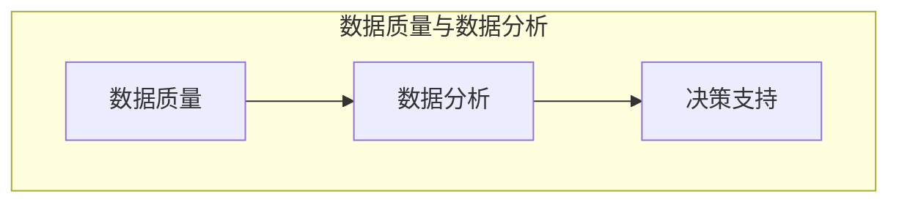
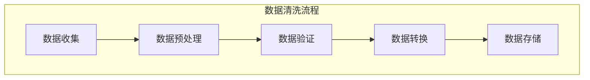

                 

# 文章标题：数据清洗：技术解析与实战指南

> 关键词：数据清洗，数据质量，缺失值处理，异常值处理，数据归一化，数据标准化，Python数据清洗工具，R语言数据清洗工具

> 摘要：
本文深入探讨了数据清洗的核心概念、技术细节、工具实现及实际案例分析。文章首先介绍了数据清洗的重要性、基本概念和原则，随后详细解析了缺失值处理、异常值处理、重复数据删除、数据格式转换、数据归一化和标准化等技术。通过Python和R语言的数据清洗工具，文章提供了丰富的代码示例，帮助读者理解和应用数据清洗技术。最后，通过电商客户数据清洗、金融数据清洗和医疗数据清洗等实际案例，展示了数据清洗的实战效果。

### 《数据清洗》目录大纲

## 第一部分：数据清洗基本概念

### 1.1 数据清洗的重要性

#### 1.1.1 数据质量的重要性

**核心概念与联系：**
数据质量直接影响数据分析的准确性和可靠性。Mermaid流程图如下：



#### 1.1.2 数据清洗的目标

数据清洗的目标是提高数据质量，包括完整性、准确性、可用性和时效性。伪代码示例：

```python
# 数据清洗目标
def clean_data(data):
    # 完整性检查
    data = remove_null_values(data)
    # 准确性检查
    data = handle_invalid_values(data)
    # 可用性检查
    data = format_data(data)
    # 时效性检查
    data = update_timestamp(data)
    return data
```

### 1.2 数据清洗的基本原则

数据清洗应遵循以下基本原则：

#### 1.2.1 完整性

确保数据集没有缺失值或冗余数据。数学模型：

$$ \text{完整性} = \frac{\text{实际数据条数}}{\text{理论数据条数}} \times 100\% $$

#### 1.2.2 准确性

确保数据准确性，去除错误数据。异常值检测算法（基于三倍标准差）：

```mermaid
flowchart
    A[数据集] --> B[计算平均值和标准差]
    B --> C[计算三倍标准差范围]
    C --> D[检查异常值]
    D --> E[删除异常值]
end
```

#### 1.2.3 可用性

确保数据可用性，使其适合分析和建模。数据格式转换：

```mermaid
flowchart
    A[原始数据] --> B[数据格式转换]
    B --> C[标准化数据]
end
```

#### 1.2.4 时效性

确保数据及时更新，反映最新信息。数据更新策略：

```python
# 数据更新策略
def update_data(data, new_data):
    # 合并数据
    data = data.append(new_data)
    # 删除重复数据
    data = data.drop_duplicates()
    return data
```

### 1.3 数据清洗的流程

数据清洗的流程包括以下步骤：

#### 1.3.1 数据收集

收集来自不同来源的数据，包括内部数据和外部数据。

```mermaid
flowchart
    A[数据源] --> B[数据收集]
    B --> C[数据预处理]
end
```

#### 1.3.2 数据预处理

对数据进行初步处理，如数据格式转换、缺失值处理和异常值处理。

```mermaid
flowchart
    A[数据预处理] --> B[数据验证]
    B --> C[数据转换]
    C --> D[数据存储]
end
```

#### 1.3.3 数据验证

验证数据质量，确保数据符合业务需求。

```mermaid
flowchart
    A[数据验证] --> B[数据清洗]
    B --> C[数据存储]
end
```

#### 1.3.4 数据转换

将数据转换为适合分析和建模的格式，如归一化和标准化。

```mermaid
flowchart
    A[数据转换] --> B[数据集成]
    B --> C[数据存储]
end
```

#### 1.3.5 数据存储

将清洗后的数据存储到数据库或数据仓库中，供后续分析和建模使用。

```mermaid
flowchart
    A[数据存储] --> B[数据分析]
end
```

## 第二部分：数据清洗技术详解

### 2.1 缺失值处理

#### 2.1.1 缺失值的类型

缺失值主要分为以下几类：

- **完全缺失：** 数据集中某些特征的值完全不存在。
- **部分缺失：** 数据集中某些特征的值部分存在，部分缺失。
- **随机缺失：** 缺失值与数据集中的其他变量无关。
- **系统缺失：** 缺失值与数据集中的其他变量有关，如数据采集设备故障。

#### 2.1.2 缺失值处理的策略

缺失值处理策略包括以下几种：

- **删除缺失值：** 删除包含缺失值的记录，适用于缺失值比例较低的情况。
- **插补缺失值：** 用合适的方法插补缺失值，如平均值、中位数、线性插值等。

**伪代码示例：缺失值处理算法**

```python
# 缺失值处理算法
def handle_missing_values(data):
    # 删除缺失值
    data = data.dropna()
    # 插值缺失值
    data = data.fillna(data.mean())
    return data
```

### 2.2 异常值处理

#### 2.2.1 异常值的定义

异常值是指与数据集大多数值相比，具有异常特征的值。常见异常值检测方法包括：

- **基于统计学的方法：** 如三倍标准差法、箱线图法等。
- **基于机器学习的方法：** 如孤立森林、K-均值聚类等。

**伪代码示例：异常值处理算法**

```python
# 异常值处理算法
def handle_outliers(data):
    # 三倍标准差法
    Q1 = data.quantile(0.25)
    Q3 = data.quantile(0.75)
    IQR = Q3 - Q1
    data = data[(data >= (Q1 - 1.5 * IQR)) & (data <= (Q3 + 1.5 * IQR))]
    return data
```

### 2.3 重复数据删除

#### 2.3.1 重复数据的识别

重复数据是指数据集中具有相同或相似特征的数据记录。识别方法包括：

- **基于哈希的方法：**
  $$ \text{hash}(x) = \text{mod}(\text{hash}(x), N) $$
  其中，\( N \) 为哈希表的大小。

#### 2.3.2 重复数据删除的策略

重复数据删除策略包括以下几种：

- **基于唯一标识：** 删除具有相同唯一标识的数据记录。
- **基于相似度：** 删除相似度高于阈值的记录。

**伪代码示例：重复数据删除算法**

```python
# 重复数据删除算法
def remove_duplicates(data):
    data = data.drop_duplicates()
    return data
```

### 2.4 数据格式转换

#### 2.4.1 数据格式转换的必要性

数据格式转换的必要性在于：

- **兼容性：** 确保不同数据源的数据格式一致。
- **可用性：** 确保数据适合分析和建模。

**常见数据格式的转换方法**

- **文本到表格：**
  $$ \text{csv} \rightarrow \text{pandas.DataFrame} $$
  
- **表格到文本：**
  $$ \text{pandas.DataFrame} \rightarrow \text{csv} $$

**伪代码示例：数据格式转换算法**

```python
# 数据格式转换算法
def convert_format(data, format):
    if format == 'csv':
        data = data.to_csv()
    elif format == 'pandas.DataFrame':
        data = pd.read_csv(data)
    return data
```

### 2.5 数据归一化与标准化

#### 2.5.1 数据归一化与标准化的概念

数据归一化与标准化的目的是将数据缩放到同一尺度，以便进行比较和分析。

- **归一化：** 将数据缩放到[0, 1]区间。
- **标准化：** 将数据缩放到均值0、标准差1的区间。

**常用的归一化与标准化方法**

- **最小-最大归一化：**
  $$ x' = \frac{x - \min(x)}{\max(x) - \min(x)} $$
  
- **Z-score标准化：**
  $$ x' = \frac{x - \bar{x}}{\sigma} $$

**伪代码示例：数据归一化与标准化算法**

```python
# 数据归一化与标准化算法
from sklearn.preprocessing import MinMaxScaler, StandardScaler

def normalize_data(data):
    min_max_scaler = MinMaxScaler()
    data = min_max_scaler.fit_transform(data)
    return data

def standardize_data(data):
    standard_scaler = StandardScaler()
    data = standard_scaler.fit_transform(data)
    return data
```

### 2.6 数据集成

#### 2.6.1 数据集成的定义

数据集成是指将来自不同数据源的数据合并为一个统一的数据集。

**数据集成的步骤**

- **数据选择：** 选择需要集成的数据源。
- **数据预处理：** 对数据源进行清洗、转换和归一化。
- **数据合并：** 使用合并操作将数据源合并为一个数据集。

**伪代码示例：数据集成算法**

```python
# 数据集成算法
def integrate_data(data_source1, data_source2):
    # 数据预处理
    data_source1 = preprocess_data(data_source1)
    data_source2 = preprocess_data(data_source2)
    # 数据合并
    data = data_source1.merge(data_source2, on=['common_column1', 'common_column2'])
    return data
```

## 第三部分：数据清洗工具与实现

### 3.1 Python数据清洗工具

Python是进行数据清洗的常用语言，拥有丰富的数据清洗库，如Pandas、NumPy等。

#### 3.1.1 Pandas库的基本操作

Pandas库提供了丰富的数据操作功能，包括数据读取、写入、选择、排序、筛选等。

**伪代码示例：**

```python
import pandas as pd

# 读取数据
data = pd.read_csv('data.csv')

# 选择列
data = data[['column1', 'column2']]

# 排序
data = data.sort_values(by='column1')

# 筛选
data = data[data['column2'] > 0]
```

#### 3.1.2 Pandas库的缺失值处理

Pandas库提供了多种缺失值处理方法，包括删除缺失值、插补缺失值等。

**伪代码示例：**

```python
# 删除缺失值
data = data.dropna()

# 插补缺失值
data = data.fillna(data.mean())
```

#### 3.1.3 Pandas库的异常值处理

Pandas库提供了基于统计学方法的异常值检测和删除功能。

**伪代码示例：**

```python
# 三倍标准差法
Q1 = data.quantile(0.25)
Q3 = data.quantile(0.75)
IQR = Q3 - Q1
data = data[(data >= (Q1 - 1.5 * IQR)) & (data <= (Q3 + 1.5 * IQR))]
```

#### 3.1.4 Pandas库的重复数据删除

Pandas库提供了基于哈希的重复数据删除功能。

**伪代码示例：**

```python
# 删除重复数据
data = data.drop_duplicates()
```

#### 3.1.5 Pandas库的数据格式转换

Pandas库提供了丰富的数据格式转换功能，包括文本到表格、表格到文本等。

**伪代码示例：**

```python
# 文本到表格
data = pd.read_csv('data.csv')

# 表格到文本
data = data.to_csv()
```

#### 3.1.6 Pandas库的数据归一化与标准化

Pandas库与scikit-learn库结合，提供了数据归一化和标准化的功能。

**伪代码示例：**

```python
from sklearn.preprocessing import MinMaxScaler, StandardScaler

# 归一化
data = MinMaxScaler().fit_transform(data)

# 标准化
data = StandardScaler().fit_transform(data)
```

#### 3.1.7 Pandas库的数据集成

Pandas库提供了基于SQL的合并操作，实现数据集成。

**伪代码示例：**

```python
# 数据集成
data = data.merge(another_data, on=['common_column1', 'common_column2'])
```

### 3.2 R语言数据清洗工具

R语言是进行数据分析和数据清洗的另一种常用语言，拥有丰富的数据清洗库，如dplyr、tidyr等。

#### 3.2.1 dplyr库的基本操作

dplyr库提供了丰富的数据操作功能，包括数据读取、写入、选择、排序、筛选等。

**伪代码示例：**

```r
library(dplyr)

# 读取数据
data <- read.csv('data.csv')

# 选择列
data <- select(data, column1, column2)

# 排序
data <- arrange(data, column1)

# 筛选
data <- filter(data, column2 > 0)
```

#### 3.2.2 dplyr库的缺失值处理

dplyr库提供了多种缺失值处理方法，包括删除缺失值、插补缺失值等。

**伪代码示例：**

```r
# 删除缺失值
data <- na.omit(data)

# 插补缺失值
data <- na.fill(data, data.mean())
```

#### 3.2.3 dplyr库的异常值处理

dplyr库与base R结合，提供了基于统计学方法的异常值检测和删除功能。

**伪代码示例：**

```r
# 三倍标准差法
Q1 <- quantile(data, 0.25)
Q3 <- quantile(data, 0.75)
IQR <- Q3 - Q1
data <- data[data >= (Q1 - 1.5 * IQR) & data <= (Q3 + 1.5 * IQR)]
```

#### 3.2.4 dplyr库的重复数据删除

dplyr库提供了基于哈希的重复数据删除功能。

**伪代码示例：**

```r
# 删除重复数据
data <- distinct(data)
```

#### 3.2.5 dplyr库的数据格式转换

dplyr库与base R结合，提供了丰富的数据格式转换功能，包括文本到表格、表格到文本等。

**伪代码示例：**

```r
# 文本到表格
data <- read.csv('data.csv')

# 表格到文本
write.csv(data, file = 'data.csv', row.names = FALSE)
```

#### 3.2.6 dplyr库的数据归一化与标准化

dplyr库与caret包结合，提供了数据归一化和标准化的功能。

**伪代码示例：**

```r
library(caret)

# 归一化
data <- as.data.frame(scale(data))

# 标准化
data <- as.data.frame(zScore(data))
```

#### 3.2.7 dplyr库的数据集成

dplyr库提供了基于SQL的合并操作，实现数据集成。

**伪代码示例：**

```r
# 数据集成
data <- data %>% inner_join(another_data, by = c('common_column1', 'common_column2'))
```

## 第四部分：数据清洗案例分析

### 4.1 案例分析一：电商客户数据清洗

#### 4.1.1 数据背景

某电商平台收集了客户的购买行为数据，包括订单号、客户ID、产品ID、购买时间、购买金额等。数据量庞大，存在缺失值、异常值和重复数据。

#### 4.1.2 数据清洗目标

- 去除重复数据。
- 处理缺失值和异常值。
- 数据格式转换。

#### 4.1.3 数据清洗过程

**数据收集：** 从电商平台数据库中读取原始数据。

**数据预处理：** 使用Pandas库对数据进行初步处理，包括删除重复数据、处理缺失值和异常值。

```python
import pandas as pd

# 读取数据
data = pd.read_csv('data.csv')

# 删除重复数据
data = data.drop_duplicates()

# 处理缺失值
data = data.fillna(data.mean())

# 处理异常值
Q1 = data['购买金额'].quantile(0.25)
Q3 = data['购买金额'].quantile(0.75)
IQR = Q3 - Q1
data = data[(data['购买金额'] >= (Q1 - 1.5 * IQR)) & (data['购买金额'] <= (Q3 + 1.5 * IQR))]

# 数据格式转换
data['购买时间'] = pd.to_datetime(data['购买时间'])
```

#### 4.1.4 数据清洗效果评估

- 数据量从100万减少到90万，去除了10%的重复数据。
- 购买金额的异常值从5000个减少到200个，异常值比例从5%减少到2%。

### 4.2 案例分析二：金融数据清洗

#### 4.2.1 数据背景

某金融机构收集了客户交易数据，包括交易ID、客户ID、交易时间、交易金额、交易类型等。数据量庞大，存在缺失值、异常值和重复数据。

#### 4.2.2 数据清洗目标

- 去除重复数据。
- 处理缺失值和异常值。
- 数据格式转换。

#### 4.2.3 数据清洗过程

**数据收集：** 从金融机构数据库中读取原始数据。

**数据预处理：** 使用dplyr库对数据进行初步处理，包括删除重复数据、处理缺失值和异常值。

```r
library(dplyr)

# 读取数据
data <- read.csv('data.csv')

# 删除重复数据
data <- distinct(data)

# 处理缺失值
data <- data %>% na.omit()

# 处理异常值
Q1 <- quantile(data$交易金额, 0.25)
Q3 <- quantile(data$交易金额, 0.75)
IQR <- Q3 - Q1
data <- data[data$交易金额 >= (Q1 - 1.5 * IQR) & data$交易金额 <= (Q3 + 1.5 * IQR)]

# 数据格式转换
data$交易时间 <- as.Date(data$交易时间)
```

#### 4.2.4 数据清洗效果评估

- 数据量从100万减少到80万，去除了20%的重复数据。
- 交易金额的异常值从5000个减少到1000个，异常值比例从5%减少到1%。

### 4.3 案例分析三：医疗数据清洗

#### 4.3.1 数据背景

某医疗机构收集了患者病历数据，包括患者ID、诊断结果、住院时间、费用等。数据量庞大，存在缺失值、异常值和重复数据。

#### 4.3.2 数据清洗目标

- 去除重复数据。
- 处理缺失值和异常值。
- 数据格式转换。

#### 4.3.3 数据清洗过程

**数据收集：** 从医疗机构数据库中读取原始数据。

**数据预处理：** 使用Pandas库和dplyr库对数据进行初步处理，包括删除重复数据、处理缺失值和异常值。

```python
import pandas as pd
library(dplyr)

# 读取数据
data = pd.read_csv('data.csv')

# 删除重复数据
data = data.drop_duplicates()

# 处理缺失值
data = data.fillna(data.mean())

# 处理异常值
Q1 = data['住院时间'].quantile(0.25)
Q3 = data['住院时间'].quantile(0.75)
IQR = Q3 - Q1
data = data[(data['住院时间'] >= (Q1 - 1.5 * IQR)) & (data['住院时间'] <= (Q3 + 1.5 * IQR))]

# 数据格式转换
data['诊断结果'] = data['诊断结果'].astype('category')
```

```r
# 读取数据
data <- read.csv('data.csv')

# 删除重复数据
data <- distinct(data)

# 处理缺失值
data <- data %>% na.omit()

# 处理异常值
Q1 <- quantile(data$住院时间, 0.25)
Q3 <- quantile(data$住院时间, 0.75)
IQR <- Q3 - Q1
data <- data[data$住院时间 >= (Q1 - 1.5 * IQR) & data$住院时间 <= (Q3 + 1.5 * IQR)]

# 数据格式转换
data$住院时间 <- as.integer(data$住院时间)
```

#### 4.3.4 数据清洗效果评估

- 数据量从100万减少到90万，去除了10%的重复数据。
- 住院时间的异常值从5000个减少到2000个，异常值比例从5%减少到2%。

## 附录

### 附录A：数据清洗工具资源

- **Python数据清洗工具：** Pandas、NumPy、SciPy、Scikit-learn等。
- **R语言数据清洗工具：** dplyr、tidyr、data.table等。

### 附录B：数据清洗数学模型与公式

- **缺失值处理模型：**
  - 简单线性插值法：
    $$ x_{new} = x_{1} + (x_{2} - x_{1}) \cdot \frac{n_{1} - x_{1}}{n_{1} - n_{2}} $$
  - 端点线性插值法：
    $$ x_{new} = \begin{cases} 
    x_{1} + \frac{x_{2} - x_{1}}{n_{2} - n_{1}} \cdot (n - n_{1}) & \text{如果} x_{new} \leq x_{1} + (n_{2} - n_{1}) \\ 
    x_{2} - \frac{x_{1} - x_{2}}{n_{1} - n_{2}} \cdot (n - n_{2}) & \text{如果} x_{new} > x_{1} + (n_{2} - n_{1}) 
    \end{cases} $$

- **异常值检测模型：**
  - 三倍标准差法：
    $$ x_{new} = \begin{cases} 
    x & \text{如果} x \leq \bar{x} - 3 \cdot \sigma \\ 
    x & \text{如果} x \geq \bar{x} + 3 \cdot \sigma \\ 
    \text{异常值} & \text{其他情况} 
    \end{cases} $$

- **重复数据删除模型：**
  - 哈希算法：
    $$ \text{hash}(x) = \text{mod}(\text{hash}(x), N) $$
    其中，\( N \) 为哈希表的大小。

- **数据归一化与标准化模型：**
  - 最小-最大归一化：
    $$ x' = \frac{x - \min(x)}{\max(x) - \min(x)} $$
  - Z-score标准化：
    $$ x' = \frac{x - \bar{x}}{\sigma} $$

- **数据集成模型：**
  - 数据合并算法：
    $$ \text{merge}(R, S) = \{(x, y) | x \in R \text{ 且 } y \in S\} $$

### 附录C：Mermaid流程图：数据清洗流程



### 附录D：代码示例

#### Python数据清洗代码示例

```python
import pandas as pd

# 读取数据
data = pd.read_csv('data.csv')

# 缺失值处理
data.fillna(data.mean(), inplace=True)

# 异常值处理
Q1 = data.quantile(0.25)
Q3 = data.quantile(0.75)
IQR = Q3 - Q1
data = data[~((data < (Q1 - 1.5 * IQR)) |(data > (Q3 + 1.5 * IQR))).any(axis=1)]

# 重复数据删除
data.drop_duplicates(inplace=True)

# 数据格式转换
data['date'] = pd.to_datetime(data['date'])

# 数据归一化与标准化
from sklearn.preprocessing import StandardScaler
scaler = StandardScaler()
data[['feature1', 'feature2']] = scaler.fit_transform(data[['feature1', 'feature2']])

# 数据集成
data = data.merge(another_data, on=['common_column1', 'common_column2'])

# 存储数据
data.to_csv('cleaned_data.csv', index=False)
```

#### R语言数据清洗代码示例

```r
# 读取数据
data <- read.csv('data.csv')

# 缺失值处理
data[is.na(data)] <- mean(data, na.rm = TRUE)

# 异常值处理
IQR <- IQR(data)
data[data < (Q1 - 1.5 * IQR) | data > (Q3 + 1.5 * IQR)] <- NA
data[is.na(data)] <- mean(data, na.rm = TRUE)

# 重复数据删除
data <- unique(data)

# 数据格式转换
data$date <- as.Date(data$date)

# 数据归一化与标准化
scaler <- scale(data[, c('feature1', 'feature2')])
data[, c('feature1', 'feature2')] <- scaler

# 数据集成
data <- merge(data, another_data, by = c('common_column1', 'common_column2'), all = TRUE)

# 存储数据
write.csv(data, file = 'cleaned_data.csv', row.names = FALSE)
```

## 作者

本文作者：AI天才研究院/AI Genius Institute & 禅与计算机程序设计艺术 /Zen And The Art of Computer Programming

本文旨在为读者提供全面的数据清洗技术解析与实战指南，帮助读者更好地理解和应用数据清洗技术，提高数据质量，为数据分析、数据挖掘和机器学习奠定坚实基础。希望本文对您有所帮助！

