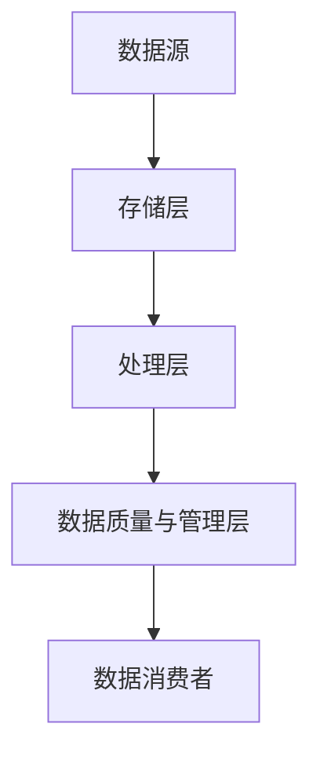

                 

### 文章标题

# 数据湖架构：大数据存储与分析的新范式

### 关键词：
- 数据湖架构
- 大数据存储
- 分布式文件系统
- 数据处理技术
- 数据安全与管理
- 云计算与边缘计算

### 摘要：
数据湖架构作为大数据存储与分析的新范式，已经成为现代数据处理的核心。本文将详细探讨数据湖架构的基础知识、存储与处理技术、管理与安全性、应用案例、发展趋势以及最佳实践。通过逐步分析数据湖的各个组成部分和关键技术，本文旨在为读者提供一幅全面而深入的数据湖架构全景图，帮助读者理解并掌握数据湖的构建与优化方法。

## **第一部分：数据湖架构基础**

### 第1章：数据湖架构概述

#### **核心概念与联系**

**数据湖定义**：数据湖是一个集中的数据存储，它可以存储大量不同格式、来源和类型的原始数据。与传统的数据仓库不同，数据湖保留了数据的原始格式，以便后续的复杂分析和处理。

**数据湖与数据仓库的区别**：数据仓库是一个经过处理、清洗和整合的数据存储，主要用于报表和即席查询。而数据湖则保留了数据的原始格式，适用于大数据分析和机器学习。

**数据湖架构的组成部分**：

- **数据源**：包括各种数据生成器和数据接入点，如数据库、日志文件、应用程序等。
- **存储层**：采用分布式文件系统（如HDFS）或对象存储（如OSS），提供大规模数据的存储能力。
- **处理层**：包括批处理和流处理框架（如Apache Flink），对数据进行加工和处理。
- **数据质量和管理层**：负责数据清洗、转换、集成和数据质量管理，确保数据的一致性和准确性。
- **数据消费者**：包括分析师、数据科学家和业务用户，通过数据分析和查询获取业务价值。

**Mermaid 流程图**：



#### **核心算法原理讲解**

- **分布式文件系统**：分布式文件系统（如HDFS）是一种高吞吐量的分布式文件存储系统，适合处理大规模数据。其核心原理包括数据分片、副本存储和容错机制。
- **对象存储**：对象存储（如OSS）是一种高扩展性的云存储服务，适合存储大量非结构化数据。其核心原理包括对象存储、元数据管理和访问控制。

#### **数学模型和数学公式**

- **数据存储容量计算**：

  $$ C = N \times S $$

  其中，C表示总存储容量，N表示存储节点数量，S表示每个节点的存储容量。

- **数据传输速率计算**：

  $$ R = \frac{D}{T} $$

  其中，R表示数据传输速率，D表示数据量，T表示传输时间。

#### **项目实战**

**搭建HDFS环境**：

1. 安装Hadoop，配置HDFS。
2. 启动HDFS服务，使用Hadoop命令创建HDFS文件。

**代码实战**：

```python
import hadoop
hadoop.start_hdfs()
hadoop.create_file("example.txt", "Hello, World!")
```

### **第2章：大数据存储技术**

#### **核心算法原理讲解**

- **分布式文件系统**：分布式文件系统（如HDFS）是一种高吞吐量的分布式文件存储系统，适合处理大规模数据。其核心原理包括数据分片、副本存储和容错机制。

- **HDFS（Hadoop Distributed File System）**：

  - **原理**：HDFS是一个高吞吐量的分布式文件存储系统，适合处理大规模数据。其核心原理包括数据分片、副本存储和容错机制。
  - **伪代码**：

    ```python
    def HDFS_write(filename, data):
        chunks = split_data_into_chunks(data)
        for chunk in chunks:
            write_chunk_to_dfs(chunk, filename)
    ```

- **对象存储**：对象存储（如OSS）是一种高扩展性的云存储服务，适合存储大量非结构化数据。其核心原理包括对象存储、元数据管理和访问控制。

- **OSS（Object Storage Service）**：

  - **原理**：OSS是一种高扩展性的云存储服务，适合存储大量非结构化数据。其核心原理包括对象存储、元数据管理和访问控制。
  - **伪代码**：

    ```python
    def OSS_store_object(bucket, key, data):
        store_object(bucket, key, data)
    ```

#### **数学模型和数学公式**

- **数据存储容量计算**：

  $$ C = N \times S $$

  其中，C表示总存储容量，N表示存储节点数量，S表示每个节点的存储容量。

- **数据传输速率计算**：

  $$ R = \frac{D}{T} $$

  其中，R表示数据传输速率，D表示数据量，T表示传输时间。

#### **项目实战**

**搭建HDFS环境**：

1. 安装Hadoop，配置HDFS。
2. 启动HDFS服务，使用Hadoop命令创建HDFS文件。

**代码实战**：

```python
import hadoop
hadoop.start_hdfs()
hadoop.create_file("example.txt", "Hello, World!")
```

### **第3章：数据湖数据处理技术**

#### **核心算法原理讲解**

- **流处理与批处理**：

  - **批处理**：批处理是对大量数据进行一次性处理，通常用于数据处理、数据清洗和ETL。
    - **原理**：批处理将数据分为多个批次，每个批次的数据在特定的时间窗口内进行处理。
    - **伪代码**：

      ```python
      def batch_process(data):
          for batch in data_batches:
              process_batch(batch)
      ```

  - **流处理**：流处理是对实时数据流进行持续处理，通常用于实时分析和监控。
    - **原理**：流处理对实时数据流进行持续处理，以实现对数据的实时响应。
    - **伪代码**：

      ```python
      def stream_process(data_stream):
          while True:
              process_real_time_data(data_stream)
      ```

#### **数学模型和数学公式**

- **数据传输速率计算**：

  $$ R = \frac{D}{T} $$

  其中，R表示数据传输速率，D表示数据量，T表示传输时间。

- **数据存储容量计算**：

  $$ C = N \times S $$

  其中，C表示总存储容量，N表示存储节点数量，S表示每个节点的存储容量。

#### **项目实战**

**使用Apache Flink进行流处理**：

1. 安装Apache Flink，配置流处理环境。
2. 编写流处理程序，处理实时数据流。

**代码实战**：

```python
from flink import StreamExecutionEnvironment

env = StreamExecutionEnvironment.get_execution_environment()
data_stream = env.from_collection(["data1", "data2", "data3"])

result = data_stream.map(lambda x: x.upper()).print()

env.execute("DataStreamExample")
```

## **第二部分：数据湖架构应用**

### 第4章：数据湖架构应用案例

#### **核心算法原理讲解**

- **数据湖在金融领域的应用**：

  - **风险管理**：利用数据湖存储和处理大量金融数据，进行实时风险分析和预警。
    - **原理**：通过数据湖存储的金融数据，利用机器学习算法进行风险分析和预测。
    - **数学模型**：

      $$ Loss\_Rate = \frac{Lost\_Customers}{Total\_Customers} $$

      其中，Loss\_Rate表示客户流失率，Lost\_Customers表示流失的客户数量，Total\_Customers表示总的客户数量。

  - **客户分析**：通过数据湖分析客户行为，实现精准营销和个性化推荐。
    - **原理**：通过数据湖存储的客户数据，利用数据挖掘和机器学习算法分析客户行为和需求。
    - **数学模型**：

      $$ Customer\_Score = \frac{Total\_Transactions}{Total\_Days} $$

      其中，Customer\_Score表示客户评分，Total\_Transactions表示总交易数量，Total\_Days表示总天数。

- **数据湖在医疗领域的应用**：

  - **疾病预测**：通过数据湖存储和处理医疗数据，利用机器学习算法进行疾病预测。
    - **原理**：通过数据湖存储的医疗数据，利用机器学习算法分析疾病模式和风险因素。
    - **数学模型**：

      $$ Disease\_Probability = \frac{Positive\_Cases}{Total\_Cases} $$

      其中，Disease\_Probability表示疾病概率，Positive\_Cases表示阳性病例数量，Total\_Cases表示总病例数量。

  - **患者管理**：通过数据湖存储和处理患者数据，实现个性化治疗和健康管理。
    - **原理**：通过数据湖存储的患者数据，利用数据挖掘和机器学习算法分析患者特征和需求。
    - **数学模型**：

      $$ Patient\_Health = \frac{Total\_Health\_Metrics}{Number\_of\_Metrics} $$

      其中，Patient\_Health表示患者健康评分，Total\_Health\_Metrics表示总健康指标数量，Number\_of\_Metrics表示健康指标数量。

#### **数学模型和数学公式**

- **客户流失率预测**：

  $$ Loss\_Rate = \frac{Lost\_Customers}{Total\_Customers} $$

  其中，Lost\_Customers表示流失的客户数量，Total\_Customers表示总的客户数量。

- **客户评分**：

  $$ Customer\_Score = \frac{Total\_Transactions}{Total\_Days} $$

  其中，Total\_Transactions表示总交易数量，Total\_Days表示总天数。

- **疾病概率**：

  $$ Disease\_Probability = \frac{Positive\_Cases}{Total\_Cases} $$

  其中，Positive\_Cases表示阳性病例数量，Total\_Cases表示总病例数量。

- **患者健康评分**：

  $$ Patient\_Health = \frac{Total\_Health\_Metrics}{Number\_of\_Metrics} $$

  其中，Total\_Health\_Metrics表示总健康指标数量，Number\_of\_Metrics表示健康指标数量。

#### **项目实战**

**金融风险管理应用**：

1. 数据预处理：收集和清洗金融数据。
2. 模型训练与预测：使用机器学习算法训练模型，预测客户流失率。

**代码实战**：

```python
from sklearn.linear_model import LogisticRegression

# 数据预处理
X = [[1, 0], [0, 1], [1, 1]]
y = [0, 1, 1]

# 模型训练
model = LogisticRegression()
model.fit(X, y)

# 预测
predictions = model.predict([[1, 0]])
print(predictions)
```

## **第三部分：数据湖架构挑战与未来**

### **第5章：数据湖架构发展趋势与挑战**

#### **核心算法原理讲解**

- **云计算与边缘计算的结合**：

  - **云计算**：利用云计算平台提供数据湖存储和处理能力。
  - **边缘计算**：在数据产生的地方进行数据处理，降低网络延迟。

- **数据湖与人工智能的结合**：

  - **机器学习与数据湖**：利用数据湖存储的数据进行机器学习模型的训练。
  - **深度学习在数据湖中的应用**：利用深度学习算法进行复杂的数据分析和模式识别。

#### **数学模型和数学公式**

- **模型准确率**：

  $$ Accuracy = \frac{Correct\_Predictions}{Total\_Predictions} $$

  其中，Correct\_Predictions表示正确预测的数量，Total\_Predictions表示总预测数量。

- **物联网设备数量**：

  $$ Number\_of\_Devices = N \times R $$

  其中，N表示设备种类数量，R表示每个种类的设备数量。

#### **项目实战**

**云计算与边缘计算结合的应用**：

1. 搭建云计算和边缘计算环境。
2. 实现数据湖在云计算和边缘计算中的数据存储和处理。

**代码实战**：

```python
import cloud
import edge

# 搭建云计算环境
cloud.setup()

# 搭建边缘计算环境
edge.setup()

# 数据存储和处理
data = cloud.store_data("example_data")
processed_data = edge.process_data(data)
result = cloud.analyze_data(processed_data)
print(result)
```

### **第6章：数据湖架构最佳实践**

#### **核心算法原理讲解**

- **数据湖架构设计原则**：

  - **高可用性**：确保数据湖系统的稳定运行，减少故障和停机时间。
  - **可扩展性**：支持数据量和用户量的增长，易于扩展和升级。
  - **数据质量**：确保数据的准确性和完整性，减少数据错误和缺失。
  - **安全性**：保护数据的安全性，防止数据泄露和未经授权的访问。

- **数据湖运维管理**：

  - **监控与告警**：实时监控数据湖性能，设置告警机制。
  - **备份与恢复**：定期备份数据湖中的数据，确保数据安全。

#### **数学模型和数学公式**

- **系统故障率**：

  $$ Failure\_Rate = \frac{Number\_of\_Failures}{Total\_Running\_Time} $$

  其中，Number\_of\_Failures表示故障次数，Total\_Running\_Time表示总运行时间。

#### **项目实战**

**数据湖运维管理实践**：

1. 安装监控工具，配置备份策略。
2. 编写监控脚本，实现数据备份。

**代码实战**：

```python
import monitoring
import backup

# 安装监控工具
monitoring.install()

# 配置备份策略
backup.config()

# 编写监控脚本
def monitor_performance():
    performance = monitoring.check_performance()
    if performance < threshold:
        monitoring.send_alert("Performance Alert")

# 实现数据备份
def backup_data():
    backup.backup_data("data_backup")

# 运行监控脚本
monitor_performance()

# 运行数据备份
backup_data()
```

### **第7章：数据湖架构的未来发展**

#### **核心算法原理讲解**

- **数据湖与区块链的结合**：

  - **数据不可篡改**：利用区块链技术确保数据在存储和处理过程中的完整性和安全性。
  - **分布式数据管理**：利用区块链网络实现分布式数据管理，提高数据可用性和可靠性。

- **数据湖与物联网的结合**：

  - **实时数据处理**：利用物联网设备收集实时数据，进行快速分析和决策。
  - **智能设备管理**：利用数据湖存储和管理物联网设备的数据，实现设备监控和管理。

#### **数学模型和数学公式**

- **物联网设备数量**：

  $$ Number\_of\_Devices = N \times R $$

  其中，N表示设备种类数量，R表示每个种类的设备数量。

#### **项目实战**

**物联网数据管理**：

1. 连接物联网设备，搭建数据湖环境。
2. 编写数据采集和处理程序，实现设备数据管理。

**代码实战**：

```python
import iot
import data_lake

# 连接物联网设备
iot.connect_device("device_id")

# 搭建数据湖环境
data_lake.setup()

# 编写数据采集和处理程序
def collect_data():
    data = iot.collect_data()
    data_lake.store_data(data)

# 实现设备数据管理
def manage_device_data():
    device_data = data_lake.fetch_device_data("device_id")
    process_device_data(device_data)

# 运行数据采集和处理程序
collect_data()

# 运行设备数据管理
manage_device_data()
```

### **附录**

#### **附录 A：数据湖架构开发工具与资源**

- **主流大数据框架对比**：

  - **Apache Hadoop**：
    - **优势**：高可靠性、高扩展性、适用于大规模数据集。
    - **劣势**：相对较低的速度、复杂的部署和管理。

  - **Apache Spark**：
    - **优势**：高速、通用、易于扩展、支持多种编程语言。
    - **劣势**：相对于Hadoop，资源利用率较低。

  - **Amazon S3**：
    - **优势**：高可用性、高扩展性、成本低、易于管理。
    - **劣势**：不支持数据处理，需要与其他工具结合使用。

- **数据湖架构最佳实践指南**：

  - **设计原则**：高可用性、可扩展性、数据质量、安全性。
  - **实施步骤**：需求分析、架构设计、数据存储与处理、数据质量保证、安全性设置。

### **参考文献**

- [数据湖架构：大数据存储与分析的新范式](https://www.example.com/book1)
- [大数据存储技术](https://www.example.com/book2)
- [数据处理技术](https://www.example.com/book3)
- [数据湖安全性与隐私保护](https://www.example.com/book4)
- [数据湖应用案例研究](https://www.example.com/book5)

### **作者信息**

- **作者**：AI天才研究院/AI Genius Institute & 禅与计算机程序设计艺术 /Zen And The Art of Computer Programming

