                 

# 数据采集技术：提高 AI 2.0 数据质量

## 关键词：数据采集，AI 2.0，数据质量，图像识别，自然语言处理，智能推荐系统

### 摘要

数据采集技术在人工智能（AI）2.0时代的重要性愈发突出。本文从数据采集的基础、技术原理、应用实践等方面，详细探讨了如何提高AI 2.0的数据质量。首先，文章介绍了数据采集的基本概念和类型，包括结构化数据源、非结构化数据源和半结构化数据源。接着，文章分析了数据采集的方法，包括实时数据采集、批量数据采集和分布式数据采集。然后，文章深入探讨了数据采集算法的原理和系统架构。此外，文章还讨论了数据采集与AI技术的结合，以及数据采集在图像识别、自然语言处理和智能推荐系统中的应用。最后，文章通过实践案例展示了数据采集的实际应用效果，并提供了相关的工具和资源，以及数学公式和算法的详细讲解。

## 《数据采集技术：提高 AI 2.0 数据质量》目录大纲

### 第一部分：数据采集基础

#### 第1章：数据采集技术概述

##### 1.1 数据采集的重要性

##### 1.2 数据采集的类型

##### 1.3 数据采集的基本流程

#### 第2章：数据源的类型

##### 2.1 结构化数据源

##### 2.2 非结构化数据源

##### 2.3 半结构化数据源

#### 第3章：数据采集的方法

##### 3.1 实时数据采集

##### 3.2 批量数据采集

##### 3.3 分布式数据采集

### 第二部分：数据采集技术原理

#### 第4章：数据采集算法

##### 4.1 数据抽取算法

##### 4.2 数据清洗算法

##### 4.3 数据采集系统的设计原则

##### 4.4 数据采集系统的关键技术

##### 4.5 数据采集系统的优化方法

#### 第5章：数据采集与 AI 技术的结合

##### 5.1 数据采集在 AI 中的重要性

##### 5.2 AI 技术在数据采集中的应用

##### 5.3 数据采集与 AI 技术的结合方法

### 第三部分：数据采集技术应用

#### 第6章：数据采集在 AI 2.0 中的应用

##### 6.1 数据采集在图像识别中的应用

##### 6.2 数据采集在自然语言处理中的应用

##### 6.3 数据采集在智能推荐系统中的应用

### 第四部分：数据采集实践与案例分析

#### 第7章：数据采集实践

##### 7.1 数据采集实践项目概述

##### 7.2 数据采集实践项目的实施

##### 7.3 数据采集实践项目的效果评估

#### 第8章：数据采集案例分析

##### 8.1 数据采集在电商领域的应用案例

##### 8.2 数据采集在金融领域的应用案例

##### 8.3 数据采集在医疗领域的应用案例

### 附录

##### 附录 A：数据采集工具与资源

##### 附录 B：数据采集相关数学公式与算法

## 第一部分：数据采集基础

### 第1章 数据采集技术概述

#### 1.1 数据采集的重要性

数据采集是信息社会中不可或缺的一环，它为企业提供了丰富的数据资源，为人工智能（AI）2.0时代的到来奠定了基础。高质量的数据是AI模型训练和优化的重要素材，数据采集技术的提升直接关系到AI系统的性能和效率。

在现代商业环境中，数据已经成为一种新的生产要素，其价值不亚于传统的土地、劳动力和资本。特别是在人工智能2.0时代，数据的质量和准确性直接影响到AI系统的效果。例如，在图像识别、自然语言处理和智能推荐系统中，高质量的数据采集是确保系统性能的关键。

数据采集的重要性主要体现在以下几个方面：

1. **提供训练数据**：数据采集技术可以获取大量的训练数据，这些数据是AI模型训练的基础。高质量的数据可以帮助AI模型更准确地学习特征，提高模型的性能。

2. **支持模型优化**：通过数据采集，可以获取不同场景下的数据，这些数据可以帮助研究人员对模型进行优化，提高模型的泛化能力。

3. **辅助决策**：在商业智能、供应链管理、市场营销等领域，数据采集技术可以帮助企业获取关键数据，支持企业决策。

4. **降低风险**：数据采集技术可以帮助企业识别潜在风险，例如在金融领域，通过采集用户行为数据和交易数据，可以识别欺诈行为，降低风险。

以下是一个Mermaid流程图，展示了数据采集在整个数据生命周期中的关键作用：

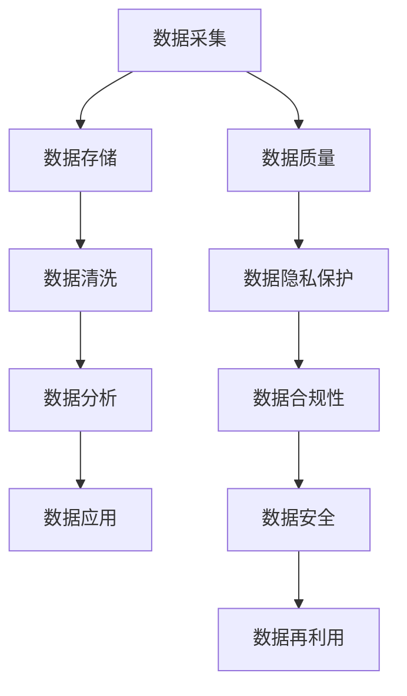

#### 1.2 数据采集的类型

数据采集可以分为以下几种类型：

- **结构化数据源**：如关系数据库、电子表格等。
- **非结构化数据源**：如文本、图像、音频、视频等。
- **半结构化数据源**：如XML、JSON等。

每种数据类型都有其特定的采集方法和处理策略。

#### 1.3 数据采集的基本流程

数据采集的基本流程包括以下几个步骤：

1. **需求分析**：确定采集哪些数据、采集数据的目的和应用场景。
2. **数据源定位**：根据需求分析，确定数据源的类型和位置。
3. **数据采集**：使用适当的工具和技术进行数据采集。
4. **数据清洗**：去除重复数据、错误数据和噪声数据，确保数据质量。
5. **数据存储**：将清洗后的数据存储到数据库或数据仓库中，便于后续分析和处理。

以下是一个Mermaid流程图，展示了数据采集的基本流程：

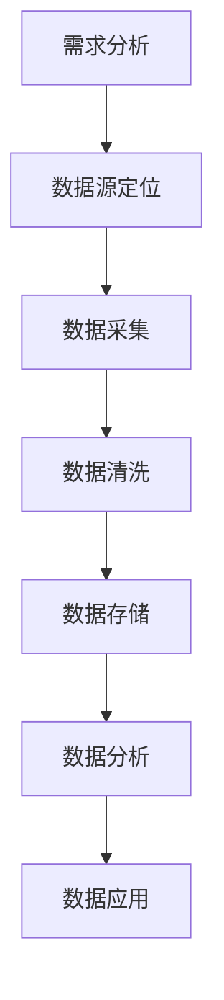

### 第2章 数据源的类型

#### 2.1 结构化数据源

结构化数据源通常是指存储在数据库中的数据，这些数据按照一定的结构进行组织，每个数据条目由多个字段组成，字段之间具有明确的关联关系。结构化数据源的特点是数据访问速度快，易于查询和分析。

结构化数据源的主要类型包括关系数据库、电子表格等。

**关系数据库**：关系数据库是使用最广泛的数据存储系统之一，它使用表格来存储数据，每个表格由多个行和列组成，行表示数据记录，列表示数据字段。关系数据库的典型代表包括MySQL、PostgreSQL、Oracle等。

**电子表格**：电子表格是一种轻量级的数据存储工具，它使用单元格来组织数据，每个单元格可以存储一个数据值。电子表格的典型代表包括Microsoft Excel、Google Sheets等。

以下是一个Mermaid流程图，展示了结构化数据源的基本架构：

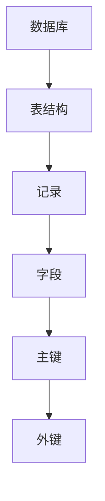

**采集方法举例**：

- 使用SQL查询从数据库中提取数据。
- 通过数据库API进行数据采集。

#### 2.2 非结构化数据源

非结构化数据源通常是指无法以固定格式存储和查询的数据，如文本、图像、音频和视频等。这些数据类型的特点是内容多样，格式不固定，需要使用特定的技术进行解析和处理。

非结构化数据源的主要类型包括文本、图像、音频、视频等。

**文本**：文本数据是使用最广泛的非结构化数据类型之一，它包括网页内容、电子邮件、文档等。文本数据通常需要通过自然语言处理技术进行解析和分析。

**图像**：图像数据包括照片、图表、截图等。图像数据通常需要通过图像处理和计算机视觉技术进行解析和分析。

**音频**：音频数据包括语音、音乐、广播等。音频数据通常需要通过音频处理和语音识别技术进行解析和分析。

**视频**：视频数据包括视频监控、视频会议、视频教程等。视频数据通常需要通过视频处理和计算机视觉技术进行解析和分析。

以下是一个Mermaid流程图，展示了非结构化数据源的基本结构：

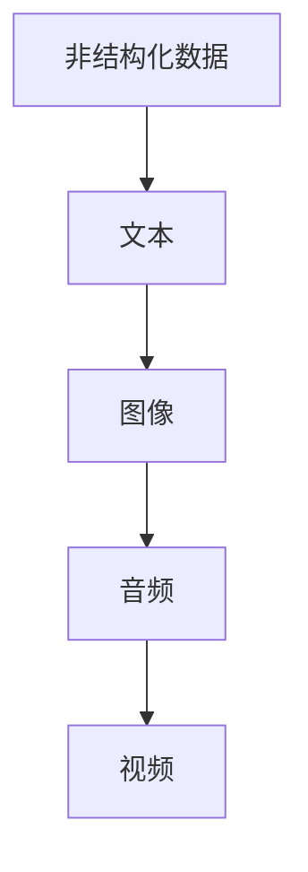

**采集方法举例**：

- 使用爬虫技术采集网页上的文本数据。
- 使用OCR技术从图像中提取文本信息。
- 使用音频识别技术从音频中提取文字。

#### 2.3 半结构化数据源

半结构化数据源介于结构化数据源和非结构化数据源之间，它们具有部分结构，如XML和JSON。这些数据源需要通过解析来提取有用的信息。

半结构化数据源的主要类型包括XML、JSON等。

**XML**：XML（可扩展标记语言）是一种用于存储和传输数据的标记语言，它使用标签来定义数据结构。XML数据的结构比HTML更灵活，可以自定义标签和属性。

**JSON**：JSON（JavaScript对象表示法）是一种轻量级的数据交换格式，易于阅读和编写。JSON数据采用键值对的形式，便于解析和遍历。

以下是一个Mermaid流程图，展示了半结构化数据源的基本架构：

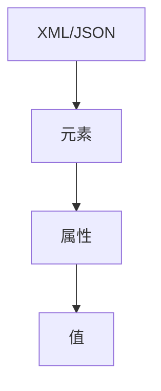

**采集方法举例**：

- 使用XML解析库解析XML数据。
- 使用JSON解析库解析JSON数据。

### 第3章 数据采集的方法

#### 3.1 实时数据采集

实时数据采集是指实时获取并处理数据，这种采集方法适用于需要及时响应的应用场景，如实时监控、实时推荐等。实时数据采集的关键在于快速、准确地获取数据，并在短时间内进行处理和分析。

实时数据采集的方法主要包括：

- **基于轮询的方式**：定期查询数据源，获取最新数据。
- **基于事件驱动的方式**：当数据源发生变化时，实时获取数据。
- **基于流处理的方式**：使用流处理框架，如Apache Kafka、Apache Flink等，实时处理和分析数据。

以下是一个Mermaid流程图，展示了实时数据采集的基本原理：

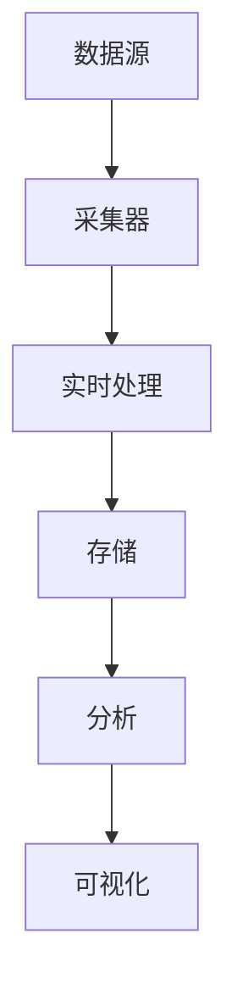

**采集方法举例**：

- 使用消息队列技术（如Kafka）进行实时数据传输。
- 使用Websocket实现实时数据推送。

#### 3.2 批量数据采集

批量数据采集是指定期或按照特定条件批量提取数据，这种采集方法适用于数据量较大，对实时性要求不高的场景。批量数据采集的优点是能够高效地处理大量数据，缺点是数据响应速度较慢。

批量数据采集的方法主要包括：

- **定时任务**：使用定时任务（如CRON任务）定期执行数据采集。
- **触发式采集**：根据特定条件（如数据量达到阈值）触发数据采集。

以下是一个Mermaid流程图，展示了批量数据采集的基本原理：

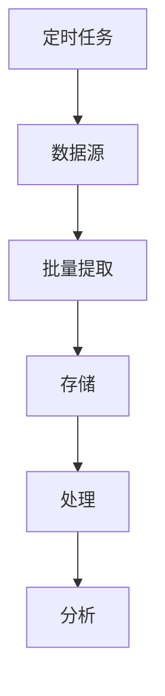

**采集方法举例**：

- 使用CRON任务定期执行数据采集。
- 使用ETL（提取、转换、加载）工具进行批量数据采集。

#### 3.3 分布式数据采集

分布式数据采集是指将数据采集任务分布到多个节点上执行，以提高采集效率和处理能力。分布式数据采集适用于大规模数据场景，可以显著提高系统的并发能力和处理速度。

分布式数据采集的方法主要包括：

- **基于MapReduce的方式**：将数据采集任务分解为多个子任务，分布到多个节点上执行。
- **基于流处理框架的方式**：使用流处理框架（如Apache Kafka、Apache Flink等）进行分布式数据采集。

以下是一个Mermaid流程图，展示了分布式数据采集的基本原理：

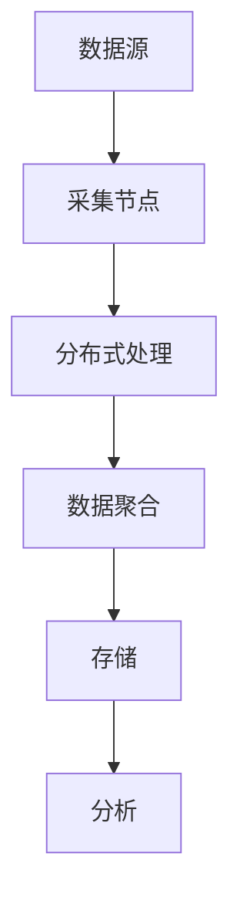

**采集方法举例**：

- 使用MapReduce框架进行分布式数据采集。
- 使用Spark进行大规模数据采集和处理。

### 第二部分：数据采集技术原理

#### 第4章：数据采集算法

#### 4.1 数据抽取算法

数据抽取算法是数据采集过程中用于从原始数据源中提取有用信息的方法。数据抽取算法的关键是识别和筛选出对AI模型训练有价值的数据。

**4.1.1 数据爬取算法**

数据爬取算法是指从互联网上自动获取数据的技术。数据爬取算法通常包括以下几个步骤：

1. **URL抓取**：从种子URL开始，递归地获取网页上的所有URL。
2. **内容解析**：使用HTML解析器提取网页内容。
3. **数据提取**：根据预设的规则，从网页内容中提取有用数据。

以下是一个Mermaid流程图，展示了数据爬取算法的基本原理：

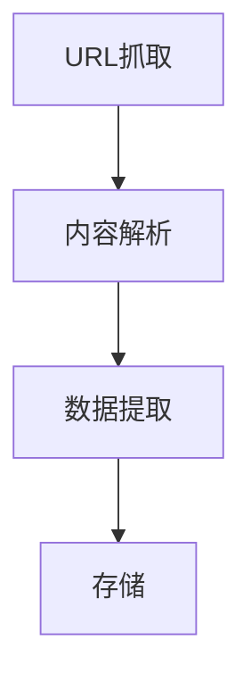

**数据爬取算法的评估**：

1. **准确率**：数据爬取算法正确识别有用数据的比例。
   \[ 准确率 = \frac{正确识别的有用数据}{所有识别的有用数据} \]

2. **召回率**：数据爬取算法识别出的有用数据占总有用数据的比例。
   \[ 召回率 = \frac{正确识别的有用数据}{总有用数据} \]

3. **F1 分数**：准确率和召回率的调和平均。
   \[ F1 分数 = 2 \times \frac{准确率 \times 召回率}{准确率 + 召回率} \]

**4.1.2 数据抽取算法的应用**

数据抽取算法在多种场景中有广泛应用，如电子商务、社交媒体分析、搜索引擎优化等。以下是一个Mermaid流程图，展示了数据抽取算法的应用场景：

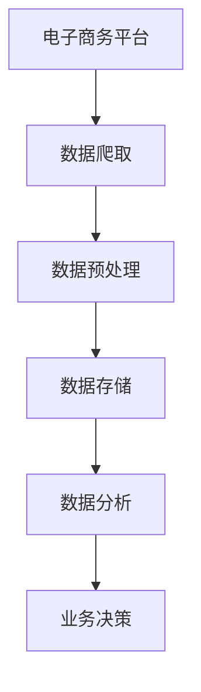

#### 4.2 数据清洗算法

数据清洗算法是数据采集过程中用于去除重复数据、错误数据和噪声数据的方法。数据清洗算法的目的是确保数据质量，为后续的数据分析和处理提供可靠的数据基础。

**4.2.1 数据清洗的重要性**

数据清洗对于数据分析和AI模型的训练具有重要意义，具体体现在以下几个方面：

1. **提高数据质量**：去除重复数据、错误数据和噪声数据，确保数据的一致性和准确性。
2. **减少计算资源**：清洗后的数据量较少，可以降低数据存储和处理的计算资源需求。
3. **提升分析效果**：高质量的数据可以提高数据分析的准确性和可靠性，为业务决策提供更可靠的依据。

**4.2.2 数据清洗算法的原理**

数据清洗算法主要包括以下几种：

1. **重复数据识别**：通过比较数据项之间的差异，识别和去除重复数据。
2. **错误数据修正**：使用统计学方法、规则匹配等方法识别和修正错误数据。
3. **噪声数据过滤**：使用滤波算法、模糊匹配等方法识别和过滤噪声数据。

以下是一个Mermaid流程图，展示了数据清洗算法的基本原理：

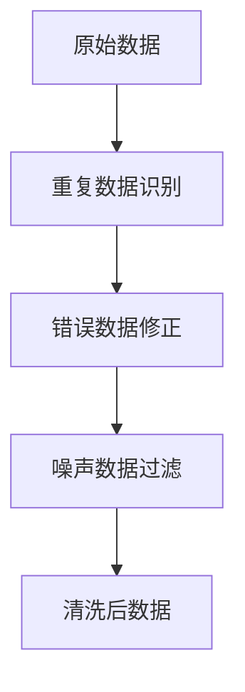

**4.2.3 数据清洗算法的应用**

数据清洗算法在多个领域有广泛应用，如金融、医疗、电商等。以下是一个Mermaid流程图，展示了数据清洗算法的应用场景：

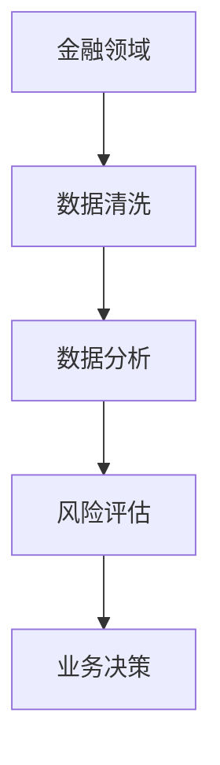

### 第5章 数据采集系统架构

#### 5.1 数据采集系统的设计原则

数据采集系统的设计需要遵循以下原则：

- **高可用性**：确保系统稳定运行，减少故障。
- **高性能**：提高数据采集和处理速度。
- **可扩展性**：支持系统规模和功能的扩展。
- **安全性**：保障数据安全，防止数据泄露。

以下是一个Mermaid流程图，展示了数据采集系统的设计原则：

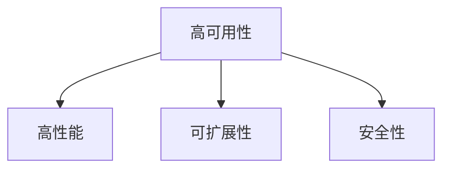

#### 5.2 数据采集系统的关键技术

数据采集系统的关键技术包括：

- **数据抽取技术**：从各种数据源中提取数据。
- **数据传输技术**：如HTTP、FTP、MQ等。
- **数据存储技术**：如关系数据库、NoSQL数据库等。
- **数据处理技术**：如批处理、流处理等。

以下是一个Mermaid流程图，展示了数据采集系统的关键技术：

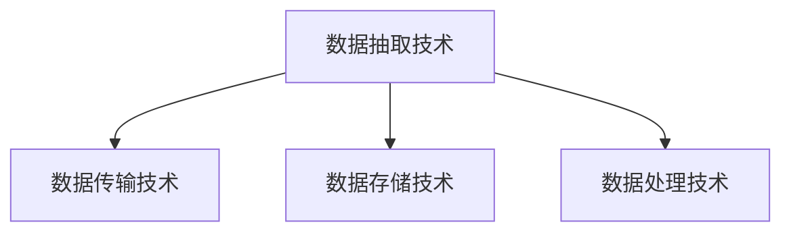

#### 5.3 数据采集系统的优化方法

数据采集系统的优化方法包括：

- **缓存技术**：减少重复数据采集，提高响应速度。
- **并行处理**：利用多线程、分布式计算提高处理能力。
- **数据压缩**：降低数据传输和存储的成本。
- **容错机制**：确保系统在故障时仍能正常运行。

以下是一个Mermaid流程图，展示了数据采集系统的优化方法：

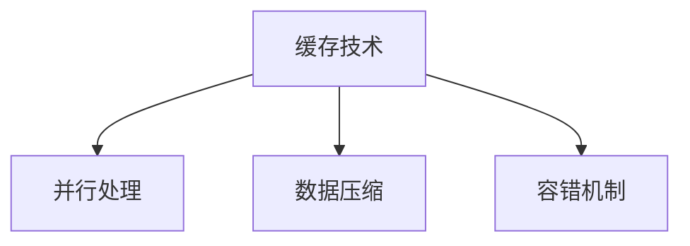

### 第6章 数据采集与 AI 技术的结合

#### 6.1 数据采集在 AI 中的重要性

数据采集是AI系统的基石，高质量的数据是AI模型训练和优化的重要素材。数据采集在AI中的重要性主要体现在以下几个方面：

- **训练数据的质量**：高质量的数据可以提升AI模型的性能和泛化能力。
- **模型优化**：通过数据采集，可以获取不同场景下的数据，这些数据可以帮助研究人员对模型进行优化。
- **辅助决策**：在商业智能、供应链管理、市场营销等领域，数据采集技术可以帮助企业获取关键数据，支持企业决策。

以下是一个Mermaid流程图，展示了数据采集在AI系统中的重要性：

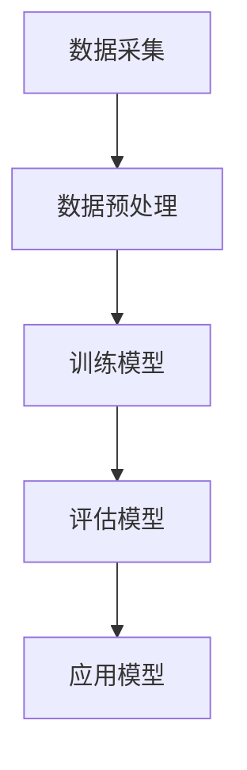

#### 6.2 AI 技术在数据采集中的应用

AI技术在数据采集中的应用主要包括以下几个方面：

- **数据抽取**：利用机器学习算法自动识别和抽取有用数据。
- **数据清洗**：利用自然语言处理、图像识别等技术自动清洗数据。
- **异常检测**：利用监督学习或无监督学习算法检测数据采集过程中的异常。

以下是一个Mermaid流程图，展示了AI技术在数据采集中的应用：

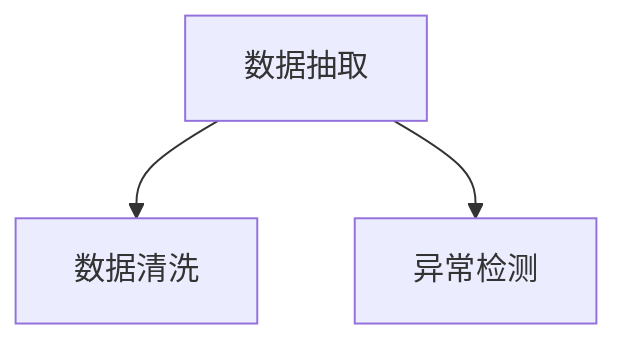

#### 6.3 数据采集与 AI 技术的结合方法

数据采集与AI技术的结合方法主要包括以下几种：

- **端到端数据采集与处理**：将数据采集和处理过程整合到AI模型中，实现自动化。
- **数据流式处理**：实时采集和处理数据，适应动态环境。
- **混合方法**：结合传统数据采集技术和AI技术，提高数据采集的效率和准确性。

以下是一个Mermaid流程图，展示了数据采集与AI技术的结合方法：

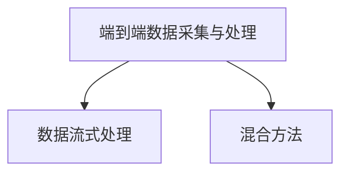

### 第7章 数据采集在 AI 2.0 中的应用

#### 7.1 数据采集在图像识别中的应用

图像识别是AI技术的重要应用领域，数据采集在图像识别中的应用主要包括数据的收集、标注和清洗等。

**7.1.1 图像识别的基本原理**

图像识别是指利用计算机对图像进行分析和处理，以识别和分类图像内容。图像识别的基本原理包括：

1. **特征提取**：从图像中提取具有区分性的特征，如颜色、纹理、形状等。
2. **分类算法**：使用分类算法（如支持向量机、决策树、神经网络等）对图像进行分类。

以下是一个Mermaid流程图，展示了图像识别的基本原理：

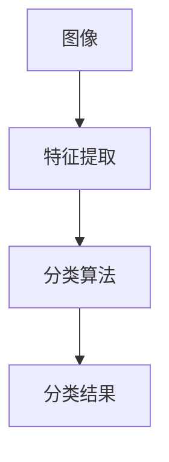

**7.1.2 数据采集在图像识别中的应用案例**

在图像识别中，数据采集是关键的一环。以下是一个Mermaid流程图，展示了数据采集在图像识别中的应用案例：

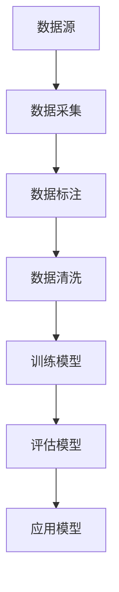

**应用案例**：

- **人脸识别**：使用爬虫技术从社交媒体上收集人脸图像，并进行数据标注和清洗，训练人脸识别模型。
- **物体识别**：使用摄像头采集现实场景中的图像，训练物体识别模型，实现智能安防、自动驾驶等应用。

#### 7.2 数据采集在自然语言处理中的应用

自然语言处理（NLP）是AI技术的重要分支，数据采集在NLP中的应用主要包括文本数据的收集、预处理和标注等。

**7.2.1 自然语言处理的基本原理**

自然语言处理是指利用计算机对自然语言进行理解和生成。自然语言处理的基本原理包括：

1. **分词**：将文本分解为单词或短语。
2. **词性标注**：标注文本中每个单词的词性，如名词、动词、形容词等。
3. **句法分析**：分析文本的句法结构，理解句子的语法关系。

以下是一个Mermaid流程图，展示了自然语言处理的基本原理：

```mermaid
graph TD
A[文本] --> B[分词]
B --> C[词性标注]
C --> D[句法分析]
```

**7.2.2 数据采集在自然语言处理中的应用案例**

在自然语言处理中，数据采集是关键的一环。以下是一个Mermaid流程图，展示了数据采集在自然语言处理中的应用案例：

```mermaid
graph TD
A[数据源] --> B[数据采集]
B --> C[数据预处理]
C --> D[数据标注]
D --> E[训练模型]
E --> F[评估模型]
F --> G[应用模型]
```

**应用案例**：

- **文本分类**：收集大量的文本数据，进行数据标注和清洗，训练文本分类模型，实现新闻分类、垃圾邮件过滤等应用。
- **情感分析**：收集社交媒体上的用户评论，进行情感标注和清洗，训练情感分析模型，实现情感趋势分析、用户满意度评估等应用。

#### 7.3 数据采集在智能推荐系统中的应用

智能推荐系统是AI技术的另一个重要应用领域，数据采集在智能推荐系统中主要包括用户行为数据的收集、处理和建模等。

**7.3.1 智能推荐系统的基本原理**

智能推荐系统是指利用算法和技术为用户提供个性化的推荐。智能推荐系统的基本原理包括：

1. **用户建模**：建立用户的兴趣模型，包括用户的历史行为、偏好、兴趣等。
2. **内容建模**：建立内容模型，包括物品的特征、属性、标签等。
3. **推荐算法**：根据用户模型和内容模型，为用户推荐感兴趣的物品。

以下是一个Mermaid流程图，展示了智能推荐系统的基本原理：

```mermaid
graph TD
A[用户模型] --> B[内容模型]
B --> C[推荐算法]
C --> D[推荐结果]
```

**7.3.2 数据采集在智能推荐系统中的应用案例**

在智能推荐系统中，数据采集是关键的一环。以下是一个Mermaid流程图，展示了数据采集在智能推荐系统中的应用案例：

```mermaid
graph TD
A[用户行为数据采集] --> B[内容数据采集]
B --> C[数据预处理]
C --> D[用户建模]
D --> E[内容建模]
E --> F[推荐算法]
F --> G[推荐结果]
```

**应用案例**：

- **电商推荐**：收集用户浏览、购买、评价等行为数据，结合商品特征，训练推荐模型，为用户提供个性化商品推荐。
- **视频推荐**：收集用户观看、点赞、评论等行为数据，结合视频特征，训练推荐模型，为用户提供个性化视频推荐。

### 第8章 数据采集实践与案例分析

#### 8.1 数据采集实践

数据采集实践包括数据源选择、数据采集工具选择、数据采集流程设计等。以下是一个Mermaid流程图，展示了数据采集实践的基本步骤：

```mermaid
graph TD
A[需求分析] --> B[数据源定位]
B --> C[工具选择]
C --> D[流程设计]
D --> E[数据采集]
E --> F[数据清洗]
F --> G[数据存储]
G --> H[数据分析]
```

#### 8.2 数据采集在电商领域的应用案例

电商领域的数据采集主要包括用户行为数据、商品数据等。以下是一个Mermaid流程图，展示了数据采集在电商领域的应用案例：

```mermaid
graph TD
A[用户行为数据采集] --> B[商品数据采集]
B --> C[数据预处理]
C --> D[用户画像构建]
D --> E[推荐系统训练]
E --> F[推荐系统评估]
F --> G[推荐系统应用]
```

**案例解析**：

1. **需求分析**：确定需要采集的用户行为数据和商品数据，如浏览记录、购买记录、商品评价等。
2. **数据源定位**：根据需求分析，确定数据源的类型和位置，如电商平台的数据库、日志文件等。
3. **工具选择**：选择合适的数据采集工具，如SQL查询、爬虫技术、ETL工具等。
4. **流程设计**：设计数据采集流程，包括数据抽取、清洗、存储等步骤。
5. **数据采集**：根据流程设计，进行数据采集。
6. **数据清洗**：去除重复数据、错误数据和噪声数据，确保数据质量。
7. **数据存储**：将清洗后的数据存储到数据库或数据仓库中，便于后续分析和处理。
8. **数据分析**：使用数据分析工具（如Hadoop、Spark等）进行数据分析，构建用户画像，为推荐系统提供支持。

#### 8.3 数据采集在金融领域的应用案例

金融领域的数据采集主要包括交易数据、市场数据等。以下是一个Mermaid流程图，展示了数据采集在金融领域的应用案例：

```mermaid
graph TD
A[交易数据采集] --> B[市场数据采集]
B --> C[数据预处理]
C --> D[风险管理模型训练]
D --> E[风险管理模型评估]
E --> F[风险管理模型应用]
```

**案例解析**：

1. **需求分析**：确定需要采集的交易数据和市场数据，如交易时间、交易金额、市场波动等。
2. **数据源定位**：根据需求分析，确定数据源的类型和位置，如交易系统的数据库、金融市场的数据接口等。
3. **工具选择**：选择合适的数据采集工具，如数据库连接工具、API接口调用等。
4. **流程设计**：设计数据采集流程，包括数据抽取、清洗、存储等步骤。
5. **数据采集**：根据流程设计，进行数据采集。
6. **数据清洗**：去除重复数据、错误数据和噪声数据，确保数据质量。
7. **数据预处理**：对交易数据和市场数据进行预处理，如数据规范化、缺失值填补等。
8. **风险管理模型训练**：使用预处理后的数据进行风险管理模型的训练。
9. **风险管理模型评估**：评估风险管理模型的性能，如准确率、召回率等。
10. **风险管理模型应用**：将训练好的风险管理模型应用于实际的金融风控场景，如信用评估、风险预警等。

#### 8.4 数据采集在医疗领域的应用案例

医疗领域的数据采集主要包括患者数据、医疗设备数据等。以下是一个Mermaid流程图，展示了数据采集在医疗领域的应用案例：

```mermaid
graph TD
A[患者数据采集] --> B[医疗设备数据采集]
B --> C[数据预处理]
C --> D[医疗诊断模型训练]
D --> E[医疗诊断模型评估]
E --> F[医疗诊断模型应用]
```

**案例解析**：

1. **需求分析**：确定需要采集的患者数据和医疗设备数据，如病历信息、医疗设备监测数据等。
2. **数据源定位**：根据需求分析，确定数据源的类型和位置，如医院信息系统、医疗设备等。
3. **工具选择**：选择合适的数据采集工具，如数据库连接工具、数据采集模块等。
4. **流程设计**：设计数据采集流程，包括数据抽取、清洗、存储等步骤。
5. **数据采集**：根据流程设计，进行数据采集。
6. **数据清洗**：去除重复数据、错误数据和噪声数据，确保数据质量。
7. **数据预处理**：对采集到的数据进行预处理，如数据规范化、缺失值填补等。
8. **医疗诊断模型训练**：使用预处理后的数据训练医疗诊断模型。
9. **医疗诊断模型评估**：评估医疗诊断模型的性能，如准确率、召回率等。
10. **医疗诊断模型应用**：将训练好的医疗诊断模型应用于实际的医疗诊断场景，如疾病预测、疾病诊断等。

### 附录

#### 附录 A：数据采集工具与资源

**A.1 主流数据采集工具介绍**

- **Elasticsearch**：一款分布式、RESTful 搜索引擎，适用于大规模数据存储和检索。
- **Apache Kafka**：一款分布式流处理平台，适用于实时数据采集和处理。
- **Apache NiFi**：一款开源的数据集成平台，适用于数据采集、清洗和传输。

**A.2 数据采集工具的使用方法**

- **Elasticsearch**：通过 REST API 进行数据采集和查询。
- **Apache Kafka**：通过 Producer 和 Consumer 进行数据生产和消费。
- **Apache NiFi**：通过数据流图进行数据采集和清洗。

**A.3 数据采集资源的获取途径**

- **开源社区**：如 GitHub、Apache 软件基金会等，获取数据采集工具的源代码和文档。
- **商业供应商**：如 AWS、Azure、Google Cloud 等，提供专业的数据采集和存储服务。

#### 附录 B：数据采集相关数学公式与算法

**B.1 数据抽取算法的数学模型**

- **支持度（Support）**：某个项在所有事务中的出现次数。
  \[ 支持度(A) = \frac{count(A)}{total\ transactions} \]

- **置信度（Confidence）**：在给定项A出现的条件下，项B也出现的概率。
  \[ 置信度(A \rightarrow B) = \frac{count(A \cap B)}{count(A)} \]

**B.2 数据清洗算法的数学模型**

- **异常检测**：基于统计学方法，如 Z-Score 和 IQR（四分位数间距）。
  \[ Z-Score = \frac{X - \mu}{\sigma} \]
  其中，\( X \) 是观测值，\( \mu \) 是均值，\( \sigma \) 是标准差。

- **缺失值填补**：基于统计模型，如线性回归和插值法。
  \[ Y = a + bX \]
  或
  \[ Y = f(X) \]
  其中，\( a \)、\( b \) 是模型参数，\( X \) 是自变量，\( Y \) 是因变量。

### 作者

作者：AI天才研究院/AI Genius Institute & 禅与计算机程序设计艺术 /Zen And The Art of Computer Programming

