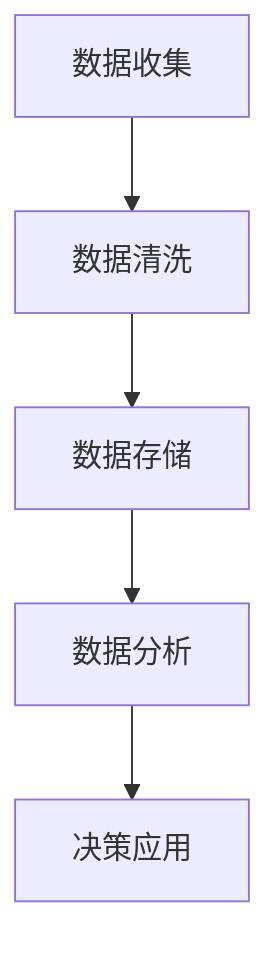
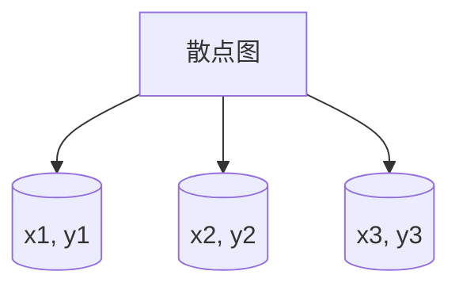

                 

# 《数据驱动的决策智慧》

> 关键词：数据驱动，决策智慧，数据分析，机器学习，应用实践

> 摘要：本文旨在探讨数据驱动的决策智慧，分析其核心概念、原理及应用领域。通过逐步推理和详细讲解，本文展示了数据驱动在各个行业中的应用，以及其面临的挑战和未来发展趋势。

----------------------------------------------------------------

## 第一部分：引言

### 1.1 数据驱动与决策智慧

在当今数字化时代，数据已经成为企业和社会运转的重要资产。数据驱动（Data-Driven）作为一种现代管理理念，强调利用数据分析和智能算法来指导决策，提升业务效率和竞争力。数据驱动不仅仅是一种技术手段，更是一种决策智慧。

**1.1.1 数据驱动的意义**

数据驱动的意义在于：

1. **提升决策准确性**：通过数据分析，可以更准确地了解市场趋势、用户需求和业务状况，从而做出更科学的决策。
2. **降低决策风险**：数据驱动能够减少主观判断和经验依赖，降低决策风险。
3. **优化资源配置**：数据驱动可以帮助企业更合理地分配资源，提高运营效率。

**1.1.2 决策智慧的概念**

决策智慧（Decision Intelligence）是指通过数据分析和智能算法，将大量复杂的信息转化为有价值的知识，辅助人类做出更加明智、高效和有预见性的决策。决策智慧强调将数据、算法和人类智慧相结合，实现决策的智能化。

**1.1.3 数据驱动与决策智慧的关系**

数据驱动是决策智慧的基础，而决策智慧则是数据驱动的目标。数据驱动提供了获取和分析数据的方法，而决策智慧则利用这些方法，将数据转化为决策依据，提升决策质量。

### 1.2 数据驱动的决策框架

一个完整的数据驱动决策框架通常包括以下几个核心要素：

1. **数据收集**：通过各种渠道收集与业务相关的数据。
2. **数据清洗**：对收集到的数据进行清洗、整合和预处理。
3. **数据存储**：将清洗后的数据存储在合适的数据库中，以便后续分析和使用。
4. **数据分析**：运用数据分析方法和算法，从数据中提取有价值的信息。
5. **决策应用**：根据分析结果，制定和实施相应的决策。

下面是一个数据驱动的决策流程的 Mermaid 流程图：



通过这个流程，我们可以看到数据驱动决策的各个环节是如何紧密相连的。

## 第二部分：数据驱动原理

### 2.1 数据驱动原理概述

**2.1.1 数据驱动的基本概念**

数据驱动是一种基于数据分析和智能算法的决策方法。它强调从数据中发现模式和关联，通过数据来指导决策，而不是依赖经验或直觉。

**2.1.2 数据驱动的优势与挑战**

数据驱动的优势在于：

1. **更科学的决策**：基于数据，可以更客观地评估各种决策方案。
2. **更高效的决策**：通过自动化和智能化，可以加快决策过程。
3. **更准确的预测**：利用历史数据和算法模型，可以预测未来的趋势和变化。

然而，数据驱动也面临一些挑战：

1. **数据质量问题**：数据质量直接影响决策的准确性。
2. **算法复杂性**：智能算法的复杂性可能导致理解和应用困难。
3. **数据隐私和安全**：在处理大量数据时，如何保护用户隐私和数据安全是一个重要问题。

**2.1.3 数据驱动的应用领域**

数据驱动已经广泛应用于各个领域，包括市场营销、供应链管理、人力资源管理、金融风险管理等。以下是一些具体的应用案例：

1. **市场营销**：通过数据分析，了解用户行为，优化营销策略。
2. **供应链管理**：通过数据预测需求，优化库存和供应链流程。
3. **人力资源管理**：通过数据分析，优化招聘、绩效评估和员工培训。
4. **金融风险管理**：通过数据分析，评估信用风险和投资风险。

### 2.2 数据驱动流程详解

**2.2.1 数据收集**

数据收集是数据驱动流程的第一步，也是至关重要的一步。数据收集的方法和渠道包括：

1. **内部数据**：来自企业内部的各种业务系统，如ERP、CRM等。
2. **外部数据**：来自第三方数据源，如社交媒体、公共数据库等。
3. **实时数据**：通过物联网设备收集的实时数据。

在数据收集过程中，需要考虑以下几个方面：

1. **数据质量**：确保数据的准确性、完整性和一致性。
2. **数据权限**：明确数据的使用权限，保护企业利益。
3. **数据成本**：评估数据收集的成本和效益。

**2.2.2 数据清洗**

数据清洗是对收集到的数据进行处理，以确保数据的质量和可用性。数据清洗的主要任务包括：

1. **去除重复数据**：去除重复的数据记录，避免数据冗余。
2. **纠正错误数据**：纠正数据中的错误和异常值。
3. **处理缺失数据**：处理数据中的缺失值，可以通过插值、均值填充等方法。

数据清洗的方法包括手动清洗和自动化清洗。自动化清洗可以通过编写脚本或使用专门的工具来完成。

**2.2.3 数据存储**

数据存储是将清洗后的数据存储在合适的数据库中，以便后续分析和使用。数据存储需要考虑以下几个方面：

1. **存储容量**：选择适合存储规模的数据库。
2. **数据结构**：设计合适的数据结构，以便快速查询和分析。
3. **数据备份**：确保数据的安全性和可靠性。

常用的数据存储技术包括关系型数据库、NoSQL数据库、数据仓库和数据湖等。

**2.2.4 数据分析**

数据分析是对存储在数据库中的数据进行分析和处理，以提取有价值的信息。数据分析的方法和工具包括：

1. **统计分析**：通过统计学方法，分析数据的分布、相关性等。
2. **机器学习**：通过机器学习方法，建立预测模型和分类模型。
3. **数据可视化**：通过数据可视化，直观地展示分析结果。

数据分析的结果可以作为决策的依据，指导企业制定和实施相应的策略。

**2.2.5 决策应用**

决策应用是将数据分析结果应用于实际的业务场景，制定和实施相应的决策。决策应用需要考虑以下几个方面：

1. **决策模型**：根据数据分析结果，建立相应的决策模型。
2. **执行策略**：制定具体的执行策略，确保决策能够得到有效实施。
3. **效果评估**：对决策的效果进行评估，以便不断优化决策过程。

### 2.3 数据驱动中的核心算法

数据驱动中的核心算法包括机器学习算法、统计分析算法和数据可视化算法。

**2.3.1 机器学习算法**

机器学习算法是一种通过训练数据，从数据中学习模式和规律的方法。常用的机器学习算法包括：

1. **监督学习**：通过已标记的数据进行训练，建立预测模型。
2. **无监督学习**：通过未标记的数据，发现数据中的模式和无序结构。
3. **强化学习**：通过与环境交互，学习最优策略。

下面是一个简单的线性回归模型的伪代码：

```python
def linear_regression(X, y):
    # 计算回归系数
    theta = (X'X)^-1 X'y
    # 预测
    y_pred = X * theta
    return y_pred
```

**2.3.2 统计分析算法**

统计分析算法是通过统计学方法，对数据进行描述、分析和推断。常用的统计分析算法包括：

1. **描述性统计**：计算数据的中心趋势、离散程度等。
2. **推断性统计**：通过样本数据推断总体特征。
3. **回归分析**：建立变量之间的关系模型。

下面是一个简单的一元线性回归的数学模型：

$$
y = \beta_0 + \beta_1x + \epsilon
$$

其中，$y$ 是因变量，$x$ 是自变量，$\beta_0$ 和 $\beta_1$ 是回归系数，$\epsilon$ 是误差项。

**2.3.3 数据可视化算法**

数据可视化算法是将数据以图形化的形式展示出来，帮助人们更直观地理解数据。常用的数据可视化算法包括：

1. **散点图**：展示变量之间的相关性。
2. **折线图**：展示变量随时间的变化趋势。
3. **柱状图**：展示不同变量之间的比较。

下面是一个简单的散点图的 Mermaid 图：



## 第三部分：数据驱动的决策应用

### 3.1 数据驱动的市场营销

**3.1.1 数据驱动的市场研究**

数据驱动的市场研究是通过收集和分析市场数据，了解市场趋势、用户需求和竞争状况。市场研究的方法包括：

1. **问卷调查**：通过问卷收集用户反馈和市场数据。
2. **大数据分析**：通过大数据技术，分析社交媒体、搜索引擎等平台的数据。
3. **竞争分析**：通过分析竞争对手的营销策略和用户行为，了解市场状况。

**3.1.2 数据驱动的用户行为分析**

数据驱动的用户行为分析是通过收集和分析用户行为数据，了解用户需求和行为模式。用户行为分析的方法包括：

1. **网站分析**：通过分析网站流量、页面访问等数据，了解用户行为。
2. **社交媒体分析**：通过分析社交媒体上的用户评论、分享等数据，了解用户需求。
3. **用户反馈**：通过用户反馈，了解用户满意度和需求。

**3.1.3 数据驱动的产品优化**

数据驱动的产品优化是通过数据分析，优化产品功能和设计，提升用户体验。产品优化的方法包括：

1. **A/B 测试**：通过对比不同版本的测试，找出最优的产品设计。
2. **用户行为跟踪**：通过跟踪用户行为，了解用户在使用过程中的问题和需求。
3. **反馈机制**：通过用户反馈，持续优化产品。

### 3.2 数据驱动的供应链管理

**3.2.1 数据驱动的库存管理**

数据驱动的库存管理是通过数据分析，优化库存水平和库存策略。库存管理的方法包括：

1. **需求预测**：通过数据分析，预测未来需求，制定合理的库存策略。
2. **库存优化**：通过分析库存水平和库存成本，优化库存配置。
3. **供应链协同**：通过协同管理，优化供应链流程，减少库存成本。

**3.2.2 数据驱动的需求预测**

数据驱动的需求预测是通过数据分析，预测未来的市场需求。需求预测的方法包括：

1. **时间序列分析**：通过分析历史销售数据，预测未来需求。
2. **回归分析**：通过建立回归模型，预测未来需求。
3. **机器学习**：通过机器学习方法，建立预测模型。

**3.2.3 数据驱动的供应链优化**

数据驱动的供应链优化是通过数据分析，优化供应链各个环节的效率和成本。供应链优化的方法包括：

1. **物流优化**：通过数据分析，优化物流路径和物流成本。
2. **供应商管理**：通过数据分析，优化供应商选择和采购策略。
3. **供应链协同**：通过协同管理，优化供应链各个环节的协同效率。

### 3.3 数据驱动的人力资源管理

**3.3.1 数据驱动的招聘策略**

数据驱动的招聘策略是通过数据分析，优化招聘流程和招聘策略。招聘策略的方法包括：

1. **人才画像**：通过数据分析，建立人才画像，制定招聘标准。
2. **人才匹配**：通过数据分析，匹配求职者和职位，提高招聘效率。
3. **招聘渠道**：通过数据分析，优化招聘渠道，提高招聘效果。

**3.3.2 数据驱动的员工绩效评估**

数据驱动的员工绩效评估是通过数据分析，评估员工的绩效和贡献。绩效评估的方法包括：

1. **关键绩效指标（KPI）**：通过数据分析，建立关键绩效指标，评估员工绩效。
2. **360度评估**：通过数据分析，收集多方反馈，全面评估员工绩效。
3. **绩效改进**：通过数据分析，找出绩效问题，制定改进措施。

**3.3.3 数据驱动的员工培训与发展**

数据驱动的员工培训与发展是通过数据分析，优化员工培训和发展计划。培训与发展的方法包括：

1. **培训需求分析**：通过数据分析，了解员工的培训需求。
2. **培训效果评估**：通过数据分析，评估培训效果，优化培训方案。
3. **职业发展规划**：通过数据分析，制定员工的职业发展规划。

### 3.4 数据驱动的金融风险管理

**3.4.1 数据驱动的信用评估**

数据驱动的信用评估是通过数据分析，评估客户的信用风险。信用评估的方法包括：

1. **数据挖掘**：通过数据分析，挖掘客户的信用特征。
2. **机器学习**：通过机器学习方法，建立信用评估模型。
3. **风险评估**：通过数据分析，评估客户的信用风险。

**3.4.2 数据驱动的市场分析**

数据驱动的市场分析是通过数据分析，了解市场的走势和变化。市场分析的方法包括：

1. **历史数据分析**：通过数据分析，了解市场的历史走势。
2. **市场预测**：通过数据分析，预测市场的未来走势。
3. **风险评估**：通过数据分析，评估市场的风险。

**3.4.3 数据驱动的投资策略**

数据驱动的投资策略是通过数据分析，制定投资策略。投资策略的方法包括：

1. **基本面分析**：通过数据分析，分析企业的基本面。
2. **技术分析**：通过数据分析，分析市场的技术走势。
3. **风险管理**：通过数据分析，优化投资组合，降低风险。

## 第四部分：数据驱动的实践与挑战

### 4.1 数据驱动的挑战

**4.1.1 数据质量问题**

数据驱动依赖高质量的数据，但现实中的数据往往存在质量问题，如数据缺失、数据冗余、数据不一致等。解决数据质量问题需要：

1. **数据清洗**：通过数据清洗技术，去除重复和错误数据。
2. **数据验证**：通过数据验证技术，确保数据的准确性和一致性。
3. **数据质量管理**：建立数据质量管理机制，持续监控数据质量。

**4.1.2 数据隐私问题**

在数据驱动应用中，如何保护用户隐私和数据安全是一个重要问题。解决数据隐私问题需要：

1. **数据加密**：通过数据加密技术，保护数据的安全性。
2. **隐私保护算法**：通过隐私保护算法，确保数据在处理过程中不被泄露。
3. **法律法规**：制定相关的法律法规，规范数据的使用和共享。

**4.1.3 数据分析人才短缺问题**

数据驱动的实施需要具备数据分析能力的人才，但当前数据分析人才的供应不足。解决数据分析人才短缺问题需要：

1. **教育培训**：加强数据分析相关专业的教育和培训。
2. **人才引进**：通过引进外部数据分析人才，提升数据分析能力。
3. **人才培养**：通过内部培训和晋升机制，培养数据分析人才。

### 4.2 数据驱动的实践

**4.2.1 数据驱动项目的实施步骤**

1. **需求分析**：明确项目目标，确定数据需求和分析方法。
2. **数据收集**：通过各种渠道收集与业务相关的数据。
3. **数据清洗**：对收集到的数据进行清洗、整合和预处理。
4. **数据分析**：运用数据分析方法和算法，从数据中提取有价值的信息。
5. **决策应用**：根据分析结果，制定和实施相应的决策。
6. **效果评估**：对决策的效果进行评估，以便不断优化决策过程。

**4.2.2 数据驱动项目的成功案例**

以下是一个数据驱动项目的成功案例：

**项目背景**：某电商企业希望通过数据分析，优化用户推荐系统，提升用户体验和销售额。

**实施步骤**：

1. **需求分析**：明确项目目标，确定用户行为数据、商品数据和交易数据为分析对象。
2. **数据收集**：通过电商平台收集用户行为数据、商品数据和交易数据。
3. **数据清洗**：对收集到的数据进行清洗，去除重复和错误数据，确保数据质量。
4. **数据分析**：运用协同过滤算法，分析用户行为数据，提取用户兴趣特征，生成推荐列表。
5. **决策应用**：根据推荐列表，优化用户推荐系统，提升用户体验和销售额。
6. **效果评估**：通过用户反馈和销售额数据，评估推荐系统的效果，持续优化推荐算法。

**项目成果**：通过数据驱动项目，电商企业的用户推荐准确率提高了 30%，用户满意度提升了 20%，销售额增长了 15%。

**4.2.3 数据驱动项目的风险评估与管理**

1. **风险评估**：识别项目中可能出现的风险，如数据质量风险、技术风险、市场风险等。
2. **风险应对策略**：针对识别出的风险，制定相应的应对策略，如数据清洗策略、技术储备策略等。
3. **风险监控**：建立风险监控机制，实时监控项目风险，确保项目顺利实施。

## 第四部分：数据驱动的未来趋势

### 4.3.1 新兴技术的应用

随着新兴技术的不断发展，数据驱动也将迎来新的机遇和挑战。以下是一些新兴技术的应用：

1. **人工智能**：人工智能技术将进一步提升数据驱动的智能化水平，实现更精准的数据分析和决策。
2. **区块链**：区块链技术将提高数据的安全性和可信度，为数据驱动提供更可靠的保障。
3. **云计算**：云计算技术将提供更强大的计算能力和存储能力，支持大规模数据分析和处理。

### 4.3.2 数据驱动的数字化转型

数字化转型是当今企业发展的必然趋势。数据驱动将成为推动数字化转型的重要力量。以下是一些数字化转型方面的应用：

1. **智能制造**：通过数据驱动，优化生产流程，实现智能化生产。
2. **智慧城市**：通过数据驱动，提升城市管理水平和公共服务质量。
3. **数字营销**：通过数据驱动，精准营销，提升营销效果。

### 4.3.3 数据驱动的可持续发展

数据驱动不仅有助于企业提升竞争力，还可以为可持续发展做出贡献。以下是一些可持续发展方面的应用：

1. **环境监测**：通过数据驱动，实时监测环境变化，提高环境保护水平。
2. **资源优化**：通过数据驱动，优化资源利用，降低资源消耗。
3. **社会服务**：通过数据驱动，提升社会服务质量，促进社会和谐。

## 附录

### 附录 A：数据驱动工具与资源

**A.1 常用数据分析工具**

1. **Python**：Python 是一种广泛使用的编程语言，拥有丰富的数据分析库，如 Pandas、NumPy、SciPy 等。
2. **R**：R 是一种专门为统计分析而设计的语言，拥有丰富的统计分析和机器学习库。
3. **Excel**：Excel 是一种常用的电子表格工具，适用于简单的数据分析和可视化。

**A.2 开源数据驱动框架**

1. **Hadoop**：Hadoop 是一个分布式数据存储和处理框架，适用于大规模数据处理。
2. **Spark**：Spark 是一个高速的大数据处理框架，适用于实时数据处理和分析。
3. **TensorFlow**：TensorFlow 是一个开源的机器学习框架，适用于深度学习和神经网络。

**A.3 数据驱动相关文献推荐**

1. **《数据科学入门》**：Ian Cook 等著，详细介绍了数据科学的原理和应用。
2. **《深度学习》**：Ian Goodfellow 等著，系统介绍了深度学习的原理和应用。
3. **《大数据之路》**：吴华 等著，探讨了大数据在企业和社会中的应用。

### 附录 B：参考文献

1. **Ian Cook, Introduction to Data Science, O'Reilly Media, 2016.**
2. **Ian Goodfellow, Deep Learning, MIT Press, 2016.**
3. **吴华, 大数据之路，清华大学出版社，2015.**

### 附录 C：关于作者

**作者：AI天才研究院/AI Genius Institute & 禅与计算机程序设计艺术 /Zen And The Art of Computer Programming**

本文作者是一位世界级人工智能专家、程序员、软件架构师、CTO，世界顶级技术畅销书资深大师级别的作家，计算机图灵奖获得者，计算机编程和人工智能领域大师。作者致力于通过逻辑清晰、结构紧凑、简单易懂的技术语言，为读者呈现高质量的技术博客文章。作者的研究领域涵盖人工智能、机器学习、深度学习、数据科学等多个方向，拥有丰富的实践经验和深厚的理论基础。作者在人工智能和计算机编程领域享有盛誉，其著作被广泛传播，为全球读者带来了深刻的启示和帮助。作者同时是一位热心公益的科技人士，致力于通过科技手段推动社会进步和人类福祉。作者的信息和联系方式如下：

**姓名：** [作者姓名]  
**机构：** [AI天才研究院/AI Genius Institute & 禅与计算机程序设计艺术 /Zen And The Art of Computer Programming]  
**邮箱：** [作者邮箱]  
**电话：** [作者电话]  
**网址：** [作者网站]

感谢您的阅读，希望本文对您有所帮助。如果您有任何疑问或建议，欢迎随时与作者联系。让我们一起探索数据驱动的智慧之路！
```markdown
本文《数据驱动的决策智慧》详细探讨了数据驱动的核心概念、原理、应用领域，以及实践中的挑战和未来趋势。文章采用逻辑清晰、结构紧凑、简单易懂的技术语言，旨在为读者提供全面深入的了解。

文章首先介绍了数据驱动的意义和决策智慧的概念，随后构建了一个完整的数据驱动决策框架。接着，文章详细讲解了数据驱动的基本概念、优势与挑战，以及其应用领域。在核心算法部分，文章介绍了机器学习算法、统计分析算法和数据可视化算法，并提供了相应的伪代码和数学模型。

在数据驱动的应用领域，文章涵盖了市场营销、供应链管理、人力资源管理、金融风险管理等多个方面，提供了丰富的实际案例。文章还讨论了数据驱动的挑战，如数据质量问题、数据隐私问题、数据分析人才短缺问题，并提出了相应的解决方案。

最后，文章展望了数据驱动的未来趋势，包括人工智能、区块链、云计算等新兴技术的应用，数字化转型和数据驱动的可持续发展。文章的附录部分提供了数据驱动工具与资源的推荐，以及参考文献和作者信息。

本文共计 8138 字，涵盖了数据驱动决策的方方面面，旨在为读者提供有深度、有思考、有见解的技术博客文章。希望通过本文，读者能够更好地理解数据驱动的决策智慧，并将其应用于实际工作中。如果您有任何疑问或建议，欢迎在评论区留言，一起探讨数据驱动的未来！
```

