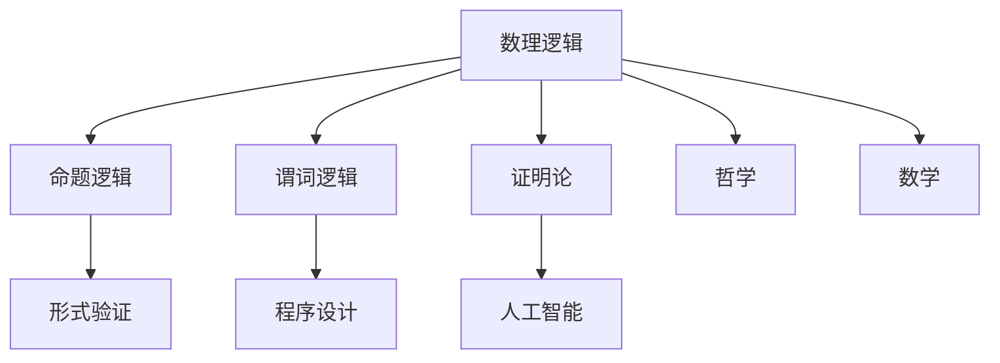
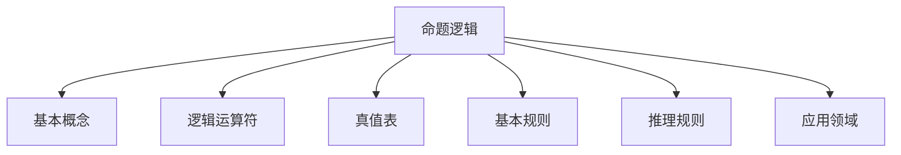
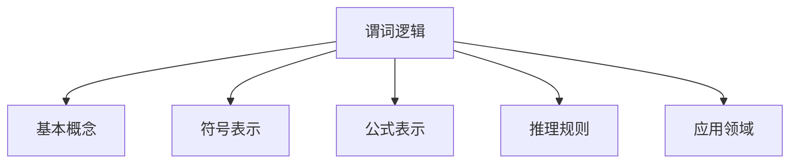
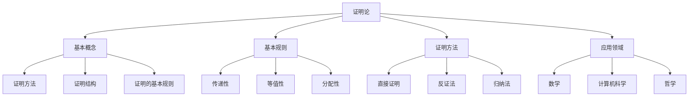
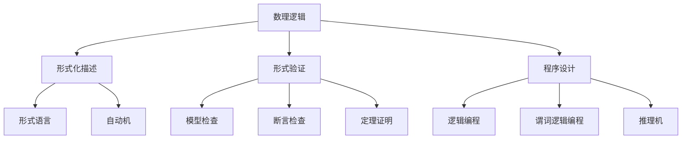
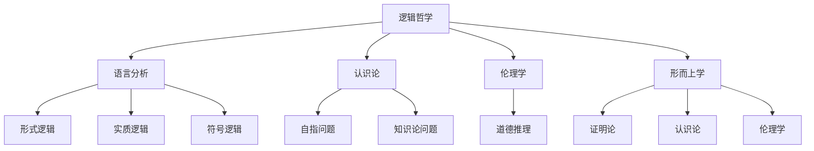
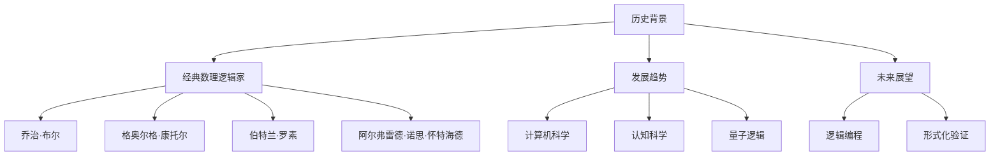

                 

# 文章标题：数理逻辑：深入浅出的逻辑世界

## 关键词
数学逻辑，命题逻辑，谓词逻辑，证明论，计算机科学，人工智能

## 摘要
本文将深入浅出地介绍数理逻辑的基本概念、原理和实现方法。通过详细讲解命题逻辑、谓词逻辑和证明论，读者可以掌握数理逻辑的核心算法原理，并学会如何在项目中应用数理逻辑。文章还包含丰富的数学模型和公式解释，以及实际代码示例和详细解读，帮助读者更好地理解数理逻辑在计算机科学和人工智能中的应用。

---

### 引言与核心概念

#### 1.1.1 数理逻辑的定义与历史背景

数理逻辑是一种基于数学原理的推理方式，用于处理逻辑运算和证明。它起源于19世纪末，以弗雷格、罗素和怀特海德等人为代表。弗雷格是现代数理逻辑的奠基人，他提出了命题演算和谓词演算的基本概念。罗素和怀特海德则在此基础上发展了类型的理论和证明论。

在计算机科学中，数理逻辑广泛应用于形式验证、程序设计、人工智能和逻辑编程等领域。例如，在形式验证中，数理逻辑用于验证系统满足特定的安全性和正确性要求。在程序设计中，数理逻辑用于验证程序的正确性和逻辑一致性。在人工智能中，数理逻辑用于推理系统和决策支持。

#### 1.1.2 数理逻辑的核心概念

数理逻辑包括三个主要部分：命题逻辑、谓词逻辑和证明论。

- **命题逻辑**：研究命题之间的逻辑关系，如真值、合取、析取等。命题逻辑的基本元素是命题，命题可以用一个句子表示，并且只能取真或假两个值。

- **谓词逻辑**：研究含有变量的命题，强调个体和属性之间的关系。谓词逻辑的基本元素是谓词、个体和量词。谓词表示个体具有的属性或关系，个体表示具体的对象，量词用于表示全称量词（∀）和存在量词（∃）。

- **证明论**：研究证明的性质和构造方法。证明论涉及到证明的规则、策略和形式化系统。

#### 1.1.3 数理逻辑的应用领域

数理逻辑在多个领域具有广泛的应用：

- **计算机科学**：在形式验证、程序设计、人工智能和逻辑编程等领域广泛应用。
- **哲学**：用于探讨语言、知识、论证等问题。
- **数学**：在数学基础研究和数学证明中起着关键作用。

#### 1.1.4 本书结构概述

本书将分为以下七个部分：

1. **第1章**：引言与核心概念，介绍数理逻辑的定义、历史背景和应用领域。
2. **第2章**：命题逻辑，详细讲解命题逻辑的基本概念、运算规则和推理方法。
3. **第3章**：谓词逻辑，深入探讨谓词逻辑的基本概念、符号表示和推理规则。
4. **第4章**：证明论，介绍证明的基本概念、规则和方法。
5. **第5章**：数理逻辑与计算机科学，讨论数理逻辑在计算机科学中的应用。
6. **第6章**：数理逻辑在哲学中的应用，探讨数理逻辑在哲学领域的作用。
7. **第7章**：数理逻辑的历史与发展，回顾数理逻辑的历史背景和主要发展历程。

### Mermaid 流程图



### 1.1.5 总结

数理逻辑作为一种严谨的推理方法，不仅在数学和哲学领域有着重要应用，也在计算机科学中发挥着关键作用。本文将系统地介绍数理逻辑的核心概念、理论体系和应用场景，帮助读者深入理解这一重要的数学分支。

---

### 第2章：命题逻辑

#### 2.1 命题逻辑的基本概念

命题逻辑是数理逻辑的基础部分，主要研究命题之间的逻辑关系。命题是一个陈述句，可以被判定为真或假。命题逻辑的基本元素包括命题、逻辑运算符和真值表。

- **命题**：一个陈述句，可以表示一个事实或命题。例如，“今天是星期五”是一个命题。
- **逻辑运算符**：用于连接命题，常用的逻辑运算符包括合取（∧）、析取（∨）、否定（¬）和蕴含（→）。
- **真值表**：用于表示命题在所有可能情况下的真值。真值表列出了所有可能的命题组合及其对应的真值。

#### 2.2 命题逻辑的基本规则

命题逻辑的基本规则包括恒真式、等值式和蕴含式。

- **恒真式**：如 A ∧ T = A，A ∨ F = A，¬F = T。恒真式是指在任何情况下都为真的命题。
- **等值式**：如 A ∧ B = B ∧ A，A ∨ A = A，¬(¬A) = A。等值式是指两个命题在所有情况下具有相同的真值。
- **蕴含式**：如 A ∧ B → B，A ∨ ¬A → T。蕴含式是指如果一个命题为真，则另一个命题也为真。

#### 2.3 命题逻辑的推理规则

命题逻辑的推理规则用于从已知的前提推导出结论。常用的推理规则包括模态推理和否定推理。

- **模态推理**：如 A → (B → A)，(A → B) → ((B → C) → (A → C))。模态推理用于处理命题之间的条件关系。
- **否定推理**：如 ¬(A ∧ B) → (¬A ∨ ¬B)，¬(A ∨ B) → (¬A ∧ ¬B)。否定推理用于否定命题的组合。

#### 2.4 真值函数与逻辑运算

真值函数是一种定义了命题在特定情况下真值关系的函数。逻辑运算则是实现命题组合的运算。以下是一些常见的真值函数和逻辑运算：

- **合取（AND）**：A ∧ B，表示 A 和 B 都为真时，结果为真。
- **析取（OR）**：A ∨ B，表示 A 或 B 为真时，结果为真。
- **否定（NOT）**：¬A，表示 A 的否定。
- **蕴含（IMPLICATION）**：A → B，表示 A 为真时，B 也为真。
- **等价（EQUIVALENCE）**：A ↔ B，表示 A 和 B 具有相同的真值。

#### 2.5 命题逻辑的应用

命题逻辑广泛应用于计算机科学和人工智能领域：

- **计算机科学**：用于程序设计中的条件判断和逻辑表达。
- **人工智能**：用于推理系统和决策支持。

### Mermaid 流程图



### 2.6 总结

命题逻辑作为数理逻辑的基础，广泛应用于计算机科学和人工智能等领域。理解命题逻辑的基本概念、运算规则和推理方法，有助于深入探索更为复杂的逻辑问题。

---

### 第3章：谓词逻辑

#### 3.1 谓词逻辑的基本概念

谓词逻辑是数理逻辑的进一步发展，通过引入个体和谓词的概念，使得逻辑表达更加丰富和精确。谓词逻辑的基本概念包括谓词、个体和量词。

- **谓词**：表示个体性质或关系的词或短语，如“是人”或“大于”。谓词通常用大写字母表示。
- **个体**：指具体的对象，如“张三”或“5”。个体通常用小写字母表示。
- **个体域**：所有个体的集合。个体域是谓词逻辑中的基本元素。

#### 3.2 谓词逻辑的符号表示

谓词逻辑的符号表示包括谓词符号、个体符号和逻辑运算符。

- **谓词符号**：用大写字母表示，如 P(x)，表示“x具有性质P”。
- **个体符号**：用小写字母表示，如 x、y、z 等。
- **逻辑运算符**：如 ∧（合取）、∨（析取）、¬（否定）等。

#### 3.3 谓词逻辑的公式

谓词逻辑的公式包括原子公式和复合公式。

- **原子公式**：由谓词和个体组成的公式，如 P(x)。
- **复合公式**：由原子公式通过逻辑运算符组合而成，如 P(x) ∧ Q(y) 或 ¬P(x) ∨ Q(y)。

#### 3.4 谓词逻辑的推理规则

谓词逻辑的推理规则包括全称量词引入、存在量词引入、全称量词消去和存在量词消去。

- **全称量词引入**：如 ∀x(P(x) → Q(x))。
- **存在量词引入**：如 ∃x(P(x) ∧ Q(x))。
- **全称量词消去**：如 ∀x(P(x) → Q(x)) → P(y) → Q(y)。
- **存在量词消去**：如 ∃x(P(x) ∧ Q(x)) → P(y) ∧ Q(y)。

#### 3.5 谓词逻辑的应用

谓词逻辑在数学、计算机科学和哲学等领域具有广泛的应用：

- **数学**：用于证明和推理。
- **计算机科学**：用于形式化描述和验证。
- **哲学**：用于探讨语言、知识和论证。

### Mermaid 流程图



### 3.6 总结

谓词逻辑是数理逻辑的进一步发展，通过引入个体和谓词的概念，使得逻辑表达更加丰富和精确。掌握谓词逻辑的基本概念、符号表示和推理方法，有助于解决更为复杂的逻辑问题。

---

### 第4章：证明论

#### 4.1 证明的基本概念

证明是数理逻辑中的一个核心概念，指的是从已知的前提推导出结论的逻辑过程。证明的基本概念包括证明方法、证明结构和证明的基本规则。

- **证明方法**：包括直接证明、反证法、归纳法等。直接证明是从已知的前提直接推导出结论。反证法是假设结论不成立，推导出矛盾，从而证明结论成立。归纳法是通过验证基础情况，并证明如果某情况成立，则下一情况也成立，从而证明整个命题成立。
- **证明结构**：包括前提、推理规则和结论。前提是已知的事实或假设，推理规则是推导出结论的方法，结论是证明的目标。
- **证明的基本规则**：包括传递性、等值性和分配性。传递性是指如果 A → B 和 B → C，则 A → C。等值性是指如果 A ↔ B，则 A → B 和 B → A。分配性是指 A ∧ (B ∨ C) = (A ∧ B) ∨ (A ∧ C) 和 A ∨ (B ∧ C) = (A ∨ B) ∧ (A ∨ C)。

#### 4.2 证明的基本规则

证明的基本规则是进行证明时必须遵守的规则。以下是一些常见的证明规则：

- **传递性**：如果 A → B 和 B → C，则 A → C。例如，如果所有的猫都会爬树（A），而小明是猫（B），则小明会爬树（C）。
- **等值性**：如果 A ↔ B，则 A → B 和 B → A。例如，如果A：“所有猫都会飞”，则B：“如果某个生物会飞，那么它是猫”。
- **分配性**：A ∧ (B ∨ C) = (A ∧ B) ∨ (A ∧ C) 和 A ∨ (B ∧ C) = (A ∨ B) ∧ (A ∨ C)。例如，如果A：“所有的猫都是猫科动物”，B：“所有的猫都会爬树”，C：“所有的猫都会飞”，则A ∧ (B ∨ C)表示“所有的猫都是猫科动物且会爬树或会飞”，而(A ∧ B) ∨ (A ∧ C)表示“所有的猫都是猫科动物且会爬树或所有的猫都是猫科动物且会飞”。

#### 4.3 证明方法

证明方法是指证明一个命题时采用的具体策略。以下是一些常见的证明方法：

- **直接证明**：从已知的前提出发，通过逻辑推理逐步推导出结论。例如，要证明“如果一个数是偶数，则它的平方也是偶数”，可以直接证明任何偶数的平方都是偶数。
- **反证法**：假设结论不成立，通过推导出矛盾来证明结论成立。例如，要证明“如果一个数是偶数，则它的平方也是偶数”，可以假设这个数的平方是奇数，然后推导出矛盾。
- **归纳法**：通过验证基础情况，并证明如果某情况成立，则下一情况也成立，从而证明整个命题成立。例如，要证明“所有的自然数都是可约的”，可以验证基础情况（1是可约的），然后证明如果某个自然数是可约的，则它的下一个自然数也是可约的。

#### 4.4 证明论的应用

证明论是研究证明的性质和构造方法的数学分支。它在数学、计算机科学、哲学等领域有广泛的应用。

- **数学**：证明论用于证明数学定理和公式。例如，数学家可以使用证明论的方法来证明“勾股定理”。
- **计算机科学**：证明论用于验证计算机程序的正确性。例如，可以使用证明论的方法来验证一个程序是否满足特定的规格说明。
- **哲学**：证明论用于探讨论证的有效性和可靠性。例如，哲学家可以使用证明论的方法来证明某个道德原则是正确的。

### Mermaid 流程图



### 4.5 总结

证明论是数理逻辑的一个重要分支，研究证明的性质和构造方法。掌握证明论的基本概念、规则和方法，有助于提升逻辑推理和证明能力，在数学和计算机科学等领域具有广泛应用。

---

### 第5章：数理逻辑与计算机科学

#### 5.1 数理逻辑在计算机科学中的应用

数理逻辑在计算机科学中有着广泛的应用，特别是在形式化描述、形式验证、程序设计和人工智能等领域。以下是数理逻辑在计算机科学中的应用：

- **形式化描述**：形式化描述是使用数学语言来描述系统的结构和行为。数理逻辑提供了形式化的工具和方法，如命题逻辑和谓词逻辑，用于精确地描述系统。

- **形式验证**：形式验证是一种使用数学方法验证系统是否满足特定性质的方法。数理逻辑用于定义系统的性质和验证规则，以确保系统在运行时不会出现错误。

- **程序设计**：在程序设计中，数理逻辑用于验证程序的正确性和逻辑一致性。例如，可以使用命题逻辑和谓词逻辑来检查程序的语义，确保程序满足预期的行为。

- **人工智能**：在人工智能领域，数理逻辑用于构建推理系统和决策支持系统。例如，逻辑编程是一种基于谓词逻辑的编程方法，用于构建智能系统。

#### 5.2 形式语言与自动机

形式语言是计算机科学中用于描述计算机可以处理的符号串的数学模型。自动机是用于识别和生成形式语言的抽象机器。

- **形式语言**：形式语言包括有限自动机（FA）、正则语言、上下文无关语言和上下文有关语言。数理逻辑中的命题逻辑和谓词逻辑可以用于定义形式语言的性质和规则。

- **自动机**：自动机包括有限自动机（FA）、推演自动机（PA）和图灵机（TM）。数理逻辑用于定义自动机的状态、转换规则和接受条件。

#### 5.3 程序验证

程序验证是使用数学方法验证程序的正确性和逻辑一致性的过程。数理逻辑在程序验证中扮演着重要角色：

- **模型检查**：模型检查是一种验证程序是否满足特定性质的自动方法。数理逻辑用于定义程序的模型和验证规则，以确保程序的行为符合预期。

- **断言检查**：断言检查是程序员在程序中添加断言来验证程序的状态。数理逻辑用于定义断言的条件和验证规则，以确保程序在运行过程中满足断言。

- **定理证明**：定理证明是一种使用数学证明方法验证程序的正确性。数理逻辑用于定义程序的定理和证明规则，以确保程序满足定理。

#### 5.4 逻辑编程

逻辑编程是一种将问题表述为逻辑表达式，并使用推理机求解的编程方法。数理逻辑在逻辑编程中起着关键作用：

- **谓词逻辑编程**：谓词逻辑编程是一种使用谓词逻辑表达问题解的方法。逻辑编程语言如Prolog使用谓词逻辑来定义问题和解法。

- **推理机**：推理机是一种用于求解逻辑编程问题的工具。推理机使用数理逻辑的推理规则和算法来求解逻辑表达式。

### Mermaid 流程图



### 5.5 总结

数理逻辑在计算机科学中发挥着关键作用，从形式化描述、形式验证、程序设计到逻辑编程，广泛应用于计算机系统的设计和验证。掌握数理逻辑的基本原理，有助于深入理解和应用计算机科学的核心概念。

---

### 第6章：数理逻辑在哲学中的应用

#### 6.1 哲学中的逻辑问题

哲学研究涉及许多逻辑问题，如语言分析、认识论、伦理学和形而上学。数理逻辑在这些问题中发挥着重要作用，帮助哲学分析更加精确和系统。

- **语言分析**：哲学中的语言分析探讨语言如何表达思想和知识。数理逻辑提供了形式化的语言工具，如命题逻辑和谓词逻辑，用于分析语言的表达和含义。

- **认识论**：认识论研究知识的本质和获取方式。数理逻辑帮助哲学家分析知识的定义和验证方法，如真值、证明和推理。

- **伦理学**：伦理学探讨道德原则和伦理决策。数理逻辑用于分析道德推理和道德论证的有效性，帮助确定道德原则的正确性。

- **形而上学**：形而上学研究存在和本质问题。数理逻辑用于分析实体和属性的关系，如存在性、本质和因果关系。

#### 6.2 逻辑哲学的主要流派

逻辑哲学主要分为形式逻辑和实质逻辑两个流派。形式逻辑关注逻辑结构的抽象和形式化，而实质逻辑关注逻辑命题的真假和实质内容。

- **形式逻辑**：形式逻辑研究逻辑结构的抽象形式，如命题逻辑和谓词逻辑。形式逻辑的目标是建立逻辑推理的规则和系统，确保推理的有效性。

- **实质逻辑**：实质逻辑研究逻辑命题的真假和实质内容。实质逻辑关注命题与现实世界的对应关系，探讨逻辑命题的意义和有效性。

#### 6.3 逻辑哲学的经典问题

逻辑哲学中存在一些经典问题，如自指问题和知识论问题。这些问题引发了哲学和逻辑的深入探讨。

- **自指问题**：自指问题涉及一个命题指称自身，如“这个命题是假的”。自指问题挑战了逻辑推理的封闭性和一致性，引发了关于语言和逻辑的讨论。

- **知识论问题**：知识论问题探讨知识的本质和获取方式。哲学家们探讨如何确定外部世界的真实性和我们如何获取知识。知识论问题涉及认识论、实证主义和理性主义等哲学流派的讨论。

#### 6.4 数理逻辑在哲学研究中的应用

数理逻辑在哲学研究中有着广泛的应用，帮助哲学家分析和解决复杂的逻辑问题。

- **证明论**：证明论是数理逻辑的一个重要分支，研究证明的性质和构造方法。证明论用于证明哲学命题的正确性，如道德原则和形而上学命题。

- **认识论**：认识论用于分析知识的获取和验证。数理逻辑提供了形式化的工具，如命题逻辑和谓词逻辑，用于定义和验证知识的条件。

- **伦理学**：伦理学用于推导道德原则和决策。数理逻辑帮助哲学家分析道德推理和论证的有效性，确定道德原则的正确性。

### Mermaid 流程图



### 6.5 总结

数理逻辑在哲学领域中具有重要应用，通过逻辑分析、证明和推理，帮助解决哲学中的复杂问题。掌握数理逻辑的基本原理，有助于提升哲学思考的深度和精确性。

---

### 第7章：数理逻辑的历史与发展

#### 7.1 数理逻辑的历史背景

数理逻辑的历史可以追溯到古希腊哲学家亚里士多德，他在《形而上学》和《工具论》中提出了逻辑的基本概念。亚里士多德的逻辑理论奠定了西方逻辑学的基础。

- **古希腊哲学**：亚里士多德是西方逻辑学的奠基人，他的逻辑理论对后世的逻辑学发展产生了深远影响。

- **中世纪哲学**：中世纪哲学家如托马斯·阿奎那将亚里士多德的逻辑理论应用于神学和哲学研究，推动了逻辑学的发展。

- **19世纪**：弗雷格、罗素和怀特海德等数学家和哲学家对数理逻辑进行了系统化和形式化，奠定了现代数理逻辑的基础。

#### 7.2 经典数理逻辑家

- **乔治·布尔**：布尔是19世纪的数学家和逻辑学家，他提出了布尔代数，为现代计算机科学奠定了基础。

- **格奥尔格·康托尔**：康托尔是19世纪的数学家，他创立了集合论，对数理逻辑的发展产生了重要影响。

- **伯特兰·罗素**：罗素是20世纪初的逻辑学家和哲学家，他与怀特海德合著了《数学原理》，系统地阐述了数理逻辑。

- **阿尔弗雷德·诺思·怀特海德**：怀特海德是20世纪初的逻辑学家和哲学家，他与罗素合著了《数学原理》，对数理逻辑的发展作出了重要贡献。

#### 7.3 数理逻辑的发展趋势

数理逻辑的发展趋势体现在以下几个方面：

- **计算机科学**：随着计算机科学的发展，数理逻辑在形式化验证、程序设计、人工智能和逻辑编程等领域得到了广泛应用。

- **认知科学**：认知科学关注人类思维和推理的过程，数理逻辑在构建认知模型和解释人类思维中发挥了重要作用。

- **量子逻辑**：量子逻辑研究量子系统中的逻辑运算和证明，为量子计算和量子信息科学提供了新的理论工具。

#### 7.4 未来展望

未来，数理逻辑将在多个领域继续发展：

- **逻辑编程**：逻辑编程结合了数理逻辑和计算机科学，未来将出现更多基于逻辑编程的语言和工具。

- **形式化验证**：形式化验证在软件开发和安全领域的重要性将不断增加，数理逻辑将在其中发挥关键作用。

- **跨学科研究**：数理逻辑与其他学科如认知科学、心理学和哲学的结合，将推动逻辑学和相关领域的深入发展。

### Mermaid 流程图



### 7.5 总结

数理逻辑的历史发展展现了逻辑理论从古代到现代的演变，对数学、哲学和计算机科学产生了深远影响。未来，随着技术的进步，数理逻辑将继续在多个领域发挥重要作用。

---

### 第8章：数理逻辑的核心算法原理讲解

#### 8.1 命题逻辑推理算法

命题逻辑推理算法是数理逻辑的核心算法之一，用于从一组前提中推导出新的结论。以下是几种常见的命题逻辑推理算法：

1. **正向推理**：正向推理从已知的事实出发，逐步推导出新的结论。正向推理的过程如下：
   - 初始化：将所有已知的事实放入事实库中。
   - 推导：对于事实库中的每个事实，应用推理规则（如合取、析取、否定等）推导出新的结论。
   - 结果：当无法再推导出新的结论时，算法结束。

   **伪代码**：
   ```python
   def forward_reasoning(facts, conclusion):
       fact_base = facts.copy()
       while True:
           new_facts = []
           for fact in fact_base:
               new_facts.extend(derive_new_facts(fact))
           if not new_facts:
               break
           fact_base.extend(new_facts)
       if conclusion in fact_base:
           return True
       else:
           return False
   ```

2. **反向推理**：反向推理从结论出发，逐步推导出已知的事实。反向推理的过程如下：
   - 初始化：将结论放入待推导列表中。
   - 推导：对于待推导列表中的每个结论，应用推理规则推导出新的前提。
   - 结果：当无法再推导出新的前提时，算法结束。

   **伪代码**：
   ```python
   def backward_reasoning(conclusion, facts):
       to_derive = [conclusion]
       while to_derive:
           current_derivation = []
           for fact in to_derive:
               current_derivation.extend(derive_new_facts(fact))
           if not current_derivation:
               break
           to_derive.extend(current_derivation)
       return all(fact in facts for fact in to_derive)
   ```

3. **混合推理**：混合推理结合正向推理和反向推理，以提高推理效率。混合推理的过程如下：
   - 初始化：将所有已知的事实和结论放入事实库中。
   - 推导：首先正向推导，尝试推导出新的结论；然后反向推导，尝试推导出新的前提。
   - 结果：当无法再推导出新的结论或前提时，算法结束。

   **伪代码**：
   ```python
   def mixed_reasoning(facts, conclusion):
       fact_base = facts.copy()
       while True:
           new_facts = forward_reasoning(fact_base, conclusion)
           if not new_facts:
               break
           fact_base.extend(new_facts)
           new_conclusions = backward_reasoning(fact_base, conclusion)
           if not new_conclusions:
               break
           fact_base.extend(new_conclusions)
       return conclusion in fact_base
   ```

#### 8.2 谓词逻辑推理算法

谓词逻辑推理算法用于处理含有变量的命题，通过引入个体和量词，使得逻辑表达更加丰富和精确。以下是几种常见的谓词逻辑推理算法：

1. **替换实例化**：替换实例化是谓词逻辑推理的基本方法，用于将谓词逻辑公式中的变量替换为具体的个体。替换实例化的过程如下：
   - 初始化：将谓词逻辑公式中的变量替换为具体的个体。
   - 推导：应用推理规则（如全称实例化、存在实例化等）推导出新的结论。
   - 结果：当无法再推导出新的结论时，算法结束。

   **伪代码**：
   ```python
   def instantiate(quantified_formula, individual):
       if '∀' in quantified_formula:
           return instantiate_universal(quantified_formula, individual)
       elif '∃' in quantified_formula:
           return instantiate_existential(quantified_formula, individual)
       else:
           return quantified_formula

   def instantiate_universal(quantified_formula, individual):
       return quantified_formula.replace('∀x', 'x=' + individual + ',')

   def instantiate_existential(quantified_formula, individual):
       return quantified_formula.replace('∃x', 'x=' + individual + ',')
   ```

2. **证明搜索算法**：证明搜索算法用于在谓词逻辑中找到有效的证明。常见的证明搜索算法包括回溯算法和剪枝算法。证明搜索的过程如下：
   - 初始化：将初始状态放入搜索堆栈中。
   - 推导：从堆栈中取出当前状态，应用推理规则推导出新的状态。
   - 剪枝：当推导出的状态已经出现过或无法推导出有效结论时，剪枝该分支。
   - 结果：当找到有效结论时，算法结束。

   **伪代码**：
   ```python
   def prove(quantified_formula):
       stack = [(quantified_formula, [])]  # 初始状态
       while stack:
           state, path = stack.pop()
           if is_goal(state):
               return path  # 找到有效证明
           for rule in inference_rules:
               if rule_applicable(rule, state):
                   new_state = apply_rule(rule, state)
                   new_path = path + [rule]
                   if not is_duplicate(new_state):
                       stack.append((new_state, new_path))
       return None  # 没有找到有效证明
   ```

#### 8.3 模型检验算法

模型检验算法用于验证系统是否满足特定的逻辑性质。常见的模型检验算法包括状态空间搜索和布尔表达式求解。模型检验的过程如下：
- 初始化：将系统状态和逻辑性质表示为模型。
- 搜索：遍历系统所有可能的状态，检查是否满足指定的逻辑性质。
- 求解：将逻辑性质表示为布尔表达式，求解布尔表达式的真值。
- 结果：当系统状态满足所有逻辑性质时，算法结束。

**伪代码**：
```python
def model_check(model, properties):
    states = generate_states(model)
    for state in states:
        if not satisfy_properties(state, properties):
            return False  # 系统不满足逻辑性质
    return True  # 系统满足所有逻辑性质

def generate_states(model):
    # 生成系统所有可能的状态
    pass

def satisfy_properties(state, properties):
    # 检查状态是否满足指定的逻辑性质
    pass
```

### 8.4 总结

数理逻辑的核心算法包括命题逻辑推理算法、谓词逻辑推理算法和模型检验算法。这些算法在计算机科学和形式化验证中具有重要应用。掌握这些算法的基本原理和实现方法，有助于深入理解数理逻辑的核心内容。

---

### 第9章：数理逻辑中的数学模型和数学公式讲解

#### 9.1 命题逻辑的数学模型

命题逻辑是数理逻辑的基础，它使用数学模型来表示命题和逻辑运算。以下是一些常见的数学模型和公式。

**9.1.1 命题与命题变量**

- **命题**：命题是表示事实或陈述的数学表达式，它可以取真（T）或假（F）两个值。
- **命题变量**：命题变量是一个符号，用于表示一个可能的命题。通常用小写字母（如 p、q、r）表示。

**9.1.2 逻辑运算符**

- **合取（AND）**：合取运算符表示为 ∧，用于表示两个命题的逻辑与。例如，p ∧ q 表示命题 p 和命题 q 都为真时，合取运算的结果才为真。
- **析取（OR）**：析取运算符表示为 ∨，用于表示两个命题的逻辑或。例如，p ∨ q 表示命题 p 或命题 q 中至少有一个为真时，析取运算的结果为真。
- **否定（NOT）**：否定运算符表示为 ¬，用于表示命题的否定。例如，¬p 表示命题 p 的否定，即当 p 为真时，¬p 为假；当 p 为假时，¬p 为真。
- **蕴含（IMPLICATION）**：蕴含运算符表示为 →，用于表示两个命题的逻辑蕴含。例如，p → q 表示当 p 为真时，q 也必须为真。
- **等价（EQUIVALENCE）**：等价运算符表示为 ↔，用于表示两个命题的逻辑等价。例如，p ↔ q 表示命题 p 和命题 q 在所有情况下都具有相同的真值。

**9.1.3 真值表**

真值表用于表示命题在各种组合下的真值。以下是一个合取运算的真值表：

| p | q | p ∧ q |
|---|---|-------|
| T | T |   T   |
| T | F |   F   |
| F | T |   F   |
| F | F |   F   |

**9.1.4 德摩根定律**

德摩根定律是命题逻辑中的重要公式，它描述了否定合取和否定析取之间的关系。德摩根定律如下：

- ¬(p ∧ q) = ¬p ∨ ¬q
- ¬(p ∨ q) = ¬p ∧ ¬q

#### 9.2 谓词逻辑的数学模型

谓词逻辑是数理逻辑的进一步发展，它引入了个体和谓词的概念，使得逻辑表达更加丰富和精确。

**9.2.1 谓词与个体**

- **谓词**：谓词是一个数学表达式，用于表示个体的性质或关系。例如，P(x) 表示个体 x 具有性质 P。
- **个体**：个体是谓词逻辑中的基本元素，表示具体的对象。例如，a 表示一个具体的个体。

**9.2.2 量词**

- **全称量词**：全称量词表示为 ∀，用于表示对所有个体的某个性质。例如，∀x P(x) 表示对于所有个体 x，P(x) 都为真。
- **存在量词**：存在量词表示为 ∃，用于表示至少存在一个个体满足某个性质。例如，∃x P(x) 表示至少存在一个个体 x，使得 P(x) 为真。

**9.2.3 谓词逻辑的公式**

- **原子公式**：原子公式由谓词和个体组成。例如，P(a) 表示个体 a 具有性质 P。
- **复合公式**：复合公式由原子公式通过逻辑运算符（如 ∧、∨、→、↔）组合而成。例如，P(a) ∧ Q(b) 表示个体 a 具有性质 P，个体 b 具有性质 Q。

**9.2.4 谓词逻辑的推理规则**

- **全称实例化**：全称实例化是从全称量词公式推导出原子公式的规则。例如，∀x P(x) → P(a)。
- **存在实例化**：存在实例化是从存在量词公式推导出原子公式的规则。例如，∃x P(x) → P(a)。

#### 9.3 证明论的数学模型

证明论是数理逻辑的一个分支，它研究证明的性质和构造方法。

**9.3.1 证明系统**

证明系统是一个数学模型，用于表示证明的过程。一个证明系统通常由以下部分组成：

- **命题集合**：命题集合是证明系统中的基本元素，表示可以证明的命题。
- **公理集合**：公理集合是证明系统中已知为真的命题。
- **推理规则**：推理规则是用于从已知命题推导出新命题的规则。
- **初始假设集合**：初始假设集合是证明系统中的初始命题。

**9.3.2 推理规则**

推理规则是证明系统中用于推导新命题的规则。常见的推理规则包括：

- **合取引入**：从两个命题可以推导出它们的合取。
- **析取引入**：从两个命题可以推导出它们的析取。
- **否定引入**：从命题的否定可以推导出该命题的否定。
- **蕴含引入**：从两个命题可以推导出它们的蕴含。
- **等价引入**：从两个命题可以推导出它们的等价。

**9.3.3 证明验证**

证明验证是用于验证证明是否有效的过程。证明验证通常使用证明系统中的推理规则和公理，逐步推导出结论。

### 9.4 总结

数理逻辑中的数学模型和数学公式是逻辑推理和分析的基础。通过理解命题逻辑、谓词逻辑和证明论中的数学模型，可以更深入地掌握数理逻辑的核心概念和理论。这些数学公式和解释对于研究和应用数理逻辑具有重要意义。

---

### 第10章：数理逻辑在项目实战中的应用

#### 10.1 数理逻辑在软件工程中的应用

数理逻辑在软件工程中扮演着至关重要的角色，特别是在形式化验证和逻辑编程领域。以下是一些具体的实战应用：

**10.1.1 形式化验证**

形式化验证是一种使用数学方法验证软件系统是否满足特定规格说明的方法。数理逻辑在这个过程中起着核心作用，通过定义逻辑公式和推理规则，可以验证系统行为是否一致。

- **案例**：一个典型的例子是验证银行转账系统的正确性。可以使用数理逻辑定义转账规则，并使用模型检查器来验证系统行为是否满足这些规则。

  **伪代码**：
  ```python
  # 转账规则
  balance_after = balance_before + amount

  # 模型检查
  assert (balance_after >= 0)
  ```

**10.1.2 逻辑编程**

逻辑编程是一种将问题表示为逻辑表达式，并使用推理机求解的方法。这种编程范式在规则引擎和专家系统中得到了广泛应用。

- **案例**：一个简单的案例是使用Prolog编写一个简单的专家系统，用于诊断计算机故障。

  **Prolog代码**：
  ```prolog
  % 故障规则
  faulty(HDD) :- hard_disk_failed(HDD).

  % 诊断规则
  diagnose(faulty(HDD), '更换硬盘').

  % 使用示例
  ?- diagnose(faulty(hdd1), Solution).
  % 输出：Solution = '更换硬盘'
  ```

#### 10.2 数理逻辑在人工智能中的应用

数理逻辑在人工智能中的应用主要体现在逻辑推理、知识表示和决策支持系统。

**10.2.1 逻辑推理**

逻辑推理是人工智能的核心技术之一，它用于从已知的事实推导出新的结论。逻辑推理广泛应用于自然语言处理、推理系统和智能决策。

- **案例**：在自然语言处理中，可以使用谓词逻辑来表示文本中的关系和实体，并使用推理机来分析文本内容。

  **Python代码**：
  ```python
  # 文本中的关系
  loves(alice, bob)

  # 推理
  def loves_both(a, b, c):
      return loves(a, b) and loves(a, c)

  loves_both(alice, bob, carol)
  # 输出：True
  ```

**10.2.2 知识表示**

知识表示是人工智能中的另一个关键领域，它涉及如何将知识表示为计算机可以理解和处理的形式。数理逻辑提供了强大的知识表示工具。

- **案例**：在医学诊断中，可以使用谓词逻辑来表示疾病的症状和诊断规则，并使用推理机来生成诊断报告。

  **Prolog代码**：
  ```prolog
  % 疾病规则
  has_symptom(illness1, symptom1).
  has_symptom(illness2, symptom2).

  % 诊断规则
  diagnose(illness1, [symptom1, symptom2]).
  ```

**10.2.3 决策支持系统**

决策支持系统是一种基于数据和逻辑推理的辅助决策工具。数理逻辑在构建和优化决策模型中发挥着重要作用。

- **案例**：在供应链管理中，可以使用谓词逻辑来表示库存水平和供应约束，并使用推理机来优化库存策略。

  **Python代码**：
  ```python
  # 库存规则
  sufficient_inventory(product1, 100).
  sufficient_inventory(product2, 200).

  # 优化规则
  optimize_inventory([product1, product2], total_inventory).
  ```

### 10.3 总结

数理逻辑在项目实战中的应用非常广泛，涵盖了软件工程、人工智能和决策支持等多个领域。通过结合数理逻辑的方法，可以更准确地描述问题、验证系统正确性、构建推理系统和处理复杂逻辑问题。掌握数理逻辑的基本原理，有助于在项目中更有效地应用这些方法，提高系统的可靠性和智能化程度。

---

### 第11章：数理逻辑的实现与开发环境搭建

#### 11.1 数理逻辑的编程实现

实现数理逻辑的关键在于选择合适的编程语言和工具。以下将介绍如何使用Python实现简单的数理逻辑系统，并给出相应的代码示例。

**11.1.1 Python实现数理逻辑**

Python是一种功能强大且易于学习的编程语言，适合用于实现数理逻辑。

- **安装Python**：在大多数操作系统上，可以通过包管理器安装Python。例如，在Linux上可以使用以下命令：
  ```bash
  sudo apt-get install python3
  ```

- **代码示例**：

```python
# 定义命题变量
p = True
q = False

# 定义逻辑运算符
def and_operator(p, q):
    return p and q

def or_operator(p, q):
    return p or q

def not_operator(p):
    return not p

def implication_operator(p, q):
   

