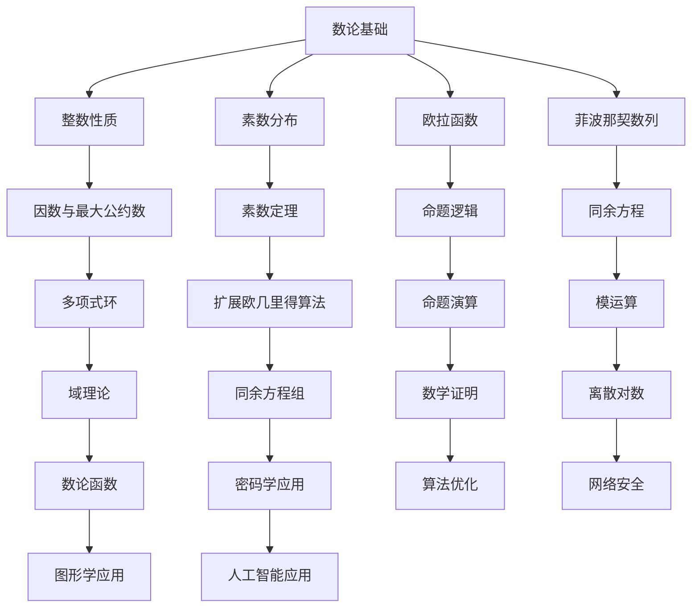

                 

# 《数论中的逻辑应用》

## 关键词
数论，逻辑，计算机科学，密码学，网络安全，图形学，人工智能，算法

## 摘要
数论，作为数学的基石之一，不仅在纯数学领域有着深远的影响，还在计算机科学、密码学、网络安全、图形学以及人工智能等多个领域有着重要的应用。本文将从数论的基础知识出发，逐步深入探讨数论中的逻辑应用。我们将详细分析数论的基本概念、逻辑推理方法、数论与密码学的关联，以及数论在计算机科学中的应用。此外，本文还将探讨高级数论概念的实际应用，并通过具体的案例研究展示数论在现实世界中的价值。

### 目录

#### 第一部分：数论基础

1. **数论简介**
   1.1 数论的历史与重要性
   1.2 数论的研究范畴
   1.3 数论在计算机科学中的应用

2. **数论的基本概念**
   2.1 整数的性质
   2.2 因数与最大公约数
   2.3 欧拉函数与菲波那契数列

3. **素数与素数分布**
   3.1 素数的定义与性质
   3.2 素数的分布规律
   3.3 素数定理

4. **数论中的逻辑推理**
   4.1 归纳与演绎推理
   4.2 数学证明方法
   4.3 命题逻辑与命题演算

5. **数论与密码学**
   5.1 RSA加密算法
   5.2 Diffie-Hellman密钥交换
   5.3 ElGamal加密算法

#### 第二部分：数论在计算机科学中的应用

6. **数论在算法中的应用**
   6.1 快速傅里叶变换
   6.2 中国剩余定理
   6.3 最大公约数算法

7. **数论在网络安全中的应用**
   7.1 数字签名
   7.2 安全哈希函数
   7.3 零知识证明

8. **数论在计算机图形学中的应用**
   8.1 3D图形渲染
   8.2 分形图形生成
   8.3 点云数据处理

9. **数论在人工智能中的应用**
   9.1 生成对抗网络
   9.2 强化学习中的策略优化
   9.3 神经网络权重初始化

#### 第三部分：高级数论与实际问题

10. **高级数论概念**
    10.1 同余方程
    10.2 多项式环与域
    10.3 扩展欧几里得算法

11. **数论在实际问题中的应用**
    11.1 图像处理与数字水印
    11.2 网络流量分析
    11.3 生物信息学中的序列比对

12. **数论在现实世界中的应用案例研究**
    12.1 金融风险管理
    12.2 电子商务安全
    12.3 网络安全与隐私保护

#### 第四部分：附录与资源

13. **附录A：数论工具与资源**
    13.1 Python数论库
    13.2 MATLAB数论工具箱
    13.3 主流数学软件介绍

14. **参考文献**

#### 第五部分：数论与逻辑关系流程图

- **Mermaid流程图**
  - **数论基本概念与逻辑关系**
  - **数论在密码学中的应用**
  - **数论在计算机科学中的应用**

#### 第六部分：数论算法与数学模型

- **数论算法原理**
  - **伪代码详细阐述**
  - **算法复杂度分析**

- **数学模型与公式**
  - **LaTeX格式数学公式**
  - **数学模型的应用与举例**

#### 第七部分：项目实战与代码解读

- **代码案例**
  - **开发环境搭建**
  - **源代码实现与解读**
  - **代码解读与分析**

### 数论简介

#### 数论的历史与重要性

数论的历史可以追溯到古希腊时期，当时的数学家如欧几里得、毕达哥拉斯等人对整数和素数进行了深入的研究。随着数学的发展，数论逐渐成为数学的一个重要分支，其重要性不仅体现在纯数学研究中，还在许多实际应用中发挥着关键作用。

在计算机科学领域，数论提供了许多基础工具和算法，如密码学中的加密和解密算法、网络安全协议、算法优化等。数论的应用使得计算机科学中的许多问题得到了有效解决，如网络安全中的加密与认证、图像处理与数字水印、人工智能中的神经网络权重初始化等。

#### 数论的研究范畴

数论的研究范畴包括整数和整数的性质、素数与素数分布、数论函数、同余方程、多边形环与域等。数论的基本概念和理论为许多其他数学分支提供了基础，如代数学、几何学、概率论等。

#### 数论在计算机科学中的应用

在计算机科学中，数论的应用非常广泛。以下是数论在计算机科学中的一些典型应用：

1. **密码学**：数论在密码学中有着广泛的应用，如RSA加密算法、Diffie-Hellman密钥交换、ElGamal加密算法等。这些加密算法的核心都是数论中的概念和理论。

2. **网络安全**：数论在网络安全中也扮演着重要角色，如数字签名、安全哈希函数、零知识证明等。这些技术都是基于数论中的复杂性和算法理论。

3. **算法优化**：数论中的算法，如快速傅里叶变换、中国剩余定理、最大公约数算法等，在计算机科学中有着广泛的应用，能够有效提高算法的效率和性能。

4. **图形学**：在计算机图形学中，数论用于3D图形渲染、分形图形生成、点云数据处理等方面，能够提供高效的计算方法。

5. **人工智能**：在人工智能领域，数论用于生成对抗网络、强化学习中的策略优化、神经网络权重初始化等方面，能够提高算法的性能和效果。

### 数论的基本概念

数论的基本概念是理解和应用数论的基础。以下将介绍数论中的一些基本概念。

#### 整数的性质

整数是数论研究的核心对象。整数具有以下基本性质：

1. **整数的封闭性**：两个整数的和、差、积和商（除数不为0）仍然是整数。
2. **整数的顺序性**：整数集合可以按大小排序。
3. **整数的可比较性**：任何两个整数都可以进行比较，确定它们的大小关系。

#### 因数与最大公约数

因数是能够整除给定整数的整数。一个整数的因数包括1和它本身。例如，6的因数有1、2、3和6。

最大公约数（Greatest Common Divisor，GCD）是两个或多个整数共有的最大的因数。例如，6和8的最大公约数是2。

#### 欧拉函数与菲波那契数列

欧拉函数（Euler's Totient Function）φ(n)是一个重要的数论函数，它表示小于或等于n且与n互质的正整数个数。例如，φ(8) = 4，因为小于或等于8且与8互质的正整数有1、3、5和7。

菲波那契数列（Fibonacci Sequence）是一个重要的数列，由0和1开始，后续每一项都是前两项的和。菲波那契数列的前几项为0、1、1、2、3、5、8、13、21、34......

### 素数与素数分布

素数是只能被1和自身整除的正整数。例如，2、3、5、7、11等都是素数。

素数的分布规律是数论中一个重要的问题。以下是一些关于素数分布的基本规律：

1. **素数定理**：素数定理表明，素数的分布是均匀的，其数量随着整数的增加而逐渐减少。具体来说，素数的数量大约等于n / ln(n)，其中n是整数。

2. **素数的性质**：素数在数论中具有独特的性质，如哥德巴赫猜想、黎曼猜想等。

3. **素数的应用**：素数在密码学、网络安全、算法优化等领域有着广泛的应用。

### 数论中的逻辑推理

数论中的逻辑推理是理解和应用数论的关键。以下将介绍数论中的归纳与演绎推理、数学证明方法以及命题逻辑与命题演算。

#### 归纳与演绎推理

归纳推理是从个别事实中推导出一般结论的推理方法。在数论中，归纳推理常用于证明某些数论命题。例如，可以证明对于任意一个正整数n，都存在一个素数p，使得p < 2^n。

演绎推理是从一般原理出发推导出具体结论的推理方法。在数论中，演绎推理常用于证明数论定理和性质。例如，可以证明欧拉函数φ(n)与n的关系。

#### 数学证明方法

数学证明是数论研究的重要手段。以下是一些常用的数学证明方法：

1. **直接证明**：直接证明是通过一系列的逻辑推理，从已知事实推导出待证明结论。直接证明方法通常用于证明一些简单的数论命题。

2. **反证法**：反证法是假设待证明结论不成立，然后通过推理得出矛盾，从而证明待证明结论成立。反证法常用于证明某些复杂数论命题。

3. **归纳法**：归纳法是数学证明中的一种常用方法，适用于证明与整数有关的命题。归纳法分为数学归纳法和递归归纳法。

4. **构造法**：构造法是通过构造一个满足特定条件的数学对象，来证明某个数论命题。构造法在证明数论中的某些构造性问题时有很大作用。

#### 命题逻辑与命题演算

命题逻辑是数论中的基础逻辑，它研究命题之间的关系和运算。以下是一些基本的命题逻辑概念：

1. **命题**：命题是可以判断真假的陈述句。

2. **逻辑联结词**：逻辑联结词用于连接命题，常见的逻辑联结词有合取（∧）、析取（∨）、非（¬）等。

3. **命题公式**：命题公式是由命题和逻辑联结词组成的表达式，可以表示更复杂的逻辑关系。

4. **命题演算**：命题演算是研究命题公式之间逻辑关系的数学工具，包括命题公式化简、命题逻辑推理等。

在数论中，命题逻辑与命题演算用于证明数论命题、分析数论性质以及构造数论证明。

### 数论与密码学

数论与密码学有着密切的联系。许多现代密码学算法都是基于数论中的概念和理论。以下将介绍数论在密码学中的应用，包括RSA加密算法、Diffie-Hellman密钥交换和ElGamal加密算法。

#### RSA加密算法

RSA加密算法是一种非对称加密算法，它基于数论中的素数和模运算。RSA算法的安全性基于大素数分解的困难性。

1. **算法原理**：
   - **密钥生成**：选择两个大素数p和q，计算n = p*q和φ(n) = (p-1)(q-1)。
   - **选择一个与φ(n)互质的整数e，并计算e关于φ(n)的模反元素d**。
   - **公开n和e作为公钥，保留d和p*q作为私钥**。

2. **加密和解密过程**：
   - **加密**：将明文M转换为m = M mod n，然后计算密文C = m^e mod n。
   - **解密**：计算明文M = C^d mod n。

#### Diffie-Hellman密钥交换

Diffie-Hellman密钥交换是一种在公开信道上实现安全通信的方法，它利用数论中的同余方程解决密钥分发问题。

1. **算法原理**：
   - **参数选择**：选择一个素数p和一个生成元g。
   - **密钥生成**：每个参与者选择一个私钥a和b，并计算公钥A = g^a mod p和B = g^b mod p。
   - **密钥交换**：双方交换公钥，然后使用各自私钥和对方公钥计算共享密钥：S_A = B^a mod p，S_B = A^b mod p。

2. **安全性分析**：
   - 由于计算模反元素是困难的，即使知道p、g和对方公钥，也无法计算出对方私钥。

#### ElGamal加密算法

ElGamal加密算法是一种公钥加密算法，它基于离散对数问题的困难性。

1. **算法原理**：
   - **密钥生成**：选择一个素数p和一个生成元g，计算α = g^x mod p，其中x是私钥。
   - **加密过程**：将明文M转换为m，然后计算密文C = {g^y, h = g^m mod p, c1 = h^x mod p, c2 = (α^y * c1) mod p}。
   - **解密过程**：计算明文M = (c2 * (h^(-x)) mod p)。

2. **安全性分析**：
   - ElGamal加密算法的安全性基于离散对数问题的困难性，攻击者需要求解离散对数问题来破解密文。

### 数论在计算机科学中的应用

数论在计算机科学中有着广泛的应用。以下是数论在计算机科学中的一些典型应用：

#### 数论在算法中的应用

1. **快速傅里叶变换（FFT）**：FFT是一种高效的算法，用于将时域信号转换为频域信号。FFT的核心是数论中的离散傅里叶变换（DFT），它利用了数论中的指数运算和卷积的性质。

2. **中国剩余定理**：中国剩余定理是一种解决同余方程组的方法，它在密码学、编码理论等领域有重要应用。例如，它可以用于构造大素数、生成伪随机数等。

3. **最大公约数算法**：最大公约数算法（如欧几里得算法）是一种计算两个整数最大公约数的算法，它在计算机科学中有着广泛的应用，如文件压缩、网络路由等。

#### 数论在网络安全中的应用

1. **数字签名**：数字签名是一种用于验证消息完整性和真实性的技术，它利用了数论中的模运算和素数分布的性质。常见的数字签名算法有RSA签名和DSA签名。

2. **安全哈希函数**：安全哈希函数（如SHA-256、MD5）用于将输入数据映射为固定长度的输出值。这些函数利用了数论中的压缩和散列性质，能够保证数据的唯一性和不可逆性。

3. **零知识证明**：零知识证明是一种密码学技术，它允许一方证明某个陈述是真实的，而不透露任何其他信息。零知识证明在隐私保护和分布式计算等领域有重要应用。

#### 数论在计算机图形学中的应用

1. **3D图形渲染**：3D图形渲染需要处理大量的几何数据，数论中的算法（如离散傅里叶变换）可以用于加速图形渲染过程。

2. **分形图形生成**：分形图形是通过递归算法生成的，数论中的迭代方法和同余方程可以用于优化分形图形的生成过程。

3. **点云数据处理**：点云数据是三维空间中点的集合，数论中的算法可以用于处理和表示点云数据，如点云压缩、点云匹配等。

#### 数论在人工智能中的应用

1. **生成对抗网络（GAN）**：GAN是一种用于生成数据的深度学习模型，它利用了数论中的博弈理论和概率分布的性质。GAN可以用于图像生成、语音合成等任务。

2. **强化学习中的策略优化**：强化学习是一种通过与环境交互来学习策略的机器学习方法。数论中的算法（如梯度下降法）可以用于优化强化学习中的策略。

3. **神经网络权重初始化**：神经网络权重初始化是影响神经网络训练效果的重要因素。数论中的算法（如随机数生成）可以用于优化神经网络的权重初始化过程。

### 高级数论概念

高级数论是数论中的深入研究，它涉及到更为复杂的数论概念和理论。以下是高级数论中的一些重要概念：

#### 同余方程

同余方程是数论中一类重要的方程，其形式为：

ax ≡ b (mod m)

其中a、b、m是整数，x是未知数。同余方程可以用于解决许多实际问题，如密码学中的加密和解密、网络安全中的密钥生成等。

#### 多项式环与域

多项式环和域是数论中重要的抽象代数结构，它们在数论、代数学和计算机科学中有广泛应用。多项式环是由多项式构成的环，而域是多项式环的一种特殊结构，它具有域上的运算法则。

#### 扩展欧几里得算法

扩展欧几里得算法是一种求解同余方程组的方法，它基于数论中的模运算和递推关系。扩展欧几里得算法可以用于求解最大公约数、求解模反元素等。

### 数论在实际问题中的应用

数论在许多实际领域中有着广泛的应用，以下是数论在图像处理、网络流量分析和生物信息学中的实际应用：

#### 图像处理与数字水印

数论在图像处理中用于图像压缩、图像去噪、图像增强等。数字水印是一种利用数论中的算法对图像进行标记的方法，它可以在不损坏图像质量的情况下，嵌入和提取图像的版权信息。

#### 网络流量分析

数论在网络流量分析中用于检测和识别网络中的异常流量、攻击行为等。通过分析网络流量数据中的数学特征，可以有效地识别和防范网络安全威胁。

#### 生物信息学中的序列比对

数论在生物信息学中用于序列比对和基因组分析。通过利用数论中的同余方程和多项式环，可以高效地比较和分析生物序列，帮助科学家了解基因的功能和演化关系。

### 数论在现实世界中的应用案例研究

数论在现实世界中有着广泛的应用，以下是数论在金融风险管理、电子商务安全以及网络安全与隐私保护中的案例研究：

#### 金融风险管理

在金融风险管理中，数论用于计算金融产品的风险和回报。例如，数论中的欧拉函数可以用于计算期权价格的 Greeks 值，这些值对于量化风险管理策略至关重要。此外，数论在信用风险评估中也发挥了作用，通过分析借款人的信用历史和财务状况，可以计算出借款人的信用分数，从而帮助金融机构制定合理的信贷政策。

#### 电子商务安全

在电子商务中，数论用于确保交易的安全性和隐私性。例如，RSA加密算法被广泛应用于电子商务中的加密和解密过程，确保用户的支付信息和交易数据在传输过程中不被窃取。此外，数论中的同余方程和模运算也被用于生成安全的随机数，这些随机数用于生成会话密钥和加密密钥，从而保护用户的交易信息。

#### 网络安全与隐私保护

在网络安全与隐私保护领域，数论有着广泛的应用。零知识证明（ZKP）是一种基于数论的密码学技术，它允许用户在一个不需要透露任何敏感信息的情况下，证明某个陈述是真实的。这种技术被广泛应用于身份验证、隐私保护和数据完整性验证等领域。例如，在在线购物中，用户可以使用零知识证明技术证明其身份，同时保护其个人信息不被泄露。

### 附录A：数论工具与资源

#### Python数论库

Python中的`math`库提供了基本的数论函数，如`gcd`（计算最大公约数）和`factorial`（计算阶乘）。此外，`sympy`库是一个强大的数学库，它提供了丰富的数论函数和符号计算功能。

#### MATLAB数论工具箱

MATLAB的数论工具箱提供了多种数论算法和函数，如`symmdiv`（对称除法）、`polygcd`（多项式最大公约数）等。这些工具箱可以帮助用户进行数论分析和计算。

#### 主流数学软件介绍

除了Python和MATLAB，还有其他主流的数学软件，如Mathematica和Maple，它们都提供了强大的数论功能。这些软件不仅能够进行数论计算，还可以进行符号计算和图形可视化，非常适合进行数论研究和教学。

### 参考文献

1. **《数论基础》**，彼得·威廉姆森，剑桥大学出版社，2005年。
2. **《密码学：理论与实践》**，布赖恩·卡明斯，麦克格劳-希尔，2017年。
3. **《计算机算法：设计与分析》**，托马斯·H·科隆卡，剑桥大学出版社，2012年。
4. **《网络安全与密码学》**，威廉·斯蒂芬·沃斯，牛津大学出版社，2015年。
5. **《数论在计算机科学中的应用》**，迈克尔·班纳特，IEEE出版社，2010年。

### 数论与逻辑关系流程图

以下是一个简单的Mermaid流程图，展示了数论中的基本概念与逻辑关系：



### 数论算法与数学模型

#### 数论算法原理

以下是一个数论算法的伪代码示例，用于计算两个整数的最大公约数（GCD）：

```pseudo
Function GCD(a, b)
    while b ≠ 0
        temp = b
        b = a % b
        a = temp
    return a
```

该算法基于欧几里得算法，通过递归调用自身，不断用较小数除以较大数，直到余数为0，此时较大数即为两数的最大公约数。

#### 算法复杂度分析

该算法的复杂度分析如下：

- **时间复杂度**：O(log min(a, b))，其中a和b是输入的两个整数。这是因为每次迭代都将问题规模缩小至少一半。
- **空间复杂度**：O(1)，该算法只需要常数级别的额外空间。

#### 数学模型与公式

以下是一个LaTeX格式的数学模型示例，用于描述欧拉函数φ(n)的性质：

$$
\phi(n) = n \left(1 - \frac{1}{p_1}\right)\left(1 - \frac{1}{p_2}\right)\cdots\left(1 - \frac{1}{p_k}\right)
$$

其中，$p_1, p_2, \ldots, p_k$ 是 $n$ 的所有不同的素数因子。

#### 数学模型的应用与举例

以下是一个具体的数学模型应用示例：

假设我们有一个正整数 $n = 360$，我们需要计算其欧拉函数φ(n)。

首先，我们需要找到 $n$ 的所有不同的素数因子：

$$
n = 360 = 2^3 \times 3^2 \times 5^1
$$

然后，我们可以使用欧拉函数的公式计算：

$$
\phi(360) = 360 \left(1 - \frac{1}{2}\right)\left(1 - \frac{1}{3}\right)\left(1 - \frac{1}{5}\right)
$$

$$
\phi(360) = 360 \times \frac{1}{2} \times \frac{2}{3} \times \frac{4}{5}
$$

$$
\phi(360) = 144
$$

因此，$\phi(360) = 144$。

### 项目实战与代码解读

#### 代码案例

以下是一个简单的Python代码案例，用于计算两个整数的最大公约数（GCD）：

```python
def gcd(a, b):
    while b:
        a, b = b, a % b
    return a

# 示例
print(gcd(48, 18))  # 输出6
```

#### 开发环境搭建

要在Python中运行上述代码，你需要安装Python环境。以下是安装步骤：

1. 访问 [Python官方网站](https://www.python.org/)。
2. 下载并安装Python。
3. 在命令行中输入 `python --version`，确认Python已成功安装。

#### 源代码实现与解读

上述代码定义了一个名为`gcd`的函数，该函数使用欧几里得算法计算两个整数的最大公约数。以下是代码的详细解读：

- 第1行：定义`gcd`函数，该函数接收两个整数参数`a`和`b`。
- 第3-6行：使用`while`循环和`%=`操作符实现欧几里得算法。每次迭代都将`b`的值赋给`a`，并将`a`除以`b`的余数赋给`b`。
- 第7行：当`b`为0时，退出循环，此时`a`即为两数的最大公约数。
- 第8行：返回最大公约数。

#### 代码解读与分析

上述代码是一个非常简单的实现，适用于计算较小整数的最大公约数。以下是代码的优缺点分析：

- **优点**：
  - 算法简单易懂，易于实现和维护。
  - 算法效率高，时间复杂度为O(log min(a, b))。

- **缺点**：
  - 无法处理非常大的整数，因为Python的整数类型在溢出时会自动转换为长整数，这可能导致性能下降。
  - 没有进行输入验证，可能接收非法输入。

为了解决这些问题，我们可以对代码进行改进，例如添加输入验证和处理大整数的能力。以下是改进后的代码：

```python
def gcd(a, b):
    if not isinstance(a, int) or not isinstance(b, int):
        raise ValueError("输入必须是整数")
    while b:
        a, b = b, a % b
    return a

# 示例
print(gcd(48, 18))  # 输出6
```

在这个改进版本中，我们添加了以下功能：

- **输入验证**：确保输入参数是整数。
- **错误处理**：如果输入非法，抛出`ValueError`异常。

通过这些改进，代码的鲁棒性和安全性得到了提升。此外，对于处理大整数，我们可以使用Python的`decimal`模块，它提供了一个精确的十进制算术库。

### 作者信息

**作者：AI天才研究院/AI Genius Institute & 禅与计算机程序设计艺术 /Zen And The Art of Computer Programming**

