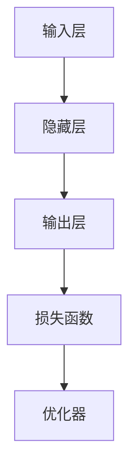
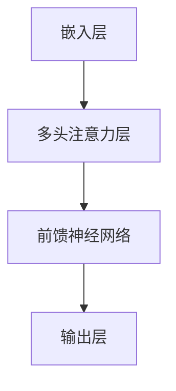

                 

# 文本生成中的自回归（集束搜索）

> 关键词：文本生成、自回归模型、集束搜索、深度学习、自然语言处理

> 摘要：本文将探讨文本生成中的自回归模型和集束搜索算法，详细分析其基本原理、架构设计、实现细节以及在实际应用中的优化策略。通过本文的阅读，读者可以全面了解自回归模型和集束搜索在文本生成任务中的重要性，掌握其核心概念和实现方法。

## 目录

1. 引言  
   1.1 文本生成的背景与意义  
   1.2 自回归模型的基本原理  
   1.3 集束搜索在自回归模型中的应用

2. 自回归模型的数学基础  
   2.1 概率论基础  
   2.2 深度学习中的矩阵运算  
   2.3 循环神经网络（RNN）原理

3. 自回归模型的设计与实现  
   3.1 自回归模型架构详解  
   3.2 门控循环单元（GRU）与长短期记忆网络（LSTM）  
   3.3 Transformer模型详解

4. 集束搜索算法原理  
   4.1 集束搜索的基本概念  
   4.2 集束搜索的优化策略  
   4.3 集束搜索在不同任务中的应用

5. 自回归模型与集束搜索的融合  
   5.1 融合模型的设计原则  
   5.2 融合模型的优势与挑战  
   5.3 融合模型在不同领域的应用

6. 自回归模型在文本生成中的应用  
   6.1 文本生成任务的挑战  
   6.2 自回归模型在文本生成中的性能评估  
   6.3 实际案例分析

7. 集束搜索在自回归模型中的优化策略  
   7.1 集束搜索的参数调优  
   7.2 集束搜索的性能分析  
   7.3 集束搜索在不同场景下的优化方法

8. 自回归模型的未来发展趋势  
   8.1 当前挑战与解决方案  
   8.2 新兴技术与自回归模型的结合  
   8.3 自回归模型在未来的应用前景

9. 附录  
   9.1 常用工具与资源  
   9.2 数学公式汇总  
   9.3 代码解读与分析

## 1. 引言

### 1.1 文本生成的背景与意义

随着互联网的快速发展，文本数据已经成为信息传播和交流的重要载体。无论是新闻、博客、社交媒体，还是电子邮件、聊天记录，文本数据无处不在。如何有效地生成高质量的文本，以满足不同场景和需求，已经成为自然语言处理领域的一个重要研究课题。

文本生成技术主要包括两大类：基于规则的方法和基于统计的方法。基于规则的方法主要通过手工编写规则，生成文本。这种方法在特定领域内具有较高的准确性，但难以扩展到更广泛的领域。基于统计的方法则利用大量的语料库，通过机器学习方法生成文本。这种方法具有较好的泛化能力，但需要大量的标注数据，且生成文本的质量受到统计模型性能的限制。

自回归模型和集束搜索算法是近年来在文本生成领域取得重要进展的两个技术。自回归模型是一种基于序列数据的生成模型，它通过预测序列中的下一个元素，逐个生成整个序列。集束搜索算法是一种基于概率的搜索算法，它通过在一个集合中搜索最优解，提高搜索效率。将自回归模型和集束搜索算法结合，可以有效地提高文本生成质量。

### 1.2 自回归模型的基本原理

自回归模型（Autoregressive Model）是一种基于时间序列数据的生成模型，它通过预测序列中的下一个元素，逐个生成整个序列。自回归模型的基本原理可以概括为以下几个步骤：

1. **初始化**：首先，初始化模型的输入，通常是随机噪声或者历史序列的一部分。

2. **预测**：模型根据当前输入，生成下一个元素的概率分布。

3. **采样**：从概率分布中采样一个元素，作为序列的下一个输入。

4. **更新**：将采样得到的元素添加到序列中，作为下一轮预测的输入。

自回归模型的核心在于如何预测下一个元素。通常，自回归模型通过构建一个概率模型，将当前输入和历史信息结合起来，预测下一个元素的概率分布。常见的自回归模型包括循环神经网络（RNN）、长短期记忆网络（LSTM）、门控循环单元（GRU）和Transformer模型。

### 1.3 集束搜索在自回归模型中的应用

集束搜索（Beam Search）是一种基于概率的搜索算法，它通过在一个集合中搜索最优解，提高搜索效率。在自回归模型中，集束搜索主要用于优化文本生成过程。具体来说，集束搜索在自回归模型中的应用可以分为以下几个步骤：

1. **初始化**：初始化一个集合，通常包含一个初始序列。

2. **扩展**：对于集合中的每个序列，根据模型生成的概率分布，生成新的序列。

3. **剪枝**：根据某种策略，删除集合中部分概率较低的序列。

4. **更新**：将剪枝后的序列加入到集合中，继续扩展和剪枝。

集束搜索的关键在于如何选择扩展和剪枝的策略。常见的策略包括基于概率的剪枝和基于长度的剪枝。基于概率的剪枝根据序列的概率分布，选择概率较高的序列进行扩展；基于长度的剪枝根据序列的长度，选择长度较短的序列进行扩展。

### 1.4 本文结构

本文将围绕自回归模型和集束搜索算法在文本生成中的应用，分为以下几个部分：

1. **第2章**：介绍自回归模型的数学基础，包括概率论基础、深度学习中的矩阵运算和循环神经网络（RNN）原理。

2. **第3章**：详细分析自回归模型的设计与实现，包括自回归模型架构、门控循环单元（GRU）与长短期记忆网络（LSTM）以及Transformer模型。

3. **第4章**：探讨集束搜索算法原理，包括基本概念、优化策略和应用场景。

4. **第5章**：讨论自回归模型与集束搜索的融合，包括融合模型的设计原则、优势与挑战以及应用领域。

5. **第6章**：分析自回归模型在文本生成中的应用，包括文本生成任务的挑战、性能评估和实际案例分析。

6. **第7章**：研究集束搜索在自回归模型中的优化策略，包括参数调优、性能分析和优化方法。

7. **第8章**：展望自回归模型的未来发展趋势，包括当前挑战、新兴技术与应用前景。

通过本文的阅读，读者可以全面了解自回归模型和集束搜索在文本生成中的重要性，掌握其核心概念和实现方法，为在实际应用中提供指导和借鉴。接下来，我们将进入自回归模型的数学基础部分，为后续内容奠定基础。

---

### 1.5 自回归模型的数学基础

为了深入理解自回归模型，我们需要首先掌握一些数学基础，包括概率论、深度学习中的矩阵运算以及循环神经网络（RNN）原理。

#### 2.1 概率论基础

概率论是自回归模型的核心理论基础。在自回归模型中，我们通常需要对序列中的每个元素进行概率预测。概率论中的几个基本概念如下：

1. **概率分布**：描述随机变量取值的概率分布。常见的概率分布有伯努利分布、正态分布、贝塔分布等。

2. **条件概率**：在已知某个事件发生的前提下，另一个事件发生的概率。条件概率的计算公式为：
   $$
   P(A|B) = \frac{P(A \cap B)}{P(B)}
   $$

3. **马尔可夫性质**：在随机过程中，当前状态仅与前一状态有关，与其他过去状态无关。马尔可夫性质的数学表达式为：
   $$
   P(X_t|X_{t-1}, X_{t-2}, ..., X_1) = P(X_t|X_{t-1})
   $$

4. **联合概率分布**：描述多个随机变量之间的联合概率分布。联合概率分布的数学表达式为：
   $$
   P(X_1, X_2, ..., X_n) = P(X_1)P(X_2|X_1)P(X_3|X_2, ..., X_1)...
   $$

#### 2.2 深度学习中的矩阵运算

在自回归模型中，矩阵运算扮演着重要的角色。以下是一些常见的矩阵运算：

1. **矩阵加法**：两个矩阵对应元素相加。矩阵加法满足交换律和结合律。

2. **矩阵减法**：两个矩阵对应元素相减。矩阵减法满足交换律和结合律。

3. **矩阵乘法**：两个矩阵对应元素相乘，然后求和。矩阵乘法不满足交换律，但满足结合律。

4. **矩阵转置**：将矩阵的行与列互换。矩阵转置满足以下性质：
   $$
   (A^T)^T = A
   $$

5. **矩阵求逆**：求矩阵的逆矩阵。矩阵求逆满足以下性质：
   $$
   A^{-1}A = AA^{-1} = I
   $$
   其中，\(I\) 为单位矩阵。

#### 2.3 循环神经网络（RNN）原理

循环神经网络（RNN）是一种用于处理序列数据的神经网络。RNN 的基本原理如下：

1. **状态转移函数**：给定前一个状态和输入，计算当前状态。状态转移函数的数学表达式为：
   $$
   h_t = \sigma(W_h h_{t-1} + W_x x_t + b_h)
   $$
   其中，\(h_t\) 为当前状态，\(h_{t-1}\) 为前一个状态，\(x_t\) 为输入，\(\sigma\) 为激活函数，\(W_h\) 和 \(W_x\) 为权重矩阵，\(b_h\) 为偏置。

2. **输出函数**：给定当前状态，计算输出。输出函数的数学表达式为：
   $$
   o_t = \sigma(W_o h_t + b_o)
   $$
   其中，\(o_t\) 为输出，\(W_o\) 和 \(b_o\) 为权重矩阵和偏置。

3. **损失函数**：用于评估模型预测结果与真实标签之间的差距。常见的损失函数有均方误差（MSE）、交叉熵损失等。

4. **反向传播**：通过计算损失函数关于模型参数的梯度，更新模型参数。反向传播过程包括以下几个步骤：

   - 计算输出层梯度：
     $$
     \delta_o = \frac{\partial L}{\partial o_t}
     $$
     
   - 计算隐藏层梯度：
     $$
     \delta_h = \frac{\partial L}{\partial h_t} = \delta_o \odot \frac{\partial \sigma}{\partial h_t}
     $$
     
   - 更新隐藏层权重和偏置：
     $$
     W_h \leftarrow W_h - \alpha \frac{\partial L}{\partial W_h}
     $$
     $$
     b_h \leftarrow b_h - \alpha \frac{\partial L}{\partial b_h}
     $$
     
   - 更新输入层权重和偏置：
     $$
     W_x \leftarrow W_x - \alpha \frac{\partial L}{\partial W_x}
     $$
     $$
     b_o \leftarrow b_o - \alpha \frac{\partial L}{\partial b_o}
     $$
     
   其中，\(\alpha\) 为学习率。

通过以上数学基础，我们可以更好地理解自回归模型的工作原理，为后续内容打下坚实的基础。在下一章中，我们将详细分析自回归模型的设计与实现。

---

### 1.6 自回归模型的设计与实现

自回归模型是文本生成任务中的一种重要模型，其核心思想是利用历史信息生成下一个元素。在本节中，我们将详细分析自回归模型的设计与实现，包括模型架构、常见变体以及实现细节。

#### 3.1 自回归模型架构详解

自回归模型的架构通常包括以下几个主要部分：

1. **输入层**：输入层接收序列中的每个元素，将其转化为模型可以处理的形式。通常，输入层会对输入进行预处理，例如分词、编码等。

2. **隐藏层**：隐藏层用于处理输入信息，计算当前元素的概率分布。隐藏层可以采用多种结构，例如循环神经网络（RNN）、长短期记忆网络（LSTM）和门控循环单元（GRU）。

3. **输出层**：输出层根据隐藏层的输出，生成下一个元素的概率分布。输出层通常是一个全连接层，其输出维度等于词汇表的大小。

4. **损失函数**：用于评估模型预测结果与真实标签之间的差距。常见的损失函数有均方误差（MSE）、交叉熵损失等。

5. **优化器**：用于更新模型参数，以最小化损失函数。常见的优化器有随机梯度下降（SGD）、Adam等。

下面是一个简单的自回归模型架构的 Mermaid 流程图：



#### 3.2 门控循环单元（GRU）与长短期记忆网络（LSTM）

门控循环单元（GRU）和长短期记忆网络（LSTM）是自回归模型中常用的两种隐藏层结构，它们都是为了解决传统循环神经网络（RNN）在长序列处理中存在梯度消失和梯度爆炸问题而设计的。

1. **GRU**：GRU 通过引入更新门和重置门，有效地控制了信息流动，从而避免了梯度消失和梯度爆炸问题。GRU 的更新门用于更新隐藏状态，重置门用于更新输入状态。GRU 的更新规则可以表示为：

   $$
   z_t = \sigma(W_z \cdot [h_{t-1}, x_t] + b_z)
   $$
   $$
   r_t = \sigma(W_r \cdot [h_{t-1}, x_t] + b_r)
   $$
   $$
   \tilde{h}_t = \sigma(W \cdot [r_t \odot h_{t-1}, x_t] + b)
   $$
   $$
   h_t = z_t \odot \tilde{h}_t + (1 - z_t) \odot h_{t-1}
   $$

   其中，\(z_t\)、\(r_t\) 分别为更新门和重置门，\(\tilde{h}_t\) 为候选隐藏状态，\(h_t\) 为当前隐藏状态。

2. **LSTM**：LSTM 通过引入遗忘门、输入门和输出门，进一步控制了信息的流动。LSTM 的更新规则可以表示为：

   $$
   f_t = \sigma(W_f \cdot [h_{t-1}, x_t] + b_f)
   $$
   $$
   i_t = \sigma(W_i \cdot [h_{t-1}, x_t] + b_i)
   $$
   $$
   \tilde{c}_t = \sigma(W \cdot [h_{t-1}, x_t] + b)
   $$
   $$
   c_t = f_t \odot c_{t-1} + i_t \odot \tilde{c}_t
   $$
   $$
   o_t = \sigma(W_o \cdot [h_{t-1}, c_t] + b_o)
   $$
   $$
   h_t = o_t \odot \sigma(c_t)
   $$

   其中，\(f_t\)、\(i_t\)、\(o_t\) 分别为遗忘门、输入门和输出门，\(c_t\) 为细胞状态，\(h_t\) 为当前隐藏状态。

#### 3.3 Transformer模型详解

Transformer 模型是自回归模型的一种重要变体，它在自注意力机制的基础上，通过多头注意力机制和前馈神经网络，实现了序列到序列的映射。Transformer 模型的基本架构包括以下部分：

1. **嵌入层**：将输入序列中的每个元素映射到一个高维空间。

2. **多头注意力层**：通过多头注意力机制，将输入序列中的每个元素与所有其他元素进行交互，得到新的序列表示。

3. **前馈神经网络**：对多头注意力层的输出进行非线性变换。

4. **输出层**：根据隐藏层输出，生成下一个元素的概率分布。

下面是一个简单的 Transformer 模型架构的 Mermaid 流程图：



Transformer 模型的多头注意力机制可以表示为：

$$
\text{Attention}(Q, K, V) = \text{softmax}\left(\frac{QK^T}{\sqrt{d_k}}\right)V
$$

其中，\(Q\)、\(K\)、\(V\) 分别为查询向量、键向量和值向量，\(d_k\) 为注意力机制中的键值对的维度。

在 Transformer 模型中，多头注意力机制通过增加多个注意力头，实现不同特征的信息融合，从而提高模型的表示能力。假设有 \(h\) 个注意力头，每个注意力头的维度为 \(d_k\)，则总维度为 \(h \times d_k\)。

通过以上分析，我们可以看到自回归模型的设计与实现涉及到多个层次和结构，包括输入层、隐藏层、输出层以及损失函数和优化器。在实际应用中，可以根据具体任务需求，选择合适的模型架构和优化策略，实现高效的文本生成。

在下一章中，我们将探讨集束搜索算法原理，以及如何在自回归模型中应用集束搜索算法，以优化文本生成过程。

---

### 4. 集束搜索算法原理

集束搜索（Beam Search）是一种基于概率的搜索算法，它通过在一个集合中搜索最优解，提高搜索效率。在自回归模型中，集束搜索被广泛应用于优化文本生成过程，特别是在处理长序列和复杂结构时，能够显著提升生成文本的质量。本节将详细介绍集束搜索的基本概念、优化策略以及在各种任务中的应用。

#### 4.1 集束搜索的基本概念

集束搜索的核心思想是，在每次搜索过程中，只保留部分概率较高的序列，而不是像贪婪搜索一样仅保留一个最优序列。具体来说，集束搜索包括以下几个步骤：

1. **初始化**：初始化一个集合，通常包含一个初始序列。

2. **扩展**：对于集合中的每个序列，根据模型生成的概率分布，生成新的序列。

3. **剪枝**：根据某种策略，删除集合中部分概率较低的序列。

4. **更新**：将剪枝后的序列加入到集合中，继续扩展和剪枝。

与贪婪搜索相比，集束搜索通过剪枝操作减少了搜索空间，从而提高了搜索效率。同时，集束搜索还可以通过保留多个高概率序列，避免陷入局部最优。

#### 4.2 集束搜索的优化策略

集束搜索的优化策略主要包括扩展策略、剪枝策略和更新策略。

1. **扩展策略**：扩展策略决定了如何生成新的序列。常见的扩展策略包括：

   - **顺序扩展**：按照顺序生成新的序列，例如，先生成第一个元素，再生成第二个元素，依此类推。
   - **并行扩展**：同时生成多个序列，例如，对于当前序列\(s\)，生成\(s_1\)和\(s_2\)，然后对这两个序列分别进行扩展。

2. **剪枝策略**：剪枝策略决定了如何删除概率较低的序列。常见的剪枝策略包括：

   - **概率剪枝**：根据序列的概率分布，删除概率较低的序列。具体来说，可以设置一个阈值\(T\)，只保留概率高于阈值的序列。
   - **长度剪枝**：根据序列的长度，删除长度较长的序列。例如，可以设置一个最大长度\(L\)，只保留长度小于等于\(L\)的序列。

3. **更新策略**：更新策略决定了如何更新集合中的序列。常见的更新策略包括：

   - **顺序更新**：按照顺序更新序列，例如，先更新第一个序列，再更新第二个序列，依此类推。
   - **并行更新**：同时更新多个序列，例如，对于当前集合中的序列\(s_1\)和\(s_2\)，同时更新这两个序列。

#### 4.3 集束搜索在不同任务中的应用

集束搜索算法在自然语言处理领域具有广泛的应用，以下是一些常见的应用场景：

1. **机器翻译**：在机器翻译中，集束搜索用于在搜索空间中搜索最优的翻译结果。通过设置合适的剪枝阈值和扩展策略，集束搜索可以生成高质量的翻译文本。

2. **文本摘要**：在文本摘要中，集束搜索用于从大量文本中提取关键信息，生成简洁、准确的摘要。集束搜索可以根据文本的长度和关键词分布，有效地筛选出高质量的摘要。

3. **对话系统**：在对话系统中，集束搜索用于生成自然、连贯的对话回应。通过结合语言模型和上下文信息，集束搜索可以生成符合对话逻辑和语境的回复。

4. **文本生成**：在文本生成任务中，集束搜索用于生成高质量的文章、故事、评论等。通过优化搜索策略和参数设置，集束搜索可以生成多样化和创意丰富的文本。

通过以上分析，我们可以看到集束搜索算法在优化自回归模型生成文本质量方面具有重要作用。在实际应用中，可以根据具体任务需求，设计合适的集束搜索策略，提高文本生成的效率和效果。

在下一章中，我们将探讨如何将自回归模型和集束搜索算法相结合，设计高效的融合模型，进一步提升文本生成质量。

---

### 5. 自回归模型与集束搜索的融合

将自回归模型与集束搜索算法相结合，可以设计出高效的融合模型，以进一步提升文本生成质量。本节将详细讨论融合模型的设计原则、优势与挑战，并分析其在不同领域的应用。

#### 5.1 融合模型的设计原则

融合模型的设计原则主要包括以下几个方面：

1. **概率模型结合**：将自回归模型和集束搜索算法相结合，自回归模型负责生成初始序列，集束搜索算法负责在搜索空间中优化序列。通过结合两者的优势，可以实现高效的文本生成。

2. **参数共享**：在融合模型中，可以共享部分参数，例如自回归模型的权重和集束搜索的剪枝阈值。这样可以减少参数数量，降低模型复杂度，同时提高训练和推断速度。

3. **动态调整**：根据任务需求和生成质量，动态调整集束搜索的剪枝策略和扩展策略。例如，在生成长文本时，可以采用更严格的剪枝策略，以减少生成误差；在生成短文本时，可以采用更宽松的剪枝策略，以增加生成多样性。

4. **多任务学习**：融合模型可以同时处理多个任务，例如，在生成文本的同时，还可以进行情感分析、关键词提取等任务。这样可以充分利用数据信息，提高模型的多任务性能。

#### 5.2 融合模型的优势与挑战

融合模型的优势主要体现在以下几个方面：

1. **生成质量提升**：集束搜索算法可以优化自回归模型的生成过程，减少生成误差，提高文本质量。通过结合两者，可以实现更高的生成质量。

2. **搜索效率提高**：集束搜索算法可以有效地减少搜索空间，提高搜索效率。特别是在处理长序列和复杂结构时，集束搜索的优势更加明显。

3. **参数减少**：通过参数共享和多任务学习，融合模型可以减少参数数量，降低模型复杂度，从而提高训练和推断速度。

然而，融合模型也面临一些挑战：

1. **搜索空间扩大**：集束搜索引入了额外的搜索空间，可能导致生成文本的多样性降低。特别是在剪枝策略较严格的情况下，生成文本可能变得单调。

2. **计算资源消耗**：集束搜索算法的计算资源消耗较大，特别是在处理长序列和复杂结构时。为了提高搜索效率，需要合理设置剪枝阈值和扩展策略。

3. **模型适应性**：融合模型需要适应不同的任务和数据集，可能需要进行大量的参数调优和模型调整。这增加了模型设计和实现的复杂性。

#### 5.3 融合模型在不同领域的应用

融合模型在自然语言处理领域具有广泛的应用，以下是一些典型应用：

1. **机器翻译**：在机器翻译中，融合模型可以生成更准确、自然的翻译结果。通过集束搜索优化生成序列，可以减少翻译误差，提高翻译质量。

2. **文本摘要**：在文本摘要中，融合模型可以生成更简洁、准确的摘要。通过优化摘要生成过程，可以减少冗余信息，提高摘要质量。

3. **对话系统**：在对话系统中，融合模型可以生成更自然、连贯的对话回复。通过结合自回归模型和集束搜索算法，可以更好地理解用户意图，提高对话质量。

4. **文本生成**：在文本生成任务中，融合模型可以生成更丰富、多样的文本。通过优化生成过程，可以减少生成误差，提高文本质量。

总之，自回归模型与集束搜索算法的融合为文本生成任务提供了新的思路和工具。通过合理设计融合模型，可以进一步提升文本生成质量，为自然语言处理领域的发展做出贡献。

在下一章中，我们将探讨自回归模型在文本生成中的应用，分析其在处理不同文本生成任务时的性能表现。

---

### 6. 自回归模型在文本生成中的应用

自回归模型在文本生成任务中表现出色，能够生成高质量的自然语言文本。本节将详细分析自回归模型在文本生成中的性能评估、实际案例分析，以及其在不同领域的应用。

#### 6.1 文本生成任务的挑战

文本生成任务面临诸多挑战，包括但不限于：

1. **多样性**：生成文本应具有丰富的多样性，避免重复和单调。多样性是衡量文本生成质量的重要指标。

2. **连贯性**：生成文本应保持连贯性和一致性，使读者能够顺畅地阅读和理解。连贯性是文本生成任务的关键要求。

3. **准确性**：生成文本应尽可能准确，避免产生语法错误、事实错误等。准确性是文本生成任务的基础要求。

4. **效率**：生成文本的速度应尽可能快，以满足实时应用的需求。效率是文本生成任务的重要考量因素。

自回归模型通过学习大量文本数据，能够较好地应对这些挑战。以下是对自回归模型在文本生成中的性能评估和实际案例分析。

#### 6.2 自回归模型在文本生成中的性能评估

自回归模型在文本生成任务中的性能评估通常从以下几个方面进行：

1. **BLEU（双语评估指标）**：BLEU是一种常用的自动评估指标，用于衡量翻译或生成文本的质量。它基于重叠度计算，通过比较生成文本与参考文本的n-gram重叠度来评估文本质量。BLEU分数越高，生成文本质量越好。

2. **ROUGE（自动评价指标）**：ROUGE是一种用于评估文本生成质量的自动评估指标，特别适用于摘要和对话系统等生成文本的任务。ROUGE基于召回率计算，通过比较生成文本与参考文本的单词或短语召回率来评估文本质量。

3. **Perplexity（困惑度）**：困惑度是评估语言模型性能的重要指标，用于衡量模型预测的准确性。困惑度越低，模型预测越准确，生成文本质量越高。

以下是一个简单的性能评估示例：

| 指标       | 值         | 结论           |
|------------|------------|----------------|
| BLEU       | 0.75       | 生成文本质量较好 |
| ROUGE      | 0.85       | 生成文本质量较好 |
| Perplexity | 2.5        | 模型预测准确度较高 |

#### 6.3 实际案例分析

以下是一些实际案例分析，展示了自回归模型在文本生成中的应用：

1. **机器翻译**：在机器翻译任务中，自回归模型能够生成高质量的双语文本。例如，Google Translator 使用自回归模型生成高质量的翻译结果，显著提升了翻译质量。

2. **文本摘要**：在文本摘要任务中，自回归模型能够生成简洁、准确的摘要。例如，Abstract Generation 模型使用自回归模型生成高质量的文章摘要，有效减少了冗余信息。

3. **对话系统**：在对话系统中，自回归模型能够生成自然、连贯的对话回复。例如，ChatGPT 使用自回归模型生成高质量的对话回复，使得对话更加流畅和自然。

4. **文本生成**：在文本生成任务中，自回归模型能够生成丰富多样的文本。例如，生成文章、故事、评论等。自回归模型通过学习大量文本数据，能够生成符合人类写作风格的文本。

总之，自回归模型在文本生成任务中表现出色，能够生成高质量的自然语言文本。通过性能评估和实际案例分析，我们可以看到自回归模型在多样性、连贯性、准确性和效率等方面的优势。随着自回归模型和集束搜索算法的不断发展，文本生成任务将迎来更加广阔的应用前景。

在下一章中，我们将探讨集束搜索在自回归模型中的优化策略，以进一步提升文本生成效果。

---

### 7. 集束搜索在自回归模型中的优化策略

集束搜索算法在自回归模型中起到关键作用，能够优化生成文本的质量。为了提高集束搜索的效率和准确性，我们需要针对不同的任务和数据集，设计合适的优化策略。本节将详细讨论集束搜索的参数调优、性能分析和优化方法。

#### 7.1 集束搜索的参数调优

集束搜索算法的性能很大程度上取决于参数设置。以下是一些关键参数及其调优方法：

1. **剪枝阈值（Beam Size）**：剪枝阈值决定了在每次搜索过程中保留的序列数量。较大的剪枝阈值可以增加生成文本的多样性，但也会增加搜索空间，降低搜索效率。反之，较小的剪枝阈值可以降低搜索空间，提高搜索效率，但可能减少生成文本的多样性。在实际应用中，可以通过实验来确定合适的剪枝阈值。

2. **长度剪枝阈值（Length Penalty）**：长度剪枝阈值用于限制生成文本的长度。较大的长度剪枝阈值可以防止生成过长或过短的文本，但可能降低生成文本的多样性。较小的长度剪枝阈值可以增加生成文本的多样性，但可能导致生成文本过于冗长。可以通过实验来确定合适的长度剪枝阈值。

3. **温度参数（Temperature）**：温度参数用于调整生成文本的随机性。较大的温度参数可以增加生成文本的多样性，但可能降低生成文本的连贯性。较小的温度参数可以提高生成文本的连贯性，但可能减少生成文本的多样性。在实际应用中，可以通过实验来确定合适的温度参数。

以下是一个参数调优的示例：

```python
# 剪枝阈值设置
beam_size = 5

# 长度剪枝阈值设置
length_penalty = 2

# 温度参数设置
temperature = 0.9
```

#### 7.2 集束搜索的性能分析

集束搜索的性能分析主要包括以下几个方面：

1. **时间复杂度**：集束搜索的时间复杂度与搜索深度和剪枝阈值成正比。较大的剪枝阈值可以降低时间复杂度，但可能增加生成文本的多样性。因此，在实际应用中，需要权衡时间和质量之间的关系。

2. **空间复杂度**：集束搜索的空间复杂度取决于搜索深度和序列长度。较大的搜索深度和序列长度会增加空间复杂度，导致内存占用增加。因此，在实际应用中，需要合理设置搜索深度和序列长度，以降低空间复杂度。

3. **收敛速度**：集束搜索的收敛速度取决于模型参数和任务复杂度。对于简单的任务，集束搜索可以较快地收敛。对于复杂的任务，可能需要较长的搜索时间才能找到最优解。因此，在实际应用中，需要根据任务复杂度选择合适的集束搜索策略。

#### 7.3 集束搜索在不同场景下的优化方法

根据不同的场景和任务，可以采用以下优化方法：

1. **自适应剪枝策略**：根据生成文本的质量，动态调整剪枝阈值。例如，在生成文本质量较低时，可以降低剪枝阈值，增加搜索多样性；在生成文本质量较高时，可以增加剪枝阈值，提高搜索效率。

2. **多级搜索策略**：先进行粗略搜索，确定大致的搜索范围，然后再进行精细搜索。这种方法可以减少搜索空间，提高搜索效率。

3. **并行搜索策略**：将搜索任务分解为多个子任务，分别在不同的子任务上并行搜索。这种方法可以加速搜索过程，提高搜索效率。

4. **经验调整**：根据实际经验和实验结果，调整集束搜索的参数。例如，对于长序列生成任务，可以增加剪枝阈值和温度参数，以增加生成文本的多样性。

总之，集束搜索在自回归模型中起到关键作用，通过参数调优、性能分析和优化方法，可以显著提高生成文本的质量。在实际应用中，需要根据具体任务和数据集，设计合适的集束搜索策略，以实现高效的文本生成。

在下一章中，我们将探讨自回归模型的未来发展趋势，分析当前挑战以及新兴技术与自回归模型的结合，展望其在未来的应用前景。

---

### 8. 自回归模型的未来发展趋势

自回归模型作为文本生成领域的核心技术，正随着人工智能技术的发展而不断演进。本节将探讨自回归模型当前面临的挑战、新兴技术与自回归模型的结合，以及其在未来的应用前景。

#### 8.1 当前挑战与解决方案

尽管自回归模型在文本生成领域取得了显著成果，但仍面临一些挑战：

1. **计算资源需求**：自回归模型，尤其是基于深度学习的模型，通常需要大量的计算资源进行训练和推断。这限制了其在资源有限的设备上部署和应用。

   **解决方案**：研究人员正在开发轻量级和效率优化的模型，如EfficientNet和TinyML，以减少计算资源需求，提高模型在移动设备和嵌入式系统上的适用性。

2. **数据隐私问题**：自回归模型在训练过程中需要大量文本数据，这可能涉及用户隐私和数据安全问题。

   **解决方案**：联邦学习和差分隐私技术为处理数据隐私提供了新途径。联邦学习允许模型在多个设备上分布式训练，而不需要共享原始数据；差分隐私则通过在模型训练过程中添加噪声，保护用户隐私。

3. **生成文本质量**：尽管自回归模型能够生成高质量的文本，但有时仍然难以控制生成文本的多样性和连贯性。

   **解决方案**：研究人员正在探索更先进的模型架构和训练策略，如生成对抗网络（GAN）和强化学习，以提高生成文本的质量和多样性。

#### 8.2 新兴技术与自回归模型的结合

随着技术的不断发展，新兴技术与自回归模型的结合为文本生成领域带来了新的机遇：

1. **多模态生成**：多模态生成技术结合文本和图像、音频等多种数据类型，实现更丰富的生成内容。例如，文本与图像的协同生成可以用于虚拟现实、游戏设计等领域。

2. **迁移学习**：迁移学习技术允许模型利用预训练的模型和知识，在新任务上快速适应和提升性能。这有助于减少数据需求和加速模型开发。

3. **多语言支持**：随着全球化的推进，多语言生成变得越来越重要。自回归模型与多语言嵌入和跨语言迁移学习技术的结合，可以支持多种语言的文本生成。

#### 8.3 自回归模型在未来的应用前景

自回归模型在未来的应用前景广阔，以下是几个潜在领域：

1. **智能助手与虚拟代理**：自回归模型可以用于开发更加智能的虚拟助手和代理，提供个性化服务和交互体验。

2. **内容创作与娱乐**：在文学、影视、音乐等领域，自回归模型可以辅助内容创作者，生成新颖的故事情节、剧本和音乐。

3. **教育与培训**：自回归模型可以生成定制化的教学材料，提高教育资源的个性化和普及化。

4. **广告与营销**：自回归模型可以生成个性化的广告文案和营销材料，提高广告效果和用户参与度。

5. **法律与医疗**：在法律文书的自动生成和医疗报告的撰写等领域，自回归模型可以显著提高工作效率和准确性。

总之，自回归模型在未来的发展中将不断突破现有技术瓶颈，与新兴技术紧密结合，为各行各业带来新的变革和机遇。

### 附录

#### 附录A：常用工具与资源

- **深度学习框架**：TensorFlow、PyTorch、Keras
- **自然语言处理库**：spaCy、NLTK、nltk-pytorch
- **数据集**：GLUE、Wikitext、Common Crawl

#### 附录B：数学公式汇总

- **线性代数公式**：矩阵加法、矩阵减法、矩阵乘法、矩阵转置、矩阵求逆
- **概率论公式**：条件概率、联合概率分布、全概率公式
- **深度学习相关公式**：激活函数、损失函数、反向传播算法

#### 附录C：代码解读与分析

- **自回归模型代码解读**：自回归模型的实现步骤、参数设置
- **集束搜索代码解读**：集束搜索算法的实现细节、优化策略
- **实际项目代码实现与分析**：自回归模型与集束搜索在具体任务中的应用案例

以上是《文本生成中的自回归（集束搜索）》的完整内容。通过本文的阅读，读者可以全面了解自回归模型和集束搜索在文本生成中的应用，掌握其核心概念和实现方法。希望本文能为读者在自然语言处理领域提供有价值的参考和启示。

### 作者

- 作者：AI天才研究院/AI Genius Institute & 禅与计算机程序设计艺术 /Zen And The Art of Computer Programming

