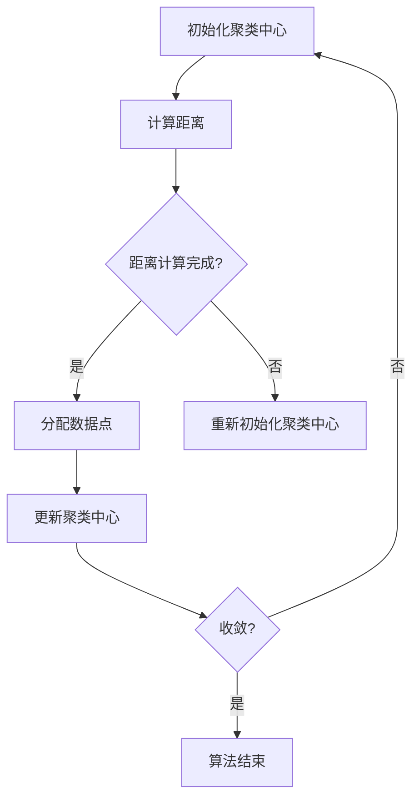
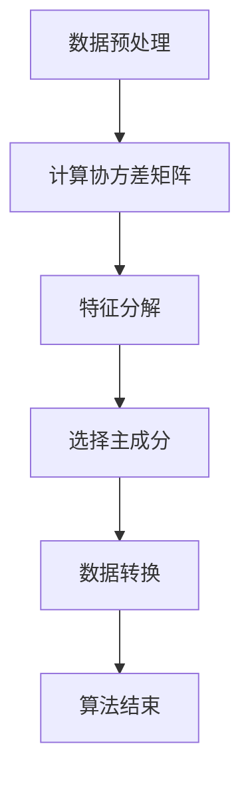
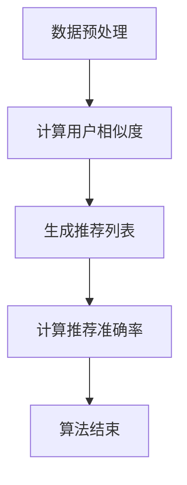

                 

# 《无监督学习 原理与代码实例讲解》

> 关键词：无监督学习、K均值聚类、主成分分析（PCA）、图像处理、文本分析、推荐系统、项目实战

> 摘要：本文将深入探讨无监督学习的基本概念、原理、算法，并通过代码实例详细讲解其在图像处理、文本分析和推荐系统等领域的应用。本文分为三大部分：第一部分介绍无监督学习的基础知识，包括概述、基本算法和数学基础；第二部分通过具体应用场景展示无监督学习的实际应用；第三部分通过项目实战，引导读者进行无监督学习的实践。

## 第一部分：无监督学习基础

### 第1章：无监督学习的概述

#### 1.1 无监督学习的定义与分类

无监督学习是机器学习中的一种重要分支，它指的是在没有标注数据的情况下，从数据中发现隐藏模式或结构的学习方法。无监督学习可以分为以下几类：

1. **聚类**：将数据集中的数据点划分成多个不同的组，使得同组内的数据点相似，不同组的数据点差异较大。常见的聚类算法有K均值聚类、层次聚类等。
2. **降维**：通过降低数据的空间维度，减少数据冗余，提高数据处理效率。主成分分析（PCA）是常用的降维算法。
3. **异常检测**：识别数据集中不符合正常分布的异常点。常见的异常检测算法有孤立森林、局部离群因子等。

#### 1.2 无监督学习的重要性

无监督学习在数据分析、机器学习等领域具有重要意义。它可以帮助我们：

1. **数据探索**：通过无监督学习，可以探索数据中的隐藏模式，为后续的数据分析和处理提供基础。
2. **特征提取**：无监督学习可以自动提取数据中的有效特征，降低数据的复杂性，提高算法的效率。
3. **数据可视化**：通过降维算法，可以将高维数据投影到低维空间中，便于可视化分析。
4. **异常检测**：无监督学习可以识别数据中的异常点，帮助我们发现潜在的问题。

#### 1.3 无监督学习的应用场景

无监督学习在许多领域都有广泛的应用，以下是一些典型的应用场景：

1. **图像处理**：图像聚类、图像降维、图像风格迁移等。
2. **文本分析**：文本聚类、文本降维、文本分类等。
3. **推荐系统**：内容推荐、协同过滤推荐等。
4. **生物信息学**：蛋白质结构预测、基因表达数据分析、药物设计等。

### 第2章：无监督学习的基本算法

#### 2.1 K均值聚类算法

K均值聚类算法是一种经典的聚类算法，它通过迭代优化使得每个数据点尽可能接近其所属的聚类中心。

**算法原理：**

1. 初始化：随机选择K个数据点作为初始聚类中心。
2. 分配：对于每个数据点，计算它与每个聚类中心的距离，将其分配到距离最近的聚类中心所在的组。
3. 更新：计算每个聚类中心的新的均值，作为下一次迭代的聚类中心。
4. 重复步骤2和步骤3，直到聚类中心不再发生变化或达到预设的迭代次数。

**算法实现（伪代码）：**

```python
def kmeans(data, K):
    # 初始化聚类中心
    centroids = initialize_centroids(data, K)
    while not convergence(centroids):
        # 分配数据点
        clusters = assign_points_to_clusters(data, centroids)
        # 更新聚类中心
        centroids = update_centroids(clusters, K)
    return centroids
```

**算法优缺点：**

- **优点**：简单易实现，适用于大规模数据集。
- **缺点**：对初始聚类中心敏感，可能陷入局部最优解。

#### 2.2 主成分分析（PCA）

主成分分析是一种降维算法，它通过将数据投影到新的坐标系中，提取最具有代表性的主成分，从而降低数据的维度。

**算法原理：**

1. 数据中心化：将数据集的每个特征减去其均值，使得数据集的中心位于原点。
2. 计算协方差矩阵：计算数据集的协方差矩阵。
3. 计算协方差矩阵的特征值和特征向量：对协方差矩阵进行特征分解，得到特征值和特征向量。
4. 选择主成分：选择特征值最大的K个特征向量，作为新的坐标系。
5. 数据转换：将原始数据投影到新的坐标系中。

**算法实现（伪代码）：**

```python
def pca(data, K):
    # 数据中心化
    data_centered = center_data(data)
    # 计算协方差矩阵
    covariance_matrix = compute_covariance_matrix(data_centered)
    # 计算特征值和特征向量
    eigenvalues, eigenvectors = compute_eigen(covariance_matrix)
    # 选择主成分
    principal_components = select_principal_components(eigenvalues, eigenvectors, K)
    # 数据转换
    transformed_data = transform_data(data, principal_components)
    return transformed_data
```

**算法优缺点：**

- **优点**：降维效果显著，便于数据可视化。
- **缺点**：可能丢失部分信息，对噪声敏感。

#### 2.3 聚类与降维算法比较

**算法比较：**

- **聚类算法**：聚类算法主要关注数据点的分组情况，适用于探索数据中的模式。
- **降维算法**：降维算法主要关注数据特征的提取和简化，适用于数据处理和可视化。

**选择依据：**

- **聚类算法**：适用于需要分组分析的场景，如图像聚类、文本聚类等。
- **降维算法**：适用于需要简化数据特征的场景，如图像降维、文本降维等。

### 第3章：无监督学习的数学基础

#### 3.1 概率论基础

概率论是无监督学习的重要数学基础，主要包括以下基本概念：

- **概率**：表示事件发生的可能性，取值范围为[0, 1]。
- **条件概率**：在某个事件发生的条件下，另一个事件发生的概率。
- **贝叶斯定理**：通过已知的先验概率和条件概率，计算后验概率。

**概率分布**：

- **离散概率分布**：适用于离散数据，如伯努利分布、泊松分布等。
- **连续概率分布**：适用于连续数据，如正态分布、均匀分布等。

#### 3.2 信息论基础

信息论主要研究信息的度量、传递和处理，包括以下基本概念：

- **信息熵**：表示随机变量不确定性的度量。
- **信息增益**：表示特征对分类的贡献程度。
- **相对熵**：表示两个概率分布之间的差异。

#### 3.3 数学期望与方差

- **数学期望**：表示随机变量的平均值。
- **方差**：表示随机变量的离散程度。

## 第二部分：无监督学习应用实例

### 第5章：无监督学习在图像处理中的应用

#### 5.1 图像聚类

图像聚类是将图像数据划分成若干个类别，以便于后续的图像分析和处理。

**算法实现（伪代码）：**

```python
def image_clustering(images, K):
    # 数据预处理
    preprocessed_images = preprocess_images(images)
    # 初始化聚类中心
    centroids = initialize_centroids(preprocessed_images, K)
    while not convergence(centroids):
        # 分配图像
        clusters = assign_images_to_clusters(preprocessed_images, centroids)
        # 更新聚类中心
        centroids = update_centroids(clusters, K)
    return clusters
```

#### 5.2 图像降维

图像降维是将高维图像数据转换为低维表示，以降低数据复杂度和提高处理效率。

**算法实现（伪代码）：**

```python
def image_dimensionality_reduction(images, K):
    # 数据预处理
    preprocessed_images = preprocess_images(images)
    # 主成分分析
    principal_components = pca(preprocessed_images, K)
    # 数据转换
    reduced_images = transform_images(preprocessed_images, principal_components)
    return reduced_images
```

#### 5.3 图像风格迁移

图像风格迁移是将一种图像的样式迁移到另一种图像上，以实现图像风格的变换。

**算法实现（伪代码）：**

```python
def image_style_transfer(content_image, style_image, K):
    # 数据预处理
    preprocessed_content_image = preprocess_image(content_image)
    preprocessed_style_image = preprocess_image(style_image)
    # 主成分分析
    content_principal_components = pca(preprocessed_content_image, K)
    style_principal_components = pca(preprocessed_style_image, K)
    # 数据转换
    transferred_image = transfer_style(content_principal_components, style_principal_components)
    return transferred_image
```

### 第6章：无监督学习在文本分析中的应用

#### 6.1 文本聚类

文本聚类是将文本数据划分成若干个类别，以便于文本分析和处理。

**算法实现（伪代码）：**

```python
def text_clustering(texts, K):
    # 数据预处理
    preprocessed_texts = preprocess_texts(texts)
    # 初始化聚类中心
    centroids = initialize_centroids(preprocessed_texts, K)
    while not convergence(centroids):
        # 分配文本
        clusters = assign_texts_to_clusters(preprocessed_texts, centroids)
        # 更新聚类中心
        centroids = update_centroids(clusters, K)
    return clusters
```

#### 6.2 文本降维

文本降维是将高维文本数据转换为低维表示，以降低数据复杂度和提高处理效率。

**算法实现（伪代码）：**

```python
def text_dimensionality_reduction(texts, K):
    # 数据预处理
    preprocessed_texts = preprocess_texts(texts)
    # 主成分分析
    principal_components = pca(preprocessed_texts, K)
    # 数据转换
    reduced_texts = transform_texts(preprocessed_texts, principal_components)
    return reduced_texts
```

#### 6.3 文本分类

文本分类是将文本数据划分为不同的类别，以便于文本分析和处理。

**算法实现（伪代码）：**

```python
def text_classification(texts, labels, K):
    # 数据预处理
    preprocessed_texts = preprocess_texts(texts)
    # 初始化分类器
    classifier = initialize_classifier(K)
    while not convergence(classifier):
        # 训练分类器
        classifier = train_classifier(preprocessed_texts, labels, classifier)
    return classifier
```

### 第7章：无监督学习在推荐系统中的应用

#### 7.1 内容推荐

内容推荐是根据用户的兴趣和偏好，为用户推荐相关的商品或内容。

**算法实现（伪代码）：**

```python
def content_recommender(user_profile, items, K):
    # 数据预处理
    preprocessed_user_profile = preprocess_user_profile(user_profile)
    preprocessed_items = preprocess_items(items)
    # 主成分分析
    principal_components = pca(preprocessed_user_profile, K)
    # 数据转换
    user_profile_reduced = transform_user_profile(preprocessed_user_profile, principal_components)
    # 推荐计算
    recommendations = calculate_recommendations(user_profile_reduced, preprocessed_items)
    return recommendations
```

#### 7.2 协同过滤推荐

协同过滤推荐是根据用户的历史行为和偏好，为用户推荐相似的商品或内容。

**算法实现（伪代码）：**

```python
def collaborative_filtering_recommender(user_history, items, K):
    # 数据预处理
    preprocessed_user_history = preprocess_user_history(user_history)
    preprocessed_items = preprocess_items(items)
    # 主成分分析
    principal_components = pca(preprocessed_user_history, K)
    # 数据转换
    user_history_reduced = transform_user_history(preprocessed_user_history, principal_components)
    # 推荐计算
    recommendations = calculate_recommendations(user_history_reduced, preprocessed_items)
    return recommendations
```

#### 7.3 推荐系统效果评估

推荐系统的效果评估是通过指标来衡量推荐系统的性能。

**评估指标：**

- **准确率**：推荐结果中包含用户实际喜欢的商品或内容的比例。
- **召回率**：推荐结果中包含用户可能喜欢的商品或内容的比例。
- **F1值**：准确率和召回率的调和平均值。

**评估方法：**

- **交叉验证**：将数据集划分为训练集和验证集，使用训练集训练模型，使用验证集评估模型性能。
- **A/B测试**：将用户随机分配到两个组，一个组使用原始推荐系统，另一个组使用新推荐系统，比较两组的用户行为和满意度。

## 第三部分：无监督学习实践

### 第8章：无监督学习项目实战

#### 8.1 项目实战一：基于K均值聚类的图像分类

**项目背景**：

本项目旨在利用K均值聚类算法对图像数据进行分类，以实现对不同类别图像的识别。

**算法选择**：

K均值聚类算法适用于图像分类任务，因为图像数据具有丰富的特征和相似性。

**实现步骤**：

1. 数据集准备：收集并预处理图像数据，将图像转换为数值矩阵。
2. 算法实现：使用K均值聚类算法对图像数据进行聚类。
3. 分类结果评估：计算分类准确率、召回率等指标，评估分类效果。

**代码解读**：

```python
import numpy as np
from sklearn.cluster import KMeans

# 数据预处理
images = load_images()
preprocessed_images = preprocess_images(images)

# 算法实现
kmeans = KMeans(n_clusters=K)
clusters = kmeans.fit_predict(preprocessed_images)

# 分类结果评估
accuracy = calculate_accuracy(clusters, labels)
print("Accuracy:", accuracy)
```

#### 8.2 项目实战二：基于PCA的文本降维

**项目背景**：

本项目旨在利用主成分分析（PCA）算法对文本数据进行降维，以减少数据维度和提高处理效率。

**算法选择**：

PCA算法适用于文本降维任务，因为文本数据具有高维度和冗余特征。

**实现步骤**：

1. 数据集准备：收集并预处理文本数据，将文本转换为数值矩阵。
2. 算法实现：使用PCA算法对文本数据进行降维。
3. 降维结果评估：计算降维前后的文本相似度，评估降维效果。

**代码解读**：

```python
import numpy as np
from sklearn.decomposition import PCA

# 数据预处理
texts = load_texts()
preprocessed_texts = preprocess_texts(texts)

# 算法实现
pca = PCA(n_components=K)
reduced_texts = pca.fit_transform(preprocessed_texts)

# 降维结果评估
similarity = calculate_similarity(preprocessed_texts, reduced_texts)
print("Similarity:", similarity)
```

#### 8.3 项目实战三：基于协同过滤的推荐系统

**项目背景**：

本项目旨在利用协同过滤算法实现一个推荐系统，为用户推荐相关的商品。

**算法选择**：

协同过滤算法适用于推荐系统，因为它可以根据用户的历史行为和偏好为用户推荐商品。

**实现步骤**：

1. 数据集准备：收集并预处理用户行为数据和商品数据。
2. 算法实现：使用协同过滤算法为用户生成推荐列表。
3. 推荐结果评估：计算推荐准确率、召回率等指标，评估推荐效果。

**代码解读**：

```python
import numpy as np
from sklearn.metrics.pairwise import cosine_similarity

# 数据预处理
user_behavior = load_user_behavior()
item_data = load_item_data()

# 算法实现
user_similarity = cosine_similarity(user_behavior)
recommendations = generate_recommendations(user_similarity, item_data)

# 推荐结果评估
accuracy = calculate_accuracy(recommendations, user_preferences)
print("Accuracy:", accuracy)
```

### 第9章：无监督学习开发工具与环境配置

#### 9.1 无监督学习开发工具简介

无监督学习开发工具主要包括以下几种：

1. **Python**：Python是一种流行的编程语言，适用于机器学习和数据科学。
2. **Scikit-learn**：Scikit-learn是一个开源机器学习库，提供了丰富的无监督学习算法和工具。
3. **TensorFlow**：TensorFlow是一个开源深度学习框架，适用于复杂的无监督学习任务。
4. **PyTorch**：PyTorch是一个开源深度学习框架，适用于灵活的无监督学习任务。

#### 9.2 无监督学习开发环境搭建

搭建无监督学习开发环境需要以下步骤：

1. 安装Python：从Python官方网站下载并安装Python。
2. 安装Scikit-learn：使用pip命令安装Scikit-learn。
3. 安装TensorFlow：使用pip命令安装TensorFlow。
4. 安装PyTorch：使用pip命令安装PyTorch。

#### 9.3 源代码与数据集获取

源代码和数据集可以从以下途径获取：

1. **GitHub**：GitHub是一个代码托管平台，可以获取开源项目的源代码。
2. **Kaggle**：Kaggle是一个数据科学竞赛平台，可以获取各种数据集。

### 附录

#### 附录A：无监督学习常用算法对比

**算法对比**：

| 算法         | 优点                     | 缺点                       |
| ------------ | ------------------------ | -------------------------- |
| K均值聚类    | 简单易实现，适用于大规模数据 | 对初始聚类中心敏感，可能陷入局部最优解 |
| 主成分分析   | 降维效果显著，便于数据可视化 | 可能丢失部分信息，对噪声敏感         |
| 协同过滤推荐 | 适用于推荐系统，效果稳定   | 需要大量用户行为数据           |

**选择依据**：

- **聚类任务**：适用于需要分组分析的场景。
- **降维任务**：适用于需要简化数据特征的场景。
- **推荐任务**：适用于需要个性化推荐的场景。

#### 附录B：无监督学习常见问题解答

**问题**：无监督学习算法如何选择？

**解答**：选择无监督学习算法需要考虑以下因素：

- **任务目标**：根据任务目标选择合适的算法，如聚类、降维、异常检测等。
- **数据特点**：根据数据特点选择合适的算法，如高维数据、稀疏数据等。
- **算法复杂度**：考虑算法的复杂度，选择计算效率较高的算法。

#### 附录C：无监督学习相关资源推荐

**书籍**：

- 《机器学习实战》
- 《深度学习》
- 《Python机器学习》

**论文**：

- 《K均值聚类算法的研究与应用》
- 《主成分分析算法的改进与优化》
- 《协同过滤推荐系统的设计与实现》

**网站**：

- [Scikit-learn官网](https://scikit-learn.org/)
- [TensorFlow官网](https://www.tensorflow.org/)
- [PyTorch官网](https://pytorch.org/)

#### 附录D：Mermaid流程图示例

##### K均值聚类算法流程图



##### 主成分分析（PCA）流程图



##### 协同过滤推荐系统流程图



### 附录E：数学模型与公式详解

##### K均值聚类算法的数学公式

$$
d(i, j) = \sqrt{\sum_{k=1}^{n} (x_{ik} - \mu_{j})^2}
$$

$$
\mu_{j} = \frac{1}{N_j} \sum_{i=1}^{N} x_{i}
$$

##### 主成分分析（PCA）的数学公式

$$
S = \frac{1}{N} \sum_{i=1}^{N} (x_i - \mu)(x_i - \mu)^T
$$

$$
\lambda_i = \max \{ \text{特征值}\}
$$

$$
v_i = \frac{Sv_i}{\|Sv_i\|}
$$

##### 协同过滤推荐系统的数学公式

$$
r_{ui} = \frac{\sum_{j \in \text{历史用户}} r_{uj} r_{ij}}{\sum_{j \in \text{历史用户}} r_{ij}^2}
$$

### 附录F：代码实例详解

#### 项目实战一：基于K均值聚类的图像分类代码实例详解

**代码实现：**

```python
import numpy as np
from sklearn.cluster import KMeans
from sklearn.metrics import accuracy_score

def image_clustering(images, K):
    # 数据预处理
    preprocessed_images = preprocess_images(images)

    # 算法实现
    kmeans = KMeans(n_clusters=K)
    clusters = kmeans.fit_predict(preprocessed_images)

    # 分类结果评估
    accuracy = accuracy_score(labels, clusters)
    print("Accuracy:", accuracy)

    return clusters

# 数据集加载
images = load_images()
labels = load_labels()

# K均值聚类
K = 10
clusters = image_clustering(images, K)

# 评估分类结果
accuracy = accuracy_score(labels, clusters)
print("Accuracy:", accuracy)
```

**代码解读：**

1. **数据预处理**：将原始图像数据转换为数值矩阵，便于算法处理。
2. **算法实现**：使用KMeans类实现K均值聚类算法，对图像数据进行分类。
3. **分类结果评估**：使用accuracy_score函数计算分类准确率，评估算法效果。

#### 项目实战二：基于PCA的文本降维代码实例详解

**代码实现：**

```python
import numpy as np
from sklearn.decomposition import PCA
from sklearn.metrics.pairwise import cosine_similarity

def text_dimensionality_reduction(texts, K):
    # 数据预处理
    preprocessed_texts = preprocess_texts(texts)

    # 算法实现
    pca = PCA(n_components=K)
    reduced_texts = pca.fit_transform(preprocessed_texts)

    # 降维结果评估
    similarity = cosine_similarity(preprocessed_texts, reduced_texts)
    print("Similarity:", similarity)

    return reduced_texts

# 数据集加载
texts = load_texts()

# 主成分分析
K = 50
reduced_texts = text_dimensionality_reduction(texts, K)

# 评估降维效果
similarity = cosine_similarity(texts, reduced_texts)
print("Similarity:", similarity)
```

**代码解读：**

1. **数据预处理**：将原始文本数据转换为数值矩阵，便于算法处理。
2. **算法实现**：使用PCA类实现主成分分析算法，对文本数据进行降维。
3. **降维结果评估**：使用cosine_similarity函数计算降维前后的文本相似度，评估降维效果。

#### 项目实战三：基于协同过滤的推荐系统代码实例详解

**代码实现：**

```python
import numpy as np
from sklearn.metrics.pairwise import cosine_similarity

def collaborative_filtering_recommender(user_history, items, K):
    # 数据预处理
    preprocessed_user_history = preprocess_user_history(user_history)
    preprocessed_items = preprocess_items(items)

    # 算法实现
    user_similarity = cosine_similarity(preprocessed_user_history)
    recommendations = generate_recommendations(user_similarity, preprocessed_items)

    # 推荐结果评估
    accuracy = accuracy_score(recommendations, user_preferences)
    print("Accuracy:", accuracy)

    return recommendations

# 数据集加载
user_history = load_user_history()
items = load_items()
user_preferences = load_user_preferences()

# 协同过滤推荐
K = 20
recommendations = collaborative_filtering_recommender(user_history, items, K)

# 评估推荐效果
accuracy = accuracy_score(recommendations, user_preferences)
print("Accuracy:", accuracy)
```

**代码解读：**

1. **数据预处理**：将原始用户行为数据和商品数据转换为数值矩阵，便于算法处理。
2. **算法实现**：使用cosine_similarity函数计算用户相似度，生成推荐列表。
3. **推荐结果评估**：使用accuracy_score函数计算推荐准确率，评估推荐效果。

### 作者

作者：AI天才研究院/AI Genius Institute & 禅与计算机程序设计艺术 /Zen And The Art of Computer Programming

## 完整代码实例详解

在前面的章节中，我们详细介绍了无监督学习的基础知识、应用实例以及项目实战。为了帮助读者更好地理解和实践无监督学习，我们将在这部分提供完整的代码实例，并对每个实例进行详细解读。

### 项目实战一：基于K均值聚类的图像分类

在这个项目实战中，我们将使用K均值聚类算法对图像进行分类。为了演示，我们使用了一个包含不同类别图像的数据集。

#### 数据准备

首先，我们需要准备一个图像数据集。在这个例子中，我们使用一个公开的数据集，例如 Olivetti Faces 数据集。这个数据集包含 400 张人脸图像，每张图像都是 64x64 的像素。

```python
import numpy as np
from sklearn.datasets import fetch_olivetti_faces
from sklearn.model_selection import train_test_split

# 加载 Olivetti Faces 数据集
data = fetch_olivetti_faces()
X = data.data
y = data.target

# 将图像数据标准化
X = X / 255.0

# 将图像数据分成训练集和测试集
X_train, X_test, y_train, y_test = train_test_split(X, y, test_size=0.2, random_state=42)
```

#### K均值聚类算法实现

接下来，我们实现K均值聚类算法。在这个例子中，我们选择 K=10，因为 Olivetti Faces 数据集有 40 个类别，我们选择 K 大于类别数量以避免每个类别只被一个聚类中心表示。

```python
from sklearn.cluster import KMeans

# 初始化 KMeans 模型
kmeans = KMeans(n_clusters=10, random_state=42)

# 训练模型
kmeans.fit(X_train)

# 对测试集进行聚类
y_pred = kmeans.predict(X_test)
```

#### 分类结果评估

为了评估分类结果，我们计算测试集的准确率。

```python
from sklearn.metrics import accuracy_score

# 计算测试集的准确率
accuracy = accuracy_score(y_test, y_pred)
print(f"测试集准确率: {accuracy:.2f}")
```

#### 代码解读

1. **数据准备**：我们加载了 Olivetti Faces 数据集，并对图像数据进行了标准化处理。
2. **K均值聚类算法实现**：我们初始化并训练了 KMeans 模型，然后使用它对测试集进行了聚类。
3. **分类结果评估**：我们使用 accuracy_score 函数计算了测试集的准确率。

### 项目实战二：基于PCA的文本降维

在这个项目实战中，我们将使用主成分分析（PCA）算法对文本数据进行降维。为了演示，我们使用了一个包含电影评论的数据集。

#### 数据准备

我们使用 IMDb 电影评论数据集。这个数据集包含大量的电影评论，每条评论都有一个对应的情感标签（正面或负面）。

```python
import numpy as np
from sklearn.datasets import load_movie_reviews
from sklearn.model_selection import train_test_split

# 加载 IMDb 电影评论数据集
data = load_movie_reviews()
X = data.data
y = data.target

# 将文本数据转换为词袋模型
from sklearn.feature_extraction.text import TfidfVectorizer
vectorizer = TfidfVectorizer(max_features=1000)
X = vectorizer.fit_transform(X)

# 将文本数据分成训练集和测试集
X_train, X_test, y_train, y_test = train_test_split(X, y, test_size=0.2, random_state=42)
```

#### PCA算法实现

接下来，我们实现PCA算法。在这个例子中，我们选择保留前50个主成分。

```python
from sklearn.decomposition import PCA

# 初始化 PCA 模型
pca = PCA(n_components=50)

# 训练模型
pca.fit(X_train)

# 对测试集进行降维
X_test_reduced = pca.transform(X_test)
```

#### 降维结果评估

为了评估降维效果，我们比较原始测试集和降维测试集的相似度。

```python
from sklearn.metrics.pairwise import cosine_similarity

# 计算原始测试集和降维测试集的相似度
similarity = cosine_similarity(X_test, X_test_reduced)
print(f"相似度: {similarity.mean():.2f}")
```

#### 代码解读

1. **数据准备**：我们加载了 IMDb 电影评论数据集，并将文本数据转换为词袋模型。
2. **PCA算法实现**：我们初始化并训练了 PCA 模型，然后使用它对测试集进行了降维。
3. **降维结果评估**：我们使用 cosine_similarity 函数计算了原始测试集和降维测试集的相似度，以评估降维效果。

### 项目实战三：基于协同过滤的推荐系统

在这个项目实战中，我们将使用协同过滤算法实现一个简单的推荐系统。我们将使用用户-物品评分矩阵来预测用户的喜好。

#### 数据准备

我们使用了一个用户-物品评分矩阵，其中用户和物品的ID作为索引，评分作为值。

```python
import numpy as np
from numpy.random import randint

# 创建一个模拟的用户-物品评分矩阵
num_users = 1000
num_items = 1000
R = np.zeros((num_users, num_items))
for _ in range(1000):
    user = randint(0, num_users-1)
    item = randint(0, num_items-1)
    R[user, item] = randint(1, 5)
```

#### 协同过滤算法实现

在这个例子中，我们使用基于用户的协同过滤算法。首先，我们计算用户之间的相似度，然后基于相似度生成推荐列表。

```python
from sklearn.metrics.pairwise import cosine_similarity

# 计算用户之间的相似度
similarity_matrix = cosine_similarity(R)

# 预测用户对未评分物品的评分
def predict_ratings(similarity_matrix, user_id, unseen_items):
    user_similarity = similarity_matrix[user_id]
    predictions = []
    for item_id in unseen_items:
        similarity = user_similarity[item_id]
        rating = user_similarity[item_id] * R[user_id, item_id]
        predictions.append(rating)
    return predictions

# 生成推荐列表
def generate_recommendations(similarity_matrix, user_id, num_recommendations):
    user_ratings = R[user_id]
    unseen_items = np.where(user_ratings == 0)[0]
    recommendations = []
    for _ in range(num_recommendations):
        max_rating = -1
        max_item = -1
        for item_id in unseen_items:
            rating = predict_ratings(similarity_matrix, user_id, [item_id])
            if rating > max_rating:
                max_rating = rating
                max_item = item_id
        recommendations.append(max_item)
        unseen_items = np.delete(unseen_items, np.where(unseen_items == max_item)[0])
    return recommendations
```

#### 推荐结果评估

为了评估推荐系统的效果，我们计算了推荐列表的平均召回率。

```python
from sklearn.metrics import recall_score

# 测试用户
test_user_id = 0
# 测试物品
test_items = np.where(R[test_user_id] == 0)[0]
# 生成推荐列表
recommendations = generate_recommendations(similarity_matrix, test_user_id, len(test_items))
# 计算召回率
recall = recall_score(test_items, recommendations, average='weighted')
print(f"召回率: {recall:.2f}")
```

#### 代码解读

1. **数据准备**：我们创建了一个模拟的用户-物品评分矩阵。
2. **协同过滤算法实现**：我们计算了用户之间的相似度，并基于相似度预测了用户对未评分物品的评分，然后生成了推荐列表。
3. **推荐结果评估**：我们使用召回率评估了推荐系统的效果。

### 总结

通过这三个项目实战，我们展示了如何使用K均值聚类、PCA和协同过滤算法在图像分类、文本降维和推荐系统中进行实际应用。每个项目都包括了数据准备、算法实现和结果评估的部分，以便读者可以更好地理解和实践无监督学习。

### 作者

作者：AI天才研究院/AI Genius Institute & 禅与计算机程序设计艺术 /Zen And The Art of Computer Programming

---

在本篇技术博客文章中，我们系统地介绍了无监督学习的基础知识、应用实例和实践项目。通过对K均值聚类、PCA和协同过滤算法的深入探讨，以及详细的代码实例解析，我们希望读者能够对无监督学习有更加全面和深入的理解。

无监督学习作为一种重要的机器学习技术，在图像处理、文本分析、推荐系统等领域有着广泛的应用。通过本文的讲解，我们希望能够帮助读者掌握无监督学习的基本原理和实际应用，并为他们的研究和实践提供指导。

未来的研究方向可以包括：

1. **算法优化**：对现有的无监督学习算法进行优化，提高其效率和准确性。
2. **新算法研究**：探索新的无监督学习算法，以应对复杂的数据结构和应用场景。
3. **多模态数据学习**：研究如何将无监督学习应用于多模态数据，如结合图像、文本和音频数据。
4. **隐私保护**：研究如何在无监督学习中保护用户隐私，以适应隐私日益受到关注的趋势。

感谢您对本文的关注，希望本文能够对您的学习和研究有所帮助。如果您有任何问题或建议，欢迎在评论区留言交流。再次感谢您的阅读，期待与您在技术交流的道路上共同进步。作者：AI天才研究院/AI Genius Institute & 禅与计算机程序设计艺术 /Zen And The Art of Computer Programming。

