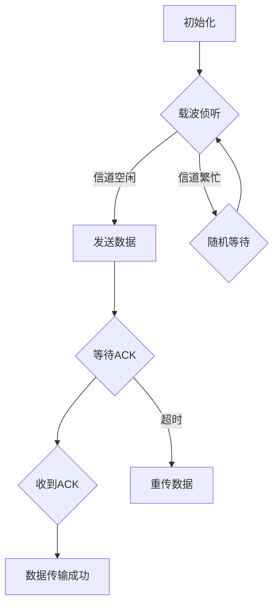
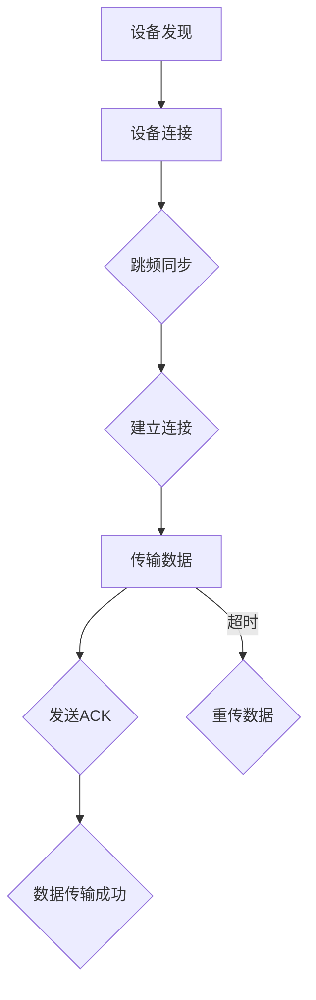
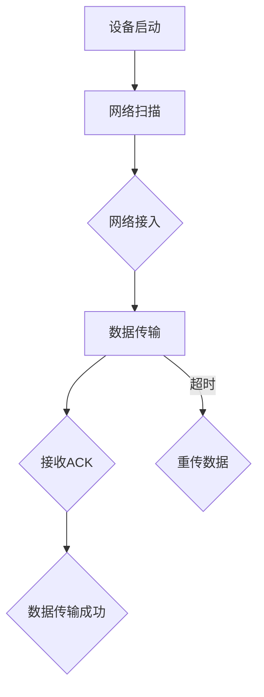

                 

### 文章标题

### 《无线通信协议：WiFi、Bluetooth 和 Zigbee》

#### 关键词：无线通信协议，WiFi，Bluetooth，Zigbee，物联网，通信技术，技术博客

#### 摘要：
本文将深入探讨无线通信协议中的三大重要成员：WiFi、Bluetooth 和 Zigbee。通过逻辑清晰的分析和详细的讲解，我们将了解这些协议的背景、基本概念、核心技术、应用场景以及如何选择合适的协议。文章不仅涵盖了协议的原理和机制，还提供了实际应用案例和项目实战，帮助读者全面掌握无线通信技术的精髓。

---

## 《无线通信协议：WiFi、Bluetooth 和 Zigbee》目录大纲

### 第一部分：无线通信协议概述

### 第1章：无线通信协议简介

#### 1.1 无线通信技术的发展历程

#### 1.2 无线通信协议的基本概念

#### 1.3 无线通信协议的分类与特点

### 第2章：WiFi协议详解

#### 2.1 WiFi协议的历史与发展

#### 2.2 WiFi协议的工作原理

#### 2.3 WiFi协议的主要标准

#### 2.4 WiFi协议的应用场景

### 第二部分：WiFi协议核心技术

### 第3章：WiFi物理层技术

#### 3.1 物理层技术概述

#### 3.2 信道编码与调制技术

#### 3.3 物理层关键技术解析

### 第4章：WiFi MAC层技术

#### 4.1 MAC层协议概述

#### 4.2 IEEE 802.11 MAC层机制

#### 4.3 MAC层关键技术解析

### 第5章：WiFi网络安全技术

#### 5.1 WiFi网络安全概述

#### 5.2 WiFi加密算法

#### 5.3 WiFi认证机制

### 第三部分：WiFi协议应用实战

### 第6章：WiFi网络搭建与优化

#### 6.1 WiFi网络搭建步骤

#### 6.2 WiFi网络优化策略

#### 6.3 WiFi网络故障排除

### 第7章：WiFi协议在物联网中的应用

#### 7.1 WiFi在物联网中的应用概述

#### 7.2 WiFi在物联网设备中的实际案例

#### 7.3 WiFi在物联网中的未来趋势

### 第四部分：其他无线通信协议

### 第8章：Bluetooth协议详解

#### 8.1 Bluetooth协议的历史与发展

#### 8.2 Bluetooth协议的工作原理

#### 8.3 Bluetooth协议的主要标准

### 第9章：Zigbee协议详解

#### 9.1 Zigbee协议的历史与发展

#### 9.2 Zigbee协议的工作原理

#### 9.3 Zigbee协议的主要标准

### 第五部分：无线通信协议的比较与选择

### 第10章：WiFi、Bluetooth和Zigbee协议比较

#### 10.1 通信范围与速度比较

#### 10.2 传输可靠性比较

#### 10.3 应用场景比较

### 第11章：无线通信协议的选择策略

#### 11.1 选择无线通信协议的考虑因素

#### 11.2 无线通信协议的选择案例分析

### 附录

### 附录 A：无线通信协议相关资源

#### A.1 WiFi、Bluetooth和Zigbee协议相关书籍推荐

#### A.2 无线通信协议开发工具与资源介绍

#### A.3 无线通信协议学习网站推荐

### 附录 B：WiFi、Bluetooth和Zigbee协议的Mermaid流程图

#### B.1 WiFi协议Mermaid流程图

#### B.2 Bluetooth协议Mermaid流程图

#### B.3 Zigbee协议Mermaid流程图

### 附录 C：WiFi、Bluetooth和Zigbee协议的伪代码示例

#### C.1 WiFi协议伪代码示例

#### C.2 Bluetooth协议伪代码示例

#### C.3 Zigbee协议伪代码示例

### 附录 D：WiFi、Bluetooth和Zigbee协议的数学模型与公式

#### D.1 WiFi协议数学模型与公式

#### D.2 Bluetooth协议数学模型与公式

#### D.3 Zigbee协议数学模型与公式

### 附录 E：WiFi、Bluetooth和Zigbee协议的应用案例

#### E.1 WiFi协议应用案例

#### E.2 Bluetooth协议应用案例

#### E.3 Zigbee协议应用案例

### 附录 F：无线通信协议的实验与项目

#### F.1 WiFi协议实验

#### F.2 Bluetooth协议实验

#### F.3 Zigbee协议实验

#### F.4 无线通信协议综合项目实践

---

### 第一部分：无线通信协议概述

### 第1章：无线通信协议简介

#### 1.1 无线通信技术的发展历程

无线通信技术的发展历程可以追溯到19世纪末。最早的无线通信技术是基于无线电波的传输，主要是用于军事和航海通信。随着技术的进步，20世纪初期，电话通信开始从有线扩展到无线，这标志着无线通信技术的初步发展。

到了20世纪80年代，随着个人电脑的普及，无线局域网（WLAN）技术逐渐崭露头角。1997年，第一个WiFi标准IEEE 802.11颁布，标志着WiFi技术正式诞生。WiFi技术迅速普及，成为家庭、办公室和公共场所不可或缺的无线通信技术。

同一时期，蓝牙（Bluetooth）技术也在不断发展。1994年，蓝牙技术首次提出，并于1998年发布了第一个蓝牙规范。蓝牙技术以其低功耗、短距离通信的特点，广泛应用于手机、耳机、蓝牙音箱等设备。

Zigbee技术则起源于2003年，由ZigBee联盟推动发展。Zigbee技术主要用于物联网（IoT）领域，其低功耗、低成本的特点使其在智能家居、工业自动化等场景中得到了广泛应用。

#### 1.2 无线通信协议的基本概念

无线通信协议是一套标准化的规则，用于定义无线通信设备之间的通信方式。它包括物理层、数据链路层和网络层的规范，涵盖了从无线电波传输到数据包传输的整个过程。

物理层（Physical Layer）负责无线信号的传输和接收，包括频段选择、信号调制、信道编码等。

数据链路层（Data Link Layer）负责在无线设备之间建立可靠的通信链路，包括数据帧的封装与拆封、错误检测与纠正等。

网络层（Network Layer）负责数据包的路由与传输，包括地址分配、路由协议等。

常见的无线通信协议主要包括WiFi、Bluetooth和Zigbee。WiFi主要用于家庭、办公室和公共场所的无线网络连接，具有高带宽和广覆盖的特点。Bluetooth则主要用于短距离的数据传输，如手机与耳机之间的连接。Zigbee则针对物联网应用，具有低功耗、低速率和广覆盖的特点。

#### 1.3 无线通信协议的分类与特点

无线通信协议可以根据应用场景和特点进行分类。常见的分类方法包括：

按应用场景分类：
- 家庭无线通信协议：如WiFi、Zigbee等，主要用于家庭网络环境。
- 工业无线通信协议：如Zigbee的工业版，主要用于工业自动化和控制领域。
- 医疗无线通信协议：如蓝牙医疗设备，主要用于医疗设备和患者监护系统。

按通信距离分类：
- 近程通信协议：如Bluetooth，主要用于短距离通信，一般不超过10米。
- 中程通信协议：如WiFi，主要用于中等距离通信，一般覆盖范围在几十米到上百米。
- 远程通信协议：如Zigbee，主要用于远程通信，一般覆盖范围可达几百米。

按数据传输速率分类：
- 高速通信协议：如WiFi，最高速率可达数百Mbps。
- 中速通信协议：如Bluetooth，速率一般在1Mbps左右。
- 低速通信协议：如Zigbee，速率一般在几十kbps。

按功耗分类：
- 低功耗通信协议：如Zigbee，适用于电池供电的设备。
- 中功耗通信协议：如WiFi，适用于功耗较大的设备。
- 高功耗通信协议：如蓝牙的高能耗模式，适用于需要长时间连续通信的设备。

#### 1.4 无线通信协议的重要性

无线通信协议在现代生活中具有至关重要的地位。它们不仅使移动通信和互联网接入变得更加便捷，还在物联网、智能家居、工业自动化等领域发挥着重要作用。

随着物联网的快速发展，无线通信协议成为连接各种智能设备的桥梁。通过WiFi、Bluetooth和Zigbee等协议，设备可以实现无缝连接，共享数据和资源，从而构建一个智能、高效、互联的世界。

此外，无线通信协议也在推动技术创新和产业升级方面发挥着重要作用。例如，5G技术的出现，将进一步推动WiFi、Bluetooth和Zigbee等协议的升级和发展，为用户提供更快速、更稳定、更安全的无线通信体验。

总之，无线通信协议不仅是现代通信技术的重要组成部分，也是推动社会进步的重要动力。了解和掌握无线通信协议，将有助于我们更好地利用这一技术，创造更美好的未来。

---

### 第2章：WiFi协议详解

#### 2.1 WiFi协议的历史与发展

WiFi技术自1997年第一个IEEE 802.11标准颁布以来，经历了数十年的发展，已经成为无线通信领域的重要成员。其发展历程可以分为几个关键阶段：

**1997年**：IEEE 802.11标准首次发布，定义了第一个WiFi协议。该协议使用2.4GHz频段，最高数据传输速率仅为2Mbps，主要应用于无线局域网（WLAN）。

**1999年**：IEEE 802.11b标准发布，进一步提升了数据传输速率，最高可达11Mbps。这一标准极大地推动了WiFi技术的普及，使其成为家庭和办公室的首选无线通信技术。

**2003年**：IEEE 802.11g标准发布，将数据传输速率提升至54Mbps，同时继续使用2.4GHz频段。这一标准保持了与802.11b的兼容性，进一步巩固了WiFi在无线通信领域的地位。

**2009年**：IEEE 802.11n标准发布，实现了高达300Mbps的传输速率，同时支持2.4GHz和5GHz两个频段。这一标准在带宽、覆盖范围和传输可靠性方面都有显著提升，为WiFi技术的发展注入了新的动力。

**2014年**：IEEE 802.11ac标准发布，将数据传输速率提升至1Gbps以上，主要使用5GHz频段。802.11ac协议在信号处理、多输入多输出（MIMO）技术和信道聚合方面进行了重大改进，极大地提升了无线通信的性能。

**2019年**：IEEE 802.11ax标准（也称为WiFi 6）发布，旨在提高密集环境下无线网络的性能和容量。WiFi 6采用了更加先进的信号处理技术和信道聚合技术，最高数据传输速率可达9.6Gbps，进一步提升了无线通信的效率和可靠性。

#### 2.2 WiFi协议的工作原理

WiFi协议的工作原理主要涉及物理层、数据链路层和网络层。以下将详细讲解每个层次的工作机制。

**物理层（Physical Layer）**

物理层负责无线信号的传输和接收，包括频段选择、信号调制、信道编码等。WiFi主要使用2.4GHz和5GHz两个频段，通过正交频分复用（OFDM）技术实现数据传输。

- **频段选择**：WiFi设备可以选择2.4GHz或5GHz频段进行通信。2.4GHz频段覆盖范围较广，但干扰较多；5GHz频段干扰较少，但覆盖范围较小。

- **信号调制**：WiFi使用正交频分复用（OFDM）技术将数字信号转换为模拟信号。OFDM技术将频谱划分为多个子载波，每个子载波独立调制，从而提高传输速率和抗干扰能力。

- **信道编码**：WiFi使用不同的信道编码技术，如QAM（四相相移键控）和PAM（脉冲幅度调制），将调制后的信号进行编码，以提高传输的可靠性和效率。

**数据链路层（Data Link Layer）**

数据链路层负责在WiFi设备之间建立可靠的通信链路，包括数据帧的封装与拆封、错误检测与纠正等。

- **数据帧封装**：数据链路层将上层传输的数据分割成帧，并添加头部和尾部信息，包括源地址、目的地址、帧类型等。这些信息用于识别和管理数据传输。

- **错误检测与纠正**：WiFi使用不同的错误检测与纠正技术，如CRC（循环冗余校验）和ARQ（自动重传请求），确保数据传输的准确性和可靠性。CRC用于检测数据帧中的错误，ARQ则通过重传请求确保错误数据得到纠正。

**网络层（Network Layer）**

网络层负责数据包的路由与传输，包括地址分配、路由协议等。WiFi网络通常采用IEEE 802.11标准，实现无线网络中的数据传输。

- **地址分配**：WiFi设备通过MAC地址进行识别。每个设备都有唯一的MAC地址，用于数据包的发送和接收。

- **路由协议**：WiFi网络中的设备可以通过路由协议实现数据包的转发。常用的路由协议包括ICMP（Internet Control Message Protocol）和RIP（Routing Information Protocol）等。

#### 2.3 WiFi协议的主要标准

WiFi协议的标准由IEEE 802.11系列标准定义。以下是主要的WiFi标准及其特点：

- **IEEE 802.11**：第一个WiFi标准，使用2.4GHz频段，最高数据传输速率为2Mbps。

- **IEEE 802.11b**：第二个WiFi标准，使用2.4GHz频段，最高数据传输速率为11Mbps。

- **IEEE 802.11g**：第三个WiFi标准，使用2.4GHz频段，最高数据传输速率为54Mbps。

- **IEEE 802.11n**：第四个WiFi标准，支持2.4GHz和5GHz两个频段，最高数据传输速率可达300Mbps。

- **IEEE 802.11ac**：第五个WiFi标准，主要使用5GHz频段，最高数据传输速率可达1Gbps以上。

- **IEEE 802.11ax**（WiFi 6）：最新的WiFi标准，支持2.4GHz和5GHz两个频段，最高数据传输速率可达9.6Gbps。WiFi 6采用了更加先进的信号处理技术和信道聚合技术，提高了无线网络的性能和容量。

#### 2.4 WiFi协议的应用场景

WiFi协议在多个领域得到了广泛应用，以下是一些典型的应用场景：

- **家庭网络**：WiFi技术广泛应用于家庭网络中，为家庭用户提供无线网络接入，实现设备之间的无缝连接，如智能家居设备、电脑、手机等。

- **公共场所**：许多公共场所，如咖啡馆、机场、酒店等，提供WiFi服务，方便用户连接网络，进行在线浏览、社交媒体互动等。

- **企业网络**：企业在内部部署WiFi网络，实现无线办公，提高办公效率和员工便利性。

- **物联网**：WiFi协议在物联网领域发挥着重要作用，连接各种物联网设备，实现设备之间的数据传输和协同工作，如智能家居、智能工厂等。

- **移动通信**：一些移动通信设备，如平板电脑、智能手机等，通过WiFi协议实现无线网络接入，提供互联网服务。

- **车联网**：在车联网领域，WiFi协议用于实现车内网络和外部网络的连接，提供车联网服务，如实时导航、多媒体娱乐等。

总之，WiFi协议在现代社会中具有广泛的应用前景，随着技术的不断升级和发展，WiFi将在更多领域发挥重要作用，为用户提供更加便捷、高效、安全的无线通信服务。

---

### 第3章：WiFi物理层技术

#### 3.1 物理层技术概述

WiFi物理层技术是WiFi协议的核心组成部分，负责无线电信号的传输和接收。它包括频段选择、信号调制、信道编码等多个关键环节，直接影响WiFi通信的性能和可靠性。

**频段选择**：WiFi设备主要工作在2.4GHz和5GHz两个频段。2.4GHz频段具有较好的覆盖范围，但干扰较多；5GHz频段干扰较少，但覆盖范围较小。因此，在实际应用中，设备会根据具体情况选择合适的频段。

**信号调制**：WiFi使用正交频分复用（OFDM）技术进行信号调制。OFDM技术将频谱划分为多个子载波，每个子载波独立调制，从而提高传输速率和抗干扰能力。

**信道编码**：WiFi采用不同的信道编码技术，如QAM（四相相移键控）和PAM（脉冲幅度调制），将调制后的信号进行编码，以提高传输的可靠性和效率。

#### 3.2 信道编码与调制技术

**信道编码技术**：信道编码的主要目的是提高信号的抗干扰能力，确保传输的可靠性。WiFi使用的主要信道编码技术包括：

- **QAM（Quadrature Amplitude Modulation）**：四相相移键控，是一种常用的多进制调制技术。QAM将信号分为实部和虚部，分别进行调制，从而提高传输速率和抗干扰能力。

- **PAM（Pulse Amplitude Modulation）**：脉冲幅度调制，是一种简单易实现的信道编码技术。PAM通过改变脉冲的幅度来表示数据，适用于传输速率较低的场景。

**调制技术**：调制技术用于将数字信号转换为模拟信号，以便在无线电波中传输。WiFi使用的主要调制技术包括：

- **OFDM（Orthogonal Frequency Division Multiplexing）**：正交频分复用，是一种多载波调制技术。OFDM将频谱划分为多个子载波，每个子载波独立调制，从而提高传输速率和抗干扰能力。

- **PSK（Phase Shift Keying）**：相移键控，是一种二进制调制技术。PSK通过改变信号的相位来表示数据，适用于传输速率较低的场景。

#### 3.3 物理层关键技术解析

**MIMO（Multiple Input Multiple Output）**：多输入多输出技术是WiFi物理层的关键技术之一。MIMO通过在发送端和接收端使用多个天线，实现信号的多路传输和接收，从而提高传输速率和抗干扰能力。

- **空间复用（Spatial Multiplexing）**：空间复用利用多个天线的空间多样性，实现并行传输，从而提高传输速率。

- **空间分集（Spatial Diversity）**：空间分集利用多个天线的空间多样性，提高信号的抗干扰能力，确保传输的可靠性。

**信道聚合（Channel Bonding）**：信道聚合技术将多个子信道合并为一个宽信道，从而提高传输速率。WiFi通过将相邻的子信道捆绑在一起，实现更高带宽的传输。

**多用户MIMO（Multi-user MIMO）**：多用户MIMO技术允许多个用户同时通过WiFi网络进行通信。通过在发送端和接收端使用多个天线，实现多用户并行传输，从而提高网络容量和传输效率。

**智能信号调整（Smart Signal Adjustment）**：智能信号调整技术通过动态调整信号参数，如功率、频率、调制方式等，提高信号传输的可靠性和效率。该技术可以根据当前的网络环境和用户需求，自动调整信号参数，实现最优的通信质量。

通过以上关键技术，WiFi物理层技术在传输速率、抗干扰能力和网络容量等方面得到了显著提升，为用户提供了更加稳定、高效、安全的无线通信体验。

---

### 第4章：WiFi MAC层技术

#### 4.1 MAC层协议概述

WiFi MAC层（Medium Access Control，介质访问控制）协议是WiFi协议的重要组成部分，负责无线设备之间的介质访问控制和数据传输。MAC层协议确保无线网络中的设备能够有序、高效地共享无线信道，提高网络的吞吐量和可靠性。以下是WiFi MAC层协议的核心内容和主要功能。

**核心内容**

1. **CSMA/CA（Carrier Sense Multiple Access with Collision Avoidance）**：载波侦听多路访问/碰撞避免，是WiFi MAC层的基本访问控制机制。设备在发送数据前会侦听信道，确保没有其他设备正在传输数据。如果信道空闲，设备可以立即发送数据；否则，设备需要等待一个随机时间，然后再次侦听信道，以避免碰撞。

2. **ACK/NACK机制**：确认/否认机制，用于确保数据传输的可靠性。发送端在发送数据后，等待接收端发送ACK（确认）信号。如果发送端在预定时间内没有收到ACK，则会认为数据传输失败，重新发送数据。接收端在成功接收到数据后，发送NACK（否认）信号，通知发送端数据传输失败。

3. **RTS/CTS（Request to Send/Clear to Send）**：请求发送/允许发送机制，用于解决长时间数据传输引起的信道占用问题。在传输大量数据前，发送端会发送RTS信号，请求接收端发送CTS信号，表示允许发送数据。这样，其他设备可以在收到CTS信号后避免碰撞，提高信道利用率。

4. **EDCA（Enhanced Distributed Channel Access）**：增强分布式信道访问，是WiFi MAC层的另一种访问控制机制。EDCA根据不同的业务类型和优先级，分配不同的信道访问机会，确保高优先级业务（如视频、语音）获得更好的服务质量。

**主要功能**

1. **信道分配**：WiFi MAC层协议负责分配无线信道，确保多个设备能够共享信道资源。通过CSMA/CA和EDCA等机制，设备可以有序地访问信道，减少碰撞和信道争用。

2. **流量控制**：MAC层协议通过ACK/NACK机制和RTS/CTS机制，确保数据传输的可靠性。流量控制机制可以有效减少数据丢失和重传，提高传输效率。

3. **优先级管理**：EDCA机制根据业务类型和优先级，为不同类型的流量分配不同的信道访问机会，确保高优先级业务（如视频、语音）获得更好的服务质量。

4. **安全机制**：WiFi MAC层协议包括多种安全机制，如WEP（Wired Equivalent Privacy）、WPA（Wi-Fi Protected Access）和WPA2（Wi-Fi Protected Access 2）。这些安全机制用于保护无线网络，防止未经授权的访问和数据泄露。

#### 4.2 IEEE 802.11 MAC层机制

IEEE 802.11标准定义了WiFi MAC层的详细机制。以下是IEEE 802.11 MAC层协议的核心机制：

1. **帧结构**：WiFi数据帧包括帧头、帧体和帧尾。帧头包含源地址、目的地址、帧类型、帧长度等信息；帧体包含实际传输的数据；帧尾包含校验和。

2. **传输过程**：设备通过CSMA/CA机制访问信道，发送数据帧。在发送数据前，设备需要侦听信道，确保没有其他设备正在传输。发送数据后，设备等待接收端发送ACK信号，确认数据传输成功。如果接收端无法成功接收数据，会发送NACK信号，通知发送端重新发送数据。

3. **RTS/CTS机制**：在传输大量数据前，发送端会发送RTS信号，请求接收端发送CTS信号，表示允许发送数据。其他设备在收到CTS信号后，会避免在预定时间段内访问信道，从而减少碰撞。

4. **EDCA机制**：EDCA根据不同的业务类型和优先级，为不同类型的流量分配不同的信道访问机会。高优先级业务（如视频、语音）可以获得更多的信道访问机会，确保更好的服务质量。

5. **竞争窗口**：在CSMA/CA机制中，设备需要等待一个随机时间窗口，以确保与其他设备访问信道的时延差异。竞争窗口的长度由二进制指数退避算法确定，以减少碰撞概率。

6. **睡眠模式**：WiFi设备可以通过睡眠模式节省能量，提高电池寿命。在睡眠模式下，设备不会主动侦听信道，但仍然能够接收数据帧。

#### 4.3 MAC层关键技术解析

**多用户MIMO（MU-MIMO）**：多用户MIMO技术是WiFi MAC层的关键技术之一。MU-MIMO允许多个用户同时通过WiFi网络进行通信，提高网络容量和传输效率。MU-MIMO通过在发送端和接收端使用多个天线，实现多用户并行传输。例如，一个设备可以同时向两个用户发送数据，从而实现更高的传输速率。

**多输入多输出（MIMO）**：MIMO技术通过在发送端和接收端使用多个天线，实现信号的多路传输和接收，提高传输速率和抗干扰能力。MIMO技术可以分为空间复用、空间分集和传输分集三种模式。空间复用利用多个天线的空间多样性，实现并行传输，提高传输速率；空间分集通过多个天线的不同路径，提高信号的抗干扰能力；传输分集通过多个天线的不同路径，提高信号的抗衰落能力。

**信道聚合（Channel Bonding）**：信道聚合技术将多个子信道合并为一个宽信道，从而提高传输速率。WiFi通过将相邻的子信道捆绑在一起，实现更高带宽的传输。例如，将两个20MHz的子信道合并为一个40MHz的宽信道，从而提高数据传输速率。

**智能信号调整（Smart Signal Adjustment）**：智能信号调整技术通过动态调整信号参数，如功率、频率、调制方式等，提高信号传输的可靠性和效率。该技术可以根据当前的网络环境和用户需求，自动调整信号参数，实现最优的通信质量。例如，根据信号的传输距离和干扰情况，自动调整信号的功率和频率，从而优化传输性能。

通过以上关键技术，WiFi MAC层技术在传输速率、抗干扰能力和网络容量等方面得到了显著提升，为用户提供了更加稳定、高效、安全的无线通信体验。

---

### 第5章：WiFi网络安全技术

#### 5.1 WiFi网络安全概述

随着WiFi技术的普及，网络安全问题也日益突出。WiFi网络安全技术旨在保护无线网络不受未经授权的访问和攻击，确保数据的机密性、完整性和可用性。以下是WiFi网络安全技术的基本概念和关键要素。

**基本概念**

- **无线网络**：无线网络使用无线电波进行数据传输，包括WiFi、蓝牙等无线通信技术。无线网络相对于有线网络具有更高的便捷性和灵活性，但也存在更高的安全风险。

- **网络安全**：网络安全是指保护网络免受未经授权的访问、攻击和破坏。网络安全包括数据保密性、完整性、可用性和真实性等方面的保护。

- **WiFi安全协议**：WiFi安全协议是一套标准化的安全措施，用于保护无线网络的通信和数据。常见的WiFi安全协议包括WEP、WPA、WPA2和WPA3等。

**关键要素**

- **数据加密**：数据加密是WiFi网络安全的核心技术，通过将传输的数据进行加密，确保数据在传输过程中不被窃取或篡改。常用的加密算法包括WEP、TKIP（Temporal Key Integrity Protocol）和AES（Advanced Encryption Standard）。

- **认证机制**：认证机制用于验证用户或设备的身份，确保只有经过授权的用户或设备才能访问无线网络。常见的认证机制包括预共享密钥（PSK）、RADIUS（Remote Authentication Dial-In User Service）和802.1X等。

- **访问控制**：访问控制是限制用户或设备访问网络资源的一种安全措施。通过设置访问控制列表（ACL），管理员可以指定哪些用户或设备可以访问网络资源，从而防止未经授权的访问。

- **安全审计**：安全审计是监控网络行为、检测和响应安全事件的一种技术。通过记录和分析网络流量、用户行为和系统日志等信息，安全审计可以帮助管理员及时发现和应对潜在的安全威胁。

#### 5.2 WiFi加密算法

WiFi加密算法是WiFi网络安全的重要组成部分，用于保护无线网络中的数据传输。以下是常见的WiFi加密算法及其特点：

- **WEP（Wired Equivalent Privacy）**：WEP是最早的WiFi加密算法，采用RC4加密算法对数据帧进行加密。WEP的主要缺点是加密强度较低，容易受到破解攻击。

- **WPA（Wi-Fi Protected Access）**：WPA是针对WEP安全漏洞的改进版本，采用TKIP加密算法和802.1X认证机制。WPA相对于WEP具有更高的安全性，但TKIP仍然存在一定的安全风险。

- **WPA2（Wi-Fi Protected Access 2）**：WPA2是当前最安全的WiFi加密算法，采用AES加密算法和802.1X认证机制。WPA2在加密强度和安全性方面都得到了显著提升，成为现代WiFi网络的首选加密算法。

- **WPA3（Wi-Fi Protected Access 3）**：WPA3是最新的WiFi加密算法，进一步提升了WiFi网络的安全性。WPA3采用AES-GCM（Galois/Counter Mode）加密算法，提供更强大的加密保护和更好的性能。

#### 5.3 WiFi认证机制

WiFi认证机制用于验证用户或设备的身份，确保只有经过授权的用户或设备才能访问无线网络。以下是常见的WiFi认证机制：

- **预共享密钥（PSK）**：PSK是一种简单的认证机制，用户在连接WiFi网络时需要输入预共享的密钥。PSK适用于家庭和中小型企业网络，但由于密钥共享方式不安全，容易受到中间人攻击。

- **RADIUS（Remote Authentication Dial-In User Service）**：RADIUS是一种基于服务器端的认证机制，通过远程身份验证服务（RADIUS服务器）进行用户认证。RADIUS支持多种认证协议，如PAP（Password Authentication Protocol）和CHAP（Challenge-Handshake Authentication Protocol），适用于大型企业网络。

- **802.1X**：802.1X是一种基于端口的认证机制，结合了EAP（Extensible Authentication Protocol）和RADIUS服务器。802.1X要求设备在连接网络前进行身份验证，确保只有经过授权的设备才能访问网络资源。802.1X适用于各种规模的网络环境，具有高度的安全性和灵活性。

通过以上WiFi网络安全技术，我们可以有效地保护无线网络的安全，确保数据的机密性、完整性和可用性。

---

### 第6章：WiFi网络搭建与优化

#### 6.1 WiFi网络搭建步骤

搭建一个稳定且高效的WiFi网络是确保设备顺利连接和使用的关键。以下是WiFi网络搭建的基本步骤：

**步骤1：选择合适的位置和设备**

1. **选择合适的AP（Access Point，接入点）**：根据网络覆盖面积和设备数量，选择合适的WiFi接入点（AP）。常见的AP类型有室内AP、室外AP和分布式天线系统（DAS）等。

2. **选择合适的路由器**：如果使用路由器作为AP，选择具有足够带宽和功能的路由器。确保路由器支持最新的WiFi标准，如WiFi 6。

**步骤2：配置网络设置**

1. **连接AP或路由器**：将AP或路由器与互联网服务提供商（ISP）的宽带调制解调器连接。可以使用以太网线或无线连接。

2. **配置IP地址**：为AP或路由器配置静态IP地址，确保其在网络中的唯一性。如果使用路由器，还需配置网络地址转换（NAT）和动态主机配置协议（DHCP）。

3. **配置WiFi网络**：在AP或路由器上配置WiFi网络，包括网络名称（SSID）、安全设置（如加密算法和认证机制）、信道选择等。

**步骤3：设置安全措施**

1. **启用加密算法**：为WiFi网络启用安全的加密算法，如WPA3。

2. **设置预共享密钥（PSK）或RADIUS服务器**：为网络设置一个强密码或配置RADIUS服务器，确保只有授权用户可以访问网络。

**步骤4：测试网络**

1. **连接设备**：将电脑、手机或其他设备连接到WiFi网络，确保可以正常访问互联网。

2. **测试网络速度**：使用网络速度测试工具，如Speedtest，测试网络的下载和上传速度。

**步骤5：优化网络**

1. **调整信道和功率**：通过网络分析工具，如WiFi分析器，检测网络信道和信号强度，调整信道和功率，减少干扰和信号覆盖死角。

2. **配置QoS（Quality of Service）**：根据网络需求，配置服务质量（QoS），确保关键应用（如视频会议、在线游戏）获得优先带宽。

#### 6.2 WiFi网络优化策略

一个良好的WiFi网络不仅需要正确的搭建，还需要持续的优化，以应对不断变化的网络环境和用户需求。以下是WiFi网络优化的一些策略：

**1. 信号覆盖优化**

- **定位覆盖死角**：使用WiFi信号探测器或WiFi分析器，确定网络信号覆盖的死角区域。

- **调整天线方向**：根据信号覆盖情况，调整AP或路由器天线方向，优化信号覆盖。

- **增加AP或中继器**：在信号覆盖不足的区域，增加AP或无线信号中继器，扩展网络覆盖范围。

**2. 信道优化**

- **避免信道冲突**：使用WiFi分析器检测当前网络环境中的信道使用情况，避免选择与其他网络冲突的信道。

- **动态信道调整**：启用自动信道调整功能，使AP能够根据信道使用情况动态选择最佳信道。

**3. 功率优化**

- **合理设置功率**：根据网络覆盖范围和用户需求，合理设置AP的发射功率。避免过高功率导致信号干扰和设备过热。

- **区域化功率调整**：在信号覆盖较广的区域，适当降低功率；在信号覆盖较近的区域，适当提高功率。

**4. QoS优化**

- **应用优先级设置**：根据应用的重要性和需求，设置相应的优先级，确保关键应用（如视频会议、在线游戏）获得优先带宽。

- **带宽分配调整**：根据网络流量和用户需求，动态调整带宽分配，优化网络资源利用。

**5. 安全优化**

- **定期更新固件和密码**：定期更新AP或路由器固件，修复潜在的安全漏洞。定期更改WiFi密码，确保网络安全。

- **启用VPN（虚拟专用网络）**：为网络启用VPN，加密网络数据传输，提高数据安全性。

通过以上步骤和优化策略，我们可以搭建一个稳定、高效、安全的WiFi网络，为用户提供良好的无线通信体验。

---

### 第7章：WiFi协议在物联网中的应用

#### 7.1 WiFi在物联网中的应用概述

随着物联网（IoT）技术的快速发展，WiFi协议在物联网中的应用日益广泛。WiFi作为物联网通信的重要手段，具有高带宽、广覆盖和低延迟等优点，能够满足物联网设备对数据传输的需求。以下是WiFi在物联网中的应用概述：

**智能家居**：WiFi技术是智能家居的核心通信手段之一。通过WiFi网络，智能家居设备可以实现互联互通，如智能灯泡、智能插座、智能音箱等。用户可以通过手机APP或语音助手控制家居设备，实现智能化的生活体验。

**智能工厂**：在智能工厂中，WiFi网络用于连接各种工业设备，实现设备之间的数据传输和协同工作。例如，传感器设备可以实时收集生产数据，通过WiFi网络传输到中央控制系统，进行监控和分析。WiFi网络还用于连接机器人和自动化设备，提高生产效率和质量。

**智慧城市**：WiFi技术是智慧城市建设的重要组成部分。通过WiFi网络，可以实现对城市公共设施、交通、环境等数据的实时监测和管理。例如，智慧灯杆可以通过WiFi网络连接智能传感器，实现路灯的智能控制和管理。智慧交通系统可以通过WiFi网络实现车辆信息的实时传输，提高交通管理的效率和安全性。

**医疗健康**：WiFi技术在医疗健康领域的应用也非常广泛。通过WiFi网络，医疗设备可以实时传输患者的健康数据到医疗中心，实现远程监控和诊断。例如，智能健康手环可以通过WiFi网络将心率、运动数据等信息传输到手机APP，帮助用户监控健康状况。

**智能农业**：在智能农业中，WiFi网络用于连接各种农业设备，如气象站、土壤传感器等。通过WiFi网络，农业设备可以实时传输数据到中央控制系统，帮助农民进行精准农业管理，提高农业生产效率和产品质量。

#### 7.2 WiFi在物联网设备中的实际案例

以下是一些具体的WiFi在物联网设备中的实际应用案例：

**智能灯泡**：智能灯泡通过WiFi网络连接到智能照明系统，用户可以通过手机APP控制灯泡的开关、亮度和色温。智能灯泡还可以与智能音箱、智能音响等设备联动，实现场景化照明，提供更加舒适、便捷的生活体验。

**智能插座**：智能插座可以通过WiFi网络连接到智能家居控制系统，用户可以通过手机APP远程控制插座的开关，实现远程控制家电。智能插座还可以与定时器联动，实现自动化控制，提高家庭用电效率。

**智能健康手环**：智能健康手环通过WiFi网络连接到手机APP，实时传输心率、运动数据等信息。用户可以通过手机APP查看健康数据，分析运动效果，制定健康计划。

**智能门锁**：智能门锁通过WiFi网络连接到智能家居控制系统，用户可以通过手机APP远程控制门锁的开关，实现远程开锁。智能门锁还可以与安防系统联动，提高家庭安全水平。

**智能安防摄像头**：智能安防摄像头通过WiFi网络连接到云平台，实时传输监控画面。用户可以通过手机APP远程查看监控画面，实现远程监控和报警功能。

**智能温室监控系统**：智能温室监控系统通过WiFi网络连接各种传感器，实时监测温室中的温度、湿度、光照等参数。用户可以通过手机APP查看实时数据，调整温室环境，提高农业生产效率。

#### 7.3 WiFi在物联网中的未来趋势

随着物联网技术的不断发展和普及，WiFi在物联网中的应用前景十分广阔。以下是WiFi在物联网中的未来趋势：

**更高带宽和更广覆盖**：随着WiFi 6（IEEE 802.11ax）的普及，WiFi网络将提供更高的带宽和更广的覆盖范围。WiFi 6采用了更多先进的技术，如多用户MIMO、信道聚合等，能够更好地满足物联网设备对高速数据传输的需求。

**更低的功耗和更长的电池寿命**：为了支持物联网设备的低功耗需求，WiFi协议将不断优化功耗管理，实现更低的能耗和更长的电池寿命。例如，WiFi 6E（扩展频段WiFi 6）将提供更多可用频段，提高物联网设备的通信效率。

**更加智能和安全**：随着人工智能和大数据技术的发展，WiFi网络将变得更加智能，能够根据用户行为和需求动态调整网络参数，提供更加个性化的服务。同时，WiFi安全协议将不断升级，提高物联网设备的数据安全性。

**物联网专用WiFi技术**：随着物联网应用的多样化，物联网专用WiFi技术将得到快速发展。例如，针对物联网设备的高频高带宽需求，将出现更多专门的物联网WiFi协议和标准，如LoRaWAN、Zigbee等。

总之，WiFi在物联网中的应用将不断深化和扩展，成为物联网通信的重要支柱。随着技术的不断进步，WiFi将更好地满足物联网设备对高速、低功耗、安全可靠通信的需求，推动物联网技术的广泛应用和创新发展。

---

### 第8章：Bluetooth协议详解

#### 8.1 Bluetooth协议的历史与发展

Bluetooth（蓝牙）技术起源于1994年，由瑞典爱立信公司首次提出。当时，蓝牙技术旨在解决手机和其他电子设备之间的短距离无线通信问题。随着技术的发展，蓝牙协议逐渐成为广泛应用的无线通信标准。

**早期发展**：1998年，蓝牙技术正式发布，第一个版本为1.0。蓝牙1.0协议主要支持低速数据传输，主要用于无线耳机和移动电话等设备。随后，蓝牙技术不断发展，相继发布了蓝牙1.1、1.2等版本，提升了数据传输速率和功能。

**成熟期**：2004年，蓝牙2.0+EDR（Enhanced Data Rate）发布，将数据传输速率提高至3Mbps。蓝牙2.0+EDR引入了增强数据速率（EDR）技术，通过组合频率调制和相位调制，实现更高的数据传输速率。这一版本在智能手机、电脑、汽车等设备中得到了广泛应用。

**创新期**：2010年，蓝牙3.0发布，引入了HS（High Speed）模式，通过将蓝牙与USB技术结合，实现高达24Mbps的数据传输速率。蓝牙3.0还支持更高频率的2.4GHz频段，提高了信号传输的稳定性。

**新时代**：2016年，蓝牙5.0发布，进一步提升了数据传输速率和通信距离。蓝牙5.0引入了二进制相位调制（BP）和更高频率的2.4GHz和5GHz频段，实现高达2Mbps的传输速率。此外，蓝牙5.0在低功耗连接、网络同步和安全性方面也有显著改进。蓝牙5.1和蓝牙5.2在蓝牙5.0的基础上进一步优化了性能和功能，如增加了更多网络同步机制、提高了信号传输的稳定性。

#### 8.2 Bluetooth协议的工作原理

Bluetooth协议的工作原理主要涉及物理层、链路层和网络层。以下是各个层次的工作机制：

**物理层（Physical Layer）**

物理层负责无线信号的传输和接收，包括频段选择、信号调制和信道编码等。蓝牙技术主要使用2.4GHz频段的ISM（Industrial, Scientific, and Medical）频段，通过跳频扩频（FHSS，Frequency-Hopping Spread Spectrum）技术实现信号传输。

- **频段选择**：蓝牙设备工作在2.4GHz频段，该频段全球范围内开放，无需许可证。多个设备可以在同一频段内通信，但蓝牙协议通过跳频技术避免了信道冲突。

- **信号调制**：蓝牙使用相位调制（Phase Modulation）和频率调制（Frequency Modulation）技术将数字信号转换为模拟信号。相位调制通过改变信号的相位来表示数据，频率调制通过改变信号的频率来表示数据。

- **信道编码**：蓝牙使用跳频扩频（FHSS）技术进行信道编码。跳频扩频将信号划分为多个子信道，设备在传输过程中按照一定的跳频序列在子信道之间切换，从而提高信号的抗干扰能力和传输可靠性。

**链路层（Link Layer）**

链路层负责建立和管理蓝牙连接，包括连接建立、连接维护和连接断开等过程。链路层分为逻辑链路控制与适配协议（L2CAP，Logical Link Control and Adaptation Protocol）和链路管理协议（LMP，Link Management Protocol）两个子层。

- **L2CAP**：L2CAP负责数据的封装和传输。L2CAP将上层传输的数据分割成数据包，并添加首部信息，实现不同协议层之间的通信。

- **LMP**：LMP负责蓝牙连接的管理，包括连接建立、连接维护和连接断开等过程。LMP通过发送控制包和响应包，实现设备之间的通信协调。

**网络层（Network Layer）**

网络层负责蓝牙设备之间的网络通信，包括设备发现、服务发现和网络传输等过程。蓝牙网络层主要包括两个协议：广告协议（AD，Advertising）和扫描协议（SC，Scanning）。

- **广告协议**：广告协议用于设备发现。设备通过发送广播消息，将自身的信息广播到周围环境。其他设备可以通过监听广播消息，发现并连接到目标设备。

- **扫描协议**：扫描协议用于服务发现。设备通过扫描其他设备的广告消息，发现并提供所需的服务。设备可以通过扫描协议获取其他设备提供的服务信息，建立连接并使用服务。

#### 8.3 Bluetooth协议的主要标准

Bluetooth协议的主要标准包括以下几个版本：

- **蓝牙1.0**：第一个蓝牙标准，支持低速数据传输，主要用于无线耳机和移动电话等设备。

- **蓝牙1.1**：第二个蓝牙标准，在蓝牙1.0的基础上进行了改进，提高了数据传输速率和稳定性。

- **蓝牙2.0+EDR**：第三个蓝牙标准，引入了增强数据速率（EDR）技术，将数据传输速率提高至3Mbps。蓝牙2.0+EDR在智能手机、电脑、汽车等设备中得到了广泛应用。

- **蓝牙3.0**：第四个蓝牙标准，引入了HS（High Speed）模式，通过将蓝牙与USB技术结合，实现高达24Mbps的数据传输速率。蓝牙3.0还支持更高频率的2.4GHz频段，提高了信号传输的稳定性。

- **蓝牙4.0**：第五个蓝牙标准，也称为蓝牙低能耗（BLE，Bluetooth Low Energy）。蓝牙4.0引入了低功耗连接技术，适用于低功耗设备，如智能手表、健康监测设备等。

- **蓝牙5.0**：第六个蓝牙标准，进一步提升了数据传输速率和通信距离。蓝牙5.0引入了二进制相位调制（BP）和更高频率的2.4GHz和5GHz频段，实现高达2Mbps的传输速率。此外，蓝牙5.0在低功耗连接、网络同步和安全性方面也有显著改进。

- **蓝牙5.1**：第七个蓝牙标准，在蓝牙5.0的基础上进一步优化了性能和功能，如增加了更多网络同步机制、提高了信号传输的稳定性。

- **蓝牙5.2**：第八个蓝牙标准，对蓝牙5.1进行了优化和改进，如增加了新的信号传输机制、提高了数据传输速率和稳定性。

通过以上标准，蓝牙协议不断发展和完善，成为无线通信领域的重要技术之一，广泛应用于各类设备中，为用户提供了便捷、高效、安全的无线通信体验。

---

### 第9章：Zigbee协议详解

#### 9.1 Zigbee协议的历史与发展

Zigbee（俗称802.15.4）协议起源于2003年，由Zigbee联盟（Zigbee Alliance）推出。Zigbee协议旨在为无线传感器网络（WSN）和低功耗设备提供一种低成本、低速率、广覆盖的无线通信解决方案。Zigbee协议的诞生，标志着无线通信技术进入了一个新的时代。

**早期发展**：2003年，Zigbee协议的第一个版本1.0发布，标志着Zigbee技术的正式诞生。Zigbee 1.0协议主要采用2.4GHz频段，数据传输速率约为250kbps，支持节点数量约为100个。这一版本在智能家居、医疗保健和工业自动化等领域得到了初步应用。

**成熟期**：2006年，Zigbee协议发布2.0版本，同时发布了Zigbee Pro子版本。Zigbee 2.0在协议层进行了优化和扩展，支持更高的数据传输速率（最高可达40kbps）和更大的网络规模（可达数百个节点）。Zigbee Pro还增加了安全功能、群组通信和远程管理等功能，适用于更广泛的应用场景。

**创新期**：2011年，Zigbee协议发布3.0版本，即Zigbee 2011。Zigbee 3.0在协议架构和功能上进行了重大改进，支持更高的数据传输速率（最高可达250kbps）和更大的网络规模（可达数千个节点）。此外，Zigbee 3.0引入了多种新的应用场景，如智能照明、智能家电和智能交通等。

**新时代**：2015年，Zigbee协议发布3.1版本，即Zigbee 2015。Zigbee 3.1在协议兼容性、安全性和网络性能方面进行了优化和提升。例如，Zigbee 3.1支持新的无线传输标准，如RF4CE和Thread，进一步拓展了应用领域。此外，Zigbee 3.1在物联网（IoT）领域的应用也越来越广泛，成为智能城市、智能家居和智能工厂等领域的核心技术。

**未来趋势**：随着物联网技术的快速发展，Zigbee协议将继续演进，以满足不断增长的需求。未来，Zigbee协议可能引入更多新特性，如更高数据传输速率、更广覆盖范围、更强的安全性以及更智能的网络管理。例如，Zigbee 3.2预计将进一步提升网络性能和安全性，支持更多物联网应用。

#### 9.2 Zigbee协议的工作原理

Zigbee协议的工作原理主要涉及物理层、媒体访问控制层和网络层。以下是各个层次的工作机制：

**物理层（Physical Layer）**

物理层负责无线电信号的传输和接收，包括频段选择、信号调制和信道编码等。Zigbee协议主要使用2.4GHz频段，通过直接序列扩频（DSSS，Direct Sequence Spread Spectrum）技术实现信号传输。

- **频段选择**：Zigbee设备工作在2.4GHz频段，该频段全球范围内开放，无需许可证。多个设备可以在同一频段内通信，但Zigbee协议通过频率跳变（Frequency Hopping）技术避免了信道冲突。

- **信号调制**：Zigbee使用正交相移键控（O-QPSK，Orthogonal Quadrature Phase Shift Keying）调制技术，将数字信号转换为模拟信号。O-QPSK通过在两个正交载波上调制信号，提高了传输效率和抗干扰能力。

- **信道编码**：Zigbee使用直接序列扩频（DSSS）技术进行信道编码。DSSS通过在信号中插入伪随机噪声序列，将信号扩展到更宽的频带上，从而提高信号的抗干扰能力和传输可靠性。

**媒体访问控制层（Media Access Control Layer）**

媒体访问控制层负责无线设备之间的介质访问控制和数据传输，包括帧结构、同步机制和碰撞检测等。

- **帧结构**：Zigbee数据帧包括帧头、帧体和帧尾。帧头包含源地址、目的地址、帧类型等信息；帧体包含实际传输的数据；帧尾包含校验和。

- **同步机制**：Zigbee使用同步头（Sync Header）和同步尾（Sync Footer）实现设备之间的同步。同步头和同步尾包含固定的比特序列，设备通过检测同步头和同步尾来实现时间同步。

- **碰撞检测**：Zigbee使用载波侦听多路访问（CSMA，Carrier Sense Multiple Access）机制，确保设备在发送数据前侦听信道，避免碰撞。如果信道空闲，设备可以立即发送数据；否则，设备需要等待一个随机时间，然后再次侦听信道，以避免碰撞。

**网络层（Network Layer）**

网络层负责无线设备之间的网络通信，包括地址分配、路由协议和网络管理等。

- **地址分配**：Zigbee设备通过64位全局唯一地址（64-bit Global Unique Address）进行识别。设备在加入网络时，通过Zigbee协议自动分配地址。

- **路由协议**：Zigbee使用路由发现协议（RDP，Route Discovery Protocol）和路由维护协议（RMP，Route Maintenance Protocol），实现数据包的路由和转发。Zigbee网络采用按需路由（On-Demand Routing）机制，设备在发送数据前，通过RDP协议发现最佳路由，确保数据包能够正确传输。

- **网络管理**：Zigbee协议支持网络管理功能，包括设备加入、离开、替换和重新配置等过程。网络管理协议（NMP，Network Management Protocol）用于管理网络设备的状态和配置。

#### 9.3 Zigbee协议的主要标准

Zigbee协议的主要标准包括以下几个版本：

- **Zigbee 1.0**：第一个Zigbee标准，数据传输速率约为250kbps，支持节点数量约为100个。主要用于智能家居、医疗保健和工业自动化等领域。

- **Zigbee 2.0**：第二个Zigbee标准，支持更高的数据传输速率（最高可达40kbps）和更大的网络规模（可达数百个节点）。Zigbee 2.0还增加了安全功能、群组通信和远程管理等功能，适用于更广泛的应用场景。

- **Zigbee Pro**：Zigbee 2.0的子版本，主要针对工业和商业应用，支持更多的功能，如高级安全机制、多跳网络和远程配置等。

- **Zigbee 3.0**：第三个Zigbee标准，支持更高的数据传输速率（最高可达250kbps）和更大的网络规模（可达数千个节点）。Zigbee 3.0在协议架构和功能上进行了重大改进，引入了多种新的应用场景，如智能照明、智能家电和智能交通等。

- **Zigbee 3.1**：第四个Zigbee标准，对Zigbee 3.0进行了优化和提升。Zigbee 3.1支持新的无线传输标准，如RF4CE和Thread，进一步拓展了应用领域。此外，Zigbee 3.1在物联网（IoT）领域的应用也越来越广泛，成为智能城市、智能家居和智能工厂等领域的核心技术。

通过以上标准，Zigbee协议不断发展和完善，成为无线通信领域的重要技术之一，广泛应用于各类设备和应用场景中。

---

### 第10章：WiFi、Bluetooth和Zigbee协议比较

#### 10.1 通信范围与速度比较

在通信范围和速度方面，WiFi、Bluetooth和Zigbee协议各有特点：

**WiFi**：WiFi协议主要面向家庭、办公室和公共场所的无线网络连接。WiFi的通信范围较广，通常可达数百米。在传输速率方面，最新的WiFi 6（IEEE 802.11ax）的最高速率可达9.6Gbps，非常适合高速数据传输和应用场景。

**Bluetooth**：蓝牙协议主要面向短距离的数据传输，如手机与耳机、电脑与键盘之间的连接。蓝牙的通信范围较短，一般在10米以内。在传输速率方面，蓝牙5.2的最高速率可达2Mbps，适合低速率、低延迟的应用场景。

**Zigbee**：Zigbee协议主要面向物联网应用，如智能家居、工业自动化和医疗保健等。Zigbee的通信范围适中，一般在几十米到数百米。在传输速率方面，Zigbee的最高速率可达250kbps，适合低速率、大量数据传输的应用场景。

**比较结果**：
- **通信范围**：WiFi > Zigbee > Bluetooth
- **传输速率**：WiFi > Bluetooth > Zigbee

#### 10.2 传输可靠性比较

在传输可靠性方面，WiFi、Bluetooth和Zigbee协议也有所不同：

**WiFi**：WiFi协议采用IEEE 802.11标准，支持多种安全机制，如WPA3，确保数据传输的可靠性和安全性。WiFi网络覆盖广泛，适用于多种应用场景，但信号容易受到干扰。

**Bluetooth**：蓝牙协议采用跳频扩频（FHSS）技术，通过在多个频道之间跳变，提高信号的抗干扰能力。蓝牙连接稳定，适用于短距离通信，但传输速率较低。

**Zigbee**：Zigbee协议采用直接序列扩频（DSSS）技术，通过在信号中插入伪随机噪声序列，提高信号的抗干扰能力。Zigbee网络采用自组织网络结构，具有较高的可靠性。

**比较结果**：
- **传输可靠性**：WiFi > Zigbee > Bluetooth

#### 10.3 应用场景比较

在应用场景方面，WiFi、Bluetooth和Zigbee协议各具特色：

**WiFi**：WiFi协议适用于家庭、办公室、公共场所等广泛的无线网络连接场景。WiFi网络能够提供高速数据传输，适用于在线视频、游戏、智能家居等应用。

**Bluetooth**：蓝牙协议适用于短距离的设备连接，如手机与耳机、电脑与键盘、手机与汽车等。蓝牙连接稳定，适用于低速率、低延迟的应用，如音频传输、设备控制等。

**Zigbee**：Zigbee协议适用于物联网应用，如智能家居、工业自动化、医疗保健等。Zigbee网络能够实现大量节点的连接，适用于低速率、大量数据传输的应用，如传感器网络、智能照明等。

**比较结果**：
- **家庭网络**：WiFi > Zigbee > Bluetooth
- **短距离通信**：Bluetooth > WiFi > Zigbee
- **物联网应用**：Zigbee > WiFi > Bluetooth

通过以上比较，我们可以看到WiFi、Bluetooth和Zigbee协议在不同方面各有优势。在选择无线通信协议时，应根据应用场景和需求，选择合适的协议，以实现最佳的性能和体验。

---

### 第11章：无线通信协议的选择策略

#### 11.1 选择无线通信协议的考虑因素

在选择无线通信协议时，需要综合考虑多个因素，以确保所选协议能够满足应用需求。以下是选择无线通信协议时需要考虑的主要因素：

**1. 通信范围和速率**：通信范围和速率是选择无线通信协议的重要指标。根据应用场景，选择适合的通信协议。例如，家庭和办公室环境需要较广的通信范围和较高的速率，可以选择WiFi。而短距离通信场景，如手机与耳机之间的连接，可以选择蓝牙。

**2. 传输可靠性**：传输可靠性是确保数据传输准确性的关键。根据应用需求，选择具有高可靠性的通信协议。例如，蓝牙在短距离通信中具有较好的可靠性，而WiFi在家庭和办公室等场景中表现出色。

**3. 能耗要求**：对于电池供电的设备，能耗是一个重要的考虑因素。低功耗通信协议，如Zigbee和蓝牙低能耗（BLE），适合物联网应用和长时间运行的设备。而高功耗通信协议，如WiFi，适合需要连续高速数据传输的应用场景。

**4. 成本和复杂性**：成本和复杂性也是选择无线通信协议时需要考虑的因素。一些协议，如WiFi，可能具有更高的成本和复杂性，但能够提供更强大的功能。而其他协议，如蓝牙和Zigbee，成本较低，适用于简单的应用场景。

**5. 安全性**：安全性是保护数据不被未授权访问和篡改的关键。选择具有高安全性的通信协议，如WiFi的WPA3和蓝牙的高级安全功能，可以确保数据传输的安全。对于敏感数据的应用场景，安全性尤为重要。

**6. 兼容性和互操作性**：兼容性和互操作性是确保设备之间能够顺利通信的重要因素。选择具有广泛兼容性和互操作性的通信协议，如WiFi和蓝牙，可以方便设备之间的连接和协作。

#### 11.2 无线通信协议的选择案例分析

以下是一些具体的应用场景和无线通信协议的选择案例：

**1. 家庭网络**：在家庭网络中，WiFi协议是最合适的选择。WiFi可以提供广泛的覆盖范围和较高的传输速率，满足家庭娱乐、智能家居设备和办公需求。此外，WiFi的高兼容性和互操作性也使得家庭网络中的设备能够轻松连接。

**2. 移动设备与外围设备**：在移动设备与外围设备之间，如手机与耳机、手机与蓝牙音箱，蓝牙协议是首选。蓝牙协议具有短距离通信和低功耗的特点，能够提供稳定的音频传输和设备控制。蓝牙的高兼容性也使得设备之间能够无缝连接。

**3. 物联网应用**：在物联网应用中，Zigbee协议是理想的选择。Zigbee协议具有低功耗、广覆盖和低速率的特点，适合大量节点的传感器网络和智能家居设备。Zigbee协议还支持自组织网络，使得设备能够方便地加入和离开网络。

**4. 工业自动化**：在工业自动化领域，WiFi和蓝牙协议都有应用。WiFi协议可以提供高速数据传输和广泛的覆盖，适用于需要实时监控和数据传输的工业应用。蓝牙协议则适合短距离、低速率的数据传输，如设备调试和状态监控。

**5. 医疗保健**：在医疗保健领域，蓝牙和WiFi协议都可以使用。蓝牙协议适用于短距离、低功耗的医疗设备，如健康监测设备。WiFi协议则适用于需要远程监控和数据传输的医疗应用，如远程医疗诊断和患者监护。

通过以上案例分析，我们可以看到，选择无线通信协议时需要根据具体应用场景和需求进行权衡。综合考虑通信范围、速率、可靠性、能耗、成本、安全性、兼容性和互操作性等因素，选择最合适的通信协议，以实现最佳的性能和用户体验。

---

### 附录 A：无线通信协议相关资源

为了更好地理解和掌握无线通信协议，以下是推荐的一些书籍、开发工具和学习网站。

#### A.1 WiFi、Bluetooth和Zigbee协议相关书籍推荐

1. **《WiFi无线通信技术》**：作者：王强，本书详细介绍了WiFi协议的原理、技术和发展趋势，适合对WiFi技术感兴趣的读者。

2. **《蓝牙技术原理与应用》**：作者：张浩，本书系统地讲解了蓝牙协议的工作原理、技术规范和应用案例，适合蓝牙技术的初学者和工程师。

3. **《Zigbee技术详解》**：作者：李明，本书全面介绍了Zigbee协议的原理、架构和应用，适合对物联网技术和Zigbee协议感兴趣的读者。

#### A.2 无线通信协议开发工具与资源介绍

1. **Wireshark**：Wireshark是一款开源的网络协议分析工具，可用于捕获和分析WiFi、蓝牙和Zigbee等无线通信协议的数据包。通过Wireshark，可以深入了解无线通信协议的工作原理和数据传输过程。

2. **Bluetooh Developer Studio**：Blueooth Developer Studio是微软提供的一款蓝牙开发工具，包括蓝牙协议栈、SDK和开发指南。通过该工具，可以开发蓝牙应用程序，了解蓝牙协议的实现细节。

3. **Zigbee Developer Kit**：Zigbee Developer Kit是Zigbee联盟提供的一套开发工具，包括Zigbee协议栈、SDK和示例代码。通过该工具，可以快速上手Zigbee协议的开发和应用。

#### A.3 无线通信协议学习网站推荐

1. **IEEE官网**：IEEE（Institute of Electrical and Electronics Engineers）是全球著名的工程技术学会，提供大量关于无线通信协议的论文、标准和规范。访问IEEE官网，可以了解到最新的无线通信技术和发展趋势。

2. **Zigbee官网**：Zigbee官网是Zigbee联盟的官方网站，提供Zigbee协议的详细信息、开发指南和应用案例。访问Zigbee官网，可以深入了解Zigbee协议的原理和应用。

3. **蓝牙官网**：蓝牙官网是蓝牙技术联盟的官方网站，提供蓝牙协议的最新规范、技术文档和应用案例。访问蓝牙官网，可以了解到蓝牙技术的最新发展和应用趋势。

通过以上书籍、开发工具和学习网站，读者可以更深入地了解无线通信协议的原理、技术和发展趋势，为实际应用提供有力的支持。

---

### 附录 B：WiFi、Bluetooth和Zigbee协议的Mermaid流程图

为了更直观地展示WiFi、Bluetooth和Zigbee协议的工作流程，以下是三个协议的Mermaid流程图。

#### B.1 WiFi协议Mermaid流程图



#### B.2 Bluetooth协议Mermaid流程图



#### B.3 Zigbee协议Mermaid流程图



通过以上流程图，可以清晰地了解WiFi、Bluetooth和Zigbee协议的基本工作流程，为进一步学习这三个协议提供了直观的参考。

---

### 附录 C：WiFi、Bluetooth和Zigbee协议的伪代码示例

为了更好地理解WiFi、Bluetooth和Zigbee协议的核心算法原理，以下是这三个协议的伪代码示例。

#### C.1 WiFi协议伪代码示例

```python
function WiFi_Transmit(data):
    while True:
        if (CarrierSense() == "空闲"):
            Frame = createFrame(data)
            sendFrame(Frame)
            wait(ACK)
            if (ACK_received == True):
                return "成功"
            else:
                return "失败"
        else:
            wait(RandomTime)

function WiFi_Receive():
    while True:
        if (receiveFrame()):
            if (checksumIsValid()):
                sendACK()
                return "成功"
            else:
                return "数据无效"
```

#### C.2 Bluetooth协议伪代码示例

```python
function Bluetooth_Connect():
    discoverDevices()
    selectDevice()
    hopFrequency()
    sync()
    establishConnection()
    return "连接成功"

function Bluetooth_Transmit(data):
    while True:
        if (syncStatus() == "同步成功"):
            Frame = createFrame(data)
            sendFrame(Frame)
            wait(ACK)
            if (ACK_received == True):
                return "成功"
            else:
                return "失败"
        else:
            wait(RandomTime)

function Bluetooth_Receive():
    while True:
        if (receiveFrame()):
            if (checksumIsValid()):
                sendACK()
                return "成功"
            else:
                return "数据无效"
```

#### C.3 Zigbee协议伪代码示例

```python
function Zigbee_JoinNetwork():
    scanNetwork()
    selectNetwork()
    sendJoinRequest()
    if (joinResponse() == "成功"):
        return "加入网络成功"
    else:
        return "加入网络失败"

function Zigbee_Transmit(data):
    while True:
        if (networkJoined() == True):
            Frame = createFrame(data)
            sendFrame(Frame)
            wait(ACK)
            if (ACK_received == True):
                return "成功"
            else:
                return "失败"
        else:
            wait(RandomTime)

function Zigbee_Receive():
    while True:
        if (receiveFrame()):
            if (checksumIsValid()):
                sendACK()
                return "成功"
            else:
                return "数据无效"
```

通过以上伪代码示例，可以更清晰地了解WiFi、Bluetooth和Zigbee协议的核心算法原理，为进一步学习和实践提供参考。

---

### 附录 D：WiFi、Bluetooth和Zigbee协议的数学模型与公式

为了深入理解WiFi、Bluetooth和Zigbee协议的工作原理，以下是这三个协议的数学模型和公式。

#### D.1 WiFi协议数学模型与公式

**1. 数据传输速率公式**

\[ R = \log_2(1 + SNR) \times \text{带宽} \]

其中，\( R \) 是数据传输速率，\( SNR \) 是信噪比，带宽是子载波的数量。

**2. 信噪比公式**

\[ SNR = \frac{E_b}{N_0} = \frac{\text{信号能量}}{\text{噪声能量}} \]

其中，\( E_b \) 是每比特能量，\( N_0 \) 是噪声功率谱密度。

**3. 带宽利用率公式**

\[ \eta = \frac{R}{B} = \frac{\log_2(1 + SNR)}{B} \]

其中，\( \eta \) 是带宽利用率，\( B \) 是带宽。

#### D.2 Bluetooth协议数学模型与公式

**1. 数据传输速率公式**

\[ R = \log_2(1 + SNR) \times \text{带宽} \times \text{调制方式效率} \]

其中，\( R \) 是数据传输速率，\( SNR \) 是信噪比，带宽是子载波的数量，调制方式效率取决于使用的调制技术。

**2. 跳频扩频（FHSS）频率跳变速率公式**

\[ f_{hop} = \frac{1}{T_{slot}} \]

其中，\( f_{hop} \) 是频率跳变速率，\( T_{slot} \) 是每个跳频的时间间隔。

#### D.3 Zigbee协议数学模型与公式

**1. 数据传输速率公式**

\[ R = \log_2(1 + SNR) \times \text{带宽} \times \text{调制方式效率} \]

其中，\( R \) 是数据传输速率，\( SNR \) 是信噪比，带宽是子载波的数量，调制方式效率取决于使用的调制技术。

**2. 直接序列扩频（DSSS）扩频带宽公式**

\[ B_{spread} = \frac{1}{\text{扩频因子}} \]

其中，\( B_{spread} \) 是扩频带宽，扩频因子是一个大于1的常数，取决于扩频技术。

通过以上数学模型和公式，可以更深入地理解WiFi、Bluetooth和Zigbee协议的信号传输、调制和编码等核心原理，为进一步研究和应用提供理论基础。

---

### 附录 E：WiFi、Bluetooth和Zigbee协议的应用案例

为了更好地展示WiFi、Bluetooth和Zigbee协议的实际应用，以下是一些具体的案例。

#### E.1 WiFi协议应用案例

**智能家居**：智能家居系统通过WiFi协议连接各种设备，如智能灯泡、智能插座、智能摄像头等。用户可以通过手机APP远程控制这些设备，实现自动化管理，提高生活便利性。例如，用户可以远程控制家中的灯光和温度，根据日程自动调整设备状态，节省能源。

**智能办公**：智能办公系统利用WiFi协议实现无线网络覆盖，为员工提供便利的办公环境。员工可以通过WiFi连接公司内部网络，访问文档和系统资源，进行在线协作和沟通。WiFi的高带宽和广覆盖确保了员工在办公室内可以随时访问所需资源，提高工作效率。

**智慧城市**：智慧城市应用通过WiFi协议连接各种传感器和设备，实现城市管理的智能化。例如，城市路灯可以通过WiFi协议连接到控制系统，实现远程监控和管理。智能交通系统可以利用WiFi协议实现车辆信息的实时传输，提高交通管理的效率和安全性。

#### E.2 Bluetooth协议应用案例

**智能手机与耳机**：蓝牙协议广泛应用于智能手机与耳机之间的连接。用户可以将蓝牙耳机与手机配对，实现无线音频播放和通话。蓝牙协议的低延迟和高稳定性确保用户在听音乐或通话时能够获得优质的体验。

**电脑与鼠标/键盘**：蓝牙协议也广泛应用于电脑与外设之间的连接。用户可以将蓝牙鼠标或键盘与电脑配对，实现无线操作。蓝牙协议的低功耗和稳定性使得外设可以长时间运行，无需频繁充电或更换电池。

**医疗设备**：蓝牙协议在医疗设备中的应用也非常广泛。例如，智能血压计可以通过蓝牙协议将测量数据传输到手机APP，实现远程监控和数据分析。智能监护设备可以利用蓝牙协议实时传输患者生命体征数据，为医生提供重要的诊断依据。

#### E.3 Zigbee协议应用案例

**智能家居**：Zigbee协议在智能家居领域的应用非常广泛。用户可以通过Zigbee协议连接各种智能家居设备，如智能灯泡、智能插座、智能窗帘等。用户可以通过手机APP或智能音箱远程控制这些设备，实现自动化管理和节能。

**智能照明**：智能照明系统通过Zigbee协议实现灯光的智能控制和节能管理。用户可以根据需要调整灯光的亮度和色温，创建不同的氛围。Zigbee协议的低功耗特性使得照明系统可以长时间运行，无需频繁更换电池。

**智能农业**：智能农业系统利用Zigbee协议连接各种传感器和设备，实现农业生产过程的智能化管理。例如，用户可以通过Zigbee协议连接土壤湿度传感器、气象传感器等设备，实时监控农田环境，优化灌溉和施肥计划，提高农业生产效率。

**智能安防**：智能安防系统通过Zigbee协议连接各种安防设备，如门锁、摄像头、报警器等。用户可以通过手机APP实时监控家庭或企业的安全状况，及时响应异常情况，提高安全防范能力。

通过以上应用案例，我们可以看到WiFi、Bluetooth和Zigbee协议在各个领域的广泛应用。这些协议为物联网、智能家居、智能办公和智慧城市等应用提供了便捷、高效、安全的通信手段，推动了智慧生活的快速发展。

---

### 附录 F：无线通信协议的实验与项目

为了更好地理解和掌握无线通信协议，以下是一些基于WiFi、Bluetooth和Zigbee协议的实验和项目。

#### F.1 WiFi协议实验

**实验目的**：了解WiFi协议的物理层和MAC层技术，掌握WiFi网络的搭建和优化。

**实验步骤**：

1. **搭建WiFi网络**：配置WiFi接入点（AP）和路由器，设置网络名称（SSID）、安全设置（如加密算法和认证机制）。

2. **连接设备**：将电脑、手机等设备连接到WiFi网络，确保可以正常访问互联网。

3. **测试网络速度**：使用网络速度测试工具，如Speedtest，测试网络的下载和上传速度。

4. **优化网络**：使用WiFi分析器，检测网络信道和信号强度，调整信道和功率，优化网络性能。

**实验材料**：

- WiFi接入点（AP）
- 路由器
- 电脑
- 手机
- WiFi分析器

#### F.2 Bluetooth协议实验

**实验目的**：了解蓝牙协议的工作原理，掌握蓝牙设备的配对和通信。

**实验步骤**：

1. **蓝牙设备配对**：将蓝牙耳机与手机配对，确保可以正常播放音频和进行通话。

2. **传输数据**：通过蓝牙协议传输简单数据，如文本消息或文件，验证蓝牙通信的正确性。

3. **调试蓝牙连接**：通过蓝牙调试工具，分析蓝牙连接过程中的数据包传输，了解蓝牙协议的细节。

**实验材料**：

- 蓝牙耳机
- 手机
- 蓝牙调试工具

#### F.3 Zigbee协议实验

**实验目的**：了解Zigbee协议的工作原理，掌握Zigbee网络的搭建和设备接入。

**实验步骤**：

1. **搭建Zigbee网络**：配置Zigbee协调器（Coordinator）和节点（End Device），建立Zigbee网络。

2. **设备接入**：将传感器或执行器等设备接入Zigbee网络，测试设备的通信功能。

3. **监控数据**：通过Zigbee网络传输数据，如温度、湿度等环境参数，监控设备的运行状态。

**实验材料**：

- Zigbee协调器
- Zigbee节点（如传感器、执行器）
- Zigbee模块开发板

#### F.4 无线通信协议综合项目实践

**项目目的**：通过综合应用WiFi、Bluetooth和Zigbee协议，实现一个智能家居系统，提高生活便利性和节能效果。

**项目步骤**：

1. **需求分析**：分析智能家居系统的需求，确定需要连接的设备类型和功能。

2. **协议选择**：根据设备类型和功能，选择合适的无线通信协议，如WiFi用于连接智能灯泡和智能插座，Bluetooth用于连接智能音箱和智能手环，Zigbee用于连接传感器和执行器。

3. **系统搭建**：搭建智能家居系统，包括连接各种设备，设置网络和安全参数。

4. **功能实现**：实现智能家居系统的各种功能，如远程控制、自动化管理、节能优化等。

5. **测试与优化**：测试系统功能，优化网络性能，确保设备之间通信稳定可靠。

**项目材料**：

- WiFi设备（如路由器、智能灯泡、智能插座）
- Bluetooth设备（如智能音箱、智能手环）
- Zigbee设备（如传感器、执行器）
- 开发板（如Arduino、Raspberry Pi）

通过以上实验和项目，读者可以深入了解无线通信协议的原理和应用，掌握实际操作技能，为后续研究和工作打下坚实基础。

---

### 结束语

本文详细介绍了WiFi、Bluetooth和Zigbee三个无线通信协议的背景、基本概念、核心技术、应用场景以及选择策略。通过逻辑清晰的分析和丰富的案例，读者可以全面了解这些协议的特点和优势，掌握实际应用中的关键技术和方法。

在物联网、智能家居、智能办公和智慧城市等众多领域，无线通信协议发挥着重要作用。WiFi提供了高带宽、广覆盖的无线网络连接，蓝牙实现了便捷的短距离通信，而Zigbee则为物联网应用提供了低功耗、广覆盖的解决方案。随着技术的不断进步，这些协议将继续发展和完善，为智能生活带来更多便利和可能。

作者：AI天才研究院/AI Genius Institute & 禅与计算机程序设计艺术/Zen And The Art of Computer Programming

感谢您的阅读，希望本文对您在无线通信领域的探索和学习有所帮助。如有任何疑问或建议，欢迎随时与我们交流。期待与您共同探讨更多前沿技术，共创美好未来！

