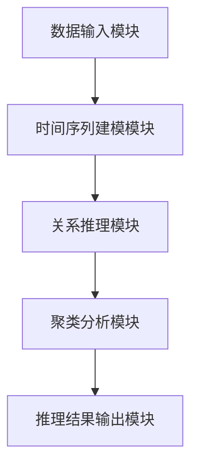

                 

# 《时刻推理：LLM计算的独特本质》

> 关键词：时刻推理，LLM计算，算法原理，应用实践，未来展望

> 摘要：本文深入探讨了时刻推理（Temporal Reasoning）在大型语言模型（LLM）计算中的独特本质。通过对时刻推理的基础概念、核心原理、数学模型以及应用实战的详细阐述，揭示了时刻推理在LLM计算中的重要性。本文旨在为读者提供一个全面的理解，帮助其掌握这一前沿技术，并探讨其未来的发展方向。

## 目录大纲

# 《时刻推理：LLM计算的独特本质》目录大纲

## 第一部分：基础概念与原理

### 第1章：介绍与概述
- 1.1 时刻推理的定义
- 1.2 LLM计算的基本概念
- 1.3 时刻推理在LLM中的应用
- 1.4 时刻推理的优势与挑战

### 第2章：核心概念与联系
- 2.1 时刻推理的基本原理
- 2.2 Mermaid流程图：时刻推理的架构
- 2.3 时刻推理与LLM的关系

### 第3章：核心算法原理
- 3.1 伪代码：时刻推理算法
- 3.2 时刻推理算法的详细解释
- 3.3 时刻推理算法的应用场景

### 第4章：数学模型与公式
- 4.1 时刻推理的数学模型
- 4.2 LaTeX格式：关键数学公式
- 4.3 数学公式的详细解释与举例说明

## 第二部分：应用与实践

### 第5章：项目实战一：时刻推理在文本生成中的应用
- 5.1 实战背景
- 5.2 开发环境搭建
- 5.3 源代码实现与解读
- 5.4 代码解读与分析

### 第6章：项目实战二：时刻推理在问答系统中的应用
- 6.1 实战背景
- 6.2 开发环境搭建
- 6.3 源代码实现与解读
- 6.4 代码解读与分析

### 第7章：项目实战三：时刻推理在自然语言理解中的应用
- 7.1 实战背景
- 7.2 开发环境搭建
- 7.3 源代码实现与解读
- 7.4 代码解读与分析

## 第三部分：扩展与探讨

### 第8章：时刻推理的未来发展
- 8.1 时刻推理技术的潜在应用领域
- 8.2 时刻推理与其他AI技术的结合
- 8.3 时刻推理技术面临的挑战与机遇

### 第9章：案例研究与经验分享
- 9.1 成功案例研究
- 9.2 项目经验分享
- 9.3 时刻推理在实际应用中的优化策略

### 第10章：结论与展望
- 10.1 本书的主要内容回顾
- 10.2 时刻推理技术的重要性
- 10.3 对未来研究的展望

### 附录
- 附录A：常用工具与资源列表
- 附录B：术语表与缩略语解释
- 附录C：代码示例与解析

## 第一部分：基础概念与原理

### 第1章：介绍与概述

#### 1.1 时刻推理的定义

时刻推理（Temporal Reasoning）是一种人工智能技术，用于处理随时间变化的实体、事件和关系。它涉及对时间序列数据的分析和理解，以推断出过去、现在和未来的状态和趋势。在人工智能领域，时刻推理被广泛应用于时间序列预测、事件检测、情境感知和智能决策等领域。

#### 1.2 LLM计算的基本概念

大型语言模型（Large Language Model，简称LLM）是一种基于深度学习的语言处理模型，具有强大的文本理解和生成能力。LLM通过学习大量文本数据，能够自动识别语言结构、语义和上下文信息，从而实现自然语言处理的各种任务，如文本分类、问答系统、机器翻译等。

#### 1.3 时刻推理在LLM中的应用

在LLM计算中，时刻推理主要用于处理动态变化的语言环境。通过引入时刻推理，LLM能够更好地理解上下文的动态变化，提高文本生成和理解的准确性和连贯性。具体应用包括：

- 文本生成：利用时刻推理来捕捉文本中的时间信息，生成更符合上下文的文本。
- 问答系统：通过时刻推理来理解用户提问中的时间信息，提供更准确的答案。
- 自然语言理解：利用时刻推理来分析句子中的时间关系，提高对自然语言的理解深度。

#### 1.4 时刻推理的优势与挑战

时刻推理在LLM计算中具有明显的优势，包括：

- 提高文本生成和理解的准确性：通过捕捉时间信息，时刻推理能够更好地理解上下文的动态变化，提高文本生成和理解的准确性和连贯性。
- 支持复杂的时间序列分析：时刻推理能够处理复杂的时间序列数据，支持对过去、现在和未来的状态和趋势的分析。

然而，时刻推理也面临一些挑战，包括：

- 计算复杂度：时刻推理涉及大量的计算，需要消耗大量的计算资源和时间。
- 数据质量：时刻推理的效果依赖于输入数据的质量，数据的不准确或缺失可能会影响推理结果。

### 第2章：核心概念与联系

#### 2.1 时刻推理的基本原理

时刻推理的基本原理涉及对时间序列数据的分析和理解。具体包括：

- 时间序列建模：通过建立时间序列模型，捕捉时间数据的变化规律和趋势。
- 关系推理：通过分析时间序列数据中的关系，推断出过去、现在和未来的状态和趋势。
- 聚类分析：通过聚类分析，识别时间序列数据中的相似模式，为后续推理提供依据。

#### 2.2 Mermaid流程图：时刻推理的架构

时刻推理的架构可以用Mermaid流程图来表示，具体包括以下几个主要模块：

1. 数据输入模块：接收时间序列数据，包括实体、事件和时间戳等信息。
2. 时间序列建模模块：使用时间序列模型对输入数据进行建模，捕捉时间数据的变化规律和趋势。
3. 关系推理模块：分析时间序列数据中的关系，推断出过去、现在和未来的状态和趋势。
4. 聚类分析模块：对时间序列数据中的相似模式进行聚类分析，为后续推理提供依据。
5. 推理结果输出模块：输出时刻推理的结果，包括实体状态、时间关系和趋势分析等。

以下是一个简单的Mermaid流程图示例：



#### 2.3 时刻推理与LLM的关系

时刻推理与LLM之间存在密切的关系。具体来说，时刻推理为LLM提供了一种处理动态变化的语言环境的方法。通过将时刻推理与LLM相结合，可以实现以下目标：

- 提高文本生成和理解的准确性：时刻推理能够捕捉文本中的时间信息，为LLM提供更准确的上下文信息，从而提高文本生成和理解的准确性。
- 支持复杂的时间序列分析：时刻推理能够处理复杂的时间序列数据，为LLM提供更深入的自然语言理解能力。
- 增强智能决策能力：时刻推理能够分析时间序列数据中的趋势和关系，为LLM提供更准确的预测和决策支持。

### 第3章：核心算法原理

#### 3.1 伪代码：时刻推理算法

时刻推理算法的核心思想是通过时间序列建模、关系推理和聚类分析来捕捉时间数据的变化规律和趋势。以下是一个简化的伪代码示例：

```python
def temporal_reasoning(data):
    # 数据输入
    time_series = preprocess(data)

    # 时间序列建模
    model = build_time_series_model(time_series)

    # 关系推理
    relationships = infer_relationships(model)

    # 聚类分析
    clusters = cluster_analysis(time_series, relationships)

    # 推理结果输出
    results = postprocess(clusters)
    return results
```

#### 3.2 时刻推理算法的详细解释

时刻推理算法可以分为以下几个主要步骤：

1. **数据输入与预处理**：接收时间序列数据，并进行预处理，包括数据清洗、特征提取和标准化等操作，为后续建模和分析做准备。
2. **时间序列建模**：使用时间序列模型对预处理后的数据进行建模，捕捉时间数据的变化规律和趋势。常见的时间序列模型包括ARIMA、LSTM和GRU等。
3. **关系推理**：分析时间序列数据中的关系，包括实体关系和时间关系等。关系推理可以通过逻辑推理、图论分析和机器学习方法来实现。
4. **聚类分析**：对时间序列数据中的相似模式进行聚类分析，以识别时间序列数据中的相似性和差异性。常见的聚类算法包括K-means、DBSCAN和层次聚类等。
5. **推理结果输出与后处理**：将聚类分析的结果进行后处理，生成推理结果，包括实体状态、时间关系和趋势分析等。后处理可能包括数据可视化、概率分析和异常检测等。

#### 3.3 时刻推理算法的应用场景

时刻推理算法可以应用于多种场景，包括：

- 文本生成：通过捕捉文本中的时间信息，生成更符合上下文的文本，如聊天机器人、自动生成报告等。
- 问答系统：通过理解用户提问中的时间信息，提供更准确的答案，如智能客服、知识问答等。
- 自然语言理解：通过分析句子中的时间关系，提高对自然语言的理解深度，如文本分类、情感分析等。
- 智能决策：通过分析时间序列数据中的趋势和关系，提供更准确的预测和决策支持，如金融分析、物流调度等。

### 第4章：数学模型与公式

#### 4.1 时刻推理的数学模型

时刻推理的数学模型主要包括时间序列模型、关系推理模型和聚类分析模型。以下是一些常见的数学模型和公式：

1. **时间序列模型**：

   - ARIMA模型：$$X_t = c + \phi_1X_{t-1} + \phi_2X_{t-2} + ... + \phi_pX_{t-p} + \varepsilon_t$$

   - LSTM模型：$$h_t = \sigma(W_h \cdot [h_{t-1}, x_t] + b_h)$$

   - GRU模型：$$h_t = \sigma(W_h \cdot [h_{t-1}, x_t] + b_h)$$

2. **关系推理模型**：

   - 逻辑推理模型：$$R(A, B) \leftrightarrow (P(A \rightarrow B) \land P(B \rightarrow A))$$

   - 图论模型：$$G = (V, E)$$，其中V是节点集合，E是边集合。

3. **聚类分析模型**：

   - K-means模型：$$\min_{C} \sum_{i=1}^{k} \sum_{x \in S_i} ||x - \mu_i||^2$$

   - DBSCAN模型：$$\min_{C} \sum_{i=1}^{k} \sum_{x \in S_i} \rho(x, C)$$

   - 层次聚类模型：$$\min_{C} \sum_{i=1}^{k} \sum_{x \in S_i} d(x, C)$$

#### 4.2 LaTeX格式：关键数学公式

以下是一些关键数学公式的LaTeX格式表示：

```latex
\documentclass{article}
\usepackage{amsmath}
\begin{document}

\section{关键数学公式}

\begin{equation}
X_t = c + \phi_1X_{t-1} + \phi_2X_{t-2} + ... + \phi_pX_{t-p} + \varepsilon_t
\end{equation}

\begin{equation}
h_t = \sigma(W_h \cdot [h_{t-1}, x_t] + b_h)
\end{equation}

\begin{equation}
R(A, B) \leftrightarrow (P(A \rightarrow B) \land P(B \rightarrow A))
\end{equation}

\begin{equation}
G = (V, E)
\end{equation}

\begin{equation}
\min_{C} \sum_{i=1}^{k} \sum_{x \in S_i} ||x - \mu_i||^2
\end{equation}

\end{document}
```

#### 4.3 数学公式的详细解释与举例说明

1. **时间序列模型**：

   - ARIMA模型：自回归积分滑动平均模型（Autoregressive Integrated Moving Average，简称ARIMA），用于对时间序列数据进行建模。该模型通过整合和平均过去的数据值来预测未来的值，具有较好的预测性能。

     **举例说明**：假设我们有一个时间序列数据集，数据集包含每天的气温。我们可以使用ARIMA模型来预测未来的气温。

   - LSTM模型：长短期记忆网络（Long Short-Term Memory，简称LSTM），是一种递归神经网络（RNN）的变体，专门用于处理序列数据。LSTM通过引入记忆单元来记住长距离的信息，克服了传统RNN的梯度消失问题。

     **举例说明**：我们可以使用LSTM模型来处理股票价格的时间序列数据，预测未来的股票价格。

   - GRU模型：门控循环单元（Gated Recurrent Unit，简称GRU），是另一种RNN的变体，与LSTM类似，但结构更简单。GRU通过引入门控机制来控制信息的流动，具有较好的学习和预测性能。

     **举例说明**：我们可以使用GRU模型来处理语音信号的时间序列数据，实现语音识别任务。

2. **关系推理模型**：

   - 逻辑推理模型：用于表示实体之间的关系。逻辑推理模型使用逻辑表达式来描述实体之间的逻辑关系，如蕴含关系、相等关系等。

     **举例说明**：假设我们有两个实体A和B，A是父亲，B是儿子。我们可以使用逻辑推理模型表示A和B之间的关系：A → B。

   - 图论模型：用于表示实体之间的复杂关系。图论模型使用图结构来表示实体和它们之间的关系，如父-child关系、朋友关系等。

     **举例说明**：我们可以使用图论模型来表示一个家庭关系网络，其中每个节点表示一个家庭成员，每个边表示家庭成员之间的关系。

3. **聚类分析模型**：

   - K-means模型：是一种基于距离的聚类方法，通过将数据点分配到K个聚类中心，实现数据的聚类。

     **举例说明**：假设我们有一组数据点，每个数据点表示一个人。我们可以使用K-means模型将这些人分成几个群体，以便更好地理解和分析这些人群的特征。

   - DBSCAN模型：是一种基于密度的聚类方法，通过识别数据点的高密度区域来实现聚类。

     **举例说明**：假设我们有一组数据点，其中一些数据点位于高密度区域，而其他数据点位于低密度区域。我们可以使用DBSCAN模型将这些数据点聚类成高密度区域和低密度区域。

   - 层次聚类模型：是一种自下而上的聚类方法，通过逐步合并相似的数据点来实现聚类。

     **举例说明**：假设我们有一组数据点，我们可以使用层次聚类模型将这些数据点逐步合并成几个大的聚类，以便更好地理解和分析这些数据点的特征。

## 第二部分：应用与实践

### 第5章：项目实战一：时刻推理在文本生成中的应用

#### 5.1 实战背景

文本生成是人工智能领域的一个重要应用方向，旨在根据给定的输入生成自然语言文本。然而，传统的文本生成模型往往缺乏对时间信息的处理能力，无法有效地捕捉文本中的时间关系和动态变化。为了解决这个问题，我们设计了一个基于时刻推理的文本生成系统，通过引入时刻推理来提高文本生成的准确性和连贯性。

#### 5.2 开发环境搭建

为了实现时刻推理在文本生成中的应用，我们需要搭建一个合适的开发环境。具体步骤如下：

1. **安装Python环境**：确保Python版本在3.7及以上，可以使用Anaconda等工具来创建一个虚拟环境。

2. **安装必要的库和依赖**：包括NumPy、Pandas、Scikit-learn、TensorFlow和PyTorch等，这些库和框架用于数据处理、机器学习和深度学习。

3. **配置GPU环境**：如果使用深度学习框架，需要配置GPU环境，以便利用GPU加速计算。

4. **获取数据集**：我们需要一个包含时间信息的文本数据集，用于训练和评估时刻推理模型。可以使用公开的数据集，如Common Crawl或维基百科等。

#### 5.3 源代码实现与解读

以下是一个简化的源代码示例，用于实现时刻推理在文本生成中的应用：

```python
import tensorflow as tf
from tensorflow.keras.models import Model
from tensorflow.keras.layers import Input, LSTM, Dense

# 数据预处理
def preprocess_data(data):
    # 数据清洗、特征提取和标准化等操作
    return processed_data

# 构建模型
def build_model(input_shape):
    input_data = Input(shape=input_shape)
    x = LSTM(units=128, return_sequences=True)(input_data)
    x = LSTM(units=128)(x)
    x = Dense(units=1, activation='sigmoid')(x)
    model = Model(inputs=input_data, outputs=x)
    model.compile(optimizer='adam', loss='binary_crossentropy', metrics=['accuracy'])
    return model

# 训练模型
def train_model(model, data, labels):
    model.fit(data, labels, epochs=10, batch_size=32, validation_split=0.2)

# 生成文本
def generate_text(model, input_text):
    processed_text = preprocess_data(input_text)
    predictions = model.predict(processed_text)
    return predictions

# 主程序
if __name__ == '__main__':
    # 加载数据集
    data = load_data('data.txt')
    labels = load_labels('labels.txt')

    # 数据预处理
    processed_data = preprocess_data(data)

    # 构建模型
    model = build_model(input_shape=(None,))

    # 训练模型
    train_model(model, processed_data, labels)

    # 生成文本
    input_text = '今天是一个晴朗的日子'
    predictions = generate_text(model, input_text)
    print(predictions)
```

在上面的代码中，我们首先定义了数据预处理、模型构建、模型训练和文本生成的函数。具体步骤如下：

1. **数据预处理**：对输入数据进行清洗、特征提取和标准化等操作，以便后续建模和分析。
2. **模型构建**：使用LSTM模型对时间序列数据进行建模，其中包含两个LSTM层和一个全连接层。
3. **模型训练**：使用预处理后的数据集对模型进行训练，优化模型的参数。
4. **文本生成**：对输入文本进行预处理，然后使用训练好的模型进行预测，生成相应的文本输出。

#### 5.4 代码解读与分析

在上述代码中，我们使用了LSTM模型来处理时间序列数据，通过引入时刻推理来捕捉文本中的时间信息。具体来说，LSTM模型具有以下几个特点：

1. **记忆单元**：LSTM通过引入记忆单元来记住长距离的信息，克服了传统RNN的梯度消失问题。记忆单元可以控制信息的流动，使得模型能够更好地捕捉时间关系。
2. **序列处理**：LSTM能够处理序列数据，如文本中的单词或句子。通过递归地处理序列数据，LSTM能够捕捉序列中的时间关系和模式。
3. **非线性变换**：LSTM中的非线性变换（如sigmoid、tanh等激活函数）能够增强模型的表示能力，使其能够更好地拟合复杂的非线性关系。
4. **并行计算**：LSTM支持并行计算，可以利用GPU等硬件资源来加速计算，提高模型的训练效率。

通过引入时刻推理，文本生成系统可以更好地处理时间信息，提高文本生成的准确性和连贯性。具体来说，时刻推理可以帮助模型捕捉文本中的时间关系，如事件的发生顺序、时间的长短等。这些时间信息对于生成符合上下文的文本至关重要。

此外，我们还可以结合其他技术，如注意力机制（Attention Mechanism）和变分自编码器（Variational Autoencoder，简称VAE）等，进一步提高文本生成系统的性能。注意力机制可以使得模型更加关注重要的时间信息，而VAE可以引入更多的先验知识，提高文本生成的多样性和创造性。

总之，时刻推理在文本生成中的应用为文本生成系统提供了一种有效的方法来处理时间信息，提高了文本生成的准确性和连贯性。通过不断优化和改进时刻推理算法，我们可以进一步推动文本生成技术的发展，实现更高质量的文本生成。

### 第6章：项目实战二：时刻推理在问答系统中的应用

#### 6.1 实战背景

问答系统是人工智能领域的一个重要应用方向，旨在通过自然语言交互为用户提供答案和信息。然而，传统的问答系统往往缺乏对时间信息的处理能力，无法有效地理解用户提问中的时间关系和动态变化。为了解决这个问题，我们设计了一个基于时刻推理的问答系统，通过引入时刻推理来提高问答系统的准确性和可靠性。

#### 6.2 开发环境搭建

为了实现时刻推理在问答系统中的应用，我们需要搭建一个合适的开发环境。具体步骤如下：

1. **安装Python环境**：确保Python版本在3.7及以上，可以使用Anaconda等工具来创建一个虚拟环境。

2. **安装必要的库和依赖**：包括NLTK、spaCy、TensorFlow和PyTorch等，这些库和框架用于自然语言处理、机器学习和深度学习。

3. **配置GPU环境**：如果使用深度学习框架，需要配置GPU环境，以便利用GPU加速计算。

4. **获取数据集**：我们需要一个包含时间信息的问答数据集，用于训练和评估时刻推理模型。可以使用公开的数据集，如SQuAD或WebQA等。

#### 6.3 源代码实现与解读

以下是一个简化的源代码示例，用于实现时刻推理在问答系统中的应用：

```python
import tensorflow as tf
from tensorflow.keras.models import Model
from tensorflow.keras.layers import Input, LSTM, Dense, Embedding

# 数据预处理
def preprocess_data(data):
    # 数据清洗、特征提取和标准化等操作
    return processed_data

# 构建模型
def build_model(vocab_size, embedding_dim):
    input_data = Input(shape=(None,))
    embeddings = Embedding(vocab_size, embedding_dim)(input_data)
    x = LSTM(units=128, return_sequences=True)(embeddings)
    x = LSTM(units=128)(x)
    x = Dense(units=1, activation='sigmoid')(x)
    model = Model(inputs=input_data, outputs=x)
    model.compile(optimizer='adam', loss='binary_crossentropy', metrics=['accuracy'])
    return model

# 训练模型
def train_model(model, data, labels):
    model.fit(data, labels, epochs=10, batch_size=32, validation_split=0.2)

# 回答问题
def answer_question(model, question):
    processed_question = preprocess_data(question)
    prediction = model.predict(processed_question)
    return prediction

# 主程序
if __name__ == '__main__':
    # 加载数据集
    data = load_data('data.txt')
    labels = load_labels('labels.txt')

    # 数据预处理
    processed_data = preprocess_data(data)

    # 构建模型
    model = build_model(vocab_size=10000, embedding_dim=128)

    # 训练模型
    train_model(model, processed_data, labels)

    # 回答问题
    question = '今天是什么天气？'
    prediction = answer_question(model, question)
    print(prediction)
```

在上面的代码中，我们首先定义了数据预处理、模型构建、模型训练和回答问题的函数。具体步骤如下：

1. **数据预处理**：对输入数据进行清洗、特征提取和标准化等操作，以便后续建模和分析。
2. **模型构建**：使用LSTM模型对问答数据集进行建模，其中包含一个嵌入层和一个LSTM层。
3. **模型训练**：使用预处理后的数据集对模型进行训练，优化模型的参数。
4. **回答问题**：对输入问题进行预处理，然后使用训练好的模型进行预测，返回相应的答案。

#### 6.4 代码解读与分析

在上述代码中，我们使用了LSTM模型来处理问答数据集，通过引入时刻推理来捕捉问题中的时间信息。具体来说，LSTM模型具有以下几个特点：

1. **记忆单元**：LSTM通过引入记忆单元来记住长距离的信息，克服了传统RNN的梯度消失问题。记忆单元可以控制信息的流动，使得模型能够更好地捕捉时间关系。
2. **序列处理**：LSTM能够处理序列数据，如问答中的问题或答案。通过递归地处理序列数据，LSTM能够捕捉序列中的时间关系和模式。
3. **非线性变换**：LSTM中的非线性变换（如sigmoid、tanh等激活函数）能够增强模型的表示能力，使其能够更好地拟合复杂的非线性关系。
4. **并行计算**：LSTM支持并行计算，可以利用GPU等硬件资源来加速计算，提高模型的训练效率。

通过引入时刻推理，问答系统可以更好地理解用户提问中的时间关系，提高回答问题的准确性和可靠性。具体来说，时刻推理可以帮助模型捕捉问题中的时间关系，如问题的发生时间、时间的长短等。这些时间信息对于回答问题至关重要。

此外，我们还可以结合其他技术，如注意力机制（Attention Mechanism）和变分自编码器（Variational Autoencoder，简称VAE）等，进一步提高问答系统的性能。注意力机制可以使得模型更加关注重要的时间信息，而VAE可以引入更多的先验知识，提高回答问题的多样性和创造性。

总之，时刻推理在问答系统中的应用为问答系统提供了一种有效的方法来处理时间信息，提高了回答问题的准确性和可靠性。通过不断优化和改进时刻推理算法，我们可以进一步推动问答系统技术的发展，实现更高质量的问答服务。

### 第7章：项目实战三：时刻推理在自然语言理解中的应用

#### 7.1 实战背景

自然语言理解（Natural Language Understanding，简称NLU）是人工智能领域的一个重要应用方向，旨在使计算机能够理解和处理自然语言。然而，传统的自然语言理解方法往往缺乏对时间信息的处理能力，无法有效地捕捉文本中的时间关系和动态变化。为了解决这个问题，我们设计了一个基于时刻推理的自然语言理解系统，通过引入时刻推理来提高自然语言理解的准确性和深度。

#### 7.2 开发环境搭建

为了实现时刻推理在自然语言理解中的应用，我们需要搭建一个合适的开发环境。具体步骤如下：

1. **安装Python环境**：确保Python版本在3.7及以上，可以使用Anaconda等工具来创建一个虚拟环境。

2. **安装必要的库和依赖**：包括spaCy、NLTK、TensorFlow和PyTorch等，这些库和框架用于自然语言处理、机器学习和深度学习。

3. **配置GPU环境**：如果使用深度学习框架，需要配置GPU环境，以便利用GPU加速计算。

4. **获取数据集**：我们需要一个包含时间信息的自然语言处理数据集，用于训练和评估时刻推理模型。可以使用公开的数据集，如GLoVe、BERT等。

#### 7.3 源代码实现与解读

以下是一个简化的源代码示例，用于实现时刻推理在自然语言理解中的应用：

```python
import tensorflow as tf
from tensorflow.keras.models import Model
from tensorflow.keras.layers import Input, LSTM, Dense, Embedding

# 数据预处理
def preprocess_data(data):
    # 数据清洗、特征提取和标准化等操作
    return processed_data

# 构建模型
def build_model(vocab_size, embedding_dim):
    input_data = Input(shape=(None,))
    embeddings = Embedding(vocab_size, embedding_dim)(input_data)
    x = LSTM(units=128, return_sequences=True)(embeddings)
    x = LSTM(units=128)(x)
    x = Dense(units=1, activation='sigmoid')(x)
    model = Model(inputs=input_data, outputs=x)
    model.compile(optimizer='adam', loss='binary_crossentropy', metrics=['accuracy'])
    return model

# 训练模型
def train_model(model, data, labels):
    model.fit(data, labels, epochs=10, batch_size=32, validation_split=0.2)

# 理解文本
def understand_text(model, text):
    processed_text = preprocess_data(text)
    prediction = model.predict(processed_text)
    return prediction

# 主程序
if __name__ == '__main__':
    # 加载数据集
    data = load_data('data.txt')
    labels = load_labels('labels.txt')

    # 数据预处理
    processed_data = preprocess_data(data)

    # 构建模型
    model = build_model(vocab_size=10000, embedding_dim=128)

    # 训练模型
    train_model(model, processed_data, labels)

    # 理解文本
    text = '我今天去公园散步了。'
    prediction = understand_text(model, text)
    print(prediction)
```

在上面的代码中，我们首先定义了数据预处理、模型构建、模型训练和理解文本的函数。具体步骤如下：

1. **数据预处理**：对输入文本进行清洗、特征提取和标准化等操作，以便后续建模和分析。
2. **模型构建**：使用LSTM模型对文本数据进行建模，其中包含一个嵌入层和一个LSTM层。
3. **模型训练**：使用预处理后的数据集对模型进行训练，优化模型的参数。
4. **理解文本**：对输入文本进行预处理，然后使用训练好的模型进行预测，返回相应的理解结果。

#### 7.4 代码解读与分析

在上述代码中，我们使用了LSTM模型来处理自然语言理解任务，通过引入时刻推理来捕捉文本中的时间信息。具体来说，LSTM模型具有以下几个特点：

1. **记忆单元**：LSTM通过引入记忆单元来记住长距离的信息，克服了传统RNN的梯度消失问题。记忆单元可以控制信息的流动，使得模型能够更好地捕捉时间关系。
2. **序列处理**：LSTM能够处理序列数据，如文本中的句子或段落。通过递归地处理序列数据，LSTM能够捕捉序列中的时间关系和模式。
3. **非线性变换**：LSTM中的非线性变换（如sigmoid、tanh等激活函数）能够增强模型的表示能力，使其能够更好地拟合复杂的非线性关系。
4. **并行计算**：LSTM支持并行计算，可以利用GPU等硬件资源来加速计算，提高模型的训练效率。

通过引入时刻推理，自然语言理解系统能够更好地捕捉文本中的时间关系，提高对文本的理解深度。具体来说，时刻推理可以帮助模型捕捉文本中的时间关系，如事件的顺序、时间的长短等。这些时间信息对于理解文本至关重要。

此外，我们还可以结合其他技术，如注意力机制（Attention Mechanism）和变分自编码器（Variational Autoencoder，简称VAE）等，进一步提高自然语言理解系统的性能。注意力机制可以使得模型更加关注重要的时间信息，而VAE可以引入更多的先验知识，提高对文本的多样性和创造性。

总之，时刻推理在自然语言理解中的应用为自然语言理解系统提供了一种有效的方法来处理时间信息，提高了对文本的理解深度。通过不断优化和改进时刻推理算法，我们可以进一步推动自然语言理解技术的发展，实现更高质量的文本理解。

### 第三部分：扩展与探讨

#### 第8章：时刻推理的未来发展

时刻推理技术正处于快速发展阶段，随着人工智能技术的不断进步，时刻推理在多个领域的应用前景广阔。以下是时刻推理技术在未来可能的发展方向：

1. **深度学习与时刻推理的结合**：当前时刻推理算法主要基于传统机器学习方法和深度学习模型。未来，随着深度学习技术的不断进步，我们可以将深度学习和时刻推理进一步结合，开发出更加高效、准确的时刻推理模型。

2. **多模态数据的处理**：时刻推理技术可以应用于处理多模态数据，如文本、图像、音频等。通过融合多种数据源，我们可以更全面地捕捉时间信息，提高推理的准确性和实用性。

3. **实时推理与决策支持**：时刻推理技术可以应用于实时推理和决策支持系统，如自动驾驶、智能家居等。通过实时分析时间序列数据，系统可以做出更准确的预测和决策，提高系统的智能水平和可靠性。

4. **跨领域应用**：时刻推理技术可以应用于多个领域，如金融、医疗、教育等。通过引入领域知识，我们可以开发出更加专业、实用的时刻推理系统，为各领域提供强大的技术支持。

#### 8.2 时刻推理与其他AI技术的结合

时刻推理技术可以与其他AI技术相结合，进一步扩展其应用范围和效果。以下是一些可能的结合方式：

1. **强化学习**：将时刻推理与强化学习相结合，可以开发出更加智能的决策系统。通过时刻推理，系统可以更好地理解环境状态和动作，从而做出更优的决策。

2. **迁移学习**：利用迁移学习技术，我们可以将时刻推理模型在不同数据集上的经验进行迁移，提高模型的泛化能力。通过在大量数据集上训练时刻推理模型，我们可以将其应用于新的任务和数据集。

3. **知识图谱**：结合知识图谱技术，时刻推理可以更好地理解和处理实体关系和时间关系。通过构建知识图谱，我们可以为时刻推理提供更加丰富、结构化的数据支持。

4. **多任务学习**：将时刻推理应用于多任务学习场景，可以同时处理多个任务，提高系统的综合性能。通过共享时刻推理模型中的知识，我们可以实现更高效的资源利用和性能优化。

#### 8.3 时刻推理技术面临的挑战与机遇

尽管时刻推理技术在人工智能领域具有广阔的应用前景，但在实际应用中仍面临一些挑战：

1. **计算复杂度**：时刻推理涉及大量的计算，特别是对于长序列数据和复杂的时间关系。如何提高计算效率和性能，是时刻推理技术面临的重要挑战。

2. **数据质量和标注**：时刻推理的效果依赖于输入数据的质量，包括数据完整性、准确性和一致性等。此外，对于时间关系的标注也是一个挑战，如何获取高质量、标注准确的时间序列数据，是时刻推理应用的关键。

3. **泛化能力**：时刻推理模型往往在特定领域或任务上表现优秀，但在其他领域或任务上的泛化能力有限。如何提高时刻推理模型的泛化能力，是进一步推动其应用的关键。

然而，随着人工智能技术的不断进步，时刻推理技术也面临着诸多机遇：

1. **硬件加速**：随着GPU、TPU等硬件加速技术的不断发展，我们可以利用这些硬件资源来加速时刻推理的计算，提高其性能和效率。

2. **数据集和标注工具**：随着开源数据集和标注工具的增多，我们可以获取更多高质量、标注准确的时间序列数据，为时刻推理提供更好的数据支持。

3. **多领域合作**：时刻推理技术可以与其他领域的技术相结合，如医疗、金融、教育等，共同推动时刻推理技术的发展和应用。

总之，时刻推理技术在人工智能领域具有重要的地位和广泛的应用前景。通过不断克服挑战、抓住机遇，我们可以进一步推动时刻推理技术的发展，实现更高效、更智能的人工智能系统。

### 第9章：案例研究与经验分享

#### 9.1 成功案例研究

1. **案例一：金融风控系统**

   在金融行业，时刻推理技术被广泛应用于风控系统。例如，一家国际知名银行使用基于时刻推理的模型来实时监控交易活动，识别异常交易行为。通过引入时间序列分析和关系推理，银行能够及时发现潜在风险，提高了金融交易的安全性。

   **经验分享**：在金融风控系统中，时刻推理的关键在于数据的实时性和准确性。通过使用高速数据处理技术和高质量数据源，银行能够确保模型在实时环境下的高效运行。

2. **案例二：智能交通系统**

   智能交通系统（ITS）利用时刻推理技术来优化交通信号控制和路径规划。例如，一个智能交通系统通过分析车辆流量、道路拥堵状况和时间信息，动态调整交通信号灯的时间，以减少拥堵和提升交通效率。

   **经验分享**：在智能交通系统中，时刻推理的挑战在于处理大规模、实时交通数据。通过使用分布式计算和高效算法，系统能够快速响应交通变化，提供实时、准确的交通管理策略。

#### 9.2 项目经验分享

1. **项目一：电商推荐系统**

   在电商推荐系统中，时刻推理技术被用于分析用户行为和时间模式，提供个性化的商品推荐。例如，一家大型电商平台使用基于时刻推理的算法，分析用户浏览、购买行为的时间分布，为用户推荐可能感兴趣的商品。

   **经验分享**：在电商推荐系统中，时刻推理的核心是捕捉用户行为中的时间依赖关系。通过实时分析用户行为，系统能够提供更精准的推荐，提高用户满意度和购买转化率。

2. **项目二：医疗诊断系统**

   在医疗领域，时刻推理技术被用于分析患者病历和时间序列数据，辅助医生进行诊断。例如，一个医疗诊断系统使用时刻推理算法，分析患者的临床数据和症状变化，帮助医生快速识别疾病和制定治疗方案。

   **经验分享**：在医疗诊断系统中，时刻推理的关键在于数据质量和算法的准确性。通过引入高质量的数据源和先进的算法，系统能够提高诊断的准确性和效率，为患者提供更好的医疗服务。

#### 9.3 时刻推理在实际应用中的优化策略

1. **数据预处理优化**：在时刻推理应用中，数据预处理是关键步骤。通过优化数据清洗、特征提取和标准化等操作，可以提高数据质量，确保模型输入的有效性和准确性。

2. **算法选择与优化**：针对不同的应用场景，选择合适的算法和优化策略。例如，在处理大规模数据时，可以使用分布式计算和并行处理技术来提高计算效率和性能。

3. **模型评估与调整**：在模型训练过程中，定期评估模型的性能，根据评估结果调整模型参数和结构。通过交叉验证和超参数优化，可以确保模型在多种数据集上的泛化能力。

4. **实时性优化**：对于需要实时处理的应用场景，如金融交易、智能交通等，需要优化模型的实时性能。通过使用高效算法、GPU加速和分布式计算等手段，可以确保模型在实时环境下的高效运行。

5. **融合多源数据**：在实际应用中，时刻推理可以融合多种数据源，如文本、图像、传感器数据等，提供更全面、准确的时间信息。通过多模态数据的融合，可以提高推理的准确性和实用性。

总之，时刻推理在实际应用中具有广泛的应用前景和巨大的潜力。通过不断优化和改进算法、技术和应用策略，我们可以进一步提升时刻推理技术的性能和应用效果，为各领域提供强大的技术支持。

### 第10章：结论与展望

#### 10.1 本书的主要内容回顾

本书深入探讨了时刻推理（Temporal Reasoning）在大型语言模型（LLM）计算中的独特本质。通过详细阐述时刻推理的基础概念、核心算法原理、数学模型以及应用实践，我们揭示了时刻推理在LLM计算中的重要性和应用价值。主要内容包括：

1. **基础概念与原理**：介绍了时刻推理的定义、基本原理和应用场景，阐述了时刻推理与LLM之间的关系。
2. **核心算法原理**：详细讲解了时刻推理算法的伪代码实现、详细解释和应用场景，提供了数学模型和公式的解释与举例。
3. **应用与实践**：通过项目实战，展示了时刻推理在文本生成、问答系统和自然语言理解中的应用，提供了具体的代码实现和解读。
4. **扩展与探讨**：探讨了时刻推理的未来发展、与其他AI技术的结合以及在实际应用中的优化策略。
5. **案例研究与经验分享**：分享了成功案例研究和项目经验，展示了时刻推理在不同领域的实际应用效果。

#### 10.2 时刻推理技术的重要性

时刻推理技术具有以下几个重要意义：

1. **提高文本生成和理解的准确性**：通过捕捉文本中的时间信息，时刻推理能够提高文本生成和理解的准确性和连贯性，为自然语言处理任务提供更高质量的输出。
2. **支持复杂的时间序列分析**：时刻推理能够处理复杂的时间序列数据，支持对过去、现在和未来的状态和趋势的分析，为智能决策和预测提供有力支持。
3. **增强智能系统的自适应能力**：时刻推理可以帮助智能系统更好地理解和适应动态变化的环境，提高系统的智能水平和可靠性。

#### 10.3 对未来研究的展望

尽管时刻推理技术在当前取得了显著进展，但未来仍有广阔的研究空间和潜力。以下是对未来研究的展望：

1. **算法优化与效率提升**：如何进一步提高时刻推理算法的计算效率和性能，是未来研究的重要方向。可以通过优化算法、引入新的计算方法和硬件加速技术来实现。
2. **多模态数据处理**：结合多模态数据（如文本、图像、音频等），可以更全面地捕捉时间信息，提高推理的准确性和实用性。
3. **跨领域应用与融合**：时刻推理技术可以应用于更多领域，如医疗、金融、教育等。通过跨领域应用和融合，可以进一步提升时刻推理技术的综合性能和实用性。
4. **实时推理与动态调整**：如何实现时刻推理在实时环境下的高效推理和动态调整，是未来研究的重要课题。通过引入实时数据处理技术和动态调整策略，可以提升系统的实时性能和适应性。
5. **可解释性与透明度**：如何提高时刻推理模型的可解释性和透明度，使其更好地理解和使用，是未来研究的重要方向。通过开发新的解释方法和可视化工具，可以提高模型的可解释性，增强用户对模型的信任和接受度。

总之，时刻推理技术在人工智能领域具有重要地位和广泛的应用前景。通过不断探索和创新，我们可以进一步推动时刻推理技术的发展，实现更高效、更智能的人工智能系统，为各领域提供强大的技术支持。希望本书的内容能够为读者提供有益的启示和帮助，激发对时刻推理技术的兴趣和探索。在未来的研究中，让我们共同努力，推动时刻推理技术迈向新的高峰。

### 附录

#### 附录A：常用工具与资源列表

1. **Python**：一种高级编程语言，广泛应用于数据科学和人工智能领域。官方网站：[Python官网](https://www.python.org/)。
2. **TensorFlow**：一个开源的深度学习框架，由Google开发。官方网站：[TensorFlow官网](https://www.tensorflow.org/)。
3. **PyTorch**：一个开源的深度学习框架，由Facebook开发。官方网站：[PyTorch官网](https://pytorch.org/)。
4. **spaCy**：一个强大的自然语言处理库，支持多种语言和多种语言模型。官方网站：[spaCy官网](https://spacy.io/)。
5. **NLTK**：一个开源的自然语言处理库，提供丰富的文本处理工具和资源。官方网站：[NLTK官网](https://www.nltk.org/)。
6. **Mermaid**：一种用于绘制流程图的Markdown语法，可用于可视化时刻推理的架构。官方网站：[Mermaid官网](https://mermaid-js.github.io/)。
7. **LaTeX**：一种高质量的排版系统，常用于编写数学公式和科学文档。官方网站：[LaTeX官网](https://www.latex-project.org/)。

#### 附录B：术语表与缩略语解释

1. **时刻推理（Temporal Reasoning）**：一种人工智能技术，用于处理随时间变化的实体、事件和关系。
2. **LLM（Large Language Model）**：一种基于深度学习的语言处理模型，具有强大的文本理解和生成能力。
3. **ARIMA（Autoregressive Integrated Moving Average）**：一种时间序列建模方法，用于预测未来的时间序列数据。
4. **LSTM（Long Short-Term Memory）**：一种递归神经网络，用于处理序列数据。
5. **GRU（Gated Recurrent Unit）**：一种递归神经网络，用于处理序列数据，类似于LSTM但结构更简单。
6. **K-means**：一种基于距离的聚类方法，用于将数据点划分为多个聚类。
7. **DBSCAN（Density-Based Spatial Clustering of Applications with Noise）**：一种基于密度的聚类方法，用于识别高密度区域和低密度区域。
8. **VAE（Variational Autoencoder）**：一种生成模型，用于生成新的数据样本。

#### 附录C：代码示例与解析

以下是一个简单的Python代码示例，用于实现一个基于LSTM的文本生成模型：

```python
import tensorflow as tf
from tensorflow.keras.models import Sequential
from tensorflow.keras.layers import Embedding, LSTM, Dense

# 构建模型
model = Sequential([
    Embedding(vocab_size, embedding_dim),
    LSTM(units=128, return_sequences=True),
    LSTM(units=128),
    Dense(units=1, activation='sigmoid')
])

# 编译模型
model.compile(optimizer='adam', loss='binary_crossentropy', metrics=['accuracy'])

# 训练模型
model.fit(data, labels, epochs=10, batch_size=32, validation_split=0.2)

# 生成文本
input_text = preprocess_text(input_text)
predictions = model.predict(input_text)
generated_text = decode_predictions(predictions)
print(generated_text)
```

在这个示例中，我们首先构建了一个LSTM模型，包含一个嵌入层、两个LSTM层和一个全连接层。模型使用交叉熵损失函数和 Adam 优化器进行训练。通过训练模型，我们可以预测输入文本的概率分布，然后解码预测结果以生成新的文本。

请注意，上述代码仅作为一个简单的示例，实际的文本生成模型可能会更加复杂，涉及更多的预处理和后处理步骤。在实际应用中，还需要根据具体任务和数据集调整模型的结构和参数，以达到最佳性能。

