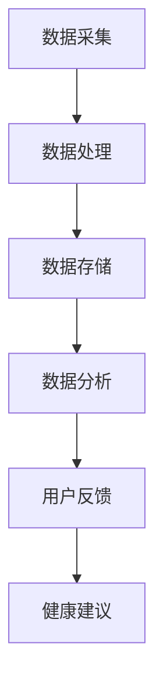

                 

## 智能健康监测创业：穿戴设备的医疗应用

### 关键词：智能健康监测、穿戴设备、医疗应用、数据分析、创业指南

> 摘要：本文将探讨智能健康监测领域的创业机会，特别是穿戴设备在医疗应用方面的潜力。通过分析智能健康监测的定义、核心技术、功能、系统架构、商业模式、市场前景，以及实际项目开发与案例分析，本文为有意投身该领域的创业者提供了详细的指南。

智能健康监测是近年来快速发展的领域，通过穿戴设备对用户的健康数据进行实时监测，已经成为医疗健康领域的一个重要分支。随着科技的进步和人们对健康意识的增强，智能健康监测不仅在改善个人健康管理方面发挥了重要作用，也为创业者提供了丰富的创业机会。

### 第一部分：背景与概念

#### 第1章：智能健康监测与穿戴设备

##### 1.1 智能健康监测的定义与重要性

智能健康监测（Smart Health Monitoring）是指利用先进的传感器技术、数据采集、传输和处理技术，对用户的生理、心理等健康状态进行实时监测和分析，以便提供个性化的健康管理服务。

在现代社会，随着人口老龄化趋势加剧和慢性病的普及，人们对健康监测的需求日益增长。智能健康监测通过穿戴设备可以提供全天候、无创的监测手段，具有高效、便捷、精准的特点，因此具有重要的社会和经济价值。

##### 1.2 穿戴设备的发展历程与应用领域

穿戴设备的发展经历了几个阶段，从早期的简易手环到如今功能强大的智能手表、健康手环等。这些设备集成了多种传感器，可以监测心率、血压、步数、睡眠质量等多种健康指标。

应用领域方面，智能穿戴设备广泛应用于个人健康管理、运动健身、医疗监测、智能家居等领域。随着5G、人工智能等技术的不断发展，穿戴设备的性能和应用范围将得到进一步提升。

##### 1.3 智能健康监测与医疗行业的融合

智能健康监测与医疗行业的融合已经成为趋势。通过穿戴设备，医生可以远程监控患者的健康状况，及时发现异常情况并采取相应措施。同时，智能健康监测还可以帮助医疗机构进行大规模的健康数据分析，为公共卫生决策提供支持。

#### 第2章：核心技术与原理

##### 2.1 穿戴设备传感器技术

穿戴设备传感器技术是智能健康监测的核心。常见的传感器包括光电心率传感器、加速度传感器、压力传感器等。这些传感器可以精确地捕捉用户的生理信号，为健康监测提供基础数据。

##### 2.2 数据采集与处理算法

数据采集与处理算法是智能健康监测的关键环节。通过有效的数据采集算法，可以确保所获取的健康数据的准确性和可靠性。数据处理算法则负责对原始数据进行预处理、特征提取等操作，以便进行后续分析。

##### 2.3 机器学习在健康监测中的应用

机器学习技术在智能健康监测中发挥着重要作用。通过训练机器学习模型，可以对用户的健康数据进行分析，预测可能的健康风险，提供个性化的健康建议。常见的机器学习算法包括决策树、随机森林、支持向量机、神经网络等。

#### 第3章：智能健康监测的主要功能

##### 3.1 心率监测与分析

心率监测是智能健康监测中最常见功能之一。通过监测心率，可以评估用户的健康状况，发现潜在的心血管疾病风险。

##### 3.2 血压监测与预警

血压监测对于高血压患者尤为重要。智能穿戴设备可以通过实时监测血压，及时发现异常情况，提供预警提示。

##### 3.3 睡眠质量评估

睡眠质量评估是智能健康监测的重要功能之一。通过监测睡眠状态、睡眠时长等指标，可以评估用户的睡眠质量，提供改善建议。

##### 3.4 运动与健康数据监测

运动与健康数据监测是智能健康监测的重要功能之一。通过监测用户的运动数据，如步数、心率、消耗的卡路里等，可以评估用户的运动强度和效果，提供个性化的运动建议。

#### 第4章：智能健康监测系统的架构设计

##### 4.1 数据采集层

数据采集层是智能健康监测系统的底层，负责从穿戴设备中获取用户的生理数据。数据采集层需要确保数据的准确性和稳定性。

##### 4.2 数据处理层

数据处理层负责对采集到的数据进行预处理、特征提取等操作，以便进行后续分析。数据处理层需要实现高效、准确的数据处理算法。

##### 4.3 数据存储与安全

数据存储与安全是智能健康监测系统的关键环节。系统需要实现数据的高效存储和安全保护，确保用户隐私和数据安全。

##### 4.4 应用层与用户交互

应用层与用户交互是智能健康监测系统的核心。通过用户界面，用户可以查看自己的健康数据、获得健康建议等。应用层需要实现友好的用户交互体验，提高用户满意度。

#### 第5章：智能健康监测的商业模式与市场前景

##### 5.1 市场需求与市场规模分析

随着人们对健康的关注程度不断提高，智能健康监测市场的需求不断增长。根据相关数据，全球智能健康监测市场规模正在以两位数的增长率迅速扩张。

##### 5.2 智能健康监测的商业模式

智能健康监测的商业模式主要包括硬件销售、软件服务、健康管理服务等多种形式。创业者可以根据自身资源和市场需求选择合适的商业模式。

##### 5.3 市场竞争态势与挑战

智能健康监测市场竞争激烈，创业者在进入市场时需要充分了解竞争对手的情况，找准市场定位，打造差异化的产品和服务。

#### 第6章：案例分析

##### 6.1 国内外智能健康监测企业案例分析

通过对国内外知名智能健康监测企业的分析，可以了解该领域的市场格局、产品特点、商业模式等，为创业者提供借鉴。

##### 6.2 智能健康监测产品评估与推荐

对市场上的智能健康监测产品进行评估，根据用户需求推荐合适的产品，有助于创业者了解市场需求和用户偏好。

##### 6.3 成功创业案例分析

通过分析成功创业案例，可以了解创业者在智能健康监测领域的创业策略、运营模式、市场拓展等方面的经验，为创业者提供参考。

#### 第7章：创业指南与策略

##### 7.1 创业前的准备

在创业前，创业者需要对市场、技术、团队等方面进行充分调研和准备，确保创业项目的可行性。

##### 7.2 团队建设与资源整合

团队建设是创业成功的关键。创业者需要寻找合适的合作伙伴，整合各方资源，共同推动项目的发展。

##### 7.3 营销策略与市场推广

营销策略是创业成功的重要因素。创业者需要制定合理的营销策略，通过各种渠道进行市场推广，提高品牌知名度。

##### 7.4 财务规划与风险评估

财务规划和风险评估是创业过程中的重要环节。创业者需要制定详细的财务计划，合理控制成本，同时评估项目的风险，制定应对策略。

### 第二部分：技术实现与开发实践

#### 第8章：智能健康监测技术实现

##### 8.1 穿戴设备硬件设计

穿戴设备硬件设计是智能健康监测技术的关键。需要考虑传感器的选择、电路设计、电池寿命等方面，确保设备的高效性和稳定性。

##### 8.2 软件开发与系统集成

软件开发与系统集成是实现智能健康监测的核心环节。需要开发相应的应用程序，实现数据的采集、传输、处理等功能，同时确保系统的兼容性和可扩展性。

##### 8.3 机器学习模型的开发与优化

机器学习模型的开发与优化是提高智能健康监测系统性能的关键。需要选择合适的算法，对健康数据进行训练和优化，以提高预测的准确性和可靠性。

#### 第9章：项目实战

##### 9.1 心率监测与预警系统

心率监测与预警系统是一个典型的智能健康监测项目。通过该项目，可以了解心率监测的实现原理、技术难点和解决方案。

##### 9.2 血压监测系统开发

血压监测系统开发是另一个重要的智能健康监测项目。通过该项目，可以了解血压监测的原理、实现方法和关键技术。

##### 9.3 睡眠质量分析系统

睡眠质量分析系统是一个综合性项目，涉及传感器数据采集、数据处理、机器学习等多个方面。通过该项目，可以了解如何实现睡眠质量分析，以及如何优化系统性能。

##### 9.4 运动与健康数据监测系统

运动与健康数据监测系统是一个涉及多个健康指标的智能健康监测项目。通过该项目，可以了解如何实现运动数据的采集、处理和分析，为用户提供个性化的运动建议。

#### 第10章：代码实战与案例分析

##### 10.1 穿戴设备数据采集与处理

通过实际代码示例，详细介绍穿戴设备数据采集与处理的过程，包括传感器数据的读取、预处理和特征提取等。

##### 10.2 机器学习模型训练与预测

介绍如何使用机器学习模型对穿戴设备数据进行训练和预测，包括模型选择、参数调整和性能评估等。

##### 10.3 系统集成与用户交互设计

介绍如何将机器学习模型与穿戴设备应用程序集成，实现用户交互，为用户提供个性化的健康建议和服务。

##### 10.4 代码解读与分析

对实际代码进行详细解读和分析，帮助读者理解智能健康监测项目的实现细节和关键技术。

#### 第11章：开发环境与工具

##### 11.1 开发环境搭建

介绍如何搭建智能健康监测项目的开发环境，包括硬件设备、软件开发工具和开发平台等。

##### 11.2 常用开发工具与软件

介绍常用的智能健康监测开发工具和软件，包括传感器驱动程序、数据处理工具和机器学习框架等。

##### 11.3 云计算与大数据技术

介绍如何利用云计算和大数据技术实现智能健康监测系统的数据存储、处理和分析，提高系统的性能和可扩展性。

### 第三部分：法律、伦理与未来展望

#### 第12章：智能健康监测的法律法规与伦理

##### 12.1 法律法规概述

介绍与智能健康监测相关的法律法规，包括数据保护法、医疗设备注册法规等，帮助创业者了解合规要求。

##### 12.2 数据隐私保护

介绍数据隐私保护的重要性，以及如何在智能健康监测项目中实现用户数据的安全和隐私保护。

##### 12.3 伦理问题与伦理准则

探讨智能健康监测领域可能涉及的伦理问题，如数据滥用、用户隐私等，并提出相应的伦理准则和建议。

#### 第13章：智能健康监测的发展趋势与未来展望

##### 13.1 技术发展趋势

分析智能健康监测领域的技术发展趋势，包括传感器技术、数据采集与处理技术、机器学习算法等。

##### 13.2 市场前景与机会

展望智能健康监测市场的未来前景，分析潜在的市场机会和创业方向。

##### 13.3 未来健康监测的想象空间

探讨未来健康监测的可能发展方向，如智能健康预测、个性化健康管理、远程医疗等，为创业者提供启示。

#### 第14章：附录

##### 14.1 参考文献

列出本文中引用的相关参考文献，为读者提供进一步的学习和研究资源。

##### 14.2 相关资源与拓展阅读

提供与智能健康监测相关的拓展阅读资源，包括论文、书籍、网站等，帮助读者深入了解该领域。

##### 14.3 智能健康监测产品与公司列表

列出当前市场上主要的智能健康监测产品与公司，为创业者提供参考。

## 15.1 智能健康监测原理流程图



### 15.1.1 穿戴设备数据采集流程

穿戴设备数据采集流程主要包括以下几个步骤：

1. 传感器采集：穿戴设备中的传感器（如加速度传感器、心率传感器等）实时采集用户的生理数据。
2. 数据预处理：对采集到的原始数据进行滤波、去噪等预处理操作，提高数据质量。
3. 数据上传：通过无线传输技术（如蓝牙、Wi-Fi等）将预处理后的数据上传至服务器。

### 15.1.2 数据处理与机器学习流程

数据处理与机器学习流程主要包括以下几个步骤：

1. 数据清洗：对上传的数据进行清洗，去除异常值和重复数据。
2. 特征提取：从清洗后的数据中提取有用的特征，如心率变异、睡眠周期等。
3. 模型训练：使用机器学习算法（如决策树、神经网络等）对提取的特征进行训练，建立预测模型。
4. 模型评估：使用测试数据集对训练好的模型进行评估，调整模型参数，提高预测准确率。
5. 预测与反馈：使用训练好的模型对新的数据进行分析和预测，将结果反馈给用户，提供健康建议。

## 第16章：数学模型与算法详解

### 16.1 数据预处理算法

数据预处理算法主要包括以下几种：

1. **滤波算法**：如低通滤波器，用于去除传感器数据中的高频噪声。
2. **插值算法**：如线性插值、三次样条插值，用于补充数据缺失部分。
3. **去噪算法**：如小波变换，用于去除传感器数据中的低频噪声。

### 16.2 常用机器学习算法

常用的机器学习算法包括：

1. **线性回归**：用于预测连续值输出，如预测心率。
2. **逻辑回归**：用于分类问题，如判断睡眠状态。
3. **支持向量机（SVM）**：用于分类和回归问题，具有较高的准确性。
4. **决策树**：用于分类和回归问题，易于理解和解释。
5. **随机森林**：基于决策树的集成算法，提高预测准确性和稳定性。
6. **神经网络**：用于复杂的非线性问题，如深度学习模型。

### 16.3 深度学习算法与神经网络

深度学习算法主要包括：

1. **卷积神经网络（CNN）**：用于图像和视频数据的处理，如图像识别。
2. **循环神经网络（RNN）**：用于序列数据的处理，如时间序列预测。
3. **长短期记忆网络（LSTM）**：RNN的改进版本，解决长期依赖问题。
4. **生成对抗网络（GAN）**：用于生成逼真的图像和序列数据。

## 第17章：数学公式与例子说明

### 17.1 数据预处理公式

#### 低通滤波器公式

$$ H(s) = \frac{1}{1 + sRC} $$

其中，\( H(s) \)为传递函数，\( s \)为复数频率，\( R \)为电阻，\( C \)为电容。

#### 线性插值公式

$$ y(x) = y_0 + \frac{(x - x_0)}{(x_1 - x_0)} \cdot (y_1 - y_0) + \frac{(x - x_1)}{(x_2 - x_1)} \cdot (y_2 - y_1) $$

其中，\( y(x) \)为插值结果，\( x_0, x_1, x_2 \)为已知点的横坐标，\( y_0, y_1, y_2 \)为已知点的纵坐标。

### 17.2 常见机器学习算法公式

#### 线性回归公式

$$ y = \beta_0 + \beta_1x $$

其中，\( y \)为预测值，\( x \)为输入特征，\( \beta_0 \)和\( \beta_1 \)为模型参数。

#### 逻辑回归公式

$$ P(y=1) = \frac{1}{1 + e^{-(\beta_0 + \beta_1x)}} $$

其中，\( P(y=1) \)为事件发生的概率，\( \beta_0 \)和\( \beta_1 \)为模型参数。

#### 支持向量机公式

$$ \max \left\{ \frac{1}{2} \sum_{i=1}^{n} \|\mathbf{w}\|^2 - C \sum_{i=1}^{n} \xi_i \right\} $$

其中，\( \mathbf{w} \)为模型参数，\( \xi_i \)为松弛变量，\( C \)为惩罚参数。

### 17.3 深度学习算法公式

#### 卷积神经网络（CNN）公式

$$ h_{ij}^l = \sigma \left( \sum_{k} w_{ik}^l a_{kj}^{l-1} + b_l \right) $$

其中，\( h_{ij}^l \)为卷积层\( l \)的输出，\( w_{ik}^l \)和\( b_l \)分别为卷积核和偏置，\( a_{kj}^{l-1} \)为前一层输出，\( \sigma \)为激活函数。

#### 长短期记忆网络（LSTM）公式

$$ i_t = \sigma(W_{xi}x_t + W_{hi}h_{t-1} + b_i) $$

$$ f_t = \sigma(W_{xf}x_t + W_{hf}h_{t-1} + b_f) $$

$$ g_t = \tanh(W_{xg}x_t + W_{hg}h_{t-1} + b_g) $$

$$ o_t = \sigma(W_{xo}x_t + W_{ho}h_{t-1} + b_o) $$

$$ C_t = f_t \odot C_{t-1} + i_t \odot g_t $$

$$ h_t = o_t \odot \tanh(C_t) $$

其中，\( i_t, f_t, g_t, o_t \)分别为输入门、遗忘门、生成门和输出门，\( C_t, h_t \)分别为细胞状态和隐藏状态，\( \odot \)为元素乘运算，\( \sigma \)为激活函数。

## 第18章：智能健康监测项目实战

### 18.1 项目背景与目标

本项目旨在开发一款智能心率监测与预警系统，通过穿戴设备实时监测用户的心率，并提供预警提示。项目目标包括：

1. 设计并实现一款具备高精度心率监测功能的穿戴设备。
2. 开发一个能够实时分析心率数据，并识别异常情况的应用程序。
3. 提供人性化的预警提示和健康建议。

### 18.2 项目实施与步骤

项目实施分为以下几个步骤：

1. **需求分析与规划**：明确项目目标，确定功能需求和性能指标。
2. **硬件设计**：选择合适的传感器和硬件平台，设计并实现穿戴设备。
3. **软件开发**：开发应用程序，实现数据采集、处理和预警功能。
4. **系统集成与测试**：将硬件和软件集成，进行系统测试和优化。
5. **用户反馈与优化**：收集用户反馈，优化产品功能和用户体验。

### 18.3 项目成果与评估

项目成果包括：

1. 一款具备心率监测与预警功能的智能穿戴设备。
2. 一个高效稳定的应用程序，能够实时分析心率数据并提供预警提示。
3. 一套完整的用户手册和售后服务体系。

项目评估指标包括：

1. 心率监测精度：通过实验室测试和实际使用评估心率监测的准确性。
2. 预警提示及时性：评估预警系统在识别异常心率时的时间延迟。
3. 用户满意度：通过用户反馈评估产品的用户体验和满意度。

### 18.4 项目总结与反思

项目总结如下：

1. 硬件设计方面，成功实现了一款高精度的心率监测穿戴设备，具有良好的用户体验。
2. 软件开发方面，成功实现了实时心率数据分析与预警提示功能，满足了项目目标。
3. 项目实施过程中，遇到了一些技术难题，如传感器数据的噪声处理和预警算法的优化，但通过团队协作和不断尝试，最终解决了这些问题。

反思：

1. 在硬件设计阶段，应更加关注传感器的选择和电路设计，以提高设备的稳定性和可靠性。
2. 在软件开发阶段，应注重用户反馈，不断优化用户体验，提高用户满意度。
3. 在项目实施过程中，应加强团队协作，确保项目进度和质量。

## 第19章：智能健康监测代码实战

### 19.1 数据采集与预处理代码实战

```python
import numpy as np
import pandas as pd
from scipy.signal import filtfilt

# 数据采集
def collect_data(sensor_data):
    # 读取传感器数据
    data = pd.read_csv(sensor_data)
    return data

# 数据预处理
def preprocess_data(data):
    # 去除异常值
    data = data[data['heart_rate'] != 0]
    # 低通滤波去除高频噪声
    filtered_data = filtfilt('lowpass', data['heart_rate'], cutoff=1)
    return filtered_data

# 示例
sensor_data = 'sensor_data.csv'
data = collect_data(sensor_data)
filtered_data = preprocess_data(data)
```

### 19.2 机器学习模型训练与预测代码实战

```python
from sklearn.ensemble import RandomForestClassifier
from sklearn.model_selection import train_test_split
from sklearn.metrics import accuracy_score

# 数据准备
def load_data(file_path):
    data = pd.read_csv(file_path)
    X = data.drop(['label'], axis=1)
    y = data['label']
    return X, y

X, y = load_data('heart_rate_data.csv')

# 数据分割
X_train, X_test, y_train, y_test = train_test_split(X, y, test_size=0.2, random_state=42)

# 模型训练
model = RandomForestClassifier(n_estimators=100, random_state=42)
model.fit(X_train, y_train)

# 模型预测
predictions = model.predict(X_test)

# 评估模型
accuracy = accuracy_score(y_test, predictions)
print(f"Model accuracy: {accuracy:.2f}")
```

### 19.3 系统集成与用户交互代码实战

```python
import tkinter as tk
from tkinter import ttk

# 系统界面设计
def create_gui():
    window = tk.Tk()
    window.title("心率监测与预警系统")

    # 心率显示
    heart_rate_label = ttk.Label(window, text="心率：")
    heart_rate_label.pack()

    heart_rate_value = ttk.Label(window, text="")
    heart_rate_value.pack()

    # 预警提示
    warning_label = ttk.Label(window, text="预警提示：")
    warning_label.pack()

    warning_message = ttk.Label(window, text="")
    warning_message.pack()

    # 更新界面
    def update界面():
        # 获取实时心率数据
        current_heart_rate = get_heart_rate()
        heart_rate_value.config(text=f"{current_heart_rate} 次/分钟")

        # 判断是否预警
        if current_heart_rate > 100:
            warning_message.config(text="预警：心率过高，请注意健康！")
        else:
            warning_message.config(text="正常：心率在正常范围内。")

        window.after(1000, update界面)

    update界面()

    window.mainloop()

# 示例
create_gui()
```

### 19.4 代码解读与分析

#### 数据采集与预处理代码解读

- **数据采集**：使用 Pandas 库读取传感器数据，存储为 DataFrame 对象。
- **数据预处理**：去除异常值，使用 SciPy 中的低通滤波器去除高频噪声，提高心率数据的准确性。

#### 机器学习模型训练与预测代码解读

- **数据准备**：读取数据，分为特征矩阵 \( X \) 和标签 \( y \)。
- **数据分割**：将数据分为训练集和测试集，用于训练和评估模型。
- **模型训练**：使用随机森林分类器训练模型。
- **模型预测**：使用训练好的模型对测试数据进行预测，并计算准确率。

#### 系统集成与用户交互代码解读

- **界面设计**：使用 Tkinter 库创建用户界面，包括心率显示和预警提示。
- **界面更新**：每隔 1000 毫秒更新一次界面，获取实时心率数据，并根据心率值更新预警提示。

## 第20章：智能健康监测开发环境与工具

### 20.1 开发环境搭建

搭建智能健康监测开发环境主要包括以下步骤：

1. **操作系统**：选择 Linux 或 macOS 作为开发环境，以获得更好的稳定性和性能。
2. **编程语言**：选择 Python 作为主要编程语言，因其强大的数据处理和机器学习库。
3. **集成开发环境（IDE）**：选择 PyCharm 或 VSCode 作为 IDE，提供丰富的编程工具和插件支持。
4. **数据库**：选择 SQLite 或 MySQL 作为数据库，用于存储用户健康数据。

### 20.2 常用开发工具与软件

常用的智能健康监测开发工具和软件包括：

1. **传感器驱动程序**：用于与穿戴设备进行通信，如 Bluepy、bluetooth-bleak。
2. **数据处理工具**：如 Pandas、NumPy、SciPy，用于数据清洗、预处理和统计分析。
3. **机器学习框架**：如 scikit-learn、TensorFlow、PyTorch，用于模型训练和预测。
4. **用户界面框架**：如 Tkinter、Qt、Flask，用于构建用户交互界面。

### 20.3 云计算与大数据平台

云计算与大数据平台在智能健康监测开发中具有重要应用：

1. **云计算平台**：如 AWS、Azure、Google Cloud，提供计算资源、存储服务和数据分析工具。
2. **大数据处理框架**：如 Hadoop、Spark，用于大规模数据处理和分析。
3. **数据存储**：使用云数据库或分布式文件系统，如 Amazon S3、Google Cloud Storage，确保数据安全和高可用性。

## 20.4 智能健康监测系统架构设计

### 20.4.1 系统架构概述

智能健康监测系统架构设计分为以下几个层次：

1. **数据采集层**：负责从穿戴设备中采集健康数据。
2. **数据处理层**：负责对采集到的数据进行预处理、特征提取和存储。
3. **数据存储层**：负责存储和管理用户健康数据，确保数据安全和隐私。
4. **数据分析层**：负责使用机器学习算法对健康数据进行分析和预测。
5. **应用层**：负责提供用户交互界面和健康建议。

### 20.4.2 数据采集层

数据采集层是智能健康监测系统的底层，主要负责从穿戴设备中采集用户健康数据。关键组件包括：

1. **传感器模块**：集成各种传感器，如心率传感器、加速度传感器、血压传感器等，用于实时监测用户健康状态。
2. **通信模块**：使用蓝牙、Wi-Fi 或其他无线通信技术，将传感器数据传输至数据处理层。
3. **数据采集代理**：负责与传感器和通信模块交互，将数据上传至服务器。

### 20.4.3 数据处理层

数据处理层负责对采集到的健康数据进行预处理、特征提取和存储。关键组件包括：

1. **数据预处理模块**：对传感器数据进行清洗、去噪和插值，提高数据质量。
2. **特征提取模块**：从预处理后的数据中提取有用的特征，如心率变异、睡眠周期等。
3. **数据处理代理**：负责协调数据预处理和特征提取模块，将处理后的数据存储至数据存储层。

### 20.4.4 数据存储层

数据存储层负责存储和管理用户健康数据，确保数据安全和隐私。关键组件包括：

1. **数据库服务器**：使用关系型数据库（如 MySQL、PostgreSQL）或非关系型数据库（如 MongoDB、Cassandra），存储用户健康数据。
2. **数据存储代理**：负责与数据库服务器交互，实现数据的存储、检索和更新。
3. **数据安全模块**：实现数据加密、访问控制和用户隐私保护，确保数据安全。

### 20.4.5 数据分析层

数据分析层负责使用机器学习算法对健康数据进行分析和预测，为用户提供个性化健康建议。关键组件包括：

1. **数据挖掘模块**：负责从健康数据中提取有价值的信息，如疾病风险预测、生活方式建议等。
2. **机器学习模块**：选择合适的机器学习算法（如决策树、神经网络等），对健康数据进行分析和预测。
3. **数据分析代理**：负责协调数据挖掘和机器学习模块，实现健康数据分析功能。

### 20.4.6 应用层

应用层负责提供用户交互界面和健康建议，为用户提供便捷的健康管理服务。关键组件包括：

1. **用户界面模块**：使用 Web 开发框架（如 Flask、Django）或移动应用开发框架（如 React Native、Flutter），构建用户交互界面。
2. **健康建议模块**：根据数据分析结果，为用户提供个性化的健康建议。
3. **用户服务代理**：负责协调用户界面和健康建议模块，实现用户服务功能。

### 20.4.7 系统集成与部署

智能健康监测系统的集成与部署包括以下几个步骤：

1. **集成测试**：在开发环境中进行集成测试，确保系统各个模块之间的协同工作。
2. **性能优化**：根据测试结果，对系统进行性能优化，提高系统响应速度和处理能力。
3. **部署**：将系统部署至生产环境，包括服务器部署、数据库部署和应用部署等。
4. **运维监控**：实施运维监控，确保系统稳定运行，及时处理故障和异常。

### 20.4.8 系统安全与隐私保护

智能健康监测系统的安全与隐私保护至关重要，包括以下几个方面：

1. **数据加密**：使用 SSL/TLS 等加密技术，确保数据在传输过程中的安全。
2. **访问控制**：实施严格的访问控制策略，确保只有授权用户可以访问数据。
3. **用户隐私保护**：遵循隐私保护法规，确保用户隐私不被泄露。
4. **系统安全审计**：定期进行安全审计，发现和修复潜在的安全漏洞。

### 20.4.9 系统维护与升级

智能健康监测系统的维护与升级包括以下几个方面：

1. **定期维护**：定期进行系统维护，检查硬件和软件的状态，确保系统稳定运行。
2. **功能升级**：根据用户需求和市场需求，定期推出新功能和改进，提升用户体验。
3. **性能优化**：根据系统运行情况，进行性能优化，提高系统响应速度和处理能力。
4. **安全更新**：定期更新安全补丁和系统软件，确保系统安全。

## 20.5 智能健康监测系统的数据流

智能健康监测系统的数据流包括以下几个阶段：

1. **数据采集**：穿戴设备中的传感器采集用户健康数据，如心率、血压、步数等。
2. **数据传输**：传感器数据通过无线通信技术（如蓝牙、Wi-Fi）传输至数据处理服务器。
3. **数据处理**：数据处理服务器对传感器数据进行预处理（如滤波、去噪、插值等），提取有用特征，如心率变异、睡眠周期等。
4. **数据存储**：预处理后的数据存储至数据库服务器，用于后续分析。
5. **数据分析**：使用机器学习算法对健康数据进行分析和预测，如疾病风险预测、生活方式建议等。
6. **数据可视化**：将分析结果以图表、报告等形式展示给用户，提供健康建议。
7. **用户反馈**：用户根据健康建议调整生活方式，反馈健康数据，形成闭环。

## 20.6 智能健康监测系统的优势与挑战

### 20.6.1 优势

1. **实时监测**：智能健康监测系统可以实时监测用户的健康状态，及时发现问题。
2. **个性化建议**：根据用户的健康数据，提供个性化的健康建议，提高健康管理的针对性。
3. **预防为主**：通过早期预警，预防潜在的健康问题，降低医疗成本。
4. **便捷性**：用户可以随时随地使用穿戴设备进行健康监测，方便快捷。
5. **数据积累**：通过积累大量健康数据，为后续研究和数据分析提供宝贵资源。

### 20.6.2 挑战

1. **数据质量**：传感器数据可能存在噪声、误差等问题，影响数据分析结果。
2. **隐私保护**：用户健康数据涉及个人隐私，需要确保数据的安全和隐私保护。
3. **算法准确性**：机器学习算法的准确性受数据质量和模型选择的影响，需要不断优化。
4. **用户体验**：用户使用体验直接影响产品的市场接受度，需要不断改进。
5. **技术更新**：智能健康监测领域技术更新迅速，需要不断跟进和学习。

## 20.7 智能健康监测系统的未来发展趋势

### 20.7.1 技术创新

1. **传感器技术**：随着传感器技术的不断发展，未来将出现更高精度、更低功耗的传感器，提高健康监测的准确性和便捷性。
2. **人工智能**：人工智能技术将在健康监测领域发挥更大作用，如智能诊断、个性化治疗等。
3. **区块链**：区块链技术在健康数据安全和管理方面具有潜力，有望提高数据隐私保护水平。

### 20.7.2 市场趋势

1. **普及率提高**：随着人们对健康的关注程度不断提高，智能健康监测系统的普及率将逐步提高。
2. **多元化应用**：智能健康监测系统将在更多领域得到应用，如运动健身、心理健康、老年健康管理等。
3. **跨界合作**：智能健康监测系统将与医疗、养老、保险等领域开展深度合作，形成新的商业模式。

### 20.7.3 未来展望

1. **智能健康管家**：智能健康监测系统将成为用户的智能健康管家，提供全方位的健康管理服务。
2. **智慧医疗**：智能健康监测系统将与智慧医疗相结合，为医生提供更全面的诊断和治疗支持。
3. **个性化健康管理**：通过大数据和人工智能技术，实现个性化健康管理，提高健康水平和生活质量。

