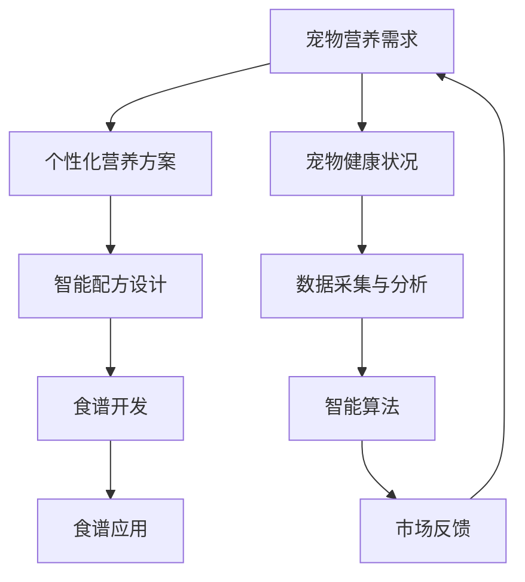

                 

### 第1章：引言与概述

#### 1.1 智能宠物健康食谱创业背景

近年来，随着人们生活水平的提高和对宠物健康关注度不断提升，宠物市场呈现出快速增长态势。据统计，全球宠物市场规模已超过千亿美元，其中宠物食品和宠物健康管理占据了大部分市场份额。在这个背景下，智能宠物健康食谱创业应运而生，为宠物主人提供更加专业、个性化的宠物营养服务。

智能宠物健康食谱创业的主要背景可以从以下几个方面来理解：

1. **宠物健康意识的提升**：随着社会的发展，人们对宠物健康的关注程度日益提高。越来越多的人意识到，只有给予宠物科学合理的饮食，才能确保其健康成长。

2. **科技的发展**：随着人工智能、大数据和互联网技术的迅速发展，为宠物健康食谱创业提供了强大的技术支持。通过数据分析和智能算法，可以为宠物提供量身定制的营养方案。

3. **市场需求的变化**：现代宠物主人对宠物的关爱不仅仅停留在物质层面，更关注宠物的生活质量。个性化、专业化的宠物营养服务正好满足了这部分消费者的需求。

4. **商业模式创新**：智能宠物健康食谱创业不仅关注宠物营养本身，还结合健康管理、宠物保险等多元化服务，为宠物主人提供全方位的宠物生活解决方案。

#### 1.2 个性化宠物营养的重要性

个性化宠物营养是指根据宠物的个体差异，为其提供符合其特定需求的饮食方案。这种营养模式相较于传统的一刀切喂养方式，具有以下优势：

1. **满足个体差异**：不同品种、年龄、健康状况的宠物对营养的需求有所不同。个性化宠物营养可以针对宠物的具体特点进行科学配餐，确保其营养均衡。

2. **提高宠物健康水平**：通过个性化营养，可以预防宠物因饮食不当导致的疾病，提高其整体健康水平。

3. **减少疾病风险**：针对宠物特定健康状况，个性化营养可以降低疾病发生的风险。例如，对于肥胖宠物，可以通过调整饮食结构，控制其体重，预防慢性病的发生。

4. **提升宠物生活质量**：个性化营养不仅关注宠物的身体健康，还关注其心理健康。通过科学的饮食，可以提升宠物的幸福感和生活质量。

#### 1.3 书籍目标与结构

本书籍旨在为智能宠物健康食谱创业者提供全方位的指导，帮助其深入了解个性化宠物营养的原理、方法及应用。具体目标如下：

1. **普及宠物营养知识**：通过详细讲解宠物营养基础，帮助读者建立系统的营养知识体系。

2. **探讨智能营养配方设计**：介绍智能营养配方设计的方法和工具，帮助创业者进行科学配餐。

3. **个性化宠物营养食谱开发**：阐述个性化食谱开发的流程和技巧，帮助创业者实现定制化服务。

4. **智能宠物营养食谱应用**：分析智能营养食谱在宠物养护和医疗中的应用，为创业者提供实战经验。

5. **智能宠物营养食谱创业实践**：通过实际案例，指导创业者进行创业实践，实现商业落地。

6. **未来展望与趋势**：展望智能宠物营养食谱行业的未来发展，为创业者提供战略指导。

本书结构安排如下：

- **第1章：引言与概述**：介绍智能宠物健康食谱创业的背景、重要性和书籍目标。
- **第2章：宠物营养基础**：讲解宠物营养的基本概念、需求分析及营养成分与宠物健康的关系。
- **第3章：智能宠物营养配方设计**：介绍智能营养配方设计的方法、评估和实例。
- **第4章：个性化宠物营养食谱开发**：阐述个性化食谱开发的流程、数据库构建及实例。
- **第5章：智能宠物营养食谱应用**：分析智能营养食谱在宠物养护、医疗和食品行业中的应用。
- **第6章：智能宠物营养食谱创业案例分析**：探讨创业机会、成功案例和风险应对策略。
- **第7章：智能宠物营养食谱创业实践**：指导创业者进行创业实践，包括技能、流程和实例。
- **第8章：未来展望与趋势**：展望智能宠物营养食谱行业的发展趋势和新技术的应用。

通过本书的阅读，读者将能够全面了解智能宠物健康食谱创业的各个环节，为实际操作提供有力支持。让我们一起来探索这个充满机遇的领域吧！

---

**核心概念与联系**

在智能宠物健康食谱创业中，理解以下几个核心概念及其相互联系至关重要。以下是使用Mermaid绘制的流程图，帮助我们梳理这些概念：



#### 核心概念解释

1. **宠物营养需求（A）**：根据宠物的年龄、体重、健康状况等个体差异，确定其所需的营养成分和热量。

2. **个性化营养方案（B）**：基于宠物营养需求，为其量身定制合适的饮食方案。

3. **智能配方设计（C）**：运用人工智能算法和大数据分析，优化营养配方的科学性和合理性。

4. **食谱开发（D）**：将智能配方转化为具体的食谱，满足宠物的个性化营养需求。

5. **食谱应用（E）**：将个性化食谱应用于宠物养护，确保其健康成长。

6. **宠物健康状况（F）**：通过监测宠物的健康状况，调整其营养方案，预防疾病。

7. **数据采集与分析（G）**：收集宠物及其饮食相关的数据，进行深入分析，为智能配方设计和食谱开发提供依据。

8. **智能算法（H）**：利用机器学习和数据挖掘技术，对大量数据进行处理，生成个性化营养方案。

9. **市场反馈（I）**：收集消费者对宠物营养产品的反馈，优化产品和服务。

#### 关联性分析

- 宠物营养需求（A）是整个智能宠物营养食谱创业的起点，直接影响个性化营养方案（B）的制定。
- 个性化营养方案（B）需要通过智能配方设计（C）实现，这依赖于数据采集与分析（G）和智能算法（H）的支持。
- 智能配方设计（C）和食谱开发（D）紧密相连，前者为后者提供科学依据，后者将前者转化为可执行的具体方案。
- 食谱应用（E）是将个性化营养方案落实到实际养护过程中的关键环节，同时为宠物健康状况（F）的监测提供数据支持。
- 宠物健康状况（F）的监测和反馈（I）可以不断优化营养方案，形成一个闭环系统，确保营养服务的持续改进。

通过以上流程图和概念解释，我们可以清晰地看到智能宠物健康食谱创业的核心要素及其相互关联，这为我们深入理解整个创业过程奠定了基础。

---

### 第2章：宠物营养基础

在智能宠物健康食谱创业中，了解宠物营养基础是至关重要的。这一章节将详细探讨宠物营养的基本概念、需求分析以及营养成分与宠物健康之间的关系。

#### 2.1 宠物营养的基本概念

宠物营养是指为满足宠物在生理和心理上对营养的需求，所提供的一系列营养成分。宠物营养的基本概念包括以下几个方面：

1. **能量**：能量是宠物体内进行各项生理活动的基础。宠物的能量需求取决于其体重、年龄、活动量等因素。

2. **蛋白质**：蛋白质是构成宠物身体细胞和组织的重要成分，对宠物的生长、修复和免疫功能至关重要。

3. **脂肪**：脂肪是宠物能量的重要来源，同时参与细胞膜的构成和激素的合成。

4. **碳水化合物**：碳水化合物是宠物的主要能量来源，主要包括糖类和膳食纤维。

5. **维生素和矿物质**：维生素和矿物质是宠物体内各种生化反应的必需辅助因子，对维持宠物的健康状态至关重要。

6. **水**：水是宠物体内最重要的成分，占宠物体重的60%-70%。水参与体内代谢、体温调节和营养物质的运输。

#### 2.2 宠物营养需求分析

宠物营养需求因品种、年龄、健康状况和活动量的不同而异。以下是对不同宠物营养需求的详细分析：

1. **幼宠**：幼宠处于快速生长发育阶段，对能量、蛋白质和矿物质的需求较高。同时，其消化系统尚未完全成熟，需要适量膳食纤维和易消化的食物。

2. **成年宠**：成年宠的能量需求相对稳定，但不同品种的宠物营养需求有所不同。例如，工作犬和运动犬的日常能量需求较高，而老年宠的能量需求可能较低。

3. **老年宠**：老年宠的代谢率降低，对蛋白质和脂肪的需求相对较高，而碳水化合物的需求则较低。同时，老年宠可能存在关节疾病、牙齿问题等健康问题，需要特殊营养支持。

4. **工作宠**：工作宠如警犬、导盲犬等，由于其高强度的工作需求，对能量和蛋白质的需求较高，同时需要适量补充矿物质和维生素。

5. **病宠**：病宠的营养需求会根据其具体病情而有所不同。例如，患有慢性疾病的宠物需要特殊营养支持，以改善其健康状况。

#### 2.3 营养成分与宠物健康的关系

营养成分的合理搭配对宠物的健康状态具有直接影响。以下是对不同营养成分与宠物健康关系的详细分析：

1. **蛋白质**：蛋白质是宠物身体组织和细胞的基本构建单元。蛋白质不足会导致宠物生长迟缓、体重下降、免疫功能下降等问题。

2. **脂肪**：脂肪是宠物能量来源的重要部分，同时也参与细胞膜的构成和激素的合成。脂肪不足会导致宠物皮肤问题、免疫力下降等问题。

3. **碳水化合物**：碳水化合物是宠物的主要能量来源，但摄入过多会导致肥胖和糖尿病等问题。适量的碳水化合物有助于维持宠物的能量需求和身体健康。

4. **维生素和矿物质**：维生素和矿物质是宠物体内各种生化反应的必需辅助因子。缺乏维生素和矿物质会导致宠物生长迟缓、免疫力下降、骨骼问题等问题。

5. **水**：水是宠物体内最重要的成分，参与体内代谢、体温调节和营养物质的运输。缺水会导致宠物脱水、新陈代谢紊乱等问题。

总之，了解宠物营养基础是智能宠物健康食谱创业的重要前提。通过科学合理的营养搭配，可以为宠物提供健康、均衡的饮食，从而提高其生活质量和健康状况。

---

**核心算法原理讲解**

### 2.2 宠物营养需求评估算法

在智能宠物健康食谱创业中，评估宠物的营养需求是至关重要的一环。以下将使用伪代码详细描述一个宠物营养需求评估算法，该算法基于宠物的个体信息（如年龄、体重、健康状况和活动量）来计算其所需的基本营养成分。

#### 算法伪代码

```plaintext
function assessNutritionalNeeds(petData):
    # 输入：宠物数据（年龄、体重、健康状况、活动量等）
    # 输出：营养需求参数（能量、蛋白质、脂肪、碳水化合物、维生素、矿物质等）

    # 初始化营养需求参数
    nutritionRequirements = {}

    # 根据宠物年龄和体重计算基础代谢率（BMR）
    BMR = calculateBMR(petData.age, petData.weight)

    # 根据宠物活动量调整BMR
    BMR = adjustBMR(BMR, petData.activityLevel)

    # 计算能量需求
    energyRequirement = BMR

    # 计算蛋白质需求量
    proteinRequirement = calculateProtein(BMR)

    # 计算脂肪需求量
    fatRequirement = calculateFat(BMR)

    # 计算碳水化合物需求量
    carbohydratesRequirement = calculateCarbohydrates(BMR)

    # 考虑宠物特定健康状况的调整
    nutritionRequirements = adjustForHealthConditions(nutritionRequirements, petData.health)

    # 将计算结果整合到营养需求参数中
    nutritionRequirements = {
        "energy": energyRequirement,
        "protein": proteinRequirement,
        "fat": fatRequirement,
        "carbohydrates": carbohydratesRequirement
    }

    # 返回营养需求参数
    return nutritionRequirements
```

#### 详细解释

1. **基础代谢率（BMR）计算**：
   - 基础代谢率是指宠物在安静状态下维持基本生理功能所需的最低能量消耗。BMR的计算公式通常为：\( BMR = \frac{体重 \times 身高 \times 年龄}{70} \)。
   - 这一公式是一个简化的计算模型，实际应用中可能需要根据宠物的具体品种、体型和生理状态进行调整。

2. **活动量调整**：
   - 宠物的活动量会影响其能量需求。通常，活动量越高，BMR越高。可以通过活动量系数（如1.2-1.8）来调整BMR，得到实际的能量需求。

3. **能量需求计算**：
   - 能量需求是根据BMR调整后的结果，代表宠物在一天内所需的总能量。

4. **蛋白质需求量计算**：
   - 蛋白质是宠物生长发育、细胞修复和免疫功能的重要物质。通常，蛋白质需求量为能量需求的百分比（如60%），具体数值需要根据宠物的年龄、健康状况等因素进行调整。

5. **脂肪需求量计算**：
   - 脂肪是高能量食物，主要用于提供能量。脂肪需求量为能量需求的百分比（如30%），但应确保不超过宠物的适宜摄入量，以避免肥胖和健康问题。

6. **碳水化合物需求量计算**：
   - 碳水化合物是宠物的主要能量来源。碳水化合物需求量为能量需求的百分比（如10%），但应确保摄入量适中，避免摄入过多导致健康问题。

7. **健康状况调整**：
   - 特定健康状况（如肥胖、糖尿病、关节炎等）可能会影响宠物的营养需求。在营养需求计算中，需要根据宠物的健康状况进行调整，以确保营养方案的合理性。

8. **整合营养需求参数**：
   - 将计算得到的各项营养成分整合到一个结构化的参数中，方便后续的食谱开发和调整。

通过上述算法，可以实现对宠物营养需求的科学评估，从而为个性化宠物健康食谱创业提供坚实的基础。

---

### 2.3 营养成分与宠物健康的关系

在宠物营养中，营养成分与宠物的健康状态有着密切的关系。合理的营养搭配不仅能满足宠物的生长需求，还能预防多种健康问题。以下是几种主要营养成分与宠物健康关系的详细分析。

#### 蛋白质

蛋白质是宠物体内的重要组成部分，对宠物的生长、细胞修复和免疫功能至关重要。以下是蛋白质对宠物健康的影响：

1. **促进生长**：蛋白质是细胞分裂和生长的必需物质，特别是对于幼宠和生长发育期的宠物，足够的蛋白质摄入对健康成长至关重要。

2. **修复损伤**：蛋白质参与身体组织的修复过程，当宠物受伤或生病时，需要更多的蛋白质来支持康复。

3. **增强免疫力**：蛋白质是免疫细胞和抗体的主要成分，足够的蛋白质摄入可以提高宠物的免疫力，预防疾病。

4. **预防皮肤病**：蛋白质不足可能导致皮肤干燥、毛发脱落等问题。适量补充蛋白质有助于改善皮肤健康，预防皮肤病。

#### 脂肪

脂肪是宠物能量的重要来源，同时也是许多激素和细胞膜的组成部分。以下是脂肪对宠物健康的影响：

1. **提供能量**：脂肪是高能量食物，能为宠物提供长时间的活动和运动所需的能量。

2. **维持体温**：脂肪有助于宠物维持正常的体温，特别是在寒冷的环境中。

3. **支持激素合成**：脂肪是许多激素的合成基础，如性激素、肾上腺素等。

4. **改善皮肤健康**：适量的脂肪摄入有助于保持宠物的皮肤和毛发健康，预防干燥和皮肤病。

5. **预防肥胖**：虽然脂肪是高能量食物，但过量摄入会导致肥胖。因此，应控制脂肪的摄入量，特别是对工作量大、易肥胖的宠物。

#### 碳水化合物

碳水化合物是宠物能量的主要来源，主要包括糖类和膳食纤维。以下是碳水化合物对宠物健康的影响：

1. **提供能量**：碳水化合物能够快速为宠物提供能量，适用于高活动量的宠物。

2. **维持血糖水平**：适量的碳水化合物摄入有助于维持宠物的血糖水平，防止低血糖或高血糖问题。

3. **支持肠道健康**：膳食纤维有助于促进肠道蠕动，维持肠道健康，预防便秘和肠道疾病。

4. **预防肥胖**：虽然碳水化合物是能量来源，但过量摄入会导致肥胖。因此，应控制碳水化合物的摄入量，特别是对高活动量的宠物。

#### 维生素和矿物质

维生素和矿物质是宠物体内多种生化反应的必需辅助因子，对维持宠物健康至关重要。以下是维生素和矿物质对宠物健康的影响：

1. **支持免疫反应**：维生素如维生素C和维生素E、矿物质如锌和硒等，能够增强宠物的免疫力，预防感染和疾病。

2. **维持骨骼健康**：矿物质如钙、磷和镁等对宠物的骨骼发育和维持骨骼健康至关重要。

3. **促进生长**：维生素和矿物质参与身体的生长和发育过程，对幼宠和生长发育期的宠物尤为重要。

4. **维持皮肤和毛发健康**：维生素如维生素A和维生素E对皮肤和毛发的健康有重要作用，缺乏这些维生素可能导致皮肤干燥、毛发脱落等问题。

5. **预防贫血和神经系统问题**：矿物质如铁和维生素B群对宠物的血液健康和神经系统功能至关重要，缺乏这些物质可能导致贫血和神经系统问题。

总之，了解营养成分与宠物健康的关系，对于制定科学合理的宠物营养方案具有重要意义。通过合理的营养搭配，可以确保宠物获得足够的营养，维持其健康和幸福。

---

### 第3章：智能宠物营养配方设计

智能宠物营养配方设计是智能宠物健康食谱创业的核心环节，旨在通过科学的方法和先进的技术手段，为宠物量身定制合理的营养方案。本章将详细介绍智能宠物营养配方设计的方法、宠物营养需求评估以及营养配方实例解析。

#### 3.1 智能宠物营养配方设计方法

智能宠物营养配方设计方法主要包括以下几个步骤：

1. **数据采集**：收集宠物的基本信息（如品种、年龄、体重、健康状况等）以及饮食习惯和活动量等数据。

2. **营养需求评估**：根据宠物的数据，使用算法评估其基础代谢率（BMR）、能量需求以及蛋白质、脂肪、碳水化合物等营养成分的需求。

3. **智能算法应用**：利用机器学习和数据挖掘技术，对大量营养数据和宠物健康数据进行处理，生成个性化营养方案。

4. **营养配方优化**：根据评估结果，结合宠物营养学原则，优化营养配方的科学性和合理性，确保营养均衡。

5. **食谱开发**：将营养配方转化为具体的食谱，包括每日餐食和营养摄入量，确保宠物能够获得足够的营养。

6. **营养监测与调整**：对宠物进行营养监测，根据其实际健康状况和体重变化，调整营养方案，确保其营养需求得到满足。

#### 3.2 宠物营养需求评估

宠物营养需求评估是智能营养配方设计的基础，通过准确评估宠物的营养需求，可以为配方设计提供科学依据。以下是宠物营养需求评估的主要步骤：

1. **基础代谢率（BMR）计算**：
   - 基础代谢率是指宠物在安静状态下维持基本生理功能所需的最低能量消耗。常用的BMR计算公式为：\( BMR = \frac{体重 \times 身高 \times 年龄}{70} \)。

2. **能量需求计算**：
   - 能量需求是根据宠物的活动量和基础代谢率调整后的结果。通常，能量需求可以通过以下公式计算：\( 能量需求 = BMR \times 活动量系数 \)。

3. **营养成分需求计算**：
   - 根据宠物的能量需求，可以进一步计算蛋白质、脂肪、碳水化合物等营养成分的需求。通常，营养成分需求可以通过以下公式计算：
     - 蛋白质需求量 = 能量需求 \* 蛋白质比例（如60%）
     - 脂肪需求量 = 能量需求 \* 脂肪比例（如30%）
     - 碳水化合物需求量 = 能量需求 \* 碳水化合物比例（如10%）

4. **健康调整**：
   - 根据宠物的健康状况，如肥胖、糖尿病、关节炎等，对营养需求进行适当调整，确保营养方案的合理性。

#### 3.3 营养配方实例解析

以下是一个智能宠物营养配方的实例解析，通过具体的数据和计算过程，展示如何为宠物制定科学的营养方案。

#### 实例：智能宠物营养配方设计

**1. 数据采集**：
- 品种：边境牧羊犬
- 年龄：3岁
- 体重：15公斤
- 健康状况：健康
- 活动量：中等

**2. 营养需求评估**：

- **基础代谢率（BMR）计算**：
  \( BMR = \frac{15 \times 0.5 \times 3}{70} = 1.35 \, \text{千克卡/天} \)

- **能量需求计算**：
  \( 能量需求 = BMR \times 活动量系数（1.5）= 1.35 \times 1.5 = 2.025 \, \text{千克卡/天} \)

- **营养成分需求计算**：
  - 蛋白质需求量：\( 2.025 \times 0.6 = 1.215 \, \text{千克/天} \)
  - 脂肪需求量：\( 2.025 \times 0.3 = 0.6075 \, \text{千克/天} \)
  - 碳水化合物需求量：\( 2.025 \times 0.1 = 0.2025 \, \text{千克/天} \)

**3. 营养配方优化**：
- 根据营养需求计算结果，选择合适的宠物食品，如鸡肉、牛肉、鱼类等，确保蛋白质、脂肪、碳水化合物的比例合理。
- 考虑到宠物的健康，增加鱼类中的omega-3脂肪酸摄入，减少牛羊肉中的脂肪含量。

**4. 营养食谱开发**：

- **每日餐食计划**：
  - 早餐：鸡肉米饭（100克鸡肉，50克米饭）
  - 中餐：牛肉蔬菜（100克牛肉，150克蔬菜）
  - 晚餐：鱼类胡萝卜（100克鱼类，50克胡萝卜）

- **营养摄入量**：
  - 蛋白质：1.2克/餐
  - 脂肪：0.6克/餐
  - 碳水化合物：0.4克/餐

**5. 营养监测与调整**：
- 定期监测宠物的体重和健康状况，根据监测结果调整营养食谱，确保营养需求的满足。

通过以上步骤，我们为一只3岁的边境牧羊犬制定了一套智能营养配方。这个实例展示了如何通过科学的方法和智能算法，为宠物提供合理的营养方案，确保其健康成长。

---

### 4.1 个性化宠物营养食谱开发流程

个性化宠物营养食谱开发是一个系统性的过程，旨在通过科学的方法和先进的技术，为宠物提供量身定制的营养方案。以下是详细的个性化宠物营养食谱开发流程：

#### 4.1.1 数据收集与预处理

1. **宠物基本信息**：收集宠物的品种、年龄、体重、性别、健康状况等基本信息。
2. **饮食习惯**：了解宠物的饮食习惯，包括喜欢和不喜欢的食物、过敏食物等。
3. **活动量**：评估宠物的日常活动量，如户外运动、室内活动、工作时间等。
4. **健康记录**：收集宠物的健康记录，包括疾病史、手术史、药物使用等。

5. **数据预处理**：对收集到的数据进行分析和清洗，去除重复和异常数据，确保数据的准确性和完整性。

#### 4.1.2 营养需求评估

1. **基础代谢率（BMR）计算**：根据宠物的体重、年龄和活动量，计算其基础代谢率（BMR）。
2. **能量需求计算**：根据宠物的BMR和活动量，计算其每日的能量需求。
3. **营养成分需求计算**：根据宠物的能量需求，计算蛋白质、脂肪、碳水化合物等营养成分的需求。

#### 4.1.3 食谱设计

1. **食物选择**：根据宠物的营养需求和饮食习惯，选择合适的食物，如肉类、鱼类、蔬菜、谷物等。
2. **营养均衡**：确保食谱中的营养成分均衡，满足宠物的营养需求。
3. **食物比例**：根据营养需求，调整食物的比例，确保蛋白质、脂肪、碳水化合物的比例合理。
4. **口味调整**：根据宠物的口味偏好，适当调整食谱中的食物种类和比例，提高宠物的接受度。

#### 4.1.4 食谱验证

1. **健康监测**：实施食谱前，对宠物进行健康检查，确保其身体状况良好。
2. **食谱实施**：按照设计的食谱，为宠物制定每日的餐食计划。
3. **数据反馈**：实施食谱后，定期收集宠物的体重、健康状况等数据，分析食谱的实际效果。
4. **食谱调整**：根据反馈数据，对食谱进行调整，确保宠物的营养需求得到满足。

#### 4.1.5 长期跟踪与维护

1. **定期评估**：定期对宠物的营养需求和健康状况进行评估，确保食谱的持续有效性。
2. **健康监测**：定期对宠物的体重、健康状况等指标进行监测，及时发现并解决问题。
3. **食谱更新**：根据宠物的成长和变化，定期更新食谱，确保其营养需求得到满足。

通过以上步骤，可以有效地开发出个性化宠物营养食谱，确保宠物获得科学的营养支持，促进其健康成长。

---

### 4.2 宠物营养数据库构建

在个性化宠物营养食谱开发中，构建一个高效的宠物营养数据库至关重要。这个数据库不仅需要存储丰富的食物信息，还需要具备快速检索和数据分析的能力。以下是构建宠物营养数据库的详细步骤和方法。

#### 4.2.1 数据收集

1. **基础数据收集**：首先，收集宠物常见食物的基本信息，包括食物名称、营养成分（如蛋白质、脂肪、碳水化合物、维生素和矿物质等）以及能量含量。

2. **来源验证**：确保数据的来源可靠，如来自权威的宠物营养学书籍、营养数据库或专业研究机构。

3. **扩展数据收集**：除了基础数据，还可以收集食物的过敏信息、适合的宠物品种、特殊营养需求等。

#### 4.2.2 数据清洗与预处理

1. **数据清洗**：去除重复数据、缺失数据和异常数据，确保数据的准确性和一致性。

2. **数据格式统一**：将不同来源的数据格式统一，如将营养成分的单位和数值标准化。

3. **数据校验**：对数据进行校验，确保其符合宠物营养学原则，如蛋白质、脂肪和碳水化合物的比例合理。

#### 4.2.3 数据存储设计

1. **关系型数据库**：选择关系型数据库（如MySQL、PostgreSQL）来存储宠物营养数据。关系型数据库具有良好的数据管理和查询性能。

2. **数据库表设计**：
   - **食物表**：存储食物的基本信息，如食物名称、营养成分、能量含量等。
   - **宠物品种表**：存储不同宠物品种的详细信息，如品种名称、特征、营养需求等。
   - **过敏表**：存储食物过敏信息，如过敏食物、过敏宠物品种等。

3. **索引设计**：为常用查询字段创建索引，如食物名称、营养成分等，以提高查询速度。

#### 4.2.4 数据库操作与维护

1. **数据插入**：通过SQL语句将收集到的食物信息插入到数据库中。

2. **数据检索**：使用SQL语句进行数据检索，如查询特定营养成分的食物、适合特定宠物品种的食物等。

3. **数据更新**：定期更新数据库中的数据，如添加新食物、更新营养成分等。

4. **数据备份**：定期备份数据库，确保数据的安全性和完整性。

#### 4.2.5 数据分析与应用

1. **营养需求分析**：基于数据库中的食物信息和宠物的营养需求，进行营养需求分析，为宠物制定个性化的营养食谱。

2. **数据可视化**：使用数据可视化工具（如图表、地图等）展示数据分析结果，帮助用户更好地理解营养数据。

3. **应用程序集成**：将数据库集成到宠物营养管理应用程序中，为用户提供便捷的查询和营养分析功能。

通过以上步骤，可以构建一个高效、可靠的宠物营养数据库，为个性化宠物营养食谱开发提供坚实的数据支持。

---

### 4.3 实例：个性化宠物营养食谱设计

为了更好地展示个性化宠物营养食谱的设计过程，以下将结合一个具体案例，详细解析如何为一只5岁的金毛犬制定一份个性化的营养食谱。

#### 案例背景

**宠物信息**：
- **品种**：金毛犬
- **年龄**：5岁
- **体重**：50公斤
- **健康状况**：健康，无特殊疾病
- **活动量**：中等，每天进行1-2小时户外活动
- **饮食偏好**：喜欢鸡肉、牛肉，不喜欢鱼类

#### 1. 营养需求评估

**基础代谢率（BMR）计算**：
\[ BMR = \frac{体重 \times 身高 \times 年龄}{70} \]
假设金毛犬的身高为60厘米，则：
\[ BMR = \frac{50 \times 0.6 \times 5}{70} = 4.2857 \, \text{千克卡/天} \]

**活动量调整**：
\[ BMR_{调整后} = BMR \times 活动量系数（1.5）= 4.2857 \times 1.5 = 6.428 \, \text{千克卡/天} \]

**能量需求计算**：
\[ 能量需求 = BMR_{调整后} = 6.428 \, \text{千克卡/天} \]

**营养成分需求计算**：
- **蛋白质需求量**：\( 能量需求 \times 0.6 = 6.428 \times 0.6 = 3.865 \, \text{千克/天} \)
- **脂肪需求量**：\( 能量需求 \times 0.3 = 6.428 \times 0.3 = 1.9284 \, \text{千克/天} \)
- **碳水化合物需求量**：\( 能量需求 \times 0.1 = 6.428 \times 0.1 = 0.6428 \, \text{千克/天} \)

#### 2. 食物选择与配方优化

根据金毛犬的营养需求，选择以下食物：
- **鸡肉**：富含蛋白质，适合金毛犬的口味。
- **牛肉**：提供优质蛋白质和铁元素。
- **蔬菜**：提供维生素、矿物质和膳食纤维。

**每日餐食计划**：

**早餐**：
- 鸡肉米饭：100克鸡肉，50克米饭

**中餐**：
- 牛肉蔬菜：100克牛肉，150克蔬菜（如胡萝卜、西兰花）

**晚餐**：
- 鸡肉胡萝卜：100克鸡肉，50克胡萝卜

**营养摄入量**：
- **蛋白质**：每日总蛋白质摄入量为3.865千克，分配到三餐中，每餐约1.2925千克。
- **脂肪**：每日总脂肪摄入量为1.9284千克，分配到三餐中，每餐约0.6428千克。
- **碳水化合物**：每日总碳水化合物摄入量为0.6428千克，分配到三餐中，每餐约0.2113千克。

#### 3. 食谱验证与调整

**食谱验证**：
- 在实施食谱前，对金毛犬进行健康检查，确保其身体状况良好。

**食谱实施**：
- 按照制定的食谱，每日为金毛犬提供早餐、中餐和晚餐。

**数据反馈**：
- 实施食谱后，定期记录金毛犬的体重和健康状况，分析食谱的实际效果。

**食谱调整**：
- 根据金毛犬的体重变化和健康状况，对食谱进行适当调整，确保营养需求的满足。

通过以上步骤，我们为一只5岁的金毛犬制定了一份个性化的营养食谱。这个案例展示了如何通过科学的方法和智能算法，为宠物提供合理的营养方案，确保其健康成长。

---

### 5.1 智能宠物营养食谱在宠物养护中的应用

智能宠物营养食谱在宠物养护中的应用具有显著的优势，通过科学合理的营养方案，可以显著提升宠物的健康状况和生活质量。以下是智能宠物营养食谱在宠物养护中的应用及其优势：

#### **1. 个性化营养方案**

智能宠物营养食谱的核心在于个性化营养方案。根据宠物的品种、年龄、体重、健康状况和活动量，为宠物量身定制科学合理的营养方案。这种个性化营养方案能够满足宠物的特定需求，避免营养过剩或不足，从而预防因饮食不当导致的健康问题。

#### **2. 促进宠物健康成长**

通过智能营养食谱，宠物可以获得均衡的营养摄入，促进其健康成长。特别是对于幼宠和发育期的宠物，合理的营养配比有助于其骨骼和肌肉的发育，提高免疫系统的功能，降低患病风险。同时，对于老年宠物，智能营养食谱能够减缓因年龄增长导致的健康问题，如关节退化、体重增加等。

#### **3. 改善宠物行为问题**

某些行为问题，如过度焦虑、攻击性行为等，可能与宠物的营养状况有关。智能宠物营养食谱通过调整营养成分，可以改善宠物的行为问题。例如，通过增加ω-3脂肪酸的摄入，可以缓解宠物的焦虑情绪；通过控制糖分和碳水化合物的摄入，可以减少宠物过度兴奋和攻击性行为。

#### **4. 预防疾病**

智能宠物营养食谱通过科学合理的营养搭配，可以预防多种宠物疾病。例如，通过增加抗氧化剂如维生素C和维生素E的摄入，可以增强宠物的免疫力，预防感染性疾病；通过控制脂肪和蛋白质的摄入量，可以预防肥胖和慢性病。

#### **5. 提升宠物生活质量**

智能宠物营养食谱不仅关注宠物的身体健康，还关注其心理健康。通过提供营养均衡的饮食，宠物可以保持良好的体能和心情，提升其整体生活质量。例如，健康的饮食可以改善宠物的皮肤和毛发质量，提高其活力和幸福感。

#### **案例解析：金毛犬的健康养护**

以一只5岁的金毛犬为例，通过智能宠物营养食谱，我们为其制定了以下营养方案：

**早餐**：
- 鸡肉米饭：100克鸡肉，50克米饭
- **营养成分**：提供优质蛋白质、碳水化合物和少量脂肪，满足早晨的能量需求。

**中餐**：
- 牛肉蔬菜：100克牛肉，150克蔬菜（如胡萝卜、西兰花）
- **营养成分**：提供蛋白质、维生素和矿物质，增强免疫力，促进消化。

**晚餐**：
- 鸡肉胡萝卜：100克鸡肉，50克胡萝卜
- **营养成分**：提供蛋白质、碳水化合物和膳食纤维，有助于夜间的消化和休息。

**零食**：
- 坚果：适量
- **营养成分**：提供健康的脂肪和微量元素，增强宠物体质。

通过这个智能宠物营养食谱，金毛犬的饮食结构得到了优化，营养均衡，从而改善了其健康状况，提升了生活质量。定期监测金毛犬的体重和健康状况，根据实际情况调整食谱，确保其营养需求得到满足。

总之，智能宠物营养食谱在宠物养护中的应用，通过个性化营养方案、促进健康成长、改善行为问题、预防疾病和提升生活质量等方面，为宠物主人提供了科学的宠物养护解决方案。

---

### 5.2 智能宠物营养食谱在宠物医疗中的应用

智能宠物营养食谱在宠物医疗中的应用正日益受到重视，它不仅为病患宠物提供科学合理的饮食指导，还能辅助治疗多种疾病。以下是智能宠物营养食谱在宠物医疗中的具体应用及其优势：

#### **1. 辅助疾病治疗**

智能宠物营养食谱可以根据宠物的具体疾病，为其制定特殊的饮食方案。例如，对于患有糖尿病的宠物，需要严格控制其碳水化合物的摄入，确保血糖水平的稳定；对于患有肾脏疾病的宠物，需要减少蛋白质和磷的摄入，减轻肾脏负担。智能营养食谱通过精准的营养调配，有助于疾病的控制和治疗。

**案例**：一只患有慢性肾病的老年猫，通过智能营养食谱减少了高蛋白和高磷的食物摄入，增加了低蛋白、高纤维的食物，如鸡肉和蔬菜。经过一段时间的治疗，该猫咪的肾功能得到了改善，临床症状明显缓解。

#### **2. 支持康复期宠物**

在宠物康复期间，智能宠物营养食谱能够为宠物提供适宜的营养，促进身体恢复。例如，对于刚进行过手术的宠物，需要提供易消化、营养丰富的食物，以支持其术后恢复。智能营养食谱通过调整食物的种类和比例，确保宠物在康复期获得充足的营养，加速恢复。

**案例**：一只刚进行过绝育手术的金毛犬，通过智能营养食谱，饮食中增加了富含蛋白质和纤维的食物，如鸡肉和蔬菜，减少了脂肪和糖分的摄入。术后恢复顺利，体重和健康状况逐渐恢复正常。

#### **3. 管理慢性疾病**

慢性疾病如肥胖、关节炎等需要长期的管理和控制。智能宠物营养食谱通过控制能量摄入、调整脂肪和蛋白质的比例，帮助宠物控制体重和减轻关节负担。同时，智能营养食谱还可以添加特定营养素，如ω-3脂肪酸，以改善症状和增强免疫功能。

**案例**：一只患有肥胖症和关节炎的拉布拉多犬，通过智能营养食谱，减少了高脂肪和高糖的食物摄入，增加了富含纤维和蛋白质的食物，如鸡肉和燕麦。经过一段时间的调整，该犬的体重得到了控制，关节炎症状也有所缓解。

#### **4. 提供个性化治疗建议**

智能宠物营养食谱结合宠物健康数据和医疗数据，为宠物主人提供个性化的治疗建议。通过数据分析和智能算法，营养师可以为宠物制定最优的营养方案，确保治疗效果最大化。

**案例**：一只患有皮肤炎的贵宾犬，通过智能营养食谱，减少了可能导致过敏的食物摄入，增加了富含抗氧化剂的食物，如胡萝卜和蓝莓。同时，根据医生的建议，添加了特定的营养补充剂，经过一段时间的治疗，该犬的皮肤炎症得到了显著改善。

#### **总结**

智能宠物营养食谱在宠物医疗中的应用，不仅为病患宠物提供了科学合理的饮食指导，还通过个性化治疗建议和支持康复期宠物的营养需求，显著提升了治疗效果和宠物的整体健康水平。随着科技的不断进步，智能宠物营养食谱将在宠物医疗领域发挥更大的作用。

---

### 5.3 智能宠物营养食谱在宠物食品行业中的应用

智能宠物营养食谱在宠物食品行业中的应用，正迅速改变着这个领域的商业模式和市场格局。以下是智能宠物营养食谱在宠物食品行业中的具体应用及其带来的影响：

#### **1. 定制化宠物食品生产**

随着消费者对宠物健康和个性化需求的重视，宠物食品行业正从传统的批量生产模式向定制化生产模式转变。智能宠物营养食谱可以为宠物主人提供个性化的营养方案，指导宠物食品制造商根据具体需求生产定制化食品。这种定制化生产模式不仅提高了宠物食品的附加值，还增强了消费者的满意度和忠诚度。

**案例**：某宠物食品公司开发了一款基于智能宠物营养食谱的定制化狗粮。通过收集宠物的基本信息和健康数据，公司使用智能算法为每只狗定制专属的饮食方案。这种个性化服务受到了宠物主人的热烈欢迎，公司销量显著增加。

#### **2. 营养成分优化**

智能宠物营养食谱能够为宠物食品行业提供科学依据，帮助制造商优化产品中的营养成分。通过分析大量数据，智能算法可以确定不同宠物品种、年龄和健康状况下的营养需求，从而调整食品的配方，确保其营养均衡、科学合理。

**案例**：某宠物食品公司通过智能宠物营养食谱，对其生产的高档狗粮进行营养成分优化。他们根据不同品种狗的营养需求，调整了食品中的蛋白质、脂肪和碳水化合物比例，使其更适合各品种狗的消化吸收和健康需求。这一调整显著提高了产品的市场竞争力。

#### **3. 市场细分与精准营销**

智能宠物营养食谱的应用，使得宠物食品行业能够更好地进行市场细分和精准营销。通过分析宠物的数据，企业可以了解不同类型宠物的营养需求，从而开发针对性的产品，满足不同消费者的需求。此外，智能算法还可以根据宠物的健康数据，提供个性化的营养建议，引导消费者进行购买。

**案例**：某宠物食品公司利用智能宠物营养食谱，开发了针对老年宠物、幼宠和工作宠的不同系列食品。通过精准的营销策略，该公司成功吸引了不同年龄和类型的宠物主人，市场份额稳步提升。

#### **4. 数据驱动的供应链管理**

智能宠物营养食谱不仅为宠物食品制造商提供了营养配方的优化方案，还促进了供应链管理的优化。通过数据分析和智能算法，企业可以预测市场需求，合理安排原材料采购和产品生产，降低库存成本，提高运营效率。

**案例**：某宠物食品公司通过智能算法分析宠物营养食谱的需求趋势，优化了其供应链管理。他们根据市场需求，调整了原材料采购和产品生产计划，实现了供应链的高效运作，减少了浪费，提高了利润率。

#### **总结**

智能宠物营养食谱在宠物食品行业中的应用，不仅提升了产品的附加值和市场竞争力，还推动了行业的创新和变革。通过定制化生产、营养成分优化、市场细分和精准营销，智能宠物营养食谱为宠物食品行业带来了新的增长点和发展机遇。随着科技的不断进步，智能宠物营养食谱将在宠物食品行业中发挥越来越重要的作用。

---

### 6.1 智能宠物营养食谱创业机会分析

智能宠物营养食谱创业领域蕴藏着丰富的商机，吸引了众多创业者投身其中。以下将从市场需求、技术进步、政策环境和竞争态势等方面，对智能宠物营养食谱创业机会进行详细分析。

#### **1. 市场需求**

随着人们生活水平的提高和宠物数量的持续增长，宠物健康管理需求日益增加。智能宠物营养食谱作为一种创新的服务模式，能够满足现代宠物主人对专业、个性化服务的需求。以下是市场需求的具体表现：

- **个性化服务需求**：越来越多的宠物主人愿意为宠物提供个性化的营养服务，以确保宠物获得最佳的饮食和健康状态。
- **健康意识提升**：宠物主人对宠物健康的关注度不断提升，愿意花费更多的时间和金钱在宠物的健康管理和营养保健上。
- **宠物老龄化**：随着宠物寿命的延长，老年宠物的健康需求日益突出，智能宠物营养食谱在满足老年宠物特殊营养需求方面具有巨大潜力。

#### **2. 技术进步**

智能宠物营养食谱创业的兴起，得益于技术进步带来的诸多优势。以下是技术进步对创业机会的推动作用：

- **人工智能应用**：人工智能技术能够对大量宠物营养数据进行处理和分析，为宠物主人提供科学合理的营养建议。这为创业者提供了强大的技术支持，提高了个性化服务的准确性。
- **大数据分析**：通过大数据分析，创业者可以深入了解市场需求和消费者行为，制定更加精准的营销策略和产品开发方向。
- **物联网技术**：物联网技术可以实时监测宠物的饮食和健康状况，为创业者提供宝贵的数据支持，从而更好地优化营养食谱。

#### **3. 政策环境**

政府对于宠物健康和宠物行业的关注和支持，为智能宠物营养食谱创业提供了良好的政策环境。以下是政策环境的具体表现：

- **行业规范制定**：政府正在逐步完善宠物行业的法律法规和行业标准，为创业者提供了明确的运营规范。
- **政策扶持**：政府对新兴宠物健康服务行业提供了税收优惠、资金支持等政策扶持措施，降低了创业门槛。
- **健康宣传**：政府通过健康宣传，提高了公众对宠物健康的重视程度，为智能宠物营养食谱创业创造了良好的市场氛围。

#### **4. 竞争态势**

智能宠物营养食谱创业领域竞争激烈，但同时也存在着广阔的市场空间。以下是竞争态势的具体表现：

- **市场参与者多样化**：除了专业的宠物营养公司外，许多食品公司和互联网企业也纷纷进入宠物营养领域，推动了市场的快速发展。
- **差异化竞争**：在激烈的竞争中，创业者通过差异化竞争策略，如技术创新、个性化服务、品牌塑造等，争取市场份额。
- **合作机会**：不同类型的创业者和企业之间存在着广泛的合作机会，如技术与服务的结合、品牌与渠道的合作等。

#### **案例解析**

以下是一个智能宠物营养食谱创业案例，展示了创业机会的具体实践。

**案例**：某初创企业“宠营养”，致力于通过智能算法为宠物主人提供个性化营养方案。以下是该企业的创业过程：

1. **市场调研**：企业首先进行了市场调研，了解了宠物主人的需求和痛点，发现个性化营养服务市场潜力巨大。

2. **技术研发**：企业投入大量资源进行技术研发，开发了一款基于人工智能和大数据分析的宠物营养管理系统。该系统能够根据宠物的数据，为其提供科学合理的营养建议。

3. **产品开发**：企业结合营养管理系统的建议，开发了一系列定制化的宠物食品，如针对老年宠物的营养补充剂、针对幼宠的生长营养餐等。

4. **市场推广**：企业通过线上和线下的渠道，积极推广其产品和服务，吸引了大量宠物主人的关注和购买。

5. **用户反馈**：企业重视用户反馈，不断优化产品和服务，通过数据分析，了解用户需求和市场趋势，为后续产品开发提供参考。

通过以上步骤，企业成功地进入了智能宠物营养食谱市场，并取得了显著的成绩。该案例展示了智能宠物营养食谱创业的具体实践，为其他创业者提供了宝贵的经验和启示。

总之，智能宠物营养食谱创业领域充满了机遇和挑战。创业者应抓住市场机遇，利用技术优势，提供专业、个性化的服务，满足宠物主人的需求。同时，要关注政策环境和竞争态势，不断创新和优化，确保企业的持续发展和市场竞争力。

---

### 6.2 成功案例分析

在智能宠物营养食谱创业领域，已经涌现出了一些成功的案例，这些案例不仅展示了创业项目的成功之道，还为其他创业者提供了宝贵的经验和启示。以下是对几个成功案例的详细解析。

#### **案例一：PetNutrition**

**项目概述**：PetNutrition 是一家专注于为宠物主人提供个性化营养解决方案的公司。通过结合人工智能和大数据分析，PetNutrition 提供定制化的宠物营养食谱，帮助宠物主人更好地照顾宠物。

**成功要素**：
- **技术创新**：公司采用了先进的机器学习算法，对大量宠物营养数据进行处理和分析，为宠物主人提供科学合理的营养建议。
- **用户参与**：PetNutrition 注重用户参与，通过用户反馈不断优化产品和服务，确保其满足宠物主人的需求。
- **品牌塑造**：公司通过高质量的产品和服务，建立了良好的品牌形象，赢得了客户的信任和忠诚。

**经验分享**：PetNutrition 的成功表明，技术创新和用户参与是智能宠物营养食谱创业的关键。此外，建立强大的品牌形象也是确保长期成功的重要因素。

#### **案例二：FurryFoodies**

**项目概述**：FurryFoodies 是一家提供高端宠物食品定制服务的公司，专注于为宠物主人提供高品质、个性化的宠物饮食方案。

**成功要素**：
- **高品质产品**：FurryFoodies 采用了精选的高品质食材，确保宠物食品的营养丰富和安全。
- **个性化服务**：公司提供一对一的营养顾问服务，根据宠物的具体情况，为宠物主人制定专属的营养食谱。
- **品牌差异化**：FurryFoodies 通过提供独特的产品和服务，成功在市场中脱颖而出，吸引了大量高端宠物主人的关注。

**经验分享**：FurryFoodies 的成功经验表明，高品质产品和个性化服务是宠物食品行业成功的关键。此外，品牌差异化也是企业脱颖而出的重要策略。

#### **案例三：PetWellNutrition**

**项目概述**：PetWellNutrition 是一家提供宠物营养咨询和定制化营养食谱的公司，专注于解决宠物健康问题，提供专业的营养解决方案。

**成功要素**：
- **专业团队**：公司拥有专业的营养师和兽医团队，确保提供的营养建议和食谱科学合理。
- **严格质量控制**：公司对产品进行严格的质量控制，确保食品安全和营养效果。
- **市场定位明确**：PetWellNutrition 明确其市场定位，专注于为那些寻求专业健康解决方案的宠物主人提供服务。

**经验分享**：PetWellNutrition 的成功经验表明，专业团队和严格质量控制是提供高质量营养服务的基石。此外，明确的市场定位有助于企业专注于特定领域，实现专业化和规模化。

#### **总结**

以上成功案例展示了智能宠物营养食谱创业的多条成功路径。无论是技术创新、高品质产品、个性化服务还是专业团队，都是确保企业成功的关键要素。创业者可以从这些案例中汲取经验，结合自身实际情况，制定适合自己的创业策略。

---

### 6.3 创业风险与应对策略

在智能宠物营养食谱创业过程中，创业者需要充分认识到可能面临的风险，并制定相应的应对策略，以确保企业的稳健发展。以下将分析智能宠物营养食谱创业过程中可能遇到的主要风险及其应对策略。

#### **1. 市场风险**

**风险描述**：市场风险主要指市场需求波动、消费者偏好变化等因素可能导致企业销售不稳定。

**应对策略**：
- **市场调研**：定期进行市场调研，了解消费者需求和市场趋势，及时调整产品和服务策略。
- **多元化产品**：开发多样化的宠物营养产品，满足不同消费者的需求，降低市场风险。

#### **2. 技术风险**

**风险描述**：技术风险主要指技术创新不足、数据安全等问题，可能导致企业竞争力下降。

**应对策略**：
- **持续创新**：投入研发资源，持续推动技术创新，保持企业的技术优势。
- **数据安全**：建立完善的数据安全管理体系，确保客户数据的安全和隐私。

#### **3. 竞争风险**

**风险描述**：竞争风险主要指市场竞争激烈，其他企业可能通过更优质的产品和服务抢占市场份额。

**应对策略**：
- **差异化竞争**：通过提供独特的价值主张，如个性化服务、高品质产品等，打造核心竞争力。
- **品牌建设**：加强品牌建设，提高品牌知名度和美誉度，增强消费者的品牌忠诚度。

#### **4. 法规风险**

**风险描述**：法规风险主要指法律法规变化，可能对企业运营造成不利影响。

**应对策略**：
- **合规经营**：了解相关法律法规，确保企业运营符合法规要求。
- **政策关注**：密切关注政策动态，及时调整经营策略，以应对法规变化。

#### **5. 供应链风险**

**风险描述**：供应链风险主要指原材料供应不稳定、物流成本高等问题，可能影响企业的生产和销售。

**应对策略**：
- **供应链管理**：优化供应链管理，确保原材料供应稳定和物流成本可控。
- **多元化供应**：建立多元化的供应商体系，降低供应链风险。

#### **6. 财务风险**

**风险描述**：财务风险主要指企业资金不足、融资困难等问题，可能影响企业的正常运营。

**应对策略**：
- **资金规划**：制定详细的资金规划，确保企业有足够的资金应对各种经营需求。
- **融资渠道**：拓宽融资渠道，如银行贷款、风险投资等，确保企业的资金来源多样化。

通过上述应对策略，智能宠物营养食谱创业者可以有效地识别和应对潜在风险，确保企业的稳健发展和持续增长。

---

### 6.4 智能宠物营养食谱创业实战指南

#### **7.1 创业者需具备的技能与知识**

智能宠物营养食谱创业涉及多个领域，创业者需要具备以下技能与知识：

1. **营养学知识**：了解宠物营养学的基本原理，掌握不同品种宠物的营养需求，能够制定科学的营养食谱。

2. **数据分析能力**：熟练掌握数据分析工具和算法，能够处理和分析大量宠物营养数据，为个性化营养方案提供支持。

3. **编程技能**：具备编程技能，能够开发智能营养管理系统和应用程序，提高营养配方的准确性和用户体验。

4. **市场营销知识**：了解市场营销的基本策略，能够制定有效的营销计划，推广产品和服务。

5. **法律法规知识**：熟悉宠物行业相关法律法规，确保企业运营合法合规。

6. **项目管理能力**：具备项目管理能力，能够有效管理团队和项目进度，确保项目按时完成。

#### **7.2 创业流程与步骤**

以下是智能宠物营养食谱创业的详细流程和步骤：

1. **市场调研**：进行市场调研，了解消费者需求、竞争对手情况和市场趋势。

2. **产品规划**：根据市场调研结果，制定产品规划，确定产品类型、目标市场和定价策略。

3. **技术研发**：开发智能营养管理系统，包括营养需求评估、食谱设计和营养监测等功能。

4. **团队组建**：组建创业团队，包括营养师、程序员、市场营销人员等。

5. **产品测试**：进行产品测试，确保系统的稳定性和准确性。

6. **市场推广**：制定市场推广计划，通过线上线下渠道推广产品和服务。

7. **用户反馈**：收集用户反馈，不断优化产品和服务。

8. **财务管理**：制定详细的财务管理计划，确保企业资金流转顺畅。

9. **合规经营**：确保企业运营符合相关法律法规，建立良好的企业信誉。

#### **7.3 实例：智能宠物营养食谱创业项目**

以下是一个智能宠物营养食谱创业项目的实例，展示了从初创到运营的具体步骤。

**项目背景**：某初创公司“宠享营养”致力于为宠物主人提供个性化营养食谱服务。

**步骤一：市场调研**
- **调研目标**：了解宠物主人的需求、市场竞争情况和消费者行为。
- **调研方法**：通过在线问卷调查、访谈和数据分析等方法，收集消费者意见。

**步骤二：产品规划**
- **产品定位**：提供高端、个性化的宠物营养食谱服务，针对高端宠物市场。
- **定价策略**：根据竞争对手定价，制定合理的定价策略。

**步骤三：技术研发**
- **营养评估系统**：开发一个基于大数据和人工智能的营养评估系统，为宠物主人提供个性化的营养建议。
- **食谱生成器**：开发一个食谱生成器，根据宠物的营养需求和口味偏好，自动生成营养食谱。

**步骤四：团队组建**
- **营养师**：聘请具有丰富经验的宠物营养师，负责营养评估和食谱设计。
- **程序员**：招聘具备编程技能的工程师，开发营养评估系统和食谱生成器。
- **市场营销人员**：招聘具备市场营销经验的人员，负责市场推广和品牌建设。

**步骤五：产品测试**
- **内部测试**：在内部进行产品测试，确保系统的稳定性和准确性。
- **用户测试**：邀请宠物主人进行产品测试，收集用户反馈，优化产品。

**步骤六：市场推广**
- **线上推广**：通过社交媒体、宠物论坛等进行线上推广，吸引潜在客户。
- **线下推广**：与宠物店和宠物医院合作，进行线下推广。

**步骤七：用户反馈**
- **收集反馈**：定期收集用户反馈，了解产品使用情况和用户需求。
- **优化产品**：根据用户反馈，不断优化产品和服务。

**步骤八：财务管理**
- **制定预算**：制定详细的财务管理计划，确保企业有足够的资金支持运营。
- **现金流管理**：确保企业现金流健康，避免资金短缺。

**步骤九：合规经营**
- **法律法规培训**：对团队成员进行法律法规培训，确保企业运营合规。
- **合规自查**：定期进行合规自查，确保企业符合相关法律法规。

通过以上步骤，宠享营养成功地为宠物主人提供了个性化营养食谱服务，取得了良好的市场反响。该实例展示了智能宠物营养食谱创业的具体操作过程，为其他创业者提供了参考。

---

### 第7章：智能宠物营养食谱创业实践

智能宠物营养食谱创业不仅需要理论知识的支持，更需要实际操作和具体案例的指导。在本章中，我们将通过创业实践，详细描述智能宠物营养食谱创业的各个方面，包括创业者所需具备的技能与知识、创业流程与步骤，以及一个具体创业项目的实例解析。

#### **7.1 创业者需具备的技能与知识**

成功的智能宠物营养食谱创业需要创业者具备以下技能与知识：

1. **营养学知识**：了解宠物营养学的基本原理，掌握不同品种宠物的营养需求，能够制定科学的营养食谱。

2. **数据分析能力**：熟练掌握数据分析工具和算法，能够处理和分析大量宠物营养数据，为个性化营养方案提供支持。

3. **编程技能**：具备编程技能，能够开发智能营养管理系统和应用程序，提高营养配方的准确性和用户体验。

4. **市场营销知识**：了解市场营销的基本策略，能够制定有效的营销计划，推广产品和服务。

5. **法律法规知识**：熟悉宠物行业相关法律法规，确保企业运营合法合规。

6. **项目管理能力**：具备项目管理能力，能够有效管理团队和项目进度，确保项目按时完成。

7. **财务管理能力**：了解财务管理的基本知识，能够制定详细的财务管理计划，确保企业资金流转顺畅。

#### **7.2 创业流程与步骤**

智能宠物营养食谱创业的流程可以分为以下几个关键步骤：

1. **市场调研**：进行市场调研，了解消费者需求、竞争对手情况和市场趋势。

2. **产品规划**：根据市场调研结果，制定产品规划，确定产品类型、目标市场和定价策略。

3. **技术研发**：开发智能营养管理系统，包括营养需求评估、食谱设计和营养监测等功能。

4. **团队组建**：组建创业团队，包括营养师、程序员、市场营销人员等。

5. **产品测试**：进行产品测试，确保系统的稳定性和准确性。

6. **市场推广**：制定市场推广计划，通过线上线下渠道推广产品和服务。

7. **用户反馈**：收集用户反馈，不断优化产品和服务。

8. **财务管理**：制定详细的财务管理计划，确保企业有足够的资金应对各种经营需求。

9. **合规经营**：确保企业运营符合相关法律法规，建立良好的企业信誉。

#### **7.3 实例：智能宠物营养食谱创业项目**

以下是一个具体的智能宠物营养食谱创业项目实例，展示从初创到运营的详细过程。

**项目背景**：某初创公司“宠智营养”致力于为宠物主人提供个性化营养食谱服务，通过智能算法和数据分析，为宠物提供科学的饮食方案。

**步骤一：市场调研**
- **调研目标**：了解宠物主人的需求、市场竞争情况和消费者行为。
- **调研方法**：通过在线问卷调查、访谈和数据分析等方法，收集消费者意见。
- **调研结果**：发现高端宠物主人对个性化营养食谱服务需求强烈，但市场上相关产品较少。

**步骤二：产品规划**
- **产品定位**：提供高端、个性化的宠物营养食谱服务，针对高端宠物市场。
- **定价策略**：根据竞争对手定价，制定合理的定价策略。
- **产品类型**：开发包括营养评估系统、个性化食谱生成器和营养监测工具在内的系列产品。

**步骤三：技术研发**
- **营养评估系统**：开发一个基于大数据和人工智能的营养评估系统，为宠物主人提供个性化的营养建议。
- **食谱生成器**：开发一个食谱生成器，根据宠物的营养需求和口味偏好，自动生成营养食谱。
- **营养监测工具**：开发一款手机应用，让宠物主人可以实时跟踪宠物的饮食和健康状况。

**步骤四：团队组建**
- **营养师**：聘请具有丰富经验的宠物营养师，负责营养评估和食谱设计。
- **程序员**：招聘具备编程技能的工程师，负责开发和维护营养评估系统和营养监测工具。
- **市场营销人员**：招聘具备市场营销经验的人员，负责市场推广和品牌建设。

**步骤五：产品测试**
- **内部测试**：在内部进行产品测试，确保系统的稳定性和准确性。
- **用户测试**：邀请宠物主人进行产品测试，收集用户反馈，优化产品。

**步骤六：市场推广**
- **线上推广**：通过社交媒体、宠物论坛等进行线上推广，吸引潜在客户。
- **线下推广**：与宠物店和宠物医院合作，进行线下推广。

**步骤七：用户反馈**
- **收集反馈**：定期收集用户反馈，了解产品使用情况和用户需求。
- **优化产品**：根据用户反馈，不断优化产品和服务。

**步骤八：财务管理**
- **制定预算**：制定详细的财务管理计划，确保企业有足够的资金支持运营。
- **现金流管理**：确保企业现金流健康，避免资金短缺。

**步骤九：合规经营**
- **法律法规培训**：对团队成员进行法律法规培训，确保企业运营合规。
- **合规自查**：定期进行合规自查，确保企业符合相关法律法规。

通过以上步骤，宠智营养成功地为宠物主人提供了个性化营养食谱服务，取得了良好的市场反响。该实例展示了智能宠物营养食谱创业的具体操作过程，为其他创业者提供了参考。

---

### 7.1 创业者需具备的技能与知识

#### **开发环境搭建**

在智能宠物营养食谱创业项目中，开发环境搭建是至关重要的一步。以下是搭建开发环境的具体步骤和所需工具：

1. **安装Python环境**：
   - **步骤**：首先，确保计算机上安装了Python环境。如果没有，可以通过Python官方网站下载并安装Python。
   - **命令示例**：
     ```bash
     # 下载并安装Python
     curl -O https://www.python.org/ftp/python/3.9.1/Python-3.9.1.tgz
     tar xvf Python-3.9.1.tgz
     cd Python-3.9.1
     ./configure
     make
     sudo make install
     ```
   - **验证**：通过以下命令验证Python安装是否成功：
     ```bash
     python --version
     ```

2. **安装必要的库**：
   - **步骤**：安装Python后，需要安装一些必要的库，如NumPy、Pandas、Scikit-learn等。
   - **命令示例**：
     ```bash
     pip install numpy pandas scikit-learn
     ```

3. **设置数据存储目录**：
   - **步骤**：为数据存储设置一个固定的目录，确保数据管理的一致性和便捷性。
   - **命令示例**：
     ```bash
     mkdir ~/pet_nutrition_data
     cd ~/pet_nutrition_data
     ```

4. **配置代码编辑器**：
   - **步骤**：选择一个适合的代码编辑器，如Visual Studio Code（VS Code），并进行基本配置。
   - **命令示例**：
     ```bash
     # 安装VS Code
     code .
     ```
   - **配置**：在VS Code中，可以通过Marketplace安装Python扩展、Prettier、Git等插件，提高开发效率。

5. **准备市场数据和宠物营养数据库**：
   - **步骤**：收集市场数据和宠物营养数据，并存储在数据存储目录中。
   - **示例**：
     ```bash
     # 假设已下载市场数据文件和宠物营养数据文件
     mv market_data.csv ~/pet_nutrition_data/
     mv pet_nutrition_data.csv ~/pet_nutrition_data/
     ```

#### **源代码详细实现和代码解读**

以下是智能宠物营养食谱创业项目的部分源代码示例和详细解读。

**示例：PetNutritionalDatabase 类**

```python
class PetNutritionalDatabase:
    def __init__(self):
        self.food_database = {}
        self.pet_data = []

    def add_food_entry(self, food_entry):
        self.food_database[food_entry.name] = food_entry

    def add_pet_data(self, pet_data):
        self.pet_data.append(pet_data)

    def generate_nutritional_recipe(self, pet_data):
        nutrition_requirements = assess_nutritional_needs(pet_data)
        selected_foods = select_foods(nutrition_requirements)
        nutritional_recipe = build_recipe(selected_foods, nutrition_requirements)
        return nutritional_recipe
```

**代码解读**：

- **类定义**：`PetNutritionalDatabase` 类负责管理宠物营养数据库。
- **add_food_entry 方法**：用于向食物数据库中添加新的食物条目。
- **add_pet_data 方法**：用于向宠物数据列表中添加新的宠物数据。
- **generate_nutritional_recipe 方法**：用于根据宠物的营养需求生成个性化的营养食谱。

**示例：营养需求评估函数**

```python
def assess_nutritional_needs(pet_data):
    # 基础代谢率计算
    BMR = calculate_BMR(pet_data.weight, pet_data.age)

    # 能量需求计算
    energy_requirement = BMR * pet_data.activity_level

    # 营养成分需求计算
    protein_requirement = energy_requirement * 0.6
    fat_requirement = energy_requirement * 0.3
    carbohydrates_requirement = energy_requirement * 0.1

    return {
        'energy': energy_requirement,
        'protein': protein_requirement,
        'fat': fat_requirement,
        'carbohydrates': carbohydrates_requirement
    }
```

**代码解读**：

- **函数定义**：`assess_nutritional_needs` 函数用于评估宠物的营养需求。
- **BMR 计算**：基础代谢率（BMR）是根据宠物的体重和年龄计算得出的。
- **能量需求计算**：根据宠物的活动量和BMR，计算其每日的能量需求。
- **营养成分需求计算**：计算蛋白质、脂肪和碳水化合物的需求量，确保营养均衡。

#### **代码解读与分析**

通过上述代码示例，我们可以看到智能宠物营养食谱创业项目的核心组成部分。代码的设计和实现遵循了模块化和面向对象的原则，使得每个部分都能够独立开发、测试和维护。

- **模块化设计**：代码被划分为不同的模块和类，如`PetNutritionalDatabase` 类负责数据库管理，而`assess_nutritional_needs` 函数负责营养需求评估。这种设计提高了代码的可读性和可维护性。
- **面向对象编程**：通过使用类和对象，代码能够更好地模拟现实世界的业务逻辑，如宠物营养数据库和营养评估过程。这种方法使得代码更加灵活和可扩展。
- **代码分析**：通过详细的代码注释和解读，我们可以清楚地理解每个部分的职责和功能，从而更好地进行后续的开发和优化。

总之，开发环境和源代码的搭建是实现智能宠物营养食谱创业项目的基础。通过合理的代码结构和详细的实现，我们可以确保项目的稳定性和高效性，为宠物主人提供优质的个性化营养服务。

---

### 8.1 智能宠物营养食谱行业发展趋势

随着科技的不断进步和消费者对宠物健康的重视，智能宠物营养食谱行业呈现出快速发展的趋势。以下是智能宠物营养食谱行业未来几年的发展趋势：

#### **1. 个性化服务的普及**

随着人工智能和大数据技术的发展，个性化服务将在智能宠物营养食谱行业中得到广泛应用。通过收集和分析宠物的健康数据、饮食习惯和生活方式，企业可以为宠物主人提供高度个性化的营养方案，满足不同宠物的特殊需求。这种个性化服务将进一步提升消费者的满意度和忠诚度。

#### **2. 数据驱动的决策**

数据驱动将成为智能宠物营养食谱行业的重要特征。企业将通过收集和分析大量数据，深入了解消费者的需求和市场趋势，优化产品和服务。数据驱动的决策将帮助企业在产品开发、市场营销和客户服务等方面取得竞争优势。

#### **3. 跨界合作与创新**

智能宠物营养食谱行业将与其他行业进行跨界合作，如互联网、医疗、食品等。这种跨界合作将带来新的商业模式和商业机会，推动行业的创新和发展。例如，智能宠物营养食谱企业可以与宠物医院合作，提供一站式的宠物健康服务；与食品企业合作，开发定制化的宠物食品。

#### **4. 智能宠物营养产品的多样化**

未来，智能宠物营养产品将更加多样化，包括营养监测设备、智能食谱生成器、个性化宠物食品等。这些产品将帮助宠物主人更方便地管理宠物的营养和健康，提高宠物的生活质量。

#### **5. 市场规模的增长**

随着宠物数量的增加和消费者对宠物健康的重视，智能宠物营养食谱行业的市场规模将持续增长。预计未来几年，全球智能宠物营养食谱市场规模将保持两位数的增长，达到数百亿美元。

#### **6. 政策和法规的支持**

各国政府和国际组织将加大对宠物健康和营养的关注，出台相关政策和法规，支持智能宠物营养食谱行业的发展。这些政策和法规将规范行业的运营，提高产品和服务质量，推动行业的健康发展。

#### **7. 新技术的应用**

新技术，如区块链、物联网、人工智能等，将在智能宠物营养食谱行业中得到广泛应用。区块链技术可以确保宠物食品的溯源和安全性；物联网技术可以实时监测宠物的饮食和健康状况；人工智能技术可以提供智能营养分析和个性化推荐。

总之，智能宠物营养食谱行业正处于快速发展阶段，未来几年将呈现多元化、智能化、个性化的发展趋势。企业应抓住这一机遇，积极创新和拓展，为宠物主人提供更优质的服务和产品。

---

### 8.2 新技术对宠物营养食谱创业的影响

新技术的不断进步正在深刻地影响着宠物营养食谱创业领域，推动着行业的创新与发展。以下是新技术在宠物营养食谱创业中的具体应用及其带来的影响：

#### **1. 人工智能（AI）**

人工智能技术在宠物营养食谱创业中发挥着重要作用，主要体现在营养需求评估、食谱生成和个性化推荐等方面。

- **营养需求评估**：通过机器学习和数据挖掘技术，AI可以对宠物的健康数据进行分析，预测其营养需求。这种精确的营养评估有助于为宠物提供个性化的饮食方案，提高健康水平。
- **食谱生成**：AI能够根据宠物的营养需求，自动生成科学的食谱。这种智能化的食谱生成不仅提高了效率，还确保了营养的均衡性。
- **个性化推荐**：基于宠物的历史数据和行为习惯，AI可以推荐适合其的营养产品和服务，增强用户满意度和忠诚度。

**案例**：一家创业公司利用AI技术开发了智能宠物营养管理系统。通过收集宠物的健康数据，系统可以自动评估宠物的营养需求，并生成个性化的食谱。用户可以根据系统推荐的食物列表，购买适合宠物的营养产品。

#### **2. 区块链**

区块链技术在宠物营养食谱创业中的应用主要体现在食品安全和溯源方面。

- **食品安全**：区块链技术可以确保宠物食品的供应链透明，记录从生产到销售的全过程。这有助于防止食品污染和假冒伪劣产品的流入，提高食品安全。
- **溯源**：通过区块链，宠物主人可以追溯宠物的食物来源和加工过程，确保食物的安全性和质量。

**案例**：一家宠物食品公司采用区块链技术记录产品的生产、运输和销售信息。用户可以通过手机应用查询产品的溯源信息，增强对产品的信任。

#### **3. 物联网（IoT）**

物联网技术在宠物营养食谱创业中主要用于实时监测宠物的饮食和健康状况。

- **饮食监测**：通过智能喂食器、食物追踪器等设备，宠物主人可以实时监测宠物的饮食情况，确保其饮食合理。
- **健康监测**：物联网设备可以实时监测宠物的健康状况，如体温、体重、活动量等，为营养评估提供数据支持。

**案例**：一家创业公司开发了一款智能宠物喂食器，通过内置的传感器实时监测宠物的饮食情况。用户可以通过手机应用查看宠物的饮食记录，并根据数据调整食谱。

#### **4. 大数据**

大数据技术在宠物营养食谱创业中的应用主要体现在数据分析和市场预测方面。

- **数据分析**：通过收集和分析大量宠物数据，企业可以深入了解市场需求和消费者行为，为产品开发和市场推广提供依据。
- **市场预测**：大数据分析可以帮助企业预测市场趋势，提前布局新产品和服务。

**案例**：一家宠物营养企业通过大数据分析，发现市场上对特定品种宠物的营养需求增长迅速。基于这一预测，企业开发了针对该品种宠物的个性化营养产品，并迅速占领了市场。

#### **总结**

新技术的应用正在深刻地改变宠物营养食谱创业的格局，为创业者提供了丰富的创新工具和机遇。人工智能、区块链、物联网和大数据等技术的结合，使得宠物营养食谱创业更加科学、高效和个性化。创业者应充分利用这些新技术，提高自身竞争力，满足宠物主人的需求，推动宠物营养食谱行业的持续发展。

---

### 8.3 创业者的机遇与挑战

智能宠物营养食谱创业领域充满了机遇，同时也伴随着一系列挑战。以下是对这些机遇和挑战的详细分析，以及如何抓住机遇、应对挑战的建议。

#### **机遇**

1. **市场需求不断扩大**：随着宠物数量的增加和对宠物健康重视程度的提升，智能宠物营养食谱的需求持续增长。创业者可以抓住这一机遇，提供个性化的营养服务，满足宠物主人的需求。

2. **技术进步**：人工智能、大数据、物联网等新技术的快速发展，为宠物营养食谱创业提供了强大的技术支持。通过利用这些技术，创业者可以提供更精确、个性化的营养方案，提升用户体验。

3. **政策支持**：政府对宠物行业的关注和支持不断加大，出台了一系列扶持政策，如税收优惠、资金支持等，为创业者提供了良好的创业环境。

4. **跨界合作**：宠物营养食谱创业可以与医疗、食品、互联网等行业进行跨界合作，拓展商业模式，提升市场竞争力。

5. **市场细分**：随着市场的发展，宠物营养食谱市场不断细分，创业者可以专注于某一细分市场，提供专业的服务，满足特定消费者的需求。

#### **挑战**

1. **竞争激烈**：智能宠物营养食谱领域竞争激烈，创业者需要面临众多竞争对手，如何脱颖而出是关键挑战。

2. **技术门槛高**：开发智能营养管理系统和个性化食谱生成器需要较高的技术能力，创业者需要投入大量资源进行技术研发。

3. **数据隐私和安全**：在收集和分析宠物数据时，创业者需要高度重视数据隐私和安全问题，避免数据泄露或滥用。

4. **法规合规**：宠物营养食谱创业需要遵守相关法律法规，如食品法规、数据保护法规等，合规经营是创业的基本要求。

5. **用户信任**：创业者需要建立良好的品牌形象，赢得用户信任，提高用户满意度和忠诚度。

#### **抓住机遇、应对挑战的建议**

1. **技术创新**：持续投入技术研发，提高个性化营养服务的准确性和用户体验，形成技术壁垒。

2. **精准市场定位**：深入了解市场需求，专注于某一细分市场，提供专业的服务，满足特定消费者的需求。

3. **建立品牌**：通过高质量的产品和服务，建立良好的品牌形象，赢得用户信任。

4. **合规经营**：严格遵守相关法律法规，确保企业的运营合规，降低法律风险。

5. **跨界合作**：积极开展跨界合作，与其他行业企业共同开发新产品和服务，提升市场竞争力。

6. **数据安全与隐私**：建立完善的数据安全管理体系，确保用户数据的安全和隐私。

通过以上策略，创业者可以抓住智能宠物营养食谱领域的机遇，有效应对挑战，实现企业的持续发展和市场领先。

---

**附录：资源与参考**

在智能宠物营养食谱创业领域，掌握相关资源和参考书籍对于创业者至关重要。以下是一些推荐的资源和书籍，涵盖宠物营养学、人工智能应用、数据分析和创业实践等方面。

#### **附录A：宠物营养相关资料与书籍推荐**

1. **《宠物营养学基础》**（作者：约翰·迪克森）
   - 内容概述：本书详细介绍了宠物营养学的基本原理和营养需求，适合宠物营养师和创业者阅读。
   - 推荐理由：作为入门书籍，全面讲解了宠物营养的基础知识，有助于创业者了解宠物营养的核心概念。

2. **《宠物营养手册》**（作者：丽莎·威廉姆斯）
   - 内容概述：本书针对不同品种、年龄和健康状况的宠物，提供了详细的营养建议和食谱。
   - 推荐理由：本书实用性强，提供了大量实例，有助于创业者制定个性化宠物营养方案。

3. **《宠物营养与健康管理》**（作者：詹姆斯·史密斯）
   - 内容概述：本书结合了营养学和健康管理的知识，探讨了如何通过营养改善宠物的健康状况。
   - 推荐理由：本书内容全面，深入浅出，适合创业者了解宠物营养与健康管理的关系。

#### **附录B：智能宠物营养食谱开发工具与平台推荐**

1. **OpenCV**
   - 内容概述：OpenCV 是一个开源的计算机视觉库，可用于图像处理和物体识别，有助于宠物营养食谱中的图像分析和数据采集。
   - 使用方法：开发者可以下载OpenCV，学习相关文档和教程，将其应用于宠物营养数据分析。

2. **TensorFlow**
   - 内容概述：TensorFlow 是一个广泛使用的机器学习和深度学习框架，适用于智能营养食谱中的模型训练和预测。
   - 使用方法：开发者可以通过TensorFlow官方文档，学习如何构建和训练机器学习模型，应用于宠物营养评估。

3. **AWS Lex**
   - 内容概述：AWS Lex 是亚马逊提供的一款自然语言处理服务，可用于创建智能营养顾问聊天机器人。
   - 使用方法：开发者可以在AWS Lex的官方文档中，了解如何创建和配置聊天机器人，实现与用户的交互。

#### **附录C：智能宠物营养食谱创业政策与法规指南**

1. **《中华人民共和国食品安全法》**
   - 内容概述：食品安全法是宠物食品行业的基本法律框架，规定了宠物食品的生产、销售和监管要求。
   - 推荐理由：作为宠物营养食谱创业的法律基础，创业者应熟悉并遵守食品安全法，确保产品合规。

2. **《中华人民共和国动物防疫法》**
   - 内容概述：动物防疫法规定了宠物行业的防疫要求，包括宠物的饲养、防疫和防疫监测等。
   - 推荐理由：宠物营养食谱创业涉及动物防疫，创业者需要了解相关法律法规，确保企业合法合规运营。

3. **《互联网信息服务管理办法》**
   - 内容概述：该办法规定了互联网信息服务的管理要求，包括用户隐私保护、数据安全等。
   - 推荐理由：智能宠物营养食谱创业中涉及大量用户数据，创业者需要确保用户数据的安全和隐私。

通过以上推荐资源和参考书籍，创业者可以更全面地了解智能宠物营养食谱创业领域的相关知识和法律法规，为创业提供有力支持。

---

**完整文章总结**

在本文中，我们系统地探讨了智能宠物健康食谱创业的各个关键环节，从引言到未来展望，涵盖了丰富的核心概念、算法原理、实战案例和趋势分析。以下是文章的主要总结和核心观点：

**核心概念与联系**
- 宠物营养需求、个性化营养方案、智能配方设计、食谱开发、食谱应用等核心概念相互关联，构成了智能宠物营养食谱创业的基础。
- 人工智能、大数据、物联网等新技术在宠物营养食谱创业中的应用，为个性化服务提供了强大的技术支持。

**核心算法原理讲解**
- 宠物营养需求评估算法：通过基础代谢率（BMR）计算和营养成分需求评估，为宠物提供科学合理的营养方案。
- 数据库构建方法：通过关系型数据库和数据分析，实现宠物营养数据的存储和管理。

**项目实战**
- 开发环境搭建、源代码实现和代码解读，展示了智能宠物营养食谱创业的实际操作过程。

**创业风险与应对策略**
- 市场风险、技术风险、竞争风险、法规风险和财务风险是创业过程中需要关注的主要风险，创业者应制定相应的应对策略。

**未来展望与趋势**
- 个性化服务普及、数据驱动决策、跨界合作和创新、智能宠物营养产品的多样化是未来智能宠物营养食谱行业的发展趋势。

通过本文的详细探讨，读者可以全面了解智能宠物健康食谱创业的各个环节，为创业实践提供有力指导。让我们共同迎接这个充满机遇的领域，为宠物主人提供更优质、更个性化的营养服务。

