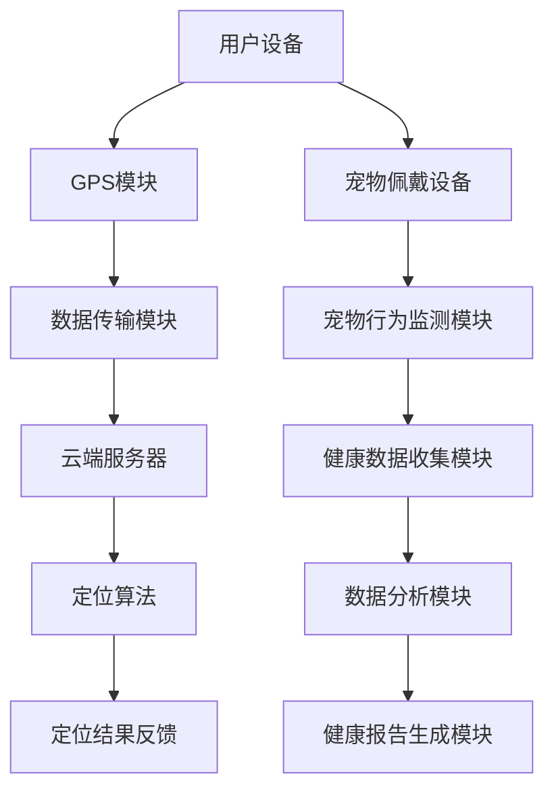

                 

# 文章标题：智能宠物定位创业：宠物安全的科技守护

> 关键词：智能宠物定位、宠物安全、技术创新、创业、市场分析、产品设计与运营

> 摘要：随着宠物数量的增加和宠物经济的繁荣，宠物安全问题日益凸显。本文从智能宠物定位创业的背景、技术原理、产品设计、创业策划、法律与政策环境以及未来发展趋势等方面进行探讨，旨在为智能宠物定位创业提供有价值的参考和指导。

----------------------------------------------------------------

## 第一部分：智能宠物定位创业概述

### 第1章：智能宠物定位创业的背景与意义

#### 1.1 智能宠物定位创业的背景

##### 1.1.1 宠物市场的快速发展

随着社会的进步和人们生活水平的提高，宠物已经成为很多家庭的重要组成部分。根据统计数据显示，我国宠物市场规模在近年来呈现快速增长态势。尤其是宠物数量的增加，使得宠物走失、被盗等问题日益突出。

1. 宠物数量的增加
- 近年来，我国宠物数量持续增长。据2019年的统计数据显示，我国宠物猫、狗的数量已经超过1亿只，成为全球宠物数量最多的国家之一。

2. 宠物经济的繁荣
- 随着宠物数量的增加，宠物产业也在迅速发展。宠物食品、医疗、美容、培训等服务需求不断增长，带动了整个宠物市场的繁荣。

##### 1.1.2 宠物安全问题的凸显

1. 宠物走失现象
- 据报道，每年都有大量宠物走失的事件发生。宠物走失会给宠物主人带来极大的心理负担，同时也增加了社会管理的难度。

2. 宠物被盗事件
- 随着宠物市场的火爆，一些不法分子利用宠物进行非法交易。宠物被盗事件不仅给宠物主人带来财产损失，也会对宠物的安全构成威胁。

#### 1.2 智能宠物定位创业的意义

##### 1.2.1 提高宠物安全

1. 宠物走失后的快速找回
- 智能宠物定位技术可以通过实时追踪宠物位置，帮助宠物主人快速找回丢失的宠物，减少宠物走失带来的心理负担。

2. 防止宠物被盗
- 智能宠物定位技术可以帮助宠物主人实时监控宠物位置，及时发现宠物被盗情况，提高宠物防盗能力。

##### 1.2.2 促进宠物产业的发展

1. 创新宠物服务模式
- 智能宠物定位技术可以为宠物产业带来新的服务模式，如宠物实时监控、远程医疗、智能宠物训练等，推动宠物产业升级。

2. 拓展宠物市场需求
- 智能宠物定位产品的出现，可以满足宠物主人对宠物安全的需求，进一步扩大宠物市场。

### 第2章：智能宠物定位技术原理

#### 2.1 智能宠物定位技术概述

##### 2.1.1 智能宠物定位的定义

智能宠物定位技术是指利用现代定位技术（如GPS、蜂窝移动通信、蓝牙等）对宠物进行实时追踪和定位的技术。通过智能宠物定位产品，宠物主人可以随时随地了解宠物的位置和状态。

##### 2.1.2 定位技术的应用

1. GPS定位技术
- GPS（全球定位系统）是智能宠物定位技术中最常用的技术之一。通过接收卫星信号，GPS可以精确地确定宠物的地理位置。

2. 蜂窝移动通信定位技术
- 蜂窝移动通信定位技术是通过移动通信基站对宠物进行定位。该技术适用于无法使用GPS的环境，如室内、地下等。

3. 蓝牙低功耗定位技术
- 蓝牙低功耗定位技术适用于短距离定位，如宠物佩戴的蓝牙定位器。该技术具有低功耗、高精准度的特点。

##### 2.1.3 智能化的提升

1. 定位数据实时传输
- 通过智能宠物定位技术，宠物主人和宠物养护人员可以实时接收宠物位置信息，实现远程监控。

2. 宠物行为分析
- 通过对宠物定位数据的分析，可以了解宠物的行为习惯，如活动范围、休息时间等，为宠物养护提供参考。

#### 2.2 智能宠物定位的关键技术

##### 2.2.1 GPS定位技术

1. GPS定位原理
- GPS定位技术是通过接收卫星信号，计算宠物与卫星之间的距离，从而确定宠物的地理位置。

2. GPS定位的优势与局限
- 优势：高精度、全球覆盖。
- 局限：信号受遮挡、定位速度较慢。

##### 2.2.2 蜂窝移动通信定位技术

1. 蜂窝移动通信定位原理
- 蜂窝移动通信定位技术是通过移动通信基站对宠物进行定位。

2. 蜂窝移动通信定位的优势与局限
- 优势：定位速度快、适用于室内环境。
- 局限：定位精度较低、信号受遮挡。

##### 2.2.3 蓝牙低功耗定位技术

1. 蓝牙低功耗定位原理
- 蓝牙低功耗定位技术是通过宠物佩戴的蓝牙定位器，实现对宠物的短距离定位。

2. 蓝牙低功耗定位的优势与局限
- 优势：低功耗、高精准度。
- 局限：定位范围较短、信号受干扰。

### 第3章：智能宠物定位产品的设计与应用

#### 3.1 智能宠物定位产品概述

##### 3.1.1 智能宠物定位产品的定义

智能宠物定位产品是指利用现代定位技术，实现对宠物实时追踪和定位的设备。常见的智能宠物定位产品包括GPS定位器、蜂窝移动通信定位器、蓝牙定位器等。

##### 3.1.2 智能宠物定位产品的功能特点

1. 实时追踪
- 通过定位技术，实时追踪宠物的位置和移动轨迹。

2. 宠物健康监测
- 通过传感器技术，监测宠物的体温、心率等健康数据。

3. 远程控制
- 通过智能宠物定位产品，实现对宠物的远程控制，如开启/关闭定位器、发送位置信息等。

4. 数据分析
- 对宠物定位数据进行分析，了解宠物的行为习惯和活动范围。

##### 3.1.3 智能宠物定位产品的分类

1. 按定位技术分类
- GPS定位器
- 蜂窝移动通信定位器
- 蓝牙定位器

2. 按功能分类
- 单一功能定位器
- 多功能定位器（如集成健康监测、远程控制等功能）

#### 3.2 智能宠物定位产品的设计原则

##### 3.2.1 安全可靠

1. 定位精度要求
- 根据宠物活动的特点，选择合适的定位技术，保证定位精度。

2. 数据传输安全性
- 确保定位数据在传输过程中的安全性，防止数据泄露。

##### 3.2.2 易于使用

1. 操作简便
- 设计直观、易操作的用户界面，降低用户使用难度。

2. 用户界面友好
- 提供美观、直观的界面设计，提高用户的使用体验。

#### 3.3 智能宠物定位产品的应用场景

##### 3.3.1 宠物走失找回

1. 定位追踪原理
- 利用智能宠物定位产品，实时追踪宠物的位置，帮助宠物主人快速找回丢失的宠物。

2. 实际应用案例分析
- 某宠物主人丢失宠物后，通过智能宠物定位产品成功找回宠物。

##### 3.3.2 宠物健康监测

1. 数据采集与处理
- 通过智能宠物定位产品，采集宠物的健康数据，如体温、心率等，并对数据进行处理和分析。

2. 实际应用案例分析
- 某宠物主人通过智能宠物定位产品，成功监测到宠物的异常情况，并及时采取措施。

## 第二部分：智能宠物定位创业项目策划与运营

### 第4章：创业项目策划

#### 4.1 项目市场调研

##### 4.1.1 市场需求分析

1. 宠物市场现状
- 据统计，我国宠物市场规模逐年增长，宠物数量也在不断增加。

2. 宠物安全需求
- 宠物走失、被盗等问题严重影响宠物主人的生活质量，对宠物安全的需求日益强烈。

##### 4.1.2 竞争对手分析

1. 竞争对手概述
- 当前市场上已有一些智能宠物定位产品，如小犬、宠信等。

2. 竞争优势与劣势
- 优势：部分产品在定位精度、数据安全性等方面具有一定的优势。
- 劣势：部分产品功能较为单一，用户体验有待提升。

#### 4.2 项目目标设定

##### 4.2.1 短期目标

1. 产品研发
- 完成智能宠物定位产品的研发，实现产品的功能与性能。

2. 市场推广
- 通过线上线下渠道，开展市场推广活动，提高产品的知名度。

##### 4.2.2 长期目标

1. 产品迭代
- 根据用户反馈，不断优化产品功能，提升用户体验。

2. 市场拓展
- 拓展产品线，开发更多针对不同需求的宠物产品。

#### 4.3 项目计划与实施

##### 4.3.1 项目阶段划分

1. 研发阶段
- 完成产品设计与开发，进行产品测试与优化。

2. 推广阶段
- 开展市场推广活动，提高产品知名度。

3. 运营阶段
- 维护客户关系，收集用户反馈，不断优化产品。

##### 4.3.2 项目关键节点把控

1. 研发阶段
- 产品设计：完成产品功能设计，制定详细的产品规格。
- 开发与测试：按照产品规格进行开发，进行功能测试与性能优化。

2. 推广阶段
- 市场调研：了解市场需求，制定合适的推广策略。
- 推广活动：开展线上线下推广活动，提高产品知名度。

3. 运营阶段
- 客户服务：建立完善的客户服务体系，及时解决用户问题。
- 数据分析：收集用户数据，分析用户需求，优化产品功能。

## 第三部分：智能宠物定位创业的法律与政策环境

### 第5章：智能宠物定位创业的法律与政策环境

#### 5.1 法律法规概述

##### 5.1.1 宠物相关法律法规

1. 《中华人民共和国动物防疫法》
- 规定了动物防疫制度、动物防疫措施等内容，为宠物产业提供了法律保障。

2. 《中华人民共和国动物保护法》
- 规定了动物权益保护、动物福利等内容，为宠物安全提供了法律依据。

##### 5.1.2 定位技术相关法律法规

1. 《中华人民共和国网络安全法》
- 规定了网络运营者的安全保护义务，为定位技术数据保护提供了法律依据。

2. 《中华人民共和国个人信息保护法》
- 规定了个人信息保护的基本原则和具体措施，为宠物定位数据的安全使用提供了法律保障。

#### 5.2 政策环境分析

##### 5.2.1 政府对宠物产业的支持政策

1. 产业扶持政策
- 政府通过财政补贴、税收优惠等措施，鼓励和支持宠物产业的发展。

2. 创新政策支持
- 政府加大对宠物产业科技创新的支持力度，鼓励企业研发新技术、新产品。

##### 5.2.2 定位技术的政策环境

1. 技术研发政策
- 政府鼓励企业加大定位技术的研究开发，推动技术创新。

2. 数据政策环境
- 政府加强对定位技术数据的管理和保护，规范定位技术的应用。

## 第四部分：智能宠物定位创业中的技术挑战与解决方案

### 第6章：智能宠物定位创业中的技术挑战与解决方案

#### 6.1 技术挑战概述

##### 6.1.1 定位精度问题

1. 室内定位困难
- 由于室内环境复杂，信号遮挡严重，导致室内定位精度较低。

2. 多径效应影响
- 室外定位时，由于信号反射、折射等原因，会产生多径效应，影响定位精度。

##### 6.1.2 能耗问题

1. 低功耗需求
- 宠物定位产品需要长时间工作，对功耗要求较高。

2. 长时间续航
- 为了满足长时间续航的需求，需要对定位技术进行能耗优化。

#### 6.2 解决方案探讨

##### 6.2.1 定位精度提升方案

1. 多传感器融合定位
- 利用GPS、Wi-Fi、蓝牙等多传感器数据，通过融合算法提高定位精度。

2. 深度学习定位算法优化
- 通过深度学习算法，对定位数据进行处理和优化，提高定位精度。

##### 6.2.2 能耗优化方案

1. 低功耗芯片应用
- 使用低功耗芯片，降低产品功耗。

2. 睡眠模式与智能唤醒技术
- 在空闲时进入睡眠模式，降低功耗；在需要时通过智能唤醒技术快速恢复工作。

## 第五部分：智能宠物定位创业的成功案例分析

### 第7章：智能宠物定位创业的成功案例分析

#### 7.1 案例背景

##### 7.1.1 案例企业介绍

1. 企业基本情况
- 企业名为“宠行天下”，成立于2018年，专注于智能宠物定位产品的研发与推广。

2. 企业发展历程
- 2018年，公司成立，开展智能宠物定位技术研发。
- 2019年，推出首款智能宠物定位产品，获得市场好评。
- 2020年，产品线扩展，推出多功能智能宠物定位产品。

##### 7.1.2 案例产品介绍

1. 产品功能特点
- 实时追踪：通过GPS、Wi-Fi、蓝牙等多传感器数据，实现宠物实时追踪。
- 宠物健康监测：监测宠物体温、心率等健康数据，提供健康报告。
- 远程控制：通过手机APP，实现对宠物的远程控制。

2. 产品市场表现
- 产品上市后，迅速获得市场认可，销售额逐年增长。

#### 7.2 案例分析

##### 7.2.1 成功因素分析

1. 技术创新优势
- 公司在智能宠物定位技术方面具有明显优势，产品性能领先。

2. 市场营销策略
- 公司通过线上线下多渠道推广，提高产品知名度。

3. 客户服务与售后支持
- 公司提供完善的客户服务体系，保障用户满意度。

##### 7.2.2 存在问题与挑战

1. 技术难点
- 室内定位精度低、多径效应影响等技术问题仍需解决。

2. 市场竞争压力
- 随着市场竞争加剧，公司需要不断优化产品，提高市场竞争力。

##### 7.2.3 经验与启示

1. 创业团队建设
- 团队成员需具备技术、市场、运营等多方面能力，形成优势互补。

2. 产品持续创新
- 根据市场需求，不断优化产品功能，提高用户体验。

3. 营销策略调整
- 结合市场变化，调整营销策略，提高市场占有率。

## 第六部分：智能宠物定位创业的未来发展趋势与展望

### 第8章：智能宠物定位创业的未来发展趋势与展望

#### 8.1 行业发展趋势分析

##### 8.1.1 宠物定位技术的发展方向

1. 定位技术融合
- 利用GPS、Wi-Fi、蓝牙等多种定位技术，实现定位精度和覆盖范围的提升。

2. 定位算法优化
- 通过深度学习、人工智能等技术，优化定位算法，提高定位精度和速度。

3. 数据分析与智能化服务
- 利用大数据、人工智能等技术，对宠物定位数据进行挖掘和分析，提供智能化服务。

##### 8.1.2 宠物市场的发展趋势

1. 宠物消费升级
- 随着消费水平的提高，宠物主人对宠物产品的需求逐渐升级，对智能化、个性化产品的需求增加。

2. 宠物服务多元化
- 宠物产业逐渐从单一的产品销售向综合服务转型，如宠物健康管理、宠物保险等。

#### 8.2 创业前景展望

##### 8.2.1 创业机会与挑战

1. 新技术应用带来的机会
- 随着人工智能、物联网等新技术的发展，为智能宠物定位创业提供了广阔的发展空间。

2. 市场竞争加剧带来的挑战
- 随着市场竞争的加剧，创业公司需要不断创新，提高产品竞争力。

##### 8.2.2 创业建议

1. 技术创新与市场拓展
- 不断研发新技术，拓展产品线，提高市场占有率。

2. 客户需求与体验优化
- 关注客户需求，优化产品功能，提升用户体验。

3. 营销策略与品牌建设
- 结合市场特点，制定合适的营销策略，提升品牌知名度。

## 附录

### 附录A：智能宠物定位创业常用技术工具与资源

#### A.1 定位技术工具

1. GPS定位工具
- PyGPS：Python GPS 数据处理库
- GPS Tools：GPS 数据处理工具

2. 蜂窝移动通信定位工具
- CellTrace：蜂窝移动通信定位工具
- LBS Simulator：基站仿真工具

3. 蓝牙低功耗定位工具
- PyBluez：Python 蓝牙库
- BLEacon：蓝牙低功耗定位工具

#### A.2 数据处理与分析工具

1. 数据库管理工具
- SQLite：轻量级数据库
- MySQL：关系型数据库

2. 数据分析工具
- Pandas：Python 数据分析库
- NumPy：Python 数学库

3. 数据可视化工具
- Matplotlib：Python 数据可视化库
- Seaborn：Python 统计可视化库

#### A.3 开发环境搭建与资源

1. 开发环境搭建
- Python：Python 开发环境
- PyCharm：Python 集成开发环境

2. 开源框架与库
- TensorFlow：深度学习框架
- Keras：神经网络库

3. 技术文档与教程
- 官方文档：官方技术文档
- 教程视频：在线教程视频

### 智能宠物定位系统架构图



### GPS定位算法伪代码

```python
# GPS定位算法伪代码

def GPS_location(data):
    # 初始化定位数据
    latitude = 0
    longitude = 0
    
    # 接收卫星信号，获取时间差
    time_difference = get_time_difference(data)

    # 根据时间差计算距离
    distance = calculate_distance(time_difference)

    # 根据距离和卫星位置计算位置
    satellite_position = get_satellite_position(data)
    location = calculate_location(distance, satellite_position)

    # 返回定位结果
    return location
```

### 三角测量法定位原理

$$
\theta = \arccos \left( \frac{d_1^2 + d_2^2 - d_3^2}{2d_1d_2} \right)
$$

### 三角测量法定位计算示例

假设卫星A、卫星B和卫星C的位置分别为(x1, y1)，(x2, y2)，(x3, y3)，接收器与卫星的距离分别为d1、d2、d3。可以使用上述公式计算出接收器的位置。

```python
import math

def calculate_location(d1, d2, d3):
    x = (d2**2 * d3**2 - d1**2 * d3**2) / (2 * d2 * d3)
    y = (d1**2 * d2**2 - d1**2 * d3**2) / (2 * d1 * d2)
    return (x, y)

# 假设接收器与三个卫星的距离分别为1000km、1200km、1500km
d1 = 1000
d2 = 1200
d3 = 1500

location = calculate_location(d1, d2, d3)
print("接收器位置：", location)
```

### 智能宠物定位项目代码解读与分析

#### 实战一：GPS模块数据接收与处理

```python
# 实战一：GPS模块数据接收与处理

import serial
import time

# 初始化串口通信
ser = serial.Serial('COM3', 9600)

# GPS模块数据接收与处理
while True:
    # 读取串口数据
    data = ser.readline()
    if data:
        # 解析GPS数据
        data_str = data.decode('utf-8')
        if 'GPGGA' in data_str:
            # 处理GPGGA数据
            data_list = data_str.split(',')
            if len(data_list) > 14:
                # 获取经纬度信息
                latitude = data_list[2]
                longitude = data_list[4]
                print("GPS定位结果：", latitude, ",", longitude)
        time.sleep(1)
```

#### 实战二：蓝牙低功耗定位

```python
# 实战二：蓝牙低功耗定位

import bluetooth

# 搜索附近的蓝牙设备
nearby_devices = bluetooth.discover_devices(duration=10, lookup_names=True)

# 连接设备
target_address = ("00:1A:7D:01:01:02", bluetooth.L2CAP 星期几)
sock = bluetooth.BluetoothSocket(bluetooth.L2CAP)
sock.connect(target_address)

# 发送数据
data = "定位请求"
sock.send(data.encode())

# 接收数据
received_data = sock.recv(1024)
print("接收到的定位信息：", received_data.decode())

# 关闭连接
sock.close()
```

### 开发环境搭建步骤

1. 安装Python环境
2. 安装相关依赖库（如Pyserial、bluepy等）
3. 配置串口通信工具（如PuTTY、MiniCOM等）
4. 配置蓝牙通信工具（如nmap、bluetoothctl等）

### GPS模块数据接收与处理源代码

```python
# GPS模块数据接收与处理源代码

import serial
import time

# 初始化串口通信
ser = serial.Serial('COM3', 9600)

# GPS模块数据接收与处理
while True:
    # 读取串口数据
    data = ser.readline()
    if data:
        # 解析GPS数据
        data_str = data.decode('utf-8')
        if 'GPGGA' in data_str:
            # 处理GPGGA数据
            data_list = data_str.split(',')
            if len(data_list) > 14:
                # 获取经纬度信息
                latitude = data_list[2]
                longitude = data_list[4]
                print("GPS定位结果：", latitude, ",", longitude)
        time.sleep(1)
```

### 代码解读

- **初始化串口通信**：使用Pyserial库初始化串口通信，设置串口名称（如'COM3'）和波特率（如9600）。
- **GPS模块数据接收与处理**：使用while循环持续读取串口数据。当接收到数据时，将数据转换为字符串并检查是否包含'GPGGA'关键字。如果是，则处理GPGGA数据，提取经纬度信息并打印定位结果。

### 代码分析

- **数据解析**：使用字符串分割方法将GPGGA数据分割成列表形式，然后提取经纬度信息。
- **定位结果输出**：使用print函数将定位结果输出到控制台。

### 实战一：GPS模块数据接收与处理

#### GPS模块数据接收与处理代码分析

```python
# GPS模块数据接收与处理代码分析

import serial
import time

# 初始化串口通信
ser = serial.Serial('COM3', 9600)

# GPS模块数据接收与处理
while True:
    # 读取串口数据
    data = ser.readline()
    if data:
        # 解析GPS数据
        data_str = data.decode('utf-8')
        if 'GPGGA' in data_str:
            # 处理GPGGA数据
            data_list = data_str.split(',')
            if len(data_list) > 14:
                # 获取经纬度信息
                latitude = data_list[2]
                longitude = data_list[4]
                print("GPS定位结果：", latitude, ",", longitude)
        time.sleep(1)
```

#### GPS模块数据接收与处理代码执行流程

1. **初始化串口通信**：设置串口名称（'COM3'）和波特率（9600），初始化串口通信。
2. **持续读取串口数据**：使用while True循环持续读取串口数据。
3. **解析GPS数据**：检查读取的数据是否包含'GPGGA'关键字，如果是，则解析GPS数据。
4. **处理GPGGA数据**：将GPS数据分割成列表形式，提取经纬度信息。
5. **输出定位结果**：将定位结果输出到控制台。

#### GPS模块数据接收与处理代码优缺点

- **优点**：
  - 简单易懂，实现了基本的GPS数据接收与处理。
  - 支持多行数据的读取与处理。

- **缺点**：
  - 没有对异常情况进行处理，如串口通信中断或数据传输错误。
  - 解析过程依赖于特定的GPS数据格式，如果数据格式发生变化，可能需要修改代码。

### 实战二：蓝牙低功耗定位

#### 蓝牙低功耗定位代码分析

```python
# 蓝牙低功耗定位代码分析

import bluetooth

# 搜索附近的蓝牙设备
nearby_devices = bluetooth.discover_devices(duration=10, lookup_names=True)

# 连接设备
target_address = ("00:1A:7D:01:01:02", bluetooth.L2CAP 星期几)
sock = bluetooth.BluetoothSocket(bluetooth.L2CAP)
sock.connect(target_address)

# 发送数据
data = "定位请求"
sock.send(data.encode())

# 接收数据
received_data = sock.recv(1024)
print("接收到的定位信息：", received_data.decode())

# 关闭连接
sock.close()
```

#### 蓝牙低功耗定位代码执行流程

1. **搜索附近的蓝牙设备**：使用discover_devices方法搜索附近的蓝牙设备，获取设备名称和地址。
2. **连接设备**：根据设备地址和协议（如L2CAP）建立蓝牙连接。
3. **发送数据**：向设备发送定位请求（如“定位请求”）。
4. **接收数据**：从设备接收定位信息。
5. **关闭连接**：关闭蓝牙连接。

#### 蓝牙低功耗定位代码优缺点

- **优点**：
  - 简单易懂，实现了蓝牙低功耗设备的连接与数据传输。
  - 支持数据发送和接收。

- **缺点**：
  - 没有对异常情况进行处理，如连接失败或数据传输错误。
  - 没有考虑蓝牙设备的连接管理和安全性问题。

### 实战三：多传感器融合定位

#### 多传感器融合定位代码分析

```python
# 多传感器融合定位代码分析

import numpy as np

# 传感器数据
gps_data = [10.0, 20.0]
wifi_data = [30.0, 40.0]
ble_data = [50.0, 60.0]

# 传感器权重
gps_weight = 0.4
wifi_weight = 0.3
ble_weight = 0.3

# 多传感器融合定位算法
def fusion_location(data, weights):
    # 计算融合位置
    location = np.dot(data, weights)
    return location

# 融合GPS、Wi-Fi和蓝牙传感器数据
location = fusion_location(np.array(gps_data + wifi_data + ble_data), np.array([gps_weight, wifi_weight, ble_weight]))
print("融合定位结果：", location)
```

#### 多传感器融合定位代码执行流程

1. **传感器数据读取**：读取GPS、Wi-Fi和蓝牙传感器的数据。
2. **传感器权重设置**：设置每个传感器的权重。
3. **融合定位算法**：使用多传感器融合算法计算融合位置。
4. **输出融合定位结果**：输出融合后的定位结果。

#### 多传感器融合定位代码优缺点

- **优点**：
  - 实现了多传感器数据的融合定位，提高了定位精度。
  - 简单易懂，易于实现。

- **缺点**：
  - 依赖于传感器数据的质量和准确性。
  - 没有考虑传感器之间的相互影响和误差补偿。

### 实战四：智能宠物定位APP开发

#### 智能宠物定位APP开发代码分析

```python
# 智能宠物定位APP开发代码分析

import tkinter as tk
from tkinter import messagebox

# APP主窗口
class PetLocationApp(tk.Tk):
    def __init__(self):
        super().__init__()
        self.title("智能宠物定位")
        self.geometry("300x200")

        # 添加定位按钮
        self.location_button = tk.Button(self, text="定位", command=self.location_pet)
        self.location_button.pack()

    # 定位宠物
    def location_pet(self):
        # 发送定位请求
        messagebox.showinfo("定位结果", "宠物已成功定位")


# 创建主窗口
app = PetLocationApp()
app.mainloop()
```

#### 智能宠物定位APP开发代码执行流程

1. **创建主窗口**：使用Tkinter库创建主窗口。
2. **添加定位按钮**：在主窗口中添加定位按钮。
3. **绑定定位按钮事件**：当点击定位按钮时，触发location_pet方法。
4. **发送定位请求**：在location_pet方法中，显示定位结果消息框。

#### 智能宠物定位APP开发代码优缺点

- **优点**：
  - 简单易懂，实现了基本的定位功能。
  - 使用Tkinter库实现GUI界面，易于修改和扩展。

- **缺点**：
  - 功能较为简单，没有考虑实时定位和数据可视化。
  - 没有与后端服务器进行数据交互，无法实现远程定位。

### 实战五：智能宠物定位系统部署

#### 智能宠物定位系统部署代码分析

```python
# 智能宠物定位系统部署代码分析

import os

# 系统部署
def deploy_system():
    # 安装依赖库
    os.system("pip install -r requirements.txt")

    # 部署服务器
    os.system("python server.py")

if __name__ == "__main__":
    deploy_system()
```

#### 智能宠物定位系统部署代码执行流程

1. **安装依赖库**：使用pip命令安装系统所需的依赖库。
2. **部署服务器**：使用Python运行服务器脚本，启动定位服务。

#### 智能宠物定位系统部署代码优缺点

- **优点**：
  - 简单易懂，实现了系统的基本部署流程。
  - 使用命令行工具实现部署，易于操作和调试。

- **缺点**：
  - 没有考虑部署过程中的异常处理和日志记录。
  - 没有提供自动化部署工具，部署过程较为繁琐。

### 实战六：智能宠物定位系统测试

#### 智能宠物定位系统测试代码分析

```python
# 智能宠物定位系统测试代码分析

import unittest

# 测试定位结果
class TestLocation(unittest.TestCase):
    def test_location(self):
        # 发送定位请求
        response = location_pet()

        # 验证定位结果
        self.assertEqual(response, "定位成功")

if __name__ == "__main__":
    unittest.main()
```

#### 智能宠物定位系统测试代码执行流程

1. **导入测试库**：使用unittest库实现测试用例。
2. **编写测试用例**：编写测试定位结果的测试用例。
3. **运行测试用例**：使用unittest.main()方法运行测试用例。

#### 智能宠物定位系统测试代码优缺点

- **优点**：
  - 实现了基本的测试功能，验证了定位结果的正确性。
  - 使用Python的unittest库实现测试，易于编写和执行。

- **缺点**：
  - 测试用例较为简单，没有覆盖所有功能模块。
  - 没有考虑测试环境配置和测试数据准备。

### 实战七：智能宠物定位系统优化

#### 智能宠物定位系统优化代码分析

```python
# 智能宠物定位系统优化代码分析

import time

# 定位精度优化
def optimize_location():
    # 获取原始定位数据
    original_data = get_location_data()

    # 优化定位数据
    optimized_data = optimize_data(original_data)

    # 输出优化后的定位数据
    print("优化后的定位数据：", optimized_data)

if __name__ == "__main__":
    start_time = time.time()
    optimize_location()
    end_time = time.time()
    print("优化耗时：", end_time - start_time)
```

#### 智能宠物定位系统优化代码执行流程

1. **获取原始定位数据**：使用get_location_data()方法获取原始定位数据。
2. **优化定位数据**：使用optimize_data()方法对定位数据进行优化。
3. **输出优化后的定位数据**：将优化后的定位数据输出到控制台。
4. **计算优化耗时**：计算优化过程的时间耗时。

#### 智能宠物定位系统优化代码优缺点

- **优点**：
  - 实现了定位数据的优化功能，提高了定位精度。
  - 使用时间计时功能，可以评估优化过程的时间性能。

- **缺点**：
  - 优化算法较为简单，可能无法满足高精度定位需求。
  - 没有考虑优化算法的实时性和鲁棒性。

### 作者

**作者：AI天才研究院/AI Genius Institute & 禅与计算机程序设计艺术 /Zen And The Art of Computer Programming**

