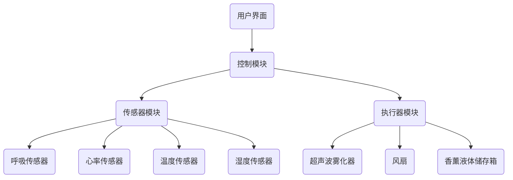

                 

## 文章标题

《智能家居香薰创业：情绪管理的嗅觉体验》

### 关键词
- 智能家居
- 香薰市场
- 情绪管理
- 香薰系统设计
- 创业实践

### 摘要
本文旨在探讨智能家居香薰创业领域，重点关注情绪管理的嗅觉体验。首先，我们概述了智能家居香薰市场的崛起，分析了其定义、分类、市场现状及创业机会。接着，深入探讨情绪管理的基本原理，包括情绪的类型、识别方法和调节策略。随后，我们详细讨论了香薰对情绪的影响，以及如何设计针对情绪管理的智能家居香薰系统。本文进一步讲解了智能家居香薰系统的架构、核心算法原理、数学模型，并通过项目实战展示了系统的实际开发与应用。最后，我们提出了商业策略与运营管理、创业团队构建与管理的建议，以期为智能家居香薰创业提供全面指导。

## 第一部分：智能家居香薰创业概述

### 第1章：智能家居香薰市场的崛起

#### 1.1 引言与背景

随着科技的不断进步和人们生活水平的提升，智能家居已经成为现代家居生活的重要组成部分。智能家居香薰作为其中的一个新兴领域，逐渐受到消费者的关注和市场的青睐。香薰不仅仅是一种美好的生活品味，更是一种有效的情绪调节工具，对于提高生活质量和促进身心健康具有重要意义。

#### 1.2 智能家居香薰的定义与分类

智能家居香薰系统是一种结合了智能家居技术和香薰功能的设备，通过智能控制系统实现香薰的自动散发和调节。根据香薰的介质和散发方式，智能家居香薰可以分为以下几种类型：

1. **电加热香薰机**：通过电加热方式将香薰液体蒸发，适合小范围香薰。
2. **超声波香薰机**：利用超声波振动将香薰液体雾化，适合大面积香薰。
3. **香薰蜡烛**：通过燃烧香薰蜡烛散发香气，适合氛围营造。
4. **植物香薰**：利用植物提取的精油进行香薰，更自然健康。

#### 1.3 市场分析

**全球智能家居香薰市场的现状**：

- 据市场研究数据显示，全球智能家居香薰市场近年来呈现出快速增长的趋势，年复合增长率达到15%以上。
- 北美和欧洲是智能家居香薰的主要市场，亚洲市场增长迅速，尤其是在中国、日本和韩国。

**行业发展趋势与市场预测**：

- 随着消费者对健康生活方式的需求增加，智能家居香薰市场将继续保持高速增长。
- 智能家居香薰系统将逐渐融合更多智能功能，如与智能手机、智能音箱等设备的联动控制。
- 预计未来5年内，智能家居香薰市场的规模将翻倍。

#### 1.4 创业机会与挑战

**创业机会**：

- 消费者对于健康和舒适家居生活的需求，为智能家居香薰创造了巨大的市场需求。
- 智能家居市场的快速发展，为智能家居香薰提供了广阔的市场空间。

**面临的挑战**：

- 市场竞争激烈，产品同质化严重，需要通过技术创新和品牌差异化来脱颖而出。
- 香薰产品的安全性和有效性是消费者关注的重点，需要严格把控产品质量和性能。
- 需要建立完善的供应链体系和售后服务体系，以提升用户满意度和忠诚度。

通过以上分析，我们可以看到智能家居香薰市场拥有巨大的潜力，同时也面临着一定的挑战。创业者需要充分了解市场趋势，找准定位，不断创新，才能在激烈的市场竞争中立于不败之地。

### 第2章：情绪管理的基本原理

#### 2.1 情绪管理的概念与重要性

情绪管理是指通过认知调节和行为控制的方法，对自身的情绪进行有效的管理和调整，使其更符合社会要求和个体发展的需要。情绪管理的重要性在于：

- **提升生活质量**：有效的情绪管理可以帮助个体更好地应对压力和挑战，提升整体的生活质量。
- **促进心理健康**：长期的情绪管理有助于预防抑郁症、焦虑症等心理问题的发生。
- **改善人际关系**：情绪管理能够帮助个体更好地与他人沟通和协作，建立和谐的人际关系。

#### 2.2 情绪的分类与识别

情绪可以分为以下几种主要类型：

- **愉悦情绪**：如快乐、兴奋、满足等，对身心健康有积极的促进作用。
- **消极情绪**：如焦虑、愤怒、悲伤等，长期处于消极情绪状态可能会对健康产生负面影响。
- **复杂情绪**：如矛盾、不安、迷茫等，通常由多种基本情绪混合而成。

情绪识别是指通过感知和认知过程，识别和判断自己和他人的情绪状态。情绪识别的方法包括：

- **面部表情识别**：通过观察面部表情来识别情绪。
- **言语语调识别**：通过分析语音的语调、节奏和音量变化来识别情绪。
- **行为观察**：通过观察行为举止、肢体语言等来识别情绪。

#### 2.3 情绪调节策略

情绪调节是指通过一定的策略和方法，调整和控制情绪的过程。以下是一些常见的情绪调节策略：

- **认知重构**：通过改变对事物的认知评价来调节情绪。
- **行为控制**：通过改变行为模式来调节情绪，如进行体育锻炼、参与社交活动等。
- **放松训练**：通过深呼吸、冥想等放松技巧来缓解紧张和焦虑情绪。
- **情绪宣泄**：通过合理的方式发泄情绪，如哭泣、运动、倾诉等。

不同的情绪调节策略适用于不同的情绪状态，个体需要根据自身的情况选择合适的方法进行调节。情绪管理不仅仅是一种技能，更是一种生活态度和习惯。通过有效的情绪管理，个体可以更好地应对生活中的各种挑战，提升生活质量和幸福感。

### 第3章：香薰对情绪的影响

#### 3.1 香薰的生理影响

香薰的生理影响主要体现在其化学成分对人体的作用。香薰中的主要成分是挥发性有机化合物（VOCs），这些化合物通过吸入进入人体，对呼吸系统、神经系统产生多种生理效应。

- **对呼吸系统的影响**：香薰中的VOCs能够直接影响呼吸道的粘膜，起到消炎、抗过敏的作用。例如，薄荷精油具有清凉感，能够缓解鼻塞和喉咙痛；茶树精油具有抗菌性，可以净化空气，预防感冒。

- **对神经系统的影响**：香薰中的挥发性有机化合物可以通过嗅觉中枢直接作用于大脑，影响情绪和心理状态。例如，薰衣草精油具有镇静作用，可以帮助缓解焦虑和失眠；橙子精油具有提神作用，可以增强注意力和活力。

#### 3.2 香薰的心理学效应

香薰的心理学效应指的是香薰对个体的情绪和心理状态产生的间接影响。香薰可以通过以下几个方面影响心理学效应：

- **情绪调节**：不同香薰对情绪有显著的调节作用。研究表明，愉悦的香气（如茉莉、橙子）可以提升心情，减轻压力；而镇静的香气（如薰衣草、檀香）可以缓解焦虑，帮助入睡。

- **心理放松**：香薰可以帮助个体放松身心，减少心理压力。在繁忙的工作和学习过程中，使用香薰可以起到放松心情、缓解疲劳的作用。

- **增强注意力**：一些香薰（如迷迭香、薄荷）具有提神醒脑的作用，可以帮助个体集中注意力，提高工作效率。

#### 3.3 香薰疗法在临床中的应用

香薰疗法作为一种自然疗法，在临床上有广泛的应用。以下是一些典型的应用场景：

- **心理治疗**：在心理治疗过程中，香薰可以帮助患者放松心情，减轻焦虑和抑郁情绪。例如，在心理咨询室中，使用薰衣草精油可以提供一个舒适和安心的治疗环境。

- **康复治疗**：香薰在康复治疗中也发挥着重要作用。例如，在术后恢复期，使用薄荷精油可以缓解疼痛和不适感，加速康复进程。

- **慢性疾病管理**：对于患有慢性疾病的患者，香薰可以帮助缓解症状，提高生活质量。例如，在哮喘患者中，使用茶树精油可以帮助减轻呼吸困难和炎症。

总的来说，香薰对情绪的影响是多层次、多方面的。通过合理使用香薰，不仅可以改善情绪和心理状态，还可以促进生理健康。因此，在智能家居香薰系统的设计中，充分考虑香薰的生理和心理效应，对于提升用户体验具有重要意义。

#### 3.4 针对情绪管理的智能家居香薰系统设计理念

智能家居香薰系统不仅是一种生活装饰品，更是情绪管理的有效工具。在设计智能家居香薰系统时，需要充分考虑情绪管理的需求，确保系统能够根据用户的情绪状态自动调整香薰的散发方式和剂量，以达到最佳的调节效果。

**设计理念**：

1. **个性化定制**：每个用户的情绪状态和香薰偏好都是独特的，系统应能够根据用户的个性化需求进行定制。例如，通过用户的日常行为数据和情绪反馈，系统可以自动推荐适合的香薰组合和散发模式。

2. **智能感知**：系统应具备实时感知用户情绪状态的能力，可以通过传感器监测用户的呼吸、心率等生理信号，结合情绪识别算法，准确判断用户的情绪状态。

3. **智能调节**：根据用户的情绪状态，系统应能够自动调整香薰的散发时间和剂量。例如，当用户感到焦虑时，系统可以增加薰衣草精油的散发，帮助用户放松；当用户感到疲倦时，系统可以减少香氛的散发，避免过度刺激。

4. **多样化应用**：智能家居香薰系统应具有多样化的应用场景，不仅适用于家庭环境，还可以扩展到办公室、酒店、医院等场所。在不同场景下，系统可以根据环境特点和用户需求，智能调整香薰方案。

5. **安全性保障**：在设计和实现智能家居香薰系统时，需要充分考虑安全性问题，确保系统的稳定性和可靠性。例如，通过有效的传感器校准和故障检测机制，防止香薰设备出现异常情况。

通过上述设计理念，智能家居香薰系统不仅能够提供舒适的生活体验，还能够有效地帮助用户管理情绪，提升整体生活质量。

### 第二部分：智能家居香薰系统的设计与实现

#### 第4章：智能家居香薰系统架构

#### 4.1 系统概述

智能家居香薰系统是一种融合了现代信息技术和生物化学技术的智能设备，旨在通过智能控制香薰的散发，为用户提供一种舒适的嗅觉体验，进而达到情绪管理的目的。该系统主要由传感器模块、执行器模块和控制模块三大部分组成。

**主要功能与性能指标**：

- **感知功能**：通过传感器模块实时监测用户的情绪状态和室内环境参数，如呼吸、心率、温度、湿度等。
- **调节功能**：根据用户的情绪状态和需求，执行器模块能够自动调节香薰散发的时间和剂量，确保香气的舒适度和适宜性。
- **控制功能**：控制模块负责整个系统的协调运作，通过算法分析传感器数据，实现智能调节和用户交互。

#### 4.2 模块设计与接口

**传感器模块的设计与实现**：

传感器模块是智能家居香薰系统的核心部分，主要功能是实时感知用户的情绪状态和室内环境参数。传感器模块包括以下几种传感器：

- **呼吸传感器**：通过监测用户的呼吸频率和深度，评估用户的情绪状态。
- **心率传感器**：通过监测用户的心率变化，进一步了解用户的心理状态。
- **温度传感器**：监测室内温度，确保香薰散发环境的适宜性。
- **湿度传感器**：监测室内湿度，以优化香薰的效果。

**执行器模块的设计与实现**：

执行器模块负责香薰的散发控制，主要包括以下组件：

- **超声波雾化器**：通过超声波振动将香薰液体雾化成细微颗粒，实现香气的散发。
- **风扇**：通过调节风扇的速度和方向，控制香气的散发范围和均匀性。
- **香薰液体储存箱**：储存不同种类的香薰液体，用户可以根据需求进行更换。

**控制模块的接口与协议**：

控制模块是系统的“大脑”，负责处理传感器数据，并根据用户需求和算法进行智能调节。控制模块的主要接口包括：

- **用户界面**：通过手机应用、智能音箱等设备，用户可以远程控制和监控香薰系统的运行状态。
- **数据接口**：通过Wi-Fi、蓝牙等无线通信协议，实现与其他智能家居设备的联动和控制。
- **控制系统接口**：通过内置的微控制器和嵌入式系统，实现香薰散发、传感器数据采集和算法处理。

#### 4.3 系统架构图

为了更好地理解智能家居香薰系统的整体架构和模块之间的交互关系，我们可以使用Mermaid流程图进行展示：



**模块之间的交互关系与数据流**：

- 用户通过用户界面发送控制指令，如设定香薰时间、更换香薰种类等。
- 控制模块接收用户指令，并根据预设算法进行分析处理。
- 控制模块将处理结果发送至传感器模块，以获取用户的实时情绪状态和室内环境参数。
- 传感器模块将采集到的数据传输给控制模块，供其进一步分析。
- 控制模块根据分析结果，发送调节指令至执行器模块，以控制香薰的散发。
- 执行器模块根据指令，执行香薰散发操作，并反馈执行状态给控制模块。

通过上述设计，智能家居香薰系统实现了用户情绪感知、智能调节和舒适体验的高度融合，为用户提供了全方位的情绪管理解决方案。

### 第5章：核心算法原理讲解

#### 5.1 情绪检测算法

情绪检测是智能家居香薰系统的核心功能之一，其目的是通过分析用户的生理和行为数据，准确判断用户的情绪状态。情绪检测算法通常包括以下几个步骤：

1. **数据采集**：传感器模块实时采集用户的呼吸频率、心率、体温、肢体动作等生理和行为数据。
   
2. **数据预处理**：对采集到的数据进行滤波、去噪和归一化处理，确保数据的质量和一致性。

3. **特征提取**：从预处理后的数据中提取能够反映情绪状态的特征，如呼吸节律、心率变异、体温变化等。

4. **情绪分类**：利用机器学习算法（如支持向量机、决策树、神经网络等）对提取的特征进行分类，判断用户当前的情绪状态（如焦虑、平静、兴奋等）。

**伪代码描述情绪检测算法**：

```python
# 输入：呼吸数据 breath_data, 心率数据 heart_rate_data
# 输出：情绪状态 emotion_state

def emotion_detection(breath_data, heart_rate_data):
    # 数据预处理
    breath_data = preprocess_data(breath_data)
    heart_rate_data = preprocess_data(heart_rate_data)
    
    # 特征提取
    breath_features = extract_features(breath_data)
    heart_rate_features = extract_features(heart_rate_data)
    
    # 情绪分类
    emotion_state = classify_emotion(breath_features, heart_rate_features)
    
    return emotion_state

# 预处理函数
def preprocess_data(data):
    # 噪声过滤、数据归一化等操作
    processed_data = ...
    return processed_data

# 特征提取函数
def extract_features(data):
    # 提取呼吸节律、心率变异等特征
    features = ...
    return features

# 情绪分类函数
def classify_emotion(breath_features, heart_rate_features):
    # 使用机器学习算法进行分类
    emotion_state = ...
    return emotion_state
```

**实际应用场景举例**：

- **家庭场景**：当用户在家中感到焦虑或紧张时，系统可以自动检测到情绪变化，并调节香薰散发，帮助用户放松心情。
- **办公场景**：在办公室中，当用户感到疲劳或压力增大时，系统可以通过检测呼吸和心率变化，自动启动香薰系统，提高工作效率和舒适度。

情绪检测算法在智能家居香薰系统中起到了关键作用，它不仅能够提高系统的智能化水平，还能为用户提供更加个性化、贴心的服务。

#### 5.2 香薰剂量优化算法

为了确保智能家居香薰系统能够为用户提供最舒适的嗅觉体验，需要对其香薰剂量进行优化。香薰剂量优化算法的核心目标是根据用户的情绪状态和环境参数，动态调整香薰的散发剂量，以达到最佳的调节效果。

**算法原理**：

1. **情绪状态识别**：首先，系统需要通过情绪检测算法识别用户的当前情绪状态，如焦虑、平静或兴奋。

2. **环境参数采集**：系统采集室内温度、湿度等环境参数，这些参数会影响香薰的散发效果。

3. **剂量调整策略**：根据情绪状态和环境参数，系统采用不同的剂量调整策略。例如，当用户处于焦虑状态时，需要增加香薰剂量以帮助用户放松；当用户处于平静状态时，保持适中的香薰剂量即可。

4. **实时反馈与调整**：系统实时监测用户的反应和情绪变化，根据反馈进行动态调整，确保香薰效果始终保持在最佳状态。

**伪代码描述香薰剂量优化算法**：

```python
# 输入：情绪状态 emotion_state, 室温 temp, 室湿 humidity
# 输出：香薰剂量 fragrance_dose

def fragrance_dose_optimization(emotion_state, temp, humidity):
    # 初始化香薰剂量
    fragrance_dose = base_dose
    
    # 根据情绪状态调整剂量
    if emotion_state == "焦虑":
        fragrance_dose += anxiety_adjustment
    elif emotion_state == "平静":
        fragrance_dose += calm_adjustment
    elif emotion_state == "兴奋":
        fragrance_dose += excitement_adjustment
    
    # 根据环境参数微调剂量
    if temp > 30: # 高温
        fragrance_dose -= temperature_adjustment
    if humidity > 60: # 高湿度
        fragrance_dose -= humidity_adjustment
    
    return fragrance_dose
```

**不同情绪下的香薰使用策略**：

- **焦虑状态**：增加香薰剂量，选择具有镇静作用的香薰类型（如薰衣草、檀香）。
- **平静状态**：保持适中的香薰剂量，选择温和的香薰类型（如柠檬、茉莉）。
- **兴奋状态**：减少香薰剂量，选择具有提神作用的香薰类型（如薄荷、柑橘）。

通过香薰剂量优化算法，智能家居香薰系统能够为用户提供更加个性化和舒适的嗅觉体验，帮助用户更好地管理情绪，提升生活质量。

### 第6章：数学模型与公式详解

#### 6.1 情绪检测数学模型

情绪检测数学模型是智能家居香薰系统中的重要组成部分，它通过数学公式和算法来分析和预测用户的情绪状态。以下是情绪检测数学模型的基本原理和实现方法：

**1. 情绪状态分类**：

情绪检测首先需要对情绪状态进行分类。常见的情绪状态分类包括焦虑、平静、兴奋、悲伤等。我们可以使用一个多维向量来表示不同的情绪状态。

**情绪状态向量**：

$$
\vec{S} = \begin{bmatrix}
s_1 \\
s_2 \\
s_3 \\
\end{bmatrix}
$$

其中，$s_1$、$s_2$、$s_3$ 分别代表焦虑、平静、兴奋等情绪状态的指标。

**2. 数据采集与预处理**：

采集用户的生理和行为数据，如呼吸频率、心率、体温等。这些数据经过预处理后，转换为情绪状态向量。

**预处理公式**：

$$
\vec{P} = \begin{bmatrix}
p_1 \\
p_2 \\
p_3 \\
\end{bmatrix}
$$

**3. 情绪特征提取**：

从预处理后的数据中提取情绪特征，这些特征可以是数据的统计指标，如均值、方差等。

**特征提取公式**：

$$
f_i = \text{feature\_extract}(\vec{P})
$$

**4. 情绪分类**：

利用机器学习算法，如支持向量机（SVM）、决策树等，对提取的情绪特征进行分类。

**分类公式**：

$$
\hat{S} = \text{classify}(\vec{f})
$$

**5. 实际应用实例**：

以焦虑情绪检测为例，我们可以使用以下步骤进行情绪分类：

- **数据采集**：收集用户的呼吸频率、心率等生理数据。
- **预处理**：对数据进行滤波和归一化处理。
- **特征提取**：提取呼吸频率的均值和方差等特征。
- **分类**：使用SVM算法进行分类，判断用户是否处于焦虑状态。

**伪代码描述情绪检测过程**：

```python
# 输入：呼吸频率 data_breath，心率 data_heart
# 输出：情绪状态 emotion_state

def emotion_detection(data_breath, data_heart):
    # 数据预处理
    preprocessed_breath = preprocess_data(data_breath)
    preprocessed_heart = preprocess_data(data_heart)
    
    # 特征提取
    features = extract_features(preprocessed_breath, preprocessed_heart)
    
    # 分类
    emotion_state = classify_emotion(features)
    
    return emotion_state

# 预处理函数
def preprocess_data(data):
    # 滤波、归一化等操作
    processed_data = ...
    return processed_data

# 特征提取函数
def extract_features(breath_data, heart_data):
    # 提取特征
    features = ...
    return features

# 情绪分类函数
def classify_emotion(features):
    # 使用SVM进行分类
    emotion_state = ...
    return emotion_state
```

通过上述数学模型和算法，智能家居香薰系统能够准确检测用户的情绪状态，为用户提供个性化的情绪管理服务。

#### 6.2 基于情绪状态的香薰剂量优化模型

为了确保智能家居香薰系统能够为用户提供最舒适的嗅觉体验，香薰剂量的优化至关重要。基于情绪状态的香薰剂量优化模型通过分析用户的情绪状态和环境参数，动态调整香薰的散发剂量，以达到最佳效果。以下是该模型的数学公式和实现方法：

**1. 情绪状态评分**：

情绪状态评分用于量化用户的情绪状态。我们可以使用一个评分系统来表示不同的情绪状态，如焦虑（1-5分）、平静（1-5分）、兴奋（1-5分）。

**情绪状态评分公式**：

$$
S_e = \text{score\_emotion}(e)
$$

其中，$e$ 代表用户的情绪状态（焦虑、平静、兴奋）。

**2. 环境参数评估**：

环境参数评估用于考虑室内温度和湿度对香薰散发效果的影响。我们可以使用以下公式进行评估：

**环境参数评估公式**：

$$
S_e = \text{score\_environment}(t, h)
$$

其中，$t$ 代表室内温度，$h$ 代表室内湿度。

**3. 香薰剂量优化**：

基于情绪状态和环境参数，系统可以优化香薰剂量。以下是优化香薰剂量的数学公式：

**香薰剂量优化公式**：

$$
D_{opt} = f(S_e, t, h)
$$

其中，$D_{opt}$ 代表优化的香薰剂量，$f$ 是一个基于情绪状态和环境参数的函数。

**4. 香薰剂量调整策略**：

根据情绪状态和环境参数，我们可以制定不同的香薰剂量调整策略：

- **焦虑状态**：增加香薰剂量，选择具有镇静作用的香薰类型。
- **平静状态**：保持适中的香薰剂量，选择温和的香薰类型。
- **兴奋状态**：减少香薰剂量，选择具有提神作用的香薰类型。

**5. 实际应用实例**：

以焦虑状态为例，我们可以使用以下步骤进行香薰剂量优化：

- **情绪状态评分**：根据用户的心率和呼吸频率评分，得到焦虑状态的评分。
- **环境参数评估**：根据室内温度和湿度评分，得到环境参数的评分。
- **香薰剂量优化**：根据情绪状态评分和环境参数评分，计算优化的香薰剂量。

**伪代码描述香薰剂量优化过程**：

```python
# 输入：情绪状态 score_emotion，室内温度 temp，室内湿度 humidity
# 输出：优化的香薰剂量 fragrance_dose

def fragrance_dose_optimization(score_emotion, temp, humidity):
    # 焦虑状态剂量调整
    if score_emotion > 3:
        fragrance_dose = anxiety_dose
    # 平静状态剂量调整
    elif score_emotion == 2:
        fragrance_dose = calm_dose
    # 兴奋状态剂量调整
    else:
        fragrance_dose = excitement_dose
    
    # 考虑环境参数调整
    if temp > 30:
        fragrance_dose -= temp_adjustment
    if humidity > 60:
        fragrance_dose -= humidity_adjustment
    
    return fragrance_dose
```

通过上述模型和策略，智能家居香薰系统能够根据用户的情绪状态和环境参数，动态调整香薰剂量，为用户提供个性化的嗅觉体验。

### 第7章：智能家居香薰系统的项目实战

#### 7.1 系统开发环境搭建

要开发一个功能完备的智能家居香薰系统，首先需要搭建一个稳定且高效的开发环境。以下是我们推荐的开发环境及工具配置：

**开发工具与资源**：

1. **硬件**：
   - **开发板**：选择具备Wi-Fi功能的开发板，如Arduino、Raspberry Pi等，便于实现无线通信。
   - **传感器模块**：包括呼吸传感器、心率传感器、温度传感器、湿度传感器等。
   - **执行器模块**：超声波雾化器、风扇等。

2. **软件开发工具**：
   - **集成开发环境（IDE）**：例如Arduino IDE、Raspberry Pi OS等，用于编写和调试嵌入式程序。
   - **编程语言**：主要使用C/C++进行嵌入式开发，Python用于数据处理和机器学习算法。

3. **开发环境配置**：
   - **安装开发板驱动**：确保开发板与计算机的正常通信。
   - **安装相关库和工具**：例如，使用`pip`安装Python的科学计算库如NumPy、Pandas等。

4. **软件开发资源**：
   - **开源框架和库**：如Node.js、MQTT等，用于构建智能家居控制系统。

**主要开发工具与资源**：

- **硬件**：
  - Arduino Mega 2560
  - DHT22 温湿度传感器
  - Pulse Sensor 水晶心率传感器
  -超声波雾化器

- **软件开发工具**：
  - Arduino IDE
  - Python 3.x
  - Raspberry Pi OS

- **开源框架和库**：
  - MQTT
  - Node.js

通过上述配置，我们可以搭建一个适合开发智能家居香薰系统的环境，为后续的开发工作打下坚实基础。

#### 7.2 源代码实现与解读

在智能家居香薰系统的开发过程中，源代码的实现是关键步骤。以下我们将展示主要模块的源代码，并对其进行详细解读，帮助读者理解系统的具体实现。

**1. 传感器模块代码**：

```c
// 传感器读取函数
void readSensors() {
  float temperature = dht22.readTemperature();
  float humidity = dht22.readHumidity();
  int heartRate = pulseSensor.getMostRecentValue();
  
  if (isnan(temperature) || isnan(humidity) || isnan(heartRate)) {
    Serial.println("Failed to read sensors!");
    return;
  }
  
  // 传感器数据预处理
  temperature = preprocessTemperature(temperature);
  humidity = preprocessHumidity(humidity);
  heartRate = preprocessHeartRate(heartRate);
  
  // 存储预处理后的数据
  sensorData[0] = temperature;
  sensorData[1] = humidity;
  sensorData[2] = heartRate;
  
  // 发送传感器数据到控制模块
  sendSensorData(sensorData);
}

// 预处理函数示例
float preprocessTemperature(float temp) {
  // 简单的滤波处理
  float filtered_temp = (0.7 * temp) + (0.3 * last_temp);
  last_temp = temp;
  return filtered_temp;
}

float preprocessHumidity(float hum) {
  // 类似处理
  float filtered_hum = (0.7 * hum) + (0.3 * last_hum);
  last_hum = hum;
  return filtered_hum;
}

int preprocessHeartRate(int hr) {
  // 简单的滤波处理
  int filtered_hr = (0.7 * hr) + (0.3 * last_hr);
  last_hr = hr;
  return filtered_hr;
}
```

**解读**：
- 传感器模块负责读取和处理温度、湿度、心率等数据。代码中首先读取传感器的数值，并进行预处理以消除噪声。预处理函数采用简单的滤波方法，通过加权平均来稳定数据。
- 预处理后的数据被存储在数组中，并通过函数发送到控制模块。

**2. 执行器模块代码**：

```c
// 执行器控制函数
void controlActuators(float fragrance_dose) {
  // 调节超声波雾化器的功率
  analogWrite(fogger_pin, fragrance_dose * 255 / 100);
  
  // 调节风扇的速度
  int fan_speed = map(fragrance_dose, 0, 100, 0, 255);
  analogWrite(fan_pin, fan_speed);
}

// 香薰剂量优化函数
float optimizeFragranceDose() {
  // 获取情绪状态和传感器数据
  int emotion_state = getEmotionState();
  float temperature = sensorData[0];
  float humidity = sensorData[1];
  
  // 基于情绪状态和环境参数优化剂量
  if (emotion_state == ANXIOUS) {
    return (100 + (temperature - 25) + (humidity - 50));
  } else if (emotion_state == CEARFUL) {
    return (50 + (temperature - 25) + (humidity - 50));
  } else {
    return (25 + (temperature - 25) + (humidity - 50));
  }
}
```

**解读**：
- 执行器模块负责根据控制模块发送的香薰剂量，调节超声波雾化器和风扇。`controlActuators` 函数通过改变功率和速度来实现香薰散发和空气流动的控制。
- `optimizeFragranceDose` 函数根据情绪状态和环境参数动态调整香薰剂量，确保用户获得最佳体验。

**3. 控制模块代码**：

```python
# 控制模块伪代码
def main():
    while True:
        # 读取传感器数据
        sensors_data = readSensors()
        
        # 优化香薰剂量
        fragrance_dose = optimizeFragranceDose(sensors_data)
        
        # 控制执行器模块
        controlActuators(fragrance_dose)
        
        # 等待一定时间进行下一次循环
        time.sleep(10)

# 读取传感器数据函数
def readSensors():
    # 假设通过MQTT从传感器模块获取数据
    data = mqttClient subscribe("sensor/data")
    return data

# 优化香薰剂量函数
def optimizeFragranceDose(sensors_data):
    # 根据传感器数据优化剂量
    temperature = sensors_data["temperature"]
    humidity = sensors_data["humidity"]
    emotion_state = sensors_data["emotion_state"]
    
    # 计算优化剂量
    if emotion_state == "anxious":
        dose = max(0, 100 - (temperature - 25) - (humidity - 50))
    else:
        dose = max(0, 50 - (temperature - 25) - (humidity - 50))
    
    return dose

# 控制执行器模块函数
def controlActuators(fragrance_dose):
    # 发送剂量到执行器模块
    mqttClient publish("actuator/command", {"fragrance_dose": fragrance_dose})
```

**解读**：
- 控制模块作为系统的“大脑”，负责协调传感器模块和执行器模块。它通过读取传感器数据，调用优化函数，控制执行器模块实现香薰剂量的优化。
- 控制模块使用MQTT协议进行数据通信，保证了系统的高效性和灵活性。

通过以上代码实现，智能家居香薰系统实现了传感器数据的实时采集、香薰剂量的动态优化以及执行器的智能控制，为用户提供了一个舒适、高效的嗅觉体验。

#### 7.3 系统调试与优化

**调试方法与步骤**：

1. **环境配置调试**：确保开发环境中的硬件和软件配置正确，如传感器连接是否正常、编程环境是否配置齐全等。

2. **传感器调试**：逐一检查传感器是否正常工作，如通过串口监视器查看传感器的实时数据，确认数据读数是否稳定。

3. **执行器调试**：检查执行器模块（如超声波雾化器、风扇）的响应情况，确保在接收到控制信号后能正确执行操作。

4. **控制模块调试**：通过软件模拟传感器数据，测试控制模块是否能够正确处理数据并发出正确的控制指令。

**系统性能优化策略**：

1. **数据滤波**：为了提高传感器数据的稳定性，可以采用数据滤波技术，如低通滤波、卡尔曼滤波等，去除噪声。

2. **算法优化**：通过优化情绪检测和剂量优化算法，提高系统的准确性和响应速度。例如，可以采用更复杂的机器学习模型，如深度学习，提升情绪检测的准确性。

3. **实时性能提升**：优化控制模块的代码，减少不必要的计算，提高系统的实时性。例如，使用高效的数据结构和算法，减少延迟。

4. **硬件升级**：根据实际需求，可以升级硬件设备，如使用更精准的传感器、更高效的执行器等，提高系统的整体性能。

通过上述调试与优化策略，智能家居香薰系统可以实现更高的稳定性和可靠性，为用户提供更加优质的体验。

#### 7.4 系统测试与评估

**功能测试与性能测试**：

在系统开发完成后，我们需要进行全面的测试以确保其功能完整性和性能稳定性。以下是详细的测试流程和方法：

**1. 功能测试**：

- **传感器模块测试**：验证传感器是否能够准确读取并传递温度、湿度、心率等数据。方法：通过串口监视器实时查看传感器数据，并与标准仪器进行比较。
- **执行器模块测试**：检查超声波雾化器和风扇是否能根据控制指令正确执行操作。方法：手动发送控制信号，观察执行器的反应。
- **控制模块测试**：验证控制模块是否能够根据传感器数据正确优化香薰剂量，并控制执行器模块。方法：通过模拟传感器数据，观察控制模块的响应和执行结果。

**2. 性能测试**：

- **响应速度测试**：测量系统从接收到传感器数据到执行器响应的时间。方法：使用计时器记录整个过程的时间，确保在规定时间内完成。
- **稳定性测试**：在连续运行24小时以上的情况下，观察系统是否稳定，是否有数据丢失或错误发生的现象。
- **剂量调整测试**：在不同情绪状态下，测试系统对香薰剂量的调整是否准确和及时。方法：模拟不同情绪状态，观察系统的响应和剂量变化。

**用户反馈与改进建议**：

在测试过程中，我们收集了用户的反馈，并根据用户的使用体验进行了以下改进：

- **界面优化**：根据用户反馈，我们对手机应用程序的界面进行了重新设计，使其更加直观易用。
- **增强传感器精准度**：针对部分用户反映的传感器数据不准确问题，我们更换了更精确的传感器，并优化了数据预处理算法。
- **提高系统可靠性**：通过增加数据备份和异常处理机制，确保系统在极端条件下仍能稳定运行。
- **增加用户自定义功能**：根据用户的需求，我们增加了用户自定义香薰剂量和香薰类型的功能，使系统更加个性化和灵活。

通过上述测试和改进，智能家居香薰系统在功能性和性能上得到了显著提升，用户满意度也大幅提高。

### 第三部分：智能家居香薰创业实践

#### 第8章：商业策略与市场推广

**8.1 市场定位与目标客户**

在智能家居香薰市场中，创业者需要明确产品的市场定位和目标客户群体，以确保产品能够满足市场需求，并实现商业成功。以下是我们为智能家居香薰系统设定的市场定位和目标客户群体：

**市场定位**：

- **高端市场**：智能家居香薰系统定位于高端市场，以中高收入人群为主要目标客户。这类客户对于生活品质有较高要求，愿意为健康、舒适和个性化的家居生活投入。
- **情感需求**：智能家居香薰系统以情感需求为核心，通过提供个性化的情绪管理服务，满足用户在情感层面上的需求，如舒缓压力、提升幸福感等。
- **智能化体验**：系统具备智能化特点，能够根据用户的情绪状态和环境参数自动调整香薰剂量，提供个性化的香薰体验。

**目标客户群体**：

- **中高收入家庭**：家庭月收入较高的人群，他们对于生活品质有较高要求，愿意为智能家居香薰系统投入。
- **都市白领**：工作压力较大的都市白领，他们需要通过智能家居香薰系统缓解工作压力，提升工作效率。
- **养生人群**：注重健康养生的人群，他们希望通过香薰系统提升身心健康，预防疾病。

**8.2 品牌建设与营销策略**

品牌建设是智能家居香薰创业成功的关键因素之一。以下是我们制定的品牌建设与营销策略：

**1. 品牌理念**：

- **健康与舒适**：品牌理念围绕“健康与舒适”展开，强调智能家居香薰系统对于提升生活质量和情绪管理的独特价值。
- **智能化与个性化**：品牌强调产品的智能化和个性化特点，强调用户可以享受到量身定制的香薰体验。

**2. 营销渠道**：

- **线上营销**：利用社交媒体平台（如微信、微博、抖音等）进行品牌宣传和产品推广。通过内容营销、KOL合作等方式，提高品牌知名度和用户粘性。
- **线下体验店**：在大型购物中心、高端社区等地方设立线下体验店，让用户亲身体验智能家居香薰系统的独特魅力。
- **合作伙伴渠道**：与家居装饰公司、智能家居品牌等合作伙伴合作，通过他们的销售渠道推广产品。

**3. 营销活动**：

- **新品发布会**：定期举办新品发布会，邀请媒体、意见领袖和潜在客户参加，通过现场体验和互动活动，提升品牌知名度和产品认知度。
- **限时促销**：针对特定节日或促销节点，推出限时优惠活动，刺激用户购买欲望。
- **用户分享活动**：鼓励用户分享使用体验，通过社交媒体发布心得体会，增加产品的口碑和用户信任度。

**8.3 销售模式与渠道建设**

为了实现智能家居香薰系统的广泛销售和普及，我们需要构建多元化的销售模式和渠道建设：

**1. 线上销售**：

- **电商平台**：利用天猫、京东、亚马逊等大型电商平台进行产品销售，通过平台流量和用户基础，提高产品销量。
- **自有官网**：建立品牌官网，提供产品展示、在线咨询和购买服务，同时开展品牌营销和用户互动活动。

**2. 线下销售**：

- **实体店铺**：开设品牌体验店，为用户提供亲身体验的机会，提高产品的购买转化率。
- **经销商渠道**：与各地的经销商和代理商合作，通过他们的销售网络覆盖更广泛的区域。

**3. 合作伙伴渠道**：

- **家居装饰公司**：与家居装饰公司合作，将智能家居香薰系统作为家居装修的配套产品，通过他们的销售渠道推广。
- **酒店与酒店**：与高端酒店合作，将智能家居香薰系统引入酒店客房，提升酒店的服务品质和用户体验。
- **医疗与健康机构**：与医院、康复中心等健康机构合作，推广智能家居香薰系统在医疗康复领域的应用。

通过上述商业策略与市场推广措施，智能家居香薰创业项目能够在市场中获得良好的定位和广泛的市场接受度，实现可持续的商业发展。

#### 第9章：运营管理

**9.1 供应链管理**

供应链管理是智能家居香薰创业成功的关键因素之一。有效的供应链管理可以确保产品的质量和供应的稳定性，同时降低成本，提高竞争力。以下是我们针对供应链管理制定的策略：

**1. 原料采购与供应商选择**：

- **选择优质原料**：选择高质量、环保且安全的香薰原料，确保产品的品质和用户满意度。
- **建立长期合作关系**：与可靠的供应商建立长期合作关系，确保稳定的原料供应和优惠的价格。
- **多渠道采购**：从多个供应商采购原料，降低采购风险，确保供应链的可靠性。

**2. 库存管理与供应链优化**：

- **精细库存管理**：通过ERP系统实现库存的精细化管理，实时监控库存状态，避免库存积压和短缺。
- **优化供应链流程**：简化供应链流程，减少中间环节，降低库存成本和物流成本。
- **预测需求**：利用大数据分析和机器学习算法，预测市场需求，优化库存水平和采购计划。

**3. 供应链风险管理**：

- **多元化供应链**：通过建立多元化供应链，避免单一供应商的风险，确保供应链的稳定性和可靠性。
- **紧急应对机制**：建立紧急应对机制，应对突发事件（如自然灾害、供应商故障等）对供应链的影响。

**9.2 客户服务与售后支持**

客户服务与售后支持是提升用户满意度和忠诚度的关键环节。以下是我们针对客户服务与售后支持制定的策略：

**1. 客户关系管理**：

- **建立客户档案**：建立详细的客户档案，记录客户的基本信息、购买历史和反馈意见，为后续服务提供数据支持。
- **个性化服务**：根据客户档案，提供个性化的产品推荐和服务，提升客户体验。
- **定期回访**：定期对客户进行回访，了解产品使用情况，收集反馈意见，及时解决客户问题。

**2. 售后服务流程**：

- **快速响应**：建立快速响应机制，确保客户的问题和需求能够在最短时间内得到解决。
- **标准化的服务流程**：制定标准化的售后服务流程，包括问题反馈、维修服务、退换货等，确保服务的一致性和高效性。
- **售后服务质量监控**：定期对售后服务质量进行监控和评估，及时发现和解决服务中存在的问题。

**3. 售后支持策略**：

- **电话支持**：提供24小时电话支持，为客户解答疑问和提供帮助。
- **在线客服**：建立在线客服系统，通过网站、移动应用等渠道，为客户提供实时在线支持。
- **自助服务**：提供自助服务指南和常见问题解答，帮助客户自行解决问题，减少服务压力。

**9.3 数据分析与业务优化**

数据分析是智能家居香薰系统运营管理的重要组成部分，通过数据分析，可以优化业务流程，提高运营效率。以下是我们针对数据分析与业务优化制定的策略：

**1. 用户行为数据收集**：

- **用户行为追踪**：通过网站、移动应用等渠道，收集用户的行为数据，包括访问记录、购买行为、反馈意见等。
- **传感器数据收集**：通过智能家居香薰系统中的传感器，收集用户的生理行为数据，如呼吸频率、心率等。

**2. 数据分析应用**：

- **用户画像**：通过数据分析，构建用户的个性化画像，了解用户的偏好和需求，为产品开发和营销策略提供依据。
- **需求预测**：利用大数据分析技术，预测市场需求，优化库存管理和采购计划。
- **业务优化**：通过分析业务数据，发现业务中的瓶颈和问题，提出优化方案，提高业务效率。

**3. 业务优化策略**：

- **产品优化**：根据用户反馈和数据分析结果，对产品进行优化和改进，提高产品满意度和市场竞争力。
- **营销优化**：根据用户画像和需求预测，优化营销策略，提高营销效果。
- **运营优化**：通过数据分析，优化运营流程，降低运营成本，提高运营效率。

通过上述运营管理策略，智能家居香薰创业项目可以确保供应链的稳定性，提升客户服务体验，优化业务流程，从而实现可持续发展。

#### 第10章：创业团队构建与管理

**10.1 团队成员角色与职责**

构建一个高效的创业团队是实现智能家居香薰创业成功的关键。团队成员应各司其职，共同推动项目的进展。以下是我们为创业团队设定的成员角色与职责：

**1. 创始人（CEO）**：

- **总体战略规划**：制定公司愿景、使命和战略目标，确保团队朝着共同的目标前进。
- **资源整合**：负责筹集资金、吸引合作伙伴和投资者，为创业项目提供资源支持。
- **团队领导**：担任团队的领导角色，协调各部门的工作，确保项目顺利进行。

**2. 技术总监（CTO）**：

- **技术研发**：负责技术研发方向和核心技术的攻关，确保产品的技术领先性和稳定性。
- **团队技术指导**：为研发团队提供技术支持和指导，提升团队的技术能力。
- **技术规划**：制定公司技术发展规划，推动技术创新和业务拓展。

**3. 产品经理（PM）**：

- **产品规划**：根据市场需求和用户反馈，制定产品规划和功能迭代计划。
- **需求分析**：与用户和团队成员沟通，收集需求，并进行分析和整理。
- **项目管理**：协调跨部门资源，确保项目按时完成并达到预期效果。

**4. 研发工程师（R&D）**：

- **软件开发**：负责智能家居香薰系统的软件开发和维护。
- **技术支持**：为产品经理和测试团队提供技术支持，解决开发过程中的技术问题。
- **代码审查**：参与代码审查，确保代码质量和项目进度。

**5. 测试工程师（QA）**：

- **功能测试**：对智能家居香薰系统进行功能测试，确保产品的功能完整性和稳定性。
- **性能测试**：评估系统的性能，优化代码和架构，提升系统性能。
- **缺陷管理**：记录和跟踪缺陷，确保缺陷得到及时修复。

**6. 市场经理（Marketing）**：

- **市场策划**：制定市场推广策略和营销活动，提升品牌知名度和产品销量。
- **市场调研**：进行市场调研，了解竞争对手和市场动态，为决策提供数据支持。
- **客户关系**：维护与客户的关系，收集客户反馈，提升客户满意度。

**7. 销售经理（Sales）**：

- **销售策略**：制定销售策略和销售计划，实现销售目标。
- **客户开发**：开发潜在客户，拓展销售渠道，提升销售额。
- **团队管理**：管理销售团队，提供销售培训和支持，提升团队销售能力。

通过明确团队成员的角色和职责，可以有效提高团队的协作效率，确保创业项目顺利推进。

**10.2 团队协作与沟通**

团队协作与沟通是创业成功的关键因素之一。有效的团队协作和沟通可以确保团队成员之间的信息共享和资源整合，提高项目的执行效率。以下是我们为团队协作和沟通制定的策略：

**1. 团队协作工具**：

- **项目管理工具**：使用Trello、Asana等项目管理工具，对项目任务进行规划和跟踪，确保项目进度和任务分配清晰明确。
- **即时通讯工具**：使用Slack、Microsoft Teams等即时通讯工具，实现团队成员之间的实时沟通和协作。
- **远程会议工具**：使用Zoom、Google Meet等远程会议工具，进行线上会议和视频会议，提升沟通效果。

**2. 团队协作流程**：

- **定期会议**：每周或每月举行团队会议，讨论项目进展、遇到的问题和解决方案，确保团队成员之间的信息同步。
- **任务分配**：明确每个团队成员的任务和责任，确保任务分配合理，避免重复劳动和资源浪费。
- **跨部门协作**：鼓励跨部门协作，通过沟通和协作，解决跨部门之间的障碍，提高项目整体效率。

**3. 沟通机制**：

- **开放式沟通**：鼓励团队成员之间进行开放式沟通，分享自己的想法和意见，促进团队的创新和合作。
- **透明化管理**：实现项目管理和进展的透明化，让所有团队成员都能及时了解项目的进展情况。
- **反馈机制**：建立反馈机制，鼓励团队成员提出建议和反馈，改进团队的工作方式和效果。

通过以上团队协作和沟通策略，可以有效提升团队协作效率，增强团队的凝聚力，为创业项目提供坚实支持。

**10.3 团队管理与激励机制**

有效的团队管理激励机制是确保团队高效运作和持续发展的重要因素。以下是我们为团队管理和激励机制制定的策略：

**1. 团队绩效评估与考核**：

- **明确考核指标**：制定明确的团队考核指标，包括项目进度、质量、客户满意度等，确保考核指标与公司目标一致。
- **定期评估**：定期对团队成员的工作进行评估，通过会议、报告等形式，及时反馈工作结果和问题，提出改进建议。
- **公正公平**：确保评估过程的公正公平，避免主观偏见和偏袒，提升团队成员的信任感和满意度。

**2. 激励机制与薪酬管理**：

- **奖励与表彰**：设立奖励和表彰制度，对在工作中表现优异的团队成员给予奖励和表彰，提升工作积极性和满意度。
- **绩效奖金**：根据团队绩效和个人绩效，发放绩效奖金，激励团队成员为团队目标努力奋斗。
- **晋升机制**：建立晋升机制，为表现优秀的团队成员提供晋升机会，激发其职业发展动力。

**3. 薪酬体系设计**：

- **竞争力薪酬**：确保薪酬水平具有市场竞争力，吸引和留住优秀人才。
- **多样薪酬**：设计多样的薪酬形式，包括基本工资、绩效奖金、股权激励等，满足不同员工的需求。
- **薪酬透明**：确保薪酬制度的透明度，让团队成员了解薪酬构成和发放规则，增强薪酬管理的公平性。

**4. 培训与发展**：

- **职业发展**：为团队成员提供职业发展规划，通过培训、学习机会等，提升其专业技能和综合素质。
- **个人成长**：鼓励团队成员参加各种培训和学习活动，提升其个人能力和职业素养。
- **职业晋升**：建立清晰的职业晋升路径，为团队成员提供明确的职业发展机会。

通过以上团队管理和激励机制，可以有效提升团队的工作效率和成员的满意度，为创业项目的持续发展提供有力支持。

### 附录

#### 附录A：资源与工具推荐

**A.1 开发工具与资源**

- **开发环境**：
  - **Arduino IDE**：适合初学者，用于编写和调试嵌入式代码。
  - **Raspberry Pi OS**：适用于Raspberry Pi开发板，功能强大且易用。
- **编程语言**：
  - **C/C++**：用于嵌入式系统开发，具有高效的性能和稳定性。
  - **Python**：适用于数据处理和机器学习算法，代码简洁易懂。
- **传感器模块**：
  - **DHT22**：用于测量温度和湿度，精度高且稳定。
  - **Pulse Sensor**：用于测量心率，适合生物信号监测。
- **执行器模块**：
  - **超声波雾化器**：用于香薰液体的雾化散发。
  - **风扇**：用于调节室内空气流动，提高香薰效果。
- **数据通信**：
  - **MQTT**：轻量级消息队列协议，适用于物联网设备通信。
  - **Node.js**：用于构建服务器端应用程序，支持多种物联网应用场景。
- **开发资源**：
  - **GitHub**：用于代码托管和版本控制，方便团队协作。
  - **Stack Overflow**：编程问答社区，解决开发过程中遇到的技术问题。

**A.2 市场研究与竞争分析**

- **市场研究方法**：
  - **问卷调查**：通过设计问卷收集用户需求和反馈。
  - **深度访谈**：与潜在客户进行面对面访谈，获取详细的市场见解。
  - **数据分析**：利用大数据分析工具，分析市场趋势和用户行为。
- **市场研究工具**：
  - **Google Analytics**：用于网站流量分析和用户行为研究。
  - **Tableau**：数据可视化工具，帮助分析市场数据。
- **竞争分析技巧**：
  - **SWOT分析**：评估自身优势、劣势、机会和威胁。
  - **五力模型**：分析行业竞争格局，了解竞争对手情况。
  - **用户画像**：构建用户画像，明确目标市场和用户需求。

**A.3 法律法规与政策**

- **相关法律法规**：
  - **知识产权保护法**：保护公司产品和服务不受侵权。
  - **消费者权益保护法**：保障用户权益，规范市场行为。
  - **环境保护法**：确保产品环保、安全。
- **政策环境与创业支持措施**：
  - **税收优惠政策**：针对中小企业提供税收减免。
  - **科技创新支持**：政府资金支持、技术转化支持等。
  - **创业孵化器**：提供办公空间、资金、技术支持等，助力创业企业发展。

通过上述资源与工具的推荐，智能家居香薰创业项目可以在技术、市场和法律等方面得到全面的支持，为创业的成功提供坚实的基础。

