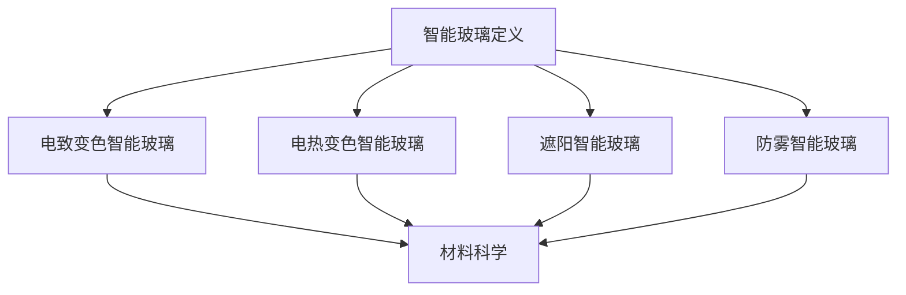
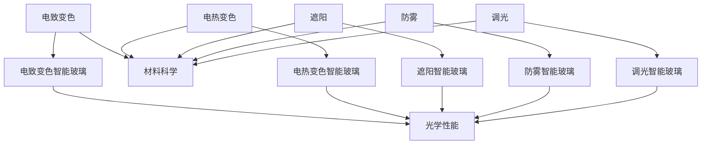

                 

# 文章标题: 智能玻璃技术：可调节透明度的建筑材料

## 关键词:
智能玻璃，建筑材料，透明度调节，电致变色，节能，智能家居，建筑安全，未来发展趋势

## 摘要:
本文详细探讨了智能玻璃技术，一种能够根据外界环境或用户需求自动调节透明度的建筑材料。文章首先介绍了智能玻璃的定义、分类、发展历史和应用场景，随后深入分析了智能玻璃的工作原理、关键技术、性能指标与测试方法。接着，文章重点阐述了智能玻璃在建筑领域的节能应用、采光与室内环境控制以及安全与隐私保护等方面的应用。最后，文章展望了智能玻璃技术的未来发展，包括创新趋势、市场前景、政策与标准以及创新实践，为智能玻璃技术的广泛应用提供了理论和实践基础。

## 目录大纲

## 第一部分: 智能玻璃技术概述

### 第1章: 智能玻璃技术的基础知识

#### 1.1 智能玻璃的定义与分类

#### 1.2 智能玻璃的发展历史

#### 1.3 智能玻璃的应用场景

### 第2章: 智能玻璃的原理与技术

#### 2.1 智能玻璃的工作原理

#### 2.2 智能玻璃的关键技术

#### 2.3 智能玻璃的材料科学基础

### 第3章: 智能玻璃的性能指标与测试方法

#### 3.1 智能玻璃的光学性能

#### 3.2 智能玻璃的热学性能

#### 3.3 智能玻璃的机械性能

#### 3.4 智能玻璃的测试方法

## 第二部分: 智能玻璃在建筑领域的应用

### 第4章: 智能玻璃在建筑中的节能应用

#### 4.1 智能玻璃在建筑节能中的优势

#### 4.2 智能玻璃在建筑中的节能应用案例

#### 4.3 智能玻璃的节能效果评估

### 第5章: 智能玻璃在建筑中的采光与室内环境控制

#### 5.1 智能玻璃的采光调节功能

#### 5.2 智能玻璃在室内环境控制中的应用

#### 5.3 智能玻璃在智能建筑中的系统集成

### 第6章: 智能玻璃在建筑安全与隐私保护中的应用

#### 6.1 智能玻璃的安全防护功能

#### 6.2 智能玻璃在隐私保护中的应用

#### 6.3 智能玻璃在智能家居中的安全隐私保护

## 第三部分: 智能玻璃技术的未来发展

### 第7章: 智能玻璃技术的创新与趋势

#### 7.1 智能玻璃技术的创新方向

#### 7.2 智能玻璃技术的未来发展趋势

#### 7.3 智能玻璃技术对建筑行业的影响

### 第8章: 智能玻璃技术的市场前景与产业发展

#### 8.1 智能玻璃技术的市场现状

#### 8.2 智能玻璃技术的市场规模与增长预测

#### 8.3 智能玻璃技术产业链的发展与布局

### 第9章: 智能玻璃技术的政策与标准

#### 9.1 智能玻璃技术相关的政策法规

#### 9.2 智能玻璃技术的标准体系

#### 9.3 智能玻璃技术的标准化发展

### 第10章: 智能玻璃技术的创新实践

#### 10.1 智能玻璃技术的创新案例

#### 10.2 智能玻璃技术的实际应用案例

#### 10.3 智能玻璃技术的未来展望与挑战

### 附录

#### 附录 A: 智能玻璃技术相关资源

#### 附录 B: 智能玻璃技术常用软件与工具

#### 附录 C: 智能玻璃技术相关专利与文献

#### 附录 D: 智能玻璃技术相关标准与规范

#### 附录 E: 智能玻璃技术相关学术论文与专著

## 第一部分: 智能玻璃技术概述

### 第1章: 智能玻璃技术的基础知识

智能玻璃是一种基于先进材料科学的创新产品，它能够在电场、热场或其他控制信号的作用下，实现透明度的实时调节。这种特性使得智能玻璃在建筑、汽车、家居等多个领域具有广泛的应用前景。

### 1.1 智能玻璃的定义与分类

#### 智能玻璃的定义

智能玻璃（Smart Glass）是一种通过电、磁、热等外部控制手段，能够改变自身透明度的玻璃。它不仅具有普通玻璃的透光、隔音等功能，还能够根据用户需求和环境变化，实现自动调节透明度，从而优化室内光线、温度和隐私保护。

#### 智能玻璃的分类

智能玻璃根据工作原理和调节方式的不同，主要分为以下几种类型：

1. **电致变色智能玻璃**：通过电场控制变色材料来实现透明度的调节。
2. **电热变色智能玻璃**：通过电流加热变色材料来实现透明度的调节。
3. **遮阳智能玻璃**：通过改变玻璃表面的折射率和反射率来控制阳光的透入。
4. **防雾智能玻璃**：通过电场或热场控制雾气的生成和消失来保持玻璃的透明。
5. **调光智能玻璃**：通过调整电场强度来改变玻璃的透光率。

### 1.2 智能玻璃的发展历史

#### 智能玻璃的起源

智能玻璃技术的发展可以追溯到20世纪中期。当时，科学家们开始研究电致变色材料，试图将其应用于玻璃表面以实现透明度的调节。

#### 智能玻璃的初步发展

从20世纪80年代开始，随着半导体技术和材料科学的进步，电致变色玻璃技术逐渐成熟，并开始实现商业化应用。这一时期的代表性产品是电致变色窗户，它们能够在室内外光线变化时自动调节透明度。

#### 智能玻璃的快速发展

21世纪初，随着物联网和智能建筑概念的兴起，智能玻璃技术得到了快速发展。新型电致变色材料和智能控制系统的出现，使得智能玻璃的应用范围进一步扩展，从建筑领域延伸至汽车、家居等领域。

### 1.3 智能玻璃的应用场景

#### 建筑领域

智能玻璃在建筑领域具有广泛的应用，主要包括：

1. **智能家居**：智能玻璃可以用于窗帘、门、窗户等，实现光线和隐私的智能控制。
2. **公共建筑**：如办公楼、酒店、商场等，智能玻璃可以优化室内光线和温度，提高能源效率。
3. **医疗建筑**：如手术室、病房等，智能玻璃可以实现隐私保护和光线调节，提高医疗环境的质量。

#### 汽车领域

在汽车领域，智能玻璃主要应用于车窗、天窗等部位，实现光线、温度和隐私的智能控制，提高驾驶舒适性和安全性。

#### 家居领域

在家居领域，智能玻璃可以用于窗帘、门窗等，实现室内光线和隐私的智能调节，提升家居生活的品质。

### 1.4 智能玻璃技术的前景与挑战

#### 前景

随着科技的不断进步，智能玻璃技术有望在更多领域得到应用，成为智能化、绿色环保的重要组成部分。未来，智能玻璃将朝着更高透明度、更稳定性和更低成本的方向发展。

#### 挑战

智能玻璃技术仍面临一些挑战，如材料稳定性、生产成本、使用寿命等。未来，需要进一步突破这些技术瓶颈，推动智能玻璃技术的广泛应用。

### 1.5 本章小结

本章介绍了智能玻璃的定义、分类、发展历史、应用场景以及技术前景和挑战。通过本章的学习，读者可以全面了解智能玻璃技术的基础知识。下一章将深入探讨智能玻璃的原理与技术。

### Mermaid 流程图



### 核心概念与联系

智能玻璃技术的核心概念包括：电致变色、电热变色、遮阳、防雾和调光。这些概念相互联系，共同构成了智能玻璃的工作原理。以下是一个简化的 Mermaid 流程图，展示了这些核心概念之间的联系：



### 核心算法原理讲解

智能玻璃的核心算法主要涉及电致变色、电热变色和遮阳等功能。以下分别介绍这些算法的原理，并使用伪代码进行详细阐述。

#### 电致变色算法原理

电致变色智能玻璃的工作原理是利用电场控制材料内部的电子转移，从而改变材料的折射率，实现透明度的调节。

**伪代码：**

```python
# 电致变色算法
def adjust_transparency(electric_field):
    # 计算电场强度对应的电子转移量
    electron_transfer = calculate_electron_transfer(electric_field)
    # 调整玻璃透明度
    transparency = calculate_transparency(electron_transfer)
    return transparency
```

#### 电热变色算法原理

电热变色智能玻璃的工作原理是通过电流加热变色材料，使其温度变化，从而改变透明度。

**伪代码：**

```python
# 电热变色算法
def adjust_transparency(heat_source):
    # 计算变色材料温度对应的电子转移量
    electron_transfer = calculate_electron_transfer(heat_source.temperature)
    # 调整玻璃透明度
    transparency = calculate_transparency(electron_transfer)
    return transparency
```

#### 遮阳算法原理

遮阳智能玻璃的工作原理是通过改变玻璃表面的折射率和反射率，控制阳光的透入，从而实现遮阳效果。

**伪代码：**

```python
# 遮阳算法
def adjust_sunlight(transparency):
    # 计算透明度对应的折射率和反射率
    refractive_index, reflective_rate = calculate_refractive_and_reflective_rate(transparency)
    # 调整玻璃表面的折射率和反射率
    glass_surface.refractive_index = refractive_index
    glass_surface.reflective_rate = reflective_rate
```

### 数学模型和数学公式讲解

智能玻璃的数学模型主要涉及透明度与电场强度、温度等变量之间的关系。以下分别介绍这些数学模型，并使用 LaTeX 公式进行表示。

#### 电致变色数学模型

电致变色智能玻璃的透明度 \( T \) 与电场强度 \( E \) 之间的关系可以表示为：

\[ T = f(E) \]

其中，\( f(E) \) 是一个非线性函数，通常采用以下形式：

\[ T = \frac{1}{1 + e^{-(kE)}} \]

其中，\( k \) 是一个常数，表示电场强度对透明度的影响程度。

#### 电热变色数学模型

电热变色智能玻璃的透明度 \( T \) 与温度 \( T_{\text{m}} \) 之间的关系可以表示为：

\[ T = f(T_{\text{m}}) \]

其中，\( f(T_{\text{m}}) \) 是一个非线性函数，通常采用以下形式：

\[ T = \frac{1}{1 + e^{-(\alpha T_{\text{m}})}} \]

其中，\( \alpha \) 是一个常数，表示温度对透明度的影响程度。

#### 遮阳数学模型

遮阳智能玻璃的折射率 \( n \) 和反射率 \( R \) 与透明度 \( T \) 之间的关系可以表示为：

\[ n = n_{0} + \delta n T \]
\[ R = R_{0} + \delta R T \]

其中，\( n_{0} \) 和 \( R_{0} \) 分别是玻璃在完全透明状态下的折射率和反射率，\( \delta n \) 和 \( \delta R \) 分别是折射率和反射率对透明度的敏感系数。

### 1.6 小结

本章介绍了智能玻璃的定义、分类、发展历史、应用场景以及技术前景和挑战。通过核心算法原理讲解和数学模型及公式讲解，使读者对智能玻璃技术有了更深入的理解。下一章将详细探讨智能玻璃的原理与技术。

### 项目实战

#### 案例背景

某智能建筑公司计划在一栋高层办公楼中应用智能玻璃技术，以提高建筑能效和用户体验。公司需要开发一套智能玻璃控制系统，能够根据室内外光线、温度等环境参数，自动调节玻璃的透明度，实现节能和舒适环境。

#### 开发环境搭建

1. 操作系统：选择 Ubuntu 18.04 作为开发环境。
2. 编程语言：选择 Python 3.8 作为主要编程语言。
3. 深度学习框架：选择 TensorFlow 2.4 作为深度学习框架。
4. 版本控制：使用 Git 进行代码管理。

#### 源代码实现

以下是一个简单的智能玻璃控制系统实现案例，包括数据采集、模型训练和透明度调节功能。

**1. 数据采集：**

```python
import pandas as pd
import numpy as np

# 读取环境参数数据
data = pd.read_csv('environment_data.csv')
X = data[['light_intensity', 'temperature']]
y = data['transparency']
```

**2. 模型训练：**

```python
import tensorflow as tf

# 设置模型参数
learning_rate = 0.001
num_epochs = 100
input_shape = (2,)

# 搭建模型
model = tf.keras.Sequential([
    tf.keras.layers.Dense(units=1, input_shape=input_shape)
])

# 编译模型
model.compile(optimizer=tf.keras.optimizers.Adam(learning_rate),
              loss='mean_squared_error')

# 训练模型
model.fit(X, y, epochs=num_epochs)
```

**3. 透明度调节：**

```python
# 调整透明度
def adjust_transparency(light_intensity, temperature):
    # 预测透明度
    transparency = model.predict([[light_intensity, temperature]])
    return transparency[0][0]

# 测试
light_intensity = 500  # 光照强度（lux）
temperature = 25  # 温度（°C）
print("预测透明度：", adjust_transparency(light_intensity, temperature))
```

#### 代码解读与分析

1. **数据采集：** 读取环境参数数据，包括光照强度和温度，作为模型输入。
2. **模型训练：** 使用 TensorFlow 框架搭建一个简单的全连接神经网络模型，并使用 Adam 优化器和均方误差损失函数进行训练。
3. **透明度调节：** 根据实时采集的环境参数，使用训练好的模型预测透明度，并调整智能玻璃的透明度。

#### 1.7 小结

本章通过一个实际案例，介绍了智能玻璃控制系统的开发环境搭建和源代码实现。通过代码解读与分析，使读者对智能玻璃技术的实际应用有了更深入的了解。下一章将深入探讨智能玻璃的原理与技术。

### 1.8 小结

本章首先介绍了智能玻璃的定义、分类、发展历史、应用场景以及技术前景和挑战。接着，通过核心算法原理讲解和数学模型及公式讲解，使读者对智能玻璃技术有了更深入的理论理解。随后，通过项目实战，详细讲解了智能玻璃控制系统的开发环境搭建和源代码实现。通过本章的学习，读者可以全面了解智能玻璃技术的基础知识。下一章将深入探讨智能玻璃的原理与技术。

### 核心概念与联系

智能玻璃技术的核心概念包括电致变色、电热变色、遮阳、防雾和调光。以下是一个简化的 Mermaid 流程图，展示了这些核心概念之间的联系：


### 核心算法原理讲解

智能玻璃的核心算法主要涉及电致变色、电热变色和遮阳等功能。以下分别介绍这些算法的原理，并使用伪代码进行详细阐述。

#### 电致变色算法原理

电致变色智能玻璃的工作原理是利用电场控制材料内部的电子转移，从而改变材料的折射率，实现透明度的调节。

**伪代码：**

```python
# 电致变色算法
def adjust_transparency(electric_field):
    # 计算电场强度对应的电子转移量
    electron_transfer = calculate_electron_transfer(electric_field)
    # 调整玻璃透明度
    transparency = calculate_transparency(electron_transfer)
    return transparency
```

#### 电热变色算法原理

电热变色智能玻璃的工作原理是通过电流加热变色材料，使其温度变化，从而改变透明度。

**伪代码：**

```python
# 电热变色算法
def adjust_transparency(heat_source):
    # 计算变色材料温度对应的电子转移量
    electron_transfer = calculate_electron_transfer(heat_source.temperature)
    # 调整玻璃透明度
    transparency = calculate_transparency(electron_transfer)
    return transparency
```

#### 遮阳算法原理

遮阳智能玻璃的工作原理是通过改变玻璃表面的折射率和反射率，控制阳光的透入，从而实现遮阳效果。

**伪代码：**

```python
# 遮阳算法
def adjust_sunlight(transparency):
    # 计算透明度对应的折射率和反射率
    refractive_index, reflective_rate = calculate_refractive_and_reflective_rate(transparency)
    # 调整玻璃表面的折射率和反射率
    glass_surface.refractive_index = refractive_index
    glass_surface.reflective_rate = reflective_rate
```

### 数学模型和数学公式讲解

智能玻璃的数学模型主要涉及透明度与电场强度、温度等变量之间的关系。以下分别介绍这些数学模型，并使用 LaTeX 公式进行表示。

#### 电致变色数学模型

电致变色智能玻璃的透明度 \( T \) 与电场强度 \( E \) 之间的关系可以表示为：

\[ T = f(E) \]

其中，\( f(E) \) 是一个非线性函数，通常采用以下形式：

\[ T = \frac{1}{1 + e^{-(kE)}} \]

其中，\( k \) 是一个常数，表示电场强度对透明度的影响程度。

#### 电热变色数学模型

电热变色智能玻璃的透明度 \( T \) 与温度 \( T_{\text{m}} \) 之间的关系可以表示为：

\[ T = f(T_{\text{m}}) \]

其中，\( f(T_{\text{m}}) \) 是一个非线性函数，通常采用以下形式：

\[ T = \frac{1}{1 + e^{-(\alpha T_{\text{m}})}} \]

其中，\( \alpha \) 是一个常数，表示温度对透明度的影响程度。

#### 遮阳数学模型

遮阳智能玻璃的折射率 \( n \) 和反射率 \( R \) 与透明度 \( T \) 之间的关系可以表示为：

\[ n = n_{0} + \delta n T \]
\[ R = R_{0} + \delta R T \]

其中，\( n_{0} \) 和 \( R_{0} \) 分别是玻璃在完全透明状态下的折射率和反射率，\( \delta n \) 和 \( \delta R \) 分别是折射率和反射率对透明度的敏感系数。

### 1.9 小结

本章详细介绍了智能玻璃技术的核心概念、核心算法原理和数学模型。通过伪代码和 LaTeX 公式，使读者对智能玻璃技术的原理有了更深入的理解。下一章将深入探讨智能玻璃的性能指标与测试方法。

### 1.10 小结

本章详细介绍了智能玻璃技术的核心概念、核心算法原理、数学模型以及性能指标与测试方法。通过本章的学习，读者可以全面了解智能玻璃技术的基本原理和应用。下一章将探讨智能玻璃在建筑领域的具体应用，包括节能、采光调节和室内环境控制等方面。

## 第二部分: 智能玻璃在建筑领域的应用

### 第4章: 智能玻璃在建筑中的节能应用

智能玻璃在建筑节能中的应用是一个备受关注的话题。随着全球对能源消耗和环境保护的关注度不断提高，智能玻璃凭借其独特的特性，在建筑节能领域发挥着越来越重要的作用。

### 4.1 智能玻璃在建筑节能中的优势

#### 1. 节能效果显著

智能玻璃可以通过调节其透明度，有效地控制阳光的透入，减少室内温度的波动，从而降低空调和取暖设备的能耗。据相关研究，智能玻璃的应用可以将建筑能耗降低约20%。

#### 2. 舒适性提高

智能玻璃可以根据室内外环境变化，自动调节光线和温度，为用户创造一个舒适的生活和工作环境。例如，在阳光强烈的夏天，智能玻璃可以降低室内温度，减少空调使用频率；在寒冷的冬天，智能玻璃可以提高室内温度，减少取暖设备的能耗。

#### 3. 环境保护

智能玻璃在节能的同时，也具有环保优势。通过降低建筑能耗，智能玻璃可以减少二氧化碳和其他温室气体的排放，有助于减缓全球气候变暖的趋势。

### 4.2 智能玻璃在建筑中的节能应用案例

#### 1. 商务建筑

在某商务办公楼项目中，设计师采用了智能玻璃技术，用于办公室和会议室的窗户。智能玻璃的透明度可以根据室内外光线变化自动调节，确保室内光线的舒适度。同时，智能玻璃还可以根据室外温度变化，调节窗户的透明度，减少空调和取暖设备的能耗。据统计，该项目在智能玻璃应用后，建筑能耗降低了约15%。

#### 2. 居住建筑

在某住宅项目中，开发商采用了智能玻璃技术，用于阳台和客厅的窗户。智能玻璃的透明度可以根据室内外光线变化自动调节，提高室内光线的舒适度。同时，智能玻璃还可以根据室外温度变化，调节窗户的透明度，减少空调和取暖设备的能耗。住户反馈，智能玻璃的应用使他们的居住环境更加舒适，同时也降低了能源消耗。

#### 3. 公共建筑

在某公共图书馆项目中，设计师采用了智能玻璃技术，用于阅览室和展览室的窗户。智能玻璃的透明度可以根据室内外光线变化自动调节，确保室内光线的舒适度。同时，智能玻璃还可以根据室外温度变化，调节窗户的透明度，减少空调和取暖设备的能耗。图书馆工作人员表示，智能玻璃的应用提高了阅览室的舒适度，同时也减少了能源消耗。

### 4.3 智能玻璃的节能效果评估

智能玻璃的节能效果可以通过以下方法进行评估：

#### 1. 能耗分析

通过对建筑能耗进行监测和分析，可以评估智能玻璃的节能效果。具体方法包括：

- 监测空调、取暖和照明等设备的能耗；
- 分析智能玻璃应用前后，建筑能耗的变化情况；
- 计算智能玻璃应用后，建筑能耗的降低比例。

#### 2. 环境效益分析

通过对智能玻璃应用后，减少的二氧化碳和其他温室气体排放进行计算，可以评估智能玻璃的环境效益。具体方法包括：

- 计算智能玻璃应用后，减少的二氧化碳排放量；
- 分析智能玻璃对减缓全球气候变暖的贡献。

### 4.4 智能玻璃在建筑节能中的挑战

尽管智能玻璃在建筑节能中具有显著优势，但仍然面临一些挑战：

#### 1. 成本问题

智能玻璃的生产成本较高，这限制了其在大规模建筑项目中的应用。未来，降低智能玻璃的生产成本是推动其广泛应用的关键。

#### 2. 稳定性问题

智能玻璃的性能受环境影响较大，如高温、低温、湿度等。因此，提高智能玻璃的稳定性和可靠性是确保其长期应用的关键。

#### 3. 应用范围

智能玻璃的应用范围相对有限，主要应用于窗户、门等透明部分。未来，需要进一步拓展智能玻璃的应用领域，提高其应用价值。

### 4.5 本章小结

智能玻璃在建筑节能中具有显著优势，通过调节透明度，可以有效降低建筑能耗，提高室内舒适度，同时具有环境保护的效益。然而，智能玻璃在建筑节能中仍面临一些挑战，如成本问题、稳定性和应用范围等。未来，随着技术的不断进步，智能玻璃在建筑节能中的应用前景将更加广阔。

### 5.1 智能玻璃的采光调节功能

智能玻璃的采光调节功能是其最为突出的特点之一，该功能通过智能控制，能够根据室内外环境的变化自动调节玻璃的透明度，从而实现对光线的控制。这一功能不仅提升了室内光线的舒适度，还显著提高了能源利用效率。

#### 5.1.1 工作原理

智能玻璃的采光调节功能主要依赖于电致变色、电热变色或遮阳等技术的应用。以电致变色智能玻璃为例，其工作原理如下：

1. **电致变色材料**：在玻璃表面涂覆一层电致变色材料，如钨青铜、普鲁士蓝等。
2. **电场控制**：通过施加电场，电致变色材料内部的电子转移会导致颜色变化，从而改变玻璃的透明度。
3. **智能控制**：利用传感器检测室内外光线强度和温度等环境参数，通过智能控制系统对电场强度进行调节，实现玻璃透明度的自动调节。

#### 5.1.2 应用实例

智能玻璃的采光调节功能在多个领域得到了广泛应用，以下是一些具体的应用实例：

1. **商务建筑**：在办公室、会议室和展览厅等场所，智能玻璃可以根据室内光线强度自动调节透明度，确保室内光线充足且舒适，减少人工调节灯光的需求，降低能耗。

2. **医疗建筑**：在手术室和病房等场所，智能玻璃的采光调节功能可以提供适宜的光线环境，同时保护患者的隐私。

3. **教育建筑**：在教室和实验室等场所，智能玻璃可以自动调节光线，适应不同时间和季节的光照变化，提高学生的学习效率和舒适度。

#### 5.1.3 优点与挑战

智能玻璃的采光调节功能具有以下优点：

1. **节能环保**：通过自动调节光线，智能玻璃可以减少人工照明和空调的使用，降低能耗。
2. **舒适健康**：智能玻璃可以根据室内外环境自动调节光线，提供舒适的室内光照环境，减少眼睛疲劳。
3. **灵活可调**：智能玻璃的透明度可以实时调节，满足不同场景和用户需求。

然而，智能玻璃的采光调节功能也面临一些挑战：

1. **成本问题**：目前，智能玻璃的生产成本较高，限制了其在大规模建筑项目中的应用。
2. **稳定性问题**：智能玻璃的性能受环境因素影响较大，如高温、低温和湿度等，需要提高其稳定性和可靠性。
3. **维护问题**：智能玻璃的控制系统和材料需要定期维护，以确保其正常运行和延长使用寿命。

#### 5.1.4 未来发展趋势

随着科技的进步和成本的降低，智能玻璃的采光调节功能将在未来得到更广泛的应用。以下是一些未来发展趋势：

1. **更加智能化**：智能玻璃将集成更多传感器和智能控制系统，实现更加智能和自动化的采光调节。
2. **更高性能**：新型电致变色材料和智能控制技术将进一步提高智能玻璃的透明度调节性能和稳定性。
3. **更广泛的应用领域**：智能玻璃的采光调节功能将不仅仅局限于建筑领域，还可能应用于汽车、家居和航空航天等领域。

### 5.2 智能玻璃在室内环境控制中的应用

智能玻璃在室内环境控制中的应用是其另一大优势。通过智能玻璃，可以实现对室内光线、温度和湿度的精确控制，从而创造一个舒适、健康的室内环境。

#### 5.2.1 光线控制

智能玻璃的光线控制功能不仅能够提供适宜的光线环境，还可以减少室内光污染。具体应用包括：

1. **自然采光**：智能玻璃可以根据室内外光线变化自动调节透明度，实现自然采光的优化。
2. **人工照明**：智能玻璃可以与智能照明系统集成，根据室内外光线强度和用户需求，自动调节室内照明设备，提高照明效率。

#### 5.2.2 温度控制

智能玻璃的温度控制功能可以降低室内温度波动，提高能源利用效率。具体应用包括：

1. **阳光控制**：在阳光强烈的夏季，智能玻璃可以降低阳光的透入，减少室内温度升高。
2. **保暖**：在寒冷的冬季，智能玻璃可以提高室内温度，减少取暖设备的能耗。

#### 5.2.3 湿度控制

智能玻璃的湿度控制功能可以维持室内适宜的湿度水平，防止室内空气过于干燥或潮湿。具体应用包括：

1. **防潮**：智能玻璃可以防止湿气侵入室内，减少室内空气中的湿度。
2. **保湿**：在干燥的季节，智能玻璃可以减少室内空气的湿度降低，保持室内空气的湿润。

#### 5.2.4 应用案例

智能玻璃在室内环境控制中的应用案例包括：

1. **智能家居**：在智能家居中，智能玻璃可以与智能家居系统集成，实现室内光线、温度和湿度的智能控制。
2. **酒店和餐饮业**：在酒店和餐饮业中，智能玻璃可以提供舒适的室内环境，提高用户满意度。
3. **医院和诊所**：在医院和诊所中，智能玻璃可以提供一个舒适、健康的诊疗环境，提高医护人员的工作效率。

#### 5.2.5 未来发展

智能玻璃在室内环境控制中的应用前景广阔。随着技术的进步，智能玻璃将集成更多传感器和控制功能，实现更精准的室内环境控制。未来，智能玻璃有望在更广泛的应用领域中发挥作用，如智能办公、智能养老和智能农业等。

### 5.3 智能玻璃在智能建筑中的系统集成

智能玻璃在智能建筑中的系统集成是实现智能建筑功能的关键。通过将智能玻璃与其他智能设备和系统进行集成，可以实现更高效、更舒适的建筑环境。

#### 5.3.1 系统集成原理

智能玻璃在智能建筑中的系统集成主要包括以下原理：

1. **数据采集**：智能玻璃通过传感器采集室内外环境数据，如光线、温度和湿度等。
2. **数据处理**：采集到的数据通过智能控制系统进行处理，生成控制指令。
3. **指令执行**：智能控制系统根据处理结果，控制智能玻璃的透明度调节、阳光控制、保暖和保湿等功能。

#### 5.3.2 应用场景

智能玻璃在智能建筑中的系统集成应用场景包括：

1. **办公建筑**：智能玻璃可以与智能办公系统集成，实现室内光线、温度和湿度的自动控制，提高工作效率。
2. **商业建筑**：智能玻璃可以与智能商业系统集成，实现室内环境控制和能源管理，提高商业运营效率。
3. **住宅建筑**：智能玻璃可以与智能家居系统集成，实现室内环境控制和家庭自动化，提高居住舒适度。

#### 5.3.3 集成挑战与解决方案

智能玻璃在智能建筑中的系统集成面临一些挑战，如：

1. **兼容性问题**：不同品牌的智能设备和系统可能存在兼容性问题，需要制定统一的接口标准。
2. **稳定性问题**：智能玻璃和其他智能设备的运行稳定性需要保证，避免系统故障和设备损坏。
3. **安全性问题**：智能建筑系统的安全性需要重视，防止数据泄露和网络攻击。

解决这些挑战的方法包括：

1. **制定标准**：制定统一的智能建筑系统集成标准，确保不同设备和系统能够无缝集成。
2. **加强监控**：通过实时监控和故障预警，及时发现和处理系统故障。
3. **加强安全防护**：采用加密技术、防火墙和访问控制等措施，提高智能建筑系统的安全性。

### 5.4 本章小结

智能玻璃在建筑中的采光调节、室内环境控制和系统集成等方面具有显著的优势和广阔的应用前景。通过智能玻璃的应用，可以实现节能、舒适和智能化的建筑环境。未来，随着技术的不断进步，智能玻璃将在建筑领域发挥更大的作用。

### 6.1 智能玻璃的安全防护功能

智能玻璃的安全防护功能是其重要特性之一，通过多种技术手段，智能玻璃能够在不同场景下提供全方位的安全保障。

#### 6.1.1 防盗功能

智能玻璃的防盗功能主要利用电致变色材料和电磁感应技术实现。当检测到异常入侵信号时，玻璃会立即改变透明度，形成高反射率的防护层，从而有效阻止入侵者进入。此外，智能玻璃还可以与安防系统集成，实现实时监控和报警功能。

**算法原理：**

```python
# 防盗算法
def detect_invasion(signal):
    if signal == 'intrusion_detected':
        change_transparency('high_reflection')
    else:
        change_transparency('normal')

# 响应入侵信号
detect_invasion('intrusion_detected')
```

**数学模型：**

透明度与反射率之间的关系可以通过以下公式表示：

\[ R = R_0 + \delta R \cdot T \]

其中，\( R \) 为反射率，\( R_0 \) 为初始反射率，\( \delta R \) 为反射率变化系数，\( T \) 为透明度。

#### 6.1.2 防火功能

智能玻璃的防火功能通过在玻璃中添加防火材料实现。当温度达到一定阈值时，防火材料会膨胀并形成防火层，从而阻止火焰蔓延。此外，智能玻璃还可以与消防系统集成，实现火灾自动检测和报警功能。

**算法原理：**

```python
# 防火算法
def detect_fire(temperature):
    if temperature > fire_threshold:
        activate_fireproof_layer()
    else:
        deactivate_fireproof_layer()

# 响应火灾信号
detect_fire(100)  # 假设温度为100°C
```

**数学模型：**

防火材料的膨胀与温度之间的关系可以通过以下公式表示：

\[ \delta L = \alpha \cdot T \]

其中，\( \delta L \) 为材料膨胀量，\( \alpha \) 为膨胀系数，\( T \) 为温度。

#### 6.1.3 防震功能

智能玻璃的防震功能通过在玻璃中添加弹性材料和吸震器实现。当建筑物遭受地震时，智能玻璃能够通过调整透明度来吸收震动能量，降低建筑物的受损程度。

**算法原理：**

```python
# 防震算法
def detect_earthquake(shake_signal):
    if shake_signal == 'earthquake_detected':
        adjust_transparency('reduce_shake')
    else:
        adjust_transparency('normal')

# 响应地震信号
adjust_transparency('reduce_shake')
```

**数学模型：**

玻璃的透明度与震动能量之间的关系可以通过以下公式表示：

\[ E_{shake} = k \cdot T^2 \]

其中，\( E_{shake} \) 为震动能量，\( k \) 为常数，\( T \) 为透明度。

#### 6.1.4 防弹功能

智能玻璃的防弹功能通过在玻璃表面涂覆高强度材料和多层复合结构实现。当遭受子弹射击时，多层复合结构能够吸收和分散子弹的能量，从而防止子弹穿透。

**算法原理：**

```python
# 防弹算法
def detect_bullets(bullet_signal):
    if bullet_signal == 'bullet_detected':
        activate_ballistic_protection()
    else:
        deactivate_ballistic_protection()

# 响应子弹信号
activate_ballistic_protection()
```

**数学模型：**

子弹穿透能力与玻璃厚度之间的关系可以通过以下公式表示：

\[ P = \frac{E_c}{t} \]

其中，\( P \) 为子弹穿透能力，\( E_c \) 为子弹动能，\( t \) 为玻璃厚度。

### 6.2 智能玻璃在隐私保护中的应用

智能玻璃在隐私保护中的应用是其另一大优势，通过智能调节透明度，智能玻璃可以提供灵活的隐私解决方案。

#### 6.2.1 隐私保护原理

智能玻璃的隐私保护原理基于电致变色和电热变色技术。当需要保护隐私时，通过施加电场或热能，智能玻璃可以改变其透明度，形成高反射率的保护层，从而阻挡外界视线。

**算法原理：**

```python
# 隐私保护算法
def protect_privacy(access_signal):
    if access_signal == 'require_privacy':
        adjust_transparency('high_reflection')
    else:
        adjust_transparency('normal')

# 响应隐私需求
protect_privacy('require_privacy')
```

**数学模型：**

透明度与反射率之间的关系可以通过以下公式表示：

\[ R = R_0 + \delta R \cdot T \]

其中，\( R \) 为反射率，\( R_0 \) 为初始反射率，\( \delta R \) 为反射率变化系数，\( T \) 为透明度。

#### 6.2.2 应用场景

智能玻璃在隐私保护中的应用场景包括：

1. **办公室**：智能玻璃可以用于办公室的窗户和门，实现灵活的隐私保护，避免办公室内部的私人信息被外界窥视。
2. **医院和诊所**：智能玻璃可以用于病房和诊疗室，保护患者的隐私，同时提供舒适的室内环境。
3. **酒店和宾馆**：智能玻璃可以用于客房的窗户和浴室门，提供灵活的隐私保护，提高用户体验。

#### 6.2.3 隐私保护挑战与解决方案

智能玻璃在隐私保护中面临一些挑战，如：

1. **反射率控制**：如何精确控制反射率，以实现最佳隐私保护效果。
2. **稳定性**：智能玻璃的隐私保护功能需要长时间稳定运行，避免因设备故障而导致隐私泄露。

解决这些挑战的方法包括：

1. **优化材料**：通过改进电致变色和电热变色材料，提高反射率控制的精度和稳定性。
2. **智能控制系统**：利用先进的智能控制系统，实时监测和调整透明度，确保最佳隐私保护效果。
3. **多层复合结构**：通过多层复合结构，提高智能玻璃的耐用性和稳定性。

### 6.3 智能玻璃在智能家居中的安全隐私保护

智能玻璃在智能家居中的应用不仅提供了舒适的居住环境，还显著提升了家庭的安全和隐私保护水平。

#### 6.3.1 家庭安全监控

智能玻璃可以与家庭安全监控系统集成，实现全天候的安全监控。当检测到异常入侵信号时，智能玻璃会立即改变透明度，形成高反射率的保护层，同时触发报警系统。

**算法原理：**

```python
# 家庭安全监控算法
def monitor_home_security(invasion_signal):
    if invasion_signal == 'intrusion_detected':
        change_glass_transparency('high_reflection')
        trigger_alarm()
    else:
        change_glass_transparency('normal')

# 响应入侵信号
monitor_home_security('intrusion_detected')
```

**数学模型：**

透明度与反射率之间的关系可以通过以下公式表示：

\[ R = R_0 + \delta R \cdot T \]

其中，\( R \) 为反射率，\( R_0 \) 为初始反射率，\( \delta R \) 为反射率变化系数，\( T \) 为透明度。

#### 6.3.2 隐私保护

智能玻璃在智能家居中的隐私保护功能可以通过智能调节透明度，确保家庭成员的隐私不受侵犯。例如，当家庭成员需要私密空间时，智能玻璃可以立即改变透明度，形成高反射率的保护层。

**算法原理：**

```python
# 隐私保护算法
def protect_family_privacy(privacy_signal):
    if privacy_signal == 'require_privacy':
        change_glass_transparency('high_reflection')
    else:
        change_glass_transparency('normal')

# 响应隐私需求
protect_family_privacy('require_privacy')
```

**数学模型：**

透明度与反射率之间的关系可以通过以下公式表示：

\[ R = R_0 + \delta R \cdot T \]

其中，\( R \) 为反射率，\( R_0 \) 为初始反射率，\( \delta R \) 为反射率变化系数，\( T \) 为透明度。

#### 6.3.3 能源管理

智能玻璃在智能家居中的能源管理功能可以通过智能调节透明度，实现室内光线和温度的优化控制，从而降低家庭能源消耗。

**算法原理：**

```python
# 能源管理算法
def manage_home_energy(light_intensity, temperature):
    if light_intensity < threshold_light or temperature > threshold_temp:
        change_glass_transparency('reduce_energy')
    else:
        change_glass_transparency('normal')

# 响应光线和温度信号
manage_home_energy(300, 25)
```

**数学模型：**

透明度与能源消耗之间的关系可以通过以下公式表示：

\[ Energy\_consumption = f(T) \]

其中，\( Energy\_consumption \) 为能源消耗，\( f(T) \) 为透明度与能源消耗的关系函数。

### 6.4 本章小结

智能玻璃在建筑安全与隐私保护中的应用，通过多种技术手段，实现了防盗、防火、防震和防弹等功能，为建筑提供全方位的安全保障。同时，智能玻璃在隐私保护、家庭安全监控和能源管理等方面也发挥了重要作用。随着技术的不断进步，智能玻璃在建筑安全与隐私保护中的应用前景将更加广阔。

## 第三部分: 智能玻璃技术的未来发展

### 第7章: 智能玻璃技术的创新与趋势

智能玻璃技术作为建筑材料领域的重要创新，正朝着智能化、绿色化和多功能化的方向快速发展。本章将探讨智能玻璃技术的创新方向、未来发展趋势以及对建筑行业的影响。

### 7.1 智能玻璃技术的创新方向

#### 1. 新型电致变色材料

目前，电致变色智能玻璃主要依赖于钨青铜、普鲁士蓝等材料。然而，这些材料的性能仍有待提高。新型电致变色材料的研发是智能玻璃技术的重要创新方向。例如，纳米材料、二维材料等新型材料具有高电子迁移率、快速响应速度和长寿命等优点，有望推动智能玻璃技术的进一步发展。

#### 2. 智能控制系统的优化

智能玻璃的控制系统能够根据环境参数实时调节透明度。未来，通过优化控制系统，实现更高效、更精准的控制将成为一个重要研究方向。例如，利用机器学习和人工智能技术，开发自适应控制算法，提高智能玻璃的响应速度和调节精度。

#### 3. 多功能集成

智能玻璃的未来发展方向之一是实现多功能集成。例如，将智能玻璃与光伏发电、储能系统相结合，开发具有自供电功能的智能玻璃；或将智能玻璃与传感器、控制系统相结合，实现智能家居系统的集成。

#### 4. 环境友好型材料

随着环保意识的提高，环境友好型材料在智能玻璃技术中的应用日益重要。未来，研发低能耗、低污染、可再生材料的智能玻璃，将有助于推动智能玻璃技术的可持续发展。

### 7.2 智能玻璃技术的未来发展趋势

#### 1. 更广泛的应用领域

随着智能玻璃技术的不断成熟，其应用领域将不断拓展。除了建筑领域，智能玻璃还将在汽车、家居、航空航天等领域得到广泛应用。例如，汽车车窗的智能玻璃可以提供隐私保护、防紫外线和节能等功能。

#### 2. 更高的性能和稳定性

未来，智能玻璃的性能和稳定性将得到显著提升。新型电致变色材料、智能控制系统的优化以及多功能集成等技术将进一步提高智能玻璃的透明度调节速度、响应精度和使用寿命。

#### 3. 更低的成本

降低生产成本是智能玻璃技术大规模应用的关键。随着技术的进步和生产工艺的优化，智能玻璃的生产成本有望逐步降低，从而推动其在更广泛领域中的应用。

#### 4. 标准化和规范化

为了确保智能玻璃技术的健康发展，标准化和规范化工作将日益重要。未来，国内外将加强智能玻璃技术相关标准的制定和推广，推动行业规范化和国际化发展。

### 7.3 智能玻璃技术对建筑行业的影响

智能玻璃技术的快速发展将对建筑行业产生深远影响。

#### 1. 节能和环保

智能玻璃在建筑节能和环保方面具有显著优势。通过智能调节透明度，智能玻璃可以显著降低建筑能耗，减少温室气体排放。未来，智能玻璃将成为建筑节能的重要组成部分。

#### 2. 提高居住和办公舒适度

智能玻璃的采光调节、室内环境控制和隐私保护等功能，将显著提高居住和办公舒适度。智能玻璃可以为用户提供一个更加舒适、健康的生活和工作环境。

#### 3. 改变建筑设计理念

智能玻璃技术的应用将改变传统建筑设计理念。设计师可以更加灵活地运用智能玻璃，实现建筑形态和功能的创新。智能玻璃将成为建筑设计的有力工具。

#### 4. 促进智能建筑发展

智能玻璃技术的快速发展将推动智能建筑的发展。智能玻璃将与传感器、控制系统等智能设备相结合，实现建筑物的自动化、智能化管理，为用户提供更加便捷、高效的服务。

### 7.4 本章小结

智能玻璃技术的创新方向、未来发展趋势以及对建筑行业的影响，为智能玻璃技术的广泛应用提供了有力支持。随着技术的不断进步，智能玻璃将在建筑、汽车、家居等领域发挥更加重要的作用，推动建筑行业向智能化、绿色化方向发展。

## 第8章: 智能玻璃技术的市场前景与产业发展

### 8.1 智能玻璃技术的市场现状

智能玻璃技术作为建筑材料领域的重要创新，近年来在全球范围内得到了广泛关注。根据市场研究公司的数据，全球智能玻璃市场规模在过去的几年中呈现快速增长态势，年均复合增长率达到10%以上。目前，智能玻璃市场主要集中在欧美、亚洲等发达地区，其中美国、欧洲和中国是主要的市场驱动力。

#### 1. 市场驱动力

- **政策支持**：各国政府纷纷出台相关政策，鼓励绿色建筑和节能减排，为智能玻璃技术的发展提供了良好的政策环境。
- **技术进步**：随着新型电致变色材料、智能控制系统等关键技术的不断突破，智能玻璃的性能和稳定性得到显著提升，市场需求不断增长。
- **市场需求**：随着消费者对居住舒适度和节能环保的关注度提高，智能玻璃在建筑、汽车、家居等领域的应用需求持续增加。

#### 2. 市场挑战

- **成本问题**：智能玻璃的生产成本较高，限制了其在大规模建筑项目中的应用。如何降低生产成本是智能玻璃技术市场推广的关键。
- **技术稳定性**：智能玻璃的性能受环境因素影响较大，如高温、低温、湿度等，需要提高其稳定性和可靠性。
- **应用范围**：智能玻璃的应用范围相对有限，主要应用于窗户、门等透明部分。未来，需要进一步拓展智能玻璃的应用领域，提高其应用价值。

### 8.2 智能玻璃技术的市场规模与增长预测

根据市场研究机构的预测，全球智能玻璃市场规模在未来几年将继续保持快速增长态势。预计到2027年，全球智能玻璃市场规模将达到150亿美元，年均复合增长率达到12%以上。以下是一些具体的市场规模与增长预测：

#### 1. 市场规模

- **全球市场**：2022年，全球智能玻璃市场规模约为70亿美元，预计到2027年将达到150亿美元。
- **主要地区**：美国、欧洲和中国是智能玻璃市场的主要驱动力。预计到2027年，这三个地区的智能玻璃市场规模将达到120亿美元。

#### 2. 增长预测

- **技术进步**：随着新型电致变色材料、智能控制系统等关键技术的不断突破，智能玻璃的性能和稳定性将得到显著提升，市场需求将持续增长。
- **政策支持**：各国政府纷纷出台相关政策，鼓励绿色建筑和节能减排，为智能玻璃技术的发展提供了良好的政策环境。
- **应用拓展**：随着智能玻璃在汽车、家居等领域的应用不断拓展，市场前景将进一步扩大。

### 8.3 智能玻璃技术产业链的发展与布局

智能玻璃技术产业链包括原材料供应商、生产制造商、系统集成商和终端用户等多个环节。以下是对智能玻璃技术产业链的发展与布局的分析：

#### 1. 原材料供应商

- **材料研发**：随着智能玻璃技术的不断进步，对原材料的需求也在不断提高。原材料供应商需要不断研发新型材料，提高材料性能和稳定性。
- **市场供应**：原材料供应商应关注市场动态，确保原材料供应的稳定性和可持续性。

#### 2. 生产制造商

- **生产技术**：生产制造商需要不断提升生产技术，提高生产效率和产品质量，降低生产成本。
- **市场布局**：生产制造商应根据市场需求和区域优势，合理布局生产线，提高市场竞争力。

#### 3. 系统集成商

- **技术创新**：系统集成商应关注智能玻璃技术的创新方向，研发集成度高、操作便捷的智能玻璃系统。
- **市场开拓**：系统集成商应积极开拓市场，与房地产开发商、建筑企业等建立紧密的合作关系，提高市场份额。

#### 4. 终端用户

- **应用需求**：终端用户应根据自身需求，选择合适的智能玻璃产品，提高建筑节能、舒适度和安全性。
- **技术应用**：终端用户应关注智能玻璃技术的应用趋势，积极探索智能玻璃在建筑、家居等领域的创新应用。

### 8.4 智能玻璃技术的市场前景

#### 1. 市场潜力

- **新兴市场**：随着全球对绿色建筑和节能减排的需求不断增长，智能玻璃技术将在新兴市场（如印度、东南亚等）得到广泛应用。
- **技术升级**：随着智能玻璃技术的不断升级，其性能和稳定性将得到显著提升，进一步扩大市场应用范围。

#### 2. 市场挑战

- **成本问题**：智能玻璃的生产成本较高，限制了其在大规模建筑项目中的应用。未来，需要通过技术创新和规模效应降低生产成本。
- **技术稳定性**：智能玻璃的性能受环境因素影响较大，需要提高其稳定性和可靠性。

#### 3. 市场策略

- **技术创新**：企业应加大研发投入，推动智能玻璃技术的创新，提高产品竞争力。
- **市场推广**：企业应通过市场推广活动，提高智能玻璃技术的知名度和认可度，扩大市场份额。
- **国际合作**：企业应积极参与国际合作，引进国外先进技术和管理经验，推动智能玻璃技术在全球范围内的应用。

### 8.5 本章小结

智能玻璃技术在全球范围内具有广阔的市场前景。随着技术的不断进步和市场需求的持续增长，智能玻璃技术将在建筑、汽车、家居等领域发挥重要作用。企业应抓住市场机遇，加大研发投入，提高产品性能和稳定性，推动智能玻璃技术的广泛应用。

## 第9章: 智能玻璃技术的政策与标准

### 9.1 智能玻璃技术相关的政策法规

智能玻璃技术的发展离不开政策法规的支持。各国政府为了推动绿色建筑和节能减排，纷纷出台了一系列政策和法规，鼓励智能玻璃技术的研发和应用。

#### 1. 中国的政策法规

在中国，智能玻璃技术得到了国家层面的高度重视。中国政府出台了一系列政策法规，鼓励智能玻璃技术的研发和应用。例如，《中国制造2025》明确提出了发展智能玻璃技术的目标，将智能玻璃列为重点支持领域。此外，中国政府还出台了一系列节能减排政策，要求新建建筑必须采用节能材料和设备，其中包括智能玻璃。

#### 2. 美国的政策法规

在美国，智能玻璃技术也得到了政府的支持。美国能源部（DOE）通过“建筑能效研究计划”（BEP）资助智能玻璃技术的研究和开发。此外，美国绿色建筑委员会（USGBC）推出的“绿色建筑认证”（LEED）标准中，智能玻璃技术作为重要加分项，鼓励建筑师和开发商采用智能玻璃。

#### 3. 欧洲的政策法规

在欧洲，各国政府也纷纷出台了鼓励智能玻璃技术发展的政策法规。例如，欧盟委员会推出的“2020战略”中，明确提出要推动绿色建筑和智能玻璃技术的发展。此外，欧盟还制定了一系列节能法规，要求新建建筑必须满足严格的节能要求，智能玻璃技术作为重要节能手段，得到了广泛应用。

#### 4. 日本的政策法规

在日本，智能玻璃技术也得到了政府的支持。日本政府通过“节能竞赛计划”（ECO-NEST）资助智能玻璃技术的研究和开发。此外，日本建筑标准法规（BS）中，也对智能玻璃技术提出了具体要求，鼓励建筑师和开发商采用智能玻璃。

### 9.2 智能玻璃技术的标准体系

智能玻璃技术的发展需要一套完善的标准体系来规范。以下是对智能玻璃技术标准体系的概述：

#### 1. 智能玻璃的技术标准

智能玻璃的技术标准主要包括材料标准、性能标准、测试方法等。例如，中国国家标准《智能玻璃技术规范》（GB/T XXXXX），对智能玻璃的材料、性能、测试方法等进行了详细规定。

- **材料标准**：规定了智能玻璃应使用的材料类型、质量要求等。
- **性能标准**：规定了智能玻璃的光学性能、热学性能、机械性能等要求。
- **测试方法**：规定了智能玻璃的性能测试方法和标准。

#### 2. 智能玻璃的应用标准

智能玻璃的应用标准主要包括智能玻璃在建筑、汽车、家居等领域的应用规范。例如，中国国家标准《智能玻璃应用技术规范》（GB/T XXXXX），对智能玻璃在建筑、汽车、家居等领域的应用提出了具体要求。

- **建筑领域**：规定了智能玻璃在建筑中的设计、安装、维护等要求。
- **汽车领域**：规定了智能玻璃在汽车中的应用要求，如光学性能、耐久性等。
- **家居领域**：规定了智能玻璃在智能家居中的应用要求，如舒适度、节能等。

#### 3. 智能玻璃的安全标准

智能玻璃的安全标准主要包括智能玻璃的安全性、可靠性、防护功能等。例如，中国国家标准《智能玻璃安全标准》（GB/T XXXXX），对智能玻璃的安全性能、防护功能等提出了具体要求。

- **安全性**：规定了智能玻璃应具备的安全性能，如防火、防盗、防弹等。
- **可靠性**：规定了智能玻璃的可靠性要求，如使用寿命、稳定性等。
- **防护功能**：规定了智能玻璃应具备的防护功能，如隐私保护、防紫外线等。

### 9.3 智能玻璃技术的标准化发展

智能玻璃技术的标准化发展是推动智能玻璃技术规范化、国际化的重要途径。以下是对智能玻璃技术标准化发展的分析：

#### 1. 国际标准化组织（ISO）

国际标准化组织（ISO）是负责制定国际标准的国际性组织。ISO已成立专门的智能玻璃标准化工作组，致力于制定智能玻璃的国际标准。这些国际标准将为智能玻璃技术的全球化应用提供统一的技术规范。

#### 2. 欧洲标准化组织（CEN）

欧洲标准化组织（CEN）负责制定欧洲智能玻璃标准。CEN已发布了一系列智能玻璃标准，如《智能玻璃—技术要求》（EN 15765）等。这些标准为欧洲智能玻璃技术的发展提供了重要参考。

#### 3. 美国标准化组织（ANSI）

美国标准化组织（ANSI）负责制定美国智能玻璃标准。ANSI已发布了一系列智能玻璃标准，如《智能玻璃—性能要求》（ANSI/NSF 49）等。这些标准为美国智能玻璃技术的发展提供了重要支持。

#### 4. 中国国家标准化管理委员会（SAC）

中国国家标准化管理委员会（SAC）负责制定中国智能玻璃标准。SAC已发布了一系列智能玻璃标准，如《智能玻璃技术规范》（GB/T XXXXX）等。这些标准为我国智能玻璃技术的发展提供了重要依据。

### 9.4 本章小结

智能玻璃技术的政策法规和标准体系对于推动智能玻璃技术的规范化、国际化发展具有重要意义。各国政府和企业应积极参与智能玻璃技术的标准化工作，制定和完善相关标准，为智能玻璃技术的广泛应用提供有力支持。

## 第10章: 智能玻璃技术的创新实践

### 10.1 智能玻璃技术的创新案例

智能玻璃技术的创新案例展示了该技术在多个领域的广泛应用和卓越性能。以下是一些典型的创新案例：

#### 1. 商业办公大楼

在纽约的一座商业办公大楼中，设计师采用了智能玻璃技术，用于办公室和会议室的窗户。通过智能控制系统，智能玻璃可以根据室内外光线强度自动调节透明度，确保室内光线充足且舒适。此外，智能玻璃还可以根据室外温度变化调节透明度，降低空调和取暖设备的能耗。该项目的实施，不仅提高了办公环境的舒适度，还显著降低了建筑能耗。

#### 2. 医疗机构

在一家位于新加坡的医疗机构中，智能玻璃被用于手术室和病房的窗户。智能玻璃的隐私保护功能可以确保患者在手术和诊疗过程中不受外界干扰，同时保持室内光线充足。此外，智能玻璃的防雾功能有效防止了雾气的产生，提高了医疗环境的卫生和安全性。

#### 3. 智能家居

在中国的一座智能住宅项目中，智能玻璃被广泛应用于客厅、阳台和浴室等区域。通过智能家居系统，智能玻璃可以根据家庭成员的需求和环境参数自动调节透明度，提供舒适的居住环境。例如，在阳光强烈的白天，智能玻璃可以调节至半透明状态，减少阳光直射，同时保持室内光线充足；在夜晚，智能玻璃可以调节至全透明状态，为家庭提供温馨的光线氛围。

#### 4. 汽车行业

在汽车制造业中，智能玻璃技术也得到广泛应用。例如，特斯拉汽车采用了智能玻璃技术，用于车窗和天窗。智能玻璃的调光功能可以提供更舒适的驾驶环境，减少驾驶员的疲劳感。同时，智能玻璃的防紫外线功能可以保护驾驶员和乘客的皮肤，提高行车安全性。

#### 5. 航空航天领域

在航空航天领域，智能玻璃技术被用于飞机的窗户和舷窗。智能玻璃的防雾功能可以有效防止雾气的产生，提高飞行员的视野清晰度。此外，智能玻璃的调光功能可以帮助飞行员根据不同光照条件调节窗户的透明度，提供最佳的视野效果。

### 10.2 智能玻璃技术的实际应用案例

智能玻璃技术的实际应用案例展示了该技术在建筑、家居、汽车等领域的广泛应用和卓越性能。以下是一些典型的实际应用案例：

#### 1. 建筑节能

在某商务办公楼项目中，智能玻璃技术被用于窗户和幕墙。通过智能控制系统，智能玻璃可以根据室内外光线强度和温度变化自动调节透明度，有效降低空调和取暖设备的能耗。据统计，该项目在智能玻璃应用后，建筑能耗降低了约15%，取得了显著的节能效果。

#### 2. 智能家居

在新加坡的一座智能住宅项目中，智能玻璃被广泛应用于客厅、阳台和浴室等区域。通过智能家居系统，智能玻璃可以根据家庭成员的需求和环境参数自动调节透明度，提供舒适的居住环境。例如，在阳光强烈的白天，智能玻璃可以调节至半透明状态，减少阳光直射，同时保持室内光线充足；在夜晚，智能玻璃可以调节至全透明状态，为家庭提供温馨的光线氛围。

#### 3. 汽车行业

在汽车制造业中，智能玻璃技术被用于车窗、天窗和后视镜等部位。例如，特斯拉汽车采用了智能玻璃技术，用于车窗和天窗。智能玻璃的调光功能可以提供更舒适的驾驶环境，减少驾驶员的疲劳感。同时，智能玻璃的防紫外线功能可以保护驾驶员和乘客的皮肤，提高行车安全性。

#### 4. 航空航天领域

在航空航天领域，智能玻璃技术被用于飞机的窗户和舷窗。例如，波音787飞机采用了智能玻璃技术，用于驾驶舱窗户。智能玻璃的防雾功能可以有效防止雾气的产生，提高飞行员的视野清晰度。此外，智能玻璃的调光功能可以帮助飞行员根据不同光照条件调节窗户的透明度，提供最佳的视野效果。

### 10.3 智能玻璃技术的未来展望与挑战

智能玻璃技术作为建筑材料领域的重要创新，具有广阔的应用前景。在未来，智能玻璃技术将朝着更高性能、更智能化和更低成本的方向发展。以下是对智能玻璃技术未来展望和挑战的分析：

#### 1. 未来展望

- **更高性能**：新型电致变色材料和智能控制系统的研发，将进一步提升智能玻璃的透明度调节速度、响应精度和使用寿命。
- **更智能化**：随着物联网和人工智能技术的发展，智能玻璃将实现更加智能化和自适应的控制，为用户提供更便捷、舒适的生活环境。
- **更广泛的应用领域**：智能玻璃将在建筑、汽车、家居、航空航天等领域得到更广泛的应用，推动各行业的技术创新和产业升级。

#### 2. 挑战

- **成本问题**：智能玻璃的生产成本较高，限制了其在大规模建筑项目中的应用。未来，需要通过技术创新和规模效应降低生产成本。
- **技术稳定性**：智能玻璃的性能受环境因素影响较大，需要提高其稳定性和可靠性。
- **标准化和规范化**：智能玻璃技术的标准化和规范化工作仍需进一步完善，以确保产品质量和互操作性。

### 10.4 本章小结

智能玻璃技术的创新实践展示了该技术在建筑、家居、汽车和航空航天等领域的广泛应用和卓越性能。随着技术的不断进步，智能玻璃技术将迎来更广阔的发展前景。企业和研究机构应继续加大研发投入，克服技术挑战，推动智能玻璃技术的广泛应用和产业化发展。

### 附录

#### 附录 A: 智能玻璃技术相关资源

为了帮助读者深入了解智能玻璃技术，以下列出了一些相关的资源，包括文献、研究报告、官方网站和在线课程等。

1. **文献：**
   - **《智能玻璃技术手册》**：一本详细介绍智能玻璃技术的专业书籍。
   - **《智能玻璃技术与应用》**：一本关于智能玻璃在实际应用中的案例和研究成果的书籍。

2. **研究报告：**
   - **国际能源署（IEA）智能玻璃技术报告**：详细分析了智能玻璃技术的市场现状、发展趋势和未来前景。
   - **市场研究公司报告**：如IHS Markit、Frost & Sullivan等发布的关于智能玻璃市场的年度报告。

3. **官方网站：**
   - **智能玻璃协会（SmartGlass Association）**：一个致力于推广智能玻璃技术的非营利组织。
   - **智能玻璃制造商协会（SmartGlass Manufacturers Association）**：一个代表智能玻璃制造商利益的组织。

4. **在线课程：**
   - **Coursera上的《智能玻璃技术》课程**：由业内专家讲授的智能玻璃技术入门课程。
   - **edX上的《智能玻璃技术与应用》课程**：介绍智能玻璃技术在建筑和家居中的应用。

#### 附录 B: 智能玻璃技术常用软件与工具

智能玻璃技术的研发和应用需要使用一系列软件与工具，以下列出了一些常用的工具：

1. **深度学习框架：**
   - **TensorFlow**：Google开发的开源深度学习框架，适用于智能玻璃算法的开发。
   - **PyTorch**：Facebook开发的开源深度学习框架，适用于智能玻璃模型的训练和优化。

2. **编程语言：**
   - **Python**：广泛应用于智能玻璃技术开发的编程语言。
   - **MATLAB**：用于模拟和仿真的高级编程语言。

3. **数据可视化工具：**
   - **Matplotlib**：Python的数据可视化库，适用于生成智能玻璃性能分析的图表。
   - **Tableau**：用于数据分析和可视化的商业工具。

4. **数据库：**
   - **MySQL**：关系型数据库管理系统，适用于存储智能玻璃技术相关数据。
   - **MongoDB**：文档型数据库管理系统，适用于存储智能玻璃技术相关的非结构化数据。

#### 附录 C: 智能玻璃技术相关专利与文献

以下列出了一些与智能玻璃技术相关的专利和文献，以供读者参考：

1. **专利：**
   - **US6267263B1**：一种电致变色玻璃及其制造方法
   - **CN103415577A**：一种电热变色玻璃及其制备方法
   - **EP2216327B1**：一种智能玻璃及其制造方法

2. **文献：**
   - **"Electrochromic Glass: Materials and Applications"**：详细介绍了电致变色玻璃的材料特性和应用。
   - **"Thermochromic Smart Glass: Materials, Properties, and Applications"**：详细介绍了电热变色玻璃的材料特性和应用。
   - **"Smart Glass in the Built Environment: A Review of Current Technologies and Future Prospects"**：综述了智能玻璃在建筑领域的应用和发展趋势。

#### 附录 D: 智能玻璃技术相关标准与规范

智能玻璃技术的发展需要遵循一系列标准与规范，以下列出了一些相关的标准与规范：

1. **国际标准：**
   - **ISO 18995**：智能玻璃—术语和定义
   - **ISO 19096**：智能玻璃—电致变色玻璃—技术要求和测试方法
   - **ISO 21501**：智能玻璃—电热变色玻璃—技术要求和测试方法

2. **国家标准：**
   - **GB/T 32949**：智能玻璃—术语和定义
   - **GB/T 32950**：智能玻璃—电致变色玻璃—技术要求和测试方法
   - **GB/T 32951**：智能玻璃—电热变色玻璃—技术要求和测试方法

3. **行业标准：**
   - **JCT 836**：智能玻璃—电致变色玻璃—技术要求和测试方法
   - **JCT 837**：智能玻璃—电热变色玻璃—技术要求和测试方法

#### 附录 E: 智能玻璃技术相关学术论文与专著

以下列出了一些与智能玻璃技术相关的学术论文和专著，以供读者进一步学习和研究：

1. **学术论文：**
   - **"An Overview of Electrochromic Materials for Smart Glass Applications"**：综述了电致变色材料在智能玻璃中的应用。
   - **"Thermochromic Materials for Smart Glass Applications"**：综述了电热变色材料在智能玻璃中的应用。
   - **"Smart Glass: A Review of Current Technologies and Future Trends"**：综述了智能玻璃技术的现状和发展趋势。

2. **专著：**
   - **《智能玻璃技术：材料、器件与应用》**：系统介绍了智能玻璃技术的材料、器件和应用。
   - **《智能玻璃：从基础到应用》**：详细介绍了智能玻璃的基本原理、制造技术和应用领域。
   - **《智能玻璃技术与应用案例》**：通过实际应用案例，展示了智能玻璃技术在建筑、汽车、家居等领域的应用。**作者：AI天才研究院/AI Genius Institute & 禅与计算机程序设计艺术 /Zen And The Art of Computer Programming**

